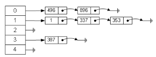
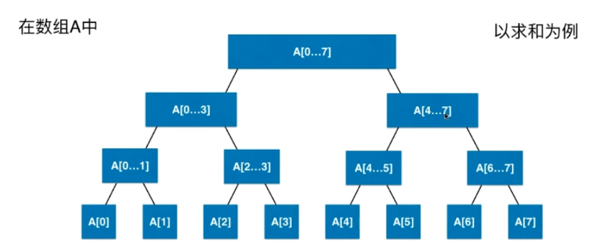
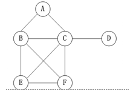
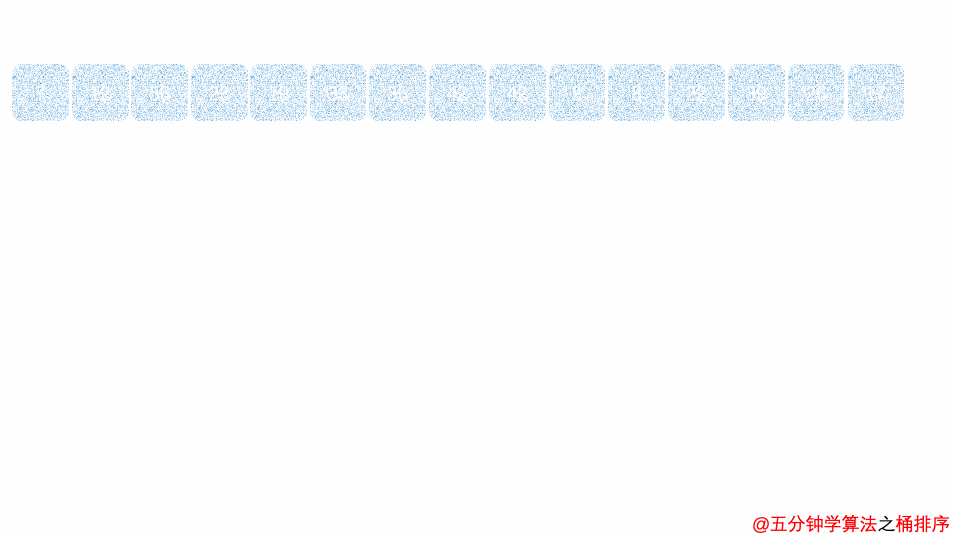
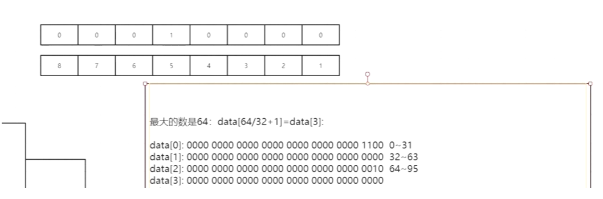

1、数据结构与算法


## 1、Hash Table (散列表) 介绍


### 1、什么是 Hash Table ?

也就是我们常说的哈希表.散列表其实就是数组支持按照下标随机访问数据的特性. 所以散列表其实就是数组的一种扩展.可以说没有数组就没有散列表.所以利用数组支持下标随机访问的时候. 时间复杂度是O(1)这一特性.就可以实现快速的判断元素是否存在序列当中

```java
int[] array = new int[100]; 
```

如上Java代码就是一个简单的散列表. ，下图就是个 Hash Table( 拉链法 )




### 2、什么是 Hash 函数？


根据关键码值(Key value)而直接进行访问的数据结构。也就是说，它通过把关键码值映射到表中一个位置来访问记录，以加快查找的速度、拿我们上面的例子来说我们对N取模，其实这就是一个散列函数。也就是大家经常看到的Hash(key)，这个Hash函数就是我们说的散列函数、简单来说就是对 N 取模 比如 

```java
Hash (10 % 3 = 1)  
```

就是一个简单的散列函数, 其实这就是一个散列删除.也就是大家熟知的Hash(Key). 这个Hash函数就是我们说的散列函数.我们通过它来计算散列的值的.重中之重.

特征(特性)

-   **确定性、冲突(碰撞)、不可逆、混淆性**


### 3、什么 是 Hash 冲突？


其实这是一个无法避免的原理. 比如MD5这些加密的Hash算法等等.某些情况下就会出现冲突.我们几乎无法找到一个完美的无冲突的散列函数

>   MD5算法也会有重复的. MD5 加密算法最大有128位. 2^128次方个数据.根据鸽巢原理.比如2个巢穴.3只鸟.其中一只鸟必然无法入巢. 所以.当数据达到 2^128次方 + 1 的时候. 就会存在Hash冲突


### 4、如何解决 Hash 冲突？


#### 1、线性寻址 又名 开放寻址


线性寻址：顾名思义.就是按照下标顺序存取数据.如果hash冲突.就往下一个下标查询.如果没有数据就存储.如果有就继续查找下一下标


面试问题思考：装不下怎么办：【自动扩容】 删除下标数据怎么办

>   【删除下标会有一个标志位：标志已删除的空位.如果是空位就自动往下查找或插入】

**如上其实只是简单的一种方式.还有一种完美的解决方式**


#### 2、链表（拉链法）


链路地址：其实就是使用链表. 链表法是一种更加常用的散列冲突解决办法.相对开放寻址.其方法要简单很多.

如下这个图. 在这个散列表中.每个key会对应一条链表.所有散列值相同的元素我们都放到相同槽位对应的链表中.


-   优点：使用简单. 插入和删除容易: 原因. 删除插入只需要改变链表指针. 就可以了.
-   缺点：遍历很慢.如果有10000条数据. 就要从链表头遍历到尾. **针对链表的查询慢的缺点. 树的结构就很好的解决了这个问题**

如下图所示


### 5、HashMap (Java)


>   由于链表这种结构确实存在一些缺点，所以在我们的JDK中对之进行了优化，引入了更高效的数据结构：红黑树

特性：

**初始大小**：HashMap默认的初始大小是16，这个默认值是可以设置的，如果事先知道大概的数据量有多大，可以通过修改默认初始大小减少动态扩容的次数，这样会大大提高HashMap的性能

**动态扩容**：最大装载因子默认是0.75，当HashMap中元素个数超过0.75*capacity（capacity表示散列表的容量）的时候，就会启动扩容每次扩容都会扩容为原来的两倍大小

>   HashMap处理Hash冲突的办法：

JDK1.7底层采用了链表法

JDK1.8中、为了对HashMap做进一步优化,我们引入了红黑树.而当链表长度太长（默认超过8）时,链表就转换为红黑树.我们可以利用红黑树快速增删改查的特点, 提高 HashMap 的性能. 当红黑树结点个数少于8个的时候, 又会将红黑树转化为链表.

因为在数据量较小的情况下、红黑树要维护平衡，比起链表来，性能上的优势并不明显


### 6、自定义 Hash Table 实现

```java
package lee.learning.video.datastructure.hash;

import java.util.TreeMap;

/**
 * 自定义的HashTable实现
 */
public class HashTable<K, V> {

    private static final int upperTol = 10;
    private static final int lowerTol = 2;
    private static final int initCapacity = 7;

    private TreeMap<K, V>[] hashtable;
    private int size;
    private int M;

    public HashTable(int M){
        this.M = M;
        size = 0;
        hashtable = new TreeMap[M];
        for(int i = 0 ; i < M ; i ++)
            hashtable[i] = new TreeMap<K, V>();
    }

    public HashTable(){
        this(initCapacity);
    }

    private int hash(K key){
        /**
         * & 0x7fffffff 是去除32bit的首位也就是符号位
         */
        return (key.hashCode() & 0x7fffffff) % M;
    }

    public void add(K key, V value){
        TreeMap<K, V> map = hashtable[hash(key)];
        // if(!hashtable[hash(key)].containsKey(key)){
        if(!map.containsKey(key)){
            map.put(key, value);
            size ++;

            if(size >= upperTol * M)
                resize(2 * M);
        }
    }

    public V remove(K key){
        V ret = null;
        TreeMap<K, V> map = hashtable[hash(key)];
        if(map.containsKey(key)){
            ret = map.remove(key);
            size --;

            if(size <= lowerTol * M && M > initCapacity)
                resize(M / 2);
        }
        return ret;
    }

    public void set(K key, V value){
        TreeMap<K, V> map = hashtable[hash(key)];
        if(!map.containsKey(key))
            throw new IllegalArgumentException(key + " doesn't exist!");

        map.put(key, value);
    }

    public boolean contains(K key){
        return hashtable[hash(key)].containsKey(key);
    }

    public V get(K key){
        return hashtable[hash(key)].get(key);
    }

    private void resize(int newM){
        TreeMap<K, V>[] newHashTable = new TreeMap[newM];
        for(int i = 0 ; i < newM ; i ++)
            newHashTable[i] = new TreeMap<K, V>();

        for(int i = 0 ; i < M ; i ++)
            for(K key: hashtable[i].keySet())
                newHashTable[hash(key)].put(key, hashtable[i].get(key));

        this.M = newM;
        this.hashtable = newHashTable;
    }
}
```


### 7、Hash 的应用


1.加密：MD5 哈希算法.存在密码冲突 128位的二进制串.可以表示2^128次.md5(md5(),”1231”) 不可逆

2.怎么判断视频是否是重复的？Md5（）；128位

3.相似性检测：论文检测，指纹算法、会把每个论文计算出一个指纹，汉明距离

4.负载均衡：nginx，2台服务器；可以根据ip计算hash，再做一个取模2运算

5.分布系统：数据分库问题、10亿的数据的搜索词.一台机器存不下.要分成10个文件 Hash(key)%10 = > 就可以知道
某个key在哪一个文件？扩大成数据库的 分表（10张表） id%10 =()

6.分布式存储的时候：问题来了 如果我加了一张表。原来是10张，现在是11张了 怎么办？要重新计算，分配的时候查询怎么办？数据量很大迁移的不是太多了吗？

7.查找算法:hashMap  查找

>   一致性Hash：哈希环

假设我们有k个表，数据的hash值范围：[0,Integer.max].我们把整个数据范围划分成n个区间（n个区间要远远大于我们的k）每一个表就是分配到n/k的区间. 当有新的表要来了，我们只需要将某几个小的区间数据迁移就可以了. 这是一个环形结构，其根本思想就是分段了


## 2、时间/空间复杂度入门


### 1、算法的特征


五个特征：有穷性、确定性、可行性、有输入、有输出.
设计原则：正确性、可读性、健壮性Bug：写代码很少有Bug.而且系统比较稳定.
高效率与低存储：内存+CPU 堆栈内存OOM. 内存占用最小.CPU占用最小.运算速度最快.


### 2、时间复杂度


时间复杂度：运行一个程序所花费的时间;  
时间复杂度表示方法：大O表示法. 例：

```apl
O(n), O(ologn), O(1), O(n^2), O(n+1), O(logn)
```

几种常见的时间复杂度分析：计算时间复杂度.往往是计算量比较大的.而且都是不确定的数.如果已经确定了.那么就不用计算时间复杂度了.也就是我们说的常量


#### 1、常数 O(1)：


>   表示常数.所有能确定的数字我们都用O(1)来表示. 哪怕是 O(100),O(10000)、**总之忽略常熟就是** => O(1)表示、

时间复杂度为 O(1) 的代码

```java
/**
 * 常数
 * 时间复杂度为 O(1). 因为代码只运行了1次
 */
public static void OOne(){
    int a = 10;
}
```

时间复杂度为 O(1) 的代码2

```java
/**
 * 时间复杂度同样为O(1)
 *   所有运行次数能用常数表示的都是O(1)
 */
public static void OOne1(){
    int a = 0;
    //那For循环运行了几次？四次.
    //因为如果不运行四次. 怎么知道 i < 3 了. 最后一次必然是跳出循环的那次.
    for (int i = 0; i < 3; i++) {
        a += 1; //本行循环运行了三次. 时间复杂度是多少？ O(3) ? O(N)? 都不是. 正解 => O(1)
    }
}
```


#### 2、对数 O(logn)：


>   **经典的二分查找时间复杂度就是O(logn). 比如100 里找69. 算法就是历次减半. (100 / 2) = 50等等...**

恶补数学公式定义(高一必修)：

>
>   对数公式： 如果 a ^ x = N ( a > 0, 且 a 不等 1 ),  则 x 叫做以 a 为底N的对数.[ 恍然大悟 ], 记作 x = log(a)(N),  其中要写于log右下. 其中 a 叫做对数的底, N 叫做真数. 通常我们将以10为底的对数叫做常用对数. 以e为底的对数称为自然对数.

下面的程序代码会演示说明什么是对数 O(logn)

```java
/**
 * 时间复杂度 O(logn)
 * @param n 表示变量.未知数
 */
public static void logarithm(int n){
    int i = 1;
    /**
     * 这里怎么计算时间复杂度？
     *   i 的值依次累加. 为 2、4、8、16、32 推出 => 2^1、2^2、2^3、2^4、2^x 次方等等...
     *
     * 进而推出=> 2^x=n 用对数函数表示为 x = log2n 
          继而=> 因为计算机里会忽略掉常数所以 x = logn 那么再用大O表示法就是O(logn)
     */
    while (i <= n){
        i = i * 2;
    }
}
```


#### 3、线性 O(N)：


>   时间复杂度为 O(N) 的代码并不复杂. 就是在O(1)的复杂度上.循环的次数不确定.是个变量.

```java
/**
 * 线性时间复杂度
 * 复杂度为 O(N)
 * @param n 变量未知数 n
 */
public static void on(int n){
    int a = 0;
    for (int i = 0; i < n; i++) {
        a = a + 1;
    }
}
```


#### 4、线性对数 O(nlogn)：


>   代码是怎么样的. 其实很简单. 就是在 O(logn) 的代码基础上.外层在加一层循环.如以下程序的时间复杂度就是O(nlogn)

```java
/**
 * 时间复杂度 O(nlogn)
 * @param n 表示变量.未知数
 */
public static void nlogarithm(int n){
    int i = 1;
    /**
     * 此处的时间复杂度就是 O(nlogn)
     * 在O(logn)的基础上又加了一层循环.
     */
    for (int j = 0; j < n; j++) {
        while (i <= n){
            i = i * 2;
        }
    }
}
```


#### 5、平方 O(n^2)：


>   这个时间复杂度怎么表示.其实就是在O(N)的基础上.外层继续加个循环
>
>   **著名编程算法. 冒泡排序的时间复杂度就是O(n^2).**

时间复杂度为 O( n ^ 2 ) 的代码

```java
/**
 * 这个时间复杂度为O(n^2)
 * @param n
 */
public static void onSquare(int n){
    int a = 0;
    /**
     * 这里怎么计算呢.外层循环是n次. 内存循环也是n次. 顾名思义 推出 => O(n^2)
     */
    for (int j = 0; j < n; j++) {
        for (int i = 0; i < n; i++) {
            a = a + 1;
        }
    }
}
```

以下代码也是  O( n ^ 2 ) . 恶补数学公式定义等差数列：

>   等差数列是指从第二项起，每一项与它的前一项的差等于同一个常数的一种数列，常用A、P表示。这个常数叫做等差数列的公差，公差常用字母d表示

```java
/**
 * 时间复杂度同样为 O(n^2)
 * @param n
 */
public static void onSquare1(int n){
    int a = 1;
    /**
     * 外层循环次数是确定的 O(n), 循环n次. 1、2、3、4、5、....n
     *   i = n 运行1次
     *   i = n - 1 运行2次
     *   .
     *   .
     *   i = 1 运行n次
     *   1、2、3 ... n 次 这里用到等差数列公式. n * (n + 1) / 2 => 忽略掉常数 => O(n ^ 2)
     */
    for (int i = 0; i < n; i++) {
        for (int j = i; j < n; j++) {
            a = a + 1;
        }
    }
}
```


#### 6、N次方 O(n^n)：

>   性能最差的算法、严重避免该算法的应用


#### 7、时间复杂度小结：


时间复杂度的意义：

>   怎么测试接口的性能.压测.冒烟.要依赖测试环境.流程长测试规模和数据不准确. 排序算法：123/321. 排序时间肯定是不一样的.应该自己用代码分析.也就是时间复杂度


时间复杂度如何来分析.

-   找 for while 递归. 而且要找循环量最大的那一段
-   找有网络请求(RPC、远程调用、分布式、数据库请求)的地方

时间复杂度阶梯图


>   几种常见的时间复杂度效率排序

 效率从最高到最低 [优化的目标就是往 O(1) 的方向接近.]

```apl
O(1) > O(logn) > O(n) > O(nlogn) > O(n^2) > O(n^x) 
```

其中如果是 

```apl
O(1) > O(logn) > O(n) > O(nlogn) 
```

效果都是很好的.几乎优化的空间不是很大


### 3、空间复杂度


空间复杂度：运行程序所需要的内存 OOM、如何找出程序的空间复杂度：开了空间的地方. 比如 数组.、链表、缓存对象、递归等等


## 2、进制 和 位运算符 (番外)


### 1、认识常用的进制


#### 1、Java针对整数常量提供4种形式


##### 1、二进制

>   二进制 ：由 0、1组成，以 0b 开头(大小写不敏感)
>
>   如下代码

```java
public static void main(String[] args){
    // 0b 表示定义二进制数据
    int num = 0b100;
    System.out.println(num);
}
```


##### 2、八进制

>   八进制 ：由 0....7组成，以 0 开头
>
>   如下代码

```java
public static void main(String[] args){
    // 0开头表示定义八进制数据
    int num = 0100;
    System.out.println(num);
}
```


##### 3、十进制

>   十进制 ：由 0....9组成，整数默认是十进制的 1、十进制就不需要演示了吧


##### 4、十六进制

>   十六进制：由 0.....0, a, b, c, d, e, f (大小写均可)，以 0x 开头

```java
public static void main(String[] args){
    // 0x开头表示定义十六进制数据
    int num = 0x100;
    System.out.println(num);
}
```


#### 2、Java中的数值开辟空间大小

```apl
1 byte = 8 bit                         byte  = 8 bit
1 kb = 1024 byte                       Int   = 4 byte = 32 bit
1 mb = 1024 kb                         float = 4 byte = 32 bit
1 gb = 1024 mb                         long  = 8 byte = 64 bit
                                       char  = 2 byte = 16 bit
```


#### 3、进制数据之间的计算


##### 1、二进制之间的计算

>   0b1101 + 0b1101010 等于多少呢？首先要进行对齐如下.

```java
          1  1  0  1
1  1  0   1  0  1  0
---------------------------
1  1  1   0  1  1  1

// 如上的计算步骤、如果上下位都位为1、那么 1 + 1 超出了二进制的表示范围就进1、和十进制一样.
```


##### 2、八进制之间的计算

>   01275 + 02476 等于多少呢？如下步骤计算

```java
            1  2  7  5
        0   2  4  7  6
---------------------------
        0   3  7  7  3
// 如上的计算步骤、如果上下位之和大于8就往前进位计算
```


##### 3、十六进制之间的计算

>   0x1ab + 0x99a 等于多少呢？
>
>   如右参考公式：a = 10 、b = 11、c = 12、d = 13、e = 14、f = 15

```java
                 1  a  b 
                 9  9  a
---------------------------
                 b  4  5
// 如上的计算步骤、b + a = 10 + 11 = 21、21 - 16(进制). = 5 进 1 、依次类推 最终得出 => 0xb45
```


### 2、进制转换基础


#### 1、进制转换必掌握的概念


>   **系数**：每一个位上的数字（157，个位的系数是7；十位的系数是5；百位的系数是1）
>   **基数**：例如（十进制的157）的基数是10. **总结-几进制基数就是几**
>   **权**：一个数据从右往左, 从0开始、对每一位数据进行编号、那么这个编号就是这个位置上的数字的权.  如下

```java
     1 5 7
-------------
//权 2 1 0

```


#### 2、任意进制到十进制的转换


>   规律：这个数据的各个位上的系数乘以基数的权次幂相加的和


##### 1、十进制 => 十进制

```apl
157 = 7 * 10 ^ 0 + 5 * 10 ^ 1 + 1 * 10 ^ 2 = 7 + 50 + 100 = 157
```

##### 2、二进制 => 十进制

```apl
0b110 = 0 * 2 ^ 0 + 1 * 2 ^ 1 + 1 * 2 * 2 = 0 + 2 + 4 = 6
```

##### 3、八进制 => 十进制

```apl
0110 = 0 * 8 ^ 0 + 1 * 8 ^ 1 + 1 * 8 ^ 2 = 0 + 8 + 64 = 72
```

##### 4、十六进制 => 十进制

```apl
0xABC = 12 * 16 ^ 0 + 11 * 16 ^ 1 + 10 * 16 ^ 2 = 12 + 176 + 2560 = 2784
```


#### 3、十进制到任意进制的转换


>   规律：**除基数取余数、直到商为0、余数反转.** 
>
>   把10进制的 100 分别转为 二进制、八进制、十六进制

##### 1、十进制 => 二进制

```java
100 / 2 = 50 ..... 0
 50 / 2 = 25 ..... 0
 25 / 2 = 12 ..... 1
 12 / 2 = 06 ..... 0
 06 / 2 = 03 ..... 0
 03 / 2 = 01 ..... 1
 01 / 2 = 00 ..... 1
// 最终得出 1100100
```

##### 2、十进制 => 八进制

```java
100 / 8 = 12 ..... 4
 12 / 8 = 01 ..... 4
 01 / 8 = 00 ..... 1
// 最终得出 144
```

##### 3、十进制 => 十六进制

```java
100 / 16 = 6 ..... 4
 06 / 16 = 0 ..... 6
// 最终得出 64
```

##### 4、习题：十进制1000 => 十六进制

```java
1000 / 16 = 62 ..... 8
  62 / 16 = 03 ..... e
  03 / 16 = 00 ..... 3
// 最终得出 0x3e8
```


#### 4、十进制和二进制的快速转换


##### 1、BCD码

>   BCD码（Binary-Coded Decimal‎）用 4 位二进制数来表示 1 位十进制数中的 0~9 这 10 个数码、是一种二进制的数字编码形式用二进制编码的十进制代码

##### 2、8421码

>   8421 码是中国的叫法、8421 其实是 BCD 码中最常用的一种. 这种编码方式中每一位的1都是代表一个固定数值. 在把每一位的二进制 1 代表的十进制的数加起来 (二进制 0 就是 0 ). 得到的结果就是它代表的十进制数.


##### 3、BCD 码展示

```ABAP
二进制：     1      1        1         1        1        1        1        1
十进制：    128     64       32        16       8        4        2        1
```


##### 4、BCD 码实战


###### 1、二进制 11011 快转 十进制

>   思路：=> 16 + 8 + 0 + 2 + 1  = 27


###### 2、十进制 100 快转 二进制

>   思路：=> 64 + 32 + 4 = 1101100


### 3、Java 位运算符


>   位指的是二进制或者是bit位


#### 1、按位与 ( & )：

>   [ 相同位数同为1的时候才为1 ]
>
>   3 & 4 结果是多少？(在进行位运算的时候要把数据转换为二进制位、并且全都是二进制补码形式)

-   在 java 中 int = 8 byte = 32 bit.
-   3 的二进制：  0000 0000 0000 0000 0000 0000 0000 0011
-   4 的二进制：  0000 0000 0000 0000 0000 0000 0000 0100
-   3 和4按位与：0000 0000 0000 0000 0000 0000 0000 0000

代码输出如下：


#### 2、按位或 ( | )：

>   [ 相同位只要有一个为1结果就为1 ]
>
>   3 | 4 结果是多少？(在进行位运算的时候要把数据转换为二进制位、并且全都是二进制补码形式)

-   3的二进制：  0000 0000 0000 0000 0000 0000 0000 0011
-   4的二进制：  0000 0000 0000 0000 0000 0000 0000 0100
-   3和4按位或：0000 0000 0000 0000 0000 0000 0000 0111

代码输出如下：


#### 3、按位异或 ( ^ )：

>   [ 相同位两个不一样的时候才为1、 如果一样为 0  ]
>
>   3 ^ 4 结果是多少？(在进行位运算的时候要把数据转换为二进制位、并且全都是二进制补码形式)

-   3的二进制：    0000 0000 0000 0000 0000 0000 0000 0011
-   4的二进制：    0000 0000 0000 0000 0000 0000 0000 0100
-   3^4按位异或：0000 0000 0000 0000 0000 0000 0000 0111

代码输出如下：


**规律：如果一个数据异或两次值不变. 比如 a ^ b ^ b = a. 一般应用在传输加密上.**

>   面试题：
>
>   用异或做两个变量值的交换、变量值交换大多用在排序算法上、这里为排序算法多贡献一种交换方式 [第三变量交换、四则运算、异或交换]

两个变量交换的方式：

-   中间变量交换
-   四则运算交换

```java
public static void main(String[] args){
    
    int a = 10;
    int b = 20;
    
    a = a + b; // a = (a)10 + (b)20
    b = a - b; // b = (a)30 - (b)20
    a = a - b; // a = (a)30 - (b)10
    
    System.out.println("a：" + a);     // 输出 20
    System.out.println("b：" + b);     // 输出 10
}
```

-   异或运算符交换

```java
public static void main(String[] args){
    
    int a = 10;
    int b = 20;
    
    a = a ^ b;
    b = a ^ b;
    a = a ^ b;
    
    System.out.println("a：" + a);     // 输出 20
    System.out.println("b：" + b);     // 输出 10
}
```


#### 4、按位取反 ( ~ )：

>   单目运算：~3 结果是多少？(在进行位运算的时候要把数据转换为二进制位、并且全都是二进制补码形式)

-   3的二进制(原码形式) 0000 0000 0000 0000 0000 0000 0000 0011
-   对3的二进制取反:      1111 1111 1111 1111 1111 1111 1111 1100   //补码负数：首位为符号位 0 正数 1 负数
-   已知补码求反码:         1111 1111 1111 1111 1111 1111 1111 1011  //补码 -1 之后取反, 取反的过程中符号位不变
-   补码 -1 后取反(原码): 1000 0000 0000 0000 0000 0000 0000 0100

代码输出如下：


#### 5、左移 ( << )：

>   [ 让操作数乘以2的n次幂、n 就是左移的位数 ] 为什么是2的n 次幂、因为操作的位是二进制的

-   3的二进制：    0000 0000 0000 0000 0000 0000 0000 0011
-   左移两位:         0000 0000 0000 0000 0000 0000 0000 1100   左移后最前面被挤掉两位、右边在补零 

代码输出如下


#### 6、右移 ( >> )：


>   [ 让操作数除以2的n次幂、n 就是右移的位数 ]

**A、正数的右移操作 32 >> 2 的结果是多少？**

-   32的二进制：  0000 0000 0000 0000 0000 0000 0010 0000
-   右移两位:          0000 0000 0000 0000 0000 0000 0000 1000

右移两位右边挤掉两位、然后左边在用符号位补全、注意符号位为1用1补、0就用0补 


**B、负数的右移操作 -32 >> 2 的结果是多少？**

```java
1000 0000 0000 0000 0000 0000 0010 0000 // -32的二进制 原码
1111 1111 1111 1111 1111 1111 1101 1111 // 原码取反得出反码
1111 1111 1111 1111 1111 1111 1110 0000 // 在 +1 得出补码
```

得出补码后右移：     

```apl
1111 1111 1111 1111 1111 1111 1111 1000
```

```java
1111 1111 1111 1111 1111 1111 1111 0111 // 然后 - 1 得出反码
1000 0000 0000 0000 0000 0000 0000 1000 // 反码取反得出原码
```

代码输出如下


#### 7、无符号右移 (>>>)：


## 3、常用数据结构介绍


### 1、数组 (Array)


#### 1、什么是数组 ？


##### 1、定义


>   有序的元素序列. 若将有限个类型相同的变量的集合命名. 那么这个名称为数组名. 
>
>   组成数组的各个变量称为数组的分量. 也成为数组的元素. 又是也成为数组的下标. 用去区分数组的各个元素的数字编号称为下标. 这些无需排列的同类数据元素的集合称为数组


数组(索引)可以是有语意的

-   比如数组的索引代表了第几个学生的成绩、scores [2] 就代表了 第三个学生的成绩

也可以是没有语意的


##### 2、特点

1.  
    数组是相同数据类型的元素的集合
2.  数组中各个元素存储是有先后顺序的.它们在内存中按照这个先后顺序连续存放在一起.
3.  数组元素用整个的名字和它自己在数组中的顺序位置来表示. 比如：a[0]. 就表示名字为a 的数组中的第一个元素.
4.  **随机访问**：数组是连续的内存空间和相同类型的数据.有利有弊.数组删除插入数据.为了保证数据的连续性.就需要大量的数据搬移工作.但是查询效率很快.

##### 3、表现形式


一维数组：如以下代码的声明.

```java
int array[] = new int[10];
```

二维多维数组：如以下代码

```java
//那以下代码的内存空间怎么计算：
//第一个 10 * 20 就是开辟的内存空间. 第二个：10 * 20 * 13 就是开辟的内存空间
int array[][] = new int[10][20];
int sum[][][] = new int[10][20][13];
```


##### 4、数组小结


**思考**：ArrayList 和 数组. 本质是一样的. 都是数组.ArrayList 是 JDK封装了.不需要管扩容等操作.数组的话就要自己动手实现.

**两者之间如何选择**：不知道数据量大小的. 肯定用 ArrayList. 如果知道数据量大小又非常关注查询性能.那就选用数组


##### 5、稀疏数组


一般是针对多维数组. 如下数组矩阵：

```apl
1 2 0 0
2 0 1 0
0 0 1 0
```

如上数据数组一共会开辟 3 * 4 个空间. 稀疏数组真正存的数据远远小于我们开辟的空间. 这种情况. 往往会用链表来代替


##### 6、堆栈内存：

>   概念：Java分为两种内存. 堆 和 栈 内存.什么是堆内存？就是存放new出来的对象和数组. 什么是栈内存? 引用变量. 堆栈都是Java用来存储数据的地方.
>
>   堆栈的区别：1、栈的速度快. 2、栈内存的数据是可以共享的.主要存一些基本数据.

例如以下解析

```java
// 在栈中创建 array 变量. 然后给 array 赋值. 
// 先不会创建一个10而是现在栈中找有没有. 如果有直接指向它. 如果没有就创建一个10进来.
int array = 10;
```


#### 2、数组的寻址公式


##### 1、一维数组寻址公式：

```java
// ==> location = init_location[初始内存地址] + index(数组的下标) * Size(数据的长度)
int[] ages = new int[100];
```


##### 2、二维数组寻址公式：

```apl
例：1  2  3
如：4  5  6
```

以上是一个二维数组. 那么一切高维数组都是可以转化为一维数组的.

>   比如以上数据转化为一维数组就是 ==> 1  2  3  4  5  6 => 那么 4 的下标在二维数组里面是 ( 1 , 0 ) => 在一维数组里面是第 3 个 ==> i * n(一维的长度) + j(二维所在的列) ==> 1 * 3 + 0 = 3 ==> 公式套入一维为 

```apl
location = init_location + ( i * n + j ) * size
```


#### 3、ArrayList 代码实现

```java
package lee.learning.video.datastructure.array;

public class Array<T> {

    private T[] data;
    private int size;

    // 构造函数，传入数组的容量capacity构造Array
    public Array(int capacity){
        data = (T[])new Object[capacity];
        size = 0;
    }

    // 无参数的构造函数，默认数组的容量capacity=10
    public Array(){
        this(10);
    }

    public Array(T[] arr){
        data = (T[])new Object[arr.length];
        for(int i = 0 ; i < arr.length ; i ++)
            data[i] = arr[i];
        size = arr.length;
    }

    // 获取数组的容量
    public int getCapacity(){
        return data.length;
    }

    // 获取数组中的元素个数
    public int getSize(){
        return size;
    }

    // 返回数组是否为空
    public boolean isEmpty(){
        return size == 0;
    }

    // 在index索引的位置插入一个新元素e
    public void add(int index, T e){

        if(index < 0 || index > size)
            throw new IllegalArgumentException("Add failed. Require index >= 0 and index <= size.");

        if(size == data.length)
            resize(2 * data.length);

        for(int i = size - 1; i >= index ; i --)
            data[i + 1] = data[i];

        data[index] = e;

        size ++;
    }

    // 向所有元素后添加一个新元素
    public void addLast(T e){
        add(size, e);
    }

    // 在所有元素前添加一个新元素
    public void addFirst(T e){
        add(0, e);
    }

    // 获取index索引位置的元素
    public T get(int index){
        if(index < 0 || index >= size)
            throw new IllegalArgumentException("Get failed. Index is illegal.");
        return data[index];
    }

    // 修改index索引位置的元素为e
    public void set(int index, T e){
        if(index < 0 || index >= size)
            throw new IllegalArgumentException("Set failed. Index is illegal.");
        data[index] = e;
    }

    // 查找数组中是否有元素e
    public boolean contains(T e){
        for(int i = 0 ; i < size ; i ++){
            if(data[i].equals(e))
                return true;
        }
        return false;
    }

    // 查找数组中元素e所在的索引，如果不存在元素e，则返回-1
    public int find(T e){
        for(int i = 0 ; i < size ; i ++){
            if(data[i].equals(e))
                return i;
        }
        return -1;
    }

    // 从数组中删除index位置的元素, 返回删除的元素
    public T remove(int index){
        if(index < 0 || index >= size)
            throw new IllegalArgumentException("Remove failed. Index is illegal.");

        T ret = data[index];
        for(int i = index + 1 ; i < size ; i ++)
            data[i - 1] = data[i];
        size --;
        data[size] = null; // loitering objects != memory leak

        /**
         * 解决复杂度震荡问题：
         *  出现的问题的原因：我们添加元素后数组刚好需要扩容 O(n)、
         *  然后我们紧接着又 removeLast 的时候、又进行了 resize、缩容过于着急
         * 解决方案：Lazy resize
         *  所以我们进行如下处理、当删除元素删除的只剩整个容器的 1/4 的时候，在进行缩容
         */
        if(size == data.length / 4 && data.length / 2 != 0)
            resize(data.length / 2);
        return ret;
    }

    // 从数组中删除第一个元素, 返回删除的元素
    public T removeFirst(){
        return remove(0);
    }

    // 从数组中删除最后一个元素, 返回删除的元素
    public T removeLast(){
        return remove(size - 1);
    }

    // 从数组中删除元素e
    public void removeElement(T e){
        int index = find(e);
        if(index != -1)
            remove(index);
    }

    public void swap(int i, int j){

        if(i < 0 || i >= size || j < 0 || j >= size)
            throw new IllegalArgumentException("Index is illegal.");

        T t = data[i];
        data[i] = data[j];
        data[j] = t;
    }

    @Override
    public String toString(){

        StringBuilder res = new StringBuilder();
        res.append(String.format("Array: size = %d , capacity = %d\n", size, data.length));
        res.append('[');
        for(int i = 0 ; i < size ; i ++){
            res.append(data[i]);
            if(i != size - 1)
                res.append(", ");
        }
        res.append(']');
        return res.toString();
    }

    // 将数组空间的容量变成newCapacity大小
    private void resize(int newCapacity){

        T[] newData = (T[])new Object[newCapacity];
        for(int i = 0 ; i < size ; i ++)
            newData[i] = data[i];
        data = newData;
    }
}
```


### 2、链表 (LinkList)


#### 1、什么是链表


链表通过指针将一组零散的内存块串联在一起, 其中. 我们把内存块称为链表的“结点”.  为了将所有的节点串联起来. 
每个链表的结点除了存储数据之外. 还需要记录链表上的下一个节点的地址. 

>   每一个结点包括 data(数据区) + next(下一个结点的内存地址). 

如下图所示


#### 2、链表的特点


-   不需要连续的内存空间
-   有指针引用


#### 3、常见的链表结构


##### 1、单向链表

>   从单链表图中. 可以发现有两个结点是比较特殊的. 分别是链表的第一个结点和最后一个结点.我们把第一个结点叫做头结点、尾部结点就叫尾结点.

-   其中头结点用来记录链表的基地址.有了它.我们就可以从第一个遍历得到整条链表.
-   而尾部结点特殊的地方是. 指针不是指向下一个结点. 而是指向一个空地址NULL


##### 2、双向链表

>   顾名思义：它支持两个方向，每个结点不只有一个后继指针 next 指向后面的结点、还有一个前驱指针 prev 指向前面的结点、双向链表**需要额外的两个空间**来存储**后继结点和前驱结点的地址**.

所以.双向链表比单向链表更占用空间. 但是可以支持双向遍历. 这样也带来了双向链表的操作灵活性


##### 3、循环链表

>   尾部的 next 指针指向头部. 如下图


##### 4、双向循环链表

>   即尾部的下一个指针指向头部. 头部的前一个指针指向尾部
>
>   MySql 的索引数据结构就是双向循环链表和 B+Tree 的结合版、B+Tree、如下图所示


##### 5、链表小结：

>   链表的插入无需像数组一样移动下标. 链表的插入和删除只需要改便前后的指针即可：如下图


#### 4、链表的代码实现


##### 1、链表接口规范

```java
package lee.learning.video.datastructure.leeinterface;

/**
 * 链表的接口 (index 从 0 开始)
 * @param <T> 泛型
 */
public interface LeeLinkedList<T> {
    /**
     * 向链表中插入一个元素
     */
    void add(T t);
    /**
     * 向链表中的指定位置插入一个元素
     */
    void add(int index, T t);
    /**
     * 向链末尾插入一个元素
     */
    void addLast(T t);
    /**
     * 向链表头部插入一个元素
     */
    void addFirst(T t);
    /**
     * 获取链表中指定位置的元素
     */
    T get(int index);
    /**
     * 获取链表中最后一个元素
     */
    T getLast();
    /**
     * 获取链表中末尾的元素
     */
    T getFirst();
    /**
     * 移除链表中指定的元素
     */
    void remove(T t);
    /**
     * 移除链表中指定位置的元素
     */
    void remove(int index);
    /**
     * 移除链表中末尾元素
     */
    void removeLast();
    /**
     * 移除链表中首位元素
     */
    void removeFirst();
    /**
     * 清空链表数据
     */
    void clear();
    /**
     * 获取链表中元素的数量
     */
    int getSize();
    /**
     * 打印链表中的元素
     */
    void print();
    /**
     * 打印链表中末尾元素
     */
    void printLast();
    /**
     * 打印链表中首位元素
     */
    void printFirst();
}
```


##### 2、单向链表的代码

```java
package lee.learning.video.datastructure.linkedlist;

import lee.learning.video.datastructure.leeinterface.LeeLinkedList;

/**
 * 单向链表的实现
 */
public class LinkedList<T> implements LeeLinkedList<T> {
    /* 链表的大小*/
    private int size;
    /* 链表头结点*/
    private Node<T> head;
    /* 链表尾结点*/
    private Node<T> tail;

    public LinkedList(){
        size = 0;
        head = null;
        tail = null;
    }

    /* 向链表中插入元素*/
    public void add(T t) { addLast(t); }

    /**
     * 将元素插入链表中的指定位置
     */
    public void add(int index, T t) {

        //情况1、插入位置正好是链表末尾下一个位置
        if(index == size ) addLast(t);
        else
        {
            Node<T> newNode = new Node<>(t);
            Node<T> curr = getAndCheck(index);
            Node<T> lastNode = getNode(index);
            /**
             * 情况2、插入的位置是头部、或者是头也是尾部.
             * 直接添加到首位
             */
            if(curr == head) addFirst(t);
            //情况3、插入的是中间
            else if(curr != head && curr != tail)
            {
                newNode.next = curr;
                lastNode.next = newNode;
                size++;
            }
            //情况4、插入的是尾部
            else if(curr == tail){
                lastNode.next = newNode;
                newNode.next = tail;
                size++;
            }
        }
    }

    /**
     * 将元素插入链表尾部
     */
    public void addLast(T t) {
        if(head == null) addFirst(t);
        else
        {
            Node<T> newNode = new Node(t);
            tail.next = newNode;
            tail = newNode;
            size++;
        }
    }

    /**
     * 将元素插入链表头部
     */
    public void addFirst(T t) {
        Node<T> newNode = new Node(t);

        if(head == null) tail = newNode;
        else {
            newNode.next = head;
        }
        head = newNode;
        size++;
    }

    public T get(int index) {
        if(index > size - 1){
            throw new ArrayIndexOutOfBoundsException();
        }
        Node<T> curr = head;
        //时间查到复杂度O(n)
        for (int i = 0; i < index; i++) {
            curr = curr.next;
        }
        return curr.value;
    }

    /* 内部用*/
    private Node<T> getNode(int index){
        if(index > size - 1){
            throw new ArrayIndexOutOfBoundsException();
        }
        Node<T> curr = head;
        //时间查到复杂度O(n)
        for (int i = 0; i < index - 1; i++) {
            curr = curr.next;
        }
        return curr;
    }

    public T getLast() {
        checkLinkedSize();
        return tail.value;
    }

    public T getFirst() {
        checkLinkedSize();
        return head.value;
    }

    public void remove(T t) {
        checkLinkedSize();

        int index = 0;
        if(t == null){
            for (Node<T> v = head; v != null; v = v.next){
                if(v.value == null){
                    removeCondition(index, v);
                    break;
                }
                index++;
            }
        }
        else{
            for (Node<T> v = head; v != null; v = v.next){
                if(v.value == t){
                    removeCondition(index, v);
                    break;
                }
                index++;
            }
        }
    }

    private void removeCondition(int index, Node v) {
        //情况1、remove的值是头既是尾
        if(v == head && v == tail)  clear();

        //情况2、remove的值在头部
        else if(v == head && v != tail)
        {
            head = head.next;
            size--;
        }
        //情况3、remove的值在中间
        else if(v != head && v != tail)
        {
            //获取要删除的前一个元素的节点
            Node<T> lastNode =  getNode(index);
            lastNode.next = v.next;
            v.next = null;
            size--;
        }
        //情况4、remove的值在尾部
        else removeLast();
    }

    public void remove(int index) {
        Node<T> curr = getAndCheck(index);

        //是头是尾
        if(curr == head && curr == tail)  clear();
        //仅是头部
        else if(curr == head && curr != tail)
        {
            removeFirst();
        }
        //在中间
        else if(curr != head && curr != tail)
        {
            Node<T> lastNode = getNode(index);
            lastNode.next = curr.next;
            curr.next = null;
            size--;
        }
        //在尾部
        else  removeLast();
    }

    private Node<T> getAndCheck(int index) {
        checkLinkedSize();
        if(index > size - 1){
            throw new IndexOutOfBoundsException();
        }

        Node<T> curr = head;
        for (int i = 0; i < index; i++) {
            curr = curr.next;
        }
        return curr;
    }

    public void removeLast() {
        checkLinkedSize();

        if(head == tail) clear();
        else
        {
            Node<T> lastNode = getNode(size - 1);
            if(lastNode == head){
                head = lastNode;
                head.next = null;
                tail = lastNode;
            }
            else
            {
                lastNode.next = null;
                tail = lastNode;
            }
            size--;
        }
    }

    public void removeFirst() {
        checkLinkedSize();

        if(head == tail) clear();
        else
        {
            head = head.next;
            size--;
        }
    }

    public void clear() {
        head = null;
        tail = null;
        size = 0;
    }

    private void checkLinkedSize(){
        if(head == null || size == 0){
            throw new RuntimeException("The linked list has no data");
        }
    }

    public int getSize() {
        return size;
    }

    public void print() {
        if(head != null){
            for (Node v = head; v != null; v = v.next) {
                System.out.println("Value: " + v.value);
            }
            System.out.println("------------------------------------");
            printFirst();
            System.out.println("----------------");
            printLast();
            System.out.println("----------------");
            System.out.println("Size: " + size);
        }
    }

    public void printLast() {
        if(head != null) System.out.println("Last Value: " + tail.value);
    }

    public void printFirst() {
        if(head != null) System.out.println("First Value: " + head.value);
    }
}

/**
 * 单向链表的节点
 */
class Node<T> {
    protected T value;
    protected Node<T> next;

    public Node(T value){
        this.value = value;
    }
}
```


##### 3、单向链表改进版

>   * 虚拟头结点：
>   *  解决添加到指定位置元素时、需要取到前一个节点、但是如果是头结点
>   *  就没有前一个节点，这里的虚拟节点可以解决逻辑分叉、避免写更多代码

```java
package lee.learning.video.datastructure.linkedlist;

/**
 * 链表的第二种实现
 */
public class LinkedList1<T> {

    private class Node{
        public T e;
        public Node next;

        public Node(T e, Node next){
            this.e = e;
            this.next = next;
        }

        public Node(T e){
            this(e, null);
        }

        public Node(){
            this(null, null);
        }

        @Override
        public String toString(){
            return e.toString();
        }
    }

    /**
     * 虚拟头结点：
     *  解决添加到指定位置元素时、需要取到前一个节点、但是如果是头结点
     *  就没有前一个节点，这里的虚拟节点可以解决逻辑分叉、避免写更多代码
     */
    private Node dummyHead;
    private int size;

    public LinkedList1(){
        dummyHead = new Node();
        size = 0;
    }

    // 获取链表中的元素个数
    public int getSize(){
        return size;
    }

    // 返回链表是否为空
    public boolean isEmpty(){
        return size == 0;
    }

    // 在链表的index(0-based)位置添加新的元素e
    // 在链表中不是一个常用的操作，练习用：）
    public void add(int index, T e){

        if(index < 0 || index > size)
            throw new IllegalArgumentException("Add failed. Illegal index.");

        Node prev = dummyHead;
        for(int i = 0 ; i < index ; i ++)
            prev = prev.next;

        prev.next = new Node(e, prev.next);
        size ++;
    }

    // 在链表头添加新的元素e
    public void addFirst(T e){
        add(0, e);
    }

    // 在链表末尾添加新的元素e
    public void addLast(T e){
        add(size, e);
    }

    // 获得链表的第index(0-based)个位置的元素
    // 在链表中不是一个常用的操作，练习用：）
    public T get(int index){

        if(index < 0 || index >= size)
            throw new IllegalArgumentException("Get failed. Illegal index.");

        Node cur = dummyHead.next;
        for(int i = 0 ; i < index ; i ++)
            cur = cur.next;
        return cur.e;
    }

    // 获得链表的第一个元素
    public T getFirst(){
        return get(0);
    }

    // 获得链表的最后一个元素
    public T getLast(){
        return get(size - 1);
    }

    // 修改链表的第index(0-based)个位置的元素为e
    // 在链表中不是一个常用的操作，练习用：）
    public void set(int index, T e){
        if(index < 0 || index >= size)
            throw new IllegalArgumentException("Update failed. Illegal index.");

        Node cur = dummyHead.next;
        for(int i = 0 ; i < index ; i ++)
            cur = cur.next;
        cur.e = e;
    }

    // 查找链表中是否有元素e
    public boolean contains(T e){
        Node cur = dummyHead.next;
        while(cur != null){
            if(cur.e.equals(e))
                return true;
            cur = cur.next;
        }
        return false;
    }

    // 从链表中删除index(0-based)位置的元素, 返回删除的元素
    // 在链表中不是一个常用的操作，练习用：）
    public T remove(int index){
        if(index < 0 || index >= size)
            throw new IllegalArgumentException("Remove failed. Index is illegal.");

        // T ret = findNode(index).e; // 两次遍历

        Node prev = dummyHead;
        for(int i = 0 ; i < index ; i ++)
            prev = prev.next;

        Node retNode = prev.next;
        prev.next = retNode.next;
        retNode.next = null;
        size --;

        return retNode.e;
    }

    // 从链表中删除第一个元素, 返回删除的元素
    public T removeFirst(){
        return remove(0);
    }

    // 从链表中删除最后一个元素, 返回删除的元素
    public T removeLast(){
        return remove(size - 1);
    }

    // 从链表中删除元素e
    public void removeElement(T e){

        Node prev = dummyHead;
        while(prev.next != null){
            if(prev.next.e.equals(e))
                break;
            prev = prev.next;
        }

        if(prev.next != null){
            Node delNode = prev.next;
            prev.next = delNode.next;
            delNode.next = null;
            size --;
        }
    }

    @Override
    public String toString(){
        StringBuilder res = new StringBuilder();

        Node cur = dummyHead.next;
        while(cur != null){
            res.append(cur + "->");
            cur = cur.next;
        }
        res.append("NULL");

        return res.toString();
    }

    public static void main(String[] args) {
        LinkedList1 linkedList = new LinkedList1();
        linkedList.addLast(1);
        linkedList.addLast(2);
        linkedList.addLast(3);
        linkedList.addLast(4);

        System.out.println(linkedList.toString());
    }
}
```


##### 4、双向链表的代码

```java
package lee.learning.video.datastructure.linkedlist;

/**
 * 双向链表的实现
 *   可以改进泛型结构
 */
public class DoubleLinkedList {

    private int size;
    /* 双向链表头结点*/
    private DNode head;
    /* 双向链表尾结点*/
    private DNode tail;

    public int get(int index){
        checkLinkedListSize();
        if(index > size - 1){
            throw new ArrayIndexOutOfBoundsException();
        }

        DNode currentNode = head;
        for (int i = 0; i < index; i++) {
            currentNode = currentNode.next;
        }

        return currentNode.value;
    }

    /**
     * 将值插入双向链表尾部
     * @param value
     */
    public void add(int value){
        DNode newNode = new DNode(value);

        if(head == null) head = newNode;
        else
        {
            tail.next = newNode;
            newNode.prev = tail;
        }
        size++;
        tail = newNode;
    }

    /**
     * 将值插入双向链表头部
     * @param value
     */
    public void addHead(int value){
        DNode newNode = new DNode(value);

        //如果头部为空. 是头既是尾直接赋值.
        if(head == null) tail = newNode;
        else
        {
            newNode.next = head;
            head.prev = newNode;
        }
        size++;
        head = newNode;
    }

    /**
     * 将值插入双向链表的指定位置
     * @param index 要插入的位置
     * @param value 值
     */
    public void addLocation(int index, int value){

        /**
         * 情况1、链表为空.直接调用add方法插入头部
         * 情况2、插入位置大于链表位置. 调用add方法添加到链表尾部
         */
        if(head == null || index > size - 1) add(value);
        else
        {
            DNode currentNode = head;
            //循环到要插入位置的对象
            for (int i = 0; i < index; i++) currentNode = currentNode.next;

            DNode newNode = new DNode(value);
            //情况3、插入位置是链表头部
            if(currentNode == head && currentNode != tail){
                currentNode.prev = newNode;
                newNode.next = currentNode;
                head = newNode;
            }
            //情况4、插入位置是链表尾部
            else if(currentNode == tail && currentNode != head){
                newNode.next = currentNode;
                newNode.prev = currentNode.prev;
                currentNode.prev.next = newNode;
                currentNode.prev = newNode;
            }
            //情况5、插入位置是链表头部也是尾部
            else if(currentNode == head && currentNode == tail){
                newNode.next = currentNode;
                currentNode.prev = newNode;
                head = newNode;
                tail = currentNode;
            }
            //情况6(最后一种)、插入位置是链表中间
            else{
                newNode.next = currentNode;
                newNode.prev = currentNode.prev;
                currentNode.prev.next = newNode;
                currentNode.prev = newNode;
            }
            size++;
        }
    }

    /**
     * 从链表中删除掉一个值
     */
    public void remove(int value){
        checkLinkedListSize();

        for (DNode c = head; c != null ; c = c.next) {
            //实现所有情况防止空指针
            if(value == c.value){
                removeTheSituation(c);
                size--;
                break;
            }
        }
    }

    /* 删除的几种情况*/
    private void removeTheSituation(DNode c) {
        //情况1、该节点是头部
        if(c == head && c != tail){
            head = c.next;
            c.next.prev = null;
            c.next = null;
        }
        //情况2、该节点是尾部
        else if(c == tail && c != head){
            tail = c.prev;
            c.prev.next = null;
            c.prev = null;
        }
        //情况3、该节点是头既是尾
        else if(c == head && c == tail){
            head = null;
            tail = null;
        }
        //情况4(最后一种)、该节点是中间
        else{
            c.prev.next = c.next;
            c.next.prev = c.prev;
        }
    }

    /**
     * 移除链表中指定位置的元素
     * @param index
     */
    public void removeIndex(int index){
        checkLinkedListSize();
        if(index > size - 1){
            throw new ArrayIndexOutOfBoundsException();
        }

        DNode currentNode = head;
        //循环确定移除的位置
        for (int i = 0; i < index; i++) currentNode = currentNode.next;

        removeTheSituation(currentNode);
        size--;
    }

    /**
     * 移除链表头部的元素
     */
    public void removeHead(){
        checkLinkedListSize();

        //情况1、是头既是尾
        if(head == tail) clear();
        //情况2、仅是头
        else
        {
            DNode temp = head;
            head.next.prev = null;
            head = head.next;
            temp.next = null;
            size--;
        }
    }

    /**
     * 清空链表数据
     */
    public void clear(){
        size = 0;
        head = null;
        tail = null;
    }

    private void checkLinkedListSize() {
        if(size == 0 || head == null){
            throw new RuntimeException("The linked list has no data");
        }
    }

    public void printAll(){
        print();
        System.out.println("----------");
        print1();
        System.out.println("---------------------");
        printHead();
        printTail();
        System.out.println("----------");
        System.out.println("Size: " + size);
    }

    /* 正向打印双向链表数据*/
    public void print(){
        for (DNode c = head; c != null ; c = c.next) {
            System.out.println("Value : " + c.value);
        }
    }

    /* 逆向打印双向链表数据*/
    public void print1(){
        for (DNode c = tail; c != null ; c = c.prev) {
            System.out.println("Value : " + c.value);
        }
    }

    /*打印链表头部*/
    public void printHead(){
        if(head != null)
            System.out.println("Head : " + head.value);
    }

    /*打印链表尾部*/
    public void printTail(){
        if(tail != null)
            System.out.println("Tail : " + tail.value);
    }
}

/**
 * 双向链表的节点
 */
class DNode {
    protected int value;
    protected DNode prev;   //双向链表前一个指针
    protected DNode next;   //双向链表后面的指针

    public DNode(int value){
        this.value = value;
    }
}
```


### 3、栈 (Stock)


#### 1、什么是栈 ？


比如我们在放盘子的时候. 

-   都是从下面到上面一个一个放. 
-   拿的时候是从上到下一个一个拿(不能从中间抽).

 这其实就是一种典型的数据结构. 后进先出 **Last In First Out ( LIFO ) 后进先出**


>   其实它是一个 限定在 表尾 进行 插入 和 删除 操作的 线性表、这一端被称为栈顶. 相对地. 另一边被称为栈底. 向一个栈内插入新元素称为进栈、入栈、压栈. 
>
>   它是把新元素加在栈顶元素的上面. 从一个栈删除一个元素称为出栈或退栈. 它是把栈顶元素删除掉. 使相邻的元素称为新的栈顶元素


#### 2、栈的代码实现


##### 1、栈的接口规范

```java
package lee.learning.video.datastructure.leeinterface;

/**
 * 栈的数据结构接口
 * @param <T> 泛型
 */
public interface LeeStack<T> {
    /**
     * 入栈
     */
    void push(T t);
    /**
     * 出栈
     */
    T pop();
    /**
     * 获取栈顶元素
     */
    T getStackTop();

    int size();

    boolean isEmpty();
}
```


##### 2、基于数组的栈

```javascript
package lee.learning.video.datastructure.stack;

import lee.learning.video.datastructure.leeinterface.LeeStack;

/**
 * 数组实现数据结构栈
 */
public class ArrayStack<T> implements LeeStack<T> {

    private T[] dataT;
    /* 已使用大小*/
    private int useSize;
    /* 默认扩容倍数*/
    private int dilatation = 2;
    /* 默认缩减倍数*/
    private int curtail = 2;
    /* 缩减最小大小*/
    private int minSize = 50;

    public ArrayStack(int size){
        dataT = (T[])new Object[size];
        useSize = 0;
    }

    private void judgeSize(){
        if(useSize >= dataT.length){
            //扩容
            T[] temp = (T[]) new Object[useSize * dilatation];
            for (int i = 0; i < useSize; i++) {
                temp[i] = dataT[i];
            }
            dataT = temp;
            System.out.println("栈进行了扩容、扩容后的大小 --> " + dataT.length);
        }
        else if(useSize > minSize && dataT.length / 2 >= useSize){
            //缩容
            T[] temp = (T[]) new Object[useSize];
            for (int i = 0; i < useSize; i++) {
                temp[i] = dataT[i];
            }
            dataT = temp;
            System.out.println("栈进行了缩容、缩容后的大小 --> " + dataT.length);
        }
    }

    /* 入栈*/
    public void push(T t) {
        judgeSize();
        dataT[useSize++] = t;
    }

    /*出栈*/
    public T pop() {
        if(isEmpty()) return null;

        judgeSize();
        /* --n 先减了再用. n-- 用了再减*/
        T t = dataT[--useSize];
        dataT[useSize] = null;
        return t;
    }

    /* 获取栈顶元素*/
    public T getStackTop() {
        return dataT[useSize - 1];
    }

    public void print(){
        for (int i = 0; i < useSize; i++) {
            System.out.println("Value : " + dataT[i]);
        }
    }

    /* 获取栈里的元素大小*/
    public int size() {
        return useSize;
    }

    public boolean isEmpty() {
        return useSize == 0;
    }
}
```


##### 3、基于链表的栈

```java
package lee.learning.video.datastructure.stack;

import lee.learning.video.datastructure.leeinterface.LeeStack;

/**
 * 单向链表实现数据结构栈
 */
public class LinkedStack<T> implements LeeStack<T> {

    private int size;
    private Node<T> head;
    private Node<T> tail;

    /* 入栈*/
    public void push(T t) {
        Node<T> newNode = new Node<>(t);
        if(head == null) head = newNode;
        else
        {
            tail.next = newNode;
        }

        tail = newNode;
        size++;
    }

    /* 出栈*/
    public T pop() {
        if(head == null) return null;

        if(head == tail){
            T t = head.value;
            head = null;
            tail = null;
            size--;
            return t;
        }

        Node<T> outNode;
        Node<T> lastNode = head;
        //循环获取尾部上一个元素
        for (int i = 0; i < size - 2; i++) {
            lastNode = lastNode.next;
        }
        outNode = lastNode.next;
        lastNode.next = null;
        tail = lastNode;

        size--;
        return outNode.value;
    }

    public void print(){
        if(!isEmpty()){
            for(Node<T> v = head; v != null; v = v.next){
                System.out.println("Value : " + v.value);
            }
            System.out.println("--------------------------");
            System.out.println("Head: " + head.value);
            System.out.println("------------");
            System.out.println("tail: " + tail.value);
        }
    }

    public T getStackTop() {
        return tail.value;
    }

    public int size() {
        return size;
    }

    public boolean isEmpty() {
        return head == null;
    }
}

/**
 * 单向链表的节点
 */
class Node<T> {
    protected T value;
    protected Node<T> next;

    public Node(T value){
        this.value = value;
    }
}
```


### 4、队列 (queue)


#### 1、什么是队列？


队列是一种特殊的线性表. 特殊之处在于它只**允许在表的前端 ( front ) 进行删除操作**. 而在表的后端 ( rear ) 进行插入操作. 和栈一样. 队列也是一种操作受限的线性表.

进行插入的端就称为队尾、进行删除的端就成为队头、队列中没有元素时、称为空队列。队列数据就称为队列元素、在队列插入一个队列元素称为入队. 

删除称为出队. **特性(FIFO - first in first out) 先进先出**、

>   队列好比排队买票一样. 结合这个生活场景来理解. 其实发现会异常简单.队列的应用也非常广泛.

 特别是具有一些额外特性的队列、比如循环队列、阻塞队列、并发队列、他们在很多偏底层系统、框架、中间件的开发中、起着关键性作用


#### 2、队列的分类


##### 1、顺序队列：

>   只能在队头删除数据、在队尾插入队列


##### 2、循环 (双向) 队列 (Deque)：

>   每一段都可以进行插入和删除数据操作


循环队列怎么判断队列是否已满？

-   加 useSize 变量. 入队就++. 出队就 - -
-   ( tail + 1 ) % n == head . 结合如下图片理解.


```java
// 循环队列的关键代码应该怎么写: 
// 入列：tail = ( tail + 1) % n;   出列：head = (head + 1) % n;
```


##### 3、优先队列：

>   基于大顶堆实现优先队列，后续会讲到


##### 4、阻塞队列 (用的较多)：

>   此种具有特殊性的队列应用比较广泛、比如阻塞队列和并发队列. 阻塞队列其实就是在队列基础上增加了阻塞操作. 

简单来说、就是在队列为空的时候. 从队头取数据会被阻塞.因为此时无数据可取、知道队列有了数据才能够正常返回. 如果队列满了.那么插入数据的操作也会被阻塞、直到队列中有空闲位置后再插入数据、然后就返回.如下图所示


**设计模式：生产者消费者模式. put生产数据. take消费数据**


##### 5、队列小结

>   队列的操作：上节总结的栈、支持两个基本操作、入栈 push() 和 出栈 pop()
>
>   (1)、队列跟栈非常相似、支持的操作也很有限、
>   (2)、最基本的操作也是两个 入队 enqueue() 将新的元素放入队列尾部. 出队 dequeue() 从对头部分取一个元素.


#### 3、队列的实现：


##### 1、队列的接口规范

```java
package lee.learning.video.datastructure.leeinterface;

/**
 * 队列的操作接口
 * @param <T> 泛型
 * @author LeeRf
 */
public interface LeeQueue<T> {
    /**
     * 入队列
     */
    boolean enqueue(T value);
    /**
     * 出队列
     */
    T dequeue();

    /**
     * 获取队列中的第一个元素s
     */
    T getFront();

    /**
     * 获取队列大小
     */
    int size();

    /**
     * 获取队列开辟空间大小
     */
    int getCapacity();

    boolean isEmpty();
}
```


##### 2、顺序队列：数组实现

```java
package lee.learning.video.datastructure.queue;

import lee.learning.video.datastructure.leeinterface.LeeQueue;

/**
 * 基于数组实现的顺序队列
 * @param <T> 泛型
 * @author LeeRf
 */
public class ArrayQueue<T> implements LeeQueue<T> {

    private T[] dataT;
    private int head = 0;
    private int tail = 0;
    private int useSize = 0;

    public ArrayQueue(int size){
        dataT = (T[]) new Object[size];
    }

    /**
     * 入队列：(head) 1、2、3、4、5 (tail)
     * 出队列：(head) 1、2、3、4、5 (tail)
     */
    public boolean enqueue(T t) {
        if(useSize == dataT.length){
            throw new RuntimeException("The queue element is full");
        }

        /**
         * head == tail 的时候其实就是队列元素空的时候.
         *  (尾部到达了数组的长度). 就进行数组下标调整. 避免空间浪费.
         */
        if (head == tail) judgeMemory();

        dataT[tail++] = t;
        useSize++;
        return true;
    }

    public T dequeue() {
        if(isEmpty()){
            throw new RuntimeException("There are no elements in the queue");
        }

        T t = dataT[head];
        dataT[head] = null;
        head++;
        useSize--;
        return t;
    }

    public T getFront() {
        if(isEmpty()){
            throw new RuntimeException("There are no elements in the queue");
        }
        return dataT[head];
    }

    private void judgeMemory(){
        if(head != 0){
            tail = 0;
            head = 0;
//            System.out.println(" 队列头尾下标进行了移动");
        }
    }

    public void print(){
        if(!isEmpty()){
            for (int i = 0; i < dataT.length; i++) {
                System.out.println("Value: " + dataT[i]);
            }
        }
    }

    public int getCapacity() {
        return dataT.length - 1;
    }

    public boolean isEmpty() {
        return tail == head;
    }

    public int size() {
        return useSize;
    }
}
```


##### 3、顺序队列：双向链表实现

```java
package lee.learning.video.datastructure.queue;

import lee.learning.video.datastructure.leeinterface.LeeQueue;

/**
 * 基于双向链表实现的顺序队列
 *  缺点：不能使用CPU缓存机制、查询效率慢、未实现线程安全
 * @param <T> 泛型
 * @author LeeRf
 */
public class LinkedQueue<T> implements LeeQueue<T> {

    private int useSize;
    private Node<T> head;
    private Node<T> tail;

    public LinkedQueue(){
        useSize = 0;
    }

    /**
     * 入队
     */
    public boolean enqueue(T t) {
        Node<T> newNode = new Node<>(t);
        if(isEmpty()) head = newNode;
        else
        {
            newNode.prev = tail;
            tail.next = newNode;
        }
        tail = newNode;
        useSize++;
        return true;
    }

    /**
     * 出队
     */
    public T dequeue() {
        if(isEmpty()){
            throw new RuntimeException("There are no elements in the queue");
        }

        T t = head.value;

        //情况1、队头即队尾
        if(head == tail)
        {
            head = null;
            tail = null;
        }
        //情况2、队头的下一个元素是队尾
        else if(head.next == tail)
        {
            head = head.next;
            tail.prev = null;
        }
        //情况3、队列不止于两个元素
        else
        {
            head = head.next;
            head.prev = null;
        }

        useSize--;
        return t;
    }

    @Override
    public T getFront() {
        return head.value;
    }

    public void printAll(){
        if(!isEmpty()) {
            for (Node<T> t = head; t != null; t = t.next) {
                System.out.println("Value: " + t.value);
            }

            System.out.println("-----------");

            for (Node<T> t = tail; t != null; t = t.prev) {
                System.out.println("Value: " + t.value);
            }

            System.out.println("----------------------------------");
            System.out.println("head: " + head.value);
            System.out.println("tail: " + tail.value);
            System.out.println("-----------");
            System.out.println("size: " + useSize);
        }
    }

    public int size() {
        return useSize;
    }

    @Override
    public int getCapacity() {
        return 0;
    }

    public boolean isEmpty() {
        return head == null;
    }
}

class Node<T>{
    protected T value;
    protected Node prev;   //双向链表前一个指针
    protected Node next;   //双向链表后面的指针

    public Node(T value){
        this.value = value;
    }
}
```


##### 4、循环队列：数组实现

```java
package lee.learning.video.datastructure.queue;

import lee.learning.video.datastructure.leeinterface.LeeQueue;

/**
 * 循环队列：数组方式实现
 */
public class LoopQueue<T> implements LeeQueue<T> {

    private T[] data;
    private int front, tail;
    private int size;

    public LoopQueue(){
        this(10);
    }

    public LoopQueue(int capacity){
        if(capacity < 1 || capacity > Integer.MAX_VALUE){
            throw new RuntimeException("Specified size of space is not supported");
        }
        data = (T[]) new Object[capacity + 1];
        front = 0;
        tail = 0;
        size = 0;
    }

    public boolean enqueue(T t) {
        /**
         * 这里判断下空间是否足够、循环队列需要浪费一个空间来判断队列元素是否满了
         * 需要以下公式来判断是否是满的、
         */
        if((tail + 1) % data.length == front){
            //扩容
            resize(getCapacity() * 2);
        }
        data[tail] = t;
        tail = (tail + 1) % data.length;
        size++;
        return true;
    }

    private void resize(int capacity){
        T[] newT = (T[]) new Object[capacity + 1];

        /**
         * 注意：
         *  这里扩容的时候不是 newT[i] = data[i]、因为front不一定是从data[i]开始的
         *  都会有(front + i) % data.length个偏差
         */
        for (int i = 0; i < size; i++) {
            newT[i] = data[(front + i) % data.length];
        }

        data = newT;
        front = 0;
        tail = size;
    }

    public T dequeue() {
        if(isEmpty()){
            throw new RuntimeException("the dequeue is empty");
        }

        T value = data[front];
        front = (front + 1) % data.length;
        size--;
        /**
         * 缩容的判断
         */
        if(size == getCapacity() / 4 && getCapacity() / 2 != 0){
            resize(getCapacity() / 2);
        }
        return value;
    }

    public T getFront() {
        if(isEmpty()){
            throw new RuntimeException("the dequeue is empty");
        }
        return data[front];
    }

    public int size() {
        return size;
    }

    public int getCapacity() {
        return data.length - 1;
    }

    public boolean isEmpty() {
        return front == tail;
    }
}
```


##### 5、优先队列：大顶堆实现

```java
package lee.learning.video.datastructure.queue;

import lee.learning.video.datastructure.leeinterface.LeeQueue;
import lee.learning.video.datastructure.tree.maxheap.MaxHeap;

/**
 * 基于大顶堆实现的优先队列
 * @param <T>
 */
public class PriorityQueue<T extends Comparable<? super T>> implements LeeQueue {

    private MaxHeap<T> maxHeap;

    public boolean enqueue(Object value) {
        maxHeap.add((T) value);
        return true;
    }

    /**
     * 出队、就取堆树中的最大值
     */
    public T dequeue() {
        return maxHeap.extractMax();
    }
    
    public T getFront() {
        return maxHeap.findMax();
    }
    
    public int size() {
        return maxHeap.getSize();
    }

    public int getCapacity() {
        return maxHeap.getSize();
    }

    public boolean isEmpty() {
        return maxHeap.isEmpty();
    }
}
```


### 5、树 (Tree) 论基础


#### 1、思考：


>   以下几个结构：下图中的结构除了一颗不是树的其余都是树的数据结构.那么不是树的是哪个呢？


答案：第四幅图.不是树.因为树的叶子不可能长在两个枝干上.


#### 2、Tree 的定义


>   在树形结构里面有几个重要的基础术语：

-   **节点**：树里面的元素 
-   **父子关系**：节点之间相连的边
-   子树：当节点大于1时，其余的节点分为的互不相交的集合称为子树
-   **度**：一个节点拥有的子树数量称为节点的度 [应用：可以根据度是否为0来区分是否是叶子节点]
-   **叶子**：度为0的节点
-   **孩子**：节点的子树的根称为孩子节点
-   **双亲**：和孩子节点对应 [其实就是父节点]
-   **兄弟**：同一个双亲节点 [其实就是同一个父亲节点]
-   **森林**：由N个互不相交的树构成森林


#### 3、Tree 的重要术语


-   节点的高度：节点到叶子节点的最长路径.如下图演示


-   节点的深度：根节点到该节点的边个数
-   节点的层数：节点的深度加1
-   树的高度：根节点的高度 3

举例几个你所知道的二叉树：如、平衡二叉树、二叉查找树、B Tree 、B+ Tree ( 这俩个其实是N叉树.即N个分叉 ). 红黑树、完全二叉树、满二叉树、其中的完全二叉树：用到堆排序、大顶堆，小顶堆.


### 6、二分搜索树 (BinaryTree)


#### 1、什么是二分搜索树？


二分搜索树又叫二叉树、二叉排序树：它具有以下特点：

-   如果它的左子树不为空.则左子树上的节点的值都小于根节点
-   如果它的右子树不为空、则右子树上的节点的值都大于根节点
-   子树同样也要遵循以上两点

为什么要叫做二叉搜索树呢？

>   只要一颗树是二叉搜索树. 那么它的中序遍历一定是有序的. 比如按照 左 根 右 如下图的中序输出正好是有序的
>
>   中序输出：左 根 右 => 0 3 4 5 6 8. 正好是从小到大的顺序. 二叉的查找算法其实是不是就和二叉查找树联系起来了


##### 1、Binary Tree：


>   在树形结构中最重要的就是二叉树、很多经典的算法与数据结构其实就是通过二叉树发展而来的.

一种特殊的树形结构、每个节点至多只有两个子树、注意没有说至少. 就是当有一个节点时 (就算极端成像链表那样) 也是二叉树


在二叉树的第N层上至多只有 2 ^ (N - 1) 个节点.最多有 2 ^ N - 1 个节点个数. 如下图所示


##### 2、满二叉树：

>   除了叶子节点外、每个节点都有左右两个子节点. 上图所示的就是一个满二叉树


##### 3、完全二叉树：

>   除最后一层外、其它节点个数必须达到最大，并且最后一层的节点都连续靠左排列.不能中间不能有空值


##### 4、我们做个思考：

>   其实满二叉树也是一个完全二叉树、为什么要区分完全二叉树呢，又为什么完全二叉树又要靠左排列呢？

换句话讲、如果让你设计一个二叉树你会怎么实现？用链表？NoNoNo 链表的查找效率是很慢的. 没有数组天生的可以使用CPU缓存. 随机访问等特性.那么用数组怎么存储、二叉树的数据呢? 如下图


那么用数组来存我们如何推出节点与数组下标之间的关系呢？如右公式 =>  A: n = 1 那么A的两个子节点分别为 

```apl
2 * n ( left ) 和 2 * i + 1 ( right )
```

那么如果没有完全二叉树. 如果如下图右边的二叉树用数组来存. 最底层倒数第二个节点的值为Null的话. 用数组里对应下标也要空出来一个空值. (注意：不能删除这个下标.)

(数组下标是连续的. 否则公式推导出来的下标是错误的. 但也造成了浪费). 但是完全二叉树就没有这样的一个情况. 如下图所示：


#### 2、二分搜索树的遍历


##### 1、前序遍历：

-   根 左 右 => A B C D E F G H K

##### 2、中序遍历：

-   左 根 右 => B D C A E H G K F

##### 3、后续遍历：

-   左 右 根 => D C B H K G F E A

##### 4、层次遍历：

-   一层层遍历 => A B E C F D G H K


>   以下B站视频可以帮助更好的理解二叉树的遍历方式
>   https://www.bilibili.com/video/BV1BJ411e79i?from=search&seid=5000780686097984531


#### 3、二分搜索树的实现


>   1、插入的时候和根节点比较.如果大于根节点的话就递归根节点的右子树.如果小于根节点就递归根节点的左子树. 直到遍历到叶子节点才是该值的插入位置
>
>   2、查询的时候判断大于根节点的话走右边.小于的话走左边. 然后递归一直到找到该元素时结束
>
>   3、删除分为三种情况：
>
>   -   要删除的节点时叶子节点
>   -   要删除的节点只有一个子树(左或者右)
>   -   要删除的节点有两颗子树：找后继节点、而且后继节点的左子树一定为空


##### 1、BinaryTree-优雅实现

```java
package lee.learning.video.datastructure.tree;

import lee.learning.video.datastructure.queue.ArrayQueue;

/**
 * 二分搜索树
 */
public class BinarySearchTree<T extends Comparable<? super T>>{

    //用来实现二分树的层次遍历
    private ArrayQueue arrayQueue;

    /**
     * 二分搜索树的节点定义
     * @param <T>
     */
    private static class BinaryNode<T>{
        T data;
        BinaryNode<T> left;
        BinaryNode<T> right;

        public BinaryNode(T data) {
            this.data = data;
        }

        public BinaryNode(T data, BinaryNode<T> left, BinaryNode<T> right) {
            this.data = data;
            this.left = left;
            this.right = right;
        }
    }

    private BinaryNode<T> root;

    public BinarySearchTree(){
        root = null;
        arrayQueue = new ArrayQueue(50);
    }

    public void makeEmpty(){
        root = null;
    }

    public boolean isEmpty(){
        return root == null;
    }

    public boolean contains(T t){
        return contains(t, root);
    }

    public T findMin(){
        if(isEmpty()){
            throw new RuntimeException("BinarySearchTree is empty");
        }

        return findMin(root).data;
    }

    public T findMax(){
        if(isEmpty()){
            throw new RuntimeException("BinarySearchTree is empty");
        }

        return findMax(root).data;
    }

    public void insert(T t){
        root = insert(t, root);
    }

    public void remove(T t){
        root = remove(t, root);
    }

    /**
     * Internal method to find an item in a subtree
     */
    private boolean contains(T t, BinaryNode<T> node){
        if(t == null) return false;

        int compareResult = t.compareTo(node.data);

        if(compareResult < 0){
            return contains(t, node.left);
        }else if(compareResult > 0){
            return contains(t, node.right);
        } else {
            return true;
        }
    }

    /**
     * Internal method to find the smallest item in a subtree
     * @param node
     * @return
     */
    private BinaryNode<T> findMin(BinaryNode<T> node){

        if(node == null) return null;

        if(node.left != null){
            return findMin(node.left);
        }
        else {
            return node;
        }
    }

    /**
     * Internal method to find the largest item in a subtree
     * @param node
     * @return
     */
    private BinaryNode<T> findMax(BinaryNode<T> node){

        if(node != null){
            while(node.right != null){
                node = node.right;
            }
        }
        return node;
    }

    /**
     * Internal method to insert into a subtree
     * @param t
     * @param node
     * @return
     */
    private BinaryNode<T> insert(T t, BinaryNode<T> node){

        if(node == null)
            return new BinaryNode<T>(t);

        int compareResult = t.compareTo(node.data);

        if(compareResult < 0){
            node.left = insert(t, node.left);
        }
        else if(compareResult >= 0){
            node.right = insert(t, node.right);
        }

        return node;
    }

    /**
     *
     * @param t
     * @param node
     * @return
     */
    private BinaryNode<T> remove(T t, BinaryNode<T> node){

        if(node == null) return null;

        int compareResult = t.compareTo(node.data);

        if(compareResult < 0){
            node.left = remove(t, node.left);
        }
        else if(compareResult > 0){
            node.right = remove(t, node.right);
        }
        else if(node.left != null && node.right != null)
        {
            node.data = findMin(node.right).data;
            node.right = remove(node.data, node.right);
        }
        else{
            node = (node.left != null) ? node.left : node.right;
        }
        return node;
    }

    private void print(BinaryNode<T> node){
        System.out.print(node.data + " ");
    }
}
```


##### 2、BinaryTree 手动实现

```java
package lee.learning.video.datastructure.tree;

import lee.learning.video.datastructure.queue.LoopQueue;

import java.util.Stack;

/**
 * 二分搜索树的递归实现
 *  添加重复操作会包含重复元素[左子树都小等于根节点、右子树都大于根节点]
 */
public class BinarySearchTree1<T extends Comparable<? super T>> {

    private int size;
    private BinaryNode root;

    /*二分搜索树节点定义*/
    private class BinaryNode{
        T data;
        BinaryNode left;
        BinaryNode right;
        public BinaryNode(T data) {
            this.data = data;
        }
        public BinaryNode(T data, BinaryNode left, BinaryNode right) {
            this.data = data;
            this.left = left;
            this.right = right;
        }
    }

    /**
     * 二分搜索树添加元素
     */
    public void insert(T value){
        size++;
        root = insert(root, value);
    }

    private BinaryNode insert(BinaryNode node, T value){
        if(node == null)
            return new BinaryNode(value);
        int compareResult = value.compareTo(node.data);

        if(compareResult <= 0)
            node.left = insert(node.left, value);
        else
            node.right = insert(node.right, value);

        return node;
    }

    /**
     * 是否包含某个元素
     */
    public boolean contains(T value){
        checkTreeIsEmpty();
        return contains(root, value);
    }

    private boolean contains(BinaryNode node, T value){
        if(node == null)
            return false;

        int compareResult = value.compareTo(node.data);
        if(compareResult < 0){
            return contains(node.left, value);
        }else if(compareResult > 0){
            return contains(node.right, value);
        }else{
            return true;
        }
    }

    /**
     * 删除任意元素
     *  并返回删除后新的该节点的元素
     */
    public void remove(T value){
        checkTreeIsEmpty();
        size--;
        root = remove(root, value);
    }

    private BinaryNode remove(BinaryNode node, T value){
        if(node == null) return null;

        //查找阶段
        int compareResult = value.compareTo(node.data);

        if(compareResult < 0){
            node.left = remove(node.left, value);
            return node;
        }else if(compareResult > 0){
            node.right = remove(node.right, value);
            return node;
        }else{
            //找到了该元素进行删除
            //情况1：待删除节点左子树为空情况
            if(node.left == null){
                BinaryNode rightNode = node.right;
                node.right = null;
                return rightNode;
            }

            //情况2：待删除节点右子树为空情况
            if(node.right == null){
                BinaryNode leftNode = node.left;
                node.left = null;
                return leftNode;
            }

            /**
             * 情况3：左右子树都不为空
             *  1、找到比待删除节点大的最小节点，即待删除节点右子树的最小节点
             *  2、用这个节点顶替待删除节点的位置
             */
            BinaryNode successor = findMin(node.right);
            successor.right = removeMin(node.right);
            successor.left = node.left;

            /**
             * 因为removeMin方法已经做了size--. 那么就做了两次--.就需要一次++操作抵消
             */
            size++;
            //释放删除节点的左右指针.使该对象能够被GC
            node.left = node.right = null;
            return successor;
        }
    }

    /**
     * 删除最小值.
     *  并返回删除后的新的最小值的节点
     */
    public BinaryNode removeMin(){
        checkTreeIsEmpty();
        size--;
        return removeMin(root);
    }

    private BinaryNode removeMin(BinaryNode node){

        if(node.left == null){
            BinaryNode rightNote = node.right;
            node.right = null;
            return rightNote;
        }

        node.left = removeMin(node.left);
        return node;
    }

    /**
     * 删除最大值
     *  并返回删除后新的最大值的节点
     */
    public BinaryNode removeMax(){
        checkTreeIsEmpty();
        size--;
        return removeMax(root);
    }

    private BinaryNode removeMax(BinaryNode node){
        if(node.right == null){
            BinaryNode leftNode = node.left;
            node.left = null;
            return leftNode;
        }
        node.right = removeMax(node.right);
        return node;
    }

    /*查找最大值、递归实现*/
    public T findMax(){
        checkTreeIsEmpty();
        return findMax(root).data;
    }

    private BinaryNode findMax(BinaryNode node){
        if(node.right != null){
            return findMax(node.right);
        }else{
            return node;
        }
    }

    /*查找最小值、循环实现*/
    public T findMin(){
        checkTreeIsEmpty();
        return findMin(root).data;
    }

    private BinaryNode findMin(BinaryNode node){
        while(node.left != null){
            node = node.left;
        }
        return node;
    }

    /**
     * 前序遍历的非递归实现
     *   数据结构：栈
     */
    public void loopPreOrder(){
        Stack<BinaryNode> stack = new Stack<BinaryNode>();
        stack.push(root);

        while(!stack.isEmpty()){
            BinaryNode node = stack.pop();
            System.out.print(node.data + " ");
            if(node.right != null){
                stack.push(node.right);
            }
            if(node.left != null){
                stack.push(node.left);
            }
        }
    }

    /**
     * 层次遍历
     *  数据结构：队列
     */
    public void levelOrder(){
        LoopQueue<BinaryNode> queue = new LoopQueue<BinaryNode>();
        queue.enqueue(root);

        while(!queue.isEmpty()){
            BinaryNode currNode = queue.dequeue();
            System.out.print(currNode.data + " ");
            if(currNode.left != null)
                queue.enqueue(currNode.left);
            if(currNode.right != null)
                queue.enqueue(currNode.right);
        }
    }

    //前序遍历
    public void preOrder(){
        checkTreeIsEmpty();
        preOrder(root);
    }

    private void preOrder(BinaryNode node){
        if(node == null)
            return;

        System.out.print(node.data + " ");
        preOrder(node.left);
        preOrder(node.right);
    }

    //中序遍历
    public void inOrder(){
        checkTreeIsEmpty();
        inOrder(root);
    }

    private void inOrder(BinaryNode node){
        if(node == null)
            return;

        inOrder(node.left);
        System.out.print(node.data + " ");
        inOrder(node.right);
    }

    //后续遍历
    public void postOrder(){
        checkTreeIsEmpty();
        postOrder(root);
    }

    private void postOrder(BinaryNode node){
        if(node == null)
            return;

        inOrder(node.left);
        inOrder(node.right);
        System.out.print(node.data + " ");
    }

    public int getSize(){
        return size;
    }

    public boolean isEmpty(){
        return root == null;
    }

    private void checkTreeIsEmpty() {
        if (isEmpty()) {
            throw new RuntimeException("BinarySearchTree is empty");
        }
    }

    public static void main(String[] args) {
        BinarySearchTree1 bsTree = new BinarySearchTree1();
        bsTree.insert(20);
        bsTree.insert(23);
        bsTree.insert(21);
        bsTree.insert(12);
        bsTree.insert(14);
        bsTree.insert(9);
        bsTree.insert(19);
        bsTree.insert(28);
        bsTree.insert(10);
        bsTree.insert(25);
        bsTree.insert(24);

        //init show
        bsTree.show();

        System.out.println("\nfind Max：" + bsTree.findMax());
        System.out.println("find Min：" + bsTree.findMin());

        bsTree.levelOrder();
        System.out.println("\nremove：23\n");
        bsTree.remove(23);
    }
}
```


##### 3、BinaryTree- K V 实现

```java
package lee.learning.video.datastructure.tree;

/**
 * 二分搜索树的实现
 *   基于 K - V 形式的存储
 */
public class KVBSTree<K extends Comparable<? super K>, V> {

    private int size;
    private Node root;

    public KVBSTree() {
        size = 0;
        root = null;
    }

    //节点定义
    private class Node{
        public K key;
        public V value;
        public Node left, right;

        public Node(K key, V value){
            this.key = key;
            this.value = value;
            left = right = null;
        }
    }

    /**
     * 向二分搜索树中添加元素(key, value)
     */
    public void add(K key, V value){
        size++;
        root = add(root, key, value);
    }

    /**
     * 向以node为根的二分搜索树中插入元素(key, value).递归算法
     * 返回插入新节点后的二分搜索树的根
     */
    private Node add(Node node, K key, V value){

        if(node == null)
            return new Node(key, value);

        int compareResult = key.compareTo(node.key);

        if(compareResult < 0){
            node.left = add(node.left, key, value);
        }else if(compareResult > 0){
            node.right = add(node.right, key, value);
        }else{
            node.value = value;
        }
        return node;
    }

    /**
     * 删除 key 并返回所对应的 value
     * @param key
     */
    public V remove(K key){
        checkTreeEmpty();
        size--;
        Node node = getNode(root, key);
        if(node != null){
            root = remove(root, key);
            return node.value;
        }
        return null;
    }

    /**
     * 删除 key 并返回所对应的节点
     * @return
     */
    private Node remove(Node node, K key){
        if(node == null)
            return null;

        int compareResult = key.compareTo(node.key);

        if(compareResult < 0){
            node.left = remove(node.left, key);
            return node;
        }else if(compareResult > 0){
            node.right = remove(node.right, key);
            return node;
        }else{

            if(node.left == null){
                Node nodeR = node.right;
                node.right = null;
                return nodeR;
            }

            if(node.right == null){
                Node nodeL = node.left;
                node.left = null;
                return nodeL;
            }

            Node successor = findMin(node.right);
            successor.right = removeMin(node.right);
            successor.left = node.left;

            node.left = node.right = null;

            return successor;
        }
    }

    /**
     * 根据 key 取得对应的 value 值
     */
    public V get(K key){
        Node node = getNode(root, key);
        return node == null ? null : node.value;
    }

    /**
     * 将 key 对应的 value 修改为新的 newValue 值
     */
    public void set(K key, V newValue){

        Node updateNode = getNode(root, key);
        if(updateNode == null)
            throw new IllegalArgumentException(key + " doesn't exist!");

        updateNode.value = newValue;
    }

    /**
     * 判断key是否存在
     */
    public boolean contains(K key){
        return getNode(root, key) != null;
    }

    /**
     * 返回以node为根节点的二分搜索树中 key 所在的节点
     */
    private Node getNode(Node node, K key){

        if(node == null)
            return null;

        if(key.equals(node.key)){
            return node;
        }else if(key.compareTo(node.key) < 0){
            return getNode(node.left, key);
        }else{
            return getNode(node.right, key);
        }
    }

    /**
     * 删除并返回最小值
     * @return
     */
    public V removeMin(){
        checkTreeEmpty();

        size--;
        V minValue = findMin();
        root = removeMin(root);
        return minValue;
    }

    /**
     * 删除并返回最小值所在节点
     * @param node
     */
    private Node removeMin(Node node){
        if(node.left == null){
            Node nodeR = node.right;
            node.right = null;
            return nodeR;
        }

        node.left = removeMin(node.left);
        return node;
    }

    /**
     * 删除并返回最大值
     * @return
     */
    public V removeMax(){
        checkTreeEmpty();

        size--;
        V maxValue = findMax();
        root = removeMax(root);
        return maxValue;
    }

    /**
     * 删除并返回最大值节点
     * @param node
     */
    private Node removeMax(Node node){
        if(node.right == null){
            Node nodeL = node.left;
            node.left = null;
            return nodeL;
        }
        node.right = removeMax(node.right);
        return node;
    }

    /**
     * 返回最小值
     */
    public V findMin(){
        checkTreeEmpty();
        return findMin(root).value;
    }

    /**
     * 返回最小节点
     * @param node
     */
    private Node findMin(Node node){
        if(node.left == null)
            return node;
        return findMin(node.left);
    }

    /**
     * 返回最大值
     */
    public V findMax(){
        checkTreeEmpty();
        return findMax(root).value;
    }

    /**
     * 返回最大节点
     * @param node
     */
    private Node findMax(Node node){
        if(node.right == null)
            return node;
        return findMax(node.right);
    }

    private int getSize(){
        return size;
    }

    private boolean isEmpty(){
        return root == null;
    }

    private void checkTreeEmpty(){
        if(root == null){
            throw new RuntimeException("Binary search tree is empty");
        }
    }

    public static void main(String[] args) {
        KVBSTree bsTree = new KVBSTree();
        bsTree.add(20, "a");
        bsTree.add(23, "b");
        bsTree.add(21, "c");
        bsTree.add(12, "d");
        bsTree.add(14, "e");
        bsTree.add(9, "f");
        bsTree.add(19, "g");
        bsTree.add(28, "h");
        bsTree.add(10, "i");
        bsTree.add(25, "j");
        bsTree.add(24, "k");

        //init show
        bsTree.show();

        System.out.println("\nfind Max：" + bsTree.findMax());
        System.out.println("find Min：" + bsTree.findMin());
    }
```


##### 4、BinaryTree- 链表实现

```java
package lee.learning.video.datastructure.tree;

import lee.learning.video.datastructure.queue.ArrayQueue;

/**
 * 二叉树的简单实现
 * 链表方式
 */
public class LinkedBinaryTree<T> {

    //用来实现二叉树的层次遍历
    private ArrayQueue arrayQueue;

    public LinkedBinaryTree(){
        arrayQueue = new ArrayQueue(50);
    }

    /**
     * 二叉树的前序遍历
     */
    public void pre(TreeNode root){
        print(root);
        if(root.left != null) pre(root.left);
        if(root.right != null) pre(root.right);
    }

    /**
     * 二叉树的中序遍历
     */
    public void in(TreeNode root){
        if(root.left != null) in(root.left);
        print(root);
        if(root.right != null) in(root.right);
    }

    /**
     * 二叉树的后序遍历
     */
    public void next(TreeNode root){
        if(root.left != null) in(root.left);
        if(root.right != null) in(root.right);
        print(root);
    }

    /**
     * 二叉树的层次遍历. 用一个消息队列实现
     */
    public void level(TreeNode root){
        arrayQueue.enqueue(root);
        TreeNode currentNode;

        while(!arrayQueue.isEmpty())
        {
            currentNode = (TreeNode) arrayQueue.dequeue();
            System.out.print(currentNode.data + " ");

            if(currentNode.left != null) arrayQueue.enqueue(currentNode.left);
            if(currentNode.right != null) arrayQueue.enqueue(currentNode.right);
        }

    }

    public void print(TreeNode treeNode){
        System.out.print(treeNode.data + " ");
    }
}

class TreeNode<T>{
    T data;
    TreeNode<T> left;
    TreeNode<T> right;

    public TreeNode(T data, TreeNode left, TreeNode right) {
        this.data = data;
        this.left = left;
        this.right = right;
    }
}
```


##### 5、打印 BinaryTree 部分

```java
    public void show() {
        checkTreeEmpty();
        int treeDepth = getTreeDepth(root);

        int arrayHeight = treeDepth * 2 - 1;
        int arrayWidth = (2 << (treeDepth - 2)) * 3 + 1;

        String[][] res = new String[arrayHeight][arrayWidth];
        for (int i = 0; i < arrayHeight; i++) {
            for (int j = 0; j < arrayWidth; j++) {
                res[i][j] = " ";
            }
        }

        writeArray(root, 0, arrayWidth / 2, res, treeDepth);

        for (String[] line : res) {
            StringBuilder sb = new StringBuilder();
            for (int i = 0; i < line.length; i++) {
                sb.append(line[i]);
                if (line[i].length() > 1 && i <= line.length - 1) {
                    i += line[i].length() > 4 ? 2 : line[i].length() - 1;
                }
            }
            System.out.println(sb.toString());
        }
    }

    public int getTreeDepth(Node root) {
        return root == null ? 0 : (
                1 + Math.max(getTreeDepth(root.left), getTreeDepth(root.right))
        );
    }

    private void writeArray(Node currNode, int rowIndex, int columnIndex, String[][] res, int treeDepth) {
        if (currNode == null)
            return;

        res[rowIndex][columnIndex] = String.valueOf(currNode.key);

        int currLevel = ((rowIndex + 1) / 2);

        if (currLevel == treeDepth)
            return;

        int gap = treeDepth - currLevel - 1;

        if (currNode.left != null) {
            res[rowIndex + 1][columnIndex - gap] = "/";
            writeArray(currNode.left, rowIndex + 2, columnIndex - gap * 2, res, treeDepth);
        }

        if (currNode.right != null) {
            res[rowIndex + 1][columnIndex + gap] = "\\";
            writeArray(currNode.right, rowIndex + 2, columnIndex + gap * 2, res, treeDepth);
        }
    }
}
```


#### 4、二分搜索树的缺点


>   二叉搜索树在极端的时候节点会变成一条线状、那么如何优化呢？


**因此就有了AVL树和红黑树.**

又称平衡二叉树、它的左右子树高度之差不超过1、通过增加和删除可能需要通过一次或多次树旋转来重新平衡这个树、这样确实可以避免一条直线的结构、但还不是我们最理想的状态.


### 7、线段树 (SegmentTree)


#### 1、问题思考


最经典的线段树问题：区间染色问题、有一面墙，长度为 n，每次选择一段儿墙进行染色


m次操作后，我们可以看见多少种颜色？
m次操作后，我们可以在 [ i , j ] 区间内看见多少种颜色？染色操作[更新区间] 查询操作 [区间查询]

>   另一类经典查询：区间查询


查询一个区间 [ i , j ] 的最大值、最小值、或者区间数字和 、、、实质：基于区间的统计查询

>   例如：2019年注册用户中消费最高的用户？消费最少的用户？学习时间最长的用户？

分析：上面题目数据已经固定了在2019的.那假如要统计2019年至今的数据、那么由于数据是动态更新的，这时线段树就是一个很好的选择.


#### 2、什么是线段树


线段树，类似区间树，是一个`完全二叉树`，它在各个节点保存一条线段（数组中的一段子数组），主要用于高效解决连续区间的动态查询问题，由于二叉结构的特性，它基本能保持每个操作的复杂度为O(logn)



|                      | 使用数组实现 | 使用线段树 |
| -------------------- | ------------ | ---------- |
| 染色操作（更新区间） | O(n)         | O(logn)    |
| 查询操作（查询区间） | O(n)         | O(logn)    |

-   线段树不是完全二叉树、线段树是平衡二叉树、堆也是平衡二叉树，因为有机质使节点最大的深度和最小的深度误差不超过 1
-   如果区间有 n 个元素，数组表示需要多少个节点


>   -   如果区间有n个元素、数组表示需要有多少个节点？
>   -   需要 4n 的空间、我们的线段树不考虑添加元素、既区间固定，使用 4n 的静止空间即可


>   线段树的创建：参考一下图片


#### 3、线段树的代码实现


-   线段树的接口定义

```java
/**
 * 线段树的操作、求和、最大值、等等
 * @param <T>
 */
public interface Merge<T> {
    T merge(T var1, T var2);
}
```


-   线段树的核心代码

```java
package lee.learning.video.datastructure.tree.segment;

/**
 * 线段树的数组实现
 * @param <T>
 */
public class SegmentTree<T/* extends Comparable<? super T>*/> {
    private T[] tree;
    private T[] data;
    private Merge<T> merge;

    /**
     * 将普通数组转为线段树存储
     * @param arr
     */
    public SegmentTree(T[] arr, Merge<T> merge){
        if(arr == null || arr.length == 0)
            throw new IllegalArgumentException("The parameter array cannot be empty.");

        this.merge = merge;
        data = (T[]) new Object[arr.length];
        for (int i = 0; i < arr.length; i++) {
            data[i] = arr[i];
        }

        tree = (T[]) new Object[4 * arr.length];
        createSegmentTree(0, 0, arr.length - 1);
    }

     /**
     * 在treeIndex的位置上创建表示区间[left....right]的线段树
     */
    public void createSegmentTree(int treeIndex, int left, int right){

        if(left == right){
            tree[treeIndex] = data[left];
            return;
        }

        int leftTreeIndex = leftChild(treeIndex);
        int rightTreeIndex = rightChild(treeIndex);

        /**
         * 如果l + r的值太大相加会溢出、推荐以下写法
         *   l + (r - l) / 2
         */
        int middle = (left + right) / 2;
        createSegmentTree(leftTreeIndex, left, middle);
        createSegmentTree(rightTreeIndex, middle + 1, right);

        tree[treeIndex] = merge.merge(tree[leftTreeIndex], tree[rightTreeIndex]);
    }

    /**
     * 返回线段树中区间[queryL ~ queryR]的值
     */
    public T query(int queryL, int queryR){
        if(queryL < 0 || queryL >= data.length || queryR < 0 || queryR >= data.length || queryL > queryR)
            throw new IllegalArgumentException("Index is illegal");
        return query(0, 0, data.length - 1, queryL, queryR);
    }

    /**
     * 在线段树中返回以treeIndex为根的 [startL ~ startR]的范围里，搜索区间[queryL ~ queryE]的值
     */
    private T query(int treeIndex, int startL, int endR, int queryL, int queryR){
        if(startL == queryL && endR == queryR){
            return tree[treeIndex];
        }

        int leftIndex = leftChild(treeIndex);
        int rightIndex = rightChild(treeIndex);
        int middle = (startL + endR) / 2;

        if(queryR <= middle){
            return query(leftIndex, startL, middle, queryL, queryR);
        }else if(queryL > middle){
            return query(rightIndex, middle + 1, endR, queryL, queryR);
        }

        T leftResult = query(leftIndex, startL, middle, queryL, middle);
        T rightResult = query(rightIndex, middle + 1, endR, middle + 1, queryR);
        return merge.merge(leftResult, rightResult);
    }

    /**
     * 将index位置的值，更新为value
     */
    public void set(int index, T value){

        if(index < 0 || index >= data.length)
            throw new IllegalArgumentException("Index is illegal");

        data[index] = value;
        set(0, 0, data.length - 1, index, value);
    }

    /**
     * 在以treeIndex为根的线段树中更新index的值为value
     */
    private void set(int treeIndex, int left, int right, int index, T value){

        if(left == right){
            tree[treeIndex] = value;
            return;
        }

        int mid = left + (right - left) / 2;
        // treeIndex的节点分为[left...mid]和[mid + 1...right]两部分
        int leftTreeIndex = leftChild(treeIndex);
        int rightTreeIndex = rightChild(treeIndex);

        if(index >= mid + 1)
            set(rightTreeIndex, mid + 1, right, index, value);
        else
            set(leftTreeIndex, left, mid, index, value);

        tree[treeIndex] = merge.merge(tree[leftTreeIndex], tree[rightTreeIndex]);
    }

    public int getSize(){
        return data.length;
    }

    public T get(int index){
        if(index < 0 || index > data.length)
            throw new ArrayIndexOutOfBoundsException();

        return data[index];
    }

    /**
     * 返回线段树中一个索引元素的左孩子索引
     */
    public int leftChild(int index){
        if(index < 0 || index > data.length)
            throw new ArrayIndexOutOfBoundsException();

        return 2 * index + 1;
    }

    /**
     * 返回线段树中一个索引元素的有孩子索引
     */
    public int rightChild(int index){
        if(index < 0 || index > data.length)
            throw new ArrayIndexOutOfBoundsException();

        return 2 * index + 2;
    }

    @Override
    public String toString(){
        StringBuilder res = new StringBuilder();
        res.append('[');
        for(int i = 0 ; i < tree.length ; i ++){
            if(tree[i] != null)
                res.append(tree[i]);
            else
                res.append("null");

            if(i != tree.length - 1)
                res.append(", ");
        }
        res.append(']');
        return res.toString();
    }
}

class TestSegmentTree{
    public static void main(String[] args) {
        Integer[] nums = {1, 8, 4, -1, 5, 15, 9};
        SegmentTree<Integer> segmentTree = new SegmentTree<>(nums, (var1, var2) -> var1 + var2);
        System.out.println(segmentTree);

        System.out.println("query:" + segmentTree.query(0, 3));
    }
}
```


### 8、字典树 (TrieTree)


#### 1、什么是 Trie Tree ？


trie 树就是我们平常说的字典树，它是一种专门用来处理字符串匹配的数据结构。特别适合用来在很多字符串中快速查找某一个特定的字符串。前缀树、赫夫曼树，前缀编码


>   Trie的数据结构：

假设我们有以下几个英文单词：my name apple age sex，假如我们要查找里面某一个字符串是否存在


>   Trie树的构建：

我们要先将词分成一个个的字母，然后再依次插入到树中。如右图所示，根节点 root ，如果我们要插入 app 则首先将app 分成：a, p, p，然后从 root 点开始，一层层的插入，注意的是 P 会挂在 a 下面，后面的一个 p 会挂在前面的 p 上。单词的末尾我们就用紫色表示、这里需要注意我们插入的时候每一层的字母都是有序的


>   Trie 树的查找：

查找我们就从root点开始，再第一层找第一个字母，依次往下找到我们所要的单词、注意要找到末尾的标记才算完成一个单词的查找。比如app，我们要找ap、虽然字典树里面有ap，但是这个p不是紫色那么ap还是不存在字典树中的

>   Trie 树的实现：

其实Trie树就是一颗多叉树.这里我们应该要想到B+Tree&B-Tree.是有些类似的,Trie树又是巧妙的利用了数组的下标.因为英文字母刚好是26个.所以我们可以开 一个26长度的数组

>   Trie 树的分析：

时间复杂度：非常高效 O(单词的长度)
空间复杂度：

以空间来换效率的数据结构。因为每个单词理论上都有26个子节点，所有它的空间复杂度就是26^n，n表示的是树的高度

>   Tire 优化：

-   重复的字母不要重复建
-   因为我们每个 node 都开了 26 个空间来存储节点。但实际情况可能不需要这么多，所以这里其实我们可以考虑用散列表来实现 这里大家可以去看 IK 的源码，当子节点少的时候是用的数组，但是节点大于 3 个是它是用的 hashMap，这个再一定的程度上是可以节省很多的空间的


#### 2、Tire Tree 的代码实现

```java
package lee.learning.video.datastructure.tree.trie;

import java.util.TreeMap;

/**
 * 字典树的练习
 */
public class Trie {
    private int size;
    private Node root;

    private class Node{
        public boolean isWord;
        /**
         * 字典树的节点定义、根据具体场景
         *   如果只存储英文就可以用Node[26]作为指针.但是如果想存储更多映射、用TreeMap
         */
        public TreeMap<Character, Node> next;

        public Node() {
            this(false);
        }
        public Node(boolean isWord) {
            this.isWord = isWord;
            next = new TreeMap<>();
        }
    }

    /**
     * 向字典树中添加一个单词
     * @param word
     */
    public void add(String word){
        Node currentNode = root;
        for (int i = 0; i < word.length(); i++) {
            Character charValue = word.charAt(i);
            if(currentNode.next.get(charValue) == null)
                currentNode.next.put(charValue, new Node());
            currentNode = currentNode.next.get(charValue);
        }

        //当前节点的isWord不为一个词的时候就进行词数++.
        if(!currentNode.isWord){
            currentNode.isWord = true;
            size++;
        }
    }

    /**
     * 检索字典树中是否包含单词word
     * @param word
     * @return
     */
    public boolean contains(String word){
        if(isEmpty()){
            throw new NullPointerException("the trie is empty");
        }
        Node currentNode = root;
        for (int i = 0; i < word.length(); i++) {
            Character charValue = word.charAt(i);
            if(currentNode.next.get(charValue) == null)
                return false;
            currentNode = currentNode.next.get(charValue);
        }
        return currentNode.isWord;
    }

    /**
     * 判断单词word是否是前缀
     *   word 也是 word的前缀
     * @param word
     * @return
     */
    public boolean isPrefix(String word){
        if(isEmpty()){
            throw new NullPointerException("the trie is empty");
        }
        Node currentNode = root;
        for (int i = 0; i < word.length(); i++) {
            Character charValue = word.charAt(i);
            if(currentNode.next.get(charValue) == null)
                return false;
            currentNode = currentNode.next.get(charValue);
        }
        return true;
    }

    public int getSize(){
        return size;
    }

    public boolean isEmpty(){
        return root == null;
    }
}
```


### 9、并查集 (Union)


#### 1、并查集的实现


##### 1、接口定义

```java
package lee.learning.video.datastructure.tree.union;

/**
 * 并查集的接口定义
 */
public interface Union_Find {

    int getSize();
    /**
     * 判断 p 和 q 是否在同一个集合中
     * @return
     */
    boolean isConnected(int p, int q);
    /**
     * 将 p 和 q 合并成一个并查集
     */
    void unionElements(int p, int q);
}
```


##### 2、第一版并查集的实现

```java
/**
 * 第一版并查集的实现
 */
public class UnionFind1 implements Union_Find {

    /**
     * 第一版的Union-Find本质就是一个数组
     */
    private int[] id;

    public UnionFind1(int size) {
        id = new int[size];
        /**
         * index：元素标识
         * value：存储集合编号
         * 初始化、每一个id[i]都指向自己、没有合并的元素
         */
        for (int i = 0; i < size; i++) {
            id[i] = i;
        }
    }

    public int getSize() {
        return id.length;
    }

    /**
     * 查找元素p所对应的集合编号
     * @return
     */
    private int find(int p){
        if(p < 0 || p >= id.length)
            throw new IllegalArgumentException("p is out of bound.");
        return id[p];
    }

    /**
     * 查看元素p和元素q是否所属一个集合
     * @return
     */
    public boolean isConnected(int p, int q) {
        return find(p) == find(q);
    }

    /**
     * 合并元素p和元素q所属的集合
     */
    public void unionElements(int p, int q) {

        int pID = find(p);
        int qID = find(q);

        if(pID == qID) return;

        /**
         * 合并需要遍历一边所有元素、将一个集合的编号修改为另一个的编号
         */
        for (int i = 0; i < id.length; i++) {
            if(id[i] == pID)
                id[i] = qID;
        }
    }
}
```


##### 3、第二版的并查集的实现

```java
public class UnionFind2 implements Union_Find{

    /**
     * 使用一个数组构建一课指向父亲节点的树
     * parent[i]表示一个元素所指向的父节点
     */
    private int[] parent;

    public UnionFind2(int size) {

        parent = new int[size];
        //初始化每一个parent[i]指向自己、表示每一个元素自己自成一个集合
        for (int i = 0; i < size; i++) {
            parent[i] = i;
        }
    }

    public int getSize() {
        return parent.length;
    }

    /**
     * 查找元素p所对应的集合编号
     * O(h)的时间复杂度、h为数的高度
     * @return
     */
    private int find(int p){
        if(p < 0 || p >= parent.length)
            throw new IllegalArgumentException("p is out of bound.");

        /**
         * 不断去查询自己的父亲节点、直到到达根节点
         * 根节点的特点：parent[p] == p
         */
        while(p != parent[p])
            p = parent[p];
        return p;
    }

    /**
     * 查看 p 和 q 是否同属一个集合
     * @return
     */
    public boolean isConnected(int p, int q) {
        return find(p) == find(q);
    }

    /**
     * 合并元素 p 和 元素 q 所属的集合
     */
    public void unionElements(int p, int q) {

        int pRoot = find(p);
        int qRoot = find(q);

        if(pRoot == qRoot)
            return;

        parent[pRoot] = qRoot;
    }
}
```


##### 4、第三版并查集的实现

```java
/**
 * 第三版并查集的实现
 *   基于size的优化、两个集合合并的时候size小的合并到size多的上面
 */
public class UnionFind3 implements Union_Find{

    //parent[i]表示第一个元素所指向的父节点
    private int[] parent;
    //size[i]表示以i为根的集合中元素个数
    private int[] size;

    public UnionFind3(int size) {
        parent = new int[size];
        this.size = new int[size];

        for (int i = 0; i < size; i++) {
            parent[i] = i;
            //初始化每个集合数量都是1
            this.size[i] = 1;
        }
    }

    public int getSize() {
        return parent.length;
    }

    /**
     * 查找元素p所对应的集合编号
     * O(h)的时间复杂度、h为数的高度
     * @return
     */
    private int find(int p){
        if(p < 0 || p >= parent.length)
            throw new IndexOutOfBoundsException("index：" + p);

        /**
         * 不断去查询自己的父亲节点、直到到达根节点
         * 根节点的特点：parent[p] == p
         */
        while(p != parent[p])
            p = parent[p];
        return p;
    }

    /**
     * 查看 p 和 q 是否同属一个集合
     * @return
     */
    public boolean isConnected(int p, int q) {
        return find(p) == find(q);
    }

    /**
     * 合并元素 p 和 元素 q 所属的集合
     *   基于size的优化、两个集合合并的时候size小的合并到size多的上面
     */
    public void unionElements(int p, int q) {

        int pRoot = find(p);
        int qRoot = find(q);

        if(pRoot == qRoot)
            return;

        /**
         * 根据两个元素所在树的元素个数不同判断合并方向
         * 将元素个数少的集合合并到元素个数多的集合上
         */
        if(size[pRoot] < size[qRoot]){
            parent[pRoot] = qRoot;
            size[qRoot] += size[pRoot];
        }else{
            parent[qRoot] = pRoot;
            size[pRoot] += size[qRoot];
        }
    }
}
```


##### 5、第四版并查集的实现

```java
/**
 * 第四版并查集的实现
 *   基于rank(深度/层数)的优化,将层数小的合并到层数大的
 */
public class UnionFind4 implements Union_Find{

    /**
     * rank [i] 表示以i为根的集合所表示的树的层数
     */
    private int[] rank;
    /**
     * parent [i] 表示第i个元素所指向的父节点
     */
    private int[] parent;

    public UnionFind4(int size) {
        rank = new int[size];
        parent = new int[size];

        //初始化每一个parent[i]都指向自己，表示自成一个集合
        //初始化每一个rank[i]的层数都为 1
        for (int i = 0; i < size; i++) {
            parent[i] = i;
            rank[i] = 1;
        }
    }

    public int getSize() {
        return parent.length;
    }

    /**
     * 查找元素p所对应的集合编号
     * O(h)的时间复杂度、h为数的高度
     * @return
     */
    private int find(int p){
        if(p < 0 || p >= parent.length)
            throw new IllegalArgumentException("p is out of bound.");

        while(p != parent[p])
            p = parent[p];
        return p;
    }

    /**
     * 查看 p 和 q 是否同属一个集合
     * @return
     */
    public boolean isConnected(int p, int q) {
        return find(p) == find(q);
    }

    /**
     * 合并元素 p 和 元素 q 所属的集合
     *   基于rank的优化、合并时小的层数合并到多的层次上面
     */
    public void unionElements(int p, int q) {

        int pRoot = find(p);
        int qRoot = find(q);

        if (pRoot == qRoot)
            return;

        /**
         * 根据两个元素所在树的rank不同判断合并方向
         * 将rank低的集合合并到rank高的集合上
         */
        if(rank[pRoot] < rank[qRoot]){
            parent[pRoot] = qRoot;
        }else if(rank[pRoot] > rank[qRoot]){
            parent[qRoot] = pRoot;
        }else{
            parent[pRoot] = qRoot;
            rank[qRoot] += 1;
        }
    }
}
```


##### 6、第五版并查集的实现

```java
/**
 * 第五版并查集的实现
 *   路径压缩
 *   基于rank(深度/层数)的优化,将层数小的合并到层数大的
 */
public class UnionFind5 implements Union_Find {
    /**
     * rank [i] 表示以i为根的集合所表示的树的层数
     * 在后续的代码中, 我们并不会维护rank的语意, 也就是rank的值在路径压缩的过程中, 有可能不在是树的层数值
     * 这也是我们的rank不叫height或者depth的原因, 他只是作为比较的一个标准
     */
    private int[] rank;
    /**
     * parent [i] 表示第i个元素所指向的父节点
     */
    private int[] parent;

    public UnionFind5(int size) {
        rank = new int[size];
        parent = new int[size];

        //初始化每一个parent[i]都指向自己，表示自成一个集合
        //初始化每一个rank[i]的层数都为 1
        for (int i = 0; i < size; i++) {
            parent[i] = i;
            rank[i] = 1;
        }
    }

    public int getSize() {
        return parent.length;
    }

    /**
     * 查找元素p所对应的集合编号
     * O(h)的时间复杂度、h为数的高度
     * @return
     */
    private int find(int p){
        if(p < 0 || p >= parent.length)
            throw new IllegalArgumentException("p is out of bound.");

        while(p != parent[p]){
            //查询的时候进行路径压缩
            parent[p] = parent[parent[p]];
            p = parent[p];
        }
        return p;
    }

    /**
     * 查看 p 和 q 是否同属一个集合
     * @return
     */
    public boolean isConnected(int p, int q) {
        return find(p) == find(q);
    }

    /**
     * 合并元素 p 和 元素 q 所属的集合
     *   基于rank的优化、合并时小的层数合并到多的层次上面
     */
    public void unionElements(int p, int q) {

        int pRoot = find(p);
        int qRoot = find(q);

        if (pRoot == qRoot)
            return;

        /**
         * 根据两个元素所在树的rank不同判断合并方向
         * 将rank低的集合合并到rank高的集合上
         */
        if(rank[pRoot] < rank[qRoot]){
            parent[pRoot] = qRoot;
        }else if(rank[pRoot] > rank[qRoot]){
            parent[qRoot] = pRoot;
        }else{
            parent[pRoot] = qRoot;
            rank[qRoot] += 1;
        }
    }
}
```


### 10、堆树 (Heap Tree)


#### 1、堆树的定义


-   堆树是一颗完全二叉树
-   其每一个节点的值都大于等于(大顶堆)或者小于等于(小顶堆)其左右子节点的值.如下

>   大顶堆：就是根节点是最大的值.


>   小顶堆：根节点是最小的值


#### 2、堆树的操作：


##### 1、堆的插入操作(两种实现方式)：


 **从下往上**：如果我们要在一个堆树插入9、如下图演示，插入9之后是不满足堆树的性质的.需要根父节点就行交换下.交换后如果父节点还大于祖父节点就继续交换


**从上往下 和 1 相反**

其实插入的过程叫做堆化. 以数组为实现方式下标从0开始的左右节点计算公式：

```apl
2 * i + 1            2 * i + 2
```


##### 2、堆的删除


逻辑删除：就是新增一个字段标识节点是否被删除、删除的时候就标志为删除状态.

-   缺点：在一些对内存和性能要求比较高的系统中不适用、因为大量的删除操作会浪费大量的存储空间

交换节点删除：假如要删除10这个根节点、那么需要把10和3先做交换(这样可以保持完全二叉树的特性)、然后3变根节点，在对3从上往下做堆化. 再把10删除了就行了


在对3进行堆化的时候、至于该和左右子节点哪个交换位置、完全取决于左右子节点哪个大.


#### 3、堆树的实现(大顶堆)

```java
package lee.learning.video.datastructure.tree.maxheap;

import lee.learning.video.datastructure.array.Array;

/**
 * 堆树
 *  大顶堆的构建
 */
public class MaxHeap<T extends Comparable<? super T>> {

    private Array<T> array;

    public MaxHeap(){
        array = new Array<T>();
    }

    public MaxHeap(int capacity){
        array = new Array<T>(capacity);
    }

    public int getSize(){
        return array.getSize();
    }

    public boolean isEmpty(){
        return array.isEmpty();
    }

    /**
     * 返回完全二叉树中一个索引元素的父亲的索引
     */
    public int parent(int index){
        if(index < 0 || index > array.getSize())
            throw new ArrayIndexOutOfBoundsException();

        if(index == 0)
            throw new IllegalArgumentException("index-0 doesn't have parent.");

        return (index - 1) / 2;
    }

    /**
     * 返回完全二叉树中一个索引元素的左孩子索引
     */
    public int leftChild(int index){
        if(index < 0 || index > array.getSize())
            throw new ArrayIndexOutOfBoundsException();

        return index * 2 + 1;
    }

    /**
     * 返回完全二叉树中一个索引元素的有孩子索引
     */
    public int rightChild(int index){
        if(index < 0 || index > array.getSize())
            throw new ArrayIndexOutOfBoundsException();

        return index * 2 + 2;
    }

    //向堆中添加元素
    public void add(T value){
        array.addLast(value);
        siftUp(array.getSize() - 1);
    }

    /**
     * 上浮、堆化
     *   如果当前节点的值大于父节点的值,就交换两个元素的位置.循环如此
     */
    public void siftUp(int index){
        T parent = array.get(parent(index));
        T currValue = array.get(index);
        while(index > 0 && currValue.compareTo(parent) > 0){
            array.swap(parent(index), index);
        }
    }

    public T findMax(){
        if(array.isEmpty()){
            throw new IllegalArgumentException("Can not findMax when heap is empty.");
        }
        return array.get(0);
    }

    /**
     * 取出堆树中的最大元素
     *   堆顶索引0就是最大元素、删除后为了维护堆的性质，将首位交换位置，在做下浮的堆化操作
     */
    public T extractMax(){
        T maxValue = findMax();
        array.swap(0, array.getSize() - 1);
        array.removeLast();
        siftDown(0);
        return maxValue;
    }

    /**
     * 下浮、堆化
     *   将堆顶与左右子树作比较、然后和最大的子树交换位置、依次循环
     */
    public void siftDown(int index){
        while(leftChild(index) < array.getSize()){
            //默认最大元素为左子树
            int maxIndex = leftChild(index);
            //将左子树和右子树作比较、右子树大就重新赋值
            if(array.get(maxIndex).compareTo(array.get(maxIndex + 1)) < 0)
                maxIndex = rightChild(index);

            if(array.get(index).compareTo(array.get(maxIndex)) < 0){
                array.swap(index, maxIndex);
                index = maxIndex;
            }else{
                break;
            }
        }
    }

    /**
     * 返回旧的最大元素、并替换
     * @param value
     * @return
     */
    public T replaceMax(T value){
        T maxValue = findMax();
        array.set(0, value);
        siftDown(0);
        return maxValue;
    }

    /**
     * 将一个无序的数组堆化
     */
    public void heapify(T[] arrays){
        array = new Array<>(arrays);

        for (int i = parent(array.getSize()); i >= 0; i--) {
            siftDown(i);
        }
    }
}
```


#### 4、堆排序


>   见排序算法部分


### 11、平衡二叉树 (AVL Tree)


#### 1、什么是平衡二叉树？


>   平衡树(Balance Tree，BT)  指的是，任意节点的子树的高度差都小于等于1

常见的符合平衡树的有，[B树](https://baike.baidu.com/item/B树/5411672)（多路平衡搜索树）、AVL树（二叉平衡搜索树）等。平衡树可以完成集合的一系列操作, [时间复杂度](https://baike.baidu.com/item/时间复杂度/1894057)和[空间复杂度](https://baike.baidu.com/item/空间复杂度/9664257)相对于 “2-3树” 要低，在完成集合的一系列操作中始终保持平衡，为大型数据库的组织、索引提供了一条新的[途径](https://baike.baidu.com/item/途径/9150896)


#### 2、平衡二叉树 AVL Tree 实现

```java
package lee.learning.video.datastructure.tree.avl;

import java.util.ArrayList;

/**
 * AVL Tree 的实现
 *   底层结构是基于 K V 的二分搜索树
 *   注意：removeMin 和 removeMax 函数均未实现 AVL 的平衡机制(已删减)、实现参考 remove 函数的平衡维护
 */
public class AVLTree<K extends Comparable<? super K>, V> {

    private int size;
    private Node root;

    public AVLTree() {
        size = 0;
        root = null;
    }

    private class Node{
        public K key;
        public V value;
        //AVL Tree 的高度值
        public int height;
        public Node left, right;

        public Node(K key, V value) {
            this.key = key;
            this.value = value;
            this.height = 1;
            this.left = right = null;
        }
    }

    /**
     * 向二分搜索树中添加元素(key, value)
     */
    public void add(K key, V value){
        size++;
        root = add(root, key, value);
    }

    /**
     * 向以node为根的二分搜索树中插入元素(key, value).递归算法
     * 返回插入新节点后的二分搜索树的根
     */
    private Node add(Node node, K key, V value){

        if(node == null)
            return new Node(key, value);

        int compareResult = key.compareTo(node.key);

        if(compareResult < 0){
            node.left = add(node.left, key, value);
        }else if(compareResult > 0){
            node.right = add(node.right, key, value);
        }else{
            node.value = value;
        }

        //更新 height 值
        node.height = 1 + Math.max(getHeight(node.left), getHeight(node.right));
        //计算平衡因子
        int balanceFactor = getBalanceFactor(node);

        //平衡维护
        //LL
        if (balanceFactor > 1 && getBalanceFactor(node.left) >= 0)
            return rightRotate(node);

        // RR
        if (balanceFactor < -1 && getBalanceFactor(node.right) <= 0)
            return leftRotate(node);

        //LR
        if (balanceFactor > 1 && getBalanceFactor(node.left) < 0) {
            node.left = leftRotate(node.left);
            return rightRotate(node);
        }

        // RL
        if (balanceFactor < -1 && getBalanceFactor(node.right) > 0) {
            node.right = rightRotate(node.right);
            return leftRotate(node);
        }

        return node;
    }

    /**
     * 删除 key 并返回所对应的 value
     * @param key
     */
    public V remove(K key){
        checkTreeEmpty();
        Node node = getNode(root, key);
        if(node != null){
            size--;
            root = remove(root, key);
            return node.value;
        }
        return null;
    }

    /**
     * 删除 key 并返回所对应的节点
     * @return
     */
    private Node remove(Node node, K key){
        if(node == null)
            return null;

        Node retNode = null;
        int compareResult = key.compareTo(node.key);

        if(compareResult < 0){
            node.left = remove(node.left, key);
            retNode = node;
        }else if(compareResult > 0){
            node.right = remove(node.right, key);
            retNode = node;
        }else{

            if(node.left == null){
                Node nodeR = node.right;
                node.right = null;
                retNode = nodeR;
            }
            else if(node.right == null){
                Node nodeL = node.left;
                node.left = null;
                retNode = nodeL;
            }
            else {
                Node successor = findMin(node.right);
                successor.right = remove(node.right, successor.key);
                successor.left = node.left;

                node.left = node.right = null;

                retNode = successor;
            }
        }

        if(retNode == null) return null;

        //更新 height 值
        retNode.height = 1 + Math.max(getHeight(retNode.left), getHeight(retNode.right));

        //计算平衡因子
        int balanceFactor = getBalanceFactor(retNode);

        //平衡性维护
        //LL
        if(balanceFactor > 1 && getBalanceFactor(retNode.left) >= 0)
            return rightRotate(retNode);

        //RR
        if(balanceFactor < -1 && getBalanceFactor(retNode.right) <= 0)
            return leftRotate(retNode);

        //LR
        if(balanceFactor > 1 && getBalanceFactor(retNode.left) < 0){
            retNode.left = leftRotate(retNode.left);
            return rightRotate(retNode);
        }

        //RL
        if(balanceFactor < -1 && getBalanceFactor(retNode.right) > 0){
            retNode.right = rightRotate(retNode.right);
            return leftRotate(retNode);
        }

        return retNode;
    }

    // 对节点y进行向右旋转操作，返回旋转后新的根节点x
    //        y                              x
    //       / \                           /   \
    //      x   T4     向右旋转 (y)        z     y
    //     / \       - - - - - - - ->    / \   / \
    //    z   T3                       T1  T2 T3 T4
    //   / \
    // T1   T2
    private Node rightRotate(Node y){
        Node x = y.left;
        Node T3 = x.right;

        //向右旋转过程
        x.right = y;
        y.left = T3;

        //更新height
        y.height = Math.max(getHeight(y.left), getHeight(y.right)) + 1;
        x.height = Math.max(getHeight(x.left), getHeight(x.right)) + 1;

        return x;
    }

    // 对节点y进行向左旋转操作，返回旋转后新的根节点x
    //    y                             x
    //  /  \                          /   \
    // T1   x      向左旋转 (y)       y     z
    //     / \   - - - - - - - ->   / \   / \
    //   T2  z                     T1 T2 T3 T4
    //      / \
    //     T3 T4
    private Node leftRotate(Node y){
        Node x = y.right;
        Node T2 = x.left;

        //向左旋转过程
        x.left = y;
        y.right = T2;

        //更新height
        y.height = Math.max(getHeight(y.left), getHeight(y.right)) + 1;
        x.height = Math.max(getHeight(x.left), getHeight(x.right)) + 1;

        return x;
    }

    /**
     * 根据 key 取得对应的 value 值
     */
    public V get(K key){
        Node node = getNode(root, key);
        return node == null ? null : node.value;
    }

    /**
     * 将 key 对应的 value 修改为新的 newValue 值
     */
    public void set(K key, V newValue){

        Node updateNode = getNode(root, key);

        if(updateNode == null)
            throw new IllegalArgumentException(key + " doesn't exist!");

        updateNode.value = newValue;
    }

    /**
     * 取得节点node的高度值
     * @param node
     */
    private int getHeight(Node node){
        if(node == null)
            return 0;
        return node.height;
    }

    /**
     * 获取节点 node 的平衡因子
     * @param node
     */
    private int getBalanceFactor(Node node){
        if(node == null)
            return 0;
        return getHeight(node.left) - getHeight(node.right);
    }

    /**
     * 判断该二叉树是否是一颗平衡二叉树
     * @return
     */
    public boolean isBalanced(){
        return isBalanced(root);
    }

    /**
     * 判断以 Node 为根的二叉树是否是一颗平衡二叉树
     * @param node
     */
    private boolean isBalanced(Node node){
        if(node == null)
            return true;

        int balanceFactor = getBalanceFactor(node);
        if(Math.abs(balanceFactor) > 1)
            return false;
        return isBalanced(node.left) && isBalanced(node.right);
    }

    /**
     * 判断该树是否是一个二分搜索树
     * @return
     */
    public boolean isBinarySearchTree(){

        ArrayList<K> keys = new ArrayList<K>();
        inOrder(root, keys);

        for (int i = 1; i < keys.size(); i++) {
            if(keys.get(i - 1).compareTo(keys.get(i)) > 0){
                return false;
            }
        }
        return true;
    }

    /**
     * 中序遍历出来的值都是以此递增的
     * @param keys
     */
    private void inOrder(Node node, ArrayList<K> keys){
        if(node == null)
            return;

        inOrder(node, keys);
        keys.add(node.key);
        inOrder(node, keys);
    }

    public void inOrder(){
        inOrder(root);
    }

    private void inOrder(Node node){
        if(node == null)
            return;

        inOrder(node.left);
        System.out.print(node.key + " ");
        inOrder(node.right);
    }

    /**
     * 判断key是否存在
     */
    public boolean contains(K key){
        return getNode(root, key) != null;
    }

    /**
     * 返回以node为根节点的二分搜索树中 key 所在的节点
     */
    private Node getNode(Node node, K key){
        if(node == null)
            return null;

        if(key.equals(node.key)){
            return node;
        }else if(key.compareTo(node.key) < 0){
            return getNode(node.left, key);
        }else{
            return getNode(node.right, key);
        }
    }

    /**
     * 返回最小值
     */
    public V findMin(){
        checkTreeEmpty();
        return findMin(root).value;
    }

    /**
     * 返回最小节点
     * @param node
     */
    private Node findMin(Node node){
        if(node.left == null)
            return node;
        return findMin(node.left);
    }

    /**
     * 返回最大值
     */
    public V findMax(){
        checkTreeEmpty();
        return findMax(root).value;
    }

    /**
     * 返回最大节点
     * @param node
     */
    private Node findMax(Node node){
        if(node.right == null)
            return node;
        return findMax(node.right);
    }

    private int getSize(){
        return size;
    }

    private boolean isEmpty(){
        return root == null;
    }

    private void checkTreeEmpty(){
        if(root == null){
            throw new RuntimeException("Binary search tree is empty");
        }
    }

    public static void main(String[] args) {
        AVLTree avlTree = new AVLTree();
        avlTree.add(20, "a");
        avlTree.add(23, "b");
        avlTree.add(21, "c");
        avlTree.add(12, "d");
        avlTree.add(14, "e");
        avlTree.add(9, "f");
        avlTree.add(19, "g");
        avlTree.add(28, "h");
        avlTree.add(10, "i");
        avlTree.add(25, "j");
        avlTree.add(24, "k");

        //init show
        avlTree.show();

        System.out.println("\nsize：" + avlTree.getSize());
        System.out.println("find Max：" + avlTree.findMax());
        System.out.println("find Min：" + avlTree.findMin());
    }
}
```


### 12、红黑树(Red Black Tree)


#### 1、红黑树的介绍


##### 1、红黑树的简介


R-B Tree，全称是Red-Black Tree，又称为“红黑树”、红黑树是一种特化的AVL树（[平衡二叉树](https://baike.baidu.com/item/平衡二叉树/10421057)），都是在进行插入和删除操作时通过特定操作保持二叉查找树的平衡，从而获得较高的查找性能、同时它也是一种特殊的二叉查找树。红黑树的每个节点上都有存储位表示节点的颜色，可以是红(Red)或黑(Black)


##### 2、红黑树的特性

1.  每个节点不是红色的就是黑色的
2.  根节点 root 是黑色的
3.  每个叶子节点 (最后的空节点) 是黑色的
4.  如果一个节点是红色的、那么它的两个孩子节点都是黑色的
5.  从任意一个节点到叶子节点，经过的黑色节点是一样的

>   那么为什么红黑树的特性要这么定义？解决了什么问题？下面我们认识下 2 - 3 树，来更好的理解红黑树


#### 2、认识 2 - 3 Tree


##### 1、2 - 3 Tree 的基本概念


2-3 树是最简单的 B- 树（或-树）结构，其每个非叶节点都有两个或三个子女，而且所有叶都在统一层上。2-3 树不是二叉树，其节点可拥有 3 个孩子。不过，2-3 树与满二叉树相似。高为 h 的 2-3 树包含的节点数大于等于高度为 h 的满二叉树的节点数，即至少有 2 ^ h - 1 个节点


首先、2 - 3 树也满足二分搜索树的基本性质，不一样的是它是一颗多叉树，节点可以存放一个元素、或者两个元素

如下图


>   二分搜索树的左节点都小于根节点、右节点都大于根节点
>
>   但是二三树中：它有三个字节的

-   左节点都小于根节点
-   中间节点在根节点 b ~ c 之间
-   右节点都大于根节点的

那么在 2 - 3 树中，有两个元素的节点叫做 2 节点、有三个元素的节点叫做 3 节点、如下图


**2 - 3 中有一个很重要的性质：它是一颗绝对平衡的树 ( 从根节点到任意节点经过的节点数量都是相同的 )**


##### 2、2 - 3 Tree 如何维护绝对的平衡？


>   2 - 3 树中添加元素
>
>   **注意：在向 2 - 3 树中添加一个元素，永远不会添加到一个空的位置**

-   如下，一个初始的数据


-   我们添加一个元素 37  **[ 需要 1 个步骤 ]**

    因为 37 比 42 小，所以我们再找 42 的左子树，又因为左子树为空，所以 37 应该和最后的叶子节点做融合、就插入到了 42 的左边


-   我们再添加一个 12  **[ 需要 2 个步骤 ]**

    1、步骤 => 12 比 根节点小、就找左节点添加、左节点发现为 null、（因为永远不会添加到一个空的位置）就先和根节点进行融合、暂时形成如下的四节点


​        2、因为 2 - 3 树又不能又四节点、只能有 3 个孩子，所以我们将要进行一下分裂、如下图：


​        同时这个树还保持的二分搜索树的性质、并且还保持着绝对平衡

-   我们再添加一个元素 18 **[ 需要 1 个步骤 ]**

    18 按照特性将会被添加到 12 的右边，但是因为 12 没有右子树，是一个空节点、同时 12 是一个 2 节点，还有位置进行融合、如下图：


-   我们再添加一个元素 6 **[ 需要 3 个步骤 ]**

    1、按照上图来看，6 会被添加到 12 的左子树中，因为 12 左子树为空，所以暂且融合到 12 的节点当中，形成暂时的 4 节点元素，如下图：


​        2、新元素6融合后形成了 4 节点、所以我们还需要进行分裂、如下图：


​        3、但是如果拆解成这样的话、就破坏了 2 - 3 树绝对平衡的性值，所以我们还是需要把 12 跟父节点进行一次融合


>   此时我们对 2 - 3 树元素的插入、融合和分裂都有一个详细的认识，下面我们来看一个 2 - 3 树的一个极端的情况

-   首先添加一个元素 11


-   再添加一个元素 5  **[ 需要 4 个步骤 ]**

    第一步：暂时融合到 6 的左边

    

​        第二步：然后向下进行分裂


​        第三步：之后 节点 6 再向上进行融合


​        第四步：此时根节点为 4 节点元素，然后对根节点进行分裂、分裂的方式都是一样的，往下分裂


>   至此、2 - 3 树的构建过程、包括融合、分裂、以及极端情况下的融合和分裂都已经演示完毕，如果以上是一颗普通的二分搜索树、那么估计应该已经非常偏斜了，但是 2 - 3 树靠着自身的融合和分裂的特性维持了二分搜索树的基本特性、并且还维持了绝对的平衡


##### 3、2 - 3 Tree 小结：


-   2 - 3 树 2 节点元素：


-   2 - 3 树 3 节点元素：


#### 3、重入红黑树话题


##### 1、2 - 3 Tree 和红黑树的等价性


>   2 - 3 树在一定程度上其实是等价于红黑树的、比如以下，我们用红黑树来表达 2 - 3 树

-   红黑树表达 2 节点元素：以下用黑色节点表达 2 - 3 树 2 节点元素


-   红黑树表达 3 节点元素

    以下用红黑树的两个节点来表达 2 - 3 树的 3 节点元素：因为 2 - 3 树 b、c 是存在大小关系的，所以红黑树两个黑节点也是这样表达的 ( c 在 b 的右边，表示 c 比 b 大 )


​        但红黑树用两颗黑节点表达 2 - 3 树的 3 节点元素，似乎无法区分到底哪个是 2 节点 哪个是 3 节点、因为都是黑色

​        所以我们两颗黑节点相连的边绘制为红色、来代表这是一个 3 节点、如下图


​        然后我们转换成 二分搜索树的样子，变成如下图所示


​       但是由于我们在编码二分搜索树的过程中，是没有边这样的一个类来表示的、那么同样，在红黑树中也没有必要定

​       义一个边来表示这是一个 3 节点元素，那我们如何来表示这个特殊的边呢？答案也非常简单：因为每个节点都只有

​       一个父节点、那干脆把红边的信息放在节点中、换句话说，那不就是对节点进行一个特殊的标识？如下


>   所以 2 - 3 Tree 和 红黑叔的等价性，是红黑树为了表达 2  - 3 Tree 中的 3 节点 在 自身节点定义了一个特殊的标识，就是红颜色来表示，当然你也可以定义其他颜色比如黄色，那么就成为了 黄黑树，其实名字不重要，重要的是思想


基于 2 - 3 树我们可以定义为：**所有的红色节点都是左倾斜的、这个定义出来的**，为了表达 3 节点，我们把 3 节点左边的元素 b 转换成下图所示：b 成为了红节点，并成为了 黑节点 c 的左孩子、所以根据这个定义，所有的红色节点就一定是向左倾斜的


**接下来我们来看一颗复杂的 2 - 3 树，是怎么用红黑树来表示的**


>   如果以上小结完全理解了 2 - 3 Tree 与 红黑树的对应关系、那么我们也可以画出来，如下表示：


以上看着虽然很好和 2 - 3 树进行比对，但是我们还是转换为二分搜索树的性质：变为如下表示


此时我们发现，以上的红黑树中有 3 个红色节点，因为在 2 - 3 Tree 中有 3 个 3 节点元素，转换成为 红黑树也顶多就三个红色节点，其余均为黑节点


##### 2、重新回顾红黑树的特性


有了以上 2 - 3 Tree 的基础以及了解了 2 - 3 Tree 的绝对平衡性以及分裂融合的特性，再结合和红黑树的等价性，我们再来看红黑树的 5 个特性，就会发现很好理解了

>   **1、每个节点不是红色的就是黑色的**

这条就是一个纯定义：很好理解、也不需要多解释

>   **2、根节点 root 是黑色的**

结合以上章节红黑树表示 2 - 3 Tree 的 2 节点也好、3节点也罢，因为根节点都是黑色的、所以根节点无论如何都是黑色的


>   **3、每个叶子节点 (最后的空节点) 是黑色的**

这其实也是一条定义：因为我们在代码中的规定最后的空节点(null) 默认就是返回黑色的

```java
private boolean isRed(Node node){
    if(node == null)
        return BLACK;
    return node.color;
}
```

>   **4、如果一个节点是红色的、那么它的两个孩子节点都是黑色的**

红黑树中一个红色节点的两个子节点要么 2 - 3 Tree 中的 2 节点、要么是 3 节点，那么无论是什么节点，其根节点都必然是黑色的，而相对的红色的两个节点也当然是黑色的


>   **5、从任意一个节点到叶子节点，经过的黑色节点是一样的 (核心性质)**

我们依然结合 2 - 3 Tree 和 红黑树的等价的性质的基础上，来理解这条性质、**其实就是延伸了 2 - 3 Tree 是一颗绝对平衡的树**

绝对平衡的树：**特性就是从根节点到每一个叶子节点经过的节点数都相同**

我们从 2 - 3 Tree 的根节点出发，因为我们只计算经过的 黑色节点数量，所以我们忽略掉 2 - 3 Tree 的所有 3 节点的左边元素（因为转换成红黑树就是红色节点），然后我们重新观察整棵树，其实整体就是一个绝对平衡的一颗都是黑节点的树结构


##### 3、红黑树的小结


-   红黑树其实是保持 “黑平衡”的二叉树
-   严格意义上、红黑树不是平衡二叉树、最大高度：2logn、 查询效率 O(logn)

到了此部分已经可以对付大部分关于红黑树的问题了，当然如果面试官让你白板编程一个红黑树，可能就是过于刁难你了，因为在以下的代码实现中你就会发现其实代码量还是挺大的，也挺复杂的，关键是这样的逻辑并不能考验大家的数据结构和算法设计能力，很多时候，只是考验的结果就是你准备了还是没准备。所以这并不是一个很理想的面试题编程题


#### 3、红黑树的代码实现


>    左倾红黑树的实现

*    相对而言、因为红黑树的实现过于繁杂、因此出现了红黑树的变种-左倾红黑树
*    代码实现相对而言简单、它满足了许多原始设计目标，并且导致插入/删除的代码简单的多，仅需要常用实现代码的四分之一
*    注意：这并不是红黑树的唯一实现、相比还有右倾、典型红黑树的实现 jdk1.8里的 hashMap 底层红黑树并不是左倾红黑树的实现

```java
public class LLRBTree<K extends Comparable<? super K>, V> {

    private static final boolean RED = true;
    private static final boolean BLACK = false;

    private int size;
    private Node root;

    public LLRBTree() {
        size = 0;
        root = null;
    }

    //节点定义
    private class Node{
        public K key;
        public V value;
        public boolean color;
        public Node left, right;

        public Node(K key, V value){
            this.key = key;
            this.value = value;
            //默认插入红色节点
            this.color = RED;
            left = right = null;
        }
    }

    private boolean isRed(Node node){
        if(node == null)
            return BLACK;
        return node.color;
    }

    /**
     * 颜色反转
     * @param node
     */
    private void flipColors(Node node){
        node.color = RED;
        node.left.color = BLACK;
        node.right.color = BLACK;
    }

    //   node                     x
    //  /   \     左旋转         /  \
    // T1   x   --------->   node   T3
    //     / \              /   \
    //    T2 T3            T1   T2
    private Node leftRotate(Node node){

        Node x = node.right;

        //左旋转换
        node.right = x.left;
        x.left = node;

        x.color = node.color;
        node.color = RED;

        return x;
    }

    //     node                   x
    //    /   \     右旋转       /  \
    //   x    T2   ------->   y   node
    //  / \                       /  \
    // y  T1                     T1  T2
    private Node rightRotate(Node node){

        Node x = node.left;

        //右旋转换
        node.left = x.right;
        x.right = node;

        x.color = node.color;
        node.color = RED;

        return x;
    }

    /**
     * 向红黑树中添加元素(key, value)
     */
    public void add(K key, V value){
        size++;
        root = add(root, key, value);
        //根节点始终为黑色
        root.color = BLACK;
    }

    /**
     * 向以node为根的红黑树中插入元素(key, value).递归算法
     * 返回插入新节点后的红黑树的根
     */
    private Node add(Node node, K key, V value){

        if(node == null)
            return new Node(key, value);

        int compareResult = key.compareTo(node.key);

        if(compareResult < 0){
            node.left = add(node.left, key, value);
        }else if(compareResult > 0){
            node.right = add(node.right, key, value);
        }else{
            node.value = value;
        }

        if(isRed(node.right) && !isRed(node.left))
            node = leftRotate(node);

        if(isRed(node.left) && isRed(node.left.left))
            node = rightRotate(node);

        if(isRed(node.left) && isRed(node.right))
            flipColors(node);

        return node;
    }

    /**
     * 删除 key 并返回所对应的 value
     * @param key
     */
    public V remove(K key){
        checkTreeEmpty();
        size--;
        Node node = getNode(root, key);
        if(node != null){
            root = remove(root, key);
            return node.value;
        }
        return null;
    }

    /**
     * 删除 key 并返回所对应的节点
     * @return
     */
    private Node remove(Node node, K key){
        if(node == null)
            return null;

        int compareResult = key.compareTo(node.key);

        if(compareResult < 0){
            node.left = remove(node.left, key);
            return node;
        }else if(compareResult > 0){
            node.right = remove(node.right, key);
            return node;
        }else{

            if(node.left == null){
                Node nodeR = node.right;
                node.right = null;
                return nodeR;
            }

            if(node.right == null){
                Node nodeL = node.left;
                node.left = null;
                return nodeL;
            }

            Node successor = findMin(node.right);
            successor.right = removeMin(node.right);
            successor.left = node.left;

            node.left = node.right = null;

            return successor;
        }
    }

    /**
     * 根据 key 取得对应的 value 值
     */
    public V get(K key){
        Node node = getNode(root, key);
        return node == null ? null : node.value;
    }

    /**
     * 将 key 对应的 value 修改为新的 newValue 值
     */
    public void set(K key, V newValue){

        Node updateNode = getNode(root, key);
        if(updateNode == null)
            throw new IllegalArgumentException(key + " doesn't exist!");

        updateNode.value = newValue;
    }

    /**
     * 判断key是否存在
     */
    public boolean contains(K key){
        return getNode(root, key) != null;
    }

    /**
     * 返回以node为根节点的红黑树中 key 所在的节点
     */
    private Node getNode(Node node, K key){

        if(node == null)
            return null;

        if(key.equals(node.key)){
            return node;
        }else if(key.compareTo(node.key) < 0){
            return getNode(node.left, key);
        }else{
            return getNode(node.right, key);
        }
    }

    /**
     * 删除并返回最小值
     * @return
     */
    public V removeMin(){
        checkTreeEmpty();

        size--;
        V minValue = findMin();
        root = removeMin(root);
        return minValue;
    }

    /**
     * 删除并返回最小值所在节点
     * @param node
     */
    private Node removeMin(Node node){
        if(node.left == null){
            Node nodeR = node.right;
            node.right = null;
            return nodeR;
        }

        node.left = removeMin(node.left);
        return node;
    }

    /**
     * 删除并返回最大值
     * @return
     */
    public V removeMax(){
        checkTreeEmpty();

        size--;
        V maxValue = findMax();
        root = removeMax(root);
        return maxValue;
    }

    /**
     * 删除并返回最大值节点
     * @param node
     */
    private Node removeMax(Node node){
        if(node.right == null){
            Node nodeL = node.left;
            node.left = null;
            return nodeL;
        }
        node.right = removeMax(node.right);
        return node;
    }

    /**
     * 返回最小值
     */
    public V findMin(){
        checkTreeEmpty();
        return findMin(root).value;
    }

    /**
     * 返回最小节点
     * @param node
     */
    private Node findMin(Node node){
        if(node.left == null)
            return node;
        return findMin(node.left);
    }

    /**
     * 返回最大值
     */
    public V findMax(){
        checkTreeEmpty();
        return findMax(root).value;
    }

    /**
     * 返回最大节点
     * @param node
     */
    private Node findMax(Node node){
        if(node.right == null)
            return node;
        return findMax(node.right);
    }

    private int getSize(){
        return size;
    }

    private boolean isEmpty(){
        return root == null;
    }

    private void checkTreeEmpty(){
        if(root == null){
            throw new RuntimeException("LLRB search tree is empty");
        }
    }

    public static void main(String[] args) {
        LLRBTree bsTree = new LLRBTree();
        bsTree.add(20, "a");
        bsTree.add(23, "b");
        bsTree.add(21, "c");
        bsTree.add(12, "d");
        bsTree.add(14, "e");
        bsTree.add(9, "f");
        bsTree.add(19, "g");
        bsTree.add(28, "h");
        bsTree.add(10, "i");
        bsTree.add(25, "j");
        bsTree.add(24, "k");
        bsTree.add(30, "k");
        bsTree.add(29, "k");

        //init show
        bsTree.show();

        System.out.println("\nfind Max：" + bsTree.findMax());
        System.out.println("find Min：" + bsTree.findMin());
    }
}
```


### 13、B Tree 和 B+Tree


#### 1、小节前思考问题


>   1、作为一个IT从业者大家对数据库肯定是都知道的

大家应该知道在数据库中有个索引，在一张表中用了索引与不用索引那查找效率简直就是天壤之别，但是大家有没思考过？你经常用的索引是什么样的数据结构呢？它为什么又能这么高效的查找呢？究竟使用了什么样的算法呢？

>   2、如果是你你该如何利用我们已经学过的知识来设计上面这个sql的索引结构呢？

MySql索引为什么不选用二叉搜索树：在某些极端的情况会退化成链表那样. 比如插入一串循环增大的数字. 1、2、3、.....1000+ 等. 为什么不选用红黑树：虽然红黑树解决了二叉搜索树极端情况下的退化、会做旋转平衡. 但是如果索引数据是 500万+ 的 数据做索引. 红黑树的高度可控吗？所以MySql最终选中了 B+ Tree

>   3、MySql的阶数问题：

MySql的默认一页的数据是16kg。建索引的时候会选一个字段. 如果是 bigint类型占8b空间. 那么阶数到底是多少呢? 如下16kb (页的大小) / ( 8b[bigint大小] + 8b [指针也是要占空间的.假如占8b] ) = 大约 1k 个点 (1024个点) 那么相当于1024 阶的 B+ Tree。那么3层可以存多少数据呢?那么就是 1024 * 1024 * 1024 个数据


#### 2、B+ Tree


##### 1、特性


>   1、B+Tree的性质(M阶(阶数就是每个索引节点最大存储的数据个数)【M叉】的B+Tree)

1.  每个节点最多有m个子结点
2.  除了根节点外、每个节点至少有 m / 2 个子结点、注意如果结果除不尽、就向上取整、比如 5 / 2 = 3、3 / 2 = ceil (1. 5) = 2
3.  根节点要么是空、要么是独根、否则至少有两个子结点
4.  有k个子结点的节点必有k个关键码 (有m个数据就有m个边分叉)
5.  叶节点的高度一致


##### 2、B+Tree结构

1.  非叶子节点不存储数据. 只存储索引、可以放更多的索引
2.  叶子节点包含所有索引字段
3.  叶子节点用指针连接、提高区间访问的性能


##### 3、B+ Tree的构建过程


1、分裂 (插入新元素)：如下图所示.为一个简单的B+Tree结构


如上图所示. 假如要插入15 因为B+Tree所有的数据都是存到叶子节点、所以插入的元素都是从叶子节点开始插入.查找还是走索引查询、15 要插入的位置为左叶子节点 10 20 中间. (此时因为B+Tree是3阶的.所以叶子节点也是存储3个数据.此时不会分裂) 如下图：


上图所示已经插入了15.如果现在在插入一个17节点.插入后如下：


上图插入17元素后左子树变成了四个节点.这是已经超过了3个节点(3阶).此时就要做分裂了根据B+Tree的性质2就要做分裂. 叶子节点 / 2


上图为分裂后的情况. 以插入后节点超出空间的节点做 m / 2 => 4 / 2 = 2 . 这样就变成了上图所示. 当然. 父节点要做分裂后的调整. 比如将最左子树的最大元素15插入到父节点头部.如果父节点也超出了.那就在父节点上再做一次分裂. 当然删除的话就是合并

到此、B+ Tree 的分裂结束


##### 4、B+ Tree 的字符串索引怎么存？

>   字符串都会转为字典序来存储、也就是ascii码.比如a：97、A：65、0：48等等


B+Tree 的 父索引节点存储的是以当前父节点的所有孩子节点的最大或者最小的那个值组成的节点
下图为 MySql 索引 B+ Tree 的数据结构


### 14、赫夫曼树 (HuffmanTree)


#### 1、小节前思考


1.电报发送：二战的时候大家都知道那时候普遍会应用电报，如果让你来设计一个电报的发送编码你该如何设计呢？

>   使用压缩算法：给你10000个字符（每个字符1btye，也就是8bit）的文件，你怎么存储可以尽可能的节省空间呢？
>

要开 10000个字符 * 8 个空间. 那么我们都可以想到一个思路就是用某个字符来代替（映射）、比如压缩算法里面我们可以用二进制来代替假如字符是 a b c d 4种、那我们假定 a=000 b=001 c=010 d=100,这样我们每个字符就变成了3bit的二进制，那么10000个字符就是30000bit，比起原来的80000bit是不是缩小了很多的存储空间？缩小了将近3倍

但是这样做会有一个问题、有没有更优的解决方法呢？哈夫曼编码、也叫前缀编码


#### 2、最优二叉树 (赫夫曼树)


1、权重概念：赫夫曼树每个点都有一个权重.比如 a 的权重为 7、b 为 5、c 为 2、d 为 4、如下图所示


以上的带权路径长度总和计算为如下方式

```apl
WPL(a):7*2+5*2+2*2+4*2=36()
WPL(b):7*3+5*3+2*1+4*2=46()
WPL(c):7*1+5*2+2*3+4*3=35()
```

得出：给定N个权值为N个叶子节点、构造一棵二叉树，若该树的带权路径长度达到最小、称这样的二叉树为最优二叉树、也成为哈夫曼树（HuffmanTree）哈夫曼树是带权路径长度最短的树、权值较大的节点离根较近


#### 3、赫夫曼编码


上面的最优二叉树中我们给每一条边加上一个权值，指向左子节点的边我们标记为0，指向右子节点的边标记为1、
那么从根节点到叶子节点的路径就是我们说的哈夫曼编码


```java
A：0              //从根节点到A的路径就是0
B：10             //从根节点到B的路径就是10
C：110            //从根节点到C的路径就是110
D：111            //从根节点到D的路径就是111
```


#### 4、赫夫曼树的构建思路


贪心算法利用局部最优推出全局最优、把频率出现多的用短码表示，频率出现小的就用长一点的表示，而且任何一个字符的编码都不是另一个的前缀, 在解压缩的时候、我们每次会读取尽可能长的可解压的二进制串，所以解压缩的时候也不会产生歧义

1.  每次取数据串中最小的两个节点、将之组成为一颗子树
2.  从数据串中移除已使用的两个最小节点
3.  然后将组成的子树的和放入原来的序列中
4.  重复1 2 3 步骤直到剩最后一个数据

>   例子：[ a：3，b：24，c：6，d：20，e：34，f：4，g：12 ] 根据此权重来实现哈夫曼树


#### 5、哈夫曼编码的完整实现


```java
package lee.learning.video.datastructure.tree.huffman;


import java.util.*;

/**
 * 哈夫曼树的实现.
 * @param <T>
 */
public class HuffmanTree<T extends Comparable<? super T>> {

    HuffmanNode root;
    List<HuffmanNode> leafs; //叶子节点
    Map<Character, Integer> weights; //叶子节点的权重

    public HuffmanTree() {
        this.leafs = new ArrayList<HuffmanNode>();
    }

    /**
     * 初始化构建哈夫曼树
     */
    private void createTree() {

        PriorityQueue<HuffmanNode> priorityQueue = new PriorityQueue();

        for (Character key : weights.keySet()) {
            HuffmanNode huffman = new HuffmanNode();
            huffman.data = key.toString();
            huffman.fre = weights.get(key);

            priorityQueue.add(huffman);
            leafs.add(huffman);
        }

        int length = priorityQueue.size();
        for (int i = 1; i <= length - 1; i++) {
            HuffmanNode n1 = priorityQueue.poll();
            HuffmanNode n2 = priorityQueue.poll();

            HuffmanNode newNode = new HuffmanNode();
            n1.parent = newNode;
            n2.parent = newNode;

            newNode.left = n1;
            newNode.right = n2;
            newNode.fre = n1.fre + n2.fre;
            newNode.data = n1.data + n2.data;

            priorityQueue.add(newNode);
        }

        root = priorityQueue.poll();
    }

    public void initializeHuffmanTree() {
        Random ran = new Random(1);

        Map<Character, Integer> weights = new HashMap<Character, Integer>();
        char[] letters = new char[]{
                'a', 'b', 'c', 'd', 'e', 'f', 'g', 'h', 'i', 'j', 'k', 'l', 'm', 'n', 'o', 'p', 'q', 'r', 's', 't', 'u', 'v', 'w', 'x', 'y', 'z',
                'A', 'B', 'C', 'D', 'E', 'F', 'G', 'H', 'I', 'J', 'K', 'L', 'M', 'N', 'O', 'P', 'Q', 'R', 'S', 'T', 'U', 'V', 'W', 'X', 'Y', 'Z',
                ' ', '.', '!', ',', '\'', '\\', '/', '(', ')', '-', '[', ']', '@', '#', '$', '^', '&', '*', '~', ';', ':', '<', '>', '{', '}', '+',
                '\n', '\t'
        };

        for (int i = 0; i < letters.length; i++) {
            weights.put(letters[i], ran.nextInt(150));
        }

        this.weights = weights;

        createTree();
    }

    /**
     * 对叶子节点进行编码并存入Map
     */
    public Map<Character, String> codeInMap() {

        Map<Character, String> map = new HashMap<Character, String>();

        for (HuffmanNode huffman : leafs) {
            Character leafValue = huffman.data.charAt(0);
            StringBuilder code = new StringBuilder();
            HuffmanNode currentNode = huffman;

            do {
                if (currentNode.parent != null && currentNode.parent.left == currentNode) {
                    code.insert(0, "0");
                } else {
                    code.insert(0, "1");
                }
                currentNode = currentNode.parent;
            } while (currentNode.parent != null);

            map.put(leafValue, code.toString());
            System.out.println(leafValue + "：" + code.toString());
        }

        return map;
    }

    //编码
    public String enCode(String enCode) {
        char[] enChar = enCode.toCharArray();
        StringBuilder resultCode = new StringBuilder();

        for (int i = 0; i < enChar.length; i++) {
            for (HuffmanNode node : leafs) {
                if (enChar[i] == node.data.charAt(0)) {

                    HuffmanNode currentNode = node;
                    StringBuilder jointCode = new StringBuilder();
                    do {
                        if (currentNode.parent != null && currentNode == currentNode.parent.left) {
                            jointCode.insert(0, "0");
                        } else {
                            jointCode.insert(0, "1");
                        }
                        currentNode = currentNode.parent;
                    } while (currentNode.parent != null);

                    resultCode.append(jointCode);
                    break;
                }
            }
        }

        return resultCode.toString();
    }

    //解码
    public String deCode(String deCode) {

        HuffmanNode currentNode = root;
        char[] chars = deCode.toCharArray();
        StringBuilder resultCode = new StringBuilder();

        for (int i = 0; i < chars.length; i++) {
            if (chars[i] == '0') {
                currentNode = currentNode.left;
            } else {
                currentNode = currentNode.right;
            }

            if (currentNode.left == null && currentNode.right == null) {
                resultCode.append(currentNode.data);
                currentNode = root;
            }
        }

        return resultCode.toString();
    }
}

/**
 * 哈夫曼树的节点定义
 */
class HuffmanNode implements Comparable<HuffmanNode> {

    String data;
    int fre;  //频率
    HuffmanNode left;
    HuffmanNode right;
    HuffmanNode parent;

    public int compareTo(HuffmanNode o) {
        return this.fre - o.fre;
    }
}
```


### 15、树形 (Tree) 结构总结：


#### 1、不同树形结构的区别


二叉查找树：二叉搜索树优点查找速度快、但是在某些极端情况下会退化成链表、它也是所有高效查找树的基础结构.
红黑树：内存查找高效树、不适合大数据量 也不适合磁盘存储的、因为会造成IO过分读取造成资源浪费还有就是树的高度不可控、适合一些底层系统做内存运算.
B-Tree： 可以认为是B+ Tree的过度版本、B-Tree 的每个节点都是存储数据的
B+Tree：最适合大数据的磁盘索引、经典的 MySql 索引底层结构、所有的数据都存在叶子节点、其它的都是索引数据、增加了系统的稳定性以及遍历查找效率

和 B-Tree的不同：关键字和Key值。数据存储的地方，双向链表。

M阶：这个由磁盘的页面大小决定，磁盘快和页内存都是4KB。我们的节点数也就是我们的M值 应该要尽可能的跟他一样。1 0.75的原则HashMap

这样的好处就是为了我们一次刚好能全部拿出一个节点里面存的所有的数据


### 16、图论结构 (Graph)


#### 1、什么是图？


>   图 ( Graph ) 是一种非线性数据结构、可以说它是一种比较复杂的数据结构，它比树型结构还要复杂，因为图没有层次的概念，它们之间任意元素都能产生关联


#### 2、图的基本概念


1.  **顶点**：指的是图中的元素节点都可以成为顶点
2.  **边**：就是该元素相关联的元素连接成的边.
3.  **顶点的度**：一个顶点的度是指与该顶点相关联的边的条数，顶点v的度记作d(v)
4.  **出度、入度**：箭头指向的称为出度、箭头出去的称为入度
5.  **桥（Bridge）**：若去掉一条边，便会使得整个图不连通，该边称为桥
6.  **自环（Loop）**：若一条边的两个顶点为同一顶点，则此边称作自环
7.  **有向图**：有方向的图称为 有向图


8、**无向图**：无方向的图



#### 3、图的存储


>   图性结构我们应该用什么办法来存储呢？


##### 1、邻接矩阵


图里有X个点 就开辟 X * X 空间大小的矩阵(因为X个点每个点最多可以根X个元素产生关系).然后巧妙的利用数组下标.有关联的边就置为1

如下图所示：就开辟 7 * 7 个空间. A[0][0] 就表示从0 到 0 的情况. A[0][1]就表示从0到1的情况.有边的就为1. 如下 A[0][1]就为1. 其它的都为0


##### 2、邻接表(优化方案)


其实就是链表. 将A点所有有关系的点横向存到链式结构中.然后是B依次遍历加到尾部


#### 4、图的遍历


>   图的搜索算法：需要掌握最基础的两种方法


##### 1、DFS 深度优先搜索


>   关键点——递归、回溯
>
>   深度优先遍历的时间复杂度为O(n^2). 优化策略为 剪枝、和启发式搜索

就像走迷宫一样,起初选定一个方向一直走到底、直到这个方向没有路可走了、在退回一步寻找其它方向.再按照其它方向一直走到底. 然后继续这个步骤.


>   **Java 代码实现**

```java
package lee.learning.video.datastructure.graph;

/**
 * 图的深度优先搜索
 *  应用: 从起始位置到目标位置是否能走通、并且最短的路径是多少？. 其中 1 表示障碍物、0表示可以走.如下矩阵
 *  其中 a[0][0]就是你的起始位置.a[4][2]就是目标位置
 *  [0-0 1 0]
 *  [0 0 0 0]
 *  [0 0 1 0]
 *  [0 1 0-0]
 *  [0 0 0 1]
 */
public class DFS {
    int row;   //地图的行
    int column;//地图的列
    int _dx, _dy;//目标的X、Y坐标

    int[][] map;//邻接矩阵
    boolean[][] mark;//标记邻接矩阵中走过的元素
    static int minStep = Integer.MAX_VALUE;

    public DFS(int[][] map, int row, int column, int dx, int dy){
        this._dy = dy;
        this._dx = dx;
        this.map = map;
        this.row = row;
        this.column = column;
        mark = new boolean[row][column];
    }

    int[][] next = { {0 , 1}, {1 , 0}, {0 ,-1}, {-1, 0} };
    /**
     * 时间复杂度 O(n^2)
     */
    public void dfs(int x, int y, int step) {
        if (x == _dx && y == _dy) {
            if (minStep > step) minStep = step;
        }

        for (int i = 0; i < 4; i++) {
            int nextX = x + next[i][0];
            int nextY = y + next[i][1];

            if (nextX < 0 || nextX >= row || nextY < 0 || nextY >= column) {
                continue;
            }

            if (map[nextX][nextY] == 0 && !mark[nextX][nextY]) {
                mark[nextX][nextY] = true;
                dfs(nextX, nextY, step + 1);
                mark[nextX][nextY] = false;
            }
        }
    }

    public static void main(String[] args) {
        int[][] nums = new int[][]{
                {0, 0, 1 ,0},
                {0, 0, 0 ,0},
                {0, 0, 1 ,0},
                {0, 1, 0 ,0},
                {0, 0, 0 ,1}
        };

        DFS dfs = new DFS(nums, 5, 4,3, 2);
        dfs.dfs(0 , 0, 0);

        System.out.println("最小步数 => " + minStep);
    }
}
```


##### 2、BFS 广度优先搜索


>   关键点——队列、和标记数组、加过的元素不能在加

类似于树型结构的层次遍历.先找到一个点，然后将该点有关系的顶点依次加入队列、重复的已加入的顶点不可在加(否则容易死循环). 然后从队列出列第二个元素. 把第二个元素所有相关的顶点继续加入队列.依次即可.

如下问题：


>   **Java 代码实现**

```java
package lee.learning.video.datastructure.graph;

import java.util.Queue;
import java.util.concurrent.ArrayBlockingQueue;

/**
 * 图的广度优先搜索
 *  应用: 从起始位置到目标位置是否能走通. 其中 1 表示障碍物、0表示可以走.如下矩阵
 *  其中 a[0][0]就是你的起始位置.a[4][2]就是目标位置
 *  [0-0 1 0]
 *  [0 0 0 0]
 *  [0 0 1 0]
 *  [0 1 0-0]
 *  [0 0 0 1]
 */
public class BFS {
    int row;   //地图的行
    int column;//地图的列
    int _dx, _dy;//目标的X、Y坐标

    int[][] map;//邻接矩阵
    boolean[][] mark;//标记邻接矩阵中走过的元素

    public BFS(int[][] map, int row, int column, int dx, int dy){
        this._dy = dy;
        this._dx = dx;
        this.map = map;
        this.row = row;
        this.column = column;
        mark = new boolean[row][column];
    }
    private class Point{
        int x;
        int y;
        public Point(int x, int y){
            this.x = x;
            this.y = y;
        }
    }

    /**
     * 时间复杂度 O(n)
     */
    public void bfs(int x, int y) {
        if (x < 0 || x > row - 1 || y < 0 || y > column - 1) {
            return;
        }
        if (x == _dx && y == _dy) {
            System.out.println("Found it");
            return;
        }

        mark[x][y] = true;
        Queue<Point> queue = new ArrayBlockingQueue<>(row * column);
        queue.add(new Point(x, y));
        int[][] next = {
                {0, 1},
                {1, 0},
                {0, -1},
                {-1, 0}
        };

        while (!queue.isEmpty()) {
            Point point = queue.poll();
            for (int i = 0; i < 4; i++) {
                //下一个要走的x、y坐标
                int nextX = point.x + next[i][0];
                int nextY = point.y + next[i][1];
                //越界条件判断
                if (nextX < 0 || nextX >= row || nextY < 0 || nextY >= column) {
                    continue;
                }
                //0表示可以走的路
                if (map[nextX][nextY] == 0 && !mark[nextX][nextY]) {
                    if (nextX == _dx && nextY == _dy) {
                        System.out.println("Found it, x：" + nextX + " y：" + nextY);
                        return;
                    }

                    mark[nextX][nextY] = true;
                    queue.add(new Point(nextX, nextY));
                }
            }
        }

        System.out.println("not Found");
    }

    public static void main(String[] args) {
        int[][] nums = new int[][]{
                {0, 0, 1 ,0},
                {0, 0, 0 ,0},
                {0, 0, 1 ,0},
                {0, 1, 0 ,0},
                {0, 0, 0 ,1}
        };

        BFS bfs = new BFS(nums, 5, 4,3, 2);
        bfs.bfs(0 , 0);
    }
}
```


#### 5、图的应用


1.  
    社交网络 : QQ推荐
2.  知图谱 : 推荐算法，数据挖掘
3.  图数据库:Neo4j
4.  路径问题：（导航软件），迪杰斯特拉算法


## 4、数据结构的应用场景


### 1、数组 (Array) 的应用


#### 1、统计全国年龄数据


##### 1、面试经典：

>   给你一个文件 [ 文件大小：5G左右 ] 里面包含全国人民 (14亿) 的年龄数据  ( 0 ~ 180 ) 岁，现在要你统计每一个年龄有多少人？给定机器为 单台 +2CPU + 2G 内存. 不得使用现成的容器. 比如Map等.


##### 2、解题思路：

分布式? 题目要求. 单台 +2CPU + 2G 内存

排序算法？NoNoNo. 排序算法的最高效率为： O(nlogn)14亿. 排不出来. 而且内存也不够.

数组算法：因为要统计每个年龄段有多少人. 那年龄段是多少? 0 ~ 180 岁. 那好. 我们就只有开辟一个简单的数组就可以. 

```java
//如下代码：
int[] ages = new int[180];
```

然后一行一行读 [ 如果不一行一行电脑内存不够会死机 ] .然后每一行的值就是一个年龄数据.然后对应的数组下标就++. 例 ages[line]++


##### 3、具体实现


>   生成一个包含全国年龄数据的大文件代码

```java
/**
 * 生成一个包含全国年龄数据的大文件.
 * @throws IOException
 */
public static void createBigAgeFile() throws IOException {
    final String fileName = "F:\\Java_BigAgeFile\\age.txt";
    final Random random = new Random();
    BufferedWriter objWriter = null;
    objWriter = new BufferedWriter(new OutputStreamWriter(new FileOutputStream(fileName)));
    for (int i = 0; i < 1400000000; i++) {
        int age = Math.abs(random.nextInt()) % 180;
        objWriter.write(age + "\r\n");
    }
    objWriter.flush();
    objWriter.close();
}
```

>   以下为数组模式的具体代码实现

```java
package lee.learning.video.datastructure.array.practice;

import java.io.*;
import java.util.Random;

public class BigFileRead {
    public static void main(String[] args) throws IOException {
        readBigAgeFile();
    }

    public static void readBigAgeFile() throws IOException {
        int count = 0;
        int[] ages = new int[180];
        String filePath = "F:\\Java_BigAgeFile\\age.txt";
        long totalTime  = System.currentTimeMillis();
        //输入流读取类.
        InputStreamReader streamReader = new InputStreamReader(new FileInputStream(filePath));
        //缓冲读取
        BufferedReader bufferedReader = new BufferedReader(streamReader);

        String str = null;
        //while 一行一行的读取
        while ((str = bufferedReader.readLine()) != null){
            int index = Integer.parseInt(str);
            ages[index]++;
            count++;
        }

        for (int i = 0; i < ages.length; i++) {
            System.out.println("年龄为 [ " + i + " ] 的有 " + ages[i] + " 个人");
        }

        System.out.println("\n 总数据：" + count);
        System.out.println("\n 总花费时间：" + (System.currentTimeMillis() - totalTime) + " ms");

        streamReader.close();
        bufferedReader.close();
    }
}
```


### 2、链表 (LinkList) 的应用


#### 1、约瑟夫问题


丢手绢.所有人围起来一圈.开始点数.点到几. 谁就退出. 链表的经典算法

>   实现思路：单向循环链表就可以实现. 每次数5个数. 从第一个人开始.就像报数一样.报到第五个人. 就移除链表第五个元素. 然后把下一个元素开始报数继续移除第五个元素


#### 2、如何设计一个 LRU 缓存淘汰算法？


>   实现思路：用单向链表实现.最近使用的数据插入链表头部.作为最常使用.根据场景可以每个链表配个数组. 记录每个数据使用的次数.如果数据超过链表大小.就删除链表尾部不常用数据.


### 3、栈 (Stock) 的应用


#### 1、设计一个括号匹配功能


>   例如有些编译器，要判断一段代码是否是完整结构、比如给你一串括号让你判断是否符合我们的括号原则. 如右所示：[ () { () } {} ] 输入的括号要满足如右规则


```java
package lee.learning.video.datastructure.stack.practice;

import lee.learning.video.datastructure.stack.ArrayStack;

/**
 * 用栈实现-括号匹配代码
 * @author LeeRf
 */
public class BracketMatching {
    /*存放括号匹配的规则*/
    private ArrayStack<Character> arrayStack = new ArrayStack(20);
    /*默认匹配的括号*/
    private String defaultBracket = "{[(<>)]}";

    public BracketMatching(){ }
    public BracketMatching(String matchingRule){
        if(matchingRule == null || "".equals(matchingRule.trim())){
            throw new RuntimeException("matching rule is not empty");
        }

        this.defaultBracket = matchingRule;
    }

    public boolean parsingMatch() {
        char[] value = defaultBracket.toCharArray();

        for (char c : value){
            switch (c){
                case '{':
                case '[':
                case '(':
                case '<':
                    arrayStack.push(c);
                    break;
                case '>':
                    if(arrayStack.getStackTop() == '<'){
                        arrayStack.pop();
                    }
                    break;
                case ')':
                    if(arrayStack.getStackTop() == '('){
                        arrayStack.pop();
                    }
                    break;
                case ']':
                    if(arrayStack.getStackTop() == '['){
                        arrayStack.pop();
                    }
                    break;
                case '}':
                    if(arrayStack.getStackTop() == '{'){
                        arrayStack.pop();
                    }
                    break;
            }
        }
        return arrayStack.isEmpty();
    }

    public String getDefaultBracket() {
        return defaultBracket;
    }

    public void setDefaultBracket(String defaultBracket) {
        this.defaultBracket = defaultBracket;
    }
}
```


#### 2、设计浏览器的前进后退功能？


>   思路：用两个栈实现. 加入A栈存储前进链接. B 栈存储后退链接. 
>
>   当用户做了界面跳转. 就存入 后退功能. 然后当点击了后退功能. 就将B后退栈栈顶元素出栈并存入A前进栈. 点击前进功能. 就将A栈栈顶元素出栈. 并且将出栈元素存入B后退栈


#### 3、用栈实现一个简单的四则运算


>   3 + 11 * 2 + 8 - 15 / 5. 用栈来实现这个算术表达式

思路实现：用两个栈来实现. 一个存数字. 一个放符号. 然后我们从头开始遍历这个表达式.

1.  遇到数字就我们就直接入栈到数字栈里去
2.  遇到算术符号. 就把算术符号的栈顶拿出来作比较(为空直接存入). 如果优先级比栈顶符号高就存入栈中.如果比符号栈顶的优先级相同或者较低. 就从符号栈里取栈顶进行计算(从数字栈中取出两个栈顶的数). 计算完的结果还是要放入数字栈中.

说的简单. 你自己动手实现一下试试


### 4、队列 (queue) 的应用


#### 1、线程池处理任务策略：


>   CPU：线程池里面当任务满时、此时又来一个新任务，线程池是如何处理的? 具体有哪些策略? 这些策略又是如何实现的？

有几种策略：

1、排队：阻塞队列. 有空闲的时候再拿. 不就是本篇后面那个消费者生产者 take 和 put 吗. 如果在公平的情况下. 肯定是先进先出. 这就是今天讲的队列.

这时候我们就有两种实现方式. 一个是无限的排队队列. (链表、千万别用、LinkedBlockingQueue 、JDK 的 如果任务量很大的时候队列元素无线增长系统会被拖垮)

还有一种就是有界队列 (数组实现的). 只处理我们开的空间大小. 多了的继续抛出去、注意数组队列的大小. 小了不够、大了浪费.

2、丢弃：不处理了. 直接抛出去


### 5、堆树 ( Heap Tree ) 的应用


#### 1、可以实现优先队列


大家还记得我们上节课讲的赫夫曼树，我使用了一个优先队列大大减轻了我们的开发任务，但是大家知道这个优先队列内部是如何实现的呢？

思路：就是大顶堆的操作. 每次都删除（取）堆顶进行操作.


#### 2、如何实现一个用户热门搜索排行榜功能（微博热搜）？


给你一个包含1亿关键词的用户检索的日志，如何取出排行前10的关键词
思路：
放到硬盘。分治，分成很多份。1亿个我分成 10个文件。分布式，分库分表。我要知道我的数据在哪张表

-   hash%分表数 
-   Hash%10=当前这个词放在哪个文件
-   分成了10个文件后：分别求top10，然后再把这个top10合起来。也就是有100个数，再求一次
-   衍生出很多情况：求新闻点击率
-   MapReduce思想，hadoop


#### 3、TOP K 问题


比如给你一串10完的数字，求前 k 大的数.分为静态的数据和动态的数据.

思路：每次都维护一个堆排序. 然后取堆顶前 k 个元素即可


#### 4、给你 1 亿个不重复的数字在文件中，求出 Top10


>   给你1亿个不重复的数字在文件（整数，1~2^32-1），求出top10。前10大的数字，还可动态添加新数字，但总个数不会超过1亿

思路：维护一个10空间大小的数组. 然后堆化成一个小顶堆、每次读文件一行和堆顶进行对比. 大的就在进行一次堆化


Java 代码实现

```java
package lee.learning.video.datastructure.tree.practice;

import java.io.*;
import java.util.Arrays;
import java.util.Random;

/**
 * 给你1亿个随机生成的数字（整数，1~2^32-1），求出top10。前10大的数字，还可动态添加新数字，但总个数不会超过1亿
 * 思路：用小顶推做排序
 */
public class PracticeHeapSort {

    private static int[] topNums = new int[10];
    private static final String FilePath = "F:\\Java_BigAgeFile\\nums.txt";

    //堆排序部分
    private static void heapSort() {
        int length = topNums.length;
        for (int i = length / 2 - 1; i >= 0; i--) {
            maxHeap(topNums, i, length);
        }

        for (int i = length - 1; i > 0; i--) {
            int tail = topNums[0];
            topNums[0] = topNums[i];
            topNums[i] = tail;
            maxHeap(topNums, 0, i);
        }
    }

    private static void maxHeap(int[] nums, int start, int end) {

        int parent = start;
        int left = start * 2 + 1;

        while (left < end) {
            int maxIndex = left;
            int right = left + 1;

            if (right < end && nums[left] < nums[right]) {
                maxIndex = right;
            }

            if (nums[parent] > nums[maxIndex]) return;
            else {
                int temp = nums[parent];
                nums[parent] = nums[maxIndex];
                nums[maxIndex] = temp;

                parent = maxIndex;
                left = parent * 2 + 1;
            }
        }
    }

    // 主测试方法
    public static void main(String[] args) throws IOException {
        /*createBigNumsFile();*/

        try (InputStreamReader reader = new InputStreamReader(new FileInputStream(FilePath))) {
            
            try (BufferedReader bufferedReader = new BufferedReader(reader)) {
                String line = null;
                //先读取前十行数据存入数组.
                for (int i = 0; i < topNums.length; i++) {
                    if ((line = bufferedReader.readLine()) != null) {
                        topNums[i] = Integer.parseInt(line);
                    }
                }

                heapSort();//进行堆化
                System.out.println("Init nums => " + Arrays.toString(topNums));

                while ((line = bufferedReader.readLine()) != null) {
                    int readValue = Integer.parseInt(line);
                    if (readValue > topNums[0]) {
                        topNums[0] = readValue;
                        //从数组头做一次堆化
                        heapSort();
                    }
                }

                System.out.println("Max Top 10 Value => " + Arrays.toString(topNums));
            } catch (Exception ex) {
                ex.printStackTrace();
            }
        } catch (Exception ex) {
            ex.printStackTrace();
        }
    }

    //创建一个大文件
    public static void createBigNumsFile() throws IOException {

        final String fileName = FilePath;
        final Random random = new Random();
        BufferedWriter objWriter = null;
        objWriter = new BufferedWriter(new OutputStreamWriter(new FileOutputStream(fileName)));
        for (int i = 0; i < 100000000; i++) {
            int age = random.nextInt(100000000);
            objWriter.write(age + "\r\n");
        }
        objWriter.flush();
        objWriter.close();

        System.out.println("Create File Success");
    }
}
```


## 5、算法专项 - 排序算法


### 1、排序算法概念


#### 1、你所知道的排序算法有哪些？


>   快速排序、冒泡排序、希尔排序、二分排序(二路归并)、桶排序、堆排序、基数排序、插入排序、选择排序、其中 插入 & 希尔 & 归并 排序 => 递进的过程、
>
>   选择 & 冒泡 & 快速 => 也是递进的过程.


#### 2、如何分析一个排序算法？


我们通常从哪几个方面来分析一个排序算法？

1.  **时间效率**：程序运行了多久，时间复杂度
2.  **空间复杂度**：就是程序运行使用了多少空间
3.  **比较次数&交换次数**：排序肯定会涉及两个操作, 一个比较大小是肯定的(比较大小是比较吃性能的) 还有就是交换
4.  **稳定性**：同样的数据、排序完后相对的位置不变


#### 4、稳定性的详细介绍


>   就是同样的数据、排序完后相对的位置不变.


那么肯定是第一种的稳定性比较好、因为排完序后两个 3 的相对位置不变,  那么稳定排序有什么意思？应用在哪？

>   电商里卖弄订单排序：首先会按照金额从小到大排序, 金额相同的时候按下单时间排序、我们从订单中心过来的时候已经按照时间排好序了, 金额需要自己排序的时候

```apl
1、08:01 ￥65
2、12:01 ￥30
3、14:30 ￥30
4、18:42 ￥80
```

那么这种情况下. 如果选到不稳定的排序算法. 那么我还要比较两次,而且 14:30 的 30金额 可能会排到 12:01 分前面. 如果我选择稳定的排序算法, 那么我只要比较一个字段.


### 2、十大基础排序算法


#### 1、插入排序 insertSort


>   [重要 - 使用多_稳定排序]


##### 1、插入排序是什么？


我们可以结合打扑克牌进行理解插入排序：

>   打扑克的时候一张一张起牌、然后按照顺序在手里排序、方便自己看牌势, 这时候, 牌分为两部分、第一似乎手里排好序的牌, 一部分是牌堆里无序的牌.


下面进入正题：一个有序的数组：我们往里面添加一个新的数据后, 如何继续保持数组的有序呢？我们只要遍历数组, 找到数据应该插入的位置插入即可, 具体分为以下步骤：

-   将数组分为已排序和未排序段、初始化时已排序只有一个元素.
-   到未排序段取元素插入到已排序段、并保证插入后依然有序
-   重复执行上述操作、直到未排序段元素全部插入排序完毕


>   插入排序动画演示：


##### 3、Java 代码实现：


>   插入排序的时间复杂度外层循环是 O(n)，内层循环是 1、2、3、4、5 ..... N 次 => O(n) 最终是 O(n^2)
>
>   从以下代码分析得出插入排序的时间复杂度是 O( n ^ 2 ) , 那么怎么进行优化、如下的希尔排序

```java
private int[] nums;

/**
 * 插入排序的方法实现
 * 实现步骤：
 * (1)、将数组分为已排序和未排序段、初始化时已排序只有一个元素.
 * (2)、到未排序段取元素插入到已排序段、并保证插入后依然有序
 * (3)、重复执行上述操作、直到未排序段元素全部插入排序完毕
 *  时间复杂度 O(n^2)
 * 稳定性：稳定
 */
public int[] insertSort() {

    /**
     * 外层for循环 i 从 1 开始. 因为nums[0]是默认的一个初始数据.
     * 外层for循环遍历未排好序的数组
     * 二层for循环遍历已经排好序的数组元素.并进行比较排序
     * 其中：
     *   二层for循环从尾到头遍历插入.不用涉及插入数组后移动下标操作
     */
    for (int i = 1; i < nums.length; i++) {
        int j = i - 1;
        int value = nums[i];
        //从已排好序的尾部循环到头比较
        for (; j >= 0 ; j--)
        {
            /**
             * 如果已排好序的元素大于外层插入的元素 value
             * 循环将所有的已排好序的数据往后移动一位.
             */
            if(nums[j] > value)
            {
                nums[j + 1] = nums[j];
            }
            else{
                break;
            }
        }
        /**
         *    注：此时 有序列表 大于 插入元素的 数据均完成往后移位
         * 该地方就是该插入元素的有序位置.
         */
        nums[j + 1] = value;
    }

    return nums;
}
```


#### 2、希尔排序 shellsSort


>   稳定性：不稳定


##### 1、希尔排序如何改进插入排序？


>   希尔排序其实是插入排序的一个改进版. 他是怎么改进的呢？

希尔排序是把记录按照下标的一定增量分组、对每组使用直接插入排序算法排序：随着增量的逐渐减少、每组包含的关键词越来越多、当增量减至1的时候, 整个文件恰被分成一组.排序便终止.先取一个小于n的整数 d1 作为第一个增量、把文件的全部记录分组、所有距离为 d1 的倍数的记录放在同

一个组中, 先在各组内进行直接插入排序：然后取第二个增量 d2 < d1 重复上述的分组和排序, 直至所取的增量 =1 ( < .... <d2 < d1)，即所有的记录放在同一组中进行直接插入排序为止


白话其实就是分成很多小组使序列尽可能的变成有序序段、因为我们通过对插入排序分析可知，插入排序对已经排好序的序列速度是很快的. 具体的增量分段为右 => add = n / 2 假如 n = 12 => 6 , 3 , 1

例如以下图：


然后按照增量 3 进行分段. 然后继续插入排序. 循环如此. 直到增量为 1 时 在进行最后一次插入排序. 基本上很多数据已经有一定顺序了. 就减少了移动数据位置的频率. 从而提高时间复杂度

>   下图为动画演示版：


##### 2、Java 代码实现

```java
/**
 * 希尔排序：插入排序的改进版
 * 时间复杂度 O(n ^ (1.3 ~ 2))
 * 稳定性：不稳定
 */
public int[] shellsSort()
{
    int gap = nums.length;
    while (true) {
        gap /= 2;   //增量每次减半
        for (int i = 0; i < gap; i++) {
            for (int j = i + gap; j < nums.length; j += gap) {//这个循环里其实就是一个插入排序
                int temp = nums[j];
                int k = j - gap;
                while (k >= 0 && nums[k] > temp) {
                    nums[k + gap] = nums[k];
                    k -= gap;
                }
                nums[k + gap] = temp;
            }
        }
        if (gap == 1) break;
    }

    return nums;
}
```


#### 3、选择排序 selectSort


>   稳定性：不稳定


##### 1、选择排序介绍


>   选择排序的思路和插入排序非常相似、也分已排序和未排序区间，但选择排序每次会从未排序区间中找到最小的元素，将其放到已排序区间的末尾、但是不像插入排序会移动数组，选择排序会每次进行交换.如以下例子


>   **动画演示：**


##### 2、Java 代码实现

```java
/**
 * 选择排序：时间复杂度O(n^2)
 * 空间复杂度：O(n)
 * 稳定性：不稳定
 */
public int[] selectSort(){

    int length = nums.length;
    for (int i = 0; i < length - 1; i++) {
        int minLocation = i;
        for (int j = i + 1; j < length; j++) {
            if(nums[j] < nums[minLocation]){
                minLocation = j;
            }
        }

        if(minLocation != i){
            int temp = nums[i];
            nums[i] = nums[minLocation];
            nums[minLocation] = temp;
        }
    }
    return nums;
}
```


#### 4、冒泡排序 bubbleSort


>   稳定性：稳定


##### 1、冒泡排序介绍


冒泡排序只会操作相邻的两个数据, 每次冒泡操作都会对相邻的两个元素进行比较、看是否满足大小关系要求, 如果不满足就让它俩互换位置，一次冒泡至少会让一个元素移动到它应该在的位置，每对 列表实行一次遍历，就有一个最大项排在了正确的位置、重复n次，就完成了 n 个数据的排序工作.举例说明如下例子

```java
//初始从小到大排序
4 5 6 3 2 1  

//第一次冒泡排序
4 5 6 3 2 1 => 
4 5 3 6 2 1 => 
4 5 3 2 6 1 => 
4 5 3 2 1 6 => 
//第一次完成

```


>   动画演示：


##### 2、Java 代码实现


```java
/**
 * 冒泡排序：时间复杂度O(n^2)
 */
public int[] bubbleSort(){
    int len = nums.length;

    /**
     * 外层数组长度 - 1.因为 5 个数只需要比较4次即可
     */
    for (int i = 0; i < len - 1; i++) {
        /**
         * 内层.每次冒泡数组后几位都会被相继移动成为最大的.
         * 下次循环递减判断.数组尾部数据大小已被确定
         */
        for (int j = 0; j < len - 1 - i; j++) {
            if(nums[j] > nums[j + 1]){
                int temp = nums[j];
                nums[j] = nums[j + 1];
                nums[j + 1] = temp;
            }
        }
    }
    return nums;
}
```


##### 3、冒泡排序优化点


因为冒泡排序必须要在最终位置找到之前不断交换数据项，所以它经常被认为是最低效的排 序方法。这些 “浪费式” 的交换操作消耗了许多时间。但是，由于冒泡排序要遍历整个未排好的 部分，它可以做一些大多数排序方法做不到的事。尤其是如果在整个排序过程中没有交换，我们就可断定列表已经排好。因此可改良冒泡排序，使其在已知列表排好的情况下提前结束。这就是说，如果一个列表只需要几次遍历就可排好，冒泡排序就占有优势：它可以在发现列表已排好时立刻结束


#### 5、归并排序 mergeSort


>   [比较高效_稳定]


##### 1、归并排序介绍


归并排序是一种递归算法，它持续地将一个列表分成两半。如果列表是空的或者 只有一个元素，那么根据定义，它就被排序好了（最基本的情况）。如果列表里的元素超过一个，我们就把列表拆分，然后分别对两个部分调用递归排序。一旦这两个部分被排序好了，然后就可以对这两部分数列进行归并了。

归并是这样一个过程：把两个排序好了的列表结合在一起组合成一个单一的有序的新列表。有自顶向下（递归法）和自底向上的两种实现方法


上面部分是归(分治)的过程、下面是并的过程


>   动画演示：


##### 2、Java 代码实现

-   Invoke this

```java
//TODO: Invoke this
public int[] mergeSort(){
    return mergeSort(nums, 0, nums.length - 1);
}
```

-   归并排序：递的过程(数据分组)

```java
/**
 * 归并排序：递的过程(数据分组)
 *   时间复杂度 O(nlogn)
 * @param left 归并排序左边的起始位置
 * @param right 归并排序右边的起始位置
 */
public int[] mergeSort(int[] nums, int left, int right){
    //相等了就表示只有一个数据, 不用在拆分了
    if(left < right){
        int middle = (left + right) / 2;
        mergeSort(nums, left, middle);
        mergeSort(nums, middle + 1, right);
        return merge(nums, left, middle, right);
    }

    return null;
}
```

-   归的过程. 进行对比
-   开辟的临时数组在数据量大的时候要放在外面. 否则频繁创建数组. 开辟新对象分配空间是需要时间的

```java
/**
 * 归的过程. 进行对比
 */
private int[] merge(int[] nums, int left, int middle, int right){
    int[] temp = new int[nums.length]; //数据量大的时候放外面

    int point1 = left;       //表示的是左边的第一个位置
    int point2 = middle + 1; //表示的是右边的第一个位置
    int location = left;     //表示的是我们当前已经到了哪个位置

    /**
     * 结合归并图理解、该部分代码.
     *   循环从 point1 遍历到中间分割的位置.
     *   循环从 point2 遍历到数组尾部的位置
     * 左边位置和右边位置进行对比
     */
    while (point1 <= middle && point2 <= right)
    {
        if(nums[point1] < nums[point2])
        {
            temp[location] = nums[point1];
            location++;
            point1++;
        }
        else
        {
            temp[location] = nums[point2];
            location++;
            point2++;
        }
    }

    //对比后其实还有部分数据是没有放到temp数组中的
    while(point1 <= middle) temp[location++] = nums[point1++];
    while(point2 <= right)  temp[location++] = nums[point2++];

    for (int i = left; i <= right ; i++) {
        nums[i] = temp[i];
    }

    return nums;
}
```


#### 6、快速排序 quickSort


>   用的多—稳定性_稳定


##### 1、什么是快速排序？


通过一趟排序将要排序的数据分割成独立的两部分，其中一部分的所有数据都比另外一部分的所有数据都要小，然后再按此方法对这两部分数据分别进行快速排序，整个排序过程可以递归进行，以此达到整个数据变成有序序列，例如以下图解


>   算法步骤详解：

-   从数列中挑出一个元素，称为"基准"（pivot）
-   重新排序数列，所有比基准值小的元素摆放在基准前面，所有比基准值大的元素摆在基准后面（相同的数可以到任何一边）在这个分区结束之后，该基准就处于数列的中间位置。这个称为分区（partition）操作
-   递归地（recursively）把小于基准值元素的子数列和大于基准值元素的子数列排序


```java
45 28 80 90 50 16 100 10  //初始数据
```


>   动画演示：


##### 2、Java 代码实现

-   Invoke this

```java
//TODO: Invoke this
public int[] quickSort(){
    return quickSort(nums, 0, nums.length - 1);
}
```

-   快速排序核心代码

```java
/**
 * 快速排序：时间复杂度
 * @param start 从左边开始找的位置
 * @param end 从右边开始找的位置
 */
public int[] quickSort(int[] nums, int start, int end){

    int pivot = nums[start];//取每段的第一个元素
    int i = start;
    int j = end;

    while (i < j)
    {
        //从后面往前找到比基准数小的数
        while (i < j && nums[j] > pivot) j--;
        //从前往后找比基准数大的数
        while (i < j && nums[i] < pivot) i++;

        //如果找到的两个数相等并且 i < j 代表找到了. 就不做位置交换. 直接 ++ 跳过
        if (nums[i] == nums[j] && i < j ) i++;
        else
        {
            int temp = nums[i];
            nums[i] = nums[j];
            nums[j] = temp;
        }
    }

    if (i - 1 > start)
        nums = quickSort(nums, start,i - 1);
    if (j + 1 < end)
        nums = quickSort(nums,j + 1, end);
    return (nums);
}
```


##### 3、快速排序优化


-   当数列近乎有序的时，由于每次选取的都是第一个数，所以造成数列分割的极其不等，此时快排蜕化成 ![[公式]](https://www.zhihu.com/equation?tex=O%28n%5E2%29) 的算法， 此时只要随机选取基准点即可
-   当数列中包含大量的重复元素的时候，这一版的代码也会造成"分割不等“的问题，此时需要将重复元素均匀的分散的自数列旁
-   使用三路快排


#### 7、堆排序 heapSort


##### 1、堆树的定义

>   见常用数据结构部分


##### 2、堆排序 (heapSort)


假如给你一个如下序列、利用堆树进行排序：

```apl
8 4 20 7 3 1 25 14 17
```


步骤：先按照序列顺序存储在完全二叉树种

>   建堆：

-   从无到有、就是从头往后建（不推荐）
-   修正.按照数组给好的序列进行从后往前修正序列.如下图


从最后一个非叶子节点**堆化(上图黄色部分)**，为什么是最后一个非叶子节点而不是最后一个节点呢？因为叶子节点已经没有必要去做了

>   建立大顶堆：

-   先将 7 和它的左右节点进行比较、和最大的右子节点(17) 进行交换，如下图所示


-   交换后就要以倒数第二个非叶子节点20 (如上图演示) 进行和它的左右子结点对比交换.显然20的右节点比它大.就进行交换.如下图


-   然后以4和它的左节点17进行交换、交换后如果还有子结点、就继续和左右节点一直进行比较交换下去、然后就和大的14在进行一次交换。如下图


-   然后继续以8进行对比后和25交换、到此步、所有的根节点都大等于它的左右节点.至此大顶堆建造完成.如下图


>   到此步骤、堆化已经完成、下面开始排序、我们将堆顶和最后一个元素进行交换，交换完后以堆顶进行一次堆化，依次执行这个操作即可


-   注意：和堆顶交换位置的末尾元素不需要在参与堆化、因为每次堆化后的堆顶都是最大的元素（只需要和末尾元素一次交换位置即可）


>   以下是动画演示：


##### 3、Java 代码实现


-   TODO: invoking this

```java
//TODO: invoking this
public int[] heapSort() {
    int length = nums.length;
    for (int i = length / 2 - 1; i >= 0; i--) {
        heap(nums, i, length);
    }

    for (int i = length - 1; i > 0; i--) {
        int temp = nums[0];
        nums[0] = nums[i];
        nums[i] = temp;
        heap(nums, 0, i);
    }
    return nums;
}
```

-   堆排序主体

```java
private void heap(int[] nums, int start, int end){
    int parent = start;
    int left = parent * 2 + 1;

    while(left < end)
    {
        int right = left + 1;
        int maxIndex = left;

        if(right < end && nums[right] > nums[left])
        {
            maxIndex = right;
        }

        if(nums[parent] >= nums[maxIndex]) return;
        else
        {
            int temp = nums[parent];
            nums[parent] = nums[maxIndex];
            nums[maxIndex] = temp;

            parent = maxIndex;
            left = 2 * parent + 1;
        }
    }
}
```


#### 8、基数排序 radixSort


##### 1、什么是基数排序？


基数排序也是非比较的排序算法，对每一位进行排序，从最低位开始排序，复杂度为O(kn),为数组长度，k为数组中的数的最大的位数；

基数排序是按照低位先排序，然后收集；再按照高位排序，然后再收集；依次类推，直到最高位。有时候有些属性是有优先级顺序的，先按低优先级排序，再按高优先级排序。最后的次序就是高优先级高的在前，高优先级相同的低优先级高的在前。基数排序基于分别排序，分别收集，所以是稳定的

>   算法描述

-   取得数组中的最大数，并取得位数；
-   arr为原始数组，从最低位开始取每个位组成radix数组；
-   对radix进行计数排序（利用计数排序适用于小范围数的特点）；

>   动画演示


##### 2、Java 代码实现


```javascript
/**
 * 基数排序
 *   最佳情况：T(n) = O(n \* k)   最差情况：T(n) = O(n \* k)   平均情况：T(n) = O(n \* k)
 * @return
 */
public int[] radixSort() {

    // 1.先算出最大数的位数；
    int max = nums[0];
    for (int i = 1; i < nums.length; i++) {
        max = Math.max(max, nums[i]);
    }

    int maxDigit = 0;
    while (max != 0) {
        max /= 10;
        maxDigit++;
    }

    int mod = 10, div = 1;
    ArrayList<ArrayList<Integer>> bucketList = new ArrayList<>();

    for (int i = 0; i < 10; i++)
        bucketList.add(new ArrayList<>());

    for (int i = 0; i < maxDigit; i++, mod *= 10, div *= 10) {
        for (int j = 0; j < nums.length; j++) {
            int num = (nums[j] % mod) / div;
            bucketList.get(num).add(nums[j]);
        }
        int index = 0;
        for (int j = 0; j < bucketList.size(); j++) {
            for (int k = 0; k < bucketList.get(j).size(); k++)
                nums[index++] = bucketList.get(j).get(k);
            bucketList.get(j).clear();
        }
    }
    return nums;
}
```


##### 3、基数排序算法分析


>   **最佳情况：T(n) = O(n \* k)   最差情况：T(n) = O(n \* k)   平均情况：T(n) = O(n \* k)**

基数排序有两种方法：

MSD 从高位开始进行排序 LSD 从低位开始进行排序 

------


**基数排序 vs 计数排序 vs 桶排序**

这三种排序算法都利用了桶的概念，但对桶的使用方法上有明显差异：

-   基数排序：根据键值的每位数字来分配桶
-   计数排序：每个桶只存储单一键值
-   桶排序：每个桶存储一定范围的数值


#### 9、计数排序 countingSort


##### 1、计数排序描述


>   算法思想：

-   找出待排序的数组中最大和最小的元素
-   统计数组中每个值为i的元素出现的次数，存入数组C的第i项
-   对所有的计数累加（从C中的第一个元素开始，每一项和前一项相加）
-   反向填充目标数组：将每个元素i放在新数组的第C(i)项，每放一个元素就将C(i)减去1


>   动画演示：


##### 2、Java 代码实现


>   算法分析：当输入的元素是n 个0到k之间的整数时，它的运行时间是 O(n + k)。计数排序不是比较排序，排序的速度快于任何比较排序算法。由于用来计数的数组C的长度取决于待排序数组中数据的范围（等于待排序数组的最大值与最小值的差加上1），这使得计数排序对于数据范围很大的数组，需要大量时间和内存

```java
/**
 * 计数排序
 *   最佳情况：T(n) = O(n+k) 最差情况：T(n) = O(n+k) 平均情况：T(n) = O(n+k)
 * @return
 */
public int[] countingSort() {

    int bias, min = nums[0], max = nums[0];
    for (int i = 1; i < nums.length; i++) {
        if (nums[i] > max)
            max = nums[i];
        if (nums[i] < min)
            min = nums[i];
    }

    bias = 0 - min;
    int[] bucket = new int[max - min + 1];

    Arrays.fill(bucket, 0);
    for (int i = 0; i < nums.length; i++) {
        bucket[nums[i] + bias]++;
    }

    int index = 0, i = 0;
    while (index < nums.length) {
        if (bucket[i] != 0) {
            nums[index] = i - bias;
            bucket[i]--;
            index++;
        } else i++;
    }
    return nums;
}
```

**计数排序的升级改进版就是桶排序**


#### 10、桶排序 bucketSort


##### 1、桶排序是什么？


桶排序是计数排序的升级版。它利用了函数的映射关系，高效与否的关键就在于这个映射函数的确定。

桶排序 (Bucket sort)的工作的原理：假设输入数据服从均匀分布，将数据分到有限数量的桶里，每个桶再分别排序（有可能再使用别的排序算法或是以递归方式继续使用桶排序进行排

>   算法描述：
>
>   更详细的可以参考这篇博客：https://blog.csdn.net/donghuabianc/article/details/105252373

-   人为设置一个BucketSize，作为每个桶所能放置多少个不同数值（例如当BucketSize==5时，该桶可以存放｛1,2,3,4,5｝这几种数字，但是容量不限，即可以存放100个3）
-   遍历输入数据，并且把数据一个一个放到对应的桶里去
-   对每个不是空的桶进行排序，可以使用其它排序方法，也可以递归使用桶排序
-   从不是空的桶里把排好序的数据拼接起来

**注意，如果递归使用桶排序为各个桶排序，则当桶数量为1时要手动减小BucketSize增加下一循环桶的数量，否则会陷入死循环，导致内存溢出**


>   动画演示：




##### 2、Java 代码实现

```java
/**
 * 桶排序
 *
 * @param array
 * @param bucketSize
 * @return
 */
public static ArrayList<Integer> BucketSort(ArrayList<Integer> array, int bucketSize) {
    if (array == null || array.size() < 2)
        return array;
    int max = array.get(0), min = array.get(0);
    // 找到最大值最小值
    for (int i = 0; i < array.size(); i++) {
        if (array.get(i) > max)
            max = array.get(i);
        if (array.get(i) < min)
            min = array.get(i);
    }
    
    int bucketCount = (max - min) / bucketSize + 1;
    ArrayList<ArrayList<Integer>> bucketArr = new ArrayList<>(bucketCount);
    ArrayList<Integer> resultArr = new ArrayList<>();
    
    for (int i = 0; i < bucketCount; i++) {
        bucketArr.add(new ArrayList<Integer>());
    }
    for (int i = 0; i < array.size(); i++) {
        bucketArr.get((array.get(i) - min) / bucketSize).add(array.get(i));
    }
    
    for (int i = 0; i < bucketCount; i++) {
        if (bucketCount == 1)
            bucketSize--;
        ArrayList<Integer> temp = BucketSort(bucketArr.get(i), bucketSize);
        for (int j = 0; j < temp.size(); j++)
            resultArr.add(temp.get(j));
    }
    return resultArr;
}
```


##### 3、桶排序算法分析：


>   **最佳情况：T(n) = O(n+k)   最差情况：T(n) = O(n+k)   平均情况：T(n) = O(n2)**

桶排序最好情况下使用线性时间O(n)，桶排序的时间复杂度，取决与对各个桶之间数据进行排序的时间复杂度，因为其它部分的时间复杂度都为O(n)。很显然，桶划分的越小，各个桶之间的数据越少，排序所用的时间也会越少。但相应的空间消耗就会增大


#### 11、十大基础排序算法小结


##### 1、术语说明

-   **稳定**：如果a原本在b前面，而a=b，排序之后a仍然在b的前面
-   **不稳定**：如果a原本在b的前面，而a=b，排序之后a可能会出现在b的后面
-   **内排序**：所有排序操作都在内存中完成
-   **外排序**：由于数据太大，因此把数据放在磁盘中，而排序通过磁盘和内存的数据传输才能进行
-   **时间复杂度：** 一个算法执行所耗费的时间
-   **空间复杂度**：运行完一个程序所需内存的大小


##### 2、算法的分类


##### 3、排序算法对比


>   图片名词解释：

-   n: 数据规模
-   k: “桶” 的个数
-   In-place: 占用常数内存，不占用额外内存
-   Out-place: 占用额外内存


##### 4、比较和非比较算法的区别


常见的**快速排序、归并排序、堆排序、冒泡排序**等属于**比较排序**。**在排序的最终结果里，元素之间的次序依赖于它们之间的比较。每个数都必须和其他数进行比较，才能确定自己的位置**

在**冒泡排序**之类的排序中，问题规模为n，又因为需要比较n次，所以平均时间复杂度为O(n²)。在**归并排序、快速排序**之类的排序中，问题规模通过**分治法**消减为logN次，所以时间复杂度平均**O(nlogn)**

比较排序的优势是，适用于各种规模的数据，也不在乎数据的分布，都能进行排序。可以说，**比较排序适用于一切需要排序的情况。**


**计数排序、基数排序、桶排序**则属于**非比较排序**。非比较排序是通过确定每个元素之前，应该有多少个元素来排序。针对数组arr，计算arr[i]之前有多少个元素，则唯一确定了arr[i]在排序后数组中的位置。
非比较排序只要确定每个元素之前的已有的元素个数即可，所有一次遍历即可解决。算法时间复杂度**O(n)**。
**非比较排序时间复杂度底，但由于非比较排序需要占用空间来确定唯一位置。所以对数据规模和数据分布有一定的要求**


### 3、扩展排序算法


#### 1、鸡尾酒排序 cocktailSort


>   又名：双向冒泡排序

##### 1、什么是鸡尾酒排序？


与冒泡排序不同的地方

鸡尾酒排序，即双向的冒泡排序，等于是冒泡排序的轻微变形。不同的地方在于\*从低到高然后从高到低（有先后顺序，并非同时；大循环下第一个循环是从开始扫到结束，将最大的归到最后；第二个循环是从倒数第二个位置往开始端扫，将最小的归到开始的位置）\*，而冒泡排序则仅仅从低到高去比较序列里的每个元素。他可以得到比冒泡排序稍微好一点的效能，原因是冒泡排序只从一个方向进行比对（由低到高），每次只移动一个项目和。 　　以排序（49,38,65,97,76,13,27,14,10）为例，鸡尾酒排序只要访问一次序列就可以完成排序，但如果使用冒泡排序需要八次。**但是在乱数序列的状态下，鸡尾酒排序和冒泡排序的效率都很差**

>   排序过程：

1.  先对数组从左到右进行冒泡排序（升序），则最大的元素去到最右端
2.  再对数组从右到左进行冒泡排序（降序），则最小的元素去到最左端
3.  以此类推，依次改变冒泡的方向，并不断缩小未排序元素的范围，直到最后一个元素结束

>   动画演示:


##### 2、Java 代码实现


```java
public static int[] cocktailSort(int[] src) {
    int len = src.length;
    //将最小值排到队尾
    for (int i = 0; i < len / 2; i++) {
        for (int j = i; j < len - i - 1; j++) {
            if (src[j] < src[j + 1]) {
                int temp = src[j];
                src[j] = src[j + 1];
                src[j + 1] = temp;
            }
            System.out.println("交换小" + Arrays.toString(src));
        }
        //将最大值排到队头
        for (int j = len - 1 - (i + 1); j > i; j--) {
            if (src[j] > src[j - 1]) {
                int temp = src[j];
                src[j] = src[j - 1];
                src[j - 1] = temp;
            }
            System.out.println("交换大" + Arrays.toString(src));
        }
        System.out.println("第" + i + "次排序结果：" + Arrays.toString(src));
    }
    return src;
}
```


#### 2、双调排序 bitonicSort


##### 1、双调排序简介


双调排序（bitonic sort）属于排序网络(Sorting Network）的一种。相较于传统的排序算法，排序网络真正的研究价值在于，假如有机器可以同时处理多个比较器，排序的速度将大幅度提高。简单来说，它是一种可以并行计算的排序算法。

>   可参考这篇详细的文章介绍：https://www.jianshu.com/p/ea4a62fdaae9


#### 3、朱诺排序 gnomeSort


>   **Gnome 排序**（被称为**愚蠢排序、侏儒排序**）是[伊朗](https://en.wikipedia.org/wiki/Iran)计算机科学家[Hamid Sarbazi-Azad](https://en.wikipedia.org/w/index.php?title=Hamid_Sarbazi-Azad&action=edit&redlink=1)（[谢里夫理工大学](https://en.wikipedia.org/wiki/Sharif_University_of_Technology)计算机科学与工程教授）于 2000 年最初提出的一种[排序算法](https://en.wikipedia.org/wiki/Sorting_algorithm)。该排序最初被称为*愚蠢排序（不要与[bogosort](https://en.wikipedia.org/wiki/Bogosort)混淆），然后由[Dick Grune](https://en.wikipedia.org/wiki/Dick_Grune)描述并命名为* gnome sort


##### 1、朱诺排序介绍


-   **Gnome排序（地精排序）**也称侏儒排序，是一个比较简单的稳定排序算法。
-   **描述**：它和插入排序算法非常类似，都是将元素移动到合适的位置，并通过一系列交换完成的
-   **特点**：地精排序只有一层循环，在大部分数据是有序的情况下，可以减少交换的回合数

号称最简单的排序算法，看看是怎么简单的。实现思想是（升序）：先将数组进行冒泡排序，碰到比比较元素大的就往回冒泡

>   动画演示


##### 2、Java 代码实现

>   先初始化一个移动指针index，判断数据是否有交换，只要数据有交换，index指针就自减，没有数据交换，index指针就自加。

```java
/**
 * 地精排序
 *   最好情况：T(n) = O(n)，在所有元素已经排好序的情况（只需要比较一次）
 *   最差情况：T(n) = O(n^2)
 */
public static int[] gnomeSort(int[] nums) {
	if (nums == null) {
		return null;
	}
		
	int length = nums.length - 1;
	int index = 1; // 从下标1开始
		
	while (index <= length) {
		if (index > 0 && nums[index] < nums[index-1]) {
			int temp = nums[index];
			nums[index] = nums[index - 1];
			nums[index - 1] = temp;
				
			index--;
		} else {
			index++;
		}
	}
		
	return nums;
}
```


#### 4、奇偶排序 paritySorting


##### 1、奇偶排序介绍


>   《[Java数据结构和算法](https://baike.baidu.com/item/Java数据结构和算法/6153539)》中写道：
>
>   奇偶排序实际上在多处理器环境中很有用，处理器可以分别同时处理每一个奇数对，然后又同时处理偶数对。因为奇数对是彼此独立的，每一刻都可以用不同的处理器比较和交换。这样可以非常快速地排序


该算法中，排序过程分两个阶段，奇交换和偶交换，两种交换都是成对出现。对于奇交换，它总是比较奇数索引以及其相邻的后续元素。对偶交换，总是比较偶数索引和其相邻的后续元素。思路是在数组中重复两趟扫描。第一趟扫描选择所有的数据项对，a[j]和a[j+1]，j是奇数(j=1, 3, 5……)。如果它们的关键字的值次序颠倒，就交换它们。第二趟扫描对所有的偶数数据项进行同样的操作(j=2, 4,6……)。重复进行这样两趟的排序直到数组全部有序。

**简单来说就是：奇数列排一趟序, 偶数列排一趟序, 再奇数排, 再偶数排, 直到全部有序**

>   动画演示：


##### 2、Java代码介绍


>   以下是串行版久排序的实现
>
>   并行版排序参考：https://www.cnblogs.com/kongzhongqijing/p/6687699.html

```java
public void paritySorting(int[] array) {
    for (int i = 0; i < array.length; i += 2) {
        int j = 0;
        scan(array, j);
        j = 1;
        scan(array, j);
    }
}

private void scan(int[] array, int j) {
    while (j < array.length - 1) {
        if (array[j] > array[j + 1]) {
            swap(array, j, j + 1);
        }
        j += 2;
    }
}

private static void swap(int[] array, int index1, int index2) {
    int temp = array[index1];
    array[index1] = array[index2];
    array[index2] = temp;
}
```


#### 5、图书馆排序 librarySort


##### 1、图书馆排序介绍


>   此算法由 [Michael A. Bender](https://zh.wikipedia.org/w/index.php?title=Michael_A._Bender&action=edit&redlink=1)、[Martín Farach-Colton ](https://zh.wikipedia.org/w/index.php?title=Martín_Farach-Colton&action=edit&redlink=1)和 [Miguel Mosteiro](https://zh.wikipedia.org/w/index.php?title=Miguel_Mosteiro&action=edit&redlink=1) 于2004年提出并于2006年出版

图书馆排序像插入排序一样，是[稳定](https://zh.wikipedia.org/wiki/排序算法)的排序算法，并且它是[在线排序](https://zh.wikipedia.org/wiki/線上演算法)；然而，它被证明在大部分情况下具有O(n log n)的运行速度（相当于[快速排序](https://zh.wikipedia.org/wiki/快速排序)），而不是插入排序的O(n2)。用于此改进的机制与跳过列表非常相似。本文没有给出完整的实现，也没有重要部分的确切算法，如插入和重新平衡。需要更多的信息来比较图书馆排序的效率与现实中其他排序方法的效率

思路简介,大概意思是说,排列图书时,如果在每本书之间留一定的空隙,那么在进行插入时就有可能会少移动一些书,说白了就是在插入排序的基础上,给书与书之间留一定的空隙,这个空隙越大,需要移动的书就越少,这是它的思路, 用空间换时间、这个空隙留多大、我们自己定、图书馆排序的关键是分配空间,分配完空间后直接使用插入排序即可


##### 2、C 代码实现


现在我们有大小为n个元素的数组。我们选择每两个元素之间的空位，那么我们将有一个最大的数组（1 +ε）n。该算法在log n轮中工作。我们通过二分查找来找到插入的位置，然后交换后面的元素，直到我们命中一个空格。一旦结束，我们通过在每个元素之间插入空格来重新平衡最终的数组


>   算法根据以下三个重要的步骤：
>
>   1.  二分查找：我们在已经插入的元素中，二分查找这个元素应该插入的位置。这可以通过线性移动到阵列的左侧或右侧，如果您点击中间元素中的空格。
>   2.  插入: 将元素插入到正确的位置，并且通过交换把后面的元素向右移动，直到空格。
>   3.  重新平衡：在数组中的每对元素之间插入空格。这需要线性时间，并且由于算法只运行log n轮，总重新平衡只需要O（n log n）时间

```c
#include <algorithm>
#include <iostream>
 
void librarySort(int *index, int n) {
    int lib_size, index_pos,
        *gaps,        // gaps
        *library[2];  // libraries
 
    bool target_lib, *numbered;
 
    for (int i = 0; i < 2; i++)
        library[i] = new int[n];
 
    gaps = new int[n + 1];
    numbered = new bool[n + 1];
 
    lib_size = 1;
    index_pos = 1;
    target_lib = 0;
    library[target_lib][0] = index[0];
 
    while (index_pos < n) {
        // binary search
        int insert = std::distance(
            library[target_lib],
            std::lower_bound(library[target_lib],
                             library[target_lib] + lib_size, index[index_pos]));
 
        // if there is no gap to insert a new index ...
        if (numbered[insert] == true) {
            int prov_size = 0, next_target_lib = !target_lib;
 
            // update library and clear gaps
            for (int i = 0; i <= n; i++) {
                if (numbered[i] == true) {
                    library[next_target_lib][prov_size] = gaps[i];
                    prov_size++;
                    numbered[i] = false;
                }
 
                if (i <= lib_size) {
                    library[next_target_lib][prov_size] =
                        library[target_lib][i];
                    prov_size++;
                }
            }
 
            target_lib = next_target_lib;
            lib_size = prov_size - 1;
        } else {
            numbered[insert] = true;
            gaps[insert] = index[index_pos];
            index_pos++;
        }
    }
 
    int index_pos_for_output = 0;
    for (int i = 0; index_pos_for_output < n; i++) {
        if (numbered[i] == true) {
            // std::cout << gaps[i] << std::endl;
            index[index_pos_for_output] = gaps[i];
            index_pos_for_output++;
        }
 
        if (i < lib_size) {
            // std::cout << library[target_lib][i] << std::endl;
            index[index_pos_for_output] = library[target_lib][i];
            index_pos_for_output++;
        }
    }
}
 
int main() {
    // ---example--
    int index_ex[] = {-6, 5, 9, 1, 9, 1, 0, 1, -8, 4, -12};
    int n_ex = sizeof(index_ex) / sizeof(index_ex[0]);
 
    librarySort(index_ex, n_ex);
    std::cout << "sorted array :" << std::endl;
    for (int i = 0; i < n_ex; i++)
        std::cout << index_ex[i] << " ";
    std::cout << std::endl;
 
    /* --output--
    sorted array :
    -12 -8 -6 0 1 1 1 4 5 9 9
    */
}
```


#### 6、梳排序 CombSort


##### 1、梳排序介绍


>   **梳排序（Comb sort）**是一种由[Wlodzimierz Dobosiewicz](https://zh.wikipedia.org/w/index.php?title=Wlodzimierz_Dobosiewicz&action=edit&redlink=1)于1980年所发明的不稳定[排序算法](https://zh.wikipedia.org/wiki/排序算法)，并由[Stephen Lacey](https://zh.wikipedia.org/w/index.php?title=Stephen_Lacey&action=edit&redlink=1)和[Richard Box](https://zh.wikipedia.org/w/index.php?title=Richard_Box&action=edit&redlink=1)于1991年四月号的[Byte杂志](https://zh.wikipedia.org/w/index.php?title=Byte雜誌&action=edit&redlink=1)中推广

梳排序是冒泡排序的一种优化方案，主要是为了解决冒泡排序中的尾部小数值问题。它主要的思想是通过比较元素和固定步长位置上的数据，先进行部分优化，然后逐步减少步长，以此来对数据进行预处理。

以数组 [3,1 5, 2, 4]为例，假设步长是2，那么就分别处理[3, 5, 4]和[1, 2]，先局部优化。优化完成后，再使用冒泡排序。

**关于步长的选取**

步长并不是逐步递减的，步长的选取一般通过一个步长因子来控制：

1.  初始化时，步长等于数组长度除以步长因子。
2.  后续的所有步长都等于前一次步长除以步长因子，直到步长小于等于1。

从实验结果来看，这个步长因子设置为`1.3`时能获得较好的性能，并且实验数据证明，梳排序的良好性能甚至可以与快速排序媲美

>   动画演示


##### 2、Java 代码实现


```java
/**
 **梳排序
 * @param array
 */
public static void combSort(int[] array) {
    int gap = array.length ;
    boolean swapped = true ;
    while(gap > 1 || swapped) {
        if(gap > 1) {
            gap = (int)(gap/1.3) ;
        }
        int i = 0;
        swapped = false ;
        while(i + gap < array.length) {
            if(array[i] > array[i+gap]) {
                swap(array, i, i+gap) ;
                printArr(array) ;
                swapped = true ;
            }
            i++ ;
        }
    }
}
/**
 * 按从小到大的顺序交换数组
 * @param a 传入的数组
 * @param b 传入的要交换的数b
 * @param c	传入的要交换的数c
 */
public static void swap(int[] a, int b, int c) {
    if(b == c) return ;
    int temp = a[b] ;
    a[b] = a[c] ;
    a[c] = temp ; 
}
```


#### 7、意大利面排序 noodleSort


##### 1、算法介绍

>   又名：面条排序


如果桌子上有一把长短不一的面条，此时你将面条立起来，下端平放在桌面上，此时你用手掌在空中从上往下缓慢移动，慢慢的，你的手掌触碰到了一根面条（这根面条是最高的），你将这根面条抽走（抽走的面条当然想怎么吃就怎么吃），手继续慢慢向下移动，这是，你又碰到了倒数第二高的面条，你又将其抽走，。。。。

 算法中，我们用一个数模拟手，每次-1，为了不至于手掌无处安放，我们将手直接放在最高的面条的顶端


>   动画演示：


##### 2、Java 代码实现

```java
public void noodleSort(int[] arr) {
    /** 模拟手 */
    int hand=arr[0];
    /** 获取最小值 模拟桌子 防止手一直运动*/
    int min=arr[0];
    /** 将最大值赋给变量  */
    for (int i = 0; i < arr.length; i++) {
        if(hand<arr[i]) {
            hand=arr[i];
        }
        if(min>arr[i]) {
            min=arr[i];
        }
    }

    for (int i = arr.length-1; hand>=min; hand--) {
        for (int j = 0; j <= i; j++) {
            if(hand==arr[j]) {
                /** j为什么要-- 防止交换的数字本身也等于hand */
                arr[j--]=arr[i];
                arr[i--]=hand;
            }
        }
    }
}
```


#### 8、鸽巢排序 pigeonholeSort


##### 1、鸽巢排序介绍


>   又名：桶排序变种

鸽巢排序, 也被称作基数分类, 是一种 [时间复杂度](javascript:void())为(Θ(n))且在不可避免遍历每一个元素并且排序的情况下效率最好的一种 [排序算法](javascript:void()). 但它只有在差值(或者可被映射在差值)很小的范围内的数值排序的情况下实用.

当涉及到多个不相等的元素, 且将这些元素放在同一个"鸽巢"的时候, 算法的效率会有所降低.为了简便和保持鸽巢排序在适应不同的情况, 比如两个在同一个存储桶中结束的元素必然相等

我们一般很少使用鸽巢排序, 因为它很少可以在灵活性, 简便性, 尤是速度上超过其他 [排序算法](javascript:void()). 事实上, [桶排序](javascript:void())较鸽巢排序更加的实用.

鸽巢排序的一个比较有名的变形是tally sort, 它仅仅适用非常有限的题目, 这个算法因在Programming Pearls一书中作为解决一个非常规有限集问题方法的例子而著名.

显然, 快速排序可以当作只有两个(有些情况下是三个)"鸽巢"的鸽巢排序


##### 2、Java 代码实现

```java
static int[] pigeonholeSort(int[] unsorted){
    //获取数组中最大的数
    int m,maxNumber = 0;
    maxNumber = unsorted[0];
    for(m=0; m<unsorted.length; m++) {
        if(unsorted[m]>maxNumber){
            maxNumber = unsorted[m];
        }
    }
    //需要确认数组中最大数值
    int[] lastSort = new int[unsorted.length];
    int[] pogeonHole = new int[maxNumber + 1];
    for (int item : unsorted){
        pogeonHole[item]++;//表示pogeonHole[item]值+1再放回原位
    }
    int k=0;
    for (int i = 0; i < pogeonHole.length; i++){
        for (int j = 0; j < pogeonHole[i]; j++){
            lastSort[k] = i;
            k++;
        }
    }
    System.out.println(lastSort.length);
    return lastSort;
}
```


#### 9、耐心排序 patienceSort


##### 1、耐心排序介绍：

>   **耐心排序**（Patience Sort）是将数组的元素分类成很多堆再串接回数组的一种[排序算法](https://zh.wikipedia.org/wiki/排序算法)


算法步骤：

-   创建一个堆数组
-   比较目前指向的元素和每个堆的第一个元素，计算出比目前元素小的堆数量
-   若目前元素比所有堆的第一个元素大，创建新的堆并加入到堆数组中，否则将目前元素加入到第“比目前元素小的堆数量”个堆
-   分类完后将每个堆反序然后对每个堆再做耐心排序
-   最后将每个堆串接并存储回原本的数组


##### 2、Java 代码实现

```java
public static int[] patienceSort(int[] theArray) {
    List new_list = new ArrayList();
    for (int i = 0; i < theArray.length; i++) {
        List bucket_list = new ArrayList();
        if (i == 0) {
            bucket_list.add(theArray[i]);
            new_list.add(bucket_list);
        } else {
            boolean is_ok = false;
            for (int j = 0; j < new_list.size(); j++) {
                if (theArray[i] < (int) ((List) new_list.get(j)).get(0)) {
                    ((List) new_list.get(j)).add(0, theArray[i]);
                    is_ok = true;
                    break;
                }
            }
            if (!is_ok) {
                bucket_list.add(theArray[i]);
                new_list.add(bucket_list);
            }
        }
    }
    //多维数组变成单维数组
    int[] ok_list = new int[theArray.length];
    int q = 0;
    for (int m = 0; m < new_list.size(); m++) {
        for (int n = 0; n < ((List) new_list.get(m)).size(); n++) {
            ok_list[q] = (int) ((List) new_list.get(m)).get(n);
            q++;
        }
    }

    //插入循环
    int n = ok_list.length;//将数组的长度赋给n是为了防止每次for循环中判断时都调用length方法影响性能
    int tmp;//用于中转数据
    int j;
    for (int i = 1; i < n; i++) {//排序的次数
        tmp = ok_list[i];
        // 取i前面的所有跟i位置元素进行比较，
        // 先比较i-1和i，如果i-1大于i，则互换位置，i-1和i-2比较，以此类推
        for (j = i - 1; j >= 0 && ok_list[j] > tmp; j--) {
            ok_list[j + 1] = ok_list[j];
        }
        ok_list[j + 1] = tmp;
    }
    return ok_list;
}
```


### 4、奇葩排序算法


#### 1、睡眠排序 sleepSort


##### 1、睡眠排序介绍


在网上看到一个段子,里面说自己去面试的时候面试官让他写个排序算法出来,
然后他用线程的休眠写出来了,我觉得这还真他娘的是个人才
哈哈哈哈哈 学习就算了 看一下乐呵乐呵得了
假如某些值比较大的话 估计得给面试官说:你先去睡一觉吧，睡醒了程序就跑完了


>   动画演示：


##### 2、Java 代码实现

```java

public class SleepSort {  
	
    public static void main(String[] args) {  
    	
        int[] arr = {1,4,7,3,8,9,2,6,5};
        //创建指定长度的线程数组
        SortThread[] sortThreads = new SortThread[arr.length];  
        //指定每个线程数组的值
        for (int i = 0; i < sortThreads.length; i++) {  
            sortThreads[i] = new SortThread(arr[i]);  
        } 
        //开启每个线程
        for (int i = 0; i < sortThreads.length; i++) {  
            sortThreads[i].start();  
        }  
    } 
}  

class SortThread extends Thread{  
    int s = 0;  
    public SortThread(int s){  
        this.s = s;  
    }  
    public void run(){  
        try {  
            sleep(s*10+10);  //睡眠指定的时间
        } catch (InterruptedException e) {  
              
            e.printStackTrace();  
        }  
        //输出该数
        System.out.println(s);  
    }  
} 
```


#### 2、猴子排序 bogoSort


##### 1、什么是猴子排序


>   https://www.quora.com/What-is-sleep-sort
>
>   一个有趣的理论：**一只猴子随机敲打打字机键盘，如果时间足够长，总是能打出特定的文本，比如莎士比亚全集**

设想一只猴子随机打乱数组，检查是否排好序，若是，则输出，否则猴子再次打乱，再检查…最佳情况O(n)，平均O(n*n!)，最坏可执行直到世界的尽头、猴子排序 (Bogo Sort) 是个既不实用又原始的排序算法，

-   当然还有人觉得这样的算法还不够糟糕、又反向改进了一下代码，被称为 **蠢猴排序**
-   当然还有人觉得这样的算法太糟糕了、设想有无数个平行空间都在猴子排序，被称为 **量子猴排**


>   动画演示:


##### 2、Java 代码实现

```java
void bogo(int[] arr) {
    //Keep a track of the number of shuffles
    int shuffle = 1;
    for (; !isSorted(arr); shuffle++)
        shuffle(arr);
    //Boast
    System.out.println("This took " + shuffle + " shuffles.");
}

void shuffle(int[] arr) {
    //Standard Fisher-Yates shuffle algorithm
    int i = arr.length - 1;
    while (i > 0)
        swap(arr, i--, (int) (Math.random() * i));
}

void swap(int[] arr, int i, int j) {
    int temp = arr[i];
    arr[i] = arr[j];
    arr[j] = temp;
}

boolean isSorted(int[] arr) {
    for (int i = 1; i < arr.length; i++)
        if (arr[i] < arr[i - 1])
            return false;
    return true;
}
```


#### 3、慢排序 slowSort


##### 1、什么是慢排序?


**慢速排序**是一种[排序算法](https://zh.wikipedia.org/wiki/排序算法)。其基于[合并排序](https://zh.wikipedia.org/wiki/合併排序)的分而治之及递回的思想，并故意设计使排序过程非常缓慢。慢速排序由Andrei Broder及Jorge Stolfi在1986年发表的论文*Pessimal Algorithms and Simplexity Analysis*[[1\]](https://zh.wikipedia.org/wiki/慢速排序#cite_note-1)（关于[渐进最优算法](https://zh.wikipedia.org/wiki/渐进最优)及[计算复杂性理论](https://zh.wikipedia.org/wiki/計算複雜性理論)）中提出

>   算法思想：

具体的操作是分为以下两大步：

-   找出最大者

-   将其余的数排序


其中子问题 1 又可分为以下 3 小步：

-   找出前 n/2 个数中的最大者

-   找出后 n/2 个数中的最大者

-   取这两个最大者中的较大者


最后，子问题 1.1 和 1.2 的解决方法是，将相应的数排序后取最后一个。

也就是说我们把原问题分解成 3 个稍微容易一点点的子问题：给前一半数排序，给后一半数排序，给除了一个数以外的其它数排序。递归地进行这一系列步骤，直到至多只剩下一个元素时，停止

>   动画演示


国外有人对慢速排序动画写了一个段子：

>   slow sort is just merge sort with the severe paranoia that the elements have moved themselves while it wasn't looking  //排序的元素趁大家不注意的时候偷偷的移动一下


##### 2、伪代码实现


>   通过代码与动画可以看出，慢速排序和其他排序算法效果一样，可以将一个无序数据集合进行合理排序。
>
>   但是，它的时间复杂度简直吓人！T(n) = 2 * T(n/2) + T(n-1) + C（ C 表示常量时间）

```java
procedure slowsort(A,i,j)
  if i >= j then return
    m = (i + j) / 2                           
    slowsort(A,i,m) // 先排序前半段
    slowsort(A,m + 1,j) // 再排序后半段
  if A[j] < A[m] then swap A[j] and A[m] // 找到最大数，放到末尾
    slowsort(A,i,j - 1) // 再排序除了最大数之外的数据
```


#### 4、珠排序 beadSort


##### 1、珠排序排序


>   珠排序是一种自然排序算法，由Joshua J. Arulanandham, Cristian S. Calude 和 Michael J. Dinneen 在2002年发展而来，并且在欧洲理论计算机协会（European Association for Theoretical Computer Science，简称EATCS）的新闻简报上发表了该算法。


算法思想：

珠排序可以类比于珠子在平行的竖直杆上滑动，就像算盘一样，然而，每一竖直杆都有珠子数目的限制。因此，初始化就相当于在竖直的杆上悬挂珠子，在第一步中，排列就被显示为n=5行的珠子在m=4列队竖直杆上。每一行右边的数字意味着该行在问题中被表示的数；第1，2行表示正整数3（因为它们都有3个珠子）而顶层的一行表示正整数2（因为它只含有2个珠子）。

如果我们要允许珠子掉落，那么每行表示已排序的整数。第1行表示在集合中最大的数，而第n行表示最小的数。如果按照前面提到的规则（行包含一系列在竖直杆1到k的珠子，并且让k+1到m竖直杆都空），那么它会出现这种情况。

允许珠子掉落的行为在物理意义上就是允许珠子从高的行掉落至低的行。如果被行a表示的值小于被行a+1表示的值，那么一些珠子就会从a+1掉落至a；因为行a不包含足够的珠子防止珠从a+1行掉落，所以这一定会发生。

用机械装置实现的珠排序类似于[计数排序](https://baike.baidu.com/item/计数排序)；每一杆上的数字与那些在所有数中等于或少于该数字的数量相当。

>   珠排序算法

<iframe src="//player.bilibili.com/player.html?aid=65176749&bvid=BV1F4411k7Q4&cid=113131519&page=1" scrolling="no" border="0" frameborder="no" framespacing="0" allowfullscreen="true"> </iframe>


##### 2、Java 代码实现

```java
import java.util.Arrays;
// Part of Cosmos by OpenGenus Foundation
public class BeadSort {
    private enum BeadSortStatus {
        MARKED,
        NOT_MARKED,
    }
    public static void main(String[] args) {
        int[] arrayToSort = new int[]{4, 1, 6, 2, 40, 5, 3, 8, 7};
        System.out.println(Arrays.toString(beadSort(arrayToSort)));
    }
    public static int[] beadSort(int[] arr) {
        int max = 0;
        for (int anArr : arr) {
            if (anArr > max) {
                max = anArr;
            }
        }
        //Set up abacus
        BeadSortStatus[][] grid = new BeadSortStatus[arr.length][max];
        int[] levelcount = new int[max];
        for(int i = 0; i < max; i++) {
            levelcount[i] = 0;
            for(int j = 0; j < arr.length; j++) {
                grid[j][i] = BeadSortStatus.NOT_MARKED;
            }
        }
        //Drop the beads
        for (int anArr : arr) {
            int num = anArr;
            for (int j = 0; num > 0; j++, num--) {
                grid[levelcount[j]++][j] = BeadSortStatus.MARKED;
            }
        }
        //Count the beads
        int[] sorted=new int[arr.length];
        for(int i = 0; i < arr.length; i++) {
            int putt = 0;
            for(int j = 0; j < max && grid[arr.length - 1 - i][j] == BeadSortStatus.MARKED; j++) {
                putt++;
            }
            sorted[i] = putt;
        }
        return sorted;
    }
}
```


#### 5、臭皮匠排序 stoogeSort


##### 1、臭皮匠排序介绍


>   **臭皮匠排序**（英语：**Stooge Sort**）是一种低效的递归排序算法，甚至慢于[冒泡排序](https://baike.baidu.com/item/冒泡排序/4602306)。在《算法导论》第二版第7章（快速排序）的思考题中被提到，是由Howard、Fine等教授提出的所谓“漂亮的”排序算法


该排序是一种低效的递归排序算法，不仅慢于一般的有效排序算法（如：插入排序，合并排序，堆排序和快速排序），甚至慢于冒泡排序。所以相比于经典的排序算法，STOOGE算法具有非常差的性能

详细推导步骤参考：https://my.oschina.net/u/4010368/blog/4599344


>   动画演示：


##### 2、Java 代码实现


>   如果最后一个值小于第一个值，则交换这两个数
>
>   -   如果当前集合元素数量大于等于3：
>   -   使用臭皮匠排序前2/3的元素
>   -   使用臭皮匠排序后2/3的元素
>   -   再次使用臭皮匠排序前2/3的元素

```java
/**
 * 臭皮匠排序
 *
 * @param array
 */
public static void stoogeSort(int[] array) {
    stoogeSort(array, 0, array.length - 1);
}

/**
 * 重载臭皮匠排序
 *
 * @param array
 * @param low
 * @param high
 */
public static void stoogeSort(int[] array, int low, int high) {
    printArr(array);
    if (array[low] > array[high]) {
        swap(array, low, high);
    }
    if (low + 1 >= high) return;
    int third = (high - low + 1) / 3;
    stoogeSort(array, low, high - third);
    stoogeSort(array, low + third, high);
    stoogeSort(array, low, high - third);
}

/**
 * 按从小到大的顺序交换数组
 *
 * @param a 传入的数组
 * @param b 传入的要交换的数b
 * @param c 传入的要交换的数c
 */
public static void swap(int[] a, int b, int c) {
    if (b == c) return;
    int temp = a[b];
    a[b] = a[c];
    a[c] = temp;
}

/**
 * 打印数组     * @param array
 */
public static void printArr(int[] array) {
    for (int c : array) {
        System.out.print(c + " ");
    }
    System.out.println();
}
```


#### 6、煎饼排序 pancakeSort


##### 1、什么是煎饼排序？


**煎饼排序**（英语：Pancake sorting）指的是将大小不同的一摞煎饼按大小排序的数学问题，其中[煎饼铲子](https://zh.wikipedia.org/w/index.php?title=炒菜铲子&action=edit&redlink=1)每次只能从任意位置铲起上方全部煎饼并翻面。“煎饼数”（英语：pancake number）是指给定煎饼的张数时，最坏情况下需要的最少翻面次数。这个问题最早由[美国](https://zh.wikipedia.org/wiki/美国)[几何学家](https://zh.wikipedia.org/wiki/几何学家列表)[雅可比·古德曼](https://zh.wikipedia.org/w/index.php?title=雅可比·E·古德曼&action=edit&redlink=1)提出。[[1\]](https://zh.wikipedia.org/wiki/煎餅排序#cite_note-1)它属于[排序问题](https://zh.wikipedia.org/wiki/排序算法)的变种。煎饼排序的目标和传统排序算法最小化比较次数不同，因为它每次操作只允许反转序列的[前缀](https://zh.wikipedia.org/w/index.php?title=前缀_(计算机科学)&action=edit&redlink=1)，所以需要最小化反转前缀次数。焦煎饼排序是煎饼排序的变种问题，每张煎饼都有一面是烤焦的，最终除了按照大小排序以外还要让所有焦面向下

Pancake sort 也是排序算法其中的一种，之所以叫做pancake sort是因为有一个特殊的操作叫做flip(int[] A,int k)就是将数组A[0,k]进行翻转，pancake sort的时间复杂度是O ( n 2 ) O(n^2)O(n 2)的，我们通过两次翻转数组的操作来排序一个元素，我们首先找到最大的元素，先将这个元素通过一次翻转到数组的第一个位置，然后再通过一次翻转将这个元素翻转到最后一个位置上，然后这个元素我们就可以不用管了，然后再去处理这个处理这个元素之前的数组就可以了


##### 2、Java 代码实现

```java
public void pancakeSort(int[] A) {
    if (A == null || A.length == 0) return;
    int largest = A.length;
    int n = A.length;
    for (int i = 0; i < n; i++) {
        int max = Integer.MIN_VALUE;
        int maxIndex = -1;
        for (int j = 0; j < largest; j++) {
            if (A[j] > max) {
                max = A[j];
                maxIndex = j;
            }
        }
        flip(A, maxIndex);
        flip(A, largest - 1);
        largest--;
    }
}

private void flip(int[] A, int k) {
    int i = 0, j = k;
    while (i < j) {
        int temp = A[i];
        A[i++] = A[j];
        A[j--] = temp;
    }
}
```


## 6、算法专项 - 思想篇


### 1、递归&分治&回溯


#### 1、什么是递归？


递归是一个非常重要的算法思想、应用也非常广泛. 以下结合生活场景来理解什么是递归. 如下

>   比如我们在某窗口排队的人太多了. 我不知道我是第几个. 那么我就问我前面的那个人排第几个. 因为他知道自己是第几个我就知道我是第几个了. 但前面的人也不知道自己是第几个人. 他也可以往前面问. 直到问到谁是第一个人（递）. 然后从第一个人一直传到我这里（归）. 我就清楚我是第几个了. 以上场景就是一个典型的递归

用数学公式表示就是 **f ( n ) = f ( n - 1 ) + 1**
其中：**f ( n )** 就是表示我的位置. **f ( n - 1)** 就是表示我前面的那个位置.


#### 2、什么样的情况下可以用递归？


(1)、一个问题的解可以分成几个子问题的解：

>   子问题 --> 我们可以通过分治的思想把一个数据规模大的问题、分成为好多很小的问题. 我们可以把上面那个生活场景 问前面那个人看为子问题、大化小.

(2)、这个问题与分解之后的子问题、求解思路完全一致

(3)、一定有一个最后确定的答案、即递归终止的条件：

>   如果没有这个特性那么我们的递归程序最终会出现死循环、最后就是栈溢出: Stack out of

(4)、递归的实现：里面有哪些算法思想？递归、回溯

>   递归的关键就是要求这个递归公式、找到终止条件、现在我们可以用上面那个 斐波那契数列：1 1 2 3 5 8 13 21 来实现我们的递归代码. 


#### 3、斐波那契数列


```java
f ( n - 1 ) + f ( n - 2 )
//终止条件：n <= 2   f ( n ) = 1  
```

如下代码：

```java
/**
 * 斐波那契数列: 时间复杂度O(2^n)
 */
public static int fab(int n){
    if( n <= 2)
        return 1;
    return fab(n - 1) + fab(n - 2);
}
```

以下是以上代码就是斐波那契数列的图解：以及运算过程


以下是排队问题的图解：以及运算过程


#### 4、递归的时间/空间复杂度分析


>   以斐波那契数列为例分析递归树 f ( n - 1 ) + f ( n - 2 ) .分析一段代码好坏. 有两个指标、时间复杂度和空间复杂度都是 O( 2 ^ n) => O(n) 或者 O(nlogn)


#### 5、递归时间复杂度优化


##### 1、拆解成非递归的方式求解


>   拆解成非递归的方式求解：如下 时间复杂度这次为 O(n)

```java
/**
 * 斐波那契数列: 拆解成循环 时间复杂度 O(N)
 */
public static int noFab(int n){
    if(n <= 2) return 1;

    int a = 1;
    int b = 1;
    int c = 0;
    for (int i = 3; i <= n; i++) {
        c = a + b;
        a = b;
        b = c;
    }
    return c;
}
```


##### 2、加入数据缓存处理

```java
public static int data[];

/**
 * 斐波那契数列: 加入数组缓存 时间复杂度O(1)
 */
public static int fab2(int n){
    if( n <= 2)
        return 1;

    //用数组来缓存
    if(data[n] > 0){
        return data[n];
    }

    data[n] = fab2(n - 1) + fab2(n - 2);
    return data[n];
}
```


##### 3、什么是尾递归？


>   尾递归就是调用函数一定出现在末尾、没有任何其它操作了.以下代码将用阶乘来做例子
>
>   思考：求N的阶乘？用普通递归怎么写、假如求 5 的阶乘. 拆解后如右 => 5 * 4 * 3 * 2 * 1 => f (n) =>  n * f ( n - 1 )

```java
   /**
     * 阶乘的递归实现：尾递归 不需要回溯
     * 运算过程拆解 初始 n = 5, res = 1
     *
     * 5 - 1 , 5 * 1 = 5
     * 4 - 1 , 4 * 5 = 20
     * 3 - 1 , 3 * 20 = 60
     * 2 - 1 , 2 * 60 = 120
     * 1 - 1 , 1 * 120 = 120
     */
    public static int tailFac(int n , int res){
        if(n <= 1) return res;
        return tailFac(n - 1, n * res);
    }
```

如上所示：

尾递归就是调用函数一定出现在末尾、没有任何其它操作了, 因为我们编译器在编译代码时、如果发现函数末尾已经没有操作了. 这是就不会创建新的栈 而且覆盖到前面去、倒着算，不需要在回溯了, 因为我们每次会把中间结果算出来在传递

##### 4、使用尾递归优化


```java
/**
 * 斐波那契数列: 使用尾递归方式
 * 时间复杂度O(n)
 * @param pre 上上一次结果
 * @param res 上一次结果
 */
public static int tailFab(int pre, int res, int n){
    if( n <= 1) return res;

    return tailFab(res, pre + res, n - 1);
}
```


##### 6、递归小结：


这节笔记主要学习了算法的基础思想、回溯&数论&枚举&递归 其实递归是最重要的. 其中的尾递归其实是属于高阶思想

的. 这节课其实尾递归看的似懂非懂. 可能还没想清楚.递归确实是一个写代码的神器、可以使代码看起来整洁和可读性

高. 但是一定要注意递归的终止条件和空间时间复杂度、否则容易栈溢出和性能不好


### 2、贪心算法


#### 1、什么是贪心算法？


概念：贪心算法又叫做贪婪算法、它在求某个问题时，总是做出眼前最大利益、也就是说只顾眼前不顾大局.所以它是局部最优解、核心点：通过局部最优推出全局最优、贪心算法不是对所有问题都能得到整体最优解，关键是贪心策略的选择

>   假设一个问题比较复杂，暂时找不到全局最优解，那么我们可以考虑把原问题拆成几个小问题（分而治之思想），分别求每个小问题的最优解，再把这些“局部最优解”叠起来，就“当作”整个问题的最优解了


#### 2、贪心算法思路


贪心算法一般按如下步骤进行

-   建立数学模型来描述问题
-   把求解的问题分成若干个子问题
-   对每个子问题求解，得到子问题的局部最优解
-   把子问题的解局部最优解合成原来解问题的一个解


#### 3、贪心算法适用条件


利用贪心法求解的问题应具备如下2个特征

##### 1、贪心选择性质


一个问题的整体最优解可通过一系列局部的最优解的选择达到，并且每次的选择可以依赖以前作出的选择，但不依赖于后面要作出的选择。这就是贪心选择性质。对于一个具体问题，要确定它是否具有贪心选择性质，必须证明每一步所作的贪心选择最终导致问题的整体最优解


##### 2、最优子结构性质


当一个问题的最优解包含其子问题的最优解时，称此问题具有最优子结构性质。问题的最优子结构性质是该问题可用贪心法求解的关键所在。在实际应用中，至于什么问题具有什么样的贪心选择性质是不确定的，需要具体问题具体分析


#### 5、贪心算法缺点


贪心算法也存在如下问题

-   不能保证解是最佳的。因为贪心算法总是从局部出发，并没从整体考虑 
-   贪心算法一般用来解决求最大或最小解
-   贪心算法只能确定某些问题的可行性范围


#### 6、会议问题


某天早上公司领导找你解决一个问题，明天公司有N个同等级的会议需要使用同一个会议室，现在给你这个N个会议的开始和结束时间，你怎么样安排才能使会议室最大利用？即安排最多场次的会议？

>   使用贪心策略

这里拿课前思考问题1来做解答：即安排最多场次的会议. **例如以下时间点：**

1 ~ 3，
2 ~ 4，
3 ~ 5，
4 ~ 6

按照结束时间从小到大排序：首先把以第一个加入我们可以开会的列表, 之后只要开始时间大于上一次会议的结束时间就OK

>   贪心算法套路：

一定会有一个排序。例如哈夫曼编码就是用的贪心算法、压缩算法、最短路径等. 贪心算法不是对所有问题都能得到整体最优解、关键是贪心策略的选择(比如按照会议结束时间排序)、选择的贪心策略必须具备无后效性、即某个状态以前的过程不会影响以后的状态、只与当前状态有关


>   贪心算法最重要的两个点是：

-   贪心策略：排序
-   通过局部最优解能够得到全局最优解的


一般通过以下问题就可以通过贪心算法解决：

1.  针对某个问题有限制值、以及有一个期望的最好结果、通常是从某些数据中选出其中一些达到最好的效果
2.  一般会有一个排序、找出贡献最大的
3.  举例看贪心算法是否可以解决
4.  贪心算法一般用在任务调度、教师排课等系统.


代码如下：

-   Meeting 类

```java
/**
 * 贪心算法. 会议室安排问题.
 */
class Meeting implements Comparable<Meeting> {

    int meNum; //会议编号
    int startTime; //开始时间
    int endTime;   //结束时间

    public Meeting(int meNum, int startTime, int endTime) {
        super();
        this.meNum = meNum;
        this.startTime = startTime;
        this.endTime = endTime;
    }

    /**
     * 按照结束时间排序
     */
    public int compareTo(Meeting o) {
        if(this.endTime > o.endTime)
            return 1;
        return -1;
    }

    @Override
    public String toString() {
        return "Metting{" + "meNum=" + meNum + ", startTime=" + startTime + ", endTime=" + endTime + '}';
    }
}
```

-   测试类

```java
class MeetingTest {
    public static void main(String[] args) {
        Scanner scanner = new Scanner(System.in);
        List<Meeting> meetings = new ArrayList<Meeting>();

        System.out.print("请输入会议的总场次：");
        int n = scanner.nextInt();
        for (int i = 0; i < n; i++) {

            System.out.print("请输入第" + (i + 1) + "场次的开始时间：");
            int start = scanner.nextInt();

            System.out.print("请输入第" + (i + 1) + "场次的结束时间：");
            int end = scanner.nextInt();

            Meeting meeting = new Meeting(i + 1, start, end);
            meetings.add(meeting);
            System.out.println();
        }

        meetings.sort(null);
        int curTime = 0; //当前的时间. 从一天的0点开始
        System.out.println("可以开的会议如下：");
        for (int i = 0; i < n; i++) {
            Meeting meeting = meetings.get(i);
            if(meeting.startTime >= curTime){
                curTime = meeting.endTime;
                System.out.println(meeting.toString());
            }
        }
    }
}
```


#### 7、支付问题


分别有 1, 5, 10, 50, 100 元、不同面额分别有 5, 2, 2,  3,  5 张纸币。问若要支付 k 元，则需要多少张纸币？

>   贪心策略：我们遵循优先使用面值大的金额.

1.  优先使用最大的面额100
2.  然后尽可能的使用第二大的面额50
3.  然后依次使用面额次要大的金额.10 => 5 => 1
4.  优先使用大面额支付后.余下的未支付金额.优先使用最匹配的面额

>   Java 代码实现

```java
public int minMoney(int pay){
    int num = 0;
    int[] moneys = {1, 5, 10, 50, 100};
    int[] amount = {5, 2, 02, 03, 005};

    for (int i = moneys.length - 1; i >= 0 ; i--) {
        int c = Math.min(pay / moneys[i], amount[i]);
        pay = pay - moneys[i] * c;
        num += c;
    }

    if(pay > 0) num = -1;
    return num;
}
```


#### 8、贪心算法的不足


>   实际上，用贪心算法解决问题的思路，并不总能给出最优解，比如来看下一个问题

拿课前思考问题2来分析、似乎可以用贪心算法来解决. 但是贪心算法两个要点：排序也就是从小到大排序、或者从大到小.假如购物车有以下金额的物品

```apl
物品1：1500
物品2：2000
物品3：4000
```

以上这种情况如果从大到小排序. 选 物品 3 和 2. 那么就超了 1000 块钱. 肯定是不行的、如果从小到大排序. 选了 物品 1 和 2. 那么选出来的组合价值才 3500 元. 虽然选的多. 但是物品3显然更值钱和最优.所以贪心算法是不行的

**贪心算法在某些场景不适用、那该如何选择呢？别慌、我们继续往下看**


### 3、动态规划 [难点]


#### 1、什么是动态规划？


##### 1、动态规划概念


**动态规划**（Dynamic Programming，DP）是运筹学的一个分支，是求解[决策过程](https://baike.baidu.com/item/决策过程/6714639)最优化的过程。20世纪50年代初，[美国](https://baike.baidu.com/item/美国/125486)数学家[贝尔曼](https://baike.baidu.com/item/贝尔曼/9239579)（R.Bellman）等人在研究多阶段决策过程的优化问题时，提出了著名的最[优化原理](https://baike.baidu.com/item/优化原理/949739)，从而创立了动态规划。动态规划的应用极其广泛，包括[工程技术](https://baike.baidu.com/item/工程技术/6998399)、经济、工业生产、军事以及[自动化控制](https://baike.baidu.com/item/自动化控制/8483773)等领域，并在[背包问题](https://baike.baidu.com/item/背包问题/2416931)、生产经营问题、资金管理问题、[资源分配问题](https://baike.baidu.com/item/资源分配问题/19135166)、[最短路径问题](https://baike.baidu.com/item/最短路径问题/23162228)和复杂系统可靠性问题等中取得了显著的效果

动态规划算法通常用于求解具有某种最优性质的问题。在这类问题中，可能会有许多可行解。每一个解都对应于一个值，我们希望找到具有[最优值](https://baike.baidu.com/item/最优值)的解。动态规划算法与[分治法](https://baike.baidu.com/item/分治法)类似，其基本思想也是将待求解问题分解成若干个子问题，先求解子问题，然后从[这些子](https://baike.baidu.com/item/这些子)问题的解得到原问题的解。与分治法不同的是，适合于用动态规划求解的问题，经分解得到子问题往往不是互相独立的。若用分治法来解这类问题，则分解得到的子问题数目太多，有些子问题被重复计算了很多次。如果我们能够保存已解决的子问题的答案，而在需要时再找出已求得的答案，这样就可以避免大量的重复计算，节省时间。我们可以用一个表来记录所有已解的子问题的答案。不管该子问题以后是否被用到，只要它被计算过，就将其结果填入表中。这就是动态规划法的基本思路。具体的动态规划算法多种多样，但它们具有相同的填表格式


##### 2、quora 上有这样一个问题


>   **how should explain dynamic programming to a 4-year-old？** 底下有个42K赞同的答案，是这样说的

在一张纸上写下

```apl
1 + 1 + 1 + 1 + 1 + 1 + 1 + 1 + 1 + 1 = ???
```

-   答案是什么？毫无疑问，经过简单计算、结果为 8
-   那如果在表达式右边加上一个 " + 1 " 后结果是多少呢？
-   这还用想吗？9 啊
-   你怎么回答的这么快？你怎么知道是 9 的？
-   肯定啊，原来的表达式结果为 8，你又加 1 ，8 + 1 就是 9 啊、很简单

所以、因为你记得原来的表达式结果为 8。**动态规划有一种奇特的说法就是、记住一些东西可以节省以后的时间**


##### 3、小结


按照定义，动态规划是把一个大问题拆解成一堆小问题，这个本身没啥问题，但是我觉得的这个不是动态规划的核心思想，或者说，一个”大问题“之所以能用”动态规划“解决，并不是因为它能拆解成—堆小问题，事实上啥大问题都能拆解成小问题...

**取决于该问题是否能用动态规划解决的是这些”小问题“会不会被被重复调用**


#### 2、能用动态规划解决问题的特点


能采用动态规划求解的问题的一般要具有3个性质：

##### 1、最优化原理：

如果问题的最优解所包含的子问题的解也是最优的，就称该问题具有最优子结构，即满足最优化原理


##### 2、无后效性：

即某阶段状态一旦确定，就不受这个状态以后决策的影响。也就是说，某状态以后的过程不会影响以前的状态，只与当前状态有关


##### 3、有重叠子问题：

即子问题之间是不独立的，一个子问题在下一阶段决策中可能被多次使用到（该性质并不是动态规划适用的必要条件，但是如果没有这条性质，动态规划算法同其他算法相比就不具备优势）


##### 4、总结：

```apl
动态规划算法学习：
 *   本质：递归
 *   原问题(N) -> 子问题(N - 1) -> 原问题(N)
 * 最优子结构
 *   子问题最优决策可导出原问题最优决策
 *   无后效性
 * 重叠问题
 *   去冗余
 *   空间换时间(注意分析时空复杂度)
```


#### 3、动态规划解题思路


动态规划所处理的问题是一个多阶段决策问题，一般由初始状态开始，通过对中间阶段决策的选择，达到结束状态。这些决策形成了一个决策序列，同时确定了完成整个过程的一条活动路线(通常是求最优的活动路线)。如图所示。动态规划的设计都有着一定的模式，一般要经历以下几个步骤


>   初始状态→│决策１│→│决策２│→…→│决策ｎ│→结束状态
>

##### 1、划分阶段：

按照问题的时间或空间特征，把问题分为若干个阶段。在划分阶段时，注意划分后的阶段一定要是有序的或者是可排序的，否则问题就无法求解


##### 2、确定状态和状态变量：

将问题发展到各个阶段时所处于的各种客观情况用不同的状态表示出来。当然，状态的选择要满足无后效性


##### 3、确定决策并写出状态转移方程：

因为决策和状态转移有着天然的联系，状态转移就是根据上一阶段的状态和决策来导出本阶段的状态。所以如果确定了决策，状态转移方程也就可写出。但事实上常常是反过来做，根据相邻两个阶段的状态之间的关系来确定决策方法和状态转移方程


##### 4、寻找边界条件：

给出的状态转移方程是一个递推式，需要一个递推的终止条件或边界条件。一般，只要解决问题的阶段、状态和状态转移决策确定了，就可以写出状态转移方程（包括边界条件）


实际应用中可以按以下几个简化的步骤进行设计：

-   分析最优解的性质，并刻画其结构特征。

-   递归的定义最优解。

-   以自底向上或自顶向下的记忆化方式（备忘录法）计算出最优值

-   根据计算最优值时得到的信息，构造问题的最优解


#### 4、动态规划算法实现说明


动态规划的主要难点在于理论上的设计，也就是上面4个步骤的确定，一旦设计完成，实现部分就会非常简单。

 使用动态规划求解问题，最重要的就是确定动态规划三要素：

1.  问题的阶段 
2.  每个阶段的状态
3.  从前一个阶段转化到后一个阶段之间的递推关系


 递推关系必须是从次小的问题开始到较大的问题之间的转化，从这个角度来说，动态规划往往可以用递归程序来实现，不过因为递推可以充分利用前面保存的子问题的解来减少重复计算，所以对于大规模问题来说，有递归不可比拟的优势，这也是动态规划算法的核心之处

确定了动态规划的这三要素，整个求解过程就可以用一个最优决策表来描述，最优决策表是一个二维表，其中行表示决策的阶段，列表示问题状态，表格需要填写的数据一般对应此问题的在某个阶段某个状态下的最优值（如最短路径，最长公共子序列，最大价值等），填表的过程就是根据递推关系，从1行1列开始，以行或者列优先的顺序，依次填写表格，最后根据整个表格的数据通过简单的取舍或者运算求得问题的最优解

```apl
f(n, m) = max { f(n - 1, m), f(n - 1, m - w[n] ) + P(n, m) }
```


#### 5、背包问题 [ 经典 ]


##### 1、分析阶段


背包问题.小偷去商店盗窃、背有一个背包、容量是50kg、现有以下物品(物品不能切分)、请问小偷应该怎么拿才能得到最大的价值？

```apl
物品1：10kg 60 元    性价比 ==>  60 / 10 = 6
物品2：20kg 100元   性价比 ==>  100 / 20 = 5
物品3：30kg 120元   性价比 ==>  120 / 30 = 4
```


**按照贪心的策略**：性价比最高，按性价比排序的到最大的价值是 ￥60 + ￥100 = 160. 背包装了30kg的物品. 但是很显然. 30 + 20 (kg) = ￥120  + ￥100 = 220的价值最高.

贪心就不适用了. 所以贪心算法具有局限性、要多举例测试、来证明贪心算法是否合适.

**遍历**：每个物品都有两个选项. 拿与不拿. 我们就用枚举、举出所有的排列组合. 000 001 011 111 100 101 110 .... 然后算出价值最大的组合. 但是如果有 10 个物品呢. 

有多少种排列组合. 10的阶乘!  10的阶乘可是很大的. 效率又是个问题. 如果20个物品30个物品的阶乘可是无尽大的. 这时候显然这种方案是不靠谱的.


##### 2、使用动态规划解题


**动态规划 [ 正解 ]**：根据以上的思想、动态规划做了一部分优化

**优化思路**：将背包和物品数量价格缩小10倍.上面枚举法列举所有情况下的组合. 下面只考虑拿的情况下、缩小后如下

```apl
物品1：1kg   6元     
物品2：2kg  10元   
物品3：3kg  12元   
```

如下图：


以上为先加入物品1下的各个重量背包的最大价值. 注意：每个物品只能放一个.


以上为加入物品2后的各个重量下的背包的最大价值. 加入物品2后. 当背包为1kg的时候. 发现物品2的重量是2kg.装不下不管、还取上一次的￥6. 就是还是物品1. 

当袋子为2kg的时候.之前物品1进来时最大值是6. 那么物品2进来就是￥10. 那就要抛弃物品1. 取得最大价值.


以上为加入了最后一件物品. 各个背包下的最大重量. 当然我们取5kg下的最优排列.就是 ￥22

状态转移方程：能放下物品的时候. 每次和上面的比较. 大我就装入背包、否则就不装. 

```apl
w : 总重量
res : 结果
money[i] : 价值
Max( money[i] + res[ i - 1 ] [ w - weight[i] ] , res[i - 1][w] ).
```


##### 3、Java 代码背包问题：

```java
/**
 * 动态规划：
 *    背包问题.小偷去商店盗窃、背有一个背包、容量是50kg、现有以下物品(物品不能切分)、请问小偷应该怎么拿才能得到最大的价值？
 */
public class DynamicPlanning1 {

    public static void main(String[] args) {
        //商品对应的编号.￥
        int[] value = {60, 100, 120};
        //商品对应的重量.kg
        int[] weight = {10, 20, 30};

        int w = 50;   //背包重量
        int n = 3;    //一共有几个商品可以偷窃

        int[][] dp = new int[n + 1][w + 1];
        //每次加的物品
        for (int i = 1; i <= n; i++) {
            //分割的背包. 这里分割成了50个单位
            for (int cw = 1; cw <= w; cw++) {
                // 表示这个物品可以装进去
                if (weight[i - 1] <= cw)
                {
                    dp[i][cw] = Math.max(value[i - 1] + dp[i - 1][cw - weight[i - 1]], dp[i - 1][cw]);
                } else {
                    dp[i][cw] = dp[i - 1][cw]; //不能装下.还是取上一次价值
                }
            }
        }
        System.out.println("最大的价值：" + dp[n][w]);
    }
}
```


#### 6、盗窃商铺问题


##### 1、问题说明


盗窃商铺问题，如果一个小偷去盗窃一条街的商铺. 但是抢了第一家就不能抢相邻的第二家. 因为容易触发报警器.

同理小偷抢了第二家就不能抢第三家.一共 N 家商铺. 以此类推. 那么小偷怎么抢才能获得最大的价值？

初级. 递归解决 时间复杂度 O(2^n)


##### 2、Java 代码实现

```java
/**
 * 初级. 递归解决 时间复杂度 O(2^n)
 */
public int solve(int index, int[] nums){
    if(index < 0) return 0;

    return Math.max(
            //如果抢了当前家就不能抢下一家.
            nums[index] + solve(index - 2, nums),
            //如果没抢当前家下一家就可以抢
            solve(index - 1, nums)
    );
}
```


##### 3、改进和优化算法

-   这次我们加入数据缓存、避免重复递归

```java
public static int[] result;
/**
 * 自顶向下
 *   加入数组缓存 时间复杂度 O(n)
 */
public int solve1(int index, int[] nums){

    if(index < 0) return 0;
    //数组中存在即直接返回
    if(result[index] != 0)
        return result[index];

    result[index] = Math.max(
            nums[index] + solve1(index - 2, nums),
            solve1(index - 1, nums)
    );

    return result[index];
}
```


##### 4、改进成 For 循环模式

```java
/**
 * 自底向上
 *   改成For循环的方式
 */
public int solve2(int[] nums){
    if(nums.length == 0 )
        return 0;

    result = new int[nums.length];
    result[0] = nums[0];
    result[1] = Math.max(nums[0], nums[1]);

    for (int i = 2; i < nums.length; i++) {
        result[i] = Math.max(
                nums[i] + result[i - 2], result[i - 1]
        );
    }
    return result[nums.length - 1];
}
```


### 4、图论算法 & 最短路径


#### 1、最短路径思考


>   高德地图相信大家都知道，里面一个最基础的功能就是最优路线：比如路径最短，时间最短等，你有想过它是用了什么数据结构什么算法？如何来实现的呢？


#### 2、最短路径分析


我们可以把每个路口看成一个点，路口之间的路看作一条边。路的长度就是边的权重，即可得到以下这个图形这里我们就将地图转换成了我们熟悉的数据结构图，那么假设我要从1点作为起点，则就变成求1点到其他点的最短路径
点少的情况下用邻接矩阵、点多的情况下用邻接表. 本次演示将使用邻接矩阵

如下图：


#### 3、迪杰斯特拉 ( Dijkstra ) 


贪心算法、动态规划、**DFS(肯定可以解决但是性能问题不容小视)**.  这里选贪心的方案来解决

算法选择：经典算法 **迪杰斯特拉 ( Dijkstra )** 算法. 即单源最短路径算法、它是所有最短路径算法的基础. 我们的地图 

软件最终使用的算法也是以它为基础进行的优化.


>   Java 代码实现

```java
package lee.learning.video.datastructure.graph;

import java.util.Scanner;

/**
 * 数据结构-图
 *  最短路径：迪杰斯特拉算法
 */
public class Dijkstra {
    /**
     * Init
     */
    public static void main(String[] args) {
        //   点数        边数      起点
        int dotCount, brimCount, start;

        Scanner cin = new Scanner(System.in);
        System.out.print("输入点数：");
        dotCount = cin.nextInt();
        System.out.print("输入边数：");
        brimCount = cin.nextInt();
        System.out.print("输入起点：");
        start = cin.nextInt();

        //表示点到点的邻接矩阵
        int[][] value = new int[dotCount + 1][dotCount + 1];
        //存最短路径的数组
        int[] dis = new int[dotCount + 1];
        for (int i = 1; i <= dotCount; i++) {
            dis[i] = Integer.MAX_VALUE;
            for (int j = 1; j <= dotCount; j++) {
                //初始化邻接矩阵所有点表示不可以走
                value[i][j] = -1;
                if (i == j) {
                    value[i][j] = 0;
                }
            }
        }

        //初始化要输入的边
        for (int i = 0; i < brimCount; i++) {
            /**
             * xx表示到yy有一条路、长度是length
             */
            System.out.print("\n从：");
            int xx = cin.nextInt();
            System.out.print("到：");
            int yy = cin.nextInt();
            System.out.print("输入该路径的距离：");
            int length = cin.nextInt();
            value[xx][yy] = length;

            //dis其实在第一个点的时候可以在这里计算
            if (xx == start) {
                dis[yy] = length;
            }
        }
        System.out.println("\n init over! \n");
        search(start, dis, value, dotCount);
    }

    public static void search(int start, int dis[], int[][] value, int dotCount) {
        boolean[] mark = new boolean[dotCount + 1];
        mark[start] = true;
        dis[start] = 0;
        int count = 1;
        while (count <= dotCount) {
            //表示新加的点
            int location = 0;
            int min = Integer.MAX_VALUE;
            //求dis里面的最小值
            for (int i = 1; i <= dotCount; i++) {
                if (!mark[i] && dis[i] < min) {
                    min = dis[i];
                    location = i;
                }
            }

            //表示没有可以加的点了
            if (location == 0) break;

            mark[location] = true;
            for (int i = 1; i <= dotCount; i++) {
                if (value[location][i] != -1 && (dis[location] + value[location][i] < dis[i])) {
                    dis[i] = dis[location] + value[location][i];
                }
            }
            count++;
        }
        for (int i = 1; i <= dotCount; i++) {
            System.out.println(start + " 到 " + i + " 的最短路径为 " + dis[i]);
        }
    }
}
```


### 5、Hash & BitMap(位图)


#### 1、小节思考


1、Hash扩容算法在多线程情况有什么问题？

>   多线程 put 操作& get 操作死循环问题.

JDK 1.7之前会出现多线程情况下的死循环问题、例如 A 线程在进行循环遍历操作、线程 B 进行 put  操作、正好 Hash表空间不够、在进行扩容并重新计算 Hash 值后. 进行链式操作、线程A遍历的 1 -> 2 -> 3 -> null 操作时. 扩容后碰巧把链式结构的尾部指针指到了头部例如 3 -> null 变成了 3 -> 1. 这样就头尾相互引用变成了循环链表、

而JDK 1.7的遍历操作是 while(p.next != null) p = p.next. 这样死循环就悄然来袭.

>   多线成put可能会导致 get取值错误

线程B扩容后会进行重新的Hash运算、运算后值相对位置发生变化、线程A get遍历就会发生错误


#### 2、判断3亿个整数一个数是否存在？


>   如何在3亿个整数 ( 0 ~ 2亿 ) 中判断某一个数是否存在？单机环境、内存限制500M

思路：分治?、 布隆过滤器(神器)、Redis? 、Hash 开 3 亿个空间、数组开 3 亿个空间? NoNoNo、分配不了这么多内存的.
采用方案：**BitMap. 位图. 最小字节 bit. 1 Byte = 4 bit.**


#### 3、BitMap 介绍


##### 1、回顾 Java 变量占用字节


>   Java类型回顾.计算机中最小的内存的单位是 bit(位)、只可以用来表示 非 0 即 1 

Java 中变量占用空间

```apl
int =   4 byte = 32 bit
float = 4 byte = 32 bit
long =  8 byte = 64 bit
char =  2 byte = 16 bit
1 byte =  8 bit
```

int a = 1 这个在计算机中是怎么存储的？

```java
int a = 1;

//如下分析. int 类型会在内存开辟 4 字节 32 个 bit 位.
0000 0000 0000 0000 0000 0000 0000 0001
```


##### 2、回顾位移的操作


位运算的操作：

-   2 左移 1 位 是怎么运算的？ 2 << 1 = 2 * 2
-   2 左移 2 位 是怎么运算的？ 2 << 2 = 2 * 4

实例、左移运算 << ：比如 8 << 2 = 8 * 4 = 32 如下步骤：

```java
8 //左移两位后 
   0000 0000 0000 0000 0000 0000 0000 1000 << 2
   0000 0000 0000 0000 0000 0000 0010 0000 
/* 约等于 */  => 2 ^ 5 = 2 * 2 * 2 * 2 * 2 = 32
```

实例、右移运算 >>：比如 8 >> 2 = 8 / 4 = 2

```java
8 // 右移两位后  >> 2 
0000 0000 0000 0000 0000 0000 0000 1000
0000 0000 0000 0000 0000 0000 0000 0010
```

>   其它的位移运算符参考章节 位运算符(番外篇)


##### 3、引入 BitMap


通过以上知识我们可以知道 一个 int 占 32个 bit 位. 假如我们用这个 32 个 bit 位的每一位的值来表示一个数的话是不是就可以表示 32 个数字, 也就是说 32 个数字只需要一个 int 所占的空间大小就可以了, 瞬间就可以缩小空间 32 倍. 比如假设我们有N {2，3，64} 个数中最大的是 MAX，那么我们只需要开 int [ MAX /32+1 ] 个 int 数组就可以

存储完这些数据，具体可以看以下结构：

```java
int a : 0000 0000 0000 0000 0000 0000 0000 0000 
```

这里是32个位置，我们可以利用每个位置的 0 或者 1 来表示该位置的数是否存在,这样我们就可以得到以下存储结构：具体我们可以画个图来展示

```java
Data[0]: 0~31 32位
Data[1]: 32~63 32位
Data[2]: 64~95 32位
Data[MAX /32+1]
```




假设我们要判断100是否在列表中，那么我们就可以这样来计算：

>   65/32=2 => 定位到 data[2], 65 % 32 = 1 定位到 data[2] 的第 2 位(注意这里从右边开始数)。我们再来看 data[2] 的第二位是否是 1，如果是 1 则列表中存在 65，否则不存在、这就是 bitMap 算法的核心思想


##### 4、BitMap 的代码实现


-   以下没有给出 BitMap 的 remove 的实现、可以作为练习自己实现下

```java
package lee.learning.video.datastructure.bit;

public class BitMap {

    byte[] bits;//byte 8 位
    int max;

    public BitMap(int max){
        this.max = max;
        //max / 8 + 1
        bits = new byte[(max >> 3) + 1];
    }

    public void add(int n){
        //除以8得知在哪个下标的数组
        int bitsIndex = n >> 3;
        //对n取余得知在哪个位. 这里也可以用 & 运算
        int location = n % 8;
        //将指定下标的byte里的第location的bit位 置为1
        bits[bitsIndex] |= 1 << location;
    }

    public boolean find(int n){
        int bitsIndex = n >> 3;
        int location = n % 8;

        int flag = bits[bitsIndex] & (1 << location);
        return ! (flag == 0);
    }

    public static void main(String[] args) {
        BitMap bitMap = new BitMap(100);
        bitMap.add(1);
        bitMap.add(3);
        bitMap.add(4);
        bitMap.add(80);
        bitMap.add(77);
        System.out.println(bitMap.find(4));
        System.out.println(bitMap.find(99));
    }
}
```


##### 5、BitMap 的作用和缺点


>   作用

1.  数据判重
2.  对没有重复的数据排序，既然处理不了重复的数据 那么也处理不了Hash冲突，假如我们只有10个数（0~10亿）如果用 bitmap 你还是要开10亿/32个空间我们直接用 hashMap 或者一个 10 个空间的数组是不是就更好了。下周二我们解决这个重复问题；邮件过滤，爬虫判重等。hbase
3.  根据 1 和 2 可以扩展出很多其他的应用，比如找不重复的数，统计数据等

>   缺点

1.  数据不能重复：数据只有0和1 也就是有或者没有 不知道有多个
2.  数据量少时相对于普通的 hash 没有优势
3.  无法处理字符串：hash 冲突


### 6、BloomFilter 布隆过滤器


#### 1、小节思考问题


>   假设给你一个10亿的黑名单email，如何来进行黑名单过滤？垃圾邮件：

BloomFilter

>   缓存相信大家都知道，但是缓存并不是百分百命中的，通常我们会根据一个id（字符串uuid）判断缓存里面有没有数据，如果没有再去数据库查询，那你有没有想过突然来了一个超级并发去查询一个缓存不存在的id怎么办？

思路：分布式锁解决、bitMap 解决 ( id 前提是整数)、如果 id 是字符串比如 uuid 的话怎么解决？


#### 1、BloomFilter 介绍


布隆过滤器是一种非常巧妙的数据结构、在很多高并发大数据项目中都有应用，它的特点就是高效的查找和插入，他的核心就一句话 如果不存在的数据肯定不存在、但是存在的数据还是有可能不存在的（存在一定范围误判）

原理：其实跟 bitMap 存在一定相似性、Bloom Filter 解决 Hash 冲突(只能说降低了 Hash 冲突)：存入得值做两次 Hash 运算, 第一次得出 Hash 值后将标志位置为1、第二次再做一次 Hash 运算、再将第二次得标志位置为 1，查询得时候也要做两次 Hash 运算、并且两个标志位都为 1 才表示存在.


如上图所示、baidu 和 google 对应的标志位分别为 1 、6 和 6、7. 如果在来一个xiaomi第一次 hash 值为1、第二次为6得话. 其实 xiaomi 字段并未存在布隆过滤器中、但是标志位1、6已经被置为1了、所以出现了一定可能误判、如上图其实特不是 Hash 次数越多越好、比如上图11个标志位、如果做对每个值做 11 次 Hash 运算、那么第一次所有的标志位都已经置为1了、以后查什么数据都是1就有问题了


#### 2、BloomFilter 的操作


>   插入：将一个插入得元素使用K个Hash函数进行K次计算、将得到的Hash值所对应得bit数组下标置为1

>   查找：跟插入一样的道理、将查找的元素使用 k 个函数进行k次计算，将得到的值找出对应得 bit 数组下标、判断所有标志位是否为1.

>   删除：Bloom Filter 不支持删除操作. 因为强制删除会导致一些列数据都失效问题、比如 google 删除了、因为与百度得标志位重叠一部分

如果将 6、7 标志位置为 1、那么 baidu 做 Hash 运算得不到 6 得值而判定 baidu 不存在、真的要删除可以在过滤器外部加个白名单拦截就行了.


#### 3、BloomFilter 的代码实现

```java
package lee.learning.video.datastructure.bit;

import java.util.BitSet;

/**
 * 代码实现布隆过滤器
 */
public class BloomFilter {

    int size;
    BitSet bitSet;

    public BloomFilter(int size){
        this.size = size;
        bitSet = new BitSet(size);
    }

    public void add(String key){
        bitSet.set(hash_1(key), true);
        bitSet.set(hash_2(key), true);
        bitSet.set(hash_3(key), true);
    }

    public boolean find(String key){
        if(!bitSet.get(hash_1(key))){
            return false;
        }
        if(!bitSet.get(hash_2(key))){
            return false;
        }
        if(!bitSet.get(hash_3(key))){
            return false;
        }
        return true;
    }

    public int hash_1(String key){
        int hash = 0;
        int i;
        for (i = 0; i < key.length(); ++i) {
            hash = 33 * hash + key.charAt(i);
        }

        return Math.abs(hash) % size;
    }

    public int hash_2(String key){
        final int p = 16777619;
        int hash = (int) 2166136261L;
        for (int i = 0; i < key.length(); i++) {
            hash = (hash ^ key.charAt(i)) * p;
        }

        hash += hash << 13;
        hash ^= hash >> 7;
        hash += hash << 3;
        hash ^= hash >> 17;
        hash += hash << 5;
        return Math.abs(hash) % size;
    }

    public int hash_3(String key) {
        int hash, i;
        for (hash = 0, i = 0; i < key.length(); ++i) {
            hash += key.charAt(i);
            hash += (hash << 10);
            hash ^= (hash >> 6);
        }
        hash += (hash << 3);
        hash ^= (hash >> 11);
        hash += (hash << 15);
        return Math.abs(hash) % size;
    }

    public static void main(String[] args) {
        BloomFilter bloomFilter = new BloomFilter(Integer.MAX_VALUE);
        bloomFilter.add("google");
        bloomFilter.add("baidu");
        bloomFilter.add("huawei");
        bloomFilter.add("xiaomi");

        System.out.println(bloomFilter.find("google"));
        System.out.println(bloomFilter.find("googl1"));
    }
}
```


#### 4、BloomFilter 的优化


通过以上原理我们知道、布隆过滤器最重要得其实是误判率、那么怎么才能降低这个误判率呢？其实这个是有公式推导得：如果我们以问题1来做例子、要求误判率不得高于 0.1%

分析问题：

-   假设布隆过滤器开的长度为 m
-   元素个数为 N
-   哈希函数个数为 K
-   误判率为 p

如何来确定bit数组的大小和哈希函数K的值：

>   概率论+高数推导出来的，p是误差率：开的空间


>   哈希函数的个数：


>   真实误差率：


#### 5、BloomFilter的使用场景


>   有哪些使用场景:前提你得接受一定的误判率 大约0.1%

-   爬虫过滤
-   缓存击穿：小数据量的直接用 hash 或者确定 id 的可以用 bitmap
-   垃圾邮件过滤
-   秒杀系统：重复买
-   Hbase get操作


### 7、经典算法 - 二分查找算法


#### 1、折半查找代码实现


##### 1、问题如下

>   1.  给定一个整数 X 和 A(0)、A(1)、A(2)、....A(n - 1)、后者已经预先排在内存中了.
>   2.  求下标 i 使得 A(i) = X. 查询不到就返回 -1


##### 2、Java 代码实现


-   核心实现

```java
public class BinarySearch {

    private static final int NOT_FOUND = -1;

    /**
     * 折半查找方法
     * 时间复杂度：O(logn)
     */
    public static <T extends Comparable<? super T>> int binarySearch(T[] a, T x) {

        int left = 0;
        int right = a.length - 1;

        while (left < right) {
            int middle = (left + right) / 2;
            int compareResult = a[middle].compareTo(x);

            if (compareResult > 0) {
                right = middle - 1;
            } else if (compareResult < 0) {
                left = middle + 1;
            } else {
                return middle;
            }
        }

        return NOT_FOUND;
    }
}
```

-   测试方法

```java
private static void Test1() {
    String[] data = new String[]{
            "a", "b", "c", "d", "e", "f", "g", "h", "i", "j", "k", "l", "m", "n", "o", "p", "q", "r", "s", "t", "u", "v", "w", "x", "y", "z"
    };

    int result = BinarySearch.binarySearch(data, "c");
    System.out.println(result);
}
```


#### 2、进阶问题分析


>   1.  输入一个 N * N 的矩阵并读入内存. 每一行都从左往右递增. 每一列都从上往下递增.
>   2.  给一个最坏情形的算法O(n)来判断该数X是否包含在该矩阵中

```java
[1,2,3,4,5]
[2,3,4,5,6]
[3,4,5,6,7]
[4,5,6,7,8]
[5,6,7,8,9]
```

思路解析：因为左到右上到下都是依次递增的.从上面可以看出该二维矩阵的第一条边和第一条列其实是包含左右元素的. 行遍历一次0 ~ row. 列遍历一次 0 ~ length 就可以了、那么两次循环的时间复杂度为 O(n) + O(n) => O(2n) => O(n)

```java
public static <T extends Comparable<? super T>> boolean contains(T[][] a, T x) {
    int j = 0;
    for (int i = 0; i < a.length; i++) {
        int compareResult = a[j][i].compareTo(x);
        if (compareResult == 0)
            return true;

        if (i == a.length - 1) {
            j = a.length - 1;
        }
    }

    for (int i = 1; i < a.length; i++) {
        int compareResult = a[i][j].compareTo(x);
        if (compareResult == 0)
            return true;
    }

    return false;
}
```

-   测试方法

```java
private static void Test2() {
    Integer[][] a = new Integer[][]{
            {1, 2, 3, 4, 5},
            {2, 3, 4, 5, 6},
            {3, 4, 5, 6, 7},
            {4, 5, 6, 7, 8},
            {5, 6, 7, 8, 9}
    };

    boolean result = BinarySearch.contains(a, 1);
    System.out.println(result);
}
```

