## 1、什么是版本控制

版本控制（Revision control）是一种在开发的过程中用于管理我们对文件、目录或工程等内容的修改历史，方便查看更改历史记录，备份以便恢复以前的版本的软件工程技术

-   实现跨区域多人协同开发
-   追踪和记载一个或者多个文件的历史记录
-   组织和保护你的源代码和文档
-   统计工作量
-   并行开发、提高开发效率
-   跟踪记录整个软件的开发过程
-   减轻开发人员的负担，节省时间，同时降低人为错误


简单说就是用于管理多人协同开发项目的技术

没有进行版本控制或者版本控制本身缺乏正确的流程管理，在软件开发过程中将会引入很多问题，如软件代码的一致性、软件内容的冗余、软件过程的事物性、软件开发过程中的并发性、软件源代码的安全性，以及软件的整合等问题

无论是工作还是学习，或者是自己做笔记，都经历过这样一个阶段！我们就迫切需要一个版本控制工具！


### 1、常见的版本控制工具

主流的版本控制器有如下这些：

-   **Git**
-   **SVN**（Subversion）
-   **CVS**（Concurrent Versions System）
-   **VSS**（Micorosoft Visual SourceSafe）
-   **TFS**（Team Foundation Server）
-   Visual Studio Online


版本控制产品非常的多（Perforce、Rational ClearCase、RCS（GNU Revision Control System）、Serena Dimention、SVK、BitKeeper、Monotone、Bazaar、Mercurial、SourceGear Vault），现在影响力最大且使用最广泛的是Git与SVN


### 2、版本控制分类


#### 1、本地版本控制

记录文件每次的更新，可以对每个版本做一个快照，或是记录补丁文件，适合个人用，如RCS

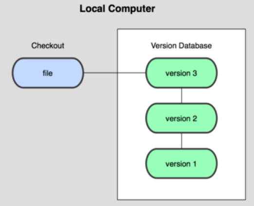


#### 2、集中版本控制 SVN

所有的版本数据都保存在服务器上，协同开发者从服务器上同步更新或上传自己的修改

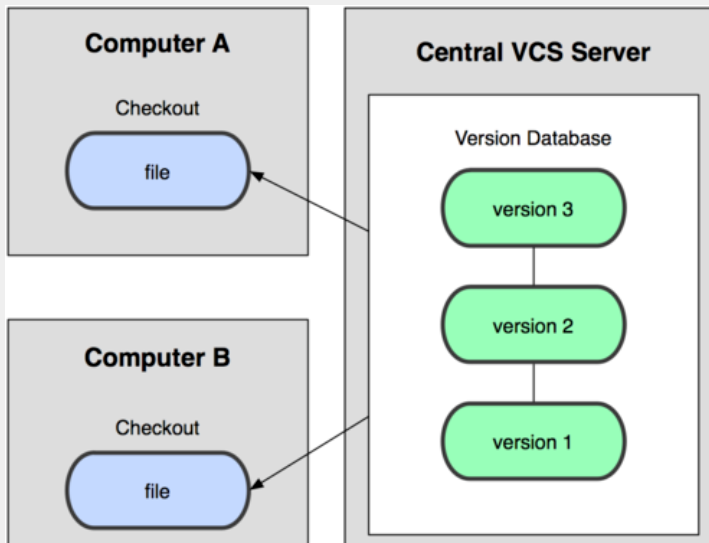

所有的版本数据都存在服务器上，用户的本地只有自己以前所同步的版本，如果不连网的话，用户就看不到历史版本，也无法切换版本验证问题，或在不同分支工作。而且，所有数据都保存在单一的服务器上，有很大的风险这个服务器会损坏，这样就会丢失所有的数据，当然可以定期备份。代表产品：SVN、CVS、VSS


#### 3、分布式版本控制 Git

每个人都拥有全部的代码！也会有安全隐患！

所有版本信息仓库全部同步到本地的每个用户，这样就可以在本地查看所有版本历史，可以离线在本地提交，只需在连网时push到相应的服务器或其他用户那里。由于每个用户那里保存的都是所有的版本数据，只要有一个用户的设备没有问题就可以恢复所有的数据，但这增加了本地存储空间的占用。

不会因为服务器损坏或者网络问题，造成不能工作的情况

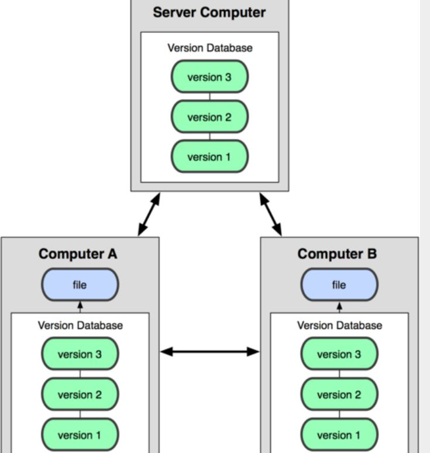


## 2、聊聊 Git 的历史


同生活中的许多伟大事物一样，Git 诞生于一个极富纷争大举创新的年代。

Linux 内核开源项目有着为数众广的参与者。绝大多数的 Linux 内核维护工作都花在了提交补丁和保存归档的繁琐事务上(1991－2002年间)。到 2002 年，整个项目组开始启用一个专有的分布式版本控制系统 BitKeeper 来管理和维护代码。


Linux社区中存在很多的大佬！破解研究 BitKeeper 


到了 2005 年，开发 BitKeeper 的商业公司同 Linux 内核开源社区的合作关系结束，他们收回了 Linux 内核社区免费使用 BitKeeper 的权力。这就迫使 Linux 开源社区 (特别是 Linux 的缔造者 Linus Torvalds) 基于使用 BitKeeper 时的经验教训，开发出自己的版本系统。（2周左右！） 也就是后来的 Git！


>   Linux和Git之父李纳斯·托沃兹（Linus Benedic Torvalds）1969、芬兰


## 3、GIt与SVN的区别


SVN是集中式版本控制系统，版本库是集中放在中央服务器的，而工作的时候，用的都是自己的电脑，所以首先要从中央服务器得到最新的版本，然后工作，完成工作后，需要把自己做完的活推送到中央服务器。集中式版本控制系统是必须联网才能工作，对网络带宽要求较高


Git是分布式版本控制系统，没有中央服务器，每个人的电脑就是一个完整的版本库，工作的时候不需要联网了，因为版本都在自己电脑上。协同的方法是这样的：比如说自己在电脑上改了文件A，其他人也在电脑上改了文件A，这时，你们两之间只需把各自的修改推送给对方，就可以互相看到对方的修改了。Git可以直接看到更新了哪些代码和文件！


**Git是目前世界上最先进的分布式版本控制系统**

Git是免费、开源的，最初Git是为辅助 Linux 内核开发的，来替代 BitKeeper！


## 4、Git的安装和环境配置


打开 [git官网] https://git-scm.com/，下载git对应操作系统的版本。

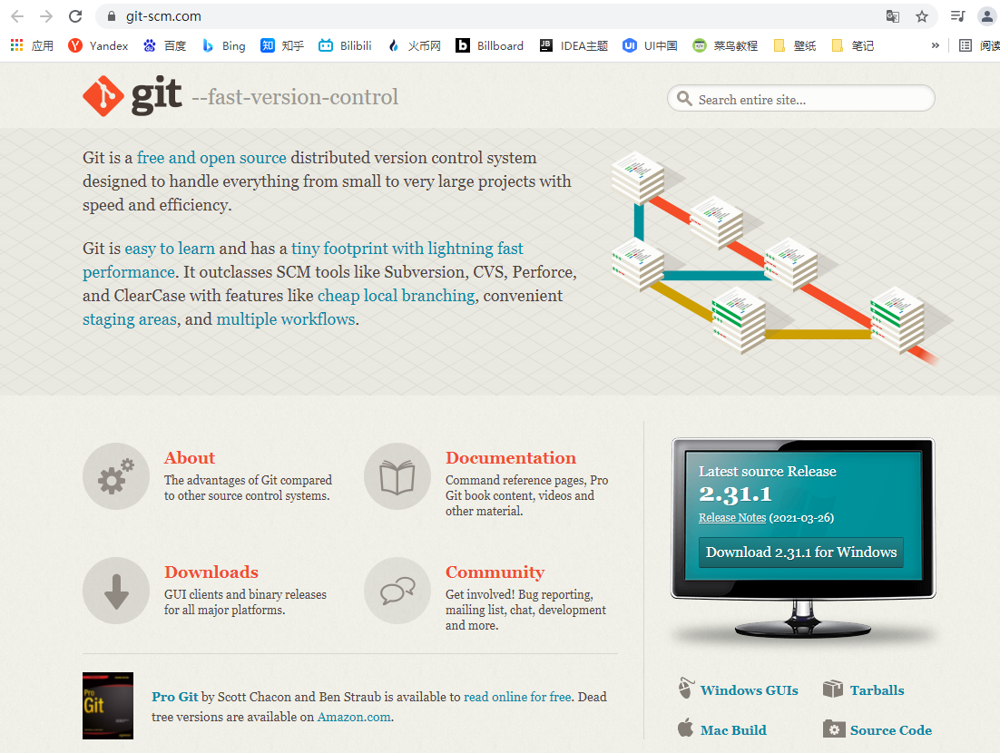


所有东西下载慢的话就可以去找镜像！

>   官网下载太慢，我们可以使用淘宝镜像下载：http://npm.taobao.org/mirrors/git-for-windows/

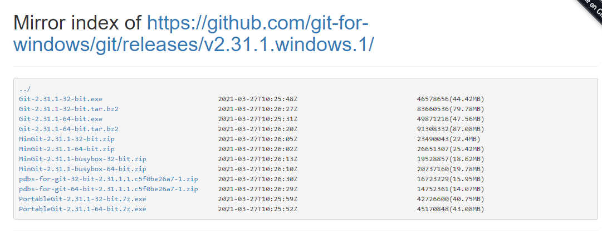


下载对应的版本即可安装！

安装：无脑下一步即可！安装完毕就可以使用了！


## 5、常用的Linux命令

```yaml
cd         # 改变目录
cd ..      # 回退到上一个目录，直接cd进入默认目录

pwd        # 显示当前所在的目录路径
ls(ll)     # 都是列出当前目录中的所有文件，只不过ll(两个ll)列出的内容更为详细
touch      # 新建一个文件 如 touch index.js 就会在当前目录下新建一个index.js文件

rm         # 删除一个文件, rm index.js 就会把index.js文件删除
rm -r      # 删除一个文件夹, rm -r src 删除src目录
rm -rf     # 切勿在Linux中尝试！删除电脑中全部文件！

mv         # 移动文件, mv 源路径 现路径
mkdir      # 新建一个目录,就是新建一个文件夹

reset      # 重新初始化终端/清屏
clear      # 清屏
history    # 查看命令历史
help       # 帮助
exit       # 退出
```


## 6、Git 的必要配置


>   所有的配置文件，其实都保存在本地！

### 1、查看配置

```
git config -l
```

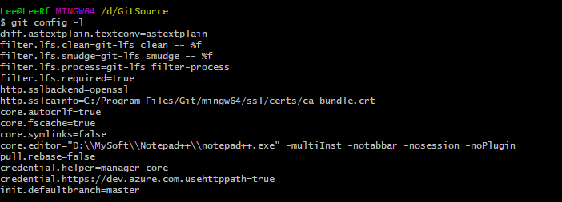


### 2、查看不同级别的配置文件：

```yaml
#查看系统 git config 后面加过滤条件
git config --system --list

#查看当前用户（global）配置
git config --global --list
```


### 3、Git相关的配置文件路径：


1、Git\etc\gitconfig ：Git 安装目录下的 gitconfig --system 系统级

```apl
[diff "astextplain"]
	textconv = astextplain
[filter "lfs"]
	clean = git-lfs clean -- %f
	smudge = git-lfs smudge -- %f
	process = git-lfs filter-process
	required = true
[http]
	sslBackend = openssl
	sslCAInfo = C:/Program Files/Git/mingw64/ssl/certs/ca-bundle.crt
[core]
	autocrlf = true
	fscache = true
	symlinks = false
	editor = \"D:\\\\MySoft\\\\Notepad++\\\\notepad++.exe\" -multiInst -notabbar -nosession -noPlugin
[pull]
	rebase = false
[credential]
	helper = manager-core
[credential "https://dev.azure.com"]
	useHttpPath = true
[init]
	defaultBranch = master

```


其实我们同过 **gitconfig --system --list** 命令查看的配置和上面的配置是一样的

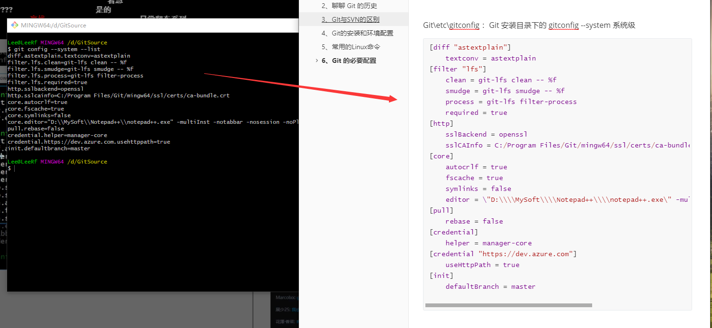


2、C:\Users\Administrator\ .gitconfig 只适用于当前登录用户的配置 --global 全局

>   该文件默认没有，需要配置后在生效


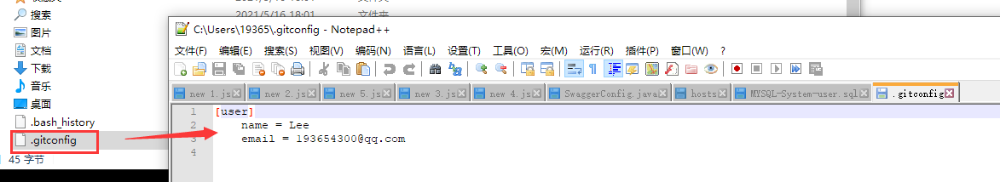


### 4、设置用户名和密码

当你安装Git后首先要做的事情是设置你的用户名称和e-mail地址。这是非常重要的，因为每次Git提交都会使用该信息。它被永远的嵌入到了你的提交中：

```yaml
git config --global user.name "Lee"        #名称
git config --global user.email "193654300@qq.com"   #邮箱
```


>   **这里是必须要配置的**
>
>   只需要做一次这个设置，如果你传递了--global 选项，因为Git将总是会使用该信息来处理你在系统中所做的一切操作。如果你希望在一个特定的项目中使用不同的名称或e-mail地址，你可以在该项目中运行该命令而不要--global选项。总之--global为全局配置，不加为某个项目的特定配置。


## 7、Git基本理论（核心）


### Git工作的区域


Git本地有三个工作区域：

>   工作目录（Working Directory）
>
>   暂存区(Stage/Index)
>
>   资源库(Repository 或 Git Directory)


如果在加上 远程的 git 仓库 (Remote Directory) 就可以分为四个工作区域。

文件在这四个区域之间的转换关系如下：


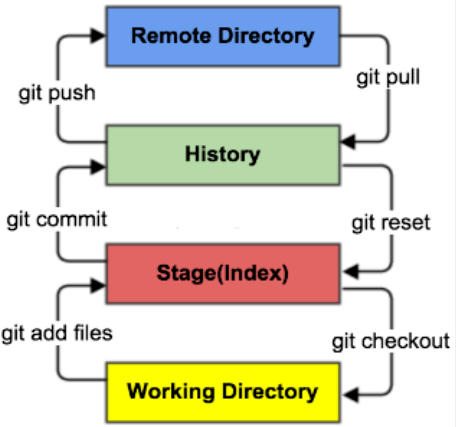


>   **Workspace：工作区**，就是你平时存放项目代码的地方
>
>   **Index / Stage：暂存区**，用于临时存放你的改动，事实上它只是一个文件，保存即将提交到文件列表信息
>
>   **Repository：仓库区**（或本地仓库），就是安全存放数据的位置，这里面有你提交到所有版本的数据。其中HEAD指向最新放入仓库的版本
>
>   **Remote：远程仓库**，托管代码的服务器，可以简单的认为是你项目组中的一台电脑用于远程数据交换 （国外 github、国内 gitee）


本地的三个区域确切的说应该是git仓库中HEAD指向的版本：

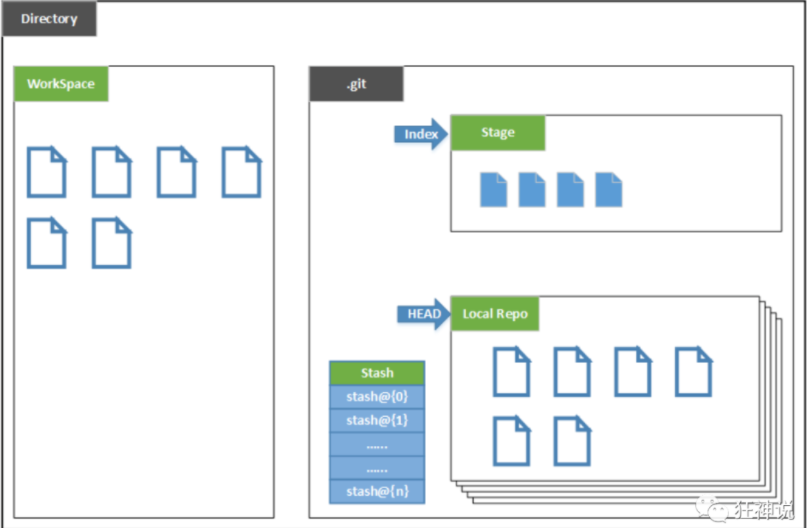


-   Directory：使用Git管理的一个目录，也就是一个仓库，包含我们的工作空间和Git的管理空间
-   WorkSpace：需要通过Git进行版本控制的目录和文件，这些目录和文件组成了工作空间
-   .git：存放Git管理信息的目录，初始化仓库的时候自动创建
-   Index/Stage：暂存区，或者叫待提交更新区，在提交进入repo之前，我们可以把所有的更新放在暂存区
-   Local Repo：本地仓库，一个存放在本地的版本库；HEAD会只是当前的开发分支（branch）
-   Stash：隐藏，是一个工作状态保存栈，用于保存/恢复WorkSpace中的临时状态


## 8、Git工作流程


**git的工作流程一般是这样的：**

１、在工作目录中添加、修改文件 

２、将需要进行版本管理的文件放入暂存区域

３、将暂存区域的文件提交到git仓库


**提交流程**

git add：将修改添加到暂存区

git commit：将修改提交到本地仓库

git push：将修改推送到远程仓库


**因此，git管理的文件有三种状态**

1.  已修改（modified）
2.  已暂存（staged）
3.  已提交(committed)


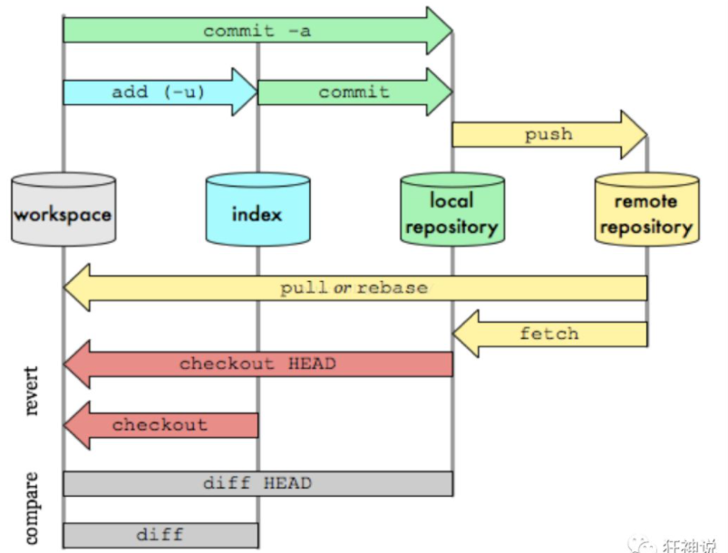


## 9、Git 常用命令


### 1、新建代码库

```apl
# 在当前目录新建一个Git代码库
$ git init
 
# 新建一个目录，将其初始化为Git代码库
$ git init [project-name]
 
# 下载一个项目和它的整个代码历史
$ git clone [url]
```


### 2、配置

>   Git的设置文件为`.gitconfig`，它可以在用户主目录下（全局配置），也可以在项目目录下（项目配置）

```yaml
# 显示当前的Git配置
$ git config --list
 
# 编辑Git配置文件
$ git config -e [--global]
 
# 设置提交代码时的用户信息
$ git config [--global] user.name "[name]"
$ git config [--global] user.email "[email address]"
```


### 3、增加/删除文件

```yaml
# 添加指定文件到暂存区
$ git add [file1] [file2] ...
 
# 添加指定目录到暂存区，包括子目录
$ git add [dir]
 
# 添加当前目录的所有文件到暂存区
$ git add .
 
# 添加每个变化前，都会要求确认
# 对于同一个文件的多处变化，可以实现分次提交
$ git add -p
 
# 删除工作区文件，并且将这次删除放入暂存区
$ git rm [file1] [file2] ...
 
# 停止追踪指定文件，但该文件会保留在工作区
$ git rm --cached [file]
 
# 改名文件，并且将这个改名放入暂存区
$ git mv [file-original] [file-renamed]
```


### 4、代码提交

```yaml
# 提交暂存区到仓库区
$ git commit -m [message]
 
# 提交暂存区的指定文件到仓库区
$ git commit [file1] [file2] ... -m [message]
 
# 提交工作区自上次commit之后的变化，直接到仓库区
$ git commit -a
 
# 提交时显示所有diff信息
$ git commit -v
 
# 使用一次新的commit，替代上一次提交
# 如果代码没有任何新变化，则用来改写上一次commit的提交信息
$ git commit --amend -m [message]
 
# 重做上一次commit，并包括指定文件的新变化
$ git commit --amend [file1] [file2] ...
```


### 5、分支管理

```yaml
# 列出所有本地分支
$ git branch
 
# 列出所有远程分支
$ git branch -r
 
# 列出所有本地分支和远程分支
$ git branch -a
 
# 新建一个分支，但依然停留在当前分支
$ git branch [branch-name]
 
# 以远程分支为基础新建一个分支，并切换到该分支
$ git checkout -b [branch] origin/[remote-branch]
 
# 新建一个分支，指向指定commit
$ git branch [branch] [commit]
 
# 新建一个分支，与指定的远程分支建立追踪关系
$ git branch --track [branch] [remote-branch]
 
# 切换到指定分支，并更新工作区
$ git checkout [branch-name]
 
# 切换到上一个分支
$ git checkout -
 
# 建立追踪关系，在现有分支与指定的远程分支之间
$ git branch --set-upstream [branch] [remote-branch]
 
# 合并指定分支到当前分支
$ git merge [branch]
 
# 选择一个commit，合并进当前分支
$ git cherry-pick [commit]
 
# 删除分支
$ git branch -d [branch-name]
 
# 删除远程分支
$ git push origin --delete [branch-name]
$ git branch -dr [remote/branch]
```


### 6、标签

```yaml
# 列出所有tag
$ git tag
 
# 新建一个tag在当前commit
$ git tag [tag]
 
# 新建一个tag在指定commit
$ git tag [tag] [commit]
 
# 删除本地tag
$ git tag -d [tag]
 
# 删除远程tag
$ git push origin :refs/tags/[tagName]
 
# 查看tag信息
$ git show [tag]
 
# 提交指定tag
$ git push [remote] [tag]
 
# 提交所有tag
$ git push [remote] --tags
 
# 新建一个分支，指向某个tag
$ git checkout -b [branch] [tag]
```


### 7、查看信息

```yaml
# 显示有变更的文件
$ git status
 
# 显示当前分支的版本历史
$ git log
 
# 显示commit历史，以及每次commit发生变更的文件
$ git log --stat
 
# 搜索提交历史，根据关键词
$ git log -S [keyword]
 
# 显示某个commit之后的所有变动，每个commit占据一行
$ git log [tag] HEAD --pretty=format:%s
 
# 显示某个commit之后的所有变动，其"提交说明"必须符合搜索条件
$ git log [tag] HEAD --grep feature
 
# 显示某个文件的版本历史，包括文件改名
$ git log --follow [file]
$ git whatchanged [file]
 
# 显示指定文件相关的每一次diff
$ git log -p [file]
 
# 显示过去5次提交
$ git log -5 --pretty --oneline
 
# 显示所有提交过的用户，按提交次数排序
$ git shortlog -sn
 
# 显示指定文件是什么人在什么时间修改过
$ git blame [file]
 
# 显示暂存区和工作区的差异
$ git diff
 
# 显示暂存区和上一个commit的差异
$ git diff --cached [file]
 
# 显示工作区与当前分支最新commit之间的差异
$ git diff HEAD
 
# 显示两次提交之间的差异
$ git diff [first-branch]...[second-branch]
 
# 显示今天你写了多少行代码
$ git diff --shortstat "@{0 day ago}"
 
# 显示某次提交的元数据和内容变化
$ git show [commit]
 
# 显示某次提交发生变化的文件
$ git show --name-only [commit]
 
# 显示某次提交时，某个文件的内容
$ git show [commit]:[filename]
 
# 显示当前分支的最近几次提交
$ git reflog
```


### 8、远程同步

```yaml
# 下载远程仓库的所有变动
$ git fetch [remote]
 
# 显示所有远程仓库
$ git remote -v
 
# 显示某个远程仓库的信息
$ git remote show [remote]
 
# 增加一个新的远程仓库，并命名
$ git remote add [shortname] [url]
 
# 取回远程仓库的变化，并与本地分支合并
$ git pull [remote] [branch]
 
# 上传本地指定分支到远程仓库
$ git push [remote] [branch]
 
# 强行推送当前分支到远程仓库，即使有冲突
$ git push [remote] --force
 
# 推送所有分支到远程仓库
$ git push [remote] --all
```


### 9、撤销

```yaml
# 恢复暂存区的指定文件到工作区
$ git checkout [file]
 
# 恢复某个commit的指定文件到暂存区和工作区
$ git checkout [commit] [file]
 
# 恢复暂存区的所有文件到工作区
$ git checkout .
 
# 重置暂存区的指定文件，与上一次commit保持一致，但工作区不变
$ git reset [file]
 
# 重置暂存区与工作区，与上一次commit保持一致
$ git reset --hard
 
# 重置当前分支的指针为指定commit，同时重置暂存区，但工作区不变
$ git reset [commit]
 
# 重置当前分支的HEAD为指定commit，同时重置暂存区和工作区，与指定commit一致
$ git reset --hard [commit]
 
# 重置当前HEAD为指定commit，但保持暂存区和工作区不变
$ git reset --keep [commit]
 
# 新建一个commit，用来撤销指定commit
# 后者的所有变化都将被前者抵消，并且应用到当前分支
$ git revert [commit]
 
# 暂时将未提交的变化移除，稍后再移入
$ git stash
$ git stash pop
```


### 10、其他

```yaml
# 生成一个可供发布的压缩包
$ git archive
```


## 10、Git 项目创建以克隆


### 1、创建工作目录与常用指令

工作目录（WorkSpace)一般就是你希望Git帮助你管理的文件夹，可以是你项目的目录，也可以是一个空目录，建议不要有中文


日常使用只要记住下图6个命令：

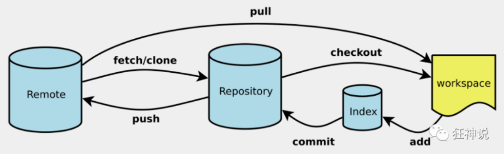


### 2、本地仓库搭建（两种）


#### 1、创建全新的仓库


>   创建全新的仓库，需要用GIT管理的项目的根目录执行：

```yaml
git init # 在当前目录新建一个Git代码库
```


执行后可以看到，仅仅在项目目录多出了一个.git目录，关于版本等的所有信息都在这个目录里面


#### 2、克隆远程仓库


>   另一种方式是克隆远程目录，由于是将远程服务器上的仓库完全镜像一份至本地


```yml
# 克隆一个项目和它的整个代码历史(版本信息)
git clone [url]  # https://gitee.com/kuangstudy/openclass.git
```


可以去 gitee 或者 github 上克隆一个测试


## 11、文件的四种状态和操作


### 1、文件的四种状态


版本控制就是对文件的版本控制，要对文件进行修改、提交等操作，首先要知道文件当前在什么状态，不然可能会提交了现在还不想提交的文件，或者要提交的文件没提交上


**Untracked（未跟踪）**

>   此文件在文件夹中, 但并没有加入到git库, 不参与版本控制. 通过 git add 状态变为Staged.


**Unmodify（文件已经入库, 未修改）**

>   即版本库中的文件快照内容与文件夹中完全一致. 这种类型的文件有两种去处, 如果它被修改, 而变为 Modified. 如果使用 git rm 移出版本库, 则成为 Untracked 文件


**Modified（文件已修改）**

>   仅仅是修改, 并没有进行其他的操作. 这个文件也有两个去处, 通过git add可进入暂存staged 状态, 使用 git checkout 则丢弃修改过, 返回到 unmodify 状态, 这个git checkout 即从库中取出文件, 覆盖当前修改 


**Staged（暂存状态）**

>   执行 git commit 则将修改同步到库中, 这时库中的文件和本地文件又变为一致, 文件为 Unmodify 状态. 执行 git reset HEAD filename 取消暂存, 文件状态为 Modified


### 2、查看文件状态


>   上面说文件有4种状态，通过如下命令可以查看到文件的状态：

```yaml
git status [filename] #查看指定文件状态

git status  # 查看所有文件状态
git add .   # 添加所有文件到暂存区

git commit -m "消息内容"  # 提交暂存区中的内容到本地仓库 -m 提交信息
```


### 3、忽略文件


有些时候我们不想把某些文件纳入版本控制中，比如 数据库文件，临时文件，设计文件等、我们在主目录下建立 ".gitignore" 文件，此文件有如下规则：

>   下图为 IDEA 中的忽略配置文件

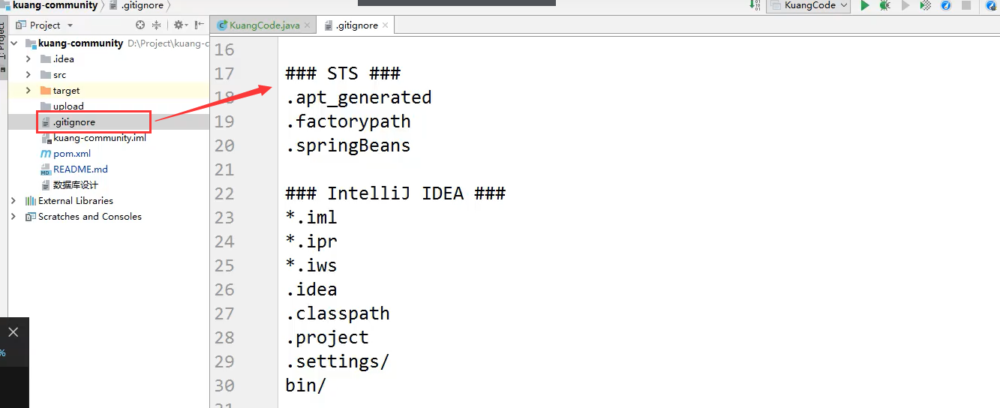


1.  忽略文件中的空行或以井号（#）开始的行将会被忽略
2.  可以使用Linux通配符。例如：星号（*）代表任意多个字符，问号（？）代表一个字符，方括号（[abc]）代表可选字符范围，大括号（{string1,string2,...}）代表可选的字符串等
3.  如果名称的最前面有一个感叹号（!），表示例外规则，将不被忽略
4.  如果名称的最前面是一个路径分隔符（/），表示要忽略的文件在此目录下，而子目录中的文件不忽略
5.  如果名称的最后面是一个路径分隔符（/），表示要忽略的是此目录下该名称的子目录，而非文件（默认文件或目录都忽略）


```yaml
*.txt        #忽略所有 .txt结尾的文件,这样的话上传就不会被选中！

!lib.txt     #但lib.txt除外

/temp        #仅忽略项目根目录下的TODO文件,不包括目录temp

build/       #忽略build/目录下的所有文件

doc/*.txt    #会忽略 doc/notes.txt 但不包括 doc/server/arch.txt
```


## 12、Git分支管理策略


#### 1、主分支Master

>   首先，代码库应该有一个、且仅有一个主分支。所有提供给用户使用的正式版本，都在这个主分支上发布


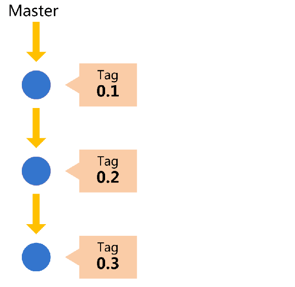

Git主分支的名字，默认叫做Master。它是自动建立的，版本库初始化以后，默认就是在主分支在进行开发


#### 2、开发分支 Develop

>   主分支只用来分布重大版本，日常开发应该在另一条分支上完成。我们把开发用的分支，叫做Develop


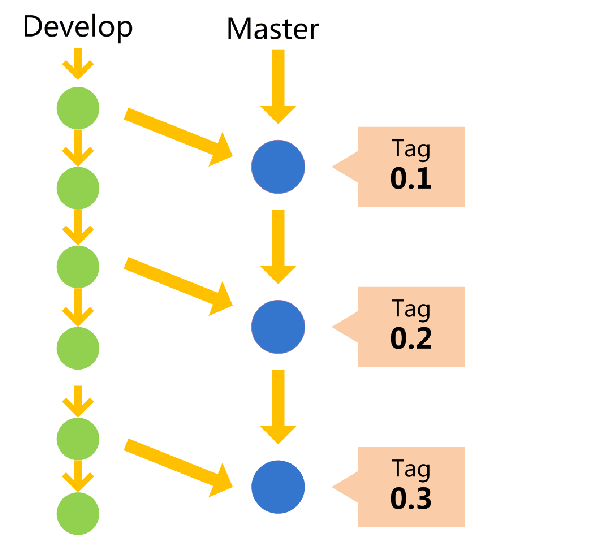


这个分支可以用来生成代码的最新隔夜版本（nightly）

>   如果想正式对外发布，就在Master分支上，对Develop分支进行"合并"（merge）


```yaml
git checkout -b develop master # Git 创建 Develop 分支
```


将Develop分支发布到Master分支的命令

```yaml
# 切换到Master分支
git checkout master

# 对Develop分支进行合并
git merge --no-ff develop
```

>   这里稍微解释一下，上一条命令的--no-ff参数是什么意思。
>
>   默认情况下，Git执行 "快进式合并"（fast forward merge），会直接将Master分支指向Develop分支


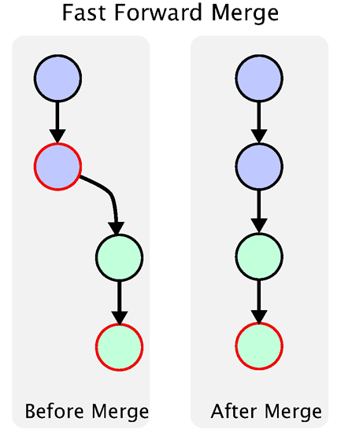


使用--no-ff参数后，会执行正常合并，在Master分支上生成一个新节点。为了保证版本演进的清晰，我们希望采用这种做法。

关于合并的更多解释，请参考Benjamin Sandofsky的[《Understanding the Git Workflow》](http://sandofsky.com/blog/git-workflow.html)

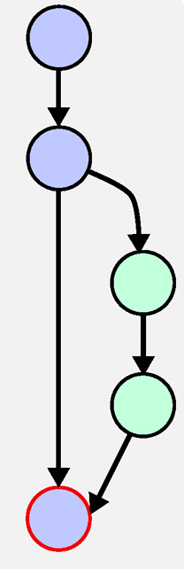


#### 3、临时性分支

前面讲到版本库的两条主要分支：Master和Develop。前者用于正式发布，后者用于日常开发。其实，常设分支只需要这两条就够了，不需要其他了。

但是，除了常设分支以外，还有一些临时性分支，用于应对一些特定目的的版本开发。临时性分支主要有三种：

```asciiarmor
* 功能（feature）分支

* 预发布（release）分支

* 修补bug（fixbug）分支
```


这三种分支都属于临时性需要，使用完以后，应该删除，使得代码库的常设分支始终只有Master和Develop


##### 1、功能分支（feature）

接下来，一个个来看这三种"临时性分支"

第一种是功能分支，它是为了开发某种特定功能，从Develop分支上面分出来的。开发完成后，要再并入Develop


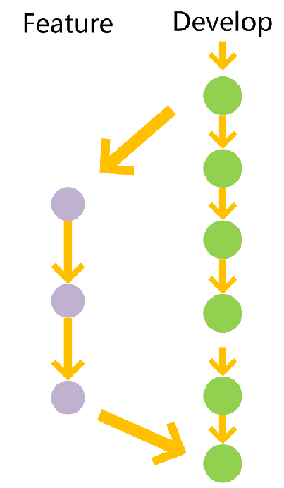

功能分支的名字，可以采用feature-*的形式命名。

```yaml
# 创建一个功能分支
git checkout -b feature-x develop

# 开发完成后，将功能分支合并到develop分支
git checkout develop
git merge --no-ff feature-x

# 删除feature分支
git branch -d feature-x
```


##### 2、预发布分支（release）

第二种是预发布分支，它是指发布正式版本之前（即合并到 Master 分支之前），我们可能需要有一个预发布的版本进行测试


预发布分支是从Develop分支上面分出来的，预发布结束以后，必须合并进 Develop 和Master 分支

>   它的命名，可以采用release-*的形式


步骤：

```yaml
# 1、创建一个预发布分支
git checkout -b release-1.2 develop

# 2、确认没有问题后，合并到master分支
git checkout master
git merge --no-ff release-1.2

# 3、对合并生成的新节点，做一个标签
git tag -a 1.2

# 4、再合并到develop分支
git checkout develop
git merge --no-ff release-1.2

# 5、最后删除预发布分支
git branch -d release-1.2
```


##### 3、修补 bug 分支（fixbug）


最后一种是修补bug分支。软件正式发布以后，难免会出现bug、这时就需要创建一个分支，进行bug修补


修补bug分支是从Master分支上面分出来的。修补结束以后，再合并进Master和Develop分支

>   它的命名，可以采用fixbug-*的形式

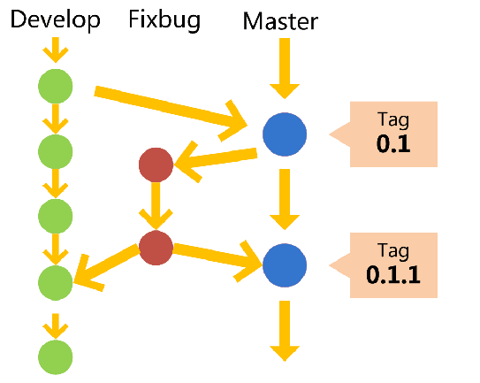

步骤：

```yaml
# 1、创建一个修补bug分支
git checkout -b fixbug-0.1 master

# 2、修补结束后，合并到master分支
git checkout master
git merge --no-ff fixbug-0.1
git tag -a 0.1.1

# 3、再合并到develop分支
git checkout develop
git merge --no-ff fixbug-0.1

# 4、最后，删除"修补bug分支"
git branch -d fixbug-0.1
```


## 13、码云的注册和使用


github 是有墙的，比较慢，在国内的话，我们一般使用 gitee ，公司中有时候会搭建自己的gitlab服务器


1、注册登录码云，完善个人信息

2、设置本机绑定SSH公钥，实现免密码登录！

```yaml
# 进入 C:\Users\Administrator\\.ssh 目录
# 生成公钥
ssh-keygen
```

>   免密码登录，这一步挺重要的，码云是远程仓库，我们是平时工作在本地仓库


3、将公钥信息 public key 添加到码云云账户中即可

4、使用码云创建一个自己的仓库


## 14、IDEA中集成 Git


我们可以直接选择把项目建立在 Git 本地仓库下（简单）

>   D:\GitSource


或将我们远程的 Git 文件目录拷贝到项目中即可

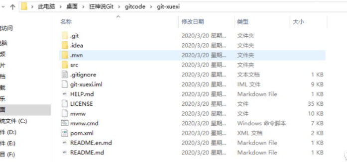


注意观察idea中的变化

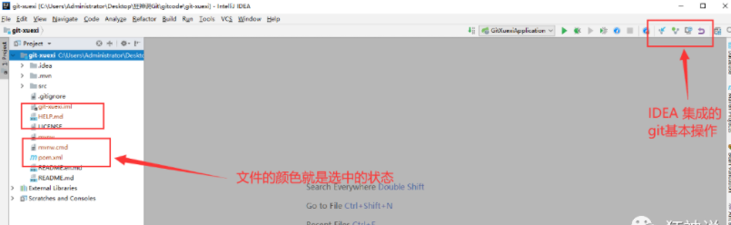


修改文件，使用IDEA操作git。

-   添加到暂存区
-   commit 提交
-   push到远程仓库


提交测试