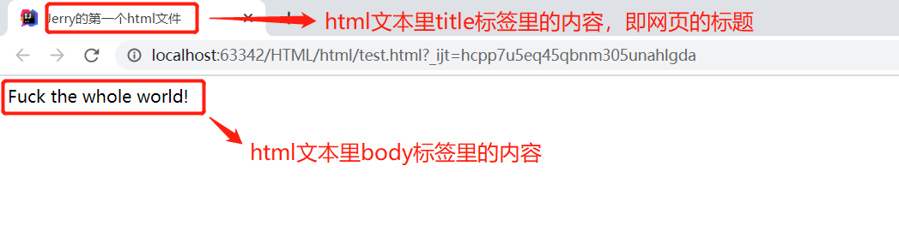
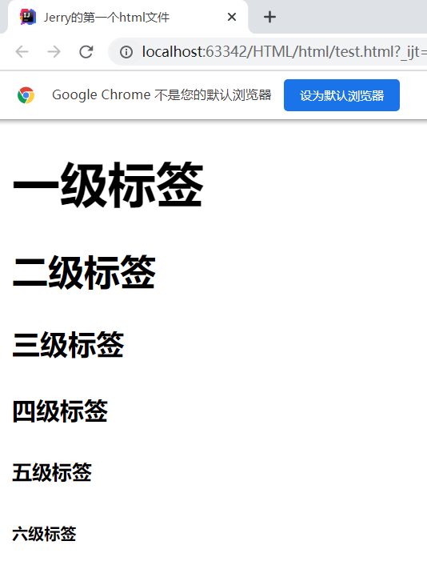

## 1、什么是HTML

### 1、HTML


​			超文本包括：文字、图片、音频、视频、动画等

​			

### 2、HTML发展史


### 3、厂商对HTML5的支持

>   世界知名厂商：
>
>   微软、Google、苹果、Opera、Mozilla


### 4、W3C标准

什么是W3C

>   全程 World Wide Web Consortium（万维网联盟）
>
>   成立于1994年，Web技术领域最权威和具影响力的国际中立性技术标准机构
>
>   http://www.w3.org/
>
>   http://www.chinaw3c.org/


W3C标准包括

>   结构化标准语言（HTML、XML）
>
>   表现标准语言（CSS）
>
>   行为标准（DOM、ECMAScript）


## 2、网页基本信息


### 1、网页元素构成

>   -   DOCTYPE声明
>   -   <title>标签
>   -   <tmeta>标签


```html
<!-- 告诉浏览器 我们使用的是什么规范 -->
<!DOCTYPE html>
<html lang="en">
    <!--head 表示网页的头部-->
    <head>
        <!--meta标签 用于描述网页 一般用来做SEO（利用搜索引擎的规则提高网站在有关搜索引擎内的自然排名）-->
        <meta charset="UTF-8">
        <meta name="keywords" content="狂神说JAVA x西部开源">
        <meta name="description" content="来这个地方可以学习java">
        <!--    网页的标题-->
        <title>我的第一个网页</title>
    </head>
    <!--网页的主体-->
    <body>
        Hello World!!!!
    </body>
</html>
```


### 2、网页标签

---

#### 1、标题标签 

```html
<!-- 告诉浏览器 我们使用的是什么规范 -->
<!DOCTYPE html>
<html lang="en">
    <head>
        <meta charset="UTF-8">
        <title>基本标签学习</title>
    </head>
    <!--网页的主体-->
    <body>
    <h1>一级标签</h1>
    <h2>二级标签</h2>
    <h3>三级标签</h3>
    <h4>四级标签</h4>
    <h5>五级标签</h5>
    <h6>六级标签</h6>
    </body>
</html>
```

效果如下：


#### 2、段落标签

```html
<!--段落标签-->
<p>跑得快跑得快</p>
<p>一只没有耳朵</p>
<p>一只没有尾巴</p>
<p>真奇怪真奇怪</p>
<p>两只老虎两只老虎</p>
```


#### 3、换行标签

```html
<!--换行标签-->
跑得快跑得快<br>
一只没有耳朵<br>
一只没有尾巴<br>
真奇怪真奇怪<br>
两只老虎两只老虎<br>
```


#### 4、水平线标签

```html
<hr>
```

#### 5、字体样式标签

```html
粗体<strong>i love you</strong>
斜体<em>i love you</em>
```

#### 6、注释和特殊符号

```html
<!--t特殊符号-->
空格
空&nbsp;&nbsp;&nbsp;&nbsp;&nbsp;&nbsp;&nbsp;&nbsp;&nbsp;&nbsp;格<br>
 
&gt;<br>
&lt;<br>
&copy;<br>版权所有符号
```


# 1、初识HTML

## 1.1 前端技术栈


-   HTML：超文本标记语言，网页里显示的图片、音频资源等都可以与html文本关联起来，浏览器通过渲染html文本给用户呈现网页；
-   CSS：通过CSS可以美化网页；
-   JavaScript：通过JS可以使我们的网页动起来，提升交互性；
-   JQuery：直接写JS比较麻烦，JQuery封装了JS；
-   Vue：前后端分离用的一个框架。

## 1.2 html概述


-   HTML全称Hyper Text Markup Language，是超文本标记语言，网页里显示的图片、音频资源等都可以与html文本关联起来，浏览器通过渲染html文本给用户呈现网页；
-   所谓的超文本，是指文字、图片、音频、视频、动画等资源；
-   目前HTML版本使用较多的是HTML5，CSS用的较多的是CSS3版本；

## 1.3 html基本结构

html文件的结构分为两部分：网页头部和主体部分。


html文本的内容是由一系列标签组成的，标签分为两类：成对出现的开放标签和闭合标签，和单独出现的自闭合标签，如下：


-   开放标签和闭合标签是成对出现的，闭合标签多了个/来表示标签范围结束；
-   自闭和标签仅有一个出现，比如上图中的meta，不需要用/来表示标签范围结束（可以有/也可以没有/），直接用>结尾。


html注释写法：

```html
<!-- 注释内容 -->
```

对应的快捷键：`ctrl + /`

## 1.4 html基本内容


下面是一个html的简单demo:

```html
<!DOCTYPE html>
<html lang="en">
<head>
    <meta charset="UTF-8">
    <title>Jerry的第一个html文件</title>
</head>

<body>
Fuck the whole world!
</body>
</html>
```

html文本内容一般由一下几个部分组成：

-   DOCTYPE声明：告诉浏览器我们要是用什么规范，如上面的例子是使用html规范；
-   <meta>标签：描述性标签，用来告诉我们网站的一些信息；
-   <title>标签：网页标题

我们可以在body标签里添加简单的网页显示内容，比如字符串：**Fuck the whole world!**

## 1.5 IDEA使用html


点击后如图，这里使用Google浏览器打开：



以Google浏览器为例，在上图打开的网页中，点击鼠标右键，选择“查看网页源代码”，可以看到浏览器是渲染的html文本，如下图：


# 2、网页基本标签


网页的内容是由以下几大类标签对应的内容组成的：

-   标题标签
-   段落标签
-   换行标签
-   水平线标签
-   字体样式标签
-   注释和特殊符号

## 2.1 标题标签


格式：

```html
<hn>
  内容
</hn>
```

举例：

```html
<body>
  
<h1>一级标签</h1>
<h2>二级标签</h2>
<h3>三级标签</h3>
<h4>四级标签</h4>
<h5>五级标签</h5>
<h6>六级标签</h6>
  
</body>
```

效果：



## 2.2 段落标签


html文本不识别换行符和空格符，如果想体现换行需要使用段落标签。

格式：

```html
<p>
  段落文字
</p>
```

快捷键：先输入字符p，然后摁tab键。

举例：

```html
<body>

<p>
    第一段内容
</p>

<p>
    第二段内容
</p>

<p>
    第三段内容
</p>

</body>
```

效果：


## 2.3 换行标签


采用自闭和标签的形式，格式：

```html
每一行的内容<br/>
```

举例：

```html
<body>

第一行内容<br/>
第二行内容<br/>
第三行内容<br/>

</body>
```

效果：


注意区分换行标签和段落标签内容显示的不同，换行标签要窄一些。

## 2.4 水平线标签


网页内容加一条水平线，格式：

```html
<hr/>
```

举例：

```html
<hr/>
```

效果：


## 2.5 字体样式标签

### 2.5.1 粗体

格式：

```html
<strong>粗体文本</strong>
```

举例：

```html
<body>

正常文本<br/>
<strong>粗体文本</strong><br/>

</body>
```

效果：


### 2.5.2 斜体

格式：

```html
<em>斜体文本</em>
```

举例：

```html
<body>

正常文本<br/>
<em>斜体文本</em><br/>

</body>
```

效果：


## 2.6 注释和特殊符号


特殊符号通用格式：

```html
&特殊符号;
```

固定格式：

-   开头是&
-   结尾是；
-   中间是特殊符号的转义字符，使用的时候可以直接百度，或者用自动补全提示。


这里说一下空格这个特殊字符：` `

# 3、列表标签


列表标签对应的内容是一条一条的形式呈现的，分为：

-   有序列表
-   无序列表
-   自定义列表

## 3.1 有序列表(ol)

格式：

```html
<body>

<ol>
    <li>元素1</li>
    <li>元素2</li>
    <li>元素3</li>
    ...
</ol>

</body>
```

举例：

```html
<body>

<ol>
    <li>有序列表元素1</li>
    <li>有序列表元素2</li>
    <li>有序列表元素3</li>
</ol>

</body>
```

效果：


## 3.2 无序列表(ul)

格式：

```html
<body>

<ul>
    <li>元素1</li>
    <li>元素2</li>
    <li>元素3</li>
  ...
</ul>

</body>
```

举例：

```html
<body>

<ul>
    <li>无序列表元素1</li>
    <li>无序列表元素2</li>
    <li>无序列表元素3</li>
</ul>

</body>
```

效果：


## 3.3 自定义列表(dl)

格式：

```html
<body>

<dl>
    <dt>自定义列表1</dt>
    <dd>自定义列表1的元素1</dd>
    <dd>自定义列表1的元素2</dd>
    <dd>自定义列表1的元素3</dd>

    <dt>自定义列表2</dt>
    <dd>自定义列表2的元素1</dd>
    <dd>自定义列表2的元素2</dd>
    <dd>自定义列表2的元素3</dd>
</dl>

</body>
```

标签说明：

-   <dl></dl>：自定义列表
-   <dt></dt>：自定义列表名称
-   <dd></dd>：自定义列表元素

举例：

```html
<body>

<dl>
    <dt>自定义列表1</dt>
    <dd>自定义列表1的元素1</dd>
    <dd>自定义列表1的元素2</dd>
    <dd>自定义列表1的元素3</dd>

    <dt>自定义列表2</dt>
    <dd>自定义列表2的元素1</dd>
    <dd>自定义列表2的元素2</dd>
    <dd>自定义列表2的元素3</dd>
</dl>

</body>
```

效果：


# 4、表格标签


表格标签就是html通过表格标签在网页中显示一个类似Excel表格的内容，表格的基本结构有以下几个部分：

-   单元格
-   行
-   列
-   跨行
-   跨列

## 4.1 基本的表格标签

举例，在网页中显示一个3*3的表格：

```html
<body>

<table border="1px" bgcolor="blue">
    <tr bgcolor="#ffe4c4">
        <td bgcolor="aqua">1-1</td>
        <td>1-2</td>
        <td>1-3</td>
    </tr>

    <tr>
        <td>2-1</td>
        <td>2-2</td>
        <td>2-3</td>
    </tr>

    <tr>
        <td>3-1</td>
        <td>3-2</td>
        <td>3-3</td>
    </tr>
</table>

</body>
```

标签说明：

-   <table></table>：表格标签；
-   <tr></tr>：行标签；
-   <td></td>：列标签；
-   border：参数，用来表示表格的边框大小，是<table></table>标签的参数；
-   bgcolor：参数，用来表示具体单元格的填充颜色，可以是<table></table>、<tr></tr>和<td></td>标签的参数，当三个标签都设置了该参数时，优先级顺序从高到底依次为：<td></td>、<tr></tr>、<table></table>。


效果：


## 4.2 跨列（colspan)

举例，整体仍然是3*3表格，1-1和1-2单元格合并为一个，即跨列：

```html
<body>

<table border="1px">
    <tr>
        <td colspan="2">1-1</td>
        <td>1-2</td>
    </tr>

    <tr>
        <td>2-1</td>
        <td>2-2</td>
        <td>2-3</td>
    </tr>

    <tr>
        <td>3-1</td>
        <td>3-2</td>
        <td>3-3</td>
    </tr>
</table>

</body>
```

标签说明：

-   colspan：是标签<td></td>的参数，后面跟数字，代表当前行当前列的单元格要跨几个列；


效果：


## 4.3 跨行（rowspan）

完全参考跨列。

# 5、图像标签


格式：


-   src是必选项，其他为可选项；
-   src建议使用相对路径；
-   除了alt、title等可选项外，还有很多其他可选项，输入空格有提示。


举例：

```html
<body>


</body>
```

效果：


# 6、音视频标签

网页中的音频和视频资源，对应html标签为音频标签和视频标签，html通过音视频标签组织相应内容的。

## 6.1 视频标签

格式：

```html
<video src="资源的相对路径" controls autoplay height="300" width="300"></video>
```

标签和参数说明：

-   <video></video>：视频标签；
-   src：video标签参数，视频资源的相对路径；
-   controls：video标签参数，网页对应处可现实播放控件；
-   autoplay：video标签参数，自动播放视频；
-   height，width：视频界面的长宽。

## 6.2 音频标签

格式：

```html
<audio src="资源的相对路径" controls autoplay height="300" width="300"></audio>
```

标签和参数说明和视频标签几乎一样。

# 7、超链接标签 

超链接标签的概念应该知道吧。

## 7.1 页面间链接


**格式：**

****

**参数说明：**

-   <a></a>：超链接标签；
-   href：<a></a>标签的参数，后面的path参数填写链接的路径，表示要跳转哪个页面，可以是html文件，也可以是域名；
-   target：<a></a>标签的参数，表示链接在哪个窗口打开，可选的参数主要有以下两个：

-   -   _blank：点击链接后跳转页面在新的窗口打开；
    -   _self：点击链接后跳转页面在当前窗口打开；

-   链接文本或图像：这一部分是点击链接文本或者图像可以跳转到另一个页面，相当于一个入口。


**举例：**

```html
<body>

<a href="hello.html" target="_self">点击我打开hello页面</a>
<br/>
<a href="https://www.baidu.com" target="_blank">点击我打开百度页面</a>

</body>
```

**效果：**


## 7.2 锚链接


通过锚链接我们可以实现页面内的跳转，比如我们想选定目录树中某个章节时，可以通过点击目录树中章节对应的位置直接跳转到对应内容，也可以应用在网页中返回顶部这个功能。


锚链接意思是预先设置好一个锚点，即本页面中要跳转过来的地方，再后面要跳转时直接通过a标签即可。


**格式：**

锚点：

```html
<a name="锚点名称">锚点描述性文字</a>
```

抛向锚点：

```html
<a href="页面#锚点名称">抛锚描述性文字</a>
```

注意这里可以不只是局限在本页面，也可以抛向其他页面的特定位置，格式为"其他页面#锚点名称"，锚点名称前用**`#`**标记。


**举例：**

```html
<body>

<a name="top">顶部</a>
<br>
<br>
<br>
<br>
<br>
<br>
<!-- 中间这部分填充网页的其他部分，目的是让锚点和抛锚处不能在一个页面内显示完全 -->
<br>
<br>
<br>
<br>
<br>
<br>
<br>
<br>
<br>
<br>
<a href="#top">回到顶部</a>

</body>
```

**效果：**

****

## 7.3 功能性链接


所谓功能性链接，就是指一些特定或者常用的超链接，比如邮件链接、QQ链接或者BILI链接等，用于站内分享链接等，这里介绍邮件链接和qq链接。

### 7.3.1 邮件链接（mailto)

**举例：**

```html
<body>

<a href="mailto: 15828074705@163.com">点击邮箱联系我</a>

</body>
```

**效果：**


### 7.3.2 qq链接

腾讯开发的功能，可以自动生成一个qq链接，我们只需要把自动生成的a标签粘贴到我们的html文本里就ok。


效果的话图片加载不出来。


# 8、块内元素和行内元素


块内元素和行内元素是一元素的一种组织布局方式。

## 8.1 块内元素

比如行标签、标题标签等。

## 8.2 行内元素

比如字体标签等。

# 9、页面结构分析


# 10、iframe内联架构


iframe内联结构用在在一个网站中打开另一个网站。

**格式：**


**举例：**

```html
<body>

<iframe src="https://www.baidu.com" width="1000" height="800"></iframe>

</body>
```

**效果：**


# 11、表单post提交和get提交(form)


表单提交，举个例子，网站的登录界面，需要用户填写用户名和密码才能登录，这种需要用户一次性填写完很多信息后再统一提交给服务器的场景就可以用表单上传，表单上传一般指的是post上传。

<body>
<iframe src="https://www.baidu.com" width="1000" height="800"></iframe>
</body>

表单上传的信息可以在浏览器的url中看到，我们在勾选、上传、填写页面上的信息后表单上传，url中的信息如下：

**todo：表单上传url**


**格式：**


**参数说明：**

-   <form></form>：表单上传的标签；
-   method：<form></form>标签里的参数，代表表单上传的方法，有post和get两个选项，一般用post；
-   action：<form></form>标签里的参数，表单提交的位置，可以是html页面（网站），也可以是请求处理的地址；
-   input：输入标签，文本输入框，自闭合标签；
-   type：input标签里的参数，输入数据的类型，比如"test"、"password"等；
-   name：input标签里的参数，input标签的标签名称；


**表单元素格式：**


**举例：**

```html
<body>

<h1>登录</h1>

<form method="get" action="hello.html">
    <p>用户名：<input type="text" name="userName"></p>
    <p>密码：<input type="password" name="pwd"></p>
    
    <p>
        <input type="submit">
        <input type="reset">
    </p>
</form>

</body>
```

**效果：**


post和get的区别：

-   get：我们可以在url中看到我们提交的信息，比如用户名和密码，不安全；
-   post：适合传输大文件，在url中看不到我们提交的信息，但是在审查元素里的header信息里还是可以看到；


get：


post：


post上传，在审查元素的header里依然可以看到提交的用户名和密码，可以用base64加密字符串进行安全处理。


# 12、文本框和单选框

## 12.1 文本框


这节是对11表单上传中的input标签做展开介绍，主要是介绍表单元素格式里的各种参数。

## 12.2 单选框（radio）


就是只能有一个选项的那种，比如二选一四选一等。

**格式：**

```html
<input type="radio" value="默认值" name="若干个单选框组成的整体的名称" checked/>选项值
```

**参数说明：**

-   每一个input是一个单选框的选项，要想真正只能同时勾选1个单选项，其他的勾选不了，几个单选框的name必须是同一个；
-   checked：默认是哪个选项被勾选；
-   **选项值在标签外面**。

**举例：**

```html
<P>
  <input type="radio" value="men" name="sex"/>男
  <input type="radio" value="women" name="sex"/>女
</P>
```

**效果：**


# 13、按钮和多选框

## 13.1 多选框(checkbox)

格式：

```html
<input type="checkbox" value="默认初始值" name="若干个多选框组成的整体的名称">多选项名称
```

举例：

```html
<p>
  兴趣
  <input type="checkbox" value="coding" name="hobby">编程
  <input type="checkbox" value="LOL" name="hobby">LOL
  <input type="checkbox" value="eating" name="hobby">吃饭
  <input type="checkbox" value="sleeping" name="hobby">睡觉
</p>
```

效果：


## 13.2 按钮(button)

格式：

```html
<input type="button" value=默认初始化值>
```

举例：

```html
<p>
  按钮
  <input type="button" value="这是个按钮">
</p>
```

效果：


# 14、列表框、文本域和文件域

## 14.1 列表框（selected)

**格式：**

```html
<p>
  <select name="列表名称">
    <option value=默认初始化值 selected>列表选项</option>
    ...
  </select>
</p>
```

**参数说明：**

-   <select></select>标签：列表框标签；
-   name：列表名称；
-   <option></option>标签：列表选项标签；
-   value：<option></option>标签的参数，默认初始化值；
-   selected：<option></option>标签的参数，表示列表的默认显示值为当前option。

**举例：**

```html
<p>
  国籍
  <select name="列表名称">
    <option value="china">中国</option>
    <option value="usa" selected>美国</option>
    <option value="uk">英国</option>
    <option value="france">法国</option>
  </select>
</p>
```

效果：


## 14.2 文本域


就是文本框，可以让用户编写文字在里面，比如用户反馈，LOL举报时写小作文的地方。

**格式：**

```html
<p>
  <textarea name=文本域名称 cols=占多少列 rows=占多少行></textarea>
</p>
```

**举例：**

```html
<p>
  用户反馈
  <textarea name="feedback" cols="50" rows="10"></textarea>
</p>
```

**效果：**

****

## 14.3 文件域(file)


就是选择本地文件上传。

**格式：**

```html
<input type="file" name=文件域名称>
```

**参数说明：**

-   type选file对应文件域

**举例：**

```html
<p>
  <input type="file" name="files">
  <input type="button" value="上传" name="upload">
</p>
```

**效果：**


# 15、搜索框、滑块和简单验证

## 15.1 搜索框(search)


就是类似网站里的站内搜索功能。

**格式：**

```html
<input type="search" name=搜索框名称>
```

**举例：**

```html
<p>
  站内搜索
  <input type="search" name="search">
</p>
```

**效果：**


## 15.2 滑块(range)


不是验证码那个滑块，而是音量大小那种。

**格式：**

```html
<input type="range" min=最小值 max=最大值 name=滑块组件名称 step=步长>
```

**举例：**

```html
<p>
  音量滑块
  <input type="range" min="0" max="100" name="voice" step="2">
</p>
```

**效果：**


## 15.3 简单验证


就是对input输入框里输入的信息做简单验证，比如检查是否是email格式、url格式，是否是数字格式等，注意这里的验证并不严格，需要在CSS里做更严格的验证。

**举例：**

```html
<p>
  <input type="email" name="email">
  <input type="url" name="url">
  <input type="number" name="number">
</p>
```

**效果：**


# 16、div标签


<div> 标签定义 HTML 文档中的一个分隔区块或者一个区域部分。

<div>标签常用于组合块级元素，以便通过 CSS 来对这些元素进行格式化。


**格式：**

```html
<div>
  这里写这个分割区块内要布局的东西
</div>

<div>
  这里写这个分割区块内要布局的东西
</div>
...
```

一般在div标签里会跟一个id参数，就是给当前分割区域用一个唯一的id与之对应，这个不是必填参数。


**举例：**

```html
<body>

<div id="1" style="background-color: blue">
    这是div蓝色区域
</div>

<div id="2" style="background-color: red">
    这是div红色区域
</div>

<div id="3" style="background-color: green">
    这是div绿色区域
</div>

</body>
```

**效果：**


