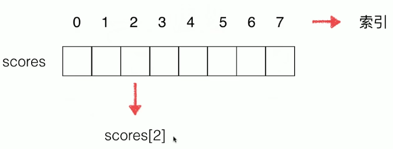
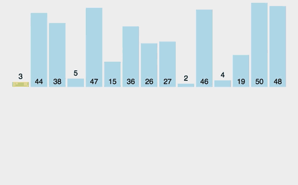
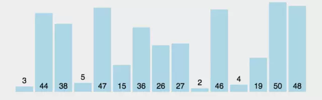
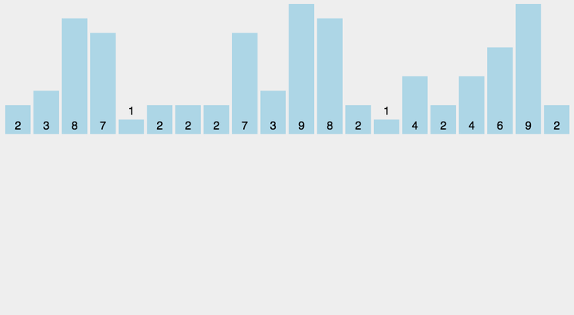

# 1、数据结构与算法


## 1、Hash Table (散列表) 介绍


### 1、什么是 Hash Table ?

也就是我们常说的哈希表.散列表其实就是数组支持按照下标随机访问数据的特性. 所以散列表其实就是数组的一种扩展.可以说没有数组就没有散列表.所以利用数组支持下标随机访问的时候. 时间复杂度是O(1)这一特性.就可以实现快速的判断元素是否存在序列当中

```java
int[] array = new int[100]; 
```

如上Java代码就是一个简单的散列表.


### 2、什么是 Hash 函数？

简单来说就是对 N 取模 比如 

```java
Hash (10 % 3 = 1)  
```

就是一个简单的散列函数, 其实这就是一个散列删除.也就是大家熟知的Hash(Key). 这个Hash函数就是我们说的散列函数.我们通过它来计算散列的值的.重中之重.


### 3、什么 是 Hash 冲突？


其实这是一个无法避免的原理. 比如MD5这些加密的Hash算法等等.某些情况下就会出现冲突.我们几乎无法找到一个完美的无冲突的散列函数

>   MD5算法也会有重复的. MD5 加密算法最大有128位. 2^128次方个数据.根据鸽巢原理.比如2个巢穴.3只鸟.其中一只鸟必然无法入巢. 所以.当数据达到 2^128次方 + 1 的时候. 就会存在Hash冲突


### 4、如何解决 Hash 冲突？


#### 1、线性寻址 又名 开放寻址


线性寻址：顾名思义.就是按照下标顺序存取数据.如果hash冲突.就往下一个下标查询.如果没有数据就存储.如果有就继续查找下一下标


面试问题思考：装不下怎么办：【自动扩容】 删除下标数据怎么办

>   【删除下标会有一个标志位：标志已删除的空位.如果是空位就自动往下查找或插入】

**如上其实只是简单的一种方式.还有一种完美的解决方式**


#### 2、链表（拉链法）


链路地址：其实就是使用链表. 链表法是一种更加常用的散列冲突解决办法.相对开放寻址.其方法要简单很多.

如下这个图. 在这个散列表中.每个key会对应一条链表.所有散列值相同的元素我们都放到相同槽位对应的链表中.


-   优点：使用简单. 插入和删除容易: 原因. 删除插入只需要改变链表指针. 就可以了.
-   缺点：遍历很慢.如果有10000条数据. 就要从链表头遍历到尾. **针对链表的查询慢的缺点. 树的结构就很好的解决了这个问题**

如下图所示


## 2、时间/空间复杂度入门


### 1、算法的特征


五个特征：有穷性、确定性、可行性、有输入、有输出.
设计原则：正确性、可读性、健壮性Bug：写代码很少有Bug.而且系统比较稳定.
高效率与低存储：内存+CPU 堆栈内存OOM. 内存占用最小.CPU占用最小.运算速度最快.


### 2、时间复杂度


时间复杂度：运行一个程序所花费的时间;  
时间复杂度表示方法：大O表示法. 例：

```apl
O(n), O(ologn), O(1), O(n^2), O(n+1), O(logn)
```

几种常见的时间复杂度分析：计算时间复杂度.往往是计算量比较大的.而且都是不确定的数.如果已经确定了.那么就不用计算时间复杂度了.也就是我们说的常量


#### 1、常数 O(1)：


>   表示常数.所有能确定的数字我们都用O(1)来表示. 哪怕是 O(100),O(10000)、**总之忽略常熟就是** => O(1)表示、

时间复杂度为 O(1) 的代码

```java
/**
 * 常数
 * 时间复杂度为 O(1). 因为代码只运行了1次
 */
public static void OOne(){
    int a = 10;
}
```

时间复杂度为 O(1) 的代码2

```java
/**
 * 时间复杂度同样为O(1)
 *   所有运行次数能用常数表示的都是O(1)
 */
public static void OOne1(){
    int a = 0;
    //那For循环运行了几次？四次.
    //因为如果不运行四次. 怎么知道 i < 3 了. 最后一次必然是跳出循环的那次.
    for (int i = 0; i < 3; i++) {
        a += 1; //本行循环运行了三次. 时间复杂度是多少？ O(3) ? O(N)? 都不是. 正解 => O(1)
    }
}
```


#### 2、对数 O(logn)：


>   **经典的二分查找时间复杂度就是O(logn). 比如100 里找69. 算法就是历次减半. (100 / 2) = 50等等...**

恶补数学公式定义(高一必修)：

>
>   对数公式： 如果 a ^ x = N ( a > 0, 且 a 不等 1 ),  则 x 叫做以 a 为底N的对数.[ 恍然大悟 ], 记作 x = log(a)(N),  其中要写于log右下. 其中 a 叫做对数的底, N 叫做真数. 通常我们将以10为底的对数叫做常用对数. 以e为底的对数称为自然对数.

下面的程序代码会演示说明什么是对数 O(logn)

```java
/**
 * 时间复杂度 O(logn)
 * @param n 表示变量.未知数
 */
public static void logarithm(int n){
    int i = 1;
    /**
     * 这里怎么计算时间复杂度？
     *   i 的值依次累加. 为 2、4、8、16、32 推出 => 2^1、2^2、2^3、2^4、2^x 次方等等...
     *
     * 进而推出=> 2^x=n 用对数函数表示为 x = log2n 
          继而=> 因为计算机里会忽略掉常数所以 x = logn 那么再用大O表示法就是O(logn)
     */
    while (i <= n){
        i = i * 2;
    }
}
```


#### 3、线性 O(N)：


>   时间复杂度为 O(N) 的代码并不复杂. 就是在O(1)的复杂度上.循环的次数不确定.是个变量.

```java
/**
 * 线性时间复杂度
 * 复杂度为 O(N)
 * @param n 变量未知数 n
 */
public static void on(int n){
    int a = 0;
    for (int i = 0; i < n; i++) {
        a = a + 1;
    }
}
```


#### 4、线性对数 O(nlogn)：


>   代码是怎么样的. 其实很简单. 就是在 O(logn) 的代码基础上.外层在加一层循环.如以下程序的时间复杂度就是O(nlogn)

```java
/**
 * 时间复杂度 O(nlogn)
 * @param n 表示变量.未知数
 */
public static void nlogarithm(int n){
    int i = 1;
    /**
     * 此处的时间复杂度就是 O(nlogn)
     * 在O(logn)的基础上又加了一层循环.
     */
    for (int j = 0; j < n; j++) {
        while (i <= n){
            i = i * 2;
        }
    }
}
```


#### 5、平方 O(n^2)：


>   这个时间复杂度怎么表示.其实就是在O(N)的基础上.外层继续加个循环
>
>   **著名编程算法. 冒泡排序的时间复杂度就是O(n^2).**

时间复杂度为 O( n ^ 2 ) 的代码

```java
/**
 * 这个时间复杂度为O(n^2)
 * @param n
 */
public static void onSquare(int n){
    int a = 0;
    /**
     * 这里怎么计算呢.外层循环是n次. 内存循环也是n次. 顾名思义 推出 => O(n^2)
     */
    for (int j = 0; j < n; j++) {
        for (int i = 0; i < n; i++) {
            a = a + 1;
        }
    }
}
```

以下代码也是  O( n ^ 2 ) . 恶补数学公式定义等差数列：

>   等差数列是指从第二项起，每一项与它的前一项的差等于同一个常数的一种数列，常用A、P表示。这个常数叫做等差数列的公差，公差常用字母d表示

```java
/**
 * 时间复杂度同样为 O(n^2)
 * @param n
 */
public static void onSquare1(int n){
    int a = 1;
    /**
     * 外层循环次数是确定的 O(n), 循环n次. 1、2、3、4、5、....n
     *   i = n 运行1次
     *   i = n - 1 运行2次
     *   .
     *   .
     *   i = 1 运行n次
     *   1、2、3 ... n 次 这里用到等差数列公式. n * (n + 1) / 2 => 忽略掉常数 => O(n ^ 2)
     */
    for (int i = 0; i < n; i++) {
        for (int j = i; j < n; j++) {
            a = a + 1;
        }
    }
}
```


#### 6、N次方 O(n^n)：

>   性能最差的算法、严重避免该算法的应用


#### 7、时间复杂度小结：


时间复杂度的意义：

>   怎么测试接口的性能.压测.冒烟.要依赖测试环境.流程长测试规模和数据不准确. 排序算法：123/321. 排序时间肯定是不一样的.应该自己用代码分析.也就是时间复杂度


时间复杂度如何来分析.

-   找 for while 递归. 而且要找循环量最大的那一段
-   找有网络请求(RPC、远程调用、分布式、数据库请求)的地方

时间复杂度阶梯图


>   几种常见的时间复杂度效率排序

 效率从最高到最低 [优化的目标就是往 O(1) 的方向接近.]

```apl
O(1) > O(logn) > O(n) > O(nlogn) > O(n^2) > O(n^x) 
```

其中如果是 

```apl
O(1) > O(logn) > O(n) > O(nlogn) 
```

效果都是很好的.几乎优化的空间不是很大


### 3、空间复杂度


空间复杂度：运行程序所需要的内存 OOM、如何找出程序的空间复杂度：开了空间的地方. 比如 数组.、链表、缓存对象、递归等等


## 2、进制 和 位运算符 (番外)


### 1、认识常用的进制


#### 1、Java针对整数常量提供4种形式


##### 1、二进制

>   二进制 ：由 0、1组成，以 0b 开头(大小写不敏感)
>
>   如下代码

```java
public static void main(String[] args){
    // 0b 表示定义二进制数据
    int num = 0b100;
    System.out.println(num);
}
```


##### 2、八进制

>   八进制 ：由 0....7组成，以 0 开头
>
>   如下代码

```java
public static void main(String[] args){
    // 0开头表示定义八进制数据
    int num = 0100;
    System.out.println(num);
}
```


##### 3、十进制

>   十进制 ：由 0....9组成，整数默认是十进制的 1、十进制就不需要演示了吧


##### 4、十六进制

>   十六进制：由 0.....0, a, b, c, d, e, f (大小写均可)，以 0x 开头

```java
public static void main(String[] args){
    // 0x开头表示定义十六进制数据
    int num = 0x100;
    System.out.println(num);
}
```


#### 2、Java中的数值开辟空间大小

```apl
1 byte = 8 bit                         byte  = 8 bit
1 kb = 1024 byte                       Int   = 4 byte = 32 bit
1 mb = 1024 kb                         float = 4 byte = 32 bit
1 gb = 1024 mb                         long  = 8 byte = 64 bit
                                       char  = 2 byte = 16 bit
```


#### 3、进制数据之间的计算


##### 1、二进制之间的计算

>   0b1101 + 0b1101010 等于多少呢？首先要进行对齐如下.

```java
          1  1  0  1
1  1  0   1  0  1  0
---------------------------
1  1  1   0  1  1  1

// 如上的计算步骤、如果上下位都位为1、那么 1 + 1 超出了二进制的表示范围就进1、和十进制一样.
```


##### 2、八进制之间的计算

>   01275 + 02476 等于多少呢？如下步骤计算

```java
            1  2  7  5
        0   2  4  7  6
---------------------------
        0   3  7  7  3
// 如上的计算步骤、如果上下位之和大于8就往前进位计算
```


##### 3、十六进制之间的计算

>   0x1ab + 0x99a 等于多少呢？
>
>   如右参考公式：a = 10 、b = 11、c = 12、d = 13、e = 14、f = 15

```java
                 1  a  b 
                 9  9  a
---------------------------
                 b  4  5
// 如上的计算步骤、b + a = 10 + 11 = 21、21 - 16(进制). = 5 进 1 、依次类推 最终得出 => 0xb45
```


### 2、进制转换基础


#### 1、进制转换必掌握的概念


>   **系数**：每一个位上的数字（157，个位的系数是7；十位的系数是5；百位的系数是1）
>   **基数**：例如（十进制的157）的基数是10. **总结-几进制基数就是几**
>   **权**：一个数据从右往左, 从0开始、对每一位数据进行编号、那么这个编号就是这个位置上的数字的权.  如下

```java
     1 5 7
-------------
//权 2 1 0

```


#### 2、任意进制到十进制的转换


>   规律：这个数据的各个位上的系数乘以基数的权次幂相加的和


##### 1、十进制 => 十进制

```apl
157 = 7 * 10 ^ 0 + 5 * 10 ^ 1 + 1 * 10 ^ 2 = 7 + 50 + 100 = 157
```

##### 2、二进制 => 十进制

```apl
0b110 = 0 * 2 ^ 0 + 1 * 2 ^ 1 + 1 * 2 * 2 = 0 + 2 + 4 = 6
```

##### 3、八进制 => 十进制

```apl
0110 = 0 * 8 ^ 0 + 1 * 8 ^ 1 + 1 * 8 ^ 2 = 0 + 8 + 64 = 72
```

##### 4、十六进制 => 十进制

```apl
0xABC = 12 * 16 ^ 0 + 11 * 16 ^ 1 + 10 * 16 ^ 2 = 12 + 176 + 2560 = 2784
```


#### 3、十进制到任意进制的转换


>   规律：**除基数取余数、直到商为0、余数反转.** 
>
>   把10进制的 100 分别转为 二进制、八进制、十六进制

##### 1、十进制 => 二进制

```java
100 / 2 = 50 ..... 0
 50 / 2 = 25 ..... 0
 25 / 2 = 12 ..... 1
 12 / 2 = 06 ..... 0
 06 / 2 = 03 ..... 0
 03 / 2 = 01 ..... 1
 01 / 2 = 00 ..... 1
// 最终得出 1100100
```

##### 2、十进制 => 八进制

```java
100 / 8 = 12 ..... 4
 12 / 8 = 01 ..... 4
 01 / 8 = 00 ..... 1
// 最终得出 144
```

##### 3、十进制 => 十六进制

```java
100 / 16 = 6 ..... 4
 06 / 16 = 0 ..... 6
// 最终得出 64
```

##### 4、习题：十进制1000 => 十六进制

```java
1000 / 16 = 62 ..... 8
  62 / 16 = 03 ..... e
  03 / 16 = 00 ..... 3
// 最终得出 0x3e8
```


#### 4、十进制和二进制的快速转换


##### 1、BCD码

>   BCD码（Binary-Coded Decimal‎）用 4 位二进制数来表示 1 位十进制数中的 0~9 这 10 个数码、是一种二进制的数字编码形式用二进制编码的十进制代码

##### 2、8421码

>   8421 码是中国的叫法、8421 其实是 BCD 码中最常用的一种. 这种编码方式中每一位的1都是代表一个固定数值. 在把每一位的二进制 1 代表的十进制的数加起来 (二进制 0 就是 0 ). 得到的结果就是它代表的十进制数.


##### 3、BCD 码展示

```ABAP
二进制：     1      1        1         1        1        1        1        1
十进制：    128     64       32        16       8        4        2        1
```


##### 4、BCD 码实战


###### 1、二进制 11011 快转 十进制

>   思路：=> 16 + 8 + 0 + 2 + 1  = 27


###### 2、十进制 100 快转 二进制

>   思路：=> 64 + 32 + 4 = 1101100


### 3、Java 位运算符


>   位指的是二进制或者是bit位


#### 1、按位与 ( & )：

>   [ 相同位数同为1的时候才为1 ]
>
>   3 & 4 结果是多少？(在进行位运算的时候要把数据转换为二进制位、并且全都是二进制补码形式)

-   在 java 中 int = 8 byte = 32 bit.
-   3 的二进制：  0000 0000 0000 0000 0000 0000 0000 0011
-   4 的二进制：  0000 0000 0000 0000 0000 0000 0000 0100
-   3 和4按位与：0000 0000 0000 0000 0000 0000 0000 0000

代码输出如下：


#### 2、按位或 ( | )：

>   [ 相同位只要有一个为1结果就为1 ]
>
>   3 | 4 结果是多少？(在进行位运算的时候要把数据转换为二进制位、并且全都是二进制补码形式)

-   3的二进制：  0000 0000 0000 0000 0000 0000 0000 0011
-   4的二进制：  0000 0000 0000 0000 0000 0000 0000 0100
-   3和4按位或：0000 0000 0000 0000 0000 0000 0000 0111

代码输出如下：


#### 3、按位异或 ( ^ )：

>   [ 相同位两个不一样的时候才为1、 如果一样为 0  ]
>
>   3 ^ 4 结果是多少？(在进行位运算的时候要把数据转换为二进制位、并且全都是二进制补码形式)

-   3的二进制：    0000 0000 0000 0000 0000 0000 0000 0011
-   4的二进制：    0000 0000 0000 0000 0000 0000 0000 0100
-   3^4按位异或：0000 0000 0000 0000 0000 0000 0000 0111

代码输出如下：


**规律：如果一个数据异或两次值不变. 比如 a ^ b ^ b = a. 一般应用在传输加密上.**

>   面试题：
>
>   用异或做两个变量值的交换、变量值交换大多用在排序算法上、这里为排序算法多贡献一种交换方式 [第三变量交换、四则运算、异或交换]

两个变量交换的方式：

-   中间变量交换
-   四则运算交换

```java
public static void main(String[] args){
    
    int a = 10;
    int b = 20;
    
    a = a + b; // a = (a)10 + (b)20
    b = a - b; // b = (a)30 - (b)20
    a = a - b; // a = (a)30 - (b)10
    
    System.out.println("a：" + a);     // 输出 20
    System.out.println("b：" + b);     // 输出 10
}
```

-   异或运算符交换

```java
public static void main(String[] args){
    
    int a = 10;
    int b = 20;
    
    a = a ^ b;
    b = a ^ b;
    a = a ^ b;
    
    System.out.println("a：" + a);     // 输出 20
    System.out.println("b：" + b);     // 输出 10
}
```


#### 4、按位取反 ( ~ )：

>   单目运算：~3 结果是多少？(在进行位运算的时候要把数据转换为二进制位、并且全都是二进制补码形式)

-   3的二进制(原码形式) 0000 0000 0000 0000 0000 0000 0000 0011
-   对3的二进制取反:      1111 1111 1111 1111 1111 1111 1111 1100   //补码负数：首位为符号位 0 正数 1 负数
-   已知补码求反码:         1111 1111 1111 1111 1111 1111 1111 1011  //补码 -1 之后取反, 取反的过程中符号位不变
-   补码 -1 后取反(原码): 1000 0000 0000 0000 0000 0000 0000 0100

代码输出如下：


#### 5、左移 ( << )：

>   [ 让操作数乘以2的n次幂、n 就是左移的位数 ] 为什么是2的n 次幂、因为操作的位是二进制的

-   3的二进制：    0000 0000 0000 0000 0000 0000 0000 0011
-   左移两位:         0000 0000 0000 0000 0000 0000 0000 1100   左移后最前面被挤掉两位、右边在补零 

代码输出如下


#### 6、右移 ( >> )：


>   [ 让操作数除以2的n次幂、n 就是右移的位数 ]

**A、正数的右移操作 32 >> 2 的结果是多少？**

-   32的二进制：  0000 0000 0000 0000 0000 0000 0010 0000
-   右移两位:          0000 0000 0000 0000 0000 0000 0000 1000

右移两位右边挤掉两位、然后左边在用符号位补全、注意符号位为1用1补、0就用0补 


**B、负数的右移操作 -32 >> 2 的结果是多少？**

```java
1000 0000 0000 0000 0000 0000 0010 0000 // -32的二进制 原码
1111 1111 1111 1111 1111 1111 1101 1111 // 原码取反得出反码
1111 1111 1111 1111 1111 1111 1110 0000 // 在 +1 得出补码
```

得出补码后右移：     

```apl
1111 1111 1111 1111 1111 1111 1111 1000
```

```java
1111 1111 1111 1111 1111 1111 1111 0111 // 然后 - 1 得出反码
1000 0000 0000 0000 0000 0000 0000 1000 // 反码取反得出原码
```

代码输出如下


#### 7、无符号右移 (>>>)：


## 3、常用数据结构介绍


### 1、数组 (Array)


#### 1、什么是数组 ？


##### 1、定义


>   有序的元素序列. 若将有限个类型相同的变量的集合命名. 那么这个名称为数组名. 
>
>   组成数组的各个变量称为数组的分量. 也成为数组的元素. 又是也成为数组的下标. 用去区分数组的各个元素的数字编号称为下标. 这些无需排列的同类数据元素的集合称为数组



数组(索引)可以是有语意的

-   比如数组的索引代表了第几个学生的成绩、scores [2] 就代表了 第三个学生的成绩

也可以是没有语意的


##### 2、特点

1.  
    数组是相同数据类型的元素的集合
2.  数组中各个元素存储是有先后顺序的.它们在内存中按照这个先后顺序连续存放在一起.
3.  数组元素用整个的名字和它自己在数组中的顺序位置来表示. 比如：a[0]. 就表示名字为a 的数组中的第一个元素.
4.  **随机访问**：数组是连续的内存空间和相同类型的数据.有利有弊.数组删除插入数据.为了保证数据的连续性.就需要大量的数据搬移工作.但是查询效率很快.

##### 3、表现形式


一维数组：如以下代码的声明.

```java
int array[] = new int[10];
```

二维多维数组：如以下代码

```java
//那以下代码的内存空间怎么计算：
//第一个 10 * 20 就是开辟的内存空间. 第二个：10 * 20 * 13 就是开辟的内存空间
int array[][] = new int[10][20];
int sum[][][] = new int[10][20][13];
```


##### 4、数组小结


**思考**：ArrayList 和 数组. 本质是一样的. 都是数组.ArrayList 是 JDK封装了.不需要管扩容等操作.数组的话就要自己动手实现.

**两者之间如何选择**：不知道数据量大小的. 肯定用 ArrayList. 如果知道数据量大小又非常关注查询性能.那就选用数组


##### 5、稀疏数组


一般是针对多维数组. 如下数组矩阵：

```apl
1 2 0 0
2 0 1 0
0 0 1 0
```

如上数据数组一共会开辟 3 * 4 个空间. 稀疏数组真正存的数据远远小于我们开辟的空间. 这种情况. 往往会用链表来代替


##### 6、堆栈内存：

>   概念：Java分为两种内存. 堆 和 栈 内存.什么是堆内存？就是存放new出来的对象和数组. 什么是栈内存? 引用变量. 堆栈都是Java用来存储数据的地方.
>
>   堆栈的区别：1、栈的速度快. 2、栈内存的数据是可以共享的.主要存一些基本数据.

例如以下解析

```java
// 在栈中创建 array 变量. 然后给 array 赋值. 
// 先不会创建一个10而是现在栈中找有没有. 如果有直接指向它. 如果没有就创建一个10进来.
int array = 10;
```


#### 2、数组的寻址公式


##### 1、一维数组寻址公式：

```java
// ==> location = init_location[初始内存地址] + index(数组的下标) * Size(数据的长度)
int[] ages = new int[100];
```


##### 2、二维数组寻址公式：

```apl
例：1  2  3
如：4  5  6
```

以上是一个二维数组. 那么一切高维数组都是可以转化为一维数组的.

>   比如以上数据转化为一维数组就是 ==> 1  2  3  4  5  6 => 那么 4 的下标在二维数组里面是 ( 1 , 0 ) => 在一维数组里面是第 3 个 ==> i * n(一维的长度) + j(二维所在的列) ==> 1 * 3 + 0 = 3 ==> 公式套入一维为 

```apl
location = init_location + ( i * n + j ) * size
```


#### 3、ArrayList 代码实现

```java
package lee.learning.video.datastructure.array;

public class Array<T> {

    private T[] data;
    private int size;

    // 构造函数，传入数组的容量capacity构造Array
    public Array(int capacity){
        data = (T[])new Object[capacity];
        size = 0;
    }

    // 无参数的构造函数，默认数组的容量capacity=10
    public Array(){
        this(10);
    }

    public Array(T[] arr){
        data = (T[])new Object[arr.length];
        for(int i = 0 ; i < arr.length ; i ++)
            data[i] = arr[i];
        size = arr.length;
    }

    // 获取数组的容量
    public int getCapacity(){
        return data.length;
    }

    // 获取数组中的元素个数
    public int getSize(){
        return size;
    }

    // 返回数组是否为空
    public boolean isEmpty(){
        return size == 0;
    }

    // 在index索引的位置插入一个新元素e
    public void add(int index, T e){

        if(index < 0 || index > size)
            throw new IllegalArgumentException("Add failed. Require index >= 0 and index <= size.");

        if(size == data.length)
            resize(2 * data.length);

        for(int i = size - 1; i >= index ; i --)
            data[i + 1] = data[i];

        data[index] = e;

        size ++;
    }

    // 向所有元素后添加一个新元素
    public void addLast(T e){
        add(size, e);
    }

    // 在所有元素前添加一个新元素
    public void addFirst(T e){
        add(0, e);
    }

    // 获取index索引位置的元素
    public T get(int index){
        if(index < 0 || index >= size)
            throw new IllegalArgumentException("Get failed. Index is illegal.");
        return data[index];
    }

    // 修改index索引位置的元素为e
    public void set(int index, T e){
        if(index < 0 || index >= size)
            throw new IllegalArgumentException("Set failed. Index is illegal.");
        data[index] = e;
    }

    // 查找数组中是否有元素e
    public boolean contains(T e){
        for(int i = 0 ; i < size ; i ++){
            if(data[i].equals(e))
                return true;
        }
        return false;
    }

    // 查找数组中元素e所在的索引，如果不存在元素e，则返回-1
    public int find(T e){
        for(int i = 0 ; i < size ; i ++){
            if(data[i].equals(e))
                return i;
        }
        return -1;
    }

    // 从数组中删除index位置的元素, 返回删除的元素
    public T remove(int index){
        if(index < 0 || index >= size)
            throw new IllegalArgumentException("Remove failed. Index is illegal.");

        T ret = data[index];
        for(int i = index + 1 ; i < size ; i ++)
            data[i - 1] = data[i];
        size --;
        data[size] = null; // loitering objects != memory leak

        /**
         * 解决复杂度震荡问题：
         *  出现的问题的原因：我们添加元素后数组刚好需要扩容 O(n)、
         *  然后我们紧接着又 removeLast 的时候、又进行了 resize、缩容过于着急
         * 解决方案：Lazy resize
         *  所以我们进行如下处理、当删除元素删除的只剩整个容器的 1/4 的时候，在进行缩容
         */
        if(size == data.length / 4 && data.length / 2 != 0)
            resize(data.length / 2);
        return ret;
    }

    // 从数组中删除第一个元素, 返回删除的元素
    public T removeFirst(){
        return remove(0);
    }

    // 从数组中删除最后一个元素, 返回删除的元素
    public T removeLast(){
        return remove(size - 1);
    }

    // 从数组中删除元素e
    public void removeElement(T e){
        int index = find(e);
        if(index != -1)
            remove(index);
    }

    public void swap(int i, int j){

        if(i < 0 || i >= size || j < 0 || j >= size)
            throw new IllegalArgumentException("Index is illegal.");

        T t = data[i];
        data[i] = data[j];
        data[j] = t;
    }

    @Override
    public String toString(){

        StringBuilder res = new StringBuilder();
        res.append(String.format("Array: size = %d , capacity = %d\n", size, data.length));
        res.append('[');
        for(int i = 0 ; i < size ; i ++){
            res.append(data[i]);
            if(i != size - 1)
                res.append(", ");
        }
        res.append(']');
        return res.toString();
    }

    // 将数组空间的容量变成newCapacity大小
    private void resize(int newCapacity){

        T[] newData = (T[])new Object[newCapacity];
        for(int i = 0 ; i < size ; i ++)
            newData[i] = data[i];
        data = newData;
    }
}
```


### 2、链表 (LinkList)


#### 1、什么是链表


链表通过指针将一组零散的内存块串联在一起, 其中. 我们把内存块称为链表的“结点”.  为了将所有的节点串联起来. 
每个链表的结点除了存储数据之外. 还需要记录链表上的下一个节点的地址. 

>   每一个结点包括 data(数据区) + next(下一个结点的内存地址). 

如下图所示


#### 2、链表的特点


-   不需要连续的内存空间
-   有指针引用


#### 3、常见的链表结构


##### 1、单向链表

>   从单链表图中. 可以发现有两个结点是比较特殊的. 分别是链表的第一个结点和最后一个结点.我们把第一个结点叫做头结点、尾部结点就叫尾结点.

-   其中头结点用来记录链表的基地址.有了它.我们就可以从第一个遍历得到整条链表.
-   而尾部结点特殊的地方是. 指针不是指向下一个结点. 而是指向一个空地址NULL


##### 2、双向链表

>   顾名思义：它支持两个方向，每个结点不只有一个后继指针 next 指向后面的结点、还有一个前驱指针 prev 指向前面的结点、双向链表**需要额外的两个空间**来存储**后继结点和前驱结点的地址**.

所以.双向链表比单向链表更占用空间. 但是可以支持双向遍历. 这样也带来了双向链表的操作灵活性


##### 3、循环链表

>   尾部的 next 指针指向头部. 如下图


##### 4、双向循环链表

>   即尾部的下一个指针指向头部. 头部的前一个指针指向尾部
>
>   MySql 的索引数据结构就是双向循环链表和 B+Tree 的结合版、B+Tree、如下图所示


##### 5、链表小结：

>   链表的插入无需像数组一样移动下标. 链表的插入和删除只需要改便前后的指针即可：如下图


#### 4、链表的代码实现


##### 1、链表接口规范

```java
package lee.learning.video.datastructure.leeinterface;

/**
 * 链表的接口 (index 从 0 开始)
 * @param <T> 泛型
 */
public interface LeeLinkedList<T> {
    /**
     * 向链表中插入一个元素
     */
    void add(T t);
    /**
     * 向链表中的指定位置插入一个元素
     */
    void add(int index, T t);
    /**
     * 向链末尾插入一个元素
     */
    void addLast(T t);
    /**
     * 向链表头部插入一个元素
     */
    void addFirst(T t);
    /**
     * 获取链表中指定位置的元素
     */
    T get(int index);
    /**
     * 获取链表中最后一个元素
     */
    T getLast();
    /**
     * 获取链表中末尾的元素
     */
    T getFirst();
    /**
     * 移除链表中指定的元素
     */
    void remove(T t);
    /**
     * 移除链表中指定位置的元素
     */
    void remove(int index);
    /**
     * 移除链表中末尾元素
     */
    void removeLast();
    /**
     * 移除链表中首位元素
     */
    void removeFirst();
    /**
     * 清空链表数据
     */
    void clear();
    /**
     * 获取链表中元素的数量
     */
    int getSize();
    /**
     * 打印链表中的元素
     */
    void print();
    /**
     * 打印链表中末尾元素
     */
    void printLast();
    /**
     * 打印链表中首位元素
     */
    void printFirst();
}
```


##### 2、单向链表的代码

```java
package lee.learning.video.datastructure.linkedlist;

import lee.learning.video.datastructure.leeinterface.LeeLinkedList;

/**
 * 单向链表的实现
 */
public class LinkedList<T> implements LeeLinkedList<T> {
    /* 链表的大小*/
    private int size;
    /* 链表头结点*/
    private Node<T> head;
    /* 链表尾结点*/
    private Node<T> tail;

    public LinkedList(){
        size = 0;
        head = null;
        tail = null;
    }

    /* 向链表中插入元素*/
    public void add(T t) { addLast(t); }

    /**
     * 将元素插入链表中的指定位置
     */
    public void add(int index, T t) {

        //情况1、插入位置正好是链表末尾下一个位置
        if(index == size ) addLast(t);
        else
        {
            Node<T> newNode = new Node<>(t);
            Node<T> curr = getAndCheck(index);
            Node<T> lastNode = getNode(index);
            /**
             * 情况2、插入的位置是头部、或者是头也是尾部.
             * 直接添加到首位
             */
            if(curr == head) addFirst(t);
            //情况3、插入的是中间
            else if(curr != head && curr != tail)
            {
                newNode.next = curr;
                lastNode.next = newNode;
                size++;
            }
            //情况4、插入的是尾部
            else if(curr == tail){
                lastNode.next = newNode;
                newNode.next = tail;
                size++;
            }
        }
    }

    /**
     * 将元素插入链表尾部
     */
    public void addLast(T t) {
        if(head == null) addFirst(t);
        else
        {
            Node<T> newNode = new Node(t);
            tail.next = newNode;
            tail = newNode;
            size++;
        }
    }

    /**
     * 将元素插入链表头部
     */
    public void addFirst(T t) {
        Node<T> newNode = new Node(t);

        if(head == null) tail = newNode;
        else {
            newNode.next = head;
        }
        head = newNode;
        size++;
    }

    public T get(int index) {
        if(index > size - 1){
            throw new ArrayIndexOutOfBoundsException();
        }
        Node<T> curr = head;
        //时间查到复杂度O(n)
        for (int i = 0; i < index; i++) {
            curr = curr.next;
        }
        return curr.value;
    }

    /* 内部用*/
    private Node<T> getNode(int index){
        if(index > size - 1){
            throw new ArrayIndexOutOfBoundsException();
        }
        Node<T> curr = head;
        //时间查到复杂度O(n)
        for (int i = 0; i < index - 1; i++) {
            curr = curr.next;
        }
        return curr;
    }

    public T getLast() {
        checkLinkedSize();
        return tail.value;
    }

    public T getFirst() {
        checkLinkedSize();
        return head.value;
    }

    public void remove(T t) {
        checkLinkedSize();

        int index = 0;
        if(t == null){
            for (Node<T> v = head; v != null; v = v.next){
                if(v.value == null){
                    removeCondition(index, v);
                    break;
                }
                index++;
            }
        }
        else{
            for (Node<T> v = head; v != null; v = v.next){
                if(v.value == t){
                    removeCondition(index, v);
                    break;
                }
                index++;
            }
        }
    }

    private void removeCondition(int index, Node v) {
        //情况1、remove的值是头既是尾
        if(v == head && v == tail)  clear();

        //情况2、remove的值在头部
        else if(v == head && v != tail)
        {
            head = head.next;
            size--;
        }
        //情况3、remove的值在中间
        else if(v != head && v != tail)
        {
            //获取要删除的前一个元素的节点
            Node<T> lastNode =  getNode(index);
            lastNode.next = v.next;
            v.next = null;
            size--;
        }
        //情况4、remove的值在尾部
        else removeLast();
    }

    public void remove(int index) {
        Node<T> curr = getAndCheck(index);

        //是头是尾
        if(curr == head && curr == tail)  clear();
        //仅是头部
        else if(curr == head && curr != tail)
        {
            removeFirst();
        }
        //在中间
        else if(curr != head && curr != tail)
        {
            Node<T> lastNode = getNode(index);
            lastNode.next = curr.next;
            curr.next = null;
            size--;
        }
        //在尾部
        else  removeLast();
    }

    private Node<T> getAndCheck(int index) {
        checkLinkedSize();
        if(index > size - 1){
            throw new IndexOutOfBoundsException();
        }

        Node<T> curr = head;
        for (int i = 0; i < index; i++) {
            curr = curr.next;
        }
        return curr;
    }

    public void removeLast() {
        checkLinkedSize();

        if(head == tail) clear();
        else
        {
            Node<T> lastNode = getNode(size - 1);
            if(lastNode == head){
                head = lastNode;
                head.next = null;
                tail = lastNode;
            }
            else
            {
                lastNode.next = null;
                tail = lastNode;
            }
            size--;
        }
    }

    public void removeFirst() {
        checkLinkedSize();

        if(head == tail) clear();
        else
        {
            head = head.next;
            size--;
        }
    }

    public void clear() {
        head = null;
        tail = null;
        size = 0;
    }

    private void checkLinkedSize(){
        if(head == null || size == 0){
            throw new RuntimeException("The linked list has no data");
        }
    }

    public int getSize() {
        return size;
    }

    public void print() {
        if(head != null){
            for (Node v = head; v != null; v = v.next) {
                System.out.println("Value: " + v.value);
            }
            System.out.println("------------------------------------");
            printFirst();
            System.out.println("----------------");
            printLast();
            System.out.println("----------------");
            System.out.println("Size: " + size);
        }
    }

    public void printLast() {
        if(head != null) System.out.println("Last Value: " + tail.value);
    }

    public void printFirst() {
        if(head != null) System.out.println("First Value: " + head.value);
    }
}

/**
 * 单向链表的节点
 */
class Node<T> {
    protected T value;
    protected Node<T> next;

    public Node(T value){
        this.value = value;
    }
}
```


##### 3、单向链表改进版

>   * 虚拟头结点：
>   *  解决添加到指定位置元素时、需要取到前一个节点、但是如果是头结点
>   *  就没有前一个节点，这里的虚拟节点可以解决逻辑分叉、避免写更多代码

```java
package lee.learning.video.datastructure.linkedlist;

/**
 * 链表的第二种实现
 */
public class LinkedList1<T> {

    private class Node{
        public T e;
        public Node next;

        public Node(T e, Node next){
            this.e = e;
            this.next = next;
        }

        public Node(T e){
            this(e, null);
        }

        public Node(){
            this(null, null);
        }

        @Override
        public String toString(){
            return e.toString();
        }
    }

    /**
     * 虚拟头结点：
     *  解决添加到指定位置元素时、需要取到前一个节点、但是如果是头结点
     *  就没有前一个节点，这里的虚拟节点可以解决逻辑分叉、避免写更多代码
     */
    private Node dummyHead;
    private int size;

    public LinkedList1(){
        dummyHead = new Node();
        size = 0;
    }

    // 获取链表中的元素个数
    public int getSize(){
        return size;
    }

    // 返回链表是否为空
    public boolean isEmpty(){
        return size == 0;
    }

    // 在链表的index(0-based)位置添加新的元素e
    // 在链表中不是一个常用的操作，练习用：）
    public void add(int index, T e){

        if(index < 0 || index > size)
            throw new IllegalArgumentException("Add failed. Illegal index.");

        Node prev = dummyHead;
        for(int i = 0 ; i < index ; i ++)
            prev = prev.next;

        prev.next = new Node(e, prev.next);
        size ++;
    }

    // 在链表头添加新的元素e
    public void addFirst(T e){
        add(0, e);
    }

    // 在链表末尾添加新的元素e
    public void addLast(T e){
        add(size, e);
    }

    // 获得链表的第index(0-based)个位置的元素
    // 在链表中不是一个常用的操作，练习用：）
    public T get(int index){

        if(index < 0 || index >= size)
            throw new IllegalArgumentException("Get failed. Illegal index.");

        Node cur = dummyHead.next;
        for(int i = 0 ; i < index ; i ++)
            cur = cur.next;
        return cur.e;
    }

    // 获得链表的第一个元素
    public T getFirst(){
        return get(0);
    }

    // 获得链表的最后一个元素
    public T getLast(){
        return get(size - 1);
    }

    // 修改链表的第index(0-based)个位置的元素为e
    // 在链表中不是一个常用的操作，练习用：）
    public void set(int index, T e){
        if(index < 0 || index >= size)
            throw new IllegalArgumentException("Update failed. Illegal index.");

        Node cur = dummyHead.next;
        for(int i = 0 ; i < index ; i ++)
            cur = cur.next;
        cur.e = e;
    }

    // 查找链表中是否有元素e
    public boolean contains(T e){
        Node cur = dummyHead.next;
        while(cur != null){
            if(cur.e.equals(e))
                return true;
            cur = cur.next;
        }
        return false;
    }

    // 从链表中删除index(0-based)位置的元素, 返回删除的元素
    // 在链表中不是一个常用的操作，练习用：）
    public T remove(int index){
        if(index < 0 || index >= size)
            throw new IllegalArgumentException("Remove failed. Index is illegal.");

        // T ret = findNode(index).e; // 两次遍历

        Node prev = dummyHead;
        for(int i = 0 ; i < index ; i ++)
            prev = prev.next;

        Node retNode = prev.next;
        prev.next = retNode.next;
        retNode.next = null;
        size --;

        return retNode.e;
    }

    // 从链表中删除第一个元素, 返回删除的元素
    public T removeFirst(){
        return remove(0);
    }

    // 从链表中删除最后一个元素, 返回删除的元素
    public T removeLast(){
        return remove(size - 1);
    }

    // 从链表中删除元素e
    public void removeElement(T e){

        Node prev = dummyHead;
        while(prev.next != null){
            if(prev.next.e.equals(e))
                break;
            prev = prev.next;
        }

        if(prev.next != null){
            Node delNode = prev.next;
            prev.next = delNode.next;
            delNode.next = null;
            size --;
        }
    }

    @Override
    public String toString(){
        StringBuilder res = new StringBuilder();

        Node cur = dummyHead.next;
        while(cur != null){
            res.append(cur + "->");
            cur = cur.next;
        }
        res.append("NULL");

        return res.toString();
    }

    public static void main(String[] args) {
        LinkedList1 linkedList = new LinkedList1();
        linkedList.addLast(1);
        linkedList.addLast(2);
        linkedList.addLast(3);
        linkedList.addLast(4);

        System.out.println(linkedList.toString());
    }
}
```


##### 4、双向链表的代码

```java
package lee.learning.video.datastructure.linkedlist;

/**
 * 双向链表的实现
 *   可以改进泛型结构
 */
public class DoubleLinkedList {

    private int size;
    /* 双向链表头结点*/
    private DNode head;
    /* 双向链表尾结点*/
    private DNode tail;

    public int get(int index){
        checkLinkedListSize();
        if(index > size - 1){
            throw new ArrayIndexOutOfBoundsException();
        }

        DNode currentNode = head;
        for (int i = 0; i < index; i++) {
            currentNode = currentNode.next;
        }

        return currentNode.value;
    }

    /**
     * 将值插入双向链表尾部
     * @param value
     */
    public void add(int value){
        DNode newNode = new DNode(value);

        if(head == null) head = newNode;
        else
        {
            tail.next = newNode;
            newNode.prev = tail;
        }
        size++;
        tail = newNode;
    }

    /**
     * 将值插入双向链表头部
     * @param value
     */
    public void addHead(int value){
        DNode newNode = new DNode(value);

        //如果头部为空. 是头既是尾直接赋值.
        if(head == null) tail = newNode;
        else
        {
            newNode.next = head;
            head.prev = newNode;
        }
        size++;
        head = newNode;
    }

    /**
     * 将值插入双向链表的指定位置
     * @param index 要插入的位置
     * @param value 值
     */
    public void addLocation(int index, int value){

        /**
         * 情况1、链表为空.直接调用add方法插入头部
         * 情况2、插入位置大于链表位置. 调用add方法添加到链表尾部
         */
        if(head == null || index > size - 1) add(value);
        else
        {
            DNode currentNode = head;
            //循环到要插入位置的对象
            for (int i = 0; i < index; i++) currentNode = currentNode.next;

            DNode newNode = new DNode(value);
            //情况3、插入位置是链表头部
            if(currentNode == head && currentNode != tail){
                currentNode.prev = newNode;
                newNode.next = currentNode;
                head = newNode;
            }
            //情况4、插入位置是链表尾部
            else if(currentNode == tail && currentNode != head){
                newNode.next = currentNode;
                newNode.prev = currentNode.prev;
                currentNode.prev.next = newNode;
                currentNode.prev = newNode;
            }
            //情况5、插入位置是链表头部也是尾部
            else if(currentNode == head && currentNode == tail){
                newNode.next = currentNode;
                currentNode.prev = newNode;
                head = newNode;
                tail = currentNode;
            }
            //情况6(最后一种)、插入位置是链表中间
            else{
                newNode.next = currentNode;
                newNode.prev = currentNode.prev;
                currentNode.prev.next = newNode;
                currentNode.prev = newNode;
            }
            size++;
        }
    }

    /**
     * 从链表中删除掉一个值
     */
    public void remove(int value){
        checkLinkedListSize();

        for (DNode c = head; c != null ; c = c.next) {
            //实现所有情况防止空指针
            if(value == c.value){
                removeTheSituation(c);
                size--;
                break;
            }
        }
    }

    /* 删除的几种情况*/
    private void removeTheSituation(DNode c) {
        //情况1、该节点是头部
        if(c == head && c != tail){
            head = c.next;
            c.next.prev = null;
            c.next = null;
        }
        //情况2、该节点是尾部
        else if(c == tail && c != head){
            tail = c.prev;
            c.prev.next = null;
            c.prev = null;
        }
        //情况3、该节点是头既是尾
        else if(c == head && c == tail){
            head = null;
            tail = null;
        }
        //情况4(最后一种)、该节点是中间
        else{
            c.prev.next = c.next;
            c.next.prev = c.prev;
        }
    }

    /**
     * 移除链表中指定位置的元素
     * @param index
     */
    public void removeIndex(int index){
        checkLinkedListSize();
        if(index > size - 1){
            throw new ArrayIndexOutOfBoundsException();
        }

        DNode currentNode = head;
        //循环确定移除的位置
        for (int i = 0; i < index; i++) currentNode = currentNode.next;

        removeTheSituation(currentNode);
        size--;
    }

    /**
     * 移除链表头部的元素
     */
    public void removeHead(){
        checkLinkedListSize();

        //情况1、是头既是尾
        if(head == tail) clear();
        //情况2、仅是头
        else
        {
            DNode temp = head;
            head.next.prev = null;
            head = head.next;
            temp.next = null;
            size--;
        }
    }

    /**
     * 清空链表数据
     */
    public void clear(){
        size = 0;
        head = null;
        tail = null;
    }

    private void checkLinkedListSize() {
        if(size == 0 || head == null){
            throw new RuntimeException("The linked list has no data");
        }
    }

    public void printAll(){
        print();
        System.out.println("----------");
        print1();
        System.out.println("---------------------");
        printHead();
        printTail();
        System.out.println("----------");
        System.out.println("Size: " + size);
    }

    /* 正向打印双向链表数据*/
    public void print(){
        for (DNode c = head; c != null ; c = c.next) {
            System.out.println("Value : " + c.value);
        }
    }

    /* 逆向打印双向链表数据*/
    public void print1(){
        for (DNode c = tail; c != null ; c = c.prev) {
            System.out.println("Value : " + c.value);
        }
    }

    /*打印链表头部*/
    public void printHead(){
        if(head != null)
            System.out.println("Head : " + head.value);
    }

    /*打印链表尾部*/
    public void printTail(){
        if(tail != null)
            System.out.println("Tail : " + tail.value);
    }
}

/**
 * 双向链表的节点
 */
class DNode {
    protected int value;
    protected DNode prev;   //双向链表前一个指针
    protected DNode next;   //双向链表后面的指针

    public DNode(int value){
        this.value = value;
    }
}
```


### 3、栈 (Stock)


#### 1、什么是栈 ？


比如我们在放盘子的时候. 

-   都是从下面到上面一个一个放. 
-   拿的时候是从上到下一个一个拿(不能从中间抽).

 这其实就是一种典型的数据结构. 后进先出 **Last In First Out ( LIFO ) 后进先出**


>   其实它是一个 限定在 表尾 进行 插入 和 删除 操作的 线性表、这一端被称为栈顶. 相对地. 另一边被称为栈底. 向一个栈内插入新元素称为进栈、入栈、压栈. 
>
>   它是把新元素加在栈顶元素的上面. 从一个栈删除一个元素称为出栈或退栈. 它是把栈顶元素删除掉. 使相邻的元素称为新的栈顶元素


#### 2、栈的代码实现


##### 1、栈的接口规范

```java
package lee.learning.video.datastructure.leeinterface;

/**
 * 栈的数据结构接口
 * @param <T> 泛型
 */
public interface LeeStack<T> {
    /**
     * 入栈
     */
    void push(T t);
    /**
     * 出栈
     */
    T pop();
    /**
     * 获取栈顶元素
     */
    T getStackTop();

    int size();

    boolean isEmpty();
}
```


##### 2、基于数组的栈

```javascript
package lee.learning.video.datastructure.stack;

import lee.learning.video.datastructure.leeinterface.LeeStack;

/**
 * 数组实现数据结构栈
 */
public class ArrayStack<T> implements LeeStack<T> {

    private T[] dataT;
    /* 已使用大小*/
    private int useSize;
    /* 默认扩容倍数*/
    private int dilatation = 2;
    /* 默认缩减倍数*/
    private int curtail = 2;
    /* 缩减最小大小*/
    private int minSize = 50;

    public ArrayStack(int size){
        dataT = (T[])new Object[size];
        useSize = 0;
    }

    private void judgeSize(){
        if(useSize >= dataT.length){
            //扩容
            T[] temp = (T[]) new Object[useSize * dilatation];
            for (int i = 0; i < useSize; i++) {
                temp[i] = dataT[i];
            }
            dataT = temp;
            System.out.println("栈进行了扩容、扩容后的大小 --> " + dataT.length);
        }
        else if(useSize > minSize && dataT.length / 2 >= useSize){
            //缩容
            T[] temp = (T[]) new Object[useSize];
            for (int i = 0; i < useSize; i++) {
                temp[i] = dataT[i];
            }
            dataT = temp;
            System.out.println("栈进行了缩容、缩容后的大小 --> " + dataT.length);
        }
    }

    /* 入栈*/
    public void push(T t) {
        judgeSize();
        dataT[useSize++] = t;
    }

    /*出栈*/
    public T pop() {
        if(isEmpty()) return null;

        judgeSize();
        /* --n 先减了再用. n-- 用了再减*/
        T t = dataT[--useSize];
        dataT[useSize] = null;
        return t;
    }

    /* 获取栈顶元素*/
    public T getStackTop() {
        return dataT[useSize - 1];
    }

    public void print(){
        for (int i = 0; i < useSize; i++) {
            System.out.println("Value : " + dataT[i]);
        }
    }

    /* 获取栈里的元素大小*/
    public int size() {
        return useSize;
    }

    public boolean isEmpty() {
        return useSize == 0;
    }
}
```


##### 3、基于链表的栈

```java
package lee.learning.video.datastructure.stack;

import lee.learning.video.datastructure.leeinterface.LeeStack;

/**
 * 单向链表实现数据结构栈
 */
public class LinkedStack<T> implements LeeStack<T> {

    private int size;
    private Node<T> head;
    private Node<T> tail;

    /* 入栈*/
    public void push(T t) {
        Node<T> newNode = new Node<>(t);
        if(head == null) head = newNode;
        else
        {
            tail.next = newNode;
        }

        tail = newNode;
        size++;
    }

    /* 出栈*/
    public T pop() {
        if(head == null) return null;

        if(head == tail){
            T t = head.value;
            head = null;
            tail = null;
            size--;
            return t;
        }

        Node<T> outNode;
        Node<T> lastNode = head;
        //循环获取尾部上一个元素
        for (int i = 0; i < size - 2; i++) {
            lastNode = lastNode.next;
        }
        outNode = lastNode.next;
        lastNode.next = null;
        tail = lastNode;

        size--;
        return outNode.value;
    }

    public void print(){
        if(!isEmpty()){
            for(Node<T> v = head; v != null; v = v.next){
                System.out.println("Value : " + v.value);
            }
            System.out.println("--------------------------");
            System.out.println("Head: " + head.value);
            System.out.println("------------");
            System.out.println("tail: " + tail.value);
        }
    }

    public T getStackTop() {
        return tail.value;
    }

    public int size() {
        return size;
    }

    public boolean isEmpty() {
        return head == null;
    }
}

/**
 * 单向链表的节点
 */
class Node<T> {
    protected T value;
    protected Node<T> next;

    public Node(T value){
        this.value = value;
    }
}
```


### 4、队列 (queue)


#### 1、什么是队列？


队列是一种特殊的线性表. 特殊之处在于它只**允许在表的前端 ( front ) 进行删除操作**. 而在表的后端 ( rear ) 进行插入操作. 和栈一样. 队列也是一种操作受限的线性表.

进行插入的端就称为队尾、进行删除的端就成为队头、队列中没有元素时、称为空队列。队列数据就称为队列元素、在队列插入一个队列元素称为入队. 

删除称为出队. **特性(FIFO - first in first out) 先进先出**、

>   队列好比排队买票一样. 结合这个生活场景来理解. 其实发现会异常简单.队列的应用也非常广泛.

 特别是具有一些额外特性的队列、比如循环队列、阻塞队列、并发队列、他们在很多偏底层系统、框架、中间件的开发中、起着关键性作用


#### 2、队列的分类


##### 1、顺序队列：

>   只能在队头删除数据、在队尾插入队列


##### 2、循环 (双向) 队列 (Deque)：

>   每一段都可以进行插入和删除数据操作


循环队列怎么判断队列是否已满？

-   加 useSize 变量. 入队就++. 出队就 - -
-   ( tail + 1 ) % n == head . 结合如下图片理解.


```java
// 循环队列的关键代码应该怎么写: 
// 入列：tail = ( tail + 1) % n;   出列：head = (head + 1) % n;
```


##### 3、优先队列：

>   基于大顶堆实现优先队列，后续会讲到


##### 4、阻塞队列 (用的较多)：

>   此种具有特殊性的队列应用比较广泛、比如阻塞队列和并发队列. 阻塞队列其实就是在队列基础上增加了阻塞操作. 

简单来说、就是在队列为空的时候. 从队头取数据会被阻塞.因为此时无数据可取、知道队列有了数据才能够正常返回. 如果队列满了.那么插入数据的操作也会被阻塞、直到队列中有空闲位置后再插入数据、然后就返回.如下图所示


**设计模式：生产者消费者模式. put生产数据. take消费数据**


##### 5、队列小结

>   队列的操作：上节总结的栈、支持两个基本操作、入栈 push() 和 出栈 pop()
>
>   (1)、队列跟栈非常相似、支持的操作也很有限、
>   (2)、最基本的操作也是两个 入队 enqueue() 将新的元素放入队列尾部. 出队 dequeue() 从对头部分取一个元素.


#### 3、队列的实现：


##### 1、队列的接口规范

```java
package lee.learning.video.datastructure.leeinterface;

/**
 * 队列的操作接口
 * @param <T> 泛型
 * @author LeeRf
 */
public interface LeeQueue<T> {
    /**
     * 入队列
     */
    boolean enqueue(T value);
    /**
     * 出队列
     */
    T dequeue();

    /**
     * 获取队列中的第一个元素s
     */
    T getFront();

    /**
     * 获取队列大小
     */
    int size();

    /**
     * 获取队列开辟空间大小
     */
    int getCapacity();

    boolean isEmpty();
}
```


##### 2、顺序队列：数组实现

```java
package lee.learning.video.datastructure.queue;

import lee.learning.video.datastructure.leeinterface.LeeQueue;

/**
 * 基于数组实现的顺序队列
 * @param <T> 泛型
 * @author LeeRf
 */
public class ArrayQueue<T> implements LeeQueue<T> {

    private T[] dataT;
    private int head = 0;
    private int tail = 0;
    private int useSize = 0;

    public ArrayQueue(int size){
        dataT = (T[]) new Object[size];
    }

    /**
     * 入队列：(head) 1、2、3、4、5 (tail)
     * 出队列：(head) 1、2、3、4、5 (tail)
     */
    public boolean enqueue(T t) {
        if(useSize == dataT.length){
            throw new RuntimeException("The queue element is full");
        }

        /**
         * head == tail 的时候其实就是队列元素空的时候.
         *  (尾部到达了数组的长度). 就进行数组下标调整. 避免空间浪费.
         */
        if (head == tail) judgeMemory();

        dataT[tail++] = t;
        useSize++;
        return true;
    }

    public T dequeue() {
        if(isEmpty()){
            throw new RuntimeException("There are no elements in the queue");
        }

        T t = dataT[head];
        dataT[head] = null;
        head++;
        useSize--;
        return t;
    }

    public T getFront() {
        if(isEmpty()){
            throw new RuntimeException("There are no elements in the queue");
        }
        return dataT[head];
    }

    private void judgeMemory(){
        if(head != 0){
            tail = 0;
            head = 0;
//            System.out.println(" 队列头尾下标进行了移动");
        }
    }

    public void print(){
        if(!isEmpty()){
            for (int i = 0; i < dataT.length; i++) {
                System.out.println("Value: " + dataT[i]);
            }
        }
    }

    public int getCapacity() {
        return dataT.length - 1;
    }

    public boolean isEmpty() {
        return tail == head;
    }

    public int size() {
        return useSize;
    }
}
```


##### 3、顺序队列：双向链表实现

```java
package lee.learning.video.datastructure.queue;

import lee.learning.video.datastructure.leeinterface.LeeQueue;

/**
 * 基于双向链表实现的顺序队列
 *  缺点：不能使用CPU缓存机制、查询效率慢、未实现线程安全
 * @param <T> 泛型
 * @author LeeRf
 */
public class LinkedQueue<T> implements LeeQueue<T> {

    private int useSize;
    private Node<T> head;
    private Node<T> tail;

    public LinkedQueue(){
        useSize = 0;
    }

    /**
     * 入队
     */
    public boolean enqueue(T t) {
        Node<T> newNode = new Node<>(t);
        if(isEmpty()) head = newNode;
        else
        {
            newNode.prev = tail;
            tail.next = newNode;
        }
        tail = newNode;
        useSize++;
        return true;
    }

    /**
     * 出队
     */
    public T dequeue() {
        if(isEmpty()){
            throw new RuntimeException("There are no elements in the queue");
        }

        T t = head.value;

        //情况1、队头即队尾
        if(head == tail)
        {
            head = null;
            tail = null;
        }
        //情况2、队头的下一个元素是队尾
        else if(head.next == tail)
        {
            head = head.next;
            tail.prev = null;
        }
        //情况3、队列不止于两个元素
        else
        {
            head = head.next;
            head.prev = null;
        }

        useSize--;
        return t;
    }

    @Override
    public T getFront() {
        return head.value;
    }

    public void printAll(){
        if(!isEmpty()) {
            for (Node<T> t = head; t != null; t = t.next) {
                System.out.println("Value: " + t.value);
            }

            System.out.println("-----------");

            for (Node<T> t = tail; t != null; t = t.prev) {
                System.out.println("Value: " + t.value);
            }

            System.out.println("----------------------------------");
            System.out.println("head: " + head.value);
            System.out.println("tail: " + tail.value);
            System.out.println("-----------");
            System.out.println("size: " + useSize);
        }
    }

    public int size() {
        return useSize;
    }

    @Override
    public int getCapacity() {
        return 0;
    }

    public boolean isEmpty() {
        return head == null;
    }
}

class Node<T>{
    protected T value;
    protected Node prev;   //双向链表前一个指针
    protected Node next;   //双向链表后面的指针

    public Node(T value){
        this.value = value;
    }
}
```


##### 4、循环队列：数组实现

```java
package lee.learning.video.datastructure.queue;

import lee.learning.video.datastructure.leeinterface.LeeQueue;

/**
 * 循环队列：数组方式实现
 */
public class LoopQueue<T> implements LeeQueue<T> {

    private T[] data;
    private int front, tail;
    private int size;

    public LoopQueue(){
        this(10);
    }

    public LoopQueue(int capacity){
        if(capacity < 1 || capacity > Integer.MAX_VALUE){
            throw new RuntimeException("Specified size of space is not supported");
        }
        data = (T[]) new Object[capacity + 1];
        front = 0;
        tail = 0;
        size = 0;
    }

    public boolean enqueue(T t) {
        /**
         * 这里判断下空间是否足够、循环队列需要浪费一个空间来判断队列元素是否满了
         * 需要以下公式来判断是否是满的、
         */
        if((tail + 1) % data.length == front){
            //扩容
            resize(getCapacity() * 2);
        }
        data[tail] = t;
        tail = (tail + 1) % data.length;
        size++;
        return true;
    }

    private void resize(int capacity){
        T[] newT = (T[]) new Object[capacity + 1];

        /**
         * 注意：
         *  这里扩容的时候不是 newT[i] = data[i]、因为front不一定是从data[i]开始的
         *  都会有(front + i) % data.length个偏差
         */
        for (int i = 0; i < size; i++) {
            newT[i] = data[(front + i) % data.length];
        }

        data = newT;
        front = 0;
        tail = size;
    }

    public T dequeue() {
        if(isEmpty()){
            throw new RuntimeException("the dequeue is empty");
        }

        T value = data[front];
        front = (front + 1) % data.length;
        size--;
        /**
         * 缩容的判断
         */
        if(size == getCapacity() / 4 && getCapacity() / 2 != 0){
            resize(getCapacity() / 2);
        }
        return value;
    }

    public T getFront() {
        if(isEmpty()){
            throw new RuntimeException("the dequeue is empty");
        }
        return data[front];
    }

    public int size() {
        return size;
    }

    public int getCapacity() {
        return data.length - 1;
    }

    public boolean isEmpty() {
        return front == tail;
    }
}
```


##### 5、优先队列：大顶堆实现

```java
package lee.learning.video.datastructure.queue;

import lee.learning.video.datastructure.leeinterface.LeeQueue;
import lee.learning.video.datastructure.tree.maxheap.MaxHeap;

/**
 * 基于大顶堆实现的优先队列
 * @param <T>
 */
public class PriorityQueue<T extends Comparable<? super T>> implements LeeQueue {

    private MaxHeap<T> maxHeap;

    public boolean enqueue(Object value) {
        maxHeap.add((T) value);
        return true;
    }

    /**
     * 出队、就取堆树中的最大值
     */
    public T dequeue() {
        return maxHeap.extractMax();
    }
    
    public T getFront() {
        return maxHeap.findMax();
    }
    
    public int size() {
        return maxHeap.getSize();
    }

    public int getCapacity() {
        return maxHeap.getSize();
    }

    public boolean isEmpty() {
        return maxHeap.isEmpty();
    }
}
```


### 5、树 (Tree) 论基础


#### 1、思考：


>   以下几个结构：下图中的结构除了一颗不是树的其余都是树的数据结构.那么不是树的是哪个呢？


答案：第四幅图.不是树.因为树的叶子不可能长在两个枝干上.


#### 2、Tree 的定义


>   在树形结构里面有几个重要的基础术语：

-   **节点**：树里面的元素 
-   **父子关系**：节点之间相连的边
-   子树：当节点大于1时，其余的节点分为的互不相交的集合称为子树
-   **度**：一个节点拥有的子树数量称为节点的度 [应用：可以根据度是否为0来区分是否是叶子节点]
-   **叶子**：度为0的节点
-   **孩子**：节点的子树的根称为孩子节点
-   **双亲**：和孩子节点对应 [其实就是父节点]
-   **兄弟**：同一个双亲节点 [其实就是同一个父亲节点]
-   **森林**：由N个互不相交的树构成森林


#### 3、Tree 的重要术语


-   节点的高度：节点到叶子节点的最长路径.如下图演示


-   节点的深度：根节点到该节点的边个数
-   节点的层数：节点的深度加1
-   树的高度：根节点的高度 3

举例几个你所知道的二叉树：如、平衡二叉树、二叉查找树、B Tree 、B+ Tree ( 这俩个其实是N叉树.即N个分叉 ). 红黑树、完全二叉树、满二叉树、其中的完全二叉树：用到堆排序、大顶堆，小顶堆.


### 6、二分搜索树 (BinaryTree)


#### 1、什么是二分搜索树？


二分搜索树又叫二叉树、二叉排序树：它具有以下特点：

-   如果它的左子树不为空.则左子树上的节点的值都小于根节点
-   如果它的右子树不为空、则右子树上的节点的值都大于根节点
-   子树同样也要遵循以上两点

为什么要叫做二叉搜索树呢？

>   只要一颗树是二叉搜索树. 那么它的中序遍历一定是有序的. 比如按照 左 根 右 如下图的中序输出正好是有序的
>
>   中序输出：左 根 右 => 0 3 4 5 6 8. 正好是从小到大的顺序. 二叉的查找算法其实是不是就和二叉查找树联系起来了


##### 1、Binary Tree：


>   在树形结构中最重要的就是二叉树、很多经典的算法与数据结构其实就是通过二叉树发展而来的.

一种特殊的树形结构、每个节点至多只有两个子树、注意没有说至少. 就是当有一个节点时 (就算极端成像链表那样) 也是二叉树


在二叉树的第N层上至多只有 2 ^ (N - 1) 个节点.最多有 2 ^ N - 1 个节点个数. 如下图所示


##### 2、满二叉树：

>   除了叶子节点外、每个节点都有左右两个子节点. 上图所示的就是一个满二叉树


##### 3、完全二叉树：

>   除最后一层外、其它节点个数必须达到最大，并且最后一层的节点都连续靠左排列.不能中间不能有空值


##### 4、我们做个思考：

>   其实满二叉树也是一个完全二叉树、为什么要区分完全二叉树呢，又为什么完全二叉树又要靠左排列呢？

换句话讲、如果让你设计一个二叉树你会怎么实现？用链表？NoNoNo 链表的查找效率是很慢的. 没有数组天生的可以使用CPU缓存. 随机访问等特性.那么用数组怎么存储、二叉树的数据呢? 如下图


那么用数组来存我们如何推出节点与数组下标之间的关系呢？如右公式 =>  A: n = 1 那么A的两个子节点分别为 

```apl
2 * n ( left ) 和 2 * i + 1 ( right )
```

那么如果没有完全二叉树. 如果如下图右边的二叉树用数组来存. 最底层倒数第二个节点的值为Null的话. 用数组里对应下标也要空出来一个空值. (注意：不能删除这个下标.)

(数组下标是连续的. 否则公式推导出来的下标是错误的. 但也造成了浪费). 但是完全二叉树就没有这样的一个情况. 如下图所示：


#### 2、二分搜索树的遍历


##### 1、前序遍历：

-   根 左 右 => A B C D E F G H K

##### 2、中序遍历：

-   左 根 右 => B D C A E H G K F

##### 3、后续遍历：

-   左 右 根 => D C B H K G F E A

##### 4、层次遍历：

-   一层层遍历 => A B E C F D G H K


>   以下B站视频可以帮助更好的理解二叉树的遍历方式
>   https://www.bilibili.com/video/BV1BJ411e79i?from=search&seid=5000780686097984531


#### 3、二分搜索树的实现


>   1、插入的时候和根节点比较.如果大于根节点的话就递归根节点的右子树.如果小于根节点就递归根节点的左子树. 直到遍历到叶子节点才是该值的插入位置
>
>   2、查询的时候判断大于根节点的话走右边.小于的话走左边. 然后递归一直到找到该元素时结束
>
>   3、删除分为三种情况：
>
>   -   要删除的节点时叶子节点
>   -   要删除的节点只有一个子树(左或者右)
>   -   要删除的节点有两颗子树：找后继节点、而且后继节点的左子树一定为空


##### 1、BinaryTree-优雅实现

```java
package lee.learning.video.datastructure.tree;

import lee.learning.video.datastructure.queue.ArrayQueue;

/**
 * 二分搜索树
 */
public class BinarySearchTree<T extends Comparable<? super T>>{

    //用来实现二分树的层次遍历
    private ArrayQueue arrayQueue;

    /**
     * 二分搜索树的节点定义
     * @param <T>
     */
    private static class BinaryNode<T>{
        T data;
        BinaryNode<T> left;
        BinaryNode<T> right;

        public BinaryNode(T data) {
            this.data = data;
        }

        public BinaryNode(T data, BinaryNode<T> left, BinaryNode<T> right) {
            this.data = data;
            this.left = left;
            this.right = right;
        }
    }

    private BinaryNode<T> root;

    public BinarySearchTree(){
        root = null;
        arrayQueue = new ArrayQueue(50);
    }

    public void makeEmpty(){
        root = null;
    }

    public boolean isEmpty(){
        return root == null;
    }

    public boolean contains(T t){
        return contains(t, root);
    }

    public T findMin(){
        if(isEmpty()){
            throw new RuntimeException("BinarySearchTree is empty");
        }

        return findMin(root).data;
    }

    public T findMax(){
        if(isEmpty()){
            throw new RuntimeException("BinarySearchTree is empty");
        }

        return findMax(root).data;
    }

    public void insert(T t){
        root = insert(t, root);
    }

    public void remove(T t){
        root = remove(t, root);
    }

    /**
     * Internal method to find an item in a subtree
     */
    private boolean contains(T t, BinaryNode<T> node){
        if(t == null) return false;

        int compareResult = t.compareTo(node.data);

        if(compareResult < 0){
            return contains(t, node.left);
        }else if(compareResult > 0){
            return contains(t, node.right);
        } else {
            return true;
        }
    }

    /**
     * Internal method to find the smallest item in a subtree
     * @param node
     * @return
     */
    private BinaryNode<T> findMin(BinaryNode<T> node){

        if(node == null) return null;

        if(node.left != null){
            return findMin(node.left);
        }
        else {
            return node;
        }
    }

    /**
     * Internal method to find the largest item in a subtree
     * @param node
     * @return
     */
    private BinaryNode<T> findMax(BinaryNode<T> node){

        if(node != null){
            while(node.right != null){
                node = node.right;
            }
        }
        return node;
    }

    /**
     * Internal method to insert into a subtree
     * @param t
     * @param node
     * @return
     */
    private BinaryNode<T> insert(T t, BinaryNode<T> node){

        if(node == null)
            return new BinaryNode<T>(t);

        int compareResult = t.compareTo(node.data);

        if(compareResult < 0){
            node.left = insert(t, node.left);
        }
        else if(compareResult >= 0){
            node.right = insert(t, node.right);
        }

        return node;
    }

    /**
     *
     * @param t
     * @param node
     * @return
     */
    private BinaryNode<T> remove(T t, BinaryNode<T> node){

        if(node == null) return null;

        int compareResult = t.compareTo(node.data);

        if(compareResult < 0){
            node.left = remove(t, node.left);
        }
        else if(compareResult > 0){
            node.right = remove(t, node.right);
        }
        else if(node.left != null && node.right != null)
        {
            node.data = findMin(node.right).data;
            node.right = remove(node.data, node.right);
        }
        else{
            node = (node.left != null) ? node.left : node.right;
        }
        return node;
    }

    private void print(BinaryNode<T> node){
        System.out.print(node.data + " ");
    }
}
```


##### 2、BinaryTree 手动实现

```java
package lee.learning.video.datastructure.tree;

import lee.learning.video.datastructure.queue.LoopQueue;

import java.util.Stack;

/**
 * 二分搜索树的递归实现
 *  添加重复操作会包含重复元素[左子树都小等于根节点、右子树都大于根节点]
 */
public class BinarySearchTree1<T extends Comparable<? super T>> {

    private int size;
    private BinaryNode root;

    /*二分搜索树节点定义*/
    private class BinaryNode{
        T data;
        BinaryNode left;
        BinaryNode right;
        public BinaryNode(T data) {
            this.data = data;
        }
        public BinaryNode(T data, BinaryNode left, BinaryNode right) {
            this.data = data;
            this.left = left;
            this.right = right;
        }
    }

    /**
     * 二分搜索树添加元素
     */
    public void insert(T value){
        size++;
        root = insert(root, value);
    }

    private BinaryNode insert(BinaryNode node, T value){
        if(node == null)
            return new BinaryNode(value);
        int compareResult = value.compareTo(node.data);

        if(compareResult <= 0)
            node.left = insert(node.left, value);
        else
            node.right = insert(node.right, value);

        return node;
    }

    /**
     * 是否包含某个元素
     */
    public boolean contains(T value){
        checkTreeIsEmpty();
        return contains(root, value);
    }

    private boolean contains(BinaryNode node, T value){
        if(node == null)
            return false;

        int compareResult = value.compareTo(node.data);
        if(compareResult < 0){
            return contains(node.left, value);
        }else if(compareResult > 0){
            return contains(node.right, value);
        }else{
            return true;
        }
    }

    /**
     * 删除任意元素
     *  并返回删除后新的该节点的元素
     */
    public void remove(T value){
        checkTreeIsEmpty();
        size--;
        root = remove(root, value);
    }

    private BinaryNode remove(BinaryNode node, T value){
        if(node == null) return null;

        //查找阶段
        int compareResult = value.compareTo(node.data);

        if(compareResult < 0){
            node.left = remove(node.left, value);
            return node;
        }else if(compareResult > 0){
            node.right = remove(node.right, value);
            return node;
        }else{
            //找到了该元素进行删除
            //情况1：待删除节点左子树为空情况
            if(node.left == null){
                BinaryNode rightNode = node.right;
                node.right = null;
                return rightNode;
            }

            //情况2：待删除节点右子树为空情况
            if(node.right == null){
                BinaryNode leftNode = node.left;
                node.left = null;
                return leftNode;
            }

            /**
             * 情况3：左右子树都不为空
             *  1、找到比待删除节点大的最小节点，即待删除节点右子树的最小节点
             *  2、用这个节点顶替待删除节点的位置
             */
            BinaryNode successor = findMin(node.right);
            successor.right = removeMin(node.right);
            successor.left = node.left;

            /**
             * 因为removeMin方法已经做了size--. 那么就做了两次--.就需要一次++操作抵消
             */
            size++;
            //释放删除节点的左右指针.使该对象能够被GC
            node.left = node.right = null;
            return successor;
        }
    }

    /**
     * 删除最小值.
     *  并返回删除后的新的最小值的节点
     */
    public BinaryNode removeMin(){
        checkTreeIsEmpty();
        size--;
        return removeMin(root);
    }

    private BinaryNode removeMin(BinaryNode node){

        if(node.left == null){
            BinaryNode rightNote = node.right;
            node.right = null;
            return rightNote;
        }

        node.left = removeMin(node.left);
        return node;
    }

    /**
     * 删除最大值
     *  并返回删除后新的最大值的节点
     */
    public BinaryNode removeMax(){
        checkTreeIsEmpty();
        size--;
        return removeMax(root);
    }

    private BinaryNode removeMax(BinaryNode node){
        if(node.right == null){
            BinaryNode leftNode = node.left;
            node.left = null;
            return leftNode;
        }
        node.right = removeMax(node.right);
        return node;
    }

    /*查找最大值、递归实现*/
    public T findMax(){
        checkTreeIsEmpty();
        return findMax(root).data;
    }

    private BinaryNode findMax(BinaryNode node){
        if(node.right != null){
            return findMax(node.right);
        }else{
            return node;
        }
    }

    /*查找最小值、循环实现*/
    public T findMin(){
        checkTreeIsEmpty();
        return findMin(root).data;
    }

    private BinaryNode findMin(BinaryNode node){
        while(node.left != null){
            node = node.left;
        }
        return node;
    }

    /**
     * 前序遍历的非递归实现
     *   数据结构：栈
     */
    public void loopPreOrder(){
        Stack<BinaryNode> stack = new Stack<BinaryNode>();
        stack.push(root);

        while(!stack.isEmpty()){
            BinaryNode node = stack.pop();
            System.out.print(node.data + " ");
            if(node.right != null){
                stack.push(node.right);
            }
            if(node.left != null){
                stack.push(node.left);
            }
        }
    }

    /**
     * 层次遍历
     *  数据结构：队列
     */
    public void levelOrder(){
        LoopQueue<BinaryNode> queue = new LoopQueue<BinaryNode>();
        queue.enqueue(root);

        while(!queue.isEmpty()){
            BinaryNode currNode = queue.dequeue();
            System.out.print(currNode.data + " ");
            if(currNode.left != null)
                queue.enqueue(currNode.left);
            if(currNode.right != null)
                queue.enqueue(currNode.right);
        }
    }

    //前序遍历
    public void preOrder(){
        checkTreeIsEmpty();
        preOrder(root);
    }

    private void preOrder(BinaryNode node){
        if(node == null)
            return;

        System.out.print(node.data + " ");
        preOrder(node.left);
        preOrder(node.right);
    }

    //中序遍历
    public void inOrder(){
        checkTreeIsEmpty();
        inOrder(root);
    }

    private void inOrder(BinaryNode node){
        if(node == null)
            return;

        inOrder(node.left);
        System.out.print(node.data + " ");
        inOrder(node.right);
    }

    //后续遍历
    public void postOrder(){
        checkTreeIsEmpty();
        postOrder(root);
    }

    private void postOrder(BinaryNode node){
        if(node == null)
            return;

        inOrder(node.left);
        inOrder(node.right);
        System.out.print(node.data + " ");
    }

    public int getSize(){
        return size;
    }

    public boolean isEmpty(){
        return root == null;
    }

    private void checkTreeIsEmpty() {
        if (isEmpty()) {
            throw new RuntimeException("BinarySearchTree is empty");
        }
    }

    public static void main(String[] args) {
        BinarySearchTree1 bsTree = new BinarySearchTree1();
        bsTree.insert(20);
        bsTree.insert(23);
        bsTree.insert(21);
        bsTree.insert(12);
        bsTree.insert(14);
        bsTree.insert(9);
        bsTree.insert(19);
        bsTree.insert(28);
        bsTree.insert(10);
        bsTree.insert(25);
        bsTree.insert(24);

        //init show
        bsTree.show();

        System.out.println("\nfind Max：" + bsTree.findMax());
        System.out.println("find Min：" + bsTree.findMin());

        bsTree.levelOrder();
        System.out.println("\nremove：23\n");
        bsTree.remove(23);
    }
}
```


##### 3、BinaryTree- K V 实现

```java
package lee.learning.video.datastructure.tree;

/**
 * 二分搜索树的实现
 *   基于 K - V 形式的存储
 */
public class KVBSTree<K extends Comparable<? super K>, V> {

    private int size;
    private Node root;

    public KVBSTree() {
        size = 0;
        root = null;
    }

    //节点定义
    private class Node{
        public K key;
        public V value;
        public Node left, right;

        public Node(K key, V value){
            this.key = key;
            this.value = value;
            left = right = null;
        }
    }

    /**
     * 向二分搜索树中添加元素(key, value)
     */
    public void add(K key, V value){
        size++;
        root = add(root, key, value);
    }

    /**
     * 向以node为根的二分搜索树中插入元素(key, value).递归算法
     * 返回插入新节点后的二分搜索树的根
     */
    private Node add(Node node, K key, V value){

        if(node == null)
            return new Node(key, value);

        int compareResult = key.compareTo(node.key);

        if(compareResult < 0){
            node.left = add(node.left, key, value);
        }else if(compareResult > 0){
            node.right = add(node.right, key, value);
        }else{
            node.value = value;
        }
        return node;
    }

    /**
     * 删除 key 并返回所对应的 value
     * @param key
     */
    public V remove(K key){
        checkTreeEmpty();
        size--;
        Node node = getNode(root, key);
        if(node != null){
            root = remove(root, key);
            return node.value;
        }
        return null;
    }

    /**
     * 删除 key 并返回所对应的节点
     * @return
     */
    private Node remove(Node node, K key){
        if(node == null)
            return null;

        int compareResult = key.compareTo(node.key);

        if(compareResult < 0){
            node.left = remove(node.left, key);
            return node;
        }else if(compareResult > 0){
            node.right = remove(node.right, key);
            return node;
        }else{

            if(node.left == null){
                Node nodeR = node.right;
                node.right = null;
                return nodeR;
            }

            if(node.right == null){
                Node nodeL = node.left;
                node.left = null;
                return nodeL;
            }

            Node successor = findMin(node.right);
            successor.right = removeMin(node.right);
            successor.left = node.left;

            node.left = node.right = null;

            return successor;
        }
    }

    /**
     * 根据 key 取得对应的 value 值
     */
    public V get(K key){
        Node node = getNode(root, key);
        return node == null ? null : node.value;
    }

    /**
     * 将 key 对应的 value 修改为新的 newValue 值
     */
    public void set(K key, V newValue){

        Node updateNode = getNode(root, key);
        if(updateNode == null)
            throw new IllegalArgumentException(key + " doesn't exist!");

        updateNode.value = newValue;
    }

    /**
     * 判断key是否存在
     */
    public boolean contains(K key){
        return getNode(root, key) != null;
    }

    /**
     * 返回以node为根节点的二分搜索树中 key 所在的节点
     */
    private Node getNode(Node node, K key){

        if(node == null)
            return null;

        if(key.equals(node.key)){
            return node;
        }else if(key.compareTo(node.key) < 0){
            return getNode(node.left, key);
        }else{
            return getNode(node.right, key);
        }
    }

    /**
     * 删除并返回最小值
     * @return
     */
    public V removeMin(){
        checkTreeEmpty();

        size--;
        V minValue = findMin();
        root = removeMin(root);
        return minValue;
    }

    /**
     * 删除并返回最小值所在节点
     * @param node
     */
    private Node removeMin(Node node){
        if(node.left == null){
            Node nodeR = node.right;
            node.right = null;
            return nodeR;
        }

        node.left = removeMin(node.left);
        return node;
    }

    /**
     * 删除并返回最大值
     * @return
     */
    public V removeMax(){
        checkTreeEmpty();

        size--;
        V maxValue = findMax();
        root = removeMax(root);
        return maxValue;
    }

    /**
     * 删除并返回最大值节点
     * @param node
     */
    private Node removeMax(Node node){
        if(node.right == null){
            Node nodeL = node.left;
            node.left = null;
            return nodeL;
        }
        node.right = removeMax(node.right);
        return node;
    }

    /**
     * 返回最小值
     */
    public V findMin(){
        checkTreeEmpty();
        return findMin(root).value;
    }

    /**
     * 返回最小节点
     * @param node
     */
    private Node findMin(Node node){
        if(node.left == null)
            return node;
        return findMin(node.left);
    }

    /**
     * 返回最大值
     */
    public V findMax(){
        checkTreeEmpty();
        return findMax(root).value;
    }

    /**
     * 返回最大节点
     * @param node
     */
    private Node findMax(Node node){
        if(node.right == null)
            return node;
        return findMax(node.right);
    }

    private int getSize(){
        return size;
    }

    private boolean isEmpty(){
        return root == null;
    }

    private void checkTreeEmpty(){
        if(root == null){
            throw new RuntimeException("Binary search tree is empty");
        }
    }

    public static void main(String[] args) {
        KVBSTree bsTree = new KVBSTree();
        bsTree.add(20, "a");
        bsTree.add(23, "b");
        bsTree.add(21, "c");
        bsTree.add(12, "d");
        bsTree.add(14, "e");
        bsTree.add(9, "f");
        bsTree.add(19, "g");
        bsTree.add(28, "h");
        bsTree.add(10, "i");
        bsTree.add(25, "j");
        bsTree.add(24, "k");

        //init show
        bsTree.show();

        System.out.println("\nfind Max：" + bsTree.findMax());
        System.out.println("find Min：" + bsTree.findMin());
    }
```


##### 4、BinaryTree- 链表实现

```java
package lee.learning.video.datastructure.tree;

import lee.learning.video.datastructure.queue.ArrayQueue;

/**
 * 二叉树的简单实现
 * 链表方式
 */
public class LinkedBinaryTree<T> {

    //用来实现二叉树的层次遍历
    private ArrayQueue arrayQueue;

    public LinkedBinaryTree(){
        arrayQueue = new ArrayQueue(50);
    }

    /**
     * 二叉树的前序遍历
     */
    public void pre(TreeNode root){
        print(root);
        if(root.left != null) pre(root.left);
        if(root.right != null) pre(root.right);
    }

    /**
     * 二叉树的中序遍历
     */
    public void in(TreeNode root){
        if(root.left != null) in(root.left);
        print(root);
        if(root.right != null) in(root.right);
    }

    /**
     * 二叉树的后序遍历
     */
    public void next(TreeNode root){
        if(root.left != null) in(root.left);
        if(root.right != null) in(root.right);
        print(root);
    }

    /**
     * 二叉树的层次遍历. 用一个消息队列实现
     */
    public void level(TreeNode root){
        arrayQueue.enqueue(root);
        TreeNode currentNode;

        while(!arrayQueue.isEmpty())
        {
            currentNode = (TreeNode) arrayQueue.dequeue();
            System.out.print(currentNode.data + " ");

            if(currentNode.left != null) arrayQueue.enqueue(currentNode.left);
            if(currentNode.right != null) arrayQueue.enqueue(currentNode.right);
        }

    }

    public void print(TreeNode treeNode){
        System.out.print(treeNode.data + " ");
    }
}

class TreeNode<T>{
    T data;
    TreeNode<T> left;
    TreeNode<T> right;

    public TreeNode(T data, TreeNode left, TreeNode right) {
        this.data = data;
        this.left = left;
        this.right = right;
    }
}
```


##### 5、打印 BinaryTree 部分

```java
    public void show() {
        checkTreeEmpty();
        int treeDepth = getTreeDepth(root);

        int arrayHeight = treeDepth * 2 - 1;
        int arrayWidth = (2 << (treeDepth - 2)) * 3 + 1;

        String[][] res = new String[arrayHeight][arrayWidth];
        for (int i = 0; i < arrayHeight; i++) {
            for (int j = 0; j < arrayWidth; j++) {
                res[i][j] = " ";
            }
        }

        writeArray(root, 0, arrayWidth / 2, res, treeDepth);

        for (String[] line : res) {
            StringBuilder sb = new StringBuilder();
            for (int i = 0; i < line.length; i++) {
                sb.append(line[i]);
                if (line[i].length() > 1 && i <= line.length - 1) {
                    i += line[i].length() > 4 ? 2 : line[i].length() - 1;
                }
            }
            System.out.println(sb.toString());
        }
    }

    public int getTreeDepth(Node root) {
        return root == null ? 0 : (
                1 + Math.max(getTreeDepth(root.left), getTreeDepth(root.right))
        );
    }

    private void writeArray(Node currNode, int rowIndex, int columnIndex, String[][] res, int treeDepth) {
        if (currNode == null)
            return;

        res[rowIndex][columnIndex] = String.valueOf(currNode.key);

        int currLevel = ((rowIndex + 1) / 2);

        if (currLevel == treeDepth)
            return;

        int gap = treeDepth - currLevel - 1;

        if (currNode.left != null) {
            res[rowIndex + 1][columnIndex - gap] = "/";
            writeArray(currNode.left, rowIndex + 2, columnIndex - gap * 2, res, treeDepth);
        }

        if (currNode.right != null) {
            res[rowIndex + 1][columnIndex + gap] = "\\";
            writeArray(currNode.right, rowIndex + 2, columnIndex + gap * 2, res, treeDepth);
        }
    }
}
```


#### 4、二分搜索树的缺点


>   二叉搜索树在极端的时候节点会变成一条线状、那么如何优化呢？


**因此就有了AVL树和红黑树.**

又称平衡二叉树、它的左右子树高度之差不超过1、通过增加和删除可能需要通过一次或多次树旋转来重新平衡这个树、这样确实可以避免一条直线的结构、但还不是我们最理想的状态.


### 7、集合 (List) 和映射 (Mapper)


### 8、线段树 (SegmentTree)


### 9、字典树 (TrieTree)


### 10、并查集 (Union)


### 11、堆树 (Heap Tree)


### 12、平衡二叉树 (AVL Tree)


### 13、红黑树(Red Black Tree)


### 14、B Tree 和 B+Tree


### 15、图论结构 (Graph)


## 4、常用数据结构的应用场景


### 1、数组 (Array) 的应用


#### 1、统计全国年龄数据


##### 1、面试经典：

>   给你一个文件 [ 文件大小：5G左右 ] 里面包含全国人民 (14亿) 的年龄数据  ( 0 ~ 180 ) 岁，现在要你统计每一个年龄有多少人？给定机器为 单台 +2CPU + 2G 内存. 不得使用现成的容器. 比如Map等.


##### 2、解题思路：

分布式? 题目要求. 单台 +2CPU + 2G 内存

排序算法？NoNoNo. 排序算法的最高效率为： O(nlogn)14亿. 排不出来. 而且内存也不够.

数组算法：因为要统计每个年龄段有多少人. 那年龄段是多少? 0 ~ 180 岁. 那好. 我们就只有开辟一个简单的数组就可以. 

```java
//如下代码：
int[] ages = new int[180];
```

然后一行一行读 [ 如果不一行一行电脑内存不够会死机 ] .然后每一行的值就是一个年龄数据.然后对应的数组下标就++. 例 ages[line]++


##### 3、具体实现


>   生成一个包含全国年龄数据的大文件代码

```java
/**
 * 生成一个包含全国年龄数据的大文件.
 * @throws IOException
 */
public static void createBigAgeFile() throws IOException {
    final String fileName = "F:\\Java_BigAgeFile\\age.txt";
    final Random random = new Random();
    BufferedWriter objWriter = null;
    objWriter = new BufferedWriter(new OutputStreamWriter(new FileOutputStream(fileName)));
    for (int i = 0; i < 1400000000; i++) {
        int age = Math.abs(random.nextInt()) % 180;
        objWriter.write(age + "\r\n");
    }
    objWriter.flush();
    objWriter.close();
}
```

>   以下为数组模式的具体代码实现

```java
package lee.learning.video.datastructure.array.practice;

import java.io.*;
import java.util.Random;

public class BigFileRead {
    public static void main(String[] args) throws IOException {
        readBigAgeFile();
    }

    public static void readBigAgeFile() throws IOException {
        int count = 0;
        int[] ages = new int[180];
        String filePath = "F:\\Java_BigAgeFile\\age.txt";
        long totalTime  = System.currentTimeMillis();
        //输入流读取类.
        InputStreamReader streamReader = new InputStreamReader(new FileInputStream(filePath));
        //缓冲读取
        BufferedReader bufferedReader = new BufferedReader(streamReader);

        String str = null;
        //while 一行一行的读取
        while ((str = bufferedReader.readLine()) != null){
            int index = Integer.parseInt(str);
            ages[index]++;
            count++;
        }

        for (int i = 0; i < ages.length; i++) {
            System.out.println("年龄为 [ " + i + " ] 的有 " + ages[i] + " 个人");
        }

        System.out.println("\n 总数据：" + count);
        System.out.println("\n 总花费时间：" + (System.currentTimeMillis() - totalTime) + " ms");

        streamReader.close();
        bufferedReader.close();
    }
}
```


### 2、链表 (LinkList) 的应用


#### 1、约瑟夫问题


丢手绢.所有人围起来一圈.开始点数.点到几. 谁就退出. 链表的经典算法

>   实现思路：单向循环链表就可以实现. 每次数5个数. 从第一个人开始.就像报数一样.报到第五个人. 就移除链表第五个元素. 然后把下一个元素开始报数继续移除第五个元素


#### 2、如何设计一个 LRU 缓存淘汰算法？


>   实现思路：用单向链表实现.最近使用的数据插入链表头部.作为最常使用.根据场景可以每个链表配个数组. 记录每个数据使用的次数.如果数据超过链表大小.就删除链表尾部不常用数据.


### 3、栈 (Stock) 的应用


#### 1、设计一个括号匹配功能


>   例如有些编译器，要判断一段代码是否是完整结构、比如给你一串括号让你判断是否符合我们的括号原则. 如右所示：[ () { () } {} ] 输入的括号要满足如右规则


```java
package lee.learning.video.datastructure.stack.practice;

import lee.learning.video.datastructure.stack.ArrayStack;

/**
 * 用栈实现-括号匹配代码
 * @author LeeRf
 */
public class BracketMatching {
    /*存放括号匹配的规则*/
    private ArrayStack<Character> arrayStack = new ArrayStack(20);
    /*默认匹配的括号*/
    private String defaultBracket = "{[(<>)]}";

    public BracketMatching(){ }
    public BracketMatching(String matchingRule){
        if(matchingRule == null || "".equals(matchingRule.trim())){
            throw new RuntimeException("matching rule is not empty");
        }

        this.defaultBracket = matchingRule;
    }

    public boolean parsingMatch() {
        char[] value = defaultBracket.toCharArray();

        for (char c : value){
            switch (c){
                case '{':
                case '[':
                case '(':
                case '<':
                    arrayStack.push(c);
                    break;
                case '>':
                    if(arrayStack.getStackTop() == '<'){
                        arrayStack.pop();
                    }
                    break;
                case ')':
                    if(arrayStack.getStackTop() == '('){
                        arrayStack.pop();
                    }
                    break;
                case ']':
                    if(arrayStack.getStackTop() == '['){
                        arrayStack.pop();
                    }
                    break;
                case '}':
                    if(arrayStack.getStackTop() == '{'){
                        arrayStack.pop();
                    }
                    break;
            }
        }
        return arrayStack.isEmpty();
    }

    public String getDefaultBracket() {
        return defaultBracket;
    }

    public void setDefaultBracket(String defaultBracket) {
        this.defaultBracket = defaultBracket;
    }
}
```


#### 2、设计浏览器的前进后退功能？


>   思路：用两个栈实现. 加入A栈存储前进链接. B 栈存储后退链接. 
>
>   当用户做了界面跳转. 就存入 后退功能. 然后当点击了后退功能. 就将B后退栈栈顶元素出栈并存入A前进栈. 点击前进功能. 就将A栈栈顶元素出栈. 并且将出栈元素存入B后退栈


#### 3、用栈实现一个简单的四则运算


>   3 + 11 * 2 + 8 - 15 / 5. 用栈来实现这个算术表达式

思路实现：用两个栈来实现. 一个存数字. 一个放符号. 然后我们从头开始遍历这个表达式.

1.  遇到数字就我们就直接入栈到数字栈里去
2.  遇到算术符号. 就把算术符号的栈顶拿出来作比较(为空直接存入). 如果优先级比栈顶符号高就存入栈中.如果比符号栈顶的优先级相同或者较低. 就从符号栈里取栈顶进行计算(从数字栈中取出两个栈顶的数). 计算完的结果还是要放入数字栈中.

说的简单. 你自己动手实现一下试试


### 4、队列 (queue) 的应用


#### 1、线程池处理任务策略：


>   CPU：线程池里面当任务满时、此时又来一个新任务，线程池是如何处理的? 具体有哪些策略? 这些策略又是如何实现的？

有几种策略：

1、排队：阻塞队列. 有空闲的时候再拿. 不就是本篇后面那个消费者生产者 take 和 put 吗. 如果在公平的情况下. 肯定是先进先出. 这就是今天讲的队列.

这时候我们就有两种实现方式. 一个是无限的排队队列. (链表、千万别用、LinkedBlockingQueue 、JDK 的 如果任务量很大的时候队列元素无线增长系统会被拖垮)

还有一种就是有界队列 (数组实现的). 只处理我们开的空间大小. 多了的继续抛出去、注意数组队列的大小. 小了不够、大了浪费.

2、丢弃：不处理了. 直接抛出去


## 5、算法专项 - 排序算法


### 1、排序算法概念


#### 1、你所知道的排序算法有哪些？


>   快速排序、冒泡排序、希尔排序、二分排序(二路归并)、桶排序、堆排序、基数排序、插入排序、选择排序、其中 插入 & 希尔 & 归并 排序 => 递进的过程、
>
>   选择 & 冒泡 & 快速 => 也是递进的过程.


#### 2、如何分析一个排序算法？


我们通常从哪几个方面来分析一个排序算法？

1.  **时间效率**：程序运行了多久，时间复杂度
2.  **空间复杂度**：就是程序运行使用了多少空间
3.  **比较次数&交换次数**：排序肯定会涉及两个操作, 一个比较大小是肯定的(比较大小是比较吃性能的) 还有就是交换
4.  **稳定性**：同样的数据、排序完后相对的位置不变


#### 4、稳定性的详细介绍


>   就是同样的数据、排序完后相对的位置不变.


那么肯定是第一种的稳定性比较好、因为排完序后两个 3 的相对位置不变,  那么稳定排序有什么意思？应用在哪？

>   电商里卖弄订单排序：首先会按照金额从小到大排序, 金额相同的时候按下单时间排序、我们从订单中心过来的时候已经按照时间排好序了, 金额需要自己排序的时候

```apl
1、08:01 ￥65
2、12:01 ￥30
3、14:30 ￥30
4、18:42 ￥80
```

那么这种情况下. 如果选到不稳定的排序算法. 那么我还要比较两次,而且 14:30 的 30金额 可能会排到 12:01 分前面. 如果我选择稳定的排序算法, 那么我只要比较一个字段.


### 2、十大基础排序算法


#### 1、插入排序 insertSort


>   [重要 - 使用多_稳定排序]


##### 1、插入排序是什么？


我们可以结合打扑克牌进行理解插入排序：

>   打扑克的时候一张一张起牌、然后按照顺序在手里排序、方便自己看牌势, 这时候, 牌分为两部分、第一似乎手里排好序的牌, 一部分是牌堆里无序的牌.


下面进入正题：一个有序的数组：我们往里面添加一个新的数据后, 如何继续保持数组的有序呢？我们只要遍历数组, 找到数据应该插入的位置插入即可, 具体分为以下步骤：

-   将数组分为已排序和未排序段、初始化时已排序只有一个元素.
-   到未排序段取元素插入到已排序段、并保证插入后依然有序
-   重复执行上述操作、直到未排序段元素全部插入排序完毕


>   插入排序动画演示：
>




##### 3、Java 代码实现：


>   插入排序的时间复杂度外层循环是 O(n)，内层循环是 1、2、3、4、5 ..... N 次 => O(n) 最终是 O(n^2)
>
>   从以下代码分析得出插入排序的时间复杂度是 O( n ^ 2 ) , 那么怎么进行优化、如下的希尔排序

```java
private int[] nums;

/**
 * 插入排序的方法实现
 * 实现步骤：
 * (1)、将数组分为已排序和未排序段、初始化时已排序只有一个元素.
 * (2)、到未排序段取元素插入到已排序段、并保证插入后依然有序
 * (3)、重复执行上述操作、直到未排序段元素全部插入排序完毕
 *  时间复杂度 O(n^2)
 * 稳定性：稳定
 */
public int[] insertSort() {

    /**
     * 外层for循环 i 从 1 开始. 因为nums[0]是默认的一个初始数据.
     * 外层for循环遍历未排好序的数组
     * 二层for循环遍历已经排好序的数组元素.并进行比较排序
     * 其中：
     *   二层for循环从尾到头遍历插入.不用涉及插入数组后移动下标操作
     */
    for (int i = 1; i < nums.length; i++) {
        int j = i - 1;
        int value = nums[i];
        //从已排好序的尾部循环到头比较
        for (; j >= 0 ; j--)
        {
            /**
             * 如果已排好序的元素大于外层插入的元素 value
             * 循环将所有的已排好序的数据往后移动一位.
             */
            if(nums[j] > value)
            {
                nums[j + 1] = nums[j];
            }
            else{
                break;
            }
        }
        /**
         *    注：此时 有序列表 大于 插入元素的 数据均完成往后移位
         * 该地方就是该插入元素的有序位置.
         */
        nums[j + 1] = value;
    }

    return nums;
}
```


#### 2、希尔排序 shellsSort


>   稳定性：不稳定


##### 1、希尔排序如何改进插入排序？


>   希尔排序其实是插入排序的一个改进版. 他是怎么改进的呢？

希尔排序是把记录按照下标的一定增量分组、对每组使用直接插入排序算法排序：随着增量的逐渐减少、每组包含的关键词越来越多、当增量减至1的时候, 整个文件恰被分成一组.排序便终止.先取一个小于n的整数 d1 作为第一个增量、把文件的全部记录分组、所有距离为 d1 的倍数的记录放在同

一个组中, 先在各组内进行直接插入排序：然后取第二个增量 d2 < d1 重复上述的分组和排序, 直至所取的增量 =1 ( < .... <d2 < d1)，即所有的记录放在同一组中进行直接插入排序为止


白话其实就是分成很多小组使序列尽可能的变成有序序段、因为我们通过对插入排序分析可知，插入排序对已经排好序的序列速度是很快的. 具体的增量分段为右 => add = n / 2 假如 n = 12 => 6 , 3 , 1

例如以下图：


然后按照增量 3 进行分段. 然后继续插入排序. 循环如此. 直到增量为 1 时 在进行最后一次插入排序. 基本上很多数据已经有一定顺序了. 就减少了移动数据位置的频率. 从而提高时间复杂度

>   下图为动画演示版：
>


##### 2、Java 代码实现

```java
/**
 * 希尔排序：插入排序的改进版
 * 时间复杂度 O(n ^ (1.3 ~ 2))
 * 稳定性：不稳定
 */
public int[] shellsSort()
{
    int gap = nums.length;
    while (true) {
        gap /= 2;   //增量每次减半
        for (int i = 0; i < gap; i++) {
            for (int j = i + gap; j < nums.length; j += gap) {//这个循环里其实就是一个插入排序
                int temp = nums[j];
                int k = j - gap;
                while (k >= 0 && nums[k] > temp) {
                    nums[k + gap] = nums[k];
                    k -= gap;
                }
                nums[k + gap] = temp;
            }
        }
        if (gap == 1) break;
    }

    return nums;
}
```


#### 3、选择排序 selectSort


>   稳定性：不稳定


##### 1、选择排序介绍


>   选择排序的思路和插入排序非常相似、也分已排序和未排序区间，但选择排序每次会从未排序区间中找到最小的元素，将其放到已排序区间的末尾、但是不像插入排序会移动数组，选择排序会每次进行交换.如以下例子


>   **动画演示：**


##### 2、Java 代码实现

```java
/**
 * 选择排序：时间复杂度O(n^2)
 * 空间复杂度：O(n)
 * 稳定性：不稳定
 */
public int[] selectSort(){

    int length = nums.length;
    for (int i = 0; i < length - 1; i++) {
        int minLocation = i;
        for (int j = i + 1; j < length; j++) {
            if(nums[j] < nums[minLocation]){
                minLocation = j;
            }
        }

        if(minLocation != i){
            int temp = nums[i];
            nums[i] = nums[minLocation];
            nums[minLocation] = temp;
        }
    }
    return nums;
}
```


#### 4、冒泡排序 bubbleSort


>   稳定性：稳定


##### 1、冒泡排序介绍


冒泡排序只会操作相邻的两个数据, 每次冒泡操作都会对相邻的两个元素进行比较、看是否满足大小关系要求, 如果不满足就让它俩互换位置，一次冒泡至少会让一个元素移动到它应该在的位置，每对 列表实行一次遍历，就有一个最大项排在了正确的位置、重复n次，就完成了 n 个数据的排序工作.举例说明如下例子

```java
//初始从小到大排序
4 5 6 3 2 1  

//第一次冒泡排序
4 5 6 3 2 1 => 
4 5 3 6 2 1 => 
4 5 3 2 6 1 => 
4 5 3 2 1 6 => 
//第一次完成

```


>   动画演示：
>




##### 2、Java 代码实现


```java
/**
 * 冒泡排序：时间复杂度O(n^2)
 */
public int[] bubbleSort(){
    int len = nums.length;

    /**
     * 外层数组长度 - 1.因为 5 个数只需要比较4次即可
     */
    for (int i = 0; i < len - 1; i++) {
        /**
         * 内层.每次冒泡数组后几位都会被相继移动成为最大的.
         * 下次循环递减判断.数组尾部数据大小已被确定
         */
        for (int j = 0; j < len - 1 - i; j++) {
            if(nums[j] > nums[j + 1]){
                int temp = nums[j];
                nums[j] = nums[j + 1];
                nums[j + 1] = temp;
            }
        }
    }
    return nums;
}
```


##### 3、冒泡排序优化点


因为冒泡排序必须要在最终位置找到之前不断交换数据项，所以它经常被认为是最低效的排 序方法。这些 “浪费式” 的交换操作消耗了许多时间。但是，由于冒泡排序要遍历整个未排好的 部分，它可以做一些大多数排序方法做不到的事。尤其是如果在整个排序过程中没有交换，我们就可断定列表已经排好。因此可改良冒泡排序，使其在已知列表排好的情况下提前结束。这就是说，如果一个列表只需要几次遍历就可排好，冒泡排序就占有优势：它可以在发现列表已排好时立刻结束


#### 5、归并排序 mergeSort


>   [比较高效_稳定]


##### 1、归并排序介绍


归并排序是一种递归算法，它持续地将一个列表分成两半。如果列表是空的或者 只有一个元素，那么根据定义，它就被排序好了（最基本的情况）。如果列表里的元素超过一个，我们就把列表拆分，然后分别对两个部分调用递归排序。一旦这两个部分被排序好了，然后就可以对这两部分数列进行归并了。

归并是这样一个过程：把两个排序好了的列表结合在一起组合成一个单一的有序的新列表。有自顶向下（递归法）和自底向上的两种实现方法


上面部分是归(分治)的过程、下面是并的过程


>   动画演示：
>


##### 2、Java 代码实现

-   Invoke this

```java
//TODO: Invoke this
public int[] mergeSort(){
    return mergeSort(nums, 0, nums.length - 1);
}
```

-   归并排序：递的过程(数据分组)

```java
/**
 * 归并排序：递的过程(数据分组)
 *   时间复杂度 O(nlogn)
 * @param left 归并排序左边的起始位置
 * @param right 归并排序右边的起始位置
 */
public int[] mergeSort(int[] nums, int left, int right){
    //相等了就表示只有一个数据, 不用在拆分了
    if(left < right){
        int middle = (left + right) / 2;
        mergeSort(nums, left, middle);
        mergeSort(nums, middle + 1, right);
        return merge(nums, left, middle, right);
    }

    return null;
}
```

-   归的过程. 进行对比
-   开辟的临时数组在数据量大的时候要放在外面. 否则频繁创建数组. 开辟新对象分配空间是需要时间的

```java
/**
 * 归的过程. 进行对比
 */
private int[] merge(int[] nums, int left, int middle, int right){
    int[] temp = new int[nums.length]; //数据量大的时候放外面

    int point1 = left;       //表示的是左边的第一个位置
    int point2 = middle + 1; //表示的是右边的第一个位置
    int location = left;     //表示的是我们当前已经到了哪个位置

    /**
     * 结合归并图理解、该部分代码.
     *   循环从 point1 遍历到中间分割的位置.
     *   循环从 point2 遍历到数组尾部的位置
     * 左边位置和右边位置进行对比
     */
    while (point1 <= middle && point2 <= right)
    {
        if(nums[point1] < nums[point2])
        {
            temp[location] = nums[point1];
            location++;
            point1++;
        }
        else
        {
            temp[location] = nums[point2];
            location++;
            point2++;
        }
    }

    //对比后其实还有部分数据是没有放到temp数组中的
    while(point1 <= middle) temp[location++] = nums[point1++];
    while(point2 <= right)  temp[location++] = nums[point2++];

    for (int i = left; i <= right ; i++) {
        nums[i] = temp[i];
    }

    return nums;
}
```


#### 6、快速排序 quickSort


>   用的多—稳定性_稳定


##### 1、什么是快速排序？


通过一趟排序将要排序的数据分割成独立的两部分，其中一部分的所有数据都比另外一部分的所有数据都要小，然后再按此方法对这两部分数据分别进行快速排序，整个排序过程可以递归进行，以此达到整个数据变成有序序列，例如以下图解


>   算法步骤详解：
>

-   从数列中挑出一个元素，称为"基准"（pivot）
-   重新排序数列，所有比基准值小的元素摆放在基准前面，所有比基准值大的元素摆在基准后面（相同的数可以到任何一边）在这个分区结束之后，该基准就处于数列的中间位置。这个称为分区（partition）操作
-   递归地（recursively）把小于基准值元素的子数列和大于基准值元素的子数列排序


```java
45 28 80 90 50 16 100 10  //初始数据
```


>   动画演示：
>


##### 2、Java 代码实现

-   Invoke this

```java
//TODO: Invoke this
public int[] quickSort(){
    return quickSort(nums, 0, nums.length - 1);
}
```

-   快速排序核心代码

```java
/**
 * 快速排序：时间复杂度
 * @param start 从左边开始找的位置
 * @param end 从右边开始找的位置
 */
public int[] quickSort(int[] nums, int start, int end){

    int pivot = nums[start];//取每段的第一个元素
    int i = start;
    int j = end;

    while (i < j)
    {
        //从后面往前找到比基准数小的数
        while (i < j && nums[j] > pivot) j--;
        //从前往后找比基准数大的数
        while (i < j && nums[i] < pivot) i++;

        //如果找到的两个数相等并且 i < j 代表找到了. 就不做位置交换. 直接 ++ 跳过
        if (nums[i] == nums[j] && i < j ) i++;
        else
        {
            int temp = nums[i];
            nums[i] = nums[j];
            nums[j] = temp;
        }
    }

    if (i - 1 > start)
        nums = quickSort(nums, start,i - 1);
    if (j + 1 < end)
        nums = quickSort(nums,j + 1, end);
    return (nums);
}
```


##### 3、快速排序优化


-   当数列近乎有序的时，由于每次选取的都是第一个数，所以造成数列分割的极其不等，此时快排蜕化成 ![[公式]](https://www.zhihu.com/equation?tex=O%28n%5E2%29) 的算法， 此时只要随机选取基准点即可
-   当数列中包含大量的重复元素的时候，这一版的代码也会造成"分割不等“的问题，此时需要将重复元素均匀的分散的自数列旁
-   使用三路快排


#### 7、堆排序 heapSort


##### 1、堆树的定义

-   堆树是一颗完全二叉树
-   其每一个节点的值都大于等于(大顶堆)或者小于等于(小顶堆)其左右子节点的值.如下


>   大顶堆：就是根节点是最大的值.


>   小顶堆：根节点是最小的值


>   堆的操作：

1、堆的插入操作(两种实现方式)：

 **从下往上**：如果我们要在一个堆树插入9、如下图演示，插入9之后是不满足堆树的性质的.需要根父节点就行交换下.交换后如果父节点还大于祖父节点就继续交换


**从上往下 和 1 相反**

其实插入的过程叫做堆化. 以数组为实现方式下标从0开始的左右节点计算公式：

```apl
2 * i + 1            2 * i + 2
```


2、堆的删除

逻辑删除：就是新增一个字段标识节点是否被删除、删除的时候就标志为删除状态.

-   缺点：在一些对内存和性能要求比较高的系统中不适用、因为大量的删除操作会浪费大量的存储空间

交换节点删除：假如要删除10这个根节点、那么需要把10和3先做交换(这样可以保持完全二叉树的特性)、然后3变根节点，在对3从上往下做堆化. 再把10删除了就行了


在对3进行堆化的时候、至于该和左右子节点哪个交换位置、完全取决于左右子节点哪个大.


##### 2、堆排序 (heapSort)


假如给你一个如下序列、利用堆树进行排序：

```apl
8 4 20 7 3 1 25 14 17
```


步骤：先按照序列顺序存储在完全二叉树种

>   建堆：

-   从无到有、就是从头往后建（不推荐）
-   修正.按照数组给好的序列进行从后往前修正序列.如下图


从最后一个非叶子节点**堆化(上图黄色部分)**，为什么是最后一个非叶子节点而不是最后一个节点呢？因为叶子节点已经没有必要去做了

>   建立大顶堆：

-   先将 7 和它的左右节点进行比较、和最大的右子节点(17) 进行交换，如下图所示


-   交换后就要以倒数第二个非叶子节点20 (如上图演示) 进行和它的左右子结点对比交换.显然20的右节点比它大.就进行交换.如下图


-   然后以4和它的左节点17进行交换、交换后如果还有子结点、就继续和左右节点一直进行比较交换下去、然后就和大的14在进行一次交换。如下图


-   然后继续以8进行对比后和25交换、到此步、所有的根节点都大等于它的左右节点.至此大顶堆建造完成.如下图


>   到此步骤、堆化已经完成、下面开始排序、我们将堆顶和最后一个元素进行交换，交换完后以堆顶进行一次堆化，依次执行这个操作即可


-   注意：和堆顶交换位置的末尾元素不需要在参与堆化、因为每次堆化后的堆顶都是最大的元素（只需要和末尾元素一次交换位置即可）


>   以下是视频演示：

<video src="Interview Question.assets/heapSortMV.mp4"></video>


##### 3、Java 代码实现


-   TODO: invoking this

```java
//TODO: invoking this
public int[] heapSort() {
    int length = nums.length;
    for (int i = length / 2 - 1; i >= 0; i--) {
        heap(nums, i, length);
    }

    for (int i = length - 1; i > 0; i--) {
        int temp = nums[0];
        nums[0] = nums[i];
        nums[i] = temp;
        heap(nums, 0, i);
    }
    return nums;
}
```

-   堆排序主体

```java
private void heap(int[] nums, int start, int end){
    int parent = start;
    int left = parent * 2 + 1;

    while(left < end)
    {
        int right = left + 1;
        int maxIndex = left;

        if(right < end && nums[right] > nums[left])
        {
            maxIndex = right;
        }

        if(nums[parent] >= nums[maxIndex]) return;
        else
        {
            int temp = nums[parent];
            nums[parent] = nums[maxIndex];
            nums[maxIndex] = temp;

            parent = maxIndex;
            left = 2 * parent + 1;
        }
    }
}
```


#### 8、基数排序 radixSort


##### 1、什么是基数排序？


基数排序也是非比较的排序算法，对每一位进行排序，从最低位开始排序，复杂度为O(kn),为数组长度，k为数组中的数的最大的位数；

基数排序是按照低位先排序，然后收集；再按照高位排序，然后再收集；依次类推，直到最高位。有时候有些属性是有优先级顺序的，先按低优先级排序，再按高优先级排序。最后的次序就是高优先级高的在前，高优先级相同的低优先级高的在前。基数排序基于分别排序，分别收集，所以是稳定的

>   算法描述

-   取得数组中的最大数，并取得位数；
-   arr为原始数组，从最低位开始取每个位组成radix数组；
-   对radix进行计数排序（利用计数排序适用于小范围数的特点）；

>   动画演示


##### 2、Java 代码实现


```javascript
/**
 * 基数排序
 *   最佳情况：T(n) = O(n \* k)   最差情况：T(n) = O(n \* k)   平均情况：T(n) = O(n \* k)
 * @return
 */
public int[] radixSort() {

    // 1.先算出最大数的位数；
    int max = nums[0];
    for (int i = 1; i < nums.length; i++) {
        max = Math.max(max, nums[i]);
    }

    int maxDigit = 0;
    while (max != 0) {
        max /= 10;
        maxDigit++;
    }

    int mod = 10, div = 1;
    ArrayList<ArrayList<Integer>> bucketList = new ArrayList<>();

    for (int i = 0; i < 10; i++)
        bucketList.add(new ArrayList<>());

    for (int i = 0; i < maxDigit; i++, mod *= 10, div *= 10) {
        for (int j = 0; j < nums.length; j++) {
            int num = (nums[j] % mod) / div;
            bucketList.get(num).add(nums[j]);
        }
        int index = 0;
        for (int j = 0; j < bucketList.size(); j++) {
            for (int k = 0; k < bucketList.get(j).size(); k++)
                nums[index++] = bucketList.get(j).get(k);
            bucketList.get(j).clear();
        }
    }
    return nums;
}
```


##### 3、基数排序算法分析


>   **最佳情况：T(n) = O(n \* k)   最差情况：T(n) = O(n \* k)   平均情况：T(n) = O(n \* k)**

基数排序有两种方法：

MSD 从高位开始进行排序 LSD 从低位开始进行排序 

------


**基数排序 vs 计数排序 vs 桶排序**

这三种排序算法都利用了桶的概念，但对桶的使用方法上有明显差异：

-   基数排序：根据键值的每位数字来分配桶
-   计数排序：每个桶只存储单一键值
-   桶排序：每个桶存储一定范围的数值


#### 9、计数排序 countingSort


##### 1、计数排序描述


>   算法思想：

-   找出待排序的数组中最大和最小的元素
-   统计数组中每个值为i的元素出现的次数，存入数组C的第i项
-   对所有的计数累加（从C中的第一个元素开始，每一项和前一项相加）
-   反向填充目标数组：将每个元素i放在新数组的第C(i)项，每放一个元素就将C(i)减去1


>   动画演示：




##### 2、Java 代码实现


>   算法分析：当输入的元素是n 个0到k之间的整数时，它的运行时间是 O(n + k)。计数排序不是比较排序，排序的速度快于任何比较排序算法。由于用来计数的数组C的长度取决于待排序数组中数据的范围（等于待排序数组的最大值与最小值的差加上1），这使得计数排序对于数据范围很大的数组，需要大量时间和内存

```java
/**
 * 计数排序
 *   最佳情况：T(n) = O(n+k) 最差情况：T(n) = O(n+k) 平均情况：T(n) = O(n+k)
 * @return
 */
public int[] countingSort() {

    int bias, min = nums[0], max = nums[0];
    for (int i = 1; i < nums.length; i++) {
        if (nums[i] > max)
            max = nums[i];
        if (nums[i] < min)
            min = nums[i];
    }

    bias = 0 - min;
    int[] bucket = new int[max - min + 1];

    Arrays.fill(bucket, 0);
    for (int i = 0; i < nums.length; i++) {
        bucket[nums[i] + bias]++;
    }

    int index = 0, i = 0;
    while (index < nums.length) {
        if (bucket[i] != 0) {
            nums[index] = i - bias;
            bucket[i]--;
            index++;
        } else i++;
    }
    return nums;
}
```

**计数排序的升级改进版就是桶排序**


#### 10、桶排序 bucketSort


##### 1、桶排序是什么？


桶排序是计数排序的升级版。它利用了函数的映射关系，高效与否的关键就在于这个映射函数的确定。

桶排序 (Bucket sort)的工作的原理：假设输入数据服从均匀分布，将数据分到有限数量的桶里，每个桶再分别排序（有可能再使用别的排序算法或是以递归方式继续使用桶排序进行排

>   算法描述：
>
>   更详细的可以参考这篇博客：https://blog.csdn.net/donghuabianc/article/details/105252373

-   人为设置一个BucketSize，作为每个桶所能放置多少个不同数值（例如当BucketSize==5时，该桶可以存放｛1,2,3,4,5｝这几种数字，但是容量不限，即可以存放100个3）
-   遍历输入数据，并且把数据一个一个放到对应的桶里去
-   对每个不是空的桶进行排序，可以使用其它排序方法，也可以递归使用桶排序
-   从不是空的桶里把排好序的数据拼接起来

**注意，如果递归使用桶排序为各个桶排序，则当桶数量为1时要手动减小BucketSize增加下一循环桶的数量，否则会陷入死循环，导致内存溢出**


>   动画演示：


##### 2、Java 代码实现

```java
/**
 * 桶排序
 *
 * @param array
 * @param bucketSize
 * @return
 */
public static ArrayList<Integer> BucketSort(ArrayList<Integer> array, int bucketSize) {
    if (array == null || array.size() < 2)
        return array;
    int max = array.get(0), min = array.get(0);
    // 找到最大值最小值
    for (int i = 0; i < array.size(); i++) {
        if (array.get(i) > max)
            max = array.get(i);
        if (array.get(i) < min)
            min = array.get(i);
    }
    
    int bucketCount = (max - min) / bucketSize + 1;
    ArrayList<ArrayList<Integer>> bucketArr = new ArrayList<>(bucketCount);
    ArrayList<Integer> resultArr = new ArrayList<>();
    
    for (int i = 0; i < bucketCount; i++) {
        bucketArr.add(new ArrayList<Integer>());
    }
    for (int i = 0; i < array.size(); i++) {
        bucketArr.get((array.get(i) - min) / bucketSize).add(array.get(i));
    }
    
    for (int i = 0; i < bucketCount; i++) {
        if (bucketCount == 1)
            bucketSize--;
        ArrayList<Integer> temp = BucketSort(bucketArr.get(i), bucketSize);
        for (int j = 0; j < temp.size(); j++)
            resultArr.add(temp.get(j));
    }
    return resultArr;
}
```


##### 3、桶排序算法分析：


>   **最佳情况：T(n) = O(n+k)   最差情况：T(n) = O(n+k)   平均情况：T(n) = O(n2)**

桶排序最好情况下使用线性时间O(n)，桶排序的时间复杂度，取决与对各个桶之间数据进行排序的时间复杂度，因为其它部分的时间复杂度都为O(n)。很显然，桶划分的越小，各个桶之间的数据越少，排序所用的时间也会越少。但相应的空间消耗就会增大


#### 11、十大基础排序算法小结


##### 1、术语说明

-   **稳定**：如果a原本在b前面，而a=b，排序之后a仍然在b的前面
-   **不稳定**：如果a原本在b的前面，而a=b，排序之后a可能会出现在b的后面
-   **内排序**：所有排序操作都在内存中完成
-   **外排序**：由于数据太大，因此把数据放在磁盘中，而排序通过磁盘和内存的数据传输才能进行
-   **时间复杂度：** 一个算法执行所耗费的时间
-   **空间复杂度**：运行完一个程序所需内存的大小


##### 2、算法的分类


##### 3、排序算法对比


>   图片名词解释：

-   n: 数据规模
-   k: “桶” 的个数
-   In-place: 占用常数内存，不占用额外内存
-   Out-place: 占用额外内存


##### 4、比较和非比较算法的区别


常见的**快速排序、归并排序、堆排序、冒泡排序**等属于**比较排序**。**在排序的最终结果里，元素之间的次序依赖于它们之间的比较。每个数都必须和其他数进行比较，才能确定自己的位置**

在**冒泡排序**之类的排序中，问题规模为n，又因为需要比较n次，所以平均时间复杂度为O(n²)。在**归并排序、快速排序**之类的排序中，问题规模通过**分治法**消减为logN次，所以时间复杂度平均**O(nlogn)**

比较排序的优势是，适用于各种规模的数据，也不在乎数据的分布，都能进行排序。可以说，**比较排序适用于一切需要排序的情况。**


**计数排序、基数排序、桶排序**则属于**非比较排序**。非比较排序是通过确定每个元素之前，应该有多少个元素来排序。针对数组arr，计算arr[i]之前有多少个元素，则唯一确定了arr[i]在排序后数组中的位置。
非比较排序只要确定每个元素之前的已有的元素个数即可，所有一次遍历即可解决。算法时间复杂度**O(n)**。
**非比较排序时间复杂度底，但由于非比较排序需要占用空间来确定唯一位置。所以对数据规模和数据分布有一定的要求**


### 3、扩展排序算法


#### 1、鸡尾酒排序 cocktailSort

>   又名：双向冒泡排序


#### 2、双调排序 bitonicSort


#### 3、地精排序 gnomeSort

>   又名：侏儒排序


#### 4、奇偶排序 paritySort


#### 5、图书馆排序 librarySort


#### 6、张仰彪排序 chinaSort


#### 7、意大利面排序 pastaSort

>   又名：面条排序


#### 8、鸽巢排序 pigeonholeSort

>   又名：桶排序变种


#### 9、耐心排序 patienceSort


### 4、奇葩排序算法


#### 1、睡眠排序 sleepSort


#### 2、猴子排序 bogoSort


#### 3、慢排序 slowSort


#### 4、珠排序 beadSort


#### 5、臭皮匠排序 stoogeSort


#### 6、煎饼排序 pancakeSort


## 6、算法专项 - 思想篇


### 1、递归&分治&回溯


#### 1、什么是递归？


递归是一个非常重要的算法思想、应用也非常广泛. 以下结合生活场景来理解什么是递归. 如下

>   比如我们在某窗口排队的人太多了. 我不知道我是第几个. 那么我就问我前面的那个人排第几个. 因为他知道自己是第几个我就知道我是第几个了. 但前面的人也不知道自己是第几个人. 他也可以往前面问. 直到问到谁是第一个人（递）. 然后从第一个人一直传到我这里（归）. 我就清楚我是第几个了. 以上场景就是一个典型的递归

用数学公式表示就是 **f ( n ) = f ( n - 1 ) + 1**
其中：**f ( n )** 就是表示我的位置. **f ( n - 1)** 就是表示我前面的那个位置.


#### 2、什么样的情况下可以用递归？


(1)、一个问题的解可以分成几个子问题的解：

>   子问题 --> 我们可以通过分治的思想把一个数据规模大的问题、分成为好多很小的问题. 我们可以把上面那个生活场景 问前面那个人看为子问题、大化小.

(2)、这个问题与分解之后的子问题、求解思路完全一致

(3)、一定有一个最后确定的答案、即递归终止的条件：

>   如果没有这个特性那么我们的递归程序最终会出现死循环、最后就是栈溢出: Stack out of

(4)、递归的实现：里面有哪些算法思想？递归、回溯

>   递归的关键就是要求这个递归公式、找到终止条件、现在我们可以用上面那个 斐波那契数列：1 1 2 3 5 8 13 21 来实现我们的递归代码. 


#### 3、斐波那契数列


```java
f ( n - 1 ) + f ( n - 2 )
//终止条件：n <= 2   f ( n ) = 1  
```

如下代码：

```java
/**
 * 斐波那契数列: 时间复杂度O(2^n)
 */
public static int fab(int n){
    if( n <= 2)
        return 1;
    return fab(n - 1) + fab(n - 2);
}
```

以下是以上代码就是斐波那契数列的图解：以及运算过程


以下是排队问题的图解：以及运算过程


#### 4、递归的时间/空间复杂度分析


>   以斐波那契数列为例分析递归树 f ( n - 1 ) + f ( n - 2 ) .分析一段代码好坏. 有两个指标、时间复杂度和空间复杂度都是 O( 2 ^ n) => O(n) 或者 O(nlogn)


#### 5、递归时间复杂度优化


##### 1、拆解成非递归的方式求解


>   拆解成非递归的方式求解：如下 时间复杂度这次为 O(n)

```java
/**
 * 斐波那契数列: 拆解成循环 时间复杂度 O(N)
 */
public static int noFab(int n){
    if(n <= 2) return 1;

    int a = 1;
    int b = 1;
    int c = 0;
    for (int i = 3; i <= n; i++) {
        c = a + b;
        a = b;
        b = c;
    }
    return c;
}
```


##### 2、加入数据缓存处理

```java
public static int data[];

/**
 * 斐波那契数列: 加入数组缓存 时间复杂度O(1)
 */
public static int fab2(int n){
    if( n <= 2)
        return 1;

    //用数组来缓存
    if(data[n] > 0){
        return data[n];
    }

    data[n] = fab2(n - 1) + fab2(n - 2);
    return data[n];
}
```


##### 3、什么是尾递归？


>   尾递归就是调用函数一定出现在末尾、没有任何其它操作了.以下代码将用阶乘来做例子
>
>   思考：求N的阶乘？用普通递归怎么写、假如求 5 的阶乘. 拆解后如右 => 5 * 4 * 3 * 2 * 1 => f (n) =>  n * f ( n - 1 )

```java
   /**
     * 阶乘的递归实现：尾递归 不需要回溯
     * 运算过程拆解 初始 n = 5, res = 1
     *
     * 5 - 1 , 5 * 1 = 5
     * 4 - 1 , 4 * 5 = 20
     * 3 - 1 , 3 * 20 = 60
     * 2 - 1 , 2 * 60 = 120
     * 1 - 1 , 1 * 120 = 120
     */
    public static int tailFac(int n , int res){
        if(n <= 1) return res;
        return tailFac(n - 1, n * res);
    }
```

如上所示：

尾递归就是调用函数一定出现在末尾、没有任何其它操作了, 因为我们编译器在编译代码时、如果发现函数末尾已经没有操作了. 这是就不会创建新的栈 而且覆盖到前面去、倒着算，不需要在回溯了, 因为我们每次会把中间结果算出来在传递

##### 4、使用尾递归优化


```java
/**
 * 斐波那契数列: 使用尾递归方式
 * 时间复杂度O(n)
 * @param pre 上上一次结果
 * @param res 上一次结果
 */
public static int tailFab(int pre, int res, int n){
    if( n <= 1) return res;

    return tailFab(res, pre + res, n - 1);
}
```


##### 6、递归小结：


这节笔记主要学习了算法的基础思想、回溯&数论&枚举&递归 其实递归是最重要的. 其中的尾递归其实是属于高阶思想

的. 这节课其实尾递归看的似懂非懂. 可能还没想清楚.递归确实是一个写代码的神器、可以使代码看起来整洁和可读性

高. 但是一定要注意递归的终止条件和空间时间复杂度、否则容易栈溢出和性能不好


