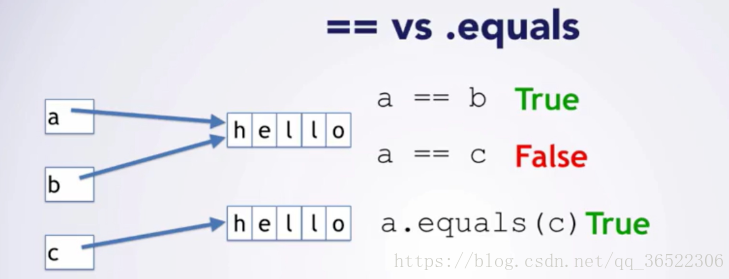
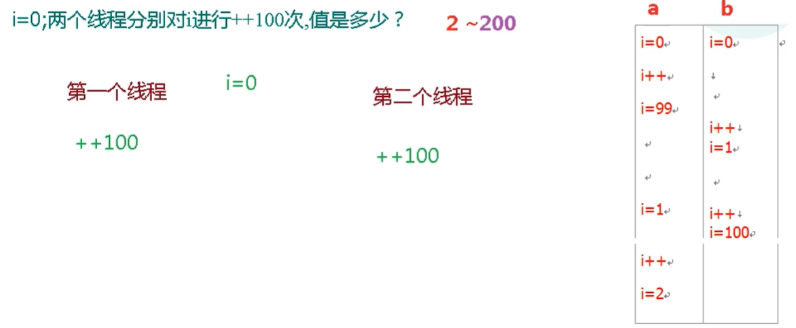
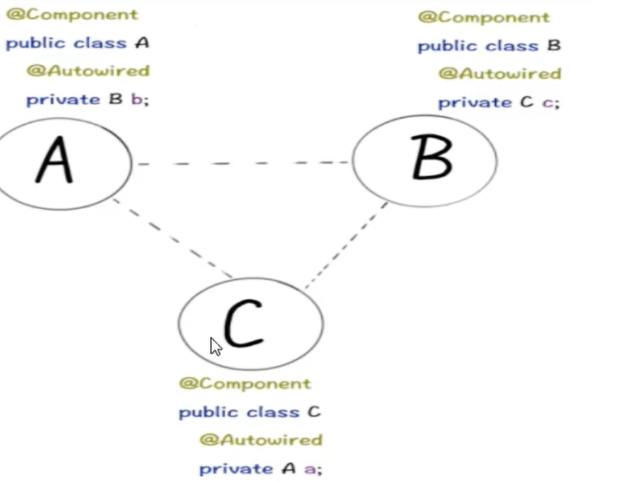
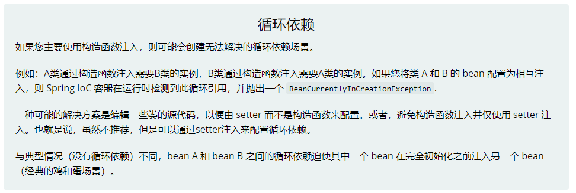
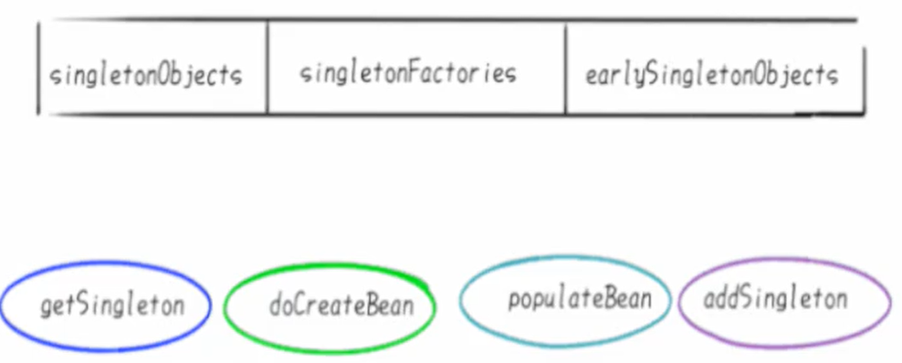
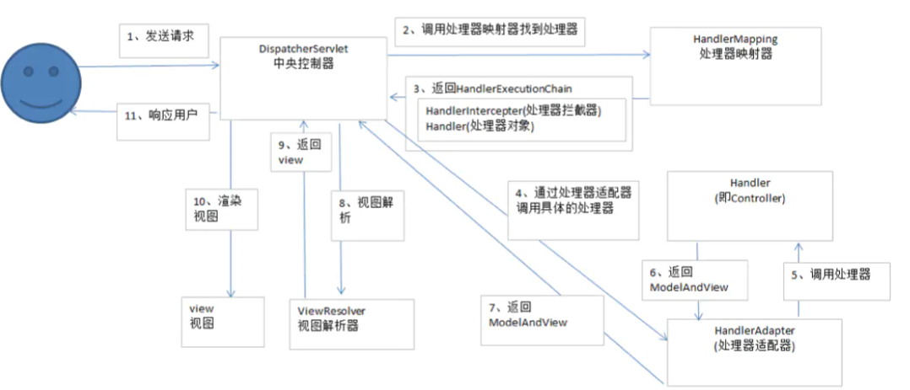

# 1、Java Question


## 1、Java 基础问题


### 1、== 和 equals() 的区别


#### 1、==


1.  对于基本数据类型的变量，如：byte、short、char、int、float、long、double 和 boolean， == 是直接对其值进行比较
2.  对于引用数据类型的变量，则是对其内存地址 (或者引用指针) 的比较


#### 2、equals()


我们知道任何类都继承 Object 类，这里我们先看下 Object 类里的 equals 方法，所以

-   如果引用类型的对象未重写 equals 方法，那么调用 equals 相等于直接用 == 判断
-   如果重写了 equals 方法则执行 equals() 方法的逻辑 （强烈推荐每个对象都重写 equals 和 hashCode 方法）

```java
public boolean equals(Object obj) {
    return (this == obj);
}
```





### 2、包装类型对象的缓存池


#### 1、Integer 包装类型 IntegerCache


>   Integer 缓存是 Java 5 中引入的一个有助于节省内存、提高性能的特性。
>
>   Integer 中有个静态内部类 IntegerCache，里面有个cache[] , 也就是 Integer 常量池，常量池的大小为一个字节（-128~127）。JDK 源码如下（摘自 JDK1.8 源码）：

```java
/**
 * Cache to support the object identity semantics of autoboxing for values between
 * -128 and 127 (inclusive) as required by JLS.
 *
 * The cache is initialized on first usage.  The size of the cache
 * may be controlled by the {@code -XX:AutoBoxCacheMax=<size>} option.
 * During VM initialization, java.lang.Integer.IntegerCache.high property
 * may be set and saved in the private system properties in the
 * sun.misc.VM class.
 */
private static class IntegerCache {
    static final int low = -128;
    static final int high;
    static final Integer cache[];

    static {
        // high value may be configured by property
        int h = 127;
        String integerCacheHighPropValue =
            sun.misc.VM.getSavedProperty("java.lang.Integer.IntegerCache.high");
        if (integerCacheHighPropValue != null) {
            try {
                int i = parseInt(integerCacheHighPropValue);
                i = Math.max(i, 127);
                // Maximum array size is Integer.MAX_VALUE
                h = Math.min(i, Integer.MAX_VALUE - (-low) -1);
            } catch( NumberFormatException nfe) {
                // If the property cannot be parsed into an int, ignore it.
            }
        }
        high = h;

        cache = new Integer[(high - low) + 1];
        int j = low;
        for(int k = 0; k < cache.length; k++)
            cache[k] = new Integer(j++);

        // range [-128, 127] must be interned (JLS7 5.1.7)
        assert IntegerCache.high >= 127;
    }

    private IntegerCache() {}
}
```


当创建 Integer 对象时，不使用 new Integer(int value) 语句，大小在-128 ~ 127之间，对象存放在 Integer 常量池中。

```java
Integer a = 10; //例如这样、值存放在常量池中
```

调用的是 Integer.valueOf() 方法，代码为：

```java
public static Integer valueOf(int i) {
    //如果 i 在缓存池的范围内，就优先取缓存池中的值
    if (i >= IntegerCache.low && i <= IntegerCache.high)
        return IntegerCache.cache[i + (-IntegerCache.low)];
    //否则 new 一个 Integer 对象放在堆中
    return new Integer(i);
}
```

>   这也是自动装箱的代码实现。JAVA 将基本类型自动转换为包装类的过程称为自动装箱（autoboxing）


实际上在 Java 5 中引入这个特性的时候，范围是固定的 -128 ~ 127。后来在 Java 6 后，最大值映射到 java.lang.Integer.IntegerCache.high，可以使用 JVM 的启动参数设置最大值

```java
-XX:AutoBoxCacheMax=size //通过 JVM 的启动参数修改
```

测试情况如下

```java
private static void TestIntegerCache() {
    int i = 10;
    int i1 = 10;

    Integer in1 = 10;
    Integer in2 = 10;

    Integer in3 = new Integer(10);
    Integer in4 = new Integer(10);

    Integer in5 = 199;
    Integer in6 = 199;

    System.out.println(i == i1);         // true
    System.out.println(i == in1);        // true

    System.out.println(i == in2);        // true
    System.out.println(i == in3);        // true

    System.out.println(in1 == in2);      // true
    System.out.println(in5 == in6);      // false

    System.out.println(in1 == in3);      // false
    System.out.println(in3 == in4);      // false
}
```


#### 2、其它包装类型缓存池


所有整数类型的类都有类似的缓存机制:

-   有 ByteCache 用于缓存 Byte 对象

-   有 ShortCache 用于缓存 Short 对象

-   有 LongCache 用于缓存 Long 对象
-   同时 Character 对象也有 CharacterCache 缓存池，范围是 0 到 127

Byte，Short，Long 的缓存池范围默认都是: -128 到 127。可以看出，Byte 的所有值都在缓存区中，用它生成的相同值对象都是相等的。所有整型（Byte，Short，Long）的比较规律与 Integer 是一样的

>   **除了 Integer 可以通过参数改变范围外，其它的都不行**


### 3、ArrayList 如何去重？如何删除指定元素？


### 4、ArrayList 如何实现排序呢？


### 5、集合类为什么需要迭代器？


### 6、介绍一些 Object 类常用的方法


### 7、JDK 1.8 引入了哪些新特性？


1、JDK8 引入新的语法特性，比如 Lambda 表达式，默认方法，方法引用，新增新的日期处理类

2、JDK8 为 Collection 新增 Stream 流式接口， 修改 HashMap 和 ConcurrentHashMap 实现

3、JDK8 修改了 JVM 内存模型， 实用 metaSpace 代替永久代

4、JDK 新增并发接口和实现， 包括新增 CompletableFuture、为 ConcurrentHashMap 新增支持 Stream 方法、新增StampedLock


### 8、一个java文件有3个类，编译后有几个class文件


### 9、局部变量使用前需要显式地赋值，否则编译通过不了，为什么这么设计


### 10、介绍下 Object 类常见的方法


### 11、对象 hashcode 的作用？


### 12、什么时候需要重写 equals 和 hashcode 方法？


### 13、为什么要实现序列化接口？


### 14、Java 中，Comparator 与 Comparable 有什么不同？


### 15、Java 泛型和类型擦除


### 16、匿名内部类是什么？如何访问在其外面定义的变量？


### 17、重写有什么限制没有？


## 2、Java (JVM) 进阶问题


### 1、HashMap 底层原理实现


### 2、HashMap 和 ConcurrentHashMap 的区别？


### 3、TreeSet 是无序的对吧，那么它如何实现去重的？


### 4、Java类初始化顺序


### 5、对方法区和永久区的理解以及它们之间的关系


### 6、写一个你认为最好的单例模式


### 7、写一个死锁


### 8、Java多态实现原理？介绍下 Override 和 Overwrite


### 9、Collections.sort 排序内部原理


### 10、深拷贝和浅拷贝的区别是什么？


### 11、如何实现一个深拷贝？


### 12、JDK 动态代理 (AOP) 使用及实现原理


#### 1、先来讲讲什么是代理吧


##### 1、认识什么是代理


比如有一家大学，可以向全世界招生，然后学生可以通过自己国家的 留学中介（代理）帮助这个大学招生

-   中介是学校的代理，中介和学校要做的事情是一致的，都是招生
-   中介是代理，需要收取一定费用


在开发中也会有这样的情况，你有 A 类，本来是调用 C 类的方法，完成某个功能，但是 A 不能直接调用 C 类，所以需要在 A 、C 类之间创建一个代理类 B


##### 2、代理模式的作用


>   使用代理模式的作用
>
>   -   **功能增强**：在原有基础功能之上，增加了额外的功能，新增加的功能叫做功能增强
>   -   **控制访问**：代理类不让你访问目标，例如商家不让用户直接访问厂家


##### 3、实现代理的方式


-   静态代理：
    -   代理类是自己手工实现的，自己创建一个 Java 类
    -   同时要代理的目标也是确定的

>   优点
>
>   -   实现简单，容易理解
>
>   缺点：
>
>   -   如果需要 10 个商家，那就需要10个代理类，代理商家多了，代理类对应的也就变多了
>   -   当你的接口中功能增加或者修改了，那么将会影响众多的实现类，厂家类、代理类都需要修改


-   动态代理：
    -   在静态代理中目标类很多的时候，可以使用动态代理，避免静态代理的缺点
    -   动态代理中目标即使很多、代理类数量可以很少，当你修改了接口中的方法时，不会影响代理类

>   实现步骤：在程序执行过程中、使用 jdk 的反射机制，创建代理类对象、并动态的指定要代理的目标类


#### 2、静态代理的详细介绍


##### 1、场景分析阶段


我们模拟一个用户购买一个 U 盘为例，

-   客户端类（用户）
-   代理类（商家）：代理某个品牌的 U 盘
-   厂家类（目标类）：

>   商家和厂家都是卖U盘的，他们完成的目标是一致的


##### 2、实现步骤阶段


-   创建一个接口：定义卖 U 盘的方法、表示厂家和商家做的事情
-   创建厂家类：实现卖U盘接口
-   创建商家类：就是代理类，也需要实现卖U盘接口
-   创建客户端类：调用商家的方法买一个 u 盘


-   创建接口部分

```java
/**
 * 厂家接口
 */
public interface Manufacturers {

    /**
     * 卖 u 盘行为
     * @param amount 购买数量
     * @return 总价格
     */
    float sellUSBFlashDisk(int amount);
}
```

-   创建厂家类、实现 Manufacturers 接口的销售 u 盘功能

```java
/**
 * 厂家类：不接受用户买一个，需要批量购买
 */
public class UsbKingFactory implements Manufacturers {
    /**
     * u盘单价
     */
    final float unitPrice = 100f;

    public float sellUSBFlashDisk(int amount) {
        return unitPrice * amount;
    }
}
```

-   创建商家类（京东）

```java
/**
 * 商家类：京东、代理销售金士顿 u 盘
 */
public class JingDong implements Manufacturers {

    //定义：商家代理的厂家
    private Manufacturers manufacturers = new UsbKingFactory();

    /**
     * 实现销售 u 盘的功能
     *   商家不可能把厂家原价销售给用户，所以每个 u 盘加价 10 块
     */
    public float sellUSBFlashDisk(int amount) {
        float money = manufacturers.sellUSBFlashDisk(amount);
        /**
         * 这一步：就是增强功能, 还可以写其它增强功能
         *   比如给你返还一个优惠券或者红包
         */
        return money + amount * 10;
    }
}
```

-   创建用户购物主类

```java
/**
 * 用户类：购物
 */
public class UserShopMain {
    public static void main(String[] args) {

        int buyAmount = 5;
        JingDong jingDong = new JingDong();
        float money = jingDong.sellUSBFlashDisk(buyAmount);

        System.out.println("通过京东购买 " + buyAmount + " 个 U 盘、一共花费￥：" + money + " 元");
    }
}
```


##### 3、静态代理总结


优点：实现简单，容易理解

缺点：

-   如果需要 10 个商家，那就需要10个代理类，代理商家多了，代理类对应的也就变多了
-   当你的接口中功能增加或者修改了，那么将会影响众多的实现类，厂家类、代理类都需要修改


#### 3、动态代理的详细介绍


##### 1、动态代理是什么？


在程序执行过程中、使用 jdk 的反射机制，创建代理类对象、并动态的指定要代理的目标类、换句话说，动态代理是一种创建 java 对象的能力，让你不用编写代理类源文件，就能创建代理类对象


>   动态代理是指代理类对象在程序运行时由 JVM 根据反射机制动态生成的，动态代理不需要定义代理类的 .java 源文件，由 jdk 运行期间，动态创建 class 字节码并加载到 JVM 中。动态代理的实现方式通常有两种：
>
>   -   使用 JDK 代理进行代理 （掌握）
>   -   通过 cglib 来进行动态代理、它是第三方的工具库（了解）
>
>   **JDK 的动态代理要求目标对象必须实现接口、这时 Java 设计上的要求，从 jdk1.3 以来，Java 语言通过 java.lang.reflect 包提供三个类支持代理模式 Proxy, Method 和 InovcationHandler**


##### 2、动态代理的实现方式


###### **1、JDK 动态代理**


Java 语言通过 java.lang.reflect 反射包提供三个类支持代理模式 InovcationHandler、Proxy、Method


###### **2、CGLib 动态代理**


CGLib ( Code Generation Library ) 是一个开源项目，是一个强大的、高性能、高质量的 Code 生成类库，它可以运行期间扩展 Java 类与实现 Java 接口，它广泛的被许多 AOP 的框架使用，例如 Spring AOP。

cglib 是第三方工具库，创建代理对象，原理是继承，通过继承目标类，并在子类中覆盖父类方法中同名方法，实现功能的修改

注意：因为 cglib 是继承、重写方法，所以要求目标类不能是 final 的，方法也不能是 final 的

>   CGLib 的要求目标类比较宽松，只要能继承就可以了，CGLib 经常被应用到框架中，例如 Spring AOP、MyBatis、Hibernate 中，CGLib 的代理效率高于 JDK，对于 CGLib 一般的开发中并不使用，做一个了解即可


###### **3、如何选择使用场景**


使用 JDK 的 Proxy 实现代理，要求目标类与代理类实现相同的接口，若目标类不存在接口，则无法使用该方式实现。**但对于无接口的类，要为其创建动态代理，就要使用 CGLib 来实现，CGLib 代理生成的原理是生成目标类的子类**，而子类是增强过的，这个子类对象是代理对象。


##### 3、JDK 动态代理反射包介绍


>   主要用到反射包 java.lang.reflect、里面有三个类：InvocationHandler、Proxy、Method


###### **1、InvocationHandler 接口**


-   invoke()：里面就一个 invoke() 方法，表示代理对象要执行的功能代码、你的代理类要完成的功能就写在 invoke() 方法中

```java
//InvocationHandler 接口中的 invoke 方法原型
public Object invoke(Object proxy, Method method, Object[] args)
    throws Throwable;
```

>   invoke() 方法参数详解：

-   Object proxy (委托人)：JDK创建的对象，无需赋值
-   Method method：目标类中的方法，JDK 提供 Method 对象的
-   Object[] args 目标类中方法的参数


###### **2、Method 类**


表示方法的，确切的说就是目标类中的方法、作用是：通过这个 Method 可以执行某个目标类的方法、用法如下：

```jade
Object ret = method.invoke(目标对象、方法参数);
```

注意：Method 中的 invoke 方法和 InvocationHandler 中的 invoke 方法不一样，只是名字恰巧一样而已


###### **3、Proxy 类**


核心的对象、创建代理对象、之前创建对象都是 new 类的构造方法，现在我们是使用 Proxy 类的方法，代替 new 使用

-   方法：静态方法 newProxyInstance()
-   作用：创建代理对象，等用于静态代理中的 new Taobao()

方法原型如下

```java
@CallerSensitive
public static Object newProxyInstance(ClassLoader loader, 
       Class<?>[] interfaces, InvocationHandler h) throws IllegalArgumentException
```

>   newProxyInstance() 方法参数：

-   ClassLoader loader：目标对象的类加载器、使用反射获取对象的 ClassLoader
-   Class<?>[] interfaces：接口、目标对象实现的接口，也是反射获取的
-   InvocationHandler h：我们自己写的，代理类要完成的功能
-   返回值 Object：目标对象的代理对象


##### 4、基于 JDK 动态代理包实现


>   实现动态代理的步骤大纲：

1.  创建接口、定义目标类要完成的功能
2.  创建目标接口类实现接口
3.  创建 InvocationHandler 接口的实现类，在 invoke 方法中完成代理类的功能
    -   调用目标方法
    -   增强功能
4.  使用 Proxy 类的静态方法、创建代理对象，并发返回值转为接口类型


>   具体代码实现

-   创建接口、定义目标类要完成的功能

```java
/**
 * 创建接口、定义目标类要完成的功能
 */
public interface UsbSell {

    /**
     * 销售 U 盘
     * @param amount 购买数量
     * @return 总价格
     */
    float sellUSBFlashDisk(int amount);
}
```

-   创建目标接口类实现接口

```java
/**
 * 创建目标接口类实现接口
 */
public class UsbKingFactory implements UsbSell {

    // U 盘单价
    final float unitPrice = 100f;

    /**
     * 厂家出售 U 盘
     * @param amount 购买数量
     * @return 总消费金额
     */
    public float sellUSBFlashDisk(int amount) {
        return unitPrice * amount;
    }
}
```

-   创建 InvocationHandler 接口的实现类，在 Invoke 方法中完成代理类的功能
    -   调用目标方法
    -   增强功能

```java
/**
 * 创建 InvocationHandler 接口的实现类，在 invoke 方法中完成代理类的功能
 * -   调用目标方法
 * -   增强功能
 */
public class MySellHandler implements InvocationHandler {

    // 目标类
    private Object target;
    // 每卖出一个 U 盘赚 10 块
    private final float profitMoney = 10f;

    public MySellHandler(Object target) {
        this.target = target;
    }

    /**
     * 调用并增强目标类的方法
     *
     * @param proxy  要调用的对象
     * @param method 要调用的方法
     * @param args   方法传入的参数
     * @return
     * @throws Throwable
     */
    public Object invoke(Object proxy, Method method, Object[] args) throws Throwable {
        Object invokeResult = method.invoke(target, args);
        //获取参数中的购买数量
        int buyAmount = Integer.parseInt(args[0].toString());
        Float money = Float.parseFloat(invokeResult.toString()) + buyAmount * profitMoney;
        return money;
    }
}
```

-   使用 Proxy 类的静态方法、创建代理对象，并发返回值转为接口类型

```java
public class LeeShopMain {
    public static void main(String[] args) {
        
        int buyAmount = 5;
        // 1、创建代理对象、使用 Proxy
        UsbSell factory = new UsbKingFactory();
        // 2、创建 InvocationHandler 对象
        InvocationHandler invocationHandler = new MySellHandler(factory);
        // 3、创建代理对象
        UsbSell proxy = (UsbSell) Proxy.newProxyInstance(factory.getClass().getClassLoader(), factory.getClass().getInterfaces(), invocationHandler);

        // 4、通过动态代理执行方法
        float money = proxy.sellUSBFlashDisk(5);
        System.out.println("通过动态代理购买 " + buyAmount + " 个 U 盘、一共花费￥：" + money + " 元");
    }
}
```


##### 5、动态代理在项目中的运用


>   可以在不改变原有目标方法代码的情况下，可以在代理中增强自己的功能. 比如
>
>   -   你在项目中有一个功能是其他人写好的，你可以使用，但是这个功能不能满足我项目的需要，比如第三方的 API、又没有源代码的情况下，那么我完全可以用动态代理来增强这个功能


## 3、Java 设计模式


### 1、 Singleton(单例) 设计模式


#### 1、什么是单例设计模式？


>   Singleton：在 Java 中即指单例设计模式、它是软件开发中最常用的设计模式之一
>
>   概念：单例设计模式，即某个类在整个系统中只能有一个实例对象可被获取和使用的代码模式


#### 2、实现单例设计模式


>   设计要点：

-   一是某个类只能有一个实例
    -   构造器私有化
-   二是它必须自行创建这个实例
    -   含有一个该类的静态变量来保存这个唯一的实例
-   三是它必须自行向整个系统提供这个实例
    -   直接暴漏  ||  用静态变量的 get 方法获取


#### 3、单例模式常见的实现


##### 1、饿汉式：直接创建对象 (没有线程安全问题)


###### 1、直接实例化（简介直观）

```java
/**
 * 饿汉式：
 *   直接创建对象，不管你是否需要
 *
 * 1、构造器私有化
 * 2、自行创景、并且静态变量保存
 * 3、向外提供这个实例
 * 4、强调这是一个单例，我们可以用 final 声明
 */
public class Singleton1 {
    public static final Singleton1 INSTANCE = new Singleton1();
}
```


###### 2、枚举式（最简洁）

-   JDK1.5 之后，我们可以直接用枚举的形式实现

```java
/**
 * 饿汉式：
 *   直接创建对象，不管你是否需要
 *
 * 枚举类型：标识该类型的对象是有限的几个
 * 我们可以限定一个就成了单例
 */
public enum Singleton2 {
    INSTANCE
}
```


###### 3、静态代码块（适合复杂实例化）

```java
/**
 * 饿汉式：
 *   直接创建对象，不管你是否需要
 *
 * 适用于比较复杂的情况、例如需要设置单例的实例信息
 */
public class Singleton3 {

    /*配置信息 config*/
    private String config;
    public static final Singleton3 INSTANCE;

    static{
        //从配置文件中读取 config 配置信息
        Properties properties = new Properties();
        INSTANCE = new Singleton3(properties.getProperty("config"));
    }

    private Singleton3(String config){
        this.config = config;
    }
}
```


##### 2、懒汉式：延迟创建对象 


###### 1、线程不安全（适用于单线程）

>   以下代码多线程情况下将会导致单例被实例化多次的问题

```java
/**
 * 懒汉式
 *   延迟创建这个实例对象
 *
 * 1、构造器私有化
 * 2、用一个静态变量保存这个唯一的实例
 * 3、提供一个静态方法、获取这个实例对象
 */
public class Singleton4 {

    private static Singleton4 instance;

    public static Singleton4 getInstance(){
        if (instance == null){
            instance = new Singleton4();
        }
        return instance;
    }
}
```


###### 2、线程安全（使用多线程）

```java
/**
 * 懒汉式
 *   延迟创建这个实例对象
 *
 * 1、构造器私有化
 * 2、用一个静态变量保存这个唯一的实例
 * 3、提供一个静态方法、获取这个实例对象
 */
public class Singleton4 {

    private static Singleton4 instance;

    public static Singleton4 getInstance(){
        
        //外层判断优化性能，只是多线程情况下如果 instance 初始化了后就不要在上锁了
        if(instance == null) {
            synchronized (Singleton4.class) {
                if (instance == null) {
                    instance = new Singleton4();
                }
            }
        }

        return instance;
    }
}
```


###### 3、静态内部类形式（适用于多线程）

```java
/**
 * 懒汉式
 *   延迟创建这个实例对象
 *
 * 静态内部类不会随着外部类的加载和初始化而初始化、它是要单独去加载和初始化
 */
public class Singleton5 {

    //在内部类被加载和初始化时，才加载和创建
    public static Singleton5 getInstance(){
        return Inner.instance;
    }

    /**
     * 内部类 Inner
     */
    private static class Inner{
        private static Singleton5 instance = new Singleton5();
    }
}
```


## 4、Java 多线程


### 1、什么是串行？什么是并发？


### 2、能说说进程和线程吗


### 3、线程的生命周期有哪些？


### 4、线程的开辟方式？


### 5、线程中常用的方法有哪些？


### 6、什么是临界资源？


### 7、线程同步有几种方案？各个方案有什么优缺点？


### 8、Synchronized 与 Lock 锁的对比？


### 9、什么是死锁？如何解决死锁？


### 10、Java中线程有哪些状态？


### 11、线程池有哪些核心参数？


### 12、线程池的线程数量过大会有什么问题吗


### 13、线程池有多少种拒绝策略？


### 14、新的任务提交到线程池，线程池是怎样处理


### 15、如何来中断一个线程？正在 Running 的线程能够被中断吗？


## 5、JUC 并发编程


### 1、用互斥锁实现读写锁，写者优先


### 2、ReadWriteLock 读写之间互斥吗


### 3、Semaphore 拿到执行权的线程之间是否互斥


### 4、i++ 是原子性操作吗？


>   "原子操作(atomic operation)是不需要synchronized"，这是多线程编程的老生常谈了。所谓原子操作是指不会被[线程调度](https://baike.baidu.com/item/线程调度/10226112)机制打断的操作；这种操作一旦开始，就一直运行到结束，中间不会有任何 context switch （切换到另一个线程）、**但是需要注意的是原子保证不等于指令执行顺序的保证**


所以不是，因为 Java 是多线程的，假如有两个线程同时对 i++ 做 100 次，两个线程都同时访问 i 这个变量，此时将会产生临界资源问题，假如极端情况， A 线程先执行对 i 进行了 100 次自增运算后，B 线程才抢到了 CPU 时间片开始做 i 的自增100 次运算，那么此时 i 的最大值将是 200，违背了设计的初衷

>   i++ 的指令的三个步骤：
>
>   1.  先取 i 的值
>   2.  然后加 1
>   3.  然后将结果重新赋值给 i
>
>   如下图：i 的最终值范围在 2 ~ 200 之间

****


### 5、int a = 1;  是原子性操作吗


### 6、AQS 和 CAS 的实现原理


### 7、Synchronized 底层实现原理


### 8、volatile 作用，指令重排相关


### 9、对象头具体都包含哪些内容？


### 10、进程间通信有哪几种方式？


1.  管道（Pipe）
2.  命名管道（named pipe）
3.  信号（Signal）
4.  消息（Message）队列
5.  共享内存
6.  内存映射（mapped memory）
7.  信号量（semaphore）
8.  套接口（Socket）


# 2、Spring Question


## 1、Spring Bean 的作用域的区别？


在 Spring 中，可以在 <bean> 元素的 Scope 属性里设置 bean 的作用域，以决定这个 bean 是单实例的还是多实例的。

默认情况下，Spring 只为每个在 IOC 容器里声明的 bean 创建唯一一个实例，整个 IOC 容器范围内都能共享该实例；所有后续的 getBean() 调用和 bean 引用都将返回这个唯一的 bean 实例。该作用域被称为 singleton(单例)，它是所有 bean 的默认作用域。

| 类别      | 说明                                                         |
| --------- | ------------------------------------------------------------ |
| singleton | 在 Spring IOC 容器中仅存在一个 Bean 实例，Bean 以单实例的方式存在，每次调用 getBean() 时都会返回一个新的实例 |
| prototype | 每次调用 getBean() 时都会返回一个新的实例                    |
| request   | 每次 HTTP 请求都会创建一个新的 Bean，该作用域仅适用于 WebApplicationContext 环境 |
| session   | 同一个 HTTP Session 共享一个 Bean，不同的 HTTP Session 使用不同的 Bean，该作用域仅适用于 WebApplicationContext 环境 |


## 2、Spring 支持的数据库事务传播属性和隔离级别


### 1、事务的传播行为


当事务方法被另一个事务方法调用时，必须指定事务应该如何传播。例如:方法可能继续在现有事务中运行，也可能开启一个新事务，并在自己的事务中运行。事务的传播行为可以由传播属性指定。Spring 定义了 7 种类传播行为。


| 传播属性        | 描述                                                         |
| --------------- | ------------------------------------------------------------ |
| Required (默认) | 如果有事务在运行，当前的方法就在这个事务内运行，否则，就启动一个新的事务，并在自己的事务内运行 |
| Requires_New    | 当前的方法必须启动新事物，并在它自己的事务内运行，如果有其他事务，将挂起 |
| Supports        | 如果有事务在运行，当前的方法就在这个事务内运行，否则它可以不运行在事务中 |
| Not_Supported   | 当前的方法不应该运行在事务中，如果有运行的事务，将它挂起     |
| Mandatory       | 当前的方法必须运行在事务内，如果没有正在运行的事务，就抛出异常 |
| Never           | 当前的方法不应该运行在事务中，如果有运行的事务，就抛出异常   |
| Nested          | 如果有事务在运行，当前的方法就应该在这个事务的嵌套事务内运行，否则，就启动一个新的事务，并在它自己的事务内运行 |

事务的传播属性可以在 @Transactional 注解中的 propagation 属性中定义

```jade
@Transactijonal(propagation=Propagation.REQUIRES_NEW)
```


### 2、数据库事务并发问题


**脏读**：事务 A 读取了事务 B 更新的数据，然后 B 回滚操作，那么A读取到的数据是脏数据

**不可重复读**：事务 A 多次读取同一数据，事务 B 在事务 A 多次读取的过程中，对数据作了更新并提交，导致事务A 多次读取同一数据时，结果不一致。

**幻读**：系统管理员 A 将数据库中所有学生的成绩从具体分数改为 A B C D E 等级，但是系统管理员 B 就在这个时候插入了一条具体分数的记录，当系统管理员 A 改结束后发现还有一条记录没有改过来，就好像发生了幻觉一样，这就叫幻读。

>   **小结**：不可重复读的和幻读很容易混淆，不可重复读侧重于修改，幻读侧重于新增或删除。解决不可重复读的问题只需锁住满足条件的行，解决幻读需要锁表

事务的隔离界别可以在 @Transactional 注解中的 isolation 属性中定义

```jade
@Transactijonal(propagation=Propagation.REQUIRES_NEW, isolation=Isolatoin.DEFAULT)
```


### 3、@Transactional 事务的参数详解


>   @Transactional 注解的属性信息

| 属性名           | 说明                                                         |
| ---------------- | ------------------------------------------------------------ |
| name             | 当在配置文件中有多个 TransactionManager , 可以用该属性指定选择哪个事务管理器。 |
| propagation      | 事务的传播行为，默认值为 REQUIRED。                          |
| isolation        | 事务的隔离度，默认值采用 DEFAULT。                           |
| timeout          | 事务的超时时间，默认值为-1。如果超过该时间限制但事务还没有完成，则自动回滚事务。 |
| read-only        | 指定事务是否为只读事务，默认值为 false；为了忽略那些不需要事务的方法，比如读取数据，可以设置 read-only 为 true。 |
| rollback-for     | 用于指定能够触发事务回滚的异常类型，如果有多个异常类型需要指定，各类型之间可以通过逗号分隔。 |
| no-rollback- for | 抛出 no-rollback-for 指定的异常类型，不回滚事务。            |

**@Transactional 标签默认会对 RuntimeException 异常进行回滚，也可以通过 rollback-for 指定具体异常，如果你抛出的异常不是继承自 RuntimeException，那需要你指定回滚的异常是什么异常，所以，加了 你要在 try catch 块后，要在 catch 中 throw 那个异常，如果不抛，事务根本不会回滚**


### 4、讲讲你对 IOC 的理解


### 5、讲讲你对 AOP 的理解


#### 1、AOP 通知的常用注解


-   @Before(前置通知)：目标方法之前执行
-   @After(后置通知)：目标方法之后执行（始终执行）
-   @AfterReturning(返回后通知)：执行方法结束前执行（异常不执行）
-   @AfterThrowing(异常通知)：出现异常时执行
-   @Around(环绕通知)：环绕目标方法执行


#### 2、Spring 4 到 Spring 5 全部通知执行顺序？有哪些坑？


##### 1、代码准备部分

-   Service 部分

```java
import com.lee.practice.service.CalcService;
import org.springframework.stereotype.Service;

/**
 * CalcService 实现类
 */
@Service
public class CalcServiceImpl implements CalcService {

    public int calculateNums(int x, int y) {
        int result = x / y;
        System.out.println(" ==============> result：" + result);
        return result;
    }
}
```

-   aop 通知部分

```java
import org.aspectj.lang.ProceedingJoinPoint;
import org.aspectj.lang.annotation.*;
import org.springframework.stereotype.Component;

@Aspect
@Component
public class MyAspect {

    @Before("execution(public int com.lee.practice.service.impl.CalcServiceImpl.*(..))")
    public void beforeNotify(){
        System.out.println("********************** @Before 前置通知");
    }

    @After("execution(public int com.lee.practice.service.impl.CalcServiceImpl.*(..))")
    public void afterNotify(){
        System.out.println("********************** @After 后置通知");
    }

    @AfterReturning("execution(public int com.lee.practice.service.impl.CalcServiceImpl.*(..))")
    public void afterReturningNotify(){
        System.out.println("********************** @AfterReturning 返回后通知");
    }

    @AfterThrowing("execution(public int com.lee.practice.service.impl.CalcServiceImpl.*(..))")
    public void afterThrowingNotify(){
        System.out.println("********************** @AfterThrowing 异常通知");
    }

    @Around("execution(public int com.lee.practice.service.impl.CalcServiceImpl.*(..))")
    public Object aroundNotify(ProceedingJoinPoint proceedingJoinPoint) throws  Throwable{

        System.out.println("********************** @Around 环绕通知 (前 AAA)");
        Object retValue = proceedingJoinPoint.proceed();
        System.out.println("********************** @Around 环绕通知 (后 BBB)");
        return retValue;
    }
}
```


##### 2、Spring 4 的正常通知顺序

```java
********************** @Around 环绕通知 (前 AAA)
********************** @Before 前置通知
 ==============> result：3
********************** @Around 环绕通知 (后 BBB)
********************** @After 后置通知
********************** @AfterReturning 返回后通知
```


##### 3、Spring 4 的异常通知顺序

```java
********************** @Around 环绕通知 (前 AAA)
********************** @Before 前置通知
********************** @After 后置通知
********************** @AfterReturning 返回后通知

java.lang.ArithmeticException: / by zero
```


##### 4、Spring 5 的正常通知顺序

```java
********************** @Around 环绕通知 (前 AAA)
********************** @Before 前置通知
 ==============> result：3
********************** @AfterReturning 返回后通知
********************** @After 后置通知
********************** @Around 环绕通知 (后 BBB)
```


##### 5、Spring 5 的异常通知顺序

```java
********************** @Around 环绕通知 (前 AAA)
********************** @Before 前置通知
********************** @AfterThrowing 异常通知
********************** @After 后置通知

java.lang.ArithmeticException: / by zero
```


## 3、Spring 的循环依赖是什么？如何解决？


### 1、什么是循环依赖


多个 bean 之间相互依赖，形成了一个闭环，比如：A 依赖于 B 、B 依赖 C、C 又依赖 A，通常来说，如果问 Spring 容器内部如何解决循环依赖，**一定是指默认的单例 Bean 中**，属性互相引用的场景

>   如下图所示




>   Spring 官网对于循环依赖的描述（机翻）
>
>   https://docs.spring.io/spring-framework/docs/current/reference/html/core.html#beans-dependency-resolution

-   Spring 对于构造注入不友好，会产生循环依赖问题
-   默认的单例 (singleton) 的场景是支持循环依赖的不会报错
-   **解决方案：我们 AB 循环依赖问题只要 A 的注入方式是 setter 且 singleton (单例)，就不会有循环依赖问题**




### 2、Java 代码循环依赖问题重现


1、编写 ServiceA、ServiceB  的代码

-   ServiceA

```java
/**
 * 演示循环依赖问题：
 *   构造器注入
 */
@Component
public class ServiceA {
    private ServiceB serviceB;

    public ServiceA(ServiceB serviceB){
        this.serviceB = serviceB;
    }
}
```

-   ServiceB

```java
/**
 * 演示循环依赖问题：
 *   构造器注入
 */
@Component
public class ServiceB {
    private ServiceA serviceA;

    public ServiceB(ServiceA serviceA) {
        this.serviceA = serviceA;
    }
}
```


2、测试类代码分析

```java
public static void main(String[] args) {
    /**
     * 循环依赖演示：
     *  new ServiceA(); 需要传入 ServiceB 对象
     *  然后我们在 new ServiceB() 的时候，还需要传入 ServiceA 对象
     *  所以通过 new 方式永远行不通，一层套一层，层层套娃
     */
    ServiceA serviceA = new ServiceA(new ServiceB());
}
```


### 3、引入 Spring 容器演示循环依赖Bug


>   报错如下：

```ABAP
Caused by: 
  org.springframework.beans.factory.BeanCurrentlyInCreationException: 
  Error creating bean with name 'serviceA': Requested bean is currently in creation: 
  Is there an unresolvable circular reference?

	at org.springframework.beans.factory.support.DefaultSingletonBeanRegistry.beforeSingletonCreation(DefaultSingletonBeanRegistry.java:355)
	at org.springframework.beans.factory.support.DefaultSingletonBeanRegistry.getSingleton(DefaultSingletonBeanRegistry.java:227)
	at org.springframework.beans.factory.support.AbstractBeanFactory.doGetBean(AbstractBeanFactory.java:333)
```


### 4、Spring 内部通过 3 级缓存来解决循环依赖


>   第一级缓存 singletonObjects (单例池)：存放已经经历了完整生命周期的 Bean 对象
>
>   第二级缓存 earlySingletonObjects：存放早期暴露出来的 Bean 对象，Bean 的生命周期未结束(属性还未填充完)
>
>   第三级缓存 Map<String, ObjectFactory<?>> singletonFactories：存放可以生成 Bean 的工厂

核心类 DefaultSingletonBeanRegistry( 音：Default [星勾 ten] Bean [ruai jie 丝吹] ) 源码如下：

```java
package org.springframework.beans.factory.support;


public class DefaultSingletonBeanRegistry extends SimpleAliasRegistry implements SingletonBeanRegistry {

	/** 要保留的被抑制异常的最大数目. */
	private static final int SUPPRESSED_EXCEPTIONS_LIMIT = 100;

	/**
	 * 单例对象的缓存：bean 名称 bean 实例，即：所谓单例池
	 * 表示已经经历了完整生命周期的 Bean 对象
	 * <b>一级缓存</b>
	 */
	private final Map<String, Object> singletonObjects = new ConcurrentHashMap<>(256);

    /**
	 * 单例工厂的告诉缓存：bean 名称 ObjectFactory
	 * 表示存放生成 bean 的工厂
	 * <b>三级缓存</b>
	 */
	private final Map<String, ObjectFactory<?>> singletonFactories = new HashMap<>(16);

	/**
	 * 早期单例对象的高速缓存：bean 名称 bean 实例
	 * 表示 Bean 的生命周期还没走完 (Bean的属性还未填充)
	 * 就把这个 Bean 存入该缓存中，也就是实例化但未初始化的 bean 放入缓存中
	 * <b>二级缓存</b>
	 */
	private final Map<String, Object> earlySingletonObjects = new ConcurrentHashMap<>(16);
}
```

**只有单例的 Bean 会通过三级缓存提前暴漏来解决循环依赖的问题，而非单例的 bean，每次从容器中获取都是一个新的对象，都会重新创建，所以非单例的 bean 是没有缓存的，不会将其放到三级缓存中**


>   A/B 两对象在三级缓存中的迁移说明

1.  A 创建的过程中需要 B，于是 A 将自己放到三级缓存中，去实例化 B
2.  B 实例化的时候发现需要 A，于是 B 先查一级缓存，没有的话，在查二级缓存，还是没有，在查三级缓存，找到了 A 然后把三级缓存里面的 A 放到二级缓存中，并删除三级缓存里面的 A
3.  B 顺利初始化完毕，将自己放到一级缓存里里面（此时 B 里面的 A 依然是创建中状态），然后回来接着创建 A，此时 B 已经创建结束、直接从一级缓存中拿到 B，然后完成创建，并将 A 自己放到一级缓存里面




## 4、Spring 为什么默认是单例？


## 5、销毁 Bean 一般有哪几种方式 ？


## 6、Spring Bean 的注入流程？


## 7、Spring Bean 的生命周期？


## 8、BeanFactory 和 ApplicationContext 有什么区别 ？


## 9、BeanFactory 和 FactoryBean 有什么区别吗 ?


## 10、Bean 声明周期中创建 Bean 的步骤：有哪几种注入方式


## 11、Spring Bean 的 IOC 具体如何实现？


## 12、Spring AOP 的原理知道吗？Java 的有几种代理模式？


## 13、Spring 声明式注解的原理？


## 14、Spring 声明式事务配置后没有生效，需要注意什么点？


## 15、Spring 声明式事务，一个类里面，A 方法调用 B 方法，注解是在 B 方法上，那么事务会生效吗？为什么？


## 16、介绍下 Spring 编程式事务的原理？


## 17、过滤器或者拦截器的区别是什么？


## 18、@RequestParam、@PathVariable、@PathParam 三者区别？


## 19、@Controller 和 @RestController 的区别是什么?


## 20、@Autowired 和 @Resouce 的区别是什么？


## 21、什么是 Restful 风格 ？


# 3、SpringBoot Question


## 1、谈谈 SpringBoot 自动装配原理？


## 2、Spring 中常用的注解有哪些？


## 3、SpringBoot 如何装配一个 Starter


# 4、SpringMVC Question


## 1、SpringMVC 解决POST请求中文乱码


-   我们需要在 web.xml 中配置 CharacterEncodingFilter 类的 encodingFilter 过滤

```xml
<!-- encodingFilter -->
<filter>
    <filter-name>encodingFilter</filter-name>
    <filter-class>org.springframework.web.filter.CharacterEncodingFilter</filter-class>

    <init-param>
        <param-name>encoding</param-name>
        <param-value>utf-8</param-value>
    </init-param>
</filter>

<filter-mapping>
    <filter-name>encodingFilter</filter-name>
    <url-pattern>/*</url-pattern>
</filter-mapping>
```


## 2、介绍一下 Spring MVC 的工作流程


### 1、Spring MVC 的工作流程


1.  用户发送请求至前端控制器 DispatcherServlet
2.  DispatcherServlet 收到请求调用处理器映射器 HandlerMapping
3.  处理器映射器根据请求 url 找到具体的处理器，生成处理器执行链 HandlerExecutionChain (包括处理器对象和处理器拦截器)一并返回给 DispatcherServlet
4.   DispatcherServlet 根据处理器 Handler 获取处理器适配器 HandlerAdapter 执行 HandlerAdapter 处理一系列的操作，如：参数封装，数据格式转换，数据验证等操作
5.   执行处理器 Handler (Controller，也叫页面控制器)
6.   Handler 执行完成返回 ModelAndView
7.   HandlerAdapter 将 Handler 执行结果 ModelAndView 返回到 DispatcherServlet
8.   DispatcherServlet 将 ModelAndView 传给 ViewReslover 视图解析器
9.   ViewReslover 解析后返回具体 View
10.   DispatcherServlet 对 View 进行渲染视图（即将模型数据 model 填充至视图中）
11.   DispatcherServlet 响应用户



### 2、Spring MVC 组件说明


**DispatcherServlet (前端控制器)**：用户请求到达前端控制器，它就相当于mvc模式中的c，dispatcherServlet是整个流程控制的中心，由它调用其它组件处理用户的请求，dispatcherServlet的存在降低了组件之间的耦合性,系统扩展性提高。由框架实现

**HandlerMapping (处理器映射器)**：HandlerMapping 负责根据用户请求的 url 找到 Handler 即处理器，SpringMVC 提供了不同的映射器实现不同的映射方式，根据一定的规则去查找,例如：xml 配置方式，实现接口方式，注解方式等。由框架实现

 **Handler (处理器)**：Handler 是继 DispatcherServlet 前端控制器的后端控制器，在 DispatcherServlet 的控制下 Handler对具体的用户请求进行处理。由于 Handler 涉及到具体的用户业务请求，所以一般情况需要程序员根据业务需求开发 Handler

 **HandlAdapter (处理器适配器)**：通过 HandlerAdapter 对处理器进行执行，这是适配器模式的应用，通过扩展适配器可以对更多类型的处理器进行执行。由框架实现

 **ModelAndView** 是 SpringMVC 的封装对象，将 Model 和 View 封装在一起

 **ViewResolver (视图解析器)**：ViewResolver 负责将处理结果生成View视图，ViewResolver 首先根据逻辑视图名解析成物理视图名即具体的页面地址，再生成 View 视图对象，最后对 View 进行渲染将处理结果通过页面展示给用户

**View**：是 SpringMVC 的封装对象，是一个接口, SpringMVC 框架提供了很多的 View 视图类型，包括：jspview，pdfview, jstlView、freemarkerView、pdfView 等。一般情况下需要通过页面标签或页面模版技术将模型数据通过页面展示给用户，需要由程序员根据业务需求开发具体的页面


## 3、DispatchServlet 怎样分发任务的


# 5、SpringCloud Question


## 1、SpringCloud 基础问题项


### 1、谈谈你对分布式的理解？


### 2、你们的微服务是如何拆分的？


### 3、谈谈你常用的一些组件和作用把


### 4、服务限流组件有哪些？有什么区别？


## 2、SpringCloud 进阶问题项


### 1、服务限流的算法了解过吗？详细说说看


### 2、服务暴漏注册的原理是什么？


### 3、什么是一致性 Hash 算法?


### 4、如何实现分布式唯一 ID ？


### 5、RPC 的整个过程


## 3、分布式实战问题项


### 1、分布式事务回滚问题


>   你做过电商，那应该知道下单的时候需要减库存对吧，假设现在有两个服务 A 和 B，分别操作订单和库存表，A保存订单后，调用B减库存的时候失败了，这个时候A也要回滚，这个事务要怎么设计？


### 2、读写分离额问题


>   你说读的时候读从库，现在假设有一张表User做了读写分离，然后有个线程在**一个事务范围内**对User表先做了写的处理，然后又做了读的处理，这时候数据还没同步到从库，怎么保证读的时候能读到最新的数据呢？


# 6、MySql Question


## 1、MySQL 基础部分


### 1、唯一索引和普通索引有什么区别吗？


### 2、聚簇索引与非聚簇索引有何区别？


### 3、数据库的隔离界别有哪些？


### 4、MySQL 一张表最多可以建造多少个索引？


### 5、Union 和 Union all 的区别有哪些？


## 2、MySQL 进阶和优化部分


### 1、介绍下一条 SQL 是如何执行的？


### 2、MySQL 索引结构了解吗？为何采用该结构？


### 3、MyISAM 存储引擎和 InnoDB 存储引擎有何区别？


### 4、批量往 MySql 数据库导入 1000 万条数据怎么做？


# 7、Redis Question


## 1、什么是 Redis


Redis 是 C 语言开发的一个开源的（遵从BSD协议）高性能键值对（key-value）的内存数据库，可以用作数据库、缓存、消息中间件等。它是一种 NoSQL（not-only sql，泛指非关系型数据库）的数据库


>   Redis作为一个内存数据库

1.  性能优秀，数据在内存中，读写速度非常快，支持并发10W QPS；
2.  单进程单线程，是线程安全的，采用IO多路复用机制；
3.  丰富的数据类型，支持字符串（strings）、散列（hashes）、列表（lists）、集合（sets）、有序集合（sorted sets）等；
4.  支持数据持久化。可以将内存中数据保存在磁盘中，重启时加载
5.  主从复制，哨兵，高可用
6.  可以用作分布式锁
7.  可以作为消息中间件使用，支持发布订阅


## 2、Redis 的五种数据结构


| 类型                   | 简介                                                    | 特性                                                         | 场景                                       |
| ---------------------- | ------------------------------------------------------- | ------------------------------------------------------------ | ------------------------------------------ |
| string（字符串）       | 二进制安全                                              | 可以包含任何数据，比如jpg图片或者序列化对象                  | ---                                        |
| Hash（字典）           | 键值对集合，即编程语言中的map类型                       | 适合存储对象，并且可以像数据库中的update一个属性一样只修改某一项属性值 | 存储、读取、修改用户属性                   |
| List（列表）           | 链表（双向链表）                                        | 增删快，提供了操作某一元素的api                              | 最新消息排行；消息队列                     |
| set（集合）            | hash表实现，元素不重复                                  | 添加、删除、查找的复杂度都是O(1)，提供了求交集、并集、差集的操作 | 共同好友；利用唯一性，统计访问网站的所有Ip |
| sorted set（有序集合） | 将set中的元素增加一个权重参数score，元素按score有序排列 | 数据插入集合时，已经进行了天然排序                           | 排行榜；带权重的消息队列                   |


## 3、Redis 的缓存淘汰策略


>   Redis 有六种淘汰策略

| 策略            | 描述                                                         |
| --------------- | ------------------------------------------------------------ |
| volatile-lru    | 从已设置过期时间的KV集中优先对最近最少使用(less recently used)的数据淘汰 |
| volitile-ttl    | 从已设置过期时间的KV集中优先对剩余时间短(time to live)的数据淘汰 |
| volitile-random | 从已设置过期时间的KV集中随机选择数据淘汰                     |
| allkeys-lru     | 从所有KV集中优先对最近最少使用(less recently used)的数据淘汰 |
| allKeys-random  | 从所有KV集中随机选择数据淘汰                                 |
| noeviction      | 不淘汰策略，若超过最大内存，返回错误信息                     |


## 4、你对 Redis 的持久化机制了解吗


>   Redis为了保证效率，数据缓存在了内存中，但是会周期性的把更新的数据写入磁盘或者把修改操作写入追加的记录文件中，以保证数据的持久化。Redis 的持久化策略有两种


### 1、RDB (快照形式) 默认


快照形式是直接把内存中的数据持久化到磁盘的一个二进制文件 dump.rdb，定时保存，保存策略


>   RDB 是如何工作的？

默认 Redis 是会以快照 "RDB" 的形式将数据持久化到磁盘的一个二进制文件 dump.rdb。

工作原理简单说一下：当 Redis 需要做持久化时，Redis 会 fork 一个子进程，子进程将数据写到磁盘上一个临时 RDB 文件中。当子进程完成写临时文件后，将原来的 RDB 替换掉，这样的好处是可以 copy-on-write

>   RDB 的优缺点是什么

**RDB 的优点是**：这种文件非常适合用于备份：比如，你可以在最近的 24 小时内，每小时备份一次，并且在每个月的每一天也备份一个 RDB 文件。这样的话，即使遇上问题，也可以随时将数据集还原到不同的版本。RDB 非常适合灾难恢复。

**RDB 的缺点是**：如果你需要尽量避免在服务器故障时丢失数据，那么 RDB 不合适你


### 2、AOF  类型


把所有的对 Redis 的服务器进行修改的命令都存到一个文件里，命令的集合。Redis 默认是快照 RDB 的持久化方式。 当 Redis 重启的时候，它会优先使用 AOF 文件来还原数据集，因为 AOF 文件保存的数据集通常比 RDB 文件所保存的数据集更完整。

>   AOF 的优缺点是什么

**AOF 的优点**：会让 Redis 变得非常耐久。可以设置不同的 fsync 策略，aof 的默认策略是每秒钟 fsync 一次，在这种配置下，就算发生故障停机，也最多丢失一秒钟的数据

**AOF 的缺点**：对于相同的数据集来说，AOF 的文件体积通常要大于 RDB 文件的体积。根据所使用的 fsync 策略，AOF的速度可能会慢于 RDB


### 3、两种持久化方式如何选择


如果你非常关心你的数据，但仍然可以承受数分钟内的数据丢失，那么可以额只使用RDB持久

AOF 将 Redis 执行的每一条命令追加到磁盘中，处理巨大的写入会降低 Redis 的性能，不知道你是否可以接受

数据库备份和灾难恢复：定时生成 RDB 快照非常便于进行数据库备份，并且 RDB 恢复数据集的速度也要比 AOF 恢复的速度快。当然了，Redis 支持同时开启 RDB 和 AOF ，系统重启后，Redis 会优先使用 AOF 来恢复数据，这样丢失的数据会最少


## 5、Redis 与 MySQL 如何保证双写一致性？


### 1、谈谈一致性


一致性就是数据保持一致，在分布式系统中，可以理解为多个节点中数据的值是一致的

-   **强一致性**：这种一致性级别是最符合用户直觉的，它要求系统写入什么，读出来的也会是什么，用户体验好，但实现起来往往对系统的性能影响大
-   **弱一致性**：这种一致性级别约束了系统在写入成功后，不承诺立即可以读到写入的值，也不承诺多久之后数据能够达到一致，但会尽可能地保证到某个时间级别（比如秒级别）后，数据能够达到一致状态
-   **最终一致性**：最终一致性是弱一致性的一个特例，系统会保证在一定时间内，能够达到一个数据一致的状态。这里之所以将最终一致性单独提出来，是因为它是弱一致性中非常推崇的一种一致性模型，也是业界在大型分布式系统的数据一致性上比较推崇的模型


### 2、三个经典的缓存模式


缓存可以提升性能、缓解数据库压力，但是使用缓存也会导致数据**不一致性**的问题。一般我们是如何使用缓存呢？有三种经典的缓存模式：

-   Cache-Aside Pattern
-   Read-Through/Write through
-   Write behind


#### 1、Cache-Aside Pattern (旁路缓存)


#### 2、Read-Through/Write-Through（读写穿透）


#### 3、Write behind (异步缓存写入)


## 6、Redis 一定是单线程的吗？


## 7、可以讲讲 Redis 分布式锁吗？


## 8、Redis 缓存穿透、缓存击穿、缓存雪崩？


## 9、Redis 主从备份、哨兵模式？


## 10、10万个 key 前缀相同，如何定义某一个 key 


## 11、跳跃表了解吗？可以谈谈


## 12、Redis Cluster 集群同步过程


## 13、多大叫大 Key、热 Key 产生原因和后果？如何解决


## 14、本地缓存需要高时效性怎么办？


## 15、Redis 为什么要用哨兵模式？怎么不用集群的方式部署呢


## 16、集群也是能保证高可用的，但它怎么保证主从一致性?


## 17、谈谈读写分离吧


# 8、RabbitMQ Question


## 1、RabbitMQ 基础问题


### 1、RabbitMQ 的工作流程是怎样的？架构方面


### 2、RabbitMQ 中有几种角色？


### 3、RabbitMQ 中常用的几种工作模式？


### 4、RabbitMQ 如何均衡消费者消费信息？


### 5、RabbitMQ 的使用场景有哪些？


## 2、RabbitMQ 分布式特性问题


### 1、什么是死信队列？


### 2、RabbitMQ 如何保证消息不丢失？


### 3、RabbitMQ 如何处理消息堆积？


### 4、RabbitMQ 如何避免重复消费（幂等性）


### 5、RabbitMQ 如何保证顺序性消费？


### 6、RabbitMQ 的分布式事务消息的可靠生产性问题


# 9、Mybatis Question


## 1、MyBatis 基础问题部分


### 1、MyBatis # 防止SQL 注入的原理


### 2、MyBatis 的执行器有哪些？


### 3、MyBatis 如何自己去实现一个分页插件 ？


### 4、MyBatis 的动态标签如何实现？


### 5、MyBatis 如何跟接口进行绑定的？


### 6、MyBatis 嵌套查询和嵌套结果有何区别？


### 7、MyBatis 有几种分页方式？


**逻辑分页：** 使用 mybatis 自带的 RowBounds 进行分页，它是一次性查询很多数据，然后在数据中再进行检索。

**物理分页：** 自己手写 sql 分页或使用分页插件 PageHelper，去数据库查询指定条数的分页数据的形式


### 8、RowBounds 是一次性查询全部结果吗？


RowBounds 表面是在“所有”数据中检索数据，其实并非是一次性查询出所有数据，因为 mybatis 是对 jdbc 的封装，在 jdbc 驱动中有一个 Fetch Size 的配置，它规定了每次最多从数据库查询多少条数据，假如你要查询更多数据，它会在你执行 next()的时候，去查询更多的数据。就好比你去自动取款机取 10000 元，但取款机每次最多能取 2500 元，所以你要取 4 次才能把钱取完。只是对于 jdbc 来说，当你调用 next()的时候会自动帮你完成查询工作。这样做的好处可以有效的防止内存溢出


## 2、MyBatis 进阶问题部分


# 10、Zookeeper Question


# 11、Nginx Question


## 1、Nginx 基础问题


### 1、什么是正向代理？什么是反向代理？两者有何区别？


### 2、你怎么理解负载均衡的？


### 3、Nginx 配置文件组成以及各部分的作用？


### 4、Nginx 的实现原理？


### 5、Nginx 如何配置合适的连接数？


### 6、Nginx 负载均衡算法有哪些？


# 12、Network Question


## 1、TCP 为什么是三次握手？而不是四次？


## 2、NIO、BIO 区别？NIO 解决了什么问题？


## 3、TCP 协议与 UDP 协议有什么区别 ?


TCP（Tranfer Control Protocol）的缩写，是一种面向连接的保证传输的协议，在传输数据流前，双方会先建立一条虚拟的通信道。可以很少差错传输数据

UDP (User DataGram Protocol) 的缩写，是一种无连接的协议，使用 UDP 传输数据时，每个数据段都是一个独立的信息，包括完整的源地址和目的地，在网络上以任何可能的 路径传到目的地，因此，能否到达目的地，以及到达目的地的时间和内容的完整性都不能保证

所以 TCP 必 UDP 多了建立连接的时间。相对 UDP 而言，TCP 具有更高的安全性和可靠性

TCP 协议传输的大小不限制，一旦连接被建立，双方可以按照一定的格式传输大量的数据，而UDP是一个不可靠的协议，大小有限制，每次不能超过64K


# 13、Data Structure Question


## 1、数据结构部分面试题


### 1、什么是 Hash Table ？


### 2、什么是 Hash 函数？


### 3、什么是 Hash 冲突？如何解决 Hash 冲突？


>   -   线性寻址 又名开放寻址
>   -   拉链法


### 4、算法有哪些常见的复杂度？


### 5、常见的数据结构有那些？都有什么特点？


### 6、你能谈谈树类结构之间的关系吗？都解决了什么问题？


### 7、谈谈你对 BitMap 的认识、底层实现？以及它的应用


### 8、二分搜索树面临什么问题？如何优化？AVL 和 红黑树


### 9、谈谈赫夫曼树和赫夫曼编码？


### 10、图论结构有哪些搜索方式？最短路径如何实现？


### 11、优先队列怎么实现？堆树了解过吗？


## 2、算法方面的面试题相关


### 1、你知道那些算法？有什么特征？


### 2、谈谈你知道的排序算法吧，各自有什么特点？


### 3、什么是稳定排序算法？和不稳定排序算法有什么区别？


### 4、什么是贪心算法？动态规划又是什么？


### 5、如何实现一个 LRU 算法？


