# 1、Java Question


## 1、Java 基础问题


### 1、== 和 equals() 的区别


#### 1、==


1.  对于基本数据类型的变量，如：byte、short、char、int、float、long、double 和 boolean， == 是直接对其值进行比较
2.  对于引用数据类型的变量，则是对其内存地址 (或者引用指针) 的比较


#### 2、equals()


我们知道任何类都继承 Object 类，这里我们先看下 Object 类里的 equals 方法，所以

-   如果引用类型的对象未重写 equals 方法，那么调用 equals 相等于直接用 == 判断
-   如果重写了 equals 方法则执行 equals() 方法的逻辑 （强烈推荐每个对象都重写 equals 和 hashCode 方法）

```java
public boolean equals(Object obj) {
    return (this == obj);
}
```


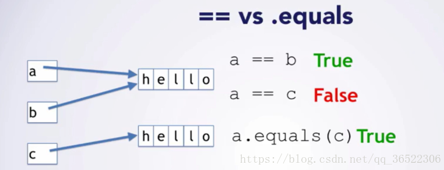


### 2、包装类型对象的缓存池


#### 1、Integer 包装类型 IntegerCache


>   Integer 缓存是 Java 5 中引入的一个有助于节省内存、提高性能的特性。
>
>   Integer 中有个静态内部类 IntegerCache，里面有个cache[] , 也就是 Integer 常量池，常量池的大小为一个字节（-128~127）。JDK 源码如下（摘自 JDK1.8 源码）：

```java
/**
 * Cache to support the object identity semantics of autoboxing for values between
 * -128 and 127 (inclusive) as required by JLS.
 *
 * The cache is initialized on first usage.  The size of the cache
 * may be controlled by the {@code -XX:AutoBoxCacheMax=<size>} option.
 * During VM initialization, java.lang.Integer.IntegerCache.high property
 * may be set and saved in the private system properties in the
 * sun.misc.VM class.
 */
private static class IntegerCache {
    static final int low = -128;
    static final int high;
    static final Integer cache[];

    static {
        // high value may be configured by property
        int h = 127;
        String integerCacheHighPropValue =
            sun.misc.VM.getSavedProperty("java.lang.Integer.IntegerCache.high");
        if (integerCacheHighPropValue != null) {
            try {
                int i = parseInt(integerCacheHighPropValue);
                i = Math.max(i, 127);
                // Maximum array size is Integer.MAX_VALUE
                h = Math.min(i, Integer.MAX_VALUE - (-low) -1);
            } catch( NumberFormatException nfe) {
                // If the property cannot be parsed into an int, ignore it.
            }
        }
        high = h;

        cache = new Integer[(high - low) + 1];
        int j = low;
        for(int k = 0; k < cache.length; k++)
            cache[k] = new Integer(j++);

        // range [-128, 127] must be interned (JLS7 5.1.7)
        assert IntegerCache.high >= 127;
    }

    private IntegerCache() {}
}
```


当创建 Integer 对象时，不使用 new Integer(int value) 语句，大小在-128 ~ 127之间，对象存放在 Integer 常量池中。

```java
Integer a = 10; //例如这样、值存放在常量池中
```

调用的是 Integer.valueOf() 方法，代码为：

```java
public static Integer valueOf(int i) {
    //如果 i 在缓存池的范围内，就优先取缓存池中的值
    if (i >= IntegerCache.low && i <= IntegerCache.high)
        return IntegerCache.cache[i + (-IntegerCache.low)];
    //否则 new 一个 Integer 对象放在堆中
    return new Integer(i);
}
```

>   这也是自动装箱的代码实现。JAVA 将基本类型自动转换为包装类的过程称为自动装箱（autoboxing）


实际上在 Java 5 中引入这个特性的时候，范围是固定的 -128 ~ 127。后来在 Java 6 后，最大值映射到 java.lang.Integer.IntegerCache.high，可以使用 JVM 的启动参数设置最大值

```java
-XX:AutoBoxCacheMax=size //通过 JVM 的启动参数修改
```

测试情况如下

```java
private static void TestIntegerCache() {
    int i = 10;
    int i1 = 10;

    Integer in1 = 10;
    Integer in2 = 10;

    Integer in3 = new Integer(10);
    Integer in4 = new Integer(10);

    Integer in5 = 199;
    Integer in6 = 199;

    System.out.println(i == i1);         // true
    System.out.println(i == in1);        // true

    System.out.println(i == in2);        // true
    System.out.println(i == in3);        // true

    System.out.println(in1 == in2);      // true
    System.out.println(in5 == in6);      // false

    System.out.println(in1 == in3);      // false
    System.out.println(in3 == in4);      // false
}
```


#### 2、其它包装类型缓存池


所有整数类型的类都有类似的缓存机制:

-   有 ByteCache 用于缓存 Byte 对象

-   有 ShortCache 用于缓存 Short 对象

-   有 LongCache 用于缓存 Long 对象
-   同时 Character 对象也有 CharacterCache 缓存池，范围是 0 到 127

Byte，Short，Long 的缓存池范围默认都是: -128 到 127。可以看出，Byte 的所有值都在缓存区中，用它生成的相同值对象都是相等的。所有整型（Byte，Short，Long）的比较规律与 Integer 是一样的

>   **除了 Integer 可以通过参数改变范围外，其它的都不行**


### 3、ArrayList 如何去重？如何删除指定元素？


✅ **方法 1：使用 `HashSet` 去重** `HashSet` **不允许重复元素**，可以借助它去重：

> **✔ 优点**：简单高效，O(n) 复杂度
> **❌ 缺点**：无序（`HashSet` 不能保持原顺序）

 **保持顺序可用可以替换为 `LinkedHashSet`**：


✅ **方法 2：使用 `Stream API`**、Java 8 `Stream` 提供 `distinct()` 方法去重：

```java
List<String> uniqueList = list.stream().distinct().collect(Collectors.toList());
System.out.println(uniqueList); // [A, B, C]
```

**✔ 优点**：代码简洁，保持顺序
**❌ 缺点**：对大数据量性能略差


✅ **方法 3：使用 `for` 循环手动去重**

**✔ 优点**：可控，不依赖 `Set`
**❌ 缺点**：`contains()` **时间复杂度 O(n)**，整体 **O(n²)**，大数据量慢


**ArrayList 删除元素有两种情况：**

> 1. **按值删除**
> 2. **按索引删除**


### 4、ArrayList 如何实现排序呢？


在 Java 中，`ArrayList` 的排序可以使用 `Collections.sort()` 或 `List.sort()` 方法，这两者都基于 `Comparator` 或 `Comparable` 进行排序

使用 `Comparator` + Lambda 表达式

```java
// 按年龄排序
students.sort((s1, s2) -> s1.age - s2.age);
// 按姓名排序
students.sort((s1, s2) -> s1.name.compareTo(s2.name));
// 使用 Comparator.comparing()
students.sort(Comparator.comparing(s -> s.name));
```

使用 `List.sort()`（Java 8+ 推荐）

> Java 8 引入了 `List.sort()` 方法，比 `Collections.sort()` 语法更简洁

```java
// 按年龄排序
students.sort(Comparator.comparingInt(s -> s.age));
// 按姓名排序
students.sort(Comparator.comparing(Student::getName));
```

小结：


**最佳实践**

1. **默认排序（类内部排序）** → 用 `Comparable`。
2. **多种排序方式（外部排序）** → 用 `Comparator`。
3. **简洁代码（Java 8+）** → 用 `Comparator.comparing()` + `List.sort()`


### 5、集合类为什么需要迭代器？


在 Java 中，**集合类（`Collection`）提供迭代器（`Iterator`）**，用于**遍历集合元素**，而不依赖集合的具体实现（如 `ArrayList`、`LinkedList`、`HashSet` 等）。
 迭代器提供了一种**统一的遍历方式**，同时提高了代码的**可读性、灵活性和安全性**。

> ✅ **(1) 统一遍历方式，解耦具体集合**、否则每种集合的遍历方式不同，代码不统一，不利于扩展
>
> ✔ **好处**：不需要关心底层存储结构，适用于**所有集合**。
>
> ✅ **(2) 支持 `fail-fast` 机制，提高并发安全性**
>
> `Iterator` 在遍历时会检测**集合是否被修改**，如果发生**并发修改（Concurrent Modification）**，会抛出 `ConcurrentModificationException`，避免数据不一致。可以使用使用 `Iterator.remove()` 来修改
>
> ✅ **(3) 统一删除元素**
>
> 普通 `for` 循环删除元素时，会导致**索引错乱跳过元素**、使用 `Iterator.remove()` 则没有这个问题
>
> ✅ **(4) 支持 `ListIterator`（双向遍历）**
>
> `ListIterator` **支持向前和向后遍历**，比 `Iterator` 更强大：


> **3. 迭代器 vs 增强 `for-each`**

Java 提供了**增强 `for` 循环**，底层也是使用 `Iterator`：

```java
for (String item : list) {
    System.out.println(item);
}
```

**优点**：简洁易读
**缺点**：

1. **无法删除元素**（`remove()`）。
2. **不支持 `ListIterator` 的双向遍历**。

✔ **如果需要删除元素，还是推荐使用 `Iterator`！**


### 6、历来的 JDK 版本都更新了什么特性？


> Oracle 官方网站上的 JDK 更新预览 [JDK](https://openjdk.org/projects/jdk/)


#### **1、JDK 5（2004年）**

- **核心特性**：
  - **自动装箱/拆箱**：简化基本类型与包装类的转换。
  - **泛型**：增强类型安全，减少强制类型转换。
  - **枚举**：通过 `enum` 关键字定义类型安全的常量集合。
  - **可变参数**：支持方法参数数量动态变化（如 `String... args`）。
  - **注解**：引入元数据编程（如 `@Override`）。
- **用途**：提升代码安全性和可读性，减少冗余代码。

#### **2、JDK 6（2006年）**

- **核心特性**：
  - **动态语言支持**（JSR 223）：如嵌入 JavaScript。
  - **改进的锁机制**：优化 JVM 同步性能。
  - **编译器 API**：允许在运行时动态编译 Java 代码。
- **特点**：提升 JVM 性能和扩展性，但无重大语法革新。

#### **3、JDK 7（2011年）**

- **核心特性**：
  - **try-with-resources**：自动管理资源（如文件流）。
  - **Switch 支持字符串**：简化字符串条件判断。
  - **Fork/Join框架**：支持分治算法的并行计算
  - **二进制字面量**（如 `0b1010`）和数值分隔符（如 `1_000_000`）。
  - **NIO**：增强文件操作和异步 I/O。
  - **G1垃圾回收器**（Grabage-First Collector）（常用）
    新出的垃圾回收器，用来替代Concurrent Mark-Sweep Collector（CMS）。目标是减少 Full GC 带来的暂停次数，增加吞吐量
  - **concurrent包改进**（常用）
    Doug Lea 在此版本引入了轻量级的fork/join框架来支持多核多线程的并发计算。此外，实现了 Phaser 类，它类似于 CyclicBarrier 和 CountDownLatch 但更灵活。最后，ThreadLocalRandom 类提供了线程安全的伪随机数生成器
- **用途**：优化资源管理和语法简洁性。

#### **4、JDK 8（2014年，LTS 主流）**

- **革命性更新**：
  - **Lambda 表达式**：简化函数式编程（如 `(a, b) -> a + b`）
  - **Stream API**：支持链式数据流处理（如过滤、映射、聚合）、**Optional类**：避免空指针异常
  - **接口默认方法与静态方法**： `default` 允许接口包含实现代码
  - **新的日期时间 API**（`java.time`）：替代易错的 `Date` 和 `Calendar`
  - *修改 HashMap 和 ConcurrentHashMap 的底层实现*
  - **修改了 JVM 内存模型 Metaspace 元空间替代永久代**：优化内存管理
  - **JDK 新增并发接口和实现**， 包括新增 CompletableFuture、为 ConcurrentHashMap 新增支持 Stream 方法、新增StampedLock
- **用途**：推动函数式编程，提升集合操作效率


#### **5、JDK 9（2017年）**

- **核心特性**：
  - **模块化系统（**JPMS）：通过 `module-info.java` 管理依赖
  
  - **JShell**：交互式编程工具，支持快速测试代码片段
  
  - **HTTP Client（Preview）**：内置 HTTP/客户端、替代 `HttpURLConnection`，支持异步请求
  
  - **私有接口方法**：允许在接口中定义私有方法
  
  - **集合工厂方法**：简化不可变集合创建
  
    ```java
    List<String> list = List.of("a", "b", "c");
    ```
  
    
  
- **特点**：强化代码封装和依赖管理

#### 6、JDK 10 (2018-03)

- **核心特性**：var 局部变量类型推断(常用)

  ```java
  var list = new ArrayList<String>(); // 类型由初始化表达式推断
  ```

- **并行 Full GC 的 G1**
  通过并行 Full GC, 改善 G1 的延迟。目前对 G1 的 full GC 的实现采用了单线程-清除-压缩算法。JDK10 开始使用并行化-清除-压缩算法
  
- **垃圾回收器改进**：并行垃圾回收器（Parallel GC）默认替换 CMS
  
- **基于实验Java的JIT编译器**
  启用基于Java的JIT编译器Graal，它是JDK9中引入的Ahead-of-time（AOT）编译器的基础
  
- **应用类数据共享（AppCDS）**：减少 JVM 内存占用

#### **6、JDK 11（2018年，LTS 主流）**

- **核心特性**：
  - **ZGC**：低延迟垃圾回收器，适合大内存应用
  - **HTTP Client 标准化**：支持同步/异步请求和 WebSocket
  - **单文件源码运行**（如 `java HelloWorld.java`）
  - **移除 Java EE 和 CORBA 模块**：简化 JDK 体积
  - 增加一些实用 API（常用）、比如 string 类的 isBlank、isEmpty 等等
  - **完全支持Linux容器（常用）**、JDK10开始，JVM 可以识别当前是否在容器中运行，能接受容器设置的内存限制和 CPU 限制
- **用途**：提升性能，简化部署流程


#### **7、JDK 16（2021年）**

- **关键特性：**
  - **弃用 removeIf 的并发修改**：修复 ConcurrentModificationException
  - **简化的 switch 语法**：允许 yield 和表达式形式
  - **强封装（Strong Encapsulation）**：强制限制对内部API的访问
  - **Pattern Matching for instanceof（正式版）、Record（正式版）**
  - 新增 Vector API（孵化）用于 **SIMD 向量计算**：科学计算、AI、高性能计算
  - 新增 Foreign Linker API（孵化）、未来用于 **替代 JNI**、允许 Java 更安全调用 C、C++库
  - 对 Elastic Metaspace 做出重要改进：以前使用后不容易归还 OS、现在可以更快归还内存


#### **7、JDK 17（2021年，LTS 主流）**

- **核心特性**：
  - **密封类（Sealed Classes）**：限制类的继承（如 `sealed class Shape permits Circle, Square`）
  - **模式匹配增强**：简化 `instanceof` 类型检查和转换
  - **移除 **`javaws`和`applet API`：淘汰旧版浏览器插件技术
  - **新的垃圾回收器Shenandoah**：低暂停时间GC（实验性）
  - **新的 macOS 渲染引擎**：基于 Metal API 提升图形性能
- **特点**：进一步优化语言安全性和性能、总体来说 JDK17 没有在语言层面有新的改进


#### **8、JDK 21（2023年，LTS 主流）**

- **核心特性**：
  - **虚拟线程（正式版）**：轻量级线程，百万级并发、支持`Stack Walking`和`Thread.startVirtual()`
    - 预览版在 JDK 19。
  - **虚拟线程专属 API**: 更好地监控虚拟线程
  - **分代 ZGC**：优化垃圾回收效率
  - **记录模式（Record Patterns）**：解构记录类实例
  - **结构化并发**：统一管理多线程任务生命周期
  - **`String`分割优化**：`String.split()`支持正则表达式改进
  - **`Record`类改进**：支持`private`构造函数


#### **9、JDK 22（2024年，非 LTS）**

- **实验性特性**：
  - **未命名变量和模式**：简化未使用变量的声明（如 `_`）
  - **字符串模板**：内嵌表达式生成动态字符串（如 `STR."Value: \{x}"`）
  - **作用域值（Scoped Values）**：跨线程共享不可变数据
  - **向量 API**：优化 CPU 向量指令计算性能26


#### 10、JDK 23 与 24

| 版本                 | 核心语言特性 (预览为主)                                      | 主要库与性能改进                                             | 关键变化与意义                                               |
| :------------------- | :----------------------------------------------------------- | :----------------------------------------------------------- | :----------------------------------------------------------- |
| **JDK 23** (2024.09) | • **原始类型模式匹配 (预览)**  • **模块导入声明 (预览)**  • **灵活的构造函数体 (二次预览)**  • **隐式类与实例主方法 (三次预览)**  • **字符串模板 (被撤回)** | • **Stream Gatherers (二次预览)**  • **Class-File API (二次预览)**  • **结构化并发 (三次预览)**  • **作用域值 (三次预览)**  • **ZGC：分代模式设为默认**  • **Markdown文档注释 (正式版)** | • **关键里程碑**：ZGC 正式转向更高效的分代模式，为性能提升奠基 。 • **重大调整**：备受期待的字符串模板因设计分歧被撤回，体现了 Java 演进过程中的审慎 。 |
| **JDK 24** (2025.03) | • **原始类型模式匹配 (二次预览)**  • **模块导入声明 (二次预览)**  • **灵活的构造函数体 (三次预览)**  • **简单源文件与实例主方法 (四次预览)** | • **Stream Gatherers (正式版)**  • **Class-File API (正式版)**  • **结构化并发 (四次预览)**  • **作用域值 (四次预览)**  • **向量 API (第九次孵化)**  • **紧凑对象头 (实验性)**  • **提前类加载与链接 (正式版)**  • **ZGC：移除非分代模式**  • **虚拟线程：无锁定同步**  • **后量子加密 API (预览)** | • **成果固化**：Stream Gatherers 和 Class-File API 在预览两轮后正式转正 。 • **性能深化**：引入紧凑对象头、提前类加载等特性，进一步优化启动速度和内存占用 。 • **安全前瞻**：开始引入后量子加密算法，为未来安全做准备 。 |


#### 11、JDK 25 (2025年 LTS 先锋)


1、模式匹配支持原始类型 (JEP 507 - 第三预览)

```java
// 现在可以在 instanceof 中直接匹配原始类型
if (obj instanceof int i) {
    System.out.println("It's an int: " + i);
}

// 在 switch 中也可以处理原始类型
switch (statusCode) {
    case 200 -> System.out.println("OK");
    case int i when i >= 400 && i < 500 -> System.out.println("Client error");
    // ...
}
```


2、模块导入声明 (JEP 511 - 预览)

> 不过要注意，如果导入的多个模块包含同名类（如 `java.util.Date` 和 `java.sql.Date`），仍然需要显式导入具体类来解决歧义

```java
//这个新语法允许你通过一条语句，导入某个模块导出的所有包

// 以前需要导入 java.util 下的所有类，可能需要多个语句
import java.util.*;
import java.util.stream.*;
// ...

// 现在可以直接导入 java.base 模块导出的所有包
import module java.base;
```


3、紧凑源文件与实例主方法 (JEP 512)

> Java 的“入门体验”被进一步简化。现在可以编写不包含类声明的脚本式程序，并且 `main` 方法可以是非静态的（实例方法）

```java
// 一个完整的 Java 程序，无需类声明，无需 public static void main(String[] args)
void main() {
    System.out.println("Hello from Java 25!");
}
```

4、灵活的构造函数体 (JEP 513 - 正式版)

> 这是一个期待已久的改进。以前，在子类构造函数中，`super()` 调用必须是第一条语句。现在，你可以在调用 `super()` 之前插入一些不引用“正在构造的实例”的语句（如参数验证）

```java
class Employee extends Person {
    final String name;

    Employee(String name, int age) {
        // 现在可以在 super() 之前进行参数验证
        if (age < 18) {
            throw new IllegalArgumentException("Age must be >= 18");
        }
        super(age); // 调用父类构造函数
        this.name = name;
    }
}
```


#### 12、JDK 26 (2026年)


JDK 26 的核心增强提案（JEP）包括：

| 类别           | JEP     | 简介                                                         |
| :------------- | :------ | :----------------------------------------------------------- |
| **语言特性**   | JEP 530 | `instanceof`和`switch`中的**原始类型**（第四轮预览），让模式匹配更统一和简洁。 |
| **性能提升**   | JEP 522 | **G1 GC** 通过减少同步开销来提高吞吐量。                     |
|                | JEP 516 | **Project Leyden** 的**提前对象缓存**，可加快任意 GC 的启动速度。 |
| **核心库**     | JEP 517 | **HTTP Client API** 支持 **HTTP/3** 协议，带来更低的延迟。   |
|                | JEP 525 | **结构化并发**（第六轮预览），简化多线程编程，提高可靠性和可观测性。 |
|                | JEP 529 | **Vector API**（第十一轮孵化器），利用 CPU 向量指令优化性能，尤其适合 AI 和数据分析。 |
| **安全增强**   | JEP 500 | **"让 final 真正不可变"**，通过警告对`final`字段的深度反射修改，增强安全性和可靠性。 |
|                | JEP 524 | **加密对象的 PEM 编码**（第二轮预览），提供标准化的 API 处理密钥和证书。 |
| **清理与维护** | JEP 504 | **移除已弃用的 Applet API**，减小安装包体积并降低安全风险。  |


### 7、JDK 历来版本小结


#### **1、主流 JDK 版本选择与推荐**


1. **JDK 8（LTS 已经放弃支持了 2014）**
   - **JDK 8 是一个经典的、极度稳定的版本** 。如果你的老项目没有重构计划，或者依赖的某些老旧库不兼容新版本，继续使用 JDK 8 是完全可以的。不过需要留意，Oracle对JDK 8的免费商业支持已经在 2019 年结束了，需要评估潜在的安全风险
   - **适用场景**：传统企业应用、兼容性要求高的系统
2. **JDK 11（LTS 2018）**
   - **特点**：ZGC、HTTP Client 和单文件运行特性，性能显著提升
   - **适用场景**：云原生应用、微服务架构
3. **JDK 17（LTS 推荐 2021）**
   - **特点**：密封类和模式匹配增强代码安全性，长期支持至 2029 年
   - **适用场景**：如果你希望有一个**非常稳定、特性足够现代、生态最成熟**的版本，**JDK 17** 是目前最稳妥的选择
4. **JDK 21（LTS 推荐 2023）**
   - **特点**：虚拟线程和结构化并发推动高并发编程变革
   - **适用场景**：高吞吐量服务、大规模分布式系统
5. **最新非 LTS 版本（如 JDK 26）**
   - **特点**：前沿特性预览，适合技术探索和小型项目。它包含了最新的语言特性和性能优化 。非常适合开发者用来学习和实验
   - **风险**：无长期支持，需定期升级


#### 2、JDK 8 ~ JDK 21 语法特性全览（附代码示例）


> **JDK 8 (LTS,  2014 年 3 月) 里程碑：函数式编程的引入**

1. Lambda 表达式

```java
//之前：匿名内部类
Runnable r1 = new Runnable()
    @Override
    public void run()
        System.out.println("Hello");
};

// JDK 8：Lambda 表达式
Runnable r2 = () -> System.out.println("Hello");

// 带参数的 Lambda
List<String> list = Arrays.asList("a", "b", "c");
list.forEach(s -> System.out.println(s));
```

2. 接口默认方法

```java
interface Vehicle {
    default void print()
        System.out.println("我是车");
}
// 可以直接使用默认实现
class Car implements Vehicle { }
// 调用
new Car().print(); // 输出：我是车
```

3. 接口静态方法

```java
interface Vehicle {
    static void run()
        System.out.println("车辆在跑");
}
// 调用
Vehicle.run(); // 直接通过接口名调用
```

4. 方法引用

```java
List<String> list = Arrays.asList("a", "b", "c");

// 静态方法引用
list.forEach(System.out::println);

// 实例方法引用
list.stream().map(String::toUpperCase);

// 构造方法引用
Supplier<List<String>> supplier = ArrayList::new;
```

5. Stream API

```java
List<String> list = Arrays.asList("apple", "banana", "orange", "apple");

// 过滤、去重、排序、收集
List<String> result = list.stream()
    .filter(s -> s.startsWith("a"))
    .distinct()
    .sorted()
    .collect(Collectors.toList());

System.out.println(result); // [apple]
```

6. Optional 类

```java
// 传统空指针判断
public String getCity(User user) {
    if (user == null) return "Unknown";
     Address addr = user.getAddress();
     if (addr == null) return "Unknown"; 
     return addr.getCity();
}

// JDK 8 风格
public String getCity(User user) {
    return Optional.ofNullable(user)
        .map(User::getAddress)
        .map(Address::getCity)
        .orElse("Unknown");
}
```

7. 新的日期时间 API

```java
// 之前：Date 可变、线程不安全
Date date = new Date();

// JDK 8：不可变、线程安全
LocalDate today = LocalDate.now();
LocalDate birthday = LocalDate.of(1990, Month.JANUARY, 1);
LocalDate nextWeek = today.plusDays(7);

// 时间差计算
Period period = Period.between(birthday, today);
System.out.println("年龄：" + period.getYears());
```


> JDK 9 (2017 年 9 月)

1. 接口私有方法

```java
interface MyInterface {
    default void method1() commonMethod();
    default void method2() commonMethod();
    // 私有方法，在默认方法间共享代码
    private void commonMethod() {
        System.out.println("公共逻辑");
    }
}
```

2. 集合工厂方法

```java
// 之前：需要写很多代码
List<String> list1 = new ArrayList<>();
list1.add("a");
list1.add("b");

// JDK 9：一行搞定（不可变集合）
List<String> list = List.of("a", "b", "c");
Set<String> set = Set.of("a", "b", "c");
Map<String, Integer> map = Map.of("key1", 1, "key2", 2);
Map<String, Integer> map2 = Map.ofEntries(
    Map.entry("key1", 1),
    Map.entry("key2", 2)
);

// list.add("d"); // 抛异常：UnsupportedOperationException
```

3. Stream API 增强

```java
// takeWhile：直到遇到第一个不满足条件的元素
Stream.of(1, 2, 3, 4, 5, 6)
    .takeWhile(n -> n < 4)
    .forEach(System.out::print); // 123

// dropWhile：丢弃满足条件的，保留剩下的
Stream.of(1, 2, 3, 4, 5, 6)
    .dropWhile(n -> n < 4)
    .forEach(System.out::print); // 456

// ofNullable：安全创建 Stream
Stream<String> stream = Stream.ofNullable(getString()); // getString() 返回 null 时返回空流

// iterate 重载：带结束条件
Stream.iterate(0, i -> i < 10, i -> i + 1)
    .forEach(System.out::print); // 0123456789
```

4. try-with-resources 增强

```java
// 之前：必须在 try 中声明资源
try (BufferedReader br = new BufferedReader(new FileReader("file.txt"))) {
    // ...
}

// JDK 9：可以用 final/effectively final 变量
BufferedReader br = new BufferedReader(new FileReader("file.txt"));
try (br) { // 直接使用外部变量
    // ...
}
```


> JDK 10 (2018年3月)

1. 局部变量类型推断（var）

```java
// 之前：必须写完整类型
List<String> list1 = new ArrayList<>();
Map<String, List<Integer>> map1 = new HashMap<>();

// JDK 10：var 自动推断
var list2 = new ArrayList<String>(); // 推断为 ArrayList<String>
var map2 = new HashMap<String, List<Integer>>();

// 用在循环中
for (var entry : map2.entrySet()) {
    var key = entry.getKey();
    var value = entry.getValue();
}

// 注意：不能用在方法参数、返回类型、成员变量
// public void test(var x) { } // 编译错误
```


> JDK 11 (LTS, 2018 年 9 月)

1. Lambda 中使用 var

```java
// 允许在 Lambda 参数中使用 var
list.stream()
    .map((@NotNull var s) -> s.toLowerCase())
    .collect(Collectors.toList());

// 可以结合注解使用
```

2. 字符串新方法

```java
// isBlank：是否空白（包含空格、换行等）
"  ".isBlank(); // true

// lines：按行拆分
"line1\nline2\nline3".lines().forEach(System.out::println);

// strip：去除首尾空白（支持 Unicode）
"  hello  ".strip(); // "hello"

// repeat：重复字符串
"abc".repeat(3); // "abcabcabc"
```


> JDK 12 ( 2019 年 3 月)

1. Switch 表达式（预览）

```java
// 之前：传统 switch
String result1;
switch (day) {
    case MONDAY:
    case FRIDAY:
    case SUNDAY:
        result1 = "休息";
        break;
    case TUESDAY:
        result1 = "工作";
        break;
    default:
        result1 = "未知";
}

// JDK 12：箭头语法
String result2 = switch (day) {
    case MONDAY, FRIDAY, SUNDAY -> "休息";
    case TUESDAY -> "工作";
    default -> "未知";
};
```


> JDK 13 (2019年9月)

1. 文本块（预览）

```java
// 之前：多行字符串需要转义和拼接
String json1 = "{\n" +
               "  \"name\": \"张三\",\n" +
               "  \"age\": 20\n" +
               "}";

// JDK 13：文本块
String json2 = """
    {
      "name": "张三",
      "age": 20
    }
    """;
```

2. Switch 表达式增强（yield）

```java
// yield 返回值（用于多行逻辑）
String result = switch (day) {
    // 单行：没问题
    case MONDAY, FRIDAY, SUNDAY -> "休息";
    // 多行：需要用 {} 包裹
    case TUESDAY -> {
        System.out.println("星期二");
        // 这里需要返回一个值，但怎么返回？
        // 不能直接写 "工作日"，所以需要 yield 返回结果
        yield "工作"; // 返回结果
    }
    default -> "未知";
};
```


> JDK 14 (2020年3月)

1. Records（预览）

```java
// 之前：写一个 POJO 要写很多样板代码
public class Point1 {
    private final int x;
    private final int y;
    public Point1(int x, int y) {
        this.x = x;
        this.y = y;
    }
    public int getX() { return x; }
    public int getY() { return y; }
    // equals, hashCode, toString 都要写...
}

// JDK 14：一行搞定
public record Point(int x, int y) { }

// 使用
var p = new Point(3, 4);
System.out.println(p.x()); // 访问器不是 getX()，而是 x()
System.out.println(p); // Point[x=3, y=4]
```


2. Pattern Matching for instanceof（预览）

```java
// 之前：需要显式强转
if (obj instanceof String) {
    String s = (String) obj;
    System.out.println(s.length());
}

// JDK 14：模式匹配，直接绑定变量
if (obj instanceof String s) {
    System.out.println(s.length()); // 直接使用 s
}
```


> JDK 15 (2020年9月)

1. 文本块（正式版）
   - 同上，成为标准特性


2. 密封类 (Sealed Class)（预览）

```java
// 限制哪些类可以继承
public sealed class Shape 
    permits Circle, Rectangle, Triangle {
}

final class Circle extends Shape { }
final class Rectangle extends Shape { }
final class Triangle extends Shape { }
final class Square extends Shape { } // 编译错误，不在 permits 列表中
```

| 关键字                        | 含义                                       |
| :---------------------------- | :----------------------------------------- |
| `sealed`                      | 这是一个**密封类**，表示它有"受限制的继承" |
| `permits`                     | 明确列出**允许**继承这个类的子类           |
| `Circle, Rectangle, Triangle` | 只有这三个类可以继承 `Shape`               |


> JDK 16 (2021年3月)

1. Records（正式版）

```java
// 可以在 Record 中添加自定义方法
public record Person(String name, int age) {
    // 紧凑构造函数
    public Person {
        if (age < 0) {
            throw new IllegalArgumentException("年龄不能为负");
        }
    }
    
    public String greeting() {
        return "你好，我是" + name;
    }
}
```

2. Stream.toList()

```java
// 之前：需要收集器
List<String> list1 = stream.collect(Collectors.toList());

// JDK 16：直接 toList()
List<String> list2 = stream.toList(); // 不可变 List
```


> JDK 17 (LTS, 2021年9月)

1. 密封类（正式版）

```java
// 密封接口
public sealed interface Service 
    permits CarService, UserService {
    void execute();
}

final class CarService implements Service {
    public void execute() {
        System.out.println("汽车服务");
    }
}

// record 也可以作为 permitted 子类
record UserService(String name) implements Service {
    public void execute() {
        System.out.println("用户服务：" + name);
    }
}
```


2. Pattern Matching for switch（预览）

```java
// 在 switch 中使用模式匹配
String formatted = switch (obj) {
    case Integer i -> String.format("int %d", i);
    case Long l -> String.format("long %d", l);
    case Double d -> String.format("double %f", d);
    case String s -> String.format("String %s", s);
    default -> obj.toString();
};
```


> JDK 19 (2022年9月)

1. 虚拟线程（预览）

```java
// 传统线程：占用系统资源
Thread thread1 = new Thread(() -> {
    System.out.println("传统线程");
});

// JDK 19：虚拟线程（轻量级）
Thread vThread = Thread.startVirtualThread(() -> {
    System.out.println("虚拟线程");
});

// 创建大量虚拟线程
var executor = Executors.newVirtualThreadPerTaskExecutor();
for (int i = 0; i < 100000; i++) {
    executor.submit(() -> {
        Thread.sleep(1000);
        return "done";
    });
}
```


> JDK 21 (LTS, 2023年9月)

1. 虚拟线程（正式版）
   - 同上，成为标准特性


2. Record Patterns（正式版）

```java
record Point(int x, int y) {}
record Line(Point start, Point end) {}

// 嵌套解构
void printLine(Object obj) {
    if (obj instanceof Line(Point(var x1, var y1), Point(var x2, var y2))) {
        System.out.println("从(" + x1 + "," + y1 + ")到(" + x2 + "," + y2 + ")");
    }
}
```

3. Pattern Matching for switch（正式版）

```java
// 完整的模式匹配
String process(Object obj) {
    return switch (obj) {
        case null -> "null";
        case String s when s.length() > 5 -> "长字符串";
        case String s -> "短字符串: " + s;
        case Point(var x, var y) -> "点: " + x + "," + y;
        case int[] arr when arr.length > 0 -> "数组长度: " + arr.length;
        default -> "其他";
    };
}
```

4. 字符串模板（预览）

```java
// 字符串插值
String name = "张三";
int age = 20;

// 传统：拼接麻烦
String s1 = "姓名：" + name + "，年龄：" + age;

// JDK 21：字符串模板
String s2 = STR."姓名：\{name}，年龄：\{age}";

// 支持表达式
String s3 = STR."2 + 3 = \{2 + 3}";

// 多行模板
String json = STR."""
    {
        "name": "\{name}",
        "age": \{age}
    }
    """;
```

5. 未命名模式和变量（预览）

```java
// 用 _ 忽略不用的变量
try (var _ = conn.getResultSet()) {
    // 不需要处理结果
}

// 模式匹配中忽略部分字段
if (obj instanceof Point(int x, _)) {
    System.out.println("x = " + x); // 忽略 y
}

// 循环中忽略索引
for (int i = 0, _ = run(); i < 10; i++) {
    // 只关心 i
}
```


### 8、一个java文件有3个类，编译后有几个class文件


在 Java 中，一个 `.java` 文件可以包含多个类，但**只能有一个 `public` 类**，且**文件名必须与 `public` 类的类名相同**。当编译这个 `.java` 文件时，每个类（包括非 `public` 类）都会被单独编译成一个 `.class` 文件。因此，**一个 `.java` 文件包含 3 个类，编译后会生成 3 个 `.class` 文件**

✅ **每个类都会生成一个 `.class` 文件**，即使它们在同一个 `.java` 文件中
✅ **`public` 类的类名必须与文件名一致**，但非 `public` 类可以随意命名
✅ **编译后，生成的 `.class` 文件数 = 该文件中的类数**


### 9、局部变量使用前需要显式地赋值，否则编译通过不了，为什么这么设计


> Java 强制局部变量显式赋值的核心目标是：**通过编译时检查消除未初始化风险，提升代码的确定性和可维护性**。这一设计虽然增加了编码时的严格性，但显著减少了潜在的运行时错误

- **底层机制差异**：
  - **实例变量（成员变量）**：Java 会自动赋予默认值（如 `int` 默认 `0`，`Object` 默认 `null`），因为对象的生命周期由构造方法保证初始化逻辑。
  - **局部变量**：作用域仅限于方法或代码块内部，编译器无法确定其初始化路径（如条件分支、循环等），若自动赋默认值，可能导致开发者忽略初始化逻辑，引发隐蔽的运行时错误
- **对比其他语言**：
  - 例如 C/C++ 中局部变量不初始化可能包含随机内存值（“垃圾值”），导致不可预测的行为。Java 通过编译时强制检查，彻底杜绝此类问题

- **代码确定性**：

  - 强制显式赋值要求开发者**明确表达变量用途**。例如：

    ```java
    int result; // 未赋值直接使用 → 编译报错
    if (condition) {
        result = 1;
    }
    System.out.println(result); // 无法保证所有分支都赋值 → 编译报错
    ```

  - 迫使开发者检查所有代码路径（如 `if-else`、`switch` 分支）是否覆盖了变量的初始化，避免逻辑遗漏

- **减少空指针风险**：

  - 对象类型的局部变量若未初始化直接使用，可能触发 `NullPointerException`。显式赋值要求开发者主动管理对象状态

  - **保守的静态分析**：

    - **编译器通过数据流分析**（Definite Assignment Analysis）检查变量在所有可能的执行路径中是否被赋值。

      ```java
      int x;
      if (someCondition()) {
          x = 10;
      }
      // 此处未写 else 分支 → 编译器认为 x 可能未赋值
      System.out.println(x); // 编译失败
      ```

    - 即使开发者“知道” `someCondition()` 一定为真，编译器仍会报错。这种保守策略牺牲了灵活性，但换取了绝对的安全性


### 10、介绍下 Object 类常见的方法


`Object` 类是 Java 中所有类的父类，因此所有的 Java 对象都可以调用 `Object` 类的方法。以下是 `Object` 类中常见的方法：

- `clone()`：创建并返回此对象的一个副本。
- `equals(Object obj)`：比较此对象与指定对象是否相等。
- `finalize()`：当垃圾回收器确定不存在对该对象的更多引用时，对象的垃圾回收器被调用。
- `getClass()`：返回此对象运行时类。
- `hashCode()`：返回该对象的哈希码值。
- `notify()`：唤醒在此对象监视器上等待的单个线程。
- `notifyAll()`：唤醒在此对象监视器上等待的所有线程。
- `toString()`：返回该对象的字符串表示形式。
- `wait()`：在其他线程调用此对象的 `notify()` 方法或 `notifyAll()` 方法前，导致当前线程等待。
- `wait(long timeout)`：在其他线程调用此对象的 `notify()` 方法或 `notifyAll()` 方法，或者超过指定时间量前，导致当前线程等待。
- `wait(long timeout, int nanos)`：在其他线程调用此对象的 `notify()` 方法或 `notifyAll()` 方法，或者其他某个线程中断当前线程，或者已超过某个实际时间量前，导致当前线程等待


### 11、对象 hashcode 的作用？


在 Java 中，`hashCode()` 方法返回的是对象的哈希码，它是一个 `int` 类型的值。哈希码是根据对象的内存地址计算出来的，因此不同对象的哈希码一般不会相同。在散列表（如 `Hashtable`、`HashMap` 等）中，哈希码被用来确定对象的存储位置，从而提高查找效率。

另外，`hashCode()` 方法还和 `equals()` 方法有很密切的关系。如果两个对象相等（即 `equals()` 方法返回 `true`），那么它们的哈希码必须相同；反之，如果两个对象的哈希码不同，那么它们一定不相等。因此，在重写 `equals()` 方法时，也应该重写 `hashCode()` 方法


### 12、什么时候需要重写 equals 和 hashcode 方法？


1. 将对象进行比较的时候、通常会重写 equals 方法
2. 将对象用作哈希表中的键或集合中的元素。
3. 将对象用作已排序集合中的元素。

> 在Java中，当我们需要比较两个对象时，我们通常会重写equals方法。但是，如果我们重写了 equals方法，那么我们还需要重写 hashCode 方法。这是因为在Java中，hashCode方法和equals方法是紧密相关的。如果两个对象相等，那么它们的hashCode值必须相等


### 13、为什么要实现序列化接口？


在 Java 中，**序列化（Serialization）** 是指将对象转换为 **字节流**，以便存储到文件、数据库或通过网络传输。反之，**反序列化（Deserialization）** 是指将字节流转换回对象、在 Java 中，要使对象可被序列化，需要 **实现 `Serializable` 接口**，主要有以下几大作用

#### **1️⃣ 对象持久化（数据存储）**

- **场景**：对象需要存储到**磁盘、数据库、缓存**等，后续可以读取恢复成原始对象

#### **2️⃣ 在网络中传输对象**

- **场景**：需要通过**Socket、RMI（远程方法调用）、Web Service、消息队列**等方式，跨进程或跨网络传输对象。

#### **3️⃣ Java 反射与深拷贝**

- **场景**：通过**序列化+反序列化**实现对象的 **深拷贝（Deep Copy）**

#### **4️⃣ 分布式缓存（Redis、Memcached、Kafka、RocketMQ）**

- **场景**：在**分布式系统**中，将对象存储到 Redis、Memcached 等缓存中，需要对象**可以序列化**

#### **5️⃣ Java 内部使用**

- **许多 Java 框架依赖 `Serializable`**，如：
  - **`HttpSession`**：存储在分布式环境时，Session 需要可序列化。
  - **JVM 远程调试（JMX、RMI）**：涉及对象传输，必须序列化。
  - **Spring Boot/Java EE**：很多组件都要求可序列化的对象


#### **6、`transient` 关键字**

- **不想被序列化的字段**，可用 `transient` 修饰：

  > **保护敏感信息**（如密码）。
  >
  > **防止不必要的字段占用存储空间**

  ```java
  class Account implements Serializable {
      private String username;
      private transient String password; // 不会被序列化
  }
  ```


#### **7、  `serialVersionUID` 的作用**

如果不指定 `serialVersionUID`，**JVM 会自动生成一个值**，这个值会基于类的字段、方法等信息计算。

- **问题**：
  - **只要类的结构发生变化（新增/删除字段、修改方法等），JVM 自动计算的 `serialVersionUID` 就会变化**，导致反序列化失败。
  - **即使变化不影响数据，也会导致兼容性问题。**
- **解决方案**：
  - **手动指定 `serialVersionUID`，保证类版本兼容**

**另外可以提高序列化效率**，如果不定义 JVM 计算 `serialVersionUID` 需要扫描整个类结构，性能较低

> **如果类定义了 `serialVersionUID`，即使修改了类的字段，反序列化仍然可以成功**（但新字段会为 null）。


### 14、Java 中，Comparator 与 Comparable 有什么不同？


在 Java 中，`Comparator` 和 `Comparable` 都用于**比较对象**，但它们的用途和实现方式有所不同

#### **1、核心区别对比**

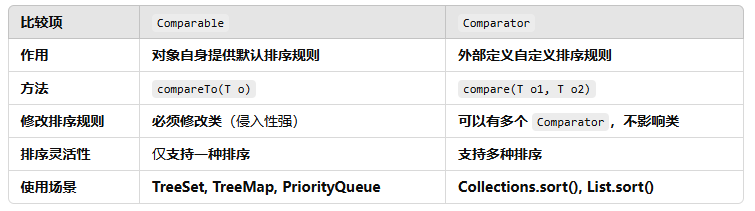

#### **2、`Comparable`：类自身实现排序**

> `Person` 自己实现了 `compareTo()`，默认按 **`age` 升序** 排序
>
> **适用于单一排序规则**（如 `TreeSet`、`TreeMap` 默认排序）

#### **3、`Comparator` 示例（自定义排序）**

> `Comparator` 适用于**多个排序规则**的情况，可以在**外部定义不同的比较逻辑**，而不修改 `Student` 类

#### **4、`Comparable` 和 `Comparator` 适用场景**

✅ **使用 `Comparable`（自然排序）**

- 适用于**一个类只有一种默认排序规则**。
- 例如 `String`、`Integer`、`Double` 都实现了 `Comparable`，支持**自然排序**
- 适用于**优先级队列（PriorityQueue）**、**二叉搜索树（TreeSet、TreeMap）**

✅ **使用 `Comparator`（自定义排序）**

- 适用于**多个排序规则**，例如：
  - 按**姓名排序**
  - 按**年龄排序**
  - 按**成绩排序**
- 适用于**不能修改类源码的情况**（如 `Person` 来自第三方库）


### 15、Java 泛型和类型擦除


**1、Java 泛型（Generics）**

Java 泛型是一种允许在编译时指定类、接口、方法等类型的机制。它通过引入类型参数，使得代码能够操作不同的数据类型，而不需要在代码中反复写出相似的类型，这样不仅提高了代码的重用性，也增强了类型安全性。


**2、类型擦除（Type Erasure）**

Java 的泛型在运行时并不保留具体的类型信息，而是通过 **类型擦除** 来处理。类型擦除是 Java 在编译时对泛型进行的一种转换，它会将泛型类型参数替换为原始类型（通常是 `Object` 类型），从而消除了泛型的类型信息。这是为了兼容 Java 早期版本的代码，并减少运行时的开销

> 在类型擦除后，泛型信息会消失，`T` 被替换为 `Object`。这意味着你在运行时无法获取类型参数 `T` 的具体类型。但是想要获取具体的类型信息需要进行强转

**3、泛型支持通配符 (`? extends` 和 `? super`)**

Java 提供了通配符 `?` 来让泛型更加灵活：

- `? extends T`：只能**读取**，不能修改（上界通配符，意味着存入的数据只能是 T 或者 T 的子类）
- `? super T`：可以**写入**，但只能读取 `Object`（下界通配符，存入的数据只能是 T 或者 T 的超类、接口也可）

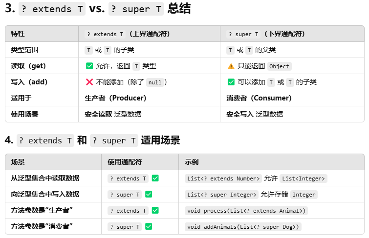


### 16、匿名内部类是什么？如何访问在其外面定义的变量？


**匿名内部类（Anonymous Inner Class）** 是 **没有名字的类**，它通常用于**简化**实现接口或继承类的代码。

通常，匿名内部类用于：

- **继承一个类**
- **实现一个接口**
- **作为方法参数传递**

> 匿名内部类可以**直接访问**外部类的成员变量（包括 `private`）
>
> **访问局部变量**（必须 `final` 或 `effectively final`）

问题：**为什么局部变量必须是 `final`？**

Java **匿名内部类是在方法外部独立运行的**，如果局部变量可以被修改，那么在**匿名内部类创建时和运行时变量的值可能不同**，导致不可预测的行为。因此，Java **要求局部变量不能在方法内部修改**，保证其值不会变


> 匿名内部类的使用场景

**事件监听**（`ActionListener`）

**自定义排序器**（`Comparator`）

```java
Collections.sort(list, new Comparator<String>() {
    @Override
    public int compare(String s1, String s2) {
        return s1.length() - s2.length();
    }
});
```

**创建一个线程**（`Runnable`）

```java
new Thread(new Runnable() {
    @Override
    public void run() {
        System.out.println("Thread running...");
    }
}).start();
```


### 17、重写有什么限制没有？


**方法签名必须一致**

- **方法名称** 和 **参数列表** 必须与父类方法完全相同。
- **返回值类型** 必须相同或是父类返回类型的**子类**（协变返回类型）
- 子类重写的方法的访问权限 **不能比父类更严格**，但可以更宽松


> **不能重写父类 `static` 方法**

- `static` 方法 **属于类**，不能被**实例**方法重写。
- **如果子类定义了相同的方法，则是“隐藏”（Hiding），而不是重写（Override）**

> **不能重写 `final` 方法**、`final` 

- 方法不能被子类重写，否则编译报错

> **异常规则限制**

- **不能抛出比父类更宽泛的异常**（Checked Exception）
- **可以抛出相同或更具体的异常**

> **构造方法不能被重写**

构造方法 **不能** 被重写，但可以**在子类中调用父类的构造方法**（`super()`）

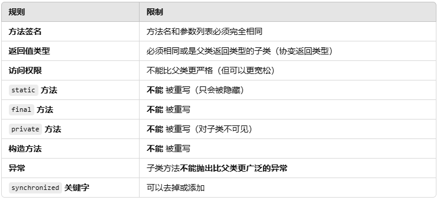


### 18、介绍一下 Java 的集合类、各有什么特点？


#### **1. Java 集合框架的整体结构**


> Java 的集合框架（JCF）提供了一组用于**存储、操作和管理数据**的标准化接口和类。它主要包括 **List、Set、Queue、Map** 四大核心接口，每种集合都有其独特的特点和应用场景

Java 集合框架主要分为两大类：

1. **Collection 接口**（用于存储单个元素）：
   - `List`（有序、允许重复）
   - `Set`（无序、不允许重复）
   - `Queue`（先进先出 FIFO）
2. **Map 接口**（用于存储键值对）：
   - `HashMap`、`TreeMap`、`LinkedHashMap` 等


#### 2、Collection 接口（存储单个元素）


**（1）List：有序、允许重复**

`List` 继承 `Collection`，特点是**元素按插入顺序存储**，且允许**重复元素**

| **实现类**   | **特点**                            | **底层实现** |
| ------------ | ----------------------------------- | ------------ |
| `ArrayList`  | **查询快**，增删慢，线程不安全      | **动态数组** |
| `LinkedList` | **增删快**，查询慢，可用作双端队列  | **双向链表** |
| `Vector`     | 和 `ArrayList` 类似，但**线程安全** | **动态数组** |

✅ **选择建议**：

- **查询多，增删少 → `ArrayList`**
- **增删多，查询少 → `LinkedList`**
- **需要线程安全 → `Vector`（但更推荐 `CopyOnWriteArrayList`）**


**（2）Set：无序、不允许重复元素（因为 `HashMap` 的 `Key` 唯一）**

`Set` 继承 `Collection`，特点是**不允许重复元素**

| **实现类**      | **特点**                                        | **底层实现**                 |
| --------------- | ----------------------------------------------- | ---------------------------- |
| `HashSet`       | **无序存储，查询快，不保证顺序**                | **哈希表（HashMap 的 key）** |
| `LinkedHashSet` | **有序存储，保证插入顺序**                      | **哈希表 + 双向链表**        |
| `TreeSet`       | **自动排序，基于 `Comparable` 或 `Comparator`** | **红黑树（TreeMap 的 key）** |

✅ **选择建议**：

- **不关心顺序 → `HashSet`（最快）**
- **需要有序存储（按插入顺序） → `LinkedHashSet`**
- **需要排序存储 → `TreeSet`**

底层存储结构

> HashSet **底层基于 `HashMap`**，元素存储在 `HashMap` 的 **Key** 部分，值（`Value`）统一使用 **一个固定的 `Object`（默认是 `PRESENT`）** 作为占位符
>
> ```java
> private transient HashMap<E,Object> map;
> ```
>
> LinkedHashSet 底层基于 HashMap + 双向链表
>
> ```java
> private transient LinkedHashMap<E,Object> map;
> ```


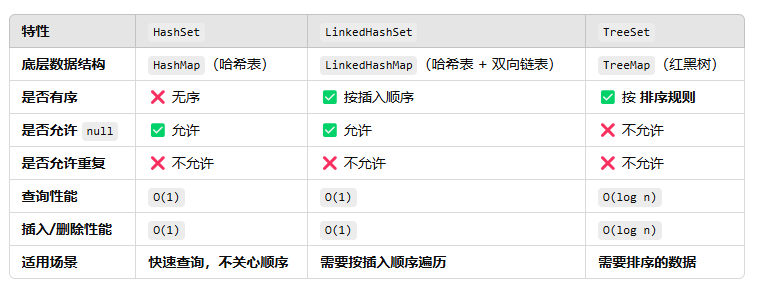


**3）Queue：队列，先进先出**

`Queue` 继承 `Collection`，用于**先进先出（FIFO）**的场景。

| **实现类**      | **特点**                       | **底层实现** |
| --------------- | ------------------------------ | ------------ |
| `LinkedList`    | **可用作队列或双端队列**       | **双向链表** |
| `PriorityQueue` | **按优先级排序**，默认最小优先 | **二叉堆**   |
| `ArrayDeque`    | **高效双端队列**               | **数组**     |

✅ **选择建议**：

- **普通队列 → `LinkedList`**
- **按优先级处理任务 → `PriorityQueue`**
- **高效双端队列 → `ArrayDeque`（比 `LinkedList` 性能更好）**


#### 3、Map 接口 (存储键值对)


`Map` **存储键值对（Key-Value）**，键不允许重复，值可以重复

| **实现类**          | **特点**                                        | **底层实现**                       |
| ------------------- | ----------------------------------------------- | ---------------------------------- |
| `HashMap`           | **无序，查询快，允许 `null` 键**                | **哈希表（数组 + 链表 + 红黑树）** |
| `LinkedHashMap`     | **有序，按插入顺序存储**                        | **哈希表 + 双向链表**              |
| `TreeMap`           | **自动排序，基于 `Comparable` 或 `Comparator`** | **红黑树**                         |
| `Hashtable`         | **线程安全，不允许 `null` 键**                  | **哈希表**                         |
| `ConcurrentHashMap` | **线程安全，高并发优化**                        | **分段锁哈希表**                   |

✅ **选择建议**：

- **查询快 → `HashMap`**
- **需要有序存储 → `LinkedHashMap`**
- **需要排序存储 → `TreeMap`**
- **需要线程安全 → `ConcurrentHashMap`（推荐）**


#### 4、并发集合 （线程安全）


Java 提供了线程安全的集合，适用于高并发场景：

| **接口** | **线程不安全** | **线程安全（并发优化）** |
| -------- | -------------- | ------------------------ |
| `List`   | `ArrayList`    | `CopyOnWriteArrayList`   |
| `Set`    | `HashSet`      | `CopyOnWriteArraySet`    |
| `Queue`  | `LinkedList`   | `ConcurrentLinkedQueue`  |
| `Map`    | `HashMap`      | `ConcurrentHashMap`      |


#### 5、总结


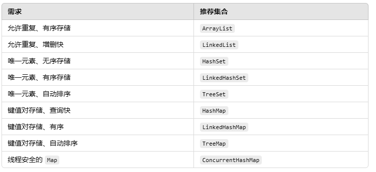


### 19、Java 中有几种引用类型？


> 为了更精细地控制对象的生命周期，特别是与**垃圾回收（GC，Garbage Collection）**交互的时机，Java 在 `java.lang.ref` 包中提供了四种引用类。从强到弱排列如下：


#### 1. 强引用（Strong Reference）

这是我们最常见的引用，平时写代码绝大多数都是强引用。

- **创建方式**：`Person p = new Person()；`
- **回收时机**：**只要引用存在，垃圾回收器永远不会回收**。即使内存不足抛出 `OutOfMemoryError`，GC 也不会碰它。
- **特点**：JVM 停止后才会终止。

#### 2. 软引用（Soft Reference）

用于描述还有用但非必需的对象

- **创建方式**：`SoftReference<Person> softRef = new SoftReference<>(new Person())；`
- **回收时机**：**当内存空间充足时，GC 不会回收它；只有当内存空间不足（即将抛出 OOM，OutOfMemoryError）时，才会回收软引用指向的对象**。
- **应用场景**：非常适合实现**内存敏感的高速缓存**（例如：图片缓存、网页缓存）。缓存的对象既能在内存充足时提升速度，又能在内存紧张时被释放，避免 OOM。

#### 3. 弱引用（Weak Reference）

强度比软引用更弱一些

- **创建方式**：`WeakReference<Person> weakRef = new WeakReference<>(new Person())；`
- **回收时机**：**只要垃圾回收器线程发现某个对象只有弱引用指向它（没有强引用和软引用），无论当前内存是否足够，都会立即回收该对象**。
- **应用场景**：
  - **`WeakHashMap`**：当 key 只有弱引用时，GC 时会自动回收 entry。
  - **ThreadLocal**：`ThreadLocal` 的 `ThreadLocalMap` 的 Entry 就是继承的 `WeakReference`，key 是弱引用，防止内存泄漏。

#### 4. 虚引用（Phantom Reference）

最弱的一种引用，也称为“幽灵引用”或“幻影引用”

- **创建方式**：`PhantomReference<Person> phantomRef = new PhantomReference<>(new Person(), referenceQueue)；`（**必须**配合 `ReferenceQueue` 使用）
- **回收时机**：**你根本无法通过虚引用获取到对象实例**（`get()` 方法始终返回 `null`）。它存在的唯一目的就是：当对象被 GC 回收时，**系统会收到一个通知**（该引用会被加入到关联的引用队列中）
- **应用场景**：主要用于**追踪对象的回收时机**，例如：管理堆外内存（DirectByteBuffer），希望在对象被回收时做一些清理工作（如释放直接内存）


#### 5. 对比总结

| 引用类型   | 回收时机                         | 主要用途                     | 能否通过 get() 获取对象 |
| :--------- | :------------------------------- | :--------------------------- | :---------------------- |
| **强引用** | 永不回收（JVM 退出才结束）       | 普通对象引用                 | 能                      |
| **软引用** | 内存不足时（OOM 前）             | 缓存实现（如图片缓存）       | 能                      |
| **弱引用** | 下一次 GC 时（无论内存是否充足） | `WeakHashMap`、`ThreadLocal` | 能                      |
| **虚引用** | 任何时候都可能回收，用于追踪清理 | 管理直接内存、对象回收监听   | **不能**（始终为 null） |


## 2、Java (JVM) 进阶问题


### 1、HashMap 底层原理实现


### 2、HashMap 和 ConcurrentHashMap 的区别？


### 3、TreeSet 是无序的对吧，那么它如何实现去重的？


### 4、Java类初始化顺序


### 5、对方法区和永久区的理解以及它们之间的关系


### 6、写一个你认为最好的单例模式


### 7、写一个死锁


### 8、Java多态实现原理？介绍下 Override 和 Overwrite


### 9、Collections.sort 排序内部原理


### 10、深拷贝和浅拷贝的区别是什么？


### 11、如何实现一个深拷贝？


### 12、JDK 动态代理 (AOP) 使用及实现原理


#### 1、先来讲讲什么是代理吧


##### 1、认识什么是代理


比如有一家大学，可以向全世界招生，然后学生可以通过自己国家的 留学中介（代理）帮助这个大学招生

-   中介是学校的代理，中介和学校要做的事情是一致的，都是招生
-   中介是代理，需要收取一定费用


在开发中也会有这样的情况，你有 A 类，本来是调用 C 类的方法，完成某个功能，但是 A 不能直接调用 C 类，所以需要在 A 、C 类之间创建一个代理类 B


##### 2、代理模式的作用


>   使用代理模式的作用
>
>   -   **功能增强**：在原有基础功能之上，增加了额外的功能，新增加的功能叫做功能增强
>   -   **控制访问**：代理类不让你访问目标，例如商家不让用户直接访问厂家


##### 3、实现代理的方式


-   静态代理：
    -   代理类是自己手工实现的，自己创建一个 Java 类
    -   同时要代理的目标也是确定的

>   优点
>
>   -   实现简单，容易理解
>
>   缺点：
>
>   -   如果需要 10 个商家，那就需要10个代理类，代理商家多了，代理类对应的也就变多了
>   -   当你的接口中功能增加或者修改了，那么将会影响众多的实现类，厂家类、代理类都需要修改


-   动态代理：
    -   在静态代理中目标类很多的时候，可以使用动态代理，避免静态代理的缺点
    -   动态代理中目标即使很多、代理类数量可以很少，当你修改了接口中的方法时，不会影响代理类

>   实现步骤：在程序执行过程中、使用 jdk 的反射机制，创建代理类对象、并动态的指定要代理的目标类


#### 2、静态代理的详细介绍


##### 1、场景分析阶段


我们模拟一个用户购买一个 U 盘为例，

-   客户端类（用户）
-   代理类（商家）：代理某个品牌的 U 盘
-   厂家类（目标类）：

>   商家和厂家都是卖U盘的，他们完成的目标是一致的


##### 2、实现步骤阶段


-   创建一个接口：定义卖 U 盘的方法、表示厂家和商家做的事情
-   创建厂家类：实现卖U盘接口
-   创建商家类：就是代理类，也需要实现卖U盘接口
-   创建客户端类：调用商家的方法买一个 u 盘


-   创建接口部分

```java
/**
 * 厂家接口
 */
public interface Manufacturers {

    /**
     * 卖 u 盘行为
     * @param amount 购买数量
     * @return 总价格
     */
    float sellUSBFlashDisk(int amount);
}
```

-   创建厂家类、实现 Manufacturers 接口的销售 u 盘功能

```java
/**
 * 厂家类：不接受用户买一个，需要批量购买
 */
public class UsbKingFactory implements Manufacturers {
    /**
     * u盘单价
     */
    final float unitPrice = 100f;

    public float sellUSBFlashDisk(int amount) {
        return unitPrice * amount;
    }
}
```

-   创建商家类（京东）

```java
/**
 * 商家类：京东、代理销售金士顿 u 盘
 */
public class JingDong implements Manufacturers {

    //定义：商家代理的厂家
    private Manufacturers manufacturers = new UsbKingFactory();

    /**
     * 实现销售 u 盘的功能
     *   商家不可能把厂家原价销售给用户，所以每个 u 盘加价 10 块
     */
    public float sellUSBFlashDisk(int amount) {
        float money = manufacturers.sellUSBFlashDisk(amount);
        /**
         * 这一步：就是增强功能, 还可以写其它增强功能
         *   比如给你返还一个优惠券或者红包
         */
        return money + amount * 10;
    }
}
```

-   创建用户购物主类

```java
/**
 * 用户类：购物
 */
public class UserShopMain {
    public static void main(String[] args) {

        int buyAmount = 5;
        JingDong jingDong = new JingDong();
        float money = jingDong.sellUSBFlashDisk(buyAmount);

        System.out.println("通过京东购买 " + buyAmount + " 个 U 盘、一共花费￥：" + money + " 元");
    }
}
```


##### 3、静态代理总结


优点：实现简单，容易理解

缺点：

-   如果需要 10 个商家，那就需要10个代理类，代理商家多了，代理类对应的也就变多了
-   当你的接口中功能增加或者修改了，那么将会影响众多的实现类，厂家类、代理类都需要修改


#### 3、动态代理的详细介绍


##### 1、动态代理是什么？


>   **动态代理是指代理类对象在程序运行时由 JVM 根据反射机制动态生成的，动态代理不需要定义代理类的 java 源文件，由 jdk 运行期间，动态创建 class 字节码并加载到 JVM 中**。动态代理的实现方式通常有两种：
>
>   -   使用 JDK 代理进行代理 （掌握）
>   -   通过 cglib 来进行动态代理、它是第三方的工具库（了解）
>


在程序执行过程中、使用 jdk 的反射机制，创建代理类对象、并动态的指定要代理的目标类、换句话说，动态代理是一种创建 java 对象的能力，让你不用编写代理类源文件，就能创建代理类对象


##### 2、动态代理的实现方式


###### **1、JDK 动态代理**


**Java 语言通过 java.lang.reflect 包、提供三个类支持代理模式 Proxy,  Method 和 InovcationHandler。JDK 的动态代理要求目标对象必须实现接口、通过实现`InvocationHandler` 类的 Invoke () 方法实现代理的逻辑**


###### **2、CGLib 动态代理	**


CGLib ( Code Generation Library ) 是一个开源项目、高性能、高质量的 Code 生成第三方类库，。原理是**在运行时生成目标类的子类，通过重写指定方法，在方法前后插入增强逻辑**。方法拦截由 `MethodInterceptor` 完成，原方法调用通过 `MethodProxy.invokeSuper()` 实现。是一个强大的，它可以运行期间扩展 Java 类与实现 Java 接口，它广泛的被许多 AOP 的框架使用，例如 Spring AOP。

注意：因为 cglib 是继承、重写方法，所以要求目标类不能是 final 的，方法也不能是 final 的

>   CGLib 的要求目标类比较宽松，只要能继承就可以了，CGLib 经常被应用到框架中，例如 Spring AOP、MyBatis、Hibernate 中，CGLib 的代理效率高于 JDK，对于 CGLib 一般的开发中并不使用，做一个了解即可
>
>   很多人都会误以为 **Spring AOP 就是 CGLIB**，其实并不完全正确。在 **Spring Framework** 中：有接口 → JDK 动态代理、没有接口 → CGLIB。只是在 Spring Boot 中改了默认配置，让其使用 CGLIB. 配置如下:
>
>   ```properties
>   spring.aop.proxy-target-class=true
>   ```


###### **3、如何选择使用场景**


使用 JDK 的 Proxy 实现代理，要求目标类与代理类实现相同的接口，若目标类不存在接口，则无法使用该方式实现。**但对于无接口的类，要为其创建动态代理，就要使用 CGLib 来实现，CGLib 代理生成的原理是生成目标类的子类**，而子类是增强过的，这个子类对象是代理对象。


##### 3、JDK 动态代理反射包介绍


>   主要用到反射包 java.lang.reflect、里面有三个类：InvocationHandler、Proxy、Method


###### **1、InvocationHandler 接口**


-   invoke()：里面就一个 invoke() 方法，表示代理对象要执行的功能代码、你的代理类要完成的功能就写在 invoke() 方法中

```java
//InvocationHandler 接口中的 invoke 方法原型
public Object invoke(Object proxy, Method method, Object[] args)
    throws Throwable;
```

>   invoke() 方法参数详解：

-   Object proxy (委托人)：JDK创建的对象，无需赋值
-   Method method：目标类中的方法，JDK 提供 Method 对象的
-   Object[] args 目标类中方法的参数


###### **2、Method 类**


表示方法的，确切的说就是目标类中的方法、作用是：通过这个 Method 可以执行某个目标类的方法、用法如下：

```jade
Object ret = method.invoke(目标对象、方法参数);
```

注意：Method 中的 invoke 方法和 InvocationHandler 中的 invoke 方法不一样，只是名字恰巧一样而已


###### **3、Proxy 类**


核心的对象、创建代理对象、之前创建对象都是 new 类的构造方法，现在我们是使用 Proxy 类的方法，代替 new 使用

-   方法：静态方法 newProxyInstance()
-   作用：创建代理对象，等用于静态代理中的 new Taobao()

方法原型如下

```java
@CallerSensitive
public static Object newProxyInstance(ClassLoader loader, 
       Class<?>[] interfaces, InvocationHandler h) throws IllegalArgumentException
```

>   newProxyInstance() 方法参数：

-   ClassLoader loader：目标对象的类加载器、使用反射获取对象的 ClassLoader
-   Class<?>[] interfaces：接口、目标对象实现的接口，也是反射获取的
-   InvocationHandler h：我们自己写的，代理类要完成的功能
-   返回值 Object：目标对象的代理对象


##### 4、基于 JDK 动态代理包实现


>   实现动态代理的步骤大纲：

1.  创建接口、定义目标类要完成的功能
2.  创建目标接口类实现接口
3.  创建 InvocationHandler 接口的实现类，在 invoke 方法中完成代理类的功能
    -   调用目标方法
    -   增强功能
4.  使用 Proxy 类的静态方法、创建代理对象，并发返回值转为接口类型


>   具体代码实现

-   创建接口、定义目标类要完成的功能

```java
/**
 * 创建接口、定义目标类要完成的功能
 */
public interface UsbSell {

    /**
     * 销售 U 盘
     * @param amount 购买数量
     * @return 总价格
     */
    float sellUSBFlashDisk(int amount);
}
```

-   创建目标接口类实现接口

```java
/**
 * 创建目标接口类实现接口
 */
public class UsbKingFactory implements UsbSell {

    // U 盘单价
    final float unitPrice = 100f;

    /**
     * 厂家出售 U 盘
     * @param amount 购买数量
     * @return 总消费金额
     */
    public float sellUSBFlashDisk(int amount) {
        return unitPrice * amount;
    }
}
```

-   创建 InvocationHandler 接口的实现类，在 Invoke 方法中完成代理类的功能
    -   调用目标方法
    -   增强功能

```java
/**
 * 创建 InvocationHandler 接口的实现类，在 invoke 方法中完成代理类的功能
 * -   调用目标方法
 * -   增强功能
 */
public class MySellHandler implements InvocationHandler {

    // 目标类
    private Object target;
    // 每卖出一个 U 盘赚 10 块
    private final float profitMoney = 10f;

    public MySellHandler(Object target) {
        this.target = target;
    }

    /**
     * 调用并增强目标类的方法
     *
     * @param proxy  要调用的对象
     * @param method 要调用的方法
     * @param args   方法传入的参数
     * @return
     * @throws Throwable
     */
    public Object invoke(Object proxy, Method method, Object[] args) throws Throwable {
        Object invokeResult = method.invoke(target, args);
        //获取参数中的购买数量
        int buyAmount = Integer.parseInt(args[0].toString());
        Float money = Float.parseFloat(invokeResult.toString()) + buyAmount * profitMoney;
        return money;
    }
}
```

-   使用 Proxy 类的静态方法、创建代理对象，并发返回值转为接口类型

```java
public class LeeShopMain {
    public static void main(String[] args) {
        
        int buyAmount = 5;
        // 1、创建代理对象、使用 Proxy
        UsbSell factory = new UsbKingFactory();
        // 2、创建 InvocationHandler 对象
        InvocationHandler invocationHandler = new MySellHandler(factory);
        // 3、创建代理对象
        UsbSell proxy = (UsbSell) Proxy.newProxyInstance(factory.getClass().getClassLoader(), factory.getClass().getInterfaces(), invocationHandler);

        // 4、通过动态代理执行方法
        float money = proxy.sellUSBFlashDisk(5);
        System.out.println("通过动态代理购买 " + buyAmount + " 个 U 盘、一共花费￥：" + money + " 元");
    }
}
```


##### 5、动态代理在项目中的运用


>   可以在不改变原有目标方法代码的情况下，可以在代理中增强自己的功能. 比如
>
>   -   你在项目中有一个功能是其他人写好的，你可以使用，但是这个功能不能满足我项目的需要，比如第三方的 API、又没有源代码的情况下，那么我完全可以用动态代理来增强这个功能


### 13、BIO、NIO、AIO 之间的区别是什么


在 Java 中，`BIO`、`NIO` 和 `AIO` 是三种不同的 I/O 模型，分别对应着不同的 I/O 编程方式，适用于不同的场景和性能需求。

#### **1、BIO（Blocking I/O）—— 阻塞式 I/O**


> - 传统的 Java I/O 模型（`java.io` 包）
>
> - 每个连接都需要一个线程来处理。
>
> - I/O 操作是**同步阻塞**的，线程会一直等待操作完成
>
>   ✅ `server.accept()` 方法是**阻塞式**的，直到有新的客户端连接
>   ✅ 适用于**小规模连接**（线程数量可控）
>
>   ❌ 每个连接需要一个线程，导致在大量连接时，线程资源被迅速耗尽
>   ❌ **大量连接时**，线程数会迅速膨胀，导致**性能瓶颈**

```java
import java.io.*;
import java.net.ServerSocket;
import java.net.Socket;

public class BIOServer {
    public static void main(String[] args) throws IOException {
        ServerSocket server = new ServerSocket(8080);
        System.out.println("BIO Server started...");

        while (true) {
            Socket socket = server.accept(); //阻塞，直到有连接建立
            System.out.println("Client connected: " + socket.getInetAddress());
            // 为每个连接开启一个新线程
            new Thread(() -> {
                try (BufferedReader reader = new BufferedReader(new InputStreamReader(socket.getInputStream()));
                     BufferedWriter writer = new BufferedWriter(new OutputStreamWriter(socket.getOutputStream()))) {
                    String message;
                    while ((message = reader.readLine()) != null) {
                        System.out.println("Received: " + message);
                        writer.write("Echo: " + message + "\n");
                        writer.flush();
                    }
                } catch (IOException e) {
                    e.printStackTrace();
                }
            }).start();
        }
    }
}

```


#### 2、NIO（Non-blocking I/O）—— 非阻塞式 I/O


> - 引入于 **Java 1.4**（`java.nio` 包）。
> - 采用**多路复用（Selector）**机制，可以使用一个线程同时处理多个连接
> - I/O 操作是**同步非阻塞**的，线程可以在等待 I/O 完成的同时，处理其他任务
>
> ✅ 采用单线程处理大量并发连接（通过 Selector）
> ✅ 非阻塞，线程可以复用，减少线程上下文切换
> ✅ 适用于**高并发、大量连接**但 I/O 处理速度不快的场景
> ❌ 编程复杂度较高（涉及 Selector、Channel、Buffer）
> ❌ 数据读写仍然是**同步操作**，虽然是非阻塞的，但操作本身仍需要**线程主动处理**


通过 **Selector** 监听多个 Channel 的事件。

`select()` 方法是**阻塞的**，但事件触发后，所有 I/O 操作是**非阻塞的**。

一个线程可以管理多个连接，极大提高了系统吞吐量。

```java
import java.io.IOException;
import java.net.InetSocketAddress;
import java.nio.ByteBuffer;
import java.nio.channels.*;

public class NIOServer {
    public static void main(String[] args) throws IOException {
        Selector selector = Selector.open();
        ServerSocketChannel serverSocket = ServerSocketChannel.open();
        serverSocket.bind(new InetSocketAddress(8080));
        serverSocket.configureBlocking(false); // 设置为非阻塞模式
        serverSocket.register(selector, SelectionKey.OP_ACCEPT);

        System.out.println("NIO Server started...");

        while (true) {
            selector.select(); // 阻塞直到有事件触发
            for (SelectionKey key : selector.selectedKeys()) {
                if (key.isAcceptable()) {
                    SocketChannel client = serverSocket.accept();
                    client.configureBlocking(false);
                    client.register(selector, SelectionKey.OP_READ);
                    System.out.println("Client connected: " + client.getRemoteAddress());
                } else if (key.isReadable()) {
                    SocketChannel client = (SocketChannel) key.channel();
                    ByteBuffer buffer = ByteBuffer.allocate(1024);
                    int bytesRead = client.read(buffer);
                    if (bytesRead == -1) {
                        client.close();
                    } else {
                        buffer.flip();
                        System.out.println("Received: " + new String(buffer.array(), 0, bytesRead));
                    }
                }
            }
            selector.selectedKeys().clear(); // 清除已处理的事件
        }
    }
}
```


#### 3、AIO（Asynchronous I/O）—— 异步 I/O


> - 引入于 **Java 1.7**（`java.nio.channels` 包中的 `AsynchronousChannel`）
> - 采用 **操作系统级别的异步机制**（通过 `I/O Completion Port (IOCP)` 或事件通知）
> - I/O 操作是**异步非阻塞**的，操作完成后通过回调通知
>
> ✅ 操作完全异步，完全基于 **事件驱动** + **回调机制**
> ✅ 采用 **操作系统级别的异步 I/O 机制**，无需线程主动读取数据
> ✅ 适合**高并发、长连接**
> ❌ 编程复杂度更高
> ❌ 需要操作系统支持


#### 4、小结


### 14、什么是虚拟线程？原理是什么？


> **虚拟线程从 JDK 16 开始引进预览版、到 JDK21 推出正式版本**
>
> 简单来说，**虚拟线程是由 JVM 管理而非操作系统管理的轻量级线程**。它解决了传统Java线程（即平台线程）作为操作系统内核线程的“代理”时，存在的创建成本高、上下文切换开销大、并发数量受限等根本性问题。可以把它看作一次从“**操作系统调度**” 到 **“JVM用户态调度”** 的范式转移


⚙️**核心机制一：M对N的映射关系** 这是虚拟线程实现高性能的基石

- **传统模型 (1:1)**：每个平台线程（`java.lang.Thread`的实例）都一对一映射到一个操作系统内核线程。操作系统负责调度这些内核线程，开销巨大
- **虚拟线程模型 (M:N)**：多个虚拟线程会被映射到数量较少的平台线程上。这些承载虚拟线程执行的平台线程被称为**载体线程（Carrier Thread）**。载体线程的数量通常与CPU核心数相当。对操作系统而言，它只看到少量的载体线程在运行，而所有复杂的调度和状态管理都在JVM内部完成

这个关系可以用一个生动的比喻来理解：

> 假设CPU核心是**出租车**，平台线程是**司机**，虚拟线程就是**乘客**。
>
> - 在传统模型中，一个乘客上车后，司机就只为他服务，即使乘客在车上睡觉（I/O阻塞），出租车也得等着。
> - 在虚拟线程模型中，当一个乘客需要睡觉（阻塞）时，司机（载体线程）会立即让他下车（Unmounting），然后去拉另一个醒着的乘客（其他虚拟线程）。等乘客睡醒，司机（可能是另一个空闲司机）再接上他继续行程。


⚙️ **核心机制二：挂载与卸载的调度执行**

实现上述 “司机换乘客” 这一神奇操作的关键，在于 **挂载（Mount）**与**卸载（Unmount）**机制。这个机制由 JVM 内的一个**调度器**（基于`ForkJoinPool`实现）负责执行

1. **挂载（Mount）**：当一个虚拟线程被调度执行时，调度器会将它**挂载**到一个空闲的载体线程上。此时，虚拟线程的代码开始运行
2. **执行与阻塞检测**：JVM在关键的阻塞点（如Socket I/O、`BlockingQueue.take()`、`Future.get()`等）进行了插桩。当运行中的虚拟线程执行到这些操作并即将阻塞时，JVM会介入
3. **卸载（Unmount）**：在虚拟线程真正陷入阻塞之前，JVM会保存其当前的执行状态（包括栈帧和程序计数器），然后将这个虚拟线程从载体线程上**卸载**下来。此时，载体线程被释放，可以立即去执行任务队列中的另一个虚拟线程
4. **恢复（Resume）**：原先的I/O操作完成后（例如，数据已就绪），JVM会将之前保存的虚拟线程状态重新**挂载**到某个空闲的载体线程上，继续执行后续代码

整个过程对开发者完全透明，我们写的依然是同步、阻塞式的代码，但其底层却实现了类似异步非阻塞的高效利用


**⚙️ 核心机制三：关键技术挑战与实现细节**

虚拟线程的使用并非没有挑战，理解这些有助于我们在使用时规避“坑”

- **1. 内存管理：轻量级栈**
  平台线程的栈空间在启动时就预先分配了固定大小（通常为MB级别）。而虚拟线程的栈是在堆上分配的，并且是**动态可变的**。当方法调用时，栈帧可能被分配到堆内存中的多个不连续块中。在上下文切换（卸载/挂载）时，这些栈帧需要被高效地复制和移动，但总体内存占用比平台线程小得多，一个虚拟线程仅占用几百字节到几KB

- **2. 钉住（Pinning）问题**
  这是使用虚拟线程时需要特别注意的性能陷阱。在某些特定情况下，虚拟线程在阻塞时**无法**被卸载，从而导致它“钉住”了载体线程，使其也无法去执行其他任务。这会导致虚拟线程退化为平台线程，并发能力下降

  **会发生“钉住”的常见场景：**

  - 1️⃣在 `synchronized` 同步块或方法内部执行阻塞操作（如`Thread.sleep()`）
  - 2️⃣**执行本地方法**（Native Method）或JNI（Java Native Interface）调用时
  - 3️⃣ 长时间、大循环 CPU 计算、因为没有阻塞点

  **最佳实践**：尽量使用 `java.util.concurrent.locks.ReentrantLock` 等JUC（Java并发工具包）锁来替代 `synchronized`，以避免虚拟线程被钉住

- **3. `ThreadLocal` 的风险**
  由于虚拟线程数量可以极其庞大（百万级），如果每个虚拟线程都使用了 `ThreadLocal` 存储数据，即使每个只占用少量内存，总和也可能导致堆内存溢出（OOM）。官方建议，在虚拟线程场景下应谨慎使用 `ThreadLocal`，推荐使用新的 `ScopedValue`（作用域值）作为替代方案

```javascript
//虚拟线程的创建方式
Thread.startVirtualThread(() -> {
    System.out.println("Hello Virtual Thread");
});

ExecutorService executor =
    Executors.newVirtualThreadPerTaskExecutor();
```


## 3、Java 设计模式


### 1、 Singleton(单例) 设计模式


#### 1、什么是单例设计模式？


>   Singleton：在 Java 中即指单例设计模式、它是软件开发中最常用的设计模式之一
>
>   概念：单例设计模式，即某个类在整个系统中只能有一个实例对象可被获取和使用的代码模式


#### 2、实现单例设计模式


>   设计要点：

-   一是某个类只能有一个实例
    -   构造器私有化
-   二是它必须自行创建这个实例
    -   含有一个该类的静态变量来保存这个唯一的实例
-   三是它必须自行向整个系统提供这个实例
    -   直接暴漏  ||  用静态变量的 get 方法获取


#### 3、单例模式常见的实现


##### 1、饿汉式：直接创建对象 (没有线程安全问题)


###### 1、直接实例化（简介直观）

```java
/**
 * 饿汉式：
 *   直接创建对象，不管你是否需要
 *
 * 1、构造器私有化
 * 2、自行创景、并且静态变量保存
 * 3、向外提供这个实例
 * 4、强调这是一个单例，我们可以用 final 声明
 */
public class Singleton1 {
    public static final Singleton1 INSTANCE = new Singleton1();
}
```


###### 2、枚举式（最简洁）

-   JDK1.5 之后，我们可以直接用枚举的形式实现

```java
/**
 * 饿汉式：
 *   直接创建对象，不管你是否需要
 *
 * 枚举类型：标识该类型的对象是有限的几个
 * 我们可以限定一个就成了单例
 */
public enum Singleton2 {
    INSTANCE
}
```


###### 3、静态代码块（适合复杂实例化）

```java
/**
 * 饿汉式：
 *   直接创建对象，不管你是否需要
 *
 * 适用于比较复杂的情况、例如需要设置单例的实例信息
 */
public class Singleton3 {

    /*配置信息 config*/
    private String config;
    public static final Singleton3 INSTANCE;

    static{
        //从配置文件中读取 config 配置信息
        Properties properties = new Properties();
        INSTANCE = new Singleton3(properties.getProperty("config"));
    }

    private Singleton3(String config){
        this.config = config;
    }
}
```


##### 2、懒汉式：延迟创建对象 


###### 1、线程不安全（适用于单线程）

>   以下代码多线程情况下将会导致单例被实例化多次的问题

```java
/**
 * 懒汉式
 *   延迟创建这个实例对象
 *
 * 1、构造器私有化
 * 2、用一个静态变量保存这个唯一的实例
 * 3、提供一个静态方法、获取这个实例对象
 */
public class Singleton4 {

    private static Singleton4 instance;

    public static Singleton4 getInstance(){
        if (instance == null){
            instance = new Singleton4();
        }
        return instance;
    }
}
```


###### 2、线程安全（使用多线程）

```java
/**
 * 懒汉式
 *   延迟创建这个实例对象
 *
 * 1、构造器私有化
 * 2、用一个静态变量保存这个唯一的实例
 * 3、提供一个静态方法、获取这个实例对象
 */
public class Singleton4 {

    private static Singleton4 instance;

    public static Singleton4 getInstance(){
        
        //外层判断优化性能，只是多线程情况下如果 instance 初始化了后就不要在上锁了
        if(instance == null) {
            synchronized (Singleton4.class) {
                if (instance == null) {
                    instance = new Singleton4();
                }
            }
        }

        return instance;
    }
}
```


###### 3、静态内部类形式（适用于多线程）

```java
/**
 * 懒汉式
 *   延迟创建这个实例对象
 *
 * 静态内部类不会随着外部类的加载和初始化而初始化、它是要单独去加载和初始化
 */
public class Singleton5 {

    //在内部类被加载和初始化时，才加载和创建
    public static Singleton5 getInstance(){
        return Inner.instance;
    }

    /**
     * 内部类 Inner
     */
    private static class Inner{
        private static Singleton5 instance = new Singleton5();
    }
}
```


## 4、Java 多线程


### 1、什么是串行？什么是并发？


### 2、能说说进程和线程吗


### 3、线程的生命周期有哪些？


### 4、线程的开辟方式？


### 5、线程中常用的方法有哪些？


### 6、什么是临界资源？


### 7、线程同步有几种方案？各个方案有什么优缺点？


### 8、Synchronized 与 Lock 锁的对比？


### 9、什么是死锁？如何解决死锁？


### 10、Java中线程有哪些状态？


### 11、线程池有哪些核心参数？


### 12、线程池的线程数量过大会有什么问题吗


### 13、线程池有多少种拒绝策略？


### 14、新的任务提交到线程池，线程池是怎样处理


### 15、如何来中断一个线程？正在 Running 的线程能够被中断吗？


## 5、JUC 并发编程


### 1、用互斥锁实现读写锁，写者优先


### 2、ReadWriteLock 读写之间互斥吗


### 3、Semaphore 拿到执行权的线程之间是否互斥


### 4、i++ 是原子性操作吗？


>   "原子操作(atomic operation)是不需要synchronized"，这是多线程编程的老生常谈了。所谓原子操作是指不会被[线程调度](https://baike.baidu.com/item/线程调度/10226112)机制打断的操作；这种操作一旦开始，就一直运行到结束，中间不会有任何 context switch （切换到另一个线程）、**但是需要注意的是原子保证不等于指令执行顺序的保证**


所以不是，因为 Java 是多线程的，假如有两个线程同时对 i++ 做 100 次，两个线程都同时访问 i 这个变量，此时将会产生临界资源问题，假如极端情况， A 线程先执行对 i 进行了 100 次自增运算后，B 线程才抢到了 CPU 时间片开始做 i 的自增100 次运算，那么此时 i 的最大值将是 200，违背了设计的初衷

>   i++ 的指令的三个步骤：
>
>   1.  先取 i 的值
>   2.  然后加 1
>   3.  然后将结果重新赋值给 i
>
>   如下图：i 的最终值范围在 2 ~ 200 之间

**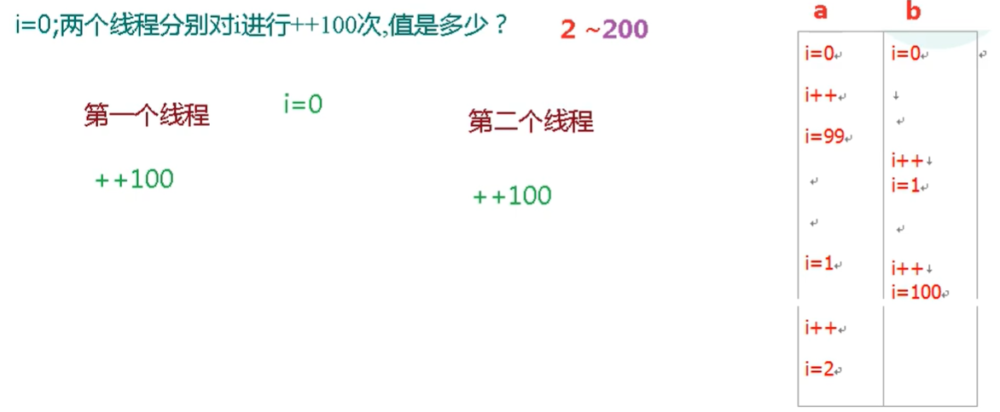**


### 5、int a = 1;  是原子性操作吗


### 6、AQS 和 CAS 的实现原理


### 7、Synchronized 底层实现原理


### 8、volatile 作用，指令重排相关


### 9、对象头具体都包含哪些内容？


### 10、进程间通信有哪几种方式？


1.  管道（Pipe）
2.  命名管道（named pipe）
3.  信号（Signal）
4.  消息（Message）队列
5.  共享内存
6.  内存映射（mapped memory）
7.  信号量（semaphore）
8.  套接口（Socket）


# 2、Spring Question


## 1、Spring Bean 的作用域的区别？


在 Spring 中，可以在 <bean> 元素的 Scope 属性里设置 bean 的作用域，以决定这个 bean 是单实例的还是多实例的。

默认情况下，Spring 只为每个在 IOC 容器里声明的 bean 创建唯一一个实例，整个 IOC 容器范围内都能共享该实例；所有后续的 getBean() 调用和 bean 引用都将返回这个唯一的 bean 实例。该作用域被称为 singleton(单例)，它是所有 bean 的默认作用域。

| 类别      | 说明                                                         |
| --------- | ------------------------------------------------------------ |
| singleton | 在 Spring IOC 容器中仅存在一个 Bean 实例，Bean 以单实例的方式存在，每次调用 getBean() 时都会返回一个新的实例 |
| prototype | 每次调用 getBean() 时都会返回一个新的实例                    |
| request   | 每次 HTTP 请求都会创建一个新的 Bean，该作用域仅适用于 WebApplicationContext 环境 |
| session   | 同一个 HTTP Session 共享一个 Bean，不同的 HTTP Session 使用不同的 Bean，该作用域仅适用于 WebApplicationContext 环境 |


## 2、Spring 支持的数据库事务传播属性和隔离级别


### 1、事务的传播行为


当事务方法被另一个事务方法调用时，必须指定事务应该如何传播。例如:方法可能继续在现有事务中运行，也可能开启一个新事务，并在自己的事务中运行。事务的传播行为可以由传播属性指定。Spring 定义了 7 种类传播行为。


| 传播属性        | 描述                                                         |
| --------------- | ------------------------------------------------------------ |
| Required (默认) | 如果有事务在运行，当前的方法就在这个事务内运行，否则，就启动一个新的事务，并在自己的事务内运行 |
| Requires_New    | 当前的方法必须启动新事物，并在它自己的事务内运行，如果有其他事务，将挂起 |
| Supports        | 如果有事务在运行，当前的方法就在这个事务内运行，否则它可以不运行在事务中 |
| Not_Supported   | 当前的方法不应该运行在事务中，如果有运行的事务，将它挂起     |
| Mandatory       | 当前的方法必须运行在事务内，如果没有正在运行的事务，就抛出异常 |
| Never           | 当前的方法不应该运行在事务中，如果有运行的事务，就抛出异常   |
| Nested          | 如果有事务在运行，当前的方法就应该在这个事务的嵌套事务内运行，否则，就启动一个新的事务，并在它自己的事务内运行 |

事务的传播属性可以在 @Transactional 注解中的 propagation 属性中定义

```jade
@Transactijonal(propagation=Propagation.REQUIRES_NEW)
```


### 2、数据库事务并发问题


**脏读**：事务 A 读取了事务 B 更新的数据，然后 B 回滚操作，那么A读取到的数据是脏数据

**不可重复读**：事务 A 多次读取同一数据，事务 B 在事务 A 多次读取的过程中，对数据作了更新并提交，导致事务A 多次读取同一数据时，结果不一致。

**幻读**：系统管理员 A 将数据库中所有学生的成绩从具体分数改为 A B C D E 等级，但是系统管理员 B 就在这个时候插入了一条具体分数的记录，当系统管理员 A 改结束后发现还有一条记录没有改过来，就好像发生了幻觉一样，这就叫幻读。

>   **小结**：不可重复读的和幻读很容易混淆，不可重复读侧重于修改，幻读侧重于新增或删除。解决不可重复读的问题只需锁住满足条件的行，解决幻读需要锁表

事务的隔离界别可以在 @Transactional 注解中的 isolation 属性中定义

```jade
@Transactijonal(propagation=Propagation.REQUIRES_NEW, isolation=Isolatoin.DEFAULT)
```


### 3、@Transactional 事务的参数详解


>   @Transactional 注解的属性信息

| 属性名           | 说明                                                         |
| ---------------- | ------------------------------------------------------------ |
| name             | 当在配置文件中有多个 TransactionManager , 可以用该属性指定选择哪个事务管理器。 |
| propagation      | 事务的传播行为，默认值为 REQUIRED。                          |
| isolation        | 事务的隔离度，默认值采用 DEFAULT。                           |
| timeout          | 事务的超时时间，默认值为-1。如果超过该时间限制但事务还没有完成，则自动回滚事务。 |
| read-only        | 指定事务是否为只读事务，默认值为 false；为了忽略那些不需要事务的方法，比如读取数据，可以设置 read-only 为 true。 |
| rollback-for     | 用于指定能够触发事务回滚的异常类型，如果有多个异常类型需要指定，各类型之间可以通过逗号分隔。 |
| no-rollback- for | 抛出 no-rollback-for 指定的异常类型，不回滚事务。            |

**@Transactional 标签默认会对 RuntimeException 异常进行回滚，也可以通过 rollback-for 指定具体异常，如果你抛出的异常不是继承自 RuntimeException，那需要你指定回滚的异常是什么异常，所以，加了 你要在 try catch 块后，要在 catch 中 throw 那个异常，如果不抛，事务根本不会回滚**


### 4、讲讲你对 IOC 的理解


### 5、讲讲你对 AOP 的理解


#### 1、AOP 通知的常用注解


-   @Before(前置通知)：目标方法之前执行
-   @After(后置通知)：目标方法之后执行（始终执行）
-   @AfterReturning(返回后通知)：执行方法结束前执行（异常不执行）
-   @AfterThrowing(异常通知)：出现异常时执行
-   @Around(环绕通知)：环绕目标方法执行


#### 2、Spring 4 到 Spring 5 全部通知执行顺序？有哪些坑？


##### 1、代码准备部分

-   Service 部分

```java
import com.lee.practice.service.CalcService;
import org.springframework.stereotype.Service;

/**
 * CalcService 实现类
 */
@Service
public class CalcServiceImpl implements CalcService {

    public int calculateNums(int x, int y) {
        int result = x / y;
        System.out.println(" ==============> result：" + result);
        return result;
    }
}
```

-   aop 通知部分

```java
import org.aspectj.lang.ProceedingJoinPoint;
import org.aspectj.lang.annotation.*;
import org.springframework.stereotype.Component;

@Aspect
@Component
public class MyAspect {

    @Before("execution(public int com.lee.practice.service.impl.CalcServiceImpl.*(..))")
    public void beforeNotify(){
        System.out.println("********************** @Before 前置通知");
    }

    @After("execution(public int com.lee.practice.service.impl.CalcServiceImpl.*(..))")
    public void afterNotify(){
        System.out.println("********************** @After 后置通知");
    }

    @AfterReturning("execution(public int com.lee.practice.service.impl.CalcServiceImpl.*(..))")
    public void afterReturningNotify(){
        System.out.println("********************** @AfterReturning 返回后通知");
    }

    @AfterThrowing("execution(public int com.lee.practice.service.impl.CalcServiceImpl.*(..))")
    public void afterThrowingNotify(){
        System.out.println("********************** @AfterThrowing 异常通知");
    }

    @Around("execution(public int com.lee.practice.service.impl.CalcServiceImpl.*(..))")
    public Object aroundNotify(ProceedingJoinPoint proceedingJoinPoint) throws  Throwable{

        System.out.println("********************** @Around 环绕通知 (前 AAA)");
        Object retValue = proceedingJoinPoint.proceed();
        System.out.println("********************** @Around 环绕通知 (后 BBB)");
        return retValue;
    }
}
```


##### 2、Spring 4 的正常通知顺序

```java
********************** @Around 环绕通知 (前 AAA)
********************** @Before 前置通知
 ==============> result：3
********************** @Around 环绕通知 (后 BBB)
********************** @After 后置通知
********************** @AfterReturning 返回后通知
```


##### 3、Spring 4 的异常通知顺序

```java
********************** @Around 环绕通知 (前 AAA)
********************** @Before 前置通知
********************** @After 后置通知
********************** @AfterReturning 返回后通知

java.lang.ArithmeticException: / by zero
```


##### 4、Spring 5 的正常通知顺序

```java
********************** @Around 环绕通知 (前 AAA)
********************** @Before 前置通知
 ==============> result：3
********************** @AfterReturning 返回后通知
********************** @After 后置通知
********************** @Around 环绕通知 (后 BBB)
```


##### 5、Spring 5 的异常通知顺序

```java
********************** @Around 环绕通知 (前 AAA)
********************** @Before 前置通知
********************** @AfterThrowing 异常通知
********************** @After 后置通知

java.lang.ArithmeticException: / by zero
```


## 3、Spring 的循环依赖是什么？如何解决？


### 1、什么是循环依赖


多个 bean 之间相互依赖，形成了一个闭环，比如：A 依赖于 B 、B 依赖 C、C 又依赖 A，通常来说，如果问 Spring 容器内部如何解决循环依赖，**一定是指默认的单例 Bean 中**，属性互相引用的场景

>   如下图所示

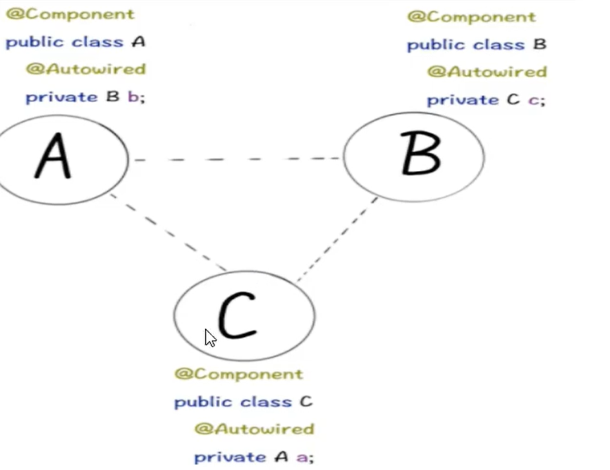


>   Spring 官网对于循环依赖的描述（机翻）
>
>   https://docs.spring.io/spring-framework/docs/current/reference/html/core.html#beans-dependency-resolution

-   Spring 对于构造注入不友好，会产生循环依赖问题
-   默认的单例 (singleton) 的场景是支持循环依赖的不会报错
-   **解决方案：我们 AB 循环依赖问题只要 A 的注入方式是 setter 且 singleton (单例)，就不会有循环依赖问题**

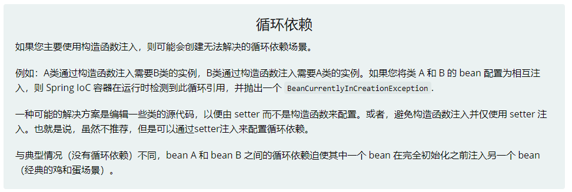


### 2、Java 代码循环依赖问题重现


1、编写 ServiceA、ServiceB  的代码

-   ServiceA

```java
/**
 * 演示循环依赖问题：
 *   构造器注入
 */
@Component
public class ServiceA {
    private ServiceB serviceB;

    public ServiceA(ServiceB serviceB){
        this.serviceB = serviceB;
    }
}
```

-   ServiceB

```java
/**
 * 演示循环依赖问题：
 *   构造器注入
 */
@Component
public class ServiceB {
    private ServiceA serviceA;

    public ServiceB(ServiceA serviceA) {
        this.serviceA = serviceA;
    }
}
```


2、测试类代码分析

```java
public static void main(String[] args) {
    /**
     * 循环依赖演示：
     *  new ServiceA(); 需要传入 ServiceB 对象
     *  然后我们在 new ServiceB() 的时候，还需要传入 ServiceA 对象
     *  所以通过 new 方式永远行不通，一层套一层，层层套娃
     */
    ServiceA serviceA = new ServiceA(new ServiceB());
}
```


### 3、引入 Spring 容器演示循环依赖Bug


>   报错如下：

```ABAP
Caused by: 
  org.springframework.beans.factory.BeanCurrentlyInCreationException: 
  Error creating bean with name 'serviceA': Requested bean is currently in creation: 
  Is there an unresolvable circular reference?

	at org.springframework.beans.factory.support.DefaultSingletonBeanRegistry.beforeSingletonCreation(DefaultSingletonBeanRegistry.java:355)
	at org.springframework.beans.factory.support.DefaultSingletonBeanRegistry.getSingleton(DefaultSingletonBeanRegistry.java:227)
	at org.springframework.beans.factory.support.AbstractBeanFactory.doGetBean(AbstractBeanFactory.java:333)
```


### 4、Spring 内部通过 3 级缓存来解决循环依赖


>   第一级缓存 singletonObjects (单例池)：存放已经经历了完整生命周期的 Bean 对象
>
>   第二级缓存 earlySingletonObjects：存放早期暴露出来的 Bean 对象，Bean 的生命周期未结束(属性还未填充完)
>
>   第三级缓存 Map<String, ObjectFactory<?>> singletonFactories：存放可以生成 Bean 的工厂

核心类 DefaultSingletonBeanRegistry( 音：Default [星勾 ten] Bean [ruai jie 丝吹] ) 源码如下：

```java
package org.springframework.beans.factory.support;


public class DefaultSingletonBeanRegistry extends SimpleAliasRegistry implements SingletonBeanRegistry {

	/** 要保留的被抑制异常的最大数目. */
	private static final int SUPPRESSED_EXCEPTIONS_LIMIT = 100;

	/**
	 * 单例对象的缓存：bean 名称 bean 实例，即：所谓单例池
	 * 表示已经经历了完整生命周期的 Bean 对象
	 * <b>一级缓存</b>
	 */
	private final Map<String, Object> singletonObjects = new ConcurrentHashMap<>(256);

    /**
	 * 单例工厂的告诉缓存：bean 名称 ObjectFactory
	 * 表示存放生成 bean 的工厂
	 * <b>三级缓存</b>
	 */
	private final Map<String, ObjectFactory<?>> singletonFactories = new HashMap<>(16);

	/**
	 * 早期单例对象的高速缓存：bean 名称 bean 实例
	 * 表示 Bean 的生命周期还没走完 (Bean的属性还未填充)
	 * 就把这个 Bean 存入该缓存中，也就是实例化但未初始化的 bean 放入缓存中
	 * <b>二级缓存</b>
	 */
	private final Map<String, Object> earlySingletonObjects = new ConcurrentHashMap<>(16);
}
```

**只有单例的 Bean 会通过三级缓存提前暴漏来解决循环依赖的问题，而非单例的 bean，每次从容器中获取都是一个新的对象，都会重新创建，所以非单例的 bean 是没有缓存的，不会将其放到三级缓存中**


>   A/B 两对象在三级缓存中的迁移说明

1.  A 创建的过程中需要 B，于是 A 将自己放到三级缓存中，去实例化 B
2.  B 实例化的时候发现需要 A，于是 B 先查一级缓存，没有的话，在查二级缓存，还是没有，在查三级缓存，找到了 A 然后把三级缓存里面的 A 放到二级缓存中，并删除三级缓存里面的 A
3.  B 顺利初始化完毕，将自己放到一级缓存里里面（此时 B 里面的 A 依然是创建中状态），然后回来接着创建 A，此时 B 已经创建结束、直接从一级缓存中拿到 B，然后完成创建，并将 A 自己放到一级缓存里面

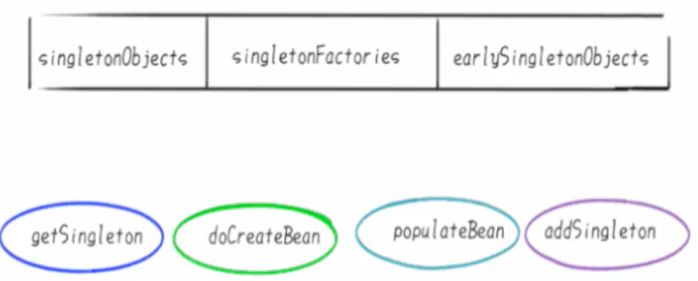


## 4、Spring 为什么默认是单例？


## 5、销毁 Bean 一般有哪几种方式 ？


## 6、Spring Bean 的注入流程？


## 7、Spring Bean 的生命周期？


## 8、BeanFactory 和 ApplicationContext 有什么区别 ？


## 9、BeanFactory 和 FactoryBean 有什么区别吗 ?


## 10、Bean 声明周期中创建 Bean 的步骤：有哪几种注入方式


## 11、Spring Bean 的 IOC 具体如何实现？


## 12、Spring AOP 的原理知道吗？Java 的有几种代理模式？


## 13、Spring 声明式注解的原理？


## 14、Spring 声明式事务配置后没有生效，需要注意什么点？


## 15、Spring 声明式事务，一个类里面，A 方法调用 B 方法，注解是在 B 方法上，那么事务会生效吗？为什么？


## 16、介绍下 Spring 编程式事务的原理？


## 17、过滤器或者拦截器的区别是什么？


## 18、@RequestParam、@PathVariable、@PathParam 三者区别？


## 19、@Controller 和 @RestController 的区别是什么?


## 20、@Autowired 和 @Resouce 的区别是什么？


## 21、什么是 Restful 风格 ？


# 3、SpringBoot Question


## 1、谈谈 SpringBoot 自动装配原理？


## 2、Spring 中常用的注解有哪些？


## 3、SpringBoot 如何装配一个 Starter


# 4、SpringMVC Question


## 1、SpringMVC 解决POST请求中文乱码


-   我们需要在 web.xml 中配置 CharacterEncodingFilter 类的 encodingFilter 过滤

```xml
<!-- encodingFilter -->
<filter>
    <filter-name>encodingFilter</filter-name>
    <filter-class>org.springframework.web.filter.CharacterEncodingFilter</filter-class>

    <init-param>
        <param-name>encoding</param-name>
        <param-value>utf-8</param-value>
    </init-param>
</filter>

<filter-mapping>
    <filter-name>encodingFilter</filter-name>
    <url-pattern>/*</url-pattern>
</filter-mapping>
```


## 2、介绍一下 Spring MVC 的工作流程


### 1、Spring MVC 的工作流程


1.  客户端（浏览器）发送请求，直接请求到 DispatcherServlet
2.  DispatcherServlet 根据请求信息调用 HandlerMapping，解析请求对应的 Handler
3.  解析到对应的 Handler（也就是我们平常说的 Controller 控制器）后，开始由 HandlerAdapter 适配器处理
4.  HandlerAdapter 会根据 Handler来调用真正的处理器开处理请求，并处理相应的业务逻辑
5.  处理器处理完业务后，会返回一个 ModelAndView 对象，Model 是返回的数据对象，View 是个逻辑上的 View
6.  ViewResolver 会根据逻辑 View 查找实际的 View
7.  DispaterServlet 把返回的 Model 传给 View（视图渲染）
8.  把 View 返回给请求者（浏览器）

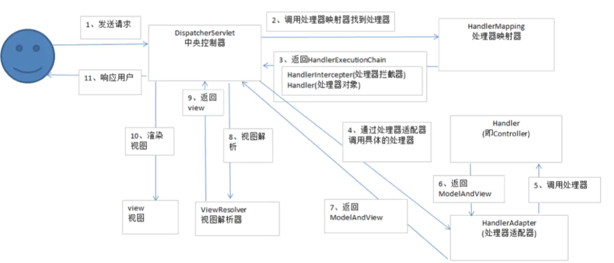

### 2、Spring MVC 组件说明


**DispatcherServlet (前端控制器)**：用户请求到达前端控制器，它就相当于mvc模式中的c，dispatcherServlet是整个流程控制的中心，由它调用其它组件处理用户的请求，dispatcherServlet的存在降低了组件之间的耦合性,系统扩展性提高。由框架实现

**HandlerMapping (处理器映射器)**：HandlerMapping 负责根据用户请求的 url 找到 Handler 即处理器，SpringMVC 提供了不同的映射器实现不同的映射方式，根据一定的规则去查找,例如：xml 配置方式，实现接口方式，注解方式等。由框架实现

 **Handler (处理器)**：Handler 是继 DispatcherServlet 前端控制器的后端控制器，在 DispatcherServlet 的控制下 Handler对具体的用户请求进行处理。由于 Handler 涉及到具体的用户业务请求，所以一般情况需要程序员根据业务需求开发 Handler

 **HandlAdapter (处理器适配器)**：通过 HandlerAdapter 对处理器进行执行，这是适配器模式的应用，通过扩展适配器可以对更多类型的处理器进行执行。由框架实现

 **ModelAndView** 是 SpringMVC 的封装对象，将 Model 和 View 封装在一起

 **ViewResolver (视图解析器)**：ViewResolver 负责将处理结果生成View视图，ViewResolver 首先根据逻辑视图名解析成物理视图名即具体的页面地址，再生成 View 视图对象，最后对 View 进行渲染将处理结果通过页面展示给用户

**View**：是 SpringMVC 的封装对象，是一个接口, SpringMVC 框架提供了很多的 View 视图类型，包括：jspview，pdfview, jstlView、freemarkerView、pdfView 等。一般情况下需要通过页面标签或页面模版技术将模型数据通过页面展示给用户，需要由程序员根据业务需求开发具体的页面


## 3、DispatchServlet 怎样分发任务的


# 5、SpringCloud Question


## 1、SpringCloud 基础问题项


### 1、谈谈你对分布式的理解？


### 2、你们的微服务是如何拆分的？


> **什么场景适合用微服务？**
>
> - 大型项目
> - 有快速迭代的要求
> - 访问过大的网站
>
> **什么场景不适合微服务呢？**
>
> - 业务稳定
> - 迭代周期长

> **微服务拆分的方法论**
>
> - 面向对象驱动设计、按照职责划分、比如订单模块、搜索模块
> - 按照通用性划分、比如用户中心、登录中心、消息中心、比如阿里流行的大中台和小中台，其中一个中台就是由若干个微服务组成的

**微服务设计的合理性概要**

1. 满足业务的后续的扩展和延展
2. 满足团队的成员的职业和技术的发展
3. 可稳定的迭代和更新你的业务
4. 可以持续的更新或者调整你的技术架构，以及完全的可靠和抽离

> 建议、在实际的开发和生产中，如果项目处于早期或者刚开始，通过分析以后的模块和业务并不复杂，其实不建议用微服务去架构，使用微服务一定要按照公司现有的资源，人员的实际情况出发。利用小步慢跑快速迭代去架构和演进项目才是王道


### 3、谈谈你常用的一些组件和作用把


### 4、服务限流组件有哪些？有什么区别？


## 2、SpringCloud 进阶问题项


### 1、服务限流的算法了解过吗？详细说说看


### 2、服务暴漏注册的原理是什么？


### 3、什么是一致性 Hash 算法?


### 4、如何实现分布式唯一 ID ？


### 5、RPC 的整个过程


## 3、分布式实战问题项


### 1、分布式事务回滚问题


>   你做过电商，那应该知道下单的时候需要减库存对吧，假设现在有两个服务 A 和 B，分别操作订单和库存表，A保存订单后，调用B减库存的时候失败了，这个时候A也要回滚，这个事务要怎么设计？


### 2、读写分离额问题


>   你说读的时候读从库，现在假设有一张表User做了读写分离，然后有个线程在**一个事务范围内**对User表先做了写的处理，然后又做了读的处理，这时候数据还没同步到从库，怎么保证读的时候能读到最新的数据呢？


# 6、MySql Question


## 1、MySQL 基础部分


### 1、唯一索引和普通索引有什么区别吗？


### 2、聚簇索引与非聚簇索引有何区别？


### 3、数据库的隔离界别有哪些？


### 4、MySQL 一张表最多可以建造多少个索引？


在 MySQL 中，一张表最多支持 **64 个索引**，包括主键索引和普通索引。这个数量对于绝大多数情况来说已经足够，但是过多的索引会对表的写操作造成性能问题，因此在创建索引时需要谨慎考虑]


### 5、Union 和 Union all 的区别有哪些？


在 MySQL 中，UNION 和 UNION ALL 都是用于将两个或多个 SELECT 语句的结果集合并成一个结果集的关键字。它们的区别在于：

- UNION 会自动去重，即结果集中不包含重复行，而 UNION ALL 返回所有行，包括重复行
- UNION ALL 的效率比 UNION 高，因为它不需要进行去重操作

## 2、MySQL 进阶和优化部分


### 1、介绍下一条 SQL 是如何执行的？


### 2、MySQL 索引结构了解吗？为何采用该结构？


### 3、MyISAM 存储引擎和 InnoDB 存储引擎有何区别？


### 4、批量往 MySql 数据库导入 1000 万条数据怎么做？


# 7、Redis Question


## 1、什么是 Redis


Redis 是 C 语言开发的一个开源的（遵从BSD协议）高性能键值对（key-value）的内存数据库，可以用作数据库、缓存、消息中间件等。它是一种 NoSQL（not-only sql，泛指非关系型数据库）的数据库


>   Redis作为一个内存数据库

1.  性能优秀，数据在内存中，读写速度非常快，支持并发10W QPS；
2.  单进程单线程，是线程安全的，采用IO多路复用机制；
3.  丰富的数据类型，支持字符串（strings）、散列（hashes）、列表（lists）、集合（sets）、有序集合（sorted sets）等；
4.  支持数据持久化。可以将内存中数据保存在磁盘中，重启时加载
5.  主从复制，哨兵，高可用
6.  可以用作分布式锁
7.  可以作为消息中间件使用，支持发布订阅


## 2、Redis 的五种数据结构


| 类型                   | 简介                                                    | 特性                                                         | 场景                                       |
| ---------------------- | ------------------------------------------------------- | ------------------------------------------------------------ | ------------------------------------------ |
| string（字符串）       | 二进制安全                                              | 可以包含任何数据，比如jpg图片或者序列化对象                  | ---                                        |
| Hash（字典）           | 键值对集合，即编程语言中的map类型                       | 适合存储对象，并且可以像数据库中的update一个属性一样只修改某一项属性值 | 存储、读取、修改用户属性                   |
| List（列表）           | 链表（双向链表）                                        | 增删快，提供了操作某一元素的api                              | 最新消息排行；消息队列                     |
| set（集合）            | hash表实现，元素不重复                                  | 添加、删除、查找的复杂度都是O(1)，提供了求交集、并集、差集的操作 | 共同好友；利用唯一性，统计访问网站的所有Ip |
| sorted set（有序集合） | 将set中的元素增加一个权重参数score，元素按score有序排列 | 数据插入集合时，已经进行了天然排序                           | 排行榜；带权重的消息队列                   |


## 3、Redis 的缓存淘汰策略


>   Redis 有六种淘汰策略

| 策略            | 描述                                                         |
| --------------- | ------------------------------------------------------------ |
| volatile-lru    | 从已设置过期时间的KV集中优先对最近最少使用(less recently used)的数据淘汰 |
| volitile-ttl    | 从已设置过期时间的KV集中优先对剩余时间短(time to live)的数据淘汰 |
| volitile-random | 从已设置过期时间的KV集中随机选择数据淘汰                     |
| allkeys-lru     | 从所有KV集中优先对最近最少使用(less recently used)的数据淘汰 |
| allKeys-random  | 从所有KV集中随机选择数据淘汰                                 |
| noeviction      | 不淘汰策略，若超过最大内存，返回错误信息                     |


## 4、你对 Redis 的持久化机制了解吗


>   Redis为了保证效率，数据缓存在了内存中，但是会周期性的把更新的数据写入磁盘或者把修改操作写入追加的记录文件中，以保证数据的持久化。Redis 的持久化策略有两种


### 1、RDB (快照形式) 默认


快照形式是直接把内存中的数据持久化到磁盘的一个二进制文件 dump.rdb，定时保存，保存策略


>   RDB 是如何工作的？

默认 Redis 是会以快照 "RDB" 的形式将数据持久化到磁盘的一个二进制文件 dump.rdb。

工作原理简单说一下：当 Redis 需要做持久化时，Redis 会 fork 一个子进程，子进程将数据写到磁盘上一个临时 RDB 文件中。当子进程完成写临时文件后，将原来的 RDB 替换掉，这样的好处是可以 copy-on-write

>   RDB 的优缺点是什么

**RDB 的优点是**：这种文件非常适合用于备份：比如，你可以在最近的 24 小时内，每小时备份一次，并且在每个月的每一天也备份一个 RDB 文件。这样的话，即使遇上问题，也可以随时将数据集还原到不同的版本。RDB 非常适合灾难恢复。

**RDB 的缺点是**：如果你需要尽量避免在服务器故障时丢失数据，那么 RDB 不合适你


### 2、AOF  类型


把所有的对 Redis 的服务器进行修改的命令都存到一个文件里，命令的集合。Redis 默认是快照 RDB 的持久化方式。 当 Redis 重启的时候，它会优先使用 AOF 文件来还原数据集，因为 AOF 文件保存的数据集通常比 RDB 文件所保存的数据集更完整。

>   AOF 的优缺点是什么

**AOF 的优点**：会让 Redis 变得非常耐久。可以设置不同的 fsync 策略，aof 的默认策略是每秒钟 fsync 一次，在这种配置下，就算发生故障停机，也最多丢失一秒钟的数据

**AOF 的缺点**：对于相同的数据集来说，AOF 的文件体积通常要大于 RDB 文件的体积。根据所使用的 fsync 策略，AOF的速度可能会慢于 RDB


### 3、两种持久化方式如何选择


如果你非常关心你的数据，但仍然可以承受数分钟内的数据丢失，那么可以额只使用RDB持久

AOF 将 Redis 执行的每一条命令追加到磁盘中，处理巨大的写入会降低 Redis 的性能，不知道你是否可以接受

数据库备份和灾难恢复：定时生成 RDB 快照非常便于进行数据库备份，并且 RDB 恢复数据集的速度也要比 AOF 恢复的速度快。当然了，Redis 支持同时开启 RDB 和 AOF ，系统重启后，Redis 会优先使用 AOF 来恢复数据，这样丢失的数据会最少


## 5、Redis 与 MySQL 如何保证双写一致性？


### 1、谈谈一致性


一致性就是数据保持一致，在分布式系统中，可以理解为多个节点中数据的值是一致的

-   **强一致性**：这种一致性级别是最符合用户直觉的，它要求系统写入什么，读出来的也会是什么，用户体验好，但实现起来往往对系统的性能影响大
-   **弱一致性**：这种一致性级别约束了系统在写入成功后，不承诺立即可以读到写入的值，也不承诺多久之后数据能够达到一致，但会尽可能地保证到某个时间级别（比如秒级别）后，数据能够达到一致状态
-   **最终一致性**：最终一致性是弱一致性的一个特例，系统会保证在一定时间内，能够达到一个数据一致的状态。这里之所以将最终一致性单独提出来，是因为它是弱一致性中非常推崇的一种一致性模型，也是业界在大型分布式系统的数据一致性上比较推崇的模型


### 2、三个经典的缓存模式


缓存可以提升性能、缓解数据库压力，但是使用缓存也会导致数据**不一致性**的问题。一般我们是如何使用缓存呢？有三种经典的缓存模式：

-   Cache-Aside Pattern
-   Read-Through/Write through
-   Write behind


#### 1、Cache-Aside Pattern (旁路缓存)


#### 2、Read-Through/Write-Through（读写穿透）


#### 3、Write behind (异步缓存写入)


## 6、Redis 一定是单线程的吗？


## 7、可以讲讲 Redis 分布式锁吗？


## 8、Redis 缓存穿透、缓存击穿、缓存雪崩？


## 9、Redis 主从备份、哨兵模式？


## 10、10万个 key 前缀相同，如何定义某一个 key 


## 11、跳跃表了解吗？可以谈谈


## 12、Redis Cluster 集群同步过程


## 13、多大叫大 Key、热 Key 产生原因和后果？如何解决


## 14、本地缓存需要高时效性怎么办？


## 15、Redis 为什么要用哨兵模式？怎么不用集群的方式部署呢


## 16、集群也是能保证高可用的，但它怎么保证主从一致性?


## 17、谈谈读写分离吧


# 8、RabbitMQ Question


## 1、RabbitMQ 基础问题


### 1、RabbitMQ 的工作流程是怎样的？架构方面


### 2、RabbitMQ 中有几种角色？


### 3、RabbitMQ 中常用的几种工作模式？


### 4、RabbitMQ 如何均衡消费者消费信息？


### 5、RabbitMQ 的使用场景有哪些？


## 2、RabbitMQ 分布式特性问题


### 1、什么是死信队列？


### 2、RabbitMQ 如何保证消息不丢失？


### 3、RabbitMQ 如何处理消息堆积？


### 4、RabbitMQ 如何避免重复消费（幂等性）


### 5、RabbitMQ 如何保证顺序性消费？


### 6、RabbitMQ 的分布式事务消息的可靠生产性问题


# 9、Mybatis Question


## 1、MyBatis 基础问题部分


### 1、MyBatis # 防止SQL 注入的原理


### 2、MyBatis 的执行器有哪些？


### 3、MyBatis 如何自己去实现一个分页插件 ？


### 4、MyBatis 的动态标签如何实现？


### 5、MyBatis 如何跟接口进行绑定的？


### 6、MyBatis 嵌套查询和嵌套结果有何区别？


### 7、MyBatis 有几种分页方式？


**逻辑分页：** 使用 mybatis 自带的 RowBounds 进行分页，它是一次性查询很多数据，然后在内存数据中再进行检索。

**物理分页：** 自己手写 sql 分页或使用分页插件 PageHelper，去数据库查询指定条数的分页数据的形式


### 8、RowBounds 是一次性查询全部结果吗？


RowBounds 表面是在“所有”数据中检索数据，其实并非是一次性查询出所有数据，因为 mybatis 是对 jdbc 的封装，在 jdbc 驱动中有一个 Fetch Size 的配置，它规定了每次最多从数据库查询多少条数据，假如你要查询更多数据，它会在你执行 next()的时候，去查询更多的数据。就好比你去自动取款机取 10000 元，但取款机每次最多能取 2500 元，所以你要取 4 次才能把钱取完。只是对于 jdbc 来说，当你调用 next()的时候会自动帮你完成查询工作。这样做的好处可以有效的防止内存溢出


## 2、MyBatis 进阶问题部分


# 10、Zookeeper Question


# 11、Nginx Question


## 1、Nginx 基础问题


### 1、什么是正向代理？什么是反向代理？两者有何区别？


### 2、你怎么理解负载均衡的？


### 3、Nginx 配置文件组成以及各部分的作用？


### 4、Nginx 的实现原理？


### 5、Nginx 如何配置合适的连接数？


### 6、Nginx 负载均衡算法有哪些？


# 12、Network Question


## 1、TCP 为什么是三次握手？而不是四次？


## 2、NIO、BIO 区别？NIO 解决了什么问题？


## 3、TCP 协议与 UDP 协议有什么区别 ?


TCP（Tranfer Control Protocol）的缩写，是一种面向连接的保证传输的协议，在传输数据流前，双方会先建立一条虚拟的通信道。可以很少差错传输数据

UDP (User DataGram Protocol) 的缩写，是一种无连接的协议，使用 UDP 传输数据时，每个数据段都是一个独立的信息，包括完整的源地址和目的地，在网络上以任何可能的 路径传到目的地，因此，能否到达目的地，以及到达目的地的时间和内容的完整性都不能保证

所以 TCP 必 UDP 多了建立连接的时间。相对 UDP 而言，TCP 具有更高的安全性和可靠性

TCP 协议传输的大小不限制，一旦连接被建立，双方可以按照一定的格式传输大量的数据，而UDP是一个不可靠的协议，大小有限制，每次不能超过64K


# 13、Data Structure Question


## 1、数据结构部分面试题


### 1、什么是 Hash Table ？


### 2、什么是 Hash 函数？


### 3、什么是 Hash 冲突？如何解决 Hash 冲突？


>   -   线性寻址 又名开放寻址
>   -   拉链法


### 4、算法有哪些常见的复杂度？


### 5、常见的数据结构有那些？都有什么特点？


### 6、你能谈谈树类结构之间的关系吗？都解决了什么问题？


### 7、谈谈你对 BitMap 的认识、底层实现？以及它的应用


### 8、二分搜索树面临什么问题？如何优化？AVL 和 红黑树


### 9、谈谈赫夫曼树和赫夫曼编码？


### 10、图论结构有哪些搜索方式？最短路径如何实现？


### 11、优先队列怎么实现？堆树了解过吗？


## 2、算法方面的面试题相关


### 1、你知道那些算法？有什么特征？


### 2、谈谈你知道的排序算法吧，各自有什么特点？


### 3、什么是稳定排序算法？和不稳定排序算法有什么区别？


### 4、什么是贪心算法？动态规划又是什么？


### 5、如何实现一个 LRU 算法？


# 14、Lee Question


## 1、准备看见音乐面试


### 1、千亿级数据层如何进行水平、垂直拆分？架构设计有哪些？


#### 1、垂直拆分示例图：


> 将业务进行划分、按照职责划分、比如 订单库、会员库、商品库等等

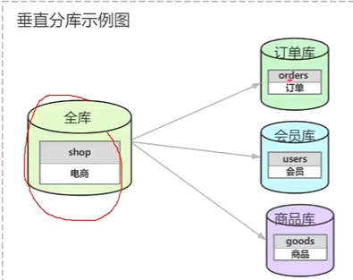


> 还可以针对表数据进行冷热数据拆分、比如用户名和密码这些经常访问的数据拆出来，把用户详情基本信息的拆到另一张表，实现冷热数据分离

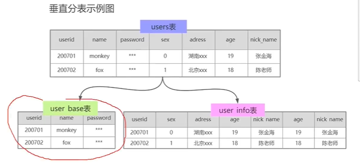

> 垂直拆分优点：
>
> - 拆分后业务清晰 (专库专用按业务拆分)
> - 实现动静分离、冷热数据分离设计体现
> - 数据维护简单，按业务不同放到不同的机器上
>
> 缺点：
>
> - 如果单库的数据量突然增大，写读压力大
> - 受业务来决定，或者被限制，也就是说一个业务往往会影响到数据库的瓶颈 (TPS)
> - 部分业务无法进行 Join 查询，只能通过 Java 程序接口去调用关联信息，提高了复杂度


#### 2、水平拆分示例图：


> 按照库的维度进行划分，将相同的表划分到不同的库中、比如会员1库、会员2库等等

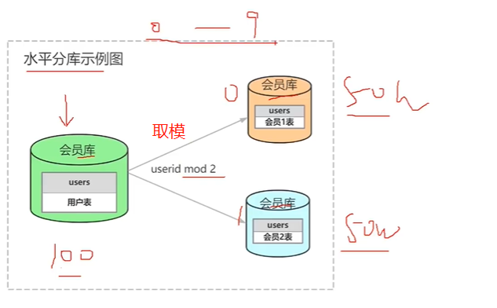

> 也可按照表的维度，划分到同一个库，比如 user1 表、 user2表等等

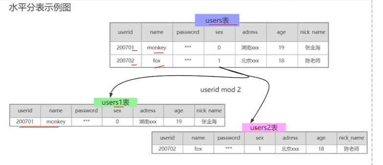

> 水平分表优点：
>
> - 单库单表的数据吧保持在了一定量级上，有助于提高性能
> - 提高了系统的稳定性和负载能力
> - 拆分的表结构相同，程序改造相对较少
>
> 水平拆分缺点：
>
> - 数据的扩容有难度维护量大
> - 拆分规则很难抽象出来
> - 分片事务的一致性问题、部分业务无法关联 Join、只能通过 java 程序合并


#### 3、如何选择分表键


分表键，即用来**分库/分表**的字段，换种说法就是，你以哪个维度来分库分表的。比如你**按用户ID分表、按时间分表、按地区分表**，这些**用户ID、时间、地区**就是分表键。

一般数据库表拆分的原则，需要先找到**业务的主题**。比如你的数据库表是一张企业客户信息表，就可以考虑用了**客户号**做为分表键


#### 4.非分表键如何查询


分库分表后，有时候无法避免一些业务场景，**需要通过非分表键来查询**。

假设一张用户表，根据`userId`做分表键，来分库分表。但是用户登录时，需要根据**用户手机号**来登陆。这时候，就需要通过手机号查询用户信息。而**手机号是非分表键**。

非分表键查询，一般有这几种方案：

- **遍历**：最粗暴的方法，就是遍历所有的表，找出符合条件的手机号记录（**不建议**）
- **将用户信息冗余同步到ES**，同步发送到ES，然后通过ES来查询（**推荐**）

其实还有**基因法**：比如非分表键可以解析出分表键出来，比如常见的，订单号生成时，可以包含客户号进去，通过订单号查询，就可以解析出客户号。但是这个场景除外，**手机号似乎不适合冗余userId**


#### 5、分表的策略如何选择


##### 1、按照 Range 范围


`range`，即范围策略划分表。比如我们可以将表的主键`order_id`，按照从`0~300万`的划分为一个表，`300万~600万`划分到另外一个表。如下图：

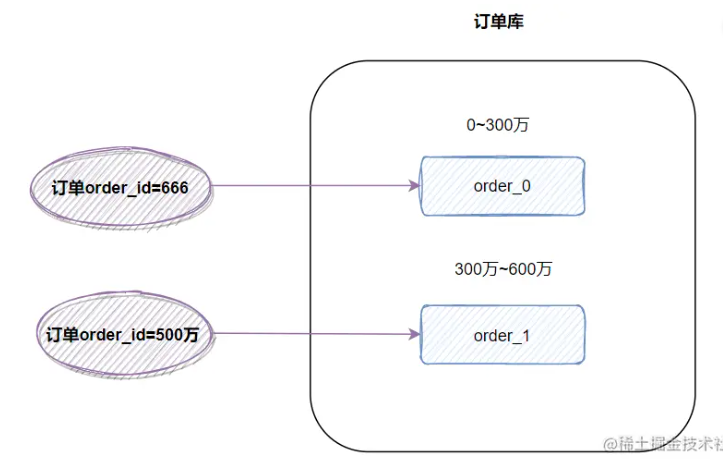

有时候我们也可以按时间范围来划分，如不同年月的订单放到不同的表，它也是一种`range`的划分策略。

- 优点： Range范围分表，有利于扩容。
- 缺点： 可能会有热点问题。因为`订单id`是一直在增大的，也就是说最近一段时间都是汇聚在一张表里面的。比如最近一个月的订单都在`300万~600万`之间，平时用户一般都查最近一个月的订单比较多，请求都打到`order_1`表啦


##### 2、按照 Hash 取模策略


**hash取模策略：**

> 指定的路由key（一般是`user_id、order_id、customer_no`作为key）对分表总数进行取模，把数据分散到各个表中。

比如原始订单表信息，我们把它分成4张分表：

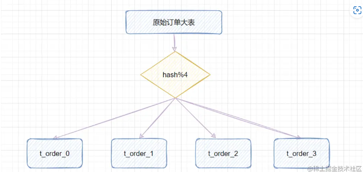

- 比如id=1，对4取模，就会得到1，就把它放到t_order_1;
- id=3，对4取模，就会得到3，就把它放到t_order_3;

一般，我们会取**哈希值，再做取余**：

```matlab
Math.abs(orderId.hashCode()) % table_number
复制代码
```

- 优点：hash取模的方式，**不会存在明显的热点问题**。
- 缺点：如果未来某个时候，表数据量又到瓶颈了，需要扩容，就比较麻烦。所以一般建议提前规划好，一次性分够。（可以考虑**一致性哈希**）


##### 3、一致性 Hash


如果**用hash方式**分表，前期规划不好，需要**扩容二次分表，表的数量需要增加，所以hash值需要重新计算**，这时候需要迁移数据了。

> 比如我们开始分了`10`张表，之后业务扩展需要，增加到`20`张表。那问题就来了，之前根据`orderId`取模`10`后的数据分散在了各个表中，现在需要重新对所有数据重新取模`20`来分配数据

为了解决这个**扩容迁移**问题，可以使用**一致性hash思想**来解决。

> **一致性哈希**：在移除或者添加一个服务器时，能够尽可能小地改变已存在的服务请求与处理请求服务器之间的映射关系。一致性哈希解决了简单哈希算法在分布式哈希表存在的**动态伸缩**等问题


#### 6、分库后，事务问题如何解决


分库分表后，假设两个表在不同的数据库，那么**本地事务已经无效**啦，需要使用**分布式事务**了。

常用的分布式事务解决方案有：

- 两阶段提交
- 三阶段提交
- TCC
- 本地消息表
- 最大努力通知
- saga


#### 7、跨节点 Join 关联问题


在单库未拆分表之前，我们如果要使用`join`关联多张表操作的话，简直`so easy`啦。但是分库分表之后，两张表可能都不在同一个数据库中了，那么如何跨库`join`操作呢？

跨库Join的几种解决思路：

- **字段冗余**：把需要关联的字段放入主表中，避免关联操作；比如订单表保存了卖家ID（`sellerId`），你把卖家名字`sellerName`也保存到订单表，这就不用去关联卖家表了。这是一种空间换时间的思想。
- **全局表**：比如系统中所有模块都可能会依赖到的一些基础表（即全局表），在每个数据库中均保存一份。
- **数据抽象同步**：比如A库中的a表和B库中的b表有关联，可以定时将指定的表做同步，将数据汇合聚集，生成新的表。一般可以借助`ETL`工具。
- **应用层代码组装**：分开多次查询，调用不同模块服务，获取到数据后，代码层进行字段计算拼装。


#### 8、order by,group by等聚合函数问题


跨节点的`count,order by,group by`以及聚合函数等问题，都是一类的问题，它们一般都需要基于全部数据集合进行计算。可以分别在各个节点上得到结果后，再在应用程序端进行合并


#### 9、分库分表后的分页问题


- 方案1（**全局视野法**）：在各个数据库节点查到对应结果后，在代码端汇聚再分页。这样优点是业务无损，精准返回所需数据；缺点则是会**返回过多数据，增大网络传输**，也会造成空查，

> 比如分库分表前，你是根据**创建时间排序**，然后**获取第2页数据**。如果你是分了**两个库**，那你就可以每个库都根据时间排序，然后都返回**2页**数据，然后把两个数据库查询回来的数据**汇总**，再根据创建时间进行**内存排序**，最后再取第**2**页的数据。

- 方案2（**业务折衷法-禁止跳页查询**）：这种方案需要业务妥协一下，只有上一页和下一页，不允许跳页查询了。

> 这种方案，查询第一页时，是跟全局视野法一样的。但是下一页时，需要把当前最大的创建时间传过来，然后每个节点，都查询大于创建时间的一页数据，接着汇总，内存排序返回。


#### 10、如何评估分库数量


对于MySQL来说的话，一般单库超过`5千万`记录，`DB`的压力就非常大了。所以分库数量多少，需要看单库处理记录能力有关。

如果分库数量少，达不到分散存储和减轻`DB`性能压力的目的；如果分库的数量多，对于跨多个库的访问，应用程序需要访问多个库。

一般是建议分`4~10`个库，我们公司的企业客户信息，就分了`10`个库。


#### 11、分库需要停服嘛？不停服怎么做？


不用停服。不停服的时候，应该怎么做呢，主要分五个步骤：

1. 编写代理层，加个开关（控制访问新的`DAO`还是老的`DAO`，或者是都访问），灰度期间，还是访问老的`DAO`。
2. 发版全量后，开启双写，既在旧表新增和修改，也在新表新增和修改。日志或者临时表记下新表ID起始值，旧表中小于这个值的数据就是存量数据，这批数据就是要迁移的。
3. 通过脚本把旧表的存量数据写入新表。
4. 停读旧表改读新表，此时新表已经承载了所有读写业务，但是这时候不要立刻停写旧表，需要保持双写一段时间。
5. 当读写新表一段时间之后，如果没有业务问题，就可以停写旧表啦


### 2、将现有业务服务如何进行一个微服务化拆分？需要考虑哪些因素？


### 3、第三方渠道接口对接方案设计、以及高容错性


### 4、RabbitMQ 、Kafka 等中间件的原理及优化思路


# 15. 线上疑难杂症排查指南


## 1. JVM 常见线上问题诊断

------


### 1. 线上问题排查思路


1. 定位问题、通过前端调用接口，控制台接口响应情况
2. 根据接口报错情况定位出大致范围、根据错误码判断出大致是哪里出了问题
3. 登录服务器查看相关日志、看看日志输出定位问题所在、如果用了云服务器可以登录云服务器查看日志
4. 一般出现问题大概有两个原因，一个是物理原因（比如内存、CPU使用情况、是否有溢出等等）、一个是逻辑原因，就是程序代码原因，根据日志排查和一步一步缩小问题范围、直到最终定位到问题嘛，然后根据问题原因制定修复方案
5. 最后进行错误归档、总结错误经验避免下次发生


### 2. 线上基本排查命令


#### 2.1 基本情况排查


1. netstat nlp 查看所有的服务端口、排查这个端口存不存在
2. 用 top 指令查看cpu、内存消耗、资源使用情况等等
3. 逻辑Bug紧急情况可以让运维帮忙开个端口，然后本地远程debug线上代码等等


#### 2.2 JVM自带的命令诊断


1. jmap 命令用来查看内存信息、实例个数以及占用内存大小。堆内存信息、年轻代、老年代使用情况，以及导出 dump 堆内存快照文件
2. Jstack 查找死锁问题
3. Jinfo -flags 查看正在运行的 Java 应用程序的扩展参数、查看 JVM 的参数
4. jstat 查看垃圾回收统计命令


#### 2.3 arthas 诊断工具篇


1. ognl 命令查看系统变量的值、甚至可以修改变量的值
2. thread 命令查看线程的情况、线程的堆栈、是否有死锁等等
3. dashboard 命令可以查看系统整体性能的一个监控台信息
4. jad 命令可以直接反编译 .class 文件进行快速的排除代码错误


### 3. 线上 CPU 飙高排查


>   使用 top 命令查看 cpu 使用情况排行榜

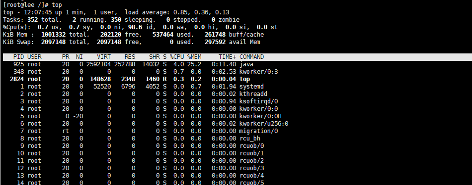

>   使用 top -p <pid> 显示 java 进程的内存使用情况、pid 是你的 java 进程号

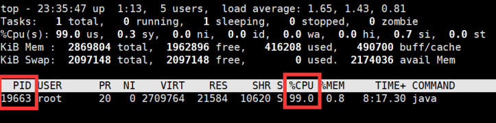

>   按 H (大写) 获取该进程的每个线程的内存和CPU使用情况

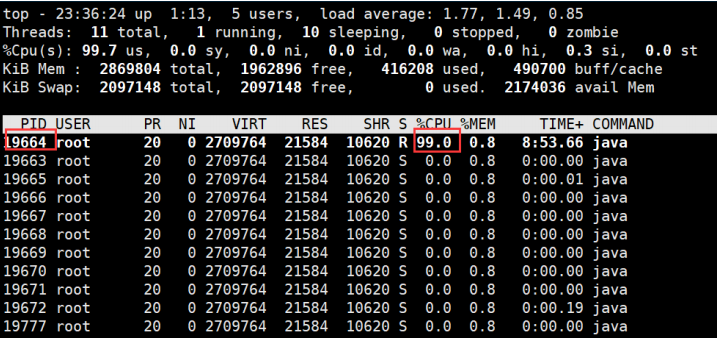

>   找到最大使用 CPU 最高的线程 pid,  比如 19664 . 并将转换为十六进制得到 0x4cd0、此为线程的十六进制表示

>   执行 jstack 19663 | grep -A 10 4cd0 得到线程堆栈信息中 4cd0 这个线程所在行的后面 10 行，从堆栈中可以发现导致 CPU 飙到高的调用方法. 查看对应的堆栈信息找出可能存在问题的代码


### 4. 线上 OOM 内存溢出、泄漏排查


**如果遇到内存溢出 OOM 了、一般有两种情况**

> 第一种：给JVM虚拟机分配的内存太小，实际业务呢对内存消耗过多

比如堆溢出、分析业务后大概会生成多少对象，重新调整堆的大小，通过一下命令来调正

```java
-Xms,-Xmx
```

还有栈溢出、比如没有设置返回出口的递归，以及出现了大量Class类元信息的对象出现在了栈中，比如大量采用了反射或者cglib这种方案，这种方案会产生大量的 Class 信息存储在方法区中。通过一下命令调整方法区大小

```java
-XX:PermSize=64m -XX:MaxPermSize=256m
```


> 第二种：Java应用里存在内存泄漏问题，大量占用内存的对象没有办法及时释放

这种方案就是先获取内存的 Dump 文件，拿到 dump 文件后可以使用 Jvisualvm 工具进行分析、找出占用内存最大的对象以及GCRoot引用链就可以比较准确的定位到泄漏代码的位置

- 通过配置JVM启动参数，当触发了OOM异常的时候自动生成
- 可以通过Jmap命令来生成内存快照文件


### 6. Tomcat 假死案例分析


### 7. Redis内存告警、慢命令、连接数过多


## 2. MySQL  常见线上问题诊断

------


### 2.1 MySql 常用诊断命令


#### 2.1.1 Show Status


> 该命令会显示每个服务器的名字和值，5.0之前版本只有全局变量、5.1 之哦胡的版本中鱼龙混杂，包含了全局以及会话变量。其中有些有双重域：即是全局，也是会话级别。可进一步使用 `Show Global Status` 来查看全局变量。

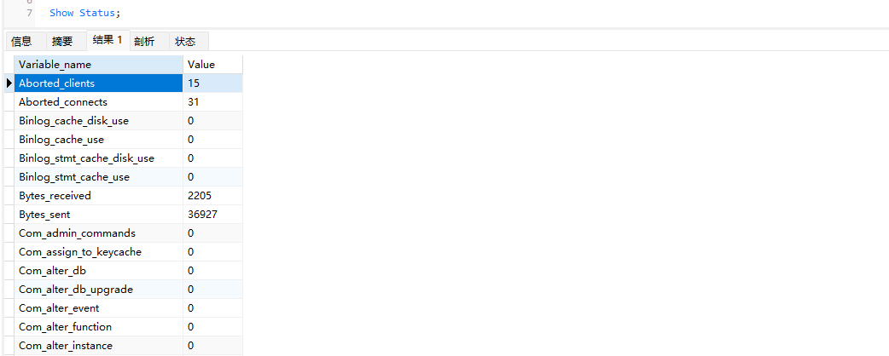


可使用 Like 以及配合通配符来查找

```sql
SHOW STATUS;  -- 查看所有变量 (全局、会话)
SHOW GLOBAL STATUS;  -- 查看全局变量
SHOW VARIABLES LIKE 'max_connections';  -- 查看最大连接数
SHOW VARIABLES LIKE "%version%";  -- 查看 MySQL 版本与编译信息
```


#### 2.1.2 Show Variables


> 查看系统配置参数值、配置系统 `my.cnf + 启动时参数`，想对 `Show Status` 来讲值是静态的。

```sql
-- 查看 innodb 的相关配置
SHOW VARIABLES LIKE '%innodb%';
-- 查看最大连接数、最大 binlog 配置大小、最长执行时间 配置等等
SHOW VARIABLES LIKE 'max%';
```


#### 2.1.3 Show Processlist


> 进程列表是当前连接到 MySQL 的连接或线程的清单，并列出了这些线程的状态信息。显示当前`连接的线程`，包括SQL`执行状态`。可用于查看是否有`慢查询`、`锁等待`。

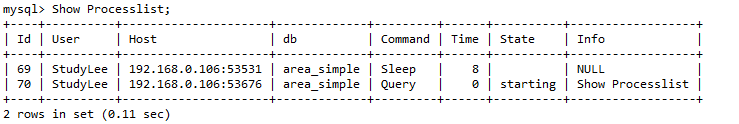


```sql
-- 区别是 FULL 会在 Info 段显示完整的SQL语句，可用于排查慢查询。否则最多显示 100 个字符。
Show Full Processlist
```


#### 2.1.4 Show Engine Innodb Status


> **重磅命令**！查看 InnoDB 引擎的详细内部状态，如：
>
> - `Semaphores 信号量`：高并发下的工作负载参数，包含事件计数器、可选的当前等待线程列表
> - `Latest Foreign Key Error`：一般不会出现、除非服务器上有外键错误
> - `Latest Detected Deadlock`：最近检测到的死锁、只有服务器内有死锁时才会出现
> - `Transactions`：关于事务的总结信息，以及当前活跃的事务。
> - `FILE I/O`：显示的是 I/O 辅助线程的状态，还有性能计数器的状态
> - `Insert Buffer And Adaptive Hash Index`：显示了 Innodb 内部缓存的状态，例如 free list 的长度和段大小。还显示了有多少缓冲操作已经完成。
> - `LOG`：显示了 InnoDB 事务日志 (重做日志) 的统计。
> - `Buffer Pool And Memory` ：关于 InnoDB 缓冲池及如何使用内存的统计。如缓冲池大小、空闲页数、以及脏页数量
> - `Row Operations`：其他各项的统计、如内核有多少线程、有多少 InnoDB 打开的读视图等等。

```lisp

=====================================
2025-04-14 17:03:06 0x7fe54c094700 INNODB MONITOR OUTPUT
=====================================
Per second averages calculated from the last 9 seconds
-----------------
BACKGROUND THREAD
-----------------
srv_master_thread loops: 697 srv_active, 0 srv_shutdown, 9467 srv_idle
srv_master_thread log flush and writes: 10164
----------
SEMAPHORES
----------
OS WAIT ARRAY INFO: reservation count 225
OS WAIT ARRAY INFO: signal count 220
RW-shared spins 0, rounds 443, OS waits 218
RW-excl spins 0, rounds 0, OS waits 0
RW-sx spins 0, rounds 0, OS waits 0
Spin rounds per wait: 443.00 RW-shared, 0.00 RW-excl, 0.00 RW-sx
------------
TRANSACTIONS
------------
Trx id counter 70389
Purge done for trx's n:o < 70389 undo n:o < 0 state: running but idle
History list length 0
LIST OF TRANSACTIONS FOR EACH SESSION:
---TRANSACTION 422098110934640, not started
0 lock struct(s), heap size 1136, 0 row lock(s)
---TRANSACTION 422098110933728, not started
0 lock struct(s), heap size 1136, 0 row lock(s)
---TRANSACTION 422098110936464, not started
0 lock struct(s), heap size 1136, 0 row lock(s)
---TRANSACTION 422098110932816, not started
0 lock struct(s), heap size 1136, 0 row lock(s)
--------
FILE I/O
--------
I/O thread 0 state: waiting for completed aio requests (insert buffer thread)
I/O thread 1 state: waiting for completed aio requests (log thread)
I/O thread 2 state: waiting for completed aio requests (read thread)
I/O thread 3 state: waiting for completed aio requests (read thread)
I/O thread 4 state: waiting for completed aio requests (read thread)
I/O thread 5 state: waiting for completed aio requests (read thread)
I/O thread 6 state: waiting for completed aio requests (write thread)
I/O thread 7 state: waiting for completed aio requests (write thread)
I/O thread 8 state: waiting for completed aio requests (write thread)
I/O thread 9 state: waiting for completed aio requests (write thread)
Pending normal aio reads: [0, 0, 0, 0] , aio writes: [0, 0, 0, 0] ,
 ibuf aio reads:, log i/o's:, sync i/o's:
Pending flushes (fsync) log: 0; buffer pool: 0
543 OS file reads, 10009 OS file writes, 3366 OS fsyncs
0.00 reads/s, 0 avg bytes/read, 0.00 writes/s, 0.00 fsyncs/s
-------------------------------------
INSERT BUFFER AND ADAPTIVE HASH INDEX
-------------------------------------
Ibuf: size 1, free list len 0, seg size 2, 0 merges
merged operations:
 insert 0, delete mark 0, delete 0
discarded operations:
 insert 0, delete mark 0, delete 0
Hash table size 34679, node heap has 68 buffer(s)
Hash table size 34679, node heap has 0 buffer(s)
Hash table size 34679, node heap has 0 buffer(s)
Hash table size 34679, node heap has 0 buffer(s)
Hash table size 34679, node heap has 1 buffer(s)
Hash table size 34679, node heap has 1 buffer(s)
Hash table size 34679, node heap has 1 buffer(s)
Hash table size 34679, node heap has 0 buffer(s)
0.00 hash searches/s, 0.00 non-hash searches/s
---
LOG
---
Log sequence number 86939474
Log flushed up to   86939474
Pages flushed up to 86939474
Last checkpoint at  86939465
0 pending log flushes, 0 pending chkp writes
1771 log i/o's done, 0.00 log i/o's/second
----------------------
BUFFER POOL AND MEMORY
----------------------
Total large memory allocated 137428992
Dictionary memory allocated 524913
Buffer pool size   8192
Free buffers       3021
Database pages     5100
Old database pages 1862
Modified db pages  0
Pending reads      0
Pending writes: LRU 0, flush list 0, single page 0
Pages made young 0, not young 0
0.00 youngs/s, 0.00 non-youngs/s
Pages read 476, created 4624, written 7316
0.00 reads/s, 0.00 creates/s, 0.00 writes/s
No buffer pool page gets since the last printout
Pages read ahead 0.00/s, evicted without access 0.00/s, Random read ahead 0.00/s
LRU len: 5100, unzip_LRU len: 0
I/O sum[0]:cur[0], unzip sum[0]:cur[0]
--------------
ROW OPERATIONS
--------------
0 queries inside InnoDB, 0 queries in queue
0 read views open inside InnoDB
Process ID=7055, Main thread ID=140622834296576, state: sleeping
Number of rows inserted 711673, updated 0, deleted 0, read 35636550
0.00 inserts/s, 0.00 updates/s, 0.00 deletes/s, 0.00 reads/s
----------------------------
END OF INNODB MONITOR OUTPUT
============================
```


#### 2.1.5 监控指标建议关注


- QPS/TPS
- 当前连接数、活动连接数
- 查询响应时间
- 慢查询数
- InnoDB 缓冲池命中率
- 临时表创建（`Created_tmp_tables`）
- 索引命中率（`Handler_read_rnd_next` vs `Handler_read_key`）
- 锁等待
- 表碎片

- **设置慢查询日志并结合 `pt-query-digest` 或 PMM 分析**
- **定期清理不必要的索引、重建表结构**

> 常见 MySQL 监控平台工具

| 工具                                        | 简介                                                         |
| ------------------------------------------- | ------------------------------------------------------------ |
| **Prometheus + Grafana**                    | 主流开源监控方案，结合 MySQL Exporter 可以收集连接数、慢查询、TPS、QPS、Innodb 缓冲池等 |
| **Zabbix**                                  | 企业级监控系统，支持 MySQL 的自定义监控项                    |
| **Percona Monitoring and Management (PMM)** | 专为 MySQL/MariaDB 打造的完整监控平台，包含 Query Analytics、Metrics、Alert 等模块 |
| **Elastic + Metricbeat**                    | 支持 MySQL 模块的数据采集，可视化日志与性能                  |

```sql
-- 示例：Prometheus + Grafana 架构图（概念）
[ MySQL ] → [ mysqld_exporter ] → [ Prometheus ] → [ Grafana ] → 报表 / 图形 / 告警
```


### 2.2 MySQL 核心系统库与视图库


#### 2.2.1 `mysql`核心数据库 (最重要)


> MySQL 系统核心配置库，**管理用户权限、时区、插件、字符集、系统变量等配置**。
>
> **注意**：不要手动修改这些表，推荐使用 `GRANT/REVOKE`、`CREATE USER` 等语句。

✅ 重要表及说明：

| 表名                 | 作用说明                                  |
| -------------------- | ----------------------------------------- |
| `user`               | 存储用户账户、密码、权限信息（如`root`）  |
| `db`                 | 记录用户对某数据库的访问权限              |
| `tables_priv`        | 表级别的权限控制                          |
| `columns_priv`       | 列级别的权限控制                          |
| `procs_priv`         | 存储过程/函数的权限                       |
| `time_zone` 及相关表 | 管理时区信息                              |
| `plugin`             | 存储已安装插件                            |
| `servers`            | 复制和 federated 引擎所用的远程服务器配置 |
| `help_*`             | MySQL 自带的帮助系统表                    |
| `global_grants`      | MySQL 8 中新加入的全局权限表              |


#### 2.2.2 `information_schema` 只读元数据视图


> 是一个**只读的虚拟数据库**，提供**当前数据库服务器的结构信息**，如库、表、列、约束、索引等。
>
> 可用于**生成数据字典、自动化工具、元数据分析等**

✅ 常用的表（视图）：

| 表名                      | 作用说明             |
| ------------------------- | -------------------- |
| `SCHEMATA`                | 所有数据库（库）信息 |
| `TABLES`                  | 所有表信息           |
| `COLUMNS`                 | 所有列信息           |
| `STATISTICS`              | 索引信息             |
| `KEY_COLUMN_USAGE`        | 主外键关联           |
| `REFERENTIAL_CONSTRAINTS` | 外键约束             |
| `USER_PRIVILEGES`         | 用户权限信息         |
| `VIEWS`                   | 视图信息             |


#### 2.2.3 `performance_schema` 性能分析库


> 用于**监控数据库运行时性能指标、资源使用情况、SQL 执行状况、等待事件**等。是**MySQL 的性能分析核心组件**，数据来自内存，开销极低。`8.0 非常重要`

✅ 常用表：

| 表名                  | 作用说明                         |
| --------------------- | -------------------------------- |
| `events_statements_*` | SQL 执行信息（如耗时、执行次数） |
| `events_waits_*`      | 等待事件，如锁等待、磁盘 I/O 等  |
| `threads`             | 当前线程（连接）信息             |
| `users`、`accounts`   | 用户级性能统计                   |
| `file_instances`      | 文件 I/O 使用情况                |
| `memory_summary_*`    | 内存使用信息（函数、线程等维度） |


#### 2.2.4 `sys` 性能辅助视图库（MySQL 5.7+）


> 对 `performance_schema` 和 `information_schema` 做了**人性化封装**，提供 **简洁易读的视图**，用于性能分析和日常监控
>
> 对 DBA 非常友好，建议结合 `performance_schema` 一起开启和使用

✅ 常用视图：

| 视图名                             | 说明                             |
| ---------------------------------- | -------------------------------- |
| `sys.user_summary`                 | 每个用户的连接、慢查询、出错数等 |
| `sys.host_summary`                 | 每个主机的连接情况               |
| `sys.statement_analysis`           | SQL 执行次数、平均耗时           |
| `sys.innodb_buffer_stats_by_table` | 每张表在 buffer pool 中的命中率  |
| `sys.file_summary_by_instance`     | 文件 I/O 情况                    |
| `sys.schema_table_lock_waits`      | 哪些表有锁等待                   |


#### 2.2.5 `ndbinfo`（仅 NDB Cluster 安装时出现）


> 如果你安装了 **MySQL Cluster（NDB 引擎）**，该库会出现，用于查看集群节点状态、网络连接、内存占用等


**总结对比：**

| 系统库名             | 是否真实存在 | 用途说明             |
| -------------------- | ------------ | -------------------- |
| `mysql`              | ✅ 是         | 核心配置、用户权限等 |
| `information_schema` | ❌ 虚拟库     | 系统结构元信息       |
| `performance_schema` | ✅ 是         | 性能统计和监控       |
| `sys`                | ❌ 虚拟视图库 | 人性化的性能统计封装 |
| `ndbinfo`            | ✅ 是（可选） | NDB 集群专用信息库   |


### 2.3 MySQL 常见分析用例


#### 2.3.1 查看连接数、活动连接数、有无阻塞


```sql
SHOW STATUS LIKE 'Threads%';
```

- `Threads_connected`：当前已连接客户端数量
- `Threads_running`：正在执行的活动线程数
- `Threads_created`：MySQL 运行以来创建的总线程数

> 如果 `Threads_running` 持续很高，则可能有慢查询或阻塞。

结合 `SHOW FULL PROCESSLIST` 查看当前连接以及SQL状态、可识别阻塞、长时间运行、Waiting 等线程


#### 2.3.2 查看锁等待、死锁


```sql
-- 当前锁等待线程
SELECT * FROM information_schema.innodb_lock_waits;
-- 被锁的事务
SELECT * FROM information_schema.innodb_locks;
-- 锁等待线程的事务信息
SELECT * FROM information_schema.innodb_trx;
-- 查看最近一次死锁信息
SHOW ENGINE INNODB STATUS\G
```


#### 2.3.3 查看当前事务信息


```sql
-- 查看当前事务信息
SELECT * FROM information_schema.innodb_trx\G
```

- `trx_started`：事务开始时间
- `trx_state`：事务状态，如 RUNNING、LOCK WAIT 等
- `trx_mysql_thread_id` 可关联到 `SHOW PROCESSLIST` 的 `Id`


#### 2.3.4 排查磁盘 I/O ，是否存在慢 I/O


```sql
SHOW ENGINE INNODB STATUS\G
```

- 查看 `I/O thread`、`Pending reads/writes` 相关字段
- 如果 `Pending` 较高、`I/O latency` 增长，说明磁盘 I/O 紧张

✅ **可配合 performance_schema：**

```sql
SELECT * FROM performance_schema.file_summary_by_instance
ORDER BY COUNT_READ DESC LIMIT 10;
```

- 查看哪个表文件 I/O 最频繁
- 可识别慢盘访问或频繁的临时表写入

也可通过 Linux 命令来查看磁盘使用情况、详见 “[3、磁盘 IO 常见问题诊断篇]()”


#### 2.3.5 索引执行次数与命中率


> 索引执行次数


> InnoDB Buffer Pool 中的索引命中率查询

```sql
SHOW GLOBAL STATUS LIKE 'Innodb_buffer_pool_read%';
```

- `Innodb_buffer_pool_read_requests`：逻辑读（内存命中）
- `Innodb_buffer_pool_reads`：磁盘读（未命中）


#### 2.3.6 查看当前正在执行的事务或 SQL


```sql
SHOW FULL PROCESSLIST;
```

```sql
SELECT * FROM performance_schema.events_statements_current
WHERE SQL_TEXT IS NOT NULL;
```

> 可查看具体 SQL 内容、执行时间、数据库、状态等。


#### 2.3.7 查询响应时间分析


```sql
SELECT *
FROM performance_schema.events_statements_summary_by_digest
ORDER BY AVG_TIMER_WAIT DESC
LIMIT 10;
```

- 查看哪些 SQL 响应最慢（可聚合分析）
- 可开启 `performance_schema` 的 statement 采样功能


#### 2.3.8 排查慢查询情况


```sql
SHOW VARIABLES LIKE 'slow_query_log%';
SHOW GLOBAL STATUS LIKE 'Slow_queries';
```

- 确保 `slow_query_log = ON` 处于开启状态
- 慢查询日志路径：`slow_query_log_file`

Linux 中手动查看慢查询日志 (路径视配置而定)

```lisp
tail -n 50 /var/lib/mysql/yourhost-slow.log
```


#### 2.3.9 排查临时表与文件排序情况


```sql
SHOW GLOBAL STATUS LIKE 'Created_tmp%';
```

- `Created_tmp_tables`：总共创建的临时表数
- `Created_tmp_disk_tables`：磁盘临时表数（可能是大字段 or 无索引排序）
- `Created_tmp_files`：创建的临时文件

```sql
SHOW GLOBAL STATUS LIKE 'Sort_merge_passes';
```

- 若 `Sort_merge_passes` 值较大，说明排序缓冲不足，可调大 `sort_buffer_size`


#### 2.3.10 查看存在碎片的表


```sql
SELECT 
  TABLE_SCHEMA, TABLE_NAME, ENGINE, 
  DATA_LENGTH, INDEX_LENGTH, DATA_FREE,
  ROUND(DATA_FREE / (DATA_LENGTH + INDEX_LENGTH), 2) AS Fragment_Ratio
FROM information_schema.TABLES
WHERE DATA_FREE > 0
ORDER BY DATA_FREE DESC;
```

- `DATA_FREE`：表示表的“空洞”空间大小，代表是否存在碎片
- InnoDB 表常因大量 DELETE/UPDATE 后形成碎片，可考虑 `OPTIMIZE TABLE`


### 2.4 MySQL 查询慢，除了索引原因还有什么


#### 2.4.1 SQL 低端错误问题


- **子查询过多或嵌套复杂**：如使用非相关子查询或多层嵌套语句会影响性能
- **复杂JOIN 或者不合理**：比如无 ON 条件、或者 Where 条件 导致全连接(笛卡儿积：**没有有效的连接条件**，每一行都与另一张表的所有行做匹配，**产生的数据行数 = 表1行数 × 表2行数**)
- **SQL查询返回结果集过大，或没有 where 条件**、导致过多的IO、内存以及网络传输负担
- **表数据集大**：并且分页过深导致性能下降 （Limit 50000, 20。分页的时候 MySql 会查询50020 数据，然后丢弃前 5 万数据，造成严重性能浪费）


#### 2.4.2 表结构设计问题


- **表中的大字段过多（如 TEXT/BLOB）**
- **单表字段过千、行缓存（Row Buffer）转换代价高**：

> 首选介绍 MySQL 的执行分为两个主要层次：
>
> 1. **服务器层（Server Layer）**
>    - 负责权限校验、查询缓存、分析器、优化器、执行器的结果返回等
>    - 操作的是 **通用的 Row 格式**，不依赖于存储引擎
> 2. **存储引擎层（Storage Engine Layer）**
>    - 比如 InnoDB、MyISAM 等，负责 **数据的存储、读取和写入**
>    - 每种引擎有自己特定的行格式和存储方式
>
> **什么是行缓存（Row Buffer）:** 指 MySQL 在 **服务器层（Server Layer）与存储引擎（Engine Layer）之间传递数据时使用的一种中间格式**。
>
> **为什么需要（Row Buffer）**：存储引擎是 “**二进制的原始行格式**”（类似压缩文件），而服务器层期望的是 “**解压后、结构化的数据**”（比如 JSON 或对象）。所以中间要有一个“翻译器”，就是**Row Buffer**
>
> 当执行 SQL 查询时，存储引擎会先数据从 **磁盘或缓冲池** 中读取，填充到自己的 **行缓存（row buffer）**中、然后服务器层再将这些数据解析、解码成对应的列。这就导致 存储引擎 需要**在服务器层和存储引擎之间通过 row buffer 拷贝数据，然后在服务器层将缓存内容解码成各个列，但是转换过程中的操作代价是非常高的**。MyISAM 的定长行结构实际上与服务器层的行结构正好匹配，所以不需要转换。但是，MyISAM 的**变长行结构**与 InnoDB 的行结构总是需要转换
>
> 但：InnoDB 的存储格式与服务器层所用的行格式**不一致**，所以必须进行逐字段的 **转换和拷贝**
>
> **如果你有几百、上千列，哪怕只查询1列、系统也可能会为这整行构建 Row Buffer**，每个字段都要单独解析、解码、类型转换（特别是变长字段 `VARCHAR`、`TEXT`、`BLOB`）导致：
>
> - CPU 飙升
> - 内存使用增加
> - 查询延迟上升
>
>  **InnoDB 的特点加剧问题**
>
> - **行格式复杂**：InnoDB 支持事务、MVCC，需要更多元信息，比如隐藏列、事务信息、指针等
> - **支持变长字段存储在溢出页**：导致从多个页读取数据，效率更低
> - **存在页结构开销**：每个页内管理信息也多，影响批量读取效率


#### 2.4.3 MySQL 系统资源与配置瓶颈


##### 1. 最大连接数问题


> 如果最大连接数过小，那么在执行SQL查询时可能需要排队阻塞中，影响 SQL 执行时间

1：MySQL 服务端的连接配置：**最大连接数默认为 100**，最大可以16384。可以通过以下参数更改MySQL的最大连接数：

```sql
mysql> set global max_connections=500;
```

2：**检查应用端 (例如 Java 应用) 配置的连接池大小** 是否与MySQL服务端配置的一致。


**最大连接数合理设置建议：**

```xml-dtd
max_connections <= 总内存 / 单连接内存占用
```

假设：

- 单连接内存开销约 1MB（比较保守）
- 分配给 MySQL 的内存：16GB
- 那么理论最大值 **(16GB * 1204) / 1M = 16384** 个连接数

⚠️ 实际业务中建议保守一点，**建议设置为 500~1000 以内**，除非你做了连接池限流或线程池优化

> 如果最大连接数设置过大，那么也是有明显副作用的

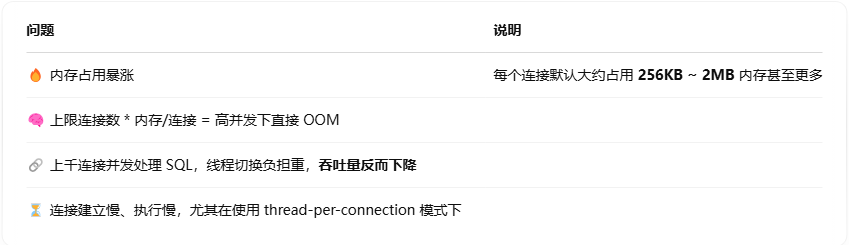


##### 2. Innodb 缓冲池 (Buffer Pool) 问题


**Buffer Pool** ：是 InnoDB 的一个内存区域，因直接读取磁盘比较慢、所以 InnoDB 加了 Buffer Pool。用来缓存从磁盘中读取的 **数据页 (Data Pages)、索引页 (Index Pages)**，也会缓存 undo 页、**Change Buffer (曾用名 Insert Buffer)**、**自适应哈希索引 (Adaptive Hash Index)**，锁，以及其它内存数据结构

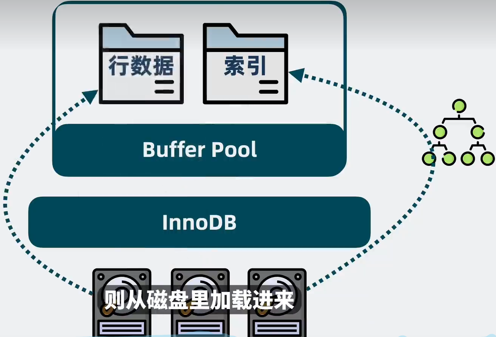

**Buffer Pool 的工作流程**：

> 当执行一条SQL查询时
>
> - InnoDB 会根据优化器计算得到的索引，去查询 Buffer Pool 中相应的索引页，若索引页不在 Buffer Pool 中，那么则从磁盘中加载到索引页里
> - 再根据索引页查询得到数据页的位置，如果数据页也不在 Buffer Pool中，在从磁盘中加载到数据页中，最终返回数据


> **若 Buffer Pool 空间太小**：导致内存中缓存的索引页过少，会导致缓存命中率太少。如果增加 Buffer Pool 大小，则能通过以下命令更改

```sql
mysql> set global innodb_buffer_pool_size=536870912;
```

**通过以下命令了解 Buffer Pool 的大小以及命令率**

```sql
mysql> show status like 'Innodb_buffer_pool_%'
```

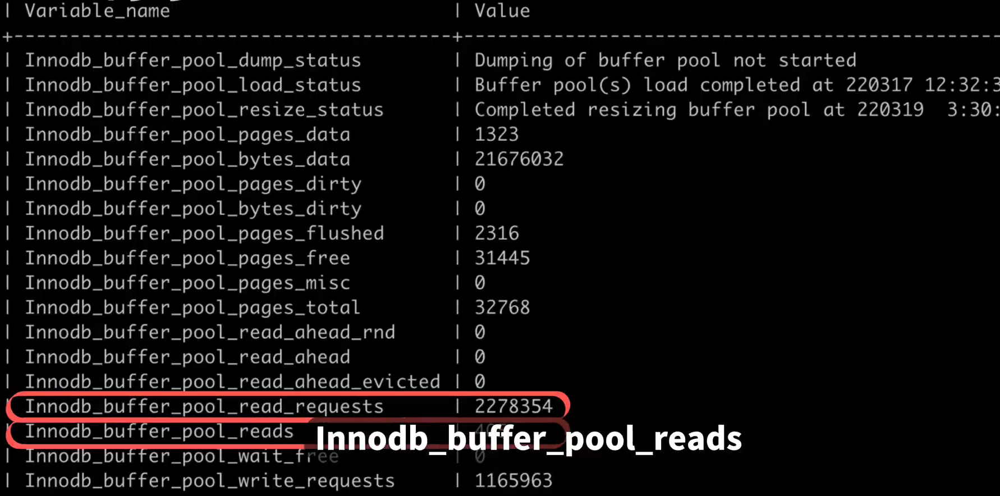

- **Innodb_buffer_pool_read_requests**：表示读请求的次数
- **Innodb_buffer_pool_reads**：表示从物理磁盘中读数据的次数

继而通过 

```ceylon
buffer_pool_reads    = 12345 （物理磁盘读取）
buffer_pool_read_requests = 987654 （逻辑读）
命中率 = (987654 - 12345) / 987654 ≈ 98.75%
```

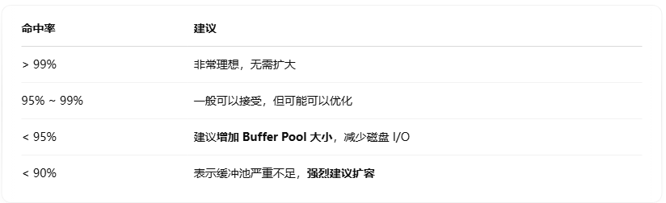

**Buffer Pool 建议值设置多少合适？** 经验值：

- **OLTP 系统**：`innodb_buffer_pool_size` 建议设置为 **物理内存的 60%~80%**
- **只跑 MySQL 的服务器**：可大胆设置到物理内存的 80%
- **多实例/多服务并存**：根据内存压力酌情分配

**Buffer Pool 默认大小**：64 位系统（MySQL 5.7+）**128MB**（安装后默认）。**生产环境建议手动配置该值，默认值几乎不够用**


> **若 Buffer Pool 空间太大**：
>
> - **Buffer Pool 的预热和关闭**都会花费很长的时间。比如有很多脏页在缓冲池中，InnoDB 需要关闭之前将脏页写回到磁盘文件。
> - **当超出物理内存时**，操作系统会开始使用 swap（虚拟内存），导致严重的性能下降
> - 大缓冲池意味着可以缓存更多脏页（dirty pages）, 脏页太多会增加 **刷盘（flush）时的 I/O 冲击**，尤其在崩溃恢复或关闭时


**了解项： Buffer Pool 的内部组成**

> Buffer Pool 里有三个链表，**LRU 链表，free 链表，flush 链表**，InnoDB 正是通过这三个链表的使用来控制数据页的更新与淘汰的**
>
> - **LRU 链表**：**将热数据放在链表头部，冷数据链表末尾，空间不够的时候就从尾部开始淘汰，从而腾出空间**
> - **Free 链表**：**即空闲链表**、是一个双向链表。帮助找到空闲的缓冲页
> - **Flush 链表**：双向链表，链表结点是被修改过的缓存页对应的控制块（更新过的缓存页）,**帮助定位脏页**，需要刷盘的缓存页


##### 3. 磁盘 IO 慢


> I/O 慢，MySQL 在访问磁盘（例如读取数据页、写入日志、刷脏页等）时，耗时远超预期，比如：

- **查询命中率低 （Buffer Pool 太小，缓存命中率低），需要频繁从磁盘读取数据**
- **写操作频繁触发刷盘、Redo 写满 （索引设计不佳或无索引，造成大量随机磁盘 I/O）**
- **复杂查询或排序导致创建临时表** (小临时表在内存中，大的会落盘，落盘 I/O 慢：)
- **执行排序时使用文件排序（Filesort），内存不足时会使用磁盘**
- **Redo log 写入慢或写满，可能导致写操作阻塞**
- **表碎片严重、表更新删除频繁导致碎片，I/O 更加分散** （可通过 `OPTIMIZE TABLE` 重建表）
- **大事务或大批量操作** (大事务未提交导致 undo/redo 积压，后台 I/O 压力上升)
- **磁盘设备（如 HDD、SSD）本身性能不足或异常**

| 问题           | 优化方案                                  |
| -------------- | ----------------------------------------- |
| 缓存命中率低   | 增大 `innodb_buffer_pool_size`            |
| 查询落盘临时表 | 优化 SQL，避免排序、子查询嵌套            |
| filesort 落盘  | 加合适索引，使用覆盖索引                  |
| 表碎片严重     | `OPTIMIZE TABLE` 或 `ALTER TABLE` 重建    |
| redo 写入慢    | 增加 `innodb_log_file_size`，减少刷盘频率 |
| 磁盘本身慢     | 升级为 SSD，优化磁盘阵列方案              |
| 慢查询频发     | 开启慢查询日志并用 `pt-query-digest` 分析 |
| 大事务阻塞     | 拆分事务，控制单次操作量                  |


##### 4. 网络延迟与带宽


> **MySQL 的带宽在某些场景下**确实**会影响查询速度**，但不是所有情况下都是瓶颈。带宽通常影响的是**数据传输阶段**，特别是以下这些典型场景

- 远程客户端或应用访问 MySQL (应用和数据库**不在同一台机器**，网络带宽就直接影响查询结果的返回速度)
- 数据库主从复制 (**MySQL Replication（主从复制）** 依赖网络传输 binlog)
- 备份/导出数据 (使用 `mysqldump`、`xtrabackup` 等导出大量数据到远程设备)
- 文件传输相关操作（如 LOAD DATA、SELECT INTO OUTFILE）
- 连接数大、并发查询多时

**如何判断是不是带宽影响了查询速度？**

✅1. 看 SQL 的响应时间（客户端 vs 服务端）

```sql
bash复制编辑# 在客户端执行一条SQL
mysql -h xxx -u root -e "SELECT ..."

# 如果本地执行很快，而远程慢，可能是网络瓶颈
```

✅2. 使用 `SHOW PROCESSLIST` 看状态

- 状态如 `Sending data`、`Writing to net` 表示数据传输阶段时间较长；
- 查看是否大量连接卡在该阶段。

✅3. 使用系统命令观察网络带宽

```apl
# Linux 命令：
iftop         # 实时观察网络流量
nload         # 网络进出带宽使用
vnstat        # 日常带宽使用情况
```


#### 2.4.4 并发与锁问题


连接数大以及并发量多的情况，可导致查询变慢。可以查看最大连接数以及当前连接数

```sql
SHOW STATUS LIKE 'Threads%';
```

- `Threads_connected`：当前已连接客户端数量
- `Threads_running`：正在执行的活动线程数
- `Threads_created`：MySQL 运行以来创建的总线程数

锁的问题可通过命令来查看。是否有锁等待。


## 3. 磁盘 IO 常见问题诊断

------

### 3.1 磁盘 IO 过高故障排查


当磁盘容量不足的时候，应用时常会抛出如下的异常信息：

```ABAP
java.io.IOException: 磁盘空间不足
```


排查思路、可以利用 df 命令查看磁盘状态：

```java
df -h
```

结果是：

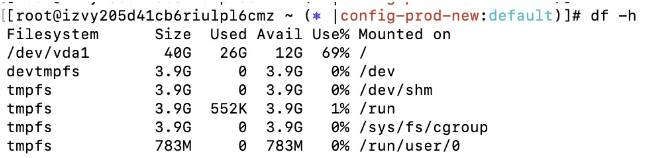

可知 / 路径下占用量最大。

此外也可通过以下命令来查看

```apl
iostat -dx 1   # 观察 await、util 是否过高
vmstat 1       # 观察 IO 等待（wa）是否高
iotop          # 实时查看哪个进程在耗 IO
```


完整可参考文章：[线上故障如何快速排查？来看这套技巧大全 (qq.com)](https://mp.weixin.qq.com/s/tG1kOGtAJzHc37XGlsfAPQ)


## 4. Redis 常见线上问题诊断

------


## 5. Rabbit 常见线上问题诊断

------


## 6. Rocket MQ 常见线上问题诊断

------


## 7. Kafka 常见线上问题诊断

------


## 8. Tomcat 常见线上问题诊断

------


## 9. 线上监控平台以及工具

------


# 16. 场景分析临时发挥题


## 1. 事务中的异步任务出错整个事务会回滚吗 


