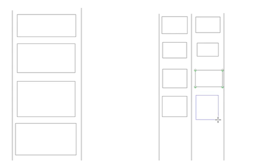

## 1、Java 多线程入门


### 1、多线程基础概念


#### 1、认识串行和并发


##### 1、什么是串行？什么是并发？


>   -   串行就是当有多个任务需要去执行的时候，这些任务就是串行的关系，需要一个一个去执行
>   -   并发就是可以让多个任务同时去执行、这些任务就是并发的关系，可以多个任务同步去执行


##### 2、生活场景举例


现在我们来模拟一个场景、一辆辆汽车行驶在单车道的公路中就类似于程序的串行、具有先后顺序、汽车行驶在多车道的公路中，就是并发、如下图



#### 2、什么是进程？


##### 1、进程的概念


>   进程就是一个程序运行占用的各种资源的描述就叫进程、比如程序运用需要创建变量开辟内存空间，这个叫做内存资源，还有一个就是CPU资源，CPU需要去执行程序的任务


##### 2、生活场景举例


例如工厂和工人，建一个工厂肯定要选一个地皮来建造开发（内存占用）、还要就是需要你要有工人帮你干活，这个对应的就是 CPU 资源

那么假如老板在这快地皮上拆分又创建了四个工厂，老板需要四个工厂同时开工和运行，这个就是并发，假如要以单核 CPU 来说，也可以做并发处理

这个单核的核就是说用来处理、任务的核心数量，类比工厂的工人里面来说，那么就是说可以工作干活的人只有一个
那么就有了一个问题，老板需要四个工厂同时开工运行，但是干活的只有一个，意味着如果工人在 A 工厂开工，那么B、C、D 工厂全部都要停工

这个时候这四个工厂怎么同时开工呢？就是这个工人要在工厂里来会穿梭干活切换，在某一个时间点内，这样就可以间接的让人觉得四个工厂都在工作

回到程序中，单核 CPU 如果去执行一个任务，那么其它三个任务都需要暂时暂停，那么怎么做到让四个程序同时执行？那么就是可以让 CPU 快速的在四个任务之间

来回切换执行，这样就可以实现并发，因为 CPU 来回切换的速度是非常快的，让人丝毫感觉不到。所以并发其实并不是四个程序在同时运行，只是一个假象

进程是可以实现多个任务并发执行，但是是不开辟多个进程处理任务的，**因为进程最大一个弊端就是 资源不共享**


#### 3、什么是线程？


线程是一个进程中任务执行的最小的任务单元，线程可以类比为工厂中一条一条流水线，那么线程的并发和工厂的并发逻辑是一样的，都是CPU快速的在各种任务之间来回切换

如果一个进程中一个线程都没有了，就说明这个进程已经结束掉了，停掉了。线程之间的资源是可以共享的，线程之间共享的资源就叫做 临界资源


### 2、线程的生命周期


#### 1、什么是生命周期？


在程序开发中，将一个对象从实例化完成、到这个对象使用结束并销毁回收，将这样的过程为对象的生命周期，类似于人的一生


#### 2、线程的生命周期


>   在Java中线程也是一个对象，那么一个线程对象被实例化完成、到这个线程被销毁回收，这一过程就叫做线程的生命周期.


线程的生命周期分为几种状态

1.  **新生态 ( New )**：一个对象被实例化完成，但是还没有做任何操作
2.  **就绪态 ( Ready )**：一个线程已经被开启，已经开始争取CPU时间片
3.  **运行态 ( Run )**：一个线程抢到了 CPU 时间片，开始执行这个线程中的逻辑
4.  **阻塞态 ( Interrupt )**：一个线程在运行过程中、受到某些操作的影响，放弃了已经获取到的 CPU 时间片、并且不再参与 CPU 时间片的争抢，此时线程处于挂起状态
5.  **死亡态 ( Dead )**：一个线程对象被销毁

线程的流程图：


### 3、线程的开辟方式


>   多线程是设计模式 静态代理 的实现、


#### 1、继承 Thread 类 (自定义线程类)


-   MyThread 类的实现

```java
/**
 * 继承 Thread 开辟一个线程
 */
class MyThread extends Thread{
    /**
     * 设置名字的两种方式
     * @param name
     */
    public MyThread(String name){
        super(name);
        //this.setName(name);
    }
    @Override
    public void run() {
        for (int i = 0; i < 10; i++) {

            try {
                /**
                 * 线程的休眠可以是线程由运行态转换为阻塞态、当休眠时间到了
                 *   就可以继续由阻塞态转变为运行态，继续去争抢CPU时间片
                 */
                Thread.sleep(1000);
            } catch (InterruptedException e) {
                e.printStackTrace();
            }
            System.out.println("继承 Thread 类创建的线程 第 " + i + " 次运行");
        }
    }
}
```

-   测试线程方法

```java
public static void createThread1(){
    /**
     * 线程的开辟方式 1
     *   继承 Thread 类，做一个线程的子类（自定义线程类）
     */
    MyThread thread = new MyThread("Thread One");
    /**
     * 注意：需要调用 Start 方法才能启动一个线程
     * 如果直接调用 run 方法，则不会开辟一个新的线程，还是在主线程中执行 run 方法中的逻辑
     */
    thread.start();
}
```


#### 2、实现 Runnable 接口

```java
/**
 * 线程的开辟方式 2
 *   实现 Runnable 接口的 run 方法
 */
public static void createThread2(){
    Runnable runnable = new Runnable() {
        public void run() {
            for (int i = 0; i < 10; i++) {
                System.out.println("Runnable 创建的线程 第 " + i + " 次运行");
            }
        }
    };

    Thread thread = new Thread(runnable, "Thread two");
    thread.start();
}
```


#### 3、线程的开辟方式小结


两种方式创建线程方式优缺点：
*   如果采用第一种继承 Thread 类的方式，线程的逻辑被抽离出来，逻辑更清晰可观，但是继承了 Thread 就不能继承其它类了，可能会对原有继承结构造成影响

*   第二中采用 Runnable 接口，则不会有继承问题，但是逻辑直接写在程序中，可读性有待维护，不过我们使用更多的还是 Runnable 实现接口的方式


### 4、线程中常用的方法


#### 1、start() 方法


需要调用 start 方法才能启动一个线程

如果直接调用 run 方法，则不会开辟一个新的线程，还是在主线程中执行 run 方法中的逻辑


#### 2、线程名称的设置


```java
MyThread thread = new MyThread("Thread One");
/**
 * 注意：如果是自定义类，需要在继承类里的
 *   无参构造函数里写 Super(name), 也可以 this.setName(name)
 */
thread.start();

Thread thread = new Thread(runnable, "Thread two");
thread.start();

```


#### 3、sleep() 线程的休眠


线程的休眠可以是线程由运行态转换为阻塞态、当休眠时间到了、就可以继续由阻塞态转变为运行态，继续去争抢CPU时间片

```java
Thread.sleep(1000);
```


#### 4、setPriority() 线程的优先级


线程的优先级：

设置线程的优先级，只是增加这个线程优先抢到CPU时间片的概率、并不是优先级高的一定能抢到CPU时间片，优先级的设置，默认是 5 ， 在 [0 ~ 10] 之间，数字越大代表优先级越高

注意：设置优先级必须在这个线程启动之前、也就是 Start 方法之前

```java
Thread thread1 = new Thread(runnable, "Thread 1 ");
Thread thread2 = new Thread(runnable, "Thread 2 ");


thread1.setPriority(1);
thread2.setPriority(10);
```


#### 5、yield() 线程的礼让


指的是让当前运行状态的线程释放自己的 CPU 资源，由运行状态，回到就绪状态、**但是 A 线程的礼让. 并不是说立马执行 B 线程，而是 A 和 B 线程重新一起争抢 CPU 时间片**

```apl
Thread.yield();
```


#### 6、join() 线程的合并


子线程 join 到主线程（启动程序的线程、比如 main 函数）、阻塞线程仅仅是一个表现，而非目的。其目的是等待当前线程执行完毕后，”计算单元”与主线程汇合。即主线程与子线程汇合之意：

main 是主线程，在 main 中创建了 thread 线程，在 main 中调用了thread.join()，那么等 thread 结束后再执行 main 代码、也就是在子线程调用了 join() 方法后面的代码，只有等到子线程结束了才能执行

>   很多情况下，主线程生成并启动了子线程，需要用到子线程返回的结果，也就是需要主线程需要 在子线程结束后再结束，这时候就要用到 join() 方法
>
>   使用场景 地铁站过安检时，需把背包放入检查台流水线，行人才能进入站内，背包和人同时移动，但是行人速度较快，需要在另一端等到背包安检完成

```apl
Thread.join();
```


#### 7、Thread.State 线程的状态


Thread.State 是 Thread 里面的一个静态常量、枚举类型、六个状态、

1.  **NEW**：尚未启动的线程的线程状态
2.  **RUNNABLE**：可运行线程的线程状态、但它也可能等待操作系统提供其他资源、例如处理器
3.  **BLOCKED**：阻塞态
4.  **WAITING**：等待状态
5.  **TIMED_WAITING**：具有指定等待时间的等待线程的线程状态
6.  **TERMINATED**：线程的任务已经执行完成的状态


#### 8、setDaemon() 设置守护线程


>   线程分为两种

-   用户线程：用户自己定义的线程任务
-   守护线程：后台记录操作日志、监控内存、JVM垃圾回收等待

```java
Thread daemon = new Thread(god, "daemon");
//setDaemon方法设置为守护线程、默认为false
daemon.setDaemon(true);
daemon.start();
```

-   **虚拟机 必须确保 用户线程 执行完毕**
-   **虚拟机 不用等待 守护线程 执行完毕**

>   守护线程演示：

-   定义守护线程

```java
/**
 * 定义守护线程
 */
class God implements Runnable{
    @Override
    public void run() {
        while(true){
            System.out.println("上帝保佑着你...");
        }
    }
}
```

-   定义用户线程

```java
/**
 * 定义用户线程你、寿命100年
 */
class You implements Runnable{
    @Override
    public void run() {
        for (int i = 0; i < 365; i++) {
            if(i == 0){
                System.out.println("You 诞生了...");
            }else{
                System.out.println("You 度过了第 " + (i + 1) + " 天");
            }
        }
        System.out.println("You 死亡了...");
    }
}
```

-   测试方法

```java
/**
 * 守护线程的设置、
 *   用例：上帝永生、而人只能够活100年、上帝永生守护着你
 */
public class LeeThread10 {
    public static void main(String[] args) {

        God god = new God();//守护线程
        You you = new You();//用户线程

        Thread daemon = new Thread(god, "daemon");
        //setDaemon方法设置为守护线程、默认为false
        daemon.setDaemon(true);
        daemon.start();

        Thread youThread = new Thread(you, "You");
        youThread.start();
    }
}
```

-   控制台执行结果如下所示

```json
上帝保佑着你...
You 诞生了...
上帝保佑着你...
上帝保佑着你...
You 度过了第 2 天
You 度过了第 3 天
You 度过了第 4 天
上帝保佑着你...
上帝保佑着你...
............
............
............
............
You 度过了第 364 天
You 度过了第 365 天
You 死亡了...
上帝保佑着你...
```


### 5、线程中的临界资源问题


#### 1、什么是临界资源？


比如这样一个生活场景某个旅游景点的卖票问题、有四个售票员在同实卖票，那么票的库存就是临界资源、如下演示

```java
package lee.learning.video.thread.basics;

/**
 * 多线程的临界资源问题
 *   某个旅游景点的买票问题
 *   有四个售票员在同实卖票，那么票的库存就是临界资源
 */
public class LeeThread3 {

    public static void main(String[] args) {

        Runnable run = new Runnable() {
            @Override
            public void run() {
                while(TickerCenter.restCount > 0){
                    System.out.println("线程 " + Thread.currentThread().getName() + " 卖出 1 张票、剩余：" + --TickerCenter.restCount + " 张票");
                }
            }
        };


        Thread thread1 = new Thread(run, "thread 1");
        Thread thread2 = new Thread(run, "thread 2");
        Thread thread3 = new Thread(run, "thread 3");
        Thread thread4 = new Thread(run, "thread 4");

        thread1.start();
        thread2.start();
        thread3.start();
        thread4.start();
    }
}

class TickerCenter{
    /**
     * 表示票的库存数量
     */
    public static int restCount = 50;
}
```

输出如下结果：

```java
线程 thread 3 卖出 1 张票、剩余：9 张票
线程 thread 3 卖出 1 张票、剩余：8 张票
线程 thread 3 卖出 1 张票、剩余：7 张票
线程 thread 3 卖出 1 张票、剩余：6 张票
线程 thread 3 卖出 1 张票、剩余：5 张票
线程 thread 3 卖出 1 张票、剩余：4 张票
线程 thread 3 卖出 1 张票、剩余：3 张票
线程 thread 3 卖出 1 张票、剩余：2 张票
线程 thread 2 卖出 1 张票、剩余：26 张票
线程 thread 2 卖出 1 张票、剩余：0 张票
线程 thread 3 卖出 1 张票、剩余：1 张票
线程 thread 4 卖出 1 张票、剩余：11 张票
线程 thread 1 卖出 1 张票、剩余：14 张票
```

如上问题，代码输出结果并不是预期结果，库存是一个渐减过程，而中间的跳库存就是所产生的临界资源问题、如此，便引入了锁的概念、将访问 临界资源的 代码块上锁，其它线程不可同时访问需要等待线程释放锁


#### 2、认识线程同步


由于为了保证多线程下的临界资源的数据安全、Java 引入了 锁机制 Synchronized、当一个线程获得对象的排它锁、独占资源、其他线程必须等待使用后释放锁即可

⦁	一个线程持有锁会导致其他所有需要此锁的线程挂起
⦁	在多线程竞争下、加锁、释放锁会导致比较多的上下文切换 和 调度延时、引起性能问题
⦁	如果一个优先级高的线程等待一个优先级低的线程释放锁标记、会导致优先级倒置、引起性能问题


#### 3、线程同步的三种方案


##### 1、同步代码块 synchronized

-   如下的演示

```java
public void run() {
    /**
     * 1、对象锁
     * 2、类锁 当前类.class
     * 注意：需要保证所有访问该临界资源的线程看到的锁都是同一把锁、反例（new Object()）
     */
    while (TickerCenter1.restCount > 0) {
        synchronized (LeeThread4.class) {
            if(TickerCenter1.restCount <= 0) {
                return;
            }
            System.out.println("线程 " + Thread.currentThread().getName() 
                    + " 卖出 1 张票、剩余：" + --TickerCenter1.restCount + " 张票");
        }
    }
}
```

将访问临界资源的代码块上锁

注意：

1.  需要保证所有访问该临界资源的线程看到的锁都是同一把锁、反例（new Object()）
2.  不要把锁写到循环外面、否则一个线程会直接把逻辑执行完成，这和单线程无区别，因为循环内锁一直没被释放、别的线程访问不了


##### 2、同步方法 synchronized


-   我们改写 run 方法、将访问临界资源的代码提取出来成为一个方法

```java
public void run() {
    while(TickerCenter2.restCount > 0){
        soldTicket();
    }
}
```

-   实现扣票逻辑

```java
/**
 * 同步方法
 * 静态方法：同步锁就是 类锁 当前类.class
 * 非静态方法：同步锁就是 this
 */
public synchronized static void soldTicket() {
    if (TickerCenter2.restCount > 0) {
        System.out.println("线程 " + Thread.currentThread().getName() + " 卖出 1 张票、剩余：" + --TickerCenter2.restCount + " 张票");
    }
}
```

同步方法 的 锁：

-   静态方法：同步锁就是 类锁 当前类.class
-   成员方法：同步锁就是 this

如上图所示：将需要访问临界资源的代码封装成一个方法，并用 synchronized 修饰、也可以达到同步


##### 3、同步锁（可重入锁）

```java
ReentrantLock lock = new ReentrantLock();
lock.lock();    //上锁
lock.unlock();  //解锁
```

我们继续改写代码：如下

```java
ReentrantLock lock = new ReentrantLock();

Runnable run = new Runnable() {
    public void run() {
        while (TickerCenter3.restCount > 0) {
            lock.lock();   //上锁

            if(TickerCenter3.restCount <= 0){
                lock.unlock();
                return;
            }
            System.out.println("线程 " + Thread.currentThread().getName() + " 卖出 1 张票、剩余：" + --TickerCenter3.restCount + " 张票");

            lock.unlock(); //解锁
        }
    }
};    
```


##### 4、Synchronized 与 Lock 的对比


-   Lock 是显式锁（需要手动开启和关闭锁）、Synchronized  是隐式锁、出了作用域自动释放
-   Lock 只有代码块锁、而 Synchronized 有 **代码块锁 **和 **方法锁** 
-   使用 Lock 锁、JVM 将花费较少的时间来调度线程、性能更好、并且具有更好的扩展性（提供了更多的子类）推荐使用顺序 Lock > 同步代码块（已经进入了方法体，分配了相应资源）> 同步方法 (在方法体之外)


#### 4、多线程的死锁问题


##### 1、什么是死锁？


多个线程彼此持有对方需要的锁对象、而不释放自己的锁、比如 A、B 两个线程、A 线程持有 A 锁等待 B 锁，B 线程持有 B 锁 等待 A 锁、


这样一来呢，A 持有 A 等待 B、B 持有 B 等待 A、这样导致两个线程都被锁住、死锁就此诞生


##### 2、死锁问题代码演示


```java
/**
 * 死锁问题演示
 */
public class LeeThread7 {
    public static void main(String[] args) {
        Runnable runA = new Runnable() {
            @Override
            public void run() {
                synchronized ("A"){
                    System.out.println("线程 A 持有了 A 锁、等待 B 锁");
                    synchronized ("B"){
                        System.out.println("线程 A 同时持有了 A 锁、 B 锁");
                    }
                }
            }
        };

        Runnable runB = new Runnable() {
            @Override
            public void run() {
                synchronized("B"){
                    System.out.println("线程 B 持有了 B 锁、等待 A 锁");
                    synchronized ("A"){
                        System.out.println("线程 B 同时持有了 A 锁、B 锁");
                    }
                }
            }
        };

        Thread threadA = new Thread(runA, "Thread A");
        Thread threadB = new Thread(runB, "Thread B");
        threadA.start();
        threadB.start();
    }
}
```

>   -   死锁问题有一定概率不发生、因为两个线程需要抢CPU时间片来执行逻辑
>   -   如果A线程抢到了CPU时间片并执行完了A锁部分代码，此时时间片还没有被B锁抢走，此时不会发生死锁
>

如上可以看到问题：A B 两个线程谁也不释放对方持有的锁，谁也执行完、进程就这么卡着、结束不了


##### 3、线程之间的通信


wait()：等待、是 Object 类中的一个方法、当前的线程释放自己的锁标记、并且让出 CPU 资源、使得当前的线程进入等待队列中

notify()：通知、是 Object 类中的一个方法、唤醒等待队列中的一个线程、使这个线程进入锁池（唤醒谁不确定、由CPU进行调度）

notifyAll()：通知、也是 Object 类中的方法、唤醒等待队列中的所有线程 (这句话不太恰当、下面会做出解释)、并使这些线程进入锁池

>   这里可解释为 唤醒等待队列中等待 lockA 锁标记的所有线程、并不是等待队列所有的线程


如下代码：可以让 A 线程执行完 A 逻辑后 调用 wait 方法 释放自己的 lockA 锁标记、并进入等待队列、然后 B 线程 执行完了唤醒 等待 lockA 的所有线程

```java
public class LeeThread8 {

    public static final String lockA = "A";
    public static final String lockB = "B";

    public static void main(String[] args) {
        Runnable runA = new Runnable() {
            @Override
            public void run() {
                synchronized (lockA){
                    System.out.println("线程 A 持有了 A 锁、等待 B 锁");

                    /**
                     * 让 A 线程释放所持有的 A 锁标记、并进入等待队列
                     */
                    try {
                        lockA.wait();
                    } catch (InterruptedException e) {
                        e.printStackTrace();
                    }

                    synchronized (lockB){
                        System.out.println("线程 A 同时持有了 A 锁、 B 锁");
                    }
                }
            }
        };

        Runnable runB = new Runnable() {
            @Override
            public void run() {
                synchronized(lockB){
                    System.out.println("线程 B 持有了 B 锁、等待 A 锁");
                    synchronized (lockA){
                        System.out.println("线程 B 同时持有了 A 锁、B 锁");
                        lockA.notifyAll();
                    }
                }
            }
        };

        /**
         * 死锁问题有一定概率不发生、因为两个线程需要抢CPU时间片来执行逻辑、
         * 如果A线程抢到了CPU时间片并执行完了A锁部分代码，此时时间片还没有被B锁抢走，此时是不会发生死锁的
         */
        Thread threadA = new Thread(runA, "Thread A");
        Thread threadB = new Thread(runB, "Thread B");
        threadA.start();
        threadB.start();
    }
}

```

以上代码流程分析：

1.  A 线程执行完 lockA 块 逻辑后、调用 lockA.wait() 方法 释放自己的 lockA 锁标记、并进入等待队列
2.  B 线程代码都执行完了唤醒 等待 lockA.notifyAll() 的所有线程 A
3.  A 线程被唤醒后继续执行 lockB 块 的逻辑
4.  流程结束


### 6、线程的协作和通讯


#### 1、生产者和消费者问题


>   应用场景：生产者和消费者问题、假设仓库只能放一件产品：

-   生产者生产后将其放入仓库 --> 消费者将仓库中的产品取走
-   如果仓库无产品 --> 生产者生产产品并放入仓库、否则停止停止生产并等待 --> 直到仓库产品被消费者取走
-   如果仓库中放有产品 --> 则消费者可以将产品取走消费、否则停止消费并等待、直到仓库中再次放入产品为止

>   线程通信 - 分析

这是一个线程同步问题、生产者和消费者共享同一个资源、并且生产者和消费者之间相互依赖、互为条件

-   对于生产者、没有生产产品之前、需要通知消费者等待、生产了产品之后、又要马上通知消费者消费
-   对于消费者、消费之后、要通知生产者已经结束消费、需要生产新的产品以供消费

在生产者和消费者问题中、仅有 synchronized 是不够的

-   synchronized 可阻止并发更新同一个临界资源、实现了同步
-   synchronized 不能用来实现不同线程之间的消息传递（通信）

如上分析、Java 提供了几个方法解决线程之间的通信问题、wait()、wait(long timeout)、notify()、notifyAll()、均是Object 类的方法、都只能在同步方法或者同步代码块中使用、否则会抛出异常 IIIegalMonitorStateException


#### 2、解决方案：并发协作模型 (管程法)


-   生产者：负责生产数据的模块(可能是方法﹐对象﹐线程,进程)
-   消费者：负责处理数据的模块(可能是方法﹐对象，线程,进程)
-   缓冲区：消费者不能直接使用生产者的数据﹐他们之间有个“缓冲区

**生产者将生产好的数据放入缓冲区、消费者从缓冲区拿出数据**


>   Java 代码实现

-   生产者类  => 厨师

```java
class Producer extends Thread{

    private SynContainer synContainer;

    public Producer(SynContainer synContainer){
        this.synContainer = synContainer;
    }

    @Override
    public void run() {
        for (int i = 0; i < 100; i++) {
            try {
                synContainer.push(new Chicken(i));
                System.out.println("生产者 => 生产了 " + i + " 只鸡");
            } catch (InterruptedException e) {
                e.printStackTrace();
            }
        }
    }
}
```

-   消费者类 => 吃客

```java
class Consumer extends Thread{

    private SynContainer synContainer;

    public Consumer(SynContainer synContainer){
        this.synContainer = synContainer;
    }

    @Override
    public void run() {
        for (int i = 0; i < 100; i++) {
            try {
                Chicken chicken = synContainer.pop();
                System.out.println("消费者 => 消费了 " + chicken.getId() + " 只鸡");
            } catch (InterruptedException e) {
                e.printStackTrace();
            }
        }
    }
}
```

-   产品类：鸡

```java
class Chicken{
    private int id;
    public int getId() { return id; }

    public Chicken(int id) { this.id = id; }
}
```

-   数据缓冲区类

```java
class SynContainer{
    //容器使用计数
    private int count;
    Chicken[] chickens = new Chicken[10];

    //生产者放入产品
    public synchronized void push(Chicken chicken) throws InterruptedException {
        //容器满了、需要等待消费者消费
        if(count == chickens.length) {
            /**
             * 通知消费者消费、产品满了
             *   该方法向外抛出 InterruptedException 异常
             */
            this.wait();
        }

        //如果没有满、我们就可以放入产品了
        chickens[count] = chicken;
        count++;

        //可以通知消费者进行消费了
        this.notifyAll();
    }

    //消费者消费产品
    public synchronized Chicken pop() throws InterruptedException {
        //如果没有产品消费、需要等待生产者生产
        if(count == 0){
            this.wait();
        }

        count--;
        Chicken chicken = chickens[count];

        //消费完了可以通知生产者生产
        this.notifyAll();
        return chicken;
    }
}
```

-   测试方法

```java
public static void main(String[] args) {
    SynContainer synContainer = new SynContainer();

    Producer producer = new Producer(synContainer);
    Consumer consumer = new Consumer(synContainer);

    producer.start();
    consumer.start();
}
```


#### 3、解决方案：并发协作模型 (信号灯法)


>   通过一个变量标志位、比如定义一个 布尔类型的变量 true 或者 false、来标记什么时候来唤醒

-   生产者类：演员表演电视节目

```java
class Player extends Thread{
    private TV tv;
    public Player(TV tv){ this.tv = tv; }

    @Override
    public void run() {
        try {
            for (int i = 0; i < 20; i++) {
                if (i % 5 == 0) {
                    //广告时间
                    this.tv.play("广告-抖音记录美好生活 [抖音打钱]");
                } else {
                    this.tv.play("快乐大本营正在播放中");
                }
            }
        } catch (InterruptedException e) {
            e.printStackTrace();
        }
    }
}
```

-   消费者类：观众观看电视节目

```java
class Watcher extends Thread{
    private TV tv;
    public Watcher(TV tv){ this.tv = tv; }

    @Override
    public void run() {
        for (int i = 0; i < 20; i++) {
            try {
                tv.watch();
            } catch (InterruptedException e) {
                e.printStackTrace();
            }
        }
    }
}
```

-   产品类：TV、演出和播放

```java
class TV{
    //演员表演的节目
    String voice;
    /**
     * 演员表演：观众等待
     * 观众观看：演员表演
     */
    boolean flag = true;

    /**
     * 演员表演节目
     */
    public synchronized void play(String voice) throws InterruptedException {
        if(!flag){
            //观众观看、演员等待
            this.wait();
        }

        this.voice = voice;
        System.out.println("演员表演了：" + this.voice);

        //表演完了通知演员观看
        this.notifyAll();
        this.flag = !this.flag;
    }

    /**
     * 观众观看电视节目
     */
    public synchronized void watch() throws InterruptedException {
        if(flag){
            this.wait();
        }

        System.out.println("观众观看了：" + this.voice);
        this.notifyAll();
        this.flag = !this.flag;
    }
}
```

-   测试类

```java
public static void main(String[] args) {
    TV tv = new TV();

    Player player = new Player(tv);
    Watcher watcher = new Watcher(tv);
    player.start();
    watcher.start();
}
```


### 7、初始线程池


>   背景：经常创建和销毁、使用特别大的资源、比如并发情况下的线程对性能影响很大

思路：提前创建好多个线程、放入线程池中、使用时直接获取、使用完放入池中、可以避免频繁创建和销毁、实现重复利用

好处：

-   提高了响应速度（减少了新线程的创建时间）
-   降低了资源消耗（重复利用线程池中的线程、不需要每次都创建）
-   便于线程管理

>   核心参数如下：
>
>   corePoolSize：核心池的大小
>   maximumPoolSize：最大线程数
>   keepAliveTime：线程没有任务时最多保持多长时间会终止

1.  JDK 5.0起提供了线程池下相关的API：ExecutorService 和 Executors
2.  ExecutorService：真正的线程池接口、常见的子类ThreadPoolExecutor
3.  Executors：工具类、线程吃的工厂类、用于创建并返回不同类型的线程池


ThreadPoolExecutor

-   void execute(Runnable command)：执行任务/命令、没有返回值、一般来执行Runnable
-   <T> Future<T> submit(Callable<T> task)：执行任务、有返回值、一般用来执行Callable
-   void shutdown()：关闭连接池


