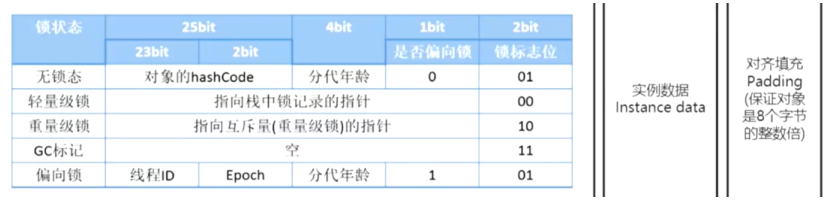
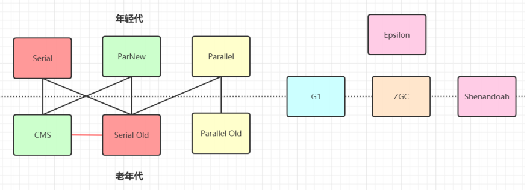
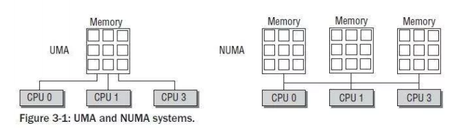

## 1、类加载机制深度解析


### 1、类加载机制详解


#### 1、类加载机制的流程


类加载机制外层大体流程图如下（类加载机制很多代码是 C++ 代码实现的）


>   其中的 loadClass 的类加载过程有如下几步：
>
>   加载 >> 验证 >> 准备 >> 解析 >> 初始化 >> 使用 >> 卸载


##### 1、加载：


>   **在磁盘上查找并通过 IO 读入 Java 的字节码文件、使用到类时才会被加载、例如调用的 main() 方法、new 对象等、在加载阶段会在内存中成一个代表这个类的 java.lang.Class 对象、作为方法区这个类的各种数据的访问入口**


一般来说加载也分为以下几步：

-   通过一个类的全限定名获取此类的二进制字节流
-   将这个字节流所代表的静态存储结构转化为方法区的运行时数据结构
-   在内存中生成一个代表这个类的java.lang.Class对象，作为方法区这个类的各种数据的访问入口

创建名字为 C 的类，如果 C 不是数组类型，那么它就可以通过类加载器加载 C 的二进制表示（即Class文件）。如果是数组，则是通过 Java 虚拟机创建，虚拟机递归地采用上面提到的加载过程不断加载数组的组件

加载阶段与连接阶段的部分内容是交叉进行的，如：一部分字节码文件格式验证动作。加载阶段尚未完成，连接阶段可能已经开始了


##### 2、验证：


>   **校验字节码文件的正确性**


验证作为链接的第一步，用于确保类或接口的二进制表示结构上是正确的，从而确保字节流包含的信息对虚拟机来说是安全的。Java虚拟机规范中关于验证阶段的规则也是在不断增加的，但大体上会完成下面4个验证动作


###### 1、文件格式校验


>   主要验证字节流是否符合Class文件格式规范，并且能被当前版本的虚拟机处理

-   是否以魔数`0xCAFEBABE`开头
-   主次版本号是否在当前虚拟机处理范围之内
-   常量池的常量是否有不被支持的类型 (检查常量 tag 标志)
-   指向常量的各种索引值中是否有指向不存在的常量或不符合类型的常量
-   CONSTANT_Utf8_info 型的常量中是否有不符合 UTF8 编码的数据
-   Class 文件中各个部分及文件本身是否有被删除的或者附加的其他信息

这个阶段是基于二进制字节流进行的，只有通过了这个阶段的验证，字节流才会流入方法区中进行存储，后面3个阶段全是基于方法区的存储结构进行的，不会再直接操作字节流


###### 2、元数据校验


>   主要对字节码描述的信息进行语义分析，以保证其提供的信息符合 Java 语言规范的要求

主要验证点：

-   该类是否有父类（只有 Object 对象没有父类，其余都有）
-   该类是否继承了不允许被继承的类（被 final 修饰的类）
-   如果这个类不是抽象类，是否实现了其父类或接口之中要求实现的所有方法
-   类中的字段、方法是否与父类产生矛盾（例如覆盖了父类的 final 字段，出现不符合规则的方法重载，例如方法参数都一致，但是返回值类型却不同）


###### 3、字节码校验


>   这一阶段目的主要目的是确定程序语义是合法的、符合逻辑的。这个阶段主要对类的字节码进行校验分析，保证该类的方法不会在运行时做出危害虚拟机安全的事

-   保证任意时刻操作数栈的数据类型与指令代码序列都能配合工作，例如不会出险操作数栈上 int 类型的数据使用时按 long 类型加载进本地变量表中
-   保证跳转指令不会跳转到方法体以外的字节码指令上
-   保证方法体内的类型转化是有效的，可以把一个子类对象赋值给父类数据结构，这是安全的，而不能把父类赋值给子类甚至与它无关系的数据类型，这是危险和不合法的


###### 4、符号引用校验


>   这一阶段用来将符号引用转换为直接引用的时候，这个**转化将在解析阶段中发生**，符号引用验证可以看做是类对自身以外（常量池中各种符号引用）的信息进行匹配性校验，通常需要校验以下内容

-   符号引用中通过字符串描述的全限定名是否找到对应的类
-   在指定类中是否存在符合方法的字段描述符以及简单名称所描述的方法和字段
-   符号引用中的类、方法、字段的访问性（private、public、protected、default）是否可被当前类访问


符号引用验证的目的是确保解析动作能够正常执行，如果无法通过符号引用验证，那么将会抛出一个java.lang.IncompatibleClassChangeError 异常的子类，如 java.lang.IllegalAccessError、java.lang.NoSuchFieldError、java.lang.NoSuchMethodError 等

验证阶段非常重要，但不一定必要，如果所有代码极影被反复使用和验证过，那么可以通过虚拟机参数`-Xverify: none`来关闭验证，加速类加载时间


##### 3、准备：


>   **准备阶段的任务是为类或者接口的静态字段分配空间，并且默认初始化这些字段（final修饰的常量直接赋值）**

这些变量所使用的内存都将在方法区分配、实例变量会在对象实例化的时候跟对象一起在 java 堆中分配、这里的初始值指的是通常情况下的零值。假设一个类变量定义为

```java
public static int a = 123;
```

数据类型 零值   int - 0、long - 0L、short - (short)0、char - '\u0000'、byte - (byte)0、boolean - false、float - 0.0f、double - 0.0d、reference - null

那么变量 a 初始化的值是 0 而不是 123。如果变量同时是 final 类型，那么准备阶段就会被赋值为123，不必等到初始化阶段再赋值、**这个过程也解释了Java为什么定义一个变量不赋值，就有默认值，就是在这个阶段分配初始值的**


##### 4、解析：


>   **解析阶段是将虚拟机常量池内的 符号引用 替换为 直接引用 的过程、解析动作主要针对类或接口、字段、类方法、接口方法、方法类型、方法句柄和调用点限定符7类符号进行**
>
>   符号引用就是 Class 文件中的 CONSTANT_Class_info**、 **CONSTANT_Fieldref_info**、**CONSTANT_Methodref_info 等类型的常量

下面我们看 符号引用 和 直接引用 的定义

**符号引用（Symbolic References）**：符号引用以一组符号来描述所引用的目标，符号可以是任何形式的字面量，只要可以唯一定位到目标即可。符号引用于内存布局无关，所以所引用的对象不一定需要已经加载到内存中。各种虚拟机实现的内存布局可以不同，但是接受的符号引用必须是一致的，因为符号引用的字面量形式已经明确定义在 Class 文件格式中

**直接引用（Direct References）**：直接引用时直接指向目标的指针、相对偏移量或是一个能间接定位到目标的句柄。直接引用和虚拟机实现的内存布局相关，同一个符号引用在不同虚拟机上翻译出来的直接引用一般不会相同。如果有了直接引用，那么它一定已经存在于内存中了

以下Java虚拟机指令会将符号引用指向运行时常量池，执行任意一条指令都需要对它的符号引用进行解析


对同一个符号进行多次解析请求是很常见的，除了 invokedynamic 指令以外，虚拟机基本都会对第一次解析的结果进行缓存，后面再遇到时，直接引用，从而避免解析动作重复。

对于 invokedynamic 指令，上面规则不成立。当遇到前面已经由 invokedynamic 指令触发过解析的符号引用时，并不意味着这个解析结果对于其他 invokedynamic 指令同样生效。这是由 invokedynamic 指令的语义决定的，它本来就是用于动态语言支持的，也就是必须等到程序实际运行这条指令的时候，解析动作才会执行。其它的命令都是“静态”的，可以再刚刚完成记载阶段，还没有开始执行代码时就解析


###### 1、类或接口的解析


>   假设Java虚拟机在类D的方法体中引用了类N或者接口C，那么会执行下面步骤：

1.  如果 C 不是数组类型，D 的定义类加载器被用来创建类 N 或者接口 C、加载过程中出现任何异常，可以被认为是类和接口解析失败
2.  如果 C 是数组类型，并且它的元素类型是引用类型。那么表示元素类型的类或接口的符号引用会通过递归调用来解析
3.  检查 C 的访问权限，如果 D 对 C 没有访问权限，则会抛出`java.lang.IllegalAccessError`异常


###### 2、字段解析


对字段表内 class_index 项中索引的 CONSTANT_Class_info 符号引用进行解析，也就是字段所属的类或接口的符号引用，如果解析这个类或符号引用的过程中出现任何异常，都会导致字段符号引用解析的失败。如果解析成功，这个字段对应的类或接口用 C 表示，接下来沿着 A 和它的父类/父接口寻找是否有这个字段，如果有会进行权限验证，如果不具备权限则抛出异常。如果这个过程不出错，则会在找到符合字段的时候返回这个字段的直接饮用，查找结束


###### 3、类 (静态) 方法解析


>   类方法解析首先也要首先解析出类方法表 class_index 项中索引的方法所属的类或接口的符号引用，解析成功用 C 表示

1.  类方法和接口方法符号引用的常量类型定义是分开的，如果在类方法表中索引类是个接口，直接抛出异常
2.  如果通过了第一步，在类 C 中查找是否有简单名称和描述符都与目标匹配的方法，有则返回这个方法的直接引用，查找结束
3.  否则在类的父类递归查找是否有这个方法，有则返回直接引用，查找结束
4.  否则在类的接口列表和父接口递归查找，如果存在匹配的方法，说明类 C 是一个抽象类，查找结束，抛出异常
5.  否则宣告查找失败，抛出异常

最后如果查找成功返回了直接引用，还要对这个方法进行权限验证，如果不具备权限，则会抛出异常


###### 4、接口方法解析


>   接口方法需要先解析出接口方法表的 class_index 项中索引的方法所属的类或接口的符号引用

1.  如果发现 class_index 中的索引 C 是个类而不是接口，直接抛出异常
2.  否则在接口 C 中查找是否有描述符和名称都匹配的方法，有则返回方法的直接引用，查找结束
3.  否则在其父接口中递归查找，匹配就返回方法的直接引用，查找结束
4.  否则宣告方法查找失败


##### 5、初始化：


>   **对类的静态变量初始化为指定的值、执行静态代码块**

类初始化是类加载过程的最后一步。前面的类加载过程中，除了加载阶段可以自定义类加载器干预之外，其余动作完全由虚拟机主导。到了初始化阶段，才真正开始执行 java 代码

我们知道，在前面的准备阶段，已经对类变量分配过内存并设置初始值。在初始化阶段，则是为类变量或其它资源设置程序中声明的值。注意这里仍然是**类变量**，不包括实例变量。**或者明确的说，这一阶段，是执行 static 关键字修饰的变量或代码块**。本质上，初始化是执行类构造器 <client>方法的过程

>   `<clinit>()`方法是由编译器 自动收集类中的所有类变量的赋值动作 和 静态语句块 ( static 语句块) 中的语句合并生成的，**编译器收集的顺序是由语句在源文件中出现的顺序决定的，静态语句块中只能访问到定义在静态语句块之前的变量，定义在它之后的变量，在前面的静态语句块中可以赋值，但是不能访问**
>
>   ```java
>   class Test {
>       static {
>           num = 10;  //可以赋值
>           //编译器会提示“非法向前引用”
>           System.out.print(num);
>       }
>       static int num = 5;
>   }
>   ```

此外平时可能会遇到这种问题：如下代码

```java
public class Loader {

    private static Loader loader = new Loader();

    public static int a;
    public static int b = 0;

    private Loader() {
        a++;
        b++;
    }

    public static Loader getInstance() {
        return loader;
    }

    public static void main(String[] args) {
        Loader instance = Loader.getInstance();

        System.out.println(" a = " + Loader.a);
        System.out.println(" b = " + Loader.b);
    }
}
```

输出结果是：

```java
a = 1
b = 0
```

可能有人问为什么，其实把类加载的过程逻辑理清楚，也不是问题。我们知道在类加载的准备阶段会给类变量分配内存和赋初始值。在外部调用 Client.getInstance() 时，因为之前类没有被加载过，会引发类加载，到了准备阶段就会给类变量赋初始值。赋值顺序同一个类中是按声明的顺序，也就是

```java
loader = null；
a = 0;
b = 0;
```

然后解析完开始初始化，按程序声明的值给类变量赋值。首先执行 clinet = new Client() 其实关键就是这里 new 的过程会调用构造函数，调用完后

```java
a = 1;
b = 1;
```

接着继续初始化，a 只是声明没有赋值，所以没有任何操作，b 声明且赋值为0，所以初始化完成后

```java
a = 1;
b = 0;
```


##### 6、小结：


-   **类加载到方法区后主要包含**： 
    -   运行时常量池、类型信息、字段信息、方法信息、类加载器的引用、对应 class 实例的引用
-   **类加载器的引用**：
    -   这个类到类加载器实例的引用
-   **对应Class实例的引用**：
    -   类加载器在加载类信息放到方法区中、会创建一个对应的 Class 类型的对象实例放到堆（Heap）中、开发人员访问方法区中类定义的入口和切入点


#### 2、类加载的时机


>   其中情况 1 中的 4 条字节码指令在 Java 里最常见的场景是：
>
>   1.  new 一个对象时
>   2.  set 或者 get 一个类的静态字段（除去那种被 final 修饰放入常量池的静态字段）
>   3.  调用一个类的静态方法


#### 3、类加载机制的懒加载


>   类加载机制很多都是懒加载、jar 包和 war 包的类也不是一次性加载的、只有当程序用到调到的时候才会加载、走类加载的五个步骤

以下程序可以很好的演示 JVM 的懒加载机制

```java
/**
 * 演示类加载器的懒加载过程
 *   用到时才去执行类加载过程
 */
public class LazyClassLoader {

    static{
        System.out.println(".............Static LazyClassLoader.............");
    }

    public static void main(String[] args) {
        new A();
        System.out.println(".............Test main.............");
        B b = null;
    }
}

class A{
    static{
        System.out.println(".............Static A.............");
    }
    public A(){
        System.out.println(".............Init A.............");
    }
}

class B{
    static{
        System.out.println(".............Static B.............");
    }
    public B(){
        System.out.println(".............Init B.............");
    }
}
```

-   输出结果如下：

```java
.............Static LazyClassLoader.............
.............Static A.............
.............Init A.............
.............Test main.............
```


### 2、类加载器


#### 1、类加载器的种类


上面的类加载过程主要通过类加载器来实现的、Java里有如下几种类加载器

```java
public class ClassLoaderType {
    public static void main(String[] args) {
        //引导类加载器
        System.out.println(String.class.getClassLoader());
        //扩展类加载器
        System.out.println(com.sun.crypto.provider.DESKeyFactory.class.getClassLoader());
        //应用恒旭类加载器
        System.out.println(ClassLoaderType.class.getClassLoader());
    }
}
```

输出如下：

-   如上输出可以看到为什么引导类加载器的输出为什么是 null 呢？因为引导类加载器是C++端代码实现的、所以Java这边获取不到

```java
null
sun.misc.Launcher$ExtClassLoader@7291c18f
sun.misc.Launcher$AppClassLoader@18b4aac2
```


##### 1、引导类加载器(BootstrapClassLoader)：


负责加载支撑 JVM 运行的位于 JRE 的 lib 目录下 （<Java_Home>\lib）的核心类库、比如 rt.jar、charsets.jar 等、我们常用的 String 类也是核心类库的


##### 2、扩展类加载器(extClassLoader)：


负责加载支撑 JVM 运行的位于 JRE 的 lib 目录下的 ext 扩展目录（<Java_Home>\lib\ext）中的 JAR 包


##### 3、应用程序类加载器(appClassLoader)：


负责加载 ClassPath路径下的类包、主要就是加载你自己写的那些类


##### 4、自定义加载器(CustomClassLoader)：


负责加载用户自定义路径下的类包


#### 2、类加载器的源码分析


分析 Launcher 类的源码：参见类运行加载全过程图（图一）可知其中会创建 JVM 启动器实例 sum.misc.Launcher、初始化使用了单例模式设计、保证一个 JVM 虚拟机内只有一个 sun.misc.Launcher实例、如下源码图


在 Launcher 构造方法内部、其创建了两个类加载器、分别是 sun.misc.Launcher.ExtClassLoader（扩展类加载器）和 sun.misc.Launcher.AppClassLoader（应用类加载器）、JVM 默认使用 Launcher 的 getClassLoader() 方法返回的类加载器 AppClassLoader 的实例加载我们的应用程序。如下图 Launcher 类的构造方法、如下源码图


#### 3、双亲委派机制介绍


##### 1、什么是双亲委派机制：


当某个类加载器需要加载某个 .class 文件时.它首先把这个任务委托给他的上级类加载器. 递归这个操作. 如果上级的类加载器没有加载. 自己才会去加载这个类


-   通过以下代码我们可以得知各个类加载器需要加载的 jar 包

```java
public static void main(String[] args) {
    /**
     * 双亲委派机制
     */
    System.out.println("\n bootstrapLoader 加载以下文件：");
    URL[] urls = Launcher.getBootstrapClassPath().getURLs();
    for (int i = 0; i < urls.length; i++) {
        System.out.println(urls[i]);
    }

    System.out.println("\n extClassLoader 加载以下文件：");
    System.out.println(System.getProperty("java.ext.dirs"));

    System.out.println("\n appClassLoader加载以下文件：");
    System.out.println(System.getProperty("java.class.path"));
}
```

控制台输出如下

```java
 bootstrapLoader 加载以下文件：
file:/C:/Program%20Files/Java/jdk1.8.0_271/jre/lib/resources.jar
file:/C:/Program%20Files/Java/jdk1.8.0_271/jre/lib/rt.jar
file:/C:/Program%20Files/Java/jdk1.8.0_271/jre/lib/sunrsasign.jar
file:/C:/Program%20Files/Java/jdk1.8.0_271/jre/lib/jsse.jar
file:/C:/Program%20Files/Java/jdk1.8.0_271/jre/lib/jce.jar
file:/C:/Program%20Files/Java/jdk1.8.0_271/jre/lib/charsets.jar
file:/C:/Program%20Files/Java/jdk1.8.0_271/jre/lib/jfr.jar
file:/C:/Program%20Files/Java/jdk1.8.0_271/jre/classes

 extClassLoader 加载以下文件：
C:\Program Files\Java\jdk1.8.0_271\jre\lib\ext;C:\WINDOWS\Sun\Java\lib\ext

 appClassLoader加载以下文件：
C:\Program Files\Java\jdk1.8.0_271\jre\lib\charsets.jar;
C:\Program Files\Java\jdk1.8.0_271\jre\lib\deploy.jar;
C:\Program Files\Java\jdk1.8.0_271\jre\lib\ext\access-bridge-64.jar;
C:\Program Files\Java\jdk1.8.0_271\jre\lib\ext\cldrdata.jar;
C:\Program Files\Java\jdk1.8.0_271\jre\lib\ext\dnsns.jar;
C:\Program Files\Java\jdk1.8.0_271\jre\lib\ext\jaccess.jar;
C:\Program Files\Java\jdk1.8.0_271\jre\lib\ext\jfxrt.jar;
C:\Program Files\Java\jdk1.8.0_271\jre\lib\ext\localedata.jar;
C:\Program Files\Java\jdk1.8.0_271\jre\lib\ext\nashorn.jar;
C:\Program Files\Java\jdk1.8.0_271\jre\lib\ext\sunec.jar;
C:\Program Files\Java\jdk1.8.0_271\jre\lib\ext\sunjce_provider.jar;
C:\Program Files\Java\jdk1.8.0_271\jre\lib\ext\sunmscapi.jar;
C:\Program Files\Java\jdk1.8.0_271\jre\lib\ext\sunpkcs11.jar;
C:\Program Files\Java\jdk1.8.0_271\jre\lib\ext\zipfs.jar;
C:\Program Files\Java\jdk1.8.0_271\jre\lib\javaws.jar;
C:\Program Files\Java\jdk1.8.0_271\jre\lib\jce.jar;
C:\Program Files\Java\jdk1.8.0_271\jre\lib\jfr.jar;
C:\Program Files\Java\jdk1.8.0_271\jre\lib\jfxswt.jar;
C:\Program Files\Java\jdk1.8.0_271\jre\lib\jsse.jar;
C:\Program Files\Java\jdk1.8.0_271\jre\lib\management-agent.jar;
C:\Program Files\Java\jdk1.8.0_271\jre\lib\plugin.jar;
C:\Program Files\Java\jdk1.8.0_271\jre\lib\resources.jar;
C:\Program Files\Java\jdk1.8.0_271\jre\lib\rt.jar;
D:\Java\LeeLearning1\target\classes;D:\Apache\repository\org\springframework\boot\spring-boot-starter-web\2.4.4\spring-boot-starter-web-2.4.4.jar;
D:\Apache\repository\org\springframework\boot\spring-boot-starter\2.4.4\spring-boot-starter-2.4.4.jar;D:\Apache\repository\org\springframework\boot\spring-boot\2.4.4\spring-boot-2.4.4.jar;D:\Apache\repository\org\springframework\boot\spring-boot-autoconfigure\2.4.4\spring-boot-autoconfigure-2.4.4.jar;D:\Apache\repository\org\springframework\boot\spring-boot-starter-logging\2.4.4\spring-boot-starter-logging-2.4.4.jar;D:\Apache\repository\ch\qos\logback\logback-classic\1.2.3\logback-classic-1.2.3.jar;D:\Apache\repository\ch\qos\logback\logback-core\1.2.3\logback-core-1.2.3.jar;D:\Apache\repository\org\apache\logging\log4j\log4j-to-slf4j\2.13.3\log4j-to-slf4j-2.13.3.jar;D:\Apache\repository\org\apache\logging\log4j\log4j-api\2.13.3\log4j-api-2.13.3.jar;D:\Apache\repository\org\slf4j\jul-to-slf4j\1.7.30\jul-to-slf4j-1.7.30.jar;D:\Apache\repository\jakarta\annotation\jakarta.annotation-api\1.3.5\jakarta.annotation-api-1.3.5.jar;D:\Apache\repository\org\yaml\snakeyaml\1.27\snakeyaml-1.27.jar;D:\Apache\repository\org\springframework\boot\spring-boot-starter-json\2.4.4\spring-boot-starter-json-2.4.4.jar;D:\Apache\repository\com\fasterxml\jackson\core\jackson-databind\2.11.4\jackson-databind-2.11.4.jar;D:\Apache\repository\com\fasterxml\jackson\core\jackson-annotations\2.11.4\jackson-annotations-2.11.4.jar;D:\Apache\repository\com\fasterxml\jackson\core\jackson-core\2.11.4\jackson-core-2.11.4.jar;D:\Apache\repository\com\fasterxml\jackson\datatype\jackson-datatype-jdk8\2.11.4\jackson-datatype-jdk8-2.11.4.jar;D:\Apache\repository\com\fasterxml\jackson\datatype\jackson-datatype-jsr310\2.11.4\jackson-datatype-jsr310-2.11.4.jar;D:\Apache\repository\com\fasterxml\jackson\module\jackson-module-parameter-names\2.11.4\jackson-module-parameter-names-2.11.4.jar;D:\Apache\repository\org\springframework\boot\spring-boot-starter-tomcat\2.4.4\spring-boot-starter-tomcat-2.4.4.jar;D:\Apache\repository\org\apache\tomcat\embed\tomcat-embed-core\9.0.44\tomcat-embed-core-9.0.44.jar;D:\Apache\repository\org\glassfish\jakarta.el\3.0.3\jakarta.el-3.0.3.jar;D:\Apache\repository\org\apache\tomcat\embed\tomcat-embed-websocket\9.0.44\tomcat-embed-websocket-9.0.44.jar;D:\Apache\repository\org\springframework\spring-web\5.3.5\spring-web-5.3.5.jar;D:\Apache\repository\org\springframework\spring-beans\5.3.5\spring-beans-5.3.5.jar;D:\Apache\repository\org\springframework\spring-webmvc\5.3.5\spring-webmvc-5.3.5.jar;D:\Apache\repository\org\springframework\spring-aop\5.3.5\spring-aop-5.3.5.jar;D:\Apache\repository\org\springframework\spring-context\5.3.5\spring-context-5.3.5.jar;D:\Apache\repository\org\springframework\spring-expression\5.3.5\spring-expression-5.3.5.jar;D:\Apache\repository\org\slf4j\slf4j-api\1.7.30\slf4j-api-1.7.30.jar;D:\Apache\repository\org\springframework\spring-core\5.3.5\spring-core-5.3.5.jar;D:\Apache\repository\org\springframework\spring-jcl\5.3.5\spring-jcl-5.3.5.jar;D:\MySoft\Intellij IDEA\IntelliJ IDEA 2020.1.2\lib\idea_rt.jar
```


问题分析：我们看到了为什么 appClassLoader 加载器也会加载 引导类加载器加载的类路径呢？其实这个下面会做出解释、虽然这里会输出在 appClassLoader 里、并不是说 appClassLoader 就加载了这些类、


##### 2、双亲委派机制流程图


>   双亲委派机制

我们先忽略自定义类加载器来讲、一般是从底向上进行加载、先从应用程序类加载器开始加载、如果当前加载器没有找到当前类、那么会往上进行委托、这时就到了扩展类加载器、如果还没有找到要加载的当前类的话、继续往上委托引导类加载器、这时引导类加载器会检查自己的 JRE 目录下有没有当前类。相反引导类加载器没找到也可以往下进行委托加载


>   注意：这几个类加载器之间不是继承的关系、只是应用程序类加载器的一个 parent 属性的值是 上一级加载器. 如下
>
>   


##### 3、为什么JVM要先从应用程序加载类加载？


我们来思考这样一个问题，我么平时开发的代码而言，平均 90% 以上都是我们自己写的类、所以虽然第一次加载最坏的情况循环了两圈、但是一旦引导类加载器加载了就会缓存到了内存中的集合里维护，下次再来不用再次加载、直接内存使用。如果设计成 从 引导类加载器开始、那么基本上每次加载都要跑一圈相互加载委托、性能上不行


##### 4、双亲委派机制核心源码分析


>   代码分析

所有类加载器的父类都是 ClassLoader 、都会执行到 loadClass() 方法。第一次进来肯定是 appClassLoader 开始.

可以看到这个类会先调用 findLoadedClass(name) [C++实现] 方法、查询这个类是否已经被加载过、然后才会获取当前加载器的 parent 属性、在调用 parent 类的加载器，如果为空、就说明已经到了顶层引导加载器了

现在顶层开始往下查找调用 findBootstrapClassOrNull(name) [C++实现的本地方法] 方法、C++ 端也会先判断该类是否已经被加载过、如果没有加载在调用引导类加载器去加载并返回、最后的 findClass(name) 方法。

进行类路径定位的定位并通过一系列的本地方法调用、简单来说就是在当前类加载器的内存中去尝试加载指定的类、如果返回为空就继续用别的类加载器的 findClass(name) 方法去加载

```java
protected Class<?> loadClass(String name, boolean resolve) throws ClassNotFoundException {
    synchronized (getClassLoadingLock(name)) {
        // First, check if the class has already been loaded
        Class<?> c = findLoadedClass(name);
        if (c == null) {
            long t0 = System.nanoTime();
            try {
                if (parent != null) {
                    c = parent.loadClass(name, false);
                } else {
                    c = findBootstrapClassOrNull(name);
                }
            } catch (ClassNotFoundException e) {
                // ClassNotFoundException thrown if class not found
                // from the non-null parent class loader
            }

            if (c == null) {
                // If still not found, then invoke findClass in order
                // to find the class.
                long t1 = System.nanoTime();
                c = findClass(name);

                // this is the defining class loader; record the stats
                sun.misc.PerfCounter.getParentDelegationTime().addTime(t1 - t0);
                sun.misc.PerfCounter.getFindClassTime().addElapsedTimeFrom(t1);
                sun.misc.PerfCounter.getFindClasses().increment();
            }
        }
        if (resolve) {
            resolveClass(c);
        }
        return c;
    }
}
```


##### 5、为什么要设计双亲委派机制?


-   **沙箱安全机制**：自己写的 java.lang.String.class 类不会被加载、这样可以防止核心库 API 被随意的篡改
-   **避免类的重复加载**：当父类已经加载了该类、就没有必要子 ClassLoader 在加载一次、保证被加载类的唯一性

>   小插曲

如果自己写的 java.lang.String 类运行会被加载吗？不行、看以下报错


**以上报错分析**

一开始会经过 应用程序加载器 来加载、会先看看缓存集合有没有加载过该类，如果没有就向上委托、一直到顶层、引导类加载器看到自己 lib 目录下确实有 java.lang.String 类、就将自己的 String 类加载到内存中去、这样在自己写的 String 中定义了 main方法运行，可是系统核心库的 String 类中就没有定义该方法、所以抛出异常、这样也防止了黑客篡改系统核心类库植入后门程序


##### 6、全盘负责委托机制


全盘负责 是指一个 ClassLoader 装在一个类时、除非显式的使用另一个 ClassLoader、该类所依赖及引用的类也由这个 ClassLoader 载入


##### 7、自定义类加载器


自定义类加载器只需要继承 java.lang.ClassLoader 类、该类有两个核心方法、一个时 loadClass(String, boolean)、实现了双亲委派机制，还有一个方法就是 findClass()、默认实现是空方法、所以我们自定义类加载器主要是重写 findClass() 方法

自定义类加载器默认的加载器是 应用程序类加载器、因为初始化的时候先初始化父类的 ClassLoader、然后将 parent 属性直接赋值为 AppClassLoader


##### 8、手动打破双亲委派机制


>   再来一个沙箱安全机制实例、尝试打破双亲委派机制、用自定义类加载器加载我们自己实现的 java.lang.String.class 类


比如用自定义的类加载器继承了 ClassLoader 类、之后在覆盖父类的 loadClass(String, boolean) 方法、将里面的双亲委派机制代码删除、然后我们指定只加载我们自定义路径下的类文件、此时就会遇到一个问题、因为所有类的父类都是 Object 类、那么自定义路径下肯定没有该类的，那么就会导致加载失败、如果我们把 Object 类的 字节码文件拷贝过来、运行会触发 JDK 的沙箱安全机制：如下


此时如何解决？JDK 不允许核心库的字节码文件在自定义类加载器中加载的、而此时双亲委派已经打破、已经不会向上去引导类加载器去加载类文件、那么请看

如下解决方案、在自己重写的  findClass() 方法中添加以下逻辑：


此时如果是我们自己的类路径下的字节码文件我们就走自己的类加载器、否则就还是走双亲委派机制、此时双亲委派机制被打破


##### 9、loadClass、findClass、defineClass 的区别


ClassLoader中和类加载有关的方法有很多，前面提到了loadClass，除此之外，还有findClass和defineClass等，那么这几个方法有什么区别呢？

-   loadClass()
    -   就是主要进行类加载的方法，默认的双亲委派机制就实现在这个方法中。
-   findClass()
    -   根据名称或位置加载.class字节码
-   definclass()
    -   把字节码转化为Class

这里面需要展开讲一下 loadClass 和 findClass ，我们前面说过，当我们想要自定义一个类加载器的时候，并且像破坏双亲委派原则时，我们会重写loadClass方法。

那么，如果我们想定义一个类加载器，但是不想破坏双亲委派模型的时候呢？

这时候，就可以继承 ClassLoader，并且只重写 findClass 方法。findClass() 方法是JDK1.2之后的 ClassLoader 新添加的一个方法


#### 4、历史上被打破的双亲委派机制


引导语：

其实、在Java 模块化出现之前，双亲委派模型历史上主要出现过 3 次较大规模的 “被破坏” 的情况


##### 1、历史上第一次被打破


>   双亲委派模型的第一次 “被破坏” 其实发生在双亲委派模型出现之前 —— 即 JDK 1.2 出现以前的 “远古“ 时代

由于双亲委派模型在 JDK1.2 之后才被引入，但是类加载器的概念和抽象类 java.lang.ClassLoader 则在 Java 的第一个版本中就已经存在，面对已经存在的用户自定义类加载器的代码，Java 设计者们引人双亲委派模型时不得不做出一些妥协

为了兼容这些已有代码，无法再以技术手段避免 loadClass() 被子类覆盖的可能性，只能在JDK1.2之后的java.lang.ClassLoader 中添加一个新的 protected 方法 findClass()，并引导用户编写的类加载逻辑时尽可能去重写这个方法，而不是在 loadClass() 中编写代码。上节我们已经分析过 loadClass() 方法，双亲委派的具体逻辑就实现在这里面、按照 loadClass() 方法的逻辑，如果父类加载失败，会自动调用自己的 findClass() 方法来完成加载，这样既不影响用户按照自己的意愿去加载类，又可以保证新写出来的类加载器是符合双亲委派规则的


##### 2、历史上第二次被打破


双亲委派模型的第二次 “被破坏” 是由这个模型自身的缺陷导致的、双亲委派很好地解决了各个类加载器协作时基础类型的一致性问题（越基础的类由越上层的加载器进行加载）、基础类型之所以被称为 “基础”、是因为它们总是作为被用户代码继承、调用的 API 存在，但程序设计往往没有绝对不变的完美规则，如果有基础类型又要调用回用户的代码，那该怎么办呢?

>   这并非是不可能出现的事情，一个典型的例子便是 JNDI 服务、JNDI 现在已经是 Java 的标准服务，它的代码由启动类加载器来完成加载 (在JDK 1.3时加入到 rt.jar 的)、肯定属于Java中很基础的类型了

但 JNDI 存在的目的就是对资源进行查找和集中管理、比如 JDBC 的链接池信息，它需要调用由其他厂商实现并部署在应用程序的 ClassPath 下的 JNDI 服务提供者接口（Service Provider Interface，SPI)的代码，现在问题来了，启动类加载器是绝不可能认识、加载这些代码的，那该怎么办?

为了解决这个困境，Java 的设计团队只好引人了一个不太优雅的设计、线程上下文类加载器 (Thread Context ClassLoader)、这个类加载器可以通过 java.lang.Thread 类的 setContext-ClassLoader() 方法进行设置、如果创建线程时还未设置，它将会从父线程中继承一个，如果在应用程序的全局范围内都没有设置过的话，那这个类加载器默认就是应用程序类加载器。

有了线程上下文加载器、JNDI 服务使用这个线程上下文加载器去加载所需要的 SPI 服务代码、这其实是一种父类加载器去请求子类加载器完成类加载的行为、实际上是打破了双亲委派机制模型的层次顺序来逆向使用类加载器

>   Java 中涉及 SPI 的加载基本上都采用了这种方式来完成，例如 JNDI、JDBC、JCE、JAXB、和 JBI 等，为了消除这种极不优雅的的实现方式

不过在 JDK 6 时，提供了 java.uitl.ServiceLoader 类，以 META-INF/services 中的配置信息、并以责任链模式，才算是给 SPI 的加载提供了一种相对合理的解决方案


##### 3、历史上第三次被打破


>   双亲委派模型的第三次 ”被打破“，是由于用户对程序动态性的追求而导致的，比如：代码热替换、模块的热部署等，说白了就是希望 Java 应用程序不用重启服务就可以使用到最新修改的配置或者代码

OSGi 是如何通过类加载器实现热部署的？

>   OSGI(Open Service gateway initactive) 是 java 动态化模块系统的一系列规范、OSGI 的主要工作是让组件尽可能的解耦（通过定义的规范实现），并且能让组件动态的发现其他组件

OSGi 实现模块化部署的关键时它自定义的类加载器机制的实现、每一个程序模块 (OSGi 中称为 Bundle) 都有一个自己的类加载器，当需要更换一个 Bundle 时，就把 Bundle 连同类加载器一起换掉以实现代码的热部署。在OSGi 环境下，类加载器不再双亲委派模型推荐的树状结构，而是进一步发展为更加复杂的网络结构，当收到类加载请求时，OSGi 将按照下面的顺序进行类搜索：


-   将以 java.* 开头的类，委托给父类加载器加载
-   否则，将委托列表名单内的类，委托给父类加载器加载
-   否则，将 Import 列表中的类，委托给 Export 这个类的 Bundle 的类加载器加载
-   否则，查找当前 Bundle 的 ClassPath，使用自己的类加载器加载
-   否则，查找类是否在自己的 Fragment Bundle 中，如果在，则委派给 Fragment Bundle 的类加载器加载
-   否则，查找 Dynamic Import 列表的 Bundle，委托给对应的 Bundle 的类加载器加载
-   否则，类查找失败

上面查找的顺序中只有开头两点仍然符合双亲委派模型的原则，其余的类查找都是在平级的类加载器中进行的


##### 4、历史上第四次被打破


在 JDK 9 中对 Java 进行了一次重要的升级，就是引入了 Java 模块化系统，不过为了保证兼容性，JDK 9 并没有从根本上动摇从 JDK1.2 以来运行了二十年之久的三层类加载器架构以及双亲委派机制模型，但是也为了模块化系统的顺利运行，模块化下的类加载器仍然发生了一些变化：

-   扩展类加载器（Extension Class Loader）被平台类加载器（Platform Class Loader）取代
-   其次应用程序类加载器都不再派生子 java.net.URLClassLoader，如果有程序直接依赖了这种继承关系，则很可能会在 JDK 1.9 及更高版本中崩溃
-   当平台或应用程序类加载前，先判断该类是否能够归属到某一个系统模块中，如果可以找到归属关系，那么就优先派给负责那个模块的加载器完成

至此的第三条，也可以算是对双亲委派机制的第四次打破


## 2、JVM内存模型深度解析


### 1、JDK 完整体系结构如下


Java语言跨平台特性（一次编写、到处运行）


>   java 命令行编译命令

javap 指令：可以通过 javap -c 将具体字节码文件编译成可读性更强的文件、具体用法、需要进入具体 target 目录的路径下使用命令

```java
javap -c Math.class > Math.txt
```


### 2、JVM 内存模型


#### 1、类装载子系统


就是类加载机制的流程（见上个章节的内容）


#### 2、运行时数据区 (内存模型)


##### 1、堆：

存放 new 出来的对象、JVM 调优主要是在堆中进行的


##### 2、虚拟机栈 (线程栈)：


>   **栈帧**：一旦虚拟机开始运行一个方法，比如 main() 方法、就会在栈里划分一块小区域来存放这个main() 方法的里面独有的内存区域、包括以下内容

###### 1、局部变量表：

-   就是存放 main 方法里面定义的局部变量信息

###### 2、操作数栈：

-   看以下方法、就是将 1 、2、 a + b 的值 压入操作数栈、再将结果乘以 10 压入操作数栈

```java
public int compute(){
    int a = 1;
    int b = 2;
    int c = (a + b) * 10;
    return c;
}
```

###### 3、动态链接：

-   一个指向运行时常量池的引用，将 class 文件中的符号引用（描述一个方法调用了其他方法或访问成员变量）转为直接引用

###### 4、方法出口：

-   当一个 main() 方法中调用了 compute 方法并执行完毕后、那么该返回继续执行 main 方法、那么这时方法出口就记录了 compute 执行完毕后出来该执行哪行指令等信息


##### 3、本地方法栈：


>   C++ 代码运行需要的栈空间


##### 4、方法区：


存放、常量、静态变量、类信息、八大数据类型和字符串等 ( 方法区在 JDK1.8 之前叫做永久代、之后改了一个名称叫做元空间、直接内存)


##### 5、程序计数器：


为了保证程序（进程）能够连续地执行下去，处理器必须具有某些手段来确定下一条指令的地址。而程序计数器正是起到这种作用、通俗的来讲就是记录代码当前运行到哪条指令了、比如 main() 方法运行到一半、突然 CPU 时间片被另一个线程抢走了、另一个线程执行完了，回到 main() 方法、利用程序计数器就可以知道接下来该执行的指令、通常来说每个线程都有自己的程序计数器


#### 3、字节码执行引擎


字节码执行引擎后台会开一个线程去做GC回收


#### 4、整体内存模型图如下


## 3、JVM 参数设置


Spring Boot程序的JVM参数设置格式（Tomcat 启动直接加到 bin 目录下的 catalina.sh 文件中）：

```java
java ‐Xms2048M ‐Xmx2048M ‐Xmn1024M ‐Xss512K ‐XX:MetaspaceSize=256M ‐XX:MaxMetaspaceSize=256M ‐jar microservice‐eurek a‐server.jar
```


### 1、JVM 参数汇总


Spring Boot 程序的 JVM 参数设置格式 (Tomcat 启动直接加在 bin 目录下 catalina.sh 文件里)：

```java
java -Xms2048M -Xmx2048M -Xmn1024M -Xss512K -XX:MetaspaceSize=256M -XX:MaxMetaspaceSize=256M -jar microservice-eureka-server.jar
```

-   -Xss：每个线程的栈大小
-   -Xms：初始堆大小，默认物理内存的 1/64
-   -Xmx：最大堆大小，默认物理内存的 1/4
-   -Xmn：新生代大小
-   -XX:NewSize：设置新生代初始大小
-   -XX:NewRatio：默认 2 表示新生代占年老代的 1/2，占整个堆内存的 1/3
-   -XX:SurvivorRatio：默认 8 表示一个 survivor 区占用 1/8 的 Eden 内存，即 1/10 的新生代内存

>   关于元空间的 JVM 参数有两个：-XX:MetaspaceSize=N 和 -XX:MaxMetaspaceSize=N

**-XX：MaxMetaspaceSize**： 设置元空间最大值， 默认是-1， 即不限制， 或者说只受限于本地内存大小。

**-XX：MetaspaceSize**： 指定元空间触发Fullgc的初始阈值(元空间无固定初始大小)， 以字节为单位，默认是21M左右，达到该值就会触发full gc进行类型卸载， 同时收集器会对该值进行调整： 如果释放了大量的空间， 就适当降低该值； 如果释放了很少的空间， 那么在不超过-XX：MaxMetaspaceSize（如果设置了的话） 的情况下， 适当提高该值。这个跟早期jdk版本的**-XX:PermSize**参数意思不一样，-**XX:PermSize**代表永久代的初始容量。


### 2、JVM 参数详解


#### 1、设置线程栈大小


>   -Xss512K (默认是1M)

JVM中的线程栈大小（虚拟机栈）、左边的 512K 是给一个线程来用的、一个线程会从线程栈中分配一小块大小、这个大小就是 512K

```java
public void stackOverFlow(){
    stackOverFlow();
}
```

分析：看以上代码、如果运行以上代码、最终都会触发 StackOverflowError 异常、因为每次调用都要对 stackOverFlow 方法在线程栈上分配一块空间、这属于死循环嵌套调用、发生异常的时间取决于 -Xss 线程栈设置的大小

>   结论：-Xss 设置越小 count 值越小，说明一个线程栈里能分配的栈帧就越少，但是对 JVM 整体来说能开启的线程数会更多
>


#### 2、元空间参数设置：


**注意：元空间的默认初始大小是21MB、默认的元空间的最大值是无限**

```java
-XX:MetaspaceSize
```

设置元空间的初始空间大小、以字节为单位、默认为 21M 、达到该值就会触发 Full GC 进行类型卸载、同时收集器会对该值进行自动扩容机制：如果释放了大量的空间、就适当降低该值、如果释放了很少的空间、那么在不超过 -XX:MaxMetaspaceSize（如果设置了的话）的情况下、适当提高该值、这个跟早期 JDK 版本的 -XX:PermSize 参数意思不一样、它原来代表永久代的初始容量 

```
-XX:MaxMetaspaceSize
```

设置元空间的最大值、默认是 -1、即不限制、或者说之受限于本地内存大小

>   分析：由于调整元空间的大小需要 Full GC、触发 STW（Step the World）、这是非常昂贵的操作，如果应用在启动的时候发生大量 Full GC、通常都是由于永久代或者元空间发生了大小调整，基于这种情况，不建议不设置元空间得大小、一般建议 JVM 参数中将 MetaspaceSize 和 MaxMetaspaceSize 设置成一样的值、并设置得比初始值要大、对于8G 物理内存得机器来说、一般这两个值都设置为 256M


## 4、JVM 对象内存分配机制


### 1、对象创建和内存分配流程


**类加载检查 => 是否已加载类 => 分配内存 => 初始化 => 设置对象头 => 执行 <init> 方法**


#### 1、类加载检查


虚拟机遇到一条 new 指令时、首先去检查这个指令得参数是否能在常量池中定位到一个类得符号引用、并检查这个符号引用代表的类是否已加载、解析和初始化过、如果没有、那必须先执行相应的类加载过程


#### 2、分配内存


在类加载检查后、接下来虚拟机将为新生对象分配内存、对象所需内存的大小在类加载完后便可以完全确定、为对象分配空间的任务等同于把 一块确定大小的内存从 Java 堆中划分出来


##### 1、对象栈上分配


我们通过 JVM 内存分配得知：Java 的对象一般都是在堆上进行分配的、当对象没有被引用的时候，需要依靠 GC 进行回收内存，如果对象数量较多的时候、会给 GC 带来较大的压力，也间接的影响了应用的性能，为了减少临时对象在堆内存分配的数量，JVM 通过 逃逸分析 确定该对象不会被外部访问，不会逃逸的话就可以将对象在栈上分配内存，这样该对象所占用的内存空间就可以随着栈而销毁，也就减轻了垃圾回收的压力


##### 2、对象逃逸分析（栈上分配机制）


就是分析对象动态作用域，当一个对象在方法中被定义后、它可能被外部方法所引用、例如作为方法返回值、或者调用参数传递到其他地方中，如下面两个例子演示

-   此方法对象将堆上分配、因为对象被作为参数返回、对象的作用域范围不确定

```java
public Lee getLee(){
    Lee lee = new Lee("对象逃逸");
    lee.setAddress("test");
    return lee;
}

```

-   该方法的 lee 对象仅在 createLee 方法作用域内、未发生外部引用、未逃逸、此时对象分配到栈上、即用即毁

```java
public void createLee(){
    Lee lee = new Lee("对象未逃逸");
    lee.setAddress("test2");
}
```


###### 1、对象逃逸分析参数


JVM 对于以上情况可以通过开启以下逃逸分析参数来优化对象内存分配的位置

```java
-XX:+DoEscapeAnalysis // JDK 7 之后默认开启逃逸分析
```

使其通过标量替换优先分配在栈上（栈上分配），如果想要关闭逃逸分析请使用如下参数

```java
XX:-DoEscapeAnalysis  // 关闭对象逃逸分析
```


###### 2、标量替换 (配合逃逸分析使用)


通过逃逸分析分析确定该对象不会被外部访问、并且对象可以进一步分解时、JVM 不会创建该对象，而是将该对象成员变量分解成若干个被这个方法使用的成员变量所替代，这些替代的成员变量在栈帧或者寄存器上分配空间，这样就不会因为没有一块连续的空间导致对象内存不够分配

```java
-XX:+EliminateAllocations // 开启标量替换参数：JDK 7 之后默认开启  
```


###### 3、标量与聚合量


标量即不可被进一步分解的量、而 Java 的基本数据类型就是标量（如：int、long 等基本数据类型以及 reference 类型等、），标量的对立就是可以被进一步分解的量、而这种量称之为聚合量，而在 Java 中对象就是可以被进一步分解的聚合量


##### 3、对象堆上的 Eden 区分配


大多情况下、对象在新生代中 Eden 区分配、当 Eden 区没有足够的空间时，虚拟机将发起一次 Minor GC

-   Minor GC / Young GC：指的是新生代的垃圾收集动作、Minor GC 非常频繁，回收速度一般比较快
-   Major GC / Full GC：一般会回收老年代、年轻代、方法区的垃圾对象、速度一般会比 Minor GC 慢 10 以上

```java
-XX:+PrintGC 或 -XX:+PrintGCDetails // 开启打印GC日志：（详细日志）
//在实际问题排查中，收集器日志常会打印到文件后通过工具进行分析
```

>   Eden 与 Survivor 区默认比例为 8 : 1 : 1

大量的对象被分配在 eden 区，eden 区满了后会出发 Minor GC、可能会有 99% 以上的对象成为垃圾被回收掉，剩下的存活的对象会被挪到为空的那块 survivor 区

下一次 eden 区满了后又会出发 Minor GC、把 Eden 区和 Survivor 区垃圾对象回收，把剩余存活的对象一次性挪动到另一块为空的 Survivor 区，因为新生代的对象都是朝生夕死的，存活时间很短，**所以 JVM 默认的 8 : 1 : 1 的比例是很合适的，让 eden 区尽量很大，survivor 区够用即可**


JVM默认有这个参数如下、会导致这个比例会自动变化

```java
-XX:+UseAdaptiveSizePolicy //（默认开启）
```

如果不想这个比例有变化就关闭这个参数： -XX:-UseAdaptiveSizePolicy


#### 3、初始化


内存分配完毕后、虚拟机不要将分配的内存空间都初始化为零值（不包括对象头）、如果使用 TLAB （本地线程分配缓冲）、这一工作过程也可以提前至 TLAB 分配时进行、**这一步操作保证了对象的实例在 Java 代码中可以不赋初始值就直接使用，程序能访问到这些字段的数据类型所对应的默认值**

```java
private int num = 10;         //初始值 0
private double age = 24.5;    //初始值 0.0
private Object parent = new Test(); //初始值 null
```


#### 4、设置对象头 (重要)


##### 1、对象头的组成


初始化默认值之后、虚拟机要对对象进行必要的设置、例如这个对象是哪个类的实例、如何才能找到类的元数据信息、对象的哈希码、对象的GC分代年龄等信息? 其实这些信息存放在对象的对象头 Object Header 中.

>   在HotSpot虚拟机中、对象在内存中存储的布局可以分为3块区域

-   对象头（Header）
-   实例数据（Instance Data）
-   对齐填充（Padding）

HotSpot 虚拟机的对象头包括两部分信息、第一部分用于存储对象自身运行时数据、如哈希码（HashCode）、GC的分代年龄、锁状态标志、线程持有的锁、偏向线程 ID 偏向时间戳等、对象头的另一部分是类型指针，即对象指向它的类元数据的指针、虚拟机通过这个指针来确定这个对象是哪个类的实例


##### 2、32 位对象头结构图




其中Object Header 对象头有几个重要的点：

**Mark Word 标记字段**：（32位占4字节、64位占8字节），自身运行时数据哈希码、GC分代年龄、锁状态标志，线程持有锁、偏向线程ID、偏向时间戳

**Klass Pointer 类型指针**：（开启指针压缩压缩占4字节、否则占8字节）对象指向它的类元数据（方法区）的指针

**数组长度**：只有数组类型才有、占4字节


>   我们可以引入 jol-core 包查看打印对象头信息

```xml
<dependency>
    <groupId>org.openjdk.jol</groupId>
    <artifactId>jol-core</artifactId>
    <version>0.16</version>
    <scope>compile</scope>
</dependency>
```

>   如下 Java 代码获取对象头信息

```java
package lee.learning.video.jvm.other;

import org.openjdk.jol.info.ClassLayout;

/**
 * 计算对象大小
 */
public class JQLSample {

    public static void main(String[] args) {
        //打印 Object 的对象头信息
        ClassLayout layout = ClassLayout.parseInstance(new Object());
        System.out.println(layout.toPrintable());

	    //打印 int[] 的对象头信息
        ClassLayout layout1 = ClassLayout.parseInstance(new int[]{});
        System.out.println(layout1.toPrintable());

        //打印 A 的对象头信息
        ClassLayout layout2 = ClassLayout.parseInstance(new A());
        System.out.println(layout2.toPrintable());
    }

    /**
     * ‐XX:+UseCompressedOops 默认开启的压缩所有指针
     * ‐XX:+UseCompressedClassPointers 默认开启的压缩对象头里的类型指针Klass Pointer
     * Oops : Ordinary Object Pointers
     */
    public static class A {
        /**
         * 8B mark word
         * 4B Klass Pointer 
         * 如果关闭压缩 ‐XX:‐UseCompressedClassPointers 或 ‐XX:‐UseCompressedOops 则占用 8B
         */
        int id;        // 4B
        String name;   // 4B 如果关闭压缩 ‐XX:‐UseCompressedOops、则占用 8B
        byte b;        // 1B
        Object o;      // 4B 如果关闭压缩 ‐XX:‐UseCompressedOops、则占用 8B
    }
}
```

-   输出如下

```java
// Object 的对象头信息
java.lang.Object object internals:
OFF  SZ   TYPE DESCRIPTION               VALUE
  0   8        (object header: mark)     0x0000000000000001 (non-biasable; age: 0)
  8   4        (object header: class)    0xf80001e5
 12   4        (object alignment gap)    
Instance size: 16 bytes
Space losses: 0 bytes internal + 4 bytes external = 4 bytes total

// int[] 的对象头信息
[I object internals:
OFF  SZ   TYPE DESCRIPTION               VALUE
  0   8        (object header: mark)     0x0000000000000001 (non-biasable; age: 0)
  8   4        (object header: class)    0xf800016d
 12   4        (array length)            0
 12   4        (alignment/padding gap)   
 16   0    int [I.<elements>             N/A
Instance size: 16 bytes
Space losses: 4 bytes internal + 0 bytes external = 4 bytes total

// A 的对象头信息
com.lee.test.jvm.ClassLayoutTest$A object internals:
OFF  SZ               TYPE DESCRIPTION               VALUE
  0   8                    (object header: mark)     0x0000000000000001 (non-biasable; age: 0)
  8   4                    (object header: class)    0xf800cd26
 12   4                int A.id                      0
 16   1               byte A.b                       0
 17   3                    (alignment/padding gap)   
 20   4   java.lang.String A.name                    null
 24   4   java.lang.Object A.o                       null
 28   4                    (object alignment gap)    
Instance size: 32 bytes
Space losses: 3 bytes internal + 4 bytes external = 7 bytes total
```


##### 3、指针压缩参数


jdk 1.6 update14 开始、在 64 bit 操作系统中，JVM 支持指针压缩

jvm 配置参数：UseCompressedOops、compressed--压缩、opp(ordinary object pointer)--对象指针

```java
-XX:+UseCompressedOops  // 默认开启, 启用所有指针压缩,包括 klass Pointers 和 成员变量
-XX:-UseCompressedOops  // 禁止指针压缩
-XX:+UseCompressedClassPointers  //只压缩 class Pointers 的类型指针
```


##### 4、为什么要进行指针压缩？


-   在 64 位平台的 HotSpot 中使用 32 位指针、内存使用会多出 1.5 倍左右，使用较大指针在主内存和缓存之间移动数据、占用较大的宽带同时 GC 也会承受较大压力
-   为了较少 64 位平台内存的消耗、启用指针压缩功能
-   在 JVM 中、32 位地址最大支持 4G 内存 ( 2 的 32 次方 ) 、可以通过对象指针的压缩编码、解码方式进行优化、使得JVM 只用 32 位的地址就可以支持更大的内存配置
-   堆内存小于 4G 时、不需要启用指针压缩、JVM 会直接去除高32位地址、即使用低虚拟地址空间
-   堆内存大于 32G 时、压缩指针会失效、会强制使用 64 位（即 8 字节）来对 java 对象寻址、这就会出现 1 的问题、所以堆内存不要大于 32G 为好


#### 5、执行 init 方法


执行<init>方法、即对象按照程序员的意愿进行初始化、对应到语言层面上讲、就是为属性赋值（注意：这与上面的赋默认值不同、这是初始化程序员设定的值）和执行构造方法


### 2、对象内存分配的问题


#### 1、如何划分内存


##### 1、指针碰撞 (Bump The Pointer)


如果 Java 堆中内存是绝对规整的、所有用过的内存都放在一边排列，空闲的内存存放在另一边。那么再分配过程中，如果对象 A 正在分配内存，指针还没来得及修改，对象 B 又同时使用了 A 正在分配的指针地址、那么中间有一个指针作为分界点指示器，到所分配的内存就仅仅是把那个指针向空闲的那边移动一段与对象大小相等的距离


##### 2、空闲列表 ( Free List )


如果 Java 堆中的内存不是规整的，已使用的内存和空闲的内存相互交错，那就没有办法进行简单的指针碰撞法了，虚拟机就必须维护一个列表，记录哪些内存是可用的、在分配的时候从列表中找到一块足够大的空间划分给对象实例、并更新列表上的记录


#### 2、并发情况下的问题


在并发情况下、可能出现正在给对象A分配内存、指针还没来得及修改、对象B又同时使用了原来的指针来分配内存的情况、如何解决？


##### 1、CAS ( Compare And Swap )


虚拟机采用 CAS 配上失败重试的方式保证更新操作的原子性来对分配内存空间的动作进行同步处理、通俗的讲就是几个线程同时去抢这个指针位置、如果抢到了就放入、没抢到就继续抢（失败重试）


##### 2、本地线程分配缓冲 ( Thread Local Allocation Buffer, TLAB )


把内存分配的动作按照线程划分在不同空间之中进行、即每个线程在Java堆中预先分配一小块内存

```java
-XX:+/-UseTLAB   // 设定虚拟机是否使用 TLAB ( JDK1.8 版本JVM默认开启) 
-XX:TLABSize     // 指定 TLAB 的大小、默认是伊甸园区的百分之一
```

通俗的将就是 JVM 会在堆（伊甸园区）划出一小块专供这个线程的内存空间、不同的线程划分出不同块的独立内存区域、这样就避免了并发争抢的问题


### 3、对象在堆内存的动态分配


#### 1、大对象直接进入老年代


大对象就是需要大量连续内存空间的对象（比如：字符串、数组）

```java
-XX:PretenureSizeThreshold // JVM参数：可以设置大对象的大小
```

如果对象超过设置大小会直接进入老年代，不会进入年轻代，**这个参数仅在 Serial 和 ParNew 两个垃圾收集器下有效**

比如设置JVM参数： 在执行下上面的第一个程序会发现大量对象进了老年代

```java
//PretenureSizeThreshold 单位字节、并设置垃圾收集器为 Serial
-XX:PretenureSizeThreshold = 1000000,-XX:+UseSerialGC
```

>   为什么要这样？因为避免了为大对象分配内存时的复制操作而降低效率


#### 2、长期存活的对象进入老年代


既然虚拟机采用了分代收集的思想来管理内存、那么内存回收时就必须标识哪些对象应该放在新生代，哪些对象应该放在老年代中、为了做到这一点，虚拟机给每个对象一个对象年龄 (age) 计数器，如果对象在 Eden 出生并经过一次 Minor GC 后仍然能够存活，并且能够被 Survivor 容纳的话，将被移动到 Survivor 空间中、并将对象年龄设定为 1 ，对象在 Survivor 中每熬过一次 Minor GC、年龄就增加 1 岁，当它的年龄增加到一定的程度

>   默认为 15 岁， CMS 收集器默认为 6 岁、不同的垃圾收集器略微不同

就会被晋升到老年代中、对象晋升到老年代的年龄阈值，可以通过如下参数设置

```java
-XX:MaxTenuringThreshold
```


#### 3、对象动态年龄判断


前放对象的 Survivor 区域里（其中一块区域，放对象的那块 S 区），一批对象的总大小大于这块 Survivor 区域内存大小的50%

```java
-XX:TargetSurvivorRatio  //可以指定
```

那么此时大于等于这批对象年龄最大值的对象，就可以直接进入老年代了，例如 Survivor 区域里现有一批对象，年龄1 + 年龄2 + 年龄n 的多个年龄对象总和超过了 Survivor 区域 的 50%，此时就会把 年龄n(含) 以上的对象都放入老年代，**这个规则其实是希望那些长期存活的对象**，今早进入老年代，对象动态年龄判断机制一般是在 Minor GC 之后触发的


#### 4、老年代空间分配担保机制


年轻代每次 Minor GC 之前 JVM 都会计算老年代剩余可用空间、如果这个可用空间小于年轻代里现有的所有对象大小之和（包括垃圾对象）就会判断如下这个参数是否设置

```java
-XX:HandlePromotionFailure //JDK 1.8 默认开启
```

如果有这个参数，就会判断老年代的可用内存大小，是否大于之前每一次 Minor GC 后进入老年代的对象的 平均大小，

 如果上一步结果是小于或者之前说的参数没有设置，那么就会触发一次 Full GC、对于老年代和年轻代一起回收一次垃圾，如果回收完还是没有足够的空间存放新的对象就会发生 OutOfMemoryError

当然，如果 Minorr GC 之后剩余存活的需要挪动到老年代的对象大小还是大于老年代可用空间，那么也会触发 Full GC 、后如果还是没有空间放 Minor GC 之后的存活对象、则也会发生 OutOfMemoryError


## 5、JVM 垃圾回收算法


### 1、对象已死？


引导语：

>   在堆中存放着 Java 中几乎所有的实例对象，垃圾收集器对堆进行回收前，第一件事就是要确定这些对象之中哪些还 ”存活“ 者，哪些已经 ”死去“


#### 1、引用计数算法


意思为在对象中添加一个引用计数器，每当在一个地方中引用它时，引用器就加 1，当引用失效时，计数器就减去 1，那么当计数器为零的对象就意味着该对象不可能在被使用。客观的说，引用计数算法 (Reference Counting) 虽然占用了一些额外的内存空间来进行计数，但它的原理简单，判断效率也很高，在大多数情况下算是个不错的算法

>   比如微软的 COM 技术、使用 ActionScript 3 的 FlashPlayer、和 Python 语言都使用这个算法

但是在 Java 领域底层都没有用引用计数器算法来管理内存、这个看似简单的算法有很多例外的情况要考虑，比如：

-   单纯的引用计数器就很难解决对象之间相互循环引用的问题、如下代码

```java
package lee.learning.video.jvm.gc;

public class ReferenceCountingGC {

    public Object instance = null;

    private static final int _1MB = 1024 * 1024;
    /**
     * 这个成员属性唯一的意义就是占点内存，方便 GC 日志看是否有回收过
     */
    private byte[] bigSize = new byte[2 * _1MB];

    public static void testGC(){

        ReferenceCountingGC objA = new ReferenceCountingGC();
        ReferenceCountingGC objB = new ReferenceCountingGC();

        objA.instance = objB;
        objB.instance = objA;
        //假设在这行发生 GC、 objA 和 objB 是否能够被回收？
        System.gc();
    }
}
```

对象 objA 和 objB 都有字段 instance、我们让它俩的 instance 相互赋值给对方，除此之外，这两个对象再无任何引用，实际上这两个对象已经不可在访问了，但是它们因为互相引用着对方，引用计数器无法清零也无法进行回收


#### 2、可达性分析算法


##### 1、可达性分析算法简介


Java 采用的是可达性分析 ( Reachability Analysis ) 算法来判定对象是否存活过，这个算法的基本思路就是通过一系列被称为 "GC Roots" 的根对象作为起始节点，从这些节点出发根据引用关系往下搜索，搜过过程经过的路径称为 ”引用链 (Reference Chain)“，如果某个对象没有在任何 GC Roots 中，意味着该对象不可达，则证明该对象不可在使用

>   虽然右边 Object 5、Object 6、Object 7 相互引用但是 GC Roots 不可达，则判定为可回收对象


##### 2、GC Roots 对象包括以下几种


-   虚拟机栈 (栈帧中的本地变量表) 中：引用的对象，譬如各个线程被调用的方法堆栈中使用到的参数、局部变量、临时变量等
-   在方法区中：被引用类型的 静态变量 引用的对象
-   在方法区中：常量引用的对象，例如字符串常量池（String Table） 中的引用
-   本地方法栈中：JNI 中的本地方法中引用的对象
-   Java虚拟机内部的引用：如基本数据类型对应的 Class 对象，一些常驻的异常对象、还有系统类加载器
-   所有被同步锁 (synchronized 关键字) 持有的对象
-   反映 Java 虚拟机内部情况的 JMXBean、JVMTI 中注册的回调，本地代码缓冲等


>   如果有款垃圾回收器只针对某个区域进行回收，比如只回收新生代，如果这个区域的对象可能被位于老年代的对象所引用，这时候就需要关联区域里的对象也一并假如 GC Roots 集合中去扫描，才能保证可达性分析算法的准确性


#### 3、再谈引用


>   Java 在 JDK 1.2 之前对引用的定义只有两种类型：**被引用 和 未引用** 两种状态。
>
>   但是我们希望有一些对象当内存空间还足够时，还保留着，如果内存在进行了垃圾回收还依然很紧张的状态下抛弃掉：例如很多系统的缓存功能就符合这样的场景，所以在 JDK 1.2 版本之后，Java 对引用进行了扩充，将引用分为四种，这四种引用强度依次递减


-   **强引用（Strongly Reference）**：

    -   比如 Object obj = new Object() 这种引用关系，无论任何情况下，只要强引用还被 GC Roots 关联着，就永远不会回收

    

-   **软引用（Soft Reference）**：

    -   将对象用 java.lang.ref.SoftReference 软引用类型包裹的对象，在系统将要发生内存溢出之前，会把这些对象列回回收范围之中进行二次回收，如果这次回收还没有足够的内存，才会抛出内存移除的异常

    ```java
    /** 软引用 */
    public static SoftReference<Test> user = new SoftReference<Test>(new Test());
    ```

    

-   **弱引用（Weak Reference）**：

    -   将对象用 java.lang.ref.WeakReference 软引用类型的对象包裹、弱引用跟没引用差不多、GC会直接回收掉，很少用

    ```java
    // 弱引用
    public static WeakReference<Test> test1 = new WeakReference<Test>(new Test());
    ```

    

-   **虚引用（Phantom Reference）**：

    -   虚引用也称为幽灵引用或者幻影引用、它是最弱的一种引用关系，几乎不用


当**垃圾回收器**回收时，某些对象会被回收，某些不会被回收。垃圾回收器会从**根对象**`Object`来**标记**存活的对象，然后将某些不可达的对象和一些引用的对象进行回收


#### 4、生存还是死亡？


##### 1、finalize 最终判定对象是否存活


>   即使在可达性分析算法中不可达的对象、也并不是“非死不可”，这时候它们暂时处于“缓刑”阶段，要真正宣布一个对象的死亡、至少要经历两次标记过程：
>
>   -   如果对象经过可达性分析算法发现不可达，那么它将被第一次标记
>   -   随后进行一次筛选，筛选条件如下
>       -   假如对象没有重写 finalize() 方法
>       -   或者该方法已经被执行过一次了，那么该对象依然将被回收

该对象要在 finalize() 方法中成功拯救自己：只需要在方法里面重新与引用链上的任意一个对象建立引用关系即可

```java
class RedemptionGC{

    //GC Roots 根节点：引用类型静态变量
    public static RedemptionGC redemptionGC = null;

    @Override
    protected void finalize() throws Throwable {
        /**
         * GC前将当前对象关联上引用链
         */ 
        redemptionGC = this;
    }
}
```

如果该对象被判定为有必要执行 finalize() 方法、那么该对象将会被放入一个名为 F-Queue 队列中，并在稍后虚拟机会自动建立一个低优先级的 Finalizer 线程去执行它们的 finalize() 方法。


##### 2、finalize 方法有什么问题 ？


注意：这里所说的执行，是指虚拟机会触发这个线程开始运行，但不保证一定会等它运行结束，这样做的原因是，如果某个对象的 finalize() 方法执行缓慢、或者更极端的发生了死循环，将很可能导致 F-Queue 队列中的其它对象永久等待，甚至可能导致真个内存回收子系统的崩溃


##### 3、finalize 官方已不推荐使用


该方法官网已经不推荐使用了，因为这种用法而是 Java 刚刚诞生时为了是传统的 C、C++ 程序员更容易接收 Java 所做出的一种妥协，它的运行代价很大、不确定性也很大，无法保证各个对象的调用顺序，finalize 能做的工作，使用 try-finally 或者其它方式都可以做的更好


#### 5、回收方法区


>   《Java 虚拟机规范》中也提到过可以不要求虚拟机在方法区中实现垃圾收集行为，实际上也确实有未实现或者没有完整实现方法去类型卸载的收集器存在，方法区垃圾收集器的性价比也是比较低的：在 Java 堆中，尤其是新生代中，一次常规的垃圾收集通常可以回收 70% ~ 99%的内存空间。相比之下，方法区回收的条件过于苛刻


判断一个类型是否属于 ”不再被使用的类“的条件比较苛刻：需要同时满足下面 3 个条件

-   该类在堆中的所有实例已经被回收、也就是堆中不存在该类的任何实例
-   加载该类的 ClassLoader 已经被回收
-   该类对应的 java.lang.Class 对象没有在任何地方被引用，无法在任何地方通过反射访问该类的方法.


方法区的回收主要回收两部分：**废弃的常量** 和 **不再使用的类型**

比如：假如一个字符串 ”Java“ 曾经进入过常量池，但是当前系统又没有任何一个字符串对象的值是 ”Java“，换句话说，也就是已经没有任何字符串对象引用常量池中的 ”Java“ 常量，且虚拟机中也没有其它地方引用这个字面量。如果在这时候发生内存回收，而且垃圾收集器判断确实有必要的化，这个 "Java" 的常量将会被系统清理出常量池，常量池中的其它类、接口、方法、字段的符号引用也与此类似


### 2、垃圾收集算法


#### 1、分代收集理论


当前虚拟机的垃圾收集器都采用分代收集算法、这种算法没有什么新的思想、只是根据对象存过周期的不同将内存非为几块，一般将 Java 堆分为新生代和老年代，这样我们就可以根据各个年代的特点选择合适的垃圾收集算法，

比如

-   在新生代中，每次收集都会有大量对象（90%以上）死去，所以可以选择 "标记-复制" 算法，只需要付出少量的对象复制成本就可以完成每次垃圾收集
-   而老年代的对象存活几率是比较高的，而且没有额外的空间对它们进行分配担保，所以我们必须选择 “标记-清除” 或者 “标记-整理” 算法进行垃圾收集，注意：这两种算法会比复制算法慢10倍以上


#### 2、标记-复制算法


为了解决效率问题，“复制”收集算法出现了，它可以将内存分为大小相同的两块，每次使用其中的一块，当这一块的内存使用完后，就将**存活对象**复制到另一块去，然后再把使用的空间一次清理掉，这样就使得每次的内存回收都是对内存区间的一半进行回收


>   **弊端：标记-复制算法需要腾出一半空间进行标记-复制步骤，这样就会造成空间浪费**


#### 3、标记-清除算法


算法分为“标记”和“清除”阶段：标记存活的对象，统一回收所有未被标记的对象（一般选择这种）；也可以反过来，标记出所有需要回收的对象，在标记完成后统一回收所有被标记的对象，它是最基础的收集算法、比较简单，但是会带来两个明显的问题

-   **效率问题**：如果需要标记太多的对象，效率不高
-   **空间问题**：标记清除后会产生大量不连续的碎片


>   **弊端：标记-清除算法清理内存会产生内存碎片，假如下一次分配的对象是一块连续的大空间内存，那么空间碎片将存放不下**


#### 4、标记-整理算法


根据老年代的特点特出的一种标记算法，标记过程仍然与 “标记-清除” 算法一样，但后续步骤不是直接对可回收对象回收，而是让所有存活的对象向一端移动，然后直接清理掉端边界以外的内存

>   就是将非垃圾对象赋值给标记的垃圾对象的内存位置，如果没有那么多的存活对象给非垃圾对象赋值，剩下的垃圾对象直接清空


### 3、经典垃圾收集器





如果说收集算法是内存回收的方法论、那么垃圾收集器就是内存回收的具体实现、虽然我们对各个收集器进行比较、但并非为了挑出一个最好的收集器、因为直到现在为止还没有最好的垃圾收集器出现，更加没有万能的垃圾收集器、我们能做的就是根据具体应用场景选择适合自己的垃圾收集器


#### 1、Serial 垃圾收集器


Serial (串行) 收集器是最基本的，历史最悠久的垃圾收集器了，这是一个单线程收集器，它的 ”单线程“ 的意义不仅仅意味着它只会使用一条垃圾收集器线程去完成收集工作，更重要的是它在进行垃圾收集工作的时候必须暂停其他的工作线程 ”Stop The World“ 知道它收集结束

>   新生代采用 <标记-复制> 算法、老年代采用 <标记-整理> 算法


```java
// 开启 Serial 参数 (年轻代)
-XX:+UseSerialGC
```

Serial 收集器也有优于其他垃圾收集器的地方，它简单而高效（与其他收集器的单线程相比），Serial 收集器由于没有线程交互的开销、自然可以获得更高的单线程收集效率


#### 2、Serial Old 垃圾收集器


Serial Old 收集器是 Serial 收集器的老年代版本、使用 < 标记 - 整理 > 算法，它同样是一个单线程收集器，主要两大用途：在 JDK1.5 以及更早的版本中与 Parallel Scavenge 收集器搭配使用，另一种是用作 CMS 收集器发生失败时的后备方案

```java
// 开启 SerialOld 参数 (老年代)
-XX:+UseSerialOldGC
```


#### 3、Parallel Scavenge 垃圾收集器


Parallel 收集器其实就是 Serial 收集器的多线程版本、出了使用多线程进行垃圾收集外，其余其余行为（控制参数、收集算法、回收策略等等）和 Serial 收集器类似默认的收集线程数跟 CPU 核数相同，当然也可以用以下参数 指定收集线程数

```java
-XX:ParallelGCThreads
```

但是一般不推荐修改 Parallel Scavenge 收集器关注点是吞吐量（高效率的利用 CPU ）、CMS 等收集器的关注点更多的是用户线程的停顿时间（提高用户体验），所谓吞吐量就是 CPU 中用于运行用户代码的时间与 CPU 总消耗时间的比值 Parallel Scavenge 收集器提供了很多参数供用户找到最合适的停顿时间或最大吞吐量，如果对于收集器运作不太了解的话可以选择把内存 管理优化交给虚拟机去完成也是一个不错的选择

>   新生代采用 <标记-复制> 算法，老年代采用 <标记-整理> 算法


```java
// 开启 Parallel 垃圾收集器参数 (年轻代)
-XX:+UseParallelGC
```


#### 4、Parallel Old 垃圾收集器


Parallel Old 收集器是 Parallel Scavenge 收集器的老年代版本，使用多线程和 “标记-整理”算法，在注重吞吐量以及 CPU 资源的场合，都可以优先考虑 Parallel Scavenge 收集器和 Parallel Old 收集器

```java
// 开启 Parallel Old 垃圾收集器参数 (老年代)
-XX:+UseParallelOldGC
```


#### 5、ParNew 垃圾收集器


ParNew 收集器其实跟 Parallel 收集器很类似、也是 Serial 收集器的多线程版本、区别主要在于它可以和 CMS 收集器配合使用

>   新生代采用 <标记-复制> 算法、老年代采用 <标记-整理> 算法


```javascript
-XX:+UseParNewGC // 开启 ParNew 参数
```

它是许多运行在 Server 模式下的虚拟机的首要选择，除了 Serial 收集器外，只有它能与 CMS 收集器（真正意义上的并发收集器，后面会介绍到）配合工作


#### 6、CMS 垃圾收集器（重点）


##### 1、CMS 垃圾收集器简介


CMS（Concurrent Mark Sweep）收集器是一种以获取最短回收停顿时间为目标的收集器、它非常符合在注重用户体验的应用上使用、它是 HotSpot 虚拟机第一款真正意义上的并发收集器、它第一次实现了让垃圾收集器与用户线程（基本上）同时工作

```java
-XX:+UseConcMarkSweepGC(old)  // 开启 CMS 垃圾收集器
```

>   从名字中的 Mark Sweep 可以看出，CMS 收集器是 “标记-清除” 算法的一种实现


##### 2、CMS 垃圾收集器的原理


它的运作过程相比于前面的几种垃圾收集器来说更加复杂一点，整个过程分为五个步骤：

-   **初始标记**：
    -   暂停所有的其他线程 (STW)，并记录下 GC Roots 直接能引用的对象，速度很快
-   **并发标记**：
    -   并发标记阶段就是从 GC Roots 的直接关联对象开始遍历整个对象图的过程，这个过程消耗时长较长但是不需要停顿用户线程，可以于垃圾收集器一起并发运行，因为用户程序继续运行，可能会导致已经标记过的对象状态发生改变
-   **重新标记**：
    -   重新标记阶段就是为了修正并发标记期间、因为用户线程继续运行而导致标记产生变动的那一部分的标记记录，这个阶段的停顿时间一般会比初始标记阶段的时间稍长、远远比并发标记阶段时间短，**主要用到三色标记里的增量更新算法做重新标记**
-   **并发清理**：
    -   开启用户线程，同时 GC 线程开始对未标记的区域做清扫。这个阶段如果有新增对象会被标记为黑色不做任何处理 (见下面三色标记算法详解)
-   **并发重置**：
    -   重置本次 GC 过程中的标记数据


从它的名字就可以看出它是一款优秀的垃圾收集器，主要优点：并发收集、低停顿


##### 3、CMS 的几个明显缺点


###### 1、CMS 的缺点如下：


-   对CPU资源敏感（会和服务抢资源）

-   无法处理浮动垃圾 (在并发标记和并发清理阶段又产生垃圾，这种浮动垃圾只能等到下一次 GC 再清理了)

-   它使用的回收 算法 “标记-清除” 算法会导致收集结束时会有大量空间碎片产生，当然通过以下参数可以让 JVM 在执行完标记清除后再做整理

    ```java
    -XX:+UseCMSCompactAtFullCollection
    ```

-   执行过程中的不确定性，会存在上一次垃圾回收还没执行完，然后垃圾回收又被触发的情况，特别是在并发标记和并发清理阶段会出现，一边回收，系统一边运行，也许没回收完就再次触发 Full GC ，也就是 "concurrent mode failure"，此时全阶段进入Stop The World，用 Serial old 垃圾收集器来回收

    >   比如在这两个阶段触发大对象直接进入老年代机质，但是由于 GC 还在运行中，还没有做完垃圾收集，老年代又放不下、可以通过配置 如下 CMS 第 5 条参数来进行优化，当老年代比例达到一定值就直接触发 Full GC. 就可以避免并发失败问题

**JDK8 默认的垃圾收集器是 Parallel（年轻代） 和 Parallel Old（老年代）、JDK1.9 默认垃圾收集器是 G1**


###### 2、多标 - 浮动垃圾：


在并发标记过程中，如果由于方法运行结束导致部分局部变量 (GC Root) 被销毁、这个 GC Root 引用的对象之前又被扫描过（被标记为非垃圾对象）那么本轮 GC 不会回收这部分内存

**这部分本应该回收但是没有回收到的内存，被称之为“浮动垃圾”**、浮动垃圾并不会影响垃圾回收的正确性，只是需要等到下一轮垃圾回收中才被清除、另外针对 <并发标记、并发清理> 开始后产生的新对象，通常的做法是直接全部当成黑色，本轮不会进行清除。这部分对象期间可能也会变为垃圾，这也算是浮动垃圾的一部分


##### 4、HotSpot 底层算法 - 三色标记


在并发标记的过程中、因为标记期间应用线程还在继续执行、对象间的引用可能发生变化，多标和漏标的情况就有可能发生，这里我们引入“三色标记” 来解释下把 GC Roots 可达性分析遍历对象过程中遇到的对象，按照 “是否访问过”这个条件标记成为三个颜色：

**黑色**：表示对象已经被垃圾收集器访问过、且这个对象的所有引用都已经扫描，黑色的对象代表已经扫描过，它是安全存活的，如果有其他对象引用指向了黑色对象，无需重新扫描一遍，黑色对象不可直接（不经过灰色对象）指向某个白色对象

**灰色**：表示对象已经被垃圾收集器访问过，但这个对象至少存在一个引用还没有被扫描过

**白色**：表示对象尚未被垃圾收集器访问过，显然在可达性分析刚刚开始开始的阶段，所有的对象都是白色的，若在分析结束的阶段，仍然是白色的对象，即代表不可达.


##### 5、垃圾回收的漏标


>   漏标会导致被引用的对象被当成垃圾对象误删除、这是严重Bug、必须解决，有两种解决方案


###### 1、增量更新（Incremental Update）：


增量更新就是当黑色对象插入新的指向白色对象的引用关系时，就将这个新插入的引用记录下来，等并发扫描结束之后，再将这些记录过的引用关系中的黑色对象为根， 重新扫描一次

这可以简化理解为， 黑色对象一旦新插入了指向白色对象的引用之后， 它就变回灰色对象了


###### 2、原始快照 （Snapshot At The Beginning、SATB）：


是当灰色对象要删除指向白色对象的引用关系时， 就将这个要删除的引用记录下来， 在并发扫描结束之后，再将这些记录过的引用关系中的灰色对象为根， 重新扫描一次，这样就能扫描到白色的对象，将白色对象直接标记为黑色(目的就是让这种对象在本轮GC清理中能存活下来，待下一轮GC的时候重新扫描，这个对象也有可能是浮动垃圾)以上无论是对引用关系记录的插入还是删除， **虚拟机的记录操作都是通过写屏障实现的**，如下：

>   **写屏障**：给某个对象的成员赋值时，底层 C++ 代码

```c++
/**
 * @param field 某个对象的成员变量、如 a.b.d
 * @param new_value 新值、如null
 */
void oop_field_store(oop* field, oop new_value){
	*field = new_value; //赋值操作
}
```

所谓的写屏障其实就是在赋值操作前后、加入一些处理（可以参考AOP的概念）：

```c++
void oop_field_store(oop* field, oop new_value){
	pre_write_barrier(field); // 写屏障-写前操作
    *field = new_value;
    post_write_barrier(field, value); // 写屏障-写后操作
}
```


>   **写屏障实现SATB**：当对象 B 的成员变量的引用发生变化时，比如引用小时 (a.b.d = null), 我们可以利用写屏障，将 B 原来的成员变量引用对象 D 记录下来：

```c++
void pre_write_barrier(oop* field){
	oop old_value = *field;  //获取旧值
	remark_set.add(old_value); //记录原来的引用对象
}
```


**写屏障实现增量更新**：

当对象 A 的成员变量的引用发生变化时，比如新增引用（ a.d = d ），我们可以利用写屏障，将 A 新的成员变量引用对象 D 记录下来：

```c++
void post_write_barrier(oop* field, oop new_value){
	remark_set.add(new_value); //记录新引用的对象
}
```


>   **读屏障**

```c++
oop oop_field_load(oop* field){
    pre_load_barrier(field); //读屏障 - 读取前操作
    return *field;
}
```

读屏障是直接针对第一步：D d = a.b.d，当读取成员变量时，一律记录下来：

```java
void pre_load_barrier(oop* field){
	oop old_value = *field;
	remark_set.add(old_value); // 记录读取到的对象
}
```

现代追踪式（可达性分析）的垃圾回收器几乎都借鉴了三色标记的算法思想，尽管实现的方式不尽相同：比如白色/黑色集合一般都不会出现（但是有其他体现颜色的地方）灰色集合可以通过栈/队列/缓存日志等方式进行实现、遍历方式可以是广度/深度遍历等等


###### 3、读写屏障小结


>   对于读写屏障，以Java HotSpot VM为例，其并发标记时对漏标的处理方案如下：

-   CMS：写屏障 + 增量更新
-   G1, Shenandoah：写屏障 + SATB
-   ZGC：读屏障

工程实现中，读写屏障还有其他功能，比如写屏障可以用于记录跨代/区引用的变化，读屏障可以用于支持移动对象的并发执行等。功能之外，还有性能的考虑，所以对于选择哪种，每款垃圾回收器都有自己的想法

>   为什么G1用SATB？CMS用增量更新？

我的理解：SATB 相对增量更新效率会高(当然 SATB 可能造成更多的浮动垃圾)，因为不需要在重新标记阶段再次深度扫描、被删除引用对象，而 CMS 对增量引用的根对象会做深度扫描，G1 因为很多对象都位于不同的 region，CMS 就一块老年代区域，重新深度扫描对象的话 G1 的代价会比 CMS 高，所以 G1 选择 SATB 不深度扫描对象，只是简单标记，等到下一轮 GC 再深度扫描


##### 6、CMS 相关的核心参数


```java
//启用CMS
-XX:+UseConcMarkSweepGC
// 并发的 GC 线程数
-XX:ConcGCThreads

// Full GC 之后做压缩整理（减少碎片）
-XX:+UseCMSCompactAtFullCollection
// 多少次 Full GC 之后压缩一次，默认是0，代表每次 Full GC 后都会压缩一次
-XX:CMSFullGCsBeforeCompaction

// 当老年代使用达到该比例时会触发 Full GC（默认是 92、这是百分比）
-XX:CMSInitiatingOccupancyFraction

// 只使用设定的回收阈值 (-XX:CMSInitiatingOccupancyFraction设定的值) 
// 如果不指定，JVM仅在第一次使用设定值续则会自动调整
-XX:+UseCMSInitiatingOccupancyOnly

// 在 CMS GC 前启动一次Minor GC，目的在于减少老年代对年轻代的引用，降低 CMS GC 的标记阶段
// 时的开销，一般 CMS 的 GC 耗时 80% 都在标记阶段
-XX:+CMSScavengeBeforeRemark

// 表示在初始标记的时候多线程执行，缩短 STW
-XX:+CMSParallellnitialMarkEnabled
// 在重新标记的时候多线程执行，缩短 STW
-XX:+CMSParallelRemarkEnabled
```


#### 7、G1 垃圾收集算法


##### 1、G1 收集器简介：


G1 ( **Garbage - First**) 是一款面向服务器的垃圾收集器，主要针对配置多颗处理器及大容量内存的集器，以及高概率满足GC停顿时间要求的同时还具备高吞吐量性能特征


>   G1 的垃圾收集器：忘掉之前的分代概念


##### 2、G1 收集器详解：


G1 将 Java 堆分为多个大小相等的独立区域（Region），JVM 最多可以有 2048 个 Region、一般 Region 大小等于堆大小除以 2048. 比如堆大小为 4096M，则 Region 大小为 2M、当然也可以用以下参数、手动指定 Region 大小但是推荐默认的计算方式.

```java
-XX:G1HeapRegionSize // 手动指定 Region 大小
```

>   G1 保留了 年轻代 老年代 的概念、但是不再物理隔阂了，它们都是（可以不连续）Region 的集合

默认年轻代对堆内存的占比是 5%，如果堆大小为 4096M，那么年轻代占据 200MB 左右的内存，对应大概是 100 个 Region，可以通过以下参数设置新生代初始占比

```java
-XX:G1NewSizePercent //设置新生代初始占比
```

在系统运行中，JVM 会不停的给年轻代增加更多的 Region，但是最多新生代的占比不会超过 60%，可以通过参数调整

```java
-XX:G1MaxNewSizePercent // 调整新生代最多生成的 Region 占比
```

年轻代中的 Eden 和 Survivor 对应的 Region 也跟之前一样，默认 8:1:1 ，假设年轻代现在有 1000 个 Region ，Eden 区对应 800 个，S0 对应100 个，S1 对应 100 个


>   **一个 Region 可能之前是年轻代、如果 Region 进行了垃圾回收，之后可能又会变成老年代，也就是说 Region 的区域功能可能会动态变化**

G1 垃圾收集器对于对象什么时候会转移到老年代之前讲过的原则一样、唯一不同的是对于大对象的处理，**G1 有专门分配大对象的 Region 叫 Humongous 区**、而不是让大对象直接进入老年代的 Region 中。

在 G1 中，大对象的判定规则就是一个大对象超过了一个 Region 大小的 50%、比如按照上面算的，每个 Region 是 2M，只要一个大对象超过了 1M，就会被放入 Humongous 中，而且一个大对象如果太大，可能会横跨多个 Region 来存放、Humongous 区专门存放短期巨型对象，不同直接进入老年代、可以节约老年代空间，避免因为老年代空间不够的 GC 开销 

**Full GC 的时候除了收集年轻代和老年代之外、也会将 Humongous 区一并回收**


##### 3、G1 收集器的步骤：


-   初始标记（initial mark - STW）：暂停所有的用户线程，并记录下 GC Roots 直接能引用的对象、速度很快
-   并发标记（Concurrent Marking）：从 GC Roots 开始对堆中对象进行可达性分析，递归扫描整个对象图，找出需要回收的对象，这个阶段耗时较长，但是可以并发执行，扫描完以后，还需要重新处理 SATB 记录下的在并发阶段引用变动的对象
-   最终标记（Remark, STW）：暂停所有的用户线程，用于处理并发阶段结束后遗留下来的最后那少量的 SATB 记录
-   筛选回收（Clearup, STW）：**内容较多，看如下**

筛选回收阶段首先对各个 Region 的回收价值和成本进行排序、根据用户所指定的 GC 停顿时间来指定回收计划，可以自由选择任意多个 Region 区域构成回收集、然后决定把回收的那一部分 Region 的存活对象复制到空的 Region 中，在清理掉整个旧 Region 的全部空间，由多个收集器线程并行完成，需要暂停所有的用户线程

```java
-XX:MaxGCPauseMillis //垃圾回收的期望停顿时间
```

比如说老年代此时有个 1000 个 Region 都满了，但是因为根据预测停顿时间、本次垃圾回收可能只停顿 200 毫秒、那么通过之前回收成本计算得知，可能回收其中 800 个 Region 刚好需要 200ms，那么就只会回收 800 个 Region ( Collection Set，要回收的集合)，尽量把 GC 导致的停顿时间控制在我们指定的范围内。

这个阶段其实可以做到与用户线程一起并发执行（其实没做到），但是因为之回收一部分 Region，时间是用户可控制的、而且停顿用户线程将大幅提高收集效率，不管是年轻代还是老年代，回收算法只要用的是复制算法，将一个 Region 中的存活对象复制到另一个 Region 中，这种不会像 CMS 那样回收完因为有很多内存碎片还需要整理一次、G1采用复制回收几乎不会有太多内存碎片

注意：CMS 回收阶段是跟用户线程一起并发执行的，G1 因为内部实现太复杂暂时没有实现并发回收，不过到了 Shenandoah 就实现了并发收集，Shenandoah 可以看成是 G1 的升级版本


>   G1收集器在后台维护了一个优先列表、每次根据允许的收集时间、优先选择回收价值最大的 Region （这也就是它的名字 Garbage - First 的由来），比如一个 Region 花 200 ms 能回收 10M 垃圾，另外一个 Region 花 50 ms 能回收 20M 垃圾，再回收时间优先的情况下，G1 当然会优先选择后面这个 Region 回收、这种使用 Region 划分内存空间以及有优先级的区域回收方式，保证了 G1 收集器在有限的时间内可以尽可能高的收集效率.


##### 4、G1 收集器的 GC 分类


G1 垃圾收集器的分类概念和之前的有所不同，多了 Mixed GC


>   **Young GC：**

Young GC 并不是说现有的 Eden 区放满了就会马上触发、G1 会计算下现有的 Eden 区回收大概需要多久的时间，如果回收时间远远小于参数 （-XX:MaxGCPauseMills）设定的值、那么增加年轻代的 Region 、继续给新对象存放，不会马上做 Young GC，直到下一次 Eden 区放满，G1 计算回收时间接近参数 -XX:MaxGCPauseMills 设定的值，那么就会触发Young GC

>   **Mixed GC：**

不是 Full GC，老年代的堆占用率达到参数设定的值则触发，回收所有的 Young 和部分 Old  (根据期望的 GC 停顿时间确定 old 区垃圾收集的优先顺序) 以及大对象区

```java
-XX:InitiatingHeapOccupancyPercent //设定老年代堆的占用率
```

正常情况 G1 的垃圾收集是先做 MixedGC，主要使用复制算法，需要把各个 Region 中存活的对象拷贝到别的 Region 里去，拷贝过程中如果发现没有足够的空 Region 能够承载拷贝对象就会触发一次 Full GC

>   **Full GC：**

停止系统程序，然后采用单线程进行标记、清理和压缩整理，好空闲出来一批 Region 来供下一次 MixedGC 使用，这个过程是非常耗时的。( Shenandoah 优化成多线程收集了)


##### 5、G1 与 CMS 收集器对比：


>   被视为 JDK1.7 以上版本 Java 虚拟机的一个重要进化特征：

-   **并行与并发**：G1 能充分利用 CPU、多核环境下的硬件优势，使用多个CPU（ CPU 或者 CPU 核心）来缩短 Stop The World 停顿时间。部分其他收集器原本需要停顿 Java 线程来执行 GC 动作，G1 收集器仍然可以通过并发的方式让 java 程序继续执行
-   **分代收集**：虽然 G1 可以不需要其他收集器配合就能独立管理整个 GC 堆，但是还是保留了分代的概念
-   **空间整合**：与 CMS 的 “标记--清理” 算法不同，G1 从整体来看是基于 “标记整理” 算法实现的收集器；从局部上来看是基于 “复制” 算法实现的
-   **可预测的停顿**：这是 G1 相对于 CMS 的另一个大优势，降低停顿时间是 G1 和 CMS 共同的关注点，但 G1 除了追求低停顿外，还能建立可预测的停顿时间模型，能让使用者明确指定在一个长度为 M 毫秒的时间片段


##### 6、G1 垃圾收集器总结


毫无疑问， 可以由用户指定期望的停顿时间是 G1 收集器很强大的一个功能， 设置不同的期望停顿时间，可使得 G1 在不同应用场景中取得关注吞吐量和关注延迟之间的最佳平衡。不过，**这里设置的 “期望值” 必须是符合实际的**，不能异想天开， 毕竟 G1 是要冻结用户线程来复制对象的，这个停顿时间再怎么低也得有个限度。

它默认的停顿目标为两百毫秒，一般来说，回收阶段占到几十到一百甚至接近两百毫秒都很正常，但如果我们把停顿时间调得非常低，譬如设置为二十毫秒，很可能出现的结果就是由于停顿目标时间太短，导致每次选出来的回收集只占堆内存很小的一部分，收集器收集的速度逐渐跟不上分配器分配的速度，导致垃圾慢慢堆积。很可能一开始收集器还能从空闲的堆内存中获得一些喘息的时间，但应用运行时间一长就不行了，最终占满堆引发 Full GC 反而降低性能， 所以通常把期望停顿时间设置为一两百毫秒或者两三百毫秒会是比较合理的


##### 7、G1 垃圾收集器的优化建议


假设参数 -XX:MaxGCPauseMills 设置的值很大，导致系统运行很久，年轻代可能都占用了堆内存的60%了，此时才触发年轻代 GC 那么存活下来的对象可能就会很多，此时就会导致 Survivor 区域放不下那么多的对象，就会进入老年代中或者是你年轻代gc过后，存活下来的对象过多，导致进入 Survivor 区域后触发了动态年龄判定规则，达到了 Survivor 区域的50%，也会快速导致一些对象进入老年代中.  所以这里核心还是在于调节 -XX:MaxGCPauseMills 这个参数的值. 保证他的年轻代 GC 别太频繁的同时，还得考虑每次 GC 过后的存活对象有多少,避免存活对象太多快速进入老年代，频繁触发 Mixed GC


##### 8、G1 垃圾收集器适用场景


-   50%以上的堆被存活对象占用
-   对象分配和晋升的速度变化非常大
-   垃圾回收时间特别长，超过1秒
-   8GB以上的堆内存（建议值）
-   停顿时间是500ms以内

>   每秒几十万并发的系统如何优化JVM

Kafka 类似的支撑高并发消息系统大家肯定不陌生，对于 kafka 来说，每秒处理几万甚至几十万消息时很正常的，一般来说部署 kafka 需要用大内存机器 (比如64G)，也就是说可以给年轻代分配个三四十G的内存用来支撑高并发处理，这里就涉及到一个问题了，我们以前常说的对于 Eden 区的 Young GC 是很快的，这种情况下它的执行还会很快吗？

很显然，不可能，因为内存太大，处理还是要花不少时间的，假设三四十G内存回收可能最快也要几秒钟，按 kafka 这个并发量放满 30G 的 eden 区可能也就一两分钟吧，那么意味着整个系统每运行一两分钟就会因为 Young gc 卡顿几秒钟没法处理新消息，显然是不行的。那么对于这种情况如何优化了，我们可以使用G1收集器，设置

```java
-XX:MaxGCPauseMills=50ms
```

假设 50ms 能够回收三到四个 G 内存，然后 50ms 的卡顿其实完全能够接受，用户几乎无感知，那么整个系统就可以在卡顿几乎无感知的情况下一边处理业务一边收集垃圾。G1 天生就适合这种大内存机器的 JVM 运行，可以比较完美的解决大内存垃圾回收时间过长的问题


##### 8、G1 垃圾收集器相关参数


```java
-XX:+UseG1GC              //使用G1收集器
-XX:ParallelGCThreads     //指定GC工作的线程数量
-XX:G1HeapRegionSize      //指定分区大小(1MB~32MB，且必须是2的N次幂)，默认将整堆划分为2048个分区
-XX:MaxGCPauseMillis      //默认200ms：目标暂停时间
-XX:G1NewSizePercent      //默认整堆 5%：新生代内存初始空间
-XX:G1MaxNewSizePercent   //新生代内存最大空间的百分比
-XX:MaxTenuringThreshold  //默认15：最大年龄阈值
    
//(默认85%)：Region 中的存活对象低于这个值时才会回收该 Region
//如果超过这个值，存活对象过多，回收的的意义不大
-XX:G1MixedGCLiveThresholdPercent
```


>   默认 50%：Survivor 区的填充容量，Survivor区域里的一批对象 (年龄 1 + 年龄 2 + 年龄 n 的多个年龄对象) 总和超过了 Survivor 区域的 50% ，此时就会把年龄 n (含) 以上的对象都放入老年代

```java
-XX:TargetSurvivorRatio
```


>   默认 45%：老年代占用空间达到整堆内存阈值，则执行新生代和老年代的混合收集 ( MixedGC )，比如我们之
>   前说的堆默认有 2048 个 Region，如果有接近 1000 个 Region 都是老年代的 Region ，则可能就要触发 MixedGC 了

```java
-XX:InitiatingHeapOccupancyPercent 
```


>   在一次回收过程中指定做几次筛选回收 (默认8次)，在最后一个筛选回收阶段可以回收一会，然后暂停回收，恢复系统运行，一会再开始回收，这样可以让系统不至于单次停顿时间过长

```java
-XX:G1MixedGCCountTarget：
```


>   默认5%：GC 过程中空出来的 Region 是否充足阈值，在混合回收的时候，对 Region 回收都是基于复制算法进行的，都是把要回收的 Region 里的存活对象放入其他 Region，然后这个 Region 中的垃圾对象全部清理掉，这样的话在回收过程就会不断空出来新的 Region，一旦空闲出来的 Region 数量达到了堆内存的 5% 此时就会立即停止混合回收，意味着本次混合回收就结束了

```java
-XX:G1HeapWastePercent
```


### 4、低延迟垃圾收集器


#### 1、Shenandoah 收集器


##### 1、Shenandoah 收集器的介绍


最初 Shenandoah 是由 RedHat 公司独立发展的新型收集器项目、在 2014 年 RedHat 把 Shenandoah 贡献给了 OpenJDK，并推动它成为 OpenJDK 12 的正式特性之一

>   这个项目的目标是实现一种能在任何堆内存大小下都可以把垃圾收集器的停顿时间限制在 10 ms 之内的垃圾收集器。意味着相对 CMS 和 G1、Shenandoah 不仅要就进行并发的垃圾标记，还要并发的进行对象清理后的整理动作

相对 ZGC 而言，Shenandoah 反而更像 G1 的下一代继承者，它们两者有着相似的堆内存布局，在初始标记、并发标记等许多阶段处理思路上都高度一致，甚至还直接共享了一部分实现代码，Shenandoah 加入了一些新的特性，例如 G1 处理器中，譬如在并发失败后作为 “逃生门” 的 Full GC，G1 就是由于合并了 Shenandoah 的代码才获取多线程 Full GC 的支持。


##### 2、Shenandoah 收集器的 ”排挤“


Shenandoah 收集器大概是最孤独的一个，作为一款不由 Oracle 公司虚拟机团队开发的 HotSpot 垃圾收集器，不可避免的遭受到了一些来自官方的排挤，Oracle 仍明确拒绝再 OracleJDK 12 中支持 Shenandoah 收集器，并执意在打包 OracleJDK 时通过条件编译完全排除掉了 Shenandoah 的代码。

>   换句话说，Shenandoah 是一款只有 OpenJDK 才会包含，而 OracleJDK 反而不存在的收集器，“免费开源版” 比 “商业收费版” 功能更多，这相对是罕见的情况

Shenandoah 更多的内容请参考 《深入理解 Java 虚拟机》


#### 2、ZGC 垃圾收集算法


##### 1、ZGC 简介


>   ZGC 官方文档链接：https://wiki.openjdk.java.net/display/zgc/Main
>   ZGC PDF详解链接： http://cr.openjdk.java.net/~pliden/slides/ZGC-Jfokus-2018.pdf


ZGC（Z Garbage Collector） 是一款 JDK 11 中新加入的具有实验性质的低延迟垃圾收集器，是由 Oracle 公司研发的，2018 年 Oracle 创建了 JEP 333 将 ZGC 提交给了 OpenJDK，推动其进入 OpenJDK 11 的发布清单之中。ZGC 的目标和 Shenandoah 的目标是高度相似的，都希望在尽可能对吞吐量影响不太大的前提下，实现在任意堆内存大小下都可以把停顿时间控制在 10 ms 以内的低延迟，但是 ZGC 和 Shenandoah 的实现思路却是差异很大，更像是 Azul System 公司独步天下的 PGC ( Pauseless GC ) 和 C4 (Concurrent Continuously Compacting Collector) 收集器的实现思路


##### 2、ZGC 的主要设计目标


-   支持 TB 量级的堆：我们生产环境的硬盘还没有上 TB 呢，这应该可以满足未来十年内，所有 JAVA 应用的需求了吧
-   最大 GC 停顿时间不超过10ms：(G1可以调节停顿时间，但是如果调的过低的话，反而会适得其反) 之所以能做到这一点是因为它的停顿时间主要跟 Root 扫描有关，而 Root 数量和堆大小是没有任何关系的
-   奠定未来 GC 特性的基础
-   最糟糕的情况下吞吐量会降低 15% ：这都不是事，停顿时间足够优秀。至于吞吐量，通过扩容分分钟解决、另外，Oracle 官方提到了它最大的优点是：它的停顿时间不会随着堆的增大而增长！也就是说，几十 G 堆的停顿时间是 10ms 以下，几百 G 甚至上 T 堆的停顿时间也是 10ms 以下


单代，即 ZGC [ 暂时不设定分代 ]、我们知道以前的垃圾回收器之所以分代，是因为源于 “「大部分对象朝生夕死」” 的假设，事实上大部分系统的对象分配行为也确实符合这个假设、那么为什么 ZGC 就不分代呢？因为分代实现起来麻烦，作者就先实现出一个比较简单可用的单代版本，后续会优化


##### 3、ZGC 的内存布局


ZGC 收集器也是一款基于 Region （一些官方资料称为 Page 或 ZPage）的堆内存布局的、不同的是，ZGC 的这些 Region 具有动态性 --- 动态创建和销毁，以及动态的区域容量大小，

使用了读屏障、颜色指针 等技术来实现可并发的标记 - 整理算法的，以低延迟为首要目标的一款垃圾收集器

>   ZGC 的 Region 可以具有如图 3 - 19 所示的 大、中、小 三类容量 ( x64 硬件平台下)：

-   **小型 Region (Small Region)**：容量固定为 2MB、用于放置小于 256KB 的小对象
-   **中型 Region (Medium Region)**：容量固定为 32MB、用于放置大于等于 256KB 但小于4MB 的对象
-   **大型 Region (Large Region)**：容量不固定，可动态变化，但必须为 2MB 的整数倍，用于放置 4MB 或以上的大对象，每个大型 Region 中只会存放一个大对象，这也预示着虽然名字叫做 “大型 Region”。 但它实际容量完全有可能小于中型 Region、最小容量可低至 4MB、大型 Region 在 ZGC 的实现中是不会被重分配（重分配是 ZGC 的一种处理动作、用于复制对象的收集器阶段、稍后会介绍到）的. 因为复制一个大对象的代价非常高昂


>   NUMA - aware 架构

NUMA 对应的有 UMA，UMA 即 Uniform Memory Access Architecture，NUMA 就是 Non Uniform Memory Access Architecture。

UMA 表示内存只有一块、所有 CPU 都去访问这一块内存，那么就会存在竞争问题（争夺内存总线访问权）.有竞争就会有锁，有锁效率就会受到影响，而且CPU核心数越多，竞争就越激烈、NUMA 的话每个 CPU 对应有一块内存，且这块内存在主板上离这个 CPU 是最近的，每个 CPU 优先访问这块内存，那效率自然就提高了



服务器的 NUMA 架构在中大型系统上一直非常盛行，也是高性能的解决方案，尤其在系统延迟方面表现都很优秀. ZGC 是能自动感知 NUMA 架构并充分利用NUMA架构特性的


##### 4、颜色指针


Colored Pointers、既颜色指针、如下图所示，ZGC 的核心设计之一，以前的垃圾回收器的 GC 信息都保存在对象头中，而 ZGC 的 GC 信息保存在指针中


每一个对象都有一个 64 位指针，这 64 位被分为：

-   18位：预留给以后使用
-   1位：Finalizable 标识，此位与并发引用处理有关，它表示这个对象只能通过finalizer才能访问
-   1位：Remapped 标识，设置此位的值后，对象未指向 Relocation Set 中（Relocation Set 表示需要 GC 的 Region 集合）
-   1位：Marked1 标识
-   1位：Marked0 标识，和上面的 Marked 1 都是标记对象用于辅助 GC
-   42位：对象的地址（所以它可以支持 2 ^ 42 = 4T 内存）


>   为什么有2个 Mark 标记？

每一个 GC 周期开始时，会交换使用的标记位，使上次 GC 周期中修正的已标记状态失效，所有引用都变成未标记、GC周期 1：使用 mark0, 则周期结束所有引用 mark 标记都会成为 01、

GC 周期 2：使用mark1, 则期待的 mark 标记 10，所有引用都能被重新标记、通过对配置 ZGC 后对象指针分析我们可知，对象指针必须是 64 位，那么 ZGC 就无法支持 32 位操作系统，同样的也就无法支持压缩指针了（CompressedOops，压缩指针也是 32 位）


>   颜色指针的三大优势：

1. 一旦某个 Region 的存活对象被移走之后，这个 Region 立即就能够被释放和重用掉，而不必等待整个堆中所有指向该 Region 的引用都被修正后才能清理，这使得理论上只要还有一个空闲 Region，ZGC 就能完成收集
2. 颜色指针可以大幅减少在垃圾收集过程中内存屏障的使用数量，ZGC 只使用了读屏障
3. 颜色指针具备强大的扩展性，它可以作为一种可扩展的存储结构用来记录更多与对象标记、重定位过程相关的数据，以便日后进一步提高性能


##### 5、写屏障


之前的 GC 都是采用 Write Barrier，这次 ZGC 采用了完全不同的方案读屏障、这个是 ZGC 一个非常重要的特性。在标记和移动对象的阶段，每次「从堆里对象的引用类型中读取一个指针」的时候，都需要加上一个 Load Barriers。那么我们该如何理解它呢？看下面的代码、第一行代码我们尝试读取堆中的一个对象引用 obj.fieldA 并赋给引用 o ( fieldA也 是一个对象时才会加上读屏障）如果这时候对象在 GC 时被移动了，接下来 JVM 就会加上一个读屏障，这个屏障会把读出的指针更新到对象的新地址上，并且把堆里的这个指针 “修正” 到原本的字段里。这样就算 GC 把对象移动了，读屏障也会发现并修正指针，于是应用代码就永远都会持有更新后的有效指针，而且不需要STW。那么 JVM 是如何判断对象被移动过呢？就是利用上面提到的颜色指针，如果指针是Bad Color，那么程序还不能往下执行，需要「slow path」，修正指针；如果指针是Good Color , 那么正常往下执行即可

```c++
//Load Barrier
Object o = obj.fieldA;      // Load an object reference from heap
<load barrier needed here>
Object p = o;               // No barrier, not a load from heap
o.doSomething();            // No barrier, not a load from heap
int i = obj.fieldB;         // No barrier, not an object reference
```

>   这个动作是不是非常像 JDK 并发中用到的 CAS 自旋？读取的值发现已经失效了.需要重新读取.而 ZGC 这里是之前持有的指针由于 GC 后失效了,需要通过读屏障修正指针

后面 3 行代码都不需要加读屏障：Object p = o 这行代码并没有从堆中读取数据；o.doSomething() 也没有从堆中读取数据；obj.fieldB 不是对象引用，而是原子类型正是因为 Load Barriers 的存在，所以会导致配置 ZGC 的应用的吞吐量会变低. 官方的测试数据是需要多出额外 4% 的开销

```c++
//Load Barrier
mov    0x20(%rax), %rbx         // Object o = obj.fieldA;
test   %rbx, (0x16)%r15         // Bad color ?
jnz    slow_path                // Yes -> Enter slow path and mark/relocate/remap
                                // adjust 0x20(%rax) and %rbx
```

那么，判断对象是 Bad Color 还是 Good Color 的依据是什么呢？就是根据上一段提到的 Colored Pointers 的 4 个颜色位、当加上读屏障时，根据对象指针中这 4 位的信息就能知道当前对象是 Bad/Good Color 了

PS：既然低 42 位指针可以支持 4T 内存. 那么能否通过预约更多位给对象地址来达到支持更大内存的目的呢？答案肯定是不可以、因为目前主板地址总线最宽只有 48bit. 4 位是颜色位. 就只剩 44 位了，所以受限于目前的硬件. ZGC 最大只能支持 16T 的内存. JDK13 就把最大支持堆内存从 4T 扩大到了 16T


##### 6、ZGC 的运作过程


ZGC 的运作过程大致可划分为以下四个大的阶段：


>   **1、并发标记（Concurrent Mark）：**

与 G1 一样，并发标记是遍历对象图做可达性分析的阶段，它的初始标记（Mark Start）和最终标记（Mark End）也会出现短暂的停顿，与 G1 不同的是，ZGC 的标记是在指针上而不是在对象上进行的，标记阶段会更新染色指针中的 Marked 0、Marked 1 标记位

>   **2、并发预备重分配（Concurrent Prepare for Relocate）：**

这个阶段需要根据特定的查询条件统计得出本次收集过程要清理哪些 Region、将这些 Region 组成重分配集
（Relocation Set）ZGC 每次回收都会扫描所有的 Region ，用范围更大的扫描成本换取省去 G1 中的记忆集的维护成本

>   **3、并发重分配（Concurrent Relocate）：**

重分配是 ZGC 执行过程中的核心阶段，这个过程要把重分配集中的存活对象复制到新的 Region 上，并为重分配集中的每个 Region 维护一个转发表（Forward Table），记录从旧对象到新对象的转向关系。ZGC 收集器能仅从引用上就明确得知一个对象是否处于重分配集之中，如果用户线程此时并发访问了位于重分配集中的对象，这次访问将会被预置的内存屏障 (读屏障) 所截获，然后立即根据 Region 上的转发表记录将访问转发到新复制的对象上，并同时修正更
新该引用的值，使其直接指向新对象，ZGC 将这种行为称为指针的 “自愈”（Self-Healing）能力

自愈能力：

ZGC 的颜色指针因为 “自愈”（Self‐Healing）能力，所以只有第一次访问旧对象会变慢，一旦重分配集中某个 Region 的存活对象都复制完毕后这个 Region 就可以立即释放用于新对象的分配，但是转发表还得留着不能释放掉， 因为可能还有访问在使用这个转发表

>   **4、并发重映射（Concurrent Remap）：**

重映射所做的就是修正整个堆中指向重分配集中旧对象的所有引用，但是 ZGC 中对象引用存在 “自愈” 功能，所以这个重映射操作并不是很迫切。ZGC 很巧妙地把并发重映射阶段要做的工作，合并到了下一次垃圾收集循环中的并发标记阶段里去完成，反正它们都是要遍历所有对象的，这样合并就节省了一次遍历对象图的开销。一旦所有指针都被修正之后， 原来记录新旧对象关系的转发表就可以释放掉了


##### 6、ZGC 存在的问题


ZGC 最大的问题是浮动垃圾。ZGC 的停顿时间是在 10ms 以下，但是 ZGC 的执行时间还是远远大于这个时间的。假如ZGC 全过程需要执行 10 分钟，在这个期间由于对象分配速率很高，将创建大量的新对象，这些对象很难进入当次GC，所以只能在下次 GC 的时候进行回收，这些只能等到下次 GC 才能回收的对象就是浮动垃圾

ZGC没有分代概念，每次都需要进行全堆扫描，导致一些 “朝生夕死” 的对象没能及时的被回收

>   解决方案：

启用 ZGC 比较简单，设置 JVM 参数即可：

```java
-XX:+UnlockExperimentalVMOptions 「-XX:+UseZGC」
```

调优也并不难，因为 ZGC 调优参数并不多，远不像 CMS 那么复杂、它和 G1 一样，可以调优的参数都比较少，大部分工作 JVM 能很好的自动完成。下图所示是 ZGC 可以调优的参数：


##### 7、ZGC 的触发时机


ZGC目前有4中机制触发GC：

-   **定时触发**：默认为不使用，可通过 ZCollectionInterval 参数配置。
-   **预热触发**：最多三次，在堆内存达到 10%、20%、30% 时触发，主要时统计 GC 时间，为其他 GC 机制使用。
-   **分配速率**：基于正态分布统计，计算内存 99.9% 可能的最大分配速率，以及此速率下内存将要耗尽的时间点、在耗尽之前触发 GC（耗尽时间 - 一次 GC 最大持续时间 - 一次 GC 检测周期时间）
-   **主动触发**：（默认开启，可通过 ZProactive 参数配置） 距上次 GC 堆内存增长 10%。或超过 5 分钟时. 对比距上次 GC 的间隔时间跟( 49 * 一次 GC 的最大持续时间) 超过则触发


### 5、其他垃圾收集器介绍


#### 1、Epsilon 垃圾收集器


>   在 G1、Shenandoah 或者 ZGC 这些越来越复杂，越来越先进的垃圾收集器相继出现的同时，也有一个 “反其道而行之” 的垃圾收集器出现在 JDK 11 的清单中  --->  Epsilon、这是一款以不能够进行垃圾收集为 “卖点” 的收集器，听起来就感觉十分违背逻辑


Epsilon 被形容成一个无操作的垃圾收集器、事实上只要 Java 虚拟机能够工作，垃圾收集器便不可能是真正 “无操作” 的，原因是 垃圾收集器 这个名字不能形容 Epsilon 的全部职责，而是 “自动内存管理子系统”，一个垃圾收集器除了本职工作外，他还要负责堆的管理与布局，对象的分配、与解释器协作、与编译器协作、与监控子系统协作等。

在实际生产环境中，不能进行垃圾收集器的 Epsilon 也仍有用武之地，近些年来大型系统从传统单体应用向微服务化、无服务化方向发展的趋势已经越发明显，Java 在这方面有所不足，传统 Java 内存占用大、在容器中启动时间长，即时编译需要缓慢优化等特点，对小规模服务形式有诸多不适，所以 Epsilon 正式为此而生，如果应用只需要运行数分钟甚至数秒、只要 Java 虚拟机能够正确分配内存、在堆耗尽之前就会退出、那显然运行负载极小、没有任何收集行为的 Epsilon 便是恰当选择


#### 2、PGC 垃圾收集器


>   后续查资料补全


#### 3、C4 垃圾收集器


>   后去查资料补全


### 6、HotSpot 算法细节实现


#### 1、根节点枚举


我们以可达性分析算法中从 GC Roots 集合找引用链这个操作举一个例子，现在 Java 应用体量越做越大，光是方法区的大小就常有数百上千兆，里面的类、常量等更是数不胜数，若要逐个检查一这里为起源的引用肯定消耗不少时间，迄今为止，所有收集器在根节点枚举这一阶段时必须要暂停用户线程（Stop The World）的困扰，虽然现在的 CMS 等垃圾收集器可以做到与用户线程并发执行，**但前提也是必须保证在一个能保障一致性的快照中才能进行**，一致性的意思是根节点枚举期间看起来就像被冻结在一个时间点上，不会出现分析过程中，根节点集合对象引用关系还在不断变化的情况。这也就是垃圾收集器过程中必须停顿所有的用户线程的一个重要原因，即使号称停顿时间可控，或者几乎不会发生停顿的 CMS、G1、ZGC 等，根节点枚举时也必须要停顿的

>   根节点枚举原理：

所以当用户线程停顿下来，其实并不需要一个不漏的检查完所有对象的引用位置，在 HotSpot 的解决方案中，是使用了一组称为 OopMap 的数据结构来记录，一旦类加载动作完成的时候，HotSpot 就会把对象内什么偏移量上是什么类型的数据计算出来，也会在特定的位置记录下栈里的寄存器里哪些位置是引用的，这样收集器在扫描时就可以直接得知这些信息了，并不需要从 GC Roots 一个不漏的开始扫描


#### 2、安全点


##### 1、什么是安全点


在 OopMap 的帮助下，HotSpot 可以快速准确的完成 GC Roots 的枚举，但一个很现实的问题：可能导致引用关系变化，或者说导致 OopMap 内容变化的指令非常多，如每一条指令都生成一个 OopMap，那么将会需要大量的额外存储空间，这个代价十分高昂

实际上，前面已经提到：只是在 “特定的位置” 记录下了这些信息，这些位置被成为 安全点（Safepoint）、这样用户程序执行时并非在代码指令的任意位置都能停顿下来开始垃圾收集，而是强制要求必须达到安全点后才能够暂停。所以，安全点的选定既不能太少以至于收集器等待时间过长，也不能太过频繁的以至于过分增加运行时的内存负荷，安全点的位置筛选基本上是以 “是否具有让程序长时间执行的特征” 为标准来的，因为每条指令执行都很快，程序不太可能全卡在这个点，然后程序长时间运行、而迟迟找不到安全点来执行。

例如以下：

-   方法调用
-   循环跳转
-   异常跳转

这些都属于指令序列复用，所以只有具备这些功能的指令才会产生安全点


##### 2、这里还有需要考虑的问题


如何在垃圾收集器发生时让所有线程都跑到安全点？如下两种方案可供选择

>   抢先式中断 (Preemptive Suspension)：

抢先式中断不需要线程的执行代码主动去配合，在垃圾收集器发生时，系统首先把所有的用户线程全部中断、如果发现用户线程中断的地方不再安全点上，就恢复这条线程执行一会，直到跑到了安全点上，**现在几乎没有虚拟机采用抢先式中断来暂停切换线程响应 GC 事件**


>   主动式中断（Voluntary Suspension）：

主动式中断的思想式当垃圾收集器需要中断的时候，不直接对线程操作，仅仅简单的设置一个标志位、各个线程执行过程时会不停地主动去轮询这个标志， 一旦发现中断标志为真时就自己在最近的安全点上主动中断挂起。 轮询标志的地方和安全点是重合的


#### 3、安全区域


使用安全点的设计似乎已经完美解决了如何让用户线程停顿，但实际情况却并不一定：

安全点机制保证了程序在执行时，在不太长的时间内就会遇到可进入垃圾收集器过程中的安全点，但是程序 ”不执行“ 的时候呢？例如用户是在线程处于 Sleep 状态、或者 Blocked 状态，这时候线程无法响应虚拟机的中断请求，不能走到安全点挂起自己，这时候就可以引入安全区域 （Safe Region）来解决

>   安全区域代表能够提前确保某一段代码片段之中，引用关系不会发生变化、在这个区域的任意地方收集垃圾都是安全的，也可以看作是扩展了的安全点

用户线程执行到安全区域时

-   标记自己已经进入了安全区域
-   当线程要离开安全区域时，它要检查虚拟机是否完成了根节点枚举，或者垃圾收集器中需要暂停的阶段
-   如果完成了，就当没事发生过，继续执行
-   如果没完成，则该线程需要一致等待，直到收到可以离开的信号为止


#### 4、记忆集与卡表


在新生代做 GC Roots 可达性扫描过程中可能会碰到跨代引用的对象、这种如果又去对老年代再去扫描效率太低了，为此，在新生代可以引入记录集（Remember Set）的数据结构(记录从非收集区到收集区的指针集合)，避免把整个老年代加入 GC Roots 扫描范围.

事实上并不只是新生代、老年代之间才有跨代引用的问题，所有涉及部分区域收集（Partial GC）行为的垃圾收集器，典型的如 G1、 ZGC 和 Shenandoah 收集器，都会面临相同的问题。垃圾收集场景中，收集器只需通过记忆集判断出某一块非收集区域是否存在指向收集区域的指针即可，无需了解跨代引用指针的全部细节，HotSpot 使用一种叫做“卡表”( cardtable ) 的方式实现记忆集。也是目前最常用的一种方式

关于记忆集与卡表的关系，可以类比为 Java 语言  Map 与 HashMap 的关系、卡表只是记忆集的一种实现

卡表是使用一个字节数组实现：CARD_TABLE[ ]、每个元素对应着其标识的内存区域一块特定大小的内存块,称为“卡页”. HotSpot 使用的卡页是 2^9 大小即 512 字节


一个卡页中可包含多个对象，只要有一个对象的字段存在跨代指针，其对应的卡表的元素标识就变成 1，表示该元素变脏，否则为 0.GC 时，只要筛选本收集区的卡表中变脏的元素加入GCRoots 里、卡表的维护卡表变脏上面已经说了，但是需要知道如何让卡表变脏，即发生引用字段赋值时，如何更新卡表对应的标识为 1。Hotspot 使用写屏障维护卡表状态


#### 6、并发的可达性分析


虽然主流编程语言都采用可达性分析算法来判定对象是否存活、可达性分析算法理论上需要全过程基于一个能保证一致性的快照中进行，这意味着必须全程冻结用户线程的运行（Stop The World）。

这个步骤中：由于 GC Roots 相比整个 Java 堆中全部的对象还算极少数、且在 OopMap 的加持下，它的停顿时间已经是非常短暂且相对固定了，但是从 GC Roots 再继续往下遍历对象图，这一步骤的停顿时间就必定会与 Java 堆容量成正比例关系，堆越大，存储的对象越多，对象图越复杂，停堆时间必然也更长，所以我们来借助三色标记算法来进行优化

>   这部分内容其实就是 CMS 的三色标记和漏标 部分


### 7、如何选择合适的垃圾收集器


#### 1、垃圾收集器的选择策略


1. 优先调整堆的大小让服务器自己来选择
2. 如果内存小于 100M，使用串行收集器
3. 如果是单核，并且没有停顿时间的要求，串行或 JVM 自己选择
4. 如果允许停顿时间超过 1 秒，选择并行或者 JVM 自己选
5. 如果响应时间最重要，并且不能超过 1 秒，使用并发收集器
6. 4G 以下可以用 Parallel，4-8G 可以用 ParNew + CMS，8G 以上可以用 G1，几百G 以上用 ZGC

下图有连线的可以搭配使用


## 6、Class 常量池&运行时常量池


### 1、Class 常量池大致详解


#### 1、Class 常量池介绍


Class 常量池可以理解为是 Class 文件中的资源仓库。 Class 文件中除了包含类的版本、字段、方法、接口等描述信息外，还有一项信息就是**常量池(constant pool table)**，用于存放编译期生成的各种 **字面量(Literal) 和符号引用(Symbolic References)**

>   一个 class 文件的 16 进制大体结构如下图


我们拿第一行为例 (其它依次类推)：对应的含义如下，细节可以查下 Oracle 官方文档

```java
cafe babe   0000  0034                 0042         0a00    0ceo   2c0a
//魔数     次版本  主版本(十进制52)   常量池计数器    常量池   数据区  代码区
```


#### 2、javap -v 生成可读的字节码


当然我们一般不会去人工解析这种 16 进制的字节码文件，我们一般可以通过 javap 命令生成更可读的 JVM 字节码指令文件：

```c#
javap -v BitMap.class
```

```c++
Classfile /D:/Java/LeeLearning1/target/classes/lee/learning/video/datastructure/bit/BitMap.class
  Last modified 2021-6-16; size 1203 bytes
  MD5 checksum bb8d85a8db62e7e7845d74281fb6b71b
  Compiled from "BitMap.java"
public class lee.learning.video.datastructure.bit.BitMap
  minor version: 0
  major version: 52
  flags: ACC_PUBLIC, ACC_SUPER
Constant pool:
   #1 = Methodref          #10.#38        // java/lang/Object."<init>":()V
   #2 = Fieldref           #4.#39         // lee/learning/video/datastructure/bit/BitMap.max:I
   #3 = Fieldref           #4.#40         // lee/learning/video/datastructure/bit/BitMap.bits:[B
   #4 = Class              #41            // lee/learning/video/datastructure/bit/BitMap
   #5 = Methodref          #4.#42         // lee/learning/video/datastructure/bit/BitMap."<init>":(I)V
   #6 = Methodref          #4.#43         // lee/learning/video/datastructure/bit/BitMap.add:(I)V
   #7 = Fieldref           #44.#45        // java/lang/System.out:Ljava/io/PrintStream;
   #8 = Methodref          #4.#46         // lee/learning/video/datastructure/bit/BitMap.find:(I)Z
   #9 = Methodref          #47.#48        // java/io/PrintStream.println:(Z)V
  #10 = Class              #49            // java/lang/Object
  #11 = Utf8               bits
  #12 = Utf8               [B
  #13 = Utf8               max
  #14 = Utf8               I
  #15 = Utf8               <init>
  #16 = Utf8               (I)V
  #17 = Utf8               Code
  #18 = Utf8               LineNumberTable
  #19 = Utf8               LocalVariableTable
  #20 = Utf8               this
  #21 = Utf8               Llee/learning/video/datastructure/bit/BitMap;
  #22 = Utf8               MethodParameters
  #23 = Utf8               add
  #24 = Utf8               n
  #25 = Utf8               bitsIndex
  #26 = Utf8               location
  #27 = Utf8               find
  #28 = Utf8               (I)Z
  #29 = Utf8               flag
  #30 = Utf8               StackMapTable
  #31 = Utf8               main
  #32 = Utf8               ([Ljava/lang/String;)V
  #33 = Utf8               args
  #34 = Utf8               [Ljava/lang/String;
```


>   其中 Constant pool 就是 Class 常量池信息，常量池中主要存放两大类常量：**字面量和符号引用**


#### 3、字面量


**字面量就是指由字母、数字等构成的字符串或者数值常量**

字面量只可以右值出现，所谓右值是指等号右边的值，如：int a=1 这里的 a 为左值，1 为右值。在这个例子中 1 就是字面量

```java
int a = 1;
int b = 2;
int c = "abcdefg";
int d = "abcdefg";
```


#### 4、符号引用


符号引用是编译原理中的概念，是相对于直接引用来说的、主要包括了以下三类常量：

-   类和接口的全限定名 
-   字段的名称和描述符 
-   方法的名称和描述符

>   上面的 a，b 就是字段名称，就是一种符号引用，还有 Math 类常量池里的 Lcom/tuling/jvm/Math 是类的全限定名，main 和 compute 是方法名称，() 是一种 UTF8 格式的描述符，这些都是符号引用

这些常量池现在是静态信息，只有到运行时被加载到内存后，这些符号才有对应的内存地址信息，这些常量池一旦被装入内存就变成**运行时常量池**，对应的符号引用在程序加载或运行时会被转变为被加载到内存区域的代码的直接引用，也就是我们说的**动态链接了。例如，compute() 这个符号引用在运行时就会被转变为 compute() 方法具体代码在内存中的地址，主要通过对象头里的类型指针去转换直接引用**


#### 5、字符串常量池


##### 1、字符串常量池的设计思想


-   字符串的分配，和其他的对象分配一样，耗费高昂的时间与空间代价，作为最基础的数据类型，大量频繁的创建字符串，极大程度地影响程序的性能

-   JVM为了提高性能和减少内存开销，在实例化字符串常量的时候进行了一些优化
    -   为字符串开辟一个字符串常量池，类似于缓存区
    -   创建字符串常量时，首先查询字符串常量池是否存在该字符串
    -   存在该字符串，返回引用实例，不存在，实例化该字符串并放入池中


##### 2、三种字符串操作


-   直接赋值字符串

```java
String s = "lee";  // s指向常量池中的引用
```

这种方式创建的字符串对象，只会在常量池中、因为有 "lee" 这个字面量，创建对象 s 的时候，JVM 会先去常量池中通过 equals(key) 方法，判断是否有相同的对象、如果有，则直接返回该对象在常量池中的引用、如果没有，则会在常量池中创建一个新对象，再返回引用


-   new String();

```java
String s1 = new String("lee");  // s1 指向内存中的对象引用
```

这种方式会保证字符串常量池和堆中都有这个对象，没有就创建，最后返回堆内存中的对象引用、步骤大致如下：

-   因为有 "lee" 这个字面量，所以会先检查字符串常量池中是否存在字符串 "lee"
-   不存在，先在字符串常量池里创建一个字符串对象；再去内存中创建一个字符串对象 "lee"；
-   存在的话，就直接去堆内存中创建一个字符串对象 "lee"；
-   最后，将内存中的引用返回


-   intern() 方法

```java
String s1 = new String("lee");   
String s2 = s1.intern();
System.out.println(s1 == s2);  //false
```

String 中的 intern 方法是一个 native 的方法，当调用 intern方法时，如果池已经包含一个等于此 String 对象的字符串（用 equals(oject) 方法确定），则返回池中的字符串

**否则，将 intern 返回的引用指向当前字符串 s1** (**jdk1.6版本需要将 s1 复制到字符串常量池里**)


##### 3、字符串常量池位置


用一个程序证明下字符串常量池在哪里

-   Jdk1.6 及之前： 有永久代, 运行时常量池在永久代，运行时常量池包含字符串常量池
-   Jdk1.7 有永久代，但已经逐步“去永久代”，字符串常量池从永久代里的运行时常量池分离到堆里
-   Jdk1.8 及之后： 无永久代，运行时常量池在元空间，字符串常量池里依然在堆里

```java
/**
 * jdk6：-Xms6M -Xmx6M -XX:PermSize=6M -XX:MaxPermSize=6M  
 * jdk8：-Xms6M -Xmx6M -XX:MetaspaceSize=6M -XX:MaxMetaspaceSize=6M
 */
public class RuntimeConstantPoolOOM{
    public static void main(String[] args) {
        ArrayList<String> list = new ArrayList<String>();
        for (int i = 0; i < 10000000; i++) {
            String str = String.valueOf(i).intern();
            list.add(str);
        }
    }
}
```

```c++
// 运行结果：
jdk7 及以上：Exception in thread "main" java.lang.OutOfMemoryError: Java heap space
jdk6：Exception in thread "main" java.lang.OutOfMemoryError: PermGen space
```


##### 4、字符串常量池设计原理


字符串常量池底层是 hotspot 的 C++ 实现的，底层类似一个 HashTable， 保存的本质上是字符串对象的引用、看一道比较常见的面试题，下面的代码创建了多少个 String 对象

```java
// 在 JDK 1.6 下输出是 false，创建了 6 个对象
// 在 JDK 1.7 及以上的版本输出是 true，创建了 5 个对象
// 当然我们这里没有考虑GC，但这些对象确实存在或存在过
String s1 = new String("he") + new String("llo");
String s2 = s1.intern();
 
System.out.println(s1 == s2);
```


>   为什么输出会有这些变化呢？主要还是字符串池从永久代中脱离、移入堆区的原因， intern() 方法也相应发生了变化：

1、在 JDK 1.6 中，调用 intern() 首先会在字符串池中寻找 equal() 相等的字符串，假如字符串存在就返回该字符串在字符串池中的引用；假如字符串不存在，虚拟机会重新在永久代上创建一个实例，将 StringTable 的一个表项指向这个新创建的实例。


2、在 JDK 1.7 (及以上版本)中，由于字符串池不在永久代了，intern() 做了一些修改，更方便地利用堆中的对象、字符串存在时和 JDK 1.6 一样，但是字符串不存在时不再需要重新创建实例，可以直接指向堆上的实例


由上面两个图，也不难理解为什么 

-   JDK 1.6 字符串池溢出会抛出 OutOfMemoryError: PermGen space 
-   而在 JDK 1.7 及以上版本抛出 OutOfMemoryError: Java heap space 


#### 6、字符串常量池的几个例子


##### 1、示例 1

```java
String s0 = "zhuge";
String s1 = "zhuge";
String s2 = "zhu" + "ge";
System.out.println( s0 == s1 ); //true
System.out.println( s0 == s2 ); //true
```

分析：因为例子中的 s0 和 s1 中的 ”zhuge” 都是字符串常量，它们在编译期就被确定了，所以 s0 == s1 为 true；而 ”zhu” 和 ”ge” 也都是字符串常量，当一个字 符串由多个字符串常量连接而成时，它自己肯定也是字符串常量，所以 s2也同样在编译期就被优化为一个字符串常量 "zhuge"，所以 s2 也是常量池中 ” zhuge” 的一个引用。所以我们得出s0 == s1 == s2；


##### 2、示例 2

```java
String s0 = "zhuge";
String s1 = new String("zhuge");
String s2 = "zhu" + new String("ge");
System.out.println( s0 == s1 );　　// false
System.out.println( s0 == s2 )；　 // false
System.out.println( s1 == s2 );　　// false
```

分析：用 new String() 创建的字符串不是常量，不能在编译期就确定，所以 new String() 创建的字符串不放入常量池中，它们有自己的地址空间。

s0 还是常量池中 "zhuge” 的引用，s1 因为无法在编译期确定，所以是运行时创建的新对象 ”zhuge” 的引用，s2 因为有后半部分 new String(”ge”) 所以也无法在编译期确定，所以也是一个新创建对象 ”zhuge” 的引用、明白了这些也就知道为何得出此结果了


##### 3、示例 3

```java
String a = "a1";
String b = "a" + 1;
System.out.println(a == b); // true 

String a = "atrue";
String b = "a" + "true";
System.out.println(a == b); // true 

String a = "a3.4";
String b = "a" + 3.4;
System.out.println(a == b); // true
```

分析：JVM 对于字符串常量的 "+" 号连接，将在程序编译期，JVM 就将常量字符串的 "+" 连接优化为连接后的值，拿 "a" + 1 来说，经编译器优化后在 class 中就已经是 a1。在编译期其字符串常量的值就确定下来，故上面程序最终的结果都为 true


##### 4、示例 4

```java
String a = "ab";
String bb = "b";
String b = "a" + bb;

System.out.println(a == b); // false
```

JVM 对于字符串引用，由于在字符串的 "+" 连接中，有字符串引用存在，而引用的值在程序编译期是无法确定的，即 "a" + bb 无法被编译器优化，只有在程序运行期来动态分配并将连接后的新地址赋给 b。所以上面程序的结果也就为false


##### 5、示例 5

```java
String a = "ab";
final String bb = "b";
String b = "a" + bb;

System.out.println(a == b); // true
```


和示例 4 中唯一不同的是 bb 字符串加了 final 修饰，对于 final 修饰的变量，它在编译时被解析为常量值的一个本地拷贝存储到自己的常量池中或嵌入到它的字节码流中。所以此时的 "a" + bb 和 "a" + "b" 效果是一样的。故上面程序的结果为 true


##### 6、示例 6

```java
String a = "ab";
final String bb = getBB();
String b = "a" + bb;

System.out.println(a == b); // false

private static String getBB() {  
    return "b";  
}
```

JVM 对于字符串引用 bb，它的值在编译期无法确定，只有在程序运行期调用方法后，将方法的返回值和 "a" 来动态连接并分配地址为 b，故上面 程序的结果为 false


##### 7、关于 String 是不可变的


-   通过上面例子可以得出得知

```java
String  s  =  "a" + "b" + "c";  //就等价于String s = "abc";
String  a  =  "a";
String  b  =  "b";
String  c  =  "c";
String  s1  =   a  +  b  +  c;
```

s1 这个就不一样了，可以通过观察其 **JVM指令码** 发现 s1 的 "+" 操作会变成如下操作

```java
StringBuilder temp = new StringBuilder();
temp.append(a).append(b).append(c);
String s = temp.toString();
```


##### 8、最后再看几个例子


```java
/**
 * 字符串常量池："ja" 和 "va"  -> 内存：str1 引用的对象 "java"
 *    堆内存中还有个 StringBuilder 的对象，但是会被 GC 回收
 *    StringBuilder 的 toString 方法会 new String()，这个 String 才是真正返回的对象引用
 *
 * 没有出现 "java" 字面量，所以不会在常量池里生成 "java" 对象
 */
String str1 = new StringBuilder("ja").append("va").toString();
/**
 * java是关键字，在JVM初始化的相关类里肯定早就放进字符串常量池了
 *   所以输出：true
 */
System.out.println(str1 == str1.intern());
```

```java
/**
 * 字符串常量池："计算机" 和 "技术"
 *    堆内存：str1 引用的对象 "计算机技术"
 *    堆内存中还有个 StringBuilder 的对象，但是会被 GC 回收
 *    StringBuilder 的 toString() 方法会 new String()、这个 String 才是真正返回的对象引用
 *
 * 没有出现 "计算机技术" 字面量，所以不会在常量池里生成 "计算机技术" 对象
 */
String str2 = new StringBuilder("计算机").append("技术").toString();
/**
 * "计算机技术" 在池中没有，但是在 heap 中存在，则 intern 时，会直接返回该 heap 中的引用
 * 所以输出 true
 */
System.out.println(str2 == str2.intern());
```

```java
/**
 * test" 作为字面量，放入了池中，而 new 时 s1 指向的是 heap 中新生成的 string 对象
 *   s1.intern() 指向的是 "test" 字面量之前在池中生成的字符串对象
 */
String s1 = new String("test");
System.out.println(s1 == s1.intern());//false

//同上
String s2 = new StringBuilder("abc").toString();
System.out.println(s2 == s2.intern());//false
```


#### 7、八种基本类的包装类和对象池


Java 中基本类型的包装类的大部分都实现了常量池技术 ( 严格来说应该叫**对象池，**在堆上 )，这些类是

>   Byte、Short、Integer、Long、Character、Boolean、另外两种浮点数类型的包装类则没有实现

另外 Byte、Short、Integer、Long、Character 这 5 种整型的包装类也只是在对应值小于等于 127 时才可使用对象池，也即对象不负责创建和管理大于 127 的这些类的对象。因为一般这种比较小的数用到的概率相对较大

```java
public static void main(String[] args) {
    /**
     * 5 种整形的包装类 Byte、Short、Integer、Long、Character 的对象
     * 在值小于 127 时可以使用对象池
     */
    // 这种调用底层实际是执行的 Integer.valueOf(127)，里面用到了 IntegerCache 对象池
    Integer i1 = 127;
    Integer i2 = 127;
    System.out.println(i1 == i2);//输出true  

    //值大于 127 时，不会从对象池中取对象  
    Integer i3 = 128;
    Integer i4 = 128;
    System.out.println(i3 == i4);//输出 false  

    //用 new 关键词新生成对象不会使用对象池
    Integer i5 = new Integer(127);
    Integer i6 = new Integer(127);
    System.out.println(i5 == i6);//输出 false 

    //Boolean类也实现了对象池技术  
    Boolean bool1 = true;
    Boolean bool2 = true;
    System.out.println(bool1 == bool2);//输出 true  

    //浮点类型的包装类没有实现对象池技术  
    Double d1 = 1.0;
    Double d2 = 1.0;
    System.out.println(d1 == d2);//输出 false  
}
```


## 7、虚拟机性能监控命令


### 1、JVM 自带的参数命令


#### 1、JPS 命令


>   通过 jps 命令用来查看进程 id、接着用各种 jdk 自带命令优化应用

```c++
C:\Users\19365>jps
12688
16048 Launcher
15656 Jps
5720 SpringBootEureka7001
```


#### 2、jmap -histo [ 进程id ] 命令


>   该命令来查看指定 ID 的进程内存信息、实例个数以及占用内存大小
>
>   -   **num**：序号
>   -   **instances**:  实例数量
>   -   **bytes**：占用空件大小
>   -   **class name**：类名成    [C is a char[]，[S is a short[]，[I is a int[]，[B is a byte[]，[[I is a int[][]

```c++
C:\Users\19365>jps
12688
16048 Launcher
15656 Jps
5720 SpringBootEureka7001

C:\Users\19365>jmap -histo 5720

 num     #instances         #bytes  class name
----------------------------------------------
   1:         12379       67057160  [I
   2:         74001       26119936  [B
   3:        132682       16461368  [C
   4:         89512        2148288  java.lang.String
   5:         23530        2070640  java.lang.reflect.Method
   6:         11000        1214432  java.lang.Class
   7:         37840        1210880  java.util.concurrent.ConcurrentHashMap$Node
   8:         19559        1030088  [Ljava.lang.Object;
   9:          9693         785608  [Ljava.util.HashMap$Node;
...............................
```


**也可以 jmap -histo [进程id] > log.txt 来将内存信息输出到一个指定路径的文件中**


#### 3、jmap -heap [ 进程id ] 命令


>   查看堆信息命令、查看年轻伊甸老年代的使用情况等等

```c++
C:\Users\19365>jmap -heap 5720
Attaching to process ID 5720, please wait...
Debugger attached successfully.
Server compiler detected.
JVM version is 25.271-b09

using thread-local object allocation.
Parallel GC with 10 thread(s)

Heap Configuration:
   MinHeapFreeRatio         = 0
   MaxHeapFreeRatio         = 100
   MaxHeapSize              = 4259315712 (4062.0MB)
   NewSize                  = 88604672 (84.5MB)
   MaxNewSize               = 1419771904 (1354.0MB)
   OldSize                  = 177733632 (169.5MB)
   NewRatio                 = 2
   SurvivorRatio            = 8
   MetaspaceSize            = 21807104 (20.796875MB)
   CompressedClassSpaceSize = 1073741824 (1024.0MB)
   MaxMetaspaceSize         = 17592186044415 MB
   G1HeapRegionSize         = 0 (0.0MB)

Heap Usage:
PS Young Generation
Eden Space:
   capacity = 303562752 (289.5MB)
   used     = 95309440 (90.8941650390625MB)
   free     = 208253312 (198.6058349609375MB)
   31.39694820002159% used
From Space:
   capacity = 15204352 (14.5MB)
   used     = 15185672 (14.482185363769531MB)
   free     = 18680 (0.01781463623046875MB)
   99.87714043978987% used
To Space:
   capacity = 18874368 (18.0MB)
   used     = 0 (0.0MB)
   free     = 18874368 (18.0MB)
   0.0% used
PS Old Generation
   capacity = 159383552 (152.0MB)
   used     = 23978912 (22.868072509765625MB)
   free     = 135404640 (129.13192749023438MB)
   15.044784545898438% used

23248 interned Strings occupying 2192040 bytes.
```


#### 4、jmap -dump 堆快照信息


>   jmap ‐dump:format = b, file = [文件名]  [进程id]
>
>   可以将堆的快照信息输出到文件中，并配合 JvisualVM 工具进行配合查看

-   文件默认保存位置：C:\Users\用户名\

```c++
C:\Users\19365>jps
12688
16048 Launcher
5720 SpringBootEureka7001
10396 Jps

C:\Users\19365>jmap -dump:format=b,file=eureka.hprof 5720
Dumping heap to C:\Users\19365\eureka.hprof ...
Heap dump file created
```


#### 5、Jstack [ 进程id ]  查找死锁


##### 1、创建一个死锁程序并运行


>   我们创建一个死锁程序运行、如下代码

```java
package lee.learning.video.thread.basics;

/**
 * 死锁问题演示
 */
public class LeeThread7 {
    public static void main(String[] args) {
        Runnable runA = new Runnable() {
            @Override
            public void run() {
                synchronized ("A"){
                    System.out.println("线程 A 持有了 A 锁、等待 B 锁");
                    synchronized ("B"){
                        System.out.println("线程 A 同时持有了 A 锁、 B 锁");
                    }
                }
            }
        };

        Runnable runB = new Runnable() {
            @Override
            public void run() {
                synchronized("B"){
                    System.out.println("线程 B 持有了 B 锁、等待 A 锁");
                    synchronized ("A"){
                        System.out.println("线程 B 同时持有了 A 锁、B 锁");
                    }
                }
            }
        };

        Thread threadA = new Thread(runA, "Thread A");
        Thread threadB = new Thread(runB, "Thread B");
        threadA.start();
        threadB.start();
    }
}
```


##### 2、用 jps 命令查看进程


-   我们用 jps 查看下死锁进程的 id 号

```java
C:\Users\19365>jps
12688
2580 Jps
3380 LeeThread7
7044 Launcher
```


##### 3、用 Jstack [ 进程id ] 查找死锁


-   完整的输出如下

```c++
C:\Users\19365>Jstack 3380
2021-06-22 11:24:22
Full thread dump Java HotSpot(TM) 64-Bit Server VM (25.271-b09 mixed mode):

"DestroyJavaVM" #14 prio=5 os_prio=0 tid=0x0000016c18440000 nid=0x32c waiting on condition [0x0000000000000000]
   java.lang.Thread.State: RUNNABLE

"Thread B" #13 prio=5 os_prio=0 tid=0x0000016c3584b000 nid=0x19f4 waiting for monitor entry [0x00000017602ff000]
   java.lang.Thread.State: BLOCKED (on object monitor)
        at lee.learning.video.thread.basics.LeeThread7$2.run(LeeThread7.java:26)
        - waiting to lock <0x000000076bb14bc0> (a java.lang.String)
        - locked <0x000000076bd9f120> (a java.lang.String)
        at java.lang.Thread.run(Thread.java:748)

"Thread A" #12 prio=5 os_prio=0 tid=0x0000016c35864000 nid=0xc5c waiting for monitor entry [0x00000017601ff000]
   java.lang.Thread.State: BLOCKED (on object monitor)
        at lee.learning.video.thread.basics.LeeThread7$1.run(LeeThread7.java:14)
        - waiting to lock <0x000000076bd9f120> (a java.lang.String)
        - locked <0x000000076bb14bc0> (a java.lang.String)
        at java.lang.Thread.run(Thread.java:748)

"Attach Listener" #5 daemon prio=5 os_prio=2 tid=0x0000016c330a0000 nid=0x31ec waiting on condition [0x0000000000000000]
   java.lang.Thread.State: RUNNABLE

"Signal Dispatcher" #4 daemon prio=9 os_prio=2 tid=0x0000016c3308a000 nid=0x1e00 runnable [0x0000000000000000]
   java.lang.Thread.State: RUNNABLE

"Finalizer" #3 daemon prio=8 os_prio=1 tid=0x0000016c33071000 nid=0xf8c in Object.wait() [0x000000175f7ff000]
   java.lang.Thread.State: WAITING (on object monitor)
        at java.lang.Object.wait(Native Method)
        - waiting on <0x000000076b608ee0> (a java.lang.ref.ReferenceQueue$Lock)
        at java.lang.ref.ReferenceQueue.remove(ReferenceQueue.java:144)
        - locked <0x000000076b608ee0> (a java.lang.ref.ReferenceQueue$Lock)
        at java.lang.ref.ReferenceQueue.remove(ReferenceQueue.java:165)
        at java.lang.ref.Finalizer$FinalizerThread.run(Finalizer.java:216)

"Reference Handler" #2 daemon prio=10 os_prio=2 tid=0x0000016c33069800 nid=0x3c8 in Object.wait() [0x000000175f6fe000]
   java.lang.Thread.State: WAITING (on object monitor)
        at java.lang.Object.wait(Native Method)
        - waiting on <0x000000076b606c00> (a java.lang.ref.Reference$Lock)
        at java.lang.Object.wait(Object.java:502)
        at java.lang.ref.Reference.tryHandlePending(Reference.java:191)
        - locked <0x000000076b606c00> (a java.lang.ref.Reference$Lock)
        at java.lang.ref.Reference$ReferenceHandler.run(Reference.java:153)


JNI global references: 12


Found one Java-level deadlock:
=============================
"Thread B":
  waiting to lock monitor 0x0000016c3306f488 (object 0x000000076bb14bc0, a java.lang.String),
  which is held by "Thread A"
"Thread A":
  waiting to lock monitor 0x0000016c33070928 (object 0x000000076bd9f120, a java.lang.String),
  which is held by "Thread B"

Java stack information for the threads listed above:
===================================================
"Thread B":
        at lee.learning.video.thread.basics.LeeThread7$2.run(LeeThread7.java:26)
        - waiting to lock <0x000000076bb14bc0> (a java.lang.String)
        - locked <0x000000076bd9f120> (a java.lang.String)
        at java.lang.Thread.run(Thread.java:748)
"Thread A":
        at lee.learning.video.thread.basics.LeeThread7$1.run(LeeThread7.java:14)
        - waiting to lock <0x000000076bd9f120> (a java.lang.String)
        - locked <0x000000076bb14bc0> (a java.lang.String)
        at java.lang.Thread.run(Thread.java:748)

Found 1 deadlock.
```

>   我们可以看到最后的 Found 1 deadlock. 找到了死锁详情
>
>   -   Thread-1：线程名
>   -   prio=5：优先级=5
>   -   tid=0x000000001fa9e000：线程id
>   -   nid=0x2d64：线程对应的本地线程标识 nid
>   -   java.lang.Thread.State: BLOCKED：线程状态

也可以借助 Jvisualvm 工具，打开自动识别 Java 进程，自动检测进程死锁信息


#### 6、jinfo -flags [ 进程id ] 扩展参数


>   查看正在运行的 Java 应用程序的扩展参数、查看 JVM 的参数


#### 7、jinfo -sysprops [ 进程id ]


>   查看 Java 系统参数


#### 8、垃圾回收统计命令


jstat 命令（重要）可以查看堆内存各部分的使用量，以及加载类的数量。命令的格式如下

jstat [ -命令选项 ] [ vmid ] [ 间隔时间(毫秒) ] [ 查询次数 ]         -->       jstat -gc 21968 2000 10

**注意：使用的 JDK 版本是 JDK1.8、下面开始我们将详细演示 Jstat 命令的使用**


##### 1、jstat -gc pid (最常用)


>   评估程序内存使用及 GC 压力整体情况


-   S0C：第一个幸存区的大小，单位 KB
-   S1C：第二个幸存区的大小
-   S0U：第一个幸存区的使用大小
-   S1U：第二个幸存区的使用大小
-   EC：伊甸园区的大小
-   EU：伊甸园区的使用大小
-   OC：老年代大小
-   OU：老年代使用大小
-   MC：方法区大小(元空间)
-   MU：方法区使用大小
-   CCSC：压缩类空间大小
-   CCSU：压缩类空间使用大小
-   YGC：年轻代垃圾回收次数
-   YGCT：年轻代垃圾回收消耗时间，单位 s
-   FGC：老年代垃圾回收次数
-   FGCT：老年代垃圾回收消耗时间，单位 s
-   GCT：垃圾回收消耗总时间，单位 s


##### 2、jstat -gcutil pid

```c++
jstat -gcutil 11900
S0     S1     E      O      M     CCS    YGC     YGCT    FGC    FGCT     GCT
0.00   0.00  16.00   0.00  17.33  19.94      0    0.000     0    0.000    0.000
```

-   S0：幸存 1 区当前使用比例
-   S1：幸存 2 区当前使用比例
-   E：伊甸园区使用比例
-   O：老年代使用比例
-   M：元数据区使用比例
-   CCS：压缩使用比例
-   YGC：年轻代垃圾回收次数
-   FGC：老年代垃圾回收次数
-   FGCT：老年代垃圾回收消耗时间
-   GCT：垃圾回收消耗总时间


##### 3、jstat -gccapacity pid


>   堆内存统计

```java
jstat -gccapacity 11900
 NGCMN    NGCMX     NGC     S0C   S1C       EC      OGCMN      OGCMX       OGC         OC       MCMN     MCMX      MC     CCSMN    CCSMX     CCSC    YGC    FGC
 86528.0 1386496.0  86528.0 10752.0 10752.0  65024.0   173568.0  2772992.0   173568.0   173568.0      0.0 1056768.0   4480.0      0.0 1048576.0    384.0      0     0
```

-   NGCMN：新生代最小容量
-   NGCMX：新生代最大容量
-   NGC：当前新生代容量
-   S0C：第一个幸存区大小
-   S1C：第二个幸存区的大小
-   EC：伊甸园区的大小
-   OGCMN：老年代最小容量
-   OGCMX：老年代最大容量
-   OGC：当前老年代大小
-   OC：当前老年代大小
-   MCMN：最小元数据容量
-   MCMX：最大元数据容量
-   MC：当前元数据空间大小
-   CCSMN：最小压缩类空间大小
-   CCSMX：最大压缩类空间大小
-   CCSC：当前压缩类空间大小
-   YGC：年轻代 GC 次数
-   FGC：老年代 GC 次数


##### 4、jstat -gcnew pid 


>   新生代垃圾回收统计

```java
jstat -gcnew 11900
 S0C    S1C    S0U    S1U   TT MTT  DSS      EC       EU     YGC     YGCT
10752.0 10752.0    0.0    0.0 15  15    0.0  65024.0  10405.3      0    0.000
```

-   S0C：第一个幸存区的大小
-   S1C：第二个幸存区的大小
-   S0U：第一个幸存区的使用大小
-   S1U：第二个幸存区的使用大小
-   TT: 对象在新生代存活的次数
-   MTT: 对象在新生代存活的最大次数
-   DSS: 期望的幸存区大小
-   EC：伊甸园区的大小
-   EU：伊甸园区的使用大小
-   YGC：年轻代垃圾回收次数
-   YGCT：年轻代垃圾回收消耗时间


##### 5、jstat -gcnewcapacity pid


>   新生代内存统计

```java
jstat -gcnewcapacity 11900
  NGCMN      NGCMX       NGC      S0CMX     S0C     S1CMX     S1C       ECMX        EC      YGC   FGC
   86528.0  1386496.0    86528.0 461824.0  10752.0 461824.0  10752.0  1385472.0    65024.0     0     0
```

-   NGCMN：新生代最小容量
-   NGCMX：新生代最大容量
-   NGC：当前新生代容量
-   S0CMX：最大幸存 1 区大小
-   S0C：当前幸存 1 区大小
-   S1CMX：最大幸存 2 区大小
-   S1C：当前幸存 2 区大小
-   ECMX：最大伊甸园区大小
-   EC：当前伊甸园区大小
-   YGC：年轻代垃圾回收次数
-   FGC：老年代回收次数


##### 6、jstat -gcold pid


>   老年代垃圾回收统计

```java
jstat -gcold 11900
   MC       MU      CCSC     CCSU       OC          OU       YGC    FGC    FGCT     GCT
  4480.0    776.5    384.0     76.6    173568.0         0.0      0     0    0.000    0.000
```

-   MC：方法区大小
-   MU：方法区使用大小
-   CCSC：压缩类空间大小
-   CCSU：压缩类空间使用大小
-   OC：老年代大小
-   OU：老年代使用大小
-   YGC：年轻代垃圾回收次数
-   FGC：老年代垃圾回收次数
-   FGCT：老年代垃圾回收消耗时间
-   GCT：垃圾回收消耗总时间


##### 7、jstat -gcoldcapacity pid


>   老年代内存统计

```java
jstat -gcoldcapacity 11900
   OGCMN       OGCMX        OGC         OC       YGC   FGC    FGCT     GCT
   173568.0   2772992.0    173568.0    173568.0     0     0    0.000    0.000
```

-   OGCMN：老年代最小容量
-   OGCMX：老年代最大容量
-   OGC：当前老年代大小
-   OC：老年代大小
-   YGC：年轻代垃圾回收次数
-   FGC：老年代垃圾回收次数
-   FGCT：老年代垃圾回收消耗时间
-   GCT：垃圾回收消耗总时间


##### 8、jstat -gcmetacapacity pid


>   元数据空间统计

```java
jstat -gcmetacapacity 11900
   MCMN       MCMX        MC       CCSMN      CCSMX       CCSC     YGC   FGC    FGCT     GCT
     0.0  1056768.0     4480.0        0.0  1048576.0      384.0     0     0    0.000    0.000
```

-   MCMN: 最小元数据容量
-   MCMX：最大元数据容量
-   MC：当前元数据空间大小
-   CCSMN：最小压缩类空间大小
-   CCSMX：最大压缩类空间大小
-   CCSC：当前压缩类空间大小
-   YGC：年轻代垃圾回收次数
-   FGC：老年代垃圾回收次数
-   FGCT：老年代垃圾回收消耗时间
-   GCT：垃圾回收消耗总时间


### 2、JVM 自带 Jvisualvm 分析工具


#### 1、Jvisualvm 分析工具 OOM


##### 1、设置一个导致 OOM 的代码


>   下面的 Java 代码一定会导致 OOM 内存溢出

-   User 类

```java
public class User {
    private int id;
    private String name;

    public User(int id, String name) {
        this.id = id;
        this.name = name;
    }

    public int getId() {
        return id;
    }
    public void setId(int id) {
        this.id = id;
    }
    public String getName() {
        return name;
    }
    public void setName(String name) {
        this.name = name;
    }
}
```

-   测试类

```java
public class OOMTest {

    public static List<Object> list = new ArrayList<>();

    //JVM设置
    //-Xms5M -Xmx5M -XX:+PrintGCDetails -XX:+HeapDumpOnOutOfMemoryError -XX:HeapDumpPath=D:\OOMJVM.dump
    public static void main(String[] args) {
        List<Object> list = new ArrayList<>();
        int i = 0;
        int j = 0;
        while (true) {
            list.add(new User(i++, UUID.randomUUID().toString()));
            new User(j--, UUID.randomUUID().toString());
        }
    }
}
```


##### 2、设置 JVM 参数


>   设置 JVM 参数
>
>   -   -Xms5M -Xmx5M：设置元空间大小 5 M
>   -   -XX:+PrintGCDetails：打印 GC 日志
>   -   -XX:HeapDumpPath=D:\OOMJVM.dump：设置堆内存快照文件生成地址
>
>   详解：该参数会在 JVM 内存溢出的时候把堆的详细快照保存到指定目录 D 盘的 OOMJVM.dump 文件中，配合 jvisualvm 工具来分析溢出情况

```c++
-Xms5M -Xmx5M -XX:+PrintGCDetails -XX:+HeapDumpOnOutOfMemoryError -XX:HeapDumpPath=D:\OOMJVM.dump
```


##### 3、启动该段代码进行测试


-   报错如下

```ABAP
Heap
 PSYoungGen      total 1536K, used 37K [0x00000000ffe00000, 0x0000000100000000, 0x0000000100000000)
  eden space 1024K, 3% used [0x00000000ffe00000,0x00000000ffe096d8,0x00000000fff00000)
  from space 512K, 0% used [0x00000000fff00000,0x00000000fff00000,0x00000000fff80000)
  to   space 512K, 0% used [0x00000000fff80000,0x00000000fff80000,0x0000000100000000)
 ParOldGen       total 4096K, used 845K [0x00000000ffa00000, 0x00000000ffe00000, 0x00000000ffe00000)
  object space 4096K, 20% used [0x00000000ffa00000,0x00000000ffad3610,0x00000000ffe00000)
 Metaspace       used 3926K, capacity 4572K, committed 4864K, reserved 1056768K
  class space    used 436K, capacity 460K, committed 512K, reserved 1048576K
Exception in thread "main" java.lang.OutOfMemoryError: GC overhead limit exceeded
	at java.util.UUID.randomUUID(UUID.java:144)
	at lee.learning.video.jvm.gc.OOMTest.main(OOMTest.java:20)
```


##### 4、启动 Jvisualvm 工具


>   在 windows 搜索框输入 Jvisualvm ，运行该程序、Jvisualvm 装入 dump 快照文件分析步骤如下


###### 1、打开 Jvisualvm 菜单


-   文件  ----> 装入


###### 2、文件类型选择 堆 Dump


###### 3、选择生成的堆快照文件后分析


>   我们可以看到 其实 User 类的实例数占了 29 % 左右，String 类的实例数 32%、char[] 数组的实例数 32.6%


我们先看测试类关键代码

-   list.add 不停的在创建 User 对象，这也正是 User 类型比重大的原因
-   不断的通过有参构造函数传入 String 类型的 UUID、这也正是 String 类型比重大的原因，char[] 数组比例大完全是因为 String 底层使用 char[] 数组来实现的

```java
while (true) {
    list.add(new User(i++, UUID.randomUUID().toString()));
    new User(j--, UUID.randomUUID().toString());
}
```


#### 2、Jvisualvm 的远程链接服务端监控


>   Linux系统输入以下参数：

java ‐Dcom.sun.management.jmxremote.port=8888(远程服务的JMX端口) 

‐Djava.rmi.server.hostname=192.168.50.60(远程服务器IP)

‐Dcom.sun.management.jmxremote.ssl=false ‐Dcom.sun.management.jmxremote.authenticate=false ‐jar microservice‐eureka‐server.jar

>   tomcat 的JMX配置：在 catalina.sh 文件里的最后一个 JAVA_OPTS 的赋值语句下一行增加如下配置行

JAVA_OPTS="$JAVA_OPTS ‐Dcom.sun.management.jmxremote.port=8888 

‐Djava.rmi.server.hostname=192.168.50.60 ‐Dcom.sun.ma

nagement.jmxremote.ssl=false ‐Dcom.sun.management.jmxremote.authenticate=false"

>   连接时确认下端口是否通畅，可以临时关闭以下防火墙

systectl stop firewalld #临时关闭防火墙


**注意：一般生产环境都是隔离运行的，这些端口都是不开启的，安全起见，所以远程连接一般用不上，后面会介绍专门的远程连接工具使用**


### 3、Linux 系统下 JVM 分析


#### 1、找出 cpu 最高的线程堆栈信息


>   使用 top 命令查看 cpu 使用情况排行榜


>   使用 top -p <pid> 显示 java 进程的内存使用情况、pid 是你的 java 进程号


>   按 H (大写) 获取该进程的每个线程的内存和CPU使用情况


>   找到最大使用 CPU 最高的线程 pid,  比如 19664 . 并将转换为十六进制得到 0x4cd0、此为线程的十六进制表示

>   执行 jstack 19663 | grep -A 10 4cd0 得到线程堆栈信息中 4cd0 这个线程所在行的后面 10 行，从堆栈中可以发现导致 CPU 飙到高的调用方法. 查看对应的堆栈信息找出可能存在问题的代码


### 4、Alibaba Arthas 工具详解


#### 1、Arthas 工具介绍


>   Arthas 是 Alibaba 在 2018 年 9 月开源的 Java 诊断工具、支持 JDK6、采用命令行交互模式、可以方便的定位和诊断线上程序运行问题、Arthas 官方文档十分详细

**Download**

```sql
# github 下载 arthas
wget https://alibaba.github.io/arthas/arthas-boot.jar
# 或者 Gitee 下载
wget https://arthas.gitee.io/arthas-boot.jar
```


**参考文档**

-   Arthas Github 说明文档：https://alibaba.github.io/arthas
-   更多命令使用可以用 help 命令查看，或查看文档：https://alibaba.github.io/arthas/commands.html#arthas

**Arthas 使用场景**

得益于 **Arthas** 强大且丰富的功能，让 **Arthas** 能做的事情超乎想象。下面仅仅列举几项常见的使用情况，更多的使用场景可以在熟悉了 **Arthas** 之后自行探索

1.  是否有一个全局视角来查看系统的运行状况？
2.  为什么 CPU 又升高了，到底是哪里占用了 CPU ？
3.  运行的多线程有死锁吗？有阻塞吗？
4.  程序运行耗时很长，是哪里耗时比较长呢？如何监测呢？
5.  这个类从哪个 jar 包加载的？为什么会报各种类相关的 Exception？
6.  我改的代码为什么没有执行到？难道是我没 commit？分支搞错了？
7.  遇到问题无法在线上 debug，难道只能通过加日志再重新发布吗？
8.  有什么办法可以监控到 JVM 的实时运行状态？


#### 2、Arthas 命令的快速入门


>   该命令来查看进程内存信息、实例个数以及占用内存大小、也可以 jmap -histo [进程id] > log.txt 来将内存信息输出到一个指定路径的文件中


##### 1、识别 Linux 的 Java 进程


-   我们模拟死锁和 CPU过高

```java
package com.tuling.jvm;

import java.util.HashSet;

public class Arthas {

    private static HashSet hashSet = new HashSet();

    public static void main(String[] args) {
        // 模拟 CPU 过高
        cpuHigh();
        // 模拟线程死锁
        deadThread();
        // 不断的向 hashSet 集合增加数据
        addHashSetThread();
    }

    /**
     * 不断的向 hashSet 集合添加数据
     */
    public static void addHashSetThread() {
        // 初始化常量
        new Thread(() -> {
            int count = 0;
            while (true) {
                try {
                    hashSet.add("count" + count);
                    Thread.sleep(1000);
                    count++;
                } catch (InterruptedException e) {
                    e.printStackTrace();
                }
            }
        }).start();
    }

    public static void cpuHigh() {
        new Thread(() -> {
            while (true) {
            }
        }).start();
    }

    /**
     * 死锁
     */
    private static void deadThread() {
        Runnable runA = new Runnable() {
            @Override
            public void run() {
                synchronized ("A"){
                    System.out.println("线程 A 持有了 A 锁、等待 B 锁");
                    synchronized ("B"){
                        System.out.println("线程 A 同时持有了 A 锁、 B 锁");
                    }
                }
            }
        };

        Runnable runB = new Runnable() {
            @Override
            public void run() {
                synchronized("B"){
                    System.out.println("线程 B 持有了 B 锁、等待 A 锁");
                    synchronized ("A"){
                        System.out.println("线程 B 同时持有了 A 锁、B 锁");
                    }
                }
            }
        };

        Thread threadA = new Thread(runA, "Thread A");
        Thread threadB = new Thread(runB, "Thread B");
        threadA.start();
        threadB.start();
    }
}
```

-   用 java -jar arthas-boot.jar 运行即可，可以识别机器上所有的 Java 进程


-   选择进程序号 1、进入进程信息操作


##### 2、dashboard 性能监控控制台


-   输入 dashboard 可以查看整个进程的运行情况，线程、内存、GC、运行环境信息


##### 3、thread 查看线程详细情况


###### 1、thread 查看线程详细情况


###### 2、thread 线程id 查看线程堆栈


###### 3、 thread -b 查看死锁


##### 4、jad 命令反编译 .class 文件


>   输入 jad 加类的全名 可以反编译，这样可以方便我们查看线上代码是否是正确的版本


##### 5、ognl 命令修改线上内存的值


>   使用 ognl 命令可以查看线上系统变量的值，甚至可以修改变量的值


## 8、JVM 性能调优案例


### 1、JVM 运行情况预估


#### 1、查看系统的参数


用 jstat gc -pid 命令可以计算出如下一些关键数据、有了这些数据就可以采用之前介绍的优化思路，先给自己的系统设置一些初始性的 JVM 参数，比如堆内存大小，年轻代大小，Eden 和 Survivor 的比例、老年代的大小、大对象的阈值，大对象进入老年代的阈值等


#### 2、年轻代的增长的速率


可以执行命令 jstat -gc pid 1000 10 (每隔 1 秒执行 1 次命令，共执行 10 次)，通过观察 EU ( eden 区的使用) 来估算每秒 eden 大概新增多少对象，如果系统负载不高，可以把频率 1 秒换成 1 分钟，甚至 10 分钟来观察整体情况。注意，一般系统可能有高峰期和日常期，所以需要在不同的时间分别估算不同情况下对象增长速率


#### 3、Young GC 的触发频率和每次耗时


知道年轻代对象增长速率我们就能推根据eden区的大小推算出 Young GC 大概多久触发一次，Young GC 的平均耗时可以通过 YGCT/YGC 公式算出，根据结果我们大概就能知道系统大概多久会因为 Young GC 的执行而卡顿多久


#### 4、每次 Young GC 后有多少对象存活或进入老年代


这个因为之前已经大概知道 Young GC 的频率，假设是每 5 分钟一次，那么可以执行命令 jstat -gc pid 300000 10，观察每次结果 Eden、Survivor 和老年代使用的变化情况在每次 GC 后 Eden 区使用一般会大幅减少，Survivor 和老年代都有可能增长，这些增长的对象就是每次 Young GC 后存活的对象，同时还可以看出每次 Young GC 后进去老年代大概多少对象，从而可以推算出老年代对象增长速率


#### 5、Full GC的触发频率和每次耗时


知道了老年代对象的增长速率就可以推算出 Full GC 的触发频率了，Full GC 的每次耗时可以用公式 FGCT/FGC 计算得出

>   优化思路：

其实简单来说就是尽量让每次 Young GC 后的存活对象小于 Survivor 区域的 50%，都留存在年轻代里。尽量别让对象进入老年代、尽量减少 Full GC 的频率，避免频繁 Full GC  对 JVM 系统性能的影响


### 2、JVM GC 日志详解


#### 1、Java 应用开启打印 GC 


>   把程序运行过程中的 GC 日志全部打印出来，然后分析 GC 日志得到关键性指标，分析 GC 原因，调优 JVM 参数

打印 GC 日志方法，在 JVM 参数里增加参数，%t 代表时间

```java
-Xloggc:./gc-%t.log -XX:+PrintGCDetails -XX:+PrintGCDateStamps  -XX:+PrintGCTimeStamps -XX:+PrintGCCause  
-XX:+UseGCLogFileRotation -XX:NumberOfGCLogFiles=10 -XX:GCLogFileSize=100M
```

Tomcat 则直接加在 JAVA_OPTS 变量里


#### 2、如何分析 GC 日志


>   jar 命令运行程序加上对应的 GC 日志

```java
java -jar -Xloggc:./gc-%t.log -XX:+PrintGCDetails -XX:+PrintGCDateStamps  -XX:+PrintGCTimeStamps -XX:+PrintGCCause  
-XX:+UseGCLogFileRotation -XX:NumberOfGCLogFiles=10 -XX:GCLogFileSize=100M microservice-eureka-server.jar
```

下图中是截取的 JVM 刚启动的一部分 GC 日志


我们可以看到图中第一行红框，是项目的配置参数。这里不仅配置了打印 GC 日志，还有相关的 VM 内存参数、第二行红框中的是在这个 GC 时间点发生 GC 之后相关 GC 情况

-   **对于 2.909**：这是从JVM启动开始计算到这次GC经过的时间、前面还有具体的发生时间日期
-   **Full GC(Metadata GC Threshold)**：指合适一次 Full GC、括号里是 GC 的原因、PSYoungGen 是年轻代的 GC、ParOldGen 是老年代的 GC、Metaspace 是元空间的 GC
-   **6160K -> 0K(141824K)**：这三个数字分别对应 GC 之前占用年轻代的大小、GC 之后年轻代的占用、以及整个年轻代的大小
-   **112K->6056K(95744K)**：这三个数字分别对应 GC 之前占用老年代的大小，GC 之后老年代占用，以及整个老年代的大小
-   **6272K->6056K(237568K)**：这三个数字分别对应 GC 之前占用堆内存的大小，GC 之后堆内存占用，以及整个堆内存的大小
-   **20516K->20516K(1069056K)**：这三个数字分别对应 GC 之前占用元空间内存的大小，GC 之后元空间内存占用，以及整个元空间内存的大小
-   **0.0209707** 是该时间点 GC 总耗费时间

>   从日志可以发现几次 Full GC 都是由于元空间不够导致的，所以我们可以将元空间调大点

```java
java -jar -Xloggc:./gc-adjust-%t.log -XX:MetaspaceSize=256M -XX:MaxMetaspaceSize=256M 
     -XX:+PrintGCDetails -XX:+PrintGCDateStamps -XX:+PrintGCTimeStamps -XX:+PrintGCCause 
     -XX:+UseGCLogFileRotation -XX:NumberOfGCLogFiles=10 -XX:GCLogFileSize=100M 
     microservice-eureka-server.jar
```

调整完我们再看下gc日志发现已经没有因为元空间不够导致的 Full GC 了

对于 CMS 和 G1 收集器的日志会有一点不一样，也可以试着打印下对应的 GC 日志分析下，可以发现 GC 日志里面的 GC 步骤跟我们之前讲过的步骤是类似的


>   CMS：

```java
-Xloggc:d:/gc-cms-%t.log -Xms50M -Xmx50M -XX:MetaspaceSize=256M -XX:MaxMetaspaceSize=256M
    -XX:+PrintGCDetails -XX:+PrintGCDateStamps -XX:+PrintGCTimeStamps -XX:+PrintGCCause 
    -XX:+UseGCLogFileRotation -XX:NumberOfGCLogFiles=10 -XX:GCLogFileSize=100M
    -XX:+UseParNewGC -XX:+UseConcMarkSweepGC
```


>   G1：

```java
-Xloggc:d:/gc-g1-%t.log -Xms50M -Xmx50M -XX:MetaspaceSize=256M -XX:MaxMetaspaceSize=256M 
    -XX:+PrintGCDetails -XX:+PrintGCDateStamps -XX:+PrintGCTimeStamps -XX:+PrintGCCause 
    -XX:+UseGCLogFileRotation -XX:NumberOfGCLogFiles=10 -XX:GCLogFileSize=100M -XX:+UseG1GC
```


上面的这些参数，能够帮我们查看分析 GC 的垃圾收集情况。但是如果 GC 日志很多很多，成千上万行。就算你一目十行，看完了，脑子也是一片空白。所以我们可以借助一些功能来帮助我们分析，这里推荐一个 

>   GCEasy ( https://gceasy.io )，可以上传 GC 文件，然后他会利用可视化的界面来展现 GC 情况

具体下图所示


上图我们可以看到年轻代、老年代、以及永久代的内存分配。和最大使用情况


上图我们可以看到堆内存在 GC 之前和之后的变化，以及其他信息。 这个工具还提供基于机器学习的 JVM 智能优化建议，当然现在这个功能需要付费


#### 3、JVM 参数汇总查看命令


-   java -XX:+PrintFlagsInitial 表示打印出所有参数选项的默认值
-   java -XX:+PrintFlagsFinal 表示打印出所有参数选项在运行程序时生效的值


### 3、JVM 调优案例一


#### 1、调优案例背景


大型电商系统后端现在一般都是拆分为多个子系统部署的，比如，商品系统，库存系统，订单系统，促销系统，会员系统等等、我们这里以比较核心的订单系统为例


#### 2、调优参数分析


如上所示：对于 8G 内存，我们一般分配 4G 内存给 JVM、正常的 JVM 参数配置如下：

```java
‐Xms3072M ‐Xmx3072M ‐Xss1M ‐XX:MetaspaceSize=256M ‐XX:MaxMetaspaceSize=256M ‐XX:SurvivorRatio=8
```

由于可能会由于 动态对象年龄判断机制导致频繁 Full GC、所以我们做一下改动

```java
‐Xms3072M ‐Xmx3072M ‐Xmn2048M ‐Xss1M ‐XX:MetaspaceSize=256M ‐XX:MaxMetaspaceSize=256M ‐XX:SurvivorRatio=8
```

增加了‐Xmn2048M 参数，调大了年轻代的大小、这样就降低了因为对象动态年龄判断原则导致的对象频繁进入老年代的问题，其实很多优化无非就是让短期存活的对象尽量都留在 Survivor 里，不要进入老年代，这样在 Minor GC 的时候这些对象都会被回收，不会进到老年代从而导致 Full GC


对于对象年龄应该多少才能移动到老年代合适、本例中一次 Minor GC 要间隔二三十秒、大多数对象一般在几秒内就会变为垃圾、完全可以将默认的 15 岁改小一点比如改为 5，那么意味着对象要经过 5 次 Minor GC 才会进入老年代、整个时间也有一两分钟了，如果对象这么长时间都没被回收，完全可以认为这些对象是存活的比较长的对象、可以移动到老年代，而不是继续一直占用 Survivor 区空间

对于大多的对象直接进入老年代（参数 -XX:PretenureSizeThreshold），这个一般可以结合自己系统和业务场景看看有没有什么大对象生成，预估下大对象的大小，一般来说设置为 1M 就差不多了，很少有超过 1M 的大对象，这些对象一般就是你系统初始化分配的缓存对象，比如大的缓存 List 、Map 之类的对象

>   可以适当调正JVM参数如下

```java
‐Xms3072M ‐Xmx3072M ‐Xmn2048M ‐Xss1M ‐XX:MetaspaceSize=256M ‐XX:MaxMetaspaceSize=256M ‐XX:SurvivorRatio=8
‐XX:MaxTenuringThreshold=5 ‐XX:PretenureSizeThreshold=1M
```


对于 JDK8 默认的垃圾回收器 

-   -XX:+UseParallelGC (年轻代) 和 -XX:UseParallelOldGC （老年代）

如果内存较大（超过 4 个 G，只是经验值），系统对停顿时间比较敏感我们可以使用 

-   ParNew + CMS ( -XX:+UseParNewGC -XX:+UseConcMarkSweepGC ) 

对于老年代 CMS 的参数如何设置我们可以思考下，首先我们想下当前这个系统有哪些对象可能会长期存活躲过 5 次以上 Minor GC 最终进入老年代。

无非就是那些 Spring 容器里的 Bean，线程池对象，一些初始化缓存数据对象等，这些加起来充其量也就几十 MB、还有就是某次 Minor GC 完了之后还有超过一两百M的对象存活那么就会直接进入老年代，比如突然某一秒瞬间要处理五六百单，那么每秒生成的对象可能有一百多 M，再加上整个系统可能压力剧增，一个订单要好几秒才能处理完，下一秒可能又有很多订单过来

我们可以估算下大概每隔五六分钟出现一次这样的情况，那么大概半小时到一小时之间就可能因为老年代满了触发一次 Full GC，Full GC 的触发条件还有我们之前说过的老年代空间分配担保机制，历次的 Minor GC 挪动到老年代的对象大小肯定是非常小的，所以几乎不会在 Minor GC 触发之前由于老年代空间分配担保失败而产生 Full GC，其实在半小时后发生 Full GC，这时候已经过了抢购的最高峰期，后续可能几小时才做一次 FullGC

对于碎片整理，因为都是 1 小时或几小时才做一次 FullGC，是可以每做完一次就开始碎片整理，或者两到三次之后再做一次也行

```java
‐Xms3072M ‐Xmx3072M ‐Xmn2048M ‐Xss1M ‐XX:MetaspaceSize=256M ‐XX:MaxMetaspaceSize=256M ‐XX:SurvivorRatio=8
‐XX:MaxTenuringThreshold=5 ‐XX:PretenureSizeThreshold=1M ‐XX:+UseParNewGC ‐XX:+UseConcMarkSweepGC
‐XX:CMSInitiatingOccupancyFraction=92 ‐XX:+UseCMSCompactAtFullCollection ‐XX:CMSFullGCsBeforeCompaction=0
```


### 4、JVM 调优案例二


#### 1、频繁 Full GC 导致卡顿 ?


>   硬件配置和 GC 频率

-   机器配置：2 核 4G
-   JVM 内存大小：2G
-   系统运行时间：7天
-   期间发生的 Full GC 次数和耗时：500 多次，200 多秒
-   期间发生的 Young GC 次数和耗时：1 万多次，500 多秒

大致算下来每天会发生 70 多次 Full GC，平均每小时 3 次，每次 Full GC 在 400 毫秒左右、每天会发生 1000 多次Young GC，每分钟会发生 1 次，每次 Young GC 在 50 毫秒左右


#### 2、JVM 参数设置如下


```java
-Xms1536M -Xmx1536M -Xmn512M -Xss256K -XX:SurvivorRatio=6  -XX:MetaspaceSize=256M -XX:MaxMetaspaceSize=256M 
-XX:+UseParNewGC  -XX:+UseConcMarkSweepGC  -XX:CMSInitiatingOccupancyFraction=75 -XX:+UseCMSInitiatingOccupancyOnly
```

可以结合对象挪动到老年代那些规则推理下我们这个程序可能存在的一些问题、经过分析感觉可能会由于对象动态年龄判断机制导致 Full GC 较为频繁


#### 3、测试 Full - GC 的代码


-   主启动类

```java
@SpringBootApplication
public class Application {
	public static void main(String[] args) {
		SpringApplication.run(Application.class, args);
	}
	@Bean
	public RestTemplate restTemplate() {
		return new RestTemplate();
	}
}
```

-   Controller 层

```java
@RestController
public class IndexController {

    @RequestMapping("/user/process")
    public String processUserData() throws InterruptedException {
        ArrayList<User> users = queryUsers();
        for (User user: users) {
            //TODO 业务处理
            System.out.println("user:" + user.toString());
        }
        return "end";
    }

    /**
     * 模拟批量查询用户场景
     * @return
     */
    private ArrayList<User> queryUsers() {
        ArrayList<User> users = new ArrayList<>();
        for (int i = 0; i < 5000; i++) {
            users.add(new User(i,"zhuge"));
        }
        return users;
    }
}
```

-   User 类

```java
public class User {
	private int id;
	private String name;
	byte[] a = new byte[1024*100];

	public User(){ }
	public User(int id, String name) {
		super();
		this.id = id;
		this.name = name;
	}

	public int getId() {
		return id;
	}
	public void setId(int id) {
		this.id = id;
	}
	public String getName() {
		return name;
	}
	public void setName(String name) {
		this.name = name;
	}
}
```


#### 4、用命令开始分析


打印了 jstat 的 GC 的结果如下

```java
jstat -gc 13456 2000 10000
```


对于对象动态年龄判断机制导致的 Full GC 较为频繁可以先试着优化下 JVM 参数，把年轻代适当调大点

```java
-Xms1536M -Xmx1536M -Xmn1024M -Xss256K -XX:SurvivorRatio=6  -XX:MetaspaceSize=256M -XX:MaxMetaspaceSize=256M
-XX:+UseParNewGC  -XX:+UseConcMarkSweepGC  -XX:CMSInitiatingOccupancyFraction=92 -XX:+UseCMSInitiatingOccupancyOnly
```


>   优化完发现没什么变化，**Full GC 的次数比 Minor GC 的次数还多了**


我们可以推测下 Full GC 比 Minor GC 还多的原因有哪些？

-   元空间不够导致的多余 Full GC
-   显示调用 System.gc() 造成多余的Full GC，这种一般线上尽量通过 -XX:+DisableExplicitGC 参数禁用，如果加上了这个JVM 启动参数，那么代码中调用 System.gc() 没有任何效果
-   老年代空间分配担保机制

最快速度分析完这些我们推测的原因以及优化后，我们发现 Young GC 和 Full GC 依然很频繁了，而且看到有大量的对象频繁的被挪动到老年代，这种情况我们可以借助 Jmap 命令大概看下是什么对象


查到了有大量 User 对象产生，这个可能是问题所在，但不确定，还必须找到对应的代码确认，如何去找对应的代码了？

代码里全文搜索生成 User 对象的地方(适合只有少数几处地方的情况)

如果生成 User 对象的地方太多，无法定位具体代码，我们可以同时分析下占用 CPU 较高的线程，一般有大量对象不断产生，对应的方法代码肯定会被频繁调用，占用的 CPU 必然较高

>   可以用上面讲过的 jstack 或 jvisualvm 来定位 CPU 使用较高的代码，最终定位到的代码如下

```java
@RestController
public class IndexController {

    @RequestMapping("/user/process")
    public String processUserData() throws InterruptedException {
        ArrayList<User> users = queryUsers();

        for (User user: users) {
            //TODO 业务处理
            System.out.println("user:" + user.toString());
        }
        return "end";
    }

    /**
     * 模拟批量查询用户场景
     * @return
     */
    private ArrayList<User> queryUsers() {
        ArrayList<User> users = new ArrayList<>();
        for (int i = 0; i < 5000; i++) {
            users.add(new User(i,"zhuge"));
        }
        return users;
    }
}
```


同时，Java 的代码也是需要优化的，一次查询出 500M 的对象出来，明显不合适，要根据之前说的各种原则尽量优化到合适的值，尽量消除这种朝生夕死的对象导致的 Full GC


### 5、内存泄漏是怎么回事


#### 1、什么是内存泄漏


-   内存溢出，申请不到足够的内存；
-   内存泄露，无法释放已申请的内存；

两者关系：内存泄露 → 剩余内存不足 → 后续申请不到足够内存 →内存溢出


比如：一般电商架构可能会使用多级缓存架构，就是 Redis 加上 JVM 级缓存，大多数同学可能为了图方便对于 JVM 级缓存就简单使用一个 hashmap，于是不断往里面放缓存数据，但是很少考虑这个 map 的容量问题，结果这个缓存 map 越来越大，一直占用着老年代的很多空间，时间长了就会导致 Full GC 非常频繁，这就是一种内存泄漏，对于一些老旧数据没有及时清理导致一直占用着宝贵的内存资源，时间长了除了导致Full GC，还有可能导致OOM

>   这种情况完全可以考虑采用一些成熟的 JVM 级缓存框架来解决，比如 ehcache 等自带一些 LRU 数据淘汰算法的框架来作为 JVM 级的缓存


