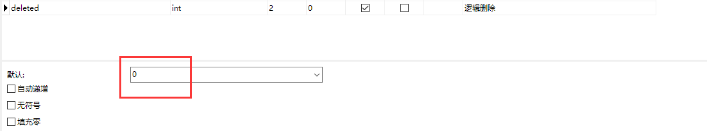
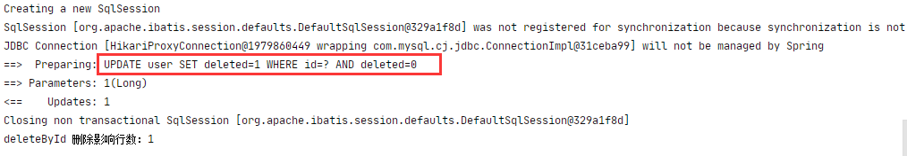
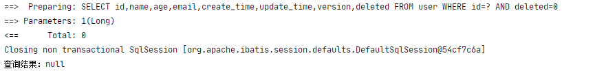
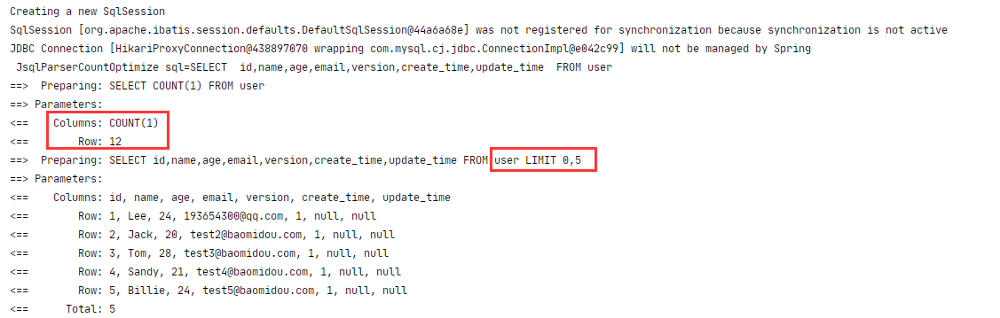
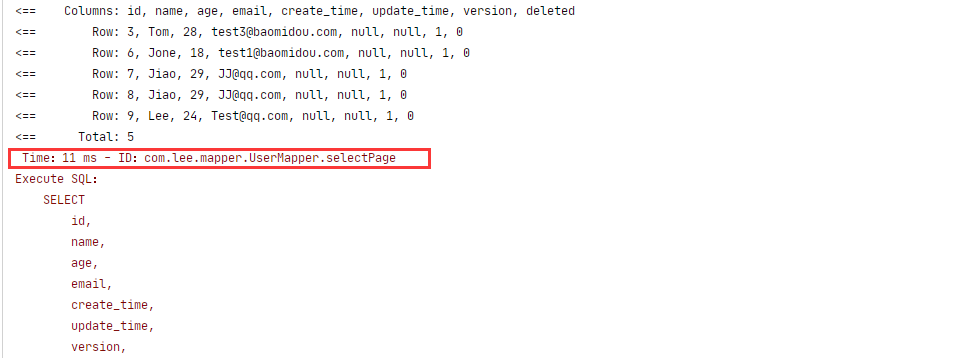
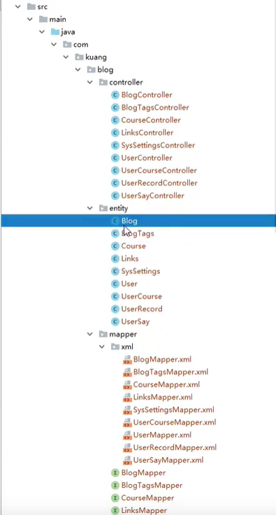

## 1、MyBatis-Plus 简介

### 概述：

[MyBatis-Plus (opens new window)](https://github.com/baomidou/mybatis-plus)（简称 MP）是一个 [MyBatis (opens new window)](http://www.mybatis.org/mybatis-3/)的增强工具，在 MyBatis 的基础上只做增强不做改变，为简化开发、提高效率而生

常用的开源组件：JPA、tk-mapper、MyBatisPlus


>   愿景
>
>   我们的愿景是成为 MyBatis 最好的搭档，就像 [魂斗罗](https://mp.baomidou.com/img/contra.jpg) 中的 1P、2P，基友搭配，效率翻倍


### 特性

-   **无侵入**：只做增强不做改变，引入它不会对现有工程产生影响，如丝般顺滑
-   **损耗小**：启动即会自动注入基本 CURD，性能基本无损耗，直接面向对象操作
-   **强大的 CRUD 操作**：内置通用 Mapper、通用 Service，仅仅通过少量配置即可实现单表大部分 CRUD 操作，更有强大的条件构造器，满足各类使用需求
-   **支持 Lambda 形式调用**：通过 Lambda 表达式，方便的编写各类查询条件，无需再担心字段写错
-   **支持主键自动生成**：支持多达 4 种主键策略（内含分布式唯一 ID 生成器 - Sequence），可自由配置，完美解决主键问题
-   **支持 ActiveRecord 模式**：支持 ActiveRecord 形式调用，实体类只需继承 Model 类即可进行强大的 CRUD 操作
-   **支持自定义全局通用操作**：支持全局通用方法注入（ Write once, use anywhere ）
-   **内置代码生成器**：采用代码或者 Maven 插件可快速生成 Mapper 、 Model 、 Service 、 Controller 层代码，支持模板引擎，更有超多自定义配置等您来使用
-   **内置分页插件**：基于 MyBatis 物理分页，开发者无需关心具体操作，配置好插件之后，写分页等同于普通 List 查询
-   **分页插件支持多种数据库**：支持 MySQL、MariaDB、Oracle、DB2、H2、HSQL、SQLite、Postgre、SQLServer 等多种数据库
-   **内置性能分析插件**：可输出 Sql 语句以及其执行时间，建议开发测试时启用该功能，能快速揪出慢查询
-   **内置全局拦截插件**：提供全表 delete 、 update 操作智能分析阻断，也可自定义拦截规则，预防误操作


### 框架结构


## 2、快速入门

官方快速入门地址：

​	https://baomidou.com/guide/quick-start.html#%E5%88%9D%E5%A7%8B%E5%8C%96%E5%B7%A5%E7%A8%8B


#### 步骤

##### 1、创建一个 Spring Boot 项目


##### 2、使用MySQL5.7 版本创建一个数据库

-   创建表

    ```sql
    DROP TABLE IF EXISTS user;
    
    CREATE TABLE user
    (
    	id BIGINT(20) NOT NULL COMMENT '主键ID',
    	name VARCHAR(30) NULL DEFAULT NULL COMMENT '姓名',
    	age INT(11) NULL DEFAULT NULL COMMENT '年龄',
    	email VARCHAR(50) NULL DEFAULT NULL COMMENT '邮箱',
    	PRIMARY KEY (id)
    );
    --阿里云 真实开发环境中,version(乐观锁),deleted(逻辑删除),gmt_create,gmt_modified
    ```

-   插入数据

    ```java
    DELETE FROM user;
    
    INSERT INTO user (id, name, age, email) VALUES
    (1, 'Jone', 18, 'test1@baomidou.com'),
    (2, 'Jack', 20, 'test2@baomidou.com'),
    (3, 'Tom', 28, 'test3@baomidou.com'),
    (4, 'Sandy', 21, 'test4@baomidou.com'),
    (5, 'Billie', 24, 'test5@baomidou.com');
    ```

##### 3、在 Maven 中导入依赖

```xml
<!--mysql-->
<dependency>
    <groupId>mysql</groupId>
    <artifactId>mysql-connector-java</artifactId>
</dependency>

<!--lombok-->
<dependency>
    <groupId>org.projectlombok</groupId>
    <artifactId>lombok</artifactId>
</dependency>

<!--mybatis-plus-->
<dependency>
    <groupId>com.baomidou</groupId>
    <artifactId>mybatis-plus-boot-starter</artifactId>
    <version>3.0.5</version>
</dependency>
```

>   我们使用mybatis-plus 可以节省我们大量的代码,尽量不要同时导入mybatis和mybatis-plus因为版本有差异!

##### 4、连接数据库这一步和mybatis相同

```yaml
# mysql 5 驱动不同  com.mysql.jdbc.Driver
# mysql 8 驱动不同 com.mysql.cj.jdbc.Driver . 需要增加时区的配置 serverTimezone=GMT%2B8
spring:
  datasource:
    username: root
    password: Lee193654300_
    url: jdbc:mysql://192.168.0.188:3306/mybatis_plus?useSSL=false&useUnicode=true&characterEncoding=utf-8
    driver-class-name: com.mysql.cj.jdbc.Driver
```

##### 5、创建我们的 entity 实体类


```java
@Data
@AllArgsConstructor  //自动生成有参构造函数
@NoArgsConstructor   //自动生成无参构造函数
public class User {
    private Long id;
    private String name;
    private Integer age;
    private String email;
}
```

##### 6、创建我们的mapper接口

```java
//在对应的mapper上面继承基本的类 BaseMapper
@Repository//代表持久层
public interface UserMapper extends BaseMapper<User> {
    //所有CRUD操作都已经编写完成了
    //你不需要向以前一样配置一大堆文件了!
}
```

>   需要在主启动类`MybatisPlusApplication`上扫描我们Mapper包下的所有接口


##### 7、在测试类中进行测试


输出结果如下


## 3、配置日志

>   ```yaml
>   #配置Mybatis控制台输出SQL执行日志、开发环境使用
>   mybatis-plus:
>     configuration:
>       log-impl: org.apache.ibatis.logging.stdout.StdOutImpl
>   ```

mybatis-plus默认控制台是不打印日志输出的


## 4、CRUD接口

### 1、查询操作

---


##### 1、selectById

```java
User user = userMapper.selectById(1377433485353971714L);
```


##### 2、selectBatchId

```java
userMapper.selectBatchIds(Arrays.asList(1, 2, 3)).forEach(k ->{
      System.out.println("BatchIds 查询用户：" + k);
});
```

控制台输出：

##### 3、selectByMap

```java
userMapper.selectByMap(new HashMap<String, Object>() {
   {
      put("name", "Lee");
      put("age", "24");
   }
}).forEach(k ->{
   System.out.println("selectByMap 查询用户：" + k);
});
```

控制台输出：


### 2、删除操作

---


```java
    /**
     * MyBatisPlus 删除操作
     */
    @Test
    void testMyBatisPlusDelete(){
        //单条删除
        int result = userMapper.deleteById(1377433485353971714L);
        System.out.println("deleteById 删除影响行数：" + result);

        //批量删除
        int batchResult = userMapper.deleteBatchIds(Arrays.asList(5, 4));
        System.out.println("batchResult 删除影响行数：" + batchResult);

        //条件删除
        int mapResult = userMapper.deleteByMap(new HashMap<String, Object>() {
            {
                put("name", "Jack");
            }
        });

        System.out.println("mapResult 删除影响行数：" + mapResult);
    }
```


### 3、逻辑删除

---

1、在数据库中添加一个字段 deleted、注意默认值为0




2、实体类中增加属性

```java
//逻辑删除注解
@TableLogic
private Integer deleted;
```


3、配置逻辑删除组件**(新版本无需)**

```java
//注册逻辑删除
@Bean
public ISqlInjector sqlInjector(){
    return new LogicSqlInjector();
}
```


4、yaml文件中配置

```yaml
#Mybatis-plus配置
mybatis-plus:
  #配置MyBatis-plus逻辑删除组件
  global-config:
    db-config:
      logic-delete-field: flag  # 全局逻辑删除的实体字段名(since 3.3.0,配置后可以忽略不配置步骤2)
      logic-delete-value: 1 # 逻辑已删除值(默认为 1)
      logic-not-delete-value: 0 # 逻辑未删除值(默认为 0)
```


5、执行逻辑删除测试

```java
    /**
     * MyBatisPlus 逻辑删除操作
     */
    @Test
    void testMyBatisPlusLogicDelete(){
        //单条删除
        int result = userMapper.deleteById(1L);
        System.out.println("deleteById 删除影响行数：" + result);
    }
```

控制台输出其实已经是修改语句了




**当然、我们再去查询的时候、MyBatisPlus会帮助我们自动过滤掉已经逻辑删除掉的字段**





### 4、条件构造器

```java
@SpringBootTest
public class WrapperTest {

    @Autowired(required = false)
    private UserMapper userMapper;

    @Test
    void contextLoads() {
        /**
         * 查询 name、email 不为空、并且年龄大等于 20 岁的用户
         *   ge() 大等于
         */
        QueryWrapper<User> wrapper = new QueryWrapper<>();
        wrapper.isNotNull("name")
                .isNotNull("email").ge("age", 20);

        userMapper.selectList(wrapper).forEach(System.out::println);
    }

    @Test
    void test2(){

        /**
         * 查询名字为 Lee 的用户
         * eq() 等于
         */
        QueryWrapper<User> wrapper = new QueryWrapper<>();
        wrapper.eq("name", "Tom");
        /**
         * selectOne()
         *   只查询一个符合条件的数据，如果结果集大于1、报异常
         */
        System.out.println(userMapper.selectOne(wrapper));
    }

    @Test
    void test3(){
        /**
         * 查询年龄在 18 ~ 25 之间的用户
         */
        QueryWrapper<User> wrapper = new QueryWrapper<>();
        wrapper.between("age", 18, 25);

        //只查询结果数
        Integer count = userMapper.selectCount(wrapper);
        System.out.println(count);
    }

    @Test
    void Test4(){
        /**
         * 模糊查询
         * notLike() -> not like '%值%'
         * likeRight() -> like '值%'
         */
        QueryWrapper<User> wrapper = new QueryWrapper<>();
        wrapper.notLike("name", "L").likeRight("name", "J");

        List<Map<String, Object>> maps = userMapper.selectMaps(wrapper);
        maps.forEach(System.out::println);
    }

    @Test
    void Test5(){
        /**
         * inSql()
         *   id 在子查询中查出来
         *
         *   实际执行的SQL
         *     SELECT id, name, age, email, create_time, update_time, version, deleted FROM user
         *     WHERE deleted = 0 AND id IN (select id from user where id < 5)
         */
        QueryWrapper<User> wrapper = new QueryWrapper<>();
        wrapper.inSql("id","select id from user where id < 5");

        List<Object> objects = userMapper.selectObjs(wrapper);
        objects.forEach(System.out::println);
    }

    @Test
    void Test6(){
        /**
         * orderByAsc()
         *   通过id进行排序
         */
        QueryWrapper<User> wrapper = new QueryWrapper<>();
        wrapper.orderByAsc("id");

        List<User> users = userMapper.selectList(wrapper);
        users.forEach(System.out::println);
    }
}
```


更多条件构造器参考官网：

https://baomidou.com/guide/wrapper.html#abstractwrapper


## 5、插件和扩展

```java
	@Test
    void insertUser(){
        User user = new User("Lee", 24, "193654300@qq.com");
        int result = userMapper.insert(user);
        System.out.println("插入结果：" + result);
        System.out.println("生成ID：" + user.getId());
    }
```


>   这里插入 user 之后、会自动生成ID、并且ID会回填至 user 类


### 1、主键生成策略

---


>   默认 ID_WORKER 全局唯一id
>
>   对应数据库中的主键(uuid.自增id.雪花算法.redis.zookeeper)

分布式系统唯一id生成参考:  https://www.cnblogs.com/haoxinyue/p/5208136.html


#### 1、雪花算法 

>   Twitter 的 snowflake 算法

snowflake 是 Twitter 开源的分布式 ID 生成算法，结果是一个 long 型的 ID


其核心思想是：

-   使用41bit作为毫秒数
-   10bit作为机器的ID（5个bit是数据中心，5个bit的机器ID）
-   12bit作为毫秒内的流水号（意味着每个节点在每毫秒可以产生 4096 个 ID）
-   最后还有一个符号位，永远是0.可以保证几乎全球唯一


#### 2、主键自增

需要把要自增的实体、中的 id 加个注解 @TableId

```java
//数据库id的生成方式 [ uuid、自增、雪花算法、redis生成、zookeeper生成 ]
@TableId(value = "id", type = IdType.AUTO)
private Long id;
```

[另外需要特别注意：主键要写成包装类的Long主键生成粗略才会起效]: null


数据库主键需要改成自增：


#### 3、其它主键策略

```java
public enum IdType {
    AUTO(0),//数据库ID自增
    NONE(1),//该类型为未设置主键类型
    INPUT(2),//用户自己设置ID
      		 //该类型可以通过自己注册自动填充插件进行填充
    
	//以下3种类型、只有当插入对象 ID 为空，才自动填充
    ID_WORKER(3),  //全局唯一ID (数字版)
    UUID(4),       //全局唯一ID (UUID)
    ID_WORKER_STR(5);//字符串全局唯一ID (idWorker的字符串表示)
}
```


### 2、更新数据和自动填充

---

我们分别执行以下更新操作：

```java
    @Test
    void updateUser(){
        Long userId = 1377433485353971714L;

        User user = new User();
        user.setAge(20);
        user.setId(userId);

        /**
         * updateById 这里传入的是一个user对象
         */
        int result = userMapper.updateById(user);
        System.out.println("更新受影响行数：" + result);
    }
```

```java
    @Test
    void updateUser(){
        Long userId = 1377433485353971714L;

        User user = new User();
        user.setAge(20);
        user.setName("LoveJJ");
        user.setId(userId);

        /**
         * updateById 这里传入的是一个user对象
         */
        int result = userMapper.updateById(user);
        System.out.println("更新受影响行数：" + result);
    }
```

>   第二段代码比第一段代码多更新了一个 name 字段、所以 MyBatis-Plus 会帮助我们动态的拼接需要更新的SQL字段、如下日志输出可以看到


### 3、自动填充

---

#### 1、数据库级别填充

数据库中添加两个字段、创建时间 . 修改时间


这些操作自动化完成的,我们不希望手动更新

需要先在MySQL数据库中 把 **update_time 设置为自动更新 、并且两个时间赋予默认值即可 CURRENT_TIMESTAMP 即可**


>   注意：阿里巴巴开发手册: 所有的数据库表: gmt_create. gmt_modified 几乎所有的表都要配置上、而且需要自动化


然后我们需要在实体类中同步这两个字段

```java
import java.util.Date    

	private Date createTime;
    private Date updateTime;
```


我们在执行更新操作：可以看到日志输出已经更新成功


并查看DB数据库、看到时间戳也随着更新一并执行


#### 2、代码级别填充

---


>   我们要使用代码级别的更新、首先需要把数据库的 create_time 和 update_time 的默认值删除、并把 update_time 的自动更新关闭


我们在字段上添加注解填充规则

```java
    //字段添加填充规则
    //用 java.util.date 下的包
    @TableField(fill = FieldFill.INSERT)
    private Date createTime;
    @TableField(fill = FieldFill.INSERT_UPDATE)
    private Date updateTime;
```


并编写一个处理器来处理这个注解

```java
package com.lee.handler;

import com.baomidou.mybatisplus.core.handlers.MetaObjectHandler;
import lombok.extern.slf4j.Slf4j;
import org.apache.ibatis.reflection.MetaObject;
import org.springframework.stereotype.Component;

import java.util.Date;

/**
 * MyBatis-Plus 字段自动填充
 *   代码实现
 */
@Slf4j
@Component  //将处理器加到IOC容器
public class MyMetaObjectHandler implements MetaObjectHandler {
    /**
     * 插入时的填充策略
     * @param metaObject
     */
    @Override
    public void insertFill(MetaObject metaObject) {
        log.info("Start insert fill.... ");
        this.setFieldValByName("createTime", new Date(), metaObject);
        this.setFieldValByName("updateTime", new Date(), metaObject);
    }

    /**
     * 更新时的填充策略
     * @param metaObject
     */
    @Override
    public void updateFill(MetaObject metaObject) {
        log.info("Start update fill.... ");
        this.setFieldValByName("updateTime", new Date(), metaObject);
    }
}
```

然后进行测试更新操作、可以看到日志控制台SQL更新了修改时间字段


### 4、乐观锁

---


>   乐观锁：顾名思义十分乐观,他总是认为不会出现问题,无论干什么都不去上锁!如果出现了问题,再次更新值测试
>
>   悲观锁：顾名思义十分悲观,他总是认为出现问题,无论干什么都会上锁!再去操作!


我们这里主要讲解、乐观锁机制


乐观锁的实现方式：

-   取出记录时、获取当前的 version
-   更新时、带上这个 version
-   执行更新时、set version = newVersion where version = oldVersion
-   如果 version 不对、那么就更新失败


如下详细代码步骤演示

```sql
-- 乐观锁：
-- A、B 线程都查询，获得版本号 version 为 1

-- 线程 A 执行更新
update user set name = 'Lee', version = version + 1 where id = 2 and version = 1;

-- 线程 B 抢先更新成功、这个时候 version 就会为 2，A 线程的更新条件就不成立了
update user set name = 'LJJ', version = version + 1 where id = 2 and version = 1;
```


实现步骤：

1、在数据库中添加 version 字段 代表乐观锁。默认值设置为 1


2、在实体类User中添加 version 字段，并添加MyBatisPlus的 @Version 乐观锁注解

```java
    //乐观锁注解
    @Version
    private Integer version;
```


>   说明:
>
>   -   **支持的数据类型只有:int, Integer, long, Long, Date, Timestamp, LocalDateTime**
>   -   整数类型下 `newVersion = oldVersion + 1`
>   -   `newVersion` 会回写到 `entity` 中
>   -   仅支持 `updateById(id)` 与 `update(entity, wrapper)` 方法
>   -   **在 `update(entity, wrapper)` 方法下, `wrapper` 不能复用!!!**


3、编写config配置类

```java
package com.lee.config;

import com.baomidou.mybatisplus.extension.plugins.OptimisticLockerInterceptor;
import org.mybatis.spring.annotation.MapperScan;
import org.springframework.context.annotation.Bean;
import org.springframework.context.annotation.Configuration;
import org.springframework.transaction.annotation.EnableTransactionManagement;

@MapperScan("com.lee.mapper")
@EnableTransactionManagement //自动事务管理
@Configuration //SpringBoot 配置类
public class MyBatisPlusConfig {
    ///注册乐观锁插件
    @Bean
    public OptimisticLockerInterceptor optimisticLockerInterceptor(){
        return new OptimisticLockerInterceptor();
    }
}
```

**这里需要把SpringBoot的启动类的 @MapperScan()注解放到 配置类上**


4、编写测试用例

```java
    /**
     * 测试乐观锁
     */
    @Test
    void testOptimisticLocking(){

        //模拟线程A
        User user1 = userMapper.selectById(1377433485353971714L);
        user1.setAge(20);
        user1.setName("乐观锁111");

        //模拟线程B
        User user2 = userMapper.selectById(1377433485353971714L);
        user2.setAge(20);
        user2.setName("乐观锁222");

        //线程B先执行更新
        int result2 = userMapper.updateById(user2);
        System.out.println("222更新受影响行数：" + result2);

        /**
         * 线程A后执行更新
         * 线程A可以使用自旋锁来多次尝试提交
         */
        int result1 = userMapper.updateById(user1);
        System.out.println("111更新受影响行数：" + result1);
    }
```


我们可以看到控制台输出、则线程B先执行成功、而线程A后执行则失败


### 5、分页查询

---

分页在网站上使用的十分之多

>   原生 limit 进行分页
>
>   pageHelper 第三方插件
>
>   MyBatisPlus也内置了分页插件


#### 如何使用？

配置拦截器组件：

```java
@MapperScan("com.lee.mapper")
@EnableTransactionManagement //自动事务管理
@Configuration //SpringBoot 配置类
public class MyBatisPlusConfig {
    ///注册乐观锁插件
    @Bean
    public OptimisticLockerInterceptor optimisticLockerInterceptor(){
        return new OptimisticLockerInterceptor();
    }

    //分页插件
    @Bean
    public PaginationInterceptor paginationInterceptor(){
        return new PaginationInterceptor();
    }
}
```

使用 page 对象即可

```java
	@Test
    void testPage(){
        /**
         * 参数1：当前页
         * 参数2：页面大小
         * 使用了分页插件后，所有的分页操作也变得很简单
         */
        Page<User> userPage = new Page<>(1, 5);
        userMapper.selectPage(userPage, null);

        //获取查询的分页数据
        List<User> records = userPage.getRecords();
        records.forEach(System.out::println);
    }
```

查看控制台SQL输出、其实也是用的 Limit 进行的分页操作




### 6、性能分析插件(危)

我们在平时的开发中、会遇到一些慢SQL、这时候就可以用性能分析插件、用于输出每条SQL语句的执行时间

MP也提供性能分析插件、如果超过这个时间就停止运行

>   可惜的是3.0.5以上版本移除掉了这个功能、目前官网看不到任何 性能分析 的插件了
>


1、导入插件

```java
    @Bean
    @Profile({"dev","test"}) //设置dev 和 test环境开启
    public PerformanceInterceptor performanceInterceptor(){
        PerformanceInterceptor performanceInterceptor = new PerformanceInterceptor();
        //ms 设置SQL执行最大的时间、超过这个时间就报错了
        performanceInterceptor.setMaxTime(1);
        //设置SQL是否格式化
        performanceInterceptor.setFormat(true);
        return performanceInterceptor;
    }
```


2、配置yaml设置开发环境

```yaml
spring:
  #设置开发环境
  profiles:
    active: dev
```


3、进行查询测试、输出




### 7、代码自动生成器


>   dao、pojo、service、controller都给我自己去编写完成！
>
>   AutoGenerator 是 MyBatis-Plus 的代码生成器，通过 AutoGenerator 可以快速生成 Entity、
>
>   Mapper、Mapper XML、Service、Controller 等各个模块的代码，极大的提升了开发效率。
>
>   只需要改实体类名字 和包名 还有 数据库配置即可


```java
import com.baomidou.mybatisplus.annotation.DbType;
import com.baomidou.mybatisplus.annotation.FieldFill;
import com.baomidou.mybatisplus.annotation.IdType;
import com.baomidou.mybatisplus.annotation.TableField;
import com.baomidou.mybatisplus.generator.AutoGenerator;
import com.baomidou.mybatisplus.generator.config.DataSourceConfig;
import com.baomidou.mybatisplus.generator.config.GlobalConfig;
import com.baomidou.mybatisplus.generator.config.PackageConfig;
import com.baomidou.mybatisplus.generator.config.StrategyConfig;
import com.baomidou.mybatisplus.generator.config.po.TableFill;
import com.baomidou.mybatisplus.generator.config.rules.DateType;
import com.baomidou.mybatisplus.generator.config.rules.NamingStrategy;
import java.util.ArrayList; 

// 代码自动生成器 
public class KuangCode {
public static void main(String[] args) {
    // 需要构建一个 代码自动生成器 对象 
    AutoGenerator mpg = new AutoGenerator(); 
    
    // 配置策略 
    // 1、全局配置 
    GlobalConfig gc = new GlobalConfig();
    String projectPath = System.getProperty("user.dir"); 
    gc.setOutputDir(projectPath+"/src/main/java");
    gc.setAuthor("狂神说"); gc.setOpen(false);
    gc.setFileOverride(false);
    
    // 是否覆盖
    gc.setServiceName("%sService");
    
    // 去Service的I前缀
    gc.setIdType(IdType.ID_WORKER);
    gc.setDateType(DateType.ONLY_DATE);
    gc.setSwagger2(true);
    mpg.setGlobalConfig(gc);
    
    //2、设置数据源
    DataSourceConfig dsc = new DataSourceConfig();
    dsc.setUrl("jdbc:mysql://localhost:3306/kuang_community? useSSL=false&useUnicode=true&characterEncoding=utf-8&serverTimezone=GMT%2B8");
    dsc.setDriverName("com.mysql.cj.jdbc.Driver");
    dsc.setUsername("root");
    dsc.setPassword("123456");
    dsc.setDbType(DbType.MYSQL); mpg.setDataSource(dsc);
    
    //3、包的配置
    PackageConfig pc = new PackageConfig();
    //只需要改实体类名字 和包名 还有 数据库配置即可
    pc.setModuleName("blog"); pc.setParent("com.kuang");
    pc.setEntity("entity"); pc.setMapper("mapper");
    pc.setService("service"); pc.setController("controller");
    mpg.setPackageInfo(pc);
    
    //4、策略配置
    StrategyConfig strategy = new StrategyConfig();
    strategy.setInclude("blog_tags","course","links","sys_settings","user_record"," user_say");
    
    // 设置要映射的表名
    strategy.setNaming(NamingStrategy.underline_to_camel);
    strategy.setColumnNaming(NamingStrategy.underline_to_camel);
    strategy.setEntityLombokModel(true);
    
    // 自动lombok；
    strategy.setLogicDeleteFieldName("deleted"); 
    
    // 自动填充配置
    TableFill gmtCreate = new TableFill("gmt_create", FieldFill.INSERT);
    TableFill gmtModified = new TableFill("gmt_modified", FieldFill.INSERT_UPDATE);
    ArrayList<TableFill> tableFills = new ArrayList<>();
    tableFills.add(gmtCreate); tableFills.add(gmtModified);
    strategy.setTableFillList(tableFills);
    
    // 乐观锁
    strategy.setVersionFieldName("version");
    strategy.setRestControllerStyle(true);
    strategy.setControllerMappingHyphenStyle(true);
    
    // localhost:8080/hello_id_2 
    mpg.setStrategy(strategy);
    mpg.execute(); //执行 
	}
}
```


生成效果：




