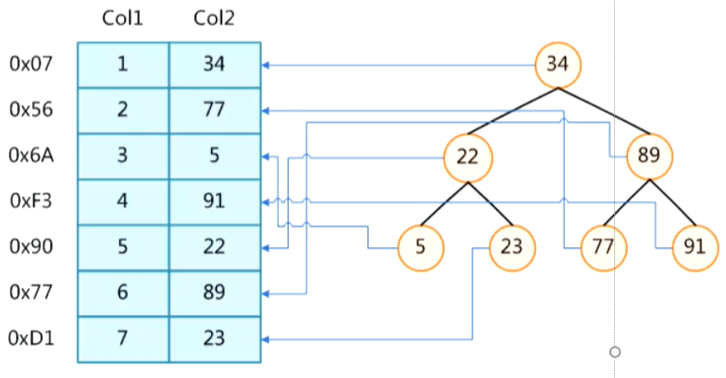
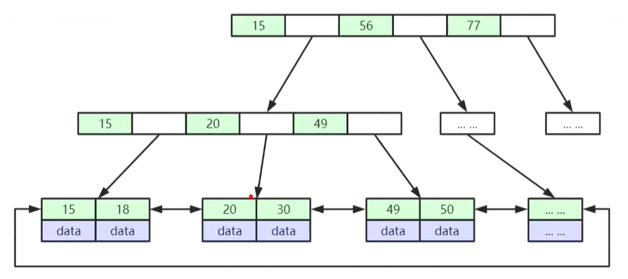
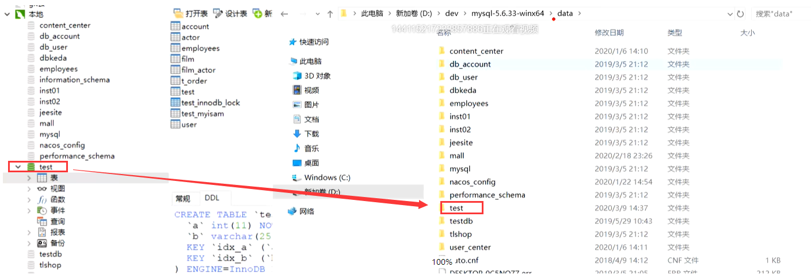

## 1、MySql 索引结构详解：


### 1、索引的本质是什么？


>   索引是帮住 MySql（数据库） 高校获取数据的 **排好序 的 数据结构**




>   思考：索引数据结构为什么不是：二叉树、红黑树、Hash表、B - Tree ？
>

因为二叉树首先极端情况下会退化为链表（比如插入依次递增的数据）并且高度不可控就意味者磁盘 IO 次数增加消耗性能、平衡二叉树和红黑树虽然解决了退化成了链表的问题、但是高度依然不可控、在大数据量的情况下磁盘 IO 性能拉跨、正好 B Tree 结构横向扩展了节点的存储空间、就可以放更多的索引元素，既节省了 IO 次数、又极大的提升了整体性能


### 2、B-Tree 类的数据结构


#### 1、B - Tree 介绍


-   叶子几点具有相同的深度
-   叶子节点的指针为空
-   所有索引元素不重复
-   节点中的数据索引从左到右递增排列


#### 2、B + Tree 介绍


-   非叶子节点不存储 data 、只存储索引、可以放更多的索引
-   叶子节点包含所有索引字段
-   叶子节点用指针连接、提高区间访问的性能



B+ Tree 其实在叶子节点还有前后指向两边的指针、指针指向下一个叶子节点的磁盘上的位置信息，一个节点的索引数据 MySql  默认分配的是 16 kb 大小、一般 B+ Tree 的一个节点 Load 到内存等于做一次磁盘 IO 和 在内存中定位数据所在节点中的位置要慢很多，因为在内存中节点数据也是从左到右依次递增的、所以可以采取一些算法（比如折半查找）耗费的性能几乎可以忽略不记

>   那么 16 kb 的页大小可以放多少个索引呢？下面以 BigInt（ 在 MySql 中占用 8 个 Byte ） 类型来算
>

每个节点元素里还会存储下一个节点的磁盘指针地址、大概占用 6 Byte，那么就是 16kb / (8 + 6) Byte ≈ 1170 个索引元素、这是一个页大小还不是叶子节点、假如叶子节点数据很大、一行的记录几十个字段一般不会超过 1 kb 的大小加上前后指针顶多 12 Byte 、一张 B+ Tree 数据结构能存储 1170 * 1170 * 16 ≈ 2190 万条记录、那么通过 3 次磁盘 IO 就可以在两千万多条记录定位到一条指定的数据

可通过以下 Sql 查看页码大小 (不推荐修改) 

```java
Show Global Status Like 'Innodb_page_size';
```


#### 3、索引在磁盘上的存储位置


>   默认在 MySql 的安装目录中的 data 目录中


>   一般来说一个库对应一个文件夹：如下图直观所示




