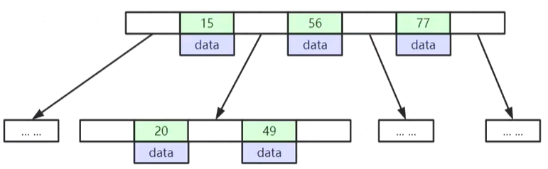
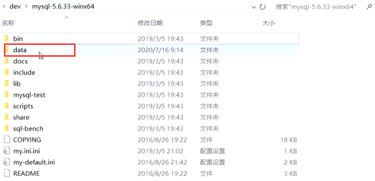
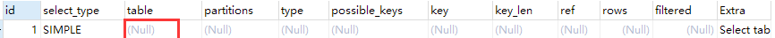
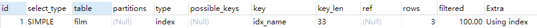
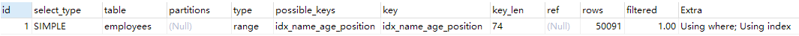

## 1、MySql 的整体架构


### 1、MySQL 的架构图


如果能在头脑中构建出一幅 MySQL 各组件之间如何协同工作的架构图，就会有助于深入理解 MySQL 服务器。如下图展示了 MySQL 的逻辑架构图


### 2、最上层 <客户端>


最上层的服务并不是 MySQL 所独有的，大多数基于网络的客户端/服务器的工具或者服务都有类似的架构。比如连接处理、授权认证、安全等等。


### 3、第二层 <查询缓存 | 解析器>


括连接器、查询缓存、分析器、优化器、执行器等，涵盖 mysql 的大多数核心服务功能，以及所有的内置函数（例如日期、世家、数 学和加密函数等），所有跨存储引擎的功能都在这一层实现，比如存储过程、触发器、视图等


### 4、第三层 <存储引擎>


负责数据的存储和提取，是真正与底层物理文件打交道的组件。 数据本质是存储在磁盘上的，通过特定的存储引擎对数据进行有组织的存放并根据业务需要对数据进行提取。存储引擎的架构模式是插件式的，支持 Innodb，MyIASM、Memory 等多个存储引擎。现在最常用的存储引擎是 Innodb，它从 mysql5.5.5 版本开始成为了默认存储引擎


### 5、第四层 <物理层面>


存储数据库真正的表数据、日志等。物理文件包括：redolog、undolog、binlog、errorlog、querylog、slowlog、data、index等


## 2、MySql 索引结构详解：


### 1、索引的通俗介绍？


#### 1、索引是什么？


>   索引是帮住 MySql（数据库） 高校获取数据的 **排好序 的 数据结构**


#### 2、索引为什么不是其它数据结构？


>   思考：索引数据结构为什么不是：二叉树、红黑树、Hash表、B - Tree ？
>

因为二叉树首先极端情况下会退化为链表（比如插入依次递增的数据）并且高度不可控就意味者磁盘 IO 次数增加消耗性能、平衡二叉树和红黑树虽然解决了退化成了链表的问题、但是高度依然不可控、在大数据量的情况下磁盘 IO 性能拉跨、正好 B Tree 结构横向扩展了节点的存储空间、就可以放更多的索引元素，既节省了 IO 次数、又极大的提升了整体性能


### 2、B-Tree 类的数据结构


#### 1、B - Tree 介绍


-   叶子几点具有相同的深度
-   叶子节点的指针为空
-   所有索引元素不重复
-   节点中的数据索引从左到右递增排列




#### 2、B + Tree 介绍


-   非叶子节点不存储 data 、只存储索引、可以放更多的索引
-   叶子节点包含所有索引字段
-   叶子节点用指针连接、提高区间访问的性能


B+ Tree 其实在叶子节点还有前后指向两边的指针、指针指向下一个叶子节点的磁盘上的位置信息，一个节点的索引数据 MySql  默认分配的是 16 kb 大小、一般 B+ Tree 的一个节点 Load 到内存等于做一次磁盘 IO 和 在内存中定位数据所在节点中的位置要慢很多，因为在内存中节点数据也是从左到右依次递增的、所以可以采取一些算法（比如折半查找）耗费的性能几乎可以忽略不记

>   那么 16 kb 的页大小可以放多少个索引呢？下面以 BigInt（ 在 MySql 中占用 8 个 Byte ） 类型来算
>

每个节点元素里还会存储下一个节点的磁盘指针地址、大概占用 6 Byte，那么就是 16kb / (8 + 6) Byte ≈ 1170 个索引元素、这是一个页大小还不是叶子节点、假如叶子节点数据很大、一行的记录几十个字段一般不会超过 1 kb 的大小加上前后指针顶多 12 Byte 、一张 B+ Tree 数据结构能存储 1170 * 1170 * 16 ≈ 2190 万条记录、那么通过 3 次磁盘 IO 就可以在两千万多条记录定位到一条指定的数据

可通过以下 Sql 查看页码大小 (不推荐修改) 

```java
Show Global Status Like 'Innodb_page_size';
```


#### 3、索引在磁盘上的存储位置


>   默认在 MySql 的安装目录中的 data 目录中



>   一般来说一个库对应一个文件夹：如下图直观所示


>   一个库里的数据库磁盘文件就在这个文件夹下，存储了包括数据、表结构、索引等信息


#### 4、B+ Tree 和 B - Tree 的区别 ？


>   B+ Tree 和 B - Tree 的区别 ？以及 MySql 为什么用 B+ Tree 作为索引的数据结构 ?


首先最大的区别是 B - Tree 的节点每个都是存储数据的，而 B+ Tree 只有叶子节点才存储数据

这样会有什么问题呢？最大的问题就是假如每行的索引数据 1 kb 大小放到 B - Tree 中，每页的大小 16kb、那么每个节点只能存储 16 个元素、那么 2000 万的数据存储到这里高度不可控、高度会达到一个很大的数字、这时候你在做磁盘IO 一次一次定位性能严重拉跨、再一个 B+ Tree 支持叶子节点的区间访问、因为存储了前后两个节点的磁盘指针地址


第二：就是 MySql 在 B+ Tree 的叶子节点实现了类似双向循环链表一样的指针，相互指向前后的元素，这样 B+ Tree 在做范围查询的时候，在叶子节点可以直接获取相邻节点的数据，无需从根节点重新查找，而 B - Tree 就不支持这样的特性


### 3、 MylSAM 和 InnoDB 存储引擎


#### 1、MylSAM 存储引擎


##### 1、MylSAM 索引实现


>   MylSAM （非聚集索引）索引文件和数据文件是分离的、如下图所示


MylSAM 引擎的索引文件是存储在 .MYI 后缀的文件中的、表的数据在 .MYD 后缀的文件中的. 当通过索引来找一条数据时，先通过 B+ Tree 找到数据所在的叶子节点、再拿到叶子节点存储的磁盘指针指向 MYD 文件中数据所在的行. 如下图


#### 2、InnoDB 存储引擎


##### 1、InnoDB 索引实现


InnoDB（聚集索引） 引擎下的表数据文件本身就是一个按照 B+ Tree 组织的一个索引结构文件

聚集索引：叶节点包含了完整的表数据记录


InnoDB 的磁盘文件


##### 2、思考一些问题


>   1、为什么建议 InnoDB 表必须建立主键？

因为 InnoDB 模式下一张表的构建本来就是按照 B+ Tree 结构来构建的整一张表、有主键的话就按照主键来建造索引、如果没有主键 MySql 会从第一列开始往后选每个元素都不想等的列作为索引，如果找不到 MySql 会自己造一个隐藏列来当索引。


>   2、为什么推荐使用整型的自增主键 ？

因为在通过索引查找一个元素的时候，需要比对数据的大小和区间来定位数据的所在位置，整形的比对速度要比字符串的速度要高很多

推荐自增主键的原因：B+ Tree 本身就会将插入的元素排好序维护一个结构，如果非自增的索引插入假如正好插入到节点区间，可能会不断的造成 B+ Tree 为了维护性质而做过多的分裂、融合等耗时操作、会有一部分性能损耗，自增索引正好都是插入到 B+ Tree 的右端不断新增节点，无需分裂


>   3、InnoDB 的主键（聚集）索引 和 非主键（二级）索引有什么区别呢？

MylSAM 的没什么区别，而 InnoDB 模式下，非主键索引的叶子节点里的值存储的就不是整整一列的数据了，而是这列的主键索引的值、如下图所示因为为了 **保持一致性和节约存储空间**。不然就有两个副本的列数据，插入更新操作都要相应的维护两套数据的成本大大增加


#### 3、两种存储引擎的区别


-   InnoDB 支持事务，MyISAM 不支持
-   InnoDB 支持外键，MyISAM 不支持
-   InnoDB 不支持 FULLTEXT 类型的索引 
-   InnoDB 中不保存表的行数
    -   如 select count() from table 时，InnoDB 需要扫描一遍整个表来计算有多少行，但是 MyISAM 只要简单的读出保存好的行数即可，注意的是，当 count() 语句包含 where 条件时 MyISAM 也需要扫描整个表 

-   对于自增字段，InnoDB 中必须包含只有该字段的索引，但是在 MyISAM 表中可以和其他字段一起建立联合索引

-   清空整个表时，InnoDB 是一行一行的删除，效率非常慢。MyISAM 则会重建表 

-   InnoDB 支持行锁（某些情况下还是锁整表，如 update table set a=1 where user like ‘％lee％’) MyISAM 是表锁

| -        | Innodb                                   | Myisam                                                 |
| -------- | ---------------------------------------- | ------------------------------------------------------ |
| 存储文件 | （1） .frm 表定义文件（2） .ibd 数据文件 | （1）.frm 表定义文（2）.myd 数据文件（3）.myi 索引文件 |
| 锁       | 表锁、行锁                               | 表锁                                                   |
| 事务     | ACID                                     | 不支持                                                 |
| CRDU     | 读、写                                   | 读多                                                   |
| count    | 扫表                                     | 专门存储的地方                                         |
| 索引结构 | B+ Tree                                  | B+ Tree                                                |


### 4、MySql 的 Hash 索引结构


#### 1、Hash 索引结构介绍


默认来说 MySql 的索引结构是 B+Tree 结构的，下面还有 HASH 结构的索引


>   对索引的 key 进行一次 hash 激素那就可以定位出数据存储的位置，很多时候 hash 索引要比 B+ 树索引更高效、缺点仅能满足 “=”、“IN”，不支持范围查询，hash 冲突问题、具体存储结构如下


### 5、索引的最左前缀原理


#### 1、联合索引底层结构是怎样的 ？


如下图所示的联合索引的存储结构，以下是联合主键索引的示例


建立联合索引的时候 MySql 会根据建立索引字段的先后顺序来建立索引的，在跳过了 name 字段，在 name 字段的值相等的区间是有序的，但是在整张表中跳过了第一个有序字段，后续字段无法保证其顺序性，所以走不了索引。例如以下的 Sql 会走索引的是第一条，因为你不能跳过第一个联合索引直接查 age 或者 position 字段就破坏了索引的有序性，这样是不会走索引的


>   跳过第一个联合索引的字段就不能走索引？

因为 MySql 构建 B+ Tree 联合索引的时候实先保证第一个索引的有序性进行构建，这样一来，剩余的索引字段就不一定有序，既然不能保证后续索引的有序性在跳过了第一个索引字段后因为无序性就不能通过索引查询、意味着只有通过全表扫描才能不遗漏的找到查询数据


## 3、Explain 分析与索引最佳实践


### 1、Explain 分析工具的简介


#### 1、Explain 官方文档介绍


使用 EXPLAIN 关键字可以模拟优化器执行 SQL 语句，分析你的查询语句或是结构的性能瓶颈. 在 Select 语句之前增加 Explain 关键字，MySQL 会在查询上设置一个标记执行查询会返回执行计划的信息，而不是执行这条SQL、注意：如果 from 中包含子查询，仍会执行该子查询，将结果放入临时表中

>   MySql 推荐版本 5.7.29 
>
>   Explain 官方使用文档链接：https://dev.mysql.com/doc/refman/5.7/en/explain-output.html


#### 2、Explain 的两个变种


explain extended：会在 explain 的基础上额外提供一些查询优化的信息，紧随其后通过 Show warnings 命令可以得到优化后的查询语句，从而看出优化器优化了什么额外还有 filtered 列，是一个半分比的值，rows * filtered / 100 可以估算出将要和 explain 中的前一个表进行连接的行数（前一个表指 explain 中的值比当前表 id 值小的表）

如下 Sql 语句

```sql
mysql> explain extended select * from film where id = 1;
```


```sql
mysql > show warnings
```


explain partitions：相比 explain 多了 partitions 字段、如果查询是基于分区表的话，会显示查询将访问的分区


### 2、Explain 分析中的列


接下来我们将展示 explain 中每个列的信息


#### 1、id 列


id 列的编号是 select 的序列号、有几个 select 就有几个 id，并且 id 的顺序是按 select 出现的顺序增长的。**id 列越大执行优先级越高**、id 相同则从上往下依次执行、其中 id 为 NULL 意味者最后执行


#### 2、select_type 列


>   表示对应行是简单还是复杂的查询其中包含以下类型（常用）：

-   **simple**：简单查询，查询不包含子查询和 union、例如 Sql 语句

```sql
mysql > explain select * from film where id = 2
```

-   **primary**：复杂查询中最外层的 select
-   **subquery**：包含在 select 中的子查询（不在 from 子句中）
-   **derived**：包含在 from 自居中的子查询、MySql 会将结果存放在一个临时表中，也成为衍生表（derived 的英文含义）
-   **union**：在 union 中的第二个和随后的 select . 如下：

```sql
mysql > explain select 1 union all select 1;
```


>   用以下例子来了解 primary 、 subquery 和 derived 类型的含义：

```sql
#关闭 mySql5.7 新特性对衍生表的合并优化
mysql > set session optimizer_switch = 'derived_merge = off';

mysql > 
explain select (select 1 from actor where id = 1) from (
    select * from film where id = 1 
) der;

# 还原默认配置
mysql > set session optimizer_switch = 'derived_merge=on'; 
```


#### 3、table 列


这一列表示 explain 的一行正在访问哪个表、当 from 子句中有子查询时，table 列是 <derivedN> 格式，表示当前查询依赖 id = N 的查询

于是先执行 id = N 的查询当有 union 时， UNION RESULT 的 table 列的值为 <union 1, 2>。1 和 2 表示参与 untion 的 select 行 id


#### 4、type 列 (常用的)


这一列表示关联类型或访问类型，即 MySql 决定如何查找表中的列，查找数据行记录的大概范围依照性能优先级从最优到最差分别为：

```sql
system > const > eq_ref > ref > range > index > ALL
```


>   **一般来说得保证查询达到 range 级别、最好达到 ref 级别**


##### 1、NULL（性能最优）：


表示 mysql 能够在优化阶段分解查询语句，在执行阶段用不着再访问表或索引，**例如查询索引列的最小值，可以单独查找索引来完成**，并不需要在执行时访问表

```sql
mysql > explain select min(id) from film;
```

>   分析结果如下：




##### 2、const、system


MySql 能对查询的某部分进行优化并将其转化成一个常量，**用于 primary key 或 unique key 的所有列与常数比较时**，所以表最多有一个匹配行，读取 1 次，速度比较快，**system 是 const 的特例，即表里只有一条元素匹配时为 system**

```sql
mysql > explain extended select * from (select * from film where id = 1) tmp;
```

>   分析结果如下：


##### 3、eq_ref


primary key 或者 unique key 索引的所有部分被连接使用、最多只会返回一条符合条件的记录，这可能是在 const 之外最好的联接类型了，**大白话就是用到了表的主键进行关联联合查询的类型**

```sql
mysql> explain select * from film_actor left join film on film_actor.film_id = film.id;
```

>   分析结果如下：


##### 4、ref


相比 rq_ref、不使用唯一索引，而是**使用普通索引或者唯一索引的部分前缀，索引要和某个值比较等**，可能会找到多个符合条件的行、如以下简单的查询语句，name 是普通索引（非唯一索引）

```sql
mysql > explain select * from film where name = 'film1';
```


>   关联表查询，possible_keys 的值 idx_film_actor_id 是 film_id 和 actor_id 的联合索引，这里使用到了 film_actor 的左边前缀 film_id 部分

```sql
mysql >  explain select film_id from film 
                     left join film_actor on film.id = film_actor.film_id;
```


##### 5、range


**范围扫描**通 常出现在 in()、between、>、<、>= 等操作中，使用一个索引来检索给定范围的行

```sql
mysql > explain select * from actor where id > 1
```


##### 6、index


**扫描全索引就能拿到结果**，一般是扫描某个二级索引、**这种扫描不会从索引树根节点开始快速查找，而是直接对二级索引的叶子节点遍历和扫描**，速度还是还是比较慢的、这种查询一般为使用覆盖索引、二级索引一般比较小、所以这种通常比 ALL 快一些

```sql
mysql > explain select * from film;
```




film 表只有 id 和 name 两个字段、其中 id 是 主键索引、name 是普通（二级）索引，即该表所有字段都是索引，此时 key 列的值 是 idx_name 的二级索引

>   MySql 会进行优化，优先选择二级索引，这个叫做覆盖索引，因为二级索引的叶子节点存储的是主键索引的值 而不是 主键索引那样存储整一行的数据，这样不同扫全部列


##### 7、ALL


即全表扫描，扫描你的聚集索引的所有叶子节点、通常情况下这需要增加索引来进行优化了

```sql
mysql > explain select * from actor;
```


#### 5、possible_key 列


**这一列显示查询可能使用哪些索引来查找**

explain 时可能出现 possible_keys 有列，而 key 显示 NULL 的情况，这种情况是因为表中数据不多，mysql 认为索引对此查询帮助不大，选择了全表查询如果该列是 NULL，则没有相关的索引、在这种情况下，可以通过检查 where 子句看是否可以创造一个适当的索引来提高查询性能，然后用 explain 查看效果


#### 6、key 列


**这一列显示 mySql 实际采用了哪个索引来优化对该表的访问**，如果没有使用索引，则该列是 NULL，如果想强制 MySql 使用或者忽视 possible_keys 列中的索引，在查询中使用 forceindex、ignore index


#### 7、key_len 列


>   这一列显示了 mysql  在索引里使用的字节数、通过这个值可以算出具体使用了索引中的哪些列
>

举例来说，film_actor 的联合索引 idx_film_actor_id 由 film_id 和 actor_id 两个 int 列组成，并且每个 int 是 4 字节、通过结果中的 key_len = 4、可推断出查询使用了第一个列：film_id 列来执行索引查找，如果都用到的话 key_len 就是 8 了。SQL 还要加个actor_id 的条件，把这个索引也用上

```sql
mysql > explain select * from film_actor where film_id = 2;
```


**key_len 计算规则如下：**

-   **字符串：**
    -   char(n)：n 个 byte长度
    -   varchar(n)：如果是 utf-8，则长度计算公式为 3n + 2 byte、加的 2 byte用来存储字符串

-   **数值类型：**
    -   tinyint：1 byte
    -   smallint：2 byte
    -   int：4 byte
    -   bigint：8 byte

-   **时间类型：**

    -   date：3 byte

    -   timestamp：4 byte

    -   datetime：8 byte

-   如果字段允许有 NULL 值，则额外需要 1 字节记录是否为 NULL


索引最大长度是 768 byte、当字符串过长时、MYSQL 会做一个类似左前缀索引的处理，将前半部分的字符串提取出来做索引


#### 8、ref 列


>   这一列显示了在 key 列记录的索引中、表查找的时候实际所用到的列或常量、常见的有：const（常量）、字段名（例：film.id）


#### 9、rows 列


>   这一列是 mysql 估计要读取并检测的行数、注意这个不是结果集里的行数


#### 10、extra 列 (常见的)


这一列展示的是额外信息、常见的重要值如下：


##### 1、Using index：


覆盖索引定义：MYSQL 执行计划 explain 结果里的 key 有使用索引、如果 select 后面查询的字段都可以从这个索引的树中获取、这种情况一般可以说是用到了覆盖索引、extra 里一般都有 using index；覆盖索引一般针对的是辅助索引，整个查询结果只通过辅助索引就能拿到结果，不需要通过辅助索引树找到主键，再通过主键去主键索引树里获取其它字段值

```sql
mysql > explain select film_id from film_actor where film_id = 1;
```


##### 2、Using where：


使用 where 语句来处理结果、并且查询的列未被索引覆盖，也没有用到索引（需要优化的）

```sql
mysql> explain select * from actor where name = 'a';
```


##### 3、Using index condition：


查询的列不完全被索引覆盖、where 条件中是一个前导列的范围（比如联合索引只用到了第一个做范围查找）

```sql
mysql> explain select * from film_actor where film_id > 1;
```


##### 4、Using temporary：


>   MySql 需要创建一张临时表来处理查询结果、出现这种情况一般是要进行优化的，首先是想到用索引来优化


如下 SQL 语句 actor.name 没有建立索引、此时创建了张临时表来 distinct 进行去重对比

```sql
mysql> explain select distinct name from actor;
```


如下 SQL 语句 film.name 建立了 idx_name 索引，此时查询时 extra 时 using index, 没有用到临时表

```sql
mysql> explain select distinct name from film;
```


##### 5、Using filesort：


>   将使用外部排序而不是索引排序，数据较小时从内存排序，否则需要在磁盘完成排序、这种情况下一般也是要考虑使用索引来优化的、如下SQL示例 

actor.name 未创建索引，会浏览 actor 整个表，保存关键字 name 和对应的 id，然后排序 name 并检索记录

```sql
mysql > explain select * from actor order by name;
```


如果将 actor.name 建立索引，此时执行计划 Extra 的值变成了 Using Index


##### 6、Select tables optimized away


使用某些聚合函数（ 比如 max、min ）来访问存在索引的某个字段时

```sql
mysql> explain select min(id) from film;
```


### 3、初识索引的最佳实践


#### 1、准备阶段：创建表


-   创建员工表

```sql
-- ----------------------------
-- Table structure for employees
-- ----------------------------
DROP TABLE IF EXISTS `employees`;

CREATE TABLE `employees`  (
  `id` int(11) NOT NULL AUTO_INCREMENT COMMENT 'ID',
  `name` varchar(24) CHARACTER SET utf8 COLLATE utf8_general_ci NOT NULL COMMENT '姓名',
  `age` int(11) NOT NULL DEFAULT 0 COMMENT '年龄',
  `position` varchar(20) CHARACTER SET utf8 COLLATE utf8_general_ci NOT NULL COMMENT '职位',
  `hire_time` timestamp(0) NOT NULL DEFAULT CURRENT_TIMESTAMP(0) COMMENT '入职日期',
  PRIMARY KEY (`id`) USING BTREE,
  INDEX `idx_name_age_position`(`name`, `age`, `position`) USING BTREE COMMENT '姓名_年龄_职业'
) ENGINE = InnoDB AUTO_INCREMENT = 1 CHARACTER SET = utf8 COLLATE = utf8_general_ci ROW_FORMAT = Dynamic;

SET FOREIGN_KEY_CHECKS = 1;
```

-   测试数据

```sql
INSERT INTO employees(name, age, position, hire_time) values('Lee', 24, 'Java', NOW());
INSERT INTO employees(name, age, position, hire_time) values('ZhangSan', 22, 'C++', NOW());
INSERT INTO employees(name, age, position, hire_time) values('LiSi', 20, 'C#', NOW());
```

-   主键索引 id
-   联合索引 idx_name_age_position


>   其中 id 是主键索引、name、age、position 是联合索引


#### 2、全值匹配


```sql
# 走了联合索引的 name
EXPLAIN SELECT * FROM employees WHERE name = 'LiLei';
```


```sql
# 走了联合索引的 name 、age 索引
EXPLAIN SELECT * FROM employees WHERE name = 'LiLei' AND age = 22; 
```


```sql
# 走了联合索引的 name 、age、position 索引
EXPLAIN SELECT * FROM employees WHERE name = 'LiLei' AND age = 22 AND position='manager'; 
```


#### 3、最左前缀法则


>   如果索引了多列，要遵循最左前缀法则、指的是查询从索引的最左前列开始并且不跳过索引中的列

```sql
EXPLAIN SELECT * FROM employees WHERE name = 'Bill' and age = 31;    # 走了 name、age 索引
EXPLAIN SELECT * FROM employees WHERE age = 30 AND position = 'dev'; # 没走索引
EXPLAIN SELECT * FROM employees WHERE position = 'manager';          # 没走索引
```


#### 4、不在索引上做任何函数操作


>   例如：不要在索引上做 计算、函数、自动 OR 手动 类型转换，会导致索引失效而转向全表扫描

```sql
# 正常走了 name 索引
EXPLAIN SELECT * FROM employees WHERE name = 'LiLei';

# 因为 left 函数截取了索引列的某些位数，导致无序可言，故不走索引
EXPLAIN SELECT * FROM employees WHERE left(name, 3) = 'LiLei';
```


>   我们看这样一个例子、先给 hire_time 加一个普通（二级）索引：

```sql
ALTER TABLE `employees` ADD INDEX `idx_hire_time` (`hire_time`) USING BTREE ;
```

**1、然后再去执行 explain 分析执行计划**

```sql
# 加了 date 函数之后未走任何索引
# 因为字段 hire_tie 经过data函数运算、破坏了原有的类型，在索引树中找不到原有的类型
EXPLAIN select * from employees where date(hire_time) = '2018‐09‐30';
```


**2、此时在以上基础上做一些优化、转化为日期范围查询，有可能会走索引**

-   至于优化后续章节会讲到 MYSQL 的一些优化策略，这里先有个印象

```sql
EXPLAIN select * from employees where hire_time >= '2018‐09‐30 00:00:00' and hire_time <= '2018‐09‐30 23:59:59' ;
```

>   我们看到该 SQL 分析的结果，possible_keys 列 mysql 认为可以走索引，但是最终没走索引，mysql 在走索引的时候，会对索引的效率做一些评估，但是如果全表扫描比索引书还快一些（二级索引查询还需要回表扫描，效率会慢些），实际就不会走索引。


**3、删除刚刚加的 hire_time 上的索引、还原最初的状态**

```sql
ALTER TABLE `employees` DROP INDEX `idx_hire_time`;
```


#### 5、存储引擎不能使用索引中范围条件右边的列


```sql
# 正常走全部的三个联合索引
EXPLAIN SELECT * FROM employees WHERE name= 'LiLei' AND age = 22 AND position = 'manager' ;
```

```sql
EXPLAIN SELECT * FROM employees WHERE name= 'LiLei' AND age > 22 AND position = 'manager';
```

以上为什么以上只走了 name 和 age 两个索引？**因为第一个索引 name 相等的情况下，去做第二个索引的范围匹配，就破坏了第三个索引的有序性**，所以第三个不走索引


#### 6、尽量使用覆盖索引、减少 select * 的使用


>   尽量使用覆盖索引（只访问索引的查询（索引列包含查询列）），减少 select * 语句的使用


以下是不当用例：

```sql
EXPLAIN SELECT * FROM employees WHERE name= 'LiLei' AND age = 23 AND position = 'manager';
```


优化方案：

>   使用覆盖索引，就是 select 的时候如果需要的字段正好是索引字段，那么就尽量查询具体指定的列
>
>   覆盖索引的好处：我们直到二级索引叶子节点除了存储索引的值外，还存储了主键索引，如果查询到了 二级索引之外的字段，就需要回表扫描，这时如果只用到了二级索引或者联合索引的字段，就无需回表扫描了

```sql
EXPLAIN SELECT name, age FROM employees WHERE name = 'LiLei' AND age = 23 AND position = 'manager' ;
```


#### 7、减少 !=、<>、not in、not exists 的使用


>   MySql 在使用不等于 ( != 或者 <> )、not in、not exists、的时候无法使用索引会导致全表扫描，<、>、<=、>=、这些操作符 MySql 内部会根据检索比例，表大小等多个因素评估是否使用索引

```sql
# 该SQL 的 type 列 为 ALL、意味着走了全表扫描
EXPLAIN SELECT * FROM employees WHERE name != 'LiLei';
```

MySql 在使用以上操作符时，因为仅排除了一个值，剩下的数据都要返回，这样和全表扫描没有什么区别，走索引后的结果说不定还不如全表扫描的性能快、尤其是二级索引没有索引覆盖的时候还需要回表扫描


#### 8、Like 以通配符开头导致全表扫描


##### 1、Like 通配符问题


like 以通配符开头 （ '%abc...'）会导致 MySql 索引失效会变成全表扫描操作

```sql
EXPLAIN SELECT * FROM employees WHERE name like '%Lei';
```

虽然 name 是联合索引的最左前缀，但是模糊匹配 name 的后面几位截取破坏了索引的有序性，所以无法走索引


##### 2、优化方案


```sql
EXPLAIN SELECT * FROM employees WHERE name like 'Lei%';
```

将模糊查询的 % 号放在后面进行查找，这样在联合索引 name 列 就算取前几位也依然能保证有序性，继而可以走索引


##### 3、继续优化 Like '%字符串%' ？


使用覆盖索引、查询字段必须是建立覆盖索引字段，**如果不能使用覆盖索引则可能需要借助搜索引擎**，这样顶多全表扫描一遍二级索引树，无需回表扫描。

```sql
EXPLAIN SELECT name, age, position FROM employees WHERE name like '%Lei%';
```


#### 10、字符串不加单引号索引失效


##### 1、字符串不加单引号问题重现


```sql
# 我们发现 type = ALL，走了全表扫描
EXPLAIN SELECT * FROM employees WHERE name = 1000;
```


##### 2、优化方案


```sql
EXPLAIN SELECT * FROM employees WHERE name = '1000' ;
```

用到索引列进行条件匹配时使用索引列类型一样的类型，否则 MySql 后台会使用函数将索引列转换类型，导致在B+ Tree 中找不到对应类型，一旦后台索引列加了函数就会失效


#### 11、少用 or 或 in


>   用它查询时，mysql 不一定使用索引，mysql 内部优化器会根据检索比例、表大小等多个因素整体评估是否使用索引，详见范围查询优化

```sql
EXPLAIN SELECT * FROM employees WHERE name = 'LiLei' or name = 'HanMeimei';
```


#### 12、范围查找优化


##### 1、范围查找问题在现


给年龄添加单个（普通）索引

```sql
ALTER TABLE `employees` ADD INDEX `idx_age` (`age`) USING BTREE ;
```


执行 explain 分析执行计划

```sql
explain select * from employees where age >= 1 and age <= 2000;
```

没走索引原因：mysql 内部优化器会根据检索比例.表大小等多个因素整体评估是否使用索引. 比如这个例子, 可能是由于单次数据量查询过大导致优化器最终选择不走索引


##### 2、优化方案


>   可以将大的范围拆分成多个范围

```sql
explain select * from employees where age >=1 and age <=1000;
explain select * from employees where age >=1001 and age <=2000;
```


还原最初索引状态

```sql
ALTER TABLE `employees` DROP INDEX `idx_age`;
```


#### 13、索引使用总结


>   like KK% 相当于 = 常量，%KK 和 %KK% 相当于范围
>

‐‐ mysql 5.7 关闭 ONLY_FULL_GROUP_BY 报错

```sql
select version(), @@sql_mode; SET sql_mode = (
    SELECT REPLACE (@@sql_mode , 'ONLY_FULL_GROUP_BY' , '' )
);
```


## 4、MySql 索引优化实战篇


### 0、测试数据准备阶段


#### 1、联合索引测试脚本

```sql
-- 创建测试表 employees
CREATE TABLE `employees` (
  `id` int(11) NOT NULL AUTO_INCREMENT,
  `name` varchar(24) NOT NULL DEFAULT '' COMMENT '姓名',
  `age` int(11) NOT NULL DEFAULT '0' COMMENT '年龄',
  `position` varchar(20) NOT NULL DEFAULT '' COMMENT '职位',
  `hire_time` timestamp NOT NULL DEFAULT CURRENT_TIMESTAMP COMMENT '入职时间',
  PRIMARY KEY (`id`),
  KEY `idx_name_age_position` (`name`,`age`,`position`) USING BTREE
) ENGINE=InnoDB AUTO_INCREMENT=1 DEFAULT CHARSET=utf8 COMMENT='员工记录表';

-- 插入测试数据
INSERT INTO employees(name,age,position,hire_time) VALUES('LiLei',22,'manager',NOW());
INSERT INTO employees(name,age,position,hire_time) VALUES('HanMeimei', 23,'dev',NOW());
INSERT INTO employees(name,age,position,hire_time) VALUES('Lucy',23,'dev',NOW());

-- 循环插入 10 万条示例数据
drop procedure if exists insert_emp; 
delimiter ;;
create procedure insert_emp()        
begin
  declare i int;                    
  set i=1;                          
  while(i<=100000)do                 
    insert into employees(name,age,position) values(CONCAT('lee', i), i, 'dev');  
    set i=i+1;                       
  end while;
end;;
delimiter ;
call insert_emp();
```


#### 2、Join 关联查询脚本

```sql
-- 示例表：
CREATE TABLE `t1` (
  `id` int(11) NOT NULL AUTO_INCREMENT,
  `a` int(11) DEFAULT NULL,
  `b` int(11) DEFAULT NULL,
  PRIMARY KEY (`id`),
  KEY `idx_a` (`a`)
) ENGINE=InnoDB DEFAULT CHARSET=utf8;

create table t2 like t1;

-- 插入一些示例数据
-- 往t1表插入1万行记录
drop procedure if exists insert_t1; 
delimiter ;;
create procedure insert_t1()        
begin
  declare i int;                    
  set i=1;                          
  while(i<=10000)do                 
    insert into t1(a,b) values(i,i);  
    set i=i+1;                       
  end while;
end;;
delimiter ;
call insert_t1();

-- 往t2表插入100行记录
drop procedure if exists insert_t2; 
delimiter ;;
create procedure insert_t2()        
begin
  declare i int;                    
  set i=1;                          
  while(i<=100)do                 
    insert into t2(a,b) values(i,i);  
    set i=i+1;                       
  end while;
end;;
delimiter ;
call insert_t2();
```


### 1、MySQL选择合适索引的策略？


#### 1、大范围索引失效情况分析

```sql
# 走了全表扫描
EXPLAIN select * from employees where name > 'a';
```


如果用 name 索引需要遍历 name 字段联合索引树，并且这个范围太大，除了比字母 a 其余26个字母的字段排序都需要扫描，然后还需要根据遍历出来的主键值去主键索引树里再去查出最终数据，成本比全表扫描还高，可以用覆盖索引优化这样只需要遍历 name 字段的联合索引树就能拿到所有结果，如下


#### 2、优化方案


```sql
# 使用联合索引的索引覆盖字段
EXPLAIN select name,age,position from employees where name > 'a';
```


```sql
# 缩小查找范围
EXPLAIN select * from employees where name > 'zzz' ;
```


#### 3、MySQL Trace 分析工具


对于上面这两种 name > 'a' 和 name > 'zzz' 的执行结果，mysql 最终是否选择走索引或者一张表涉及多个索引，mysql 最终如何选择索引，我们可以用 trace工具来一查究竟，开启 trace 工具会影响 mysql 性能，所以只能临时分析 sql 使用，用完之后立即关闭

>   **trace 工具详解：**
>
>   Trace 工具可以很好的帮助我们分析 MySQL 究竟如何选择索引，
>
>   -   第一阶段时，MySQL 会格式化 SQL
>   -   第二阶段时，MySQL 会对我们写的SQL语句进行优化
>   -   之后 MySQL 会分析表依赖关系、预估表的整体访问成本、这个阶段大致分为
>       -   预估全表扫描情况、扫描行数、查询成本
>       -   预估使用到的索引类型、索引的适用范围、是否使用覆盖索引，索引扫描行数、索引使用成本
>       -   除此之外还会记录表的最优访问记录、最终选择的访问路径等策略

```sql
mysql> set session optimizer_trace="enabled=on",end_markers_in_json=on;  --开启trace
mysql> select * from employees where name > 'a' order by position;
mysql> SELECT * FROM information_schema.OPTIMIZER_TRACE;
```

>   查看 trace 字段详情：

```sql
{
  "steps": [
    {
      "join_preparation": {    --第一阶段：SQL准备阶段，格式化sql
        "select#": 1,
        "steps": [
          {
            "expanded_query": "/* select#1 */ select `employees`.`id` AS `id`,`employees`.`name` AS `name`,`employees`.`age` AS `age`,`employees`.`position` AS `position`,`employees`.`hire_time` AS `hire_time` from `employees` where (`employees`.`name` > 'a') order by `employees`.`position`"
          }
        ] /* steps */
      } /* join_preparation */
    },
    {
      "join_optimization": {    --第二阶段：SQL优化阶段
        "select#": 1,
        "steps": [
          {
            "condition_processing": {    --条件处理
              "condition": "WHERE",
              "original_condition": "(`employees`.`name` > 'a')",
              "steps": [
                {
                  "transformation": "equality_propagation",
                  "resulting_condition": "(`employees`.`name` > 'a')"
                },
                {
                  "transformation": "constant_propagation",
                  "resulting_condition": "(`employees`.`name` > 'a')"
                },
                {
                  "transformation": "trivial_condition_removal",
                  "resulting_condition": "(`employees`.`name` > 'a')"
                }
              ] /* steps */
            } /* condition_processing */
          },
          {
            "substitute_generated_columns": {
            } /* substitute_generated_columns */
          },
          {
            "table_dependencies": [    --表依赖详情
              {
                "table": "`employees`",
                "row_may_be_null": false,
                "map_bit": 0,
                "depends_on_map_bits": [
                ] /* depends_on_map_bits */
              }
            ] /* table_dependencies */
          },
          {
            "ref_optimizer_key_uses": [
            ] /* ref_optimizer_key_uses */
          },
          {
            "rows_estimation": [    --预估表的访问成本
              {
                "table": "`employees`",
                "range_analysis": {
                  "table_scan": {     --全表扫描情况
                    "rows": 10123,    --扫描行数
                    "cost": 2054.7    --查询成本
                  } /* table_scan */,
                  "potential_range_indexes": [    --查询可能使用的索引
                    {
                      "index": "PRIMARY",    --主键索引
                      "usable": false,
                      "cause": "not_applicable"
                    },
                    {
                      "index": "idx_name_age_position",    --辅助索引
                      "usable": true,
                      "key_parts": [
                        "name",
                        "age",
                        "position",
                        "id"
                      ] /* key_parts */
                    }
                  ] /* potential_range_indexes */,
                  "setup_range_conditions": [
                  ] /* setup_range_conditions */,
                  "group_index_range": {
                    "chosen": false,
                    "cause": "not_group_by_or_distinct"
                  } /* group_index_range */,
                  "analyzing_range_alternatives": {    --分析各个索引使用成本
                    "range_scan_alternatives": [
                      {
                        "index": "idx_name_age_position",
                        "ranges": [
                          "a < name"      --索引使用范围
                        ] /* ranges */,
                        "index_dives_for_eq_ranges": true,
                        "rowid_ordered": false,    --使用该索引获取的记录是否按照主键排序
                        "using_mrr": false,
                        "index_only": false,       --是否使用覆盖索引
                        "rows": 5061,              --索引扫描行数
                        "cost": 6074.2,            --索引使用成本
                        "chosen": false,           --是否选择该索引
                        "cause": "cost"
                      }
                    ] /* range_scan_alternatives */,
                    "analyzing_roworder_intersect": {
                      "usable": false,
                      "cause": "too_few_roworder_scans"
                    } /* analyzing_roworder_intersect */
                  } /* analyzing_range_alternatives */
                } /* range_analysis */
              }
            ] /* rows_estimation */
          },
          {
            "considered_execution_plans": [
              {
                "plan_prefix": [
                ] /* plan_prefix */,
                "table": "`employees`",
                "best_access_path": {    --最优访问路径
                  "considered_access_paths": [   --最终选择的访问路径
                    {
                      "rows_to_scan": 10123,
                      "access_type": "scan",     --访问类型：为scan，全表扫描
                      "resulting_rows": 10123,
                      "cost": 2052.6,
                      "chosen": true,            --确定选择
                      "use_tmp_table": true
                    }
                  ] /* considered_access_paths */
                } /* best_access_path */,
                "condition_filtering_pct": 100,
                "rows_for_plan": 10123,
                "cost_for_plan": 2052.6,
                "sort_cost": 10123,
                "new_cost_for_plan": 12176,
                "chosen": true
              }
            ] /* considered_execution_plans */
          },
          {
            "attaching_conditions_to_tables": {
              "original_condition": "(`employees`.`name` > 'a')",
              "attached_conditions_computation": [
              ] /* attached_conditions_computation */,
              "attached_conditions_summary": [
                {
                  "table": "`employees`",
                  "attached": "(`employees`.`name` > 'a')"
                }
              ] /* attached_conditions_summary */
            } /* attaching_conditions_to_tables */
          },
          {
            "clause_processing": {
              "clause": "ORDER BY",
              "original_clause": "`employees`.`position`",
              "items": [
                {
                  "item": "`employees`.`position`"
                }
              ] /* items */,
              "resulting_clause_is_simple": true,
              "resulting_clause": "`employees`.`position`"
            } /* clause_processing */
          },
          {
            "reconsidering_access_paths_for_index_ordering": {
              "clause": "ORDER BY",
              "steps": [
              ] /* steps */,
              "index_order_summary": {
                "table": "`employees`",
                "index_provides_order": false,
                "order_direction": "undefined",
                "index": "unknown",
                "plan_changed": false
              } /* index_order_summary */
            } /* reconsidering_access_paths_for_index_ordering */
          },
          {
            "refine_plan": [
              {
                "table": "`employees`"
              }
            ] /* refine_plan */
          }
        ] /* steps */
      } /* join_optimization */
    },
    {
      "join_execution": {    --第三阶段：SQL执行阶段
        "select#": 1,
        "steps": [
        ] /* steps */
      } /* join_execution */
    }
  ] /* steps */
}
```

>   结论：全表扫描的成本低于索引扫描，所以 mysql 最终选择全表扫描

```sql
mysql> select * from employees where name > 'zzz' order by position;
mysql> SELECT * FROM information_schema.OPTIMIZER_TRACE;

查看trace字段可知索引扫描的成本低于全表扫描，所以mysql最终选择索引扫描

mysql> set session optimizer_trace="enabled=off";    -- 关闭trace
```


### 2、联合索引常见优化方案


#### 1、联合索引首字段用范围不走索引


```sql
EXPLAIN SELECT * FROM employees WHERE name > 'LiLei' AND age = 22 AND position ='manager';
```


>   结论：联合索引第一个字段用范围查找不会走索引，MySQL 内部可能觉得第一个字段就用范围、结果集应该很大、回表率很高、还不如就用全表扫描


#### 2、强制走索引


-   使用 force index(索引名) 来强制走索引

```sql
EXPLAIN SELECT * FROM employees force 
    index(idx_name_age_position) WHERE name > 'LiLei' AND age = 22 AND position ='manager';
```


>   结论：虽然使用了强制走索引让联合索引第一个字段范围查找也走索引，扫描的行 rows 看上去也少了点，但是最终查找效率不一定比全表扫描高，因为回表效率不高

做了一个小实验：

```sql
-- 关闭查询缓存
set global query_cache_size=0;  
set global query_cache_type=0;
-- 执行时间0.333s
SELECT * FROM employees WHERE name > 'LiLei';
-- 执行时间0.444s
SELECT * FROM employees force index(idx_name_age_position) WHERE name > 'LiLei';
```


#### 3、索引覆盖优化


```sql
EXPLAIN SELECT name, age, position FROM employees 
           WHERE name > 'LiLei' AND age = 22 AND position ='manager';
```




#### 4、in 和 or 在表数据量比较大会走索引


>   in 和 or 在表数据量比较大的情况会走索引，在表记录不多的情况下会选择全表扫描

```sql
EXPLAIN SELECT * FROM employees 
    WHERE name in ('LiLei','HanMeimei','Lucy') AND age = 22 AND position='manager';
```


```sql
EXPLAIN SELECT * FROM employees 
    WHERE (name = 'LiLei' or name = 'HanMeimei') AND age = 22 AND position='manager';
```


做一个小实验、如果将 employees 表只留三条记录、在执行以上的SQL、数据量不大就会走全表扫描：如下

-   继续执行上面两条 SQL 的分析、我们发现 MySQL 最终走了全表扫描


#### 5、Like 'Lee%' 一般情况会走索引


##### 1、Like 走索引的案例再现


```sql
EXPLAIN SELECT * FROM employees 
     WHERE name like 'Lee%' AND age = 22 AND position ='manager';
```


##### 2、重要的知识点：索引下推


>   这里涉及一个知识点：索引下推（Index Condition Pushdown, ICP）、Like Lee% 其实就是用到了索引下推优化


##### 3、那么什么是索引下推？


对于辅助的联合索引 (name, age, position)，正常情况按照最左前缀原则，以上的 SQL 只会走 name 字段索引，因为根据 name 字段过滤完，得到的索引行里的 age 和 position 是无序的，无法很好的利用索引

-   在 MySQL5.6 之前的版本，这个查询只能在 联合索引里匹配到名字是 'Lee' 开头的索引
-   然后**拿这些索引对应的主键逐个回表**，到主键索引上找出相应的记录
-   最后比对 age 和 position 这两个字段的值是否符合

MySQL 5.6 引入了索引下推优化，可以在索引遍历过程中，对索引中包含的所有字段先做判断，过滤掉不符合条件的记录之后再回表，可以有效的减少回表次数。使用了索引下推优化后，上面那个查询在联合索引里匹配到名字是 'Lee' 开头的索引之后，同时还会在索引里过滤 age 和 position 这两个字段，拿着过滤完剩下的索引对应的主键 id 再回表查整行数据

弄懂了索引下推，其实还不如起个大白话名字 叫做索引条件提前过滤

>   注意：索引下推会减少回表次数，对于 innodb 引擎的表**索引下推只能用于二级索引**，innodb 的主键索引（聚簇索引）树叶子节点上保存的是全行数据，所以这个时候索引下推并不会起到减少查询全行数据的效果


##### 4、为什么范围查找没有用到索引下推优化？


估计应该是 MySql 认为范围查找过滤的结果集过大，like Lee% 在绝大多数情况来看，过滤后的结果集比较小，所以这里 Mysql 选择给 like Lee% 用了索引下推优化，当然这也不是绝对的，有时 like Lee% 也不一定就会走索引下推


### 3、Count(*) 的查询优化方案


#### 1、Count(*) 的优化尽量遵循以下


```sql
-- 临时关闭 mysql 查询缓存，为了查看 sql 多次执行的真实时间
mysql> set global query_cache_size=0;
mysql> set global query_cache_type=0;

mysql> EXPLAIN select count(1) from employees;
mysql> EXPLAIN select count(id) from employees;
mysql> EXPLAIN select count(name) from employees;
mysql> EXPLAIN select count(*) from employees;
```

注意：以上 4 条 Sql 只有根据某个字段的 Count 不会统计字段为 Null 值的数据行

对于以上几种情况要分开来讲：


>   字段有索引：count(*) ≈ count(1) > count(字段) > count(主键 id)
>

解析：字段有索引 count(字段) 统计走二级索引、二级索引存储数据比主键索引少、所以 count(字段) > count(主键 id)

>   字段无索引：count(*) ≈ count(1) > count(主键 id) > count(字段)
>

解析：字段没有索引 count(字段) 统计走不了索引、count(主键 id) 还可以走主键索引、所以 count(主键 id) > count(字段)


Count(1) 跟 Count(字段) 执行过程类似、不过 Count(1) 不需要取字段统计 / 就用常量 1 做统计。Count(字段) 还需要取出来字段，所以理论上 Count(1) 比 Count(字段) 会快一点

Count(*) 是例外、MySql 并不会把全部字段取出来、而是专门做了优化，不取值，按行累加、效率很高、所以不需要用 Count(列名) 或者 Count(常量) 来替换 Count(\*)


>   为什么对于 Count(id)、MySQL 最终选择辅助索引而不是主键聚集索引？
>

因为二级索引相对主键索引存储数据更少、检索性能应该更高。MySQL 内部做了点优化（因该是5.7版本才优化）


#### 2、常见的优化办法


##### 1、查询 MySQL 自己维护的总行数


对于 myisam 存储引擎的表做不带 where 条件的 count 查询性能是很高的，因为 myisam 存储引擎的表的总行数会被 mysql 存储在磁盘上，查询不需要计算


对于 innodb 存储引擎的表 mysql 不会存储表的总记录行数 (因为有MVCC机制，后面会讲)，查询 count 需要实时计算


##### 2、show table status


如果只需要知道表总行数的估计值可以用以下 SQL 查询、性能很高


##### 3、将总数维护到 Redis 中


插入或删除表数据行的时候同时维护 redis 里的表总行数 key 的计数值 (用 incr 或 decr 命令)，但是这种方式可能不准，很难保证表操作和 redis 操作的事务一致性


##### 4、增加数据库计数表


插入或删除表数据行的时候同时维护计数表，让他们在同一个事务里操作


### 4、Using filesort 文件排序原理


#### 1、filesort 文件排序方式


##### 1、单路排序：


**是一次性取出满足条件行的所有字段，然后在 sort buffer 中进行排序**；用 trace工具可以看到 sort_mode 信息里显示 < sort_key, additional_fields > 或者 < sort_key,packed_additional_fields >


##### 2、双路排序(回表排序)：


是首先根据相应的条件取出相应的 **排序字段** 和 **可以直接定位行数据的行 ID** ，然后在 sort buffer 中进行排序，排序完后需要再次取回其它需要的字段；用 trace工具可以看到 sort_mode 信息里显示 <sort_key, rowid>


#### 2、如何得知 MySql 实际使用哪种排序


>   MYSQL 通过比较系统变量 max_leng_for_sort_data（默认 1024 byte）的大小和查询的字段总大小判断使用哪种排序模式

-   如果 字段的总长度小于 max_length_for_sort_data，那么使用 单路排序模式
-   如果 字段的总长度大于 max_length_for_sort_data，那么使用 双路排序模式


查看下这条 SQL 对应的 Trace 结果如下（只展示排序部分）：

```sql
mysql> set session optimizer_trace="enabled=on",end_markers_in_json=on;  --开启trace
mysql> select * from employees where name = 'lee' order by position;
mysql> select * from information_schema.OPTIMIZER_TRACE;

trace排序部分结果：
"join_execution": {    --Sql执行阶段
"select#": 1,
"steps": [
  {
    "filesort_information": [
      {
        "direction": "asc",
        "table": "`employees`",
        "field": "position"
      }
    ] /* filesort_information */,
    "filesort_priority_queue_optimization": {
      "usable": false,
      "cause": "not applicable (no LIMIT)"
    } /* filesort_priority_queue_optimization */,
    "filesort_execution": [
    ] /* filesort_execution */,
    "filesort_summary": {                      --文件排序信息
      "rows": 10000,                           --预计扫描行数
      "examined_rows": 10000,                  --参与排序的行
      "number_of_tmp_files": 3,                --使用临时文件的个数，这个值如果为0代表全部使用的sort_buffer内存排序，否则使用的磁盘文件排序
      "sort_buffer_size": 262056,              --排序缓存的大小，单位Byte
      "sort_mode": "<sort_key, packed_additional_fields>"       --排序方式，这里用的单路排序
    } /* filesort_summary */
  }
] /* steps */
} /* join_execution */

mysql> set max_length_for_sort_data = 10;    --employees表所有字段长度总和肯定大于10字节
mysql> select * from employees where name = 'lee' order by position;
mysql> select * from information_schema.OPTIMIZER_TRACE;

trace排序部分结果：
"join_execution": {
"select#": 1,
"steps": [
  {
    "filesort_information": [
      {
        "direction": "asc",
        "table": "`employees`",
        "field": "position"
      }
    ] /* filesort_information */,
    "filesort_priority_queue_optimization": {
      "usable": false,
      "cause": "not applicable (no LIMIT)"
    } /* filesort_priority_queue_optimization */,
    "filesort_execution": [
    ] /* filesort_execution */,
    "filesort_summary": {
      "rows": 10000,
      "examined_rows": 10000,
      "number_of_tmp_files": 2,
      "sort_buffer_size": 262136,   
      "sort_mode": "<sort_key, rowid>"         --排序方式，这里用的双路排序
    } /* filesort_summary */
  }
] /* steps */
} /* join_execution */


mysql> set session optimizer_trace="enabled=off";    --关闭trace
```


#### 3、单路排序详细过程


-   从索引 name 找到第一个满足 name = 'lee' 条件中的主键 id
-   根据主键 id 取出整行，取出所有字段的值，存入 sort_buffer 中
-   从索引name找到下一个满足 name = ‘lee’ 条件的主键 id
-   重复步骤 2、3 直到不满足 name = ‘lee’
-   对 sort_buffer 中的数据按照字段 position 进行排序
-   返回结果给客户端


#### 4、双路排序的详细过程


-   从索引 name 找到第一个满足 name = ‘lee’ 的主键id
-   根据主键 id 取出整行，把排序字段 position 和主键 id 这两个字段放到 sort buffer 中
-   从索引 name 取下一个满足 name = ‘lee’ 记录的主键 id
-   重复 3、4 直到不满足 name = ‘lee’
-   对 sort_buffer 中的字段 position 和主键 id 按照字段 position 进行排序
-   遍历排序好的 id 和字段 position，按照 id 的值回到原表中取出 所有字段的值返回给客户端


#### 5、两个排序模式的对比


其实对比两个排序模式，单路排序会把所有需要查询的字段都放到 sort buffer 中，而双路排序只会把主键和需要排序的字段放到 sort buffer 中进行排序，然后再通过主键回到原表查询需要的字段。如果 MySQL 排序内存 sort_buffer 配置的比较小并且没有条件继续增加了，可以适当把 max_length_for_sort_data 配置小点，让优化器选择使用双路排序算法，可以在 sort_buffer 中一次排序更多的行，只是需要再根据主键回到原表取数据

如果 MySQL 排序内存有条件可以配置比较大，可以适当增大 max_length_for_sort_data 的值，让优化器优先选择全字段排序(单路排序)，把需要的字段放到 sort_buffer 中这样排序后就会直接从内存里返回查询结果了

所以，MySQL 通过 max_length_for_sort_data 这个参数来控制排序，在不同场景使用不同的排序模式，从而提升排序效率。注意，如果全部使用 sort_buffer 内存排序一般情况下效率会高于磁盘文件排序，但不能因为这个就随便增大sort_buffer (默认1M)，**mysql 很多参数设置都是做过优化的，不要轻易调整**


### 5、Order By 和 Group By 优化


#### 1、Case 1


```sql
EXPLAIN select * from employees where name = 'lee' and position = 'dev' order by age;
```


利用最左前缀法则：

中间字段不能断，因此查询只用到了 name 索引（在 name 索引相等的情况下第二个 age 是有序的，所以可以走索引），从 key_len = 74 **也能看出 age 索引列用在排序过程中**，因为 Extra 字段里没有 using filesort


#### 2、Case 2


```sql
EXPLAIN select * from employees where name = 'lee' order by position;
```


分析：从分析结果来看、key_len = 74，查询使用了 name 索引，由于用了 position 进行排序，跳过了 age，所以出现了 Using filesort


#### 3、Case 3


```sql
EXPLAIN select * from employees where name = 'lee' order by age, position;
```


分析：查找只用到了 name, 在 name 有序的情况下，后两位也可以保持有序，所以 age 和 position 用于排序、无 Using filesort


#### 4、Case 4


```sql
EXPLAIN select * from employees where name = 'lee' order by position, age;
```


分析：

和 Case 3 中的 explain 的结果一样、但是出现了 Using filesort、因为索引的创建顺序为 name、age、position、但是排序的时候 age 和 position 颠倒位置了


#### 5、Case 5


```sql
EXPLAIN Select * from employees where name = 'lee' and age = 18 order by position,age;
```


分析：与 Case 4 对比，在 Extra 中并未出现 Using filesort，因为age为常量（年龄都是 18 还根据 age 排什么序？），在排序中被优化，所以索引未颠倒，不会出现 Using filesor


#### 6、Case 6


```sql
EXPLAIN Select * from employees where name = 'lee' order by age asc, position desc;
```


分析：虽然排序的字段列与索引顺序一样，且 order by 默认升序，这里 position desc 变成了降序，导致与索引的排序方式不同导致结果集无序，从而产生 Using filesort、Mysql 8 以上版本有降序索引可以支持该种查询方式


#### 7、Case 7


```sql
EXPLAIN Select * from employees where name in ('LiLei', 'zhuge') order by age, position;
```


分析：对于排序来说，多个相等条件也是范围查询


#### 8、Case 8


```sql
EXPLAIN Select * from employees where name > 'a' order by name;
```


分析：范围查找一般 MySql 经过分析结果集大还不如走全表扫描、一般的优化方案是用覆盖索引优化

```sql
EXPLAIN Select name, age, position from employees where name > 'a' order by name;
```


#### 9、Order by 和 Group by 优化总结


1.  MySql支持两种方式的排序 filesort 和 index、Using index 是指 MYSQL 扫描索引本身完成排序、性能很好，而 filesort 是指不能通过索引进行排序、性能低下
2.  order by 满足两种情况会使用 Using Index 排序
    -   order by 语句使用索引最左前列
    -   使用 where 子句与 order by 子句条件列组合满足索引最左前列
3.  尽量在索引树上完成排序、遵循索引建立（索引创建的顺序）时的最左前缀法则
4.  如果 order by 的条件不在索引列上，就会产生 Using filesort
5.  能用覆盖索引尽量用覆盖索引
6.  group by 和 order by 很类似、实质就是先排序后分组、遵循索引创建顺序的最左前缀法则、对于 group by 的优化如果不需要排序的可以加上 order by null 禁止排序

>   注意，where 高于 having，能写在 where 中的限定条件就不要去 having 限定了


### 6、分页查询优化实例


#### 1、分页查询如何提高性能？


>   很多时候我们业务系统实现分页功能可能会用到如下SQL

```sql
EXPLAIN select * from employees Limit 10000, 10;
```

表示从表 employees 中取出从 100001 开始的 10 行记录，看似只查询了 10 条记录，实际这条 SQL 是先读取 10010 条记录，然后抛弃前 10000 条记录，然后读到后面的 10 条想要的数据，因此查询一张数据量大的表比较靠后的数据、执行效率是非常低的、那么如何进行优化呢？请看如下


#### 2、常见的分页场景优化技巧


##### 1、根据自增且连续的主键排序的分页查询


首先来看一个根据自增连续主键排序的分页查询的例子：

```sql
Select * from employees limit 90000, 5;
```


该 SQL 表示查询从第 90001 开始的五行数据，没添加单独 order by，表示通过主键排序。我们再看表 employees ，因为主键是自增并且连续的，所以可以改写成 **按照主键去查询从第 90001 开始的五行数据** ，如下

```sql
Select * from employees where id > 90000 limit 5;
```


查询结果是一致的、我们在对比一下执行计划：

>   第一条SQL的执行计划：

```sql
mysql> EXPLAIN select * from employees limit 90000,5;
```


>   第二条SQL的执行计划：

```sql
mysql> EXPLAIN select * from employees where id > 90000 limit 5;
```


显然改写后的SQL走了索引、而且扫描的行数大大减少、但是，这条改写的 SQL 在很多场景并不实用，因为表中可能某些记录被删后，主键空缺，导致结果不一致。所以这种改写得满足以下两个条件：

-   主键自增且连续
-   结果是按照主键排序的


##### 2、根据非主键字段排序的分页查询


再看一个根据非主键字段排序的分页查询，SQL 如下：

```sql
EXPLAIN Select * from employees ORDER BY name limit 90000, 5;
```


发现并没有使用 name 字段的索引（key 字段对应的值为 null），具体原因上节课讲过：扫描整个索引并查找到没索引的行 ( 可能要遍历多个索引树 ) 的成本比扫描全表的成本更高，所以优化器放弃使用索引


>   知道不走索引的原因，那么怎么优化呢？

其实关键是让 **排序时返回的字段尽可能少**，所以可以让 排序 和 分页操作 先查出主键，然后根据主键查到对应的记录，SQL 改写如下

```sql
Select * from employees e inner join (
    select id from employees order by name limit 90000, 5
) f on e.id = f.id;
```


需要的结果与原 SQL 一致、执行时间减少了一半以上、我们再对比优化前后的 SQL 的执行计划、可以发现原来的 SQL 使用的是 filesort 排序，而优化后的 SQL 使用的是索引排序


### 7、Join 关联查询优化


#### 1、关联查询数据准备


>   创建表 t1 插入1万条数据 和 表 t2 插入 100 条数据、创建表的脚本见 <测试数据准备阶段>

mySql 的表关联常见有两种算法：

-   Nested-Loop Join 算法
-   Block Nested-Loop Join 算法


#### 2、嵌套循环连接 Nested - Loop Join（NLJ）算法


一次一行循环地从第一张表（称为驱动表）中读取行、在这行数据中取到关联字段，根据关联字段在另一张表（被驱动表）里取出满足条件的行、然后取出两张表的结果合集

```sql
EXPLAIN select * from t1 inner join t2 on t1.a= t2.a; # 走索引
```


**从执行计划中可以看到这些信息：**

驱动表 t2、被驱动表是 t1、先执行的就是驱动表（执行计划结果的 id 如果一样则按从上到下顺序执行SQL）、优化器一般会优先选择小表做驱动，所以使用 inner join 时、排在前面的表并不一定就是驱动表

当使用 left join 时、左表是驱动表、右表是被驱动表、当使用 right join 时、右表时驱动表，左表是被驱动表，当使用 join 时，MySql 会选择数据量比较小的表作为驱动表、大表作为被驱动表

使用 NLJ 算法、一般 join 语句中、如果执行计划 Extra 中出现 Using Join buffer 则表示使用的 join 算法是 NLJ


**上面SQL的大致流程如下：**

1.  从表 t2 中读取一行数据（如果 t2 表有查询过滤条件的、会从过滤结果里取出一行数据）
2.  从第 1 步的数据中、取出关联字段 a、到表 t1 中查找
3.  取出表 t1 中满足条件的行、跟 t2 中获取到的结果合并、作为结果返回客户端
4.  重复上面 3 步


整个过程会读取 t2 表的所有数据（扫描 100 行），然后遍历这每行数据中字段 a 的值、根据 t2 表中 a 的值索引扫描 t1 表中的对应行（扫描100次 t1 表的索引、1次扫描可以认为最终只扫描 t1 表一行完整数据、也就是总共 t1 表也扫描了 100 行）、因此整个过程扫描了 200 行

>   如果被驱动表的关联字没索引、使用 NLJ 算法性能会比较低（下面有详细解释），MySQL 会选择 Block Nested-Loop Join 算法


#### 3、基于块的嵌套循环连接 Block Nested - Loop Join(BNL)算法


>   把驱动表的数据读入到 join_buffer 中、然后扫描被驱动表、把被驱动表每一行取出来跟 join_buffer 中的数据做对比

```sql
EXPLAIN select * from t1 inner join t2 on t1.b= t2.b; # 无索引
```


Extra 中 的 Using join buffer (Block Nested Loop) 说明该关联查询使用的是 BNL 算法


**上面的大致流程如下：**

1.  把 t2 的所有数据放入到 join_buffer 中
2.  把表 t1 中每一行取出来，跟 join_buffer 中的数据做对比
3.  返回满足 join 条件的数据

整个过程对表 t1 和 t2 做了一次全表扫描、因此扫描的总行数为 10000 （表 t1 的数据总量） + 100（表 t2 的数据总量）= 10100、并且 join_buffer 里的数据是无序的、因此对表 t1 中的每一行都要做 100 次判断，所以内存中的判断次数是 100 * 10000 = 100 万次


>   **这个例子里表 t2 才 100 行，要是表 t2 是一个大表，join_buffer 放不下怎么办呢？**

join_buffer 的大小是由参数 join_buffer_size 设定的，默认值是 256k。如果放不下表 t2 的所有数据话，策略很简单，就是分段放、比如 t2 表有 1000 行录、join_buffer 一次只能放 800 行数据、那么执行过程就是先往 join_buffer 里放 800 行记录、然后从 t1 表里取数据跟 join_buffer 中数据对比得到部分结果，然后清空 join_buffer ，再放入 t2 表剩余200 行记录，再次从 t1 表里取数据跟 join_buffer 中数据对比。所以就多扫了一次 t1 表


>   **被驱动表的关联字段没索引为什么要选择使用 BNL 算法而不是用 Nested - Loop Join 呢？**

如果上面第二条 sql 使用 Nested-Loop Join，那么扫描行数为 100 * 10000 = 100万次，这个是磁盘扫描很显然，用 BNL 磁盘扫描次数少很多，相比于磁盘扫描，BNL 的内存计算会快得多因此 MySQL 对于被驱动表的关联字段没索引的关联查询，一般都会使用 BNL 算法。如果有索引一般选择 NLJ 算法，有索引的情况下 NLJ 算法比 BNL 算法性能更高


#### 4、对关联 SQL 的优化


##### 1、优化方案如下：


关联字段加索引：让 MYSQL 做 JOIN 操作时尽量选择 NLJ 算法

小表驱动大表：写多表连接 SQL 时 如果明确知道哪张表是小表可以用 straight_join 写法固定连接驱动方式、省去MySql 优化器自己的时间


##### 2、straight_join 解释：


straight_join 功能同 join 类似，但能让左边的表（驱动表）来驱动右边的表（被驱动表）、能改表优化器对于联表查询的执行顺序

```sql
# 代表指定 mysql 选着 t2 表作为驱动表
Select * from t2 straight_join t1 on t2.a = t1.a;
```


##### 3、优化注意事项


straight_join 只适用于 Inner join，并不适用于 Left Join，Right Join、因为 Left Join，Right Join 已经代表指定了表的执行顺序

尽可能让优化器去判断，因为大部分情况下 MySql 优化器是比人要聪明的. 使用 Straight_join 一定要慎重，因为部分情况下人为指定的执行顺序并不一定会比优化引擎要靠谱


##### 4、对于小表定义的明确


在决定哪个表做驱动表的时候、应该是两个表按照各自的条件过滤、过滤完成之后、计算参与 Join 的各个字段的总数居量、数据量小的那个表、就是“小表”应该作为驱动表


##### 5、in 和 exsits 优化：


>   原则：小表驱动大表、即小的数据集驱动大的数据集
>

in：当 B 表的数据集小于 A 表的数据集时、in 优于 exists   如右SQL语句：

```sql
select * from A where id in (select id from B)
```

等价于（伪代码）：

```sql
for(select id from B){
     select * from A where A.id = B.id
}
```


>   exists：当 A 表的数据集小于 B 表的数据集时、exists 优于 in

将主查询 A 的数据、放到子查询 B 中做条件验证、根据验证结果（true 或 false）来决定主查询的数据是否保留

```sql
select * from A where exists (select 1 from B where B.id = A.id)
# 等价于:
for(select * from A){
   select * from B where B.id = A.id
}
# A 表与 B 表的 ID 字段应建立索引
```

-   EXISTS (subquery) 只返回 true 或 false, 因此子查询中的 SELECT * 也可以用 SELECT 1 替换, 官方说法是实际执行时会忽略 SELECT 清单, 因此没有区别
-   EXISTS 子查询的实际执行过程可能经过了优化而不是我们理解上的逐条对比
-   EXISTS 子查询往往也可以用 JOIN 来代替，何种最优需要具体问题具体分析


### 8、索引的设计、原则


#### 1、代码先行、索引后上


不知大家一般是怎么给数据表建立索引的，是建完表马上就建立索引吗？这其实是不对的，一般应该**等到主体业务功能开发完毕，把涉及到该表相关 Sql 都要拿出来分析之后、再建立索引**


#### 2、联合索引尽量覆盖条件


比如可以设计一个或者两三个联合索引 (尽量少建单值索引)，让每一个联合索引都尽量去包含 Sql 语句里的 where、order by、group by 的字段，还要确保这些联合索引的字段顺序尽量满足 Sql 查询的最左前缀原则


#### 3、不要在小基数字段上建立索引


索引基数是指这个字段在表里总共有多少个不同的值，比如一张表总共 100 万行记录，其中有个性别字段，其值不是男就是女，那么该字段的基数就是 2 如果对这种小基数字段建立索引的话，还不如全表扫描了，因为你的索引树里就包含男和女两种值，根本没法进行快速的二分查找，那用索引就没有太大的意义了一般建立索引，尽量使用那些基数比较大的字段，就是值比较多的字段，那么才能发挥出 B+ 树快速二分查找的优势来


#### 4、长字符串我们可以用前缀索引


尽量对字段类型较小的列设计索引，比如说什么 tinyint 之类的，因为字段类型较小的话，占用磁盘空间也会比较小，此时你在搜索的时候性能也会比较好一点当然，这个所谓的字段类型小一点的列，也不是绝对的。

很多时候你就是要针对 varchar(255) 这种字段建立索引，哪怕多占用一些磁盘空间也是有必要的对于这种varchar(255) 的大字段可能会比较占用磁盘空间，可以稍微优化下，比如针对这个字段的前 20 个字符建立索引，就是说，对这个字段里的每个值的前 20 个字符放在索引树里，类似于 KEY index(name(20),age,position)


>   此时你在 where 条件里搜索的时候，如果是根据 name字段来搜索，那么此时就会先到索引树里根据 name 字段的前 20 个字符去搜索，定位到之后前 20 个字符的前缀匹配的部分数据之后。
>
>   再回到聚簇索引提取出来完整的 name 字段值进行比对但是假如你要是 order by name，那么此时你的name因为在索引树里仅仅包含了前 20 个字符，所以这个排序是没法用上索引的， group by 也是同理。所以这里大家要对前缀索引有一个了解


#### 5、Where 和 Order by 冲突时优先 Where


>   在 where 和 order by 出现索引设计冲突时，到底是针对 where 去设计索引，还是针对 order by 设计索引？到底是让where 去用上索引，还是让 order by 用上索引?

一般这种时候往往都是让 where 条件去使用索引来快速筛选出来一部分指定的数据，接着再进行排序因为大多数情况基于索引进行 where 筛选往往可以最快速度筛选出你要的少部分数据，然后做排序的成本可能会小很多


#### 6、基于慢SQL查询做优化


可以根据监控后台的一些慢 Sql，针对这些慢 Sql 查询做特定的索引优化
关于慢 Sql 查询不清楚的可以参考这篇文章：https://blog.csdn.net/qq_40884473/article/details/89455740


### 9、索引设计实战部分


#### 1、索引设计实战案例一


##### 1、项目背景简介


以社交场景 APP来举例，我们一般会去搜索一些好友，这里面就涉及到对用户信息的筛选，这里肯定就是对用户 User表搜索了、这个表一般来说数据量会比较大。我们先不考虑分库分表的情况，比如，我们一般会筛选地区(省市)，性别，年龄，身高，爱好之类的，有的 APP 可能用户还有评分，比如用户的受欢迎程度评分，我们可能还会根据评分来排序等等


##### 2、需求分析和索引设计


对于后台程序来说除了过滤用户的各种条件，还需要分页之类的处理，可能会生成类似 Sql 语句执行：

```sql
Select xx from user where xx=xx and xx=xx order by xx limit xx,xx
```

对于这种情况如何合理设计索引了，比如用户可能经常会根据省市优先筛选同城的用户，还有根据性别去筛选，那我们是否应该设计一个联合索引  (province, city, sex) 了？这些字段好像基数都不大，其实是应该的，因为这些字段查询太频繁了


>   假设又有用户根据年龄范围去筛选了，比如 

```sql
where province = xx and city = xx and age >= xx and age <= xx
```

我们尝试着把 age 字段加入联合索引 (province, city, sex, age)，注意，一般这种范围查找的条件都要放在最后，之前讲过联合索引范围之后条件的是不能用索引的但是对于当前这种情况依然用不到 age 这个索引字段，因为用户没有筛选 sex 字段，那怎么优化了？


其实我们可以这么来优化下 Sql 的写法：

```sql
where province=xx and city=xx and sex in ('female','male') and age>=xx and age<=xx
```

对于爱好之类的字段也可以类似 sex 字段处理，所以可以把爱好字段也加入索引 (province, city, sex, hobby, age)


>   假设可能还有一个筛选条件


比如要筛选最近一周登录过的用户，一般大家肯定希望跟活跃用户交友了，这样能尽快收到反馈，对应后台 Sql 可能是这样：

```sql
where province = xx and city = xx and sex in ('female','male') 
   and age >= xx and age <= xx and latest_login_time >= xx
```

那我们是否能把 latest_login_time 字段也加入索引了？比如 (province, city, sex, hobby, age, latest_login_time) ，显然是不行的


**那怎么来优化这种情况了？**

其实我们可以试着再设计一个字段 is_login_in_latest_7_days，用户如果一周内有登录值就为 1，否则为 0，那么我们就可以把索引设计成以下来满足上面那种场景了 (province, city, sex, hobby, is_login_in_latest_7_days, age) 

一般来说，通过这么一个多字段的索引是能够过滤掉绝大部分数据的，就保留小部分数据下来基于磁盘文件进行 order by 语句的排序，最后基于limit进行分页那么一般性能还是比较高的


>   不过有时可能用户会这么来查询，就查下受欢迎度较高的女性，比如

```sql
where sex = 'female' order by score limit xx,xx
```

那么上面那个索引是很难用上的，不能把太多的字段以及太多的值都用 In 语句拼接到 Sql 里的，那怎么办了？其实我们可以再设计一个辅助的联合索引比如  (sex, score) 这样就能满足查询要求了


##### 3、索引设计和优化总结


以上就是给大家讲的一些索引设计的思路了，核心思想就是，尽量利用一两个 复杂的多字段 联合索引，抗下你  80% 以上的查询，然后用一两个辅助索引尽量抗下剩余的一些非典型查询，保证这种大数据量表的查询尽可能多的都能充分利用索引，这样就能保证你的查询速度和性能了


### 10、 MySQL 规范手册（Alibaba）


#### 1、MySQL 数据类型选择


在MySQL中，选择正确的数据类型，对于性能至关重要。一般应该遵循下面两步：

-   确定合适的大类型：数字、字符串、时间、二进制
-   确定具体的类型：有无符号、取值范围、变长定长等

在 MySQL 数据类型设置方面，尽量用更小的数据类型，因为它们通常有更好的性能，花费更少的硬件资源。并且，尽量把字段定义为 NOT NULL，避免使用 NULL


#### 2、MySQL 数据类型表

| 类型         | 大小                                     | 范围（有符号）                                               | 范围（无符号）                                               | 用途           |
| ------------ | ---------------------------------------- | ------------------------------------------------------------ | ------------------------------------------------------------ | -------------- |
| TINYINT      | 1 字节                                   | (-128, 127)                                                  | (0, 255)                                                     | 小整数值       |
| SMALLINT     | 2 字节                                   | (-32 768, 32 767)                                            | (0, 65 535)                                                  | 大整数值       |
| MEDIUMINT    | 3 字节                                   | (-8 388 608, 8 388 607)                                      | (0, 16 777 215)                                              | 大整数值       |
| INT或INTEGER | 4 字节                                   | (-2 147 483 648, 2 147 483 647)                              | (0, 4 294 967 295)                                           | 大整数值       |
| BIGINT       | 8 字节                                   | (-9 233 372 036 854 775 808, 9 223 372 036 854 775 807)      | (0, 18 446 744 073 709 551 615)                              | 极大整数值     |
| FLOAT        | 4 字节                                   | (-3.402 823 466 E+38, 1.175 494 351 E-38)，0，(1.175 494 351 E-38，3.402 823 466 351 E+38) | 0, (1.175 494 351 E-38, 3.402 823 466 E+38)                  | 单精度浮点数值 |
| DOUBLE       | 8 字节                                   | (1.797 693 134 862 315 7 E+308, 2.225 073 858 507 201 4 E-308), 0, (2.225 073 858 507 201 4 E-308, 1.797 693 134 862 315 7 E+308) | 0, (2.225 073 858 507 201 4 E-308, 1.797 693 134 862 315 7 E+308) | 双精度浮点数值 |
| DECIMAL      | 对DECIMAL(M,D) ，如果M>D，为M+2否则为D+2 | 依赖于M和D的值                                               | 依赖于M和D的值                                               | 小数值         |

**优化建议**

1.  如果整形数据没有负数，如ID号，建议指定为UNSIGNED无符号类型，容量可以扩大一倍。
2.  建议使用 TINYINT 代替 ENUM、BITENUM、SET。
3.  避免使用整数的显示宽度(参看文档最后)，也就是说，不要用 INT(10) 类似的方法指定字段显示宽度，直接用INT。
4.  DECIMAL 最适合保存准确度要求高，而且用于计算的数据，比如价格。但是在使用DECIMAL类型的时候，注意长度设置。
5.  建议使用整形类型来运算和存储实数，方法是，实数乘以相应的倍数后再操作。
6.  整数通常是最佳的数据类型，因为它速度快，并且能使用 AUTO_INCREMENT。


#### 3、日期和时间类型


| 类型      | 大小(字节) | 范围                                       | 格式                | 用途                     |
| --------- | ---------- | ------------------------------------------ | ------------------- | ------------------------ |
| DATE      | 3          | 1000-01-01 到 9999-12-31                   | YYYY-MM-DD          | 日期值                   |
| TIME      | 3          | '-838:59:59' 到 '838:59:59'                | HH:MM:SS            | 时间值或持续时间         |
| YEAR      | 1          | 1901 到 2155                               | YYYY                | 年份值                   |
| DATETIME  | 8          | 1000-01-01 00:00:00 到 9999-12-31 23:59:59 | YYYY-MM-DD HH:MM:SS | 混合日期和时间值         |
| TIMESTAMP | 4          | 1970-01-01 00:00:00 到 2038-01-19 03:14:07 | YYYYMMDDhhmmss      | 混合日期和时间值，时间戳 |

**优化建议**

1.  MySQL 能存储的最小时间粒度为秒
2.  建议用 DATE 数据类型来保存日期。MySQL中默认的日期格式是 yyyy-mm-dd
3.  用 MySQL 的内建类型 DATE、TIME、DATETIME 来存储时间，而不是使用字符串
4.  当数据格式为 TIMESTAMP 和 DATETIME 时，可以用 CURRENT_TIMESTAMP 作为默认（ MySQL5.6 以后），MySQL 会自动返回记录插入的确切时间
5.  TIMESTAMP 是 UTC 时间戳，与时区相关
6.  DATETIME 的存储格式是一个 YYYYMMDD HH:MM:SS的整数，与时区无关，你存了什么，读出来就是什么
7.  除非有特殊需求，一般的公司建议使用 TIMESTAMP，它比 DATETIME 更节约空间，但是像阿里这样的公司一般会用 DATETIME，因为不用考虑 TIMESTAMP 将来的时间上限问题
8.  有时人们把 Unix 的时间戳保存为整数值，但是这通常没有任何好处，这种格式处理起来不太方便，我们并不推荐它


#### 4、字符串类型


| 类型       | 大小                | 用途                                                         |
| ---------- | ------------------- | ------------------------------------------------------------ |
| CHAR       | 0-255字节           | 定长字符串，char(n)当插入的字符数不足n时(n代表字符数)，插入空格进行补充保存。在进行检索时，尾部的空格会被去掉。 |
| VARCHAR    | 0-65535 字节        | 变长字符串，varchar(n)中的n代表最大字符数，插入的字符数不足n时不会补充空格 |
| TINYBLOB   | 0-255字节           | 不超过 255 个字符的二进制字符串                              |
| TINYTEXT   | 0-255字节           | 短文本字符串                                                 |
| BLOB       | 0-65 535字节        | 二进制形式的长文本数据                                       |
| TEXT       | 0-65 535字节        | 长文本数据                                                   |
| MEDIUMBLOB | 0-16 777 215字节    | 二进制形式的中等长度文本数据                                 |
| MEDIUMTEXT | 0-16 777 215字节    | 中等长度文本数据                                             |
| LONGBLOB   | 0-4 294 967 295字节 | 二进制形式的极大文本数据                                     |
| LONGTEXT   | 0-4 294 967 295字节 | 极大文本数据                                                 |

**优化建议**

1.  字符串的长度相差较大用VARCHAR；字符串短，且所有值都接近一个长度用CHAR
2.  CHAR 和 VARCHAR 适用于包括人名、邮政编码、电话号码和不超过 255 个字符长度的任意字母数字组合。那些要用来计算的数字不要用 VARCHAR 类型保存，因为可能会导致一些与计算相关的问题。换句话说，可能影响到计算的准确性和完整性
3.  尽量少用 BLOB 和 TEXT，如果实在要用可以考虑将 BLOB 和 TEXT 字段单独存一张表，用 id 关联
4.  BLOB 系列存储二进制字符串，与字符集无关。TEXT 系列存储非二进制字符串，与字符集相关
5.  BLOB 和 TEXT 都不能有默认值。


**PS：INT 显示宽度**

我们经常会使用命令来创建数据表，而且同时会指定一个长度，如下。但是，这里的长度并非是 TINYINT 类型存储的最大长度，而是显示的最大长度

```sql
CREATE TABLE `user`(
    `id` TINYINT(2) UNSIGNED
);
```


这里表示 user 表的 id 字段的类型是 TINYINT，可以存储的最大数值是 255。所以，在存储数据时，如果存入值小于等于 255，如 200，虽然超过 2 位，但是没有超出 TINYINT 类型长度，所以可以正常保存；如果存入值大于 255，如500，那么 MySQL 会自动保存为 TINYINT 类型的最大值 255。

在查询数据时，不管查询结果为何值，都按实际输出。这里 TINYINT(2) 中 2 的作用就是，当需要在查询结果前填充 0时，命令中加上 ZEROFILL 就可以实现，如

```sql
`id` TINYINT(2) UNSIGNED ZEROFILL
```

这样，查询结果如果是 5，那输出就是 05。如果指定 TINYINT(5)，那输出就是 00005，其实实际存储的值还是 5，而且存储的数据不会超过 255，只是 MySQL 输出数据时在前面填充了 0

换句话说，在 MySQL 命令中，字段的类型长度 TINYINT(2)、INT(11) 不会影响数据的插入，只会在使用 ZEROFILL 时有用，让查询结果前填充 0

