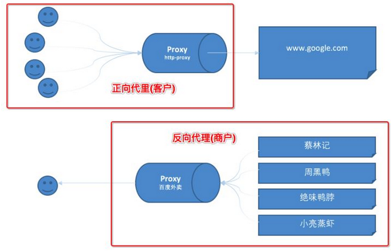

## 1、Nginx 的简介


### 1、什么是nginx


Nginx ("engine x") 是一个高性能的 HTTP 和反向代理服务器,特点是占有内存少，并发能力强。

Nginx 可以作为静态页面的 web 服务器，同时还支持 CGI 协议的动态语言，比如 perl、php等，但是不支持 java。Java 程序只能通过与 tomcat 配合完成。Nginx 专为性能优化而开发，性能是其最重要的考量,实现上非常注重效率 ，能经受高负载的考验,有报告表明能支持高达 50,000 个并发连接数。


### 2、正向代理与反向代理


#### 1、正向代理


正向代理是一个位于客户端和目标服务器之间的代理服务器 (中间服务器)。

为了从原始服务器取得内容，客户端向代理服务器发送一个请求，并且指定目标服务器，之后代理向目标服务器转交并且将获得的内容返回给客户端。

正向代理的情况下客户端必须要进行一些特别的设置才能使用。


**正向代理的用途：**

>   访问原来无法访问的资源，如外网的 google 和 Twitte（例如 VPN 就类似这种模式）
>
>   可以做缓存，加速访问资源
>
>   对客户端访问授权，上网进行认证
>
>   代理可以记录用户访问记录（上网行为管理），对外隐藏用户信息


#### 2、反向代理


**反向代理就好像目标服务器。并且客户端不需要进行任何设置，用户期间是无感知的**。

客户端向反向代理发送请求，接着反向代理判断请求走向何处，并将请求转交给客户端，使得这些内容就好似他自己一样，一次客户端并不会感知到反向代理后面的服务，也因此不需要客户端做任何设置，只需要把反向代理服务器当成真正的服务器就好了。


**反向代理的作用：**

>   保证内网的安全，阻止 web 攻击，大型网站，通常将反向代理作为公网访问地址，Web 服务器是内网
>
>   （例如 Gateway 服务网关，可以使真正的端口和服务隐藏起来，通过网关来访问这些真实的集群服务）
>
>   负载均衡，通过反向代理服务器来优化网站的负载


#### 3、两者的区别


正向代理中，proxy 和 client 同属一个 LAN，对 server 透明

反向代理中，proxy 和 server 同属一个 LAN，对 client 透明

实际上 proxy 在两种代理中做的事都是代为收发请求和响应，不过从结构上来看正好左右互换了下，所以把前者那种代理方式叫做正向代理，后者叫做反向代理。


##### 正向代理:客户端 <一> 代理 一>服务端


正向代理简单地打个租房的比方:

>   A(客户端) 想租 C ( 服务端 ) 的房子、但是 A (客户端) 并不认识 C(服务端) 租不到
>
>   B(代理) 认识 C (服务端) 能租这个房子所以你找了 B(代理) 帮忙租到了这个房子


这个过程中 C(服务端) 不认识 A(客户端) 只认识 B(代理)  C(服务端) 并不知道A(客户端)租了房子，只知道房子租给了 B(代理)。


##### 反向代理:客户端 一>代理 <一> 服务端


反向代理也用一个租房的例子:

>   A(客户端) 想租一个房子, B(代理) 就把这个房子租给了他。
>
>   这时候实际上 C(服务端) 才是房东。 B(代理) 是中介把这个房子租给了 A(客户端)


这个过程中 A(客户端) 并不知道这个房子到底谁才是房东 他都有可能认为这个房子就是B(代理)的





**由上的例子和图，我们可以知道正向代理和反向代理的区别在于代理的对象不一样,正向代理的代理对象是客户端,反向代理的代理对象是服务端。**


### 3、负载均衡


单个服务器有性能瓶颈、我们增加服务器的数量，然后将请求分发到各个服务器上，将原先请求集中到单个服务器上的情况改为将请求分发到多个服务器上，将负载分发到不同的服务器，也就是我们所说的负\载均衡


### 4、动静分离


为了加快网站的解析速度，可以把动态页面和静态页面由不同的服务器来解析，加快解析速度。降低原来单个服务器的压力。


以前我们把静态资源（html、css、js） 和动态资源（jsp、servlet） 都放进入了 Tomcat、用这样的单服务的方式去部署我们的资源，不管动静都去请求服务器，服务量大的话会给服务器带来更大的压力


**所以我们需要一种解决方案这种方案就是动静分离**

如下图：


## 2、Nginx 在Linux系统的安装


### 1、CentOS 7 下的安装


#### 1、需要先安装如下依赖


>   pcre-8.37.tar.gz
>
>   openssl-1.0.1t.tar.gz
>
>   zlib-1.2.8.tar.gz
>
>   nginx-1.11.1.tar.gz


可选择分开安装或者通过以下命令一键安装

```apl
yum -y install gcc zlib zlib-devel pcre-devel openssl openssl-devel
```


#### 2、开始安装 Nginx


##### 1、Nginx 官网如下


>   http://nginx.org/en/download.html
>
>   一般选择稳定版本，复制下载链接


##### 2、之后我们将 nginx 传入 Linux 服务器


##### 3、编译安装


>   解压安装文件

```apl
tar -zxvf nginx-1.18.0.tar.gz
```


>   解压之后进入目录执行编译

```apl
./configure --with-http_ssl_module
```


编译参数有很多，这边我只增加了SSL模块，可以根据自身情况调整

>   --prefix=PATH：指定 nginx 的安装目录
>   --conf-path=PATH：指定 nginx.conf 配置文件路径
>   --user=NAME：nginx 工作进程的用户
>   --with-pcre：开启 PCRE 正则表达式的支持
>   --with-http_ssl_module：启动 SSL 的支持
>   --with-http_stub_status_module：用于监控 Nginx 的状态
>   --with-http-realip_module：允许改变客户端请求头中客户端 IP 地址
>   --with-file-aio：启用 File AIO
>   --add-module=PATH：添加第三方外部模块


##### 4、执行完上述命令后，在解压目录下，多出一个Makefile文件


>   然后执行 make && make install命令

```apl
make && make install
```


>   因编译时未指定安装目录，执行make install 命令后看到反馈日志信息，实际安装目录为 /usr/local/nginx


>   我们进入 /user/local/nginx 目录查看可以看到如下文件


##### 5、安装完成之后启动 Nginx


>   进入 /usr/local/nginx/sbin 目录可以看到如下文件


>   需要进入 sbin 目录、执行命令 ./nginx 启动

```apl
./nginx
```


>   之后我们进入 /nginx/conf 文间夹下有个 nginx.conf 的配置文件


通过以上我们可以发现 nginx 的默认访问呢端口号为 80，然后浏览器访问 Linux 的远程路径可以看到如下内容：


>   记得关闭 Linux 防火墙、或者设置个规则端口号，如下命令
>
>   ```apl
>   # 查看开放的端口号
>   firewall-cmd --list-all
>   
>   # 设置开放的端口号
>   firewall-cmd --add-service=http -permanent
>   sudo firewall-cmd --add-port=80/tcp --permanent
>   
>   # 重启防火墙
>   firewall-cmd -reload
>   ```


#### 3、启动繁琐\每次都需要进目录


常用命令执行也正常，到这里nginx的安装已完成了，

**但有一点每次需要执行nginx命令时都需要指定执行文件后再进行相应命令执行，有点繁琐**

怎样能更便捷、优雅点呢？往下看


>   nginx官网已经给我们提供了一个脚本，官网也写的很清楚
>
>   将脚本信息保存以nginx命名的文件中并至放至系统/etc/init.d目录下即可
>
>   https://www.nginx.com/resources/wiki/start/topics/examples/redhatnginxinit/


脚本命令如下，有2个配置项需要根据实际情况进行相应调整。


>   nginx执行文件路径，已调整为本例中路径
>
>   ```
>   nginx="/usr/local/nginx/sbin/nginx"
>   ```


>   nginx配置文件，已调整为本例中路径
>
>   ```
>   NGINX_CONF_FILE="/usr/local/nginx/conf/nginx.conf"
>   ```


以下是官方的脚本信息（已修改以上的两个配置项）

```shell
#!/bin/sh
#
# nginx - this script starts and stops the nginx daemon
#
# chkconfig:   - 85 15
# description:  NGINX is an HTTP(S) server, HTTP(S) reverse \
#               proxy and IMAP/POP3 proxy server
# processname: nginx
# config:      /etc/nginx/nginx.conf
# config:      /etc/sysconfig/nginx
# pidfile:     /var/run/nginx.pid

# Source function library.
. /etc/rc.d/init.d/functions

# Source networking configuration.
. /etc/sysconfig/network

# Check that networking is up.
[ "$NETWORKING" = "no" ] && exit 0

nginx="/usr/local/nginx/sbin/nginx"
prog=$(basename $nginx)

NGINX_CONF_FILE="/usr/local/nginx/conf/nginx.conf"

[ -f /etc/sysconfig/nginx ] && . /etc/sysconfig/nginx

lockfile=/var/lock/subsys/nginx

make_dirs() {
   # make required directories
   user=`$nginx -V 2>&1 | grep "configure arguments:.*--user=" | sed 's/[^*]*--user=\([^ ]*\).*/\1/g' -`
   if [ -n "$user" ]; then
      if [ -z "`grep $user /etc/passwd`" ]; then
         useradd -M -s /bin/nologin $user
      fi
      options=`$nginx -V 2>&1 | grep 'configure arguments:'`
      for opt in $options; do
          if [ `echo $opt | grep '.*-temp-path'` ]; then
              value=`echo $opt | cut -d "=" -f 2`
              if [ ! -d "$value" ]; then
                  # echo "creating" $value
                  mkdir -p $value && chown -R $user $value
              fi
          fi
       done
    fi
}

start() {
    [ -x $nginx ] || exit 5
    [ -f $NGINX_CONF_FILE ] || exit 6
    make_dirs
    echo -n $"Starting $prog: "
    daemon $nginx -c $NGINX_CONF_FILE
    retval=$?
    echo
    [ $retval -eq 0 ] && touch $lockfile
    return $retval
}

stop() {
    echo -n $"Stopping $prog: "
    killproc $prog -QUIT
    retval=$?
    echo
    [ $retval -eq 0 ] && rm -f $lockfile
    return $retval
}

restart() {
    configtest || return $?
    stop
    sleep 1
    start
}

reload() {
    configtest || return $?
    echo -n $"Reloading $prog: "
    killproc $prog -HUP
    retval=$?
    echo
}

force_reload() {
    restart
}

configtest() {
  $nginx -t -c $NGINX_CONF_FILE
}

rh_status() {
    status $prog
}

rh_status_q() {
    rh_status >/dev/null 2>&1
}

case "$1" in
    start)
        rh_status_q && exit 0
        $1
        ;;
    stop)
        rh_status_q || exit 0
        $1
        ;;
    restart|configtest)
        $1
        ;;
    reload)
        rh_status_q || exit 7
        $1
        ;;
    force-reload)
        force_reload
        ;;
    status)
        rh_status
        ;;
    condrestart|try-restart)
        rh_status_q || exit 0
            ;;
    *)
        echo $"Usage: $0 {start|stop|status|restart|condrestart|try-restart|reload|force-reload|configtest}"
        exit 2
esac
```


根据自身安装路径调整脚本后


>   在 /etc/init.d 目录下、新建一个 nginx 文件，将以上脚本粘贴到文件内保存并退出，如下指令

```apl
# 进入目录 init.d
cd /etc/init.d/

# 创建文件 nginx
touch nginx

# 赋与相应的权限
chmod 755 /etc/init.d/nginx

chkconfig --add nginx
```


之后如下命令启动

```apl
service nginx start   #启动
service nginx stop    #停止
service nginx status  #服务状态
service nginx restart #重启
```


**启动报错附录：**

如果执行启动命令报错如下：


那我们执行 systemctl status nginx.service 命令后，查看问题所在


>   问题1：

**nginx.service: control process exited, code=exited status=203**

以上错误需要检查  /etc/init.d 目录下的 nginx 脚本是否正确，可能我们编辑的时候粘贴错误，核对一下脚本文件是否正确


>   问题2：

**Can't open PID file /var/run/nginx.pid (yet?) after start: No such file or directory**


我们需要进入 nginx 的安装目录

>   /usr/local/nginx/conf


查看文件 nginx.conf 看下 nginx.pid 文件的安装目录

>   如下显示在 nginx下的 logs 目录


我们复制该文件到 /var/run/ 目录下

```
cp logs/nginx.pid /var/run/
```


如果 nginx 服务还在启动，kill 掉该服务，然后执行下 service 命令，问题解决


## 3、Nginx 的常用命令


#### 1、查看版本号


>   使用 Nginx 操作命令前提：必须进入 nginx 的目录
>
>   /usr/local/nginx/sbin


```apl
nginx -v
```


如果想同时看到更详细的配置项，使用 -V

```apl
nginx -V
```


#### 2、启动关闭 Nginx


```apl
# 启动
./nginx

# 关闭
./nginx -s stop

# 如果配置了 nginx 脚本，可用如下命令
service nginx start   #启动
service nginx stop    #停止
service nginx status  #服务状态
service nginx restart #重启
```


#### 3、重加载命令


>   如果我们修改了 nginx.conf 配置文件，又不想重启服务器才生效，可以使用重新加载配置文件，如下

```apl
./nginx -s reload
```


## 4、Nginx 的配置文件


### 1、Linux 的配置文件目录


>   /usr/local/nginx/conf/nginx.conf


### 2、Nginx 有三部分组成


#### 1、全局块


从配置文件开始到 events 块之间的内容，主要会设置一些影响 nginx 服务器整体运行的配置指令，主要包括配置运行 Nginx 服务器的用户（组）、允许生成的 worker process 数，进程 PID 存放路径、日志存放路径和类型以及配置文件的引入等。


比如

>   worker_processes 1;

这是 Nginx 服务器并发处理服务的关键配置，worker_processes 值越大，可以支持的并发处理量也越多，但是会受到硬件、软件等设备的制约


#### 2、events 块


events 块涉及的指令主要影响 Nginx 服务器与用户的网络连接，常用的设置包括是否开启对多 work process 下的网络连接进行序列化，是否允许同时接收多个网络连接，选取哪种事件驱动模型来处理连接请求，每个 word process 可以同时支持的最大连接数等


上述例子就表示每个 work process 支持的最大连接数为 1024. 这部分的配置对 Nginx 的性能影响较大，在实际中应该灵活配置


#### 3、http 块 (配置重点)


这算是 Nginx 服务器配置中最频繁的部分，代理、缓存和日志定义等绝大多数功能和第三方模块的配置都在这里。需要注意的是：http 块也可以包括 **http** **全局块**、**server 块**


##### 1、http 全局块


http 全局块配置的指令包括文件引入、MIME-TYPE 定义、日志自定义、连接超时时间、单链接请求数上限等。

**upstream**（上游服务器设置，主要为反向代理、负载均衡相关配置，upstream 的指令用于设置一系列的后端服务器，设置反向代理及后端服务器的负载均衡


##### 2、server 块


这块和虚拟主机有密切关系，虚拟主机从用户角度看，和一台独立的硬件主机是完全一样的，该技术的产生是为了节省互联网服务器硬件成本。

每个 http 块可以包括多个 server 块，而每个 server 块就相当于一个虚拟主机。

而每个 server 块也分为全局 server 块，以及可以同时包含多个 locaton 块


###### 1、全局 server 块

>   最常见的配置是本虚拟机主机的监听配置和本虚拟主机的名称或 IP 配置


###### 2、location 块

>   一个 server 块可以配置多个 location 块

这块的主要作用是基于 Nginx 服务器接收到的请求字符串（例如 server_name/uri-string），对虚拟主机名称

（也可以是 IP 别名）之外的字符串（例如 前面的 /uri-string）进行匹配，对特定的请求进行处理地址定向、数据缓存和应答控制等功能，还有许多第三方模块的配置也在这里进行


### 3、nginx.conf 详细的配置文件介绍


```shell
#定义Nginx运行的用户和用户组
user www www; 

#nginx进程数，通常设置成和cpu的数量相等
worker_processes 4; 

#全局错误日志定义类型，[debug | info | notice | warn | error | crit]
#error_log  logs/error.log;
#error_log  logs/error.log  notice;
#error_log  logs/error.log  info;


#进程pid文件
#pid        logs/nginx.pid;


#指定进程可以打开的最大描述符：数目
#工作模式与连接数上限
##这个指令是指当一个nginx进程打开的最多文件描述符数目，理论值应该是最多打开文件数（ulimit -n）与nginx进程数相除，但是nginx分配请求并不是那么均匀，所以最好与ulimit -n 的值保持一致。
#这是因为nginx调度时分配请求到进程并不是那么的均衡，所以假如填写10240，总并发量达到3-4万时就有进程可能超过10240了，这时会返回502错误。
worker_rlimit_nofile 65535;


events {
    #参考事件模型，use [ kqueue | rtsig | epoll | /dev/poll | select | poll ]; epoll模型
    #是Linux 2.6以上版本内核中的高性能网络I/O模型，linux建议epoll，如果跑在FreeBSD上面，就用kqueue模型。
    #补充说明：
    #与apache相类，nginx针对不同的操作系统，有不同的事件模型
    #A）标准事件模型
    #Select、poll属于标准事件模型，如果当前系统不存在更有效的方法，nginx会选择select或poll
    #B）高效事件模型
    #Kqueue：使用于FreeBSD 4.1+, OpenBSD 2.9+, NetBSD 2.0 和 MacOS X.使用双处理器的MacOS X系统使用kqueue可能会造成内核崩溃。
    #Epoll：使用于Linux内核2.6版本及以后的系统。
    #/dev/poll：使用于Solaris 7 11/99+，HP/UX 11.22+ (eventport)，IRIX 6.5.15+ 和 Tru64 UNIX 5.1A+。
    #Eventport：使用于Solaris 10。 为了防止出现内核崩溃的问题， 有必要安装安全补丁。
    use epoll
    
    
    #单个进程最大连接数（最大连接数=连接数+进程数）
    #根据硬件调整，和前面工作进程配合起来用，尽量大，但是别把cup跑到100%就行。
    worker_connections  1024;
    
    #keepalive 超时时间
    keepalive_timeout 60;
    
    #客户端请求头部的缓冲区大小。这个可以根据你的系统分页大小来设置，一般一个请求头的大小不会超过1k，不过由于一般系统分页都要大于1k，所以这里设置为分页大小。
    #分页大小可以用命令getconf PAGESIZE 取得。
    #[root@web001 ~]# getconf PAGESIZE
    #但也有client_header_buffer_size超过4k的情况，但是client_header_buffer_size该值必须设置为“系统分页大小”的整倍数。
    client_header_buffer_size 4k;
    
    #这个将为打开文件指定缓存，默认是没有启用的，max指定缓存数量，建议和打开文件数一致，inactive是指经过多长时间文件没被请求后删除缓存。
    open_file_cache max=65535 inactive=60s;
    
    
    #这个是指多长时间检查一次缓存的有效信息。
    #语法:open_file_cache_valid time 默认值:open_file_cache_valid 60 使用字段:http, server, location 这个指令指定了何时需要检查open_file_cache中缓存项目的有效信息.
    open_file_cache_valid 80s;
    
    
    #open_file_cache指令中的inactive参数时间内文件的最少使用次数，如果超过这个数字，文件描述符一直是在缓存中打开的，如上例，如果有一个文件在inactive时间内一次没被使用，它将被移除。
    #语法:open_file_cache_min_uses number 默认值:open_file_cache_min_uses 1 使用字段:http, server, location  这个指令指定了在open_file_cache指令无效的参数中一定的时间范围内可以使用的最小文件数,如果使用更大的值,文件描述符在cache中总是打开状态.
    open_file_cache_min_uses 1;
    
    #语法:open_file_cache_errors on | off 默认值:open_file_cache_errors off 使用字段:http, server, location 这个指令指定是否在搜索一个文件是记录cache错误.
    open_file_cache_errors on;
}


#设定http服务器，利用它的反向代理功能提供负载均衡支持
http{
    #文件扩展名与文件类型映射表
    include mime.types;
    
    #默认文件类型
    default_type application/octet-stream;
    
    #默认编码
    charset utf-8;
    
    #服务器名字的hash表大小
    #保存服务器名字的hash表是由指令server_names_hash_max_size 和server_names_hash_bucket_size所控制的。参数hash bucket size总是等于hash表的大小，并且是一路处理器缓存大小的倍数。在减少了在内存中的存取次数后，使在处理器中加速查找hash表键值成为可能。如果hash bucket size等于一路处理器缓存的大小，那么在查找键的时候，最坏的情况下在内存中查找的次数为2。第一次是确定存储单元的地址，第二次是在存储单元中查找键 值。因此，如果Nginx给出需要增大hash max size 或 hash bucket size的提示，那么首要的是增大前一个参数的大小.
    server_names_hash_bucket_size 128;
    
    #客户端请求头部的缓冲区大小。这个可以根据你的系统分页大小来设置，一般一个请求的头部大小不会超过1k，不过由于一般系统分页都要大于1k，所以这里设置为分页大小。分页大小可以用命令getconf PAGESIZE取得。
    client_header_buffer_size 32k;
    
    #客户请求头缓冲大小。nginx默认会用client_header_buffer_size这个buffer来读取header值，如果header过大，它会使用large_client_header_buffers来读取。
    large_client_header_buffers 4 64k;
    
    #设定通过nginx上传文件的大小
    client_max_body_size 8m;
    
    #开启高效文件传输模式，sendfile指令指定nginx是否调用sendfile函数来输出文件，对于普通应用设为 on，如果用来进行下载等应用磁盘IO重负载应用，可设置为off，以平衡磁盘与网络I/O处理速度，降低系统的负载。注意：如果图片显示不正常把这个改成off。
    #sendfile指令指定 nginx 是否调用sendfile 函数（zero copy 方式）来输出文件，对于普通应用，必须设为on。如果用来进行下载等应用磁盘IO重负载应用，可设置为off，以平衡磁盘与网络IO处理速度，降低系统uptime。
    sendfile on;
    
     #开启目录列表访问，合适下载服务器，默认关闭。
    autoindex on;
    
      #此选项允许或禁止使用socke的TCP_CORK的选项，此选项仅在使用sendfile的时候使用
    tcp_nopush on;
     
    tcp_nodelay on;
    
    #长连接超时时间，单位是秒
    keepalive_timeout 120;
    
    #FastCGI相关参数是为了改善网站的性能：减少资源占用，提高访问速度。下面参数看字面意思都能理解。
    fastcgi_connect_timeout 300;
    fastcgi_send_timeout 300;
    fastcgi_read_timeout 300;
    fastcgi_buffer_size 64k;
    fastcgi_buffers 4 64k;
    fastcgi_busy_buffers_size 128k;
    fastcgi_temp_file_write_size 128k;
    
    #gzip模块设置
    gzip on; #开启gzip压缩输出
    gzip_min_length 1k;    #最小压缩文件大小
    gzip_buffers 4 16k;    #压缩缓冲区
    gzip_http_version 1.0; #压缩版本（默认1.1，前端如果是squid2.5请使用1.0）
    gzip_comp_level 2;     #压缩等级
    gzip_types text/plain application/x-javascript text/css application/xml;    #压缩类型，默认就已经包含textml，所以下面就不用再写了，写上去也不会有问题，但是会有一个warn。
    gzip_vary on;

    #开启限制IP连接数的时候需要使用
    #limit_zone crawler $binary_remote_addr 10m;
    
    
    #负载均衡配置
    upstream piao.jd.com {
     
        #upstream的负载均衡，weight是权重，可以根据机器配置定义权重。weigth参数表示权值，权值越高被分配到的几率越大。
        server 192.168.80.121:80 weight=3;
        server 192.168.80.122:80 weight=2;
        server 192.168.80.123:80 weight=3;

        #nginx的upstream目前支持4种方式的分配
        #1、轮询（默认）
        #每个请求按时间顺序逐一分配到不同的后端服务器，如果后端服务器down掉，能自动剔除。
        #2、weight
        #指定轮询几率，weight和访问比率成正比，用于后端服务器性能不均的情况。
        #例如：
        #upstream bakend {
        #    server 192.168.0.14 weight=10;
        #    server 192.168.0.15 weight=10;
        #}
        #2、ip_hash
        #每个请求按访问ip的hash结果分配，这样每个访客固定访问一个后端服务器，可以解决session的问题。
        #例如：
        #upstream bakend {
        #    ip_hash;
        #    server 192.168.0.14:88;
        #    server 192.168.0.15:80;
        #}
        #3、fair（第三方）
        #按后端服务器的响应时间来分配请求，响应时间短的优先分配。
        #upstream backend {
        #    server server1;
        #    server server2;
        #    fair;
        #}
        #4、url_hash（第三方）
        #按访问url的hash结果来分配请求，使每个url定向到同一个后端服务器，后端服务器为缓存时比较有效。
        #例：在upstream中加入hash语句，server语句中不能写入weight等其他的参数，hash_method是使用的hash算法
        #upstream backend {
        #    server squid1:3128;
        #    server squid2:3128;
        #    hash $request_uri;
        #    hash_method crc32;
        #}

        #tips:
        #upstream bakend{#定义负载均衡设备的Ip及设备状态}{
        #    ip_hash;
        #    server 127.0.0.1:9090 down;
        #    server 127.0.0.1:8080 weight=2;
        #    server 127.0.0.1:6060;
        #    server 127.0.0.1:7070 backup;
        #}
        #在需要使用负载均衡的server中增加 proxy_pass http://bakend/;

        #每个设备的状态设置为:
        #1.down表示单前的server暂时不参与负载
        #2.weight为weight越大，负载的权重就越大。
        #3.max_fails：允许请求失败的次数默认为1.当超过最大次数时，返回proxy_next_upstream模块定义的错误
        #4.fail_timeout:max_fails次失败后，暂停的时间。
        #5.backup： 其它所有的非backup机器down或者忙的时候，请求backup机器。所以这台机器压力会最轻。

        #nginx支持同时设置多组的负载均衡，用来给不用的server来使用。
        #client_body_in_file_only设置为On 可以讲client post过来的数据记录到文件中用来做debug
        #client_body_temp_path设置记录文件的目录 可以设置最多3层目录
        #location对URL进行匹配.可以进行重定向或者进行新的代理 负载均衡
    }
    
    
    #虚拟主机的配置
    server {
        #监听端口
        listen 80;

        #域名可以有多个，用空格隔开
        server_name www.jd.com jd.com;
        #默认入口文件名称
        index index.html index.htm index.php;
        root /data/www/jd;

        #对******进行负载均衡
        location ~ .*.(php|php5)?$
        {
            fastcgi_pass 127.0.0.1:9000;
            fastcgi_index index.php;
            include fastcgi.conf;
        }
         
        #图片缓存时间设置
        location ~ .*.(gif|jpg|jpeg|png|bmp|swf)$
        {
            expires 10d;
        }
         
        #JS和CSS缓存时间设置
        location ~ .*.(js|css)?$
        {
            expires 1h;
        }
         
        #日志格式设定
        #$remote_addr与$http_x_forwarded_for用以记录客户端的ip地址；
        #$remote_user：用来记录客户端用户名称；
        #$time_local： 用来记录访问时间与时区；
        #$request： 用来记录请求的url与http协议；
        #$status： 用来记录请求状态；成功是200，
        #$body_bytes_sent ：记录发送给客户端文件主体内容大小；
        #$http_referer：用来记录从那个页面链接访问过来的；
        #$http_user_agent：记录客户浏览器的相关信息；
        #通常web服务器放在反向代理的后面，这样就不能获取到客户的IP地址了，通过$remote_add拿到的IP地址是反向代理服务器的iP地址。反向代理服务器在转发请求的http头信息中，可以增加x_forwarded_for信息，用以记录原有客户端的IP地址和原来客户端的请求的服务器地址。
        log_format access '$remote_addr - $remote_user [$time_local] "$request" '
        '$status $body_bytes_sent "$http_referer" '
        '"$http_user_agent" $http_x_forwarded_for';
         
        #定义本虚拟主机的访问日志
        access_log  /usr/local/nginx/logs/host.access.log  main;
        access_log  /usr/local/nginx/logs/host.access.404.log  log404;
         
        #对 "/connect-controller" 启用反向代理
        location /connect-controller {
            proxy_pass http://127.0.0.1:88; #请注意此处端口号不能与虚拟主机监听的端口号一样（也就是server监听的端口）
            proxy_redirect off;
            proxy_set_header X-Real-IP $remote_addr;
             
            #后端的Web服务器可以通过X-Forwarded-For获取用户真实IP
            proxy_set_header X-Forwarded-For $proxy_add_x_forwarded_for;
             
            #以下是一些反向代理的配置，可选。
            proxy_set_header Host $host;

            #允许客户端请求的最大单文件字节数
            client_max_body_size 10m;

            #缓冲区代理缓冲用户端请求的最大字节数，
            #如果把它设置为比较大的数值，例如256k，那么，无论使用firefox还是IE浏览器，来提交任意小于256k的图片，都很正常。如果注释该指令，使用默认的client_body_buffer_size设置，也就是操作系统页面大小的两倍，8k或者16k，问题就出现了。
            #无论使用firefox4.0还是IE8.0，提交一个比较大，200k左右的图片，都返回500 Internal Server Error错误
            client_body_buffer_size 128k;

            #表示使nginx阻止HTTP应答代码为400或者更高的应答。
            proxy_intercept_errors on;

            #后端服务器连接的超时时间_发起握手等候响应超时时间
            #nginx跟后端服务器连接超时时间(代理连接超时)
            proxy_connect_timeout 90;

            #后端服务器数据回传时间(代理发送超时)
            #后端服务器数据回传时间_就是在规定时间之内后端服务器必须传完所有的数据
            proxy_send_timeout 90;

            #连接成功后，后端服务器响应时间(代理接收超时)
            #连接成功后_等候后端服务器响应时间_其实已经进入后端的排队之中等候处理（也可以说是后端服务器处理请求的时间）
            proxy_read_timeout 90;

            #设置代理服务器（nginx）保存用户头信息的缓冲区大小
            #设置从被代理服务器读取的第一部分应答的缓冲区大小，通常情况下这部分应答中包含一个小的应答头，默认情况下这个值的大小为指令proxy_buffers中指定的一个缓冲区的大小，不过可以将其设置为更小
            proxy_buffer_size 4k;

            #proxy_buffers缓冲区，网页平均在32k以下的设置
            #设置用于读取应答（来自被代理服务器）的缓冲区数目和大小，默认情况也为分页大小，根据操作系统的不同可能是4k或者8k
            proxy_buffers 4 32k;

            #高负荷下缓冲大小（proxy_buffers*2）
            proxy_busy_buffers_size 64k;

            #设置在写入proxy_temp_path时数据的大小，预防一个工作进程在传递文件时阻塞太长
            #设定缓存文件夹大小，大于这个值，将从upstream服务器传
            proxy_temp_file_write_size 64k;
        }
        
        #本地动静分离反向代理配置
        #所有jsp的页面均交由tomcat或resin处理
        location ~ .(jsp|jspx|do)?$ {
            proxy_set_header Host $host;
            proxy_set_header X-Real-IP $remote_addr;
            proxy_set_header X-Forwarded-For $proxy_add_x_forwarded_for;
            proxy_pass http://127.0.0.1:8080;
        }
    }
}
```


### 4、Nginx 配置总结


Nginx 配置文件主要分成四部分：main（全局设置）、server（主机设置）、upstream（上游服务器设置，主要为反向代理、负载均衡相关配置）和 location（URL匹配特定位置后的设置）。

main 部分设置的指令影响其他所有部分的设置；

server 部分的指令主要用于制定虚拟主机域名、IP 和端口号；

upstream 的指令用于设置一系列的后端服务器，设置反向代理及后端服务器的负载均衡；

location 部分用于匹配网页位置（比如，根目录“/”，“/images”，等等）。

他们之间的关系：server 继承 main，location 继承 server；upstream 既不会继承指令也不会被继承。


## 5、Nginx 配置实例-反向代理


### 1、反向代理实例一


#### 1、实现效果


>   使用 nginx 反向代理，访问 [www.123.com](http://www.123.com/) 直接跳转到 Rabbimq 的登录界面 http://192.168.1.166:15672/
>
>   用户发布请求到  ===>  www.123.com 转到  ===> http://192.168.1.166:15672/


#### 2、准备工作


>   在 Linux 系统中安装 Rabbitmq，使用默认端口 15672


然后我们编辑 nginx.conf 文件，如下框选的内容


-   server_name：要代理的 ip
-   proxy_pass：代理转发到的地址


重载入 Nginx 配置文件

```apl
./nginx -s reload
```


#### 3、进行访问


之后我们访问 http://192.168.1.166/，出现 RabbitMQ 的界面代表反向代理成功


### 2、反向代理实例二


实现效果：使用 nginx 反向代理，根据访问的路径跳转到不同端口的服务中 nginx 监听端口为 9001


>   -   访问 [http://127.0.0.1/helloworld1，跳转到](https://www.oschina.net/action/GoToLink?url=http%3A%2F%2F127.0.0.1%2Fhelloworld1，跳转到) 127.0.0.1:8081/helloworld1
>-   访问 [http://127.0.0.1/helloworld2，直接跳转到](https://www.oschina.net/action/GoToLink?url=http%3A%2F%2F127.0.0.1%2Fhelloworld2，直接跳转到) 127.0.0.1:8082/helloworld2


```apl
server {
    listen       80;
    server_name  localhost;

    location ~ /helloworld1 {
        proxy_pass   http://127.0.0.1:8081;
    }
        
    location ~ /helloworld2 {
        proxy_pass   http://127.0.0.1:8082;
    }
}
```


**运行结果**

地址栏输入 `http://127.0.0.1/helloworld1` 则返回 `http://127.0.0.1:8081/helloworld1` 的页面。

地址栏输入 `http://127.0.0.1/helloworld2  `则返回 `http://127.0.0.1:8082/helloworld2` 的页面。


**location** **指令说明** 该指令用于匹配 URL。

语法如下：

1.  **= ：**用于不含正则表达式的 uri 前，要求请求字符串与 uri 严格匹配，如果匹配成功，就停止继续向下搜索并立即处理该请求。
2.  **~：**用于表示 uri 包含正则表达式，并且区分大小写。
3.  **~*：**用于表示 uri 包含正则表达式，并且不区分大小写。
4.  **^~：**用于不含正则表达式的 uri 前，要求 Nginx 服务器找到标识 uri 和请求字符串匹配度最高的 location 后，立即使用此 location 处理请求，而不再使用 location 块中的正则 uri 和请求字符串做匹配。

**注意：如果 uri 包含正则表达式，则必须要有 ~ 或者 ~\* 标识。**


## 6、Nginx 配置实例-负载均衡


### 1、什么是负载均衡


负载均衡（load balance）即是将负载分摊到不同的服务单元，既保证服务的可用性，又保证响应足够快，给用户很好的体验。快速增长的访问量和数据流量催生了各式各样的负载均衡产品，很多专业的负载均衡硬件提供了很好的功能，但却价格不菲，这使得负载均衡软件大受欢迎，nginx 就是其中的一个，在 linux 下有 Nginx、 LVS、 Haproxy 等等服务可以提供负载均衡服务，而且 Nginx 提供了几种分配方式(策略)


### 2、负载均衡分配策略


#### 1、轮询（默认）

这是Ngnix负载均衡默认分配策略。每个请求按时间顺序逐一分配到不同的后端服务器，如果后端服务器 down 掉，能自动剔除。


#### 2、加权

weight 代表权，重默认为 1，权重越高被分配的客户端越多。指定轮询几率，weight和访问比率成正比，用于后端服务器性能不均的情况。例如：

```apl
upstream myserver{
	server 127.0.0.1:8081 weight=8;
	server 127.0.0.1:8082 weight=2;
}
```


#### 3、ip_hash

每个请求按访问 ip 的 hash 结果分配，这样每个访客固定访问一个后端服务器，可以解决 session 的问题。 例如：

>   这样就是说，当一台服务器 ip 192.168.1.134 访问了 8080 端口，以后它在访问都是分配到 8080 端口

```apl
upstream myserver{
	ip_hash;
	server 127.0.0.1:8081;
	server 127.0.0.1:8082;
}
```


#### 4、fair（第三方）

这是Ngnix负载均衡第三方分配策略。按后端服务器的响应时间来分配请求，响应时间短的优先分配。

```apl
upstream myserver{
	server 127.0.0.1:8081;
	server 127.0.0.1:8082;
	fair;
}
```

>   可能需要额外安装，否则就抛出异常 `[emerg] 7032#7120: unknown directive "fair" in C:\nginx-1.18.0/conf/nginx.conf:38`


### 3、负载均衡实战配置


#### 1、实现效果


>   浏览器地址输入地址 http://192.168.1.166/edu/a.html，实现负载均衡效果，请求平均分配到 8080、8081 端口中


>   nginx.conf 负载均衡最基本的配置


## 7、Nginx 配置实例-动静分离


### 1、动静分离介绍


**Nginx 动静分离简单来说就是把动态跟静态请求分开，不能理解成只是单纯的把动态页面和静态页面物理分离**。

严格意义上说应该是动态请求跟静态请求分开，可以理解成使用 Nginx 处理静态页面， Tomcat 处理动态页面。

动静分离从目前实现角度来讲大致分为两种：

1.  **一种是纯粹把静态文件独立成单独的域名，放在独立的服务器上，也是目前主流推崇的方案；**
2.  另外一种方法就是动态跟静态文件混合在一起发布，通过 nginx 来分开


>   通过 location 指定不同的后缀名实现不同的请求转发。通过 expires 参数设置，可以使浏览器缓存过期时间，减少与服务器之前的请求和流量。具体 Expires 定义：是给一个资源设定一个过期时间，也就是说无需去服务端验证，直接通过浏览器自身确认是否过期即可，所以不会产生额外的流量。**此种方法非常适合不经常变动的资源**。（如果经常更新的文件，不建议使用 Expires 来缓存）


若将其设置 3d，表示在这 3 天之内访问这个 URL，发送一个请求，比对服务器该文件最后更新时间没有变化，则不会从服务器抓取，返回状态码304，如果有修改，则直接从服务器重新下载，返回状态码 200。


### 2、提前准备工作


1.  新建一个目录路径 /data/imgae

    >   image 文件夹：01.jpg
    >
    >   www 文件夹：a.html


1.  准备一个 tomcat 服务器，访问端口为 8080


#### 1.Nginx配置实例（动静分离）


1、修改配置文件

>   还有另外一种写法
>
>   ```apl
>    location /a/ {     
>        alias /b/;    
>        # 表示请求 /a/1.jpg 的实际对应文件是 /b/1.jpg 
>   }
>   ```


如下写法：

```apl
server {
    listen       80;
    server_name  localhost;

	# 主要配置内容
	location /www/ {
		root  /data/;
		index index.html index.htm
	}

    location /image/ {
        root /data/;
        # 是否列出目录
		autoindex on;
    }
}
```


2、进行测试：


>   在浏览器地址栏输入

-   `http://192.168.1.166/image/01.png` 将会如下显示

    

-   `http://192.168.1.166/www/a.html` 将会显示Tomcat的应用页面

    


## 8、Nginx 搭建高可用集群


### 1、什么是高可用


我们之前的做法是通过 1 台 Nginx 将用户请求分发到不同的服务器上，但是如果过程中 nginx 服务器宕机了，那所有的请求都将失效无法访问服务器，那高可用就是如果我的 nginx 宕机了，但是用户的请求还能进行正常的访问，这就是高可用


那我们就需要进行高可用的配置

>   那么我们可以配置两台 nginx 服务器，一台 主 一台备，然后当一个服务器挂掉了，我们就可以通过另一台服务器正常分发请求。
>
>   不过我们需要安装一个软件 keep alived ，相当一个路由，可以监听 nginx 服务器是否挂掉了，如果挂掉了，就把 ip 绑定到 另一台 nginx 服务器上
>
>   对外需要提供一个虚拟的 ip 地址供用户访问


### 2、配置高可用的准备工作


#### 1、准备两台服务器


-   需要两台服务器 192.168.17.129 和 192.168.17.131
-   在两台服务器安装 Nginx
-   在两台服务器安装 keepalived


#### 2、在两台服务器安装 keepalived


-   使用 yum 命令进行安装`yum install keepalived –y`
-   安装之后，在 etc 里面生成目录 keepalived，有文件 keepalived.conf


### 3、Nginx 高可用配置（主服务器配置）


#### 1、修改 keepalived 配置文件

>   路径：/etc/keepalived/keepalivec.conf


```apl
# 全局定义块
global_defs {
	notification_email {
		acassen@firewall.loc
		failover@firewall.loc
		sysadmin@firewall.loc
	}
	notification_email_from Alexandre.Cassen@firewall.loc
	smtp_server 192.168.17.129
	smtp_connect_timeout 30
	# 访问到主机
	router_id LVS_DEVEL
}

# 检测脚本和权重
# 检测 nginx 是否还活着
vrrp_script chk_http_port {
    # 代表每个 2 秒检测以下如下路径配置的脚本
	script "/usr/local/src/nginx_check.sh"
	interval 2 #（检测脚本执行的间隔）
	weight 2   # 权重
}

# 虚拟 ip 的 配置
vrrp_instance VI_1 {
	state MASTER    # 主服务器就配置 MASTER 备份服务器 BACKUP
	interface eno16777736 # 网卡名字
	virtual_router_id 51  # 主、备机的 virtual_router_id 必须相同
	priority 100          # 主、备机取不同的优先级，主机值较大，备份机值较小
	advert_int 1          # 设置每隔多少秒发送一个心跳来检测服务器是否活着
	authentication {      # 权限校验的方式
		auth_type PASS
		auth_pass 1111
	}
	virtual_ipaddress {
		192.168.17.50    # VRRP H 虚拟地址
	}
}
```


配置文件详解：


>   参数：interface eno16777736 # 网卡名字 我们可以通过 ifconfig 命令来查看网卡名字


#### 2、在/usr/local/src 添加检测脚本


>   脚本位置应该放入以上配置的路径中
>
>   脚本：判断如果主服务器挂掉了，那么我们就设置从服务器来接收请求

```shell
#!/bin/bash
A=`ps -C nginx – no-header |wc -l`
if [ $A -eq 0 ];then
    # nginx 启动命令的路径
	/usr/local/nginx/sbin/nginx
	sleep 2
	if [ `ps -C nginx --no-header |wc -l` -eq 0 ];then
		killall keepalived
	fi
fi
```


#### 3、把两台服务器上 Nginx 和 keepalived 启动


-   启动 Nginx： ./nginx
-   启动 keepalived： systemctl start keepalived.service


#### 4、最终测试


-   在浏览器地址栏输入 虚拟 ip 地址 192.168.17.50
-   把主服务器（192.168.17.129） Nginx 和 keepalived 停止，再输入 192.168.17.50


>   我们发现其实还可以访问


## 9、Nginx 原理及优化参数配置


### 1、mater 和 worker


>   Nginx 进程中其实有两个进程的，一个 mater 进程 和一个 worker 进程
>
>   其中 master 不做具体的事情，但是可以分配工作给 worker


**Nginx 的执行过程**


>   如下图所示：
>
>   首先 用户发送请求，请求首先到达 master 进程，master 然后通知底下的 worker 进程，worker 通过争抢得到这个任务，然后通过反向代理把请求转发到具体的 tomcat 服务器


### 2、master-workers 机制的好处


1、使用命令 nginx -s reload 热部署，线上我们不可能停掉 nginx 服务器进行重启，所以，当一个请求过来，被第一个 worker 争抢到的话，然后我们这是使用重加载命令，剩下的没有争抢到请求的 worker 会利用这段时间把Nginx 重新加载一遍


2、对于每个 worker 进程来说，独立的进程，不需要加锁，所以省掉了锁带来的开销，同时在编程以及问题查找时，也会方便很多。


3、每个 worker 采用独立的进程，可以让互相之间不会影响，一个进程退出后，其它进程还在工作，服务不会中断， master 进程则很快启动新的 worker 进程。

当然， worker 进程的异常退出，肯定是程序有 bug 了，异常退出，会导致当前 worker 上的所有请求失败，不过不会影响到所有请求，所以降低了风险。


### 3、需要设置多少个 worker


Nginx 同 redis 类似都采用了 io 多路复用机制，每个 worker 都是一个独立的进程，但每个进程里只有一个主线程，通过异步非阻塞的方式来处理请求， 即使是千上万个请求也不在话下。每个 worker 的线程可以把一个 cpu 的性能发挥到极致。


**所以 worker 数和服务器的 cpu 数相等是最为适宜的**。

>   比如 cpu 核数为 4，那么 worker 就设置成 4
>
>   设少了会浪费 cpu，设多了会造成 cpu 频繁切换上下文带来的损耗。

```apl
#设置 worker 数量。
worker_processes 4

#work 绑定 cpu(4 work 绑定 4cpu)。
worker_cpu_affinity 0001 0010 0100 1000

#work 绑定 cpu (4 work 绑定 8cpu 中的 4 个) 。
worker_cpu_affinity 0000001 00000010 00000100 00001000
```


### 4、连接数 worker_connection


这个值是表示每个 worker 进程所能建立连接的最大值，所以，一个 nginx 能建立的最大连接数，应该是 worker_connections * worker_processes。当然，这里说的是最大连接数，对于 HTTP 请 求 本 地 资 源来 说 ， 能 够 支 持 的 最大 并 发 数 量 是 worker_connections * worker_processes，如果是支持 http1.1 的浏览器每次访问要占两个连接，所以普通的静态访问最大并发数是： worker_connections * worker_processes /2，而如果是 HTTP 作 为反向代理来说，最大并发数量应该是 worker_connections *worker_processes/4。因为作为反向代理服务器，每个并发会建立与客户端的连接和与后端服务的连接，会占用两个连接。


第一个：发送请求，占用了woker 的几个连接数？

答案：2或者4个


第二个：nginx有一个master，有四个woker，每个woker支持最大的连接数1024，支持的最大并发数是多少？

-   普通的静态访问最大并发数是： worker_connections * worker_processes /2
-   而如果是HTTP作为反向代理来说，最大并发数量应该是worker_connections * worker_processes/4

