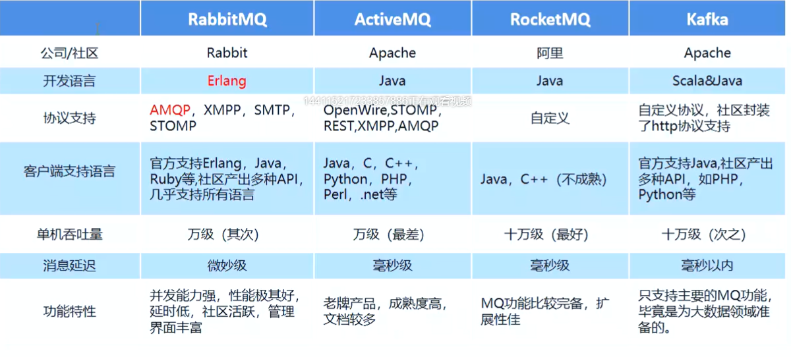
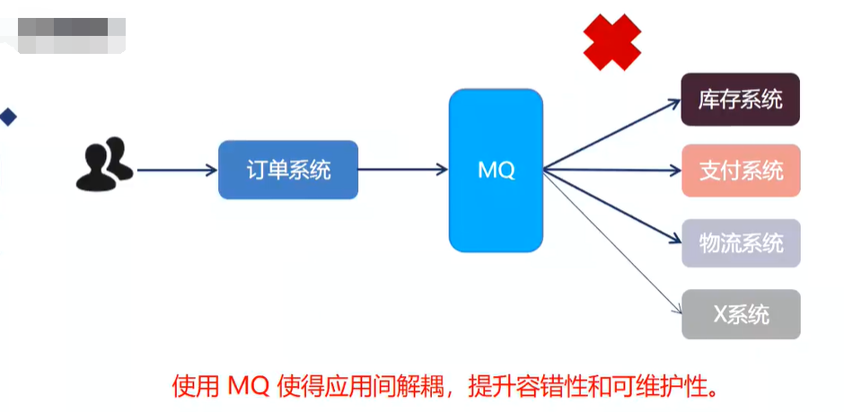
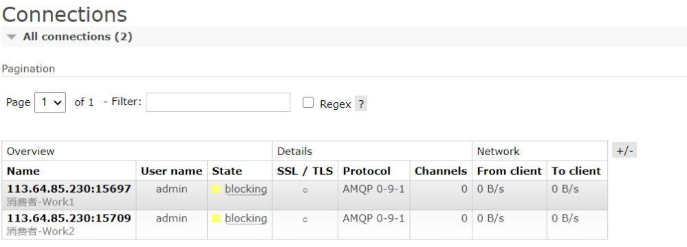
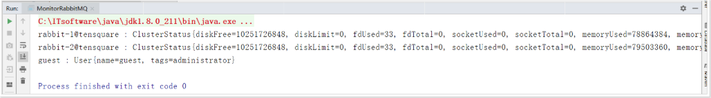
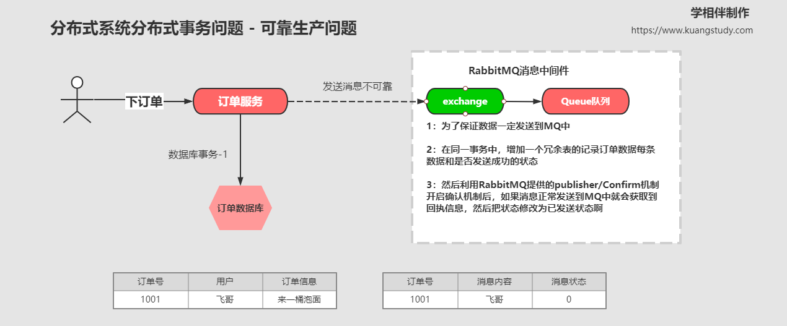

## 1、MQ的基本概念


### 1、什么是MQ？


MQ全程 Message Queue（消息队列），是在消息的传输过程中保存消息的容器，多用于分布式系统之间进行通信，分布式系统中存储消息，转发消息，具有高可用，高可扩性，易用性等特征


### 2、常见的 MQ 产品





## 2、RabbitMQ 简介


### 1、RabbitMQ介绍

AMQP，即 Advanced Message Queuing Protocol (高级消息队列协议)，是一个网络协议，是应用层协议的一个开放标准，为面向消息的中间件设计。基于此协议的客户端与消息中间件可传递消息，并不受客户端/中间件不同产品，不同的开发语言等条件的限制。2006年，AMQP 规范发布。类比HTTP。

>   以下为简单的模型


>   2007年，Rabbit 技术公司基于AMQP标准开发的RabbitMQ 1.0发布。RabbitMQ采用Erlang 语言开发。Erlang 语言由Ericson 设计，专门为开发高并发和分布式系统的一种语言，在电信领域使用广泛。


### 2、RabbitMQ 基础架构图


## 3、RabbitMQ 的安装


### 1、Linux 的 Centos 7 安装


1、我们下载如下软件，RabbitMQ 官网地址：

https://www.rabbitmq.com/


```yaml
# RabbitMQ 运行环境语言 Erlang
erlang-18.3-1.el7.centos.x86_64.rpm
socat-1.7.3.2-5.el7.lux.x86_64.rpm

# RabbitMQ 安装包
rabbitmq-server-3.6.5-1.noarch.rpm
```


2、安装 Erlang

```
rpm -ivh erlang-18.3-1.el7.centos.x86_64.rpm
```


3、安装 socat

```
rpm -ivh socat-1.7.3.2-1.1.el7.x86_64.rpm
```


4、安装 rabbitMq

```
rpm -ivh rabbitmq-server-3.6.5-1.noarch.rpm
```


5、 修改默认配置信息 

```yaml
# 比如修改密码、配置等等，例如：loopback_users 中的 <<"guest">>,只保 留guest
vim /usr/lib/rabbitmq/lib/rabbitmq_server-3.6.5/ebin/rabbit.app
```


6、设置配置文件

```yaml
cd /usr/share/doc/rabbitmq-server-3.6.5/
cp rabbitmq.config.example /etc/rabbitmq/rabbitmq.config
```


7、开启管理界面及配置(需要启动rabbitmq)

```yaml
# 输入以下命令
rabbitmq-plugins enable rabbitmq_management
```


**如果web控制台无法正常访问考虑安装是否成功以及是防火墙的原因**

```yaml
# 关闭防火墙
# 使用腾讯云 阿里云记得开放 15672端口
systemctl stop firewalld
```


8、RabbitMQ在安装好后，可以访问 http://ip:15672 ；

其自带了guest/guest的 用户名和密码；如果需要创建自定义用户；那么也可以登录管理界面后，如下操 作：


我们先添加个用户，最后的 Tags中可以选择角色权限

添加完如下所示


### 2、虚拟化容器-Docker安装


1、下载 安装 docker

```cmake
（1）yum 包更新到最新
> yum update
（2）安装需要的软件包， yum-util 提供yum-config-manager功能，另外两个是devicemapper驱动依赖的
> yum install -y yum-utils device-mapper-persistent-data lvm2
（3）设置yum源为阿里云
> yum-config-manager --add-repo http://mirrors.aliyun.com/docker-ce/linux/centos/docker-ce.repo
（4）安装docker
> yum install docker-ce -y
（5）安装后查看docker版本
> docker -v
 (6) 安装加速镜像
 sudo mkdir -p /etc/docker
 sudo tee /etc/docker/daemon.json <<-'EOF'
 {
  "registry-mirrors": ["https://0wrdwnn6.mirror.aliyuncs.com"]
 }
 EOF
 sudo systemctl daemon-reload
 sudo systemctl restart docker
```


2、docker的相关命令

```yaml
# 启动docker：
systemctl start docker
# 停止docker：
systemctl stop docker
# 重启docker：
systemctl restart docker
# 查看docker状态：
systemctl status docker
# 开机启动：  
systemctl enable docker
systemctl unenable docker
# 查看docker概要信息
docker info
# 查看docker帮助文档
docker --help
```


3、安装 RabbitMQ

>   参考网站：
>
>   https://www.rabbitmq.com/download.html
>   https://registry.hub.docker.com/_/rabbitmq/


4、获取 rabbit镜像

```
docker pull rabbitmq:management
```


5、创建并运行容器

```
docker run -di --name=myrabbit -p 15672:15672 rabbitmq:management
```

>   —hostname：指定容器主机名称
>   —name:指定容器名称
>   -p:将mq端口号映射到本地或者运行时设置用户和密码


运行

```
docker run -di --name myrabbit -e RABBITMQ_DEFAULT_USER=admin -e RABBITMQ_DEFAULT_PASS=admin -p 15672:15672 -p 5672:5672 -p 25672:25672 -p 61613:61613 -p 1883:1883 rabbitmq:management
```


查看日志

```
docker logs -f myrabbit
```


6、容器运行正常

访问 RabbitMQ 控制台：http:/ip:15672


>   额外的 Linux 相关命令

```
> more xxx.log  查看日记信息
> netstat -naop | grep 5672 查看端口是否被占用
> ps -ef | grep 5672  查看进程
> systemctl stop 服务
```


## 4、RabbitMQ Web及授权操作


### 1、Virtual Hosts 配置

像 mysql 拥有数据库的概念并且可以指定用户对库和表等操作的权限。 RabbitMQ 也有类似的权限管理；在 RabbitMQ 中可以虚拟消息服务器 Virtual Host，每个 Virtual Hosts 相当于一个相对独立的RabbitMQ 服务器，每个 VirtualHost 之间是相互隔离的。exchange、queue、message不能互通。 **Virtual Hosts相当于 mysql 的 db 。Virtual Name 一般以/开头**


1、创建 Hosts


2、设置 Virtual Hosts 权限


### 2、新增用户

```
rabbitmqctl add_user admin adminpwd
```


### 3、设置用户分配权限

```
rabbitmqctl set_user_tags admin administrator
```


用户级别：

1、administrator可以登录控制台、查看所有信息、可以对rabbitmq进行管理

2、monitoring 监控者登录控制台，查看所有信息

3、policymaker策略制定者登录控制台,指定策略

4、 managment普通管理员登录控制台


### 4、为用户添加资源权限

```yaml
rabbitmqctl.bat set_permissions -p / admin ".*" ".*" ".*"
```


### 5、小结

```yaml
rabbitmqctl add_user 账号 密码
rabbitmqctl set_user_tags 账号 administrator
rabbitmqctl change_password Username Newpassword 修改密码
rabbitmqctl delete_user Username 删除用户
rabbitmqctl list_users 查看用户清单
rabbitmqctl set_permissions -p / 用户名 ".*" ".*" ".*" 为用户设置administrator角色
rabbitmqctl set_permissions -p / root ".*" ".*" ".*"
```


## 7、RabbitMQ 的角色说明


### 1、RabbitMQ 角色说明：


##### 1、 超级管理员(administrator) 

-   可登陆管理控制台，可查看所有的信息，并且可以对用户，策略(policy)进行操 作


##### 2、 监控者(monitoring) 

-   可登陆管理控制台，同时可以查看rabbitmq节点的相关信息(进程数，内存使用 情况，磁盘使用情况等) 


##### 3、 策略制定者(policymaker) 

-   可登陆管理控制台, 同时可以对policy进行管理。但无法查看节点的相关信息(上 图红框标识的部分)


#####  4、 普通管理者(management) 

-   仅可登陆管理控制台，无法看到节点信息，也无法对策略进行管理


##### 5、 其他 

-   无法登陆管理控制台，通常就是普通的生产者和消费者


### 2、RabbitMQ 角色权限


##### 1：none：

-   不能访问 management plugin


##### 2：management：只能查看自己相关节点信息

-   列出自己可以通过AMQP登入的虚拟机
-   查看自己的虚拟机节点 virtual hosts的queues,exchanges和bindings信息
-   查看和关闭自己的channels和connections
-   查看有关自己的虚拟机节点virtual hosts的统计信息。包括其他用户在这个节点virtual hosts中的活动信息


##### 3：Policymaker

-   包含management所有权限
-   查看和创建和删除自己的virtual hosts所属的policies和parameters信息


##### 4：Monitoring

-   包含management所有权限
-   罗列出所有的virtual hosts，包括不能登录的virtual hosts。
-   查看其他用户的connections和channels信息
-   查看节点级别的数据如clustering和memory使用情况
-   查看所有的virtual hosts的全局统计信息


##### 5：Administrator

-   最高权限
-   可以创建和删除virtual hosts
-   可以查看，创建和删除users
-   查看创建permisssions
-   关闭所有用户的connections


### 3、具体操作的界面


## 8、RabbitMQ 的核心组成


### 1、RabbitMQ 的架构图


### 2、重要的组成概念


**Broker：** 接收和分发消息的应用，RabbitMQ Server就是 Message Broker


**Virtual host：** 虚拟地址，用于进行逻辑隔离，最上层的消息路由，一个虚拟主机理由可以有若干个Exhange和Queueu，同一个虚拟主机里面不能有相同名字的Exchange


**Connection：**连接，应用程序与Broker的网络连接 TCP/IP/ 三次握手和四次挥手


**Channel：**如果每一次访问 RabbitMQ 都建立一个Connection，在消息量大的时候建立 TCP Connection 的开销将是巨大的，效率也较低。Channel 是在 connection 内部建立的逻辑连接，如果应用程序支持多线程，通常每个thread 创建单独的channel进行通讯，AMQPmethod 包含了channel id 帮助客户端和 message broker 识别channel，所以 channel 之间是完全隔离的。Channel 作为轻量级的 Connection 极大减少了操作系统建立TCP connection 的开销


**Exchange：**交换机，接受消息，根据路由键发送消息到绑定的队列。(==不具备消息存储的能力==)


**Queue：**队列：也成为Message Queue,消息队列，保存消息并将它们转发给消费者。


**Binding：**exchange 和 queue 之间的虚拟连接，binding 中可以包含 routing key。Binding 信息被保存到 exchange 中的查询表中，用于 message 的分发依据


## 9、RabbitMQ快速入门案例


### 1、新建一个工程


1、新建一个 maven 项目，导入 rabbitmq 的原生依赖

```xml
<!-- 导入rabbitmq原生的依赖 -->
<dependency>
    <groupId>com.rabbitmq</groupId>
    <artifactId>amqp-client</artifactId>
    <version>5.10.0</version>
</dependency>
```


2、编写一个简单模式，我们先写生产者类

```java
package com.lee.rabbitmq.simple;

import com.rabbitmq.client.Channel;
import com.rabbitmq.client.Connection;
import com.rabbitmq.client.ConnectionFactory;

import java.io.IOException;
import java.util.concurrent.TimeoutException;

/**
 * RabbitMQ - 生产者
 */
public class Producer {
    public static void main(String[] args){
        try {
            createAndSendMessage();
        } catch (IOException e) {
            e.printStackTrace();
        } catch (TimeoutException e) {
            e.printStackTrace();
        }
    }

    private static void createAndSendMessage() throws IOException, TimeoutException {
        //1.创建连接工程
        ConnectionFactory connectionFactory = new ConnectionFactory();
        connectionFactory.setHost("192.168.0.166");
        //默认端口 5672
        connectionFactory.setPort(5672);
        connectionFactory.setUsername("RabbitMQ-Lee");
        connectionFactory.setPassword("193654300");
        connectionFactory.setVirtualHost("/Lee");

        //信道
        Channel channel = null;
        //连接
        Connection connection = null;

        /**
         * 2.创建连接Connection
         *    Rabbitmq 为什么是基于 channel 去处理而不是链接? 长连接----信道channel
         */
        connection = connectionFactory.newConnection("生产者-Lee");
        // 3.通过连接获取通道Channel
        channel = connection.createChannel();

        // 4.通过通创建交换机，声明队列，绑定关系，路由key,发送消息，和接收消息
        String queueName = "queueName-Lee";

        /*
         * @params1 队列的名称
         * @params2 是否要持久化durable=false 所谓持久化消息是否存盘，
         *          false：非持久化 true：是持久化 非持久化会存盘吗？ 会存盘，但是会随从重启服务会丢失。
         * @params3 排他性，是否是独占独立
         * @params4 是否自动删除，随着最后一个消费者消息完毕消息以后是否把队列自动删除
         * @params5 携带附属参数
         */
        channel.queueDeclare(queueName, true, false, false, null);

        // 5.准备消息内容
        String message = "Hello RabbitMQ-Lee";
        // 6.发送消息给队列 queue
        // @params1: 交换机
        // @params2 队列、路由 key
        // @params 消息的状态控制
        // @params4 消息主题
        // 面试题：可以存在没有交换机的队列吗？不可能，虽然没有指定交换机但是一定会存在一个默认的交换机
        channel.basicPublish("", queueName, null, message.getBytes());

        System.out.println("消息发送成功!!!");

        // 7. 关闭通道
        if (channel != null && channel.isOpen()) {
            channel.close();
        }

        // 8. 关闭连接
        if (connection != null && connection.isOpen()) {
            connection.close();
        }
    }
}
```


3、编写一个消费者类

```java
package com.lee.rabbitmq.simple;

import com.rabbitmq.client.*;

import java.io.IOException;
import java.util.concurrent.TimeoutException;

/**
 * RabbitMQ - 消费者
 */
public class Consumer {

    public static void main(String[] args) {
        try {
            createAndGetMessage();
        } catch (IOException e) {
            e.printStackTrace();
        } catch (TimeoutException e) {
            e.printStackTrace();
        }
    }

    public static void createAndGetMessage() throws IOException, TimeoutException {
        //1.创建连接工程
        ConnectionFactory connectionFactory = new ConnectionFactory();
        connectionFactory.setHost("192.168.0.166");
        //默认端口 5672
        connectionFactory.setPort(5672);
        connectionFactory.setUsername("RabbitMQ-Lee");
        connectionFactory.setPassword("193654300");
        connectionFactory.setVirtualHost("/Lee");

        //信道
        Channel channel = null;
        //连接
        Connection connection = null;

        /**
         * 2.创建连接Connection
         *    Rabbitmq 为什么是基于 channel 去处理而不是链接? 长连接----信道channel
         */
        connection = connectionFactory.newConnection("消费者-Lee");
        // 3.通过连接获取通道Channel
        channel = connection.createChannel();

        /**
         * true = ack 正常的逻辑是没问题 死循环 rabbit 重发策略
         * false = nack 消息这在消费消息的时候可能会异常和故障
         */
        final Channel finalChannel = channel;
        channel.basicConsume("queueName-Lee", false, new DeliverCallback() {
            public void handle(String consumerTag, Delivery message) throws IOException {
                System.out.println("收到消息是：" + new String(message.getBody(), "UTF-8"));
                finalChannel.basicAck(message.getEnvelope().getDeliveryTag(), false);
            }
        }, new CancelCallback() {
            public void handle(String consumerTag) throws IOException {
                System.out.println("接收消息失败了...");
            }
        });

        System.out.println("开始接收消息");
        System.in.read();

        // 7. 关闭通道
        if (channel != null && channel.isOpen()) {
            channel.close();
        }

        // 8. 关闭连接
        if (connection != null && connection.isOpen()) {
            connection.close();
        }
    }
}
```

>   注意：生产者发送时queueName 是啥，消费者接收时 queueName 就要接收一样的名称，类似 k - v


4、进行测试：


## 10、RabbitMQ 的六种工作模式


RabbitMQ 提供了 6 中工作模式


#### 1、简单模式：


>   一个生产者（p）对应一个消费者（c），生产者（p）提交数据，消费者（c）拉取数据


#### 2、work queues 工作队列 ：


>   一个生产者（p）对应多个消费者（c），生产者（p）提交数据，多个消费者（c）拉取数据
>
>   比如：12306的短信通知有上万条，12306处理不过来了，先把短信丢在消息队列中，然后每个服务器都均匀的拉取信息分销消息流量
>
>   主要有两种模式：
>   1、轮询模式的分发：一个消费者一条，按均分配；
>   2、公平分发：根据消费者的消费能力进行公平分发，处理快的处理的多，处理慢的处理的少；按劳分配；


#### 3、Publish/Subscribe 发布与订阅模式：


>   一个生产者（p）、一个交换机（x）并对应多个消费者（c）
>
>   交换机可以绑定很多个队列，当这个交换机接收到消息时，它会把消息推送给所有的绑定它的队列。
>
>   比如：抖音头条的关注功能，关注了某个up主后，关注这个up主的人都可以收到该 up 新投稿的视频内容


#### 4、Routing 路由模式：


>   这个模式相当于 发布与订阅模式 多了一个 Routing(路由) key，这个而这个 Routing key 可以设置条件，如下例子：
>
>   交换机分别绑定了 email 队列、sms 队列、weixin队列，如果我不想通知 sms 队列，那么我可以设置路由key过滤掉它，这样 sms 队列就无法读取到这条消息了。


#### 5、Topics 主题模式：


>   在 路由模式模式上增加了路由key的模糊匹配功能，就是模糊搜索，和 SQL 的 like 一个概念
>
>   举例 Routing Key：
>
>   #：可以匹配0个或者多个
>
>   *：至少有一个
>
>   **路由key 通过 "." 号分割**
>
>   #.order.#                    匹配中间含有 .oder. 的路由 key
>
>   com.#                          匹配开头为 com. 的路由 key
>
>   #.user                          匹配结尾为 .user的路由 key


#### 6、RPC 远程调用模式:

>   （远程调用，不太算 MQ；暂不作介绍）


官网对应模式介绍：https://www.rabbitmq.com/getstarted.html


#### 7、类型小结

-   我们可以通过生产者建立 channel (信道) 和 Exchange (交换机) 进行绑定
-   我们也可以通过消费者建立 channel (信道) 和 队列进行绑定


##### 1、简单模式 Simple

-   无


##### 2、工作模式 Work

-   web操作查看视频
-   类型：无
-   特点：分发机制


##### 3、发布订阅模式

-   web操作查看视频
-   类型：fanout
-   特点：Fanout—发布与订阅模式，是一种广播机制，它是没有路由key的模式。


##### 4、路由模式

-   web操作查看视频
-   类型：direct
-   特点：有routing-key的匹配模式


##### 5、主题 Topic 模式

-   web操作查看视频
-   类型：topic
-   特点：模糊的routing-key的匹配模式


##### 6、参数模式

-   web操作查看视频
-   类型：headers
-   特点：参数匹配模式


## 11、RabbitMQ入门案例-fanout模式


### 1、图解


### 2、代码实现

-   类型：fanout
-   特点：Fanout—发布与订阅模式，是一种广播机制，它是没有路由key的模式


##### 1、生产者代码

```java
package com.xuexiangban.rabbitmq.routing;
import com.rabbitmq.client.Channel;
import com.rabbitmq.client.Connection;
import com.rabbitmq.client.ConnectionFactory;
/**
 * @author: Lee
 * @description: Producer 简单队列生产者
 * @Date : 2021/3/2
 */
public class Producer {
    public static void main(String[] args) {
        // 1: 创建连接工厂
        ConnectionFactory connectionFactory = new ConnectionFactory();
        // 2: 设置连接属性
        connectionFactory.setHost("47.104.141.27");
        connectionFactory.setPort(5672);
        connectionFactory.setVirtualHost("/");
        connectionFactory.setUsername("admin");
        connectionFactory.setPassword("admin");
        Connection connection = null;
        Channel channel = null;
        try {
            // 3: 从连接工厂中获取连接
            connection = connectionFactory.newConnection("生产者");
            // 4: 从连接中获取通道channel
            channel = connection.createChannel();
            // 6： 准备发送消息的内容
            String message = "你好，学相伴！！！";
            String  exchangeName = "fanout-exchange";
            String routingKey = "";
            // 7: 发送消息给中间件rabbitmq-server
            // @params1: 交换机exchange
            // @params2: 队列名称/routingkey
            // @params3: 属性配置
            // @params4: 发送消息的内容
            channel.basicPublish(exchangeName, routingKey, null, message.getBytes());
            System.out.println("消息发送成功!");
        } catch (Exception ex) {
            ex.printStackTrace();
            System.out.println("发送消息出现异常...");
        } finally {
            // 7: 释放连接关闭通道
            if (channel != null && channel.isOpen()) {
                try {
                    channel.close();
                } catch (Exception ex) {
                    ex.printStackTrace();
                }
            }
            if (connection != null) {
                try {
                    connection.close();
                } catch (Exception ex) {
                    ex.printStackTrace();
                }
            }
        }
    }
}
```


##### 2、消费者代码

```java
package com.xuexiangban.rabbitmq.routing;
import com.rabbitmq.client.*;
import java.io.IOException;
/**
 * @author: Lee
 * @description: Consumer
 * @Date : 2021/3/2
 */
public class Consumer {
    private static Runnable runnable = () -> {
        // 1: 创建连接工厂
        ConnectionFactory connectionFactory = new ConnectionFactory();
        // 2: 设置连接属性
        connectionFactory.setHost("47.104.141.27");
        connectionFactory.setPort(5672);
        connectionFactory.setVirtualHost("/");
        connectionFactory.setUsername("admin");
        connectionFactory.setPassword("admin");
        //获取队列的名称
        final String queueName = Thread.currentThread().getName();
        Connection connection = null;
        Channel channel = null;
        try {
            // 3: 从连接工厂中获取连接
            connection = connectionFactory.newConnection("生产者");
            // 4: 从连接中获取通道channel
            channel = connection.createChannel();
            // 5: 申明队列queue存储消息
            /*
             *  如果队列不存在，则会创建
             *  Rabbitmq不允许创建两个相同的队列名称，否则会报错。
             *
             *  @params1： queue 队列的名称
             *  @params2： durable 队列是否持久化
             *  @params3： exclusive 是否排他，即是否私有的，如果为true,会对当前队列加锁，其他的通道不能访问，并且连接自动关闭
             *  @params4： autoDelete 是否自动删除，当最后一个消费者断开连接之后是否自动删除消息。
             *  @params5： arguments 可以设置队列附加参数，设置队列的有效期，消息的最大长度，队列的消息生命周期等等。
             * */
            // 这里如果queue已经被创建过一次了，可以不需要定义
            //channel.queueDeclare("queue1", false, false, false, null);
            // 6： 定义接受消息的回调
            Channel finalChannel = channel;
            finalChannel.basicConsume(queueName, true, new DeliverCallback() {
                @Override
                public void handle(String s, Delivery delivery) throws IOException {
                    System.out.println(queueName + "：收到消息是：" + new String(delivery.getBody(), "UTF-8"));
                }
            }, new CancelCallback() {
                @Override
                public void handle(String s) throws IOException {
                }
            });
            System.out.println(queueName + "：开始接受消息");
            System.in.read();
        } catch (Exception ex) {
            ex.printStackTrace();
            System.out.println("发送消息出现异常...");
        } finally {
            // 7: 释放连接关闭通道
            if (channel != null && channel.isOpen()) {
                try {
                    channel.close();
                } catch (Exception ex) {
                    ex.printStackTrace();
                }
            }
            if (connection != null && connection.isOpen()) {
                try {
                    connection.close();
                } catch (Exception ex) {
                    ex.printStackTrace();
                }
            }
        }
    };
    public static void main(String[] args) {
        // 启动三个线程去执行
        new Thread(runnable, "queue-1").start();
        new Thread(runnable, "queue-2").start();
        new Thread(runnable, "queue-3").start();
    }
}
```


## 12、RabbitMQ入门案例-Direct模式


### 1、图解


### 2、代码实现

-   类型：direct
-   特点：Direct模式是fanout模式上的一种叠加，增加了路由RoutingKey的模式


##### 1、生产者

```java
package com.xuexiangban.rabbitmq.routing;
import com.rabbitmq.client.Channel;
import com.rabbitmq.client.Connection;
import com.rabbitmq.client.ConnectionFactory;
/**
 * @author: Lee
 * @description: Producer 简单队列生产者
 * @Date : 2021/3/2
 */
public class Producer {
    public static void main(String[] args) {
        // 1: 创建连接工厂
        ConnectionFactory connectionFactory = new ConnectionFactory();
        // 2: 设置连接属性
        connectionFactory.setHost("47.104.141.27");
        connectionFactory.setPort(5672);
        connectionFactory.setVirtualHost("/");
        connectionFactory.setUsername("admin");
        connectionFactory.setPassword("admin");
        Connection connection = null;
        Channel channel = null;
        try {
            // 3: 从连接工厂中获取连接
            connection = connectionFactory.newConnection("生产者");
            // 4: 从连接中获取通道channel
            channel = connection.createChannel();
            // 6： 准备发送消息的内容
            String message = "你好，学相伴！！！";
            String  exchangeName = "direct-exchange";
            String routingKey1 = "testkey";
            String routingKey2 = "testkey2";
            // 7: 发送消息给中间件rabbitmq-server
            // @params1: 交换机exchange
            // @params2: 队列名称/routingkey
            // @params3: 属性配置
            // @params4: 发送消息的内容
            channel.basicPublish(exchangeName, routingKey1, null, message.getBytes());
            channel.basicPublish(exchangeName, routingKey2, null, message.getBytes());
            System.out.println("消息发送成功!");
        } catch (Exception ex) {
            ex.printStackTrace();
            System.out.println("发送消息出现异常...");
        } finally {
            // 7: 释放连接关闭通道
            if (channel != null && channel.isOpen()) {
                try {
                    channel.close();
                } catch (Exception ex) {
                    ex.printStackTrace();
                }
            }
            if (connection != null) {
                try {
                    connection.close();
                } catch (Exception ex) {
                    ex.printStackTrace();
                }
            }
        }
    }
}
```


##### 2、消费者

```java
package com.xuexiangban.rabbitmq.routing;
import com.rabbitmq.client.*;
import java.io.IOException;
/**
 * @author: Lee
 * @description: Consumer
 * @Date : 2021/3/2
 */
public class Consumer {
    private static Runnable runnable = () -> {
        // 1: 创建连接工厂
        ConnectionFactory connectionFactory = new ConnectionFactory();
        // 2: 设置连接属性
        connectionFactory.setHost("47.104.141.27");
        connectionFactory.setPort(5672);
        connectionFactory.setVirtualHost("/");
        connectionFactory.setUsername("admin");
        connectionFactory.setPassword("admin");
        //获取队列的名称
        final String queueName = Thread.currentThread().getName();
        Connection connection = null;
        Channel channel = null;
        try {
            // 3: 从连接工厂中获取连接
            connection = connectionFactory.newConnection("生产者");
            // 4: 从连接中获取通道channel
            channel = connection.createChannel();
            // 5: 申明队列queue存储消息
            /*
             *  如果队列不存在，则会创建
             *  Rabbitmq不允许创建两个相同的队列名称，否则会报错。
             *
             *  @params1： queue 队列的名称
             *  @params2： durable 队列是否持久化
             *  @params3： exclusive 是否排他，即是否私有的，如果为true,会对当前队列加锁，其他的通道不能访问，并且连接自动关闭
             *  @params4： autoDelete 是否自动删除，当最后一个消费者断开连接之后是否自动删除消息。
             *  @params5： arguments 可以设置队列附加参数，设置队列的有效期，消息的最大长度，队列的消息生命周期等等。
             * */
            // 这里如果queue已经被创建过一次了，可以不需要定义
            //channel.queueDeclare("queue1", false, false, false, null);
            // 6： 定义接受消息的回调
            Channel finalChannel = channel;
            finalChannel.basicConsume(queueName, true, new DeliverCallback() {
                @Override
                public void handle(String s, Delivery delivery) throws IOException {
                    System.out.println(queueName + "：收到消息是：" + new String(delivery.getBody(), "UTF-8"));
                }
            }, new CancelCallback() {
                @Override
                public void handle(String s) throws IOException {
                }
            });
            System.out.println(queueName + "：开始接受消息");
            System.in.read();
        } catch (Exception ex) {
            ex.printStackTrace();
            System.out.println("发送消息出现异常...");
        } finally {
            // 7: 释放连接关闭通道
            if (channel != null && channel.isOpen()) {
                try {
                    channel.close();
                } catch (Exception ex) {
                    ex.printStackTrace();
                }
            }
            if (connection != null && connection.isOpen()) {
                try {
                    connection.close();
                } catch (Exception ex) {
                    ex.printStackTrace();
                }
            }
        }
    };
    public static void main(String[] args) {
        // 启动三个线程去执行
        new Thread(runnable, "queue-1").start();
        new Thread(runnable, "queue-2").start();
        new Thread(runnable, "queue-3").start();
    }
}
```


## 13、RabbitMQ入门案例-Topic模式


### 1、图解


### 2、代码实现

-   类型：topic
-   特点：Topic模式是direct模式上的一种叠加，增加了模糊路由RoutingKey的模式


##### 1、生产者：

```java
package com.xuexiangban.rabbitmq.routing;
import com.rabbitmq.client.Channel;
import com.rabbitmq.client.Connection;
import com.rabbitmq.client.ConnectionFactory;
/**
 * @author: Lee
 * @description: Producer 简单队列生产者
 * @Date : 2021/3/2
 */
public class Producer {
    public static void main(String[] args) {
        // 1: 创建连接工厂
        ConnectionFactory connectionFactory = new ConnectionFactory();
        // 2: 设置连接属性
        connectionFactory.setHost("47.104.141.27");
        connectionFactory.setPort(5672);
        connectionFactory.setVirtualHost("/");
        connectionFactory.setUsername("admin");
        connectionFactory.setPassword("admin");
        Connection connection = null;
        Channel channel = null;
        try {
            // 3: 从连接工厂中获取连接
            connection = connectionFactory.newConnection("生产者");
            // 4: 从连接中获取通道channel
            channel = connection.createChannel();
            // 6： 准备发送消息的内容
            String message = "你好，学相伴！！！";
            String  exchangeName = "topic-exchange";
            String routingKey1 = "com.course.order";//都可以收到 queue-1 queue-2
            String routingKey2 = "com.order.user";//都可以收到 queue-1 queue-3
            // 7: 发送消息给中间件rabbitmq-server
            // @params1: 交换机exchange
            // @params2: 队列名称/routingkey
            // @params3: 属性配置
            // @params4: 发送消息的内容
            channel.basicPublish(exchangeName, routingKey1, null, message.getBytes());
            System.out.println("消息发送成功!");
        } catch (Exception ex) {
            ex.printStackTrace();
            System.out.println("发送消息出现异常...");
        } finally {
            // 7: 释放连接关闭通道
            if (channel != null && channel.isOpen()) {
                try {
                    channel.close();
                } catch (Exception ex) {
                    ex.printStackTrace();
                }
            }
            if (connection != null) {
                try {
                    connection.close();
                } catch (Exception ex) {
                    ex.printStackTrace();
                }
            }
        }
    }
}
```


##### 2、消费者：

```java
package com.xuexiangban.rabbitmq.routing;
import com.rabbitmq.client.*;
import java.io.IOException;
/**
 * @author: Lee
 * @description: Consumer
 * @Date : 2021/3/2
 */
public class Consumer {
    private static Runnable runnable = () -> {
        // 1: 创建连接工厂
        ConnectionFactory connectionFactory = new ConnectionFactory();
        // 2: 设置连接属性
        connectionFactory.setHost("47.104.141.27");
        connectionFactory.setPort(5672);
        connectionFactory.setVirtualHost("/");
        connectionFactory.setUsername("admin");
        connectionFactory.setPassword("admin");
        //获取队列的名称
        final String queueName = Thread.currentThread().getName();
        Connection connection = null;
        Channel channel = null;
        try {
            // 3: 从连接工厂中获取连接
            connection = connectionFactory.newConnection("生产者");
            // 4: 从连接中获取通道channel
            channel = connection.createChannel();
            // 5: 申明队列queue存储消息
            /*
             *  如果队列不存在，则会创建
             *  Rabbitmq不允许创建两个相同的队列名称，否则会报错。
             *
             *  @params1： queue 队列的名称
             *  @params2： durable 队列是否持久化
             *  @params3： exclusive 是否排他，即是否私有的，如果为true,会对当前队列加锁，其他的通道不能访问，并且连接自动关闭
             *  @params4： autoDelete 是否自动删除，当最后一个消费者断开连接之后是否自动删除消息。
             *  @params5： arguments 可以设置队列附加参数，设置队列的有效期，消息的最大长度，队列的消息生命周期等等。
             * */
            // 这里如果queue已经被创建过一次了，可以不需要定义
            //channel.queueDeclare("queue1", false, false, false, null);
            // 6： 定义接受消息的回调
            Channel finalChannel = channel;
            finalChannel.basicConsume(queueName, true, new DeliverCallback() {
                @Override
                public void handle(String s, Delivery delivery) throws IOException {
                    System.out.println(queueName + "：收到消息是：" + new String(delivery.getBody(), "UTF-8"));
                }
            }, new CancelCallback() {
                @Override
                public void handle(String s) throws IOException {
                }
            });
            System.out.println(queueName + "：开始接受消息");
            System.in.read();
        } catch (Exception ex) {
            ex.printStackTrace();
            System.out.println("发送消息出现异常...");
        } finally {
            // 7: 释放连接关闭通道
            if (channel != null && channel.isOpen()) {
                try {
                    channel.close();
                } catch (Exception ex) {
                    ex.printStackTrace();
                }
            }
            if (connection != null && connection.isOpen()) {
                try {
                    connection.close();
                } catch (Exception ex) {
                    ex.printStackTrace();
                }
            }
        }
    };
    public static void main(String[] args) {
        // 启动三个线程去执行
        new Thread(runnable, "queue-1").start();
        new Thread(runnable, "queue-2").start();
        new Thread(runnable, "queue-3").start();
    }
}
```


## 14、RabbitMQ入门案例-Work(轮询分发)


### 1、图解：

>   当有多个消费者时，我们的消息会被哪个消费者消费呢，我们又该如何均衡消费者消费信息的多少呢?
>   主要有两种模式：
>   1、轮询模式的分发：一个消费者一条，按均分配；
>   2、公平分发：根据消费者的消费能力进行公平分发，处理快的处理的多，处理慢的处理的少；按劳分配；


### 2、代码实现

-   类型：无
-   特点：该模式接收消息是当有多个消费者接入时，消息的分配模式是一个消费者分配一条，直至消息消费完成；


##### 1、生产者

```java
package com.xuexiangban.rabbitmq.work.lunxun;
import com.rabbitmq.client.Channel;
import com.rabbitmq.client.Connection;
import com.rabbitmq.client.ConnectionFactory;
/**
 * @author: Lee
 * @description: Producer 简单队列生产者
 * @Date : 2021/3/2
 */
public class Producer {
    public static void main(String[] args) {
        // 1: 创建连接工厂
        ConnectionFactory connectionFactory = new ConnectionFactory();
        // 2: 设置连接属性
        connectionFactory.setHost("47.104.141.27");
        connectionFactory.setPort(5672);
        connectionFactory.setVirtualHost("/");
        connectionFactory.setUsername("admin");
        connectionFactory.setPassword("admin");
        Connection connection = null;
        Channel channel = null;
        try {
            // 3: 从连接工厂中获取连接
            connection = connectionFactory.newConnection("生产者");
            // 4: 从连接中获取通道channel
            channel = connection.createChannel();
            // 6： 准备发送消息的内容
            //===============================end topic模式==================================
            for (int i = 1; i <= 20; i++) {
                //消息的内容
                String msg = "学相伴:" + i;
                // 7: 发送消息给中间件rabbitmq-server
                // @params1: 交换机exchange
                // @params2: 队列名称/routingkey
                // @params3: 属性配置
                // @params4: 发送消息的内容
                channel.basicPublish("", "queue1", null, msg.getBytes());
            }
            System.out.println("消息发送成功!");
        } catch (Exception ex) {
            ex.printStackTrace();
            System.out.println("发送消息出现异常...");
        } finally {
            // 7: 释放连接关闭通道
            if (channel != null && channel.isOpen()) {
                try {
                    channel.close();
                } catch (Exception ex) {
                    ex.printStackTrace();
                }
            }
            if (connection != null) {
                try {
                    connection.close();
                } catch (Exception ex) {
                    ex.printStackTrace();
                }
            }
        }
    }
}
```


##### 2、消费者 - Work1

```java
package com.xuexiangban.rabbitmq.work.lunxun;
import com.rabbitmq.client.*;
import java.io.IOException;
/**
 * @author: Lee
 * @description: Consumer
 * @Date : 2021/3/2
 */
public class Work1 {
    public static void main(String[] args) {
        // 1: 创建连接工厂
        ConnectionFactory connectionFactory = new ConnectionFactory();
        // 2: 设置连接属性
        connectionFactory.setHost("47.104.141.27");
        connectionFactory.setPort(5672);
        connectionFactory.setVirtualHost("/");
        connectionFactory.setUsername("admin");
        connectionFactory.setPassword("admin");
        Connection connection = null;
        Channel channel = null;
        try {
            // 3: 从连接工厂中获取连接
            connection = connectionFactory.newConnection("消费者-Work1");
            // 4: 从连接中获取通道channel
            channel = connection.createChannel();
            // 5: 申明队列queue存储消息
            /*
             *  如果队列不存在，则会创建
             *  Rabbitmq不允许创建两个相同的队列名称，否则会报错。
             *
             *  @params1： queue 队列的名称
             *  @params2： durable 队列是否持久化
             *  @params3： exclusive 是否排他，即是否私有的，如果为true,会对当前队列加锁，其他的通道不能访问，并且连接自动关闭
             *  @params4： autoDelete 是否自动删除，当最后一个消费者断开连接之后是否自动删除消息。
             *  @params5： arguments 可以设置队列附加参数，设置队列的有效期，消息的最大长度，队列的消息生命周期等等。
             * */
            // 这里如果queue已经被创建过一次了，可以不需要定义
//            channel.queueDeclare("queue1", false, false, false, null);
            // 同一时刻，服务器只会推送一条消息给消费者
            // 6： 定义接受消息的回调
            Channel finalChannel = channel;
            finalChannel.basicQos(1);
            finalChannel.basicConsume("queue1", true, new DeliverCallback() {
                @Override
                public void handle(String s, Delivery delivery) throws IOException {
                    try{
                        System.out.println("Work1-收到消息是：" + new String(delivery.getBody(), "UTF-8"));
                        Thread.sleep(2000);
                    }catch(Exception ex){
                        ex.printStackTrace();
                    }
                }
            }, new CancelCallback() {
                @Override
                public void handle(String s) throws IOException {
                }
            });
            System.out.println("Work1-开始接受消息");
            System.in.read();
        } catch (Exception ex) {
            ex.printStackTrace();
            System.out.println("发送消息出现异常...");
        } finally {
            // 7: 释放连接关闭通道
            if (channel != null && channel.isOpen()) {
                try {
                    channel.close();
                } catch (Exception ex) {
                    ex.printStackTrace();
                }
            }
            if (connection != null && connection.isOpen()) {
                try {
                    connection.close();
                } catch (Exception ex) {
                    ex.printStackTrace();
                }
            }
        }
    }
}
```


##### 3、消费者 - work2

```java
package com.xuexiangban.rabbitmq.work.lunxun;
import com.rabbitmq.client.*;
import java.io.IOException;
/**
 * @author: Lee
 * @description: Consumer
 * @Date : 2021/3/2
 */
public class Work2 {
    public static void main(String[] args) {
        // 1: 创建连接工厂
        ConnectionFactory connectionFactory = new ConnectionFactory();
        // 2: 设置连接属性
        connectionFactory.setHost("47.104.141.27");
        connectionFactory.setPort(5672);
        connectionFactory.setVirtualHost("/");
        connectionFactory.setUsername("admin");
        connectionFactory.setPassword("admin");
        Connection connection = null;
        Channel channel = null;
        try {
            // 3: 从连接工厂中获取连接
            connection = connectionFactory.newConnection("消费者-Work2");
            // 4: 从连接中获取通道channel
            channel = connection.createChannel();
            // 5: 申明队列queue存储消息
            /*
             *  如果队列不存在，则会创建
             *  Rabbitmq不允许创建两个相同的队列名称，否则会报错。
             *
             *  @params1： queue 队列的名称
             *  @params2： durable 队列是否持久化
             *  @params3： exclusive 是否排他，即是否私有的，如果为true,会对当前队列加锁，其他的通道不能访问，并且连接自动关闭
             *  @params4： autoDelete 是否自动删除，当最后一个消费者断开连接之后是否自动删除消息。
             *  @params5： arguments 可以设置队列附加参数，设置队列的有效期，消息的最大长度，队列的消息生命周期等等。
             * */
            // 这里如果queue已经被创建过一次了，可以不需要定义
            //channel.queueDeclare("queue1", false, true, false, null);
            // 同一时刻，服务器只会推送一条消息给消费者
            //channel.basicQos(1);
            // 6： 定义接受消息的回调
            Channel finalChannel = channel;
            finalChannel.basicQos(1);
            finalChannel.basicConsume("queue1", true, new DeliverCallback() {
                @Override
                public void handle(String s, Delivery delivery) throws IOException {
                    try{
                        System.out.println("Work2-收到消息是：" + new String(delivery.getBody(), "UTF-8"));
                        Thread.sleep(200);
                    }catch(Exception ex){
                        ex.printStackTrace();
                    }
                }
            }, new CancelCallback() {
                @Override
                public void handle(String s) throws IOException {
                }
            });
            System.out.println("Work2-开始接受消息");
            System.in.read();
        } catch (Exception ex) {
            ex.printStackTrace();
            System.out.println("发送消息出现异常...");
        } finally {
            // 7: 释放连接关闭通道
            if (channel != null && channel.isOpen()) {
                try {
                    channel.close();
                } catch (Exception ex) {
                    ex.printStackTrace();
                }
            }
            if (connection != null && connection.isOpen()) {
                try {
                    connection.close();
                } catch (Exception ex) {
                    ex.printStackTrace();
                }
            }
        }
    }
}
```


**work1和work2的消息处理能力不同，但是最后处理的消息条数相同，是“按均分配”**


## 14、RabbitMQ入门案例-Work(公平分发)


### 1、图解


### 2、代码实现

-   类型：无
-   特点：由于消息接收者处理消息的能力不同，存在处理快慢的问题，我们就需要能者多劳，处理快的多处理，处理慢的少处理


##### 1、生产者

```java
package com.xuexiangban.rabbitmq.work.fairr;
import com.rabbitmq.client.Channel;
import com.rabbitmq.client.Connection;
import com.rabbitmq.client.ConnectionFactory;
/**
 * @author: Lee
 * @description: Producer 简单队列生产者
 * @Date : 2021/3/2
 */
public class Producer {
    public static void main(String[] args) {
        // 1: 创建连接工厂
        ConnectionFactory connectionFactory = new ConnectionFactory();
        // 2: 设置连接属性
        connectionFactory.setHost("47.104.141.27");
        connectionFactory.setPort(5672);
        connectionFactory.setVirtualHost("/");
        connectionFactory.setUsername("admin");
        connectionFactory.setPassword("admin");
        Connection connection = null;
        Channel channel = null;
        try {
            // 3: 从连接工厂中获取连接
            connection = connectionFactory.newConnection("生产者");
            // 4: 从连接中获取通道channel
            channel = connection.createChannel();
            // 6： 准备发送消息的内容
            //===============================end topic模式==================================
            for (int i = 1; i <= 20; i++) {
                //消息的内容
                String msg = "学相伴:" + i;
                // 7: 发送消息给中间件rabbitmq-server
                // @params1: 交换机exchange
                // @params2: 队列名称/routingkey
                // @params3: 属性配置
                // @params4: 发送消息的内容
                channel.basicPublish("", "queue1", null, msg.getBytes());
            }
            System.out.println("消息发送成功!");
        } catch (Exception ex) {
            ex.printStackTrace();
            System.out.println("发送消息出现异常...");
        } finally {
            // 7: 释放连接关闭通道
            if (channel != null && channel.isOpen()) {
                try {
                    channel.close();
                } catch (Exception ex) {
                    ex.printStackTrace();
                }
            }
            if (connection != null) {
                try {
                    connection.close();
                } catch (Exception ex) {
                    ex.printStackTrace();
                }
            }
        }
    }
}
```


##### 2、消费者 work1

```java
package com.xuexiangban.rabbitmq.work.fairr;
import com.rabbitmq.client.*;
import java.io.IOException;
/**
 * @author: Lee
 * @description: Consumer
 * @Date : 2021/3/2
 */
public class Work1 {
    public static void main(String[] args) {
        // 1: 创建连接工厂
        ConnectionFactory connectionFactory = new ConnectionFactory();
        // 2: 设置连接属性
        connectionFactory.setHost("47.104.141.27");
        connectionFactory.setPort(5672);
        connectionFactory.setVirtualHost("/");
        connectionFactory.setUsername("admin");
        connectionFactory.setPassword("admin");
        Connection connection = null;
        Channel channel = null;
        try {
            // 3: 从连接工厂中获取连接
            connection = connectionFactory.newConnection("消费者-Work1");
            // 4: 从连接中获取通道channel
            channel = connection.createChannel();
            // 5: 申明队列queue存储消息
            /*
             *  如果队列不存在，则会创建
             *  Rabbitmq不允许创建两个相同的队列名称，否则会报错。
             *
             *  @params1： queue 队列的名称
             *  @params2： durable 队列是否持久化
             *  @params3： exclusive 是否排他，即是否私有的，如果为true,会对当前队列加锁，其他的通道不能访问，并且连接自动关闭
             *  @params4： autoDelete 是否自动删除，当最后一个消费者断开连接之后是否自动删除消息。
             *  @params5： arguments 可以设置队列附加参数，设置队列的有效期，消息的最大长度，队列的消息生命周期等等。
             * */
            // 这里如果queue已经被创建过一次了，可以不需要定义
//            channel.queueDeclare("queue1", false, false, false, null);
            // 同一时刻，服务器只会推送一条消息给消费者
            // 6： 定义接受消息的回调
            Channel finalChannel = channel;
            finalChannel.basicQos(1);
            finalChannel.basicConsume("queue1", false, new DeliverCallback() {
                @Override
                public void handle(String s, Delivery delivery) throws IOException {
                    try{
                        System.out.println("Work1-收到消息是：" + new String(delivery.getBody(), "UTF-8"));
                        Thread.sleep(2000);
                        finalChannel.basicAck(delivery.getEnvelope().getDeliveryTag(),false);
                    }catch(Exception ex){
                        ex.printStackTrace();
                    }
                }
            }, new CancelCallback() {
                @Override
                public void handle(String s) throws IOException {
                }
            });
            System.out.println("Work1-开始接受消息");
            System.in.read();
        } catch (Exception ex) {
            ex.printStackTrace();
            System.out.println("发送消息出现异常...");
        } finally {
            // 7: 释放连接关闭通道
            if (channel != null && channel.isOpen()) {
                try {
                    channel.close();
                } catch (Exception ex) {
                    ex.printStackTrace();
                }
            }
            if (connection != null && connection.isOpen()) {
                try {
                    connection.close();
                } catch (Exception ex) {
                    ex.printStackTrace();
                }
            }
        }
    }
}
```


##### 3、消费者 work2

```java
package com.xuexiangban.rabbitmq.work.fairr;
import com.rabbitmq.client.*;
import java.io.IOException;
/**
 * @author: Lee
 * @description: Consumer
 * @Date : 2021/3/2
 */
public class Work2 {
    public static void main(String[] args) {
        // 1: 创建连接工厂
        ConnectionFactory connectionFactory = new ConnectionFactory();
        // 2: 设置连接属性
        connectionFactory.setHost("47.104.141.27");
        connectionFactory.setPort(5672);
        connectionFactory.setVirtualHost("/");
        connectionFactory.setUsername("admin");
        connectionFactory.setPassword("admin");
        Connection connection = null;
        Channel channel = null;
        try {
            // 3: 从连接工厂中获取连接
            connection = connectionFactory.newConnection("消费者-Work2");
            // 4: 从连接中获取通道channel
            channel = connection.createChannel();
            // 5: 申明队列queue存储消息
            /*
             *  如果队列不存在，则会创建
             *  Rabbitmq不允许创建两个相同的队列名称，否则会报错。
             *
             *  @params1： queue 队列的名称
             *  @params2： durable 队列是否持久化
             *  @params3： exclusive 是否排他，即是否私有的，如果为true,会对当前队列加锁，其他的通道不能访问，并且连接自动关闭
             *  @params4： autoDelete 是否自动删除，当最后一个消费者断开连接之后是否自动删除消息。
             *  @params5： arguments 可以设置队列附加参数，设置队列的有效期，消息的最大长度，队列的消息生命周期等等。
             * */
            // 这里如果queue已经被创建过一次了，可以不需要定义
            //channel.queueDeclare("queue1", false, true, false, null);
            // 同一时刻，服务器只会推送一条消息给消费者
            //channel.basicQos(1);
            // 6： 定义接受消息的回调
            Channel finalChannel = channel;
            finalChannel.basicQos(1);
            finalChannel.basicConsume("queue1", false, new DeliverCallback() {
                @Override
                public void handle(String s, Delivery delivery) throws IOException {
                    try{
                        System.out.println("Work2-收到消息是：" + new String(delivery.getBody(), "UTF-8"));
                        Thread.sleep(200);
                        finalChannel.basicAck(delivery.getEnvelope().getDeliveryTag(),false);
                    }catch(Exception ex){
                        ex.printStackTrace();
                    }
                }
            }, new CancelCallback() {
                @Override
                public void handle(String s) throws IOException {
                }
            });
            System.out.println("Work2-开始接受消息");
            System.in.read();
        } catch (Exception ex) {
            ex.printStackTrace();
            System.out.println("发送消息出现异常...");
        } finally {
            // 7: 释放连接关闭通道
            if (channel != null && channel.isOpen()) {
                try {
                    channel.close();
                } catch (Exception ex) {
                    ex.printStackTrace();
                }
            }
            if (connection != null && connection.isOpen()) {
                try {
                    connection.close();
                } catch (Exception ex) {
                    ex.printStackTrace();
                }
            }
        }
    }
}
```


### 3、小结

从结果可以看到，消费者1在相同时间内，处理了更多的消息；以上代码我们实现了公平分发模式；

-   消费者一次接收一条消息，代码channel.BasicQos(0, 1, false);
-   公平分发需要消费者开启手动应答，关闭自动应答
-   关闭自动应答代码channel.BasicConsume(“queue_test”, false, consumer);
-   消费者开启手动应答代码：channel.BasicAck(ea.DeliveryTag, false);


### 4、总结


（1）当队列里消息较多时，我们通常会开启多个消费者处理消息；平分发和轮询分发都是我们经常使用的模式


（2）轮询分发的主要思想是“按均分配”，不考虑消费者的处理能力，所有消费者均分；这种情况下，处理能力弱的服务器，一直都在处理消息，而处理能力强的服务器，在处理完消息后，处于空闲状态；


(3) 公平分发的主要思想是”能者多劳”，按需分配，能力强的干的多


## 15、RabbitMQ 之完整的创建模式


### 1、生产者

```java
package com.lee.rabbitmq.all;

import com.rabbitmq.client.Channel;
import com.rabbitmq.client.Connection;
import com.rabbitmq.client.ConnectionFactory;

import java.io.IOException;
import java.util.concurrent.TimeoutException;

/**
 * RabbitMQ - 生产者
 *   完整模式演示
 *   共：direct、topic、fanout、headers 四种模式
 */
public class Producer {
    public static void main(String[] args){
        try {
            createAndSendMessage();
        } catch (IOException e) {
            e.printStackTrace();
        } catch (TimeoutException e) {
            e.printStackTrace();
        }
    }

    private static void createAndSendMessage() throws IOException, TimeoutException {
        //创建连接工程
        ConnectionFactory connectionFactory = new ConnectionFactory();
        connectionFactory.setHost("192.168.0.166");
        //默认端口 5672
        connectionFactory.setPort(5672);
        connectionFactory.setUsername("RabbitMQ-Lee");
        connectionFactory.setPassword("193654300");
        connectionFactory.setVirtualHost("/Lee");

        /**
         * 创建连接 Connection
         *    Rabbitmq 为什么是基于 channel 去处理而不是链接? 长连接----信道channel
         */
        Connection connection = connectionFactory.newConnection("生产者-Lee");
        // 通过连接获取信道 Channel
        Channel channel = connection.createChannel();

        // 准备消息内容
        String message = "Hello RabbitMQ Message (type = direct)";
        // 定义交换机
        String exchangeName = "direct_message_exchange";
        // 交换机类型
        String exchangeType = "direct";

        /**
         * 声明交换机 是否持久化
         *   true 持久化 \ false 重启即丢失
         */
        channel.exchangeDeclare(exchangeName, exchangeType, true);

        // 声明队列
        channel.queueDeclare("queueLee1", true, false, false, null);
        channel.queueDeclare("queueLee2", true, false, false, null);
        channel.queueDeclare("queueLee3", true, false, false, null);

        // 绑定队列和交换机关系
        channel.queueBind("queueLee1", exchangeName, "order");
        channel.queueBind("queueLee2", exchangeName, "order");
        channel.queueBind("queueLee3", exchangeName, "course");

        // 发送消息
        channel.basicPublish(exchangeName, "order", null, message.getBytes());

        System.out.println("消息发送成功!!!");

        // 7. 关闭通道
        if (channel != null && channel.isOpen()) {
            channel.close();
        }

        // 8. 关闭连接
        if (connection != null && connection.isOpen()) {
            connection.close();
        }
    }
}
```


### 2、消费者

```java
package com.lee.rabbitmq.all;

import com.rabbitmq.client.*;

import java.io.IOException;
import java.util.concurrent.TimeoutException;

/**
 * RabbitMQ - 消费者
 */
public class Consumer {

    public static void main(String[] args) {
        // 启动三个线程去执行
        new Thread(runnable, "queueLee1").start();
        new Thread(runnable, "queueLee2").start();
        new Thread(runnable, "queueLee3").start();
    }

    public static Runnable runnable = () -> {
        try {
            //创建连接工程
            ConnectionFactory connectionFactory = new ConnectionFactory();
            connectionFactory.setHost("192.168.0.166");
            //默认端口 5672
            connectionFactory.setPort(5672);
            connectionFactory.setUsername("RabbitMQ-Lee");
            connectionFactory.setPassword("193654300");
            connectionFactory.setVirtualHost("/Lee");

            //获取队列的名称
            final String queueName = Thread.currentThread().getName();

            Connection connection = connectionFactory.newConnection("消费者-Lee");
            Channel channel = connection.createChannel();

            /**
             * true = ack 正常的逻辑是没问题 死循环 rabbit 重发策略
             * false = nack 消息这在消费消息的时候可能会异常和故障
             */
            Channel finalChannel = channel;
            channel.basicConsume(queueName, true, new DeliverCallback() {
                public void handle(String consumerTag, Delivery message) throws IOException {
                    System.out.println(queueName + "：收到消息是 => " + new String(message.getBody(), "UTF-8"));
                    finalChannel.basicAck(message.getEnvelope().getDeliveryTag(), false);
                }
            }, new CancelCallback() {
                public void handle(String consumerTag) throws IOException {
                    System.out.println("接收消息失败了...");
                }
            });

            System.out.println(queueName + "：开始接受消息");
            System.in.read();

            // 7. 关闭通道
            if (channel != null && channel.isOpen()) {
                channel.close();
            }

            // 8. 关闭连接
            if (connection != null && connection.isOpen()) {
                connection.close();
            }

        } catch (IOException e) {
            e.printStackTrace();
        } catch (TimeoutException e) {
            e.printStackTrace();
        }
    };
}
```


## 16、RabbitMQ 使用场景


### 1、削峰填谷场景


削峰填谷


使用了MQ之后，限制消费消息的速度为1000，这样一来，高峰期产生的数据势必会被积压在MQ中，高峰就被“削”掉了，但是因为消息积压，在高峰期过后的一段时间内，消费消息的速度还是会维持在1000，直到消费完积压的消息，这就叫做“填谷”。

使用MQ后，可以提高系统稳定性


### 2、异步场景1


>   一个下单操作：20 ms + 300 + 300 + 300 = 920 ms
>
>   用户点击完下单按钮后，需要等待 920 ms 才能得到下单响应，太慢


此时如果加入 MQ 中间件，用户点击完下单按钮后，只需要等待 25 ms 就能得到下单响应（20 + 5）

提升用户体验和系统吞吐量（单位时间内处理请求的数目）


### 3、异步场景2


#### 1、问题：同步异步（串行）

>   串行方式：将订单信息写入数据库成功后，发送注册邮件，再发送注册短信。以上三个任务全部完成后，返回给客户端


#### 2、相关代码

```java
public void makeOrder(){
    // 1 :保存订单 
    orderService.saveOrder();
    // 2： 发送短信服务
    messageService.sendSMS("order");//1-2 s
    // 3： 发送email服务
    emailService.sendEmail("order");//1-2 s
    // 4： 发送APP服务
    appService.sendApp("order");    
}
```


#### 3、并行方式 异步线程池

>   并行方式：将订单信息写入数据库成功后，发送注册邮件的同时，发送注册短信。以上三个任务完成后，返回给客户端。与串行的差别是，并行的方式可以提高处理的时间


#### 4、相关代码

```java
public void makeOrder(){
    // 1 :保存订单 
    orderService.saveOrder();
   // 相关发送
   relationMessage();
}
public void relationMessage(){
    // 异步
     theadpool.submit(new Callable<Object>{
         public Object call(){
             // 2： 发送短信服务  
             messageService.sendSMS("order");
         }
     })
    // 异步
     theadpool.submit(new Callable<Object>{
         public Object call(){
              // 3： 发送email服务
            emailService.sendEmail("order");
         }
     })
      // 异步
     theadpool.submit(new Callable<Object>{
         public Object call(){
             // 4： 发送短信服务
             appService.sendApp("order");
         }
     })
      // 异步
         theadpool.submit(new Callable<Object>{
         public Object call(){
             // 4： 发送短信服务
             appService.sendApp("order");
         }
     })
}
```


#### 5、存在问题

1：耦合度高
2：需要自己写线程池自己维护成本太高
3：出现了消息可能会丢失，需要你自己做消息补偿
4：如何保证消息的可靠性你自己写
5：如果服务器承载不了，你需要自己去写高可用


#### 6、改进：使用异步消息队列的方式


#### 7、好处

1：完全解耦，用MQ建立桥接
2：有独立的线程池和运行模型
3：出现了消息可能会丢失，MQ有持久化功能
4：如何保证消息的可靠性，死信队列和消息转移的等
5：如果服务器承载不了，你需要自己去写高可用，HA镜像模型高可用。
按照以上约定，用户的响应时间相当于是订单信息写入数据库的时间，也就是50毫秒。注册邮件，发送短信写入消息队列后，直接返回，因此写入消息队列的速度很快，基本可以忽略，因此用户的响应时间可能是50毫秒。因此架构改变后，系统的吞吐量提高到每秒20 QPS。比串行提高了3倍，比并行提高了两倍


相关代码

```java
public void makeOrder(){
    // 1 :保存订单 
    orderService.saveOrder();   
    rabbitTemplate.convertSend("ex","2","消息内容");
}
```


### 4、解耦场景


>   在没有 MQ 的情况下，订单系统访问库存系统，然后访问支付系统，假如中间库存系统挂了，那么订单系统也就挂掉了，也不能和支付系统、物流系统交互，耦合度很高，那么接下来的整个流程都没法走。
>
>   此时如果我们还需要加一个系统进来，那么我们还需要去该订单系统代码，可维护性就越低


此时如果加入一个消息中间件、各个系统都去 MQ 中放入和读取数据




### 4、高内聚、低耦合


04、分布式事务的可靠消费和可靠生产
05、索引、缓存、静态化处理的数据同步
06、流量监控
07、日志监控（ELK）
08、下单、订单分发、抢票


### 5、使用小结：

应用解耦：提供系统容错性和可维护性

异步提速：提升用户体验和系统吞吐量

削峰填谷：提高系统稳定性


### 6、RabbitMQ 的劣势


1、系统可用性低

>   系统引入的外部依赖多，系统稳定性叉，一旦 MQ 宕机，就会对业务造成影响，如何保证 MQ 的高可用？


2、系统复杂度提高

>   MQ的加入提高了系统的复杂度，以前系统间是同步的远程调用，现在是通过 MQ 进行异步调用，如何保证消息不被丢失的情况？


## 17、SpringBoot 整合 RabbitMQ


### 1、编写一个生产者

>   springboot-rabbitmq-fanout-producer ：生产者


##### 1、导入 maven 依赖

```xml
<dependencies>
    <!--spring boot 整合 rabbitMQ-->
    <dependency>
        <groupId>org.springframework.boot</groupId>
        <artifactId>spring-boot-starter-amqp</artifactId>
        <version>2.5.0</version>
    </dependency>

    <dependency>
        <groupId>org.springframework.boot</groupId>
        <artifactId>spring-boot-starter-web</artifactId>
        <version>2.5.0</version>
    </dependency>

    <dependency>
        <groupId>org.springframework.boot</groupId>
        <artifactId>spring-boot-starter-test</artifactId>
        <version>2.5.0</version>
        <scope>test</scope>
    </dependency>
</dependencies>
```


##### 2、编写 yaml 配置类

```yaml
server:
  port: 8080

#配置 rabbitmq 服务
spring:
  rabbitmq:
    username: RabbitMQ-Lee
    password: 193654300
    virtual-host: /Lee
    host: 192.168.0.166
    port: 5672 # 默认端口号
```


##### 3、编写一个 RabbitMQ 的配置类

>   SpringBoot 整合 RabbitMQ后，交换机和队列的绑定需要声明一个配置类，有两种配置方式
>
>   -   代码配置 (推荐)
>   -   注解配置

```java
package com.lee.rabbitmq.config;

import org.springframework.amqp.core.Binding;
import org.springframework.amqp.core.BindingBuilder;
import org.springframework.amqp.core.DirectExchange;
import org.springframework.amqp.core.Queue;
import org.springframework.context.annotation.Bean;
import org.springframework.context.annotation.Configuration;

/**
 * RabbitMQ
 *   交换机和队列绑定配置（代码配置）
 */
@Configuration
public class DirectRabbitConfig {

    /**
     * 邮箱队列
     */
    @Bean
    public Queue emailQueue(){

        /**
         * durable:是否持久化,默认是 false, 持久化队列：会被存储在磁盘上，当消息代理重启时仍然存在，暂存队列：当前连接有效
         * exclusive:默认也是 false，只能被当前创建的连接使用，而且当连接关闭后队列即被删除。此参考优先级高于 durable
         * autoDelete:是否自动删除，当没有生产者或者消费者使用此队列，该队列会自动删除
         * return new Queue("TestDirectQueue",true,true,false);
         *
         * 一般设置一下队列的持久化就好,其余两个就是默认 false
         */
        return new Queue("email.fanout.queue", true);
    }

    /**
     * 微信队列
     */
    @Bean
    public Queue weChatQueue(){
        return new Queue("weChat.fanout.queue", true);
    }

    /**
     * 短信队列
     */
    @Bean
    public Queue smsQueue(){
        return new Queue("sms.fanout.queue", true);
    }

    /**
     * 定义 Direct 类型的交换机
     *   除此之外还有：FanoutExchange、TopicExchange、HeadersExchange、CustomExchange类型的交换机
     * @return
     */
    @Bean
    public DirectExchange fanoutOrderExchange(){
        return new DirectExchange("fanout_order_exchange", true, false);
    }

    /**
     * 将 交换机和队列 进行绑定
     * @return
     */
    @Bean
    public Binding bindingDirect1(){
        return BindingBuilder.bind(emailQueue()).to(fanoutOrderExchange()).with("");
    }

    @Bean
    public Binding bindingDirect2(){
        return BindingBuilder.bind(weChatQueue()).to(fanoutOrderExchange()).with("");
    }

    @Bean
    public Binding bindingDirect3(){
        return BindingBuilder.bind(smsQueue()).to(fanoutOrderExchange()).with("");
    }
}
```


##### 4、编写一个业务模拟下单

```java
package com.lee.rabbitmq.service.impl;

import com.lee.rabbitmq.service.OrderService;
import org.springframework.amqp.rabbit.core.RabbitTemplate;
import org.springframework.beans.factory.annotation.Autowired;
import org.springframework.stereotype.Service;

import java.util.UUID;

/**
 * 模拟下单
 */
@Service
public class OrderServiceImpl implements OrderService {

    @Autowired
    private RabbitTemplate rabbitTemplate;
    //定义交换机
    private String exchangeName = "fanout_order_exchange";
    //定义路由 key
    private String routeKey = "";

    /**
     * 模拟下单
     * @param userId
     * @param productId
     * @param num
     */
    public void makeOrder(Long userId, Long productId, int num){
        String orderNumber = UUID.randomUUID().toString();
        System.out.println("用户编号：" + userId + " 订单编号是：" + orderNumber);

        // 把生成的订单 uuid 信息发送到 RabbitMQ fanout
        rabbitTemplate.convertAndSend(exchangeName, routeKey, orderNumber);
    }
}
```


##### 5、编写主启动类

##### 6、编写测试类进行测试

```java
package com.lee.rabbitmq;

import com.lee.rabbitmq.service.OrderService;
import org.junit.jupiter.api.Test;
import org.springframework.beans.factory.annotation.Autowired;
import org.springframework.boot.test.context.SpringBootTest;

@SpringBootTest
public class TestRabbitMQ {

    @Autowired
    OrderService orderService;

    @Test
    void testOrderMaker(){
        orderService.makeOrder(193654300L, null, 0);
    }
}
```


### 2、编写一个消费者

>   springboot-rabbitmq-fanout-consumer ：消费者


##### 1、maven依赖同上

##### 2、编写 yaml 配置文件

```yaml
server:
  port: 8081

#配置 rabbitmq 服务
spring:
  rabbitmq:
    username: RabbitMQ-Lee
    password: 193654300
    virtual-host: /Lee
    host: 192.168.0.166
    port: 5672
```


##### 3、编写主启动类

```java
package com.lee.rabbitmq;

import org.springframework.boot.SpringApplication;
import org.springframework.boot.autoconfigure.SpringBootApplication;

@SpringBootApplication
public class SpringBootConsumerApplication {
    public static void main(String[] args) {
        SpringApplication.run(SpringBootConsumerApplication.class, args);
    }
}
```


##### 4、编写 监听队列的业务类

>   监听邮件队列

```java
package com.lee.rabbitmq.consumer;

import org.springframework.amqp.core.ExchangeTypes;
import org.springframework.amqp.rabbit.annotation.*;
import org.springframework.stereotype.Component;

/**
 * 注解绑定
 * bindings其实就是用来确定队列和交换机绑定关系
 */
@RabbitListener(bindings = @QueueBinding(
        // 绑定监听要监听的队列
        value = @Queue(value = "email.fanout.queue", autoDelete = "false"),
        /**
         * 绑定交换机的名字
         *   这里是确定的 rabbitmq 模式是：fanout (广播模式/发布订阅模式)
         */
        exchange = @Exchange(value = "fanout_order_exchange", type = ExchangeTypes.DIRECT)
))
@Component
public class EmailService {
    /**
     * @RabbitHandler
     *    代表此方法是一个消息接收的方法
     */
    @RabbitHandler
    public void emailMessage(String message){
        System.out.println("email => " + message);
    }
}
```


>   监听短信队列

```java
package com.lee.rabbitmq.consumer;

import org.springframework.amqp.core.ExchangeTypes;
import org.springframework.amqp.rabbit.annotation.*;
import org.springframework.stereotype.Component;

/**
 * 最简单的绑定方案
 *   @RabbitListener(queues = "sms.fanout.queue")
 *
 * bindings其实就是用来确定队列和交换机绑定关系
 */
@RabbitListener(bindings = @QueueBinding(
        // 绑定监听要监听的队列
        value = @Queue(value = "sms.fanout.queue", autoDelete = "false"),
        /**
         * 绑定交换机的名字
         *   这里是确定的 rabbitmq 模式是：fanout (广播模式/发布订阅模式)
        */
        exchange = @Exchange(value = "fanout_order_exchange", type = ExchangeTypes.DIRECT)
))
@Component
public class SMSService {
    /**
     * @RabbitHandler
     *    代表此方法是一个消息接收的方法
     */
    @RabbitHandler
    public void smsMessage(String message){
        System.out.println("sms => " + message);
    }
}
```


>   监听微信队列

```java
package com.lee.rabbitmq.consumer;

import org.springframework.amqp.core.ExchangeTypes;
import org.springframework.amqp.rabbit.annotation.*;
import org.springframework.stereotype.Component;

/**
 * bindings其实就是用来确定队列和交换机绑定关系
 */
@RabbitListener(bindings = @QueueBinding(
        // 绑定监听要监听的队列
        value = @Queue(value = "weChat.fanout.queue", autoDelete = "false"),
        /**
         * 绑定交换机的名字
         *   这里是确定的 rabbitmq 模式是：fanout (广播模式/发布订阅模式)
        */
        exchange = @Exchange(value = "fanout_order_exchange", type = ExchangeTypes.DIRECT)
))
@Component
public class WeChatService {
    /**
     * @RabbitHandler
     *    代表此方法是一个消息接收的方法
     */
    @RabbitHandler
    public void weChatMessage(String message){
        System.out.println("weChat => " + message);
    }

}
```


##### 5、启动主启动类进行监听


### 3、测试生产者和消费者


1、生产者测试

>   用户编号：193654300 订单编号是：f6abf260-e181-4b53-b7fe-440a8a176ba5


2、消费者测试

>   监听队列：输出 
>
>   sms => f6abf260-e181-4b53-b7fe-440a8a176ba5
>   email => f6abf260-e181-4b53-b7fe-440a8a176ba5
>   weChat => f6abf260-e181-4b53-b7fe-440a8a176ba5


## 20、RabbitMQ高级-消息确认机制配置


### 1、消息确认机制类型


我们修改 yaml 配置，增加消息确认配置

```yaml
# 服务端口
server:
  port: 8080
# 配置rabbitmq服务
spring:
  rabbitmq:
    username: admin
    password: admin
    virtual-host: /
    host: 47.104.141.27
    port: 5672
    # 配置消息确认机制
    publisher-confirm-type: correlated
```


**publisher-confirm-type 类型：**


NONE：禁用 发布-确认 模式，默认值

CORRELATED：发布消息成功到交换器后会触发回调方法，如示例

SIMPLE：经测试有两种效果

-   ​	一效果和CORRELATED值一样会触发回调方法

-   ​	其二在发布消息成功后使用 rabbitTemplate 调用 waitForConfirms 或 waitForConfirmsOrDie 方法等待broker节点返回发送结果，根据返回结果来判定下一步的逻辑，要注意的点是 waitForConfirmsOrDie 方法如果返回false则会关闭channel，则接下来无法发送消息到broker


代码片段1

```java
package com.xuexiangban.rabbitmq.springbootorderrabbitmqproducer.callback;
import org.springframework.amqp.rabbit.connection.CorrelationData;
import org.springframework.amqp.rabbit.core.RabbitTemplate;
import org.springframework.stereotype.Component;
/**
 * @description: 消息回调函数
 */
public class MessageConfirmCallback implements RabbitTemplate.ConfirmCallback {
    @Override
    public void confirm(CorrelationData correlationData, boolean ack, String cause) {
        if(ack){
            System.out.println("消息确认成功!!!!");
        }else{
            System.out.println("消息确认失败!!!!");
        }
    }
}
```


代码片段2

```java
    /**
     * @Description 模拟用户购买商品下单的业务
     **/
    public void makeOrderTopic(String userId,String productId,int num){
        // 1: 根据商品id查询库存是否充足
        // 2: 保存订单
        String orderId = UUID.randomUUID().toString();
        System.out.println("保存订单成功：id是：" + orderId);
        // 设置消息确认机制
        rabbitTemplate.setConfirmCallback(new MessageConfirmCallback());
        // 3: 发送消息
        rabbitTemplate.convertAndSend("topic_order_ex","com.email.sms.xxx",orderId);
    }
```


## 19、RabbitMQ高级- 队列过期时间


### 1、概述


过期时间TTL表示可以对消息设置预期的时间，在这个时间内都可以被消费者接收获取；过了之后消息将自动被删除。RabbitMQ可以对**消息和队列**设置TTL。目前有两种方法可以设置。


### 2、设置队列的TTL

-   **第一种方法是通过队列属性设置，队列中所有消息都有相同的过期时间**

    >   我们需要在 RabbitMQ 的配置类中使用
    >
    >   参数 x-message-ttl 的值 必须是非负 32 位整数 (0 <= n <= 2^32-1) ，以毫秒为单位表示 TTL 的值。这样，值 6000 表示存在于 队列 中的当前 消息 将最多只存活 6 秒钟。

```java
package com.lee.rabbitmq.config;

import org.springframework.amqp.core.Binding;
import org.springframework.amqp.core.BindingBuilder;
import org.springframework.amqp.core.DirectExchange;
import org.springframework.amqp.core.Queue;
import org.springframework.context.annotation.Bean;
import org.springframework.context.annotation.Configuration;

/**
 * RabbitMQ
 *   交换机和队列绑定配置（代码配置）
 */
@Configuration
public class DirectRabbitConfig {

    /**
     * 邮箱队列
     */
    @Bean
    public Queue emailQueue(){

        /**
         * durable:是否持久化,默认是 false, 持久化队列：会被存储在磁盘上，当消息代理重启时仍然存在，暂存队列：当前连接有效
         * exclusive:默认也是 false，只能被当前创建的连接使用，而且当连接关闭后队列即被删除。此参考优先级高于 durable
         * autoDelete:是否自动删除，当没有生产者或者消费者使用此队列，该队列会自动删除
         * return new Queue("TestDirectQueue",true,true,false);
         *
         * 一般设置一下队列的持久化就好,其余两个就是默认 false
         */
        return new Queue("email.fanout.queue", true);
    }

    /**
     * 微信队列
     */
    @Bean
    public Queue weChatQueue(){
        //设置 ttl 过期时间 5000 ms
        Map<String, Object> args = new HashMap<>();
        arsg.put("x-message-ttl", 5000);
        return new Queue("weChat.fanout.queue", true, false, false, args);
    }


    /**
     * 定义 Direct 类型的交换机
     */
    @Bean
    public DirectExchange fanoutOrderExchange(){
        return new DirectExchange("fanout_order_exchange", true, false);
    }

    @Bean
    public Binding bindingDirect2(){
        return BindingBuilder.bind(weChatQueue()).to(fanoutOrderExchange()).with("");
    }
}
```


设置完了后我们在 RabbitMQ 的 Web  管理界面可以看到设置 TTL 的队列有标志


### 3、设置消息的TTL

-   **第二种方法是对消息进行单独设置，每条消息TTL可以不同。**

    >   消息的过期时间；只需要在发送消息（可以发送到任何队列，不管该队列是否属于某个交换机）的时候设置过期时间即可。在测试类中编写如下方法发送消息并设置过期时间到队列


```java
    /**
     * @Description 模拟用户购买商品下单的业务
     **/
    public void makeOrderDirectTtl(String userId,String productId,int num){
        // 1: 根据商品id查询库存是否充足
        // 2: 保存订单
        String orderId = UUID.randomUUID().toString();
        System.out.println("保存订单成功：id是：" + orderId);

        //设置 消息 TTL
        MessagePostProcessor postProcessor = new MessagePostProcessor() {
            @Override
            public Message postProcessMessage(Message message) throws AmqpException {
                message.getMessageProperties().setContentEncoding("utf-8");
                //设置消息存活时间
                message.getMessageProperties().setExpiration("5000");
                return message;
            }
        };

        // 3: 发送消息
        rabbitTemplate.convertAndSend("direct_order_ex","ttl",orderId,postProcessor);
        rabbitTemplate.convertAndSend("direct_order_ex","weixin",orderId);
    }
```


>   expiration 字段以微秒为单位表示 TTL 值。且与 x-message-ttl 具有相同的约束条件。因为 expiration 字段必须为字符串类型，broker 将只会接受以字符串形式表达的数字。
>   当同时指定了 queue 和 message 的 TTL 值，则两者中较小的那个才会起作用。


### 4、总结


如果上述两种方法同时使用，则消息的过期时间以两者之间TTL较小的那个数值为准。

**消息在队列的生存时间一旦超过设置的TTL值，就称为dead message被投递到死信队列**， 消费者将无法再收到该消息

>   以上的两种方式，一般给队列设置 TTL，消息超时后会我们会将它存入一个“死信队列” 中


## 20、RabbitMQ高级-之死信队列


### 1、什么是死信队列


DLX，全称为 Dead-Letter-Exchange , 可以称之为死信交换机，也有人称之为死信邮箱。

**当消息在一个队列中变成死信(dead message)之后，它能被重新发送到另一个交换机中，这个交换机就是DLX ，绑定DLX的队列就称之为死信队列**。


消息变成死信，可能是由于以下的原因：

-   消息被拒绝（发布-确认机制时，消息未应答）
-   消息过期 (设置了队列TTL)
-   队列达到最大长度


DLX也是一个正常的交换机，和一般的交换机没有区别，它能在任何的队列上被指定，实际上就是设置某一个队列的属性。

当这个队列中存在死信时，Rabbitmq就会自动地将这个消息重新发布到设置的DLX上去，进而被路由到另一个队列，即死信队列。

要想使用死信队列，只需要在定义队列的时候设置队列参数 `x-dead-letter-exchange` 指定交换机即可


### 2、RabbitMQ管理界面显示


#### 1、未过期


#### 2、已过期


### 3、死信队列流程


代码：

>   关键参数：x-dead-letter-exchange


死信队列配置，我们创建一个 dead_direct_exchange 交换机并绑定

队列 dead.direct.queue 

```java
@Configuration
public class DeadRabbitMqConfiguration {

    // 1: 声明注册direct模式的交换机
    @Bean
    public DirectExchange deadDirect() {
        return new DirectExchange("dead_direct_exchange", true, false);
    }

    @Bean
    public Queue deadqueue() {
        return new Queue("dead.direct.queue", true);
    }

    @Bean
    public Binding deadbinds() {
        return BindingBuilder.bind(deadqueue()).to(deadDirect()).with("dead");
    }
}
```


然后我们在 队列声明配置的方法中

指定该队列的超时后的消息放到哪个死信队列

```java
@Configuration
public class TTLRabbitMqConfiguration {

    // 1: 声明注册direct模式的交换机
    @Bean
    public DirectExchange ttldirectExchange() {
        return new DirectExchange("ttl_direct_exchange", true, false);
    }

    // 队列的过期时间
    @Bean
    public Queue directttlQueue() {
        // 设置过期时间
        Map<String, Object> args = new HashMap<>();
        args.put("x-message-ttl", 5000);// 这里一定是int类型，
        args.put("x-max-length", 5);// 这里一定是int类型，
        
        /**
         * 设置死信队列消息规则
         *   当消息过期后会将消息转入死信交换机(dead_direct_exchange)中
         */
        args.put("x-dead-letter-exchange","dead_direct_exchange");
        args.put("x-dead-letter-routing-key","dead");//fanout不需要配置
        return new Queue("ttl.direct.queue", true,false,false,args);
    }


    // 队列的过期时间
    @Bean
    public Queue directttlMessageQueue() {
        return new Queue("ttl.message.direct.queue", true);
    }


    @Bean
    public Binding ttlbingds() {
        return BindingBuilder.bind(directttlQueue()).to(ttldirectExchange()).with("ttl");
    }

    @Bean
    public Binding ttlmsgbingds() {
        return BindingBuilder.bind(directttlMessageQueue()).to(ttldirectExchange()).with("ttlmessage");
    }
}
```


## 21、RabbitMQ运维-持久化机制


#### 1、RabbitMQ 持久化是什么？


>   持久化就把信息写入到磁盘的过程。


#### 2、RabbitMQ持久化消息


>   把消息默认放在内存中是为了加快传输和消费的速度，存入磁盘是保证消息数据的持久化。


#### 3、RabbitMQ 非持久化消息


>   非持久消息：是指当内存不够用的时候，会把消息和数据转移到磁盘，但是重启以后非持久化队列消息就丢失。


#### 4、RabbitMQ持久化分类


>   1：队列持久化
>   2：消息持久化
>   3：交换机持久化

不论是持久化的消息还是非持久化的消息都可以写入到磁盘中，只不过非持久的是等内存不足的情况下才会被写入到磁盘中。


#### 5、RabbitMQ 队列持久化代码


>   队列的持久化是定义队列时的durable参数来实现的，Durable为true时，队列才会持久化。

```java
// 参数1：名字  
// 参数2：是否持久化，
// 参数3：独du占的queue， 
// 参数4：不使用时是否自动删除，
// 参数5：其他参数
channel.queueDeclare(queueName,true,false,false,null);
```


其中参数2：设置为true,就代表的是持久化的含义。即durable=true。持久化的队列在web控制台中有一个`D` 的标记


#### 6、RabbitMQ 消息持久化


>   消息持久化是通过消息的属性deliveryMode来设置是否持久化，在发送消息时通过basicPublish的参数传入

```java
// 参数1：交换机的名字
// 参数2：队列或者路由key
// 参数3：是否进行消息持久化
// 参数4：发送消息的内容
channel.basicPublish(exchangeName, routingKey1, MessageProperties.PERSISTENT_TEXT_PLAIN, message.getBytes());
```


#### 7、RabbitMQ 交换机持久化


>   和队列一样，交换机也需要在定义的时候设置持久化的标识，否则在rabbit-server服务重启以后将丢失

```java
// 参数1：交换机的名字
// 参数2：交换机的类型，topic/direct/fanout/headers
// 参数3：是否持久化
channel.exchangeDeclare(exchangeName,exchangeType,true);
```


## 22、RabbitMQ运维-内存磁盘监控


### 1、RabbitMQ 内存警告

当内存使用超过配置的阈值或者磁盘空间剩余空间对于配置的阈值时，RabbitMQ会暂时阻塞客户端的连接，并且停止接收从客户端发来的消息，以此避免服务器的崩溃，客户端与服务端的心态检测机制也会失效


如下图：


>   当出现blocking或blocked话说明到达了阈值和以及高负荷运行了。


### 2、RabbitMQ 内存控制


参考帮助文档：https://www.rabbitmq.com/configure.html
当出现警告的时候，可以通过配置去修改和调整


#### 1、命令的方式

```apl
rabbitmqctl set_vm_memory_high_watermark <fraction>
rabbitmqctl set_vm_memory_high_watermark absolute 50MB
```


fraction/value 为内存阈值。默认情况是：0.4/2GB，代表的含义是：当RabbitMQ的内存超过40%时，就会产生警告并且阻塞所有生产者的连接。通过此命令修改阈值在Broker重启以后将会失效，通过修改配置文件方式设置的阈值则不会随着重启而消失，但修改了配置文件一样要重启broker才会生效。


分析：

>   rabbitmqctl set_vm_memory_high_watermark absolute 50MB





#### 2、配置文件方式 rabbitmq.conf


>   当前配置文件：/etc/rabbitmq/rabbitmq.conf


```yaml
#默认
#vm_memory_high_watermark.relative = 0.4
# 使用relative相对值进行设置fraction,建议取值在04~0.7之间，不建议超过0.7.
vm_memory_high_watermark.relative = 0.6
# 使用absolute的绝对值的方式，但是是KB,MB,GB对应的命令如下
vm_memory_high_watermark.absolute = 2GB
```


### 3、RabbitMQ 的内存换页


在某个Broker节点及内存阻塞生产者之前，它会尝试将队列中的消息换页到磁盘以释放内存空间，持久化和非持久化的消息都会写入磁盘中，其中持久化的消息本身就在磁盘中有一个副本，所以在转移的过程中持久化的消息会先从内存中清除掉。


>   默认情况下，内存到达的阈值是50%时就会换页处理。
>   也就是说，在默认情况下该内存的阈值是0.4的情况下，当内存超过0.4*0.5=0.2时，会进行换页动作。


比如有1000MB内存，当内存的使用率达到了400MB,已经达到了极限，但是因为配置的换页内存0.5，这个时候会在达到极限400mb之前，会把内存中的200MB进行转移到磁盘中。从而达到稳健的运行。


可以通过设置 `vm_memory_high_watermark_paging_ratio` 来进行调整

```apl
vm_memory_high_watermark.relative = 0.4
vm_memory_high_watermark_paging_ratio = 0.7 #设置小于1的值
```


为什么设置小于1，以为你如果你设置为1的阈值。内存都已经达到了极限了。你在去换页意义不是很大了。


### 4、RabbitMQ磁盘预警


当磁盘的剩余空间低于确定的阈值时，RabbitMQ同样会阻塞生产者，这样可以避免因非持久化的消息持续换页而耗尽磁盘空间导致服务器崩溃。


>   默认情况下：磁盘预警为50MB的时候会进行预警。表示当前磁盘空间第50MB的时候会阻塞生产者并且停止内存消息换页到磁盘的过程。
>   这个阈值可以减小，但是不能完全的消除因磁盘耗尽而导致崩溃的可能性。比如在两次磁盘空间的检查空隙内，第一次检查是：60MB ，第二检查可能就是1MB,就会出现警告。


通过命令方式修改如下：

```apl
rabbitmqctl set_disk_free_limit  <disk_limit>
rabbitmqctl set_disk_free_limit memory_limit  <fraction>
disk_limit：# 固定单位 KB MB GB
fraction ：# 是相对阈值，建议范围在:1.0~2.0之间。（相对于内存）
```


通过配置文件配置如下：

```
disk_free_limit.relative = 3.0
disk_free_limit.absolute = 50mb
```


## 23、RabbitMQ高级-集群


### 1、RabbitMQ集群


RabbitMQ这款消息队列中间件产品本身是基于Erlang编写，Erlang语言天生具备分布式特性（通过同步Erlang集群各节点的magic cookie来实现）。

因此，RabbitMQ天然支持Clustering。这使得RabbitMQ本身不需要像ActiveMQ、Kafka那样通过ZooKeeper分别来实现HA方案和保存集群的元数据。集群是保证可靠性的一种方式，同时可以通过水平扩展以达到增加消息吞吐量能力的目的。

在实际使用过程中多采取多机多实例部署方式，为了便于同学们练习搭建，有时候你不得不在一台机器上去搭建一个rabbitmq集群，本章主要针对单机多实例这种方式来进行开展。


>   主要参考官方文档：https://www.rabbitmq.com/clustering.html


### 2、集群搭建


配置的前提是你的 rabbitmq 可以运行起来，比如 ”ps aux|grep rabbitmq” 你能看到相关进程，又比如运行 “rabbitmqctl status” 你可以看到类似如下信息，而不报错：


执行下面命令进行查看：

```apl
ps aux|grep rabbitmq
```


或者如下命令

```apl
systemctl status rabbitmq-server
```


注意：确保RabbitMQ可以运行的，确保完成之后，把单机版的RabbitMQ服务停止，后台看不到RabbitMQ的进程为止


### 3、单机多实例搭建


**场景：**假设有两个rabbitmq节点，分别为rabbit-1, rabbit-2，rabbit-1作为主节点，rabbit-2作为从节点

**启动命令**：

```apl
RABBITMQ_NODE_PORT=5672 RABBITMQ_NODENAME=rabbit-1 rabbitmq-server -detached
```

**结束命令**：

```apl
rabbitmqctl -n rabbit-1 stop
```


#### 1、启动第一个节点 rabbit-1

```yaml
> sudo RABBITMQ_NODE_PORT=5672 RABBITMQ_NODENAME=rabbit-1 rabbitmq-server start &
...............省略...................
  ##########  Logs: /var/log/rabbitmq/rabbit-1.log
  ######  ##        /var/log/rabbitmq/rabbit-1-sasl.log
  ##########
              Starting broker...
 completed with 7 plugins.
```


至此节点rabbit-1启动完成。


#### 2、启动第二个节点 rabbit-2

注意：web管理插件端口占用,所以还要指定其web插件占用的端口号
RABBITMQ_SERVER_START_ARGS=”-rabbitmq_management listener [{port,15673}]”


```yaml
sudo RABBITMQ_NODE_PORT=5673 RABBITMQ_SERVER_START_ARGS="-rabbitmq_management listener [{port,15673}]" RABBITMQ_NODENAME=rabbit-2 rabbitmq-server start &
..............省略..................
  ##########  Logs: /var/log/rabbitmq/rabbit-2.log
  ######  ##        /var/log/rabbitmq/rabbit-2-sasl.log
  ##########
              Starting broker...
 completed with 7 plugins.
```


至此节点rabbit-2启动完成


#### 3、验证启动 


输入命令

```apl
ps aux|grep rabbitmq
```


输出如下：

```apl
rabbitmq  2022  2.7  0.4 5349380 77020 ?       Sl   11:03   0:06 /usr/lib/erlang/erts-9.2/bin/beam.smp -W w -A 128 -P 1048576 -t 5000000 -stbt db -zdbbl 128000 -K true -B i -- -root /usr/lib/erlang -progname erl -- -home /var/lib/rabbitmq -- -pa /usr/lib/rabbitmq/lib/rabbitmq_server-3.6.15/ebin -noshell -noinput -s rabbit boot -sname rabbit-1 -boot start_sasl -kernel inet_default_connect_options [{nodelay,true}] -rabbit tcp_listeners [{"auto",5672}] -sasl errlog_type error -sasl sasl_error_logger false -rabbit error_logger {file,"/var/log/rabbitmq/rabbit-1.log"} -rabbit sasl_error_logger {file,"/var/log/rabbitmq/rabbit-1-sasl.log"} -rabbit enabled_plugins_file "/etc/rabbitmq/enabled_plugins" -rabbit plugins_dir "/usr/lib/rabbitmq/plugins:/usr/lib/rabbitmq/lib/rabbitmq_server-3.6.15/plugins" -rabbit plugins_expand_dir "/var/lib/rabbitmq/mnesia/rabbit-1-plugins-expand" -os_mon start_cpu_sup false -os_mon start_disksup false -os_mon start_memsup false -mnesia dir "/var/lib/rabbitmq/mnesia/rabbit-1" -kernel inet_dist_listen_min 25672 -kernel inet_dist_listen_max 25672 start
rabbitmq  2402  4.2  0.4 5352196 77196 ?       Sl   11:05   0:05 /usr/lib/erlang/erts-9.2/bin/beam.smp -W w -A 128 -P 1048576 -t 5000000 -stbt db -zdbbl 128000 -K true -B i -- -root /usr/lib/erlang -progname erl -- -home /var/lib/rabbitmq -- -pa /usr/lib/rabbitmq/lib/rabbitmq_server-3.6.15/ebin -noshell -noinput -s rabbit boot -sname rabbit-2 -boot start_sasl -kernel inet_default_connect_options [{nodelay,true}] -rabbit tcp_listeners [{"auto",5673}] -sasl errlog_type error -sasl sasl_error_logger false -rabbit error_logger {file,"/var/log/rabbitmq/rabbit-2.log"} -rabbit sasl_error_logger {file,"/var/log/rabbitmq/rabbit-2-sasl.log"} -rabbit enabled_plugins_file "/etc/rabbitmq/enabled_plugins" -rabbit plugins_dir "/usr/lib/rabbitmq/plugins:/usr/lib/rabbitmq/lib/rabbitmq_server-3.6.15/plugins" -rabbit plugins_expand_dir "/var/lib/rabbitmq/mnesia/rabbit-2-plugins-expand" -os_mon start_cpu_sup false -os_mon start_disksup false -os_mon start_memsup false -mnesia dir "/var/lib/rabbitmq/mnesia/rabbit-2" -rabbitmq_management listener [{port,15673}] -kernel inet_dist_listen_min 25673 -kernel inet_dist_listen_max 25673 start
```


#### 4、rabbit-1 作为主节点


```yaml
#停止应用
> sudo rabbitmqctl -n rabbit-1 stop_app
#目的是清除节点上的历史数据（如果不清除，无法将节点加入到集群）
> sudo rabbitmqctl -n rabbit-1 reset
#启动应用
> sudo rabbitmqctl -n rabbit-1 start_app
```


#### 5、rabbit-2 作为从节点


```yaml
# 停止应用
> sudo rabbitmqctl -n rabbit-2 stop_app
# 目的是清除节点上的历史数据（如果不清除，无法将节点加入到集群）
> sudo rabbitmqctl -n rabbit-2 reset
# 将rabbit2节点加入到rabbit1（主节点）集群当中【Server-node服务器的主机名】
> sudo rabbitmqctl -n rabbit-2 join_cluster rabbit-1@'Server-node'
# 启动应用
> sudo rabbitmqctl -n rabbit-2 start_app
```


#### 6、验证集群状态


```yaml
> sudo rabbitmqctl cluster_status -n rabbit-1
//集群有两个节点：rabbit-1@Server-node、rabbit-2@Server-node
[{nodes,[{disc,['rabbit-1@Server-node','rabbit-2@Server-node']}]},
 {running_nodes,['rabbit-2@Server-node','rabbit-1@Server-node']},
 {cluster_name,<<"rabbit-1@Server-node.localdomain">>},
 {partitions,[]},
 {alarms,[{'rabbit-2@Server-node',[]},{'rabbit-1@Server-node',[]}]}]
```


#### 7、Web 监控


>   注意在访问的时候：web结面的管理需要给15672 node-1 和15673的node-2 设置用户名和密码。如下:


```yaml
rabbitmqctl -n rabbit-1 add_user admin admin
rabbitmqctl -n rabbit-1 set_user_tags admin administrator
rabbitmqctl -n rabbit-1 set_permissions -p / admin ".*" ".*" ".*"
rabbitmqctl -n rabbit-2 add_user admin admin
rabbitmqctl -n rabbit-2 set_user_tags admin administrator
rabbitmqctl -n rabbit-2 set_permissions -p / admin ".*" ".*" ".*"
```


#### 8、小结


**Tips：**
如果采用多机部署方式，需读取其中一个节点的cookie, 并复制到其他节点

（节点之间通过cookie确定相互是否可通信）。

cookie存放在/var/lib/rabbitmq/.erlang.cookie

例如：主机名分别为rabbit-1、rabbit-2

>   1、逐个启动各节点
>   2、配置各节点的hosts文件( vim /etc/hosts)
>    ip1：rabbit-1
>    ip2：rabbit-2
>   其它步骤雷同单机部署方式


## 24、RabbitMQ高级-集群配置详解


### 1、SpringBoot 整合 RabbitMQ


springboot 整合 rabbitmq
集群创建方式这里省略


### 2、进行整合和配置


1 引入starter

```xml
<parent>
    <groupId>org.springframework.boot</groupId>
    <artifactId>spring-boot-starter-parent</artifactId>
    <version>2.2.6.RELEASE</version>
    <relativePath/> <!-- lookup parent from repository -->
</parent>
<dependency>
    <groupId>org.springframework.boot</groupId>
    <artifactId>spring-boot-starter-amqp</artifactId>
</dependency>
```


2：详细配置如下

```yaml
 rabbitmq:
    addresses: 127.0.0.1:6605,127.0.0.1:6606,127.0.0.1:6705 #指定client连接到的server的地址，多个以逗号分隔(优先取addresses，然后再取host)
#    port:
    ##集群配置 addresses之间用逗号隔开
    # addresses: ip:port,ip:port
    password: admin
    username: 123456
    virtual-host: / # 连接到rabbitMQ的vhost
    requested-heartbeat: #指定心跳超时，单位秒，0为不指定；默认60s
    publisher-confirms: #是否启用 发布确认
    publisher-reurns: # 是否启用发布返回
    connection-timeout: #连接超时，单位毫秒，0表示无穷大，不超时
    cache:
      channel.size: # 缓存中保持的channel数量
      channel.checkout-timeout: # 当缓存数量被设置时，从缓存中获取一个channel的超时时间，单位毫秒；如果为0，则总是创建一个新channel
      connection.size: # 缓存的连接数，只有是CONNECTION模式时生效
      connection.mode: # 连接工厂缓存模式：CHANNEL 和 CONNECTION
    listener:
      simple.auto-startup: # 是否启动时自动启动容器
      simple.acknowledge-mode: # 表示消息确认方式，其有三种配置方式，分别是none、manual和auto；默认auto
      simple.concurrency: # 最小的消费者数量
      simple.max-concurrency: # 最大的消费者数量
      simple.prefetch: # 指定一个请求能处理多少个消息，如果有事务的话，必须大于等于transaction数量.
      simple.transaction-size: # 指定一个事务处理的消息数量，最好是小于等于prefetch的数量.
      simple.default-requeue-rejected: # 决定被拒绝的消息是否重新入队；默认是true（与参数acknowledge-mode有关系）
      simple.idle-event-interval: # 多少长时间发布空闲容器时间，单位毫秒
      simple.retry.enabled: # 监听重试是否可用
      simple.retry.max-attempts: # 最大重试次数
      simple.retry.initial-interval: # 第一次和第二次尝试发布或传递消息之间的间隔
      simple.retry.multiplier: # 应用于上一重试间隔的乘数
      simple.retry.max-interval: # 最大重试时间间隔
      simple.retry.stateless: # 重试是有状态or无状态
    template:
      mandatory: # 启用强制信息；默认false
      receive-timeout: # receive() 操作的超时时间
      reply-timeout: # sendAndReceive() 操作的超时时间
      retry.enabled: # 发送重试是否可用
      retry.max-attempts: # 最大重试次数
      retry.initial-interval: # 第一次和第二次尝试发布或传递消息之间的间隔
      retry.multiplier: # 应用于上一重试间隔的乘数
      retry.max-interval: #最大重试时间间隔
```


>   注：相关配置很多，大家只需要关注一些常用的配置即可


对于发送方而言，需要做以下配置：

-   配置CachingConnectionFactory
-   配置Exchange/Queue/Binding
-   配置RabbitAdmin创建上一步的Exchange/Queue/Binding
-   配置RabbitTemplate用于发送消息，RabbitTemplate通过CachingConnectionFactory获取到Connection，然后想指定Exchange发送


对于消费方而言，需要做以下配置：

-   配置CachingConnectionFactory
-   配置Exchange/Queue/Binding
-   配置RabbitAdmin创建上一步的Exchange/Queue/Binding
-   配置RabbitListenerContainerFactory
-   配置[@RabbitListener](https://github.com/RabbitListener)/[@RabbitHandler](https://github.com/RabbitHandler)用于接收消息


在默认情况下主要的配置如下：


Spring AMQP 的主要对象

注：如果不了解 AMQP 请前往官网了解.


使用通过配置类加载的方式：

```java
package com.yd.demo.config;

import org.slf4j.Logger;
import org.slf4j.LoggerFactory;
import org.springframework.amqp.core.AcknowledgeMode;
import org.springframework.amqp.core.Binding;
import org.springframework.amqp.core.BindingBuilder;
import org.springframework.amqp.core.DirectExchange;
import org.springframework.amqp.core.Queue;
import org.springframework.amqp.core.TopicExchange;
import org.springframework.amqp.rabbit.config.SimpleRabbitListenerContainerFactory;
import org.springframework.amqp.rabbit.connection.CachingConnectionFactory;
import org.springframework.amqp.rabbit.connection.ConnectionFactory;
import org.springframework.amqp.rabbit.core.RabbitAdmin;
import org.springframework.amqp.rabbit.core.RabbitTemplate;
import org.springframework.amqp.rabbit.listener.RabbitListenerContainerFactory;
import org.springframework.amqp.support.converter.Jackson2JsonMessageConverter;
import org.springframework.beans.factory.annotation.Autowired;
import org.springframework.beans.factory.annotation.Value;
import org.springframework.context.annotation.Bean;
import org.springframework.context.annotation.Configuration;
import java.util.HashMap;
import java.util.Map;

@Configuration
public class RabbitConfig {
    
    private static final Logger logger = LoggerFactory.getLogger(RabbitConfig.class);
    public static final String RECEIVEDLXEXCHANGE="spring-ex";
    public static final String RECEIVEDLXQUEUE="spring-qu1";
    public static final String RECEIVEDLXROUTINGKEY="aa";
    public static final String DIRECTEXCHANGE="spring-ex";
    public static final String MDMQUEUE="mdmQueue";
    public static final String TOPICEXCHANGE="spring-top";
    @Value("${spring.rabbitmq.addresses}")
    private String hosts;
    @Value("${spring.rabbitmq.username}")
    private String userName;
    @Value("${spring.rabbitmq.password}")
    private String password;
    @Value("${spring.rabbitmq.virtual-host}")
    private String virtualHost;
    
 /*   @Value("${rabbit.channelCacheSize}")
    private int channelCacheSize;*/
//    @Value("${rabbit.port}")
//    private int port;
/*    @Autowired
    private ConfirmCallBackListener confirmCallBackListener;
    @Autowired
    private ReturnCallBackListener returnCallBackListener;*/
    
    @Bean
    public ConnectionFactory connectionFactory(){
        CachingConnectionFactory cachingConnectionFactory = new CachingConnectionFactory();
        cachingConnectionFactory.setAddresses(hosts);
        cachingConnectionFactory.setUsername(userName);
        cachingConnectionFactory.setPassword(password);
//        cachingConnectionFactory.setChannelCacheSize(channelCacheSize);
        //cachingConnectionFactory.setPort(port);
        cachingConnectionFactory.setVirtualHost(virtualHost);
        //设置连接工厂缓存模式：
        cachingConnectionFactory.setCacheMode(CachingConnectionFactory.CacheMode.CONNECTION);
        //缓存连接数
        cachingConnectionFactory.setConnectionCacheSize(3);
        //设置连接限制
        cachingConnectionFactory.setConnectionLimit(6);
        logger.info("连接工厂设置完成，连接地址{}"+hosts);
        logger.info("连接工厂设置完成，连接用户{}"+userName);
        return cachingConnectionFactory;
    }
    
    @Bean
    public RabbitAdmin rabbitAdmin(){
        RabbitAdmin rabbitAdmin = new RabbitAdmin(connectionFactory());
        rabbitAdmin.setAutoStartup(true);
        rabbitAdmin.setIgnoreDeclarationExceptions(true);
        rabbitAdmin.declareBinding(bindingMdmQueue());
        //声明topic交换器
        rabbitAdmin.declareExchange(directExchange());
        logger.info("管理员设置完成");
        return rabbitAdmin;
    }
    
    @Bean
    public RabbitListenerContainerFactory listenerContainerFactory() {
        SimpleRabbitListenerContainerFactory factory = new SimpleRabbitListenerContainerFactory();
        factory.setConnectionFactory(connectionFactory());
        factory.setMessageConverter(new Jackson2JsonMessageConverter());
        //最小消费者数量
        factory.setConcurrentConsumers(10);
        //最大消费者数量
        factory.setMaxConcurrentConsumers(10);
        //一个请求最大处理的消息数量
        factory.setPrefetchCount(10);
        //
        factory.setChannelTransacted(true);
        //默认不排队
        factory.setDefaultRequeueRejected(true);
        //手动确认接收到了消息
        factory.setAcknowledgeMode(AcknowledgeMode.MANUAL);
        logger.info("监听者设置完成");
        return factory;
    }
    
    @Bean
    public DirectExchange directExchange(){
        return new DirectExchange(DIRECTEXCHANGE,true,false);
    }
    
    @Bean
    public Queue mdmQueue(){
        Map arguments = new HashMap<>();
        // 绑定该队列到私信交换机
        arguments.put("x-dead-letter-exchange",RECEIVEDLXEXCHANGE);
        arguments.put("x-dead-letter-routing-key",RECEIVEDLXROUTINGKEY);
        logger.info("队列交换机绑定完成");
        return new Queue(RECEIVEDLXQUEUE,true,false,false,arguments);
    }
    
    @Bean
    Binding bindingMdmQueue() {
        return BindingBuilder.bind(mdmQueue()).to(directExchange()).with("");
    }
    
    @Bean
    public RabbitTemplate rabbitTemplate(){
        RabbitTemplate rabbitTemplate = new RabbitTemplate(connectionFactory());
        rabbitTemplate.setMandatory(true);
        //发布确认
//        rabbitTemplate.setConfirmCallback(confirmCallBackListener);
        // 启用发布返回
//        rabbitTemplate.setReturnCallback(returnCallBackListener);
        logger.info("连接模板设置完成");
        return rabbitTemplate;
    }
    
  /*  @Bean
    public TopicExchange topicExchange(){
        return new TopicExchange(TOPICEXCHANGE,true,false);
    }*/
  /*
*//**
     * @return DirectExchange
     *//*
    @Bean
    public DirectExchange dlxExchange() {
        return new DirectExchange(RECEIVEDLXEXCHANGE,true,false);
    }
*//*
*
     * @return Queue
*//*
    @Bean
    public Queue dlxQueue() {
        return new Queue(RECEIVEDLXQUEUE,true);
    }
*//*
     * @return Binding
     *//*
    @Bean
    public Binding binding() {
        return BindingBuilder.bind(dlxQueue()).to(dlxExchange()).with(RECEIVEDLXROUTINGKEY);
    }*/
}
```


通过两种方式加载

>   通过配置文件
>
>   通过配置类


说明：上面是通过配置文件与配置类的方式去加载,常用的配置如上所示

实际使用中要生产方与消费方要分开配置，相关配置也会有小变动，大体配置不变。更多信息可查看官网配置


## 25、RabbitMQ-集群监控


### 1、集群监控


在广大的互联网行业中RabbitMQ几乎都会有集群,那么对于集群的监控就成了企业生态中必不可少的一环

接下来我们来将讲解主要的4种监控


#### 1、管理界面监控


管理界面监控需要我们开启对应的插件(rabbitmq-plugins enable rabbitmq_management)
然后访问[http://ip:15672](http://ip:15672/)


>   在管理控制台我们就可以直观的看到集群中的每一个节点是否正常,如果为红色则表示节点挂掉了,同时可以很方便的查看到各个节点的内存、磁盘等相关的信息，使用起来也是非常方便的。但是遗憾的该功能做的比较简陋,没有告警等一些列的个性化设置,同时如果想把他接入到公司其他的监控系统统一管理也是很难做到的,所以扩展性不强，一般在小型企业的小集群中使用。


#### 2、tracing日志监控


对于企业级的应用开发来讲,我们通常都会比较关注我们的消息,甚至很多的场景把消息的可靠性放在第一位

但是我们的MQ集群难免会出现消息异常丢失或者客户端无法发送消息等异常情况, 此时为了帮助开发人员快速的定位问题, 我们就可以对消息的投递和消费过程进行监控, 而 tracing 日志监控插件帮我们很好的实现了该功能

消息中心的消息追踪需要使用Trace实现，Trace是Rabbitmq用于记录每一次发送的消息，方便使用Rabbitmq的开发者调试、排错。可通过插件形式提供可视化界面。Trace启动后会自动创建系统Exchange：amq.rabbitmq.trace ,每个队列会自动绑定该Exchange，绑定后发送到队列的消息都会记录到Trace日志。


##### 消息追踪启用与查看


>   以下是trace的相关命令和使用（要使用需要先rabbitmq启用插件，再打开开关才能使用）：

| 命令集                                        | 描述                                         |
| --------------------------------------------- | -------------------------------------------- |
| rabbitmq-plugins list                         | 查看插件列表                                 |
| rabbitmq-plugins enable rabbitmq_tracing      | rabbitmq启用trace插件                        |
| rabbitmqctl trace_on                          | 打开trace的开关                              |
| rabbitmqctl trace_on -p itcast                | 打开trace的开关(itcast为需要日志追踪的vhost) |
| rabbitmqctl trace_off                         | 关闭trace的开关                              |
| rabbitmq-plugins disable rabbitmq_tracing     | rabbitmq关闭Trace插件                        |
| rabbitmqctl set_user_tags heima administrator | 只有administrator的角色才能查看日志界面      |


>   安装插件并开启 trace_on 之后，会发现多个 exchange：amq.rabbitmq.trace ，类型为：topic


### 2、日志追踪


1、发送消息

```java
rabbitTemplate.convertAndSend("spring_queue", "只发队列spring_queue的消息--01。");
```


2、查看trace


3、点击 Tracing 查看Trace log files


4、点击xuexiangban-trace.log确认消息轨迹正确性


### 3、定制自己的监控系统


>   RabbitMQ提供了很丰富的restful风格的api接口,我们可以通过这些接口得到对应的集群数据,此时我们就可以定制我们的监控系统。


| **HTTP API URL**                      | **HTTP 请求类型** | **接口含义**                                                 |
| ------------------------------------- | ----------------- | ------------------------------------------------------------ |
| /api/connections                      | GET               | 获取当前RabbitMQ集群下所有打开的连接                         |
| /api/nodes                            | GET               | 获取当前RabbitMQ集群下所有节点实例的状态信息                 |
| /api/vhosts/{vhost}/connections       | GET               | 获取某一个虚拟机主机下的所有打开的connection连接             |
| /api/connections/{name}/channels      | GET               | 获取某一个连接下所有的管道信息                               |
| /api/vhosts/{vhost}/channels          | GET               | 获取某一个虚拟机主机下的管道信息                             |
| /api/consumers/{vhost}                | GET               | 获取某一个虚拟机主机下的所有消费者信息                       |
| /api/exchanges/{vhost}                | GET               | 获取某一个虚拟机主机下面的所有交换器信息                     |
| /api/queues/{vhost}                   | GET               | 获取某一个虚拟机主机下的所有队列信息                         |
| /api/users                            | GET               | 获取集群中所有的用户信息                                     |
| /api/users/{name}                     | GET/PUT/DELETE    | 获取/更新/删除指定用户信息                                   |
| /api/users/{user}/permissions         | GET               | 获取当前指定用户的所有权限信息                               |
| /api/permissions/{vhost}/{user}       | GET/PUT/DELETE    | 获取/更新/删除指定虚拟主机下特定用户的权限                   |
| /api/exchanges/{vhost}/{name}/publish | POST              | 在指定的虚拟机主机和交换器上发布一个消息                     |
| /api/queues/{vhost}/{name}/get        | POST              | 在指定虚拟机主机和队列名中获取消息，同时该动作会修改队列状态 |
| /api/healthchecks/node/{node}         | GET               | 获取指定节点的健康检查状态                                   |

>   更多API的相关信息和描述可以访问http://ip:15672/api/


>   接下来我们使用RabbitMQ Http API接口来获取集群监控数据


HttpClient以及Jackson的相关Jar

```xml
<dependency>
    <groupId>org.apache.httpcomponents</groupId>
    <artifactId>httpclient</artifactId>
    <version>4.3.6</version>
</dependency>

<dependency>
     <groupId>com.fasterxml.jackson.core</groupId>
     <artifactId>jackson-databind</artifactId>
     <version>2.7.4</version>
</dependency>

<dependency>
     <groupId>com.fasterxml.jackson.core</groupId>
     <artifactId>jackson-annotations</artifactId>
     <version>2.7.4</version>
</dependency>

<dependency>
     <groupId>com.fasterxml.jackson.core</groupId>
     <artifactId>jackson-core</artifactId>
     <version>2.7.4</version>
</dependency>
```


创建MonitorRabbitMQ类实现具体的代码

```java
package com.xuexiangban.rabbitmq;

import com.fasterxml.jackson.databind.DeserializationFeature;
import com.fasterxml.jackson.databind.JsonNode;
import com.fasterxml.jackson.databind.ObjectMapper;
import org.apache.http.HttpEntity;
import org.apache.http.auth.UsernamePasswordCredentials;
import org.apache.http.client.methods.CloseableHttpResponse;
import org.apache.http.client.methods.HttpGet;
import org.apache.http.impl.auth.BasicScheme;
import org.apache.http.impl.client.CloseableHttpClient;
import org.apache.http.impl.client.HttpClients;
import org.apache.http.util.EntityUtils;
import java.io.IOException;
import java.util.HashMap;
import java.util.Iterator;
import java.util.Map;

/**
 * RabbitMQ的监控
 */
public class MonitorRabbitMQ {
    
    //RabbitMQ的HTTP API——获取集群各个实例的状态信息，ip替换为自己部署相应实例的
    private static String RABBIT_NODES_STATUS_REST_URL = "http://192.168.13.111:15672/api/nodes";
    //RabbitMQ的HTTP API——获取集群用户信息，ip替换为自己部署相应实例的
    private static String RABBIT_USERS_REST_URL = "http://192.168.13.111:15672/api/users";
    //rabbitmq的用户名
    private static String RABBIT_USER_NAME = "guest";
    //rabbitmq的密码
    private static String RABBIT_USER_PWD = "guest";
    
    public static void main(String[] args) {
        try {
            
            //step1.获取rabbitmq集群各个节点实例的状态信息
            Map<String, ClusterStatus> clusterMap =
                    fetchRabbtMQClusterStatus(RABBIT_NODES_STATUS_REST_URL, RABBIT_USER_NAME, RABBIT_USER_PWD);
            //step2.打印输出各个节点实例的状态信息
            for (Map.Entry entry : clusterMap.entrySet()) {
                System.out.println(entry.getKey() + " : " + entry.getValue());
            }
            
            //step3.获取rabbitmq集群用户信息
            Map<String, User> userMap =
                    fetchRabbtMQUsers(RABBIT_USERS_REST_URL, RABBIT_USER_NAME, RABBIT_USER_PWD);
            //step4.打印输出rabbitmq集群用户信息
            for (Map.Entry entry : userMap.entrySet()) {
                System.out.println(entry.getKey() + " : " + entry.getValue());
            }
            
        } catch (IOException e) {
            e.printStackTrace();
        }
    }
    
    public static Map<String, ClusterStatus> fetchRabbtMQClusterStatus(String url, String username, String password) throws IOException {
        Map<String, ClusterStatus> clusterStatusMap = new HashMap<String, ClusterStatus>();
        String nodeData = getData(url, username, password);
        JsonNode jsonNode = null;
        try {
            jsonNode = JsonUtil.toJsonNode(nodeData);
        } catch (IOException e) {
            e.printStackTrace();
        }
        Iterator<JsonNode> iterator = jsonNode.iterator();
        while (iterator.hasNext()) {
            JsonNode next = iterator.next();
            ClusterStatus status = new ClusterStatus();
            status.setDiskFree(next.get("disk_free").asLong());
            status.setFdUsed(next.get("fd_used").asLong());
            status.setMemoryUsed(next.get("mem_used").asLong());
            status.setProcUsed(next.get("proc_used").asLong());
            status.setSocketUsed(next.get("sockets_used").asLong());
            clusterStatusMap.put(next.get("name").asText(), status);
        }
        return clusterStatusMap;
    }
    
    public static Map<String, User> fetchRabbtMQUsers(String url, String username, String password) throws IOException {
        Map<String, User> userMap = new HashMap<String, User>();
        String nodeData = getData(url, username, password);
        JsonNode jsonNode = null;
        try {
            jsonNode = JsonUtil.toJsonNode(nodeData);
        } catch (IOException e) {
            e.printStackTrace();
        }
        Iterator<JsonNode> iterator = jsonNode.iterator();
        while (iterator.hasNext()) {
            JsonNode next = iterator.next();
            User user = new User();
            user.setName(next.get("name").asText());
            user.setTags(next.get("tags").asText());
            userMap.put(next.get("name").asText(), user);
        }
        return userMap;
    }
    
    public static String getData(String url, String username, String password) throws IOException {
        CloseableHttpClient httpClient = HttpClients.createDefault();
        UsernamePasswordCredentials creds = new UsernamePasswordCredentials(username, password);
        HttpGet httpGet = new HttpGet(url);
        httpGet.addHeader(BasicScheme.authenticate(creds, "UTF-8", false));
        httpGet.setHeader("Content-Type", "application/json");
        CloseableHttpResponse response = httpClient.execute(httpGet);
        try {
            if (response.getStatusLine().getStatusCode() != 200) {
                System.out.println("call http api to get rabbitmq data return code: " + response.getStatusLine().getStatusCode() + ", url: " + url);
            }
            HttpEntity entity = response.getEntity();
            if (entity != null) {
                return EntityUtils.toString(entity);
            }
        } finally {
            response.close();
        }
        return null;
    }
    
    public static class JsonUtil {
        private static ObjectMapper objectMapper = new ObjectMapper();
        static {
            objectMapper.disable(DeserializationFeature.FAIL_ON_UNKNOWN_PROPERTIES);
            //objectMapper.disable(SerializationFeature.FAIL_ON_EMPTY_BEANS);
        }
        public static JsonNode toJsonNode(String jsonString) throws IOException {
            return objectMapper.readTree(jsonString);
        }
    }
    
    public static class User {
        private String name;
        private String tags;
        @Override
        public String toString() {
            return "User{" +
                    "name=" + name +
                    ", tags=" + tags +
                    '}';
        }
        //GET/SET方法省略
        public String getName() {
            return name;
        }
        public void setName(String name) {
            this.name = name;
        }
        public String getTags() {
            return tags;
        }
        public void setTags(String tags) {
            this.tags = tags;
        }
    }
    
    public static class ClusterStatus {
        
        private long diskFree;
        private long diskLimit;
        private long fdUsed;
        private long fdTotal;
        private long socketUsed;
        private long socketTotal;
        private long memoryUsed;
        private long memoryLimit;
        private long procUsed;
        private long procTotal;
        
        // 此处省略了Getter和Setter方法
        public long getDiskFree() {
            return diskFree;
        }
        
        public void setDiskFree(long diskFree) {
            this.diskFree = diskFree;
        }
        public long getDiskLimit() {
            return diskLimit;
        }
        
        public void setDiskLimit(long diskLimit) {
            this.diskLimit = diskLimit;
        }
        
        public long getFdUsed() {
            return fdUsed;
        }
        
        public void setFdUsed(long fdUsed) {
            this.fdUsed = fdUsed;
        }
        
        public long getFdTotal() {
            return fdTotal;
        }
        
        public void setFdTotal(long fdTotal) {
            this.fdTotal = fdTotal;
        }
        
        public long getSocketUsed() {
            return socketUsed;
        }
        
        public void setSocketUsed(long socketUsed) {
            this.socketUsed = socketUsed;
        }
        
        public long getSocketTotal() {
            return socketTotal;
        }
        
        public void setSocketTotal(long socketTotal) {
            this.socketTotal = socketTotal;
        }
        
        public long getMemoryUsed() {
            return memoryUsed;
        }
        
        public void setMemoryUsed(long memoryUsed) {
            this.memoryUsed = memoryUsed;
        }
        
        public long getMemoryLimit() {
            return memoryLimit;
        }
        
        public void setMemoryLimit(long memoryLimit) {
            this.memoryLimit = memoryLimit;
        }
        
        public long getProcUsed() {
            return procUsed;
        }
        
        public void setProcUsed(long procUsed) {
            this.procUsed = procUsed;
        }
        
        public long getProcTotal() {
            return procTotal;
        }
        
        public void setProcTotal(long procTotal) {
            this.procTotal = procTotal;
        }
        
        @Override
        public String toString() {
            return "ClusterStatus{" +
                    "diskFree=" + diskFree +
                    ", diskLimit=" + diskLimit +
                    ", fdUsed=" + fdUsed +
                    ", fdTotal=" + fdTotal +
                    ", socketUsed=" + socketUsed +
                    ", socketTotal=" + socketTotal +
                    ", memoryUsed=" + memoryUsed +
                    ", memoryLimit=" + memoryLimit +
                    ", procUsed=" + procUsed +
                    ", procTotal=" + procTotal +
                    '}';
        }
    }
}
```


启动测试




### 4、Zabbix 监控RabbitMQ


>   Zabbix是一个基于WEB界面提供分布式系统监视以及网络监视功能的企业级开源解决方案,
>
>   他也可以帮助我们搭建一个MQ集群的监控系统,同时提供预警等功能，但是由于其搭建配置要求比较高一般都是由运维人员负责搭建
>
>   感兴趣的同学可以访问https://www.zabbix.com/ 官网进行了解学习。


## 26、RabbitMQ高级-分布式事务


### 1、简述


分布式事务指事务的操作位于不同的节点上，需要保证事务的 AICD 特性。
例如在下单场景下，库存和订单如果不在同一个节点上，就涉及分布式事务。


### 2、分布式事务的方式


>   在分布式系统中，要实现分布式事务，无外乎那几种解决方案.


#### 1、两阶段提交（2PC）需要数据库产商的支持，java组件有atomikos等


两阶段提交（Two-phase Commit，2PC），通过引入协调者（Coordinator）来协调参与者的行为，并最终决定这些参与者是否要真正执行事务。


>   准备阶段


协调者询问参与者事务是否执行成功，参与者发回事务执行结果。


>   提交阶段

如果事务在每个参与者上都执行成功，事务协调者发送通知让参与者提交事务；

否则，协调者发送通知让参与者回滚事务

需要注意的是，在准备阶段，参与者执行了事务，但是还未提交。只有在提交阶段接收到协调者发来的通知后，才进行提交或者回滚


>   存在的问题

-   同步阻塞 所有事务参与者在等待其它参与者响应的时候都处于同步阻塞状态，无法进行其它操作
-   单点问题 协调者在 2PC 中起到非常大的作用，发生故障将会造成很大影响。特别是在阶段二发生故障，所有参与者会一直等待状态，无法完成其它操作
-   数据不一致 在阶段二，如果协调者只发送了部分 Commit 消息，此时网络发生异常，那么只有部分参与者接收到 Commit 消息，也就是说只有部分参与者提交了事务，使得系统数据不一致
-   太过保守 任意一个节点失败就会导致整个事务失败，没有完善的容错机制


#### 2、补偿事务 (TCC) 严选，阿里，蚂蚁金服


TCC 其实就是采用的补偿机制，其核心思想是：针对每个操作，都要注册一个与其对应的确认和补偿（撤销）操作。它分为三个阶段：


-   Try 阶段主要是对业务系统做检测及资源预留
-   Confirm 阶段主要是对业务系统做确认提交，Try阶段执行成功并开始执行 Confirm阶段时，默认 - - - Confirm阶段是不会出错的。即：只要Try成功，Confirm一定成功。
-   Cancel 阶段主要是在业务执行错误，需要回滚的状态下执行的业务取消，预留资源释放。


>   举个例子，假入 Bob 要向 Smith 转账，思路大概是： 我们有一个本地方法，里面依次调用
>   1：首先在 Try 阶段，要先调用远程接口把 Smith 和 Bob 的钱给冻结起来
>   2：在 Confirm 阶段，执行远程调用的转账的操作，转账成功进行解冻
>   3：如果第2步执行成功，那么转账成功，如果第二步执行失败，则调用远程冻结接口对应的解冻方法 (Cancel)


优点： 跟2PC比起来，实现以及流程相对简单了一些，但数据的一致性比2PC也要差一些
缺点： 缺点还是比较明显的，在2,3步中都有可能失败。TCC属于应用层的一种补偿方式，所以需要程序员在实现的时候多写很多补偿的代码，在一些场景中，一些业务流程可能用TCC不太好定义及处理


#### 3、本地消息表（异步确保）比如：支付宝、微信支付主动查询支付状态，对账单的形式


本地消息表与业务数据表处于同一个数据库中，这样就能利用本地事务来保证在对这两个表的操作满足事务特性，并且使用了消息队列来保证最终一致性


-   在分布式事务操作的一方完成写业务数据的操作之后向本地消息表发送一个消息，本地事务能保证这个消息一定会被写入本地消息表中。
-   之后将本地消息表中的消息转发到 Kafka 等消息队列中，如果转发成功则将消息从本地消息表中删除，否则继续重新转发。
-   在分布式事务操作的另一方从消息队列中读取一个消息，并执行消息中的操作。


>   优点： 一种非常经典的实现，避免了分布式事务，实现了最终一致性。
>   缺点： 消息表会耦合到业务系统中，如果没有封装好的解决方案，会有很多杂活需要处理


#### 4、MQ事务消息、异步场景、通用性较强，扩展性较高


有一些第三方的MQ是支持事务消息的，比如RocketMQ，他们支持事务消息的方式也是类似于采用的二阶段提交，但是市面上一些主流的MQ都是不支持事务消息的，比如 Kafka 不支持。
以阿里的 RabbitMQ 中间件为例，其思路大致为：


-   第一阶段Prepared消息，会拿到消息的地址。 第二阶段执行本地事务，第三阶段通过第一阶段拿到的地址去访问消息，并修改状态。

-   也就是说在业务方法内要想消息队列提交两次请求，一次发送消息和一次确认消息。如果确认消息发送失败了RabbitMQ会定期扫描消息集群中的事务
-   消息，这时候发现了Prepared消息，它会向消息发送者确认，所以生产方需要实现一个check接口，RabbitMQ会根据发送端设置的策略来决定是回滚还是继续发送确认消息。这样就保证了消息发送与本地事务同时成功或同时失败。


>   优点： 实现了最终一致性，不需要依赖本地数据库事务。
>   缺点： 实现难度大，主流MQ不支持，RocketMQ事务消息部分代码也未开源。


#### 5、总结：


通过本文我们总结并对比了几种分布式分解方案的优缺点，分布式事务本身是一个技术难题，是没有一种完美的方案应对所有场景的，具体还是要根据业务场景去抉择吧。阿里RocketMQ去实现的分布式事务，现在也有除了很多分布式事务的协调器，比如LCN等，大家可以多去尝试。


### 3、RabbitMQ事务具体的代码实现


#### 1、架构思路


1、分布式系统与系统之间的分布式事务存在哪些问题？


>   问题如下


2、分布式系统间调用过程中事务回滚的问题


```java
package com.xuexiangban.rabbitmq.service;

import com.xuexiangban.rabbitmq.dao.OrderDataBaseService;
import com.xuexiangban.rabbitmq.pojo.Order;
import org.springframework.beans.factory.annotation.Autowired;
import org.springframework.http.client.SimpleClientHttpRequestFactory;
import org.springframework.stereotype.Service;
import org.springframework.transaction.annotation.Transactional;
import org.springframework.web.client.RestTemplate;

@Service
public class OrderService {
    
    @Autowired
    private OrderDataBaseService orderDataBaseService;
    
    // 创建订单
    @Transactional(rollbackFor = Exception.class) // 订单创建整个方法添加事务
    public void createOrder(Order orderInfo) throws Exception {
        
        // 1: 订单信息--插入丁订单系统，订单数据库事务
        orderDataBaseService.saveOrder(orderInfo);
        
        // 2：通過Http接口发送订单信息到运单系统
        String result = dispatchHttpApi(orderInfo.getOrderId());
        if(!"success".equals(result)) {
            throw new Exception("订单创建失败,原因是运单接口调用失败!");
        }
    }
    
    /**
     *  模拟http请求接口发送，运单系统，将订单号传过去 springcloud
     * @return
     */
    private String dispatchHttpApi(String orderId) {
        
        SimpleClientHttpRequestFactory factory  = new SimpleClientHttpRequestFactory();
        // 链接超时 > 3秒
        factory.setConnectTimeout(3000);
        // 处理超时 > 2秒
        factory.setReadTimeout(2000);
        
        // 发送http请求
        String url = "http://localhost:9000/dispatch/order?orderId="+orderId;
        RestTemplate restTemplate = new RestTemplate(factory);//异常
        String result = restTemplate.getForObject(url, String.class);
        return result;
    }
}
```

>   以上的代码，回滚只能回滚自己的 JVM 内的代码，但是对于分布式系统，如果只有订单回滚了，派单系统却正常保存，这样就会导致数据不一致，违反了事务的 ACID 原则，那么如何处理该问题？我们往下看


#### 2、基于MQ的分布式事务整体设计思路


RabbitMQ 完整的分布式事务的完整架构图


#### 3、基于MQ的分布式事务消息的可靠生产问题





>   如果这个时候MQ服务器出现了异常和故障，那么消息是无法获取到回执信息。怎么解决呢？


**解决方案：**

##### 1、基于MQ的分布式事务消息的可靠生产问题-定时重发


##### 2、基于MQ的分布式事务消息的可靠消费


##### 3、基于 MQ 的分布式事务消息的消息重发


##### 4、基于MQ的分布式事务消息的死信队列消息转移 + 人工处理


>   如果死信队列报错就进行人工处理


##### 5、基于MQ的分布式事务消息的死信队列消息重试注意事项

##### 6、基于MQ的分布式事务消息的定式重发


##### 7、总结.


>   基于MQ的分布式事务解决方案优点：


1、通用性强
2、拓展方便
3、耦合度低，方案也比较成熟


>   基于MQ的分布式事务解决方案缺点：


1、基于消息中间件，只适合异步场景
2、消息会延迟处理，需要业务上能够容忍


>   建议


1、尽量去避免分布式事务
2、尽量将非核心业务做成异步


## 27、RabbitMQ 面试题分析


#### 1、Rabbitmq 为什么需要信道，为什么不是TCP直接通信


-   TCP的创建和销毁，开销大，创建要三次握手，销毁要4次分手
-   如果不用信道，那应用程序就会TCP连接到Rabbit服务器，高峰时每秒成千上万连接就会造成资源的巨大浪费，而且==底层操作系统每秒处理tcp连接数也是有限制的，==必定造成性能瓶颈
-   信道的原理是一条线程一条信道，多条线程多条信道同用一条TCP连接，一条TCP连接可以容纳无限的信道，即使每秒成千上万的请求也不会成为性能瓶颈


#### 2、queue队列到底在消费者创建还是生产者创建？


-   一般建议是在rabbitmq操作面板创建。这是一种稳妥的做法
-   按照常理来说，确实应该消费者这边创建是最好，消息的消费是在这边。这样你承受一个后果，可能我生产在生产消息可能会丢失消息
-   在生产者创建队列也是可以，这样稳妥的方法，消息是不会出现丢失
-   如果你生产者和消费都创建的队列，谁先启动谁先创建，后面启动就覆盖前面的


