## 1、NoSQL数据库发展


### 1、技术发展


#### 1、技术的分类


1、解决功能性的问题：Java、Jsp、RDBMS、Tomcat、HTML、Linux、JDBC、SVN

2、解决扩展性的问题：Struts、Spring、SpringMVC、Hibernate、Mybatis

3、解决性能的问题：NoSQL、Java 多线程、Hadoop、Nginx、MQ、ElasticSearch


#### 2、Web 1.0 时代


Web 1.0 时代、数据访问量很有限、用一夫当关的高性能单点服务器就可以解决大部分问题


#### 3、Web 2.0 时代


随着 Web 2.0 的时代的到来，用户访问量大幅度提升，同时产生了大量的用户数据。加上后来的智能移动设备的普及，所有的互联网平台都面临了巨大的性能挑战，如果还是单体架构，那么无法应对日益增多的用户量以及各种设备端的并发访问、那么我的服务器压力、以及数据库压力突然骤增，那么这些问题如何解决？


#### 4、解决 CPU 及内存压力


那么我们可以把应用做一个集群部署、通过 Nginx 负载均衡把流量均衡的分发到不同的服务器上，多台机器共同分担和承受高流量带来的 CPU 以及单台服务器的内存压力，那么集群部署模式有好处，必然也会带来弊端：

>   例如，如果服务器分为 A、B 两台集群部署，假如用户登录请求通过 Nginx 分发到服务器 A、用户登录成功，服务器 A 中缓存了用户的登录的 Session 信息，那么用户登陆后在做了一个其它请求，这个请求被 Nginx 分发到了服务器 B、此时服务器 B 并没有存储该用户的登录信息？这时该怎么办？总不能让用户重新登录一下把？

解决方案：

-   存储到客户端 cookie 中、但是它的安全性很难保证
-   session 进行复制：意思是当用户在 服务器 A 中登陆成功后，然后把 Session 复制到所有的集群机器中，就达到了 Session 的同步。缺点：每个服务器都存储的话会造成 Session 数据的冗余，浪费很多内存空间
-   第三种方案就是 NoSQL 数据库：存储用户信息、直接存储到内存，不需要 IO 操作（推荐）


NoSQL 数据库打破了传统关系型数据库以业务逻辑为依据的存储模式，而针对不同的数据结构类型改为以性能为最优先的存储方式，传统的当数据库业务量和数据量大了话，还需要进行分库分表、例如水平切分、垂直切分、读写分离等等，但是破坏了一定的业务逻辑换取性能，不是最优的方式


### 2、NoSQL 数据库


#### 1、NoSQL 数据库概述


NoSQL ( NoSQL = Not Only SQL )，意即 “不仅仅是SQL”，泛指非关系型的数据库。NoSQL 不依赖业务逻辑方式存储，而以简单的 key-value 模式存储。因此大大的增加了数据库的扩展能力

-   不遵循 SQL 标准
-   不支持 ACID
-   远超于 SQL 的性能

>   NoSQL 应用场景

-   对数据高并发的读写
-   海量数据的读写
-   对数据高可扩展性的

>   NoSQL 不适用场景

-   需要事务支持
-   基于 SQL 的结构化查询存储、处理复杂的关系、需要即席查询
-   用不着 SQL 的 和 用了 SQL 也不行的情况，请考虑用 NoSQL


#### 2、常见的 NoSQL 数据库


##### 1、Memcache

-   很早出现的 NoSQL 数据库
-   数据都在内存中、一般不持久化
-   支持简单的 key-value 模式、支持类型单一
-   一般是作为缓存数据库辅助持久化的数据库


>   Memcached 的优点：

Memcached 可以利用多核优势，单实例吞吐量极高，可以达到几十万 QPS（取决于 key、value 的字节大小以及服务器硬件性能，日常环境中 QPS 高峰大约在 4-6w 左右）。适用于最大程度扛量。支持直接配置为 session handle。


>   Memcached的 缺点：

1.  只支持简单的 key/value 数据结构，不像 Redis 可以支持丰富的数据类型
2.  无法进行持久化，数据不能备份，只能用于缓存使用，且重启后数据全部丢失
3.  无法进行数据同步，不能将 MC 中的数据迁移到其他MC实例中
4.  Memcached 内存分配采用 Slab Allocation 机制管理内存，value 大小分布差异较大时会造成内存利用率降低，并引发低利用率时依然出现踢出等问题。需要用户注重 value 设计


##### 2、Mongodb

-   高性能、开源、模式自由 ( schema free) 的文档型数据库
-   数据都在内存中，如果内存不足，把不常用的数据保存到硬盘
-   虽然是 key-value 模式、但是对 value (尤其是 json) 提供了丰富的查询功能
-   支持二进制数据及大型对象
-   可以根据数据的特点 替代 RDBMS 、成为独立的数据库，或者配置 Rdbms，存储特定的数据


>   Mongodb 优点

-   无模式
-   查询与索引方式灵活，是最像 SQL 的 NoSQL
-   支持复制集、主备、互为主备、自动分片等特性

>   Mongodb 缺点

-   在集群分片中的数据分布不均匀
-   单机可靠性比较差
-   大数据量持续插入，写入性能有较大波动
-   磁盘空间占用比较大


##### 3、Redis

-   几乎覆盖了 Memcache 的绝大部分功能
-   数据都在内存中，支持持久化、主要用作备份恢复
-   除了支持简单的 key-value 模式、还支持多种数据库结构的存储、如 list、set、hash、zset 等
-   一般是作为缓存数据库辅助持久化的数据库


>   Redis的优点：
>
>   Redis 已经逐渐取代了 memcached，成为分布式场景广泛使用的缓存方案

-   支持多种数据结构，如 string（字符串）、 list(双向链表)、dict(hash表)、set(集合）、zset(排序set)、hyperloglog（基数估算）
-   支持持久化操作，可以进行 AOF 及 RDB 数据持久化到磁盘，从而进行数据备份或数据恢复等操作，较好的防止数据丢失的手段
-   支持通过 Replication 进行数据复制，通过 master-slave 机制，可以实时进行数据的同步复制，支持多级复制和增量复制，master-slave 机制是 Redis 进行 HA 的重要手段
-   单线程请求，所有命令串行执行，并发情况下不需要考虑数据一致性问题
-   支持 pub/sub 消息订阅机制，可以用来进行消息订阅与通知
-   支持简单的事务需求，但业界使用场景很少，并不成熟

>   Redis的缺点：

-   Redis 只能使用单线程，性能受限于 CPU 性能，故单实例 CPU 最高才可能达到 5-6w QPS 每秒（取决于数据结构，数据大小以及服务器硬件性能，日常环境中 QPS 高峰大约在 1-2w 左右）
-   支持简单的事务需求，但业界使用场景很少，并不成熟，既是优点也是缺点
-   Redis 在 string 类型上会消耗较多内存，可以使用 dict（hash表）压缩存储以降低内存耗用
-   Mc 和 Redis 都是 Key-Value 类型，不适合在不同数据集之间建立关系，也不适合进行查询搜索。比如 redis 的 keys pattern 这种匹配操作，对 redis 的性能是灾难


#### 3、Redis、Memcache、MongoDB 区别


##### 1、性能对比


都比较高，性能对我们来说应该都不是瓶颈

总体来讲，TPS 方面 Redis 和 memcache差不多，要大于 mongodb


##### 2、操作的便利性


memcache 数据结构单一

Redis 丰富一些，数据操作方面，Redis 更好一些，较少的网络 IO 次数

mongodb 支持丰富的数据表达，索引，最类似关系型数据库，支持的查询语言非常丰富


##### 3、内存空间和数据量的大小


Redis 在 2.0 版本后增加了自己的 VM 特性，突破物理内存的限制；可以对 key value 设置过期时间（类似memcache）

memcache 可以修改最大可用内存,采用 LRU 算法

mongoDB 适合大数据量的存储，依赖操作系统 VM 做内存管理，吃内存也比较厉害，服务不要和别的服务在一起


##### 4、可用性（单点问题）


对于单点问题，Redis 依赖客户端来实现分布式读写；主从复制时，每次从节点重新连接主节点都要依赖整个快照,无增量复制，因性能和效率问题，所以单点问题比较复杂；不支持自动 sharding, 需要依赖程序设定一致 hash 机制。

>   一种替代方案是，不用 Redis 本身的复制机制，采用自己做主动复制（多份存储），或者改成增量复制的方式（需要自己实现），一致性问题和性能的权衡

Memcache 本身没有数据冗余机制，也没必要；对于故障预防，采用依赖成熟的hash或者环状的算法，解决单点故障引起的抖动问题。

mongoDB 支持 master-slave, replicaset（内部采用 paxos 选举算法，自动故障恢复）, auto sharding 机制，对客户端屏蔽了故障转移和切分机制


##### 5、可靠性（持久化)


对于数据持久化和数据恢复，

Redis 支持（RDB、AOF）：依赖快照进行持久化，AOF 增强了可靠性的同时，对性能有所影响

memcache 不支持，通常用在做缓存、提升性能；

MongoDB 从 1.8 版本开始采用 binlog 方式支持持久化的可靠性


##### 6、数据一致性（事务支持）


Memcache 在并发场景下，用 CAS 保证一致性

Redis 事务支持比较弱，只能保证事务中的每个操作连续执行

mongoDB 不支持事务


##### 7、数据分析


mongoDB 内置了数据分析的功能 (mapreduce)、其他不支持


### 3、行式存储数据库


#### 1、行式数据库


主流的存储方式是关系式存储方式，如下图，而行式存储方式是将每行数据存成一部分


但是它优缺点，如果你要统计所有学生年龄的平均数，那么需要将三行都单独查询出来取到 age 在做计算，效率较慢，所以这时我们就可以进行列式存储


#### 2、列式数据库


这就是将所有的列单独存储成一部分，这样我们在做年龄平均值的时候直接可以查询指定位置 index 就得到了所有的年龄的值，无需查询所有，不过两者各有利弊


##### 1、HBase 数据库


HBase 是 Hadoop 项目中的数据库，它用于需要大量的数据进行随机、实时的读写操作场景中，HBase 的目标就是处理数据量非常庞大的表，可以用普通的计算机处理超过 10 亿行数据，还可处理有百万列元素的数据库


##### 2、Cassandra 数据库


Apache Cassandra 是一款免费的开源 NoSQL 数据库，其设计目的在于管理由大量商用服务器构建起来的庞大集群上的**海量数据集 (数据量通常达到 PB 级别)**。在众多显著特性当中，Cassandra 最为卓越的长处是对写入及读取操作进行规模调整，而且其不强调主集群的设计思路能够以相对直观的方式简化各集群的创建与扩展流程。

>   计算机存储单位计算机存储单位一般用 B，KB，MB，GB，TB，EB，ZB，YB，BB 来表示，它们之间的关系是
>
>   -   位 bit (比特)(Binary Digits)：存放一位二进制数，即0或1，最小的存储单位
>   -   字节 byte：8个二进制位为一个字节(B)，最常用的单位
>   -   1KB (Kilobyte 千字节) = 1024 B
>   -   1MB (Megabyte 兆字节简称 “兆” ) = 1024 KB
>   -   1GB  (Gigabyte 吉字节又称 “千兆” ) = 1024 MB
>   -   1TB (Trillionbyte 万亿字节太字节) = 1024 GB，其中 1024 = 2 个 10 ( 2 的 10 次方)
>   -   1PB (Petabyte 千万亿字节拍字节) = 1024 TB
>   -   1EB (Exabyte 百亿亿字节艾字节) = 1024 PB
>   -   1ZB (Zettabyte 十万亿亿字节泽字节) = 1024 EB
>   -   1YB (Jottabyte —亿亿亿字节尧字节) = 1024 ZB
>
>   注："兆" 为百万级数量单位


### 4、图关系型数据库


近年来图数据库的几个典型应用场景：知识图谱、金融风控、社交关系等场景也使得图数据库这个新技术与AI相结合，在人工智能领域发挥重要基础作用。相信强人工智能时代图数据库技术更是不可或缺，因为感知智能之上的认知智能，比如记忆提取、关联推理、归纳、探索、联想等都是依赖于记忆点构建起来的复杂网络之上的决策过程。

图数据库技术已经在国内兴起了，不仅有越来越多的使用者，也出现越来越多的开发者。近几年来国内也有一些公司在研发图数据库，包括百度、阿里、华为等


### 5、数据库排名


数据库排名网站：

>   http://db-engines.com/en/ranking


## 2、Redis 简介与安装


### 1、Redis 概述


Redis 是一个开源的 key-value 存储系统、和 Memcached 类似，它支持存储的 value 类型相对更多，包括 

-   string (字符串)
-   list (链表)
-   set (集合)
-   zset (sorted set --有序集合)
-   hash (哈希类型)

这些数据类型都支持 push/pop、add/remove 及取交集并集和差集及更丰富的操作，而且这些操作都是原子性的。在此基础上，Redis 支持各种不同方式的排序。与 memcached 一样，为了保证效率，数据都是缓存在内存中，区别的是Redis 会周期性的把更新的数据写入磁盘或者把修改操作写入追加的记录文件。并且在此基础上实现了master-slave (主从) 同步


### 2、Redis 的应用场景


#### 1、热点数据的缓存


Redis 可以配合关系型数据库做高速缓存

-   高频率、热门访问的数据、降低数据库 IO
-   分布式架构、做 Session 共享


#### 2、多样的数据结构和多用途


-   最新 N 个数据    => 通过 List 实现按自然时间排序的数据
-   排行榜、TOP K  => 利用 ZSet 有序集合
-   时效性数据、比如验证码  => Expire 过期
-   计数器、秒杀  => 原子性、自增方法 INCR、DECR
-   去除大量数据中重复数据   => 利用 Set 集合
-   构建队列  => 利用 list 集合
-   发布订阅消息系统  => pub/sub 模式


### 3、Redis 之 Linux 系统安装


#### 1、Redis 官方网站


>   -   Redis 官方网站： http://redis.io
>   -   Redis 官方中文网站：http://redis.cn/


#### 2、Redis 安装步骤


##### 1、到 Redis 官网下载安装包


>   http://redis.io   //选取的版本为 v 6.2.4


##### 2、将安装包上传至 /opt 目录下


##### 3、解压压缩文件


```jade
[root@lee redis-6.2.4]# tar -zxvf redis-6.2.4.tar.gz
```


##### 4、安装 GCC 编译器


-   安装 GCC 编译器：redis 是 c 语言编写的，需要 c 语言的编译环境

```jade
[root@lee redis-6.2.4]# yum install -y gcc
```

-   查看 GCC 版本

```jade
[root@lee redis-6.2.4]# gcc --version
```


##### 5、进入解压后的 redis 文件夹


-   进入解压后的 redis 文件夹

```jade
[root@lee redis-6.2.4]# cd /opt/redis-6.2.4
```

-   在 redis-6.2.4 目录下执行 `make` 命令：将 redis 文件先进行编译，编译为 c 的可执行文件

```jade
[root@lee redis-6.2.4]# make
```

该阶段需要静待编译：可能需要 30 ~ 60 秒不等，编译成功后如下：


-   在 redis-6.2.4 目录下执行`make install`命令进行安装

```jade
[root@lee redis-6.2.4]# make install
```

安装完成如下：


##### 6、安装完成后查看版本


```jade
[root@lee redis-6.2.4]# redis-server -v
Redis server v=6.2.4 sha=00000000:0 malloc=jemalloc-5.1.0 bits=64 build=a79d59f39e8cfd4e
```


##### 7、Redis 默认安装目录


>   /usr/local/bin


#### 3、Redis 安装报错指南


##### 1、make 阶段会报错

```ABAP
-Jemalloc/jemalloc.h：没有那个文件
```

-   我们查看 gcc 版本是否安装成功

```jade
[root@lee redis-6.2.4]# gcc --version
```

-   如果安装成功，那么我们执行 `make distclean` 命令，将编译文件清除掉

-   然后在进行 make 操作、如果还是不行、建议从 redis 官网重新下载一个安装包解压


### 4、Redis 之命令 OR 启动


#### 1、Redis 启动命令


##### 1、前台启动（不推荐）


前台启动命令 `redis-server`、命令行窗口不能关闭、否则服务器停止，所以不推荐使用

-   步骤：进入 redis 安装目录
-   执行命令：redis-server

```jade
[root@lee redis-6.2.4]# cd /usr/local/bin
[root@lee redis-6.2.4]# redis-server
```


##### 2、后台启动（推荐）


-   到 redis 安装目录拷贝一份 `redis.conf` 配置文件、拷贝到 `/etc/redis.conf` 目录下

```jade
[root@lee redis-6.2.4]# cd /usr/local/bin
[root@lee redis-6.2.4]# cp redis.conf /etc/redis.conf
```

-   修改 etc 下的 redis.conf 配置文件、讲 `daemonize` 后台启动设置为 yes

```jade
[root@lee redis-6.2.4]# vim redis.conf
```

```shell
# 将 daemonize 修改为如下所示
################################# GENERAL #####################################

# By default Redis does not run as a daemon. Use 'yes' if you need it.
# Note that Redis will write a pid file in /var/run/redis.pid when daemonized.
# When Redis is supervised by upstart or systemd, this parameter has no impact.
daemonize yes
```

-   之后我们进入 redis 的文件所在目录

```jade
[root@lee redis-6.2.4]# cd /usr/local/bin
```

-   **执行以下命令进行后台启动**

```jade
[root@lee redis-6.2.4]# redis-server /etc/redis.conf
```


##### 3、查看 Redis 是否在运行

```java
[root@lee redis-6.2.4]# ps -ef | grep redis
//我们看到 redis pid 为 19903、默认启动端口号：6379
root      19903      1  0 17:14 ?        00:00:00 redis-server 127.0.0.1:6379
root      20009  12037  0 17:16 pts/1    00:00:00 grep --color=auto redis
```


#### 2、Redis 关闭命令


-   通过 shutdown 关闭、这个需要先通过 redis-cli 进入客户端

```jade
[root@lee redis-6.2.4]# redis-cli
127.0.0.1:6379> shutdown
```


-   通过查找 pid 来 kill 掉 redis 进程

```jade
[root@lee redis-6.2.4]# ps -ef | grep redis
root      19903      1  0 17:14 ?        00:00:00 redis-server 127.0.0.1:6379
root      20009  12037  0 17:16 pts/1    00:00:00 grep --color=auto redis
```

```jade
[root@lee redis-6.2.4]# kill -9 19903
```


#### 3、Redis 之连接客户端


-   连接客户端 `redis-cli` 命令

```jade
[root@lee redis-6.2.4]# redis-cli
127.0.0.1:6379>
```

-   退出客户端 `exit` 命令

```jade
127.0.0.1:6379> exit
```


#### 4、Redis 常用监测命令


```java
redis-benchmark   //性能测试工具、可测试电脑性能如何
redis-check-aof   //修复有问题的 AOF 文件、RDB 和 AOF 后面讲
redis-check-dump  //修复有问题的 dump.rdb 文件

redis-sentinel  //Redis 集群使用
redis-server    //Redis 服务器启动命令
redis-cli       //客户端、操作入口
```


### 5、Redis 知识小课堂


#### 1、Redis 相关知识点


Redis 默认端口号如何而来？如下图一位女演员姓名：Alessia **Merz**、取自名字的后端部分 Merz 、在前些年的旧智能机时代，手机带有组合按键来进行打字，而 M --> 6、e --> 3、r --> 7、z --> 9 。这些正是老式手机键盘上字母与数字一一映射，而 6379 也就是寓意了女演员姓名后半部分


>   Redis 默认16个数据库、类似数组下标从 0 开始、**初始默认使用 0 号库**。我们可以使用如下命令来进行切换数据库

```jade
[root@lee redis-6.2.4]# select <dbid>
```

下面我们来进行测试：

-   我们先进入 redis 客户端：redis-cli
-   select 5 号库
-   我们发现已经切换到了下标为 [5] 号库中、这些库的密码都是相同的

```jade
127.0.0.1:6379> select 5
OK
127.0.0.1:6379[5]> 
```


>   我们还可以通过 dbsize 查看当前数据库的 key 的数量

-   或者可以使用命令 `flushdb` 清空当前库、也可以 `flushall` 清空全部库

```jade
127.0.0.1:6379> dbsize
(integer) 0
```


#### 2、Redis 单线程&多路IO复用技术


多路复用是指使用一个线程来检查多个文件描述符 ( Socket ) 的就绪状态，比如调用 select 和 poll 函数，传入多个文件描述符，如果有一个文件描述符就绪，则返回，否则阻塞直到超时。得到就绪状态后进行真正的操作可以在同一个线程里执行，也可以启动线程执行（比如使用线程池)

>   串行 vs 多线程 + 锁 (memcached) VS 单线程 + 多路 IO 复用技术 (Redis)

Redis 单线程 + 多路 IO 复用说明图：

例如买票，三个用户都需要去火车站买票，如果是串行的话，三个人都需要排队购买，排队期间不能做任何事情，但是多路 IO 复用类似黄牛，三个用户都把要买的票告诉黄牛，然后三个用户去做自己的事情，之后黄牛排队买到哪个用户的票了，就可以通知哪个用户过来取票。这样不必阻塞每个用户的排队等待时间


## 3、Redis 键(Key)操作


### 1、常用 键 (Key) 命令


-   `keys *` 	         查看当前库所有 key
-   `keys <keyName>` 查看指定的 key
-   `exists key`	 判断某个 key 是否存在  --> exists k1
-   `type key` 		查看你的 key 是什么类型  --> type k1
-   `del key` 	       删除指定的 key 数据 --> del k1
-   `unlink key   ` 根据 value 选择非阻塞删除，仅将 keys 从 keyspace 元数据中删除，真正的删除会在后续异步操作
-   `expire key 10` 	10秒钟：为给定的key设置过期时间 --> expire k2 10
-   `ttl key `		查看还有多少秒过期，-1表示永不过期，-2表示已过期  --> ttl k2 
-   `flushdb` 	清空当前库
-   `flushall`   清空所有库 **(慎用)**
-   `select`  切换 Redis 库 --> select 5 代表切换到下标为 5 的库
-   `dbsize` 查看当前库中的 keys 数量
-   `move key db`  将当前数据库的 keys 移动到指定数据库 db 当中


-   `SCAN cursor [MATCH pattern] [COUNT count]` 迭代数据库中的键 key
    -   cursor - 游标
    -   pattern - 匹配的模式
    -   count - 指定从数据集里返回多少元素，默认值为 10 


>   所有的 keys 命令可以参考：https://www.runoob.com/redis/redis-keys.html


### 2、常用 键 (Key) 命令演示


#### 1、创建 key-value 命令


-   我们创建四个 key ，名称分别为 k1、k2、k3、k11

```jade
127.0.0.1:6379> set k1 Lee
OK
127.0.0.1:6379> set k2 Liu
OK
127.0.0.1:6379> set k3 YaSe
OK
127.0.0.1:6379> set k11 Lucy
OK
```


#### 2、查看 Key 命令


-   我们输入命令 `keys *` 查看所有的 key

```jade
127.0.0.1:6379> keys *
1) "k11"
2) "k3"
3) "k2"
4) "k1"
```

-   我们也可以使用 `keys k1` 来查看 Key 名称为 k1 的键

```jade
127.0.0.1:6379> keys k1
1) "k1"
```

-   也可以使用 `keys k1*` 来查看以 k1 为前缀的 key

```jade
127.0.0.1:6379> keys k1*
1) "k11"
2) "k1"
```


#### 3、判断指定一个 key 是否存在


-   输入命令 `exists key` 来判断 key 是否存在
    -   值为 1：表示存在
    -   值为 0：表示不存在

```jade
127.0.0.1:6379> exists k1
(integer) 1
```


#### 4、查看 key 的类型


-   输入命令 `type key` 查看 key 的类型

```jade
127.0.0.1:6379> type k1
string
```


#### 5、删除 key 命令


##### 1、del key 命令


-   删除 k3 的键值

```jade
127.0.0.1:6379> del k3
(integer) 1
```

-   然后再查看所有的 keys 发现 k3 已经被删除了

```jade
127.0.0.1:6379> keys *
1) "k11"
2) "k2"
3) "k1"
```


##### 2、unlink key 命令


>   跟 del key 相同的是都是删除key，但是 unlink key 选择非阻塞删除，也就是仅将 keys 从 keyspace 元数据中删除，真正的删除会在后续异步操作

-   使用 unlink k1 删除 key

```jade
127.0.0.1:6379> unlink k1
(integer) 1
```

-   然后我们再查看 keys * 发现 k1 也已经不见了

```jade
127.0.0.1:6379> keys *
1) "k11"
2) "k2"
```


#### 6、设置 key 的过期时间


##### 1、expire key \<seconds> 为指定的 key 设置过期时间


-   我们为 k11 设置 10 秒的过期时间

```jade
127.0.0.1:6379> expire k11 10
(integer) 1
```


##### 2、ttl key 查看 key 还有多少秒过期


-   值为 -1：表示永不过期
-   值为 -2：表示已经过期

```shell
127.0.0.1:6379> ttl k11
(integer) 6  #表示还剩6秒过期
```


#### 7、切换 Redis 库


>   切换不同的库，注意：每个库的数据 (keys) 都是独立的


-   我们先查看所有的 key

```jade
127.0.0.1:6379> keys *
1) "k2"
```

-   之后切换到 1 号库

```jade
127.0.0.1:6379> select 1
OK
```

-   然后再查看 1 号库的 keys

```jade
127.0.0.1:6379[1]> keys *
(empty array)
```


#### 8、查看库中有多少个 key


-   我们需要用到 `dbsize` 命令、如下表示还剩 1 个 key

```jade
127.0.0.1:6379> dbsize
(integer) 1
```


## 4、Redis 之五大旧数据类型


### 1、Redis 之数据类型 String (字符串)


#### 1、String 类型简介


String 是 Redis 最基本的类型，你可以理解成与 Memcached 一模一样的类型，一个 key 对应一个 value，String 同时又**是二进制安全的**、意味着 Redis 的 String 可以包含任何数据，比如 JPG 图片序列化为BASE64字符或者序列化对象，一个 Redis 中字符串 value 最多可以存储 512M 的数据


#### 2、String 类型常用命令


-   `set <key><value>`：添加或者更新一个键值对
-   `get <key>`： 获取一个键的 value 值
-   `append <key><text>` 将指定内容追加到指定的 key 中的 value 值末尾
-   `strlen <key>`： 获取指定 key 中 value 值的 Length
-   `setnx <key>`：只有当 key 不存在的时候、才添加该键值对

-   `incr <key>` 将 key 中存储的数字类型自增 1
-   `decr <key>` 将 key 中存储的数字类型自减 1
    -   incr  和 decr 就有原子性操作、所谓的原子性是指不会被线程调度机制打断的操作

-   `incrby <key><步长>` 将 key 中存储的数字类型按照步长增加
-   `decrby <key><步长>` 将 key 中存储的数字类型按照步长减少

-   `setex <key><过期时间><value>` 添加键值的同时、设置过期时间，单位秒
-   `getset <key><value>` 以新换旧、设置了新值的同时获取旧值

-   `mset <key><value><key><value>...` 同时添加一个或者多个键值对
-   `mget <key><key><key>...` 同时获取一个或者多个键的 value
-   `msetnx <key><value><key><value>... ` 同时添加一或多，只有当 key 不存在的时候、才添加该键值对
-   `getrange <key><起始位置><结束位置>`  获取值的范围，类似 java 中的 subString


>   什么是原子操作？

-   这种操作操作一旦开始、就一直运行到结束，中间不会有任何 context switch （切换到另一个线程）
-   在单线程中、能够在单条指令中完成的操作都可以认为是 ”原子操作“，因为中断只能发生于指令之间
-   在多线程中、不能被其它线程打断的就叫原子操作，Redis 单命令的原子性主要得益于 Redis 的单线程
-   **但是需要注意的是原子保证不等于指令执行顺序的保证**


#### 3、String 类型常用命令演示


##### 1、set 添加一个键值对


`set <key><value>` 添加键值对命令、完整命令格式如下

>   set \<key> \<value> [EX seconds | PX milliseconds | EXAT timestamp  | PXAT milliseconds-timestamp | KEEPTTL] [NX|XX] [GET]

-   EX：key 的超时秒数
-   PX：key 的超时毫秒数、与 EX 参数互斥
-   EXAT：key 超时的时间戳
-   PXAT：也是 key 超时相关的参数
-   NX：当数据库中 key 不存在时、可以将 key-value 添加数据库
-   XX：当数据库中 key 存在时、可以将 key-value 添加数据库，与 NX 参数互斥

>   set 命令具体演示：**当 set 相同的 key 值时，代表更新这个 key 的 value 值、如果 key 不存在则新创建键值对**

-   我们创建几个key 值如下：

```jade
127.0.0.1:6379> set k1 v100
OK
127.0.0.1:6379> set k2 v200
OK
127.0.0.1:6379> set k3 v300
OK
127.0.0.1:6379> set k4 v400
OK
127.0.0.1:6379> set k5 v500
OK
```

-   查看所有的 key

```jade
127.0.0.1:6379> keys *
1) "k1"
2) "k2"
3) "k3"
4) "k4"
5) "k5"
```


##### 2、get 查询对应的键值


>   `get <key>` 查看指定 key 的 value 值

-   (nil)：代表没有这个 key

```jade
127.0.0.1:6379> get k4
"v400"
```


##### 3、append 将在给定的 value 追加到原值的末尾


>   `append <key><text>`  将在给定的 value 追加到原值的末尾

```jade
127.0.0.1:6379> append k1 new
(integer) 7
127.0.0.1:6379> get k1
"v100new"
```

-   **如果 append 的 key 不存在，则会创建一个键值对**

```jade
127.0.0.1:6379> append kx na
(integer) 2
```


##### 4、strlen 获取指定 key 中 value 值的 Length


>   `strlen <key>` 获取指定 key 中 value 值的 Length

```jade
127.0.0.1:6379> strlen k1
(integer) 7
```


##### 5、setnx 只有在 key 不存在时、才添加键值对


>   `setnx <key><value>`  只有当 key 不存在的时候、才添加该键值对

-   如下：k1 已经存在、所以返回 (integer) 0

```jade
127.0.0.1:6379> setnx k1 Leea
(integer) 0
```


##### 6、incr 将 key 中存储的数字值自增 1


>   `incr <key>` 将 key 中存储的数字值自增 1

-   我们先添加一个 num 类型的 key

```jade
127.0.0.1:6379> set knum 100
OK
```

-   之后执行自增命令、发现返回值已经是自增后的值

```jade
127.0.0.1:6379> incr knum
(integer) 101
```

-   如果用在一个不是 num 类型的 key 上、会有什么问题？

```asciiarmor
127.0.0.1:6379> incr k1
(error) ERR value is not an integer or out of range
```


##### 7、decr 将 key 中存储的数字值自减 1


>   `decr <key>` 将 key 中存储的数字值自减 1

```jade
127.0.0.1:6379> decr knum
(integer) 100
```


##### 8、incrby 将 key 中存储的数字按照指定步长增加


>   `incrby <key><步长>` 将 key 中存储的数字类型按照步长增加

```jade
127.0.0.1:6379> incrby knum 5
(integer) 105
```


##### 9、decrby 将 key 中存储的数字按照指定步长减少


>   decrby \<key><步长>： 将 key 中存储的数字类型按照步长减少

```jade
127.0.0.1:6379> decrby knum 5
(integer) 100
```


##### 10、getrange 获取指定范围的值


>   `getrange <key><起始位置><结束位置>`  获取值的范围，类似 java 中的 subString

```jade
127.0.0.1:6379> get k1
"v100new"

127.0.0.1:6379> getrange k1 2 4
"00n"
```


##### 11、setex 添加键值对的同时加上过期时间


>   `setex <key><过期时间><value>` 添加键值的同时、设置过期时间，单位秒

```jade
127.0.0.1:6379> setex k11 10 k11Java
OK
```

-   使用 ttl 命令查看过期时间

```jade
127.0.0.1:6379> ttl k11
(integer) 7
127.0.0.1:6379> ttl k11
(integer) 6
127.0.0.1:6379> ttl k11
(integer) 5
127.0.0.1:6379> ttl k11
(integer) -2
```


#### 4、String 类型底层数据结构


String 的数据结构为简单动态字符串 (Simple Dynamic String，缩写 SDS)，是可以修改的字符串，内部结构实现上类似于 Java 的 ArrayList、采用预分配冗余空间的方式来减少内存的频繁分配，**这里指的是 value 内容的数据结构**


如图中所示、内部为当前字符串实际分配的空间 capacity 一般要高于实际字符串长度 len，当字符串长度小于 1 M 时，扩容都是加倍现有的空间，如果超过 1 M ，扩容一次只会扩 1 M 的空间，**需要注意的是字符串最大长度为 512M**。


### 2、Redis 之数据类型 List (列表)


#### 1、List 类型简介


Redis 列表是简单的字符串列表，按照插入顺序排序，你可以添加一个元素到列表的头部(左边)或者尾部(右边)，它的底层实际上是个 **双向链表**、对两端的操作性能很高，通过索引下标的操作中间的节点性能较差


>   **单键多值**：例如 key 为 userName 的 值可以存储为 [ Lee Jiao Lucy Jack ]


#### 2、List 类型常用命令


-   `Lpush <key><value1><value2>...` 从左边插入一个或者多个值
-   `Rpush <key><value1><value2>...` 从右边插入一个或者多个值
-   `Lpop <key>` 从左边取出一个值
-   `Rpop <key>` 从右边取出一个值
-   `RpopLpush <key1><key2>` 从列表右边取出一个值、插入到 \<key2> 列表左边
    -   **注意：没有反命令 LpopRpush**

-   `Lrange <key><start><stop>` 按照索引下标遍历元素 (从左到右)
    -   lrange k1 0 -1 表示取所有值，0 表示左边第一个，-1 表示右边第一个
    -   **注意：没有反命令 Rrange**

-   `Lindex <key><index>` 按照索引下标获得元素(从左到右)
-   `Llen <key>` 获取指定 key 中的列表长度
-   `Linsert <key> before|after<value><newvalue>`  在 value 的 [ 后面 | 前面 ] 插入 newValue 新的值

-   `Lrem <ken>n<value>` 从左边删除 n 个 value (从左到右)
-   `Lset <key><index><value>`  将列表 key 下标为 index 的值替换为 value


>   List 常用组合命令
>
>   -   Stack (栈) = Lpush + Lpop
>   -   Queue (队列）= Lpush + Rpop
>   -   Blocking MQ (阻塞队列）= Lpush + Brpop


#### 3、List 类型常用命令演示


##### 1、Lpush 从左边插入一个或多个值


>   `Lpush <key><value1><value2>...` 从左边插入一个或者多个值

-   插入一个 k1 的键，植插入顺序分别为 k1、k2、k3

```jade
127.0.0.1:6379> lpush k1 v1 v2 v3
(integer) 3
```

-   插入后存储结构如下所示，其实就是一个双向链表，

    -   第一步从左边插入 v1

    -   再从 v1 的左边插入 v2

    -   最后从 v2 的左边插入 v3

-   为了验证插入顺序、我们遍历以下 k1

```jade
127.0.0.1:6379> lrange k1 0 -1
1) "v3"
2) "v2"
3) "v1"
```


##### 2、Rpush 从右边插入一个或多个值


>   `Rpush <key><value1><value2>...` 从右边插入一个或者多个值

-   从右边插入一个 k2，值分别为 v1 v2 v3

```jade
127.0.0.1:6379> rpush k2 v1 v2 v3
(integer) 3
```

-   我们遍历下 k2，其实插入原理和 rpush 一样，区别就是一个是左一个右

```jade
127.0.0.1:6379> lrange k2 0 -1
1) "v1"
2) "v2"
3) "v3"
```


##### 3、Lpop 从左边取出一个值


>   `Lpop <key>` 从左边取出一个值


k1 键值 的 value 值如下，我们就来操作 k1：


```jade
127.0.0.1:6379> lpop k1
"v3"
```


##### 4、Rpop 从右边取出一个值


>   `Rpop <key>` 从右边取出一个值

-   从右边取 k1 当然取到 v1 了

```jade
127.0.0.1:6379> rpop k1
"v1"
```

-   不管是 Lpop 还是 Rpop 都是从链表中取值，取值后原来的值就不存在了，类似栈的出栈设计
-   为了验证我们在遍历一下 k1

```jade
127.0.0.1:6379> lrange k1 0 -1
1) "v2"
```


##### 5、RpopLpush  从列表右边取一个值、插到指定列表左边


>   `RpopLpush <key1><key2>` 从列表右边取出一个值、插入到 \<key2> 列表左边

-   经过以上的操作，k1 和 k2 的值如下所示：


-   那么我们从 k2 链表的右边取到 v3，并将 v3 插入到 k1 链表左边

```jade
127.0.0.1:6379> rpoplpush k2 k1
"v3"
```

-   之后我们验证和遍历 k2 的值

```jade
127.0.0.1:6379> lrange k1 0 -1
1) "v3"
2) "v2"
```

-   插入之后值如下所示


##### 6、Lrange  按照索引下标遍历元素 (从左到右)


>   `Lrange <key><start><stop>` 按照索引下标获取元素 (从左到右)

-   遍历 k1

```jade
127.0.0.1:6379> lrange k1 0 -1
1) "v3"
2) "v2"
```


##### 7、Lindex 按照索引下标获得元素 (从左到右)


>   `Lindex <key><index>` 按照索引下标获得元素(从左到右)

-   我们取 k1 中下标 为 0 和 1 的元素

```jade
127.0.0.1:6379> lindex k1 0
"v3"
127.0.0.1:6379> lindex k1 1
"v2"
```


##### 8、Lleng 获取指定列表长度


>   `Llen <key>` 获取指定 key 中的列表长度

```jade
127.0.0.1:6379> llen k1
(integer) 2
```


##### 9、Linsert 在 value 的 [ 后面 | 前面 ] 插入指定值


>   `Linsert <key> before|after <value><newvalue>`  在 value 的 [ 后面 | 前面 ] 插入 newValue 新的值


我们拿 k1 为例、源数据


>   在 k1 中的 v2 前面插入 Lee 元素

```jade
127.0.0.1:6379> linsert k1 Before v2 Lee
(integer) 3
```

-   之后我们遍历 k1

```jade
127.0.0.1:6379> lrange k1 0 -1
1) "v3"
2) "Lee"
3) "v2"
```

-   插入后 k1 的元素如下


>   在 k1 中的 v2 后面插入 JJ 元素

```jade
127.0.0.1:6379> linsert k1 after v2 JJ
(integer) 4
127.0.0.1:6379> lrange k1 0 -1
1) "v3"
2) "Lee"
3) "v2"
4) "JJ"
```

-   插入 JJ 元素后 k1 的数据如下


##### 10、Lrem 从左边删除 n 个 value (从左到右)


>   `Lrem <ken>n<value>` 从左边删除 n 个 value (从左到右)

-   我们先向 k1 插入数个新元素

```jade
127.0.0.1:6379> lpush k1 v1
(integer) 5
127.0.0.1:6379> lpush k1 v11
(integer) 6
127.0.0.1:6379> lpush k1 v11
(integer) 7
127.0.0.1:6379> lpush k1 v11
(integer) 8
```

```java
127.0.0.1:6379> lrange k1 0 -1
1) "v11"
2) "v11"
3) "v11"
4) "v1"
5) "v3"
6) "Lee"
7) "v2"
8) "JJ"
```

-   然后我们从左到右删除 3 个 v11 元素

```jade
127.0.0.1:6379> lrem k1 3 v11
(integer) 3
```

```java
127.0.0.1:6379> lrange k1 0 -1
1) "v1"
2) "v3"
3) "Lee"
4) "v2"
5) "JJ"
```


##### 11、Lset  将 key 中指定下标的值替换为新值


>   `Lset <key><index><value>`  将列表 key 下标为 index 的值替换为 value

-   将 k1 中下标为 0 的值替换为 k11

```jade
127.0.0.1:6379> lset k1 0 k11
OK
127.0.0.1:6379> lrange k1 0 -1
1) "k11"
2) "v3"
3) "Lee"
4) "v2"
5) "JJ"
```


#### 4、List 类型底层数据结构


**List 的数据结构为快速链表 QuickList**，首先在列表元素较少的情况下会使用一块连续的内存存储，这个结构是 ziplist、也即是压缩列表，他将所有的元素挨着一起存储，分配的是一块连续的内存

当数据量比较多的时候才会改成 QucikList，因为普通的链表需要的附加指针空间太大，会比较浪费空间，比如这个列表里存储的是 int 类型数据，结构上还需要两个额外的指针 prev 和 next.


Redis 将链表和 zipList 结构起来组成了 QuickList、也就是将多个 zipList 使用双向指针串起来使用，这样既满足了快速的插入删除性能，又不会出现太大的空间沉余


### 3、Redis 之数据类型 Set (集合)


#### 1、Set 类型简介


Redis Set 对外提供的功能于 List 类似，是一个列表的功能，特殊之处在于 Set 是可以**自动排重**的，当你需要存储一个列表数据，**又不希望重复数据时，Set 就是一个很好的选择**

Redis 的 Set 是 String 类型的`无序集合，它底层其实是一个 value 为 null 的 hash 表`，所以添加、删除、查找的复杂度都是 O(1)，一个算法，随着数据的增加，执行时间的长短，如果是 O(1)，数据量增加，查找数据的时间不变


#### 2、Set 类型常用命令


-   `sadd <key><v1><v2>...`  将一个或多个 member 元素加入到集合 key 中，已经存在的元素将被忽略
-   `smembers <key>`  取出该集合的所有值
-   `sismember <key><value>` 判断集合 key 中是否含有 value 值，1 -> 有 、0 -> 无
-   `scard <key>` 返回该集合的元素个数
-   `srem <key><v1><v2>` 删除集合中的某个或多个元素
-   `spop <key>` 随机从该集合中取出一个值
-   `srandmember <key><num>` 随机从该集合中取出 n 个值，不会从集合中删除
-   `smove <source><destination><value>` 把集合中的一个值从 原始集合移动到目标集合中

-   `sinter <key1><key2>` 返回两个集合的**交集**元素 (相同的元素)
-   `sinterstore destination <key1><key2>... ` 将**交集**结果存入新集合 destination 中

-   `sunion <key1><key2>` 返回两个集合的**并集**元素 (合并集合所有元素，会去重)
-   `sunionstore destination <key1><key2>...` 将**并集**结果存入新集合 destination 中

-   `sdiff <key1><key2>`  返回两个集合中的**差集**元素 ( 以 key1 为准求差集)
-   `sdiffstore destination <key1><key2>...` 将差集结果存入新集合 destination 中


#### 3、Set 类型常用命令演示


##### 1、sadd 将一个或多个元素加入集合 key 中


>   `sadd <key><v1><v2>...`  将一个或多个 member 元素加入到集合 key 中，已经存在的元素将被忽略

-   我们向 k5 中添加 5 个元素

```jade
127.0.0.1:6379> sadd k5 v1 v2 v3 v4 v5
(integer) 5
```

-   向 k5 添加重复元素

```jade
127.0.0.1:6379> sadd k5 v1 v2
(integer) 0
```

-   遍历 k5

```jade
127.0.0.1:6379> smembers k5
1) "v4"
2) "v1"
3) "v3"
4) "v2"
5) "v5"
```


##### 2、smembers 取出该集合的所有值


>   `smembers <key>`  取出该集合的所有值

```jade
127.0.0.1:6379> smembers k5
1) "v4"
2) "v1"
3) "v3"
4) "v2"
5) "v5"
```


##### 3、sismember 判断集合 key 中是否含有 value 值


>   `sismember <key><value>` 判断集合 key 中是否含有 value 值 (1 -> 有、0 -> 无 )

-   判断一个的元素

```jade
127.0.0.1:6379> sismember k5 v2
(integer) 1
```

-   判断一个不存在的元素

```jade
127.0.0.1:6379> sismember k5 v8
(integer) 0
```

-   如果用在不是 set 类型的 key 上报错如下

```asciiarmor
127.0.0.1:6379> sismember k1 v8
(error) WRONGTYPE Operation against a key holding the wrong kind of value
```


##### 4、scard  返回该集合的元素个数


>   `scard <key>` 返回该集合的元素个数

```jade
127.0.0.1:6379> scard k5
(integer) 5
```


##### 5、srem 删除集合中的某个或多个元素


>   `srem <key><v1><v2>` 删除集合中的某个或多个元素

-   从 k5 中删除 v5、v4

```jade
127.0.0.1:6379> srem k5 v5 v4
(integer) 2
```

-   重新遍历 k5 元素

```jade
127.0.0.1:6379> smembers k5
1) "v1"
2) "v3"
3) "v2"
```


##### 6、spop 随机从该集合中取出一个值


>   `spop <key>` 随机从该集合中取出一个值

```jade
127.0.0.1:6379> spop k5
"v2"

127.0.0.1:6379> smembers k5
1) "v1"
2) "v3"
```


##### 7、srandmember 随机从集合中取出 n 个值，不会删除


>   `srandmember <key><num>` 随机从该集合中取出 n 个值，不会从集合中删除

```jade
127.0.0.1:6379> srandmember k5 2
1) "v1"
2) "v3"
```


##### 8、smove  把集合中的一个值从 原始集合移动到目标集合中


>   `smove <source><destination><value>` 把集合中的一个值从 原始集合移动到目标集合中

-   我们创建一个新的 Set 集合、key 为 k6、Value 为 va1、va2、va3

```jade
127.0.0.1:6379> sadd k6 va1 va2 va3
(integer) 3
```

-   将 k6 中的 va3 移动到 k5 集合中去

```jade
127.0.0.1:6379> smove k6 k5 va3
(integer) 1
```

-   重新查看两个集合中的value

```jade
127.0.0.1:6379> smembers k6
1) "va2"
2) "va1"
127.0.0.1:6379> smembers k5
1) "v1"
2) "va3"
3) "v3"
```


##### 9、sinter 返回两个集合的**交集**元素


>   `sinter <key1><key2>` 返回两个集合的**交集**元素 (相同的元素)

-   我们向 k5 中添加交集元素、va2、va1

```jade
127.0.0.1:6379> sadd k5 va1 va2
(integer) 2
```


现在 k5 和 k6 两个集合中的元素如下

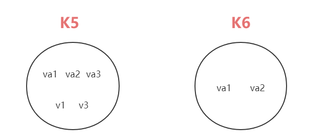

-   求交集

```jade
127.0.0.1:6379> sinter k5 k6
1) "va2"
2) "va1"
```


##### 10、sinterstore 将**交集**结果存入新集合中


>   `sinterstore destination <key1><key2>... ` 将**交集**结果存入新集合 destination 中

-   我们将 k5 k6 交集元素放入 keySinter 中

```jade
127.0.0.1:6379> sinterstore keySinter k5 k6
(integer) 2

127.0.0.1:6379> smembers keySinter
1) "va1"
2) "va2"
```


##### 11、sunion  返回两个集合的**并集**元素


>   `sunion <key1><key2>` 返回两个集合的**并集**元素 (合并集合所有元素、会去重)


```jade
127.0.0.1:6379> sunion k5 k6
1) "va2"
2) "v1"
3) "va3"
4) "v3"
5) "va1"
```


##### 12、sunionstore  将**并集**结果存入新集合中


>   `sunionstore destination <key1><key2>...` 将**并集**结果存入新集合 destination 中

-   我们将 k5 k6 中的并集元素存入 keySunion 中

```jade
127.0.0.1:6379> sunionstore keySunion k5 k6
(integer) 5

127.0.0.1:6379> smembers keySunion
1) "va2"
2) "v1"
3) "va3"
4) "v3"
5) "va1"
```


##### 13、sdiff  返回两个集合中的**差集**元素


>   `sdiff <key1><key2>`  返回两个集合中的**差集**元素 ( 以 key1 为准求差集)


-   求差集元素

```jade
127.0.0.1:6379> sdiff k5 k6
1) "v1"
2) "v3"
3) "va3"
```


##### 14、sdiffstore 将差集结果存入新集合中


>   `sdiffstore destination <key1><key2>...` 将差集结果存入新集合 destination 中

-   以 k5 为准，将 k5、k6 的差集存入 keySdiff 中

```jade
127.0.0.1:6379> sdiffstore keySdiff k5 k6
(integer) 3

127.0.0.1:6379> smembers keySdiff
1) "v1"
2) "v3"
3) "va3"
```


#### 4、Set 类型底层数据结构


Set 数据结构是 Dict 字典，字典使用哈希表实现的，Java 中的 HashSet 的内部实现使用的 HashMap，只不过所有的 value 都指向同一个对象，Redis 的 Set 结构也是一样的，它的内部也是使用 Hash 结构，所有的 value 都指向同一个内部值


### 4、Redis 之数据类型 Hash (哈希)


#### 1、Hash 类型简介


##### 1、Hash 类型介绍


Redis Hash 类型是一个键值对集合，它是一个 String 类型的 Field 和 Value 的映射表，Hash 特别适合用于存储对象，类似 Java 里面的 Map<String, Object>，用户 ID 为查找的 key，存储的 value 用户对象包含姓名，年龄，生日等信息，如果用普通的 key/value 结构来存储

主要有以下两种存储方式：

>   加入我们要存储以下对象 User { id  =  1, name  =  Lee, age  =  23 }


##### 2、用 Hash 来存储对象的几种形式


>   第一种方式：

将用户 User 作为 Key，将数据转为 Json 存入到 value 中，整体存入

-   缺点：如果要修改 age 的值，就需要将所有的字符串读取出来序列化为对象，然后修改对象年龄后，再将对象序列化为 JSON、之后再重新覆盖原来的值

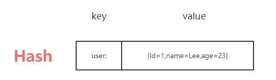


>   第二种方式：

将 `User:[field]` 作为 key，然后 value 分别进行存储

-   缺点：数据太分散了，结构也特别混乱，如果一个用户表有几十个字段，那么一个用户就要重复存几十次。那么如果有成百上千个对象，存取的次数呈指数级增长

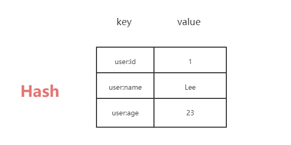

>   **第三种方式：用 Hash 来存储对象 (重点)**
>
>   -   `key --> user:id`
>   -   `value --> field:value`


所以，上面两种方式我们一般都是不用的，所以，这才有了 Hash 来存储对象。

-   存储更加方便、修改也更加方便，讲清楚了这些，我们才能更好的使用 Redis 的 Hash 结构

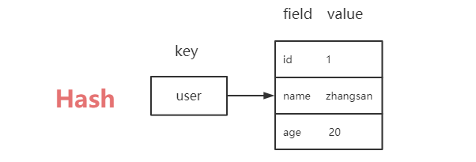


#### 2、Hash 类型常用命令


-   `hset <key><field><value>`  给 key 集合中的 field 字段赋值 value
-   `hget <key><field>`  获取 key 集合中 field 字段的 value 值
-   `hmset <k1><f1><v1><f2><v2>`  批量设置 hash 的值
-   `hexists <key><field>`  查看哈希表 key 中，给定的 field 字段是否存在
-   `hkeys <key>`  遍历该指定 key 集合中的所有 field 字段
-   `hvals <key>`  遍历该指定 key 集合中的所有 value 值
-   `hincrby <key><field><increment>`  为哈希表 key 中 filed 字段的值加上增量 increment
-   `hsetnx <key><field><value>`  当 field不存在时，将哈希表 key 中 field 的值设置为 value


#### 3、Hash 类型常用命令演示


##### 1、hset  给 key 集合中的 field 字段赋值 value


>   `hset <key><field><value>`  给 key 集合中的 field 字段赋值 value

-   我们添加用户 id 为 1000 的对象属性

    -   key：`user:1000`

    -   field：`id`

    -   value：`1000`

```jade
127.0.0.1:6379> hset user:1000 id 1000
(integer) 1
127.0.0.1:6379> hset user:1000 name Lee
(integer) 1
127.0.0.1:6379> hset user:1000 age 24
(integer) 1
```

-   遍历 user:1000 的所有 field 字段

```jade
127.0.0.1:6379> hkeys user:1000
1) "id"
2) "name"
3) "age"
```

-   遍历 user:1000 的所有 value 值

```jade
127.0.0.1:6379> hvals user:1000
1) "1000"
2) "Lee"
3) "24"
```


##### 2、hget  获取 key 集合中 field 字段的 value 值


>   `hget <key><field>`  获取 key 集合中 field 字段的 value 值

```jade
127.0.0.1:6379> hget user:1000 id
"1000"
127.0.0.1:6379> hget user:1000 name
"Lee"
```


##### 3、hmset 批量设置 hash 的值


>   `hmset <k1><f1><v1><f2><v2>`  批量设置 hash 的值

-   我们批量添加一个 user:1001 用户

```jade
127.0.0.1:6379> hmset user:1001 id 1001 name JJ age 28
OK
```

新添加的用户信息如下所示：

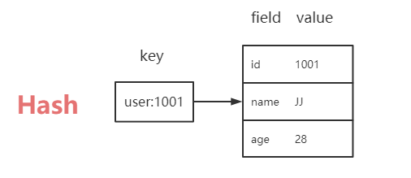

-   遍历 field 和 value

```jade
127.0.0.1:6379> hkeys user:1001
1) "id"
2) "name"
3) "age"

127.0.0.1:6379> hvals user:1001
1) "1001"
2) "JJ"
3) "28"
```


##### 4、hexists 查看哈希表 key 中给定的 field 字段是否存在


>   `hexists <key><field>`  查看哈希表 key 中，给定的 field 字段是否存在 ( 1 -> 存在、0 -> 不存在 )

```jade
127.0.0.1:6379> hexists user:1001 id
(integer) 1
127.0.0.1:6379> hexists user:1001 email
(integer) 0
```


##### 5、hkeys 遍历该指定 key 集合中的所有 field 字段


>   `hkeys <key>`  遍历该指定 key 集合中的所有 field 字段

```jade
127.0.0.1:6379> hkeys user:1001
1) "id"
2) "name"
3) "age"
```


##### 6、hvals  遍历该指定 key 集合中的所有 value 值


>   `hvals <key>`  遍历该指定 key 集合中的所有 value 值

```jade
127.0.0.1:6379> hvals user:1001
1) "1001"
2) "JJ"
3) "28"
```


##### 7、hincrby 为哈希表 key 中的 filed 字段的值加上增量 increment


>   `hincrby <key><field><increment>`  为哈希表 key 中的 filed 字段的值加上增量 increment

-   对 id 为 1000 的用户年龄增加 10 岁

```jade
127.0.0.1:6379> hincrby user:1000 age 10
(integer) 34
```

-   为 不是 num 类型的 field 做增量报以下错

```asciiarmor
127.0.0.1:6379> hincrby user:1000 name 10
(error) ERR hash value is not an integer
```


##### 8、hsetnx 当 field不存在时，将哈希表 key 中 field 的值设置为 value


>   `hsetnx <key><field><value>`  当 field不存在时，将哈希表 key 中 field 的值设置为 value

```jade
127.0.0.1:6379> hsetnx user:1000 age 24
(integer) 0

127.0.0.1:6379> hsetnx user:1000 email 520@qq.com
(integer) 1
```


#### 4、Hash 类型底层数据结构


Hash 类型对应的数据结构是两种

-   zipList 压缩列表
-   hashTable 哈希表

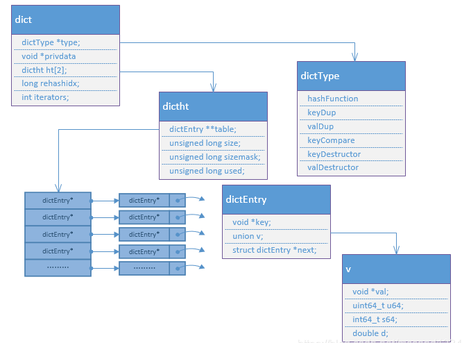

field-value 长度较短且个数较少时，使用 ziplist、否则使用 hashTable

>   zipList 的数据结构图解析

zipList 包括 zip header、zip entry、zip end 三个模块

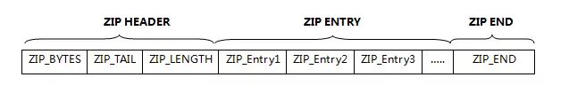

-   zip entry 又由 prevlen、encoding&length、value 三部分组成

    -   prevlen 主要是指前面 zipEntry 的长度

    -   coding&length 是指编码字段长度和实际- 存储 value 的长- 度

    -   value 是指真正的内容


-   每个 key/value 存储结果中 key 用一个 zipEntry 存储，value 用一个 zipEntry 存储


### 5、Redis 之数据类型 ZSet (有序集合)


#### 1、ZSet 类型简介


Redis 有序集合 zset 与普通集合 set 非常相似，是一个没有重复元素的字符串集合。不同之处是有序集合的每个成员都关联了一个评分 (score)、这个评分 (score) 被用来按照从最低分到最高分的方式排序集合中的成员。**集合的成员是唯一的，但是评分可以重复**

因为元素是有序的，所以你也可以很快的根据评分 (score）或者次序 (position) 来获取一个范围的元素

访问有序集合的中间元素也是非常快的,因此你能够使用有序集合作为一个没有重复成员的智能列表


#### 2、ZSet 类型常用命令


-   `zadd <key><s1><v1><score2><value2>...` 将一个或多个 member 元素及其 score 值加入 key 集合中
-   `zrange <key><start><stop> [WithScores]` 返回有序集 key 中 下标在 start 和 stop 之间的元素
    -   带 WithScores，可以让分数也一块返回到结果集

-   `zRangeByScore <key> min max [WithScores][limit offset count]`
    -   返回有序集 key 中，所有 score 值介于 min 和 max 之间（包括相等的）的成员
    -   有序成员按 Score 值从小到大排序
-   `zRevRangeByScore <key> max min [WithScores][limit offset count]`
    -   同上、只不过改为从大到小排序

-   `zincrby <key><increment><value>`  为元素的 Score 加上增量
-   `zrem <key><value>` 删除该集合下，指定值的元素
-   `zcount <key> min max `  统计该集合，分数区间内的元素个数
-   `zrank <key><value>` 返回该值在集合中的排名，从 0 开始


#### 3、ZSet 类型常用命令演示


##### 1、zadd 将一个或多个元素及其 score 值加入 key 集合中


>   `zadd <key><s1><v1><score2><value2>...` 将一个或多个 member 元素及其 score 值加入 key 集合中

-   我们做一个编程语言的排行榜

```jade
127.0.0.1:6379> zadd RankingList 100 C# 200 Java 900 C++ 1000 C
(integer) 4
```

-   遍历 RankingList

```jade
127.0.0.1:6379> zrange RankingList 0 10
1) "C#"
2) "Java"
3) "C++"
4) "C"
```


##### 2、zrange 返回 key 中下标在 start 和 stop 之间的元素


>   `zrange <key><start><stop> [WithScores]` 返回有序集 key 中 下标在 start 和 stop 之间的元素
>
>   -   带 WithScores，可以让分数也一块返回到结果集

```jade
127.0.0.1:6379> zrange RankingList 0 10 WithScores
1) "C#"
2) "100"
3) "Java"
4) "200"
5) "C++"
6) "900"
7) "C"
8) "1000"
```


##### 3、zRangeByScore 命令详解如下


>   `zRangeByScore <key> min max [WithScores][limit offset count]`
>
>   -   返回有序集 key 中，所有 score 值介于 min 和 max 之间（包括相等的）的成员
>   -   有序成员按 Score 值从小到大排序

-   返回 RankingList 中 Score 在 100 ~ 500 之间的元素

```jade
127.0.0.1:6379> zrangebyscore RankingList 100 500 WithScores
1) "C#"
2) "100"
3) "Java"
4) "200"
```


##### 4、zRevRangeByScore 命令详解如下


>   `zRevRangeByScore <key> max min [WithScores][limit offset count]`
>
>   -   同上、只不过改为从大到小排序

```jade
127.0.0.1:6379> zrevrangebyscore RankingList 500 100 WithScores
1) "Java"
2) "200"
3) "C#"
4) "100"
```


##### 5、zincrby  为元素的 Score 加上增量


>   `zincrby <key><increment><value>`  为元素的 Score 加上增量

```jade
127.0.0.1:6379> zincrby RankingList 50 C#
"150"
```


##### 6、zrem 删除该集合下，指定值的元素


>   `zrem <key><value>` 删除该集合下，指定值的元素

```jade
127.0.0.1:6379> zrem RankingList C
(integer) 1
```


##### 7、zcount 统计该集合，分数区间内的元素个数


>   `zcount <key> min max `  统计该集合，分数区间内的元素个数

```jade
127.0.0.1:6379> zrange RankingList 0 10
1) "C#"
2) "Java"
3) "C++"

127.0.0.1:6379> zcount RankingList 100 500
(integer) 2
```


##### 8、zrank 返回该值在集合中的排名，从 0 开始


>   `zrank <key><value>` 返回该值在集合中的排名，从 0 开始

```jade
127.0.0.1:6379> zrange RankingList 0 100
1) "C#"
2) "Java"
3) "C++"

127.0.0.1:6379> zrank RankingList Java
(integer) 1
```


#### 4、ZSet 类型底层数据结构


SortedSet(zset) 是 Redis 提供的一个非常特别的数据结构，一方面它等价于 Java 的数据结构 Map<String，Double>，可以给每一个元素 value 赋予一个权重 score，另一方面它又类似于 TreeSet，内部的元素会按照权重 score 进行排序，可以得到每个元素的名次，还可以通过 score 的范围来获取元素的列表

zetSet 底层使用了两个数据结构


##### 1、hash 数据结构


>   hash 的作用就是关联元素 value 和权重 score，保障元素 value 的唯—性，可以通过元素 value 找到相应的 score 值

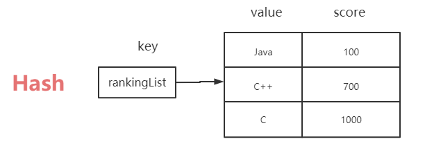


##### 2、跳跃表结构


>   跳跃表的目的在于给元素 value 排序，根据 score 的范围获取元素列表

有序集合在生活中比较常见，例如根据成绩对学生排名，根据得分对玩家排名等。对于有序集合的底层实现，可以用数组、平衡树、链表等。数组不便元素的插入，删除。平衡树或红黑树虽然效率高但结构复杂；链表查询需要遍历所有效率低。Redis 采用的是跳跃表。**跳跃装效率堪比红黑树，实现远比红黑树简单**

**跳表(SkipList)：增加了向前指针的链表叫做指针。跳表全称叫做跳跃表，简称跳表。跳表是一个随机化的数据结构，实质是一种可以进行二分查找的有序链表。跳表在原有的有序链表上增加了多级索引，通过索引来实现快速查询。跳表不仅能提高搜索性能，同时也可以提高插入和删除操作的性能**


跳跃表的性质：

-   由很多层结构组成，level 是通过一定的概率随机产生的
-   每一层都是一个有序的链表，默认是升序
-   最底层 (Level 1) 的链表包含所有元素
-   如果一个元素出现在 Level i 的链表中，则它在 Level i 之下的链表也都会出现
-   每个节点包含两个指针，一个指向同一链表中的下一个元素，一个指向下面一层的元素


>   有序链表和跳跃表对比

**有序链表**

-   要查找值为 51 的元素、需要从第一个元素**开始依次查找**，比较才能找到，共需要 6 次比较

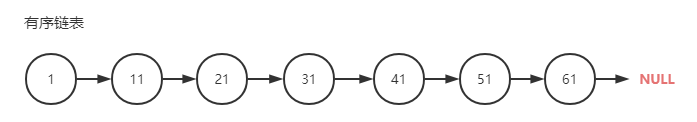


**跳跃表**

-   从二级索引开始

    -   1 节点比 51 节点小，向后比较

    -   21 节点比 51 节点小，继续向后比较，可是后面是 Null、所以从 21 节点向下到一级索引

-   一级索引的比较

    -   41 节点 比 51 节点小，所以继续向后查找，61 节点比 51 节点大，所以从 41 向下查找

-   原始链表的对比

    -   在原始链表中，51 节点被找到、共查找 4 次

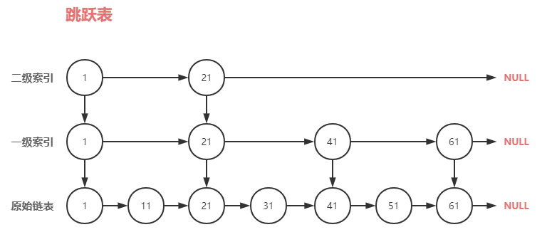


## 5、Redis 6 之三大新数据类型


### 1、Redis 之新数据类型 Bitmaps


#### 1、Bitmaps 类型简介


**Bitmap 位图**：现代计算机用二进制 (位) 作为信息的基础单位，1 个字节等于 8 位，例如 “abc" 字符串是由 3 个字节组成，但实际在计算机存储时将其用二进制表示，“abc” 分别对应的 ASCII 码分别是 97、98、99，对应的二进制分别是 01100001、01100010 和 01100011。如下图

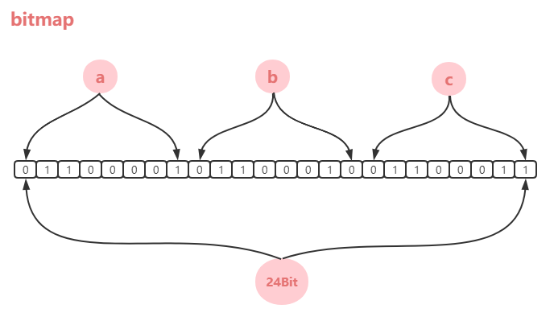


合理地使用操作位能够有效地提高内存使用率和开发效率。Redis提供了 Bitmaps 这个“数据类型”可以实现对位的操作

-   Bitmaps 本身不是一种数据类型，实际上它就是字符串( key-value ) 但是它可以对字符串的位进行操作
-   Bitmaps 单独提供了一套命令，所以在 Redis 中使用 Bitmaps 和使用字符串的方法不太相同，可以把 Bitmaps 想象成一个以位为单位的数组，数组的每个单元只能存储 0 和 1，数组的下标在 Bitmaps 心中叫做偏移量

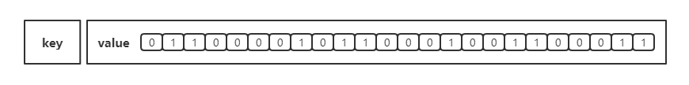


#### 2、Bitmaps 类型常用命令


-   `setbit <key><offset><value>`  设置 Bitmaps 中某个偏移量的值 ( 0 或 1)
-   -   偏移量从 0 开始

-   `getbit <key><offset>`  获取 Bitmaps 中某个偏移量的值
-   `bitcount <key>`  统计指定 key 中字符串被设置为 1 的 bit 数
-   `bitcount <key> [start end]`  统计字符串从 start 到 end 字节组比特值为 1 的数量
    -   注意：统计的是字节组 （1 byte = 8 bit）
    -   -1 表示最后一位，而 -2 表示倒数第二位，Start、End 是指 bit 组的字节的下标数，二者皆包含

-   `bitop and (or/not/xor) <destkey> [key]`    bitop 是一个复合操作、它可以做多个Bitmaps 的 and (交集)、or (并集)、not (非)、xor (异或) 操作并将结果保存在 destkey 中


#### 3、Bitmaps 类型常用命令演示


##### 1、setbit 设置 Bitmaps 中某个偏移量的值


>   `setbit <key><offset><value>`  设置 Bitmaps 中某个偏移量的值 ( 0 或 1)
>
>   -   偏移量从 0 开始

就拿每个独立用户是否访问过网站举例，可以存放在 Bitmaps 中，将访问的用户记做 1，没有访问的用户记作 0，用偏移量作为用户 ID、设置键的第 offset 个位的值 (从 0 算起)，假设现在有 20 个用户， userid = 1、6、11、15、19 的几个用户对网站进行了访问，那么当前 Bitmaps 初始化结果如图

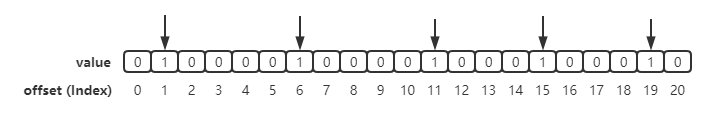

注意：很多应用的用户 id 以一个指定数字 （例如 10000） 开头，直接将用户 id 和 Bitmaps 的偏移量对应势必会造成一定的浪费，通常的做法是每次做 setbit 操作时将用户 id 减去这个指定的数字，**在第一次初始化 bitmaps 时，如果偏移量非常大，那么整个初始化过程执行比较慢，可能会造成 Redis 阻塞**


-   我们设置一个 userid 的 key、并按照 1、6、11、15、19 的偏移量依次赋值为1

```jade
127.0.0.1:6379> setbit userid 1 1
(integer) 0
127.0.0.1:6379> setbit userid 6 1
(integer) 0
127.0.0.1:6379> setbit userid 11 1
(integer) 0
127.0.0.1:6379> setbit userid 15 1
(integer) 0
127.0.0.1:6379> setbit userid 19 1
(integer) 0
```


##### 2、getbit 获取 Bitmaps 中某个偏移量的值


>   `getbit <key><offset>`  获取 Bitmaps 中某个偏移量的值

-   我们依次获取 offset 为 1、15、20 的值进行验证

```jade
127.0.0.1:6379> getbit userid 1
(integer) 1
127.0.0.1:6379> getbit userid 15
(integer) 1
127.0.0.1:6379> getbit userid 20
(integer) 0
```


##### 3、bitcount key 统计指定 key 中字符串被设置为1的 bit 数


>   `bitcount <key>`  统计指定 key 中字符串被设置为 1 的 bit 数

-   我们统计 userid  中 bit 为 1 的数量、按理应该为 5

```jade
127.0.0.1:6379> bitcount userid
(integer) 5
```


##### 4、bitcount  统计字符串从 start 到 end 字节组比特值为 1 的数量


>   `bitcount <key> [start end]`  统计字符串从 start 到 end 字节组比特值为 1 的数量
>
>   -   注意：统计的是字节组（1 byte = 8 bit）
>   -   -1 表示最后一位，而 -2 表示倒数第二位，start、end 是指 bit 组的字节的下标数，二者皆包含

例如 key 为 userid 的 bitmaps 存了 5 个数据，图解如下：

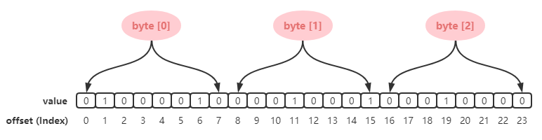

如上分析：我们可以得知大致开辟了 3 个字节组来存放 userid 中的数据，字节组的下标也是从 0 开始

```java
//byte[0]  byte[1]   byte[2]
01000010  00010001  000010000
```


-   那么我们进行以下命令统计

```java
// 统计下标 1、2 字节组中 bit = 1 的个数、即 [ 00010001  000010000 ]  --> 3
127.0.0.1:6379> bitcount userid 1 2
(integer) 3
```

```java
// 统计下标 2 字节数组中 bit = 1 的个数，即 [ 000010000 ] --> 1
127.0.0.1:6379> bitcount userid 2 2
(integer) 1
```

```java
// 也就是统计所有字节组 bit = 1 的数量，即 [ 01000010  00010001  000010000 ] --> 5
127.0.0.1:6379> bitcount userid 0 -1
(integer) 5
```

**注意：Redis 的 setbit 设置或清除的是 bit 位，而 bitcount 计算的是 byte 位**


##### 5、bitop 是一个复合操作


>   `bitop and (or/not/xor) <destkey> [key]`    bitop 是一个复合操作、它可以做多个Bitmaps 的 and (交集)、or (并集)、not (非)、xor (异或) 操作并将结果保存在 destkey 中


我们设想一个场景：我们要统计 2020-11-03 和 2020-11-04 两天的用户都活跃的情况，那我们以日期 users:日期 为 key，用户的 id 为偏移量，比如用户 ID 为 1000 的用户 2020-11-03 登录了网站，那么我们可以这样设置：

```java
//设置为 1 表示 ID 为 1000 用户在 20201103 登录了网站
setbit active_users:20201103 1000 1
```


**接下来我们正式开始测试**

-   假如 2020-11-03 日、 ID 分别为 0、1、4、9 的用户登录了网站

```jade
127.0.0.1:6379> setbit active:users:20201103 0 1
(integer) 0
127.0.0.1:6379> setbit active:users:20201103 1 1
(integer) 0
127.0.0.1:6379> setbit active:users:20201103 4 1
(integer) 0
127.0.0.1:6379> setbit active:users:20201103 9 1
(integer) 0
```

-   假如 2020-11-04 日、 ID 分别为 1、2、5、9 的用户登录了网站

```jade
127.0.0.1:6379> setbit active:users:20201104 1 1
(integer) 0
127.0.0.1:6379> setbit active:users:20201104 2 1
(integer) 0
127.0.0.1:6379> setbit active:users:20201104 5 1
(integer) 0
127.0.0.1:6379> setbit active:users:20201104 9 1
(integer) 0
```

-   计算出这两天都访问过网站的用户数量 (也就是求交集)

```java
bitop and unique:active:users:20201103_04 active:users:20201103 active:users:20201104
(integer) 2
```

如下图所示

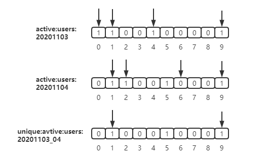


#### 4、Bitmaps 类型 与 Set 类型对比


假设网站有 1 亿用户，每天独立访问的用户有 5 千万，如果每天用 Set 集合类型 和 Bitmaps 分别存储活跃用户可以得到表，那么 Set 和 Bitmaps 存储一天活跃用户对比如下：

| 数据类型    | 每个用户 id 占用空间 | 需要存储的用户量 | 全部内存量                         |
| ----------- | -------------------- | ---------------- | ---------------------------------- |
| Set集合类型 | 64 位                | 5 千万           | 64 位 * 5 千万 = 400 MB            |
| Bitmaps     | 1 位                 | 1 亿             | 1 位 * 1 亿 = 12.5 MB (缩小了32倍) |


很明显、这种情况下使用 Bitmaps 能节省很多的内存空间，尤其是随着时间推移节省的内存还是非常可观的，但是 Bitmaps 并不是万金油，我们来分析以下案例

假如该网站每天的独立访问用户很少，例如只有 10 万用户访问 (总用户依然 5 千万)，那么两者的对比如下所示，很显然，这时候使用 Bitmaps 就不太合适了，因为基本上大部分位都是 0、那么此时 Set 和 Bitmaps 存储一天活跃用户对比 (独立用户较少) 如下

| 数据类型    | 每个用户 id 占用空间 | 需要存储的用户量 | 全部内存量            |
| ----------- | -------------------- | ---------------- | --------------------- |
| Set集合类型 | 64 位                | 10 万            | 64 位 * 10 万 = 800KB |
| Bitmaps     | 1 位                 | 1 亿             | 1 位 * 1 亿 = 12.5 MB |

>   解析：因为 Set集合可以只存储每天活跃的用户量就可以了，而 Bitmaps 则需要提前开辟能存储下5千万用户的 bit 信息
>
>   Bitmap 数据结构的 Java 代码实现参考笔记 Data Structure


### 2、Redis 之新数据类型 HyperLogLog


#### 1、HyperLogLog 类型简介


在实际工作当中，我们经常会遇到与统计相关的功能需求，比如统计网站 PV (PageView) 页面访问量，可以使用 Redis 的 incr、incrby 轻松实现，但是像 UV (UniqueVisitor) 独立访客 (同一用户访问网站多次，只记录一次)，独立 IP 数、搜索记录数等需要去重和计数的问题如何解决？这种集合中不重复元素个数的问题称为基数问题

>   什么是基数？

比如数据集 {1、3、5、7、5、7、8}，那么这个数据集的基数集为 { 1、3、5、7、8 }，基数 (去重后的集合元素个数) 为 5，基数估计就是在误差可接受的范围内，快速计算基数。

解决基数问题有很多种方案：

-   数据存储在 MySQL 表中，使用 distinct count 计算不重复个数
-   使用 Redis 提供的 hash、set、bitmaps 等数据结构来处理

以上的方案结果精确，但随着数据不断增加，导致占用的空间越来越大，对于非常大的数据集是不切实际的，能否降低一定的精度来平衡存储空间？Redis 推出了 HyperLogLog类型，这种类型是用来做基数统计的算法，HyperLogLog 的优点是，在输入元素的数量或者体积非常非常大时，计算基数所需的空间总是固定的，并且是很小的

在 Redis 里面，每个 HyperLogLog 键只需要花费 12 KB 内存，就可以计算接近 2^64 个不同元素的基数。这和计算基数时，元素越多耗费内存就越多的集合形成鲜明对比。但是，因为 HyperLogLog 只会根据输入元素来计算基数，而不会储存输入元素本身，所以 HyperLogLog 不能像集合那样，返回输入的各个元素。


#### 2、HyperLogLog 类型常用命令


-   `pfadd <key><element> [element...]`  添加单个或多个元素到 HyperLogLog 中
-   `pfcount <key> [key...]`  计算单个或多个Key 的 HLL 的近似基数
    -   比如用 HLL 存储每天的 UV，计算一周的 UV 可以使用 7 天的 UV 合并计算
-   `pfmerge <destkey><sourcekey> [sourcekey...]`  将单个或多个 HLL 合并后的结果存储在另一个 HLL 中


#### 3、HyperLogLog 类型常用命令演示


##### 1、pfadd 添加单个或多个元素到 HyperLogLog 中


>   `pfadd <key><element> [element...]`  添加单个或多个元素到 HyperLogLog 中

```jade
127.0.0.1:6379> pfadd language "java" "c++" "c" "c#" "java"
(integer) 1
```


##### 2、pfcount 计算单个或多个 Key 的 HLL 的近似基数


>   `pfcount <key> [key...]`  计算单个或多个Key 的 HLL 的近似基数
>
>   -   比如用 HLL 存储每天的 UV，计算一周的 UV 可以使用 7 天的 UV 合并计算

```jade
127.0.0.1:6379> pfcount language
(integer) 4
```


##### 3、pfmerge 将单个或多个 HLL 合并后的结果存储在另一个 HLL 中


>   `pfmerge <destkey><sourcekey> [sourcekey...]`  将单个或多个 HLL 合并后的结果存储在另一个 HLL 中

-   我们在添加一个 key

```jade
127.0.0.1:6379> pfadd language2 "php"
(integer) 1
127.0.0.1:6379> pfadd language2 "javascript"
(integer) 1
127.0.0.1:6379> pfcount language2
(integer) 2
```

-   合并两个 key

```jade
127.0.0.1:6379> pfmerge merge:language language language2
OK
127.0.0.1:6379> pfcount merge:language
(integer) 6
```


#### 4、HyperLogLog 类型底层数据结构


>   参考：
>
>   Redis 源码中 HyperLogLog 结构的实现原理是什么？ - 张戎的回答 - 知乎 https://www.zhihu.com/question/53416615/answer/1227317241


### 3、Redis 之新数据类型 Geospatial


#### 1、Geospatial 类型简介


Redis 3.2 中增加了对 GEO 类型的支持。GEO ( Geospatial )，地理信息的缩写。该类型就是元素的 2 维坐标，在地图上就就是经纬度，Redis 基于该类型，提供了经纬度设置，查询，范围查询，距离查询，经纬度 Hash 等常见操作。这些数据将会存储到 Sorted Set 这样的目的是为了方便使用 GEORADIUS 或者 GEORADIUSBYMEMBER 命令对数据进行半径查询等操作

Sorted Set 使用一种称为 Geohash 的技术进行填充。经度和纬度的位是交错的，以形成一个独特的 52 位整数. 我们知道，一个 Sorted Set 的 Double Score 可以代表一个 52 位的整数，而不会失去精度。这种格式允许半径查询检查的 1 + 8 个领域需要覆盖整个半径，并丢弃元素以外的半径。通过计算该区域的范围，通过计算所涵盖的范围，从不太重要的部分的排序集的得分，并计算得分范围为每个区域的 Sorted Set 中的查询


#### 2、Geospatial 类型常用命令


-   `geoadd <key><longitude><latitude><member> [longitude latitude member...]`
    -   添加单个或多个地理位置 (经度、维度、名称)
-   `geopos <key><member> [member...]`  获取单个或多个指定地区的坐标值
-   `geodist <key><member1><member2> [m|km|ft|mi]`  获取两个位置之间的直线距离
    -   m：米 [默认值]  |  km：千米  |  ft：英尺  |  mi：英里 
-   `georadius <key><longitude><latitude>radius [m|km|ft|mi]`
    -   以给定的经纬度为中心找出某一半径内的元素


#### 3、Geospatial  类型常用命令演示


##### 1、geoadd 添加单个或多个地理位置 (经度、维度、名称)


>   -   `geoadd <key><longitude><latitude><member> [longitude latitude member...]`
>       -   添加单个或多个地理位置 (经度、维度、名称)

下面我们来进行演示：

-   上海的经纬度：121.47  31.23  shanghai
-   重庆的经纬度：106.50  29.53  chongqing
-   深圳的经纬度：114.05 22.52  shenzhen
-   北京的经纬度：116.38 39.90  beijing

```jade
127.0.0.1:6379> geoadd china:city 121.47 31.23 shanghai
(integer) 1
127.0.0.1:6379> geoadd china:city 106.50 29.53 chongqing
(integer) 1
127.0.0.1:6379> geoadd china:city 114.05 22.52 shenzhen
(integer) 1
127.0.0.1:6379> geoadd china:city 116.38 39.90 beijing
(integer) 1
```

注意：两极无法直接添加，一般会下载城市数据，直接通过 Java 程序一次性写入

-   有效的经度范围 [ -180° ~ 180° ]
-   有效的纬度范围 [ -85.05112878° ~ 85.05112878° ]

当坐标位置超出指定范围时，该命令将会返回一个错误，已经添加的数据，是无法再次往里面添加的


##### 2、geopos  获取单个或多个指定地区的坐标值


>   `geopos <key><member> [member...]`  获取单个或多个指定地区的坐标值

```jade
127.0.0.1:6379> geopos china:city shanghai
1) 1) "121.47000163793563843"
   2) "31.22999903975783553"
```


##### 3、geodist 获取两个位置之间的直线距离


>   `geodist <key><member1><member2> [m|km|ft|mi]`  获取两个位置之间的直线距离
>
>   -   m：米 [默认值]  |  km：千米  |  mi：英里  |  ft：英尺

-   我们获取以下上海和重庆的距离

```jade
127.0.0.1:6379> geodist china:city shanghai chongqing
"1447673.6920"

127.0.0.1:6379> geodist china:city shanghai chongqing km
"1447.6737"
```


##### 4、georadius 以给定的经纬度为中心找出某一半径内的元素


>   `georadius <key><longitude><latitude>radius [m|km|ft|mi]`
>
>   -   以给定的经纬度为中心找出某一半径内的元素

-   找出经纬度为 110 30 附近 1000 km 之内的城市

```jade
127.0.0.1:6379> georadius china:city 110 30 1000 km
1) "chongqing"
2) "shenzhen"
```


## 6、Redis 配置文件和 Jedis


### 1、redis.conf 配置文件详解


#### 1、Units 单位


-   配置内存大小时单位、开头定义了一些基本的度量单位，只支持 bytes、不支持 bit、大小写不敏感

```shell
# Note on units: when memory size is needed, it is possible to specify
# it in the usual form of 1k 5GB 4M and so forth:
#
# 1k => 1000 bytes
# 1kb => 1024 bytes
# 1m => 1000000 bytes
# 1mb => 1024*1024 bytes
# 1g => 1000000000 bytes
# 1gb => 1024*1024*1024 bytes
#
# units are case insensitive so 1GB 1Gb 1gB are all the same.
```


#### 2、INCLUDES 包含多个配置文件


-   例如你配置了多个配置文件可以进行关联
-   `include /path/to/local.conf`
-   `include /path/to/other.conf`

```shell
################################## INCLUDES ###################################

# Include one or more other config files here.  This is useful if you
# have a standard template that goes to all Redis servers but also need
# to customize a few per-server settings.  Include files can include
# other files, so use this wisely.
#
# Note that option "include" won't be rewritten by command "CONFIG REWRITE"
# from admin or Redis Sentinel. Since Redis always uses the last processed
# line as value of a configuration directive, you'd better put includes
# at the beginning of this file to avoid overwriting config change at runtime.
#
# If instead you are interested in using includes to override configuration
# options, it is better to use include as the last line.
#
# include /path/to/local.conf
# include /path/to/other.conf
```


#### 3、MODULES 启动时加载的模块


>   启动时加载模块、如果服务器无法加载模块 、它将中止。 可以使用多个 loadmodule 指令

```shell
################################## MODULES #####################################

# Load modules at startup. If the server is not able to load modules
# it will abort. It is possible to use multiple loadmodule directives.
#
# loadmodule /path/to/my_module.so
# loadmodule /path/to/other_module.so
```


#### 4、NETWORK 访问 Redis 网络配置


##### 1、bind 参数介绍


-   默认情况 bind=127.0.0.1 只能接受本机的访问请求，不写的情况下，无限制接收任何 ip 地址的访问
-   生产环境下肯定要写你应用服务器的地址，服务器是需要远程访问的
-   **如果开启了 protected-mode，那么在没有设定 bing ip 且没有设密码的情况下， Redis 只允许接收本机的响应**


##### 2、NETWORK 模块所有可配置参数


```shell
bind 127.0.0.1 -::1 # 配置允许访问的 ip 地址、如果不写、无限制接收任何 ip 地址的访问
protected-mode yes  # 开启 Redis 保护模式，也就是只能通过本机访问
port 6379           # 默认端口号配置

# 设置 tcp 的 backlog、其实就是一个连接队列
# backlog 队列总和 = 未完成三次握手队列 + 已完成三次握手队列
tcp-backlog 511

timeout 0         # 表示一个客户端空闲未操作多少秒自动关闭连接、默认 0 (永不关闭)
tcp-keepalive 300 # 表示客户端与 Redis 的心跳连接：默认300秒检测一次，如果未检测到心跳则断开连接
```

-   tcp-backlog：在高并发情况下、你需要一个高 backlog 值来避免慢客户端连接问题，注意 Linux 内核会将该值减小到 `/proc/sys/net/core/somaxconn` 的值 (128)。所以需要确认增大该值 和 `/proc/sys/net/ipv4/tcp_max_syn_backlog` (128) 两个值来达到想要的效果


##### 3、NETWORK 原配置如下


```shell
################################## NETWORK #####################################

# By default, if no "bind" configuration directive is specified, Redis listens
# for connections from all available network interfaces on the host machine.
# It is possible to listen to just one or multiple selected interfaces using
# the "bind" configuration directive, followed by one or more IP addresses.
# Each address can be prefixed by "-", which means that redis will not fail to
# start if the address is not available. Being not available only refers to
# addresses that does not correspond to any network interfece. Addresses that
# are already in use will always fail, and unsupported protocols will always BE
# silently skipped.
#
# Examples:
#
# bind 192.168.1.100 10.0.0.1     # listens on two specific IPv4 addresses
# bind 127.0.0.1 ::1              # listens on loopback IPv4 and IPv6
# bind * -::*                     # like the default, all available interfaces
#
# ~~~ WARNING ~~~ If the computer running Redis is directly exposed to the
# internet, binding to all the interfaces is dangerous and will expose the
# instance to everybody on the internet. So by default we uncomment the
# following bind directive, that will force Redis to listen only on the
# IPv4 and IPv6 (if available) loopback interface addresses (this means Redis
# will only be able to accept client connections from the same host that it is
# running on).
#
# IF YOU ARE SURE YOU WANT YOUR INSTANCE TO LISTEN TO ALL THE INTERFACES
# JUST COMMENT OUT THE FOLLOWING LINE.
# ~~~~~~~~~~~~~~~~~~~~~~~~~~~~~~~~~~~~~~~~~~~~~~~~~~~~~~~~~~~~~~~~~~~~~~~~
bind 127.0.0.1 -::1

# Protected mode is a layer of security protection, in order to avoid that
# Redis instances left open on the internet are accessed and exploited.
#
# When protected mode is on and if:
#
# 1) The server is not binding explicitly to a set of addresses using the
#    "bind" directive.
# 2) No password is configured.
#
# The server only accepts connections from clients connecting from the
# IPv4 and IPv6 loopback addresses 127.0.0.1 and ::1, and from Unix domain
# sockets.
#
# By default protected mode is enabled. You should disable it only if
# you are sure you want clients from other hosts to connect to Redis
# even if no authentication is configured, nor a specific set of interfaces
# are explicitly listed using the "bind" directive.
protected-mode yes

# Accept connections on the specified port, default is 6379 (IANA #815344).
# If port 0 is specified Redis will not listen on a TCP socket.
port 6379

# TCP listen() backlog.
#
# In high requests-per-second environments you need a high backlog in order
# to avoid slow clients connection issues. Note that the Linux kernel
# will silently truncate it to the value of /proc/sys/net/core/somaxconn so
# make sure to raise both the value of somaxconn and tcp_max_syn_backlog
# in order to get the desired effect.
tcp-backlog 511

# Unix socket.
#
# Specify the path for the Unix socket that will be used to listen for
# incoming connections. There is no default, so Redis will not listen
# on a unix socket when not specified.
#
# unixsocket /run/redis.sock
# unixsocketperm 700

# Close the connection after a client is idle for N seconds (0 to disable)
timeout 0

# TCP keepalive.
#
# If non-zero, use SO_KEEPALIVE to send TCP ACKs to clients in absence
# of communication. This is useful for two reasons:
#
# 1) Detect dead peers.
# 2) Force network equipment in the middle to consider the connection to be
#    alive.
#
# On Linux, the specified value (in seconds) is the period used to send ACKs.
# Note that to close the connection the double of the time is needed.
# On other kernels the period depends on the kernel configuration.
#
# A reasonable value for this option is 300 seconds, which is the new
# Redis default starting with Redis 3.2.1.
tcp-keepalive 300
```


#### 5、GENERAL 进程日志库数量等配置


##### 1、GENERAL 模块所有可配置参数


```shell
daemonize no     # Redis 的启动方式：yes 前台启动、no 后台启动

# 存放 Redis 的进程号的位置、每个实例都会产生一个不同的 pid 文件
pidfile /var/run/redis_6379.pid

# Redis 中的日志级别(四种)
# debug：大量的信息、对开发/测试很有帮助、类似 Java 中的 Debug
# verbose：输出一些有用关键的信息、类似 Java 中的 Info
# notice：(默认)生产环境上使用的级别
# warning：只记录 关键的/非常重要的 日志信息
loglevel notice

logfile ""    # 设置 Redis 日志输出路径、默认为空
databases 16  # Redis 默认有 16 个库

# 以下跟修改 Redis 进程信息相关
always-show-logo no
set-proc-title yes
proc-title-template "{title} {listen-addr} {server-mode}"
```


##### 2、GENERAL 原配置如下


```shell
################################# GENERAL #####################################

# By default Redis does not run as a daemon. Use 'yes' if you need it.
# Note that Redis will write a pid file in /var/run/redis.pid when daemonized.
# When Redis is supervised by upstart or systemd, this parameter has no impact.
daemonize no

# If you run Redis from upstart or systemd, Redis can interact with your
# supervision tree. Options:
#   supervised no      - no supervision interaction
#   supervised upstart - signal upstart by putting Redis into SIGSTOP mode
#                        requires "expect stop" in your upstart job config
#   supervised systemd - signal systemd by writing READY=1 to $NOTIFY_SOCKET
#                        on startup, and updating Redis status on a regular
#                        basis.
#   supervised auto    - detect upstart or systemd method based on
#                        UPSTART_JOB or NOTIFY_SOCKET environment variables
# Note: these supervision methods only signal "process is ready."
#       They do not enable continuous pings back to your supervisor.
#
# The default is "no". To run under upstart/systemd, you can simply uncomment
# the line below:
#
# supervised auto

# If a pid file is specified, Redis writes it where specified at startup
# and removes it at exit.
#
# When the server runs non daemonized, no pid file is created if none is
# specified in the configuration. When the server is daemonized, the pid file
# is used even if not specified, defaulting to "/var/run/redis.pid".
#
# Creating a pid file is best effort: if Redis is not able to create it
# nothing bad happens, the server will start and run normally.
#
# Note that on modern Linux systems "/run/redis.pid" is more conforming
# and should be used instead.
pidfile /var/run/redis_6379.pid

# Specify the server verbosity level.
# This can be one of:
# debug (a lot of information, useful for development/testing)
# verbose (many rarely useful info, but not a mess like the debug level)
# notice (moderately verbose, what you want in production probably)
# warning (only very important / critical messages are logged)
loglevel notice

# Specify the log file name. Also the empty string can be used to force
# Redis to log on the standard output. Note that if you use standard
# output for logging but daemonize, logs will be sent to /dev/null
logfile ""

# To enable logging to the system logger, just set 'syslog-enabled' to yes,
# and optionally update the other syslog parameters to suit your needs.
# syslog-enabled no

# Specify the syslog identity.
# syslog-ident redis

# Specify the syslog facility. Must be USER or between LOCAL0-LOCAL7.
# syslog-facility local0

# To disable the built in crash log, which will possibly produce cleaner core
# dumps when they are needed, uncomment the following:
#
# crash-log-enabled no

# To disable the fast memory check that's run as part of the crash log, which
# will possibly let redis terminate sooner, uncomment the following:
#
# crash-memcheck-enabled no

# Set the number of databases. The default database is DB 0, you can select
# a different one on a per-connection basis using SELECT <dbid> where
# dbid is a number between 0 and 'databases'-1
databases 16

# By default Redis shows an ASCII art logo only when started to log to the
# standard output and if the standard output is a TTY and syslog logging is
# disabled. Basically this means that normally a logo is displayed only in
# interactive sessions.
#
# However it is possible to force the pre-4.0 behavior and always show a
# ASCII art logo in startup logs by setting the following option to yes.
always-show-logo no

# By default, Redis modifies the process title (as seen in 'top' and 'ps') to
# provide some runtime information. It is possible to disable this and leave
# the process name as executed by setting the following to no.
set-proc-title yes

# When changing the process title, Redis uses the following template to construct
# the modified title.
#
# Template variables are specified in curly brackets. The following variables are
# supported:
#
# {title}           Name of process as executed if parent, or type of child process.
# {listen-addr}     Bind address or '*' followed by TCP or TLS port listening on, or
#                   Unix socket if only that's available.
# {server-mode}     Special mode, i.e. "[sentinel]" or "[cluster]".
# {port}            TCP port listening on, or 0.
# {tls-port}        TLS port listening on, or 0.
# {unixsocket}      Unix domain socket listening on, or "".
# {config-file}     Name of configuration file used.
#
proc-title-template "{title} {listen-addr} {server-mode}"
```


#### 6、SECURITY 安全模块配置


##### 1、SECURITY  模块所有可配置参数


```shell
# 访问密码的查看、设置和取消
# 在命令中设置密码、只是临时的, 重启 Redis 服务器后、密码就还原了
# 永久设置、需要在配置文件中进行
requirepass 123456


# ACL LOG 日志相关
acllog-max-len 128
```


##### 2、配置 Redis 密码的两种方式


-   第一种：在配置文件中配置 requirepass

```shell
requirepass 123456
```

-   第二种：在命令界面设置密码：
-   如果没有在配置文件中配置 requirepass，redis 重启后密码将失效

```java
// 获取下当前配置
127.0.0.1:6379> config get requirepass
1) "requirepass"

// 设置当前密码
127.0.0.1:6379> config set requirepass 123456
```


##### 3、登录有密码的 Redis


-   第一种方式：在登陆的时候输入密码

```jade
[root@lee redis-6.2.4]# redis-cli -p 6379 -a 123456
```

-   第二种方式：先登录后验证

```jade
[root@lee redis-6.2.4]# redis-cli -p 6379
redis 127.0.0.1:6379> auth 123456
```


##### 4、SECURITY 原配置如下


```shell
################################## SECURITY ###################################

# Warning: since Redis is pretty fast, an outside user can try up to
# 1 million passwords per second against a modern box. This means that you
# should use very strong passwords, otherwise they will be very easy to break.
# Note that because the password is really a shared secret between the client
# and the server, and should not be memorized by any human, the password
# can be easily a long string from /dev/urandom or whatever, so by using a
# long and unguessable password no brute force attack will be possible.

# Redis ACL users are defined in the following format:
#
#   user <username> ... acl rules ...
#
# For example:
#
#   user worker +@list +@connection ~jobs:* on >ffa9203c493aa99
#
# The special username "default" is used for new connections. If this user
# has the "nopass" rule, then new connections will be immediately authenticated
# as the "default" user without the need of any password provided via the
# AUTH command. Otherwise if the "default" user is not flagged with "nopass"
# the connections will start in not authenticated state, and will require
# AUTH (or the HELLO command AUTH option) in order to be authenticated and
# start to work.
#
# The ACL rules that describe what a user can do are the following:
#
#  on           Enable the user: it is possible to authenticate as this user.
#  off          Disable the user: it's no longer possible to authenticate
#               with this user, however the already authenticated connections
#               will still work.
#  skip-sanitize-payload    RESTORE dump-payload sanitation is skipped.
#  sanitize-payload         RESTORE dump-payload is sanitized (default).
#  +<command>   Allow the execution of that command
#  -<command>   Disallow the execution of that command
#  +@<category> Allow the execution of all the commands in such category
#               with valid categories are like @admin, @set, @sortedset, ...
#               and so forth, see the full list in the server.c file where
#               the Redis command table is described and defined.
#               The special category @all means all the commands, but currently
#               present in the server, and that will be loaded in the future
#               via modules.
#  +<command>|subcommand    Allow a specific subcommand of an otherwise
#                           disabled command. Note that this form is not
#                           allowed as negative like -DEBUG|SEGFAULT, but
#                           only additive starting with "+".
#  allcommands  Alias for +@all. Note that it implies the ability to execute
#               all the future commands loaded via the modules system.
#  nocommands   Alias for -@all.
#  ~<pattern>   Add a pattern of keys that can be mentioned as part of
#               commands. For instance ~* allows all the keys. The pattern
#               is a glob-style pattern like the one of KEYS.
#               It is possible to specify multiple patterns.
#  allkeys      Alias for ~*
#  resetkeys    Flush the list of allowed keys patterns.
#  &<pattern>   Add a glob-style pattern of Pub/Sub channels that can be
#               accessed by the user. It is possible to specify multiple channel
#               patterns.
#  allchannels  Alias for &*
#  resetchannels            Flush the list of allowed channel patterns.
#  ><password>  Add this password to the list of valid password for the user.
#               For example >mypass will add "mypass" to the list.
#               This directive clears the "nopass" flag (see later).
#  <<password>  Remove this password from the list of valid passwords.
#  nopass       All the set passwords of the user are removed, and the user
#               is flagged as requiring no password: it means that every
#               password will work against this user. If this directive is
#               used for the default user, every new connection will be
#               immediately authenticated with the default user without
#               any explicit AUTH command required. Note that the "resetpass"
#               directive will clear this condition.
#  resetpass    Flush the list of allowed passwords. Moreover removes the
#               "nopass" status. After "resetpass" the user has no associated
#               passwords and there is no way to authenticate without adding
#               some password (or setting it as "nopass" later).
#  reset        Performs the following actions: resetpass, resetkeys, off,
#               -@all. The user returns to the same state it has immediately
#               after its creation.
#
# ACL rules can be specified in any order: for instance you can start with
# passwords, then flags, or key patterns. However note that the additive
# and subtractive rules will CHANGE MEANING depending on the ordering.
# For instance see the following example:
#
#   user alice on +@all -DEBUG ~* >somepassword
#
# This will allow "alice" to use all the commands with the exception of the
# DEBUG command, since +@all added all the commands to the set of the commands
# alice can use, and later DEBUG was removed. However if we invert the order
# of two ACL rules the result will be different:
#
#   user alice on -DEBUG +@all ~* >somepassword
#
# Now DEBUG was removed when alice had yet no commands in the set of allowed
# commands, later all the commands are added, so the user will be able to
# execute everything.
#
# Basically ACL rules are processed left-to-right.
#
# For more information about ACL configuration please refer to
# the Redis web site at https://redis.io/topics/acl

# ACL LOG
#
# The ACL Log tracks failed commands and authentication events associated
# with ACLs. The ACL Log is useful to troubleshoot failed commands blocked 
# by ACLs. The ACL Log is stored in memory. You can reclaim memory with 
# ACL LOG RESET. Define the maximum entry length of the ACL Log below.
acllog-max-len 128

# Using an external ACL file
#
# Instead of configuring users here in this file, it is possible to use
# a stand-alone file just listing users. The two methods cannot be mixed:
# if you configure users here and at the same time you activate the external
# ACL file, the server will refuse to start.
#
# The format of the external ACL user file is exactly the same as the
# format that is used inside redis.conf to describe users.
#
# aclfile /etc/redis/users.acl

# IMPORTANT NOTE: starting with Redis 6 "requirepass" is just a compatibility
# layer on top of the new ACL system. The option effect will be just setting
# the password for the default user. Clients will still authenticate using
# AUTH <password> as usually, or more explicitly with AUTH default <password>
# if they follow the new protocol: both will work.
#
# The requirepass is not compatable with aclfile option and the ACL LOAD
# command, these will cause requirepass to be ignored.
#
# requirepass foobared

# New users are initialized with restrictive permissions by default, via the
# equivalent of this ACL rule 'off resetkeys -@all'. Starting with Redis 6.2, it
# is possible to manage access to Pub/Sub channels with ACL rules as well. The
# default Pub/Sub channels permission if new users is controlled by the 
# acl-pubsub-default configuration directive, which accepts one of these values:
#
# allchannels: grants access to all Pub/Sub channels
# resetchannels: revokes access to all Pub/Sub channels
#
# To ensure backward compatibility while upgrading Redis 6.0, acl-pubsub-default
# defaults to the 'allchannels' permission.
#
# Future compatibility note: it is very likely that in a future version of Redis
# the directive's default of 'allchannels' will be changed to 'resetchannels' in
# order to provide better out-of-the-box Pub/Sub security. Therefore, it is
# recommended that you explicitly define Pub/Sub permissions for all users
# rather then rely on implicit default values. Once you've set explicit
# Pub/Sub for all existing users, you should uncomment the following line.
#
# acl-pubsub-default resetchannels

# Command renaming (DEPRECATED).
#
# ------------------------------------------------------------------------
# WARNING: avoid using this option if possible. Instead use ACLs to remove
# commands from the default user, and put them only in some admin user you
# create for administrative purposes.
# ------------------------------------------------------------------------
#
# It is possible to change the name of dangerous commands in a shared
# environment. For instance the CONFIG command may be renamed into something
# hard to guess so that it will still be available for internal-use tools
# but not available for general clients.
#
# Example:
#
# rename-command CONFIG b840fc02d524045429941cc15f59e41cb7be6c52
#
# It is also possible to completely kill a command by renaming it into
# an empty string:
#
# rename-command CONFIG ""
#
# Please note that changing the name of commands that are logged into the
# AOF file or transmitted to replicas may cause problems.
```


#### 7、CLIENTS (原 LIMITS) 连接数配置


##### 1、CLIENTS 模块所有可用配置


```shell
# 设置 Redis 同时可以与多少个客户端进行连接、默认为 10000 个客户端
# 如果达到了此限制、Redis 则会拒绝新的连接请求
# 并且向这些连接请求方发出 'max number of clients reached' 以作回应
maxclients 10000
```


##### 2、CLIENTS 原配置如下


```shell
################################### CLIENTS ####################################

# Set the max number of connected clients at the same time. By default
# this limit is set to 10000 clients, however if the Redis server is not
# able to configure the process file limit to allow for the specified limit
# the max number of allowed clients is set to the current file limit
# minus 32 (as Redis reserves a few file descriptors for internal uses).
#
# Once the limit is reached Redis will close all the new connections sending
# an error 'max number of clients reached'.
#
# IMPORTANT: When Redis Cluster is used, the max number of connections is also
# shared with the cluster bus: every node in the cluster will use two
# connections, one incoming and another outgoing. It is important to size the
# limit accordingly in case of very large clusters.
#
# maxclients 10000
```


#### 8、MEMORY MANAGEMENT 内存管理配置


##### 1、MEMORY MANAGEMENT 所有可配置参数


```shell
# 建议必须设置：否则内存占满、造成服务器宕机
# 建议 Redis 可以使用的内存量、一旦到达内存使用上限、Redis 将会试图移除内部数据
# 移除规则可以通过 maxmemory-policy 来指定

# 如果 Redis 无法根据移除规则来移除内存中的数据、或者设置了 '不允许移除'、那么 Redis 则会针对那些
# 需要申请内存的指令返回错误信息、比如 SET、LPUSH 指令等

# 但是对于无内存申请的指令、仍然会正常响应、例如：GET 等，如果你的 Redis 是主 Redis、那么在设置内
# 存使用上限时，需要在系统中预留出一些内存给同步队列缓存、只有在你设置的是 '不移除' 的情况下，才不
# 用考虑这个因素
maxmemory <bytes>

# maxmemory-policy 移除规则：
# volatile-lru：使用 LRU 算法移除 key、只对设置了过期时间的键; (最近最少使用的 key)
# allkeys-lru：在所有集合 key 中、使用 LRU 算法移除 key
# volatile-random：在过期集合中移除随机的 key、只对设置了过期时间的键
# allkeys-random：在所有集合 key 中、移除随机的 key
# volatile-ttl：移除那些 TTL 值最小的 key、即那些最近要过期的 key
# noeviction：不进行移除、针对写操作、只是返回错误信息
maxmemory-policy noeviction

# 设置样本数量、LRU 算法和最小 TTL 算法都并非是精确的算法，而且是估算值，所以你可以设置样本的大小
# Redis 默认会检测这么多个 key 并选择其中 LRU的哪个
# 一般设置 3 到 7 的数字、数值越小样本约不准确、但性能消耗越小
maxmemory-samples 5

# 如果有异常大的写流量，这个值可能需要增加\减少这个值可能会减少延迟
# 0 = 最小延迟
# 10 = 默认
# 100 = 进程
# 不考虑延迟
maxmemory-eviction-tenacity 10

# 暂无介绍、后续补
replica-ignore-maxmemory yes

# Redis 回收过期的密钥相关配置
active-expire-effort 1
```


##### 2、MEMORY MANAGEMENT 原配置如下


```shell
############################## MEMORY MANAGEMENT ################################

# Set a memory usage limit to the specified amount of bytes.
# When the memory limit is reached Redis will try to remove keys
# according to the eviction policy selected (see maxmemory-policy).
#
# If Redis can't remove keys according to the policy, or if the policy is
# set to 'noeviction', Redis will start to reply with errors to commands
# that would use more memory, like SET, LPUSH, and so on, and will continue
# to reply to read-only commands like GET.
#
# This option is usually useful when using Redis as an LRU or LFU cache, or to
# set a hard memory limit for an instance (using the 'noeviction' policy).
#
# WARNING: If you have replicas attached to an instance with maxmemory on,
# the size of the output buffers needed to feed the replicas are subtracted
# from the used memory count, so that network problems / resyncs will
# not trigger a loop where keys are evicted, and in turn the output
# buffer of replicas is full with DELs of keys evicted triggering the deletion
# of more keys, and so forth until the database is completely emptied.
#
# In short... if you have replicas attached it is suggested that you set a lower
# limit for maxmemory so that there is some free RAM on the system for replica
# output buffers (but this is not needed if the policy is 'noeviction').
#
# maxmemory <bytes>

# MAXMEMORY POLICY: how Redis will select what to remove when maxmemory
# is reached. You can select one from the following behaviors:
#
# volatile-lru -> Evict using approximated LRU, only keys with an expire set.
# allkeys-lru -> Evict any key using approximated LRU.
# volatile-lfu -> Evict using approximated LFU, only keys with an expire set.
# allkeys-lfu -> Evict any key using approximated LFU.
# volatile-random -> Remove a random key having an expire set.
# allkeys-random -> Remove a random key, any key.
# volatile-ttl -> Remove the key with the nearest expire time (minor TTL)
# noeviction -> Don't evict anything, just return an error on write operations.
#
# LRU means Least Recently Used
# LFU means Least Frequently Used
#
# Both LRU, LFU and volatile-ttl are implemented using approximated
# randomized algorithms.
#
# Note: with any of the above policies, when there are no suitable keys for
# eviction, Redis will return an error on write operations that require
# more memory. These are usually commands that create new keys, add data or
# modify existing keys. A few examples are: SET, INCR, HSET, LPUSH, SUNIONSTORE,
# SORT (due to the STORE argument), and EXEC (if the transaction includes any
# command that requires memory).
#
# The default is:
#
# maxmemory-policy noeviction

# LRU, LFU and minimal TTL algorithms are not precise algorithms but approximated
# algorithms (in order to save memory), so you can tune it for speed or
# accuracy. By default Redis will check five keys and pick the one that was
# used least recently, you can change the sample size using the following
# configuration directive.
#
# The default of 5 produces good enough results. 10 Approximates very closely
# true LRU but costs more CPU. 3 is faster but not very accurate.
#
# maxmemory-samples 5

# Eviction processing is designed to function well with the default setting.
# If there is an unusually large amount of write traffic, this value may need to
# be increased.  Decreasing this value may reduce latency at the risk of 
# eviction processing effectiveness
#   0 = minimum latency, 10 = default, 100 = process without regard to latency
#
# maxmemory-eviction-tenacity 10

# Starting from Redis 5, by default a replica will ignore its maxmemory setting
# (unless it is promoted to master after a failover or manually). It means
# that the eviction of keys will be just handled by the master, sending the
# DEL commands to the replica as keys evict in the master side.
#
# This behavior ensures that masters and replicas stay consistent, and is usually
# what you want, however if your replica is writable, or you want the replica
# to have a different memory setting, and you are sure all the writes performed
# to the replica are idempotent, then you may change this default (but be sure
# to understand what you are doing).
#
# Note that since the replica by default does not evict, it may end using more
# memory than the one set via maxmemory (there are certain buffers that may
# be larger on the replica, or data structures may sometimes take more memory
# and so forth). So make sure you monitor your replicas and make sure they
# have enough memory to never hit a real out-of-memory condition before the
# master hits the configured maxmemory setting.
#
# replica-ignore-maxmemory yes

# Redis reclaims expired keys in two ways: upon access when those keys are
# found to be expired, and also in background, in what is called the
# "active expire key". The key space is slowly and interactively scanned
# looking for expired keys to reclaim, so that it is possible to free memory
# of keys that are expired and will never be accessed again in a short time.
#
# The default effort of the expire cycle will try to avoid having more than
# ten percent of expired keys still in memory, and will try to avoid consuming
# more than 25% of total memory and to add latency to the system. However
# it is possible to increase the expire "effort" that is normally set to
# "1", to a greater value, up to the value "10". At its maximum value the
# system will use more CPU, longer cycles (and technically may introduce
# more latency), and will tolerate less already expired keys still present
# in the system. It's a tradeoff between memory, CPU and latency.
#
# active-expire-effort 1
```


### 2、Redis 之 Jedis 案例


#### 1、Jedis 操作-测试


##### 1、Jedis 介绍


>   之前我们在 Java 中用 JDBC 来操作数据库，那么现在，我们同样在 Java 中用 Jedis 来操作 Redis


##### 2、Jedis 环境搭建


##### 3、Jedis 之基本环境 ping 测试


##### 4、Jedis 之操作 String 类型


##### 5、Jedis 之操作 List 类型


##### 6、Jedis 之操作 Set 类型


##### 7、Jedis 之操作 Hash 类型


##### 8、Jedis 之操作 ZSet 类型


#### 2、Jedis 案例 - 模拟验证码发送


## 7、Redis 发布和订阅


### 1、发布和订阅介绍


#### 1、什么是发布订阅？


Redis 发布订阅 (pub/sub) 是一种消息通信模式：发送者 (pub) 发送消息、订阅者 (sub) 接收消息，Redis 客户端可以订阅任意数量的频道、如下图所示

-   当 发布者给 频道2 发送消息 hello 时，消息就会发送给订阅了频道2的客户端：A、B

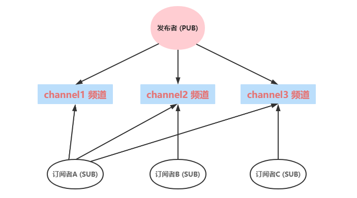


### 2、Redis 发布订阅命令实现


#### 1、发布订阅命令实现步骤


##### 1、打开一个客户端 A 订阅 channel1


>   subscribe channel1：订阅一个频道

```shell
Reading messages... (press Ctrl-C to quit)
1) "subscribe"
2) "channel1"
3) (integer) 1
```


##### 2、打开另一个客户端 B、给 channel1 发布消息


>   publish channel1 \<message>：向指定频道发送一条消息

```shell
127.0.0.1:6379> publish channel1 helloRedis
(integer) 1
```


##### 3、打开客户端 A、可以看到已经接收消息


-   注意：发布的消息没有持久化

```shell
Reading messages... (press Ctrl-C to quit)
1) "subscribe"
2) "channel1"
3) (integer) 1

# 下面已经接收到了消息
1) "message"
2) "channel1"
3) "helloRedis"
```


## 8、SpringBoot 整合 Redis


