## 1、NoSQL数据库发展


### 1、技术发展


#### 1、技术的分类


1、解决功能性的问题：Java、Jsp、RDBMS、Tomcat、HTML、Linux、JDBC、SVN

2、解决扩展性的问题：Struts、Spring、SpringMVC、Hibernate、Mybatis

3、解决性能的问题：NoSQL、Java 多线程、Hadoop、Nginx、MQ、ElasticSearch


#### 2、Web 1.0 时代


Web 1.0 时代、数据访问量很有限、用一夫当关的高性能单点服务器就可以解决大部分问题

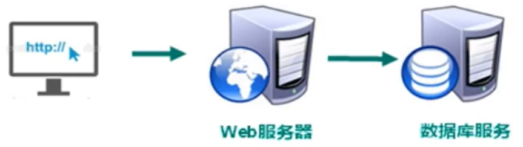

#### 3、Web 2.0 时代


随着 Web 2.0 的时代的到来，用户访问量大幅度提升，同时产生了大量的用户数据。加上后来的智能移动设备的普及，所有的互联网平台都面临了巨大的性能挑战，如果还是单体架构，那么无法应对日益增多的用户量以及各种设备端的并发访问、那么我的服务器压力、以及数据库压力突然骤增，那么这些问题如何解决？


#### 4、解决 CPU 及内存压力


那么我们可以把应用做一个集群部署、通过 Nginx 负载均衡把流量均衡的分发到不同的服务器上，多台机器共同分担和承受高流量带来的 CPU 以及单台服务器的内存压力，那么集群部署模式有好处，必然也会带来弊端：

>   例如，如果服务器分为 A、B 两台集群部署，假如用户登录请求通过 Nginx 分发到服务器 A、用户登录成功，服务器 A 中缓存了用户的登录的 Session 信息，那么用户登陆后在做了一个其它请求，这个请求被 Nginx 分发到了服务器 B、此时服务器 B 并没有存储该用户的登录信息？这时该怎么办？总不能让用户重新登录一下把？

解决方案：

-   存储到客户端 cookie 中、但是它的安全性很难保证
-   session 进行复制：意思是当用户在 服务器 A 中登陆成功后，然后把 Session 复制到所有的集群机器中，就达到了 Session 的同步。缺点：每个服务器都存储的话会造成 Session 数据的冗余，浪费很多内存空间
-   第三种方案就是 NoSQL 数据库：存储用户信息、直接存储到内存，不需要 IO 操作（推荐）

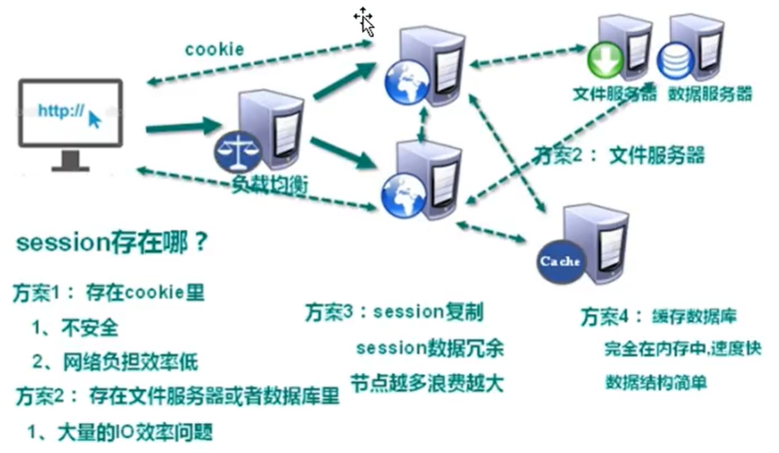


NoSQL 数据库打破了传统关系型数据库以业务逻辑为依据的存储模式，而针对不同的数据结构类型改为以性能为最优先的存储方式，传统的当数据库业务量和数据量大了话，还需要进行分库分表、例如水平切分、垂直切分、读写分离等等，但是破坏了一定的业务逻辑换取性能，不是最优的方式


### 2、NoSQL 数据库


#### 1、NoSQL 数据库概述


NoSQL ( NoSQL = Not Only SQL )，意即 “不仅仅是SQL”，泛指非关系型的数据库。NoSQL 不依赖业务逻辑方式存储，而以简单的 key-value 模式存储。因此大大的增加了数据库的扩展能力

-   不遵循 SQL 标准
-   不支持 ACID
-   远超于 SQL 的性能

>   NoSQL 应用场景

-   对数据高并发的读写
-   海量数据的读写
-   对数据高可扩展性的

>   NoSQL 不适用场景

-   需要事务支持
-   基于 SQL 的结构化查询存储、处理复杂的关系、需要即席查询
-   用不着 SQL 的 和 用了 SQL 也不行的情况，请考虑用 NoSQL


#### 2、常见的 NoSQL 数据库


##### 1、Memcache

-   很早出现的 NoSQL 数据库
-   数据都在内存中、一般不持久化
-   支持简单的 key-value 模式、支持类型单一
-   一般是作为缓存数据库辅助持久化的数据库


>   Memcached 的优点：

Memcached 可以利用多核优势，单实例吞吐量极高，可以达到几十万 QPS（取决于 key、value 的字节大小以及服务器硬件性能，日常环境中 QPS 高峰大约在 4-6w 左右）。适用于最大程度扛量。支持直接配置为 session handle。


>   Memcached的 缺点：

1.  只支持简单的 key/value 数据结构，不像 Redis 可以支持丰富的数据类型
2.  无法进行持久化，数据不能备份，只能用于缓存使用，且重启后数据全部丢失
3.  无法进行数据同步，不能将 MC 中的数据迁移到其他MC实例中
4.  Memcached 内存分配采用 Slab Allocation 机制管理内存，value 大小分布差异较大时会造成内存利用率降低，并引发低利用率时依然出现踢出等问题。需要用户注重 value 设计


##### 2、Mongodb

-   高性能、开源、模式自由 ( schema free) 的文档型数据库
-   数据都在内存中，如果内存不足，把不常用的数据保存到硬盘
-   虽然是 key-value 模式、但是对 value (尤其是 json) 提供了丰富的查询功能
-   支持二进制数据及大型对象
-   可以根据数据的特点 替代 RDBMS 、成为独立的数据库，或者配置 Rdbms，存储特定的数据


>   Mongodb 优点

-   无模式
-   查询与索引方式灵活，是最像 SQL 的 NoSQL
-   支持复制集、主备、互为主备、自动分片等特性

>   Mongodb 缺点

-   在集群分片中的数据分布不均匀
-   单机可靠性比较差
-   大数据量持续插入，写入性能有较大波动
-   磁盘空间占用比较大


##### 3、Redis

-   几乎覆盖了 Memcache 的绝大部分功能
-   数据都在内存中，支持持久化、主要用作备份恢复
-   除了支持简单的 key-value 模式、还支持多种数据库结构的存储、如 list、set、hash、zset 等
-   一般是作为缓存数据库辅助持久化的数据库


>   Redis的优点：
>
>   Redis 已经逐渐取代了 memcached，成为分布式场景广泛使用的缓存方案

-   支持多种数据结构，如 string（字符串）、 list(双向链表)、dict(hash表)、set(集合）、zset(排序set)、hyperloglog（基数估算）
-   支持持久化操作，可以进行 AOF 及 RDB 数据持久化到磁盘，从而进行数据备份或数据恢复等操作，较好的防止数据丢失的手段
-   支持通过 Replication 进行数据复制，通过 master-slave 机制，可以实时进行数据的同步复制，支持多级复制和增量复制，master-slave 机制是 Redis 进行 HA 的重要手段
-   单线程请求，所有命令串行执行，并发情况下不需要考虑数据一致性问题
-   支持 pub/sub 消息订阅机制，可以用来进行消息订阅与通知
-   支持简单的事务需求，但业界使用场景很少，并不成熟

>   Redis的缺点：

-   Redis 只能使用单线程，性能受限于 CPU 性能，故单实例 CPU 最高才可能达到 5-6w QPS 每秒（取决于数据结构，数据大小以及服务器硬件性能，日常环境中 QPS 高峰大约在 1-2w 左右）
-   支持简单的事务需求，但业界使用场景很少，并不成熟，既是优点也是缺点
-   Redis 在 string 类型上会消耗较多内存，可以使用 dict（hash表）压缩存储以降低内存耗用
-   Mc 和 Redis 都是 Key-Value 类型，不适合在不同数据集之间建立关系，也不适合进行查询搜索。比如 redis 的 keys pattern 这种匹配操作，对 redis 的性能是灾难


#### 3、Redis、Memcache、MongoDB 区别


##### 1、性能对比


都比较高，性能对我们来说应该都不是瓶颈

总体来讲，TPS 方面 Redis 和 memcache差不多，要大于 mongodb


##### 2、操作的便利性


memcache 数据结构单一

Redis 丰富一些，数据操作方面，Redis 更好一些，较少的网络 IO 次数

mongodb 支持丰富的数据表达，索引，最类似关系型数据库，支持的查询语言非常丰富


##### 3、内存空间和数据量的大小


Redis 在 2.0 版本后增加了自己的 VM 特性，突破物理内存的限制；可以对 key value 设置过期时间（类似memcache）

memcache 可以修改最大可用内存,采用 LRU 算法

mongoDB 适合大数据量的存储，依赖操作系统 VM 做内存管理，吃内存也比较厉害，服务不要和别的服务在一起


##### 4、可用性（单点问题）


对于单点问题，Redis 依赖客户端来实现分布式读写；主从复制时，每次从节点重新连接主节点都要依赖整个快照,无增量复制，因性能和效率问题，所以单点问题比较复杂；不支持自动 sharding, 需要依赖程序设定一致 hash 机制。

>   一种替代方案是，不用 Redis 本身的复制机制，采用自己做主动复制（多份存储），或者改成增量复制的方式（需要自己实现），一致性问题和性能的权衡

Memcache 本身没有数据冗余机制，也没必要；对于故障预防，采用依赖成熟的hash或者环状的算法，解决单点故障引起的抖动问题。

mongoDB 支持 master-slave, replicaset（内部采用 paxos 选举算法，自动故障恢复）, auto sharding 机制，对客户端屏蔽了故障转移和切分机制


##### 5、可靠性（持久化)


对于数据持久化和数据恢复，

Redis 支持（RDB、AOF）：依赖快照进行持久化，AOF 增强了可靠性的同时，对性能有所影响

memcache 不支持，通常用在做缓存、提升性能；

MongoDB 从 1.8 版本开始采用 binlog 方式支持持久化的可靠性


##### 6、数据一致性（事务支持）


Memcache 在并发场景下，用 CAS 保证一致性

Redis 事务支持比较弱，只能保证事务中的每个操作连续执行

mongoDB 不支持事务


##### 7、数据分析


mongoDB 内置了数据分析的功能 (mapreduce)、其他不支持


### 3、行式存储数据库


#### 1、行式数据库


主流的存储方式是关系式存储方式，如下图，而行式存储方式是将每行数据存成一部分

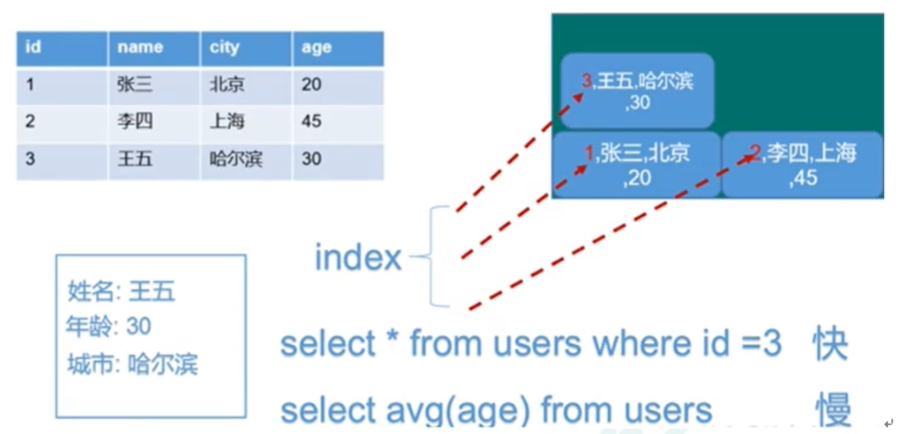

但是它优缺点，如果你要统计所有学生年龄的平均数，那么需要将三行都单独查询出来取到 age 在做计算，效率较慢，所以这时我们就可以进行列式存储


#### 2、列式数据库


这就是将所有的列单独存储成一部分，这样我们在做年龄平均值的时候直接可以查询指定位置 index 就得到了所有的年龄的值，无需查询所有，不过两者各有利弊

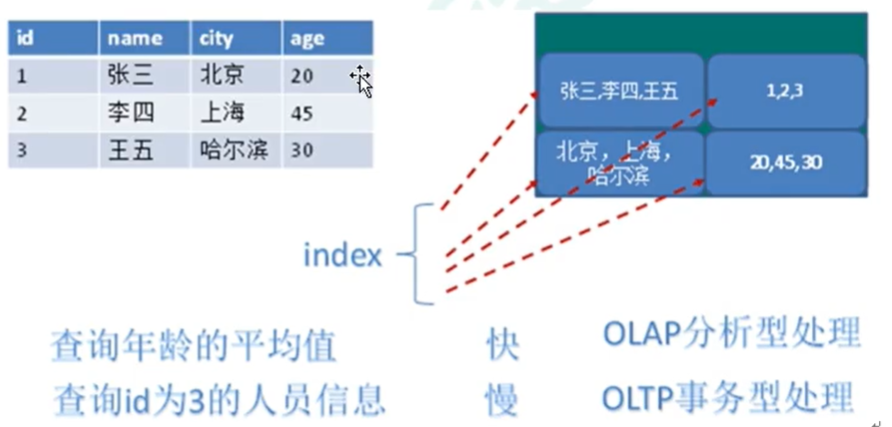


##### 1、HBase 数据库


HBase 是 Hadoop 项目中的数据库，它用于需要大量的数据进行随机、实时的读写操作场景中，HBase 的目标就是处理数据量非常庞大的表，可以用普通的计算机处理超过 10 亿行数据，还可处理有百万列元素的数据库


##### 2、Cassandra 数据库


Apache Cassandra 是一款免费的开源 NoSQL 数据库，其设计目的在于管理由大量商用服务器构建起来的庞大集群上的**海量数据集 (数据量通常达到 PB 级别)**。在众多显著特性当中，Cassandra 最为卓越的长处是对写入及读取操作进行规模调整，而且其不强调主集群的设计思路能够以相对直观的方式简化各集群的创建与扩展流程。

>   计算机存储单位计算机存储单位一般用 B，KB，MB，GB，TB，EB，ZB，YB，BB 来表示，它们之间的关系是
>
>   -   位 bit (比特)(Binary Digits)：存放一位二进制数，即0或1，最小的存储单位
>   -   字节 byte：8个二进制位为一个字节(B)，最常用的单位
>   -   1KB (Kilobyte 千字节) = 1024 B
>   -   1MB (Megabyte 兆字节简称 “兆” ) = 1024 KB
>   -   1GB  (Gigabyte 吉字节又称 “千兆” ) = 1024 MB
>   -   1TB (Trillionbyte 万亿字节太字节) = 1024 GB，其中 1024 = 2 个 10 ( 2 的 10 次方)
>   -   1PB (Petabyte 千万亿字节拍字节) = 1024 TB
>   -   1EB (Exabyte 百亿亿字节艾字节) = 1024 PB
>   -   1ZB (Zettabyte 十万亿亿字节泽字节) = 1024 EB
>   -   1YB (Jottabyte —亿亿亿字节尧字节) = 1024 ZB
>
>   注："兆" 为百万级数量单位


### 4、图关系型数据库


近年来图数据库的几个典型应用场景：知识图谱、金融风控、社交关系等场景也使得图数据库这个新技术与AI相结合，在人工智能领域发挥重要基础作用。相信强人工智能时代图数据库技术更是不可或缺，因为感知智能之上的认知智能，比如记忆提取、关联推理、归纳、探索、联想等都是依赖于记忆点构建起来的复杂网络之上的决策过程。

图数据库技术已经在国内兴起了，不仅有越来越多的使用者，也出现越来越多的开发者。近几年来国内也有一些公司在研发图数据库，包括百度、阿里、华为等

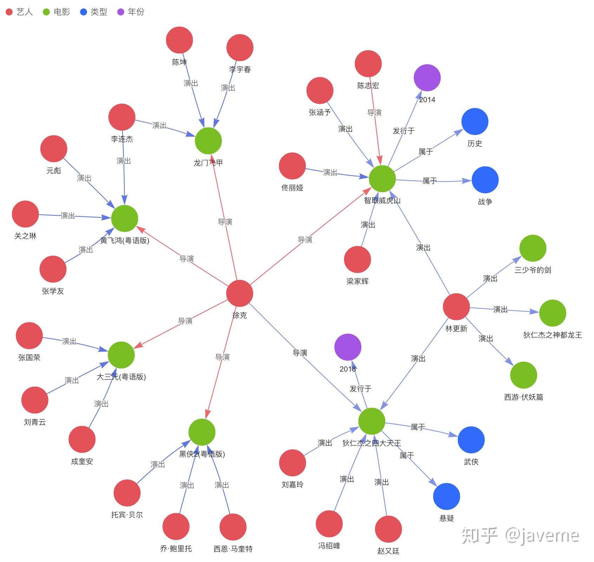


### 5、数据库排名


数据库排名网站：

>   http://db-engines.com/en/ranking


## 2、Redis 简介与安装


### 1、Redis 概述


Redis 是一个开源的 key-value 存储系统、和 Memcached 类似，它支持存储的 value 类型相对更多，包括 

-   string (字符串)
-   list (链表)
-   set (集合)
-   zset (sorted set --有序集合)
-   hash (哈希类型)

这些数据类型都支持 push/pop、add/remove 及取交集并集和差集及更丰富的操作，而且这些操作都是原子性的。在此基础上，Redis 支持各种不同方式的排序。与 memcached 一样，为了保证效率，数据都是缓存在内存中，区别的是Redis 会周期性的把更新的数据写入磁盘或者把修改操作写入追加的记录文件。并且在此基础上实现了master-slave (主从) 同步


### 2、Redis 的应用场景


#### 1、热点数据的缓存


Redis 可以配合关系型数据库做高速缓存

-   高频率、热门访问的数据、降低数据库 IO
-   分布式架构、做 Session 共享


#### 2、多样的数据结构和多用途


-   最新 N 个数据    => 通过 List 实现按自然时间排序的数据
-   排行榜、TOP K  => 利用 ZSet 有序集合
-   时效性数据、比如验证码  => Expire 过期
-   计数器、秒杀  => 原子性、自增方法 INCR、DECR
-   去除大量数据中重复数据   => 利用 Set 集合
-   构建队列  => 利用 list 集合
-   发布订阅消息系统  => pub/sub 模式


### 3、Redis 之 Linux 系统安装


#### 1、Redis 官方网站


>   -   Redis 官方网站： http://redis.io
>   -   Redis 官方中文网站：http://redis.cn/


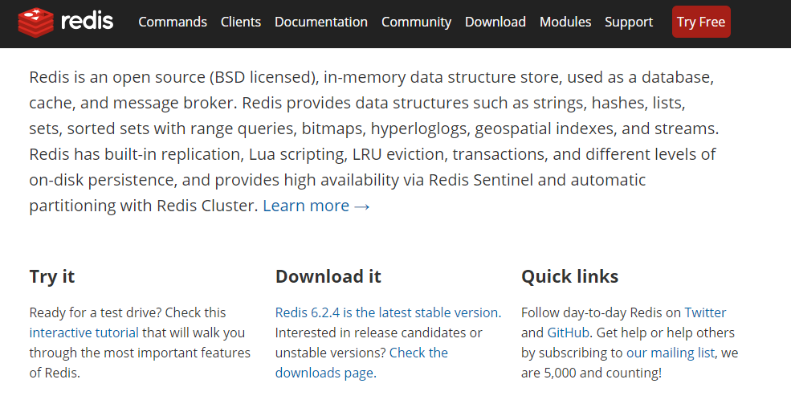

#### 2、Redis 安装步骤


##### 1、到 Redis 官网下载安装包


>   http://redis.io   //选取的版本为 v 6.2.4


##### 2、将安装包上传至 /opt 目录下


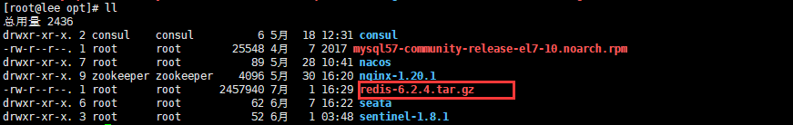


##### 3、解压压缩文件


```jade
[root@lee redis-6.2.4]# tar -zxvf redis-6.2.4.tar.gz
```


##### 4、安装 GCC 编译器


-   安装 GCC 编译器：redis 是 c 语言编写的，需要 c 语言的编译环境

```jade
[root@lee redis-6.2.4]# yum install -y gcc
```

-   查看 GCC 版本

```jade
[root@lee redis-6.2.4]# gcc --version
```


##### 5、进入解压后的 redis 文件夹


-   进入解压后的 redis 文件夹

```jade
[root@lee redis-6.2.4]# cd /opt/redis-6.2.4
```

-   在 redis-6.2.4 目录下执行 `make` 命令：将 redis 文件先进行编译，编译为 c 的可执行文件

```jade
[root@lee redis-6.2.4]# make
```

该阶段需要静待编译：可能需要 30 ~ 60 秒不等，编译成功后如下：

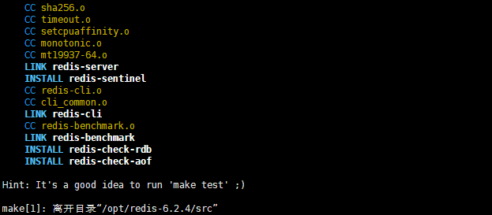


-   在 redis-6.2.4 目录下执行`make install`命令进行安装

```jade
[root@lee redis-6.2.4]# make install
```

安装完成如下：

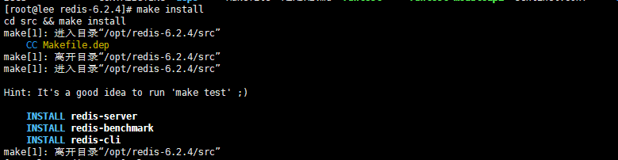


##### 6、安装完成后查看版本


```jade
[root@lee redis-6.2.4]# redis-server -v
Redis server v=6.2.4 sha=00000000:0 malloc=jemalloc-5.1.0 bits=64 build=a79d59f39e8cfd4e
```


##### 7、Redis 默认安装目录


>   /usr/local/bin


#### 3、Redis 安装报错指南


##### 1、make 阶段会报错

```ABAP
-Jemalloc/jemalloc.h：没有那个文件
```

-   我们查看 gcc 版本是否安装成功

```jade
[root@lee redis-6.2.4]# gcc --version
```

-   如果安装成功，那么我们执行 `make distclean` 命令，将编译文件清除掉

-   然后在进行 make 操作、如果还是不行、建议从 redis 官网重新下载一个安装包解压


### 4、Redis 之命令 OR 启动


#### 1、Redis 启动命令


##### 1、前台启动（不推荐）


前台启动命令 `redis-server`、命令行窗口不能关闭、否则服务器停止，所以不推荐使用

-   步骤：进入 redis 安装目录
-   执行命令：redis-server

```jade
[root@lee redis-6.2.4]# cd /usr/local/bin
[root@lee redis-6.2.4]# redis-server
```


##### 2、后台启动（推荐）


-   到 redis 安装目录拷贝一份 `redis.conf` 配置文件、拷贝到 `/etc/redis.conf` 目录下

```jade
[root@lee redis-6.2.4]# cd /usr/local/bin
[root@lee redis-6.2.4]# cp redis.conf /etc/redis.conf
```

-   修改 etc 下的 redis.conf 配置文件、讲 `daemonize` 后台启动设置为 yes

```jade
[root@lee redis-6.2.4]# vim redis.conf
```

```shell
# 将 daemonize 修改为如下所示
################################# GENERAL #####################################

# By default Redis does not run as a daemon. Use 'yes' if you need it.
# Note that Redis will write a pid file in /var/run/redis.pid when daemonized.
# When Redis is supervised by upstart or systemd, this parameter has no impact.
daemonize yes
```

-   之后我们进入 redis 的文件所在目录

```jade
[root@lee redis-6.2.4]# cd /usr/local/bin
```

-   **执行以下命令进行后台启动**

```jade
[root@lee redis-6.2.4]# redis-server /etc/redis.conf
```


##### 3、查看 Redis 是否在运行

```java
[root@lee redis-6.2.4]# ps -ef | grep redis
//我们看到 redis pid 为 19903、默认启动端口号：6379
root      19903      1  0 17:14 ?        00:00:00 redis-server 127.0.0.1:6379
root      20009  12037  0 17:16 pts/1    00:00:00 grep --color=auto redis
```


#### 2、Redis 关闭命令


-   通过 shutdown 关闭、这个需要先通过 redis-cli 进入客户端

```jade
[root@lee redis-6.2.4]# redis-cli
127.0.0.1:6379> shutdown
```


-   通过查找 pid 来 kill 掉 redis 进程

```jade
[root@lee redis-6.2.4]# ps -ef | grep redis
root      19903      1  0 17:14 ?        00:00:00 redis-server 127.0.0.1:6379
root      20009  12037  0 17:16 pts/1    00:00:00 grep --color=auto redis
```

```jade
[root@lee redis-6.2.4]# kill -9 19903
```


#### 3、Redis 之连接客户端


-   连接客户端 `redis-cli` 命令

```jade
[root@lee redis-6.2.4]# redis-cli
127.0.0.1:6379>
```

-   退出客户端 `exit` 命令

```jade
127.0.0.1:6379> exit
```


#### 4、Redis 常用监测命令


```java
redis-benchmark   //性能测试工具、可测试电脑性能如何
redis-check-aof   //修复有问题的 AOF 文件、RDB 和 AOF 后面讲
redis-check-dump  //修复有问题的 dump.rdb 文件

redis-sentinel  //Redis 集群使用
redis-server    //Redis 服务器启动命令
redis-cli       //客户端、操作入口
```


### 5、Redis 知识小课堂


#### 1、Redis 相关知识点


Redis 默认端口号如何而来？如下图一位女演员姓名：Alessia **Merz**、取自名字的后端部分 Merz 、在前些年的旧智能机时代，手机带有组合按键来进行打字，而 M --> 6、e --> 3、r --> 7、z --> 9 。这些正是老式手机键盘上字母与数字一一映射，而 6379 也就是寓意了女演员姓名后半部分


>   Redis 默认16个数据库、类似数组下标从 0 开始、**初始默认使用 0 号库**。我们可以使用如下命令来进行切换数据库

```jade
[root@lee redis-6.2.4]# select <dbid>
```

下面我们来进行测试：

-   我们先进入 redis 客户端：redis-cli
-   select 5 号库
-   我们发现已经切换到了下标为 [5] 号库中、这些库的密码都是相同的

```jade
127.0.0.1:6379> select 5
OK
127.0.0.1:6379[5]> 
```


>   我们还可以通过 dbsize 查看当前数据库的 key 的数量

-   或者可以使用命令 `flushdb` 清空当前库、也可以 `flushall` 清空全部库

```jade
127.0.0.1:6379> dbsize
(integer) 0
```


#### 2、Redis 单线程&多路IO复用技术


多路复用是指使用一个线程来检查多个文件描述符 ( Socket ) 的就绪状态，比如调用 select 和 poll 函数，传入多个文件描述符，如果有一个文件描述符就绪，则返回，否则阻塞直到超时。得到就绪状态后进行真正的操作可以在同一个线程里执行，也可以启动线程执行（比如使用线程池)

>   串行 vs 多线程 + 锁 (memcached) VS 单线程 + 多路 IO 复用技术 (Redis)

Redis 单线程 + 多路 IO 复用说明图：

例如买票，三个用户都需要去火车站买票，如果是串行的话，三个人都需要排队购买，排队期间不能做任何事情，但是多路 IO 复用类似黄牛，三个用户都把要买的票告诉黄牛，然后三个用户去做自己的事情，之后黄牛排队买到哪个用户的票了，就可以通知哪个用户过来取票。这样不必阻塞每个用户的排队等待时间

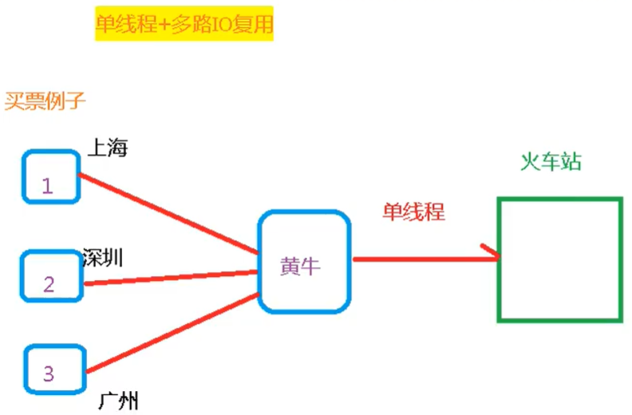


## 3、Redis 键(Key)操作


### 1、常用 键 (Key) 命令


-   `keys *` 	         查看当前库所有 key
-   `keys <keyName>` 查看指定的 key
-   `exists key`	 判断某个 key 是否存在  --> exists k1
-   `type key` 		查看你的 key 是什么类型  --> type k1
-   `del key` 	       删除指定的 key 数据 --> del k1
-   `unlink key   ` 根据 value 选择非阻塞删除，仅将 keys 从 keyspace 元数据中删除，真正的删除会在后续异步操作
-   `expire key 10` 	10秒钟：为给定的key设置过期时间 --> expire k2 10
-   `ttl key `		查看还有多少秒过期，-1表示永不过期，-2表示已过期  --> ttl k2 
-   `flushdb` 	清空当前库
-   `flushall`   清空所有库 **(慎用)**
-   `select`  切换 Redis 库 --> select 5 代表切换到下标为 5 的库
-   `dbsize` 查看当前库中的 keys 数量
-   `move key db`  将当前数据库的 keys 移动到指定数据库 db 当中


-   `SCAN cursor [MATCH pattern] [COUNT count]` 迭代数据库中的键 key
    -   cursor - 游标
    -   pattern - 匹配的模式
    -   count - 指定从数据集里返回多少元素，默认值为 10 


>   所有的 keys 命令可以参考：https://www.runoob.com/redis/redis-keys.html


### 2、常用 键 (Key) 命令演示


#### 1、创建 key-value 命令


-   我们创建四个 key ，名称分别为 k1、k2、k3、k11

```jade
127.0.0.1:6379> set k1 Lee
OK
127.0.0.1:6379> set k2 Liu
OK
127.0.0.1:6379> set k3 YaSe
OK
127.0.0.1:6379> set k11 Lucy
OK
```


#### 2、查看 Key 命令


-   我们输入命令 `keys *` 查看所有的 key

```jade
127.0.0.1:6379> keys *
1) "k11"
2) "k3"
3) "k2"
4) "k1"
```

-   我们也可以使用 `keys k1` 来查看 Key 名称为 k1 的键

```jade
127.0.0.1:6379> keys k1
1) "k1"
```

-   也可以使用 `keys k1*` 来查看以 k1 为前缀的 key

```jade
127.0.0.1:6379> keys k1*
1) "k11"
2) "k1"
```


#### 3、判断指定一个 key 是否存在


-   输入命令 `exists key` 来判断 key 是否存在
    -   值为 1：表示存在
    -   值为 0：表示不存在

```jade
127.0.0.1:6379> exists k1
(integer) 1
```


#### 4、查看 key 的类型


-   输入命令 `type key` 查看 key 的类型

```jade
127.0.0.1:6379> type k1
string
```


#### 5、删除 key 命令


##### 1、del key 命令


-   删除 k3 的键值

```jade
127.0.0.1:6379> del k3
(integer) 1
```

-   然后再查看所有的 keys 发现 k3 已经被删除了

```jade
127.0.0.1:6379> keys *
1) "k11"
2) "k2"
3) "k1"
```


##### 2、unlink key 命令


>   跟 del key 相同的是都是删除key，但是 unlink key 选择非阻塞删除，也就是仅将 keys 从 keyspace 元数据中删除，真正的删除会在后续异步操作

-   使用 unlink k1 删除 key

```jade
127.0.0.1:6379> unlink k1
(integer) 1
```

-   然后我们再查看 keys * 发现 k1 也已经不见了

```jade
127.0.0.1:6379> keys *
1) "k11"
2) "k2"
```


#### 6、设置 key 的过期时间


##### 1、expire key \<seconds> 为指定的 key 设置过期时间


-   我们为 k11 设置 10 秒的过期时间

```jade
127.0.0.1:6379> expire k11 10
(integer) 1
```


##### 2、ttl key 查看 key 还有多少秒过期


-   值为 -1：表示永不过期
-   值为 -2：表示已经过期

```shell
127.0.0.1:6379> ttl k11
(integer) 6  #表示还剩6秒过期
```


#### 7、切换 Redis 库


>   切换不同的库，注意：每个库的数据 (keys) 都是独立的


-   我们先查看所有的 key

```jade
127.0.0.1:6379> keys *
1) "k2"
```

-   之后切换到 1 号库

```jade
127.0.0.1:6379> select 1
OK
```

-   然后再查看 1 号库的 keys

```jade
127.0.0.1:6379[1]> keys *
(empty array)
```


#### 8、查看库中有多少个 key


-   我们需要用到 `dbsize` 命令、如下表示还剩 1 个 key

```jade
127.0.0.1:6379> dbsize
(integer) 1
```


## 4、Redis 之五大旧数据类型


### 1、Redis 之数据类型 String (字符串)


#### 1、String 类型简介


String 是 Redis 最基本的类型，你可以理解成与 Memcached 一模一样的类型，一个 key 对应一个 value，String 同时又**是二进制安全的**、意味着 Redis 的 String 可以包含任何数据，比如 JPG 图片序列化为BASE64字符或者序列化对象，一个 Redis 中字符串 value 最多可以存储 512M 的数据


#### 2、String 类型常用命令


-   `set <key><value>`：添加或者更新一个键值对
-   `get <key>`： 获取一个键的 value 值
-   `append <key><text>` 将指定内容追加到指定的 key 中的 value 值末尾
-   `strlen <key>`： 获取指定 key 中 value 值的 Length
-   `setnx <key>`：只有当 key 不存在的时候、才添加该键值对

-   `incr <key>` 将 key 中存储的数字类型自增 1
-   `decr <key>` 将 key 中存储的数字类型自减 1
    -   incr  和 decr 就有原子性操作、所谓的原子性是指不会被线程调度机制打断的操作

-   `incrby <key><步长>` 将 key 中存储的数字类型按照步长增加
-   `decrby <key><步长>` 将 key 中存储的数字类型按照步长减少

-   `setex <key><过期时间><value>` 添加键值的同时、设置过期时间，单位秒
-   `getset <key><value>` 以新换旧、设置了新值的同时获取旧值

-   `mset <key><value><key><value>...` 同时添加一个或者多个键值对
-   `mget <key><key><key>...` 同时获取一个或者多个键的 value
-   `msetnx <key><value><key><value>... ` 同时添加一或多，只有当 key 不存在的时候、才添加该键值对
-   `getrange <key><起始位置><结束位置>`  获取值的范围，类似 java 中的 subString


>   什么是原子操作？

-   这种操作操作一旦开始、就一直运行到结束，中间不会有任何 context switch （切换到另一个线程）
-   在单线程中、能够在单条指令中完成的操作都可以认为是 ”原子操作“，因为中断只能发生于指令之间
-   在多线程中、不能被其它线程打断的就叫原子操作，Redis 单命令的原子性主要得益于 Redis 的单线程
-   **但是需要注意的是原子保证不等于指令执行顺序的保证**


#### 3、String 类型常用命令演示


##### 1、set 添加一个键值对


`set <key><value>` 添加键值对命令、完整命令格式如下

>   set \<key> \<value> [EX seconds | PX milliseconds | EXAT timestamp  | PXAT milliseconds-timestamp | KEEPTTL] [NX|XX] [GET]

-   EX：key 的超时秒数
-   PX：key 的超时毫秒数、与 EX 参数互斥
-   EXAT：key 超时的时间戳
-   PXAT：也是 key 超时相关的参数
-   NX：当数据库中 key 不存在时、可以将 key-value 添加数据库
-   XX：当数据库中 key 存在时、可以将 key-value 添加数据库，与 NX 参数互斥

>   set 命令具体演示：**当 set 相同的 key 值时，代表更新这个 key 的 value 值、如果 key 不存在则新创建键值对**

-   我们创建几个key 值如下：

```jade
127.0.0.1:6379> set k1 v100
OK
127.0.0.1:6379> set k2 v200
OK
127.0.0.1:6379> set k3 v300
OK
127.0.0.1:6379> set k4 v400
OK
127.0.0.1:6379> set k5 v500
OK
```

-   查看所有的 key

```jade
127.0.0.1:6379> keys *
1) "k1"
2) "k2"
3) "k3"
4) "k4"
5) "k5"
```


##### 2、get 查询对应的键值


>   `get <key>` 查看指定 key 的 value 值

-   (nil)：代表没有这个 key

```jade
127.0.0.1:6379> get k4
"v400"
```


##### 3、append 将在给定的 value 追加到原值的末尾


>   `append <key><text>`  将在给定的 value 追加到原值的末尾

```jade
127.0.0.1:6379> append k1 new
(integer) 7
127.0.0.1:6379> get k1
"v100new"
```

-   **如果 append 的 key 不存在，则会创建一个键值对**

```jade
127.0.0.1:6379> append kx na
(integer) 2
```


##### 4、strlen 获取指定 key 中 value 值的 Length


>   `strlen <key>` 获取指定 key 中 value 值的 Length

```jade
127.0.0.1:6379> strlen k1
(integer) 7
```


##### 5、setnx 只有在 key 不存在时、才添加键值对


>   `setnx <key><value>`  只有当 key 不存在的时候、才添加该键值对

-   如下：k1 已经存在、所以返回 (integer) 0

```jade
127.0.0.1:6379> setnx k1 Leea
(integer) 0
```


##### 6、incr 将 key 中存储的数字值自增 1


>   `incr <key>` 将 key 中存储的数字值自增 1

-   我们先添加一个 num 类型的 key

```jade
127.0.0.1:6379> set knum 100
OK
```

-   之后执行自增命令、发现返回值已经是自增后的值

```jade
127.0.0.1:6379> incr knum
(integer) 101
```

-   如果用在一个不是 num 类型的 key 上、会有什么问题？

```asciiarmor
127.0.0.1:6379> incr k1
(error) ERR value is not an integer or out of range
```


##### 7、decr 将 key 中存储的数字值自减 1


>   `decr <key>` 将 key 中存储的数字值自减 1

```jade
127.0.0.1:6379> decr knum
(integer) 100
```


##### 8、incrby 将 key 中存储的数字按照指定步长增加


>   `incrby <key><步长>` 将 key 中存储的数字类型按照步长增加

```jade
127.0.0.1:6379> incrby knum 5
(integer) 105
```


##### 9、decrby 将 key 中存储的数字按照指定步长减少


>   decrby \<key><步长>： 将 key 中存储的数字类型按照步长减少

```jade
127.0.0.1:6379> decrby knum 5
(integer) 100
```


##### 10、getrange 获取指定范围的值


>   `getrange <key><起始位置><结束位置>`  获取值的范围，类似 java 中的 subString

```jade
127.0.0.1:6379> get k1
"v100new"

127.0.0.1:6379> getrange k1 2 4
"00n"
```


##### 11、setex 添加键值对的同时加上过期时间


>   `setex <key><过期时间><value>` 添加键值的同时、设置过期时间，单位秒

```jade
127.0.0.1:6379> setex k11 10 k11Java
OK
```

-   使用 ttl 命令查看过期时间

```jade
127.0.0.1:6379> ttl k11
(integer) 7
127.0.0.1:6379> ttl k11
(integer) 6
127.0.0.1:6379> ttl k11
(integer) 5
127.0.0.1:6379> ttl k11
(integer) -2
```


#### 4、String 类型底层数据结构


String 的数据结构为简单动态字符串 (Simple Dynamic String，缩写 SDS)，是可以修改的字符串，内部结构实现上类似于 Java 的 ArrayList、采用预分配冗余空间的方式来减少内存的频繁分配，**这里指的是 value 内容的数据结构**

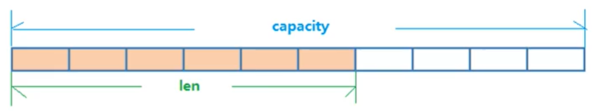

如图中所示、内部为当前字符串实际分配的空间 capacity 一般要高于实际字符串长度 len，当字符串长度小于 1 M 时，扩容都是加倍现有的空间，如果超过 1 M ，扩容一次只会扩 1 M 的空间，**需要注意的是字符串最大长度为 512M**。


### 2、Redis 之数据类型 List (列表)


#### 1、List 类型简介


Redis 列表是简单的字符串列表，按照插入顺序排序，你可以添加一个元素到列表的头部(左边)或者尾部(右边)，它的底层实际上是个 **双向链表**、对两端的操作性能很高，通过索引下标的操作中间的节点性能较差


>   **单键多值**：例如 key 为 userName 的 值可以存储为 [ Lee Jiao Lucy Jack ]


#### 2、List 类型常用命令


-   `Lpush <key><value1><value2>...` 从左边插入一个或者多个值
-   `Rpush <key><value1><value2>...` 从右边插入一个或者多个值
-   `Lpop <key>` 从左边取出一个值
-   `Rpop <key>` 从右边取出一个值
-   `RpopLpush <key1><key2>` 从列表右边取出一个值、插入到 \<key2> 列表左边
    -   **注意：没有反命令 LpopRpush**

-   `Lrange <key><start><stop>` 按照索引下标遍历元素 (从左到右)
    -   lrange k1 0 -1 表示取所有值，0 表示左边第一个，-1 表示右边第一个
    -   **注意：没有反命令 Rrange**

-   `Lindex <key><index>` 按照索引下标获得元素(从左到右)
-   `Llen <key>` 获取指定 key 中的列表长度
-   `Linsert <key> before|after<value><newvalue>`  在 value 的 [ 后面 | 前面 ] 插入 newValue 新的值

-   `Lrem <ken>n<value>` 从左边删除 n 个 value (从左到右)
-   `Lset <key><index><value>`  将列表 key 下标为 index 的值替换为 value


#### 3、List 类型常用命令演示


##### 1、Lpush 从左边插入一个或多个值


>   `Lpush <key><value1><value2>...` 从左边插入一个或者多个值

-   插入一个 k1 的键，植插入顺序分别为 k1、k2、k3

```jade
127.0.0.1:6379> lpush k1 v1 v2 v3
(integer) 3
```

-   插入后存储结构如下所示，其实就是一个双向链表，

    -   第一步从左边插入 v1

    -   再从 v1 的左边插入 v2

    -   最后从 v2 的左边插入 v3

-   为了验证插入顺序、我们遍历以下 k1

```jade
127.0.0.1:6379> lrange k1 0 -1
1) "v3"
2) "v2"
3) "v1"
```

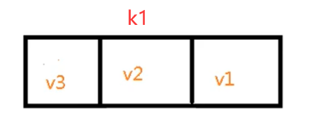

##### 2、Rpush 从右边插入一个或多个值


>   `Rpush <key><value1><value2>...` 从右边插入一个或者多个值

-   从右边插入一个 k2，值分别为 v1 v2 v3

```jade
127.0.0.1:6379> rpush k2 v1 v2 v3
(integer) 3
```

-   我们遍历下 k2，其实插入原理和 rpush 一样，区别就是一个是左一个右

```jade
127.0.0.1:6379> lrange k2 0 -1
1) "v1"
2) "v2"
3) "v3"
```

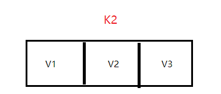

##### 3、Lpop 从左边取出一个值


>   `Lpop <key>` 从左边取出一个值


k1 键值 的 value 值如下，我们就来操作 k1：


```jade
127.0.0.1:6379> lpop k1
"v3"
```


##### 4、Rpop 从右边取出一个值


>   `Rpop <key>` 从右边取出一个值

-   从右边取 k1 当然取到 v1 了

```jade
127.0.0.1:6379> rpop k1
"v1"
```

-   不管是 Lpop 还是 Rpop 都是从链表中取值，取值后原来的值就不存在了，类似栈的出栈设计
-   为了验证我们在遍历一下 k1

```jade
127.0.0.1:6379> lrange k1 0 -1
1) "v2"
```


##### 5、RpopLpush  从列表右边取一个值、插到指定列表左边


>   `RpopLpush <key1><key2>` 从列表右边取出一个值、插入到 \<key2> 列表左边

-   经过以上的操作，k1 和 k2 的值如下所示：

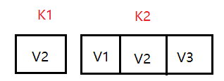

-   那么我们从 k2 链表的右边取到 v3，并将 v3 插入到 k1 链表左边

```jade
127.0.0.1:6379> rpoplpush k2 k1
"v3"
```

-   之后我们验证和遍历 k2 的值

```jade
127.0.0.1:6379> lrange k1 0 -1
1) "v3"
2) "v2"
```

-   插入之后值如下所示

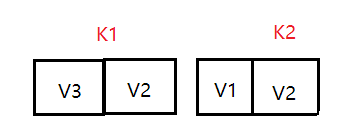


##### 6、Lrange  按照索引下标遍历元素 (从左到右)


>   `Lrange <key><start><stop>` 按照索引下标获取元素 (从左到右)

-   遍历 k1

```jade
127.0.0.1:6379> lrange k1 0 -1
1) "v3"
2) "v2"
```


##### 7、Lindex 按照索引下标获得元素 (从左到右)


>   `Lindex <key><index>` 按照索引下标获得元素(从左到右)

-   我们取 k1 中下标 为 0 和 1 的元素

```jade
127.0.0.1:6379> lindex k1 0
"v3"
127.0.0.1:6379> lindex k1 1
"v2"
```


##### 8、Lleng 获取指定列表长度


>   `Llen <key>` 获取指定 key 中的列表长度

```jade
127.0.0.1:6379> llen k1
(integer) 2
```


##### 9、Linsert 在 value 的 [ 后面 | 前面 ] 插入指定值


>   `Linsert <key> before|after <value><newvalue>`  在 value 的 [ 后面 | 前面 ] 插入 newValue 新的值


我们拿 k1 为例、源数据

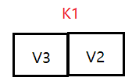

>   在 k1 中的 v2 前面插入 Lee 元素

```jade
127.0.0.1:6379> linsert k1 Before v2 Lee
(integer) 3
```

-   之后我们遍历 k1

```jade
127.0.0.1:6379> lrange k1 0 -1
1) "v3"
2) "Lee"
3) "v2"
```

-   插入后 k1 的元素如下

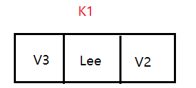

>   在 k1 中的 v2 后面插入 JJ 元素

```jade
127.0.0.1:6379> linsert k1 after v2 JJ
(integer) 4
127.0.0.1:6379> lrange k1 0 -1
1) "v3"
2) "Lee"
3) "v2"
4) "JJ"
```

-   插入 JJ 元素后 k1 的数据如下

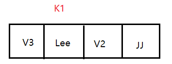


##### 10、Lrem 从左边删除 n 个 value (从左到右)


>   `Lrem <ken>n<value>` 从左边删除 n 个 value (从左到右)

-   我们先向 k1 插入数个新元素

```jade
127.0.0.1:6379> lpush k1 v1
(integer) 5
127.0.0.1:6379> lpush k1 v11
(integer) 6
127.0.0.1:6379> lpush k1 v11
(integer) 7
127.0.0.1:6379> lpush k1 v11
(integer) 8
```

```java
127.0.0.1:6379> lrange k1 0 -1
1) "v11"
2) "v11"
3) "v11"
4) "v1"
5) "v3"
6) "Lee"
7) "v2"
8) "JJ"
```

-   然后我们从左到右删除 3 个 v11 元素

```jade
127.0.0.1:6379> lrem k1 3 v11
(integer) 3
```

```java
127.0.0.1:6379> lrange k1 0 -1
1) "v1"
2) "v3"
3) "Lee"
4) "v2"
5) "JJ"
```


##### 11、Lset  将 key 中指定下标的值替换为新值


>   `Lset <key><index><value>`  将列表 key 下标为 index 的值替换为 value

-   将 k1 中下标为 0 的值替换为 k11

```jade
127.0.0.1:6379> lset k1 0 k11
OK
127.0.0.1:6379> lrange k1 0 -1
1) "k11"
2) "v3"
3) "Lee"
4) "v2"
5) "JJ"
```


#### 4、List 类型底层数据结构


**List 的数据结构为快速链表 QuickList**，首先在列表元素较少的情况下会使用一块连续的内存存储，这个结构是 ziplist、也即是压缩列表，他将所有的元素挨着一起存储，分配的是一块连续的内存

当数据量比较多的时候才会改成 QucikList，因为普通的链表需要的附加指针空间太大，会比较浪费空间，比如这个列表里存储的是 int 类型数据，结构上还需要两个额外的指针 prev 和 next.


Redis 将链表和 zipList 结构起来组成了 QuickList、也就是将多个 zipList 使用双向指针串起来使用，这样既满足了快速的插入删除性能，又不会出现太大的空间沉余


### 3、Redis 之数据类型 Set (集合)


### 4、Redis 之数据类型 Hash (哈希)


### 5、Redis 之数据类型 ZSet (有序集合)


## 5、Redis 6 之三大新数据类型


### 1、Redis 之新数据类型 Bitmaps


### 2、Redis 之新数据类型 HyperLogLog


### 3、Redis 之新数据类型 Geospatial


## 6、Redis 之配置文件详解


