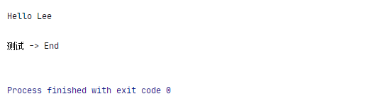
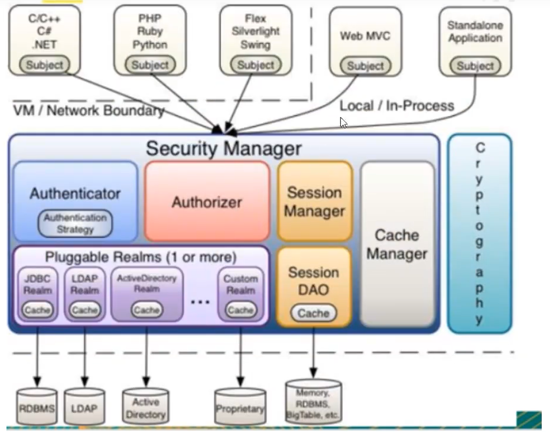
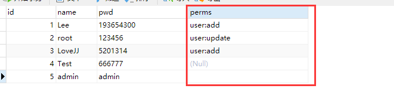
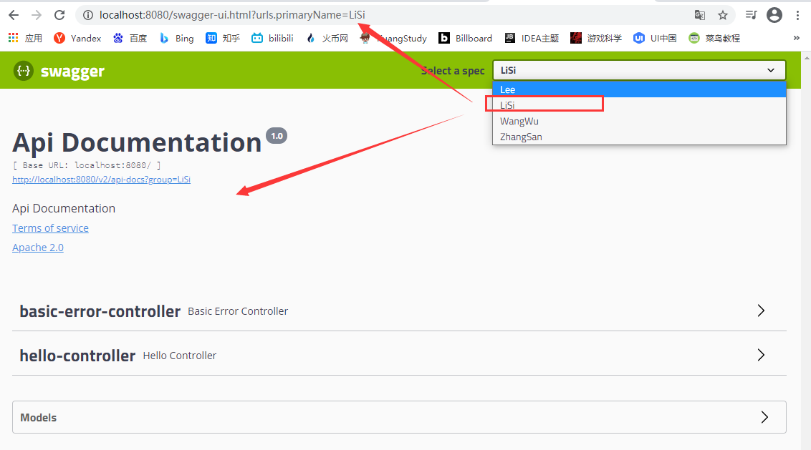
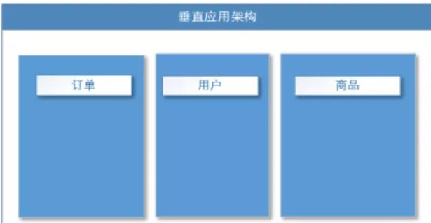

## 1、什么是Spring

Spring是一个开源框架，2003 年兴起的一个轻量级的Java 开发框架，作者：Rod Johnson  

**Spring是为了解决企业级应用开发的复杂性而创建的，简化开发**


### Spring是如何简化Java开发的

为了降低Java开发的复杂性，Spring采用了以下4种关键策略：

>   1、基于POJO的轻量级和最小侵入性编程，所有东西都是bean
>
>   2、通过IOC，依赖注入（DI）和面向接口实现松耦合
>
>   3、基于切面（AOP）和惯例进行声明式编程
>
>   4、通过切面和模版减少样式代码，RedisTemplate，xxxTemplate


## 2、什么是SpringBoot

学过javaweb的同学就知道，开发一个web应用，从最初开始接触Servlet结合Tomcat, 跑出一个Hello Wolrld程序，是要经历特别多的步骤；

后来就用了框架Struts，再后来是SpringMVC，到了现在的SpringBoot，过一两年又会有其他web框架出现；你们有经历过框架不断的演进，然后自己开发项目所有的技术也在不断的变化、改造吗？建议都可以去经历一遍；

言归正传，什么是SpringBoot呢，就是一个javaweb的开发框架，和SpringMVC类似，对比其他javaweb框架的好处


官方说是简化开发

>   约定大于配置，  you can "just run"，能迅速的开发web应用，几行代码开发一个http接口


所有的技术框架的发展似乎都遵循了一条主线规律：

>   从一个复杂应用场景 衍生 一种规范框架，人们只需要进行各种配置而不需要自己去实现它，这时候强大的配置功能成了优点；发展到一定程度之后，人们根据实际生产应用情况，选取其中实用功能和设计精华，重构出一些轻量级的框架；之后为了提高开发效率，嫌弃原先的各类配置过于麻烦，于是开始提倡“约定大于配置”，进而衍生出一些一站式的解决方案


是的这就是Java企业级应用->J2EE->spring->springboot的过程

随着 Spring 不断的发展，涉及的领域越来越多，项目整合开发需要配合各种各样的文件，**慢慢变得不那么易用简单，违背了最初的理念**，甚至人称配置地狱。Spring Boot 正是在这样的一个背景下被抽象出来的开发框架，目的为了让大家更容易的使用 Spring 、更容易的集成各种常用的中间件、开源软件；

Spring Boot 基于 Spring 开发，Spirng Boot 本身并不提供 Spring 框架的核心特性以及扩展功能，只是用于快速、敏捷地开发新一代基于 Spring 框架的应用程序。也就是说，它并不是用来替代 Spring 的解决方案，而是和 Spring 框架紧密结合用于提升 Spring 开发者体验的工具。Spring Boot 以**约定大于配置的核心思想**，默认帮我们进行了很多设置，多数 Spring Boot 应用只需要很少的 Spring 配置。同时它集成了大量常用的第三方库配置（例如 Redis、MongoDB、Jpa、RabbitMQ、Quartz 等等），Spring Boot 应用中这些第三方库几乎可以零配置的开箱即用。

简单来说就是SpringBoot其实不是什么新的框架，它默认配置了很多框架的使用方式，就像maven整合了所有的jar包，spring boot整合了所有的框架 。

Spring Boot 出生名门，从一开始就站在一个比较高的起点，又经过这几年的发展，生态足够完善，Spring Boot 已经当之无愧成为 Java 领域最热门的技术。

**Spring Boot的主要优点：**

-   为所有Spring开发者更快的入门
-   **开箱即用**，提供各种默认配置来简化项目配置
-   内嵌式容器简化Web项目
-   没有冗余代码生成和XML配置的要求

### 准备工作

我们将学习如何快速的创建一个Spring Boot应用，并且实现一个简单的Http请求处理。通过这个例子对Spring Boot有一个初步的了解，并体验其结构简单、开发快速的特性

我的环境准备：

>   -   java version "1.8.0_181"
>   -   Maven-3.6.1
>   -   SpringBoot 2.x 最新版

开发工具：

-   IDEA

    

#### 1、创建基础项目说明

Spring官方提供了非常方便的工具让我们快速构建应用

Spring Initializr：https://start.spring.io/

**项目创建方式一：**使用Spring Initializr 的 Web页面创建项目

1、打开  https://start.spring.io/

2、填写项目信息

3、点击”Generate Project“按钮生成项目；下载此项目

4、解压项目包，并用IDEA以Maven项目导入，一路下一步即可，直到项目导入完毕。

5、如果是第一次使用，可能速度会比较慢，包比较多、需要耐心等待一切就绪。


**项目创建方式二：**使用 IDEA 直接创建项目

1、创建一个新项目

2、选择spring initalizr ， 可以看到默认就是去官网的快速构建工具那里实现

3、填写项目信息

4、选择初始化的组件（初学勾选 Web 即可）

5、填写项目路径

6、等待项目构建成功


**项目结构分析：**

通过上面步骤完成了基础项目的创建。就会自动生成以下文件。

1、程序的主启动类

2、一个 application.properties 配置文件

3、一个 测试类

4、一个 pom.xml


#### 2、pom.xml 分析

打开pom.xml，看看Spring Boot项目的依赖：


```xml

<!-- 父依赖 -->
<parent>
    <groupId>org.springframework.boot</groupId>
    <artifactId>spring-boot-starter-parent</artifactId>
    <version>2.2.5.RELEASE</version>
    <relativePath/>
</parent>

<dependencies>
    
    <!-- web场景启动器 -->
    <dependency>
        <groupId>org.springframework.boot</groupId>
        <artifactId>spring-boot-starter-web</artifactId>
    </dependency>
    
    <!-- springboot单元测试 -->
    <dependency>
        <groupId>org.springframework.boot</groupId>
        <artifactId>spring-boot-starter-test</artifactId>
        <scope>test</scope>
        <!-- 剔除依赖 -->
        <exclusions>
            <exclusion>
                <groupId>org.junit.vintage</groupId>
                <artifactId>junit-vintage-engine</artifactId>
            </exclusion>
        </exclusions>
    </dependency>
    
</dependencies>

<build>
    <plugins>
        <!-- 打包插件 -->
        <plugin>
            <groupId>org.springframework.boot</groupId>
            <artifactId>spring-boot-maven-plugin</artifactId>
        </plugin>
    </plugins>
</build>
```


#### 3、编写一个http接口

1、**在主程序的同级目录下，新建一个controller包，一定要在同级目录下，否则识别不到**

2、在包中新建一个HelloController类

```java
@RestControllerpublic 
class HelloController {
    @RequestMapping("/hello")
    public String hello() {
        return "Hello World";    
    }
}
```

3、编写完毕后，从主程序启动项目，浏览器发起请求，看页面返回；控制台输出了 Tomcat 访问的端口号！


简单几步，就完成了一个web接口的开发，SpringBoot就是这么简单。所以我们常用它来建立我们的微服务项目！


#### 4、将项目打成jar包，点击 maven的 package

如果遇到以上错误，可以配置打包时 跳过项目运行测试用例

```xml
<!--
    在工作中,很多情况下我们打包是不想执行测试用例的
    可能是测试用例不完事,或是测试用例会影响数据库数据
    跳过测试用例执
    -->
<plugin>
    <groupId>org.apache.maven.plugins</groupId>
    <artifactId>maven-surefire-plugin</artifactId>
    <configuration>
        <!--跳过项目运行测试用例-->
        <skipTests>true</skipTests>
    </configuration>
</plugin>
```

如果打包成功，则会在target目录下生成一个 jar 包


打成了jar包后，就可以在任何地方运行了！OK


#### *5、*彩蛋**

如何更改启动时显示的字符拼成的字母，SpringBoot呢？也就是 banner 图案；

只需一步：到项目下的 resources 目录下新建一个banner.txt 即可。

图案可以到：https://www.bootschool.net/ascii 这个网站生成，然后拷贝到文件中即可


## 3、运行原理初探

### 1、开始

要探其Maven项目原理、还是要从 pom.xml文件开始.

其中它主要依赖一个父项目，主要是管理项目的资源过滤及插件


如果我们按照以上点进去、会发现还有一个父依赖

```xml
  <parent>
    <groupId>org.springframework.boot</groupId>
    <artifactId>spring-boot-dependencies</artifactId>
    <version>2.4.4</version>
  </parent>
```

这里才是真正管理SpringBoot应用里面所有依赖版本的地方，SpringBoot的版本控制中心；

**以后我们导入依赖默认是不需要写版本；但是如果导入的包没有在依赖中管理着就需要手动配置版本了；**


### 2、启动器 spring-boot-starter

```xml
<dependency>
    <groupId>org.springframework.boot</groupId>
    <artifactId>spring-boot-starter-web</artifactId>
</dependency>
```

**springboot-boot-starter-xxx**：就是spring-boot的场景启动器

**spring-boot-starter-web**：帮我们导入了web模块正常运行所依赖的组件；

SpringBoot将所有的功能场景都抽取出来，做成一个个的starter （启动器），只需要在项目中引入这些starter即可，所有相关的依赖都会导入进来 ， 我们要用什么功能就导入什么样的场景启动器即可 ；我们未来也可以自己自定义 starter


### 3、主启动类

>   默认的主启动类

```java
import org.springframework.boot.SpringApplication;
import org.springframework.boot.autoconfigure.SpringBootApplication;

@SpringBootApplication
public class SpringbootApplication {
    public static void main(String[] args) {
        SpringApplication.run(SpringbootApplication.class, args);
    }
}
```

但是一个简单的启动类并不简单、我们来分析一下这些注解都干了些什么


>   #### @SpringBootApplication

作用：标注在某个类上说明这个类是SpringBoot的主配置类 ， SpringBoot就应该运行这个类的main方法来启动SpringBoot应用


点击进入这个注解：可以看到上面还有很多其他注解

```java
@Target(ElementType.TYPE)
@Retention(RetentionPolicy.RUNTIME)
@Documented
@Inherited
@SpringBootConfiguration
@EnableAutoConfiguration
@ComponentScan(excludeFilters = { @Filter(type = FilterType.CUSTOM, classes = TypeExcludeFilter.class),
		@Filter(type = FilterType.CUSTOM, classes = AutoConfigurationExcludeFilter.class) })
```


>   ### **@ComponentScan**


这个注解在 Spring 中很重要 ,它对应XML配置中的元素。

作用：自动扫描并加载符合条件的组件或者bean ， 将这个bean定义加载到IOC容器中


>   ### @SpringBootConfiguration


作用：SpringBoot的配置类 ，标注在某个类上 ， 表示这是一个SpringBoot的配置类；

我们继续进去这个注解查看


```java
// 点进去得到下面的 @Component
@Configuration
public @interface SpringBootConfiguration {}

@Component
public @interface Configuration {}
```


这里的 @Configuration，说明这是一个配置类 ，配置类就是对应Spring的xml 配置文件

里面的 @Component 这就说明，启动类本身也是Spring中的一个组件而已，负责启动应用

我们回到 SpringBootApplication 注解中继续看


>   ### @EnableAutoConfiguration


**开启自动配置功能**

以前我们需要自己配置的东西，而现在SpringBoot可以自动帮我们配置 ；@EnableAutoConfiguration告诉SpringBoot开启自动配置功能，这样自动配置才能生效；

点进注解接续查看

**@AutoConfigurationPackage ：自动配置包**

```java
@Import({Registrar.class})
public @interface AutoConfigurationPackage { }
```


**@import** ：Spring底层注解@import ， 给容器中导入一个组件

Registrar.class 作用：将主启动类的所在包及包下面所有子包里面的所有组件扫描到Spring容器 ；

这个分析完了，退到上一步，继续看


**@Import({AutoConfigurationImportSelector.class}) ：给容器导入组件 ；**

AutoConfigurationImportSelector ：自动配置导入选择器，那么它会导入哪些组件的选择器呢？我们点击去这个类看源码：

1、这个类中有这样的一个方法

```java
// 获得候选的配置
protected List<String> getCandidateConfigurations(AnnotationMetadata metadata, AnnotationAttributes attributes) {
    //这里的getSpringFactoriesLoaderFactoryClass（）方法
    //返回的就是我们最开始看的启动自动导入配置文件的注解类；EnableAutoConfiguration
    List<String> configurations = SpringFactoriesLoader.loadFactoryNames(this.getSpringFactoriesLoaderFactoryClass(), this.getBeanClassLoader());
    Assert.notEmpty(configurations, "No auto configuration classes found in META-INF/spring.factories. If you are using a custom packaging, make sure that file is correct.");
    return configurations;
}
```

2、这个方法又调用了  SpringFactoriesLoader 类的静态方法！我们进入SpringFactoriesLoader类loadFactoryNames() 方法

```java

public static List<String> loadFactoryNames(Class<?> factoryClass, @Nullable ClassLoader classLoader) {
    String factoryClassName = factoryClass.getName();
    //这里它又调用了 loadSpringFactories 方法
    return (List)loadSpringFactories(classLoader).getOrDefault(factoryClassName, Collections.emptyList());
}
```

3、我们继续点击查看 loadSpringFactories方法

```java

public static List<String> loadFactoryNames(Class<?> factoryClass, @Nullable ClassLoader classLoader) {
    String factoryClassName = factoryClass.getName();
    //这里它又调用了 loadSpringFactories 方法
    return (List)loadSpringFactories(classLoader).getOrDefault(factoryClassName, Collections.emptyList());
}
3、我们继续点击查看 loadSpringFactories 方法

private static Map<String, List<String>> loadSpringFactories(@Nullable ClassLoader classLoader) {
    //获得classLoader ， 我们返回可以看到这里得到的就是EnableAutoConfiguration标注的类本身
    MultiValueMap<String, String> result = (MultiValueMap)cache.get(classLoader);
    if (result != null) {
        return result;
    } else {
        try {
            //去获取一个资源 "META-INF/spring.factories"
            Enumeration<URL> urls = classLoader != null ? classLoader.getResources("META-INF/spring.factories") : ClassLoader.getSystemResources("META-INF/spring.factories");
            LinkedMultiValueMap result = new LinkedMultiValueMap();

            //将读取到的资源遍历，封装成为一个Properties
            while(urls.hasMoreElements()) {
                URL url = (URL)urls.nextElement();
                UrlResource resource = new UrlResource(url);
                Properties properties = PropertiesLoaderUtils.loadProperties(resource);
                Iterator var6 = properties.entrySet().iterator();

                while(var6.hasNext()) {
                    Entry<?, ?> entry = (Entry)var6.next();
                    String factoryClassName = ((String)entry.getKey()).trim();
                    String[] var9 = StringUtils.commaDelimitedListToStringArray((String)entry.getValue());
                    int var10 = var9.length;

                    for(int var11 = 0; var11 < var10; ++var11) {
                        String factoryName = var9[var11];
                        result.add(factoryClassName, factoryName.trim());
                    }
                }
            }

            cache.put(classLoader, result);
            return result;
        } catch (IOException var13) {
            throw new IllegalArgumentException("Unable to load factories from location [META-INF/spring.factories]", var13);
        }
    }
}
```

4、发现一个多次出现的文件：**spring.factories**，全局搜索它


>   ### **spring.factories**


我们根据源头打开spring.factories ， 看到了很多自动配置的文件；这就是自动配置根源所在


**结论：**

>   1.  SpringBoot在启动的时候从类路径下的META-INF/spring.factories中获取EnableAutoConfiguration指定的值
>   2.  将这些值作为自动配置类导入容器 ， 自动配置类就生效 ， 帮我们进行自动配置工作；
>   3.  整个J2EE的整体解决方案和自动配置都在springboot-autoconfigure的jar包中；
>   4.  它会给容器中导入非常多的自动配置类 （xxxAutoConfiguration）, 就是给容器中导入这个场景需要的所有组件 ， 并配置好这些组件 ；
>   5.  有了自动配置类 ， 免去了我们手动编写配置注入功能组件等的工作；


**现在大家应该大概的了解了下，SpringBoot的运行原理，后面我们还会深化一次！**


**SpringApplication.run分析**

分析该方法主要分两部分，一部分是SpringApplication的实例化，二是run方法的执行；


**SpringApplication.run**

**这个类主要做了以下四件事情：**

1、推断应用的类型是普通的项目还是Web项目

2、查找并加载所有可用初始化器 ， 设置到initializers属性中

3、找出所有的应用程序监听器，设置到listeners属性中

4、推断并设置main方法的定义类，找到运行的主类

查看构造器：

```java
public SpringApplication(ResourceLoader resourceLoader, Class... primarySources) {
    // ......
    this.webApplicationType = WebApplicationType.deduceFromClasspath();
    this.setInitializers(this.getSpringFactoriesInstances();
    this.setListeners(this.getSpringFactoriesInstances(ApplicationListener.class));
    this.mainApplicationClass = this.deduceMainApplicationClass();
}
```


跟着源码和这幅图就可以一探究竟了！


## 4、yaml 风格配置注入


### 1、properties配置文件


SpringBoot使用一个全局的配置文件 ， 配置文件名称是固定的

-   application.properties

-   -   语法结构 ：key=value

-   application.yml

-   -   语法结构 ：key：空格 value

**配置文件的作用 ：**修改SpringBoot自动配置的默认值，因为SpringBoot在底层都给我们自动配置好了；

比如我们可以在配置文件中修改Tomcat 默认启动的端口号！测试一下！

```properties
server.port=8081
```


### 2、yaml配置文件


YAML是 "YAML Ain't a Markup Language" （YAML不是一种标记语言）的递归缩写。在开发的这种语言时，YAML 的意思其实是："Yet Another Markup Language"（仍是一种标记语言）


**这种语言以数据**作为中心，而不是以标记语言为重点

以前的配置文件，大多数都是使用xml来配置；比如一个简单的端口配置，我们来对比下yaml和xml

传统xml配置：

```xml
<server>    
    <port>8081<port>
</server>
```

yaml配置：

```yaml
server：
   prot: 8080
```


#### 1、yaml基础语法

说明：语法要求严格！

1、空格不能省略

2、以缩进来控制层级关系，只要是左边对齐的一列数据都是同一个层级的。

3、属性和值的大小写都是十分敏感的。


**字面量：普通的值  [ 数字，布尔值，字符串  ]**

字面量直接写在后面就可以 ， 字符串默认不用加上双引号或者单引号；

```yaml
k: v
```

注意：

-   “ ” 双引号，不会转义字符串里面的特殊字符 ， 特殊字符会作为本身想表示的意思；

    >   比如 ：name: "kuang \n shen"  输出 ：kuang  换行  shen

-   '' 单引号，会转义特殊字符 ， 特殊字符最终会变成和普通字符一样输出

    >   比如 ：name: ‘kuang \n shen’  输出 ：kuang  \n  shen


**对象、Map（键值对）**

```yaml
#对象、Map格式
k: 
    v1:
    v2:
```

在下一行来写对象的属性和值得关系，注意缩进；比如：

```yaml
student:
    name: qinjiang
    age: 3
```

行内写法

```yaml
student: {name: qinjiang,age: 3}
```


**数组（ List、set ）**

用 - 值表示数组中的一个元素,比如：

```yaml
pets:
 - cat
 - dog
 - pig
```

行内写法

```yaml
pets: [cat,dog,pig]
```


**修改SpringBoot的默认端口号**

配置文件中添加，端口号的参数，就可以切换端口；

```yaml
server:
  port: 8082
```


#### 2、yaml 注入配置文件

1、在 springboot 项目中的 resources 目录下新建一个文件 application.yml

2、编写一个实体类 Lee

```java
package com.lee.springboot.entity;

import org.springframework.beans.factory.annotation.Value;
import org.springframework.context.annotation.PropertySource;
import org.springframework.stereotype.Component;

//注册bean到容器中
@Component
public class Lee {
    private String uuid;
    private String name;
    private Integer age;
}
```


3、思考，我们原来是如何给bean注入属性值的！@Value，给狗狗类测试一下：

```java
package com.lee.springboot.entity;

import org.springframework.beans.factory.annotation.Value;
import org.springframework.context.annotation.PropertySource;
import org.springframework.stereotype.Component;

//注册bean到容器中
@Component
public class Lee {
    private String uuid;
    @Value("Lee")
    private String name;
    @Value("24")
    private Integer age;
}
```


4、在SpringBoot的测试类下注入狗狗输出一下；

```java

@SpringBootTest
class DemoApplicationTests {

    @Autowired //将狗狗自动注入进来
    Dog dog;

    @Test
    public void contextLoads() {
        System.out.println(dog); //打印看下狗狗对象
    }

}
```


结果成功输出，@Value注入成功，这是我们原来的办法对吧。


5、我们在编写一个复杂一点的实体类：Person 类

```java
@Component //注册bean到容器中
public class Person {
    private String name;
    private Integer age;
    private Boolean happy;
    private Date birth;
    private Map<String,Object> maps;
    private List<Object> lists;
    private Lee lee;
    
    //有参无参构造、get、set方法、toString()方法  
}
```

6、我们来使用yaml配置的方式进行注入，大家写的时候注意区别和优势，我们编写一个yaml配置

```yaml
person:
  name: qinjiang
  age: 3
  happy: false
  birth: 2000/01/01
  maps: {k1: v1,k2: v2}
  lists:
   - code
   - girl
   - music
  dog:
    name: 旺财
    age: 1
```

7、我们刚才已经把person这个对象的所有值都写好了，我们现在来注入到我们的类中

```java
/*
@ConfigurationProperties作用：
将配置文件中配置的每一个属性的值，映射到这个组件中；
告诉SpringBoot将本类中的所有属性和配置文件中相关的配置进行绑定
参数 prefix = “person” : 将配置文件中的person下面的所有属性一一对应
*/
@Component //注册bean
@ConfigurationProperties(prefix = "person")
public class Person {
    private String name;
    private Integer age;
    private Boolean happy;
    private Date birth;
    private Map<String,Object> maps;
    private List<Object> lists;
    private Dog dog;
}
```


8、IDEA 提示，springboot配置注解处理器没有找到，让我们看文档，我们可以查看文档，找到一个依赖


```xml
<!-- 导入配置文件处理器，配置文件进行绑定就会有提示，需要重启 -->
<dependency>
  <groupId>org.springframework.boot</groupId>
  <artifactId>spring-boot-configuration-processor</artifactId>
  <optional>true</optional>
</dependency>
```

9、确认以上配置都OK之后，我们去测试类中测试一下：

```java
@SpringBootTest
class DemoApplicationTests {

    @Autowired
    Person person; //将person自动注入进来

    @Test
    public void contextLoads() {
        System.out.println(person); //打印person信息
    }
}
```

结果：所有值全部注入成功！


**yaml配置注入到实体类完全OK！**

1、将配置文件的key 值 和 属性的值设置为不一样，则结果输出为null，注入失败

2、在配置一个person2，然后将 @ConfigurationProperties(prefix = "person2") 指向我们的person2；


#### 3、加载指定的配置文件

**@PropertySource ：**加载指定的配置文件；

**@configurationProperties**：默认从全局配置文件中获取值；


1、我们去在resources目录下新建一个**person.properties**文件、内容如下

```properties
name=kuangshen
```


2、然后在我们的代码中指定加载person.properties文件

```java
@PropertySource(value = "classpath:person.properties")
@Component //注册bean
public class Person {

    @Value("${name}")
    private String name;

    ......  
}
```

3、再次输出测试一下：指定配置文件绑定成功


#### 4、配置文件占位符

```yaml
#配置文件占位符生成随机数
person1:
  name: Lee${random.uuid}
  age: ${random.int}
  happy: true
  birth: 1997/10/16
  maps: { k1: v1, k2: v2 }
  lists:
    - code
    - girl
    - music
  lee:
    uuid: ${random.uuid}
    #如果 person 中定义了 hello 就取 hello的值，如果没有定义就取 other
    name: ${person.hello:other}_旺财
    age: 24
```

#### 5、回顾 properties配置

我们上面采用的yaml方法都是最简单的方式，开发中最常用的；也是springboot所推荐的！那我们来唠唠其他的实现方式，道理都是相同的；写还是那样写；配置文件除了yml还有我们之前常用的properties ， 我们没有讲，我们来唠唠！

>   properties配置文件在写中文的时候，会有乱码 ， 我们需要去IDEA中设置编码格式为UTF-8；
>
>   settings-->FileEncodings 中配置


**测试步骤：**

1、新建一个实体类User

```java
@Component //注册bean
public class User {
    private String name;
    private int age;
    private String sex;
}
```


2、编辑配置文件 user.properties

```properties
user1.name=Lee
user1.age=18
user1.sex=男
```

3、我们在User类上使用@Value来进行注入！

```java
@Component //注册bean
@PropertySource(value = "classpath:user.properties")
public class User {
    //直接使用@value
    @Value("${user.name}") //从配置文件中取值
    private String name;
    @Value("#{9*2}")  // #{SPEL} Spring表达式
    private int age;
    @Value("男")  // 字面量
    private String sex;
}
```

4、Springboot测试

```java
@SpringBootTest
class DemoApplicationTests {
    @Autowired
    User user;

    @Test
    public void contextLoads() {
        System.out.println(user);
    }
}
```

结果正常输出：


#### 6、对比小结

@Value这个使用起来并不友好！我们需要为每个属性单独注解赋值，比较麻烦；我们来看个功能对比图


>   1、@ConfigurationProperties只需要写一次即可 ， @Value则需要每个字段都添加
>
>   2、松散绑定：这个什么意思呢? 比如我的yml中写的last-name，这个和lastName是一样的， - 后面跟着的字母默认是大写的。这就是松散绑定。可以测试一下
>
>   3、JSR303数据校验 ， 这个就是我们可以在字段是增加一层过滤器验证 ， 可以保证数据的合法性
>
>   4、复杂类型封装，yml中可以封装对象 ， 使用value就不支持


**结论：**

配置yml和配置properties都可以获取到值 ， 强烈推荐 yml；

如果我们在某个业务中，只需要获取配置文件中的某个值，可以使用一下 @value；

如果说，我们专门编写了一个 JavaBean 来和配置文件进行一一映射，就直接 @configurationProperties，不要犹豫！


## 5、JSR303数据校验


### 先看看如何使用

Springboot中可以用@validated来校验数据，如果数据异常则会统一抛出异常，方便异常中心统一处理。我们这里来写个注解让我们的name只能支持Email格式；

```java
@Component //注册bean
@ConfigurationProperties(prefix = "person")
@Validated  //数据校验
public class Person {

    @Email(message="邮箱格式错误") //name必须是邮箱格式
    private String name;
}
```

运行结果 ：default message [不是一个合法的电子邮件地址];


**使用数据校验，可以保证数据的正确性；** 

### 常见参数

```java
@NotNull(message="名字不能为空")
private String userName;
@Max(value=120,message="年龄最大不能查过120")
private int age;
@Email(message="邮箱格式错误")
private String email;

空检查
@Null       验证对象是否为null
@NotNull    验证对象是否不为null, 无法查检长度为0的字符串
@NotBlank   检查约束字符串是不是Null还有被Trim的长度是否大于0,只对字符串,且会去掉前后空格.
@NotEmpty   检查约束元素是否为NULL或者是EMPTY.
    
Booelan检查
@AssertTrue     验证 Boolean 对象是否为 true  
@AssertFalse    验证 Boolean 对象是否为 false  
    
长度检查
@Size(min=, max=) 验证对象（Array,Collection,Map,String）长度是否在给定的范围之内  
@Length(min=, max=) string is between min and max included.

日期检查
@Past       验证 Date 和 Calendar 对象是否在当前时间之前  
@Future     验证 Date 和 Calendar 对象是否在当前时间之后  
@Pattern    验证 String 对象是否符合正则表达式的规则

.......等等
除此以外，我们还可以自定义一些数据校验规则
```


## 6、多环境切换

profile是Spring对不同环境提供不同配置功能的支持，可以通过激活不同的环境版本，实现快速切换环境


### 1、properties 多配置文件

们在主配置文件编写的时候，文件名可以是 application-{profile}.properties/yml , 用来指定多个环境版本

**例如：**

>   application.properties 代表主配置文件
>
>   application-test.properties 代表测试环境配置
>
>   application-dev.properties 代表开发环境配置

但是Springboot并不会直接启动这些配置文件，它**默认使用application.properties主配置文件**；

我们需要通过一个配置来选择需要激活的环境：

```properties
#比如在配置文件中指定使用dev环境，我们可以通过设置不同的端口号进行测试；
#我们启动SpringBoot，就可以看到已经切换到dev下的配置了；
spring.profiles.active=dev
```


### 2、yaml的多文档块

和properties配置文件中一样，但是使用yml去实现不需要创建多个配置文件，更加方便了

当然为了模块分明、yml也可以同时使用多文件配置


```yaml
server:
  port: 8081
#选择要激活那个环境块
spring:
  profiles:
    active: prod

---
server:
  port: 8083
spring:
  profiles: dev #配置环境的名称


---

server:
  port: 8084
spring:
  profiles: prod  #配置环境的名称
```

**注意：如果yml 和 properties 同时都配置了端口，并且没有激活其他环境 ， 默认会使用 properties 配置文件的**


### 3、配置文件加载位置

外部加载配置文件的方式十分多，我们选择最常用的即可，在开发的资源文件中进行配置！


springboot 启动会扫描以下位置的application.properties或者application.yml文件作为Spring boot的默认配置文件：

```yaml
优先级1：项目路径下的config文件夹配置文件
优先级2：项目路径下配置文件
优先级3：资源路径下的config文件夹配置文件
优先级4：资源路径下配置文件
```

先级由高到底，高优先级的配置会覆盖低优先级的配置；

**SpringBoot会从这四个位置全部加载主配置文件；互补配置；**

我们在最低级的配置文件中设置一个项目访问路径的配置来测试互补问题；

```properties
#配置项目的访问路径
server.servlet.context-path=/kuang
```


>   扩展、运维小技巧

指定位置加载配置文件

我们还可以通过spring.config.location来改变默认的配置文件位置

项目打包好以后，我们可以使用命令行参数的形式，启动项目的时候来指定配置文件的新位置；这种情况，一般是后期运维做的多，相同配置，外部指定的配置文件优先级最高

```properties
java -jar spring-boot-config.jar --spring.config.location=F:/application.properties
```


## 7、自动装配原理再探


配置文件到底能写什么？怎么写？

SpringBoot官方文档中有大量的配置，我们无法全部记住


### 1、分析自动装配原理


我们以**HttpEncodingAutoConfiguration（Http编码自动配置）**为例解释自动配置原理；

```java

/**
 * 表示这是一个配置类，和以前编写的配置文件一样，也可以给容器中添加组件
 */
@Configuration 
/**
 * 启动指定类的ConfigurationProperties功能
 * 进入这个HttpProperties查看，将配置文件中对应的值和HttpProperties绑定起来
 * 并把HttpProperties加入到ioc容器中
 */
@EnableConfigurationProperties({HttpProperties.class}) 
/**
 * Spring底层@Conditional注解
 * 根据不同的条件判断，如果满足指定的条件，整个配置类里面的配置就会生效
 * 这里的意思就是判断当前应用是否是web应用，如果是，当前配置类生效
 */
@ConditionalOnWebApplication(
    type = Type.SERVLET
)
/**
 * 判断当前项目有没有这个类CharacterEncodingFilter；SpringMVC中进行乱码解决的过滤器
 */
@ConditionalOnClass({CharacterEncodingFilter.class})
/**
 * 判断配置文件中是否存在某个配置：spring.http.encoding.enabled
 * 如果不存在，判断也是成立的
 * 即使我们配置文件中不配置pring.http.encoding.enabled=true，也是默认生效的
 */
@ConditionalOnProperty(
    prefix = "spring.http.encoding",
    value = {"enabled"},
    matchIfMissing = true
)

public class HttpEncodingAutoConfiguration {
    //他已经和SpringBoot的配置文件映射了
    private final Encoding properties;
    //只有一个有参构造器的情况下，参数的值就会从容器中拿
    public HttpEncodingAutoConfiguration(HttpProperties properties) {
        this.properties = properties.getEncoding();
    }
    
    //给容器中添加一个组件，这个组件的某些值需要从properties中获取
    @Bean
    @ConditionalOnMissingBean //判断容器没有这个组件？
    public CharacterEncodingFilter characterEncodingFilter() {
        CharacterEncodingFilter filter = new OrderedCharacterEncodingFilter();
        filter.setEncoding(this.properties.getCharset().name());
        filter.setForceRequestEncoding(this.properties.shouldForce(org.springframework.boot.autoconfigure.http.HttpProperties.Encoding.Type.REQUEST));
        filter.setForceResponseEncoding(this.properties.shouldForce(org.springframework.boot.autoconfigure.http.HttpProperties.Encoding.Type.RESPONSE));
        return filter;
    }
    //。。。。。。。
}
```

**一句话总结 ：根据当前不同的条件判断，决定这个配置类是否生效！**

-   一但这个配置类生效；这个配置类就会给容器中添加各种组件；
-   这些组件的属性是从对应的properties类中获取的，这些类里面的每一个属性又是和配置文件绑定的；
-   所有在配置文件中能配置的属性都是在xxxxProperties类中封装着；
-   配置文件能配置什么就可以参照某个功能对应的这个属性类

```java
//从配置文件中获取指定的值和bean的属性进行绑定
@ConfigurationProperties(prefix = "spring.http") 
public class HttpProperties {
    // .....
}
```


我们去配置文件里面试试前缀，看提示


### 2、总结

>   1、SpringBoot启动会加载大量的自动配置类
>
>   2、我们看我们需要的功能有没有在SpringBoot默认写好的自动配置类当中
>
>   3、我们再来看这个自动配置类中到底配置了哪些组件；（只要我们要用的组件存在在其中，我们就不需要再手动配置了）
>
>   4、给容器中自动配置类添加组件的时候，会从properties类中获取某些属性。我们只需要在配置文件中指定这些属性的值即可

**xxxxAutoConfigurartion：自动配置类；**给容器中添加组件

**xxxxProperties:封装配置文件中相关属性；**


### 3、了解：@Conditional

---


了解完自动装配的原理后，我们来关注一个细节问题，自动配置类必须在一定的条件下才能生效

**@Conditional派生注解（Spring注解版原生的@Conditional作用）**

作用：必须是@Conditional指定的条件成立，才给容器中添加组件，配置配里面的所有内容才生效


**那么多的自动配置类，必须在一定的条件下才能生效；也就是说，我们加载了这么多的配置类，但不是所有的都生效了。**

我们怎么知道哪些自动配置类生效？

**我们可以通过启用 debug=true属性；来让控制台打印自动配置报告，这样我们就可以很方便的知道哪些自动配置类生效；**

```properties
#开启springboot的调试类
debug=true
```


**Positive matches:（自动配置类启用的：正匹配）**

**Negative matches:（没有启动，没有匹配成功的自动配置类：负匹配）**

**Unconditional classes: （没有条件的类）**

【演示：查看输出的日志】


## 8、静态资源处理

**静态资源映射规则：**

SpringBoot中，SpringMVC的web配置都在 WebMvcAutoConfiguration 这个配置类里面；

我们可以去看看 WebMvcAutoConfigurationAdapter 中有很多配置方法；

有一个方法：addResourceHandlers 添加资源处理


```java

@Override
public void addResourceHandlers(ResourceHandlerRegistry registry) {
    if (!this.resourceProperties.isAddMappings()) {
        // 已禁用默认资源处理
        logger.debug("Default resource handling disabled");
        return;
    }
    // 缓存控制
    Duration cachePeriod = this.resourceProperties.getCache().getPeriod();
    CacheControl cacheControl = this.resourceProperties.getCache().getCachecontrol().toHttpCacheControl();
    // webjars 配置
    if (!registry.hasMappingForPattern("/webjars/**")) {
        customizeResourceHandlerRegistration(registry.addResourceHandler("/webjars/**")
                                             .addResourceLocations("classpath:/META-INF/resources/webjars/")
                                             .setCachePeriod(getSeconds(cachePeriod)).setCacheControl(cacheControl));
    }
    // 静态资源配置
    String staticPathPattern = this.mvcProperties.getStaticPathPattern();
    if (!registry.hasMappingForPattern(staticPathPattern)) {
        customizeResourceHandlerRegistration(registry.addResourceHandler(staticPathPattern)
                                             .addResourceLocations(getResourceLocations(this.resourceProperties.getStaticLocations()))
                                             .setCachePeriod(getSeconds(cachePeriod)).setCacheControl(cacheControl));
    }
}
```

读一下源代码：比如所有的 /webjars/** ， 都需要去 classpath:/META-INF/resources/webjars/ 找对应的资源；


### 1、什么是wabjars呢？

Webjars本质就是以jar包的方式引入我们的静态资源 ， 我们以前要导入一个静态资源文件，直接导入即可

使用SpringBoot需要使用Webjars，我们可以去搜索一下：

网站：https://www.webjars.org 

**要使用jQuery，我们只要要引入jQuery对应版本的pom依赖即可**

```java
<dependency>
    <groupId>org.webjars</groupId>
    <artifactId>jquery</artifactId>
    <version>3.4.1</version>
</dependency>
```

>   访问：只要是静态资源
>
>   SpringBoot就会去对应的路径寻找资源，我们这里访问：http://localhost:8080/webjars/jquery/3.4.1/jquery.js


### 2、第二种方式导入静态资源映射规则

那我们项目中要是使用自己的静态资源该怎么导入呢？我们看下一行代码；

我们去找staticPathPattern发现第二种映射规则 ：/** , 访问当前的项目任意资源，它会去找 resourceProperties 这个类，我们可以点进去看一下分析：

```java
// 进入方法
public String[] getStaticLocations() {
    return this.staticLocations;
}
// 找到对应的值
private String[] staticLocations = CLASSPATH_RESOURCE_LOCATIONS;
// 找到路径
private static final String[] CLASSPATH_RESOURCE_LOCATIONS = { 
    "classpath:/META-INF/resources/",
  "classpath:/resources/", 
    "classpath:/static/", 
    "classpath:/public/" 
};
```

ResourceProperties 可以设置和我们静态资源有关的参数；这里面指向了它会去寻找资源的文件夹，即上面数组的内容。

所以得出结论，以下四个目录存放的静态资源可以被我们识别：

```properties
"classpath:/META-INF/resources/"
"classpath:/resources/"
"classpath:/static/"
"classpath:/public/"
```

我们可以在resources根目录下新建对应的文件夹，都可以存放我们的静态文件；

比如我们访问 http://localhost:8080/1.js , 他就会去这些文件夹中寻找对应的静态资源文件


### 3、自定义静态资源路径

我们也可以自己通过配置文件来指定一下，哪些文件夹是需要我们放静态资源文件的，在application.properties中配置


```java
spring.resources.static-locations=classpath:/coding/,classpath:/kuang/
```


一旦自己定义了静态文件夹的路径，原来的自动配置就都会失效了

静态资源文件夹说完后，我们继续向下看源码！可以看到一个欢迎页的映射，就是我们的首页！

欢迎页，静态资源文件夹下的所有 index.html 页面；被 /** 映射。

比如我访问  http://localhost:8080/ ，就会找静态资源文件夹下的 index.html


>   新建一个 index.html 
>
>   在我们上面的3个目录中任意一个
>
>   然后访问测试  http://localhost:8080/  看结果！


与其他静态资源一样，Spring Boot在配置的静态内容位置中查找 favicon.ico。如果存在这样的文件，它将自动用作应用程序的favicon

1、关闭SpringBoot默认图标

```properties
#关闭默认图标
spring.mvc.favicon.enabled=false
```

2、自己放一个图标在静态资源目录下，我放在 public 目录下

3、清除浏览器缓存！刷新网页，发现图标已经变成自己的了


## 9、模板引擎Thymeleaf


>   目前跳过了这部分内容，现在大多都是前后端分离项目、基本上都用 vue 实现，而 Thymeleaf 作为 jsp 的替代品、都是一些比较老旧的项目使用的、日后需要再回头补吧


## 10、Junit5 单元测试


### 1、JUnit5 的变化


>   **Spring Boot 2.2.0 版本开始引入 JUnit 5 作为单元测试默认库**

作为最新半的 JUnit 框架、JUnit 与之前的版本有很大的不同、由三个不同子项目的几个不同模块组成


>   **Junit 5 = JUnit Platform + JUnit Jupiter + JUnit Vintage**


**JUnit Platform：**Junit Platform 是在 JVM 上启动测试框架的基础、不仅支持 Junit 自制的测试引擎、其他测试引擎也都可以接入


**JUnit Jupiter：**Junit Jupiter 提供了 JUnit 5 的新的编程模型、是 JUnit5 新特性的核心。内部包含了一个测试引擎、用于在 Junit Platform 上运行


**JUnit Vintage：**由于JUnit已经发展多年、为了照顾老项目、JUnit Vintage 提供了兼容 JUnit4.x、JUnit3.x 的测试引擎


注意：

**SpringBoot 2.4 以上版本移除了对 Vintage 的依赖、如果需要兼容 Junit 4 需要自行引入**


兼容 Junit 4 的包

```xml
<dependency>
    <groupId>org.junit.vintage</groupId>
    <artifactId>junit-vintage-engine</artifactId>
    <scope>test</scope>
    <exclusions>
        <exclusion>
            <groupId>org.hamcrest</groupId>
            <artifactId>hamcrest-core</artifactId>
        </exclusion>
    </exclusions>
</dependency>
```


现在的版本：

```java
package com.swagger;

import org.junit.jupiter.api.Test;

@SpringBootTest
class SpringBootSwaggerApplicationTests {
    @Test
    void contextLoads() throws MessagingException {
        sendComplexMailMessage();
    }
}

```


以前的版本：

@SpringBootTest + @RunWith(SpirngTest.class)


SpringBoot 整合 Junit 以后

-   编写测试方法：@Test 表注（注意需要使用 junit 5 版本的注解）
-   Junit 类具有 Spring 的功能，比如可以使用 @Autowired、甚至可以用事务的注解：


### 2、Junit 5 常用注解


Junit5的注解与 Junit4的注解有所变化

常用的测试注解：

-   **@Test**：代表测试方法、但是与 Junit4的 @Test不同、他的职责非常单一不能声明任何属性、扩展的测试将会由 Jupiter 提供额外测试

-   **@ParameterizedTest**：表示方法是参数化测试、下方会有详细介绍

-   **@RepeatedTest**：表示方法可重复执行、下方会有详细的介绍

-   **@DisplayName**：为测试类或者测试方法甚至展示名称

    ```java
    @DisplayName("Junit 5 功能测试类")
    public class Junit5Test {
        @Test
        @DisplayName("测试 displayName 注解")
        void textDisplayName(){
            System.out.println("Hello Lee");
        }
    }
    ```

-   **@BeforeEach**：表示在每个单元测试之前执行

    ```java
    @Test
    @DisplayName("测试 displayName 注解")
    void textDisplayName(){
        System.out.println("Hello Lee");
    }
    
    /**
     * 该注解在每个 @Test 方法之前都会被执行
     */
    @BeforeEach
    void testBeforeEach(){
        System.out.println("测试 -> Start\n");
    }
    ```

    >   运行结果输出

    

-   **@AfterEach**：表示在每个单元测试之后执行

    ```java
    /**
     * 该注解在每个 @Test 方法之后都会被执行
     */
    @AfterEach
    void testAfterEach(){
        System.out.println("\n测试 -> End");
    }
    ```

    >   运行结果输出

    

-   **@BeforeAll**：表示在所有单元测试之前执行

-   **@AfterAll**：表示在所有单元测试之后执行

-   **@Tag**：表示单元测试类别、类似于 Junit4中的 @Categories

-   **@Disabled**：表示测试类或测试方法不执行、类似于Junit4中的@lgnore

-   **@Timeout**：表示测试方法运行如果超过了指定时间返回错误

    ```java
    /**
     * 如果方法运行超过了 500 毫秒，测试方法就会抛出异常
     *   value：数值
     *   unit：单位
     * @throws InterruptedException
     */
    @Test
    @Timeout(value = 500, unit = TimeUnit.MILLISECONDS)
    void testTimeout() throws InterruptedException {
        Thread.sleep(600);
    }
    ```

    >   该方法测试失败、因为休眠了 600 毫秒、限制的执行时间为 500 毫秒

    

-   **@ExtendWith**：为了测试类或测试方法提供扩展类引用

    什么是扩展类呢？

    >   比如我们在 SpringBoot 的 测试类中、都可以发现测试类 上的 @SpringBootTest 注解、该注解就是测试类集成了 SpringBoot 的功能、可以使用 @Autowired 注解自动注入、那 @ExtendWIth 又是什么呢？
    >
    >   我们看如下代码

    ```java
    @Target(ElementType.TYPE)
    @Retention(RetentionPolicy.RUNTIME)
    @Documented
    @Inherited
    @BootstrapWith(SpringBootTestContextBootstrapper.class)
    @ExtendWith(SpringExtension.class)
    public @interface SpringBootTest {
    }
    ```

    我们点进去了 @SpringBootTest 注解的内部、可以发现它是个复合注解、其中就包括了 @ExtendWith 注解、如果我们想要对接其它平台进行测试、就要对 @ExtendWith 注解进行定制开发

-   **@RepeatedTest**：加了该方法得注解支持重复测试，如果入参为 5 就是测试运行 5 次

    ```java
    @Test
    @RepeatedTest(5)
    void testRepeatedTest(){
        System.out.println("重复测试：次数");
    }
    ```

    注意：每一次的重复测试、BeforeEach 和 AlterEach 都会被执行

    


### 3、断言(assertions)


断言（assertions）是测试方法中的核心部分、用来对测试需要满足的条件进行验证、这些断言方法都是 org.junit.jupiter.api.Assertions 的静态方法、JUnit 5 内置的断言可以分成如下几个类别：**检查业务逻辑返回的数据是否合理**


1、简单断言

用来对单个值进行简单的验证、如：

| 方法            | 说明                                 |
| --------------- | ------------------------------------ |
| assertEquals    | 判断两个对象或两个原始类型是否相等   |
| assertNotEquals | 判断两个对象或两个原始类型是否不相等 |
| assertSame      | 判断两个对象引用是否指向同一个对象   |
| assertNotSame   | 判断两个对象引用是否指向不同的对象   |
| assertTrue      | 判断给定的布尔值是否为 true          |
| assertFalse     | 判断给定的布尔值是否为 false         |
| assertNull      | 判断给定的对象引用是否为 null        |
| assertNotNull   | 判断给定的对象引用是否不为 null      |


我们以前的测试方法都是、将结果打印在控制台输出查看下、对比结果输出是否正确等等

所有的测试运行结束后、会有一个详细的测试报告，来告诉你测试结果如何


#### 1、简单断言

1、assertEquals

>   判断两个对象或两个原始类型是否相等


```java
package com.swagger;

import org.junit.jupiter.api.DisplayName;
import org.junit.jupiter.api.Test;

import static org.junit.jupiter.api.Assertions.assertEquals;

@DisplayName("断言机制")
public class AssertionsTest {

    /**
     * 求和业务方法
     */
    int sum(int num1, int num2) {
        return num1 + num2;
    }

    @Test
    void testSimpleSum(){
        int result = sum(2, 3);
        /**
         * 参数： 预期结果、方法返回结果、如果不一致的自定义提示异常
         */
        assertEquals(6, result, "求和计算失败");
    }
}
```


如果计算失败控制台如下输出


2、assertSame

>   判断两个对象引用是否指向同一个对象


```java
@Test
void testAssertSame(){
    Object obj1 = new Object();
    Object obj2 = new Object();
    assertSame(obj1, obj2, "两个对象的引用不相同");
}
```


控制台输出：


**注意：如果一个方法中有多个断言、如果前面的断言失败了，后面的断言都不会执行**

```java
@Test
void testSimpleSum(){
    int result = sum(2, 3);
    //断言1
    assertEquals(5, result, "求和计算失败");

    Object obj1 = new Object();
    Object obj2 = new Object();
    //断言2
    assertSame(obj1, obj2, "两个对象的引用不相同");
}
```


#### 2、数组断言

1、assertArrayEquals：

```java
@Test
void testArrayEquals(){
    /**
     * 断言两个数组的值是否相同
     */
    assertArrayEquals(new int[] {2, 1}, new int[] {1, 2});
}
```


方法运行结果是失败的、因为两个数组索引从 0 位开始就不一样了


#### 3、组合断言

assertAll 方法接受多个 org.junit.jupiter.api.Executable 函数式接口的实例作为要验证的断言，可以通过 lambda 表达式很容易的提供这些断言

>   该方法中所有的 lambda 断言方法都成功才算成功

```java
@Test
@DisplayName("组合断言")
void testAssertAll(){
    /**
     * 所有的断言全部需要成功、该断言失败的话后面的代码不会运行
     */
    assertAll("test",
            () -> assertTrue(true && true, "结果不为 true"),
            () -> assertEquals(1, 2,"结果不是 1 "));

    System.out.println("断言结束");
}
```


#### 4、异常断言

在JUnit4时期，想要测试方法的异常情况时，需要用**@Rule**注解的ExpectedException变量还是比较麻烦的。而JUnit5提供了一种新的断言方式**Assertions.assertThrows()** ,配合函数式编程就可以进行使用。

```java
@Test
@DisplayName("异常断言")
void testException(){
    /**
     * 断言一个方法一定会抛出指定的异常
     *  这里是算术异常
     */
    assertThrows(ArithmeticException.class, () -> {
        int i = 10 / 2;
    }, "业务逻辑竟然正常运行？？？");
}
```


#### 5、超时断言

Junit5还提供了**Assertions.assertTimeout()** 为测试方法设置了超时时间

```java
@Test
@DisplayName("超时测试")
public void timeoutTest() {
    //如果测试方法时间超过1s将会异常
    Assertions.assertTimeout(Duration.ofMillis(1000), () -> Thread.sleep(500));
}
```


#### 6、快速失败

通过 fail 方法直接使得测试失败

```java
@Test
@DisplayName("快速失败")
public void shouldFail() {
    if(1 == 2){
        fail("This should fail");
    }
}
```


#### 7、完整的单元测试

如果我们项目准备上线了、我们可以通过勾选 截图 的 clear 和 test 快速跑一下单元测试类、看一下测试的报告


### 4、前置条件（assumptions）

JUnit 5 中的前置条件（**assumptions【假设】**）类似于断言，不同之处在于**不满足的断言会使得测试方法失败**，而不满足的**前置条件只会使得测试方法的执行终止**。前置条件可以看成是测试方法执行的前提，当该前提不满足时，就没有继续执行的必要


```java
@Test
@DisplayName("测试前置条件")
public void assumeThenDo() {
    Assumptions.assumeTrue(false, "结果不是 true");
    System.out.println("测试结束");
}
```


断言的报错：


前置条件的报错：


### 5、嵌套测试

JUnit 5 可以通过 Java 中的内部类和 @Nested 注解实现嵌套测试，从而可以更好的把相关的测试方法组织在一起。在内部类中可以使用@BeforeEach 和@AfterEach 注解，而且嵌套的层次没有限制


>   @Nested：嵌套测试注解


```java
package com.swagger;

import org.junit.Test;
import org.junit.jupiter.api.BeforeEach;
import org.junit.jupiter.api.DisplayName;
import org.junit.jupiter.api.Nested;

import java.util.EmptyStackException;
import java.util.Stack;

import static org.junit.jupiter.api.Assertions.*;

@DisplayName("嵌套测试")
public class TestingAStackDemo {

    Stack<Object> stack;

    @Test
    @DisplayName("创建一个实例化栈对象")
    void isInstantiatedWithNew() {
        new Stack<>();

        /**
         * 嵌套测试情况下、外层的 Test 泵不能驱动内层的 BeforeEach/All 之类的方法
         */
        assertNull(stack);
    }

    /* 嵌套测试 1 */
    @Nested
    @DisplayName("when new")
    class WhenNew {

        /**
         * BeforeEach
         *   在测试方法之前执行、这样就初始化了栈对象
         */
        @BeforeEach
        void createNewStack() {
            stack = new Stack<>();
        }

        @Test
        @DisplayName("is empty")
        void isEmpty() {
            assertTrue(stack.isEmpty());
        }

        /**
         * 此时栈只是在 @BeforeEach 注解方法中实例化了
         * 里面还没有一个元素，此时弹出栈顶元素是要抛异常的
         */
        @Test
        @DisplayName("弹出栈中的元素时抛出 EmptyStackException")
        void throwsExceptionWhenPopped() {
            assertThrows(EmptyStackException.class, stack::pop);
        }

        /*这里同上*/
        @Test
        @DisplayName("throws EmptyStackException when peeked")
        void throwsExceptionWhenPeeked() {
            assertThrows(EmptyStackException.class, stack::peek);
        }

        /*嵌套测试 2 */
        @Nested
        @DisplayName("测试栈推入元素之后")
        class AfterPushing {

            String anElement = "an element";

            @BeforeEach
            void pushAnElement() {
                stack.push(anElement);
            }

            /**
             * 内层的 Test 可以驱动外层的 Before(After)Each/All 之类的提前方法
             */
            @Test
            @DisplayName("it is no longer empty")
            void isNotEmpty() {
                assertFalse(stack.isEmpty());
            }

            @Test
            @DisplayName("returns the element when popped and is empty")
            void returnElementWhenPopped() {
                assertEquals(anElement, stack.pop());
                assertTrue(stack.isEmpty());
            }

            @Test
            @DisplayName("returns the element when peeked but remains not empty")
            void returnElementWhenPeeked() {
                assertEquals(anElement, stack.peek());
                assertFalse(stack.isEmpty());
            }
        }
    }
}
```


### 6、参数化测试


参数化测试是JUnit5很重要的一个新特性，它使得用不同的参数多次运行测试成为了可能，也为我们的单元测试带来许多便利。


利用 **@ValueSource** 等注解，指定入参，我们将可以使用不同的参数进行多次单元测试，而不需要每新增一个参数就新增一个单元测试，省去了很多冗余代码


**@ValueSource**: 为参数化测试指定入参来源，支持八大基础类以及String类型,Class类型

**@NullSource**: 表示为参数化测试提供一个null的入参

**@EnumSource**: 表示为参数化测试提供一个枚举入参

**@CsvFileSource**：表示读取指定CSV文件内容作为参数化测试入参

**@MethodSource**：表示读取指定方法的返回值作为参数化测试入参(注意方法返回需要是一个流)


>   当然如果参数化测试仅仅只能做到指定普通的入参还达不到让我觉得惊艳的地步。让我真正感到他的强大之处的地方在于他可以支持外部的各类入参。如:CSV,YML,JSON 文件甚至方法的返回值也可以作为入参。只需要去实现**ArgumentsProvider**接口，任何外部文件都可以作为它的入参


**@ValueSource**：参数化测试小实例


```java
package com.swagger;

import org.junit.jupiter.api.DisplayName;
import org.junit.jupiter.params.ParameterizedTest;
import org.junit.jupiter.params.provider.ValueSource;

@DisplayName("参数化测试")
public class ParameterTest {


    @DisplayName("参数化测试")
    @ParameterizedTest
    @ValueSource(ints = {1, 2, 3, 4, 5})
    void testParameterized(int num){
        System.out.println(num);
    }
    
    @ParameterizedTest
    @ValueSource(strings = {"one", "two", "three"})
    @DisplayName("参数化测试1")
    public void parameterizedTest1(String string) {
        System.out.println(string);
        assertTrue(StringUtils.isNotBlank(string));
    }
}
```


控制台输出：


**@MethodSource**：参数化测试小实例

```java
package com.swagger;

import org.junit.jupiter.api.DisplayName;
import org.junit.jupiter.params.ParameterizedTest;
import org.junit.jupiter.params.provider.MethodSource;
import org.junit.jupiter.params.provider.ValueSource;

import java.util.stream.Stream;

@DisplayName("参数化测试")
public class ParameterTest {

    static Stream<String> stringProvider(){
        return Stream.of("apple", "Lee", "banana");
    }

    /**
     * @MethodSource
     *   指定调用的方法名
     */
    @DisplayName("参数化测试")
    @ParameterizedTest
    @MethodSource("stringProvider")
    void testParameterized2(String value){
        System.out.println(value);
    }
}
```


控制台输出：


### 7、迁移指南

在进行迁移的时候需要注意如下的变化：

-   注解在 org.junit.jupiter.api 包中，断言在 org.junit.jupiter.api.Assertions 类中，前置条件在 org.junit.jupiter.api.Assumptions 类中。
-   把@Before 和@After 替换成@BeforeEach 和@AfterEach。
-   把@BeforeClass 和@AfterClass 替换成@BeforeAll 和@AfterAll。
-   把@Ignore 替换成@Disabled。
-   把@Category 替换成@Tag。
-   把@RunWith、@Rule 和@ClassRule 替换成@ExtendWith。


## 11、SpringBoot整合 JDBC


#### 1、SpringData简介

对于数据访问层，无论是 SQL(关系型数据库) 还是 NOSQL(非关系型数据库)，Spring Boot 底层都是采用 Spring Data 的方式进行统一处理

Spring Boot 底层都是采用 Spring Data 的方式进行统一处理各种数据库，Spring Data 也是 Spring 中与 Spring Boot、Spring Cloud 等齐名的知名项目


Sping Data 官网：https://spring.io/projects/spring-data

数据库相关的启动器 ：可以参考官方文档：

https://docs.spring.io/spring-boot/docs/2.2.5.RELEASE/reference/htmlsingle/#using-boot-starter


#### 2、整合JDBC

1、创建测试项目测试数据源

>   我去新建一个项目测试：springboot-data-jdbc ; 引入相应的模块！基础模块


2、项目建好之后、发现自动帮我们的导入了启动器：

```xml
<dependency>
    <groupId>org.springframework.boot</groupId>
    <artifactId>spring-boot-starter-jdbc</artifactId>
</dependency>
<dependency>
    <groupId>mysql</groupId>
    <artifactId>mysql-connector-java</artifactId>
    <scope>runtime</scope>
</dependency>
```


3、编写yaml配置文件连接数据库

```yaml
spring:
  datasource:
    username: root
    password: 123456
    #?serverTimezone=UTC解决时区的报错
    url: jdbc:mysql://localhost:3306/springboot?serverTimezone=UTC&useUnicode=true&characterEncoding=utf-8
    driver-class-name: com.mysql.cj.jdbc.Driver
```


4、配置完这一些东西后，我们就可以直接去使用了，因为SpringBoot已经默认帮我们进行了自动配置；去测试类测试一下

```java
@SpringBootTest
class SpringbootDataJdbcApplicationTests {

    //DI注入数据源
    @Autowired
    DataSource dataSource;

    @Test
    public void contextLoads() throws SQLException {
        //看一下默认数据源
        System.out.println(dataSource.getClass());
        //获得连接
        Connection connection =   dataSource.getConnection();
        System.out.println(connection);
        //关闭连接
        connection.close();
    }
}
```

结果：我们可以看到他默认给我们配置的数据源为 : class com.zaxxer.hikari.HikariDataSource ， 我们并没有手动配置

我们来全局搜索一下，找到数据源的所有自动配置都在 ：DataSourceAutoConfiguration文件：

```java
@Import(
    {Hikari.class, Tomcat.class, Dbcp2.class, Generic.class, DataSourceJmxConfiguration.class}
)
protected static class PooledDataSourceConfiguration {
    protected PooledDataSourceConfiguration() {
    }
}
```


这里导入的类都在 DataSourceConfiguration 配置类下，可以看出 Spring Boot 2.2.5 默认使用HikariDataSource 数据源，而以前版本，如 Spring Boot 1.5 默认使用 org.apache.tomcat.jdbc.pool.DataSource 作为数据源；

**HikariDataSource 号称 Java WEB 当前速度最快的数据源，相比于传统的 C3P0 、DBCP、Tomcat jdbc 等连接池更加优秀；**

**可以使用 spring.datasource.type 指定自定义的数据源类型，值为 要使用的连接池实现的完全限定名。**


关于数据源我们并不做介绍，有了数据库连接，显然就可以 CRUD 操作数据库了。但是我们需要先了解一个对象 JdbcTemplate


#### 3、JDBCTemplate

1、有了数据源(com.zaxxer.hikari.HikariDataSource)，然后可以拿到数据库连接(java.sql.Connection)，有了连接，就可以使用原生的 JDBC 语句来操作数据库；

2、即使不使用第三方第数据库操作框架，如 MyBatis等，Spring 本身也对原生的JDBC 做了轻量级的封装，即JdbcTemplate。

3、数据库操作的所有 CRUD 方法都在 JdbcTemplate 中。

4、Spring Boot 不仅提供了默认的数据源，同时默认已经配置好了 JdbcTemplate 放在了容器中，程序员只需自己注入即可使用

5、JdbcTemplate 的自动配置是依赖 org.springframework.boot.autoconfigure.jdbc 包下的 JdbcTemplateConfiguration 类


**JdbcTemplate主要提供以下几类方法：**

-   execute方法：可以用于执行任何SQL语句，一般用于执行DDL语句；
-   update方法及batchUpdate方法：update方法用于执行新增、修改、删除等语句；batchUpdate方法用于执行批处理相关语句；
-   query方法及queryForXXX方法：用于执行查询相关语句；
-   call方法：用于执行存储过程、函数相关语句。


测试：

编写一个Controller，注入 jdbcTemplate，编写测试方法进行访问测试

```java
package com.kuang.controller;

import org.springframework.beans.factory.annotation.Autowired;
import org.springframework.jdbc.core.JdbcTemplate;
import org.springframework.web.bind.annotation.GetMapping;
import org.springframework.web.bind.annotation.PathVariable;
import org.springframework.web.bind.annotation.RequestMapping;
import org.springframework.web.bind.annotation.RestController;

import java.util.Date;
import java.util.List;
import java.util.Map;

@RestController
@RequestMapping("/jdbc")
public class JdbcController {

    /**
     * Spring Boot 默认提供了数据源，默认提供了 org.springframework.jdbc.core.JdbcTemplate
     * JdbcTemplate 中会自己注入数据源，用于简化 JDBC操作
     * 还能避免一些常见的错误,使用起来也不用再自己来关闭数据库连接
     */
    @Autowired
    JdbcTemplate jdbcTemplate;

    //查询employee表中所有数据
    //List 中的1个 Map 对应数据库的 1行数据
    //Map 中的 key 对应数据库的字段名，value 对应数据库的字段值
    @GetMapping("/list")
    public List<Map<String, Object>> userList(){
        String sql = "select * from employee";
        List<Map<String, Object>> maps = jdbcTemplate.queryForList(sql);
        return maps;
    }
    
    //新增一个用户
    @GetMapping("/add")
    public String addUser(){
        //插入语句，注意时间问题
        String sql = "insert into employee(last_name, email,gender,department,birth)" +
                " values ('狂神说','24736743@qq.com',1,101,'"+ new Date().toLocaleString() +"')";
        jdbcTemplate.update(sql);
        //查询
        return "addOk";
    }

    //修改用户信息
    @GetMapping("/update/{id}")
    public String updateUser(@PathVariable("id") int id){
        //插入语句
        String sql = "update employee set last_name=?,email=? where id="+id;
        //数据
        Object[] objects = new Object[2];
        objects[0] = "秦疆";
        objects[1] = "24736743@sina.com";
        jdbcTemplate.update(sql,objects);
        //查询
        return "updateOk";
    }

    //删除用户
    @GetMapping("/delete/{id}")
    public String delUser(@PathVariable("id") int id){
        //插入语句
        String sql = "delete from employee where id=?";
        jdbcTemplate.update(sql,id);
        //查询
        return "deleteOk";
    }
    
}
```

测试请求，结果正常；

到此，CURD的基本操作，使用 JDBC 就搞定了


## 12、SpringBoot整合Druid数据源


### 1、Druid简介

Java程序很大一部分要操作数据库，为了提高性能操作数据库的时候，又不得不使用数据库连接池

Druid 是阿里巴巴开源平台上一个数据库连接池实现，结合了 C3P0、DBCP 等 DB 池的优点，同时加入了日志监控。

Druid 可以很好的监控 DB 池连接和 SQL 的执行情况，天生就是针对监控而生的 DB 连接池。

Druid已经在阿里巴巴部署了超过600个应用，经过一年多生产环境大规模部署的严苛考验。

Spring Boot 2.0 以上默认使用 Hikari 数据源，可以说 Hikari 与 Driud 都是当前 Java Web 上最优秀的数据源，我们来重点介绍 Spring Boot 如何集成 Druid 数据源，如何实现数据库监控


Github地址：https://github.com/alibaba/druid/


**com.alibaba.druid.pool.DruidDataSource 基本配置参数如下**


### 2、配置数据源

1、添加上 Druid 数据源依赖

```xml
<!-- https://mvnrepository.com/artifact/com.alibaba/druid -->
<dependency>
    <groupId>com.alibaba</groupId>
    <artifactId>druid</artifactId>
    <version>1.1.21</version>
</dependency>
```


2、切换数据源：之前已经说过 Spring Boot 2.0 以上默认使用 com.zaxxer.hikari.HikariDataSource 数据源，但可以 通过 spring.datasource.type 指定数据源

```java
spring:
  datasource:
    username: root
    password: 123456
    url: jdbc:mysql://localhost:3306/springboot?serverTimezone=UTC&useUnicode=true&characterEncoding=utf-8
    driver-class-name: com.mysql.cj.jdbc.Driver
    type: com.alibaba.druid.pool.DruidDataSource # 自定义数据源
```

3、数据源切换之后，在测试类中注入 DataSource，然后获取到它，输出一看便知是否成功切换


4、切换成功！既然切换成功，就可以设置数据源连接初始化大小、最大连接数、等待时间、最小连接数 等设置项；可以查看源码

```yaml

spring:
  datasource:
    username: root
    password: 123456
    #?serverTimezone=UTC解决时区的报错
    url: jdbc:mysql://localhost:3306/springboot?serverTimezone=UTC&useUnicode=true&characterEncoding=utf-8
    driver-class-name: com.mysql.cj.jdbc.Driver
    type: com.alibaba.druid.pool.DruidDataSource

    #Spring Boot 默认是不注入这些属性值的，需要自己绑定
    #druid 数据源专有配置
    initialSize: 5
    minIdle: 5
    maxActive: 20
    maxWait: 60000
    timeBetweenEvictionRunsMillis: 60000
    minEvictableIdleTimeMillis: 300000
    validationQuery: SELECT 1 FROM DUAL
    testWhileIdle: true
    testOnBorrow: false
    testOnReturn: false
    poolPreparedStatements: true

    #配置监控统计拦截的filters，stat:监控统计、log4j：日志记录、wall：防御sql注入
    #如果允许时报错  java.lang.ClassNotFoundException: org.apache.log4j.Priority
    #则导入 log4j 依赖即可，Maven 地址：https://mvnrepository.com/artifact/log4j/log4j
    filters: stat,wall,log4j
    maxPoolPreparedStatementPerConnectionSize: 20
    useGlobalDataSourceStat: true
    connectionProperties: druid.stat.mergeSql=true;druid.stat.slowSqlMillis=500
```


5、导入Log4j的依赖

```xml
<!-- https://mvnrepository.com/artifact/log4j/log4j -->
<dependency>
    <groupId>log4j</groupId>
    <artifactId>log4j</artifactId>
    <version>1.2.17</version>
</dependency>
```


6、现在需要程序员自己为 DruidDataSource 绑定全局配置文件中的参数，再添加到容器中，而不再使用 Spring Boot 的自动生成了；我们需要 自己添加 DruidDataSource 组件到容器中，并绑定属性

```java
package com.kuang.config;

import com.alibaba.druid.pool.DruidDataSource;
import org.springframework.boot.context.properties.ConfigurationProperties;
import org.springframework.context.annotation.Bean;
import org.springframework.context.annotation.Configuration;

import javax.sql.DataSource;

@Configuration
public class DruidConfig {

    /*
       将自定义的 Druid数据源添加到容器中，不再让 Spring Boot 自动创建
       绑定全局配置文件中的 druid 数据源属性到 com.alibaba.druid.pool.DruidDataSource从而让它们生效
       @ConfigurationProperties(prefix = "spring.datasource")：作用就是将 全局配置文件中
       前缀为 spring.datasource的属性值注入到 com.alibaba.druid.pool.DruidDataSource 的同名参数中
     */
    @ConfigurationProperties(prefix = "spring.datasource")
    @Bean
    public DataSource druidDataSource() {
        return new DruidDataSource();
    }

}
```

7、去测试类中测试一下；看是否成功！

```java
@SpringBootTest
class SpringbootDataJdbcApplicationTests {

    //DI注入数据源
    @Autowired
    DataSource dataSource;

    @Test
    public void contextLoads() throws SQLException {
        //看一下默认数据源
        System.out.println(dataSource.getClass());
        //获得连接
        Connection connection =   dataSource.getConnection();
        System.out.println(connection);

        DruidDataSource druidDataSource = (DruidDataSource) dataSource;
        System.out.println("druidDataSource 数据源最大连接数：" + druidDataSource.getMaxActive());
        System.out.println("druidDataSource 数据源初始化连接数：" + druidDataSource.getInitialSize());

        //关闭连接
        connection.close();
    }
}
```

输出结果 ：可见配置参数已经生效


3、配置Druid数据源监控

Druid 数据源具有监控的功能，并提供了一个 web 界面方便用户查看，类似安装 路由器 时，人家也提供了一个默认的 web 页面。

所以第一步需要设置 Druid 的后台管理页面，比如 登录账号、密码 等；配置后台管理

```java
//配置 Druid 监控管理后台的Servlet；
//内置 Servlet 容器时没有web.xml文件，所以使用 Spring Boot 的注册 Servlet 方式
@Bean
public ServletRegistrationBean statViewServlet() {
    ServletRegistrationBean bean = new ServletRegistrationBean(new StatViewServlet(), "/druid/*");

    // 这些参数可以在 com.alibaba.druid.support.http.StatViewServlet 
    // 的父类 com.alibaba.druid.support.http.ResourceServlet 中找到
    Map<String, String> initParams = new HashMap<>();
    initParams.put("loginUsername", "admin"); //后台管理界面的登录账号
    initParams.put("loginPassword", "123456"); //后台管理界面的登录密码

    //后台允许谁可以访问
    //initParams.put("allow", "localhost")：表示只有本机可以访问
    //initParams.put("allow", "")：为空或者为null时，表示允许所有访问
    initParams.put("allow", "");
    //deny：Druid 后台拒绝谁访问
    //initParams.put("kuangshen", "192.168.1.20");表示禁止此ip访问

    //设置初始化参数
    bean.setInitParameters(initParams);
    return bean;
}
```

配置完毕后，我们可以选择访问 ：http://localhost:8080/druid/login.html


进入之后


**配置 Druid web 监控 filter 过滤器**

```java
//配置 Druid 监控 之  web 监控的 filter
//WebStatFilter：用于配置Web和Druid数据源之间的管理关联监控统计
@Bean
public FilterRegistrationBean webStatFilter() {
    FilterRegistrationBean bean = new FilterRegistrationBean();
    bean.setFilter(new WebStatFilter());

    //exclusions：设置哪些请求进行过滤排除掉，从而不进行统计
    Map<String, String> initParams = new HashMap<>();
    initParams.put("exclusions", "*.js,*.css,/druid/*,/jdbc/*");
    bean.setInitParameters(initParams);

    //"/*" 表示过滤所有请求
    bean.setUrlPatterns(Arrays.asList("/*"));
    return bean;
}
```

平时在工作中，按需求进行配置即可，主要用作监控


## 13、整合 MyBatis


mybatis官方文档：http://mybatis.org/spring-boot-starter/mybatis-spring-boot-autoconfigure/

maven仓库地址：https://mvnrepository.com/artifact/org.mybatis.spring.boot/mybatis-spring-boot-starter/2.1.1


1、整合测试、导入 MyBatis 所需要的依赖

```xml
<dependency>
    <groupId>org.mybatis.spring.boot</groupId>
    <artifactId>mybatis-spring-boot-starter</artifactId>
    <version>2.1.1</version>
</dependency>
```


2、配置数据库连接信息：

```yaml
spring:
  datasource:
    username: root
    password: Lee193654300_
    url: jdbc:mysql://192.168.0.166:3306/mybatis_plus?useSSL=false&useUnicode=true&characterEncoding=utf-8
    driver-class-name: com.mysql.cj.jdbc.Driver

#整合mybatis
mybatis:
  type-aliases-package: com.lee.entity
  mapper-locations: classpath:mybatis/mapper/*.xml
```


3、创建实体类、导入 Lombok

```java
@Data
@AllArgsConstructor
@NoArgsConstructor
public class User {
    private Long id;
    private String name;
    private Integer age;
    private String email;
    private Date createTime;
    private Date updateTime;
    private Integer version;
    private Integer deleted;

    public User(Long id) { this.id = id; }
    public User(String name, Integer age, String email) {
        this.name = name;
        this.age = age;
        this.email = email;
    }
}
```


4、创建mapper目录以及对应的 Mapper 接口

```java
package com.lee.mapper;

import com.lee.entity.User;
import org.apache.ibatis.annotations.Mapper;
import org.springframework.stereotype.Repository;

import java.util.List;

//标识本类是一个 myBatis 的 Mapper
@Mapper
@Repository
public interface UserMapper {

    /**
     * 取得所有的用户信息
     * @return
     */
    List<User> getAllUsers();

    /**
     * 通过 id 取得用户信息
     * @param id
     * @return
     */
    User getUserById(Integer id);
}

```


6、编写对应的 Mapper 映射文件

UserMapper.xml

```xml
<?xml version="1.0" encoding="UTF-8" ?>
<!DOCTYPE mapper PUBLIC
        "-//mybatis.org//DTD Mapper 3.0//EN"
        "http://mybatis.org/dtd/mybatis-3-mapper.dtd">

<mapper namespace="com.lee.mapper.UserMapper">

    <resultMap id="userMap" type="User">
        <id property="id" column="id"/>
        <result property="name" column="name"/>
        <result property="age" column="age"/>
        <result property="email" column="email"/>
        <result property="createTime" column="create_Time"/>
        <result property="updateTime" column="update_Time"/>
        <result property="version" column="version"/>
        <result property="deleted" column="deleted"/>
    </resultMap>

    <select id="getAllUsers" resultMap="userMap">
        Select * from user;
    </select>

</mapper>
```


7、maven配置资源过滤问题 ( 这一步暂未知道配在哪 )

```java
<resources>
    <resource>
        <directory>src/main/java</directory>
        <includes>
            <include>**/*.xml</include>
        </includes>
        <filtering>true</filtering>
    </resource>
</resources>
```


8、编写部门的 UserController 进行测试

```java
package com.lee.controller;

import com.lee.entity.User;
import com.lee.mapper.UserMapper;
import org.springframework.beans.factory.annotation.Autowired;
import org.springframework.web.bind.annotation.GetMapping;
import org.springframework.web.bind.annotation.RestController;

import java.util.List;

@RestController
public class UserController {

    @Autowired
    UserMapper userMapper;

    @GetMapping("/getAllUsers")
    public List<User> getAllUsers(){
        return userMapper.getAllUsers();
    }

}
```


## **14、集成SpringSecurity**

### 1、简介：

在 Web 开发中，安全一直是非常重要的一个方面。安全虽然属于应用的非功能性需求，但是应该在应用开发的初期就考虑进来。如果在应用开发的后期才考虑安全的问题，就可能陷入一个两难的境地：一方面，应用存在严重的安全漏洞，无法满足用户的要求，并可能造成用户的隐私数据被攻击者窃取；另一方面，应用的基本架构已经确定，要修复安全漏洞，可能需要对系统的架构做出比较重大的调整，因而需要更多的开发时间，影响应用的发布进程。因此，从应用开发的第一天就应该把安全相关的因素考虑进来，并在整个应用的开发过程中


市面上存在比较有名的：Shiro，Spring Security ！

这里需要阐述一下的是，每一个框架的出现都是为了解决某一问题而产生了，那么Spring Security框架的出现是为了解决什么问题呢？


首先我们看下它的官网介绍：Spring Security官网地址

>   Spring Security是一个功能强大且高度可定制的身份验证和访问控制框架。它实际上是保护基于spring的应用程序的标准。
>
>   Spring Security是一个框架，侧重于为Java应用程序提供身份验证和授权。与所有Spring项目一样，Spring安全性的真正强大之处在于它可以轻松地扩展以满足定制需求
>
>   从官网的介绍中可以知道这是一个权限框架。想我们之前做项目是没有使用框架是怎么控制权限的？对于权限 一般会细分为功能权限，访问权限，和菜单权限。代码会写的非常的繁琐，冗余


怎么解决之前写权限代码繁琐，冗余的问题，一些主流框架就应运而生而Spring Scecurity就是其中的一种

```
Spring 是一个非常流行和成功的 Java 应用开发框架。Spring Security 基于 Spring 框架，提供了一套 Web 应用安全性的完整解决方案。一般来说，Web 应用的安全性包括用户认证（Authentication）和用户授权（Authorization）两个部分。

用户认证指的是验证某个用户是否为系统中的合法主体，也就是说用户能否访问该系统。用户认证一般要求用户提供用户名和密码。系统通过校验用户名和密码来完成认证过程。用户授权指的是验证某个用户是否有权限执行某个操作。在一个系统中，不同用户所具有的权限是不同的。

比如对一个文件来说，有的用户只能进行读取，而有的用户可以进行修改。一般来说，系统会为不同的用户分配不同的角色，而每个角色则对应一系列的权限。

对于上面提到的两种应用情景，Spring Security 框架都有很好的支持。在用户认证方面，Spring Security 框架支持主流的认证方式，包括 HTTP 基本认证、HTTP 表单验证、HTTP 摘要认证、OpenID 和 LDAP 等。

在用户授权方面，Spring Security 提供了基于角色的访问控制和访问控制列表（Access Control List，ACL），可以对应用中的领域对象进行细粒度的控制
```


### 2、实验环境搭建：

1、新建一个SpringBoot项目的Web模块、勾选 thymeleaf 模板选项


2、导入静态资源界面(演示用)


3、先别在 maven 导入 Security 包、不然它自带的拦截器没登陆不让访问 index.html 界面'

pom.xml文件的配置大体如下

```xml
    <dependencies>
        <!--导入Web模块-->
        <dependency>
            <groupId>org.springframework.boot</groupId>
            <artifactId>spring-boot-starter-web</artifactId>
        </dependency>

        <!--模板引擎-->
        <dependency>
            <groupId>org.springframework.boot</groupId>
            <artifactId>spring-boot-starter-thymeleaf</artifactId>
        </dependency>

        <!--Spring Security 认证和授权插件-->
        <!--<dependency>
            <groupId>org.springframework.boot</groupId>
            <artifactId>spring-boot-starter-security</artifactId>
        </dependency>-->

        <!--lombok自动 get set-->
        <dependency>
            <groupId>org.projectlombok</groupId>
            <artifactId>lombok</artifactId>
            <optional>true</optional>
        </dependency>

        <dependency>
            <groupId>org.springframework.boot</groupId>
            <artifactId>spring-boot-starter-test</artifactId>
            <scope>test</scope>
        </dependency>
    </dependencies>
```

4、yaml 中配置关闭模板引擎缓存

```yaml
#关闭模板引擎的页面缓存
spring:
  thymeleaf:
    cache: false
```


5、写一个 Controller 控制跳转

```java
package com.security.controller;

import org.springframework.stereotype.Controller;
import org.springframework.web.bind.annotation.PathVariable;
import org.springframework.web.bind.annotation.RequestMapping;

@Controller
public class RouterController {

    @RequestMapping({"/", "index"})
    public String index(){
        return "index";
    }

    @RequestMapping("/toLogin")
    public String toLogin(){
        return "views/login";
    }

    @RequestMapping("/level1/{id}")
    public String level1(@PathVariable("id") int id){
        return "views/level1/" + id;
    }

    @RequestMapping("/level2/{id}")
    public String level2(@PathVariable("id") int id){
        return "views/level2/" + id;
    }

    @RequestMapping("/level3/{id}")
    public String level3(@PathVariable("id") int id){
        return "views/level3/" + id;
    }
}
```


6、测试环境是否启动成功


### 3、认识SpringSecurity的主要模块

Spring Security 是针对Spring项目的安全框架，也是Spring Boot底层安全模块默认的技术选型，他可以实现强大的Web安全控制，对于安全控制，我们仅需要引入 spring-boot-starter-security 模块，进行少量的配置，即可实现强大的安全管理！

记住几个类：

-   WebSecurityConfigurerAdapter：自定义Security策略
-   AuthenticationManagerBuilder：自定义认证策略
-   @EnableWebSecurity：开启WebSecurity模式


Spring Security的两个主要目标是 “认证” 和 “授权”（访问控制）


**“认证”（Authentication）**

>   身份验证是关于验证您的凭据，如用户名/用户ID和密码，以验证您的身份
>
>   身份验证通常通过用户名和密码完成，有时与身份验证因素结合使用


 **“授权” （Authorization）**

>   授权发生在系统成功验证您的身份后，最终会授予您访问资源（如信息，文件，数据库，资金，位置，几乎任何内容）的完全权限
>
>   这个概念是通用的，而不是只在Spring Security 中存在


### 4、认证和授权


1、目前，我们的测试环境，是谁都可以访问的，我们使用 Spring Security 增加上认证和授权的功能

此时可以引入 Spring Security 模块

```xml
<dependency>
   <groupId>org.springframework.boot</groupId>
   <artifactId>spring-boot-starter-security</artifactId>
</dependency>
```


2、编写 Spring Security 配置类

```java
package com.security.config;

import org.springframework.security.config.annotation.web.builders.HttpSecurity;
import org.springframework.security.config.annotation.web.configuration.EnableWebSecurity;
import org.springframework.security.config.annotation.web.configuration.WebSecurityConfigurerAdapter;

//开启WebSecurity模式
@EnableWebSecurity
public class SecurityConfig extends WebSecurityConfigurerAdapter {

    @Override
    protected void configure(HttpSecurity http) throws Exception {
        super.configure(http);
    }

}
```


4、定制请求的授权规则

```java
@Override
protected void configure(HttpSecurity http) throws Exception {
   // 定制请求的授权规则
   // 首页所有人可以访问
   http.authorizeRequests().antMatchers("/").permitAll()
  .antMatchers("/level1/**").hasRole("vip1")
  .antMatchers("/level2/**").hasRole("vip2")
  .antMatchers("/level3/**").hasRole("vip3");
}
```


5、到此步骤：进行测试、我们发现除了首页都进不去了、因为我们目前没有登录的角色，因为请求需要登录的角色拥有对应得权限才可以


6、在 configure() 方法中加入以下配置、开启自动配置得登录功能

```java
    @Override
    protected void configure(HttpSecurity http) throws Exception {
        /**
         * 定制请求得授权规则
         * 设置首页任何人都可以访问
         */
        http.authorizeRequests().antMatchers("/").permitAll()
                .antMatchers("/level1/**").hasRole("vip1")
                .antMatchers("/level2/**").hasRole("vip2")
                .antMatchers("/level3/**").hasRole("vip3");
        /**
         * 开启自动配置的登录功能
         * login 请求来到登录页
         * login?error 重定向到这里表示登录失败
         */
        http.formLogin();
    }
```


7、测试一下：发现，没有权限的时候，会跳转到登录的页面


8、查看刚才登录页的注释信息

​      我们可以定义认证规则，重写configure(AuthenticationManagerBuilder auth)方法

```java
    /**
     * 定义认证规则
     *   springboot 2.1.x 版本可以直接使用
     * @param auth
     * @throws Exception
     */
    @Override
    protected void configure(AuthenticationManagerBuilder auth) throws Exception {
        //在内存中定义，也可以在jdbc中去拿....
        auth.inMemoryAuthentication()
                .withUser("kuangshen").password("123456").roles("vip2","vip3")
                .and()
                .withUser("root").password("123456").roles("vip1","vip2","vip3")
                .and()
                .withUser("guest").password("123456").roles("vip1","vip2");
    }
```


9、测试、我们可以使用这些账号登录进行测试、发现会报错

>   There is no PasswordEncoder mapped for the id “null”


10、原因，我们要将前端传过来的密码进行某种方式加密，否则就无法登录，修改代码

```java
//定义认证规则
@Override
protected void configure(AuthenticationManagerBuilder auth) throws Exception {
   //在内存中定义，也可以在jdbc中去拿....
   //Spring security 5.0中新增了多种加密方式，也改变了密码的格式。
   //要想我们的项目还能够正常登陆，需要修改一下configure中的代码。我们要将前端传过来的密码进行某种方式加密
   //spring security 官方推荐的是使用bcrypt加密方式。
   
   auth.inMemoryAuthentication().passwordEncoder(new BCryptPasswordEncoder())
          .withUser("lee").password(new BCryptPasswordEncoder().encode("123456")).roles("vip2","vip3")
          .and()
          .withUser("root").password(new BCryptPasswordEncoder().encode("123456")).roles("vip1","vip2","vip3")
          .and()
          .withUser("guest").password(new BCryptPasswordEncoder().encode("123456")).roles("vip1","vip2");
}
```


11、测试，发现，登录成功，并且每个角色只能访问自己认证下的规则！搞定

 我们可以看到 lee 只有 vip2、3的权限，虽然角色登录后依然可见 vip1 的菜单，但是点击 vip1的菜单就会报错


## 15、Shiro快速开始


### 1、Shiro简介：

**什么是权限管理?**

>   权限管理属于系统安全的范畴、实现对用户访问系统的限制，按照安全规则或者安全策略控制用户可以访问而且只能访问自己被授权的资源、权限管理包括**身份认证**和**授权**两部分。对于需要访问控制的资源用户首先经过身份认证，认证通过后用户具有该资源的访问权限才可访问


Git地址：https://github.com/apache/shiro


#### 1、什么是Shiro？

>   **什么是Shiro?**
>
>   Shiro是一个Java的安全（权限）框架，相对简单，对比Spring Security,没有Spring Security的功能强大。但是实际工作中可能不需要那么复杂 的东西，所以使用小而简单的Shiro就够了。其不仅适用于JavaSE环境，也适用于JavaEE环境。Shiro可以完成认证，授权，加密，会话管理，web集成，缓存等。


#### 2、Shiro的功能


-   **Authentication**：身份认证、登录、验证用户是不是拥有相应的身份
-   Authorization：授权、即权限验证，验证某个已认证的用户是否拥有某个权限、即判断用户能否进行什么操作
-   **Session Management**：会话管理、即用户登录后就是第一次会话、在没有退出之前，它的所有信息都在会话中，会话可以是普通的JavaSE环境，也可以是Web环境
-   **Cryptography**：加密、保护数据的安全性、如密码加密存储到数据库中，而不是明文存储
-   **Web Support**：Web 支持，可以非常容易的集成到Web环境
-   **Caching：** 缓存、比如用户登陆后、用户信息、拥有的角色、权限不必每次去查，这样可以提高效率
-   **Concurrency：**Shiro支持多线程应用的并发验证、即，如在一个线程中开启另一个线程，能把权限自动的传播过去
-   **Testing：**提供测试支持
-   **Run As：**允许一个用户假装另一个用户（如果他们允许）的身份及逆行访问
-   **Remember Me：**记住我，这个是非常常见的功能，即一次登陆后，下次再来的话不用登陆了


#### 3、Shiro架构（外部）

从内部来看Shiro、即从应用程序的角度观察如何使用Shiro完成工作


-   **subject**：为认证主体。应用代码直接交互的对象是Subject,Subject代表了当前的用户。包含Principals和Credentials两个信息


>   **Pricipals:**  代表身份。可以是用户名、邮件、手机号码等等，用来标识一个登陆主题的身份。
>   **Credentials**: 代表凭证。常见的有密码、数字证书等等


也就是说两者代表了认证的内容，最常见就是用户名密码了。用Shiro进行身份认证，其中就包括主体认证


-   **SecurityManager**：为安全管理员。是Shiro架构的核心。与Subject的所有交互都会委托给SecurityManager, Subject相当于是一个门面，而SecurityManager才是真正的执行者。它负责与Shiro 的其他组件进行交互


-   **Realm：**是一个域。充当了Shiro与应用安全数据间的“桥梁”。Shiro从Realm中获取安全数据（如用户、角色、权限），就是说SecurityManager要验证用户身份，那么它需要从Realm中获取相应的用户进行比较，来确定用户的身份是否合法；也需要从Realm得到用户相应的角色、权限，进行验证用户的操作是否能过进行，可以把Realm看成DataSource，即安全数据源


#### 4、Shiro架构(内部)




-   **Subject:** 主体，主体可以是任何可以与应用交互的“用户”


-   **SecurityManager:** 是Shiro的核心，所有具体的交互都需通过SecurityManager进行，它管理所有的Subject，且负责进行认证授权，会话，及缓存的管理


-   **Authenticator:**负责主体认证。当用户尝试登录时，该逻辑被Authenticatior执行。Authenticator知道如何与一个或多个Realm协调来存储相关的用户。从Realm中获得的数据被用来验证用户的身份来保证用户确实是他们所说的他们是谁


-   **Autentication Strategy**:如果不止一个Realm被配置，其会协调这些Realm来决定身份认证尝试成功或失败下的条件（比如，如果一个Realm成功，而其他的失败，是否该尝试成功？）


-   **Authorizer:**负责在应用程序中决定用户的访问控制。它是一种最终判定用户是否被允许做某事的机制。与Authenticator相似，Authorizer也知道如何协调多个后台数据源来访问角色恶化权限信息。Authorizer使用该信息来准确度的决定用户是否被允许执行给定的动作


-   **SessionManager**：知道如何去创建及管理用户Session生命周期来为所有环境下的用户提供一个强健的session体验


-   **SessionDAO**：代表SessionManager执行Session持久化操作。允许数据存储被插入到会员管理的基础之中


-   **CacheManager**:创建并管理其他Shiro组件使用的Cache实例声明周期。因为Shiro能访问许多后台数据源，由于身份验证、授权和会话管理，缓存在框架中一直是一流 的架构功能，用来在通过还是使用这些数据源时提高性能


-   **Cryptograhy**：是对企业安全框架的一个自然的补充。密码模块，shrio提高了一些常见的加密组件用于密码加密，解密等


### 2、快速搭建Shiro环境


1、IDEA 创建一个 Maven 项目：

创建 SpringBoot-Shiro 并 创建一个子模块 shiro-01-helloworld


2、导入Shiro 和 日志 的 Maven 环境包依赖

```xml
<dependencies>
    <!--引入 Shiro 框架依赖 -->
    <dependency>
        <groupId>org.apache.shiro</groupId>
        <artifactId>shiro-core</artifactId>
        <version>1.7.1</version>
    </dependency>

    <!--configure logging -->
    <dependency>
        <groupId>org.slf4j</groupId>
        <artifactId>jcl-over-slf4j</artifactId>
        <version>1.7.25</version>
    </dependency>
    <dependency>
        <groupId>org.slf4j</groupId>
        <artifactId>slf4j-log4j12</artifactId>
        <version>1.7.25</version>
    </dependency>
    <dependency>
        <groupId>log4j</groupId>
        <artifactId>log4j</artifactId>
        <version>1.2.17</version>
    </dependency>
</dependencies>
```


3、在 resources 目录下创建 log4j.properties 日志配置文件


并增加以下配置信息：

```properties
log4j.rootLogger=INFO, stdout

log4j.appender.stdout=org.apache.log4j.ConsoleAppender
log4j.appender.stdout.layout=org.apache.log4j.PatternLayout
log4j.appender.stdout.layout.ConversionPattern=%d %p [%c] - %m %n

# General Apache libraries
log4j.logger.org.apache=WARN

# Spring
log4j.logger.org.springframework=WARN

# Default Shiro logging
log4j.logger.org.apache.shiro=INFO

# Disable verbose logging
log4j.logger.org.apache.shiro.util.ThreadContext=WARN
log4j.logger.org.apache.shiro.cache.ehcache.EhCache=WARN
```


4、在resources 目录下创建 shiro.ini 配置文件

```ini
[users]
# user 'root' with password 'secret' and the 'admin' role
root = secret, admin

# user 'guest' with the password 'guest' and the 'guest' role
guest = guest, guest

# user 'presidentskroob' with password '12345' ("That's the same combination on
# my luggage!!!" ;)), and role 'president'
presidentskroob = 12345, president

# user 'darkhelmet' with password 'ludicrousspeed' and roles 'darklord' and 'schwartz'
darkhelmet = ludicrousspeed, darklord, schwartz

# user 'lonestarr' with password 'vespa' and roles 'goodguy' and 'schwartz'
lonestarr = vespa, goodguy, schwartz

# -----------------------------------------------------------------------------
# Roles with assigned permissions
#
# Each line conforms to the format defined in the
# org.apache.shiro.realm.text.TextConfigurationRealm#setRoleDefinitions JavaDoc
# -----------------------------------------------------------------------------

[roles]
# 'admin' role has all permissions, indicated by the wildcard '*'
admin = *

# The 'schwartz' role can do anything (*) with any lightsaber:
schwartz = lightsaber:*

# The 'goodguy' role is allowed to 'drive' (action) the winnebago (type) with
# license plate 'eagle5' (instance specific id)
goodguy = winnebago:drive:eagle5
```


5、创建 QuickStart.java 启动文件：

```java
package org.lee.shiro;

import org.apache.shiro.SecurityUtils;
import org.apache.shiro.authc.*;
import org.apache.shiro.config.IniSecurityManagerFactory;
import org.apache.shiro.mgt.SecurityManager;
import org.apache.shiro.session.Session;
import org.apache.shiro.subject.Subject;
import org.apache.shiro.util.Factory;
import org.slf4j.Logger;
import org.slf4j.LoggerFactory;

/**
 * Simple Quickstart application showing how to use Shiro's API.
 *   @since 0.9 RC2
 */
public class QuickStart {

    private static final transient Logger log = LoggerFactory.getLogger(QuickStart.class);

    public static void main(String[] args) {

        // The easiest way to create a Shiro SecurityManager with configured
        // realms, users, roles and permissions is to use the simple INI config.
        // We'll do that by using a factory that can ingest a .ini file and
        // return a SecurityManager instance:

        // Use the shiro.ini file at the root of the classpath
        // (file: and url: prefixes load from files and urls respectively):
        Factory<SecurityManager> factory = new IniSecurityManagerFactory("classpath:shiro.ini");
        SecurityManager securityManager = factory.getInstance();

        // for this simple example quickstart, make the SecurityManager
        // accessible as a JVM singleton.  Most applications wouldn't do this
        // and instead rely on their container configuration or web.xml for
        // webapps.  That is outside the scope of this simple quickstart, so
        // we'll just do the bare minimum so you can continue to get a feel
        // for things.
        SecurityUtils.setSecurityManager(securityManager);

        // Now that a simple Shiro environment is set up, let's see what you can do:

        // 获取当前用户对象的Subject
        Subject currentUser = SecurityUtils.getSubject();

        // 获取当前用户对象的 Session
        Session session = currentUser.getSession();
        session.setAttribute("someKey", "aValue");
        String value = (String) session.getAttribute("someKey");

        if (value.equals("aValue")) {
            log.info("Retrieved the correct value! [" + value + "]");
        }

        // 判断登录的当前用户，这样我们就可以检查角色和权限:
        if (!currentUser.isAuthenticated()) {
            //Token：令牌
            UsernamePasswordToken token = new UsernamePasswordToken("lonestarr", "vespa");
            //设置记住我
            token.setRememberMe(true);

            try {
                //执行登录操作
                currentUser.login(token);
            } catch (UnknownAccountException uae) {
                //未知的账户异常
                log.info("There is no user with username of " + token.getPrincipal());
            } catch (IncorrectCredentialsException ice) {
                //错误或者未授权的凭证异常
                log.info("Password for account " + token.getPrincipal() + " was incorrect!");
            } catch (LockedAccountException lae) {
                //锁定的账户异常
                log.info("The account for username " + token.getPrincipal() + " is locked.  " +
                        "Please contact your administrator to unlock it.");
            }
            // ... catch more exceptions here (maybe custom ones specific to your application?
            catch (AuthenticationException ae) {
                //unexpected condition?  error?
            }
        }

        //say who they are:
        //print their identifying principal (in this case, a username):
        log.info("User [" + currentUser.getPrincipal() + "] logged in successfully.");

        //测试当前用户是否有角色 schwartz
        if (currentUser.hasRole("schwartz")) {
            log.info("May the Schwartz be with you!");
        } else {
            log.info("Hello, mere mortal.");
        }

        //粗粒度权限判断
        //test a typed permission (not instance-level)
        if (currentUser.isPermitted("lightsaber:wield")) {
            log.info("You may use a lightsaber ring.  Use it wisely.");
        } else {
            log.info("Sorry, lightsaber rings are for schwartz masters only.");
        }

        //细粒度权限判断
        //a (very powerful) Instance Level permission:
        if (currentUser.isPermitted("winnebago:drive:eagle5")) {
            log.info("You are permitted to 'drive' the winnebago with license plate (id) 'eagle5'.  " +
                    "Here are the keys - have fun!");
        } else {
            log.info("Sorry, you aren't allowed to drive the 'eagle5' winnebago!");
        }

        //all done - log out!
        currentUser.logout();

        System.exit(0);
    }
}

```


6、启动测试


7、总结：

```
// 获取当前用户对象的Subject
Subject currentUser = SecurityUtils.getSubject();

// 获取当前用户对象的 Session
Session session = currentUser.getSession();
```


### 3、SpringBoot整合Shiro


#### 1、创建一个SpringBoot子模块


1、创建一个子Model、选择 Spring Initialter、我们导入 Web 依赖 和 Thymeleaf 模板引擎


2、导入 maven 包

```xml
<dependencies>

    <!-- 导入 shiro 整合包 -->
    <dependency>
        <groupId>org.apache.shiro</groupId>
        <artifactId>shiro-spring</artifactId>
        <version>1.7.1</version>
    </dependency>

    <!-- thymeleaf模板引擎 -->
    <dependency>
        <groupId>org.springframework.boot</groupId>
        <artifactId>spring-boot-starter-thymeleaf</artifactId>
    </dependency>

    <!--spring boot 启动器-->
    <dependency>
        <groupId>org.springframework.boot</groupId>
        <artifactId>spring-boot-starter-web</artifactId>
    </dependency>

    <dependency>
        <groupId>org.springframework.boot</groupId>
        <artifactId>spring-boot-starter-test</artifactId>
        <scope>test</scope>
    </dependency>

</dependencies>
```


3、创建 index.html 和 user.html、update.html 三个界面：


```html
<!-- index.html -->
<!DOCTYPE html>
<html lang="en" xmlns:th="http://www.w3.org/1999/xhtml">
<head>
    <meta charset="UTF-8">
    <title>Title</title>
</head>

<body>
    <h1>首页</h1>
    <p th:text="${msg}"></p>

<hr>

<a th:href="@{/user/add}">add</a> | <a th:href="@{/user/update}"?>update</a>

</body>
</html>
```

```xml
<!-- add.html -->
<!DOCTYPE html>
<html lang="en">
    <head>
        <meta charset="UTF-8">
        <title>Title</title>
    </head>

    <body>
        <h1>add user</h1>
    </body>
</html>
```

```xml
<!-- update.html -->
<!DOCTYPE html>
<html lang="en">
    <head>
        <meta charset="UTF-8">
        <title>Title</title>
    </head>

    <body>
        <h1>update user</h1>
    </body>
</html>
```


4、创建 MyController.java 类

```java
package com.lee.controller;

import org.springframework.stereotype.Controller;
import org.springframework.ui.Model;
import org.springframework.web.bind.annotation.RequestMapping;

@Controller
@RequestMapping("/user")
public class MyController {

    @RequestMapping("/index")
    public String toIndex(Model model) {
        model.addAttribute("msg", "hello shiro");
        return "index";
    }

    @RequestMapping("/add")
    public String add() {
        return "user/add";
    }

    @RequestMapping("/update")
    public String update() {
        return "user/update";
    }

}
```


5、在 config 包下创建 UserRealm.java 类 和 ShiroConfig.java 类

```java
package com.lee.config;

import org.apache.shiro.authc.AuthenticationException;
import org.apache.shiro.authc.AuthenticationInfo;
import org.apache.shiro.authc.AuthenticationToken;
import org.apache.shiro.authz.AuthorizationInfo;
import org.apache.shiro.realm.AuthorizingRealm;
import org.apache.shiro.subject.PrincipalCollection;

/**
 * 自定义的 Realm
 */
public class UserRealm extends AuthorizingRealm {

    //授权
    @Override
    protected AuthorizationInfo doGetAuthorizationInfo(PrincipalCollection principalCollection) {
        return null;
    }

    //认证
    @Override
    protected AuthenticationInfo doGetAuthenticationInfo(AuthenticationToken authenticationToken) throws AuthenticationException {
        return null;
    }
}
```


```java
package com.lee.config;

import org.apache.shiro.spring.web.ShiroFilterFactoryBean;
import org.apache.shiro.web.mgt.DefaultWebSecurityManager;
import org.springframework.beans.factory.annotation.Qualifier;
import org.springframework.context.annotation.Bean;
import org.springframework.context.annotation.Configuration;

@Configuration
public class ShiroConfig {

    //创建 realm对象、需要自定义类
    @Bean
    public UserRealm getUserRealm(){
        return new UserRealm();
    }

    @Bean(name = "securityManager")
    public DefaultWebSecurityManager getDefaultWebSecurityManager(@Qualifier("getUserRealm") UserRealm userRealm){
        DefaultWebSecurityManager securityManager = new DefaultWebSecurityManager();
        //关联UserRealm
        securityManager.setRealm(userRealm);
        return securityManager;
    }

    @Bean
    public ShiroFilterFactoryBean getShiroFilterFactoryBean(@Qualifier("securityManager") DefaultWebSecurityManager defaultWebSecurityManager){
        ShiroFilterFactoryBean shiroBean = new ShiroFilterFactoryBean();
        //设置安全管理器
        shiroBean.setSecurityManager(defaultWebSecurityManager);
        return shiroBean;
    }
}

```


6、启动测试

>   首页界面：


>   添加界面：


#### 2、Shiro实现登录拦截


1、templates目录下 添加 login.html 文件

```html
<!DOCTYPE html>
<html lang="en">
<head>
    <meta charset="UTF-8">
    <title>Title</title>
</head>
<body>

<h1>登录</h1>
<hr>

<form th:action="">
    <p>用户名：<input type="text" name="username"> </p>
    <p>密码：<input type="text" name="password"> </p>
    <p><input type="submit"></p>
</form>

</body>
</html>
```


2、MyController.java 增加 toLogin 方法

```java
@RequestMapping("/toLogin")
public String toLogin(){
    return "login";
}
```


3、ShiroConfig 类如下改造：

```java
package com.lee.config;

import org.apache.shiro.spring.web.ShiroFilterFactoryBean;
import org.apache.shiro.web.mgt.DefaultWebSecurityManager;
import org.springframework.beans.factory.annotation.Qualifier;
import org.springframework.context.annotation.Bean;
import org.springframework.context.annotation.Configuration;

import java.util.LinkedHashMap;
import java.util.Map;

@Configuration
public class ShiroConfig {

    //创建 realm对象、需要自定义类
    @Bean
    public UserRealm getUserRealm(){
        return new UserRealm();
    }

    @Bean(name = "securityManager")
    public DefaultWebSecurityManager getDefaultWebSecurityManager(@Qualifier("getUserRealm") UserRealm userRealm){
        DefaultWebSecurityManager securityManager = new DefaultWebSecurityManager();
        //关联UserRealm
        securityManager.setRealm(userRealm);
        return securityManager;
    }

    @Bean
    public ShiroFilterFactoryBean getShiroFilterFactoryBean(@Qualifier("securityManager") DefaultWebSecurityManager defaultWebSecurityManager){
        ShiroFilterFactoryBean shiroBean = new ShiroFilterFactoryBean();
        //设置安全管理器
        shiroBean.setSecurityManager(defaultWebSecurityManager);

        /**
         * 添加 shiro 的内置过滤器
         *
         *  anon：无需认证就可以访问
         *  authc：必须认证了才能访问
         *  user：必须拥有 记住我功能才能用
         *  perms：拥有对某个资源的权限才能访问
         *  role：拥有某个角色权限才能访问
         */
        Map<String, String> filterMap = new LinkedHashMap<>();

        //设置 add.html 和 update.html 必须认证了才能访问
        filterMap.put("/user/add", "authc");
        filterMap.put("/user/update", "authc");

        /**
         * 以上代码也可以设置成如下
         *    filterMap.put("/user/*", "authc");
         */

        //设置安全配置
        shiroBean.setFilterChainDefinitionMap(filterMap);

        //设置登录的请求
        shiroBean.setLoginUrl("/user/toLogin");

        return shiroBean;
    }
}

```


4、启动测试、我们发现未登录模式下访问 add 和 update 两个界面会跳转到登录界面


>   **首页点击 add 链接**


>   **跳转到了 login 界面**


#### 3、Shiro 实现用户认证


1、我们改造 login.html 界面

>   主要增加 p 标签增加密码错误提示
>
>   修改 form 表单 action 跳转路径为 /user/login

```html
<!DOCTYPE html>
<html lang="en" xmlns:th="http://www.w3.org/1999/xhtml">
<head>
    <meta charset="UTF-8">
    <title>Title</title>
</head>
<body>

<h1>登录</h1>
<hr>

<p th:text="${msg}" style="color:red"></p>
<form th:action = "@{/user/login}">
    <p>用户名：<input type="text" name="username"> </p>
    <p>密码：<input type="text" name="password"> </p>
    <p><input type="submit"></p>
</form>

</body>
</html>
```


2、在 MyController.java 类中增加一个方法

```java
@RequestMapping("/login")
public String login(String username, String password, Model model){
    //获取当前的用户
    Subject subject = SecurityUtils.getSubject();
    //封装用户的登录数据
    UsernamePasswordToken token = new UsernamePasswordToken(username, password);
    //执行登录的方法、如果没有异常就说明OK了
    try{
        subject.login(token);
        return "index";
    }catch(UnknownAccountException e){
        model.addAttribute("msg", "用户名错误");
        return "login";
    }catch (IncorrectCredentialsException e){
        model.addAttribute("msg", "密码错误");
        return "login";
    }
}
```


3、我们在 config 包下的 UserRealm.java 类中的认证方法中添加以下代码

```java
//认证
@Override
protected AuthenticationInfo doGetAuthenticationInfo(AuthenticationToken authenticationToken) throws AuthenticationException {
    System.out.println("执行了认证方法：doGetAuthenticationInfo()");

    //数据库中取，这里模拟
    String name = "root";
    String pwd = "123456";

    UsernamePasswordToken userToken = (UsernamePasswordToken)authenticationToken;

    //验证用户名
    if(!userToken.getUsername().equals(name)){
        /**
         * null：抛出异常 UnknownAccountException
         */
        return null;
    }

    //密码验证、为了安全性 Shiro 来做
    return new SimpleAuthenticationInfo("", pwd, "");
}
```


4、启动测试、我们登录错误的密码发现 Shiro 框架起作用了


### 4、Shiro 整合 MyBatis


1、导入Maven 整合包

```xml
<!--整合 mybatis 部分-->

<!--mysql驱动-->
<dependency>
    <groupId>mysql</groupId>
    <artifactId>mysql-connector-java</artifactId>
</dependency>
<dependency>
    <groupId>log4j</groupId>
    <artifactId>log4j</artifactId>
    <version>1.2.17</version>
</dependency>
<!--druid数据源-->
<dependency>
    <groupId>com.alibaba</groupId>
    <artifactId>druid</artifactId>
    <version>1.2.0</version>
</dependency>
<!--引入 mybatis、这是 mybatis 官方提供的适配 Spring Boot 的包-->
<dependency>
    <groupId>org.mybatis.spring.boot</groupId>
    <artifactId>mybatis-spring-boot-starter</artifactId>
    <version>2.1.4</version>
</dependency>
<dependency>
    <groupId>org.projectlombok</groupId>
    <artifactId>lombok</artifactId>
    <version>1.18.20</version>
</dependency>
```


2、创建 application.yml 配置

```yaml
spring:
  datasource:
    username: root
    password: Lee193654300_
    #?serverTimezone=UTC解决时区的报错
    url: jdbc:mysql://192.168.0.166:3306/mybatis_plus?serverTimezone=UTC&useUnicode=true&characterEncoding=utf-8
    driver-class-name: com.mysql.cj.jdbc.Driver
    type: com.alibaba.druid.pool.DruidDataSource

    #Spring Boot 默认是不注入这些属性值的，需要自己绑定
    #druid 数据源专有配置
    initialSize: 5
    minIdle: 5
    maxActive: 20
    maxWait: 60000
    timeBetweenEvictionRunsMillis: 60000
    minEvictableIdleTimeMillis: 300000
    validationQuery: SELECT 1 FROM DUAL
    testWhileIdle: true
    testOnBorrow: false
    testOnReturn: false
    poolPreparedStatements: true

    #配置监控统计拦截的filters，stat:监控统计、log4j：日志记录、wall：防御sql注入
    #如果允许时报错  java.lang.ClassNotFoundException: org.apache.log4j.Priority
    #则导入 log4j 依赖即可，Maven 地址：https://mvnrepository.com/artifact/log4j/log4j
    filters: stat,wall,log4j
    maxPoolPreparedStatementPerConnectionSize: 20
    useGlobalDataSourceStat: true
    connectionProperties: druid.stat.mergeSql=true;druid.stat.slowSqlMillis=500


#配置mybatis映射文件
mybatis:
  type-aliases-package: com.lee.entity
  mapper-locations: classpath:mapper/*
```


3、添加包、entity、mapper、service 和 resouces 目录下的 mapper 文件夹


4、创建 User.java

```java
package com.lee.entity;

import lombok.AllArgsConstructor;
import lombok.Data;
import lombok.NoArgsConstructor;
import lombok.ToString;

@Data
@ToString
@NoArgsConstructor
@AllArgsConstructor
public class User {
    private int id;
    private String userName;
    private String userPwd;
}
```


5、创建 UserMapper接口

```java
package com.lee.mapper;

import com.lee.entity.User;
import org.apache.ibatis.annotations.Mapper;
import org.springframework.stereotype.Repository;

import java.util.List;

@Mapper
@Repository
public interface UserMapper {
    /**
     * 根据用户名查询用户列表
     * @param name
     * @return
     */
    List<User> queryUserByName(String name);
}

```


6、创建 UserMapper.xml 映射文件

```xml
<?xml version="1.0" encoding="UTF-8" ?>
<!DOCTYPE mapper PUBLIC
        "-//mybatis.org//DTD Mapper 3.0//EN"
        "http://mybatis.org/dtd/mybatis-3-mapper.dtd">

<mapper namespace="com.lee.mapper.UserMapper">

    <resultMap id="userMap" type="User">
        <id property="id" column="id"/>
        <result property="userName" column="name"/>
        <result property="userPwd" column="pwd"/>
    </resultMap>

    <select id="queryUserByName" parameterType="string" resultMap="userMap">
        Select * from user_db where name = #{name};
    </select>

</mapper>
```


7、创建UserService 接口和实现类

```java
package com.lee.service;

import com.lee.entity.User;

import java.util.List;

public interface UserService {

    List<User> queryUserByName(String name);
}
```


```java
package com.lee.service;

import com.lee.entity.User;
import com.lee.mapper.UserMapper;
import org.springframework.beans.factory.annotation.Autowired;
import org.springframework.stereotype.Service;

import java.util.List;

@Service
public class UserServiceImpl implements UserService{

    @Autowired
    UserMapper userMapper;

    @Override
    public List<User> queryUserByName(String name) {
        return userMapper.queryUserByName(name);
    }
}

```


8、改造 config 包下的 UserRealm 类

```java
package com.lee.config;

import com.lee.entity.User;
import com.lee.service.UserService;
import org.apache.shiro.authc.*;
import org.apache.shiro.authz.AuthorizationInfo;
import org.apache.shiro.realm.AuthorizingRealm;
import org.apache.shiro.subject.PrincipalCollection;
import org.springframework.beans.factory.annotation.Autowired;

import java.util.List;

/**
 * 自定义的 Realm
 */
public class UserRealm extends AuthorizingRealm {

    @Autowired
    UserService userService;

    //授权
    @Override
    protected AuthorizationInfo doGetAuthorizationInfo(PrincipalCollection principalCollection) {
        System.out.println("执行了授权方法：doGetAuthorizationInfo()");
        return null;
    }

    //认证
    @Override
    protected AuthenticationInfo doGetAuthenticationInfo(AuthenticationToken authenticationToken) throws AuthenticationException {
        System.out.println("执行了认证方法：doGetAuthenticationInfo()");

        UsernamePasswordToken userToken = (UsernamePasswordToken)authenticationToken;
        //根据前端传来的用户名进行查询
        List<User> userList = userService.queryUserByName(userToken.getUsername());

        //如果查询的用户名为空、就证明不存在
        if(userList.size() == 0){
            /**
             * null：抛出异常 UnknownAccountException
             */
            return null;
        }

        //密码验证、为了安全性 Shiro 来做
        return new SimpleAuthenticationInfo("", userList.get(0).getUserPwd(), "");
    }
}
```


9、进行测试和验证


### 5、Shiro 请求授权实现


1、改造 ShiroConfig.java的 getShiroFilterFactoryBean()方法、增加权限规则

```java
    @Bean
    public ShiroFilterFactoryBean getShiroFilterFactoryBean(@Qualifier("securityManager") DefaultWebSecurityManager defaultWebSecurityManager){
        ShiroFilterFactoryBean shiroBean = new ShiroFilterFactoryBean();
        //设置安全管理器
        shiroBean.setSecurityManager(defaultWebSecurityManager);

        /**
         * 添加 shiro 的内置过滤器
         *
         *  anon：无需认证就可以访问
         *  authc：必须认证了才能访问
         *  user：必须拥有 记住我功能才能用
         *  perms：拥有对某个资源的权限才能访问
         *  role：拥有某个角色权限才能访问
         */
        Map<String, String> filterMap = new LinkedHashMap<>();

        //设置 add 界面需要 user:add 权限、update 界面需要 user:update 权限
        filterMap.put("/user/add", "perms[user:add]");
        filterMap.put("/user/update", "perms[user:update]");

        /**
         * 以上代码也可以设置成如下
         *    filterMap.put("/user/*", "authc");
         */

        //设置安全配置
        shiroBean.setFilterChainDefinitionMap(filterMap);
        //设置登录的请求
        shiroBean.setLoginUrl("/user/toLogin");
        //设置未授权页面
        shiroBean.setUnauthorizedUrl("/user/noauth");

        return shiroBean;
    }
```

2、MyController.java 增加 未授权 的 API

```java
@ResponseBody
@RequestMapping("/noauth")
public String toUnauthorized(){
    return "未经授权无法访问此页面";
}
```


3、启动测试发现未授权的 add 方法跳转到未授权界面


4、在 UserRealm.java 类中的授权方法中给用户授权

```java
    //授权
    @Override
    protected AuthorizationInfo doGetAuthorizationInfo(PrincipalCollection principalCollection) {
        System.out.println("执行了授权方法：doGetAuthorizationInfo()");

        SimpleAuthorizationInfo simpleInfo = new SimpleAuthorizationInfo();

        //授权所有用户可以访问 add 界面
        simpleInfo.addStringPermission("user:add");

        return simpleInfo;
    }
```


5、启动测试发现 add 方法可以访问了

>   但是这个授权是硬编码的，而且所有人都可以访问，实际开发中权限是存在数据库中的

我们改造数据库，增加 perms 字段、并赋予用户权限、并改造实体类



我们改造实体类增加字段

```java
package com.lee.entity;

import lombok.AllArgsConstructor;
import lombok.Data;
import lombok.NoArgsConstructor;
import lombok.ToString;

@Data
@ToString
@NoArgsConstructor
@AllArgsConstructor
public class User {
    private int id;
    private String userName;
    private String userPwd;
    private String perms;
}
```


6、改造 UserRealm.java 类中的认证方法，查询用户后最后返回

```java
//第一个参数把查出来的用户作为参数传递到授权方法中
return new SimpleAuthenticationInfo(userList.get(0), userList.get(0).getUserPwd(), "");
```


7、改造 UserRealm.java 类中的授权方法、取得用户信息后向SimpleAuthorizationInfo 类中设置该用户数据库中的权限

```java
//授权
@Override
protected AuthorizationInfo doGetAuthorizationInfo(PrincipalCollection principalCollection) {
    System.out.println("执行了授权方法：doGetAuthorizationInfo()");

    SimpleAuthorizationInfo simpleInfo = new SimpleAuthorizationInfo();

    Subject subject = SecurityUtils.getSubject();
    //拿到认证方法传递的 user 对象
    User currentUser = (User) subject.getPrincipal();

    //设置当前用户的授权为数据库的字段
    simpleInfo.addStringPermission(currentUser.getPerms());

    return simpleInfo;
}
```


8、启动测试


## 16、集成 Swagger


### 1、Swagger简介

Swagger是一款RESTFUL接口的文档在线自动生成+功能测试功能软件。Swagger是一个规范和完整的框架，用于生成、描述、调用和可视化RESTfu风格的web服务。目标是使客户端和文件系统作为服务器一同样的速度来更新文件的方法，参数和模型紧密集成到服务器。这个解释简单点来讲就是说，swagger是一款可以根据restful风格生成的接口开发文档，并且支持做测试的一款中间软件


**前后端分离**

-   前端 -> 前端控制层、视图层
-   后端 -> 后端控制层、服务层、数据访问层
-   前后端通过API进行交互
-   前后端相对独立且松耦合


**产生的问题**

-   前后端集成，前端或者后端无法做到“及时协商，尽早解决”，最终导致问题集中爆发

**解决方案**

-   首先定义schema [ 计划的提纲 ]，并实时跟踪最新的API，降低集成风险

-   早些年：指定 word 计划文档

-   前后端分离：

    前端测试后端接口：PostMan

    后端提供接口、需要实时更新


**Swagger**

-   号称世界上最流行的API框架
-   Restful Api 文档在线自动生成器 => **API 文档 与API 定义同步更新**
-   直接运行，在线测试API
-   支持多种语言 （如：Java，PHP等）
-   官网：https://swagger.io/


### 2、Spring Boot 集成 Swagger


1、创建一个SpringBoot 项目、勾选 SpringBoot Web 模块


2、在 Controller 中编写 Hello World 程序

```java
package com.swagger.controller;

import org.springframework.web.bind.annotation.RequestMapping;
import org.springframework.web.bind.annotation.RestController;

@RestController
public class HelloController {

    @RequestMapping("/hello")
    public String helloLee(){
        return "Hello Lee!";
    }
}
```


3、导入 Swagger 的 Maven 依赖包

```xml
<!-- https://mvnrepository.com/artifact/io.springfox/springfox-swagger2 -->
<dependency>
    <groupId>io.springfox</groupId>
    <artifactId>springfox-swagger2</artifactId>
    <version>2.9.2</version>
</dependency>

<!-- https://mvnrepository.com/artifact/io.springfox/springfox-swagger-ui -->
<dependency>
    <groupId>io.springfox</groupId>
    <artifactId>springfox-swagger-ui</artifactId>
    <version>2.9.2</version>
</dependency>
```


4、创建 config 包、并在包下编写 SwaggerConfig 配置类

```java
package com.swagger.config;

import org.springframework.context.annotation.Configuration;
import springfox.documentation.swagger2.annotations.EnableSwagger2;

/**
 * 配置 Swagger
 */
@Configuration
@EnableSwagger2 /* 开启Swagger2 */
public class SwaggerConfig {

}

```


5、启动测试：

http://localhost:8080/swagger-ui.html


思考：为什么一个 hello 接口有这么多如下的请求方式？


```
因为在 HelloController.java 中用了 @RequestMapping 注解，该注解兼容各种请求方式。可以改成具体的 GetMapping 或者 PostMapping 注解即可
```


### 3、配置 Swagger 信息


swagger 启动时界面信息描述是默认的、我们可以通过配置SwaggerConfig.java类更改项目的描述信息：

-    Docket 对象：接口的概要信息
-    ApiInfo 对象：接口的详细描述信息类


```java
package com.swagger.config;

import io.swagger.annotations.Api;
import org.springframework.context.annotation.Bean;
import org.springframework.context.annotation.Configuration;
import springfox.documentation.service.ApiInfo;
import springfox.documentation.service.Contact;
import springfox.documentation.spi.DocumentationType;
import springfox.documentation.spring.web.plugins.Docket;
import springfox.documentation.swagger2.annotations.EnableSwagger2;

import java.util.ArrayList;

/**
 * 配置 Swagger
 */
@Configuration
@EnableSwagger2 /* 开启Swagger2 */
public class SwaggerConfig {

    /**
     * 配置 Swagger Docket 的 bean 实例
     *
     * @return
     */
    @Bean
    public Docket docket() {
        //apiInfo() 可以设置 Swagger 界面的描述
        return new Docket(DocumentationType.SWAGGER_2).apiInfo(getApiInfo());
    }

    /**
     * 配置 Swagger 的 描述信息
     *
     * @return
     */
    private ApiInfo getApiInfo() {
        //配置作者信息
        Contact contact = new Contact("Lee", "https://space.bilibili.com/486305074", "javaleerf@163.com");

        return new ApiInfo(
                "Lee 的 SwaggerAPI 文档",
                "即使再小的帆也能远航",
                "v1.0",
                "https://space.bilibili.com/486305074",
                contact,
                "Apache 2.0",
                "http://www.apache.org/licenses/LICENSE-2.0",
                new ArrayList()
        );
    }
}
```


启动测试、我们可以发现 Swagger 的界面信息变成了我们配置的信息


### 4、配置 Swagger 扫描接口


>   Docket.select() 方法


我们完善 SwaggerConfig.java 类里的 docket() 方法

```java
/**
 * 配置 Swagger Docket 的 bean 实例
 *
 * @return
 */
@Bean
public Docket docket() {
    //apiInfo() 可以设置 Swagger 界面的描述
    return new Docket(DocumentationType.SWAGGER_2)
            /**
             * 添加 Swagger 的描述信息
             */
            .apiInfo(getApiInfo())
            /**
             * enable()：是否启动 swagger、如果不启动 swagger 不能通过浏览器访问
             *   默认：true
             */
            //.enable(false)
            .select()
            /**
             * apis：添加要扫描的 api 接口规则
             *   RequestHandlerSelectors
             *      any()：扫描全部
             *      none()：不扫描
             *      withClassAnnotation()：扫描类上的注解
             *      withMethodAnnotation()：扫描方法上的注解
             *      basePackage()：扫描包下的所有 (最常用)
             */
            .apis(RequestHandlerSelectors.basePackage("com.swagger.controller"))

            /**
             * paths()：设置过滤规则
             */
            /*.paths(PathSelectors.ant("/swagger/**"))*/
            .build();
}
```


以上改造我们添加配置了 Swagger 的扫描接口的规则和过滤的规则、我们以上配置了只扫描 com.swagger.controller 包下的接口、再次启动测试、我们发现界面只剩下

hello-controller API 了


### 5、思考题：如何在生产环境中使用、发布时候不启用？

-   判断是否为生产环境
-   注入 enable(boolFlag) 这个值


1、创建两个 yml 配置文件

-   application-dev.yml

```yaml
server:
  port: 8080
```

-   application-pro.yml

```yaml
server:
  port: 8082
```


并在主配置文件 application.properties 中 设置环境

```properties
#指定环境为 开发环境
spring.profiles.active=dev
```


2、 改造 docket() 方法

```java
/**
 * 配置 Swagger Docket 的 bean 实例
 *
 * @return
 */
@Bean
public Docket docket(Environment environment) {

    //设置要显示的 Swagger 环境
    Profiles profiles = Profiles.of("dev", "test");
    boolean enableFlag = environment.acceptsProfiles(profiles);

    //apiInfo() 可以设置 Swagger 界面的描述
    return new Docket(DocumentationType.SWAGGER_2)
            /**
             * 添加 Swagger 的描述信息
             */
            .apiInfo(getApiInfo())
            /**
             * enable()：是否启动 swagger、如果不启动 swagger 不能通过浏览器访问
             *   默认：true
             */
            .enable(enableFlag)
            .select()
            /**
             * apis：添加要扫描的 api 接口规则
             *   RequestHandlerSelectors
             *      any()：扫描全部
             *      none()：不扫描
             *      withClassAnnotation()：扫描类上的注解
             *      withMethodAnnotation()：扫描方法上的注解
             *      basePackage()：扫描包下的所有 (最常用)
             */
            .apis(RequestHandlerSelectors.basePackage("com.swagger.controller"))

            /**
             * paths()：设置过滤规则
             */
            /*.paths(PathSelectors.ant("/swagger/**"))*/
            .build();
}
```


3、指定环境为 pro 环境运行测试

```properties
#指定环境为 开发环境
spring.profiles.active=pro
```


### 6、Swagger 配置分组


1、设置多个分组

>   我们改造 SwaggerConfig.java 的 docket() 方法、增加 .groupName()

```java
/**
 * 配置 Swagger Docket 的 bean 实例
 *
 * @return
 */
@Bean
public Docket docket(Environment environment) {

    Profiles profiles = Profiles.of("dev", "test");
    boolean enableFlag = environment.acceptsProfiles(profiles);

    return new Docket(DocumentationType.SWAGGER_2)
            .apiInfo(getApiInfo())
            .enable(enableFlag)
            /**
             * 分组
             */
            .groupName("Lee")
            .select()
            .apis(RequestHandlerSelectors.basePackage("com.swagger.controller"))
            .build();
}
```


2、当然我们也可以设置多个 docket 方法

```java
/* 设置多个分组 */
@Bean
public Docket docket1(){
    return new Docket(DocumentationType.SWAGGER_2).groupName("ZhangSan");
}

@Bean
public Docket docket2(){
    return new Docket(DocumentationType.SWAGGER_2).groupName("LiSi");
}

@Bean
public Docket docket3(){
    return new Docket(DocumentationType.SWAGGER_2).groupName("WangWu");
}
```

以上每个 docket 都可以设置自己不同的 接口描述信息 apiInfo() 


3、启动测试




### 7、Swagger 配置 Model


1、新建一个实体类

```java
package com.swagger.entity;

import io.swagger.annotations.ApiModel;
import io.swagger.annotations.ApiModelProperty;

/**
 * @ApiModel：
 *      给用户实体增加 Swagger 描述信息
 */
@ApiModel("用户实体类")
public class User {

    /**
     * @ApiModelProperty：
     *     给字段增加描述字段
     */
    @ApiModelProperty("用户名")
    private String userName;
    @ApiModelProperty("密码")
    private String password;
}

```


2、在 HelloController.java 控制类上增加一个方法

```java
/**
 * 只要 返回值中存在 Model、Swagger 就是自动解析到界面 Models 中
 * @return
 */
@GetMapping("/getUser")
public User getUser(){
    return new User();
}
```


3、重启启动测试


>   注：并不是因为@ApiModel这个注解让实体显示在这里了，而是只要出现在接口方法的返回值上的实体都会显示在这里，而@ApiModel和@ApiModelProperty这两个注解只是为实体添加注释的


### 8、常用注解


Swagger的所有注解定义在io.swagger.annotations包下、下面列一些经常用到的，未列举出来的可以另行查阅说明：


我们也可以给请求的接口配置一些注释

```java
/**
 * 我们可以通过
 *   ApiOperation 注解放在接口方法上用于增加描述
 *   ApiParam 注解放在字段前面增加字段的描述
 */
@GetMapping("/helloToo")
@ApiOperation("用户 say hello 方法")
@ResponseBody
public String helloToo(@ApiParam("用户名") String userName){
    return "Hello " + userName;
}
```


这样的话，可以给一些比较难理解的属性或者接口，增加一些配置信息，让人更容易阅读！

相较于传统的Postman或Curl方式测试接口，使用swagger简直就是傻瓜式操作，不需要额外说明文档(写得好本身就是文档)而且更不容易出错，只需要录入数据然后点击Execute，如果再配合自动化框架，可以说基本就不需要人为操作了。

Swagger是个优秀的工具，现在国内已经有很多的中小型互联网公司都在使用它，相较于传统的要先出Word接口文档再测试的方式，显然这样也更符合现在的快速迭代开发行情。当然了，提醒下大家在正式环境要记得关闭Swagger，一来出于安全考虑二来也可以节省运行时内存


### 9、扩展：换皮肤


我们可以导入不同的包实现不同的皮肤定义

1、默认的  **访问 http://localhost:8080/swagger-ui.html**

```xml
<dependency>
   <groupId>io.springfox</groupId>
   <artifactId>springfox-swagger-ui</artifactId>
   <version>2.9.2</version>
</dependency>
```


2、bootstrap-ui  **访问 http://localhost:8080/doc.html**

```xml
<!-- 引入swagger-bootstrap-ui包 /doc.html-->
<dependency>
   <groupId>com.github.xiaoymin</groupId>
   <artifactId>swagger-bootstrap-ui</artifactId>
   <version>1.9.1</version>
</dependency>
```


3、Layui-ui  **访问 http://localhost:8080/docs.html**

```xml
<!-- 引入swagger-ui-layer包 /docs.html-->
<dependency>
   <groupId>com.github.caspar-chen</groupId>
   <artifactId>swagger-ui-layer</artifactId>
   <version>1.1.3</version>
</dependency>
```


4、mg-ui  **访问 http://localhost:8080/document.html**

```xml
<!-- 引入swagger-ui-layer包 /document.html-->
<dependency>
   <groupId>com.zyplayer</groupId>
   <artifactId>swagger-mg-ui</artifactId>
   <version>1.0.6</version>
</dependency>
```


**总结：感觉还是默认皮肤好看**


## 17、其它功能汇总


### 1、异步任务：


>   @Async注解：在需要使用的异步方法中使用这个注解、告诉Spring这是一个异步的方法


>   @EnableAsync 注解：在 main 方法中还需要配置开启异步功能、Spring 会帮你使用线程池


### 2、邮件任务：


1、导入 SpringBoot 整合 mail 的包

```xml
<!-- 导入 SpringBoot 发送邮件包 -->
<dependency>
    <groupId>org.springframework.boot</groupId>
    <artifactId>spring-boot-starter-mail</artifactId>
    <version>2.4.5</version>
</dependency>
```


2、编写 application.properties 邮箱的配置

```properties
#配置发送邮件
spring.mail.username=javaleerf@163.com
spring.mail.password=193654300email
spring.mail.host=smtp.163.com
```


3、编写测试用例

```java
package com.swagger;

import org.junit.jupiter.api.Test;
import org.springframework.beans.factory.annotation.Autowired;
import org.springframework.boot.test.context.SpringBootTest;
import org.springframework.mail.SimpleMailMessage;
import org.springframework.mail.javamail.JavaMailSender;
import org.springframework.mail.javamail.MimeMessageHelper;

import javax.mail.MessagingException;
import javax.mail.internet.MimeMessage;
import java.io.File;

@SpringBootTest
class SpringBootSwaggerApplicationTests {

    @Autowired
    JavaMailSender javaMailSender;

    @Test
    void contextLoads() throws MessagingException {
        sendComplexMailMessage();
    }

    /**
     * 发送一个简单的邮件
     */
    void sendSimpleMailMessage(){
        SimpleMailMessage simpleMail = new SimpleMailMessage();
        simpleMail.setSubject("SpringBoot 邮件测试");
        simpleMail.setText("SpringBoot 邮件发送的测试内容");

        simpleMail.setTo("193654300@qq.com");
        simpleMail.setFrom("javaleerf@163.com");

        javaMailSender.send(simpleMail);
    }

    /**
     * 发送一个复杂的邮件
     */
    void sendComplexMailMessage() throws MessagingException {
        /**
         * 声明一个复杂的邮件
         */
        MimeMessage mimeMessage = javaMailSender.createMimeMessage();
        //组装该邮件
        MimeMessageHelper helper = new MimeMessageHelper(mimeMessage, true);

        helper.setSubject("SpringBoot 复杂邮件测试");
        helper.setText("<p style='color:red'>我是带CSS 样式的邮件、可以利用CSS发送一些好看的样式邮件</p>", true);

        //附件
        helper.addAttachment("20190709215801.jpg", new File("C:\\Users\\19365\\Desktop\\image\\20190709215801.jpg"));

        helper.setTo("193654300@qq.com");
        helper.setFrom("javaleerf@163.com");

        javaMailSender.send(mimeMessage);
    }
}

```


4、启动测试

我们可以看到邮箱中的测试邮件


### 3、定时任务


#### 1、描述：

项目中我们经常要用到定时任务、比如定时的日志打印、抢红包、定时邮件、凌晨数据清零等等、下面将演示定时任务的用法


```
TaskScheduler 任务调度者
TaskExecutor 任务执行者

@EnableScheduling  //开启定时功能的注解
@Scheduled  //什么时候执行

//难点：用到 Cron 表达式
```


#### 2、什么是Cron表达式：

一个字符串，字符串以5或6个空格隔开，分为6或7个域，每一个域代表一个含义，Cron有如下两种语法格式：

　　（1） Seconds Minutes Hours DayofMonth Month DayofWeek Year

　　（2）*Seconds Minutes Hours DayofMonth Month DayofWeek*

　　

**一、结构**

　　corn从左到右（用空格隔开）：秒 分 小时 月份中的日期 月份 星期中的日期 年份


**二、各字段的含义**

| 字段                     | 允许值                                 | 允许的特殊字符             |
| ------------------------ | -------------------------------------- | -------------------------- |
| 秒（Seconds）            | 0~59的整数                             | , - * /   四个字符         |
| 分（*Minutes*）          | 0~59的整数                             | , - * /   四个字符         |
| 小时（*Hours*）          | 0~23的整数                             | , - * /   四个字符         |
| 日期（*DayofMonth*）     | 1~31的整数（但是你需要考虑你月的天数） | ,- * ? / L W C   八个字符  |
| 月份（*Month*）          | 1~12的整数或者 JAN-DEC                 | , - * /   四个字符         |
| 星期（*DayofWeek*）      | 1~7的整数或者 SUN-SAT （1=SUN）        | , - * ? / L C #   八个字符 |
| 年(可选，留空)（*Year*） | 1970~2099                              | , - * /   四个字符         |


**注意事项：**

　　每一个域都使用数字，但还可以出现如下特殊字符，它们的含义是：

　　（1）*：表示匹配该域的任意值。假如在Minutes域使用*, 即表示每分钟都会触发事件。

　　（2）?：只能用在DayofMonth和DayofWeek两个域。它也匹配域的任意值，但实际不会。因为DayofMonth和DayofWeek会相互影响。例如想在每月的20日触发调度，不管20日到底是星期几，则只能使用如下写法： 13 13 15 20 * ?, 其中最后一位只能用？，而不能使用*，如果使用*表示不管星期几都会触发，实际上并不是这样。

　　（3）-：表示范围。例如在Minutes域使用5-20，表示从5分到20分钟每分钟触发一次 

　　（4）/：表示起始时间开始触发，然后每隔固定时间触发一次。例如在Minutes域使用5/20,则意味着5分钟触发一次，而25，45等分别触发一次. 

　　（5）,：表示列出枚举值。例如：在Minutes域使用5,20，则意味着在5和20分每分钟触发一次。 

　　（6）L：表示最后，只能出现在DayofWeek和DayofMonth域。如果在DayofWeek域使用5L,意味着在最后的一个星期四触发。 

　　（7）W:表示有效工作日(周一到周五),只能出现在DayofMonth域，系统将在离指定日期的最近的有效工作日触发事件。例如：在 DayofMonth使用5W，如果5日是星期六，则将在最近的工作日：星期五，即4日触发。如果5日是星期天，则在6日(周一)触发；如果5日在星期一到星期五中的一天，则就在5日触发。另外一点，W的最近寻找不会跨过月份 。

　　（8）LW:这两个字符可以连用，表示在某个月最后一个工作日，即最后一个星期五。 

　　（9）#:用于确定每个月第几个星期几，只能出现在DayofMonth域。例如在4#2，表示某月的第二个星期三。


**三、常用表达式例子**

　　（1）**0 0 2 1 \* ? \***  表示在每月的1日的凌晨2点调整任务

　　（2）**0 15 10 ? \* MON-FRI**  表示周一到周五每天上午10:15执行作业

　　（3）**0 15 10 ? 6L 2002-2006**  表示2002-2006年的每个月的最后一个星期五上午10:15执行作

　　（4）**0 0 10,14,16 \* \* ?**  每天上午10点，下午2点，4点 

　　（5）**0 0/30 9-17 \* \* ?**  朝九晚五工作时间内每半小时 

　　（6）**0 0 12 ? \* WED**   表示每个星期三中午12点 

　　（7）**0 0 12 \* \* ?**  每天中午12点触发 

　　（8）**0 15 10 ? \* \***   每天上午10:15触发 

　　（9）**0 15 10 \* \* ?**   每天上午10:15触发 

　　（10）**0 15 10 \* \* ? \***   每天上午10:15触发 

　　（11）**0 15 10 \* \* ? 2005**   2005年的每天上午10:15触发 

　　（12）**0 \* 14 \* \* ?**   在每天下午2点到下午2:59期间的每1分钟触发 

　　（13）**0 0/5 14 \* \* ?**   在每天下午2点到下午2:55期间的每5分钟触发 

　　（14）**0 0/5 14,18 \* \* ?**   在每天下午2点到2:55期间和下午6点到6:55期间的每5分钟触发 

　　（15）**0 0-5 14 \* \* ?**   在每天下午2点到下午2:05期间的每1分钟触发 

　　（16）**0 10,44 14 ? 3 WED**   每年三月的星期三的下午2:10和2:44触发 

　　（17）**0 15 10 ? \* MON-FRI**   周一至周五的上午10:15触发 

　　（18）**0 15 10 15 \* ?**   每月15日上午10:15触发 

　　（19）**0 15 10 L \* ?**   每月最后一日的上午10:15触发 

　　（20）**0 15 10 ? \* 6L**   每月的最后一个星期五上午10:15触发 

　　（21）**0 15 10 ? \* 6L 2002-2005**  2002年至2005年的每月的最后一个星期五上午10:15触发 

　　（22）**0 15 10 ? \* 6#3**  每月的第三个星期五上午10:15触发


#### 3、在线生成Cron表达式

​	https://qqe2.com/cron/index


#### 4、SpringBoot中配置


1、在SpringBoot中的启动类中开启定时任务注解

```java
//开启定时功能
@EnableScheduling
@SpringBootApplication
public class SpringBootSwaggerApplication {

    public static void main(String[] args) {
        SpringApplication.run(SpringBootSwaggerApplication.class, args);
    }

}
```


2、在Service 中编写需要定时执行的方法

```java
package com.swagger.service;

import org.springframework.scheduling.annotation.Scheduled;
import org.springframework.stereotype.Service;

/**
 * 定时任务类
 */
@Service
public class ScheduledService {

    /**
     * cron 表达式
     *
     * 秒、分、时、日、月、周几
     */
    @Scheduled(cron = "0 54 10 * * ?")
    public void sayHello(){
        System.out.println("-------------------------------");
        System.out.println("Hello Lee, 你被系统定时任务执行了");
        System.out.println("-------------------------------");
    }

}
```


3、测试运行


## 18、集成分布式架构


### 1、什么是分布式系统？

在《分布式系统原理与范型》一书中有如下定义：“分布式系统是若干独立计算机的集合，这些计算机对于用户来说就像单个相关系统”；

分布式系统是由一组通过网络进行通信、为了完成共同的任务而协调工作的计算机节点组成的系统。分布式系统的出现是为了用廉价的、普通的机器完成单个计算机无法完成的计算、存储任务。其目的是**利用更多的机器，处理更多的数据**。


分布式系统（distributed system）是建立在网络之上的软件系统。


>   **首先需要明确的是，只有当单个节点的处理能力无法满足日益增长的计算、存储任务的时候，且硬件的提升（加内存、加磁盘、使用更好的CPU）高昂到得不偿失的时候，应用程序也不能进一步优化的时候，我们才需要考虑分布式系统**


因为，分布式系统要解决的问题本身就是和单机系统一样的，而由于分布式系统多节点、通过网络通信的拓扑结构，会引入很多单机系统没有的问题，为了解决这些问题又会引入更多的机制、协议，带来更多的问题。


#### 1、分布式系统介绍

随着互联网的发展，网站应用的规模不断扩大，常规的垂直应用架构已无法应对，分布式服务架构以及流动计算架构势在必行，急需**一个治理系统**确保架构有条不紊的演进。

在Dubbo的官网文档有这样一张图


##### 1、单一应用架构

当网站流量很小时，只需一个应用，将所有功能都部署在一起，以减少部署节点和成本。此时，用于简化增删改查工作量的数据访问框架(ORM)是关键


适用于小型网站，小型管理系统，将所有功能都部署到一个功能里，简单易用。

**缺点：**

1、性能扩展比较难

2、协同开发问题

3、不利于升级维护


##### 2、垂直应用架构

当访问量逐渐增大，单一应用增加机器带来的加速度越来越小，将应用拆成互不相干的几个应用，以提升效率。此时，用于加速前端页面开发的Web框架(MVC)是关键



通过切分业务来实现各个模块独立部署，降低了维护和部署的难度，团队各司其职更易管理，性能扩展也更方便，更有针对性


>   **缺点：公用模块无法重复利用，开发性的浪费**


##### 3、分布式服务架构

当垂直应用越来越多，应用之间交互不可避免，将核心业务抽取出来，作为独立的服务，逐渐形成稳定的服务中心，使前端应用能更快速的响应多变的市场需求。此时，用于提高业务复用及整合的**分布式服务框架(RPC)**是关键


##### 4、流动计算架构

当服务越来越多，容量的评估，小服务资源的浪费等问题逐渐显现，此时需增加一个调度中心基于访问压力实时管理集群容量，提高集群利用率。此时，用于**提高机器利用率的资源调度和治理中心**(SOA)[ Service Oriented Architecture]是关键


#### 2、什么是RPC


简介：RPC【Remote Procedure Call】是指远程过程调用，是一种进程间通信方式，他是一种技术的思想，而不是规范。它允许程序调用另一个地址空间（通常是共享网络的另一台机器上）的过程或函数，而不用程序员显式编码这个远程调用的细节。即程序员无论是调用本地的还是远程的函数，本质上编写的调用代码基本相同。

也就是说两台服务器A，B，一个应用部署在A服务器上，想要调用B服务器上应用提供的函数/方法，由于不在一个内存空间，不能直接调用，需要通过网络来表达调用的语义和传达调用的数据。为什么要用RPC呢？就是无法在一个进程内，甚至一个计算机内通过本地调用的方式完成的需求，比如不同的系统间的通讯，甚至不同的组织间的通讯，由于计算能力需要横向扩展，需要在多台机器组成的集群上部署应用。RPC就是要像调用本地的函数一样去调远程函数；

推荐阅读文章：https://www.jianshu.com/p/2accc2840a1b


**步骤解析：**


>   **RPC两个核心模块：通讯，序列化**


### 2、Dubbo 测试环境搭建


Apache Dubbo |ˈdʌbəʊ| 是一款高性能、轻量级的开源Java RPC框架，它提供了三大核心能力：面向接口的远程方法调用，智能容错和负载均衡，以及服务自动注册和发现。


dubbo官网 https://dubbo.apache.org/zh/


**dubbo基本概念**


>   SpringCloud专注的是生态~
>
>   Dubbo专注的是 RPC


**服务提供者**（Provider）：暴露服务的服务提供方，服务提供者在启动时，向注册中心注册自己提供的服务。

**服务消费者**（Consumer）：调用远程服务的服务消费方，服务消费者在启动时，向注册中心订阅自己所需的服务，服务消费者，从提供者地址列表中，基于软负载均衡算法，选一台提供者进行调用，如果调用失败，再选另一台调用。

**注册中心**（Registry）：注册中心返回服务提供者地址列表给消费者，如果有变更，注册中心将基于长连接推送变更数据给消费者

**监控中心**（Monitor）：服务消费者和提供者，在内存中累计调用次数和调用时间，定时每分钟发送一次统计数据到监控中心

**调用关系说明**

l 服务容器负责启动，加载，运行服务提供者。

l 服务提供者在启动时，向注册中心注册自己提供的服务。

l 服务消费者在启动时，向注册中心订阅自己所需的服务。

l 注册中心返回服务提供者地址列表给消费者，如果有变更，注册中心将基于长连接推送变更数据给消费者。

l 服务消费者，从提供者地址列表中，基于软负载均衡算法，选一台提供者进行调用，如果调用失败，再选另一台调用。

l 服务消费者和提供者，在内存中累计调用次数和调用时间，定时每分钟发送一次统计数据到监控中心。


>   **点进dubbo官方文档，推荐我们使用Zookeeper 注册中心**


>   省略 linux 下的 zookeeper 的安装
>
>   省略 windows 下的 zookeeper 的安装


#### 1、搭建：SpringBoot + Dubbo + zookeeper


>   **1. 启动zookeeper ！**
>
>   **2. IDEA创建一个空项目；**
>
>   **3.创建一个模块，实现服务提供者：provider-server ， 选择web依赖即可**
>
>   **4.项目创建完毕，我们写一个服务，比如卖票的服务；**


编写接口

```java
package com.kuang.provider.service;

public interface TicketService {
   public String getTicket();
}
```

编写实现类

```java
package com.kuang.provider.service;

public class TicketServiceImpl implements TicketService {
   @Override
   public String getTicket() {
       return "《狂神说Java》";
  }
}
```


**5.创建一个模块，实现服务消费者：consumer-server ， 选择web依赖即可**

**6.项目创建完毕，我们写一个服务，比如用户的服务；**

编写service

```java
package com.kuang.consumer.service;

public class UserService {
   //我们需要去拿去注册中心的服务
}
```

**需求：现在我们的用户想使用买票的服务，这要怎么弄呢 ？**


#### 2、服务提供者


**1、将服务提供者注册到注册中心，我们需要整合Dubbo和zookeeper，所以需要导包**

**我们从dubbo官网进入github，看下方的帮助文档，找到dubbo-springboot，找到依赖包**

```xml
<!-- Dubbo Spring Boot Starter -->
<dependency>
   <groupId>org.apache.dubbo</groupId>
   <artifactId>dubbo-spring-boot-starter</artifactId>
   <version>2.7.3</version>
</dependency>    
```


**zookeeper的包我们去maven仓库下载，zkclient；**

```xml
<!-- https://mvnrepository.com/artifact/com.github.sgroschupf/zkclient -->
<dependency>
   <groupId>com.github.sgroschupf</groupId>
   <artifactId>zkclient</artifactId>
   <version>0.1</version>
</dependency>
```


**【新版的坑】zookeeper及其依赖包，解决日志冲突，还需要剔除日志依赖；**

```xml
<!-- 引入zookeeper -->
<dependency>
   <groupId>org.apache.curator</groupId>
   <artifactId>curator-framework</artifactId>
   <version>2.12.0</version>
</dependency>
<dependency>
   <groupId>org.apache.curator</groupId>
   <artifactId>curator-recipes</artifactId>
   <version>2.12.0</version>
</dependency>
<dependency>
   <groupId>org.apache.zookeeper</groupId>
   <artifactId>zookeeper</artifactId>
   <version>3.4.14</version>
   <!--排除这个slf4j-log4j12-->
   <exclusions>
       <exclusion>
           <groupId>org.slf4j</groupId>
           <artifactId>slf4j-log4j12</artifactId>
       </exclusion>
   </exclusions>
</dependency>
```


**2、在springboot配置文件中配置dubbo相关属性！**

```properties
#当前应用名字
dubbo.application.name=provider-server
#注册中心地址
dubbo.registry.address=zookeeper://127.0.0.1:2181
#扫描指定包下服务
dubbo.scan.base-packages=com.kuang.provider.service
```


**3、在service的实现类中配置服务注解，发布服务！注意导包问题**

```java
import org.apache.dubbo.config.annotation.Service;
import org.springframework.stereotype.Component;

@Service //将服务发布出去
@Component //放在容器中
public class TicketServiceImpl implements TicketService {
   @Override
   public String getTicket() {
       return "《狂神说Java》";
  }
}
```

**逻辑理解 ：应用启动起来，dubbo就会扫描指定的包下带有@component注解的服务，将它发布在指定的注册中心中！**


#### 3、服务消费者


**1、导入依赖，和之前的依赖一样；**

```xml
<!--dubbo-->
<!-- Dubbo Spring Boot Starter -->
<dependency>
   <groupId>org.apache.dubbo</groupId>
   <artifactId>dubbo-spring-boot-starter</artifactId>
   <version>2.7.3</version>
</dependency>

<!--zookeeper-->
<!-- https://mvnrepository.com/artifact/com.github.sgroschupf/zkclient -->
<dependency>
   <groupId>com.github.sgroschupf</groupId>
   <artifactId>zkclient</artifactId>
   <version>0.1</version>
</dependency>

<!-- 引入zookeeper -->
<dependency>
   <groupId>org.apache.curator</groupId>
   <artifactId>curator-framework</artifactId>
   <version>2.12.0</version>
</dependency>
<dependency>
   <groupId>org.apache.curator</groupId>
   <artifactId>curator-recipes</artifactId>
   <version>2.12.0</version>
</dependency>
<dependency>
   <groupId>org.apache.zookeeper</groupId>
   <artifactId>zookeeper</artifactId>
   <version>3.4.14</version>
    
   <!--排除这个slf4j-log4j12-->
   <exclusions>
       <exclusion>
           <groupId>org.slf4j</groupId>
           <artifactId>slf4j-log4j12</artifactId>
       </exclusion>
   </exclusions>
    
</dependency>
```

**2、配置参数**

```properties
#当前应用名字
dubbo.application.name=consumer-server
#注册中心地址
dubbo.registry.address=zookeeper://127.0.0.1:2181
```


**3. 本来正常步骤是需要将服务提供者的接口打包，然后用pom文件导入，我们这里使用简单的方式，直接将服务的接口拿过来，路径必须保证正确，即和服务提供者相同**


**4. 完善消费者的服务类**

```java
package com.kuang.consumer.service;

import com.kuang.provider.service.TicketService;
import org.apache.dubbo.config.annotation.Reference;
import org.springframework.stereotype.Service;

@Service //注入到容器中
public class UserService {

   @Reference //远程引用指定的服务，他会按照全类名进行匹配，看谁给注册中心注册了这个全类名
   TicketService ticketService;

   public void bugTicket(){
       String ticket = ticketService.getTicket();
       System.out.println("在注册中心买到"+ticket);
  }

}
```


**5. 测试类编写；**

```java
@RunWith(SpringRunner.class)
@SpringBootTest
public class ConsumerServerApplicationTests {

   @Autowired
   UserService userService;

   @Test
   public void contextLoads() {

       userService.bugTicket();

  }

}
```


**6、启动测试**


>   **1. 开启zookeeper**
>
>   **2. 打开dubbo-admin实现监控【可以不用做】**
>
>   **3. 开启服务者**
>
>   **4. 消费者消费测试，结果：**


**监控中心** 


