## 1、微服务简介


### 1、微服务架构概述

微服务架构是一种架构模式、它体长将单一的应用程序划分为一组小的服务、服务之间互相协调、互相配合、为用户提供最终价值，每个服务运行在独立的进程中，服务与服务间采用轻量级的通信机制互相协作（通常是基于 HTTP 协议的 RESTful API）、每个服务都围绕着具体业务进行构建，并且能够独立的部署到生产环境、类生产环境等，另外，应当避免统一的、集中式的服务管理机制，对具体的一个服务而言，应根据业务上下文，选择合适的语言、工具进行构建


>   目前的微服务并没有一个统一的标准，一般是以业务来划分
>
>   将传统的一站式应用，拆分成一个个的服务，彻底去耦合，一个微服务就是单功能业务，只做一件事。
>
>   与微服务相对的叫巨石


微服务体系架构


### 2、Spring Cloud简介


Spring Cloud 分布式微服务架构的一站式解决方案，是多种微服务架构落地技术的集合体，俗称微服务全家桶


Spring Cloud 官网：https://spring.io/projects/spring-cloud


Spring Cloud 集成的相关优质项目推荐


它伊然成为微服务开发的主流技术栈，在国内开发者社区非常火爆


>   **2018年京东的基础架构**


>   某年阿里云的服务架构


>   京东的物流主栈的架构


**我们如何才分服务？可如下图**


#### 1、微服务的优缺点


 **优点**

1.  每个服务足够内聚，足够小，比较容易聚焦
2.  开发简单且效率高，一个服务只做一件事情
3.  开发团队小，一般2-5人足以（当然按实际为准）
4.  微服务是松耦合的，无论开发还是部署都可以独立完成
5.  微服务能用不同的语言开发
6.  易于和第三方集成，微服务允许容易且灵活的自动集成部署（持续集成工具有Jenkins,Hudson,bamboo等）
7.  微服务易于被开发人员理解，修改和维护，这样可以使小团队更加关注自己的工作成果，而无需一定要通过合作才能体现价值
8.  微服务允许你融合最新的技术
9.  ==微服务只是业务逻辑的代码，不会和HTML,CSS或其他界面组件融合==。
10.  ==每个微服务都可以有自己的存储能力，数据库可自有也可以统一，十分灵活==。

**缺点**

1.  开发人员要处理分布式系统的复杂性
2.  多服务运维难度，随着服务的增加，运维的压力也会增大
3.  依赖系统部署
4.  服务间通讯的成本
5.  数据的一致性
6.  系统集成测试
7.  性能监控的难度


#### 2、Spring Cloud 技术栈


该课程主要采用如下的技术栈进行讲解


>   服务注册与发现：Eureka
>
>   服务负载均衡与调用：Netflix Oss Ribbon
>
>   服务负载与调用：Netflix Feign
>
>   服务熔断降级：Hystrix
>
>   服务网关：Netflix Zuul
>
>   服务分布式配置：SpringCloud Config
>
>   服务开发：Sping Boot


## 2、Boot和Cloud版本选型


### 1、Spring Cloud 的版本关系

官网：[https://spring.io/projects/spring-cloud](https://spring.io/projects/spring-cloud#learn)
源码：https://github.com/spring-projects/spring-cloud


**Spring Cloud 命名规则：**

>   Boot用字母作为版本号，Cloud用字母 (伦敦地铁站首字母) 作为版本号，并由A-Z的顺序迭代
>
>   当Spring Cloud的发布内容积累到临界点或者一个重大BUG被解决后，会发布一个"service releases’ 版本，简称 SRX 版本，比如 Green wich.SR2 就是Spring Cloud发布的Greenwich版本的第2个 SRX 版本


### 2、Spring Cloud 的版本如何选型


我们尽量按照官网推荐的版本来做、版本也不是胡乱来的、如果版本选择不对，那么光是排查环境问题都是非常头疼的事情


**1、我们可以通过如下网址获取版本推荐:**

https://start.spring.io/actuator/info  获取 json 结果

通过在线工具格式化 Json 得到相对可观的版本参考


2、**去官网查看 Spring Cloud 的推荐版本、目前最新版是 2020.0.x 版本的**


>   推荐 H 版本的

| Cloud Release Train                                          | Boot Version                     |
| :----------------------------------------------------------- | :------------------------------- |
| [2020.0.x](https://github.com/spring-cloud/spring-cloud-release/wiki/Spring-Cloud-2020.0-Release-Notes) aka Ilford | 2.4.x                            |
| [Hoxton](https://github.com/spring-cloud/spring-cloud-release/wiki/Spring-Cloud-Hoxton-Release-Notes) | 2.2.x, 2.3.x (Starting with SR5) |
| [Greenwich](https://github.com/spring-projects/spring-cloud/wiki/Spring-Cloud-Greenwich-Release-Notes) | 2.1.x                            |
| [Finchley](https://github.com/spring-projects/spring-cloud/wiki/Spring-Cloud-Finchley-Release-Notes) | 2.0.x                            |
| [Edgware](https://github.com/spring-projects/spring-cloud/wiki/Spring-Cloud-Edgware-Release-Notes) | 1.5.x                            |
| [Dalston](https://github.com/spring-projects/spring-cloud/wiki/Spring-Cloud-Dalston-Release-Notes) | 1.5.x                            |


### 3、Spring Boot 的选型


选型原则：如果只用 Spring Boot 开发项目，可以直接用最新版，但是同时用 boot 和 cloud，因为需要照顾 cloud，由 cloud 决定 boot 版本


总结：

>   Spring Cloud 选型为 Hoxton SR1 版本
>
>   Spring Boot 选型为 2.2.2.RELEASE
>
>   Cloud Alibaba 选型为 2.1.0.RELEASE
>
>   Java8
>
>   Maven 3.5 及以上
>
>   MySql 5.7 及以上


### 4、Spring Cloud 组件停更


| 服务注册中心                                | 服务调用                                                 | 服务调用2 | 服务降级                            | 服务网关           | 服务配置        | 服务总线 |
| ------------------------------------------- | -------------------------------------------------------- | --------- | ----------------------------------- | ------------------ | --------------- | -------- |
| ✖ Eureka（停更，要学）                      | ✔ Ribbon（正在使用，但已停更，未来将被LoadBalancer替换） | ✖ Feign   | ✖ Hystrix（停更，国内大规模使用中） | ✖ Zuul             | ✖ Config        | ✖ Bus    |
| ✔ Zookeeper                                 | ✔ LoadBalancer（还没成熟）                               | OpenFeign | ✔ resilience4j（国外使用）          | ？ Zuul2（还没出） | ✔ Nacos(阿里的) | ✔ Nacos  |
| ✔ Consul                                    | -                                                        | -         | ✔Sentienl（阿里的，国内使用）       | ✔ gateway          | -               | -        |
| ✔ Nacos（阿里的，重点推荐，完美替换Eureka） | -                                                        | -         | -                                   | -                  | -               | -        |


-   ✖为老技术，基本上已停更，但很多公司还在用
-   ✔为老技术停更后的替代方法
-   新老技术都会讲解，因此课程量很大


## 3、微服务父工程构建


### 1、搭建工作空间环节


1、创建一个 maven 项目。


>   勾选脚手架：maven.archetype-site


-   设置字符编码
-   删除新项目的 src 文件夹

-   注解生效激活：

    >   Setting->Annotation Processors -> Maven default.... Enable annotation 按钮

    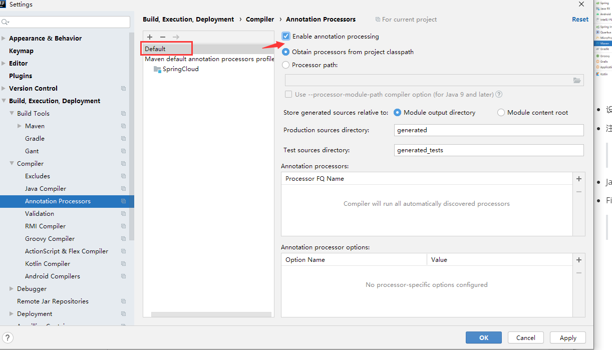

-   Java 版本选 8

-   File Type 过滤

    >   就是过滤掉项目 idea 软件的配置文件啊、git 文件啊、等等、不做也行


### 2、父工程 pom 文件构建


1、在父工程中添加 packaging 标签

>   packaging 改成 pom、表示这个pom是个总的父工程

```xml
<groupId>org.lee.springcloud</groupId>
<artifactId>SpringCloud</artifactId>
<version>1.0-SNAPSHOT</version>
<!-- 父工程改为 改成 pom  -->
<packaging>pom</packaging>
```


2、导入 微服务的必备模板包

```xml
  <!--统一管理jar包版本-->
  <properties>
    <project.build.sourceEncoding>UTF-8</project.build.sourceEncoding>
    <maven.compiler.source>1.8</maven.compiler.source>
    <maven.compiler.target>1.8</maven.compiler.target>
    <junit.version>4.12</junit.version>
    <log4j.version>1.2.17</log4j.version>
    <lombok.version>1.16.18</lombok.version>
    <mysql.version>5.1.47</mysql.version>
    <druid.version>1.1.16</druid.version>
    <mybatis.spring.boot.version>1.3.0</mybatis.spring.boot.version>
  </properties>


  <!--子模块继承之后
      提供作用：锁定版本 + 子 module 不用写 groupId 和 version -->
  <dependencyManagement>
    <dependencies>

      <!--spring boot 2.2.2-->
      <dependency>
        <groupId>org.springframework.boot</groupId>
        <artifactId>spring-boot-dependencies</artifactId>
        <version>2.2.2.RELEASE</version>
        <type>pom</type>
        <scope>import</scope>
      </dependency>

      <!--spring cloud Hoxton.SR1-->
      <dependency>
        <groupId>org.springframework.cloud</groupId>
        <artifactId>spring-cloud-dependencies</artifactId>
        <version>Hoxton.SR1</version>
        <type>pom</type>
        <scope>import</scope>
      </dependency>

      <!--spring cloud 阿里巴巴-->
      <dependency>
        <groupId>com.alibaba.cloud</groupId>
        <artifactId>spring-cloud-alibaba-dependencies</artifactId>
        <version>2.1.0.RELEASE</version>
        <type>pom</type>
        <scope>import</scope>
      </dependency>

      <!--mysql-->
      <dependency>
        <groupId>mysql</groupId>
        <artifactId>mysql-connector-java</artifactId>
        <version>${mysql.version}</version>
        <!--      <scope>runtime</scope>-->
      </dependency>

      <!-- druid-->
      <dependency>
        <groupId>com.alibaba</groupId>
        <artifactId>druid</artifactId>
        <version>${druid.version}</version>
      </dependency>

      <!--mybatis-->
      <dependency>
        <groupId>org.mybatis.spring.boot</groupId>
        <artifactId>mybatis-spring-boot-starter</artifactId>
        <version>${mybatis.spring.boot.version}</version>
      </dependency>

      <!--junit-->
      <dependency>
        <groupId>junit</groupId>
        <artifactId>junit</artifactId>
        <version>${junit.version}</version>
      </dependency>

      <!--log4j-->
      <dependency>
        <groupId>log4j</groupId>
        <artifactId>log4j</artifactId>
        <version>${log4j.version}</version>
      </dependency>

      <!--解决maven项目中 无法打包生成空文件夹的问题-->
      <dependency>
        <groupId>org.apache.maven.plugins</groupId>
        <artifactId>maven-project-info-reports-plugin</artifactId>
        <version>3.0.0</version>
      </dependency>

    </dependencies>
  </dependencyManagement>

  <build>
    <plugins>
      <plugin>
        <groupId>org.springframework.boot</groupId>
        <artifactId>spring-boot-maven-plugin</artifactId>
        <version>2.3.7.RELEASE</version>
        <configuration>
          <fork>true</fork>
          <addResources>true</addResources>
        </configuration>
      </plugin>
    </plugins>
  </build>
```


### 3、maven知识点复习


Maven使用 <dependencyManagement> 元素来提供了一种管理依赖版本号的方式

通常会在一个组织或者项目的最顶层的父POM中看<dependencyManagement>元素

使用pom.xml中的<dependencyManagement>元索能让所有在子项目中引用一个依赖而不用显式的列出版本号

Maven会沿着父子层次向上走，直到找到一个拥有<dependencyManagement>元素的项目，然后它就会使用这个<dependencyManagement>元素中指定的版本号


**如父类代码里：**

```xml
<dependencyManagement>
    <dependencies>
        <dependency>
            <groupId>mysql</groupId>
            <artifactId>mysql-connector-java</artifactId>
            <version>5.1.2</version>
        </dependency>
    </dependencies>
</dependencyManagement>
```


**然后在子项目理就可以添加 mysql-connector 时可以不指定版本号，**例如：

```xml
<dependencies>
    <dependency>
        <groupId>mysql</groupId>
        <artifactId>mysql-connector-java</artifactId>
    </dependency>
</dependencies>
```


然后子项目就可以往上查找到带有<dependencyManagement>标签的父项目，然后使用父项目的版本号、这样做可以使版本可以统一管理


这样做的好处就是：

>   如果有多个子项目都引用同一样依赖，则可以避免在每个使用的子项目里都声明一个版本号，这样当想升级或切换到另一个版本时，只需要在顶层父容器里更新，而不需要一个一个子项目的修改；**另外如果某个子项目需要另外的一个版本，只需要声明version就可**


**总结：**

-   <dependencyManagement>里只是声明依赖，并不实现引入，因此子项目需要显示的声明需要用的依赖
-   如果不在子项目中声明依赖，是不会从父项目中继承下来的；只有在子项目中写了该依赖项，并且没有指定具体版本，才会从父项目中继承该项，并且version 和scope 都读取自父 pom

-   如果子项目中指定了版本号，那么会使用子项目中指定的jar版本


### 4、maven跳过单元测试


>   项目中节约时间先暂时跳过单元测试、IDEA中如下操作


### 5、小结：

父工程创建完毕后执行下 mvn:install 发布到我们的仓库供后续子工程使用


## 4、支付模块构建(服务提供者)


>   **牢记：约定 > 配置 > 编码**


### 1、Module 的环境搭建

##### 1、再父工程上创建一个 Model，名为 cloud-provider-payment8001


##### 2、增加 pom 文件驱动包依赖

```xml
<dependencies>
    <!--spring boot 2.2.2 web 启动器-->
    <dependency>
        <groupId>org.springframework.boot</groupId>
        <artifactId>spring-boot-starter-web</artifactId>
    </dependency>

    <!--图形化监控展现-几乎和starter-web绑定在一块使用 -->
    <dependency>
        <groupId>org.springframework.boot</groupId>
        <artifactId>spring-boot-starter-actuator</artifactId>
    </dependency>

    <!--mybatis 和 springboot 整合-->
    <dependency>
        <groupId>org.mybatis.spring.boot</groupId>
        <artifactId>mybatis-spring-boot-starter</artifactId>
    </dependency>

    <!-- druid数据源-->
    <dependency>
        <groupId>com.alibaba</groupId>
        <artifactId>druid-spring-boot-starter</artifactId>
        <version>1.1.10</version>
    </dependency>

    <!--mysql-connector-java-->
    <dependency>
        <groupId>mysql</groupId>
        <artifactId>mysql-connector-java</artifactId>
    </dependency>

    <!--jdbc-->
    <dependency>
        <groupId>org.springframework.boot</groupId>
        <artifactId>spring-boot-starter-jdbc</artifactId>
    </dependency>

    <dependency>
        <groupId>org.springframework.boot</groupId>
        <artifactId>spring-boot-devtools</artifactId>
        <scope>runtime</scope>
        <optional>true</optional>
    </dependency>

    <!-- lombok 插件-->
    <dependency>
        <groupId>org.projectlombok</groupId>
        <artifactId>lombok</artifactId>
        <optional>true</optional>
    </dependency>

    <dependency>
        <groupId>org.springframework.boot</groupId>
        <artifactId>spring-boot-starter-test</artifactId>
        <scope>test</scope>
    </dependency>

</dependencies>
```


##### 3、新建 yml 配置文件、并编写配置

```yaml
#每个微服务建议配一个端口号和服务名称
server:
  port: 8001

#配置微服务名称
spring:
  application:
    name: cloud-payment-service

  datasource:
    type: com.alibaba.druid.pool.DruidDataSource  # 当前数据源操作类型
    driver-class-name: org.gjt.mm.mysql.Driver    # mysql驱动包
    url: jdbc:mysql://192.168.0.166:3306/mybatis_plus?useUnicode=true&characterEncoding=utf8&useSSL=false
    username: root
    password: Lee193654300_

#配置 mybatis 映射文件路径 和 包别名路径
mybatis:
  mapper-locations: classpath:mapper/*.xml
  type-aliases-package: com.lee.springcloud.entities
```


##### 4、添加包和SpringBoot的主启动类

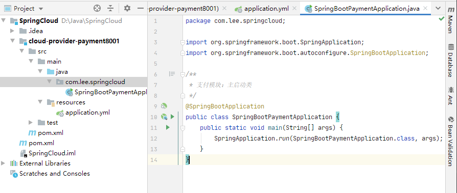


### 2、业务类的编写


#### 1、建一张 支付表 payment

```sql

SET NAMES utf8mb4;
SET FOREIGN_KEY_CHECKS = 0;

-- ----------------------------
-- Table structure for payment
-- ----------------------------
DROP TABLE IF EXISTS `payment`;

CREATE TABLE `payment`  (
  `id` bigint(20) NOT NULL COMMENT 'ID',
  `serial` varchar(200) CHARACTER SET utf8 COLLATE utf8_general_ci NULL DEFAULT NULL,
  PRIMARY KEY (`id`) USING BTREE
) ENGINE = InnoDB CHARACTER SET = utf8 COLLATE = utf8_general_ci ROW_FORMAT = Dynamic;

SET FOREIGN_KEY_CHECKS = 1;
```


#### 2、构建 entities


>   我们需要创建一个包 entities、编写 Payment 实体

```java
package com.lee.springcloud.entities;

import lombok.AllArgsConstructor;
import lombok.Data;
import lombok.NoArgsConstructor;

import java.io.Serializable;

/**
 * 支付实体类
 */
@Data
@AllArgsConstructor
@NoArgsConstructor
public class Payment implements Serializable {
    /**
     * id
     */
    private Long id;
    /**
     * 流水号
     */
    private String serial;
}
```


>   由于我们向前端返回查询的实体类，需要对实体类进行封装构造，编写 CommonResult<T> 类

```java
package com.lee.springcloud.entities;

import lombok.AllArgsConstructor;
import lombok.Data;
import lombok.NoArgsConstructor;

@Data
@AllArgsConstructor
@NoArgsConstructor
/**
 * 主要是返回给前端用的
 */
public class CommonResult<T> {
    private Integer code;
    private String message;
    private T data;

    public CommonResult(Integer code, String message) {
        this.code = code;
        this.message = message;
    }
}

```


#### 3、编写 dao


>   我们需要创建对实体操作的接口 PaymentDao 接口

```java
package com.lee.springcloud.dao;

import com.lee.springcloud.entities.Payment;
import org.apache.ibatis.annotations.Mapper;
import org.apache.ibatis.annotations.Param;

/**
 * @Repository
 *   这里推荐使用 Mapper、因为 Repository 插入的时候可能有问题
 */
@Mapper
public interface PaymentDao {

    /**
     * 创建(新增)一个支付对象
     * @param payment
     * @return
     */
    int createPayment(Payment payment);

    /**
     * 根据 id 获取一个 Payment 对象
     * @param id
     * @return
     */
    Payment getPaymentById(@Param("id") Long id);
}
```


>   在 resources 目录下建立 mybatis 的 mapper 文件夹
>
>   并创建 PaymentMapper.xml 配置文件、实现 PaymentDao 接口的方法


```xml
<?xml version="1.0" encoding="UTF-8" ?>
<!DOCTYPE mapper
        PUBLIC "-//mybatis.org//DTD Mapper 3.0//EN"
        "http://mybatis.org/dtd/mybatis-3-mapper.dtd">

<mapper namespace="com.lee.springcloud.dao.PaymentDao">

    <resultMap id="BaseResultMap" type="com.lee.springcloud.entities.Payment">
        <id column="id" property="id" jdbcType="BIGINT" />
        <id column="serial" property="serial" jdbcType="VARCHAR"/>
    </resultMap>
    
    <!--
        useGeneratedKeys 插入成功返回主键
        keyProperty 指定主键是谁，指定后插入主键就不用显示写了
        -->
    <insert id="createPayment" parameterType="Payment" useGeneratedKeys="true" keyProperty="id">
         insert into payment(serial) values(#{serial});
    </insert>

    <select id="getPaymentById" parameterType="Long" resultMap="BaseResultMap">
         select id, serial from payment where id = #{id}
    </select>
</mapper>
```


#### 4、编写 service


>   我们在service 包下编写 PaymentService 接口

```java
package com.lee.springcloud.service;

import com.lee.springcloud.entities.Payment;
import org.apache.ibatis.annotations.Param;

public interface PaymentService {

    int createPayment(Payment payment);

    Payment getPaymentById(@Param("id") Long id);
}
```


>   并在 impl 包下添加实现类 PaymentServiceImpl

```java
package com.lee.springcloud.service.impl;

import com.lee.springcloud.dao.PaymentDao;
import com.lee.springcloud.entities.Payment;
import com.lee.springcloud.service.PaymentService;
import org.springframework.stereotype.Service;

import javax.annotation.Resource;

@Service
public class PaymentServiceImpl implements PaymentService {

    /**
     * 这里没用 Spring 的 @Autowrite
     * 而是用了 Java 自带的 @Resource 注解,也可以进行依赖注入
     */
    @Resource
    private PaymentDao paymentDao;

    @Override
    public int createPayment(Payment payment) {
        return paymentDao.createPayment(payment);
    }

    @Override
    public Payment getPaymentById(Long id) {
        return paymentDao.getPaymentById(id);
    }
}

```


#### 5、增加对Swagger的支持


>   我们在父工程导入 Swagger 的 maven 依赖

```xml
<!--统一管理jar包版本-->
<properties>
    <!--配置 Swagger jar包版本-->
    <swagger.version>2.9.2</swagger.version>
</properties>

<!-- 导入 Swagger 配置 -->
<dependency>
    <groupId>io.springfox</groupId>
    <artifactId>springfox-swagger2</artifactId>
    <version>${swagger.version}</version>
</dependency>

<dependency>
    <groupId>io.springfox</groupId>
    <artifactId>springfox-swagger-ui</artifactId>
    <version>${swagger.version}</version>
</dependency>
```


>   然后在子工程 cloud-provider-payment8001 的 pom 文件中添加依赖

```xml
<!-- 导入 Swagger 配置 -->
<dependency>
    <groupId>io.springfox</groupId>
    <artifactId>springfox-swagger2</artifactId>
</dependency>

<dependency>
    <groupId>io.springfox</groupId>
    <artifactId>springfox-swagger-ui</artifactId>
</dependency>
```


>   我们在 config 包下建立 SwaggerConfig 配置文件

```java
package com.lee.springcloud.config;

import org.springframework.context.annotation.Bean;
import org.springframework.context.annotation.Configuration;
import org.springframework.core.env.Environment;
import springfox.documentation.builders.RequestHandlerSelectors;
import springfox.documentation.service.ApiInfo;
import springfox.documentation.service.Contact;
import springfox.documentation.spi.DocumentationType;
import springfox.documentation.spring.web.plugins.Docket;
import springfox.documentation.swagger2.annotations.EnableSwagger2;

import java.util.ArrayList;

/**
 * 配置 Swagger
 */
@Configuration
@EnableSwagger2 //开启 Swagger2
public class SwaggerConfig {
    /**
     * 配置 Swagger Docket 的 bean 实例
     * @param environment
     * @return
     */
    @Bean
    public Docket docket(Environment environment){

        //apiInfo() 可以设置 Swagger 界面的描述
        return new Docket(DocumentationType.SWAGGER_2)
                /**
                 * 添加 Swagger 的描述信息
                 */
                .apiInfo(getApiInfo())
                /**
                 * 分组
                 */
                .groupName("cloud-provider-payment8001")
                .select()
                /**
                 * apis：添加要扫描的 api 接口规则
                 *   RequestHandlerSelectors
                 *      any()：扫描全部
                 *      none()：不扫描
                 *      withClassAnnotation()：扫描类上的注解
                 *      withMethodAnnotation()：扫描方法上的注解
                 *      basePackage()：扫描包下的所有 (最常用)
                 */
                .apis(RequestHandlerSelectors.basePackage("com.lee.springcloud.controller"))
                /**
                 * paths()：设置过滤规则
                 */
                /*.paths(PathSelectors.ant("/swagger/**"))*/
                .build();
    }

    /**
     * 配置 Swagger 的接口描述信息
     * @return
     */
    private ApiInfo getApiInfo(){
        //配置作者信息
        Contact contact = new Contact("Lee", "https://space.bilibili.com/486305074", "javaleerf@163.com");

        return new ApiInfo(
                "Lee 的 SwaggerAPI 文档",
                "即使再小的帆也能远航",
                "v1.0",
                "https://space.bilibili.com/486305074",
                contact,
                "Apache 2.0",
                "http://www.apache.org/licenses/LICENSE-2.0",
                new ArrayList()
        );
    }
}

```


#### 6、编写 Controller


>   最后一步编写 Controller 的接口

```java
package com.lee.springcloud.controller;

import com.lee.springcloud.entities.CommonResult;
import com.lee.springcloud.entities.Payment;
import com.lee.springcloud.service.PaymentService;
import io.swagger.annotations.Api;
import io.swagger.annotations.ApiOperation;
import lombok.extern.slf4j.Slf4j;
import org.springframework.web.bind.annotation.GetMapping;
import org.springframework.web.bind.annotation.PathVariable;
import org.springframework.web.bind.annotation.PostMapping;
import org.springframework.web.bind.annotation.RestController;

import javax.annotation.Resource;

@Slf4j
@RestController
@Api("支付业务控制类")
public class PaymentController {

    @Resource
    private PaymentService paymentService;

    @ApiOperation("创建一个支付流水")
    @PostMapping(value = "/payment/createPayment")
    public CommonResult createPayment(Payment payment){

        int createResult = paymentService.createPayment(payment);
        log.info("*******插入结果：" + createResult);

        if(createResult > 0){
            return new CommonResult(200, "插入数据成功", createResult);
        }else{
            return new CommonResult(444, "插入数据失败", null);
        }
    }

    @ApiOperation("查询一个支付流水号")
    @GetMapping(value = "/payment/get/{id}")
    public CommonResult getPaymentById(@PathVariable("id") Long id){
        Payment payment = paymentService.getPaymentById(id);
        log.info("*******查询结果：" + payment);

        if(payment != null){
            return new CommonResult(200, "查询成功", payment);
        }else{
            return new CommonResult(444, "没有对应的记录、查询ID：" + id, null);
        }
    }
}

```


#### 7、访问 Swagger 界面进行测试


我们可以看到测试成功


### 3、热部署工具 Devtools


##### 1、导入 devtools 的 maven 依赖

```xml
<dependency>
    <groupId>org.springframework.boot</groupId>
    <artifactId>spring-boot-devtools</artifactId>
    <scope>runtime</scope>
    <optional>true</optional>
</dependency>
```


##### 2、将下面的配置粘贴进我**们 聚合 父类的总工程 pom.xml 文件**

```xml
<build>
    <plugins>
      <plugin>
        <groupId>org.springframework.boot</groupId>
        <artifactId>spring-boot-maven-plugin</artifactId>
        <version>2.3.7.RELEASE</version>
        <configuration>
          <fork>true</fork>
          <addResources>true</addResources>
        </configuration>
      </plugin>
    </plugins>
</build>
```


##### 3、开启 IDEA 自动编译选项


##### 4、开启热注册（Update the value of）

>   输入快捷键 Ctrl + shift + Alt + / 弹出 IDEA 的窗口、选择 Registry将以下内容打上 √ 


##### 5、重启 IDEA 


##### 6、个人建议

>   这个东西只能开发环境使用，生产环境禁止掉


>   笔记本配置还是别开启这个东西了，不然每做一个小改动 IDEA 都要进行编译部署、卡的一笔


## 5、订单消费者订单模块（服务消费者）

 

### 1、Module 的环境搭建


#### 1、建立一个新的 maven Module

>   命名为 cloud-consumer-order80


#### 2、导入Maven 包依赖

```xml
<dependencies>
    <!--  web 和 actuator 是标配、必须要写  -->
    <dependency>
        <groupId>org.springframework.boot</groupId>
        <artifactId>spring-boot-starter-web</artifactId>
    </dependency>

    <dependency>
        <groupId>org.springframework.boot</groupId>
        <artifactId>spring-boot-starter-actuator</artifactId>
    </dependency>

    <!--<dependency>
        <groupId>org.springframework.boot</groupId>
        <artifactId>spring-boot-devtools</artifactId>
        <scope>runtime</scope>
        <optional>true</optional>
    </dependency>-->

    <dependency>
        <groupId>org.projectlombok</groupId>
        <artifactId>lombok</artifactId>
        <optional>true</optional>
     </dependency>

    <dependency>
        <groupId>org.springframework.boot</groupId>
        <artifactId>spring-boot-starter-test</artifactId>
    </dependency>
</dependencies>
```


#### 3、建立 yml 配置文件

```yaml
# 正常的微服务的服务端口绑定 80 端口
# 可以通过HTTP地址（即常说的“网址”）加“: 80”来访问网站，
# 因为浏览网页服务默认的端口号都是80，因此只需输入网址即可，不用输入“: 80”了
# 这么来配的的话用户直接访问网址就不用再加端口了，用户也不应该关注端口号
server:
  port: 80
```


### 2、业务类的编写


#### 1、我们将服务提供者的 entities 包下的代码拷过来


#### 2、编写 Controller

>   此时这个步骤，已经和服务提供者不一样了，这个工程不再有 Service、Dao、等等的接口来供 OrderController 来调用了，这里应该是两个服务的调用


##### 1、RestTemplate介绍


下面我们进行简单了解

>   RestTemplate 提供了多种便捷访问远程 Http 服务的方法
>
>   是一种简单便捷的访问 restful 服务模板类，是Spring 提供的用于访问 Rest 服务的**客户端模板工具类**


官网地址：

https://docs.spring.io/spring-framework/docs/current/javadoc-api/org/springframework/web/client/RestTemplate.html


使用：

-   使用 RestTemplate 访问 restful 接口非常的简单粗暴无脑

    >   url：REST 请求地址
    >
    >   requestMap：请求参数
    >
    >   ResponseBean.class：HTTP响应转换 被转换成的对象类型


##### 2、编写 config 包，并添加以下类

```java
package com.lee.springcloud.config;

import org.springframework.context.annotation.Bean;
import org.springframework.context.annotation.Configuration;
import org.springframework.web.client.RestTemplate;

/**
 * 配置 RestTemplate
 */
@Configuration
public class ApplicationContextConfig {

    @Bean
    public RestTemplate getRestTemplate(){
        return new RestTemplate();
    }
}
```


##### 3、编写 OrderController


```java
package com.lee.springcloud.controller;

import com.lee.springcloud.entities.CommonResult;
import com.lee.springcloud.entities.Payment;
import lombok.extern.slf4j.Slf4j;
import org.springframework.web.bind.annotation.GetMapping;
import org.springframework.web.bind.annotation.PathVariable;
import org.springframework.web.bind.annotation.PostMapping;
import org.springframework.web.bind.annotation.RestController;
import org.springframework.web.client.RestTemplate;

import javax.annotation.Resource;

/**
 * 服务消费者：订单模块
 */
@Slf4j
@RestController
public class OrderController {

    @Resource
    private RestTemplate restTemplate;

    public static final String PAYMENT_URL = "http://localhost:8001";

    @PostMapping("/consumer/payment/createPayment")
    public CommonResult<Payment> createPayment(Payment payment){
        log.info("进入服务消费者 order80 方法 createPayment：" + payment);
        /**
         * restTemplate
         *   读操作用 get
         *   写操作用 post
         */
        return restTemplate.postForObject(PAYMENT_URL + "/payment/createPayment", payment, CommonResult.class);
    }

    @GetMapping("/consumer/payment/get/{id}")
    public CommonResult<Payment> getPaymentById(@PathVariable("id") Long id){
        log.info("进入服务消费者 order80 方法 getPaymentById() 查询的 id => " + id);
        return restTemplate.getForObject(PAYMENT_URL + "/payment/get/" + id, CommonResult.class);
    }
}

```


##### 4、同样配置 Swagger模块

>   该步骤和之前一样这里省略、可选、不配置 Swagger 可以用 Postman进行接口调用测试


##### 5、测试\发现问题


>   我们调用服务消费者接口执行了插入方法


>   我们后台日志输出正确、已经拿到了 Test Data 这个数据


>   但是我们看服务提供者的后台日志发现 参数为了 null、数据库查看只看到了新数据的主键、serial 并没有值


**原来是我们的服务提供者的创建支付流水的接口没有加 @RequestBody 注解、导致数据接收异常**


我们改造这个方法、方法参数上加上这个注解

```java
public CommonResult createPayment(@RequestBody Payment payment)
```


重新测试发现成功


##### 6、所以不要忘记加 @RequestBody  注解


## 6、工程重构


### 1、为什么要重构？


重构说明：到此步骤、我们算是编写完了两个服务、一个服务提供者、和一个服务消费者，但是我们对比两个工程发现 entities 包 的实体类有臃余的地方，**我们将要对重复的地方进行重构，提取出来公共部分放在公开公用的地方**


### 2、新建Module名cloud-api-commons


>   该工程不但可以提取出来公共的地方、以后还可以存放公共的工具类、公共 api 接口、等等4


1、添加 maven 包依赖

```xml
<dependencies>
    <!--<dependency>
        <groupId>org.springframework.boot</groupId>
        <artifactId>spring-boot-devtools</artifactId>
        <scope>runtime</scope>
        <optional>true</optional>
    </dependency>-->

    <dependency>
        <groupId>org.projectlombok</groupId>
        <artifactId>lombok</artifactId>
        <optional>true</optional>
    </dependency>

    <!-- hutool 会提供日期的类的快捷转换等等 -->
    <dependency>
        <groupId>cn.hutool</groupId>
        <artifactId>hutool-all</artifactId>
        <version>5.1.0</version>
    </dependency>
</dependencies>
```


2、将 entities 包考到公共工程中、并删除其它两个服务的 entities 包以及代码


3、利用 maven 命令的 clean 和 install 打包发布公共本地库中供其它服务调用

然后将以下依赖粘贴到其它两个微服务项目

```xml
<!-- 引入自己定义的 api 通用包项目，可以使用 Payment 支付的 Entity -->
<dependency>
    <groupId>org.lee.springcloud</groupId>
    <artifactId>cloud-api-commons</artifactId>
    <version>${project.version}</version>
</dependency>
```


4、刷新 maven 进行测试功能是否正常


## 7、Eureka 的使用


### 1、什么是 Eureka？

Eureka 采用了 CS  的设计架构、Eureka Server 作为服务注册功能的服务器，它是服务注册中心，而系统中的其他微服务，使用 Eureka 的客户端连接到 Eureka Server 并维持心跳连接，这样系统的维护人员就可以通过 Eureka Server 来监控系统中的各个微服务是否正常运行。


在服务注册与发现中，有一个注册中心，当服务器启动的时候，会把当前服务器的信息比如服务器地址通讯等以别名方式注册到注册中心上，另一方（消费者|服务提供者）以该别名的方式去注册中心上获取到实际的服务通讯地址，然后在实现本地 RPC 调用 RPC 远程调用框架核心设计思想：在于注册中心，因为使用注册中心管理每个服务与服务之间的一个依赖关系（服务治理理念），任何RPC远程框架中，都会有一个注册中心（存放服务地址相关信息（接口地址））


Eureka 包含两个组件：


**Eureka Server：提供服务注册服务**

>   各个微服务节点通过配置启动后，会在 EurekaServer 中进行注册，这样 EurekaServer 中的服务注册表中将会存储所有可用服务节点的信息、服务节点的信息可以在界面中直观看到


**EurekaClient：通过注册中心进行访问**

>   是一个 Java 客户端，用户简化 Eureka Server 的交互，客户端同时也具备一个内置的，使用轮询（round-robin）负载算法的负载均衡器，在应用启动后，将会向 Eureka Server 发送心跳（默认周期为 30 秒）
>
>   如果 Eureka Server 在多个心跳周期内没有接收到某个节点的心跳，则将会从服务注册表中把这个服务节点移除（默认90秒）


### 2、Eureka 服务端的安装


#### 我们新建 Module名 cloud-eureka-server7001


1、导入 maven 依赖包

```xml
<dependencies>

    <!-- eureka 以前老版本、别再使用
    <dependency>
        <groupId>org.springframework.cloud</groupId>
        <artifactId>spring-cloud-starter-eureka</artifactId>
    </dependency>  -->
    
    <!-- eureka server-->
    <dependency>
        <groupId>org.springframework.cloud</groupId>
        <artifactId>spring-cloud-starter-netflix-eureka-server</artifactId>
    </dependency>

    <!--自定义api通用包-->
    <dependency>
        <groupId>org.lee.springcloud</groupId>
        <artifactId>cloud-api-commons</artifactId>
        <version>${project.version}</version>
    </dependency>

    <!--Sping boot web actuator-->
    <dependency>
        <groupId>org.springframework.boot</groupId>
        <artifactId>spring-boot-starter-web</artifactId>
    </dependency>

    <dependency>
        <groupId>org.springframework.boot</groupId>
        <artifactId>spring-boot-starter-actuator</artifactId>
    </dependency>

    <!--一般通用配置-->
    <!-- 热部署工具 -->
    <!--<dependency>
        <groupId>org.springframework.boot</groupId>
        <artifactId>spring-boot-devtools</artifactId>
        <scope>runtime</scope>
        <optional>true</optional>
    </dependency>-->

    <!-- lombok 插件-->
    <dependency>
        <groupId>org.projectlombok</groupId>
        <artifactId>lombok</artifactId>
        <optional>true</optional>
    </dependency>

    <dependency>
        <groupId>org.springframework.boot</groupId>
        <artifactId>spring-boot-starter-test</artifactId>
        <scope>test</scope>
    </dependency>
</dependencies>
```


2、编写 yaml 配置文件

```yaml
server:
  port: 7001

eureka:
  instance:
    # eureka 服务端的实例名称
    hostname: localhost

  client:
    # false 表示蹦年向注册中心注册自己
    register-with-eureka: false
    # false表示自己就是注册中心，我的职责就是维护服务实例,并不区检索服务
    fetch-registry: false
    service-url:
      # 设置与 eureka Server 交互的地址查询服务和注册服务都需要依赖这个地址
      defaultZone: http://${eureka.instance.hostname}:${server.port}/eureka/
```


3、编写主启动类

```java
package com.lee.springcloud;

import org.springframework.boot.SpringApplication;
import org.springframework.boot.autoconfigure.SpringBootApplication;
import org.springframework.cloud.netflix.eureka.server.EnableEurekaServer;

/**
 * @EnableEurekaServer
 *   代表我就是 Eureka 的服务注册中心
 */
@EnableEurekaServer
@SpringBootApplication
public class SpringBootEurekaApplication {
    public static void main(String[] args) {
        SpringApplication.run(SpringBootEurekaApplication.class, args);
    }
}
```


4、启动测试 7001 端口，出现以下界面

>   因为没有服务注册进来，界面当然显示 No application available


### 3、支付服务8001驻进 Eureka Server


>   我们根据以下步骤改造服务 cloud-provider-payment8001


1、新增如下 maven 包依赖

```xml
<!-- eureka client(客户端)-->
<dependency>
    <groupId>org.springframework.cloud</groupId>
    <artifactId>spring-cloud-starter-netflix-eureka-client</artifactId>
</dependency>
```


2、yml 配置文件新增如下配置

```yaml
# 配置 eureka
eureka:
  client:
    # 表示是否将自己注册到 EurekaServer服务、默认 true
    register-with-eureka: true
    # 是否从EurekaServer 抓取已有的注册信息、默认 true
    # 单节点无所谓，集群必须设置成 true 才能配合 ribbon 使用负载均衡
    fetch-registry: true
    service-url:
      defaultZone: http://localhost:7001/eureka
```


3、主启动类中添加注解 @EnableEurekaClient

```java
/**
 * 支付模块：主启动类
 */
@EnableEurekaClient
@SpringBootApplication
public class SpringBootPaymentApplication {
    public static void main(String[] args) {
        SpringApplication.run(SpringBootPaymentApplication.class, args);
    }
}
```


4、启动该服务 和 Eureka 服务，我们访问 Eureka 服务的主页可以看到界面有了支付服务的应用程序了


### 4、订单服务 80 驻进 Eureka Server


>   我们根据以下步骤改造服务 cloud-consumer-order80


1、新增导入以下 maven依赖

```xml
<!-- eureka client-->
<dependency>
    <groupId>org.springframework.cloud</groupId>
    <artifactId>spring-cloud-starter-netflix-eureka-client</artifactId>
</dependency>
```


2、新增 yml 如下配置

```yaml
# 配置微服务名称
spring:
  application:
    name: cloud-order-service

# 配置 eureka
eureka:
  client:
    # 表示是否将自己注册到 EurekaServer服务、默认 true
    register-with-eureka: true
    # 是否从EurekaServer 抓取已有的注册信息、默认 true
    # 单节点无所谓，集群必须设置成 true 才能配合 ribbon 使用负载均衡
    fetch-registry: true
    service-url:
      defaultZone: http://localhost:7001/eureka
```


3、主启动类中添加注解 @EnableEurekaClient

```java
package com.lee.springcloud;

import org.springframework.boot.SpringApplication;
import org.springframework.boot.autoconfigure.SpringBootApplication;
import org.springframework.cloud.netflix.eureka.EnableEurekaClient;

@EnableEurekaClient
@SpringBootApplication
public class SpringBootOrderApplication {
    public static void main(String[] args) {
        SpringApplication.run(SpringBootOrderApplication.class, args);
    }
}
```


4、开启两个服务和 Eureka 服务进行测试，可以看到 Eureka 首页出现了两个服务


## 8、Eureka 集群的使用


### 1、Eureka 集群原理


>   目前到这里单机版 Eureka 的服务注册与发现就已经完成了，我们还需要进行 Eureka 的集群部署、因为企业是不可能用单机版的注册中心的，如果单机版突然挂了，那么所有的服务都将不可访问，这样的结果是灾难性的


一句话总结：互相注册、相互守望


### 2、Eureka 集群环境构建


**1、建一个新的 Module 命名为 cloud-eureka-server7002**


**2、工程结构还有类属性都和 eureka 7001 差不多，以下不同的点**

-   修改 yml 配置文件端口为 7002


**3、找到 C:\Windows\System32\drivers\etc 目录下 hosts 文件**

>   修改hosts 文件增加以下内容


**4、我们需要修改两个项目的 yml 配置文件**

修改 cloud-eureka-server7001 的 defaultZone

```yaml
server:
  port: 7001

service-url:
  # 多个集群中间用逗号分隔
  defaultZone: http://eureka7002.com:7002/eureka/
```


修改 cloud-eureka-server7002 的 defaultZone

```yaml
server:
  port: 7002

service-url:
  # 这里就体现了相互注册、7002 的端口注册 7001
  defaultZone: http://eureka7001.com:7001/eureka/
```


**5、进行测试访问界面，看到 Eureka 互相有对方的信息就成功了**


7001 出现了 7002 的信息


7002 出现了 7001 的信息


### 3、订单服务支付服务两个微服务注册进Eureka集群


1、修改 7001 支付服务的 yml 配置文件

```yaml
service-url:
  # 单机版 defaultZone: http://localhsot:7001/eureka
  # 集群版
  defaultZone: http://eureka7001.com:7001/eureka,http://eureka7002.com:7002/eureka
```


2、修改 80 订单服务的 yml 配置文件

```yaml
service-url:
  # 单机版 defaultZone: http://localhsot:7001/eureka
  # 集群版
  defaultZone: http://eureka7001.com:7001/eureka,http://eureka7002.com:7002/eureka
```


3、启动测试

-   先启动 EurekaServer, 7001/7002集群服务
-   在启动服务提供者 provider 8001
-   最后启动消费者 80
-   进行接口测试


### 4、支付微服务集群配置

目前，我们的服务注册中心是集群配置的、已经配置了 7001、7002，但是这样还是不够，我们可以看到下图其实服务提供者支付服务也是集群配置的，所以我们还需要增加微服务集群的提供者


#### 1、新建 cloud-provider-payment8002 服务


1、后续步骤如下：

>   一句话：就是完全的 8001 服务的克隆体、以下只说明要改的地方

-   改正8002服务的 yml 端口号
-   改正 8002 Swagger 的描述信息
-   将 8001 服务的主启动类改成 SpringBootPayment8001
-   将 8002 服务的主启动类改成 SpringBootPayment8002
-   其它文件大体不变


改好后的工程目录对比


2、目前我们增加了两个 [服务提供者：支付服务8001、8002] 之后，这两个服务对外暴露的名字都是 yml 配置的如下名字

```yaml
# 配置微服务名称
spring:
  application:
    name: cloud-payment-service
```


思考：那么 [消费者服务：订单服务 80] 再去调用到底是调用 8001 还是 8002 呢？所以这里就引用出了负载均衡


>   那么我们继续改造我们的两个 服务提供者 8001、8002


3、我们先来改造支付服务8001的 PaymentController 控制器、增加以下代码

```java
//获取本服务的端口号
@Value("${server.port}")
private String serverPort;
```


然后把所有业务操作的时候加上端口号返回、如下

```java
@ApiOperation("创建一个支付流水")
@PostMapping(value = "/payment/createPayment")
public CommonResult createPayment(@RequestBody Payment payment){

    int createResult = paymentService.createPayment(payment);
    log.info("*******插入数据：" + payment + " 结果：" + createResult);

    if(createResult > 0){
        return new CommonResult(200, "插入数据成功, 端口号：" + serverPort, createResult);
    }else{
        return new CommonResult(444, "插入数据失败", null);
    }
}
```


**那么至此、8002 服务也同样添加以上的端口代码**


4、我们启动所有微服务进行测试

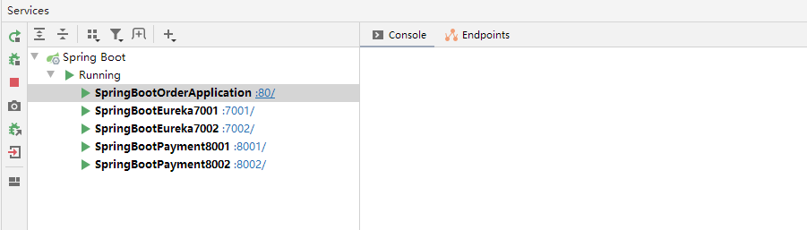


>   思考：我们对接口进行过 N 多次测试，发现每次都是走的 服务提供者 8001 端口，为什么？


**答：我们打开 [ 消费者服务：订单模块 80 ] 发现 OrderController 请求代码将端口号写死的**


5、那么我们就应该改造这个 OrderController 端口代码，端口微服务不能写死，我们把写死的地址改成我们微服务的名称


```java
/*单机版配置
public static final String PAYMENT_URL = "http://localhost:8001";*/
//集群的话端口号不能写死，应该写 Eureka 上的服务名称
public static final String PAYMENT_URL = "http://CLOUD-PAYMENT-SERVICE";
```


然后我们进行重启测试发现报错 

>   nested exception is java.net.UnknownHostException: CLOUD-PAYMENT-SERVICE"


6、我们还需要添加 @LoadBalanced 注解 开启负载均衡功能、我们改造 80 服务代码

```java
/**
 * 配置 RestTemplate
 */
@Configuration
public class ApplicationContextConfig {

    @Bean
    @LoadBalanced //开启 Eureka 负载均衡
    public RestTemplate getRestTemplate(){
        return new RestTemplate();
    }
}
```


**再次启动测试、我们可以发现 8001和8002 端口交替调用，负载均衡默认是轮询**

**总结：服务消费者 可以直接调用服务 而不用在关注地址和端口号，且服务还有负载均衡功能了**


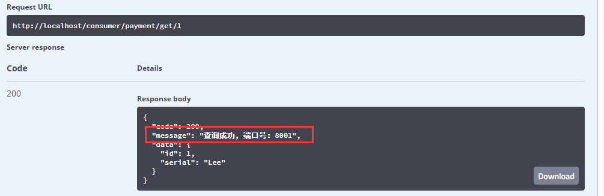


## 9、Eureka 信息完善和服务发现


### 1、Actuator 微服务信息完善


在项目中服务多了我们通常需要修改服务为自定义的服务的名称，以及还需要知道这个服务是哪个 ip ，哪个服务，等等，我们需要配置 Eureka 完善这些信息


我们分别在 8001 服务和 8002服务添加 instance 属性的配置

```yaml
# 配置 eureka
eureka:
  client:
    # 表示是否将自己注册到 EurekaServer服务、默认 true
    register-with-eureka: true
    # 是否从EurekaServer 抓取已有的注册信息、默认 true
    # 单节点无所谓，集群必须设置成 true 才能配合 ribbon 使用负载均衡
    fetch-registry: true
    service-url:
      # 单机版 defaultZone: http://localhsot:7001/eureka
      # 集群版
      defaultZone: http://eureka7001.com:7001/eureka,http://eureka7002.com:7002/eureka
  instance:
    # 自定义我们的服务在 Eurake 界面的显示
    instance-id: cloud-payment8002
    # 设置悬停服务名称可以显示 ip 地址
    prefer-ip-address: true
```


重新启动所有服务进行测试、我们可以看到服务的 ip 和自定义名称了

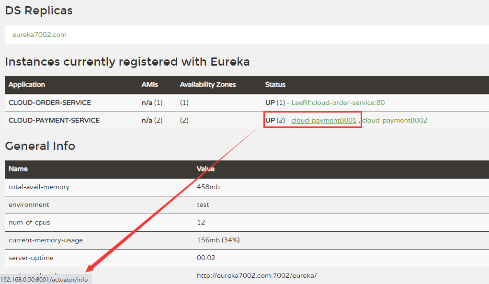


### 2、服务发现 Discovery


我们对 服务提供者：支付服务 进行改造、来增加一个接口向外提供微服务的具体服务信息、端口路径等等的信息


1、我们改造 支付服务8001 的 PaymentController，增加以下接口和代码

```java
import org.springframework.cloud.client.discovery.DiscoveryClient;

@Resource
private DiscoveryClient discoveryClient;
```


```java
@GetMapping("/payment/discovery")
@ApiOperation("获取微服务的信息")
public CommonResult<DiscoveryClient> discovery(){

    //获取所有的微服务名称
    List<String> services = discoveryClient.getServices();
    services.forEach(s -> log.info("*********输出服务名称：" + s));

    //根据微服务名称获取该名称下的所有服务端口
    List<ServiceInstance> instances = discoveryClient.getInstances("CLOUD-PAYMENT-SERVICE");
    instances.forEach(i -> log.info("服务id：" + i.getServiceId() + " | 服务主机：" + i.getHost() + " | 服务端口：" + i.getPort() + " | 服务路径：" + i.getUri()));

    return new CommonResult(200, "查询微服务信息成功、访问端口：" + serverPort, discoveryClient);
}
```


2、在启动类上增加注解 @EnableDiscoveryClient 开启 Discovery

```java
/**
 * 支付模块：主启动类
 */
@EnableEurekaClient
@EnableDiscoveryClient
@SpringBootApplication
public class SpringBootPayment8001 {
    public static void main(String[] args) {
        SpringApplication.run(SpringBootPayment8001.class, args);
    }
}
```


3、支付服务 8002 同样按以上步骤进行改造，然后我们重新启动服务，进行测试


**思考：这样我们可以通过 getServices() 方法获取所有的服务名称，然后把获取的服务名称放入 getInstances() 方法就可以获取服务的详细的信息了**


## 10、Eureka 的自我保护


### 1、Eureka自我保护概述


保护模式主要用于一组客户端和 Eureka Server 之间存在网络分区场景下的保护、一旦进入保护模式

**Eureka Server 将会尝试保护其服务注册表中的信息，不再删除服务注册表中的数据，也就是不会注销任何微服务**


### 2、什么是自我保护机制？


默认情况下，当 Eureka Server 在一定时间内没有收到实例的心跳，便会把该实例从注册表中删除（默认是90秒），但是当网络分区故障发生（延时、卡顿、拥挤）时，微服务与 Eureka Server 之间无法正常通信，短时间内丢失大量的实例心跳，这时以上行为可能会变得非常危险了（因为微服务本身其实是健康的），**此时不应该注销这个微服务**，便会触发 eureka server 的自我保护机制来解决这个问题，当 Eureka Server 节点在短时间内丢失过多客户端心跳时，那么这个节点就会进入自我保护模式


>   或者在开发测试时，需要频繁地重启微服务实例，但是我们很少会把eureka server一起重启（因为在开发过程中不会修改eureka注册中心），当一分钟内收到的心跳数大量减少时，会触发该保护机制。可以在 eureka 管理界面看到 Renews threshold 和 Renews(last min)，当后者（最后一分钟收到的心跳数）小于前者（心跳阈值）的时候，触发保护机制，会出现红色的警告：


**EMERGENCY! EUREKA MAY BE INCORRECTLY CLAIMING INSTANCES ARE UP WHEN THEY'RE NOT. RENEWALS ARE LESSER THAN THRESHOLD AND HENCE THE INSTANCES ARE NOT BEING EXPIRED JUST TO BE SAFE.**


从警告中可以看到，eureka认为虽然收不到实例的心跳，但它认为实例还是健康的，eureka会保护这些实例，不会把它们从注册表中删掉


### 3、为什么会产生自我保护机制？


为防止 Eureka Client 可以正常运行，但是与 Eureka Server 网络不同的情况下，Eureka Server 不会立刻将 Eureka Client 服务剔除

它的设计哲学就是宁可保留错误的服务注册信息，也不盲目注销任何可能健康的服务实例，可以让 Eureka 集群更加的健壮、稳定


### 4、导致原因


>   属于 CAP里面的AP分支

一句话总结：某时刻某一个微服务不可用了，Eureka 不会立刻清理，依旧会对该微服务的信息进行保存


### 5、禁用 Eureka 的自我保护


如我我们在企业中，不想用这个自我保护机制，如果发现客户端丢失过多心跳，我们直接将这个服务从 Eureka 注册表移除掉（比较决绝），我们可以按照以下步骤操作


>   该机制默认是开启的


1、我们在 cloud-eureka-server7001 和 cloud-eureka-server7002 两个服务端注册中心修改 yml 配置文件

增加以下配置

```yaml
eureka:
  server:
    # 关闭自我保护机制,保证不可用服务被及时删除
    enable-self-preservation: false
    # 设置如果丢失客户端心跳2秒钟就删除
    eviction-interval-timer-in-ms: 2000
```


2、同样的我们在 payment8001 和 payment8002 两个服务的yml增加以下配置

```yaml
# 配置 eureka
eureka:
  instance:
    # Eureka 客户端向服务端发送心跳的时间间隔，单位为秒（默认30）
    lease-renewal-interval-in-seconds: 1
    # Eureka 服务端在收到最后一次心跳后等待时间上限，单位为秒（默认90）
    lease-expiration-duration-in-seconds: 2
```


3、然后我们启动测试、可以看到关闭保护机制 Eureka 主界面如下显示


4、并发现以下两个微服务


5、此时我们关闭 支付服务8001，然后刷新 Eureka 主界面看到该服务立刻没有了


### 6、Eureka 停更说明


Eureka github 地址：https://github.com/Netflix/eureka/wiki


## 11、Spring Cloud 整合 Zookeeper


### 1、我们新建一个服务

>   cloud-provider-payment8004


然后导入以下 maven 依赖文件

-   注意：先排除自带的 zookeeper 3.5.3
-   还要排除这个版本的 slf4j，不然日志冲突

```xml
<dependencies>
    <!-- 导入 Swagger 配置 -->
    <dependency>
        <groupId>io.springfox</groupId>
        <artifactId>springfox-swagger2</artifactId>
    </dependency>

    <dependency>
        <groupId>io.springfox</groupId>
        <artifactId>springfox-swagger-ui</artifactId>
    </dependency>

    <dependency>
        <groupId>org.lee.springcloud</groupId>
        <artifactId>cloud-api-commons</artifactId>
        <version>${project.version}</version>
    </dependency>

    <dependency>
        <groupId>org.springframework.boot</groupId>
        <artifactId>spring-boot-starter-web</artifactId>
    </dependency>

    <!--SpringBoot 整合 Zookeeper 客户端-->
    <dependency>
        <groupId>org.springframework.cloud</groupId>
        <artifactId>spring-cloud-starter-zookeeper-discovery</artifactId>
        <exclusions>
            <!--先排除自带的 zookeeper 3.5.3-->
            <exclusion>
                <groupId>org.apache.zookeeper</groupId>
                <artifactId>zookeeper</artifactId>
            </exclusion>
        </exclusions>
    </dependency>

    <!--添加 zookeeper 3.1.10 版本-->
    <dependency>
        <groupId>org.apache.zookeeper</groupId>
        <artifactId>zookeeper</artifactId>
        <version>3.4.10</version>

        <!--还要排除这个版本的 slf4j-->
        <exclusions>
            <exclusion>
                <groupId>org.slf4j</groupId>
                <artifactId>slf4j-log4j12</artifactId>
            </exclusion>
        </exclusions>
    </dependency>

    <dependency>
        <groupId>org.springframework.boot</groupId>
        <artifactId>spring-boot-starter-actuator</artifactId>
    </dependency>

<!--        <dependency>
        <groupId>org.springframework.boot</groupId>
        <artifactId>spring-boot-devtools</artifactId>
        <scope>runtime</scope>
        <optional>true</optional>
    </dependency>-->

    <dependency>
        <groupId>org.projectlombok</groupId>
        <artifactId>lombok</artifactId>
        <optional>true</optional>
    </dependency>

    <dependency>
        <groupId>org.springframework.boot</groupId>
        <artifactId>spring-boot-starter-test</artifactId>
        <scope>test</scope>
    </dependency>
</dependencies>
```


我们创建yml配置文件

```yaml
server:
  port: 8004

# 配置 zookeeper 注册中心
spring:
  application:
    name: cloud-provider-payment
  cloud:
    zookeeper:
      connect-string: 192.168.1.166:2181
```


编写启动类

```java
package com.lee.springcloud;

import org.springframework.boot.SpringApplication;
import org.springframework.boot.autoconfigure.SpringBootApplication;
import org.springframework.cloud.client.discovery.EnableDiscoveryClient;

@EnableDiscoveryClient
@SpringBootApplication
public class SpringBootPayment8004 {
    public static void main(String[] args) {
        SpringApplication.run(SpringBootPayment8004.class, args);
    }
}

```


编写 Controller 并集成 Swagger 进行测试

```java
package com.lee.springcloud.controller;

import org.springframework.beans.factory.annotation.Value;
import org.springframework.web.bind.annotation.GetMapping;
import org.springframework.web.bind.annotation.RestController;

import java.util.UUID;

@RestController
public class PaymentController {

    @Value("${server.port}")
    private String SERVER_PORT;

    @GetMapping("/payment/getPayment")
    public String getPaymentZK(){
        return "springcloud with zookeeper：" + SERVER_PORT + "\t" + UUID.randomUUID().toString();
    }
}
```


**启动报错：Connection timed out: no further information**

-   我们一定要确保关闭 Linux 防火墙
-   重启 zookeeper 服务
-   重启 payment8004 微服务进行测试


经历以上步骤我们进入 zookeeper 的服务端看到多了 services 节点、这就代表了 payment8004 已经注册进了 zookeeper 中心了


### 2、注册的服务信息临时还是持久？

>   临时的，让zookeeper服务端一段时间没有接受到客户端心跳，这个服务就会被直接干掉了
>
>   下次重启注册进来的流水号就是新的了，虽然还是之前的那个服务


### 3、订单服务注册进 zookeeper


1、我们新建一个Module 名 cloud-consumerzk-order80


2、pom 文件 和 8004 的maven依赖一样，这里不再贴 maven 依赖包


3、我们创建 yml 配置文件

```yaml
server:
  port: 80

spring:
  application:
    name: cloud-consumer-order
  cloud:
    zookeeper:
      connect-string: 192.168.0.166:2181
```


4、编写主启动类

```java
package com.lee.springcloud;

import org.springframework.boot.SpringApplication;
import org.springframework.boot.autoconfigure.SpringBootApplication;
import org.springframework.cloud.client.discovery.EnableDiscoveryClient;

@EnableDiscoveryClient
@SpringBootApplication
public class SpringBootOrderZk80 {
    public static void main(String[] args) {
        SpringApplication.run(SpringBootOrderZk80.class, args);
    }
}
```


5、编写 config 包 增加 ApplicationContextConfig.java

```java
package com.lee.springcloud.config;

import org.springframework.cloud.client.loadbalancer.LoadBalanced;
import org.springframework.context.annotation.Bean;
import org.springframework.context.annotation.Configuration;
import org.springframework.web.client.RestTemplate;

@Configuration
public class ApplicationContextConfig {

    @Bean
    @LoadBalanced //开启负载均衡
    public RestTemplate getRestTemplate(){
        return new RestTemplate();
    }
}
```


6、编写 config 包下的 Swagger 类


7、编写 controller 调用方法

```java
package com.lee.springcloud.controller;

import lombok.extern.slf4j.Slf4j;
import org.springframework.web.bind.annotation.GetMapping;
import org.springframework.web.bind.annotation.RestController;
import org.springframework.web.client.RestTemplate;

import javax.annotation.Resource;

@Slf4j
@RestController
public class OrderZKController {

    @Resource
    private RestTemplate restTemplate;

    public static final String INVOKE_URL = "http://cloud-provider-payment";

    /**
     * 调用 8004 服务的 /payment/getPayment 接口
     * @return
     */
    @GetMapping("/consumer/payment/zk")
    public String getPaymentZK(){
        return restTemplate.getForObject(INVOKE_URL + "/payment/getPayment", String.class);
    }
}
```


8、启动两个服务，进入 zookeeper 服务端查看，发现两个服务都进入了 services 节点、注册成功


我们去服务消费者 orderzk 80 调用服务提供者 payment8004 一样可以调通


## 12、Consul 的简介和使用


### 1、Consul是什么

Consul是一个服务网格（微服务间的 TCP/IP，负责服务之间的网络调用、限流、熔断和监控）解决方案，它是一个一个分布式的，高度可用的系统，而且开发使用都很简便。

Consul 提供了微服务系统中的服务发现、健康检查、键值存储、安全服务通信、多数据中心、服务治理、配置中心、控制总线等，这些功能中的每一个都可以根据需要单独使用，也可以一起使用构建全方位的服务网格，总之 Consul提供了一种完整的服务网格解决方案.


>   与其它分布式服务注册与发现的方案相比，Consul 的方案更“一站式”——内置了服务注册与发现框架、分布一致性协议实现、健康检查、Key/Value 存储、多数据中心方案，不再需要依赖其它工具。Consul 本身使用 go 语言开发，具有跨平台、运行高效等特点，也非常方便和 Docker 配合使用


优点：基于 raft 协议、比较简洁；支持健康检查，同时支持 HTTP 和 DNS 协议，支持跨数据中心的 WAN 集群，提供了图形界面，跨平台


### 2、Consul 的安装


官网安装说明：https://learn.hashicorp.com/consul/getting-started/install.html

推荐版本：Consul v1.6.1


安装 CentOS 的，官网有详细的教程说明，官网源教程如下


Install `yum-config-manager` to manage your repositories.

```shell-session
$ sudo yum install -y yum-utils
```


Use `yum-config-manager` to add the official HashiCorp Linux repository.

```shell-session
$ sudo yum-config-manager --add-repo https://rpm.releases.hashicorp.com/RHEL/hashicorp.repo
```


Install.

```shell-session
$ sudo yum -y install consul
```


**TIP:** Now that you have added the HashiCorp repository, you can install [Terraform](https://learn.hashicorp.com/tutorials/terraform/install-cli), [Vault](https://learn.hashicorp.com/tutorials/vault/getting-started-install), [Nomad](https://learn.hashicorp.com/tutorials/nomad/get-started-install) and [Packer](https://learn.hashicorp.com/tutorials/packer/get-started-install) with the same command.


**Verify the installation**

After installing Consul, verify that the installation worked by opening a new terminal session and running the command `consul`.

```shell-session
$ consul
```

```plaintext
usage: consul [--version] [--help]  []

Available commands are:
    agent          Runs a Consul agent
    event          Fire a new event

...
```


If you get an error that `consul` could not be found, your `PATH` environment variable was not set up properly. Make sure that your `PATH` variable contains the directory where you installed Consul.


Linux 下的常用命令:

**启动并指定外网访问权限**

```
./consul agent -dev -ui -node=consul-dev -client=0.0.0.0
```

**停止服务：**

```
Ctrl + C
```


### 3、服务提供者注册进 Consul


1、新建 Module 支付服务 

>   cloud-providerconsul-payment8006


2、导入以下 maven 依赖

```xml
<dependencies>
    <!-- SpringCloud consul-server -->
    <dependency>
        <groupId>org.springframework.cloud</groupId>
        <artifactId>spring-cloud-starter-consul-discovery</artifactId>
    </dependency>

    <!--SpringBoot整合 Web组件-->
    <dependency>
        <groupId>org.springframework.boot</groupId>
        <artifactId>spring-boot-starter-web</artifactId>
    </dependency>
    <dependency>
        <groupId>org.springframework.boot</groupId>
        <artifactId>spring-boot-starter-actuator</artifactId>
    </dependency>

    <!-- 导入 Swagger 配置 -->
    <dependency>
        <groupId>io.springfox</groupId>
        <artifactId>springfox-swagger2</artifactId>
    </dependency>
    <dependency>
        <groupId>io.springfox</groupId>
        <artifactId>springfox-swagger-ui</artifactId>
    </dependency>

    <!--<dependency>
        <groupId>org.springframework.boot</groupId>
        <artifactId>spring-boot-devtools</artifactId>
        <scope>runtime</scope>
        <optional>true</optional>
    </dependency>-->

    <dependency>
        <groupId>org.projectlombok</groupId>
        <artifactId>lombok</artifactId>
        <optional>true</optional>
    </dependency>

    <dependency>
        <groupId>org.springframework.boot</groupId>
        <artifactId>spring-boot-starter-test</artifactId>
        <scope>test</scope>
    </dependency>
</dependencies>
```


3、编写 consul 的 yml 配置

```yaml
# consul 服务端口号
server:
  port: 8006

spring:
  application:
    name: consul-provider-payment

# consul 注册中心配置
  cloud:
    consul:
      host: 192.168.0.166
      port: 8500
      discovery:
        service-name: ${spring.application.name}
        
        # 去掉 Consul 主界面小红叉
        heartbeat:
          enabled: true
```


4、编写主启动类

```java
package com.lee.springcloud;

import org.springframework.boot.SpringApplication;
import org.springframework.boot.autoconfigure.SpringBootApplication;
import org.springframework.cloud.client.discovery.EnableDiscoveryClient;

@EnableDiscoveryClient
@SpringBootApplication
public class SpringBootPaymentConsul8006 {
    public static void main(String[] args) {
        SpringApplication.run(SpringBootPaymentConsul8006.class, args);
    }
}
```


5、编写 config 包下的 Swagger 配置类

6、编写 Controller 包下的控制类

```java
package com.lee.springcloud.controller;

import lombok.extern.slf4j.Slf4j;
import org.springframework.beans.factory.annotation.Value;
import org.springframework.web.bind.annotation.GetMapping;
import org.springframework.web.bind.annotation.RestController;

import java.util.UUID;

@Slf4j
@RestController
public class PaymentController {

    @Value("${server.port}")
    private String serverPort;

    @GetMapping("/payment/consul")
    public String paymentConsul(){
        return "SpringCloud with Consul Port：" + serverPort + "\t" + UUID.randomUUID().toString();
    }
}
```


7、启动测试、我们访问 Consul 主界面看到 8006 服务


### 4、服务消费者注册进 Consul


1、新建一个服务消费者 Module

>   cloud-consumerconsul-order80


2、导入 maven 依赖

```xml
和上面的 payment8006 服务一样
```


3、编写 yml 配置文件

```yaml
server:
  port: 80

spring:
  application:
    name: cloud-consumer-order

  cloud:
    consul:
      host: 192.168.0.166
      port: 8500
      discovery:
        service-name: ${spring.application.name}
        # 去掉 Consul 主界面小红叉
        heartbeat:
          enabled: true
```


4、编写主启动类

5、编写 config 类下的 配置类和 Swagger 配置类

```java
package com.lee.springcloud.config;

import org.springframework.cloud.client.loadbalancer.LoadBalanced;
import org.springframework.context.annotation.Bean;
import org.springframework.context.annotation.Configuration;
import org.springframework.web.client.RestTemplate;

/**
 * 配置 RestTemplate
 */
@Configuration
public class ApplicationContextConfig {

    @Bean
    @LoadBalanced //负载均衡
    public RestTemplate getRestTemplate(){
        return new RestTemplate();
    }
}
```


6、编写 controller 控制类

```java
package com.lee.springcloud.controller;

import lombok.extern.slf4j.Slf4j;
import org.springframework.web.bind.annotation.GetMapping;
import org.springframework.web.bind.annotation.RestController;
import org.springframework.web.client.RestTemplate;

import javax.annotation.Resource;

@Slf4j
@RestController
public class OrderConsulController {

    @Resource
    private RestTemplate restTemplate;

    private static final String INVOKE_URL = "http://consul-provider-payment";

    @GetMapping("/consumer/payment/consul")
    public String getPaymentInfo(){
        return restTemplate.getForObject(INVOKE_URL + "/payment/consul", String.class);
    }
}
```


7、启动进行测试


Swagger界面 消费者 调用 服务者接口成功


### 5、Eureka、Zookeeper、Consul 三个注册中心的异同点

| 组件名    | 语言 | 健康检查 | 对外暴露接口 | CAP  | Spring Cloud 集成 |
| :-------- | :--- | :------- | :----------- | :--- | :---------------- |
| Eureka    | Java | 可配支持 | HTTP         | AP   | 集成              |
| Consul    | Go   | 支持     | HTTP/DFS     | CP   | 集成              |
| Zookeeper | java | 支持     | 客户端       | CP   | 集成              |


>   C：Consistency 强一致性
>
>   A：Availability 可用性
>
>   P：Partition tolerance 分区容错性
>
>   CAP理论关注粒度是数据，而不是整体系统设计的策略


最多只能同时较好的满足两个条件

CAP理论的核心是：一个分布式系统不可能同时满足很好的一致性，可用性和分区容错性这三个需求，因此 CAP原理将 NoSQL 数据库分成了满足 CA 原则，满足 CP原则和满足 AP 三大类

-   CA - 单点集群，满足一致性，可用性的系统，通常在扩展性上不太强大
-   CP - 满足一致性，分区容忍性的系统，通常性能不是特别高
-   AP - 满足可用性，分区容忍性的系统，通常可能对一致性要求低一点


举例

>   AP (Eureka)
>
>   CP (Zookeeper/Consul)


AP 架构解析：


>   比如点赞数、X 原来的值为 1，系统 A 修改最新值为 2，但是向系统A去同步数据到 系统 B 的时候同步失败，此时当客户端请求系统B的时候为了保证可以性，此时B系统还是返回的旧值 1
>
>   这个AP 理念 就是Eureka的应用，虽然服务掉线了，但是 Eureka 为了保证可用性，仍然保留服务的注册信息.
>
>   而 Zookeeper 和 Consul 为了保证数据一致性，一旦服务心跳丢失，服务信息直接就更新剔除了


## 13、Ribbon 简介和使用


### 1、Ribbon 简介

Spring Cloud Ribbon 是基于 Netflix Ribbon 实现的一套客户端负载均衡工具


简单的说，Ribbon 是 Netflix 发布的开源项目，**主要功能是提供客户端的软件负载均衡算法和服务调用**，Ribbon 客户端组件提供一系列完善的配置项如连接超时、重试等，简单来说，就是在配置文件中列出 Load Balancer （简称 LB）后面所有的机器，Ribbon 会自动的帮助你基于某种规则（如简单轮询、随机连接）去连接这些机器，我们很容易使用 Ribbon 实现自定义的负载均衡孙发


目前 Ribbon 官方 github 处于停更状态，但是由于 Ribbon 比较优秀，虽然Spring Cloud官方提供了 LoadBalancer  想替换 Ribbon，但是目前还做不到


### 2、LB (Load Balance) 负载均衡是什么

简单的说就是将用户的请求平摊的分配到多个服务上，从而达到系统 HA （高可用）的效果，常见的负载均衡有有软件 Nginx、LVS，硬件 F5 等


**Ribbon本地负载均衡客户端 VS Nginx 服务负载均衡区别**

>   集中式LB：Nginx 是服务器负载均衡、客户端所有请求都会交给 nginx，由nginx 实现转发请求、即负载均衡是由服务端实现的


>   进程内LB：Ribbon 本地负载均衡、在调用微服务接口的时候、会在注册中心获取注册信息服务列表之后缓存到 JVM 本地，从而在本地实现 RPC 远程服务调用技术


Ribbon 是在发送请求前通过算法选择服务器

Nginx 是在发送请求后拦截请求通过算法选择服务器


### 3、Ribbon的负载均衡和Rest调用


Ribbon 在工作时分为两步

-   先选择 EurekaServer，它优先选择在同一个区域内负载均衡较少的 Server
-   再根据用户指定的策略、在 Server 取到服务注册列表中选择一个地址，

其中 Ribbon 提供了多种策略、比如轮询、随机和根据相应时间加权


**Eureka 的包默认集成了 Ribbon 实现了负载均衡，不用单独在引用 Ribbon 的包了**

```xml
<!-- eureka client-->
<dependency>
    <groupId>org.springframework.cloud</groupId>
    <artifactId>spring-cloud-starter-netflix-eureka-client</artifactId>
</dependency>
```


### 4、二说 RestTemplate 的使用


#### 1、getForObject() / getForEntity() 方法的区别

>   我们之前都是使用 ForObject 方法

```java
@GetMapping("/consumer/payment/get/{id}")
public CommonResult<Payment> getPaymentById(@PathVariable("id") Long id){
    log.info("进入服务消费者 order80 方法 getPaymentById() 查询的 id => " + id);
    return restTemplate.getForObject(PAYMENT_URL + "/payment/get/" + id, CommonResult.class);
}
```

-   getForObject ：返回给前端的时候自动转化的对象，基本可以理解未 Json
-   getForEntity ：返回对象未 ResponseEntity对象，包含了响应中的一些重要的信息、比如响应头、响应状态码、响应体等


**我们在 cloud-consumer-order80 的 Controller 新增如下两个方法**

@GetMapping

```java
/**
 * 返回对象未 ResponseEntity对象，包含了响应中的一些重要的信息、比如响应头、响应状态码、响应体等
 * @param id
 * @return
 */
@GetMapping("/consumer/payment/getEntity/{id}")
public CommonResult<Payment> getPaymentEntityById(@PathVariable("id") Long id){
    ResponseEntity<CommonResult> resultEntity = restTemplate.getForEntity(PAYMENT_URL + "/payment/get/" + id, CommonResult.class);

    if(resultEntity.getStatusCode().is2xxSuccessful()){
        log.info("请求成功, 打印信息：" + resultEntity);
        return resultEntity.getBody();
    }else{
        return new CommonResult<>(444, "操作失败");
    }
}
```


@PostMapping

```java
@PostMapping("/consumer/payment/createPaymentEntity")
public CommonResult<Payment> createPaymentByEntity(Payment payment){

    ResponseEntity<CommonResult> commonResultResponseEntity = restTemplate.postForEntity(PAYMENT_URL + "/payment/createPayment", payment, CommonResult.class);

    if(commonResultResponseEntity.getStatusCode().is2xxSuccessful()){
        log.info("插入数据成功：" + commonResultResponseEntity);
        return commonResultResponseEntity.getBody();
    }else{
        return new CommonResult<>(444, "插入数据失败");
    }
}
```


### 5、Ribbon 负载均衡规则


Ribbon 默认实现了 7 中负载均衡规则


-   RoundRobinRule：轮询

-   RandomRule：随机

-   RetryRule：

    >   ```
    >   先按照 RoundRobinRule 的策略获取服务，如果获取服务失败则在指定的时间内重试，获取可用服务
    >   ```

-   WeightedResponseTimeRule：

    >   ```
    >   对 RoundRobinRule 的扩展，响应速度越快的实例选择权重越大、越容易被选择
    >   ```

-   BestAvailableRule：

    >   ```
    >   会过滤掉由于多次访问故障而处于断路器跳闸状态的服务，然后选择一个并发量小的服务
    >   ```

-   AvailabilityFilteringRule：

    >   ```
    >   先过滤掉故障实例、在选择并发较小的实例
    >   ```

-   ZoneAvoidanceRule：

    >   ```
    >   默认规则，复合判断 Server 所在区域的性能和 Server的可用性选择服务器
    >   ```


### 6、Ribbon 负载均衡的替换


注意：官方文档明确给出了警告、这个自定义配置类不能放在 @ComponentScan 所扫描的当前包以及子包下，否则我们定义的这个配置类就会被所有的 Ribbon 客户端所共享，达不到特殊化定制的目的了


而我们的 @SpringBootApplication 主启动类注解就带了这个注解


我们再看下工程目录、发现 springcloud 包下的所有包都被 @SpringBootApplication 扫描到了，如果我们要添加配置就要跳出 springcloud 包


1、我们编写 myrule 包，并添加 MySelfRule 类

```java
package com.lee.myrule;

import com.netflix.loadbalancer.IRule;
import com.netflix.loadbalancer.RandomRule;
import org.springframework.context.annotation.Bean;
import org.springframework.context.annotation.Configuration;

@Configuration
public class MySelfRule {

    @Bean
    public IRule myRule(){
        /**
         * 切换 Ribbon 负载均衡策略：
         *   改为随机模式
         */
        return new RandomRule();
    }
}
```


2、在启动类上增加配置

```java
@EnableEurekaClient
@SpringBootApplication
/**
 * 指定 Ribbon 负载均衡为自己定义的规则类
 */
@RibbonClient(name = "CLOUD-PAYMENT-SERVICE", configuration = MySelfRule.class)
public class SpringBootOrderEureka80 {
    public static void main(String[] args) {
        SpringApplication.run(SpringBootOrderEureka80.class, args);
    }
}
```


3、启动Eureka集群进行测试


### 7、Ribbon 负载均衡轮询算法原理


>   负载均衡算法：rest 接口第几次请求数 % 服务集群总数量 = 实际调用服务器位置下标
>
>   每次服务重启后 rest 接口计数从 1 开始


假如有三台集群、List 存储了服务器的信息，那么我们看如下信息

```java
List<Service> instances = discoveryClient.getInstances("CLOUD-PAYMENT-SERVICE");
```


>   ```
>   1 % 3 = 1 -> index = 1 list.get(index);
>   ```
>
>   ```
>   2 % 3 = 2 -> index = 1 list.get(index);
>   ```
>
>   ```
>   3 % 3 = 0 -> index = 1 list.get(index);
>   ```
>
>   ```
>   4 % 3 = 1 -> index = 1 list.get(index);
>   ```

简单透彻把

轮询核心源码：

CAS 自旋锁 方式获取下一个下标

```java
/**
 * Inspired by the implementation of {@link AtomicInteger#incrementAndGet()}.
 *
 * @param modulo The modulo to bound the value of the counter.
 * @return The next value.
 */
private int incrementAndGetModulo(int modulo) {
    for (;;) {
        int current = nextServerCyclicCounter.get();
        int next = (current + 1) % modulo;
        if (nextServerCyclicCounter.compareAndSet(current, next))
            return next;
    }
}
```


## 14、OpenFeign 简介和使用


### 1、OpenFeign 简介


#### 1、OpenFeign 是什么


Feign 是一个声明式 WebService 客户端，使用 Feign 能让编写 Web Service 客户端更加简单，它的使用方法是**定义一个服务接口然后在上面添加注解**, Feign 也支持可拔插式的编码器和解码器，Spring Cloud 对 Feign 进行了封装，使其支持了 Spring MVC 标准注解和 HttpMessageConverters、Feign 可以与 Eureka 和 Ribbon 组合使用以支持负载均衡


#### 2、Feign 能干什么

Feign 旨在编写 Java Http 客户端变得更容易

>   前面在使用 Ribbon + Restemplate 时，利用 RestTemplate 对 http 请求的封装处理，形成了一套模板化的调用方法，但是在实际开发中，由于对服务依赖的调用可能不止一处，**往往一个接口会被多处调用，所以通常会针对每个微服务自行封装一些客户端类来包装这些依赖服务的调用**


Feign 再次基础上做了进一步封装，由他来帮助我们定义和实现依赖服务接口的定义

在 Fegin 的实现下，**我们只需要创建一个接口并使用注解的方式来配置它（以前是 Dao 接口上面标注 Mapper 注解，现在是一个微服务接口上面标注一个 Feign 注解即可**）

即可完成对服务提供的接口绑定，简化了使用 Spring Cloud Ribbon 时，自动封装服务调用客户端的开发量


#### 3、Feign 集成了 Ribbon

利用 Ribbon 维护了 Payment 的服务列表信息，并且通过轮询实现了客户端的负载均衡，而与 Ribbon 不同的是、**通过 feign 只需要定义服务绑定接口且以声明式的方法**，优雅而简单的实现了服务调用


#### 4、Feign 和 OpenFeign的区别


### 2、OpenFeign 的服务调用


##### 1、我们创建新的 Module

>   名为：cloud-consumer-feign-order80


##### 2、引入 pom 文件依赖

```xml
<dependencies>
    <dependency>
        <groupId>org.springframework.cloud</groupId>
        <artifactId>spring-cloud-starter-openfeign</artifactId>
    </dependency>

    <!-- eureka client-->
    <dependency>
        <groupId>org.springframework.cloud</groupId>
        <artifactId>spring-cloud-starter-netflix-eureka-client</artifactId>
    </dependency>

    <!-- 引入自己定义的 api 通用包项目，可以使用 Payment 支付的 Entity -->
    <dependency>
        <groupId>org.lee.springcloud</groupId>
        <artifactId>cloud-api-commons</artifactId>
        <version>${project.version}</version>
    </dependency>

    <!--  web 和 actuator 是标配、必须要写  -->
    <dependency>
        <groupId>org.springframework.boot</groupId>
        <artifactId>spring-boot-starter-web</artifactId>
    </dependency>

    <dependency>
        <groupId>org.springframework.boot</groupId>
        <artifactId>spring-boot-starter-actuator</artifactId>
    </dependency>

    <!--<dependency>
        <groupId>org.springframework.boot</groupId>
        <artifactId>spring-boot-devtools</artifactId>
        <scope>runtime</scope>
        <optional>true</optional>
    </dependency>-->

    <dependency>
        <groupId>org.projectlombok</groupId>
        <artifactId>lombok</artifactId>
        <optional>true</optional>
    </dependency>

    <dependency>
        <groupId>org.springframework.boot</groupId>
        <artifactId>spring-boot-starter-test</artifactId>
    </dependency>

    <!-- 导入 Swagger 配置 -->
    <dependency>
        <groupId>io.springfox</groupId>
        <artifactId>springfox-swagger2</artifactId>
    </dependency>

    <dependency>
        <groupId>io.springfox</groupId>
        <artifactId>springfox-swagger-ui</artifactId>
    </dependency>
</dependencies>
```


##### 3、编写 yml 配置文件

```yaml
server:
  port: 80

# 配置 eureka
eureka:
  client:
    # 这次 就不把 feign 注册进微服务了，它是客户端
    register-with-eureka: false
    service-url:
      # 单机版 defaultZone: http://localhsot:7001/eureka
      # 集群版
      defaultZone: http://eureka7001.com:7001/eureka,http://eureka7002.com:7002/eureka
```


##### 4、编写启动类、增加 @EnableFeignClients 注解开启

```java
package com.lee.springcloud;

import org.springframework.boot.SpringApplication;
import org.springframework.boot.autoconfigure.SpringBootApplication;
import org.springframework.cloud.openfeign.EnableFeignClients;

/**
 * 开启 OpenFeign 的客户端功能
 */
@EnableFeignClients
@SpringBootApplication
public class SpringBootFeignOrder80 {

    public static void main(String[] args) {
        SpringApplication.run(SpringBootFeignOrder80.class, args);
    }
}
```


##### 5、编写 config 包下的SwaggerConfig 类


##### 6、编写 service 包并增加 PaymentFeignService 接口

>   注意 这里的服务消费者 cloud-consumer-feign-order80 的 service 接口定义和
>
>   服务提供者的 cloud-provider-payment8001的 controller 包下的接口方法定义相同

```java
package com.lee.springcloud.service;

import com.lee.springcloud.entities.CommonResult;
import com.lee.springcloud.entities.Payment;
import org.springframework.cloud.client.discovery.DiscoveryClient;
import org.springframework.cloud.openfeign.FeignClient;
import org.springframework.stereotype.Component;
import org.springframework.web.bind.annotation.GetMapping;
import org.springframework.web.bind.annotation.PathVariable;
import org.springframework.web.bind.annotation.PostMapping;
import org.springframework.web.bind.annotation.RequestBody;

@Component
/**
 * @FeignClient
 *   代表我们要从注册中心中调用哪个服务的定义方法
 */
@FeignClient(value = "CLOUD-PAYMENT-SERVICE")
public interface PaymentFeignService {

    /**
     * 这里的定义取自 pyament8001 服务的 Controller 里的接口定义
     * @param payment
     * @return
     */
    @PostMapping(value = "/payment/createPayment")
    CommonResult createPayment(@RequestBody Payment payment);

    @GetMapping(value = "/payment/get/{id}")
    CommonResult getPaymentById(@PathVariable("id") Long id);
}
```


##### 7、编写 Controller

```java
package com.lee.springcloud.controller;

import com.lee.springcloud.entities.CommonResult;
import com.lee.springcloud.entities.Payment;
import com.lee.springcloud.service.PaymentFeignService;
import lombok.extern.slf4j.Slf4j;
import org.springframework.cloud.client.discovery.DiscoveryClient;
import org.springframework.web.bind.annotation.*;

import javax.annotation.Resource;

@Slf4j
@RestController
public class OrderFeignController {

    /**
     * 使用了 OpenFeign Controller 层的调用轻松多了
     */
    @Resource
    private PaymentFeignService paymentFeignService;

    @PostMapping("/consumer/payment/createPayment")
    public CommonResult<Payment> createPayment(@RequestBody Payment payment){
        return paymentFeignService.createPayment(payment);
    }

    @GetMapping("/consumer/payment/get/{id}")
    public CommonResult<Payment> getPaymentById(@PathVariable("id") Long id){
        return paymentFeignService.getPaymentById(id);
    }
}

```


##### 8、进行测试、


### 3、OpenFeign 超时控制


#### 1、OpenFeign 超时简介


OpenFeign 默认等待接口方法 1 秒钟，超过之后就会报错，但是我们可以在 YML 文件里开启 OpenFeign 客户端超时控制，由于 OpenFeign 底层整合了 Ribbon 、超时控制还是由 Ribbon 来做的


#### 2、超时情况演示


1、我们在 payment8001 和 payment8002 服务提供者端的Controller分别添加一个超时接口

```java
@ApiOperation("OpenFeign超时测试")
@GetMapping("/payment/timeout")
public String TestOpenFeignTimeOut(){
    try {
        Thread.sleep(3000);
    } catch (InterruptedException e) {
        e.printStackTrace();
    }
    return serverPort;
}
```


2、我们在 cloud-consumer-feign-order80 消费端的 PaymentFeignService 编写 OpenFeign 调用的接口

```java
@GetMapping("/payment/timeout")
String testOpenFeignTimeOut();
```


3、启动集群服务进行测试、我们可以发现报错超时


4、我们可以设置Feign客户端超时时间

>   我们在 cloud-consumer-feign-order80 的 yml 配置文件增加以下配置

```yaml
# 设置 feign 客户端超时时间
ribbon:
  # 指的是建立连接所用的时间，适用于网络状况正常，两端连接所用的时间
  ReadTimeout: 5000
  # 指的是建立连接后从服务器读取到可用资源所用的时间
  ConnectTimeout: 5000
```

虽然 ribbon 的属性没有提示，但是配上还是可以生效的，应该是 Oepnfeign 新版本移除了对 ribbon 的集成


进行测试：


### 4、OpenFeign日志增强


Feign提供了日志打印功能、我们可以通过配置来调整日志级别，从而了解 Feign 中 Http 请求的细节，说白了**就是对 Feign 接口的调用情况进行监控和输出**


#### 1、OpenFeign 的日志级别

-   NONE：默认的、不显示任何日志
-   BASIC：仅记录请求方法、URL、响应状态码以及执行时间
-   HEADERS：除了 BASIC 中定义的信息之外、还有请求和响应头信息
-   FULL：除了HEADERS 中定义的信息之外、还有请求和响应的正文以及元数据


#### 2、配置日志级别

1、在 cloud-consumer-feign-order80 服务编写 config 包增加日志配置类

```java
package com.lee.springcloud.config;

import feign.Logger;
import org.springframework.context.annotation.Bean;
import org.springframework.context.annotation.Configuration;

@Configuration
public class FeignConfig {
    @Bean
    Logger.Level feignLoggerLevel(){
        return Logger.Level.FULL;
    }
}
```


2、yml文件里需要开启日志的Feign 客户端

```yaml
logging:
  level:
    # feign 日志以什么级别监控哪个接口
    com.lee.springcloud.service.PaymentFeignService: debug
```


3、启动服务进行测试日志输出


## 15、Hystrix 简介


### 1、微服务面临什么问题？


在分布式环境中，许多服务依赖项中的一些必然会失败、复杂的分布式体系结构中的应用程序有数十个依赖，每个依赖关系在某些时候不可避免地失败


**服务雪崩**

多个微服务之间调用的时候，假设微服务 A 调用微服务 B 和微服务 C，微服务B和微服务C又调用其它的微服务，这就是所谓的 **“扇出”**。如果扇出的链路上某个微服务的调用响应时间过长或者不可用，对微服务A的调用就会占用越来越多的系统资源，进而引起系统崩溃，所谓的 **“雪崩效应”**


对于高流量的应用来说，单一的后端依赖可能会导致所有的服务器上的所有资源都在几秒钟内饱和，比失败更糟糕的是，这些应用程序还可能导致服务之间的延迟增加，备份队列，线程和其他系统资源紧张，导致整个系统发生更多的级联故障，这些都表示需要对故障和延迟进行隔离和管理、以便单个依赖关系的失败，不能取消整个应用程序或系统


所以

通常当你发现一个模块下的某个实例失败后、这个模块依然还会接收流量，然后这个有问题的模块还调用了其他的模块，这样就会发生级联故障、或者叫雪崩


### 2、Hystrix 是什么


Hystrix 是一个用于处理分布式系统的延迟和容错的开源库，在分布式系统里，许多依赖不可避免的会调用失败，比如超时，异常等，Hystrix 能够保证在一个依赖出问题的情况下，**不会导致整体服务失败，避免级联故障，以提高分布式系统的弹性**


“断路器”本身是一种开关装置，当某个服务器单元发生故障之后、通过断路器的故障监控（类似熔断保险丝），向调用方返回一个符合预期的、可处理的备选响应（FallBack），而不是长时间的等待或者抛出调用方无法处理的异常，这样就保证了服务调用方的线程不会被长时间、不必要地占用，从而避免了故障在分布式系统中的蔓延、乃至雪崩


### 3、Hystrix 停更进维

官网：https://github.com/Netflix/Hystrix/wiki


## 16、Hystrix 初识降级、熔断、限流


### 1、服务降级：fallback


如果服务器忙，不让客户端等待并立刻返回一个友好提示，ballback


**哪些情况会发生服务降级？**

-   程序运行异常
-   超时
-   服务熔断出发服务降级
-   线程池/信号量打满也会导致服务降级


### 2、服务熔断：break

>   类比保险丝达到最大服务访问后，直接拒绝访问，拉闸限电，然后调用服务降级的方法并返回友好提示
>
>   服务降级 -> 进而熔断 -> 恢复调用链路


熔断机制是应对雪崩效应的一种微服务链路保护机制

我们在各种场景下都会接触到熔断这两个字：

-   高压电路中如果某个地方的电压过高，熔断器就会熔断，对电路进行保护。
-   股票交易中，如果股票指数过高，也会采用熔断机制，暂停股票的交易。
-   同样，在微服务架构中，熔断机制也是起着类似的作用。当扇出链路的某个微服务不可用或者响应时间太长时，会进行服务的降级，进而熔断该节点微服务的调用，快速返回错误的响应信息。**当检测到该节点微服务调用响应正常后，恢复调用链路**


##### 我们这样通俗的理解：

>   1.  调用失败触发降级、而降级会调用 fallback 方法
>   2.  无论如何降级，流程一定会先调用正常方法在调用 fallback方法
>   3.  如果单位时间内调用失败次数过多，也就是服务降级的次数过多，则触发熔断
>   4.  熔断以后就会跳过正常方法直接调用 fallback方法
>   5.  所谓 “熔断后服务不可用” 就是因为跳过了正常方法直接执行 fallback 方法


### 3、服务限流：flowlimit

>   秒杀高并发等操作，严禁一窝蜂的过来拥挤、大家排队，一秒钟 N 个进行响应，有序进行，避免服务器负载过高

在开发高并发系统时有三把利器用来保护系统：缓存、降级和限流。缓存的目的是提升系统访问速度和增大系统能处理的容量，可谓是抗高并发流量的银弹；而降级是当服务出问题或者影响到核心流程的性能则需要暂时屏蔽掉，待高峰或者问题解决后再打开；而有些场景并不能用缓存和降级来解决，比如稀缺资源（秒杀、抢购）、写服务（如评论、下单）、频繁的复杂查询（评论的最后几页），因此需有一种手段来限制这些场景的并发/请求量，即限流。

限流的目的是通过对并发访问/请求进行限速或者一个时间窗口内的的请求进行限速来保护系统，一旦达到限制速率则可以拒绝服务（定向到错误页或告知资源没有了）、排队或等待（比如秒杀、评论、下单）、降级（返回兜底数据或默认数据，如商品详情页库存默认有货）


#### 1、常见的限流算法：

-   漏桶(Leaky Bucket)：

>   算法思路很简单,水(请求)先进入到漏桶里,漏桶以一定的速度出水(接口有响应速率),当水流入速度过大会直接溢出(访问频率超过接口响应速率),然后就拒绝请求,可以看出漏桶算法能强行限制数据的传输速率.示意图如下:


令牌桶算法(Token Bucket)：

>   和 Leaky Bucket 效果一样但方向相反的算法,更加容易理解.随着时间流逝,系统会按恒定1/QPS时间间隔(如果QPS=100,则间隔是10ms)往桶里加入Token(想象和漏洞漏水相反,有个水龙头在不断的加水),如果桶已经满了就不再加了.新请求来临时,会各自拿走一个Token,如果没有Token可拿了就阻塞或者拒绝服务


令牌桶的另外一个好处是可以方便的改变速度. 一旦需要提高速率,则按需提高放入桶中的令牌的速率. 一般会定时(比如100毫秒)往桶中增加一定数量的令牌, 有些变种算法则实时的计算应该增加的令牌的数量.


## 17、Hystrix 服务降级处理


### 1、Hystrix 支付服务构建


1、新建一个服务

>   名为：cloud-provider-hystrix-payment8001


2、增加 maven 依赖

```xml
<dependencies>
    <!-- hystrix -->
    <dependency>
        <groupId>org.springframework.cloud</groupId>
        <artifactId>spring-cloud-starter-netflix-hystrix</artifactId>
    </dependency>

    <!-- eureka client-->
    <dependency>
        <groupId>org.springframework.cloud</groupId>
        <artifactId>spring-cloud-starter-netflix-eureka-client</artifactId>
    </dependency>

    <!-- 引入自己定义的 api 通用包项目，可以使用 Payment 支付的 Entity -->
    <dependency>
        <groupId>org.lee.springcloud</groupId>
        <artifactId>cloud-api-commons</artifactId>
        <version>${project.version}</version>
    </dependency>

    <!--spring boot 2.2.2 web 启动器-->
    <dependency>
        <groupId>org.springframework.boot</groupId>
        <artifactId>spring-boot-starter-web</artifactId>
    </dependency>

    <!--图形化监控展现-几乎和starter-web绑定在一块使用 -->
    <dependency>
        <groupId>org.springframework.boot</groupId>
        <artifactId>spring-boot-starter-actuator</artifactId>
    </dependency>

    <!-- 热部署工具 -->
    <!--<dependency>
        <groupId>org.springframework.boot</groupId>
        <artifactId>spring-boot-devtools</artifactId>
        <scope>runtime</scope>
        <optional>true</optional>
    </dependency>-->

    <!-- lombok 插件-->
    <dependency>
        <groupId>org.projectlombok</groupId>
        <artifactId>lombok</artifactId>
        <optional>true</optional>
    </dependency>

    <dependency>
        <groupId>org.springframework.boot</groupId>
        <artifactId>spring-boot-starter-test</artifactId>
        <scope>test</scope>
    </dependency>
    <!-- 导入 Swagger 配置 -->
    <dependency>
        <groupId>io.springfox</groupId>
        <artifactId>springfox-swagger2</artifactId>
    </dependency>

    <dependency>
        <groupId>io.springfox</groupId>
        <artifactId>springfox-swagger-ui</artifactId>
    </dependency>
</dependencies>
```


3、编写 yml 配置文件

```yaml
server:
  port: 8001

spring:
  application:
    name: cloud-provider-hystrix-payment

eureka:
  client:
    # 表示是否将自己注册到 EurekaServer服务、默认 true
    register-with-eureka: true
    # 是否从EurekaServer 抓取已有的注册信息、默认 true
    # 单节点无所谓，集群必须设置成 true 才能配合 ribbon 使用负载均衡
    fetch-registry: true
    service-url:
      defaultZone: http://eureka7001.com:7001/eureka,http://eureka7002.com:7002/eureka
```


4、编写主启动类

```java
package com.lee.springcloud;

import org.springframework.boot.SpringApplication;
import org.springframework.boot.autoconfigure.SpringBootApplication;
import org.springframework.cloud.client.discovery.EnableDiscoveryClient;
import org.springframework.cloud.netflix.eureka.EnableEurekaClient;

@EnableEurekaClient
@EnableDiscoveryClient
@SpringBootApplication
public class SpringBootPaymentHystrix8001 {
    public static void main(String[] args) {
        SpringApplication.run(SpringBootPaymentHystrix8001.class, args);
    }
}
```


5、编写 Server 和 impl 业务类

```java
package com.lee.springcloud.service;

public interface PaymentService {

    String getPaymentThreadInfo_OK(Integer id);

    String getPayment_Timeout(Integer id);
}
```

```java
package com.lee.springcloud.service.impl;

import com.lee.springcloud.service.PaymentService;
import org.springframework.stereotype.Service;

@Service
public class PaymentServiceImpl implements PaymentService {

    /**
     * 正常访问、方法
     * @param id
     * @return
     */
    @Override
    public String getPaymentThreadInfo_OK(Integer id) {
        return "线程池：" + Thread.currentThread().getName() + "  getPaymentThreadInfo_OK, id " + id + "\t" + " Test";
    }

    /**
     * 延时超时方法
     * @param id
     * @return
     */
    @Override
    public String getPayment_Timeout(Integer id) {
        try {
            Thread.sleep(3000);
        } catch (InterruptedException e) {
            e.printStackTrace();
        }
        return "线程池：" + Thread.currentThread().getName() + "  getPayment_Timeout, id " + id + "\t 耗时：3 秒钟";
    }
}
```


6、启动测试


### 2、JMeter高并发压测


#### 1、我们新建一个线程组：


#### 2、在线程组上新建一个 HTTP请求


#### 3、如下设置：


>   启动压测并单独用浏览器访问会发现payment/ok方法响应明显变慢
>
>   上面的还是服务提供者 8001 自测，假如此时外部的消费者 80 也来访问，那消费者只能干等，最终导致消费者80不满意，服务端8001直接被拖死


### 3、订单微服务调用支付服务出现卡顿


#### 1、新建一个 消费者服务 80

>   名为：cloud-consumer-feign-hystrix-order80


#### 2、导入 maven 依赖

```xml
<dependencies>
    <!--openfeign-->
    <dependency>
        <groupId>org.springframework.cloud</groupId>
        <artifactId>spring-cloud-starter-openfeign</artifactId>
    </dependency>
    <!-- hystrix -->
    <dependency>
        <groupId>org.springframework.cloud</groupId>
        <artifactId>spring-cloud-starter-netflix-hystrix</artifactId>
    </dependency>

    <!-- eureka client-->
    <dependency>
        <groupId>org.springframework.cloud</groupId>
        <artifactId>spring-cloud-starter-netflix-eureka-client</artifactId>
    </dependency>

    <!-- 引入自己定义的 api 通用包项目，可以使用 Payment 支付的 Entity -->
    <dependency>
        <groupId>org.lee.springcloud</groupId>
        <artifactId>cloud-api-commons</artifactId>
        <version>${project.version}</version>
    </dependency>

    <!--spring boot 2.2.2 web 启动器-->
    <dependency>
        <groupId>org.springframework.boot</groupId>
        <artifactId>spring-boot-starter-web</artifactId>
    </dependency>

    <!--图形化监控展现-几乎和starter-web绑定在一块使用 -->
    <dependency>
        <groupId>org.springframework.boot</groupId>
        <artifactId>spring-boot-starter-actuator</artifactId>
    </dependency>

    <!-- 热部署工具 -->
    <!--<dependency>
        <groupId>org.springframework.boot</groupId>
        <artifactId>spring-boot-devtools</artifactId>
        <scope>runtime</scope>
        <optional>true</optional>
    </dependency>-->

    <!-- lombok 插件-->
    <dependency>
        <groupId>org.projectlombok</groupId>
        <artifactId>lombok</artifactId>
        <optional>true</optional>
    </dependency>

    <dependency>
        <groupId>org.springframework.boot</groupId>
        <artifactId>spring-boot-starter-test</artifactId>
        <scope>test</scope>
    </dependency>
    <!-- 导入 Swagger 配置 -->
    <dependency>
        <groupId>io.springfox</groupId>
        <artifactId>springfox-swagger2</artifactId>
    </dependency>

    <dependency>
        <groupId>io.springfox</groupId>
        <artifactId>springfox-swagger-ui</artifactId>
    </dependency>
</dependencies>
```


#### 3、编写yml 配置

```yaml
server:
  port: 80

spring:
  application:
    name: cloud-consumer-order

eureka:
  client:
    # 表示是否将自己注册到 EurekaServer服务、默认 true
    register-with-eureka: true
    # 是否从EurekaServer 抓取已有的注册信息、默认 true
    # 单节点无所谓，集群必须设置成 true 才能配合 ribbon 使用负载均衡
    fetch-registry: true
    service-url:
      defaultZone: http://eureka7001.com:7001/eureka,http://eureka7002.com:7002/eureka

# 设置 feign 客户端超时时间
ribbon:
  # 指的是建立连接所用的时间，适用于网络状况正常，两端连接所用的时间
  ReadTimeout: 5000
  # 指的是建立连接后从服务器读取到可用资源所用的时间
  ConnectTimeout: 5000
```


#### 4、增加主启动类

```java
package com.lee.springcloud;

import org.springframework.boot.SpringApplication;
import org.springframework.boot.autoconfigure.SpringBootApplication;
import org.springframework.cloud.openfeign.EnableFeignClients;

/**
 * 开启 OpenFeign
 */
@EnableFeignClients
@SpringBootApplication
public class SpringBootOrderHystrix80 {
    public static void main(String[] args) {
        SpringApplication.run(SpringBootOrderHystrix80.class, args);
    }
}
```


#### 5、编写业务类

1、增加 service 

```java
package com.lee.springcloud.service;

import org.springframework.cloud.openfeign.FeignClient;
import org.springframework.stereotype.Component;
import org.springframework.web.bind.annotation.GetMapping;
import org.springframework.web.bind.annotation.PathVariable;

@Component
/**
 * 指定到哪个微服务，下面定义那个微服务 Controller 里的接口
 */
@FeignClient("CLOUD-PROVIDER-HYSTRIX-PAYMENT")
public interface PaymentHystrixService {

    @GetMapping("/hystrix/payment/ok/{id}")
    String getPaymentThreadInfoOK(@PathVariable("id") Integer id);

    @GetMapping("/hystrix/payment/timeout/{id}")
    String getPaymentTimeout(@PathVariable("id") Integer id);
}
```

2、增加 controller

```java
package com.lee.springcloud.controller;

import com.lee.springcloud.service.PaymentHystrixService;
import lombok.extern.slf4j.Slf4j;
import org.springframework.web.bind.annotation.GetMapping;
import org.springframework.web.bind.annotation.PathVariable;
import org.springframework.web.bind.annotation.RestController;

import javax.annotation.Resource;

@Slf4j
@RestController
public class OrderHystrixController {

    @Resource
    private PaymentHystrixService paymentHystrixService;

    @GetMapping("/hystrix/order/ok/{id}")
    public String getPaymentThreadInfoOK(@PathVariable("id") Integer id) {
        return paymentHystrixService.getPaymentThreadInfoOK(id);
    }

    @GetMapping("/hystrix/order/timeout/{id}")
    public String getPaymentTimeout(@PathVariable("id") Integer id){
        return paymentHystrixService.getPaymentTimeout(id);
    }
}
```

3、记得增加 swagger的配置


#### 6、正常测试


#### 7、高并发测试

>   8001 同一层次的其它接口服务被困死，因为 tomcat 线程池里面的工作线程已经被挤占完毕。80 此时调用 8001，客户端访问响应缓慢、转圈圈加载延迟


### 4、Hystrix 服务提供者支付侧降级 fallback


#### 1、服务降级容错解决的维度要求


服务消费者 80：

-   要么转圈圈加载等待：超时不再等待
-   要么消费者超时报错：出错要有兜底 (default)


对方服务 8001 超时了，调用者 80 不能一直卡死等待、必须有服务降级

对方服务 8001 down机了，调用者 80 不能一直卡死等待，必须有服务降级

对方服务 8001 OK，调用者 80 自己出故障或有自我要求（自己的等待时间小于服务提供者），自己处理降级


#### 2、服务提供者：支付服务 fallback


1、我们先改造服务提供者 8001 的可能会超时的 timeout 方法

>   cloud-provider-hystrix-payment8001


2、我们改造 8001 的 server 的实现方法 PaymentServiceImpl 改造代码

>   @HystrixCommand 注解：报异常后就会自动调用 fallbackMethod 指定的方法

```java
@Override
/**
 * @HystrixCommand
 *   服务降级注解：
 *   fallbackMethod：设置当方法超时3000毫秒后调用的别的兜底方法
 *   commandProperties：设置超时时间为3000毫秒，也就是这个时间内响应都是正常的业务逻辑
 */
@HystrixCommand(fallbackMethod = "getPayment_TimeoutHandler", commandProperties = {
        @HystrixProperty(name = "execution.isolation.thread.timeoutInMilliseconds", value = "3000")
})
public String getPayment_Timeout(Integer id) {
    try {
        Thread.sleep(4000);
    } catch (InterruptedException e) {
        e.printStackTrace();
    }
    return "线程池：" + Thread.currentThread().getName() + "  getPayment_Timeout, id " + id + "\t 耗时：3 秒钟  哈哈O(∩_∩)O";
}
```


增加兜底解决方法

```java
/**
 * getPayment_Timeout 的兜底方法
 */
public String getPayment_TimeoutHandler(Integer id){
    return "线程池：" + Thread.currentThread().getName() + "  系统繁忙、请稍后再试, id " + id + "\t 耗时：3 秒钟  难受≧ ﹏ ≦";
}
```


3、我们还需要在主启动类上添加注解

>   @EnableCircuitBreaker

```java
/**
 * 服务维度：后面会讲
 */
@EnableCircuitBreaker
@EnableEurekaClient
@EnableDiscoveryClient
@SpringBootApplication
public class SpringBootPaymentHystrix8001 {
    public static void main(String[] args) {
        SpringApplication.run(SpringBootPaymentHystrix8001.class, args);
    }
}
```


4、启动服务进行测试、不管是在 服务提供者8001自测、还是通过服务消费者80测试，发现返回的是兜底的方法


### 5、Hystrix 服务消费者订单侧降级 fallback


1、我们在 服务提供者 支付服务 8001 已经做了服务降级 fallback，其实我们的服务消费者 订单侧 80 也可以做服务降级 ，Hystrix 既可以放在服务端也可以放在消费端，**但是我们一般做服务降级是在客户端**


2、增加 服务消费端 80 的yml 配置

```yaml
# 服务消费者需要开启 hystrix，使用服务降级
feign:
  hystrix:
    enabled: true
```


3、在 消费端 80 的 Controller 增加同样的注解，并改造成如下方法

```java
@GetMapping("/hystrix/order/timeout/{id}")
@HystrixCommand(fallbackMethod = "getPaymentTimeoutFallbackMethod", commandProperties = {
        @HystrixProperty(name = "execution.isolation.thread.timeoutInMilliseconds", value = "1500")
})
public String getPaymentTimeout(@PathVariable("id") Integer id){
    return paymentHystrixService.getPaymentTimeout(id);
}
```


```java
public String getPaymentTimeoutFallbackMethod(@PathVariable("id") Integer id){
    return "服务消费者80：对方支付系统繁忙，请 10 秒钟后再试，或者自己运行出错请检查自己、难受(┬┬﹏┬┬)";
}
```


4、在启动类上增加注解 @EnableHystrix

```java
/**
 * 开启 OpenFeign
 */
@EnableFeignClients
/**
 * 开启 hystrix
 */
@EnableHystrix
@SpringBootApplication
public class SpringBootOrderHystrix80 {
    public static void main(String[] args) {
        SpringApplication.run(SpringBootOrderHystrix80.class, args);
    }
}
```


5、进行测试


### 6、Hystrix 全局服务降级 DefaultProperties


1、我们来思考个问题、如果我们每个方法都需要有个备用方法来告诉客户端，如果方法过多有什么问题？太多的备用方法会导致代码臃肿不堪，难以维护，此时我们就可以配置全局的服务降级策略：DefaultProperties


@DefaultProperties(defaultFallback = "")

-   每个方法配置一个服务降级方法，技术上可以，实际上很臃肿不堪
-   除了个别重要的核心业务有专属的兜底方法，其他的普通方法可以通过该注解统一跳转到统一的处理方法


**我们开始改造我们的服务消费者：订单服务 80**

>   cloud-consumer-feign-hystrix-order80


2、在 Controller 类头上增加注解 @DefaultProperties 指定调用的默认方法

```java
@Slf4j
@RestController
@DefaultProperties(defaultFallback = "payment_Global_FallbackMethod")
public class OrderHystrixController
```


3、我们编写服务降级全局通用方法

```java
/**
 * 全局服务降级处理方法
 * @return
 */
public String payment_Global_FallbackMethod(){
    return "Global(全局) 异常处理信息，请稍后再试、≧ ﹏ ≦";
}
```


4、我们编写一个新的 Controller  超时方法

>   需要走默认服务降级方法的还需要增加注解 @HystrixCommand，有明确指定降级的方法的就走指定的，没有指定加上@HystrixCommand 走默认的，什么都没加就是没有服务降级预备方案

```java
/**
 * @HystrixCommand：走默认的服务降级的方法
 */
@HystrixCommand
@GetMapping("/hystrix/order/timeoutDefault/{id}")
public String getPaymentTimeoutDefault(@PathVariable("id") Integer id){
    return paymentHystrixService.getPaymentTimeout(id);
}
```


5、我们运行服务开始测试，发现走了全局方法


### 7、Hystrix 通配服务降级 FeignFallBack


思考：如何避免代码和业务逻辑混在一块呢？我们发现其实服务消费者：订单服务 80 做的服务降级都是根据以下服务 CLOUD-PROVIDER-HYSTRIX-PAYMENT 做的备选方案，处理问题抓准源头

```java
@Component
/**
 * 指定到哪个微服务，下面定义那个微服务 Controller 里的接口
 */
@FeignClient("CLOUD-PROVIDER-HYSTRIX-PAYMENT")
public interface PaymentHystrixService {

    @GetMapping("/hystrix/payment/ok/{id}")
    String getPaymentThreadInfoOK(@PathVariable("id") Integer id);

    @GetMapping("/hystrix/payment/timeout/{id}")
    String getPaymentTimeout(@PathVariable("id") Integer id);
}
```


下面我们就要针对 PaymentHystrixService 的接口方法进行改造，使 Controller 层的代码解耦


**服务降级、客户端（消费端）去调用服务端，碰上服务端宕机或关闭**

本次案例服务降级处理是在 消费端 80 实现完成的，与服务端 8001 没有关系，只需要为 Feign 客户端定义的接口添加一个服务降级处理的实现类即可实现解耦


1、我们根据 cloud-consumer-feign-hystrix-order80 已有的 PaymentHystrixService 接口，重新建一个类 (PaymentFallbackService) 实现该接口，统一为接口里面的方法进行异常处理


2、PaymentFallbackService 实现 PaymentFeignClientService 接口

```java
package com.lee.springcloud.service;

import org.springframework.stereotype.Component;

/**
 * PaymentHystrixService 的解耦服务降级实现类
 */
@Component
public class PaymentFallbackService implements PaymentHystrixService{

    @Override
    public String getPaymentThreadInfoOK(Integer id) {
        return "------ 服务降级的实现类(PaymentFallbackService) fall back getPaymentThreadInfoOK, ≧ ﹏ ≦ ------";
    }

    @Override
    public String getPaymentTimeout(Integer id) {
        return "------ 服务降级的实现类(PaymentFallbackService) fall back getPaymentTimeout, ≧ ﹏ ≦ ------";
    }
}
```


3、在PaymentHystrixService 增加 fallback = PaymentFallbackService.class

```java
@Component
/**
 * @FeignClient
 * value：指定到哪个微服务，下面定义那个微服务 Controller 里的接口
 * fallback：指定该服务的所有兜底的方法的实现类是哪个（服务降级）
 */
@FeignClient(value = "CLOUD-PROVIDER-HYSTRIX-PAYMENT", fallback = PaymentFallbackService.class)
public interface PaymentHystrixService {

    @GetMapping("/hystrix/payment/ok/{id}")
    String getPaymentThreadInfoOK(@PathVariable("id") Integer id);

    @GetMapping("/hystrix/payment/timeout/{id}")
    String getPaymentTimeout(@PathVariable("id") Integer id);
}
```


4、增加 yml 配置

```yaml
feign: 
  hystrix: 
    # 在 Feign 中开启 Hystrix
    enabled: true
```


5、启动测试，**然后我们故意关闭 8001 服务提供者服务，模拟宕机**

然后我们调用 /hystrix/order/ok/{id} 方法，此方法没有在 controller 配置任何服务降级的指定方法

```java
@GetMapping("/hystrix/order/ok/{id}")
public String getPaymentThreadInfoOK(@PathVariable("id") Integer id)
```


然后我们调用发现确实进了实现类 PaymentFallbackService 的兜底方法


## 18、Hystrix 服务熔断处理


### 1、我们在原有的 8001 支付服务改造

>   cloud-provider-hystrix-payment8001


### 2、我们新增一个 Service 接口

```java
String paymentCircuitBreaker(Integer id);
```


### 3、我们在 PaymentServiceImpl 类增加以下代码

>   **关键参数**：
>
>   circuitBreaker.enabled：是否开启短路器
>
>   circuitBreaker.requestVolumeThreshold：请求次数
>
>   circuitBreaker.sleepWindowInMilliseconds：跳闸后休眠多久(毫秒) 期间慢慢的恢复调用链路
>
>   circuitBreaker.errorThresholdPercentage：失败率达到百分之多少后跳闸

```java
//-----------------------------服务熔断------------------------------------------------------------------------------------

@Override
@HystrixCommand(fallbackMethod = "paymentCircuitBreak_fallback", commandProperties = {
        @HystrixProperty(name = "circuitBreaker.enabled", value = "true"),  //是否开启短路器
        @HystrixProperty(name = "circuitBreaker.requestVolumeThreshold", value = "10"), //请求次数
        @HystrixProperty(name = "circuitBreaker.sleepWindowInMilliseconds", value = "5000"), // 跳闸后休眠多久(毫秒) 期间慢慢的恢复调用链路
        @HystrixProperty(name = "circuitBreaker.errorThresholdPercentage", value = "60")  //失败率达到百分之多少后跳闸
})
public String paymentCircuitBreaker(Integer id) {

    if(id < 0){
        throw new RuntimeException("**********id 不能为负数**********");
    }

    String serialNumber = IdUtil.simpleUUID();
    return Thread.currentThread().getName() + "\t" + "调用成功、流水号：" + serialNumber;
}

/**
 * 服务降级、熔断后调用的方法
 */
public String paymentCircuitBreak_fallback(Integer id){
    return "id 不能为负数、请稍后再试，/(ㄒoㄒ)/~~、您传入的id " + id ;
}
```


### 4、启动服务进行测试


1、我们先传入负数进行不断的刷新测试，触发服务的熔断机制


2、然后我们传入正确的参数、输入正数 1，发现熔断休眠期内依然访问不了正常逻辑


### 5、Hystrix 服务熔断总结


#### 1、涉及到断路器的三个重要参数：

>   ```
>   circuitBreaker.sleepWindowInMilliseconds
>   ```

-   快照时间窗：断路器确定是否打开，需要统计一些请求和错误数据，而统计的时间范围就是快照时间窗，默认为最近10秒

>   ```
>   circuitBreaker.requestVolumeThreshold
>   ```

-   请求总数阀值：在快照时间窗内，必须满足请求总数阈值才有资格熔断，默认为20，意味着在10秒内，如果该 hsytrix 命令的调用次数不足20次，即使所有的请求超时或者失败，断路器都不会打开

>   ```
>   circuitBreaker.errorThresholdPercentage
>   ```

-   错误百分比阈值：当请求总数在快照时间内超过了阈值，比如发生了30次调用，其中15次超时，也就是超过50%(默认阈值)的错误百分比，这时候就会将断路器打开


#### 2、断路器开启关闭的条件

-   当满足一定的阈值的时候（默认10秒超过20个请求次数）
-   当失败率达到一定的时候（默认10秒内超过50%的请求失败）
-   到达以上阈值，断路器将会开启
-   开启的时候，所有的请求都不会进行转发
-   一段时间后（默认5秒），这个时候断路器是半开状态，会让其中一个请求进行转发，如果成功，断路器将会关闭，若失败，继续开启，重复4、5步骤


#### 3、断路器打开之后

将不会调用主逻辑，而是直接调用 fallback 降级逻辑，通过断路器，实现了自动地发现错误并将降级逻辑切换为主逻辑，减少延迟的效果


#### 4、原来的主逻辑如何恢复？

hystrix 为我们实现了自动恢复功能

当断路器打开，对主逻辑进行熔断之后。hystrix会启用一个休眠时间窗，在这个窗口期内，降级逻辑是临时成为主逻辑。当休眠时间窗到期，断路器将进入半开状态，释放一次请求到原来的主逻辑上，如果请求成功，断路器则闭合，主逻辑恢复。当然，如果失败，断路器依然进入打开状态，休眠时间窗重新计时


## 19、Hystrix 工作流程总结


### 1、Hystrix 工作流程图


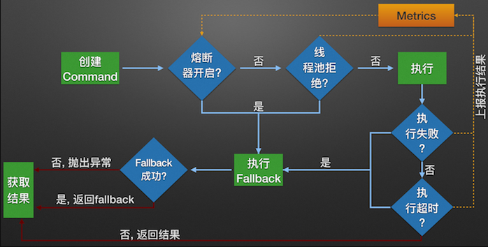


**流程说明**

1.  每次调用创建一个新的HystrixCommand,把依赖调用封装在run()方法中.
2.  执行execute()/queue做同步或异步调用.
3.  当前调用是否已被缓存，是则直接返回结果，否则进入步骤 4
4.  判断熔断器(circuit-breaker)是否打开,如果打开跳到步骤 8,进行降级策略,如果关闭进入步骤 5
5.  判断线程池/队列/信号量是否跑满，如果跑满进入降级步骤8,否则继续后续步骤 6
6.  调用HystrixCommand的run方法.运行依赖逻辑

-   6.1. 调用是否出现异常，否：继续，是进入步骤8，
-   6.2. 调用是否超时，否：返回调用结果，是进入步骤8

   7.搜集5、6步骤所有的运行状态(成功, 失败, 拒绝,超时)上报给熔断器，用于统计从而判断熔断器状态

   8.getFallback()降级逻辑.四种触发getFallback调用情况（图中步骤8的箭头来源）：返回执行成功结果


### 2、两种资源隔离模式


#### 线程池隔离模式

使用一个线程池来存储当前的请求，线程池对请求作处理，设置任务返回处理超时时间，堆积的请求堆积入线程池队列。这种方式需要为每个依赖的服务申请线程池，有一定的资源消耗，好处是可以应对突发流量（流量洪峰来临时，处理不完可将数据存储到线程池队里慢慢处理）。


#### 信号量隔离模式

使用一个原子计数器（或信号量）来记录当前有多少个线程在运行，请求来先判断计数器的数值，若超过设置的最大线程个数则丢弃改类型的新请求，若不超过则执行计数操作请求来计数器+1，请求返回计数器-1。这种方式是严格的控制线程且立即返回模式，无法应对突发流量（流量洪峰来临时，处理的线程超过数量，其他的请求会直接返回，不继续去请求依赖的服务）


## 20、Hystrix 图形化 Dashboard 搭建


### 1、Hystrix 图形化界面简介

除了隔离依赖服务的调用以外，Hystrix 还提供了 **准实时的调用监控（Hystrix Dashboard）**，Hystrix 会持续地记录所有通过 Hystrix 发起的请求的执行信息，并以统计报表和图形的形式展现给用户，包括每秒执行多少请求多少成功，多少失败等，Netflix 通过 hystrix-metrics-event-stream 项目实现了对以上指标的监控。Spring Cloud 也提供了 Hystrix Dashboard 的整合，对监控内容转化成可视化界面


### 2、搭建 Hystrix 的Module


1、新建 Module，名为：

>   cloud-consumer-hystrix-dashboard9001


2、导入 maven 依赖

```xml
<dependencies>
    <!-- hystrix dashboard 仪表盘监控 -->
    <dependency>
        <groupId>org.springframework.cloud</groupId>
        <artifactId>spring-cloud-starter-netflix-hystrix-dashboard</artifactId>
    </dependency>

    <!-- 引入自己定义的 api 通用包项目，可以使用 Payment 支付的 Entity -->
    <dependency>
        <groupId>org.lee.springcloud</groupId>
        <artifactId>cloud-api-commons</artifactId>
        <version>${project.version}</version>
    </dependency>

    <!--spring boot 2.2.2 web 启动器-->
    <dependency>
        <groupId>org.springframework.boot</groupId>
        <artifactId>spring-boot-starter-web</artifactId>
    </dependency>

    <!--图形化监控展现-几乎和starter-web绑定在一块使用 -->
    <dependency>
        <groupId>org.springframework.boot</groupId>
        <artifactId>spring-boot-starter-actuator</artifactId>
    </dependency>

    <!-- 热部署工具 -->
    <!--<dependency>
        <groupId>org.springframework.boot</groupId>
        <artifactId>spring-boot-devtools</artifactId>
        <scope>runtime</scope>
        <optional>true</optional>
    </dependency>-->

    <!-- lombok 插件-->
    <dependency>
        <groupId>org.projectlombok</groupId>
        <artifactId>lombok</artifactId>
        <optional>true</optional>
    </dependency>

    <dependency>
        <groupId>org.springframework.boot</groupId>
        <artifactId>spring-boot-starter-test</artifactId>
        <scope>test</scope>
    </dependency>
</dependencies>
```


3、编写yaml

```yaml
server:
  port: 9001
```


4、增加主启动类新增注解

>   @EnableHystrixDashboard

```java
package com.lee.springcloud;

import org.springframework.boot.SpringApplication;
import org.springframework.boot.autoconfigure.SpringBootApplication;
import org.springframework.cloud.netflix.hystrix.dashboard.EnableHystrixDashboard;

@SpringBootApplication
/**
 * 开启 hystrix dashboard 图形化监控
 */
@EnableHystrixDashboard
public class SpringBootHystrixDashboard9001 {
    public static void main(String[] args) {
        SpringApplication.run(SpringBootHystrixDashboard9001.class, args);
    }
}
```


5、所有的 Provider 微服务提供者 (8001/8002/8003) 都需要添加监控依赖配置

>   添加的maven依赖如下

```xml
<!--spring boot 2.2.2 web 启动器-->
<dependency>
    <groupId>org.springframework.boot</groupId>
    <artifactId>spring-boot-starter-web</artifactId>
</dependency>
<!--图形化监控展现-几乎和starter-web绑定在一块使用 -->
<dependency>
    <groupId>org.springframework.boot</groupId>
    <artifactId>spring-boot-starter-actuator</artifactId>
</dependency>
```


注：之前新建的项目大部分都导入了这个依赖


6、启动进行测试

>   访问地址：http://localhost:9001/hystrix
>
>   如果能看到如下界面，代表配置成功


### 3、Hystrix 图形化 Dashboard 监控实战


##### 1、我们将所有需要监控的服务提供者接口添加如下依赖

>   已经添加的无需添加

```xml
<!--spring boot 2.2.2 web 启动器-->
<dependency>
    <groupId>org.springframework.boot</groupId>
    <artifactId>spring-boot-starter-web</artifactId>
</dependency>
<!--图形化监控展现-几乎和starter-web绑定在一块使用 -->
<dependency>
    <groupId>org.springframework.boot</groupId>
    <artifactId>spring-boot-starter-actuator</artifactId>
</dependency>
```


##### 2、我们需要在主启动类上增加一个额外方法

>   ServletRegistrationBean()
>
>   并且要添加 @EnableCircuitBreaker 注解

```java
/**
 * 服务维度：后面会讲
 */
@EnableCircuitBreaker
@EnableEurekaClient
@EnableDiscoveryClient
@SpringBootApplication
public class SpringBootPaymentHystrix8001 {
    public static void main(String[] args) {
        SpringApplication.run(SpringBootPaymentHystrix8001.class, args);
    }

    /**
     * 此配置是为了服务器监控而配置，与服务器容错本身无关，SpringCloud 升级后的坑
     * ServletRegistrationBean 因为 SpringBoot 的默认路径不是 "/hystrix.stream"
     * 只要在自己的项目配置下面的 servlet就可以了
     * @return
     */
    @Bean
    public ServletRegistrationBean getServlet(){
        HystrixMetricsStreamServlet streamServlet = new HystrixMetricsStreamServlet();
        ServletRegistrationBean registrationBean = new ServletRegistrationBean(streamServlet);
        registrationBean.setLoadOnStartup(1);
        registrationBean.addUrlMappings("/hystrix.stream");
        registrationBean.setName("HystrixMetricsStreamServlet");
        return registrationBean;
    }
}
```


##### 3、我们启动 9001 监控端、7001和7002 Eureka 注册中心、和 8001 服务提供端


##### 4、我们向 9001 监控端添加以下信息

>   9001监控端：访问地址：http://localhost:9001/hystrix
>
>   http://localhost:8001/hystrix.stream
>
>   Delay：2000
>
>   Title：T3


##### 5、我们就可以看到监控界面了


实现园：共有两种含义，它通过颜色变化代表了实例的健康程度，绿色 < 黄色 < 橙色 < 红色 递减,

该实心圆除了颜色变化之外，它的大小也会根据实例请求流量发生变化，流量越大园越大。所以，通过该监控界面就可以在大量实例中快速发现**故障实例和高压力实例**


整图说明：


## 21、GateWay 简介


### 1、什么是 GateWay？

Spring Cloud Gateway 是在 Spring 生态系统之上构建的 API 网关服务，基于 Spring 5、SpringBoot2.x 和 Project Reactor 等技术，GateWay 旨在提供一种简单而有效的方式来对 API 进行路由，以及提供一些强大的过滤器功能，如：熔断、限流、重试等


>   Spring Cloud 全家桶中有个重要的组件就是网关，在 1.x 版本中都是采用了 Zuul 网关；但是在 2.x 版本中，zuul 的升级一直跳票，Spring Cloud 最后自己研发了一个网关代替 Zuul，Gateway 是 zuul 1.x 版的替代品


Spring Cloud Gateway 是基于 WebFlux 框架实现的，而 WebFlux框架底层则使用了高性能的 Reactor 模式的 Netty，Gateway的目标是提供统一的路由方式且基于 Filter 链的方式提供了网关基本的功能：安全、监控/指标，限流


### 2、为什么选择 GateWay ?


Zuul1.0 已经进入维护阶段、而且 Gateway 是 SpringCloud 团队研发的，而且很多功能 Zuul 都没有用起来也非常的简单便捷


Gateway 是基于 **异步非阻塞模型上** 进行开发的，性能方面不需要担心，虽然 Netflix 早就发布了最新的 Zuul 2.x，但是Spring Cloud 貌似没有整合计划，而且 Netflix 相关的组件都宣布进入维护期，前景未知


多方面综合考虑 Gateway 是理想的网关选择


### 3、GateWay 的特性

1.  **基于 Spring Framework 5，Project Reactor 和 Spring Boot 2.0 进行构建**
2.  **动态路由**，能够匹配任何请求属性
3.  可以对路由指定 Predicate（断言）和 Filter（过滤器）
4.  集成 Hystrix 的断路器功能
5.  集成 Spring Cloud 服务发现功能
6.  易于编写的 Predicate（断言）和 Filter（过滤器）
7.  请求限流功能
8.  支持路径重写


### 4、Gate Way 和 Zuul 的区别


在 Spring Cloud Finchley 正式版之前，Spring Cloud 推荐的网关是 Netflix 提供的 Zuul；


>   Zuul 1.x 是一个基于阻塞 I/O 的 API Gateway


>   Zuul 1.x **基于 Servlet 2.5 使用阻塞架构** 它不支持任何长连接（如 Web Socket ）的设计模式和 Nginx 较像。每次 I/O 操作都是从工作线程中选择一个执行，请求线程被阻塞到工作线程完成，但是差别是 Nginx 用 C++ 实现，Zuul 用 Java 实现，而 JVM本身会有第一次加载较慢的情况，使得 Zuul 的性能相对较差


>   Zuul 2.x 理念更先进，想基于 Netty 非阻塞和支持长连接，但是Spring Cloud 目前还没有整合，Zuul 2.x 的性能较 Zuul 1.x 有较大提升，在性能方面，根据官方提供的测试基准，Gate Way 的 RPS（每秒请求数）是 Zuul 的 1.6 倍


>   Gate way 建立在 Spring Framework 5，Project Reactor 和 Spring Boot 2 之上，使用非阻塞API


>   Gate way 还支持 Web Socket、并且与 Spring 紧密集成拥有更好的开发体验


### 5、Zuul 1.x 的模型


Spring Cloud 中所集成的 Zuul 1.x 版本，采用的是 tomcat 容器，使用的是传统的 Servlet IO处理器，而 servlet 的生命周期由 servlet container 进行管理

container 启动时构建 servlet 对象并调用 servlet.init() 方法进行初始化

container 运行时接收请求，并为每个请求分配一个线程（一般从线程池中获取空闲线程），然后调用 service()

container 关闭时调用 servlet destory() 销毁 servlet


**上述模式的缺点：**

servlet 是一个简单的网络 IO 模型，当请求进入 servlet container 时， servlet container 就会为其绑定一个线程，**在并发量不高的场景下**这种模型是适用的，但是一旦高并发 ( 比如抽风用 jemeter压测 )，线程数量就会上涨，而线程资源代价是昂贵的（上下文切换，内存消耗大）严重影响请求的处理时间，在一些简单的业务场景下，不希望为每个 request 分配一个线程，只需要1 个或者几个线程就能应对极大的并发请求，这种业务场景下 servlet 模型没有优势


所以 zuul 1.x 是 基于servlet 之上的一个阻塞处理模型，即 spring 实现了处理所有请求的一个 servlet（DispatcherServlet）并由该 servlet 阻塞式处理，所以 zuul 无法摆脱 servlet 模型的弊端


### 6、什么是 web flux

传统的Web框架，比如说: Struts 2，Spring mvc 等都是基于Servlet API与 Servlet 容器基础之上运行的。

但是在 Servlet 3.1 之后有了异步非阻塞的支持。而 Web Flux 是一个典型非阻塞异步的框架，它的核心是基于 Reactor 的相关 API 实现的。相对于传统的 web 框架来说，它可以运行在诸如Netty, Undertow 及支持 Servlet3.1 的容器上。非阻塞式 + 函数式编程（Spring 5 必须让你使用 Java 8)

Spring Web Flux 是 Spring 5.0 引入的新的响应式框架，区别于Spring MVC，它不需要依赖Servlet API，它是完全异步非阻塞的，并且基于Reactor来实现响应式流规范。


### 7、GateWay的工作流程


要牢记 Gateway 的三大核心概念


**1、Route（路由）**

>   路由是构建网关的基本模块，它由 ID、目标 URI、一些列的断言和过滤器组成，如果断言为 true 则匹配该路由

就是根据某些规则,将请求发送到指定服务上


**2、Predicate（断言）**

>   参考 Java 8 的 java.util.function.Predicate
>
>   开发人员可以匹配 HTTP 请求中所有的内容 ( 例如请求头或请求参数 )，如果请求与断言相匹配则进行路由


**3、Filter（过滤）**

>   指的是 Spring 框架中 GatewayFilter 的实例，使用过滤器，可以在请求被路由前后对请求修改


**总结：**

web请求，通过一些匹配条件，定位到真正的服务节点。并在这个转发过程的前后，进行一些精细化控制。predicate 就是我们的匹配条件;

而filter，就可以理解为一个无所不能的拦截器。有了这两个元素，再加上目标uri，就可以实现一个具体的路由了


客户端向Spring Cloud Gateway 发出请求。然后在Gateway Handler Mapping 中找到与请求相匹配的路由，将其发送到GatewayWeb Handler

Handler再通过指定的过滤器链来将请求发送到我们实际的服务执行业务逻辑，然后返回。

过滤器之间用虚线分开是因为过滤器可能会在发送代理请求之前(“pre”）或之后（“post”)执行业务逻辑。

Filter在“pre”类型的过滤器可以做参数校验、权限校验、流量监控、日志输出、协议转换等，

在“post”类型的过滤器中可以做响应内容、响应头的修改，日志的输出，流量监控等有着非常重要的作用。


## 22、GateWay 实战配置


### 1、GateWay 9527 的搭建


##### 1、我们创建一个新的工程

>   名为：cloud-gateway-gateway9527


##### 2、导入 maven 依赖

>   添加 spring-cloud-starter-gateway 依赖
>
>   gateway 作为网关同样要注册进 Eureka
>
>   **注意：gateway 不需要引入 starter-web 和 starter-actuator 这两个Web依赖包**

```xml
<dependencies>
    <!-- 引入 gateway 网关 -->
    <dependency>
        <groupId>org.springframework.cloud</groupId>
        <artifactId>spring-cloud-starter-gateway</artifactId>
    </dependency>

    <!-- eureka client-->
    <dependency>
        <groupId>org.springframework.cloud</groupId>
        <artifactId>spring-cloud-starter-netflix-eureka-client</artifactId>
    </dependency>

    <!-- 引入自己定义的 api 通用包项目，可以使用 Payment 支付的 Entity -->
    <dependency>
        <groupId>org.lee.springcloud</groupId>
        <artifactId>cloud-api-commons</artifactId>
        <version>${project.version}</version>
    </dependency>

    <!-- lombok 插件-->
    <dependency>
        <groupId>org.projectlombok</groupId>
        <artifactId>lombok</artifactId>
        <optional>true</optional>
    </dependency>

    <dependency>
        <groupId>org.springframework.boot</groupId>
        <artifactId>spring-boot-starter-test</artifactId>
        <scope>test</scope>
    </dependency>
</dependencies>
```


##### 3、编写主启动类

>   @EnableEurekaClient
>
>   @SpringBootApplication

```java
package com.lee.springcloud;

import org.springframework.boot.SpringApplication;
import org.springframework.boot.autoconfigure.SpringBootApplication;
import org.springframework.cloud.netflix.eureka.EnableEurekaClient;

@EnableEurekaClient
@SpringBootApplication
public class SpringBootGateway9527 {
    public static void main(String[] args) {
        SpringApplication.run(SpringBootGateway9527.class, args);
    }
}
```


##### 4、9527网关配置路由映射

>   我们在 cloud-provider-payment8001 看看 controller 的访问地址：http://localhost:8001/
>
>   我们目前不想暴露 8001 端口，希望在 8001 外面套一层 9527


那么我们需要在 gateway9527 的 yml 配置如下：

```yaml
server:
  port: 9527

spring:
  application:
    name: cloud-gateway
    
  # 配置 gateway 相关
  cloud:
    gateway:
      routes:
        - id: payment_routh               # 路由的ID、没有固定规则但要求唯一，建议配合服务名
          uri: http://localhost:8001      # 匹配后提供服务的路由地址
          predicates:
            - Path=/payment/get/**        # 断言，路径相匹配的进行路由

        - id: payment_routh2              # 路由的ID、没有固定规则但要求唯一，建议配合服务名
          uri: http://localhost:8001      # 匹配后提供服务的路由地址
          predicates:
            - Path=/payment/discovery/**  # 断言，路径相匹配的进行路由

eureka:
  instance:
    hostname: cloud-gateway-service
  client:
    # 表示是否将自己注册到 EurekaServer服务、默认 true
    register-with-eureka: true
    # 是否从EurekaServer 抓取已有的注册信息、默认 true
    # 单节点无所谓，集群必须设置成 true 才能配合 ribbon 使用负载均衡
    fetch-registry: true
    service-url:
      # 单机版 defaultZone: http://localhsot:7001/eureka
      # 集群版
      defaultZone: http://eureka7001.com:7001/eureka,http://eureka7002.com:7002/eureka
```


具体映射路径：


##### 5、启动 Eureka、网关和服务提供者进行测试


我们发现服务网关也注册进了 Eureka 


查询一个流水号地址

以前的访问地址：http://localhost:8001/payment/get/10

配置网关后地址：http://localhost:9527/payment/get/10


### 2、Gateway配置路由的两种方式


**Gateway 的配置有两种方法：**

-   1、在配置文件 yml 中（见上面配置）
-   2、代码中注入 RouteLocator 的 Bean


#### 代码中注入 RouteLocator实现网关配置


1、我们在 9527 工程中新建 config 包

>   添加一个类 GatewayConfig.java


```java
package com.lee.springcloud.config;

import org.springframework.cloud.gateway.route.RouteLocator;
import org.springframework.cloud.gateway.route.builder.RouteLocatorBuilder;
import org.springframework.context.annotation.Bean;
import org.springframework.context.annotation.Configuration;

/**
 * 代码配置 GatewayConfig
 */
@Configuration
public class GatewayConfig {

    @Bean
    public RouteLocator customRouteLocator(RouteLocatorBuilder routeLocatorBuilder){
        RouteLocatorBuilder.Builder routes = routeLocatorBuilder.routes();

        /**
         * path("/guonei")：访问 http://localhost:9527/guonei 将会被转发到
         * uri里设置的地址
         */
        routes.route("path_route_baidu",
                r -> r.path("/guonei").uri("http://news.baidu.com/guonei")).build();

        //配置第二个
        routes.route("path_route_baidu2",
                r -> r.path("/guoji").uri("http://news.baidu.com/guoji")).build();

        return routes.build();
    }
}
```


2、两者对比


3、重启 9527 进行测试


### 3、Gateway配置动态路由


#### 1、写死的端口面临什么问题？

现在服务面临个问题，我们的配置文件里，网关的端口号是写死的，如下


>   这就暴露了一个问题，原来我们的多个服务提供者注册 Eureka，是由 Ribbon 实现负载均衡的，现在我们加了 Gateway 网关，隐藏了我们的8001端口，而我们的配置文件却写死了端口，假如有多个服务提供者 8002、8003，总不能不访问这些服务把。所以现在由 Gateway 来实现负载均衡，如下图


默认情况下：Gateway 会根据注册中心注册的服务列表，以注册中心上的微服务名为路径创建**动态路由进行转发、从而实现动态路由的功能**


#### 2、下面我们将进行配置

>   下列红色配置是相对之前的Gateway新增的动态配置项


1、我们修改 9527 的 yml 配置文件

```yaml
server:
  port: 9527

spring:
  application:
    name: cloud-gateway
  # 配置 gateway 相关
  cloud:
    gateway:
      discovery:
        locator:
          enabled: true                    # 开启从注册中心动态创建路由的功能
      routes:
        - id: payment_routh                # 路由的ID、没有固定规则但要求唯一，建议配合服务名
          #uri: http://localhost:8001      # 匹配后提供服务的路由地址
          uri: lb://cloud-payment-service  # (lb: load balance：负载均衡)
          predicates:
            - Path=/payment/get/**         # 断言，路径相匹配的进行路由

        - id: payment_routh2               # 路由的ID、没有固定规则但要求唯一，建议配合服务名
          #uri: http://localhost:8001      # 匹配后提供服务的路由地址
          uri: lb://cloud-payment-service
          predicates:
            - Path=/payment/discovery/**   # 断言，路径相匹配的进行路由

eureka:
  instance:
    hostname: cloud-gateway-service
  client:
    # 表示是否将自己注册到 EurekaServer服务、默认 true
    register-with-eureka: true
    # 是否从EurekaServer 抓取已有的注册信息、默认 true
    # 单节点无所谓，集群必须设置成 true 才能配合 ribbon 使用负载均衡
    fetch-registry: true
    service-url:
      # 单机版 defaultZone: http://localhsot:7001/eureka
      # 集群版
      defaultZone: http://eureka7001.com:7001/eureka,http://eureka7002.com:7002/eureka
```


2、我们启动 7001\7002\8001\8002\9527 服务进行测试

>   第一次测试访问端口 8001：


>   第二次测试访问端口 8002：


### 4、Gateway 常用的 Predicate


#### 1、Global Filters

Spring Cloud Gateway 将路由匹配作为 Spring WebFlux HandlerMapping 基础架构的

Spring Cloud Gateway 包括许多内置的 Route Predicate 工厂。所有这些 Predicate 都与 HTTP 请求的不同属性匹配。多个 Route Predicate 工厂可以进行组合

Spring Cloud Gateway 创建 Route 对象时，使用 RoutePredicateFactory 创建 Predicate 对象，Predicate 对象可以赋值给 Route。Spring Cloud Gateway 包含许多内置的 Route Predicate Factories

所有这些谓词都匹配HTTP请求的不同属性。多种谓词工厂可以组合，并通过逻辑and。


#### 2、常用的 Route Predicate

以下都是 网关 8527 的 yml 规则配置


##### 1、After Route Predicate

>   表示在这个时间之后这个才能正常访问


首先我们先要获取当前的地区的时区、如下代码

```java
@Test
void getDateTime(){
    //获取当前的默认时区
    //2021-05-20T21:26:25.503+08:00[Asia/Shanghai]
    ZonedDateTime zonedDateTime = ZonedDateTime.now();
    System.out.println(zonedDateTime);
}
```

然后配置yml

```yaml
spring:
  # 配置 gateway 相关
  cloud:
    gateway:
      routes:
        - id: payment_routh                # 路由的ID、没有固定规则但要求唯一，建议配合服务名
          #uri: http://localhost:8001      # 匹配后提供服务的路由地址
          uri: lb://cloud-payment-service  # (lb: load balance：负载均衡)
          predicates:
            - Path=/payment/get/**         # 断言，路径相匹配的进行路由
            # 表示在这个时间之后这个才能正常访问
            - After=2021-05-20T21:26:25.503+08:00[Asia/Shanghai]
```


##### 2、Before Route Predicate

>   表示在这个时间之前这个才能正常访问


##### 3、Between Route Predicate

>   表示在时间范围内这个才能正常访问

```yaml
  predicates:
    - Path=/payment/get/**         # 断言，路径相匹配的进行路由
    # 表示在这个时间之后这个才能正常访问
    - Between=2021-05-20T21:26:25.503+08:00[Asia/Shanghai],2021-06-20T21:26:25.503+08:00[Asia/Shanghai]
```


##### 4、Cookie Route Predicate

```yaml
  predicates:
    - Path=/payment/get/**         # 断言，路径相匹配的进行路由
    - Cookie=chocolate, ch.p
```

Cookie Route Predicate 需要两个参数，一个是 Cookie Name，一个是正则表达式，路由规则会通过获取对应的 Cookie name 值和正则表达式去匹配，如果匹配成功就会执行路由，如果没有匹配上则不执行


假如我们配置的是 

```yaml
  predicates:
    - Path=/payment/get/**         # 断言，路径相匹配的进行路由
    - After=2021-05-20T21:26:25.503+08:00[Asia/Shanghai]
    - Cookie=username,zzyy
    # 在 After 的时间之后并且访问带上 cookie，带上键值对 username=zzyy 才能正常访问
```


未带 Cookie 访问如下：


带 Cookie 访问如下：


##### 5、Header Route Predicate

```yaml
  predicates:
    - Path=/payment/get/**         # 断言，路径相匹配的进行路由
    # 请求头要有 X-Request-Id属性并且属性为整数的正则表达式
    - Header=X-Request-Id, \d+
```


测试如下：


##### 6、Host Route Predicate

```yml
  predicates:
    - Path=/payment/get/**         # 断言，路径相匹配的进行路由
    - Host=**.atguigu.com
```


测试如下：


##### 7、Method Route Predicate

```yaml
  predicates:
    - Path=/payment/get/**         # 断言，路径相匹配的进行路由
    # 限定请求方式
    - Method=GET
```


##### 8、Path Route Predicate

>   这个我们初次用的就是这个 Path，这里不再阐述

```yaml
  predicates:
    - Path=/payment/get/**         # 断言，路径相匹配的进行路由
```


##### 9、Query Route Predicate

```yaml
  predicates:
    - Query=username, \d+         # 要有参数名 username 并且还是整数才能路由
```


##### 10、总结：

说白了，Predicate 就是为了实现一组匹配规则，让请求过来招对应的 Route 进行处理


### 5、Gateway 的 Filter


简介：路由器过滤器可用于修改进入的 HTTP 请求和返回的 HTTP响应，路由过滤器只能指定路由进行使用， Spring Cloud Gateway 内置了多种路由过滤器，他们都由 GatewayFilter 的工厂类来产生


主要作用

-   全局日志记录
-   统一网关鉴权


官网配置 FIlter：https://docs.spring.io/spring-cloud-gateway/docs/current/reference/html/#the-addresponseheader-gatewayfilter-factory


>   这里不在详细描述，可以去看官网案例

#### 1、Gateway Filter Factories(单一)

1.  [6.1. The AddRequestHeader GatewayFilter Factory](https://docs.spring.io/spring-cloud-gateway/docs/current/reference/html/#the-addrequestheader-gatewayfilter-factory)
2.  [6.2. The AddRequestParameter GatewayFilter Factory](https://docs.spring.io/spring-cloud-gateway/docs/current/reference/html/#the-addrequestparameter-gatewayfilter-factory)
3.  [6.3. The AddResponseHeader GatewayFilter Factory](https://docs.spring.io/spring-cloud-gateway/docs/current/reference/html/#the-addresponseheader-gatewayfilter-factory)
4.  [6.4. The DedupeResponseHeader GatewayFilter Factory](https://docs.spring.io/spring-cloud-gateway/docs/current/reference/html/#the-deduperesponseheader-gatewayfilter-factory)


#### 2、(全局)Global Filters

##### 1、Combined Global Filter and GatewayFilter Ordering

##### 2、Forward Routing Filter

##### 3、The LoadBalancerClient Filter

##### 4、The ReactiveLoadBalancerClientFilter

##### 5、The Netty Routing Filter

##### 6、The Netty Write Response Filter

##### 7、The RouteToRequestUrlFilter

##### 8、The websocket Routing Filter

##### 9、The Gateway Metrics Filter

##### 10、Marking An Exchange As Routed


#### 3、全局自定义过滤器


1、我们改造 9527，增加一个 config 包，新增如下过滤类

```java
package com.lee.springcloud.filter;

import lombok.extern.slf4j.Slf4j;
import org.springframework.cloud.gateway.filter.GatewayFilterChain;
import org.springframework.cloud.gateway.filter.GlobalFilter;
import org.springframework.core.Ordered;
import org.springframework.http.HttpStatus;
import org.springframework.stereotype.Component;
import org.springframework.web.server.ServerWebExchange;
import reactor.core.publisher.Mono;

import java.util.Date;

/**
 * Gate way 自定义全局过滤器
 */
@Slf4j
@Component
public class MyLogGateWayFilter implements GlobalFilter, Ordered {

    @Override
    public Mono<Void> filter(ServerWebExchange exchange, GatewayFilterChain chain) {
        log.info("******************* come in MyLogGateWayFilter：" + new Date());
        String uName = exchange.getRequest().getQueryParams().getFirst("uname");

        if(uName == null){
            log.info("********用户名为 null, 非法用户、/(ㄒoㄒ)/~~");
            exchange.getResponse().setStatusCode(HttpStatus.NOT_ACCEPTABLE);
            return exchange.getResponse().setComplete();
        }
        return chain.filter(exchange);
    }

    @Override
    public int getOrder() {
        return 0;
    }
}
```


2、启动测试

>   我们正常访问失败


带上 uname 访问成功


## 23、Config 分布式配置中心介绍


### 1、微服务配置的痛点


微服务意味着要将单体应用中的业务拆分成一个个子服务，每个服务的粒度相对较小，因此系统中会出现大量的服务。由于每个服务都需要必要的配置信息才能运行，所以一套集中式的、动态的配置管理设施是必不可少的，做到一处配置，处处生效


### 2、Spring Cloud Config 是什么


Spring Cloud 提供了 Config Server 来解决这个问题，我们每一个微服务自己带着一个 application.yml，上百个配置文件的管理.

为微服务架构中的微服务提供集中化的外部配置支持，配置服务器为各个不同微服务应用的所有环境提供了一个中心化的外部配置。


### 3、Config 能做什么

1.  集中管理配置文件
2.  不同环境不同配置，动态化的配置更新，分环境部署比dev/test/prod/beta/release
3.  运行期间动态调整配置，不再需要在每个服务部署的机器上编写配置文件，服务会向配置中心统一拉取配置自己的信息
4.  当配置发生变动时，服务不需要重启即可感知到配置的变化并应用新的配置
5.  将配置信息以REST接口的形式暴露


### 4、如何使用？

Spring Cloud Config 分为服务端和客户端两部分。


服务端也称为分布式配置中心，它是一个独立的微服务应用，用来连接配置服务器并为客户端提供获取配置信息，加密/解密信息等访问接口


客户端则是通过指定的配置中心来管理应用资源，以及与业务相关的配置内容，并在启动的时候从配置中心获取和加载配置信息配置服务器默认采用 git 来存储配置信息，这样就有助于对环境配置进行版本管理，并且可以通过git客户端工具来方便的管理和访问配置内容


## 24、Config 实战配置


### 1、Config 配置总控制中心搭建


#### 1、搭建 GitHub 远程配置中心


##### 1、我们先在GitHub上新建一个 Repository

>   仓库名：springcloud-config


##### 2、获取刚刚新建的 Git 地址

>   复制 SSH 的链接


##### 3、本地硬盘目录上新建 Git 仓库并 Clone

>   git clone git@github.com:LeeRf/springcloud-config.git


##### 4、此时在本地盘符下 

D:\GitSource\springcloud-config

>   表示多个环境的配置文件
>
>   保存格式必须为 UTF-8
>
>   如果需要修改，此处模拟运维人员 git add、git commit、git push 操作


#### 2、新建一个 Maven 项目：


1、新建的项目名如下：

>   cloud-config-center-3344


2、导入 maven 依赖

```xml
<dependencies>
    <!--spring cloud 配置中心-->
    <dependency>
        <groupId>org.springframework.cloud</groupId>
        <artifactId>spring-cloud-config-server</artifactId>
    </dependency>

    <!-- eureka client-->
    <dependency>
        <groupId>org.springframework.cloud</groupId>
        <artifactId>spring-cloud-starter-netflix-eureka-client</artifactId>
    </dependency>

    <!-- 引入自己定义的 api 通用包项目，可以使用 Payment 支付的 Entity -->
    <dependency>
        <groupId>org.lee.springcloud</groupId>
        <artifactId>cloud-api-commons</artifactId>
        <version>${project.version}</version>
    </dependency>

    <!--spring boot 2.2.2 web 启动器-->
    <dependency>
        <groupId>org.springframework.boot</groupId>
        <artifactId>spring-boot-starter-web</artifactId>
    </dependency>

    <!--图形化监控展现-几乎和starter-web绑定在一块使用 -->
    <dependency>
        <groupId>org.springframework.boot</groupId>
        <artifactId>spring-boot-starter-actuator</artifactId>
    </dependency>

    <!-- 热部署工具 -->
    <!--<dependency>
        <groupId>org.springframework.boot</groupId>
        <artifactId>spring-boot-devtools</artifactId>
        <scope>runtime</scope>
        <optional>true</optional>
    </dependency>-->

    <!-- lombok 插件-->
    <dependency>
        <groupId>org.projectlombok</groupId>
        <artifactId>lombok</artifactId>
        <optional>true</optional>
    </dependency>

    <dependency>
        <groupId>org.springframework.boot</groupId>
        <artifactId>spring-boot-starter-test</artifactId>
        <scope>test</scope>
    </dependency>
</dependencies>
```


3、配置 yml

```yaml
server:
  port: 3344

spring:
  application:
    name: cloud-config-center
  cloud:
    config:
      server:
        git:
          # 配置 git 账户和密码
          username: javaleerf@163.com
          password: .git2019.
          # git https 地址
          uri: https://github.com/LeeRf/springcloud-config.git
          # 搜索目录 仓库名
          search-paths:
            - springcloud-config
      # 设置读取分支（新版 git master 分支变成了 main）
      label: main

# 服务注册进 Eureka
eureka:
  client:
    service-url:
      defaultZone: http://eureka7001.com:7001/eureka,http://eureka7002.com:7002/eureka
```


4、编写主启动类

>   新增注解：@EnableConfigServer

```java
package com.lee.springcloud;

import org.springframework.boot.SpringApplication;
import org.springframework.boot.autoconfigure.SpringBootApplication;
import org.springframework.cloud.config.server.EnableConfigServer;

/**
 * @EnableConfigServer
 *  开启 Spring Config 配置中心
 */
@EnableConfigServer
@SpringBootApplication
public class SpringBootConfigCenter3344 {
    public static void main(String[] args) {
        SpringApplication.run(SpringBootConfigCenter3344.class, args);
    }
}
```


5、windows 下修改 hosts 文件，增加映射

```yaml
C:\Windows\System32\drivers\etc  # 路径
```

>   127.0.0.1      config-3344.com


6、启动测试微服务 3344

>   http://config-3344.com:3344/main/config-dev.yml


我们访问看看文件内容是否和 GitHub 上的一致


#### 3、配置读取规则

>   如下列出常用的三种


##### 1、/{label}/{application}-{profile}.yml


>   **读取main分支 （master 旧名）：**

http://config-3344.com:3344/main/config-dev.yml

http://config-3344.com:3344/main/config-prod.yml

http://config-3344.com:3344/main/config-test.yml


读取到的信息如下


>   **读取 dev 分支**


http://config-3344.com:3344/main/config-dev.yml

http://config-3344.com:3344/main/config-prod.yml

http://config-3344.com:3344/main/config-test.yml


##### 2、/{application}-{profile}.yml

http://config-3344.com:3344/config-dev.yml

http://config-3344.com:3344/config-prod.yml

http://config-3344.com:3344/config-test.yml


读取到的信息如下：


##### 3、/{application}/{profile}/[{label}]

http://config-3344.com:3344/config/dev/main

http://config-3344.com:3344/config/test/main

http://config-3344.com:3344/config/pord/main


读取到的是 json 串


##### 4、总结

label：表示分支（branch）

name：服务名

profiles：环境（dev/test/prod）


配置文件的命名要严格按照官网的来

>   例如： config-dev.yml 三段分法


### 2、Config 客户端配置与测试


#### 1、搭建客户端环境


1、新建工程 名为 cloud-config-client3355

2、导入 maven 依赖

```xml
<dependencies>
    <!--spring config 客户端配置-->
    <dependency>
        <groupId>org.springframework.cloud</groupId>
        <artifactId>spring-cloud-config-client</artifactId>
    </dependency>

    <!-- eureka client-->
    <dependency>
        <groupId>org.springframework.cloud</groupId>
        <artifactId>spring-cloud-starter-netflix-eureka-client</artifactId>
    </dependency>

    <!-- 引入自己定义的 api 通用包项目，可以使用 Payment 支付的 Entity -->
    <dependency>
        <groupId>org.lee.springcloud</groupId>
        <artifactId>cloud-api-commons</artifactId>
        <version>${project.version}</version>
    </dependency>

    <!--  web 和 actuator 是标配、必须要写  -->
    <dependency>
        <groupId>org.springframework.boot</groupId>
        <artifactId>spring-boot-starter-web</artifactId>
    </dependency>

    <dependency>
        <groupId>org.springframework.boot</groupId>
        <artifactId>spring-boot-starter-actuator</artifactId>
    </dependency>

    <!--<dependency>
        <groupId>org.springframework.boot</groupId>
        <artifactId>spring-boot-devtools</artifactId>
        <scope>runtime</scope>
        <optional>true</optional>
    </dependency>-->

    <dependency>
        <groupId>org.projectlombok</groupId>
        <artifactId>lombok</artifactId>
        <optional>true</optional>
    </dependency>

    <dependency>
        <groupId>org.springframework.boot</groupId>
        <artifactId>spring-boot-starter-test</artifactId>
    </dependency>
</dependencies>
```


3、新的配置文件 bootstrap.yml

**两者有何区别**

>   applicaiton.yml 是用户级的资源配置项
>
>   bootstrap.yml 是系统级的，优先级更加高

Spring Cloud会创建一个“Bootstrap Context”，作为 Spring 应用的 Application Context 的父上下文。初始化的时候，Bootstrap Context 负责从外部源加载配置属性并解析配置。这两个上下文共享一个从外部获取的 Environment


Bootstrap 属性有高优先级，默认情况下，它们不会被本地配置覆盖。Bootstrap context 和 Application Context 有着不同的约定，所以新增了一个bootstrap.yml 文件，保证`Bootstrap Context`和 Application Context 配置的分离。

要将 Client 模块下的 application.yml 文件改为 bootstrap.yml 这是很关键的，

因为 bootstrap.yml 是比 application.yml 先加载的。bootstrap.yml 优先级高于application.yml


```yaml
server:
  port: 3355

spring:
  application:
    name: config-client

  cloud:
    # Config 客户端配置
    config:
      # 分支名
      label: main
      # 配置文件前缀名
      name: config
      # 读取后缀名 main 分支上的 config-dev.yml 配置文件读取：http://config-3344.com:3344/main/config-dev.yml
      profile: dev
      # 3344服务端 配置中心地址
      uri: http://localhost:3344

# 服务注册进 Eureka
eureka:
  client:
    service-url:
      defaultZone: http://eureka7001.com:7001/eureka,http://eureka7002.com:7002/eureka
```

说明：


4、编写主启动类

```java
package com.lee.springcloud;

import org.springframework.boot.SpringApplication;
import org.springframework.boot.autoconfigure.SpringBootApplication;
import org.springframework.cloud.netflix.eureka.EnableEurekaClient;

@EnableEurekaClient
@SpringBootApplication
public class SpringBootConfigClient3355 {
    public static void main(String[] args) {
        SpringApplication.run(SpringBootConfigClient3355.class, args);
    }
}
```


5、编写我们的 controller

```java
package com.lee.springcloud.controller;

import org.springframework.beans.factory.annotation.Value;
import org.springframework.web.bind.annotation.GetMapping;
import org.springframework.web.bind.annotation.RestController;

@RestController
public class ConfigClientController {

    @Value("${config.info}")
    private String configInfo;

    @GetMapping("/configInfo")
    public String getConfigInfo(){
        return configInfo;
    }
}
```


6、启动进行测试

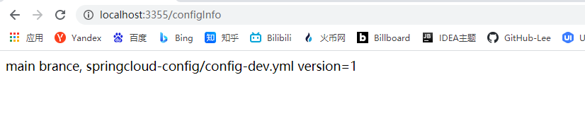

**我们来思考一个问题：**

假如我们修改了 GitHub 的 config-dev.yml 将版本改为 2

并提交 commit


我们刷新配置中心服务端 3344

http://config-3344.com:3344/main/config-dev.yml

发现可以 config-dev.yml 的版本确实改变了


但是我们刷新 3355 客户端，发现怎么刷新都不会改变，除非自己重启或者重新加载，

那么难道每次修改远程配置客户端都要重启吗？

>   这个问题留在下个小节动态刷新来解决


### 3、Config 客户端动态刷新(手动)


>   我们要避免每次远程配置文件修改了，避免每次重启客户端微服务3355进行刷新


#### 1、动态刷新配置


1、导入 maven ，动态监控包

```xml
<!-- 这个一般我们都导入了 -->
<dependency>
    <groupId>org.springframework.boot</groupId>
    <artifactId>spring-boot-starter-actuator</artifactId>
</dependency>
```


2、修改 yml、暴漏监控端口

```yaml
# 动态刷新（暴漏监控端点）
management:
  endpoints:
    web:
      exposure:
        include: "*"
```


3、在 ConfigClientController 类上增加注解 @RefreshScope

```java
/**
 * 动态刷新注解
 */
@RefreshScope
@RestController
public class ConfigClientController {

    @Value("${config.info}")
    private String configInfo;

    @GetMapping("/configInfo")
    public String getConfigInfo(){
        return configInfo;
    }
}
```


4、重启 3355 客户端进行测试

-   运维将 Github 的 config-dev.yml 配置文件版本修改为 3
-   然后刷新 3355 进行测试


>   我们发现刷新了很久依旧没有改变，还是 2 ，卧槽


5、此时依然还需要运维人员发送 Post 请求刷新 3355

>   cmd命令：curl -X POST "http://localhost:3355/actuator/refresh"


>   这里有个坑，有时候 Github 反应慢，刷新的时候没有返回值，这种情况是刷新失败的


然后我们刷新 3355 进行查看、发现内容已经改变了


>   小结：
>
>   假如有多个服务客户端 3355/3366/3377
>
>   每个微服务都要执行一次 post 请求，手动刷新？
>
>   可否广播，一次通知？处处生效
>
>   我们想大范围的自动刷新？有什么方法吗？
>
>   可以让运维写个自动化请求脚本，把所有的微服务请求一遍


## 25、Bus 消息总线简介


### 1、Spring Cloud Bus 是什么？


Spring Cloud Bus 配置 Spring Cloud Config 使用可以实现配置的动态刷新


Spring Cloud Bus 使用来将分布式系统的节点与轻量级消息系统链接起来的框架

**它整合了 Java 的事件处理机制和消息中间件的功能**，Spring Cloud Bus 目前支持 RabbitMQ 和 Kafka


### 2、Bus 能做什么？


Spring Cloud Bus 能管理和传播分布式系统间的消息，就像一个分布式执行器，可用于广播状态更改，事件推送等，也可以当作微服务间的通信通道


### 3、什么是总线

在微服务架构的系统中，通常会使用**轻量级的消息代理**来构建一个**共用的消息主题**，并让系统中所有微服务实例都连接上来。由于**该主题中产生的消息会被所有实例监听和消费，所以称它为消息总线**。在总线上的各个实例,都可以方便地广播─些需要让其他连接在该主题上的实例都知道的消息。


### 4、基本原理

Config Client 实例都监听 MQ 中同一个 topic (默认是 Spring Cloud Bus)。当一个服务刷新数据的时候，它会把这个信息放入到 Topic 中，这样其它监听同— Topic 的服务就能得到通知，然后去更新自身的配置


## 26、Bus 之 RabbitMQ 集成


### 1、必须要先准备良好的 RabbitMQ 环境


>   Bus 之 RabbitMQ的环境配置 、Linux版
>
>   如果要安装 Linux 的 RabbitMQ 环境，详细见 RabbitMQ 的笔记手册


### 2、Bus动态刷新全局广播的设计思想和选型


#### 1、我们新建一个工程

>   起名为 cloud-config-client-3366


1、导入 maven 依赖

```xml
<dependencies>
    <!--spring config-->
    <dependency>
        <groupId>org.springframework.cloud</groupId>
        <artifactId>spring-cloud-starter-config</artifactId>
    </dependency>

    <!-- eureka client-->
    <dependency>
        <groupId>org.springframework.cloud</groupId>
        <artifactId>spring-cloud-starter-netflix-eureka-client</artifactId>
    </dependency>

    <!-- 引入自己定义的 api 通用包项目，可以使用 Payment 支付的 Entity -->
    <dependency>
        <groupId>org.lee.springcloud</groupId>
        <artifactId>cloud-api-commons</artifactId>
        <version>${project.version}</version>
    </dependency>

    <!--  web 和 actuator 是标配、必须要写  -->
    <dependency>
        <groupId>org.springframework.boot</groupId>
        <artifactId>spring-boot-starter-web</artifactId>
    </dependency>

    <dependency>
        <groupId>org.springframework.boot</groupId>
        <artifactId>spring-boot-starter-actuator</artifactId>
    </dependency>

    <!--<dependency>
        <groupId>org.springframework.boot</groupId>
        <artifactId>spring-boot-devtools</artifactId>
        <scope>runtime</scope>
        <optional>true</optional>
    </dependency>-->

    <dependency>
        <groupId>org.projectlombok</groupId>
        <artifactId>lombok</artifactId>
        <optional>true</optional>
    </dependency>

    <dependency>
        <groupId>org.springframework.boot</groupId>
        <artifactId>spring-boot-starter-test</artifactId>
    </dependency>
</dependencies>
```


2、编写 yml 配置

```yml
server:
  port: 3366

spring:
  application:
    name: config-client

  cloud:
    # Config 客户端配置
    config:
      # 分支名
      label: main
      # 配置文件前缀名
      name: config
      # 读取后缀名 main 分支上的 config-dev.yml 配置文件读取：http://config-3344.com:3344/main/config-dev.yml
      profile: dev
      # 3344服务端 配置中心地址
      uri: http://localhost:3344

eureka:
  client:
    service-url:
      defaultZone: http://eureka7001.com:7001/eureka,http://eureka7002.com:7002/eureka

# 暴漏监控端点
management:
  endpoints:
    web:
      exposure:
        include: "*"
```


3、编写主启动类

```java
package com.lee.springcloud;

import org.springframework.boot.SpringApplication;
import org.springframework.boot.autoconfigure.SpringBootApplication;
import org.springframework.cloud.netflix.eureka.EnableEurekaClient;

@EnableEurekaClient
@SpringBootApplication
public class SpringBootConfigClient3366 {
    public static void main(String[] args) {
        SpringApplication.run(SpringBootConfigClient3366.class, args);
    }
}
```


4、编写业务类

```java
package com.lee.springcloud.controller;

import org.springframework.beans.factory.annotation.Value;
import org.springframework.cloud.context.config.annotation.RefreshScope;
import org.springframework.web.bind.annotation.GetMapping;
import org.springframework.web.bind.annotation.RestController;

@RefreshScope
@RestController
public class ConfigClientController {

    @Value("${server.port}")
    private String serverPort;

    @Value("${config.info}")
    private String configInfo;

    @GetMapping("/configInfo")
    public String getConfigInfo(){
        return "ServerPort：" + serverPort + " \t\t " + " configInfo：" + configInfo;
    }
}
```


#### 2、动态刷新全局广播设计思想：


1、利用消息总线触发一个客户端 /bus/refresh，而刷新所有的客户端配置

>   通知了一个客户端 ( Microservice A ) 这个客户端在通知其它客户端


2、利用消息总线触发一个服务端 ConfigServer 的 /bus/refresh 端点，而刷新所有的客户端配置

>   通知配置中心服务  ( Config Server )  在通知到其它服务


目前我们选型方案二因为

>   1、图一打破了微服务的职责单一性，因为微服务本身是业务模块，它本不应该承担配置刷新的职责，而且它如果挂掉了，势必会影响到其它微服务的动态刷新
>
>   2、破坏了微服务个节点的对等性：假如 服务1 服务2 服务3 ，只有服务1 有通知功能，其它的就没有，有时候我们做更新不方便更新 2、3，那就会产生集群的分裂
>
>   3、有一定局限，微服务在迁移时，它的网络地址常常会发生该变，此时如果要做到自动刷新，那就会增加更多的修改


### 3、Bus动态刷新全局广播配置实现


我们需要让配置中心服务端 3344 去通知 3355 和 3366 两个客户端


#### 1、首先我们需要修改 config -center3344 端


>   加入 RabbitMQ 和 Bus 的整合包

```xml
<!-- 添加消息总线 RabbitMQ 的支持 -->
<dependency>
    <groupId>org.springframework.cloud</groupId>
    <artifactId>spring-cloud-starter-bus-amqp</artifactId>
</dependency>
```


>   然后我们在 yaml 配置文件中添加以下配置

```yaml
spring:
  # Rabbitmq 相关配置
  rabbitmq:
    host: 192.168.0.166
    port: 5672  #默认端口号
    virtual-host: /Lee
    username: RabbitMQ-Lee
    password: 193654300

# 暴漏 bus 刷新配置的端点
management:
  endpoints:
    web:
      exposure:
        include: 'bus-refresh'
```


#### 2、我们分别在 3355、3366 端添加以下配置


>   同样添加 rabbitmq 的依赖包

```xml
<!-- 添加消息总线 RabbitMQ 的支持 -->
<dependency>
    <groupId>org.springframework.cloud</groupId>
    <artifactId>spring-cloud-starter-bus-amqp</artifactId>
</dependency>
```


>   在两个客户端的 yaml 添加以下配置

```yaml
spring:
  # Rabbitmq 相关配置
  rabbitmq:
    host: 192.168.0.166
    port: 5672  #默认端口号
    virtual-host: /Lee
    username: RabbitMQ-Lee
    password: 193654300
```


#### 3、我们启动 Eureka 、3344、3355、3366 进行测试


>   我们访问 Eureka Web 界面可以看到配置中心和两个客户端


>   我们访问 RabbitMQ 的 Web 监控界面，可以看到 Spring Bus 相关的 交换机 和 队列已经被创建了


1、然后我们先访问 http://localhost:3366/configInfo 查看当前 dev 版本


2、然后我们在 Github 上修改一下版本为 11、之后提交


3、然后我们运行 cmd 执行以下命令：


>   注意：此时还得需要运维执行一条指令，注意，只需要一条指令即可，发送一条指令到 config-center 配置中心，就可以达到全局刷新

```apl
curl -X POST "http://localhost:3344/actuator/bus-refresh"
```


4、然后我们刷新 3344、和 3355 查看版本


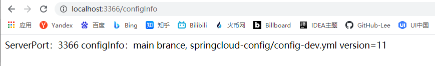


>   我们看到版本已经刷新


### 4、Bus动态刷新定点通知


如果我们不想全部通知，只想定点通知其中几，怎么做？


1、指定其中一个实例生效而不是全部

2、公式：http://localhost:配置中心端口号/actuator/bus-refresh/{**destination**}

3、/bus/refresh 请求不再发送到具体的服务实例上，而是发给 config server 并通过 destination 参数类指定需要更新配置的服务或实例


案例：

我们这里以刷新运行在 3355 端口号上的 config-client 为例

>   只通知 3355
>
>   不通知 3366


我们执行命令：

```
curl -X POST "http://localhost:3344/actuator/bus-refresh/config-client:3355"
```


>   微服务名：config-client
>
>   端口号：3355


## 27、Stream 消息驱动简介


### 1、Spring Cloud Stream 是什么以及 Binder 介绍


官方定义 Spring Cloud Stream 是一个构建消息驱动微服务的框架

应用程序通过 inputs 或者 outputs 来与 Spring Cloud Stream 中 binder 对象交互

通过我们配置来 binding(绑定)，而 Spring Cloud Stream 的 binder 对象负责与消息中间件交互。所以，我们只需要搞清楚如何与 Spring Cloud Stream 交互就可以方便使用消息驱动的方式

通过使用 Spring Integration 来连接消息代理中间件以实现消息事件驱动

Spring Cloud Stream 为一些供应商的消息中间件产品提供了个性化的自动化配置实现

**目前仅支持RabbitMQ、Kafka**


### 2、为什么引入 Cloud Stream


解决了什么痛点？既然 Stream 消息驱动那主流的消息中间夹有哪些？

>   ActiveMQ
>
>   RabbitMQ
>
>   RocketMQ （阿里的）
>
>   Kafka（大数据）


有可能你学的是 RabbitMQ，企业用的确实 kafka，有可能你学的是 RocketMQ，企业用的是 RabbitMQ，那么这无疑增加了程序员的负担


还有种情况，如下图所示，Java端用的 RabbitMQ，大数据端用的 Kafka 


那么切换、维护、开发负担很大，那么有没有一种新的技术诞生，让我们不再关注具体 MQ 的细节，我们只需要用一种适配绑定的方式，自动的给我们在各种 MQ 内切换


Spring Cloud Stream 一句话总结：

**屏蔽底层消息中间件的差异，降低切换成本，统一消息的编程模型**

>   比如，我们常用的数据库有 mysql、oracle、sql server三种，然后我们不想关注具体底层细节的差异化，这时候诞生了一个 Hibernate 兼容了三种数据库并提供了 API 供你使用


### 3、为什么用 Cloud Stream


比方说我们用到了 RabbitMQ 和 Kafka，由于这两个消息中间件的架构上的不同, 像 RabbitMQ 有exchange，kafka 有 Topic 和 Partitiohs 分区


这些中间件的差异性导致我们实际项目开发给我们造成了一定的困扰，我们如果用了两个消息队列的其中一种，后面的业务需求，我想往另外一种消息队列进行迁移，这时候无疑就是一个灾难性的，一夫堆东西都要重新推倒重新做，因为它跟我们的系统耦合了，这时候 springcloud Stream 给我们提供了一种解耦合的方式。


### 4、Stream 如何统一底层差异


在没有绑定器这个概念的情况下，我们的 Spring Boot 应用要直接与消息中间件进行信息交互的时候，由于各消息中间件构建的初衷不同，它们的实现细节上会有较大的差异性


通过定义绑定器作为中间层，完美地实现了应用程序与消息中间件细节之间的隔离。

通过向应用程序暴露统一的 Channel 通道，使得应用程序不需要再考虑各种不同的消息中间件实现。


通过定义绑定器 Binder 作为中间层，实现了应用程序与消息中间件细节之间的隔离


#### Binder 介绍

>   INPUT：消费者
>
>   OUTPUT：生产者


在没有绑定器这个概念的情况下，我们的 Spring Boot 应用要直接与消息中间件进行信息交互的时候，由于各消息中间件构建的初衷不同，它们的实现细节上会有较大的差异性，通过定义绑定器作为中间层，完美地实现了应用程序与消息中间件细节之间的隔离。Stream 对消息中间件的进一步封装，可以做到代码层面对中间件的无感知，甚至于动态的切换中间件( rabbitmq 切换为 kafka )，使得微服务开发的高度解耦，服务可以关注更多自己的业务流程


**通过定义绑定器 Binder 作为中间层，实现了应用程序与消息中间件细节之间的隔离**


Stream 中的消息通信方式遵行了发布-订阅模式

>   Topic主题进行广播
>
>   1.  在 RabbitMQ 就是 Exchange
>   2.  在 Kafka 中就是 Topic


### 5、Spring Cloud Stream 标准流程


>   Stream 中的消息通信方式遵循了发布-订阅模式


Stream 官方的架构图


结合业务逻辑流程图


>   Binder：很方便的俩你今


## 28、Stream 的实战配置


### 1、Stream 编码常用注解


**Middleware**：中间件、目前只支持 RabbitMQ 和 kafka

**Binder**：Binder 是应用与消息中间件之间的封装，目前实现了 Kafka 和 RabbitMQ 的 Binder，通过 Binder 可以很方便的连接中间件，可以动态的改变消息类型（对应于 Kafka 的 topic， RabbitMQ 的 Exchange ），这些都可以通过配置文件来实现

**@Input：**注解标识输入通道，通过该输入通道接受的消息进入应用程序

**@Output：**注解标识输出通道，发布的消息将通过该通道离开应用程序

**@StreamListener：**监听队列，用于消费的队列的消息接收

**@EnableBinding：**指信道 channel 和 exchange 绑定在一起


### 2、我们需要创建三个子模块


>   cloud-stream-rabbitmq-provider8801：作为生产者进行发消息模块
>
>   cloud-stream-rabbitmq-consumer8802：作为消息接收模块
>
>   cloud-stream-rabbitmq-consumer8803：作为消息接收模块


#### 1、创建工程 cloud-stream-rabbitmq-provider8801


##### 1、导入以下 maven 依赖

```xml
<dependencies>
    <!--stream 和 rabbitMQ 的整合包-->
    <dependency>
        <groupId>org.springframework.cloud</groupId>
        <artifactId>spring-cloud-starter-stream-rabbit</artifactId>
    </dependency>

    <!-- eureka client-->
    <dependency>
        <groupId>org.springframework.cloud</groupId>
        <artifactId>spring-cloud-starter-netflix-eureka-client</artifactId>
    </dependency>

    <!-- 引入自己定义的 api 通用包项目，可以使用 Payment 支付的 Entity -->
    <dependency>
        <groupId>org.lee.springcloud</groupId>
        <artifactId>cloud-api-commons</artifactId>
        <version>${project.version}</version>
    </dependency>

    <!--  web 和 actuator 是标配、必须要写  -->
    <dependency>
        <groupId>org.springframework.boot</groupId>
        <artifactId>spring-boot-starter-web</artifactId>
    </dependency>

    <dependency>
        <groupId>org.springframework.boot</groupId>
        <artifactId>spring-boot-starter-actuator</artifactId>
    </dependency>

    <!--<dependency>
        <groupId>org.springframework.boot</groupId>
        <artifactId>spring-boot-devtools</artifactId>
        <scope>runtime</scope>
        <optional>true</optional>
    </dependency>-->

    <dependency>
        <groupId>org.projectlombok</groupId>
        <artifactId>lombok</artifactId>
        <optional>true</optional>
    </dependency>

    <dependency>
        <groupId>org.springframework.boot</groupId>
        <artifactId>spring-boot-starter-test</artifactId>
    </dependency>
</dependencies>
```


##### 2、编写 yaml


>   如下配置 
>
>   spring.cloud.stream.binders.defaultRabbit.environment.spring.rabbitmq.xx 配置方式

```yaml

server:
  port: 8801

spring:
  application:
    name: cloud-stream-provider
  cloud:
    # Spring Cloud Stream 相关配置
    stream:
      # 绑定 RabbitMQ 的服务相关信息
      binders:
        defaultRabbit:
          type: rabbit  # 消息组件的类型
          environment:  # 设置 rabbitmq 相关的环境配置
            spring:
              rabbitmq:
                host: 192.168.0.166
                port: 5672  #默认端口号
                virtual-host: /Lee
                username: RabbitMQ-Lee
                password: 193654300
      # 服务的整合处理
      bindings:
        # 这个名字是一个通道的名称
        output:
          destination: LeeExchange         # 表示要使用的 Exchange 名称定义
          content-type: application/json   # 设置消息类型，本次为 json，文本则设置 "text/plain"
          default-binder: defaultRabbit    # 设置绑定的消息服务的具体设置

eureka:
  client:
    service-url:
      defaultZone: http://eureka7001.com:7001/eureka,http://eureka7002.com:7002/eureka
  instance:
    # 设置心跳的时间间隔 (默认30秒)
    lease-renewal-interval-in-seconds: 2
    # 如果现在超过了 5 秒间隔 (默认90秒)
    lease-expiration-duration-in-seconds: 5
    # 在信息列表时显示主机名称
    instance-id: send-8801.com
    # 访问路径变为 IP 地址
    prefer-ip-address: true
```


如果你是用的其他服务器上的 rabbitmq

>   比如我使用的我自己的阿里云服务器然后创建 docker 容器来运行rabbitmq


按照以上的配置方式的话，启动时会试图连接两次 rabbitmq 程序

第一次：试图连接访问的就是 application.yml 中配置的地址，此时已经订阅成功了

第二次：此时访问的地址就是localhost:5672，在我的本地环境中没有rabbitmq环境，所以直接报 IOException


**所以，如果是使用的自己的服务器来配置**

>   则需要修改配置文件，将 Rabbitmq 的配置信息移动到 application.yml 中的 spring 节点下

```yaml

server:
  port: 8801

spring:
  application:
    name: cloud-stream-provider
  # 如果使用外部的 rabbitmq 服务器，使用如下配置
  rabbitmq:
    host: 192.168.0.166
    port: 5672  #默认端口号
    virtual-host: /Lee
    username: RabbitMQ-Lee
    password: 193654300

  cloud:
    # Spring Cloud Stream 相关配置
    stream:
      # 绑定 RabbitMQ 的服务相关信息
      binders:
        defaultRabbit:
          type: rabbit  # 消息组件的类型
      # 服务的整合处理
      bindings:
        # 这个名字是一个通道的名称
        output:
          destination: LeeExchange         # 表示要使用的 Exchange 名称定义
          content-type: application/json   # 设置消息类型，本次为 json，文本则设置 "text/plain"
          default-binder: defaultRabbit    # 设置绑定的消息服务的具体设置

eureka:
  client:
    service-url:
      defaultZone: http://eureka7001.com:7001/eureka,http://eureka7002.com:7002/eureka
  instance:
    # 设置心跳的时间间隔 (默认30秒)
    lease-renewal-interval-in-seconds: 2
    # 如果现在超过了 5 秒间隔 (默认90秒)
    lease-expiration-duration-in-seconds: 5
    # 在信息列表时显示主机名称
    instance-id: send-8801.com
    # 访问路径变为 IP 地址
    prefer-ip-address: true
```


##### 3、编写 service 的 RabbitMQ 接口和实现类


>   接口

```java
package com.lee.springcloud.service;

/**
 * Stream - RabbitMQ
 *   消息发送者 (生产者)
 */
public interface IMessageProvider {
    boolean send(String message);
}
```


>   实现类

```java
package com.lee.springcloud.service.impl;

import com.lee.springcloud.service.IMessageProvider;
import lombok.extern.slf4j.Slf4j;
import org.springframework.cloud.stream.annotation.EnableBinding;
import org.springframework.cloud.stream.messaging.Source;
import org.springframework.integration.support.MessageBuilder;
import org.springframework.messaging.MessageChannel;

import javax.annotation.Resource;
import java.util.UUID;

/**
 * @EnableBinding：定义消息的推送管道
 * 这里不用 @Service 注解：因为我们是跟 RabbitMQ 做的交互，所以用 RabbitMQ 相关的注解
 */
@Slf4j
@EnableBinding(Source.class)
public class MessageProviderImpl implements IMessageProvider {

    /**
     * 定义消息发送管道
     */
    @Resource
    private MessageChannel output;

    @Override
    public boolean send(String message) {
        log.info("Send RabbitMQ Message => " + message);
        return output.send(MessageBuilder.withPayload(message).build());
    }
}
```


##### 4、编写 Controller 

```java
package com.lee.springcloud.controller;

import com.lee.springcloud.service.IMessageProvider;
import lombok.extern.slf4j.Slf4j;
import org.springframework.web.bind.annotation.GetMapping;
import org.springframework.web.bind.annotation.RestController;

import javax.annotation.Resource;
import java.util.UUID;

@Slf4j
@RestController
public class SendMessageController {

    @Resource
    private IMessageProvider messageProvider;

    @GetMapping("/sendMessage")
    public String sendMessage() {
        String message = UUID.randomUUID().toString();
        boolean result = messageProvider.send(message);
        return result ? "消息发送成功：" + message : "消息发送失败：";
    }
}
```


##### 5、启动测试

我们可以发现我们定义的交换机：


>   注意：此时还没有队列，当创建完消费者启动测试之后，消费者会自动创建队列并绑定这个交换机


#### 2、创建工程 cloud-stream-rabbitmq-consumer8802


##### 1、导入 maven 依赖

>   这里的依赖和 8801 的一毛一样


##### 2、编写 yaml配置

```yaml

server:
  port: 8802

spring:
  application:
    name: cloud-stream-consumer
  # 如果使用外部的 rabbitmq 服务器，使用如下配置
  rabbitmq:
    host: 192.168.0.166
    port: 5672  #默认端口号
    virtual-host: /Lee
    username: RabbitMQ-Lee
    password: 193654300

  cloud:
    # Spring Cloud Stream 相关配置
    stream:
      # 绑定 RabbitMQ 的服务相关信息
      binders:
        defaultRabbit:
          type: rabbit  # 消息组件的类型
      # 服务的整合处理
      bindings:
        # input : 消息接收者
        input:
          destination: LeeExchange         # 表示要使用的 Exchange 名称定义
          content-type: application/json   # 设置消息类型，本次为 json，文本则设置 "text/plain"
          default-binder: defaultRabbit    # 设置绑定的消息服务的具体设置

eureka:
  client:
    service-url:
      defaultZone: http://eureka7001.com:7001/eureka,http://eureka7002.com:7002/eureka
  instance:
    # 设置心跳的时间间隔 (默认30秒)
    lease-renewal-interval-in-seconds: 2
    # 如果现在超过了 5 秒间隔 (默认90秒)
    lease-expiration-duration-in-seconds: 5
    # 在信息列表时显示主机名称
    instance-id: receive-8802.com
    # 访问路径变为 IP 地址
    prefer-ip-address: true
```


##### 3、编写主启动类

>   一毛一样省略了


##### 4、编写 controller 监听接收端

```java
package com.lee.springcloud.controller;

import org.springframework.beans.factory.annotation.Value;
import org.springframework.cloud.stream.annotation.EnableBinding;
import org.springframework.cloud.stream.annotation.StreamListener;
import org.springframework.cloud.stream.messaging.Sink;
import org.springframework.messaging.Message;
import org.springframework.stereotype.Component;

@Component
@EnableBinding(Sink.class)
public class ReceiveMessageListenerController {

    @Value("${server.port}")
    private String serverPort;

    @StreamListener(Sink.INPUT)
    public void input(Message<String> message){
        System.out.println("消费者端口： " + serverPort + "  接收消息 => " + message.getPayload());
    }
}
```


##### 5、启动生产者和消费者进行测试


1、启动之后我们可以查看 RabbitMQ 的界面 Queue 栏，出现了一个队列


>   并且这个队列绑定的交换机就是 yml 配置的交换机


>   到此步骤，生产者的交换机已经绑定了队列，消费者则监听该队列


2、生产者8801发送一条消息到消息队列


3、消费者 8802 端口就会收到一条消息并打印


#### 3、创建工程 cloud-stream-rabbitmq-consumer8803


>   8802 和 8803 大部分一样，Copy 过来就行了、这里创建步骤就省略了
>
>   8803 注意端口号
>
>   注意名称 instance-id: receive-8803.com


启动测试之后发现，8801 发送的 message 能够同时被 8802 和 8803 监听到


### 3、后续问题分析


#### 1、有重复消费问题


>   我们发现 8801 发送的消息 8802 和 8803 同时都收到了，在某些场景下，这种方案并不适合，存在重复消费问题，我只需要其中一个客户端收到消息就行了


>   比如在如下场景中：


订单系统我们做集群部署，都会从 RabbitMQ 中获取订单信息，

那如果一个订单同时被两个服务获取到，那么就会造成数据错误，我们得避免这种情况。

**这时我们就可以使用Stream中的消息分组来解决**


注意在 Stream 中处于同一个 group 中的多个消费者是竞争关系，就能够保证消息只会被其中一个应用消费一次。**不同组是可以全面消费的(重复消费)**


因为两个服务的分组不一样，我们看到 RabbitMQ 种出现了两个不同的队列


故障现象：重复消费

导致原因：默认分组 group 是不同的


>   不同的组是可以消费的，同一个组内会发生竞争关系，只有其中一个可以消费

**其实就是队列名字不一样，要把两个消费者的队列名字弄成一样的就行了，就不会重复消费**


**解决方案**

我们修改 8802 和 8803 的 yaml 配置，都添加一个 group

```yaml
# input : 消息接收者
input:
  group: Consumer-Lee              # 添加分组(队列名)，同一个分组没有重复消费，不同分组其实就是发布者/订阅模式
```


**重启进行测试：**

我们发现 Rabbitmq 的界面出现了一个队列

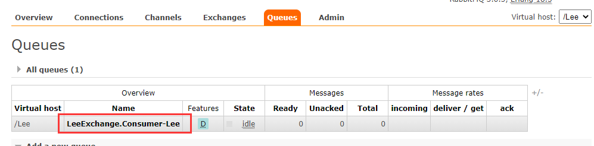


>   然后 8801 发送消息，剩下的两个消费者竞争消费，只有一个可以消费成功


8801发送消息


8802 经过竞争拿到消息


8803则空空如也


#### 2、消息持久化问题


>   假如我们没有加入分组 group，就不支持持久化操作，那么如果我们的消费端发生故障，是有可能造成消息的丢失的
>
>   
>
>   当我们加入了分组之后，队列就支持持久化了，支持持久化的队列有个 D 的标识，我们查看一下


我们模拟下持久化下的消息，会不会存在丢失问题

>   我们停掉 8802 和 8803（模拟宕机），然后用 8801 发送 4 条消息
>
>   之后启动 8802，我们可以看到消息已经被消费了四次


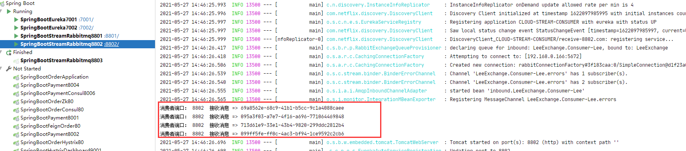


## 29、Sleuth 简介


### 1、微服务种存在哪些问题？


在微服务框架中，一个由客户端发起的请求在后端系统中会经过多个不同的的服务节点调用来协同产生最后的请求结果，**每一个前端请求都会形成一条复杂的分布式服务调用链路**，链路中的任何一环出现高延时或错误都会引起整个请求最后的失败


### 2、Spring Cloud Sleuth 分布式请求链路跟踪


>   Spring Cloud Sleuth为Spring Cloud实现了分布式追踪解决方案
>
>   在分布式系统中提供追踪解决方案并且兼容支持了 zipkin


微服务跟踪(sleuth)其实是一个工具,它在整个分布式系统中能跟踪一个用户请求的过程(包括数据采集，数据传输，数据存储，数据分析，数据可视化)，捕获这些跟踪数据，就能构建微服务的整个调用链的视图，这是调试和监控微服务的关键工具


Spring Cloud Sleuth有4个特点


| **特点**              | 说明                                                         |
| --------------------- | ------------------------------------------------------------ |
| 提供链路追踪          | 通过sleuth可以很清楚的看出一个请求经过了哪些服务、可以方便的理清服务局的调用关系 |
| 性能分析              | 通过sleuth可以很方便的看出每个采集请求的耗时，分析出哪些服务调用比较耗时，当服务调用的耗时随着请求量的增大而增大时，也可以对服务的扩容提供一定的提醒作用 |
| 数据分析<br/>优化链路 | 对于频繁地调用一个服务，或者并行地调用等，可以针对业务做一些优化措施 |
| 可视化                | 对于程序未捕获的异常，可以在zipkpin界面上看到                |


## 30、Sleuth 链路监控实战


### 1、Sleuth 之 zipkin 安装


1、Spring Cloud 从 F 版起，已经不再需要自己构建 Zipkin Server 服务了，只需要调用 jar包即可


2、下载地址：https://repo1.maven.org/maven2/io/zipkin/java/zipkin-server/2.12.9/


3、下载之后我们进入下载路径，然后执行以下命令

```java
java -jar zipkin-server-2.12.9-exec.jar
```


>   之后，如果我们看到如下的图标就代表 zipkin 已经启动成功


启动之后我们访问：http://localhost:9411/zipkin/


完整的调用链路：

表示一请求链路，一条链路通过 Trace ld 唯一标识，Span 标识发起的请求信息，各 span 通过 parent id 关联起来


一条链路通过Trace ld唯一标识，Span标识发起的请求信息，各span通过parent id 关联起来

>   Trace：类似于树结构的 Span 集合、表示一条调用链路，存在唯一标识
>
>   Span：标识调用链路来源，通俗的理解 Span 就是一次请求信息


整个链路的依赖关系如下：


### 2、Sleuth 链路监控实现


1、我们改造服务提供者 8001 初始创建的项目

>   cloud-provider-payment8001


2、增加以下 maven 依赖

```xml
<!-- Spring Cloud Sleuth 包含了 zipkin -->
<dependency>
    <groupId>org.springframework.cloud</groupId>
    <artifactId>spring-cloud-starter-zipkin</artifactId>
</dependency>
```


3、yaml 中增加以下配置

```yaml
spring:
  # 配置链路监控 zipkin
  zipkin:
    # 链路监控 zipkin 服务地址
    base-url: http://localhost:9411
  sleuth:
    sampler:
      # 采样率介于 0 ~ 1 之间，1则表示全部采集
      probability: 1
```


4、我们继续改造服务消费者 80 项目

>   增加同样的配置，这里流程就省略了


5、启动测试，我们访问80 端口的 swagger


>   调用成功后我们访问 zipkin 的主页


我们点进去就可以看到微服务的调用链路


## 31、Spring Cloud Alibaba 简介


### 1、为什么会出现 Spring Cloud Alibaba


Spring Cloud Netflix 项目进入维护模式


>   因为外部不及内斗，Spring Cloud 官网很多组件都已经进入了停更阶段


官方说明：https://spring.io/blog/2018/12/12/spring-cloud-greenwich-rc1-available-now


下面组件都已经进入停更维护模式.


**什么是停更维护?**


将模块置于维护模式，意味着 Spring Cloud 团队将不会再向模块添加新功能。我们将修复 block 级别的 bug 以及安全问题，我们也会考虑并审查社区的小型 pull request.

我们打算继续支持这些模块，直到 Greenwich 版本被普遍采用至少一年。


**进入维护模式意味着什么？**


>   Spring Cloud Netflix 将不再开发新的组件

我们都知道 Spring Cloud 版本迭代算是比较快的，因而出现了很多重大 ISSUE 都还来不及 Fiw 就又推另一个Release 了。 进入维护模式意思就是目前一直以后一段时间 Spring Cloud Netfix 提供的服务和功能就这么多了，不在开发新的组件和功能了。以后将以维护和 Merge 分支 Full Request 为主


### 2、Spring Cloud Alibaba 介绍


>   官网：https://github.com/alibaba/spring-cloud-alibaba/blob/master/README-zh.md


2018.10.31：Spring Cloud Alibaba 正式入驻了 Spring Cloud 官方孵化器，并在 Maven 中央库发布了第一个版本


>   Spring Cloud for Alibaba，它是由一些阿里巴巴的开源组件和云产品组成的。这个项目的目的是为了让大家所熟知的Spring 框架，其优秀的设计模式和抽象理念，以给使用阿里巴巴产品的Java开发者带来使用Spring Boot和Spring Cloud的更多便利。


**能做什么？**


-   **服务限流降级**：默认支持 WebServlet、WebFlux, OpenFeign、RestTemplate、Spring Cloud Gateway, Zuul, Dubbo 和 RocketMQ 限流降级功能的接入，可以在运行时通过控制台实时修改限流降级规则，还支持查看限流降级 Metrics 监控。
-   **服务注册与发现**：适配 Spring Cloud 服务注册与发现标准，默认集成了 Ribbon 的支持。
-   **分布式配置管理**：支持分布式系统中的外部化配置，配置更改时自动刷新。
-   **消息驱动能力**：基于 Spring Cloud Stream 为微服务应用构建消息驱动能力。
-   **分布式事务**：使用 @GlobalTransactional 注解， 高效并且对业务零侵入地解决分布式事务问题。
-   **阿里云对象存储**：阿里云提供的海量、安全、低成本、高可靠的云存储服务。支持在任何应用、任何时间、任何地点存储和访问任意类型的数据。
-   **分布式任务调度**：提供秒级、精准、高可靠、高可用的定时（基于 Cron 表达式）任务调度服务。同时提供分布式的任务执行模型，如网格任务。网格任务支持海量子任务均匀分配到所有 Worker（schedulerx-client）上执行。
-   **阿里云短信服务**：覆盖全球的短信服务，友好、高效、智能的互联化通讯能力，帮助企业迅速搭建客户触达通道

 

**组件：**

**[Sentinel](https://github.com/alibaba/Sentinel)**：把流量作为切入点，从流量控制、熔断降级、系统负载保护等多个维度保护服务的稳定性。

**[Nacos](https://github.com/alibaba/Nacos)**：一个更易于构建云原生应用的动态服务发现、配置管理和服务管理平台。

**[RocketMQ](https://rocketmq.apache.org/)**：一款开源的分布式消息系统，基于高可用分布式集群技术，提供低延时的、高可靠的消息发布与订阅服务。

**[Dubbo](https://github.com/apache/dubbo)**：Apache Dubbo™ 是一款高性能 Java RPC 框架。

**[Seata](https://github.com/seata/seata)**：阿里巴巴开源产品，一个易于使用的高性能微服务分布式事务解决方案。

**[Alibaba Cloud OSS](https://www.aliyun.com/product/oss)**: 阿里云对象存储服务（Object Storage Service，简称 OSS），是阿里云提供的海量、安全、低成本、高可靠的云存储服务。您可以在任何应用、任何时间、任何地点存储和访问任意类型的数据。

**[Alibaba Cloud SchedulerX](https://help.aliyun.com/document_detail/43136.html)**: 阿里中间件团队开发的一款分布式任务调度产品，提供秒级、精准、高可靠、高可用的定时（基于 Cron 表达式）任务调度服务。

**[Alibaba Cloud SMS](https://www.aliyun.com/product/sms)**: 覆盖全球的短信服务，友好、高效、智能的互联化通讯能力，帮助企业迅速搭建客户触达通道。

更多组件请参考 [Roadmap](https://github.com/alibaba/spring-cloud-alibaba/blob/master/Roadmap-zh.md)


官网

https://spring.io/projects/spring-cloud-alibaba

英文

https://github.com/alibaba/spring-cloud-alibaba/

https://spring-cloud-alibaba-group.github.io/github-pages/greenwich/spring-cloud-alibaba.html

Spring Cloud Alibaba Github 官网中文

https://github.com/alibaba/spring-cloud-alibaba/blob/master/README-zh.md


## 32、Nacos 简介和安装


### 1、Nacos 全称


前四个字母分别为 Naming 和 Configuration 的前两个字母，最后的 S 为 Server


>   一个更易于构建云原生应用的动态服务发现、配置管理和服务管理平台
>
>   Nacos：Dynamic Naming and Configuration Service
>
>   Nacos：就是注册中心 + 配置中心的组合
>
>   等价于：Nacos = Eureka + Config + Bus


回顾学习路线图


### 2、Nacos 能干嘛


1、替代 Euraka 做服务注册中心

2、替代 Config 做服务配置中心


### 3、Nacos 下载与安装


Github网址：https://github.com/alibaba/Nacos

Nacos 官方网址：https://nacos.io/zh-cn/


Linux 下的安装参考博客地址：

https://blog.csdn.net/u010031939/article/details/102907869


将 nacos 的安装包用 xftp 传入到远程服务器，然后解压压缩包

```apl
tar -zxvf nacos-server-1.1.4.tar.gz 
```


**单机模式**

启动

```apl
cd /usr/local/nacos/bin
sh startup.sh -m standalone
```


关闭

```
cd /usr/local/nacos/bin
sh shutdown.sh -m standalone
```


启动后可以查看有无报错信息

```apl
nacos is starting with standalone
nacos is starting，you can check the /usr/local/nacos/logs/start.out
```


**启动后访问 Nacos 主页**

http://192.168.1.166:8848/nacos/index.html


## 33、Nacos 之服务注册中心


Nacos 官方中文说明文档：

https://nacos.io/zh-cn/docs/what-is-nacos.html


### 1、Nacos 之服务提供者注册


#### 1、我们新建服务提供者 payment9001


1、我们新建一个项目名为：

>   cloudalibaba-provider-payment9001


2、增加 maven 依赖

```xml
<dependencies>
    <!--SpringCloud Alibaba Nacos-->
    <dependency>
        <groupId>com.alibaba.cloud</groupId>
        <artifactId>spring-cloud-starter-alibaba-nacos-discovery</artifactId>
        <version>2.2.5.RELEASE</version>
    </dependency>

    <!-- 引入自己定义的 api 通用包项目，可以使用 Payment 支付的 Entity -->
    <dependency>
        <groupId>org.lee.springcloud</groupId>
        <artifactId>cloud-api-commons</artifactId>
        <version>${project.version}</version>
    </dependency>

    <!--  web 和 actuator 是标配、必须要写  -->
    <dependency>
        <groupId>org.springframework.boot</groupId>
        <artifactId>spring-boot-starter-web</artifactId>
    </dependency>

    <dependency>
        <groupId>org.springframework.boot</groupId>
        <artifactId>spring-boot-starter-actuator</artifactId>
    </dependency>

    <!--<dependency>
        <groupId>org.springframework.boot</groupId>
        <artifactId>spring-boot-devtools</artifactId>
        <scope>runtime</scope>
        <optional>true</optional>
    </dependency>-->

    <dependency>
        <groupId>org.projectlombok</groupId>
        <artifactId>lombok</artifactId>
        <optional>true</optional>
    </dependency>

    <dependency>
        <groupId>org.springframework.boot</groupId>
        <artifactId>spring-boot-starter-test</artifactId>
    </dependency>
</dependencies>
```


3、编写 yaml 配置文件

```yaml
server:
  port: 9001

spring:
  application:
    name: nacos-payment-provider
  cloud:
    nacos:
      discovery:
        # 配置 Nacos 服务的地址
        server-addr: http://192.168.1.166:8848

# 暴漏要监控的服务
management:
  endpoints:
    web:
      exposure:
        include: '*'
```


4、编写主启动类

```java
package com.lee.cloudalibaba;

import org.springframework.boot.SpringApplication;
import org.springframework.boot.autoconfigure.SpringBootApplication;
import org.springframework.cloud.client.discovery.EnableDiscoveryClient;

/**
 * @EnableDiscoveryClient
 *   开启 Web 图形监控注解
 */
@EnableDiscoveryClient
@SpringBootApplication
public class SpringBootAlibabaPayment9001 {
    public static void main(String[] args) {
        SpringApplication.run(SpringBootAlibabaPayment9001.class, args);
    }
}
```


5、编写 controller 配置

```java
package com.lee.cloudalibaba.controller;

import org.springframework.beans.factory.annotation.Value;
import org.springframework.web.bind.annotation.GetMapping;
import org.springframework.web.bind.annotation.PathVariable;
import org.springframework.web.bind.annotation.RestController;

import java.util.UUID;

@RestController
public class PaymentController {

    @Value("${server.port}")
    private String serverPort;

    @GetMapping("/payment/nacos/uuid")
    public String getPayment(){
        return "nacos registry, serverPort：" + serverPort + "  uuid：" + UUID.randomUUID().toString();
    }
}
```


#### 2、我们再建服务提供者 payment9002


此过程和 payment9001 完全一样， copy 一份即可，注意改端口号就行了


#### 3、启动访问 nacos 服务注册中心


1、我们先访问 9001 看是否正常


2、进入 nacos 服务注册中心的管理界面


>   我们能看到如下两个实例就可以了，证明 9001 和 9002 都已经注册进了 nacos 注册中心


点击详情可以看到两个服务的详细信息


### 2、Nacos 之服务消费者注册


#### 1、我们新建服务消费者 consumer83


1、新建一个服务消费者

>   cloudalibaba-consumer-nacos-order83


2、导入maven 依赖

>   这里和 9001 的是一样的这里省略


3、主启动类

```java
package com.lee.cloudalibaba;

import org.springframework.boot.SpringApplication;
import org.springframework.boot.autoconfigure.SpringBootApplication;
import org.springframework.cloud.client.discovery.EnableDiscoveryClient;

/**
 * @EnableDiscoveryClient
 *   开启 Web 图形监控注解
 */
@EnableDiscoveryClient
@SpringBootApplication
public class SpringBootAlibabaOrder83 {
    public static void main(String[] args) {
        SpringApplication.run(SpringBootAlibabaOrder83.class, args);
    }
}
```


4、我们编写 yml 配置文件

```yaml
server:
  port: 83

spring:
  application:
    name: nacos-order-consumer
  cloud:
    nacos:
      discovery:
        # 配置 Nacos 服务的地址
        server-addr: http://192.168.1.166:8848

# 消费者将要去访问的微服务名称(注册进 nacos 的微服务提供者名称)
service-url:
  nacos-user-service: http://nacos-payment-provider
```


5、我们编写 config 实现 Ribbon 的负载均衡

```java
package com.lee.cloudalibaba.config;

import org.springframework.cloud.client.loadbalancer.LoadBalanced;
import org.springframework.context.annotation.Bean;
import org.springframework.context.annotation.Configuration;
import org.springframework.web.client.RestTemplate;

/**
 * nacos 默认集成 ribbon 负载均衡
 */
@Configuration
public class ApplicationContextConfig {

    @Bean
    @LoadBalanced //开启 Ribbon 负载均衡
    public RestTemplate getRestTemplate(){
        return new RestTemplate();
    }
}
```


6、我们编写 controller 类

```java
package com.lee.cloudalibaba.controller;

import lombok.extern.slf4j.Slf4j;
import org.springframework.beans.factory.annotation.Value;
import org.springframework.web.bind.annotation.GetMapping;
import org.springframework.web.bind.annotation.RestController;
import org.springframework.web.client.RestTemplate;

import javax.annotation.Resource;

@Slf4j
@RestController
public class OrderNacosController {

    /**
     * yml 注入 restTemplate 要访问的远程微服务名称
     *   http://nacos-payment-provider
     */
    @Value("${service-url.nacos-user-service}")
    private String serverURL;

    @Resource
    private RestTemplate restTemplate;

    @GetMapping("/consumer/payment/nacos/uuid")
    public String getPayment(){
        return restTemplate.getForObject(serverURL + "/payment/nacos/uuid", String.class);
    }
}
```


#### 2、启动 9001、9002和 83 进行测试


1、我们先检查下 nacos 的注册中心


2、我们访问如下连接：


>   http://localhost:83/consumer/payment/nacos/uuid


我们点击了两次发现服务均可以正常访问，并且支持负载均衡


### 3、Nacos 服务注册中心对比


#### 1、Nacos 和 CAP


据说Nacos在阿里巴巴内部有超过10万的实例运行，已经过了类似双十一等各种大型流量的考验


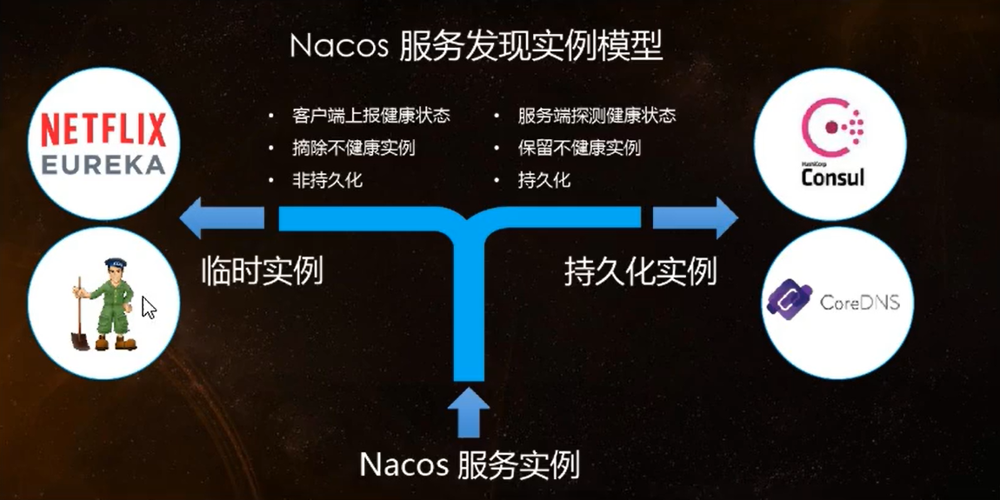


Nacos 和其他注册中心特性对比


#### 2、Nacos 支持 AP 和 CP 模式的切换


**C是所有节点在同一时间看到的数据是一致的; 而A的定义是所有的请求都会收到响应。**


何时选择使用何种模式？

一般来说，如果不需要存储服务级别的信息且服务实例是通过 nacos-client 注册，并且能够保持心跳连接，那么就可以选择 AP 模式，当前主流的服务入Spring Cloud 和 Dubbo 服务，都是用于 AP 模式，AP 模式为了服务的可用性而减弱了数据的一致性，因此 AP 默斯和下只支持注册临时实例


如果需要再服务级别编辑或者存储配置信息，那么 CP 是必须， K8S 服务和 DNS 服务则是用于 CP 模式

CP 模式下则支持注册持久化实例，此时则是以 Raft 协议为集群运行模式，该模式下注册实例之前必须先注册服务，如果服务不存在，则会返回错误


**服务切换模式命令**

```apl
curl -X PUT '$NACOS_SERVER:8848/nacos/v1/ns/operator/switches?entry=serverMode&value=CP'
```


## 34、Nacos 之服务配置中心


### 1、Nacos 配置中心规则


在 Nacos Spring Cloud 中，`dataId` 的完整格式如下：

```apl
${prefix}-${spring.profiles.active}.${file-extension}
```

-   `prefix` 默认为 `spring.application.name` 的值，也可以通过配置项 `spring.cloud.nacos.config.prefix`来配置


-   `spring.profiles.active` 即为当前环境对应的 profile，详情可以参考 [Spring Boot文档](https://docs.spring.io/spring-boot/docs/current/reference/html/boot-features-profiles.html#boot-features-profiles)。 **注意：当 `spring.profiles.active` 为空时，对应的连接符 `-` 也将不存在，dataId 的拼接格式变成 `${prefix}.${file-extension}`**


-   `file-exetension` 为配置内容的数据格式，可以通过配置项 `spring.cloud.nacos.config.file-extension` 来配置。目前只支持 `properties` 和 `yaml` 类型。


### 2、新建服务 config-client3377


1、我们将项目命名为：

>   cloudalibaba-config-nacos-client3377


2、我们导入 maven 依赖

```xml
<dependencies>
    <!--SpringCloud Alibaba Nacos-->
    <dependency>
        <groupId>com.alibaba.cloud</groupId>
        <artifactId>spring-cloud-starter-alibaba-nacos-discovery</artifactId>
        <version>2.2.5.RELEASE</version>
    </dependency>

    <!--Nacos config 配置中心-->
    <dependency>
        <groupId>com.alibaba.cloud</groupId>
        <artifactId>spring-cloud-starter-alibaba-nacos-config</artifactId>
    </dependency>

    <!-- 引入自己定义的 api 通用包项目，可以使用 Payment 支付的 Entity -->
    <dependency>
        <groupId>org.lee.springcloud</groupId>
        <artifactId>cloud-api-commons</artifactId>
        <version>${project.version}</version>
    </dependency>

    <!--  web 和 actuator 是标配、必须要写  -->
    <dependency>
        <groupId>org.springframework.boot</groupId>
        <artifactId>spring-boot-starter-web</artifactId>
    </dependency>

    <dependency>
        <groupId>org.springframework.boot</groupId>
        <artifactId>spring-boot-starter-actuator</artifactId>
    </dependency>

    <!--<dependency>
        <groupId>org.springframework.boot</groupId>
        <artifactId>spring-boot-devtools</artifactId>
        <scope>runtime</scope>
        <optional>true</optional>
    </dependency>-->

    <dependency>
        <groupId>org.projectlombok</groupId>
        <artifactId>lombok</artifactId>
        <optional>true</optional>
    </dependency>

    <dependency>
        <groupId>org.springframework.boot</groupId>
        <artifactId>spring-boot-starter-test</artifactId>
    </dependency>
</dependencies>
```


3、我们编写 application.yml 和 bootstrap.yml 两个配置文件


为什么需要两个配置文件？

>   Nacos 同 Spring Cloud - config 一样，在项目初始化时，要保证先从配置中心进行配置拉取，拉去配置之后，才能保证项目的正常启动
>
>   Spring Boot 中配置文件的加载是存在优先级顺序的，**bootstrap 优先级高于 application**


bootstrap.yml配置

```yaml
server:
  port: 3377

spring:
  application:
    name: nacos-config-client
  cloud:
    nacos:
      discovery:
        # Nacos 服务注册中心地址
        server-addr: http://192.168.1.166:8848
      config:
        # Nacos 服务配置中心地址
        server-addr: http://192.168.1.166:8848
        # 指定配置类型
        file-extension: yml

# ${prefix}-${spring.profiles.active}.${file-extension}  DataID 完整格式
#        微服务名称          -         开发环境         -              配置文件后缀名
#   nacos-config-client     -         dev             _                  yml
# ${spring.application.name}-${spring.profile.active}.${spring.cloud.nacos.config.file-extension}
```


application.yml配置

```yaml
spring:
  profiles:
    active: dev # 开发环境
```


4、编写主启动类

```java
package com.lee.cloudalibaba;

import org.springframework.boot.SpringApplication;
import org.springframework.boot.autoconfigure.SpringBootApplication;
import org.springframework.cloud.client.discovery.EnableDiscoveryClient;

@EnableDiscoveryClient
@SpringBootApplication
public class SpringBootNacosConfig3377 {
    public static void main(String[] args) {
        SpringApplication.run(SpringBootNacosConfig3377.class, args);
    }
}
```


5、编写 Controller 


>   通过 Spring Cloud 原生注解 @RefreshScope 实现配置自动更新

```java
package com.lee.cloudalibaba.controller;

import org.springframework.beans.factory.annotation.Value;
import org.springframework.cloud.context.config.annotation.RefreshScope;
import org.springframework.web.bind.annotation.GetMapping;
import org.springframework.web.bind.annotation.RestController;

/**
 * @RefreshScope：支持 Nacos 的动态刷新
 */
@RefreshScope
@RestController
public class ConfigClientController {

    @Value("${config.info}")
    private String configInfo;

    @GetMapping("/config/info")
    public String getConfigInfo(){
        return configInfo;
    }
}
```


### 3、Nacos 配置管理新增文件并测试


1、我们应该严格遵循 Nacos 官网的 Data Id (配置文件名) 来配置我们的 yml


>   设置 Data Id 完整格式

```apl
${prefix}-${spring.profiles.active}.${file-extension} 
```

对应如下：

```
${spring.application.name}-${spring.profile.active}.${spring.cloud.nacos.config.file-extension}
```


>   其实就是 微服务名称-开发环境.配置文件后缀名
>
>   nacos-config-client-dev.yml


2、我们到 Nacos 的 Web 管理界面，新增一个 yml 类型的配置文件


之后我们点击发布，返回之后就可以看到有个配置文件


3、启动 3377 进行测试


我们先访问 http://localhost:3377/config/info


>   之后我们去配置中心修改版本为 2


然后我们再访问 3377 看看配置


我们刷新后发现版本立即就刷新了，Nacos 的动态刷新不像 Config 和 Bus 那样 还需要手动发一条指令去实现自动刷新，Nacos 则无需做什么就可以支持自动刷新


### 4、命令空间分组和 Data Id 三者关系


#### 1、多环境多项目管理


**问题1：**

实际开发中，通常一个系统会准备

-   dev开发环境
-   test测试环境
-   prod生产环境

如何保证指定环境启动时服务能正确读取到 Nacos 上相应环境的配置文件呢?


**问题2：**

一个大型分布式微服务系统会有很多微服务子项目，

每个微服务项目又都会有相应的开发环境、测试环境、预发环境、正式环境.….…

那怎么对这些微服务配置进行管理呢?


>   以上的问题就可以通过 命名空间、分组和 Data Id 来解决


#### 2、三者的详细介绍


类似 Java 里面的 package 名 和 类名

最外层的 namespace 是可以用于区分部署环境的，Group 和 DatalID 逻辑上区分两个目标对象


**默认情况**

>   name space = public , Group = DEFAULT_GROUP, 默认 Cluster 是 DEFAULT


Nacos 默认的命名空间是 public，name space 主要用来实现隔离。

比方说我们现在有三个环境: 开发、测试、生产环境，我们就可以创建三个 name space


Group 默认是 DEFAULT_GROUP，Group 可以把不同的微服务划分到同一个分组里面去


Service 就是微服务;

一个 Service 可以包含多个 Cluster (集群)，Nacos 默认 Cluster 是 DEFAULT

Cluster 是对指定微服务的一个虚拟划分。比方说为了容灾，将Service微服务分别部署在了杭州机房和广州机房

这时就可以给杭州机房的Service微服务起一个集群名称(HZ) 

给广州机房的Service微服务起一个集群名称（GZ)，还可以尽量让同一个机房的微服务互相调用，以提升性能。


最后是lnstance，就是微服务的实例。


### 5、Nacos 之 DataId 方案配置


>   指定 spring.profile.active 和配置文件的 Data Id 来使不同环境下读取不同的配置
>
>   默认空间 + 默认分组 + 新建 dev 和 test 两个 Data Id


1、我们在默认的命名空间和默认分组下新建 测试环境的配置


>   nacos-config-client-test.yml

```yaml
config: 
  info: "config info for test, from nacos config center, version => 2"
```


2、我们修改 application.yml 的切换环境

```yaml
spring:
  profiles:
    active: test # 测试环境
  # active: dev # 开发环境
```


3、重启 3377 进行测试


>   成功读取到 test 配置文件


### 6、Nacos 之 Group分组方案


1、我们分别新建两个配置文件，文件文件名都为如下


>    nacos-config-client-info.yml               DEV_GROUP

```yaml
config: 
  info: "nacos-config-client-info.yml DEV_GROUP version => 1"
```


>    nacos-config-client-info.yml               TEST_GROUP

```yaml
config: 
  info: "nacos-config-client-info.yml TEST_GROUP version => 1"
```


但是分组不一样


2、我们修改 bootstrop 和 application 配置文件


3、我们重启 3377 进行测试 


然后我们将 group 修改为 TEST_GROUP 在进行测试


**结论：我们可以指定不同的分组来读取不同环境的配置文件**


### 7、Nacos 之 name space命名空间方案


1、我们新建两个 name space


2、在 dev 的命名空间下新建如下三个文件，注意分组不同


3、我们修改配置文件修改为如下


>   新加 namespace


>   以上就是先根据 命名空间找，然后找分组为 DEV_GROUP 的，最后是 active 为 dev，如下：
>
>   nacos-config-client-dev.yml


4、运行测试


## 35、Nacos 之集群配置


### 1、集群部署架构说明


Nacos 集群部署官网页：

https://nacos.io/zh-cn/docs/cluster-mode-quick-start.html


因此开源的时候推荐用户把所有服务列表放到一个vip下面，然后挂到一个域名下面

```apl
# 直连ip模式，机器挂则需要修改ip才可以使用。
http://ip1](http://ip1/):port/openAPI

# 挂载SLB模式(内网SLB，不可暴露到公网，以免带来安全风险)，直连SLB即可，下面挂server真实ip，可读性不好。
[http://SLB](http://slb/):port/openAPI

# 域名 + SLB模式(内网SLB，不可暴露到公网，以免带来安全风险)，可读性好，而且换ip方便，推荐模式
[http://nacos.com](http://nacos.com/):port/openAPI
```


#### 1、为什么要配置 MySQL 数据库来持久化？


>   默认 Nacos 使用嵌入式数据库 derby 实现数据的存储。所以，如果启动多个默认配置下的 Nacos 节点，数据存储是存在一致性问题的。为了解决这个问题，Nacos 采用了集中式存储的方式来支持集群化部署，目前只支持 MySQL 的存储


#### 2、Nacos 支持三种部署模式

-   单机模式–用于测试和单机试用。


-   集群模式–用于生产环境，确保高可用。
-   多集群模式–用于多数据中心场景。


#### 3、单机模式支持 MySQL


在 0.7 版本之前，在单机模式时 nacos 使用嵌入式数据库实现数据的存储，不方便观察数据存储的基本情况

0.7 版本地加了支持 mysql 数据源能力，具体的操作步骤:

-   安装数据库，版本要求:5.6.5+
-   初始化 mysql 数据库，数据库初始化文件: nacos-mysql.sql
-   修改 conf/application.properties 文件，增加支持 mysql 数据源配置（目前只支持 mysql )，添加 mysql 数据源的 url、用户名和密码


```apl
# mysql 数据源配置
spring.datasource.platform=mysql

db.num=1
db.url.0=jdbc:mysql://11.162.196.16:3306/nacos_devtest?characterEncoding=utf8&connectTimeout=1000&socketTimeout=3000&autoReconnect=true
db.user=nacos_devtest
db.password=youdontknow
```


>   再以单机模式启动nacos，nacos所有写嵌入式数据库的数据都写到了mysql


### 2、Nacos 持久化配置


#### 1、单机版的 Nacos 配置


##### 1、创建 nacos 的 mysql 数据库


>   Linux 进入目录 nacos/conf/，有个 nacos-mysql.sql 文件，这就是创建 mysql 的创建数据库表的脚本
>
>   拷贝出来拉到自己数据库执行以下，


我们手动创建一个数据库 nacos_config


执行创建表的脚本


##### 2、我们将如下内容拷贝到 conf/application.properties 文件


```apl
########################### MySQL Database Config ############################
spring.datasource.platform=mysql

db.num=1
db.url.0=jdbc:mysql://192.168.1.166:3306/nacos_config?characterEncoding=utf8&connectTimeout=1000&socketTimeout=3000&autoReconnect=true
db.user=root
db.password=Lee193654300_
```


##### 3、重启 nacos

>   重启 nacos之后，我们新建一个 Yaml 配置文件，保存之后我们就可以在 config_info 表看到该配置文件的信息


### 3、Nacos 之 Linux 集群配置  


>   我们要通过如下架构，配置 2 台  Nginx 实现 三台 Nacos 集群的负载均衡最后搭配 MySql 的主从复制


#### 1、思考个问题


**1、三个 nacos 都是在一台机器上配置、伪集群配置**


>   之前我们一个 nacos 配置，启动的时候 ：Startup 8848 是以 默认端口 8848 启动的
>
>   但是我们现在要在一个 Linux 启动三台 nacos，那我们启动的时候端口怎么指定？如果默认的话肯定会端口占用启动失败，所以这时我们就要改进下方案
>
>   我们启动的时候以：startup -p 端口号 来启动


#### 2、Nacos 配置 mysql 数据源


1、我们找到 nacos 的安装路径，在 conf 文件夹下有个 application.properties 配置文件


2、我们先对这个文件做个备份

```apl
# 复制一份配置文件、后缀名为 init 代表默认初始配置
cp application.properties application.properties.init
```


3、备份之后我们 vim 编辑该文件，增加 nacos 的持久化方式为 mysql

```properties
########################### MySQL Database Config ############################
spring.datasource.platform=mysql

db.num=1
db.url.0=jdbc:mysql://192.168.1.166:3306/nacos_config?characterEncoding=utf8&connectTimeout=1000&socketTimeout=3000&autoReconnect=true
db.user=root
db.password=Lee193654300_
```


#### 3、Linux 服务器上 nacos 集群配置 cluster.conf


>   我们梳理出来三台 nacos 集群的端口号
>
>   端口号：3333、4444、5555，并将这三个端口配置成一组


1、我们将 conf 下的配置文件 cluster.conf.example 复制出一份


```apl
# 复制一份配置文件
cp cluster.conf.example cluster.conf
```

如下：


2、我们编辑该文件增加如下内容


>   单机 IP 不能写成 127.0.0.1，必须是 hostname -I 能识别的 ip


>   将配置文件原有的内容注释掉删除掉都可以


#### 4、编辑 Nacos 的启动脚本 startup.sh


>   编辑的目的是使它能够增加参数扩展功能、启动时可以指定端口号


1、单机版和集群模式启动有何区别？


>   单机版启动如下命令即可启动
>
>   ```apl
>   ./startup.sh
>   ```


如果集群模式启动，我们希望可以类似其它软件的 shell 命令，传递不同的端口号启动不同的 nacos 实例

```apl
# 启动端口号为 3333 的 nacos
./startup.sh -p 3333
```


2、备份一个 startup.sh 脚本

```apl
cp startup.sh startup.sh.init
```


3、修改 /nacos/bin 下的 startup.sh 启动脚本


>   要修改的内容如下：


>   **新版 nacos - 2.0.1 脚本默认已经支持 p 端口，无需在改**


### 4、Nginx 的配置 (作为负载均衡器)


