## 1、微服务简介


### 1、微服务架构概述

微服务架构是一种架构模式、它体长将单一的应用程序划分为一组小的服务、服务之间互相协调、互相配合、为用户提供最终价值，每个服务运行在独立的进程中，服务与服务间采用轻量级的通信机制互相协作（通常是基于 HTTP 协议的 `RESTful API`）、每个服务都围绕着具体业务进行构建，并且能够独立的部署到生产环境、类生产环境等，另外，应当避免统一的、集中式的服务管理机制，对具体的一个服务而言，应根据业务上下文，选择合适的语言、工具进行构建


>   目前的微服务并没有一个统一的标准，一般是以业务来划分
>
>   将传统的一站式应用，拆分成一个个的服务，彻底去耦合，一个微服务就是单功能业务，只做一件事。
>
>   与微服务相对的叫巨石


微服务体系架构


### 2、Spring Cloud简介


Spring Cloud 分布式微服务架构的一站式解决方案，是多种微服务架构落地技术的集合体，俗称微服务全家桶


Spring Cloud 官网：https://spring.io/projects/spring-cloud


Spring Cloud 集成的相关优质项目推荐


它伊然成为微服务开发的主流技术栈，在国内开发者社区非常火爆


>   **2018年京东的基础架构**


>   某年阿里云的服务架构


>   京东的物流主栈的架构


**我们如何才分服务？可如下图**


#### 1、微服务的优缺点


 **优点**

1.  每个服务足够内聚，足够小，比较容易聚焦
2.  开发简单且效率高，一个服务只做一件事情
3.  开发团队小，一般2-5人足以（当然按实际为准）
4.  微服务是松耦合的，无论开发还是部署都可以独立完成
5.  微服务能用不同的语言开发
6.  易于和第三方集成，微服务允许容易且灵活的自动集成部署（持续集成工具有Jenkins,Hudson,bamboo等）
7.  微服务易于被开发人员理解，修改和维护，这样可以使小团队更加关注自己的工作成果，而无需一定要通过合作才能体现价值
8.  微服务允许你融合最新的技术
9.  ==微服务只是业务逻辑的代码，不会和HTML,CSS或其他界面组件融合==。
10.  ==每个微服务都可以有自己的存储能力，数据库可自有也可以统一，十分灵活==。

**缺点**

1.  开发人员要处理分布式系统的复杂性
2.  多服务运维难度，随着服务的增加，运维的压力也会增大
3.  依赖系统部署
4.  服务间通讯的成本
5.  数据的一致性
6.  系统集成测试
7.  性能监控的难度


#### 2、Spring Cloud 技术栈


该课程主要采用如下的技术栈进行讲解


>   服务注册与发现：Eureka
>
>   服务负载均衡与调用：`Netflix Oss Ribbon`
>
>   服务负载与调用：`Netflix Feign`
>
>   服务熔断降级：`Hystrix`
>
>   服务网关：`Netflix Zuul`
>
>   服务分布式配置：`SpringCloud Config`
>
>   服务开发：Spring Boot


## 2、Boot和Cloud版本选型


### 1、Spring Cloud 的版本关系

官网：[https://spring.io/projects/spring-cloud](https://spring.io/projects/spring-cloud#learn)
源码：https://github.com/spring-projects/spring-cloud


**Spring Cloud 命名规则：**

>   Boot用字母作为版本号，Cloud用字母 (伦敦地铁站首字母) 作为版本号，并由A-Z的顺序迭代
>
>   当Spring Cloud的发布内容积累到临界点或者一个重大BUG被解决后，会发布一个"service releases’ 版本，简称 SRX 版本，比如 Green wich.SR2 就是Spring Cloud发布的Greenwich版本的第2个 SRX 版本


### 2、Spring Cloud 的版本如何选型


我们尽量按照官网推荐的版本来做、版本也不是胡乱来的、如果版本选择不对，那么光是排查环境问题都是非常头疼的事情


**1、我们可以通过如下网址获取版本推荐:**

https://start.spring.io/actuator/info  获取 json 结果

通过在线工具格式化 Json 得到相对可观的版本参考


2、**去官网查看 Spring Cloud 的推荐版本、目前最新版是 2020.0.x 版本的**


>   推荐 H 版本的

| Cloud Release Train                                          | Boot Version                     |
| :----------------------------------------------------------- | :------------------------------- |
| [2020.0.x](https://github.com/spring-cloud/spring-cloud-release/wiki/Spring-Cloud-2020.0-Release-Notes) aka Ilford | 2.4.x                            |
| [Hoxton](https://github.com/spring-cloud/spring-cloud-release/wiki/Spring-Cloud-Hoxton-Release-Notes) | 2.2.x, 2.3.x (Starting with SR5) |
| [Greenwich](https://github.com/spring-projects/spring-cloud/wiki/Spring-Cloud-Greenwich-Release-Notes) | 2.1.x                            |
| [Finchley](https://github.com/spring-projects/spring-cloud/wiki/Spring-Cloud-Finchley-Release-Notes) | 2.0.x                            |
| [Edgware](https://github.com/spring-projects/spring-cloud/wiki/Spring-Cloud-Edgware-Release-Notes) | 1.5.x                            |
| [Dalston](https://github.com/spring-projects/spring-cloud/wiki/Spring-Cloud-Dalston-Release-Notes) | 1.5.x                            |


### 3、Spring Boot 的选型


选型原则：如果只用 Spring Boot 开发项目，可以直接用最新版，但是同时用 boot 和 cloud，因为需要照顾 cloud，由 cloud 决定 boot 版本


总结：

>   Spring Cloud 选型为 Hoxton SR1 版本
>
>   Spring Boot 选型为 2.2.2.RELEASE
>
>   Cloud Alibaba 选型为 2.1.0.RELEASE
>
>   Java8
>
>   Maven 3.5 及以上
>
>   MySql 5.7 及以上


### 4、Spring Cloud 组件停更


| 服务注册中心                                | 服务调用                                                 | 服务调用2 | 服务降级                            | 服务网关           | 服务配置        | 服务总线 |
| ------------------------------------------- | -------------------------------------------------------- | --------- | ----------------------------------- | ------------------ | --------------- | -------- |
| ✖ Eureka（停更，要学）                      | ✔ Ribbon（正在使用，但已停更，未来将被LoadBalancer替换） | ✖ Feign   | ✖ Hystrix（停更，国内大规模使用中） | ✖ Zuul             | ✖ Config        | ✖ Bus    |
| ✔ Zookeeper                                 | ✔ LoadBalancer（还没成熟）                               | OpenFeign | ✔ resilience4j（国外使用）          | ？ Zuul2（还没出） | ✔ Nacos(阿里的) | ✔ Nacos  |
| ✔ Consul                                    | -                                                        | -         | ✔Sentienl（阿里的，国内使用）       | ✔ gateway          | -               | -        |
| ✔ Nacos（阿里的，重点推荐，完美替换Eureka） | -                                                        | -         | -                                   | -                  | -               | -        |


-   ✖为老技术，基本上已停更，但很多公司还在用
-   ✔为老技术停更后的替代方法
-   新老技术都会讲解，因此课程量很大


## 3、微服务父工程构建


### 1、搭建工作空间环节


1、创建一个 maven 项目。


>   勾选脚手架：maven.archetype-site


-   设置字符编码
-   删除新项目的 src 文件夹

-   注解生效激活：

    >   Setting->Annotation Processors -> Maven default.... Enable annotation 按钮

    

-   Java 版本选 8

-   File Type 过滤

    >   就是过滤掉项目 idea 软件的配置文件啊、git 文件啊、等等、不做也行


### 2、父工程 pom 文件构建


1、在父工程中添加 packaging 标签

>   packaging 改成 pom、表示这个pom是个总的父工程

```xml
<groupId>org.lee.springcloud</groupId>
<artifactId>SpringCloud</artifactId>
<version>1.0-SNAPSHOT</version>
<!-- 父工程改为 改成 pom  -->
<packaging>pom</packaging>
```


2、导入 微服务的必备模板包

```xml
  <!--统一管理jar包版本-->
  <properties>
    <project.build.sourceEncoding>UTF-8</project.build.sourceEncoding>
    <maven.compiler.source>1.8</maven.compiler.source>
    <maven.compiler.target>1.8</maven.compiler.target>
    <junit.version>4.12</junit.version>
    <log4j.version>1.2.17</log4j.version>
    <lombok.version>1.16.18</lombok.version>
    <mysql.version>5.1.47</mysql.version>
    <druid.version>1.1.16</druid.version>
    <mybatis.spring.boot.version>1.3.0</mybatis.spring.boot.version>
  </properties>


  <!--子模块继承之后
      提供作用：锁定版本 + 子 module 不用写 groupId 和 version -->
  <dependencyManagement>
    <dependencies>

      <!--spring boot 2.2.2-->
      <dependency>
        <groupId>org.springframework.boot</groupId>
        <artifactId>spring-boot-dependencies</artifactId>
        <version>2.2.2.RELEASE</version>
        <type>pom</type>
        <scope>import</scope>
      </dependency>

      <!--spring cloud Hoxton.SR1-->
      <dependency>
        <groupId>org.springframework.cloud</groupId>
        <artifactId>spring-cloud-dependencies</artifactId>
        <version>Hoxton.SR1</version>
        <type>pom</type>
        <scope>import</scope>
      </dependency>

      <!--spring cloud 阿里巴巴-->
      <dependency>
        <groupId>com.alibaba.cloud</groupId>
        <artifactId>spring-cloud-alibaba-dependencies</artifactId>
        <version>2.1.0.RELEASE</version>
        <type>pom</type>
        <scope>import</scope>
      </dependency>

      <!--mysql-->
      <dependency>
        <groupId>mysql</groupId>
        <artifactId>mysql-connector-java</artifactId>
        <version>${mysql.version}</version>
        <!--      <scope>runtime</scope>-->
      </dependency>

      <!-- druid-->
      <dependency>
        <groupId>com.alibaba</groupId>
        <artifactId>druid</artifactId>
        <version>${druid.version}</version>
      </dependency>

      <!--mybatis-->
      <dependency>
        <groupId>org.mybatis.spring.boot</groupId>
        <artifactId>mybatis-spring-boot-starter</artifactId>
        <version>${mybatis.spring.boot.version}</version>
      </dependency>

      <!--junit-->
      <dependency>
        <groupId>junit</groupId>
        <artifactId>junit</artifactId>
        <version>${junit.version}</version>
      </dependency>

      <!--log4j-->
      <dependency>
        <groupId>log4j</groupId>
        <artifactId>log4j</artifactId>
        <version>${log4j.version}</version>
      </dependency>

      <!--解决maven项目中 无法打包生成空文件夹的问题-->
      <dependency>
        <groupId>org.apache.maven.plugins</groupId>
        <artifactId>maven-project-info-reports-plugin</artifactId>
        <version>3.0.0</version>
      </dependency>

    </dependencies>
  </dependencyManagement>

  <build>
    <plugins>
      <plugin>
        <groupId>org.springframework.boot</groupId>
        <artifactId>spring-boot-maven-plugin</artifactId>
        <version>2.3.7.RELEASE</version>
        <configuration>
          <fork>true</fork>
          <addResources>true</addResources>
        </configuration>
      </plugin>
    </plugins>
  </build>
```


### 3、maven知识点复习


Maven使用 `<dependencyManagement>` 元素来提供了一种管理依赖版本号的方式

通常会在一个组织或者项目的最顶层的父 `POM` 中看`<dependencyManagement>`元素

使用 `pom.xml` 中的`<dependencyManagement>`元索能让所有在子项目中引用一个依赖而不用显式的列出版本号

Maven会沿着父子层次向上走，直到找到一个拥有`<dependencyManagement>`元素的项目，然后它就会使用这个`<dependencyManagement>`元素中指定的版本号


**如父类代码里：**

```xml
<dependencyManagement>
    <dependencies>
        <dependency>
            <groupId>mysql</groupId>
            <artifactId>mysql-connector-java</artifactId>
            <version>5.1.2</version>
        </dependency>
    </dependencies>
</dependencyManagement>
```


**然后在子项目理就可以添加 mysql-connector 时可以不指定版本号，**例如：

```xml
<dependencies>
    <dependency>
        <groupId>mysql</groupId>
        <artifactId>mysql-connector-java</artifactId>
    </dependency>
</dependencies>
```


然后子项目就可以往上查找到带有`<dependencyManagement>`标签的父项目，然后使用父项目的版本号、这样做可以使版本可以统一管理


这样做的好处就是：

>   如果有多个子项目都引用同一样依赖，则可以避免在每个使用的子项目里都声明一个版本号，这样当想升级或切换到另一个版本时，只需要在顶层父容器里更新，而不需要一个一个子项目的修改；**另外如果某个子项目需要另外的一个版本，只需要声明version就可**


**总结：**

-   `<dependencyManagement>`里只是声明依赖，并不实现引入，因此子项目需要显示的声明需要用的依赖
-   如果不在子项目中声明依赖，是不会从父项目中继承下来的；只有在子项目中写了该依赖项，并且没有指定具体版本，才会从父项目中继承该项，并且version 和scope 都读取自父 pom

-   如果子项目中指定了版本号，那么会使用子项目中指定的jar版本


### 4、maven跳过单元测试


>   项目中节约时间先暂时跳过单元测试、IDEA中如下操作


### 5、小结：

父工程创建完毕后执行下 mvn:install 发布到我们的仓库供后续子工程使用


## 4、支付模块构建(服务提供者)


>   **牢记：约定 > 配置 > 编码**


### 1、Module 的环境搭建

##### 1、再父工程上创建一个 Model，名为 cloud-provider-payment8001


##### 2、增加 pom 文件驱动包依赖

```xml
<dependencies>
    <!--spring boot 2.2.2 web 启动器-->
    <dependency>
        <groupId>org.springframework.boot</groupId>
        <artifactId>spring-boot-starter-web</artifactId>
    </dependency>

    <!--图形化监控展现-几乎和starter-web绑定在一块使用 -->
    <dependency>
        <groupId>org.springframework.boot</groupId>
        <artifactId>spring-boot-starter-actuator</artifactId>
    </dependency>

    <!--mybatis 和 springboot 整合-->
    <dependency>
        <groupId>org.mybatis.spring.boot</groupId>
        <artifactId>mybatis-spring-boot-starter</artifactId>
    </dependency>

    <!-- druid数据源-->
    <dependency>
        <groupId>com.alibaba</groupId>
        <artifactId>druid-spring-boot-starter</artifactId>
        <version>1.1.10</version>
    </dependency>

    <!--mysql-connector-java-->
    <dependency>
        <groupId>mysql</groupId>
        <artifactId>mysql-connector-java</artifactId>
    </dependency>

    <!--jdbc-->
    <dependency>
        <groupId>org.springframework.boot</groupId>
        <artifactId>spring-boot-starter-jdbc</artifactId>
    </dependency>

    <dependency>
        <groupId>org.springframework.boot</groupId>
        <artifactId>spring-boot-devtools</artifactId>
        <scope>runtime</scope>
        <optional>true</optional>
    </dependency>

    <!-- lombok 插件-->
    <dependency>
        <groupId>org.projectlombok</groupId>
        <artifactId>lombok</artifactId>
        <optional>true</optional>
    </dependency>

    <dependency>
        <groupId>org.springframework.boot</groupId>
        <artifactId>spring-boot-starter-test</artifactId>
        <scope>test</scope>
    </dependency>

</dependencies>
```


##### 3、新建 yml 配置文件、并编写配置

```yaml
#每个微服务建议配一个端口号和服务名称
server:
  port: 8001

#配置微服务名称
spring:
  application:
    name: cloud-payment-service

  datasource:
    type: com.alibaba.druid.pool.DruidDataSource  # 当前数据源操作类型
    driver-class-name: org.gjt.mm.mysql.Driver    # mysql驱动包
    url: jdbc:mysql://192.168.0.166:3306/mybatis_plus?useUnicode=true&characterEncoding=utf8&useSSL=false
    username: root
    password: Lee193654300_

#配置 mybatis 映射文件路径 和 包别名路径
mybatis:
  mapper-locations: classpath:mapper/*.xml
  type-aliases-package: com.lee.springcloud.entities
```


##### 4、添加包和SpringBoot的主启动类


### 2、业务类的编写


#### 1、建一张 支付表 payment

```sql

SET NAMES utf8mb4;
SET FOREIGN_KEY_CHECKS = 0;

-- ----------------------------
-- Table structure for payment
-- ----------------------------
DROP TABLE IF EXISTS `payment`;

CREATE TABLE `payment`  (
  `id` bigint(20) NOT NULL COMMENT 'ID',
  `serial` varchar(200) CHARACTER SET utf8 COLLATE utf8_general_ci NULL DEFAULT NULL,
  PRIMARY KEY (`id`) USING BTREE
) ENGINE = InnoDB CHARACTER SET = utf8 COLLATE = utf8_general_ci ROW_FORMAT = Dynamic;

SET FOREIGN_KEY_CHECKS = 1;
```


#### 2、构建 entities


>   我们需要创建一个包 entities、编写 Payment 实体

```java
package com.lee.springcloud.entities;

import lombok.AllArgsConstructor;
import lombok.Data;
import lombok.NoArgsConstructor;

import java.io.Serializable;

/**
 * 支付实体类
 */
@Data
@AllArgsConstructor
@NoArgsConstructor
public class Payment implements Serializable {
    /**
     * id
     */
    private Long id;
    /**
     * 流水号
     */
    private String serial;
}
```


>   由于我们向前端返回查询的实体类，需要对实体类进行封装构造，编写 CommonResult<T> 类

```java
package com.lee.springcloud.entities;

import lombok.AllArgsConstructor;
import lombok.Data;
import lombok.NoArgsConstructor;

@Data
@AllArgsConstructor
@NoArgsConstructor
/**
 * 主要是返回给前端用的
 */
public class CommonResult<T> {
    private Integer code;
    private String message;
    private T data;

    public CommonResult(Integer code, String message) {
        this.code = code;
        this.message = message;
    }
}

```


#### 3、编写 dao


>   我们需要创建对实体操作的接口 PaymentDao 接口

```java
package com.lee.springcloud.dao;

import com.lee.springcloud.entities.Payment;
import org.apache.ibatis.annotations.Mapper;
import org.apache.ibatis.annotations.Param;

/**
 * @Repository
 *   这里推荐使用 Mapper、因为 Repository 插入的时候可能有问题
 */
@Mapper
public interface PaymentDao {

    /**
     * 创建(新增)一个支付对象
     * @param payment
     * @return
     */
    int createPayment(Payment payment);

    /**
     * 根据 id 获取一个 Payment 对象
     * @param id
     * @return
     */
    Payment getPaymentById(@Param("id") Long id);
}
```


>   在 resources 目录下建立 mybatis 的 mapper 文件夹
>
>   并创建 PaymentMapper.xml 配置文件、实现 PaymentDao 接口的方法


```xml
<?xml version="1.0" encoding="UTF-8" ?>
<!DOCTYPE mapper
        PUBLIC "-//mybatis.org//DTD Mapper 3.0//EN"
        "http://mybatis.org/dtd/mybatis-3-mapper.dtd">

<mapper namespace="com.lee.springcloud.dao.PaymentDao">

    <resultMap id="BaseResultMap" type="com.lee.springcloud.entities.Payment">
        <id column="id" property="id" jdbcType="BIGINT" />
        <id column="serial" property="serial" jdbcType="VARCHAR"/>
    </resultMap>
    
    <!--
        useGeneratedKeys 插入成功返回主键
        keyProperty 指定主键是谁，指定后插入主键就不用显示写了
        -->
    <insert id="createPayment" parameterType="Payment" useGeneratedKeys="true" keyProperty="id">
         insert into payment(serial) values(#{serial});
    </insert>

    <select id="getPaymentById" parameterType="Long" resultMap="BaseResultMap">
         select id, serial from payment where id = #{id}
    </select>
</mapper>
```


#### 4、编写 service


>   我们在service 包下编写 PaymentService 接口

```java
package com.lee.springcloud.service;

import com.lee.springcloud.entities.Payment;
import org.apache.ibatis.annotations.Param;

public interface PaymentService {

    int createPayment(Payment payment);

    Payment getPaymentById(@Param("id") Long id);
}
```


>   并在 impl 包下添加实现类 PaymentServiceImpl

```java
package com.lee.springcloud.service.impl;

import com.lee.springcloud.dao.PaymentDao;
import com.lee.springcloud.entities.Payment;
import com.lee.springcloud.service.PaymentService;
import org.springframework.stereotype.Service;

import javax.annotation.Resource;

@Service
public class PaymentServiceImpl implements PaymentService {

    /**
     * 这里没用 Spring 的 @Autowrite
     * 而是用了 Java 自带的 @Resource 注解,也可以进行依赖注入
     */
    @Resource
    private PaymentDao paymentDao;

    @Override
    public int createPayment(Payment payment) {
        return paymentDao.createPayment(payment);
    }

    @Override
    public Payment getPaymentById(Long id) {
        return paymentDao.getPaymentById(id);
    }
}

```


#### 5、增加对Swagger的支持


>   我们在父工程导入 Swagger 的 maven 依赖

```xml
<!--统一管理jar包版本-->
<properties>
    <!--配置 Swagger jar包版本-->
    <swagger.version>2.9.2</swagger.version>
</properties>

<!-- 导入 Swagger 配置 -->
<dependency>
    <groupId>io.springfox</groupId>
    <artifactId>springfox-swagger2</artifactId>
    <version>${swagger.version}</version>
</dependency>

<dependency>
    <groupId>io.springfox</groupId>
    <artifactId>springfox-swagger-ui</artifactId>
    <version>${swagger.version}</version>
</dependency>
```


>   然后在子工程 cloud-provider-payment8001 的 pom 文件中添加依赖

```xml
<!-- 导入 Swagger 配置 -->
<dependency>
    <groupId>io.springfox</groupId>
    <artifactId>springfox-swagger2</artifactId>
</dependency>

<dependency>
    <groupId>io.springfox</groupId>
    <artifactId>springfox-swagger-ui</artifactId>
</dependency>
```


>   我们在 config 包下建立 SwaggerConfig 配置文件

```java
package com.lee.springcloud.config;

import org.springframework.context.annotation.Bean;
import org.springframework.context.annotation.Configuration;
import org.springframework.core.env.Environment;
import springfox.documentation.builders.RequestHandlerSelectors;
import springfox.documentation.service.ApiInfo;
import springfox.documentation.service.Contact;
import springfox.documentation.spi.DocumentationType;
import springfox.documentation.spring.web.plugins.Docket;
import springfox.documentation.swagger2.annotations.EnableSwagger2;

import java.util.ArrayList;

/**
 * 配置 Swagger
 */
@Configuration
@EnableSwagger2 //开启 Swagger2
public class SwaggerConfig {
    /**
     * 配置 Swagger Docket 的 bean 实例
     * @param environment
     * @return
     */
    @Bean
    public Docket docket(Environment environment){

        //apiInfo() 可以设置 Swagger 界面的描述
        return new Docket(DocumentationType.SWAGGER_2)
                /**
                 * 添加 Swagger 的描述信息
                 */
                .apiInfo(getApiInfo())
                /**
                 * 分组
                 */
                .groupName("cloud-provider-payment8001")
                .select()
                /**
                 * apis：添加要扫描的 api 接口规则
                 *   RequestHandlerSelectors
                 *      any()：扫描全部
                 *      none()：不扫描
                 *      withClassAnnotation()：扫描类上的注解
                 *      withMethodAnnotation()：扫描方法上的注解
                 *      basePackage()：扫描包下的所有 (最常用)
                 */
                .apis(RequestHandlerSelectors.basePackage("com.lee.springcloud.controller"))
                /**
                 * paths()：设置过滤规则
                 */
                /*.paths(PathSelectors.ant("/swagger/**"))*/
                .build();
    }

    /**
     * 配置 Swagger 的接口描述信息
     * @return
     */
    private ApiInfo getApiInfo(){
        //配置作者信息
        Contact contact = new Contact("Lee", "https://space.bilibili.com/486305074", "javaleerf@163.com");

        return new ApiInfo(
                "Lee 的 SwaggerAPI 文档",
                "即使再小的帆也能远航",
                "v1.0",
                "https://space.bilibili.com/486305074",
                contact,
                "Apache 2.0",
                "http://www.apache.org/licenses/LICENSE-2.0",
                new ArrayList()
        );
    }
}

```


#### 6、编写 Controller


>   最后一步编写 Controller 的接口

```java
package com.lee.springcloud.controller;

import com.lee.springcloud.entities.CommonResult;
import com.lee.springcloud.entities.Payment;
import com.lee.springcloud.service.PaymentService;
import io.swagger.annotations.Api;
import io.swagger.annotations.ApiOperation;
import lombok.extern.slf4j.Slf4j;
import org.springframework.web.bind.annotation.GetMapping;
import org.springframework.web.bind.annotation.PathVariable;
import org.springframework.web.bind.annotation.PostMapping;
import org.springframework.web.bind.annotation.RestController;

import javax.annotation.Resource;

@Slf4j
@RestController
@Api("支付业务控制类")
public class PaymentController {

    @Resource
    private PaymentService paymentService;

    @ApiOperation("创建一个支付流水")
    @PostMapping(value = "/payment/createPayment")
    public CommonResult createPayment(Payment payment){

        int createResult = paymentService.createPayment(payment);
        log.info("*******插入结果：" + createResult);

        if(createResult > 0){
            return new CommonResult(200, "插入数据成功", createResult);
        }else{
            return new CommonResult(444, "插入数据失败", null);
        }
    }

    @ApiOperation("查询一个支付流水号")
    @GetMapping(value = "/payment/get/{id}")
    public CommonResult getPaymentById(@PathVariable("id") Long id){
        Payment payment = paymentService.getPaymentById(id);
        log.info("*******查询结果：" + payment);

        if(payment != null){
            return new CommonResult(200, "查询成功", payment);
        }else{
            return new CommonResult(444, "没有对应的记录、查询ID：" + id, null);
        }
    }
}

```


#### 7、访问 Swagger 界面进行测试


我们可以看到测试成功


### 3、热部署工具 Devtools


##### 1、导入 devtools 的 maven 依赖

```xml
<dependency>
    <groupId>org.springframework.boot</groupId>
    <artifactId>spring-boot-devtools</artifactId>
    <scope>runtime</scope>
    <optional>true</optional>
</dependency>
```


##### 2、将下面的配置粘贴进我**们 聚合 父类的总工程 pom.xml 文件**

```xml
<build>
    <plugins>
      <plugin>
        <groupId>org.springframework.boot</groupId>
        <artifactId>spring-boot-maven-plugin</artifactId>
        <version>2.3.7.RELEASE</version>
        <configuration>
          <fork>true</fork>
          <addResources>true</addResources>
        </configuration>
      </plugin>
    </plugins>
</build>
```


##### 3、开启 IDEA 自动编译选项


##### 4、开启热注册（Update the value of）

>   输入快捷键 Ctrl + shift + Alt + / 弹出 IDEA 的窗口、选择 Registry将以下内容打上 √ 


##### 5、重启 IDEA 


##### 6、个人建议

>   这个东西只能开发环境使用，生产环境禁止掉


>   笔记本配置还是别开启这个东西了，不然每做一个小改动 IDEA 都要进行编译部署、卡的一笔


## 5、订单消费者订单模块（服务消费者）

 

### 1、Module 的环境搭建


#### 1、建立一个新的 maven Module

>   命名为 cloud-consumer-order80


#### 2、导入Maven 包依赖

```xml
<dependencies>
    <!--  web 和 actuator 是标配、必须要写  -->
    <dependency>
        <groupId>org.springframework.boot</groupId>
        <artifactId>spring-boot-starter-web</artifactId>
    </dependency>

    <dependency>
        <groupId>org.springframework.boot</groupId>
        <artifactId>spring-boot-starter-actuator</artifactId>
    </dependency>

    <!--<dependency>
        <groupId>org.springframework.boot</groupId>
        <artifactId>spring-boot-devtools</artifactId>
        <scope>runtime</scope>
        <optional>true</optional>
    </dependency>-->

    <dependency>
        <groupId>org.projectlombok</groupId>
        <artifactId>lombok</artifactId>
        <optional>true</optional>
     </dependency>

    <dependency>
        <groupId>org.springframework.boot</groupId>
        <artifactId>spring-boot-starter-test</artifactId>
    </dependency>
</dependencies>
```


#### 3、建立 yml 配置文件

```yaml
# 正常的微服务的服务端口绑定 80 端口
# 可以通过HTTP地址（即常说的“网址”）加“: 80”来访问网站，
# 因为浏览网页服务默认的端口号都是80，因此只需输入网址即可，不用输入“: 80”了
# 这么来配的的话用户直接访问网址就不用再加端口了，用户也不应该关注端口号
server:
  port: 80
```


### 2、业务类的编写


#### 1、我们将服务提供者的 entities 包下的代码拷过来


#### 2、编写 Controller

>   此时这个步骤，已经和服务提供者不一样了，这个工程不再有 Service、Dao、等等的接口来供 OrderController 来调用了，这里应该是两个服务的调用


##### 1、RestTemplate介绍


下面我们进行简单了解

>   RestTemplate 提供了多种便捷访问远程 Http 服务的方法
>
>   是一种简单便捷的访问 restful 服务模板类，是Spring 提供的用于访问 Rest 服务的**客户端模板工具类**


官网地址：

https://docs.spring.io/spring-framework/docs/current/javadoc-api/org/springframework/web/client/RestTemplate.html


使用：

-   使用 RestTemplate 访问 restful 接口非常的简单粗暴无脑

    >   url：REST 请求地址
    >
    >   requestMap：请求参数
    >
    >   ResponseBean.class：HTTP响应转换 被转换成的对象类型


##### 2、编写 config 包，并添加以下类

```java
package com.lee.springcloud.config;

import org.springframework.context.annotation.Bean;
import org.springframework.context.annotation.Configuration;
import org.springframework.web.client.RestTemplate;

/**
 * 配置 RestTemplate
 */
@Configuration
public class ApplicationContextConfig {

    @Bean
    public RestTemplate getRestTemplate(){
        return new RestTemplate();
    }
}
```


##### 3、编写 OrderController


```java
package com.lee.springcloud.controller;

import com.lee.springcloud.entities.CommonResult;
import com.lee.springcloud.entities.Payment;
import lombok.extern.slf4j.Slf4j;
import org.springframework.web.bind.annotation.GetMapping;
import org.springframework.web.bind.annotation.PathVariable;
import org.springframework.web.bind.annotation.PostMapping;
import org.springframework.web.bind.annotation.RestController;
import org.springframework.web.client.RestTemplate;

import javax.annotation.Resource;

/**
 * 服务消费者：订单模块
 */
@Slf4j
@RestController
public class OrderController {

    @Resource
    private RestTemplate restTemplate;

    public static final String PAYMENT_URL = "http://localhost:8001";

    @PostMapping("/consumer/payment/createPayment")
    public CommonResult<Payment> createPayment(Payment payment){
        log.info("进入服务消费者 order80 方法 createPayment：" + payment);
        /**
         * restTemplate
         *   读操作用 get
         *   写操作用 post
         */
        return restTemplate.postForObject(PAYMENT_URL + "/payment/createPayment", payment, CommonResult.class);
    }

    @GetMapping("/consumer/payment/get/{id}")
    public CommonResult<Payment> getPaymentById(@PathVariable("id") Long id){
        log.info("进入服务消费者 order80 方法 getPaymentById() 查询的 id => " + id);
        return restTemplate.getForObject(PAYMENT_URL + "/payment/get/" + id, CommonResult.class);
    }
}

```


##### 4、同样配置 Swagger模块

>   该步骤和之前一样这里省略、可选、不配置 Swagger 可以用 Postman进行接口调用测试


##### 5、测试\发现问题


>   我们调用服务消费者接口执行了插入方法


>   我们后台日志输出正确、已经拿到了 Test Data 这个数据


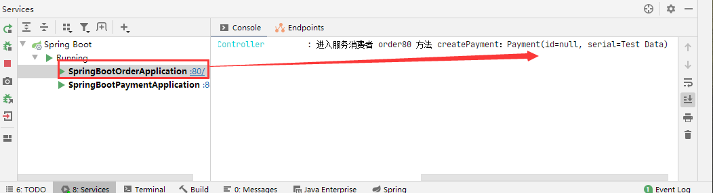


>   但是我们看服务提供者的后台日志发现 参数为了 null、数据库查看只看到了新数据的主键、serial 并没有值


**原来是我们的服务提供者的创建支付流水的接口没有加 @RequestBody 注解、导致数据接收异常**


我们改造这个方法、方法参数上加上这个注解

```java
public CommonResult createPayment(@RequestBody Payment payment)
```


重新测试发现成功


##### 6、所以不要忘记加 @RequestBody  注解


## 6、微服务的工程重构


### 1、为什么要重构？


重构说明：到此步骤、我们算是编写完了两个服务、一个服务提供者、和一个服务消费者，但是我们对比两个工程发现 entities 包 的实体类有臃余的地方，**我们将要对重复的地方进行重构，提取出来公共部分放在公开公用的地方**


### 2、新建Module名cloud-api-commons


>   该工程不但可以提取出来公共的地方、以后还可以存放公共的工具类、公共 api 接口、等等4


1、添加 maven 包依赖

```xml
<dependencies>
    <!--<dependency>
        <groupId>org.springframework.boot</groupId>
        <artifactId>spring-boot-devtools</artifactId>
        <scope>runtime</scope>
        <optional>true</optional>
    </dependency>-->

    <dependency>
        <groupId>org.projectlombok</groupId>
        <artifactId>lombok</artifactId>
        <optional>true</optional>
    </dependency>

    <!-- hutool 会提供日期的类的快捷转换等等 -->
    <dependency>
        <groupId>cn.hutool</groupId>
        <artifactId>hutool-all</artifactId>
        <version>5.1.0</version>
    </dependency>
</dependencies>
```


2、将 entities 包考到公共工程中、并删除其它两个服务的 entities 包以及代码


3、利用 maven 命令的 clean 和 install 打包发布公共本地库中供其它服务调用

然后将以下依赖粘贴到其它两个微服务项目

```xml
<!-- 引入自己定义的 api 通用包项目，可以使用 Payment 支付的 Entity -->
<dependency>
    <groupId>org.lee.springcloud</groupId>
    <artifactId>cloud-api-commons</artifactId>
    <version>${project.version}</version>
</dependency>
```


4、刷新 maven 进行测试功能是否正常


## 7、Eureka 的使用


### 1、什么是 Eureka？

Eureka 采用了 CS  的设计架构、Eureka Server 作为服务注册功能的服务器，它是服务注册中心，而系统中的其他微服务，使用 Eureka 的客户端连接到 Eureka Server 并维持心跳连接，这样系统的维护人员就可以通过 Eureka Server 来监控系统中的各个微服务是否正常运行。


在服务注册与发现中，有一个注册中心，当服务器启动的时候，会把当前服务器的信息比如服务器地址通讯等以别名方式注册到注册中心上，另一方（消费者|服务提供者）以该别名的方式去注册中心上获取到实际的服务通讯地址，然后在实现本地 RPC 调用 RPC 远程调用框架核心设计思想：在于注册中心，因为使用注册中心管理每个服务与服务之间的一个依赖关系（服务治理理念），任何RPC远程框架中，都会有一个注册中心（存放服务地址相关信息（接口地址））


Eureka 包含两个组件：


**Eureka Server：提供服务注册服务**

>   各个微服务节点通过配置启动后，会在 EurekaServer 中进行注册，这样 EurekaServer 中的服务注册表中将会存储所有可用服务节点的信息、服务节点的信息可以在界面中直观看到


**EurekaClient：通过注册中心进行访问**

>   是一个 Java 客户端，用户简化 Eureka Server 的交互，客户端同时也具备一个内置的，使用轮询（round-robin）负载算法的负载均衡器，在应用启动后，将会向 Eureka Server 发送心跳（默认周期为 30 秒）
>
>   如果 Eureka Server 在多个心跳周期内没有接收到某个节点的心跳，则将会从服务注册表中把这个服务节点移除（默认90秒）


### 2、Eureka 服务端的安装


#### 我们新建 Module名 cloud-eureka-server7001


1、导入 maven 依赖包

```xml
<dependencies>

    <!-- eureka 以前老版本、别再使用
    <dependency>
        <groupId>org.springframework.cloud</groupId>
        <artifactId>spring-cloud-starter-eureka</artifactId>
    </dependency>  -->
    
    <!-- eureka server-->
    <dependency>
        <groupId>org.springframework.cloud</groupId>
        <artifactId>spring-cloud-starter-netflix-eureka-server</artifactId>
    </dependency>

    <!--自定义api通用包-->
    <dependency>
        <groupId>org.lee.springcloud</groupId>
        <artifactId>cloud-api-commons</artifactId>
        <version>${project.version}</version>
    </dependency>

    <!--Sping boot web actuator-->
    <dependency>
        <groupId>org.springframework.boot</groupId>
        <artifactId>spring-boot-starter-web</artifactId>
    </dependency>

    <dependency>
        <groupId>org.springframework.boot</groupId>
        <artifactId>spring-boot-starter-actuator</artifactId>
    </dependency>

    <!--一般通用配置-->
    <!-- 热部署工具 -->
    <!--<dependency>
        <groupId>org.springframework.boot</groupId>
        <artifactId>spring-boot-devtools</artifactId>
        <scope>runtime</scope>
        <optional>true</optional>
    </dependency>-->

    <!-- lombok 插件-->
    <dependency>
        <groupId>org.projectlombok</groupId>
        <artifactId>lombok</artifactId>
        <optional>true</optional>
    </dependency>

    <dependency>
        <groupId>org.springframework.boot</groupId>
        <artifactId>spring-boot-starter-test</artifactId>
        <scope>test</scope>
    </dependency>
</dependencies>
```


2、编写 yaml 配置文件

```yaml
server:
  port: 7001

eureka:
  instance:
    # eureka 服务端的实例名称
    hostname: localhost

  client:
    # false 表示蹦年向注册中心注册自己
    register-with-eureka: false
    # false表示自己就是注册中心，我的职责就是维护服务实例,并不区检索服务
    fetch-registry: false
    service-url:
      # 设置与 eureka Server 交互的地址查询服务和注册服务都需要依赖这个地址
      defaultZone: http://${eureka.instance.hostname}:${server.port}/eureka/
```


3、编写主启动类

```java
package com.lee.springcloud;

import org.springframework.boot.SpringApplication;
import org.springframework.boot.autoconfigure.SpringBootApplication;
import org.springframework.cloud.netflix.eureka.server.EnableEurekaServer;

/**
 * @EnableEurekaServer
 *   代表我就是 Eureka 的服务注册中心
 */
@EnableEurekaServer
@SpringBootApplication
public class SpringBootEurekaApplication {
    public static void main(String[] args) {
        SpringApplication.run(SpringBootEurekaApplication.class, args);
    }
}
```


4、启动测试 7001 端口，出现以下界面

>   因为没有服务注册进来，界面当然显示 No application available


### 3、支付服务8001驻进 Eureka Server


>   我们根据以下步骤改造服务 cloud-provider-payment8001


1、新增如下 maven 包依赖

```xml
<!-- eureka client(客户端)-->
<dependency>
    <groupId>org.springframework.cloud</groupId>
    <artifactId>spring-cloud-starter-netflix-eureka-client</artifactId>
</dependency>
```


2、yml 配置文件新增如下配置

```yaml
# 配置 eureka
eureka:
  client:
    # 表示是否将自己注册到 EurekaServer服务、默认 true
    register-with-eureka: true
    # 是否从EurekaServer 抓取已有的注册信息、默认 true
    # 单节点无所谓，集群必须设置成 true 才能配合 ribbon 使用负载均衡
    fetch-registry: true
    service-url:
      defaultZone: http://localhost:7001/eureka
```


3、主启动类中添加注解 @EnableEurekaClient

```java
/**
 * 支付模块：主启动类
 */
@EnableEurekaClient
@SpringBootApplication
public class SpringBootPaymentApplication {
    public static void main(String[] args) {
        SpringApplication.run(SpringBootPaymentApplication.class, args);
    }
}
```


4、启动该服务 和 Eureka 服务，我们访问 Eureka 服务的主页可以看到界面有了支付服务的应用程序了


### 4、订单服务 80 驻进 Eureka Server


>   我们根据以下步骤改造服务 cloud-consumer-order80


1、新增导入以下 maven依赖

```xml
<!-- eureka client-->
<dependency>
    <groupId>org.springframework.cloud</groupId>
    <artifactId>spring-cloud-starter-netflix-eureka-client</artifactId>
</dependency>
```


2、新增 yml 如下配置

```yaml
# 配置微服务名称
spring:
  application:
    name: cloud-order-service

# 配置 eureka
eureka:
  client:
    # 表示是否将自己注册到 EurekaServer服务、默认 true
    register-with-eureka: true
    # 是否从EurekaServer 抓取已有的注册信息、默认 true
    # 单节点无所谓，集群必须设置成 true 才能配合 ribbon 使用负载均衡
    fetch-registry: true
    service-url:
      defaultZone: http://localhost:7001/eureka
```


3、主启动类中添加注解 @EnableEurekaClient

```java
package com.lee.springcloud;

import org.springframework.boot.SpringApplication;
import org.springframework.boot.autoconfigure.SpringBootApplication;
import org.springframework.cloud.netflix.eureka.EnableEurekaClient;

@EnableEurekaClient
@SpringBootApplication
public class SpringBootOrderApplication {
    public static void main(String[] args) {
        SpringApplication.run(SpringBootOrderApplication.class, args);
    }
}
```


4、开启两个服务和 Eureka 服务进行测试，可以看到 Eureka 首页出现了两个服务


## 8、Eureka 集群的使用


### 1、Eureka 集群原理


>   目前到这里单机版 Eureka 的服务注册与发现就已经完成了，我们还需要进行 Eureka 的集群部署、因为企业是不可能用单机版的注册中心的，如果单机版突然挂了，那么所有的服务都将不可访问，这样的结果是灾难性的


一句话总结：互相注册、相互守望


### 2、Eureka 集群环境构建


**1、建一个新的 Module 命名为 cloud-eureka-server7002**


**2、工程结构还有类属性都和 eureka 7001 差不多，以下不同的点**

-   修改 yml 配置文件端口为 7002


**3、找到 C:\Windows\System32\drivers\etc 目录下 hosts 文件**

>   修改hosts 文件增加以下内容


**4、我们需要修改两个项目的 yml 配置文件**

修改 cloud-eureka-server7001 的 defaultZone

```yaml
server:
  port: 7001

service-url:
  # 多个集群中间用逗号分隔
  defaultZone: http://eureka7002.com:7002/eureka/
```


修改 cloud-eureka-server7002 的 defaultZone

```yaml
server:
  port: 7002

service-url:
  # 这里就体现了相互注册、7002 的端口注册 7001
  defaultZone: http://eureka7001.com:7001/eureka/
```


**5、进行测试访问界面，看到 Eureka 互相有对方的信息就成功了**


7001 出现了 7002 的信息


7002 出现了 7001 的信息


### 3、订单服务支付服务两个微服务注册进Eureka集群


1、修改 7001 支付服务的 yml 配置文件

```yaml
service-url:
  # 单机版 defaultZone: http://localhsot:7001/eureka
  # 集群版
  defaultZone: http://eureka7001.com:7001/eureka,http://eureka7002.com:7002/eureka
```


2、修改 80 订单服务的 yml 配置文件

```yaml
service-url:
  # 单机版 defaultZone: http://localhsot:7001/eureka
  # 集群版
  defaultZone: http://eureka7001.com:7001/eureka,http://eureka7002.com:7002/eureka
```


3、启动测试

-   先启动 EurekaServer, 7001/7002集群服务
-   在启动服务提供者 provider 8001
-   最后启动消费者 80
-   进行接口测试


### 4、支付微服务集群配置

目前，我们的服务注册中心是集群配置的、已经配置了 7001、7002，但是这样还是不够，我们可以看到下图其实服务提供者支付服务也是集群配置的，所以我们还需要增加微服务集群的提供者


#### 1、新建 cloud-provider-payment8002 服务


1、后续步骤如下：

>   一句话：就是完全的 8001 服务的克隆体、以下只说明要改的地方

-   改正8002服务的 yml 端口号
-   改正 8002 Swagger 的描述信息
-   将 8001 服务的主启动类改成 SpringBootPayment8001
-   将 8002 服务的主启动类改成 SpringBootPayment8002
-   其它文件大体不变


改好后的工程目录对比


2、目前我们增加了两个 [服务提供者：支付服务8001、8002] 之后，这两个服务对外暴露的名字都是 yml 配置的如下名字

```yaml
# 配置微服务名称
spring:
  application:
    name: cloud-payment-service
```


思考：那么 [消费者服务：订单服务 80] 再去调用到底是调用 8001 还是 8002 呢？所以这里就引用出了负载均衡


>   那么我们继续改造我们的两个 服务提供者 8001、8002


3、我们先来改造支付服务8001的 PaymentController 控制器、增加以下代码

```java
//获取本服务的端口号
@Value("${server.port}")
private String serverPort;
```


然后把所有业务操作的时候加上端口号返回、如下

```java
@ApiOperation("创建一个支付流水")
@PostMapping(value = "/payment/createPayment")
public CommonResult createPayment(@RequestBody Payment payment){

    int createResult = paymentService.createPayment(payment);
    log.info("*******插入数据：" + payment + " 结果：" + createResult);

    if(createResult > 0){
        return new CommonResult(200, "插入数据成功, 端口号：" + serverPort, createResult);
    }else{
        return new CommonResult(444, "插入数据失败", null);
    }
}
```


**那么至此、8002 服务也同样添加以上的端口代码**


4、我们启动所有微服务进行测试


>   思考：我们对接口进行过 N 多次测试，发现每次都是走的 服务提供者 8001 端口，为什么？


**答：我们打开 [ 消费者服务：订单模块 80 ] 发现 OrderController 请求代码将端口号写死的**


5、那么我们就应该改造这个 OrderController 端口代码，端口微服务不能写死，我们把写死的地址改成我们微服务的名称


```java
/*单机版配置
public static final String PAYMENT_URL = "http://localhost:8001";*/
//集群的话端口号不能写死，应该写 Eureka 上的服务名称
public static final String PAYMENT_URL = "http://CLOUD-PAYMENT-SERVICE";
```


然后我们进行重启测试发现报错 

>   nested exception is java.net.UnknownHostException: CLOUD-PAYMENT-SERVICE"


6、我们还需要添加 @LoadBalanced 注解 开启负载均衡功能、我们改造 80 服务代码

```java
/**
 * 配置 RestTemplate
 */
@Configuration
public class ApplicationContextConfig {

    @Bean
    @LoadBalanced //开启 Eureka 负载均衡
    public RestTemplate getRestTemplate(){
        return new RestTemplate();
    }
}
```


**再次启动测试、我们可以发现 8001和8002 端口交替调用，负载均衡默认是轮询**

**总结：服务消费者 可以直接调用服务 而不用在关注地址和端口号，且服务还有负载均衡功能了**


## 9、Eureka 信息完善和服务发现


### 1、Actuator 微服务信息完善


在项目中服务多了我们通常需要修改服务为自定义的服务的名称，以及还需要知道这个服务是哪个 ip ，哪个服务，等等，我们需要配置 Eureka 完善这些信息


我们分别在 8001 服务和 8002服务添加 instance 属性的配置

```yaml
# 配置 eureka
eureka:
  client:
    # 表示是否将自己注册到 EurekaServer服务、默认 true
    register-with-eureka: true
    # 是否从EurekaServer 抓取已有的注册信息、默认 true
    # 单节点无所谓，集群必须设置成 true 才能配合 ribbon 使用负载均衡
    fetch-registry: true
    service-url:
      # 单机版 defaultZone: http://localhsot:7001/eureka
      # 集群版
      defaultZone: http://eureka7001.com:7001/eureka,http://eureka7002.com:7002/eureka
  instance:
    # 自定义我们的服务在 Eurake 界面的显示
    instance-id: cloud-payment8002
    # 设置悬停服务名称可以显示 ip 地址
    prefer-ip-address: true
```


重新启动所有服务进行测试、我们可以看到服务的 ip 和自定义名称了


### 2、服务发现 Discovery


我们对 服务提供者：支付服务 进行改造、来增加一个接口向外提供微服务的具体服务信息、端口路径等等的信息


1、我们改造 支付服务8001 的 PaymentController，增加以下接口和代码

```java
import org.springframework.cloud.client.discovery.DiscoveryClient;

@Resource
private DiscoveryClient discoveryClient;
```


```java
@GetMapping("/payment/discovery")
@ApiOperation("获取微服务的信息")
public CommonResult<DiscoveryClient> discovery(){

    //获取所有的微服务名称
    List<String> services = discoveryClient.getServices();
    services.forEach(s -> log.info("*********输出服务名称：" + s));

    //根据微服务名称获取该名称下的所有服务端口
    List<ServiceInstance> instances = discoveryClient.getInstances("CLOUD-PAYMENT-SERVICE");
    instances.forEach(i -> log.info("服务id：" + i.getServiceId() + " | 服务主机：" + i.getHost() + " | 服务端口：" + i.getPort() + " | 服务路径：" + i.getUri()));

    return new CommonResult(200, "查询微服务信息成功、访问端口：" + serverPort, discoveryClient);
}
```


2、在启动类上增加注解 @EnableDiscoveryClient 开启 Discovery

```java
/**
 * 支付模块：主启动类
 */
@EnableEurekaClient
@EnableDiscoveryClient
@SpringBootApplication
public class SpringBootPayment8001 {
    public static void main(String[] args) {
        SpringApplication.run(SpringBootPayment8001.class, args);
    }
}
```


3、支付服务 8002 同样按以上步骤进行改造，然后我们重新启动服务，进行测试


**思考：这样我们可以通过 getServices() 方法获取所有的服务名称，然后把获取的服务名称放入 getInstances() 方法就可以获取服务的详细的信息了**


## 10、Eureka 的自我保护


### 1、Eureka自我保护概述


保护模式主要用于一组客户端和 Eureka Server 之间存在网络分区场景下的保护、一旦进入保护模式

**Eureka Server 将会尝试保护其服务注册表中的信息，不再删除服务注册表中的数据，也就是不会注销任何微服务**


### 2、什么是自我保护机制？


默认情况下，当 Eureka Server 在一定时间内没有收到实例的心跳，便会把该实例从注册表中删除（默认是90秒），但是当网络分区故障发生（延时、卡顿、拥挤）时，微服务与 Eureka Server 之间无法正常通信，短时间内丢失大量的实例心跳，这时以上行为可能会变得非常危险了（因为微服务本身其实是健康的），**此时不应该注销这个微服务**，便会触发 eureka server 的自我保护机制来解决这个问题，当 Eureka Server 节点在短时间内丢失过多客户端心跳时，那么这个节点就会进入自我保护模式


>   或者在开发测试时，需要频繁地重启微服务实例，但是我们很少会把eureka server一起重启（因为在开发过程中不会修改eureka注册中心），当一分钟内收到的心跳数大量减少时，会触发该保护机制。可以在 eureka 管理界面看到 Renews threshold 和 Renews(last min)，当后者（最后一分钟收到的心跳数）小于前者（心跳阈值）的时候，触发保护机制，会出现红色的警告：


**EMERGENCY! EUREKA MAY BE INCORRECTLY CLAIMING INSTANCES ARE UP WHEN THEY'RE NOT. RENEWALS ARE LESSER THAN THRESHOLD AND HENCE THE INSTANCES ARE NOT BEING EXPIRED JUST TO BE SAFE.**


从警告中可以看到，eureka认为虽然收不到实例的心跳，但它认为实例还是健康的，eureka会保护这些实例，不会把它们从注册表中删掉


### 3、为什么会产生自我保护机制？


为防止 Eureka Client 可以正常运行，但是与 Eureka Server 网络不同的情况下，Eureka Server 不会立刻将 Eureka Client 服务剔除

它的设计哲学就是宁可保留错误的服务注册信息，也不盲目注销任何可能健康的服务实例，可以让 Eureka 集群更加的健壮、稳定


### 4、导致原因


>   属于 CAP里面的AP分支

一句话总结：某时刻某一个微服务不可用了，Eureka 不会立刻清理，依旧会对该微服务的信息进行保存


### 5、禁用 Eureka 的自我保护


如我我们在企业中，不想用这个自我保护机制，如果发现客户端丢失过多心跳，我们直接将这个服务从 Eureka 注册表移除掉（比较决绝），我们可以按照以下步骤操作


>   该机制默认是开启的


1、我们在 cloud-eureka-server7001 和 cloud-eureka-server7002 两个服务端注册中心修改 yml 配置文件

增加以下配置

```yaml
eureka:
  server:
    # 关闭自我保护机制,保证不可用服务被及时删除
    enable-self-preservation: false
    # 设置如果丢失客户端心跳2秒钟就删除
    eviction-interval-timer-in-ms: 2000
```


2、同样的我们在 payment8001 和 payment8002 两个服务的yml增加以下配置

```yaml
# 配置 eureka
eureka:
  instance:
    # Eureka 客户端向服务端发送心跳的时间间隔，单位为秒（默认30）
    lease-renewal-interval-in-seconds: 1
    # Eureka 服务端在收到最后一次心跳后等待时间上限，单位为秒（默认90）
    lease-expiration-duration-in-seconds: 2
```


3、然后我们启动测试、可以看到关闭保护机制 Eureka 主界面如下显示


4、并发现以下两个微服务


5、此时我们关闭 支付服务8001，然后刷新 Eureka 主界面看到该服务立刻没有了


### 6、Eureka 停更说明


Eureka github 地址：https://github.com/Netflix/eureka/wiki


## 11、Spring Cloud 整合 Zookeeper


### 1、我们新建一个服务

>   cloud-provider-payment8004


然后导入以下 maven 依赖文件

-   注意：先排除自带的 zookeeper 3.5.3
-   还要排除这个版本的 slf4j，不然日志冲突

```xml
<dependencies>
    <!-- 导入 Swagger 配置 -->
    <dependency>
        <groupId>io.springfox</groupId>
        <artifactId>springfox-swagger2</artifactId>
    </dependency>

    <dependency>
        <groupId>io.springfox</groupId>
        <artifactId>springfox-swagger-ui</artifactId>
    </dependency>

    <dependency>
        <groupId>org.lee.springcloud</groupId>
        <artifactId>cloud-api-commons</artifactId>
        <version>${project.version}</version>
    </dependency>

    <dependency>
        <groupId>org.springframework.boot</groupId>
        <artifactId>spring-boot-starter-web</artifactId>
    </dependency>

    <!--SpringBoot 整合 Zookeeper 客户端-->
    <dependency>
        <groupId>org.springframework.cloud</groupId>
        <artifactId>spring-cloud-starter-zookeeper-discovery</artifactId>
        <exclusions>
            <!--先排除自带的 zookeeper 3.5.3-->
            <exclusion>
                <groupId>org.apache.zookeeper</groupId>
                <artifactId>zookeeper</artifactId>
            </exclusion>
        </exclusions>
    </dependency>

    <!--添加 zookeeper 3.1.10 版本-->
    <dependency>
        <groupId>org.apache.zookeeper</groupId>
        <artifactId>zookeeper</artifactId>
        <version>3.4.10</version>

        <!--还要排除这个版本的 slf4j-->
        <exclusions>
            <exclusion>
                <groupId>org.slf4j</groupId>
                <artifactId>slf4j-log4j12</artifactId>
            </exclusion>
        </exclusions>
    </dependency>

    <dependency>
        <groupId>org.springframework.boot</groupId>
        <artifactId>spring-boot-starter-actuator</artifactId>
    </dependency>

<!--        <dependency>
        <groupId>org.springframework.boot</groupId>
        <artifactId>spring-boot-devtools</artifactId>
        <scope>runtime</scope>
        <optional>true</optional>
    </dependency>-->

    <dependency>
        <groupId>org.projectlombok</groupId>
        <artifactId>lombok</artifactId>
        <optional>true</optional>
    </dependency>

    <dependency>
        <groupId>org.springframework.boot</groupId>
        <artifactId>spring-boot-starter-test</artifactId>
        <scope>test</scope>
    </dependency>
</dependencies>
```


我们创建yml配置文件

```yaml
server:
  port: 8004

# 配置 zookeeper 注册中心
spring:
  application:
    name: cloud-provider-payment
  cloud:
    zookeeper:
      connect-string: 192.168.1.166:2181
```


编写启动类

```java
package com.lee.springcloud;

import org.springframework.boot.SpringApplication;
import org.springframework.boot.autoconfigure.SpringBootApplication;
import org.springframework.cloud.client.discovery.EnableDiscoveryClient;

@EnableDiscoveryClient
@SpringBootApplication
public class SpringBootPayment8004 {
    public static void main(String[] args) {
        SpringApplication.run(SpringBootPayment8004.class, args);
    }
}

```


编写 Controller 并集成 Swagger 进行测试

```java
package com.lee.springcloud.controller;

import org.springframework.beans.factory.annotation.Value;
import org.springframework.web.bind.annotation.GetMapping;
import org.springframework.web.bind.annotation.RestController;

import java.util.UUID;

@RestController
public class PaymentController {

    @Value("${server.port}")
    private String SERVER_PORT;

    @GetMapping("/payment/getPayment")
    public String getPaymentZK(){
        return "springcloud with zookeeper：" + SERVER_PORT + "\t" + UUID.randomUUID().toString();
    }
}
```


**启动报错：Connection timed out: no further information**

-   我们一定要确保关闭 Linux 防火墙
-   重启 zookeeper 服务
-   重启 payment8004 微服务进行测试


经历以上步骤我们进入 zookeeper 的服务端看到多了 services 节点、这就代表了 payment8004 已经注册进了 zookeeper 中心了


### 2、注册的服务信息临时还是持久？

>   临时的，让zookeeper服务端一段时间没有接受到客户端心跳，这个服务就会被直接干掉了
>
>   下次重启注册进来的流水号就是新的了，虽然还是之前的那个服务


### 3、订单服务注册进 zookeeper


1、我们新建一个Module 名 `cloud-consumerzk-order80`

2、改 pom 文件 

>   和 8004 的maven依赖一样，这里不再贴 maven 依赖包


3、我们创建 yml 配置文件

```yaml
server:
  port: 80

spring:
  application:
    name: cloud-consumer-order
  cloud:
    zookeeper:
      connect-string: 192.168.0.166:2181
```


4、编写主启动类

```java
package com.lee.springcloud;

import org.springframework.boot.SpringApplication;
import org.springframework.boot.autoconfigure.SpringBootApplication;
import org.springframework.cloud.client.discovery.EnableDiscoveryClient;

@EnableDiscoveryClient
@SpringBootApplication
public class SpringBootOrderZk80 {
    public static void main(String[] args) {
        SpringApplication.run(SpringBootOrderZk80.class, args);
    }
}
```


5、编写 config 包 增加 ApplicationContextConfig.java

```java
package com.lee.springcloud.config;

import org.springframework.cloud.client.loadbalancer.LoadBalanced;
import org.springframework.context.annotation.Bean;
import org.springframework.context.annotation.Configuration;
import org.springframework.web.client.RestTemplate;

@Configuration
public class ApplicationContextConfig {

    @Bean
    @LoadBalanced //开启负载均衡
    public RestTemplate getRestTemplate(){
        return new RestTemplate();
    }
}
```


6、编写 config 包下的 Swagger 类

>   此过程省略，跟之前一样

7、编写 controller 调用方法

```java
package com.lee.springcloud.controller;

import lombok.extern.slf4j.Slf4j;
import org.springframework.web.bind.annotation.GetMapping;
import org.springframework.web.bind.annotation.RestController;
import org.springframework.web.client.RestTemplate;

import javax.annotation.Resource;

@Slf4j
@RestController
public class OrderZKController {

    @Resource
    private RestTemplate restTemplate;

    public static final String INVOKE_URL = "http://cloud-provider-payment";

    /**
     * 调用 8004 服务的 /payment/getPayment 接口
     * @return
     */
    @GetMapping("/consumer/payment/zk")
    public String getPaymentZK(){
        return restTemplate.getForObject(INVOKE_URL + "/payment/getPayment", String.class);
    }
}
```


8、启动两个服务，进入 zookeeper 服务端查看，发现两个服务都进入了 services 节点、注册成功


我们去服务消费者 orderzk 80 调用服务提供者 payment8004 一样可以调通


## 12、Consul 的简介和使用


### 1、Consul是什么

Consul是一个服务网格（微服务间的 TCP/IP，负责服务之间的网络调用、限流、熔断和监控）解决方案，它是一个一个分布式的，高度可用的系统，而且开发使用都很简便。

Consul 提供了微服务系统中的服务发现、健康检查、键值存储、安全服务通信、多数据中心、服务治理、配置中心、控制总线等，这些功能中的每一个都可以根据需要单独使用，也可以一起使用构建全方位的服务网格，总之 Consul提供了一种完整的服务网格解决方案.


>   与其它分布式服务注册与发现的方案相比，Consul 的方案更“一站式”——内置了服务注册与发现框架、分布一致性协议实现、健康检查、Key/Value 存储、多数据中心方案，不再需要依赖其它工具。Consul 本身使用 go 语言开发，具有跨平台、运行高效等特点，也非常方便和 Docker 配合使用


优点：基于 raft 协议、比较简洁；支持健康检查，同时支持 HTTP 和 DNS 协议，支持跨数据中心的 WAN 集群，提供了图形界面，跨平台


### 2、Consul 的安装


官网安装说明：https://learn.hashicorp.com/consul/getting-started/install.html

推荐版本：Consul v1.6.1


安装 CentOS 的，官网有详细的教程说明，官网源教程如下


Install `yum-config-manager` to manage your repositories.

```shell-session
$ sudo yum install -y yum-utils
```


Use `yum-config-manager` to add the official HashiCorp Linux repository.

```shell-session
$ sudo yum-config-manager --add-repo https://rpm.releases.hashicorp.com/RHEL/hashicorp.repo
```


Install.

```shell-session
$ sudo yum -y install consul
```


**TIP:** Now that you have added the HashiCorp repository, you can install [Terraform](https://learn.hashicorp.com/tutorials/terraform/install-cli), [Vault](https://learn.hashicorp.com/tutorials/vault/getting-started-install), [Nomad](https://learn.hashicorp.com/tutorials/nomad/get-started-install) and [Packer](https://learn.hashicorp.com/tutorials/packer/get-started-install) with the same command.


**Verify the installation**

After installing Consul, verify that the installation worked by opening a new terminal session and running the command `consul`.

```shell-session
$ consul
```

```plaintext
usage: consul [--version] [--help]  []

Available commands are:
    agent          Runs a Consul agent
    event          Fire a new event

...
```


If you get an error that `consul` could not be found, your `PATH` environment variable was not set up properly. Make sure that your `PATH` variable contains the directory where you installed Consul.


Linux 下的常用命令:

**启动并指定外网访问权限**

```
./consul agent -dev -ui -node=consul-dev -client=0.0.0.0
```

**停止服务：**

```
Ctrl + C
```


### 3、服务提供者注册进 Consul


1、新建 Module 支付服务 

>   cloud-providerconsul-payment8006


2、导入以下 maven 依赖

```xml
<dependencies>
    <!-- SpringCloud consul-server -->
    <dependency>
        <groupId>org.springframework.cloud</groupId>
        <artifactId>spring-cloud-starter-consul-discovery</artifactId>
    </dependency>

    <!--SpringBoot整合 Web组件-->
    <dependency>
        <groupId>org.springframework.boot</groupId>
        <artifactId>spring-boot-starter-web</artifactId>
    </dependency>
    <dependency>
        <groupId>org.springframework.boot</groupId>
        <artifactId>spring-boot-starter-actuator</artifactId>
    </dependency>

    <!-- 导入 Swagger 配置 -->
    <dependency>
        <groupId>io.springfox</groupId>
        <artifactId>springfox-swagger2</artifactId>
    </dependency>
    <dependency>
        <groupId>io.springfox</groupId>
        <artifactId>springfox-swagger-ui</artifactId>
    </dependency>

    <!--<dependency>
        <groupId>org.springframework.boot</groupId>
        <artifactId>spring-boot-devtools</artifactId>
        <scope>runtime</scope>
        <optional>true</optional>
    </dependency>-->

    <dependency>
        <groupId>org.projectlombok</groupId>
        <artifactId>lombok</artifactId>
        <optional>true</optional>
    </dependency>

    <dependency>
        <groupId>org.springframework.boot</groupId>
        <artifactId>spring-boot-starter-test</artifactId>
        <scope>test</scope>
    </dependency>
</dependencies>
```


3、编写 consul 的 yml 配置

```yaml
# consul 服务端口号
server:
  port: 8006

spring:
  application:
    name: consul-provider-payment

# consul 注册中心配置
  cloud:
    consul:
      host: 192.168.0.166
      port: 8500
      discovery:
        service-name: ${spring.application.name}
        
        # 去掉 Consul 主界面小红叉
        heartbeat:
          enabled: true
```


4、编写主启动类

```java
package com.lee.springcloud;

import org.springframework.boot.SpringApplication;
import org.springframework.boot.autoconfigure.SpringBootApplication;
import org.springframework.cloud.client.discovery.EnableDiscoveryClient;

@EnableDiscoveryClient
@SpringBootApplication
public class SpringBootPaymentConsul8006 {
    public static void main(String[] args) {
        SpringApplication.run(SpringBootPaymentConsul8006.class, args);
    }
}
```


5、编写 config 包下的 Swagger 配置类

6、编写 Controller 包下的控制类

```java
package com.lee.springcloud.controller;

import lombok.extern.slf4j.Slf4j;
import org.springframework.beans.factory.annotation.Value;
import org.springframework.web.bind.annotation.GetMapping;
import org.springframework.web.bind.annotation.RestController;

import java.util.UUID;

@Slf4j
@RestController
public class PaymentController {

    @Value("${server.port}")
    private String serverPort;

    @GetMapping("/payment/consul")
    public String paymentConsul(){
        return "SpringCloud with Consul Port：" + serverPort + "\t" + UUID.randomUUID().toString();
    }
}
```


7、启动测试、我们访问 Consul 主界面看到 8006 服务


### 4、服务消费者注册进 Consul


1、新建一个服务消费者 Module

>   cloud-consumerconsul-order80


2、导入 maven 依赖

```xml
和上面的 payment8006 服务一样
```


3、编写 yml 配置文件

```yaml
server:
  port: 80

spring:
  application:
    name: cloud-consumer-order

  cloud:
    consul:
      host: 192.168.0.166
      port: 8500
      discovery:
        service-name: ${spring.application.name}
        # 去掉 Consul 主界面小红叉
        heartbeat:
          enabled: true
```


4、编写主启动类

5、编写 config 类下的 配置类和 Swagger 配置类

```java
package com.lee.springcloud.config;

import org.springframework.cloud.client.loadbalancer.LoadBalanced;
import org.springframework.context.annotation.Bean;
import org.springframework.context.annotation.Configuration;
import org.springframework.web.client.RestTemplate;

/**
 * 配置 RestTemplate
 */
@Configuration
public class ApplicationContextConfig {

    @Bean
    @LoadBalanced //负载均衡
    public RestTemplate getRestTemplate(){
        return new RestTemplate();
    }
}
```


6、编写 controller 控制类

```java
package com.lee.springcloud.controller;

import lombok.extern.slf4j.Slf4j;
import org.springframework.web.bind.annotation.GetMapping;
import org.springframework.web.bind.annotation.RestController;
import org.springframework.web.client.RestTemplate;

import javax.annotation.Resource;

@Slf4j
@RestController
public class OrderConsulController {

    @Resource
    private RestTemplate restTemplate;

    private static final String INVOKE_URL = "http://consul-provider-payment";

    @GetMapping("/consumer/payment/consul")
    public String getPaymentInfo(){
        return restTemplate.getForObject(INVOKE_URL + "/payment/consul", String.class);
    }
}
```


7、启动进行测试


Swagger界面 消费者 调用 服务者接口成功


### 5、Eureka、Zookeeper、Consul 三个注册中心的异同点

| 组件名    | 语言 | 健康检查 | 对外暴露接口 | CAP  | Spring Cloud 集成 |
| :-------- | :--- | :------- | :----------- | :--- | :---------------- |
| Eureka    | Java | 可配支持 | HTTP         | AP   | 集成              |
| Consul    | Go   | 支持     | HTTP/DFS     | CP   | 集成              |
| Zookeeper | java | 支持     | 客户端       | CP   | 集成              |


>   C：Consistency 强一致性
>
>   A：Availability 可用性
>
>   P：Partition tolerance 分区容错性
>
>   CAP理论关注粒度是数据，而不是整体系统设计的策略


最多只能同时较好的满足两个条件

CAP理论的核心是：一个分布式系统不可能同时满足很好的一致性，可用性和分区容错性这三个需求，因此 CAP原理将 NoSQL 数据库分成了满足 CA 原则，满足 CP原则和满足 AP 三大类

-   CA - 单点集群，满足一致性，可用性的系统，通常在扩展性上不太强大
-   CP - 满足一致性，分区容忍性的系统，通常性能不是特别高
-   AP - 满足可用性，分区容忍性的系统，通常可能对一致性要求低一点


举例

>   AP (Eureka)
>
>   CP (Zookeeper/Consul)


AP 架构解析：


>   比如点赞数、X 原来的值为 1，系统 A 修改最新值为 2，但是向系统A去同步数据到 系统 B 的时候同步失败，此时当客户端请求系统B的时候为了保证可以性，此时B系统还是返回的旧值 1
>
>   这个AP 理念 就是Eureka的应用，虽然服务掉线了，但是 Eureka 为了保证可用性，仍然保留服务的注册信息.
>
>   而 Zookeeper 和 Consul 为了保证数据一致性，一旦服务心跳丢失，服务信息直接就更新剔除了


## 13、Ribbon 简介和使用


### 1、Ribbon 简介

Spring Cloud Ribbon 是基于 Netflix Ribbon 实现的一套客户端负载均衡工具


简单的说，Ribbon 是 Netflix 发布的开源项目，**主要功能是提供客户端的软件负载均衡算法和服务调用**，Ribbon 客户端组件提供一系列完善的配置项如连接超时、重试等，简单来说，就是在配置文件中列出 Load Balancer （简称 LB）后面所有的机器，Ribbon 会自动的帮助你基于某种规则（如简单轮询、随机连接）去连接这些机器，我们很容易使用 Ribbon 实现自定义的负载均衡孙发


目前 Ribbon 官方 github 处于停更状态，但是由于 Ribbon 比较优秀，虽然Spring Cloud官方提供了 LoadBalancer  想替换 Ribbon，但是目前还做不到


### 2、LB (Load Balance) 负载均衡是什么

简单的说就是将用户的请求平摊的分配到多个服务上，从而达到系统 HA （高可用）的效果，常见的负载均衡有有软件 Nginx、LVS，硬件 F5 等


**Ribbon本地负载均衡客户端 VS Nginx 服务负载均衡区别**

>   集中式LB：Nginx 是服务器负载均衡、客户端所有请求都会交给 nginx，由nginx 实现转发请求、即负载均衡是由服务端实现的


>   进程内LB：Ribbon 本地负载均衡、在调用微服务接口的时候、会在注册中心获取注册信息服务列表之后缓存到 JVM 本地，从而在本地实现 RPC 远程服务调用技术


Ribbon 是在发送请求前通过算法选择服务器

Nginx 是在发送请求后拦截请求通过算法选择服务器


### 3、Ribbon的负载均衡和Rest调用


Ribbon 在工作时分为两步

-   先选择 EurekaServer，它优先选择在同一个区域内负载均衡较少的 Server
-   再根据用户指定的策略、在 Server 取到服务注册列表中选择一个地址，

其中 Ribbon 提供了多种策略、比如轮询、随机和根据相应时间加权


**Eureka 的包默认集成了 Ribbon 实现了负载均衡，不用单独在引用 Ribbon 的包了**

```xml
<!-- eureka client-->
<dependency>
    <groupId>org.springframework.cloud</groupId>
    <artifactId>spring-cloud-starter-netflix-eureka-client</artifactId>
</dependency>
```


### 4、二说 RestTemplate 的使用


#### 1、getForObject() / getForEntity() 方法的区别

>   我们之前都是使用 ForObject 方法

```java
@GetMapping("/consumer/payment/get/{id}")
public CommonResult<Payment> getPaymentById(@PathVariable("id") Long id){
    log.info("进入服务消费者 order80 方法 getPaymentById() 查询的 id => " + id);
    return restTemplate.getForObject(PAYMENT_URL + "/payment/get/" + id, CommonResult.class);
}
```

-   getForObject ：返回给前端的时候自动转化的对象，基本可以理解未 Json
-   getForEntity ：返回对象未 ResponseEntity对象，包含了响应中的一些重要的信息、比如响应头、响应状态码、响应体等


**我们在 cloud-consumer-order80 的 Controller 新增如下两个方法**

@GetMapping

```java
/**
 * 返回对象未 ResponseEntity对象，包含了响应中的一些重要的信息、比如响应头、响应状态码、响应体等
 * @param id
 * @return
 */
@GetMapping("/consumer/payment/getEntity/{id}")
public CommonResult<Payment> getPaymentEntityById(@PathVariable("id") Long id){
    ResponseEntity<CommonResult> resultEntity = restTemplate.getForEntity(PAYMENT_URL + "/payment/get/" + id, CommonResult.class);

    if(resultEntity.getStatusCode().is2xxSuccessful()){
        log.info("请求成功, 打印信息：" + resultEntity);
        return resultEntity.getBody();
    }else{
        return new CommonResult<>(444, "操作失败");
    }
}
```


@PostMapping

```java
@PostMapping("/consumer/payment/createPaymentEntity")
public CommonResult<Payment> createPaymentByEntity(Payment payment){

    ResponseEntity<CommonResult> commonResultResponseEntity = restTemplate.postForEntity(PAYMENT_URL + "/payment/createPayment", payment, CommonResult.class);

    if(commonResultResponseEntity.getStatusCode().is2xxSuccessful()){
        log.info("插入数据成功：" + commonResultResponseEntity);
        return commonResultResponseEntity.getBody();
    }else{
        return new CommonResult<>(444, "插入数据失败");
    }
}
```


### 5、Ribbon 负载均衡规则


Ribbon 默认实现了 7 中负载均衡规则


-   RoundRobinRule：轮询

-   RandomRule：随机

-   RetryRule：

    >   ```
    >   先按照 RoundRobinRule 的策略获取服务，如果获取服务失败则在指定的时间内重试，获取可用服务
    >   ```

-   WeightedResponseTimeRule：

    >   ```
    >   对 RoundRobinRule 的扩展，响应速度越快的实例选择权重越大、越容易被选择
    >   ```

-   BestAvailableRule：

    >   ```
    >   会过滤掉由于多次访问故障而处于断路器跳闸状态的服务，然后选择一个并发量小的服务
    >   ```

-   AvailabilityFilteringRule：

    >   ```
    >   先过滤掉故障实例、在选择并发较小的实例
    >   ```

-   ZoneAvoidanceRule：

    >   ```
    >   默认规则，复合判断 Server 所在区域的性能和 Server的可用性选择服务器
    >   ```


### 6、Ribbon 负载均衡的替换


注意：官方文档明确给出了警告、这个自定义配置类不能放在 @ComponentScan 所扫描的当前包以及子包下，否则我们定义的这个配置类就会被所有的 Ribbon 客户端所共享，达不到特殊化定制的目的了


而我们的 @SpringBootApplication 主启动类注解就带了这个注解


我们再看下工程目录、发现 springcloud 包下的所有包都被 @SpringBootApplication 扫描到了，如果我们要添加配置就要跳出 springcloud 包


1、我们编写 myrule 包，并添加 MySelfRule 类

```java
package com.lee.myrule;

import com.netflix.loadbalancer.IRule;
import com.netflix.loadbalancer.RandomRule;
import org.springframework.context.annotation.Bean;
import org.springframework.context.annotation.Configuration;

@Configuration
public class MySelfRule {

    @Bean
    public IRule myRule(){
        /**
         * 切换 Ribbon 负载均衡策略：
         *   改为随机模式
         */
        return new RandomRule();
    }
}
```


2、在启动类上增加配置

```java
@EnableEurekaClient
@SpringBootApplication
/**
 * 指定 Ribbon 负载均衡为自己定义的规则类
 */
@RibbonClient(name = "CLOUD-PAYMENT-SERVICE", configuration = MySelfRule.class)
public class SpringBootOrderEureka80 {
    public static void main(String[] args) {
        SpringApplication.run(SpringBootOrderEureka80.class, args);
    }
}
```


3、启动Eureka集群进行测试


### 7、Ribbon 负载均衡轮询算法原理


>   负载均衡算法：rest 接口第几次请求数 % 服务集群总数量 = 实际调用服务器位置下标
>
>   每次服务重启后 rest 接口计数从 1 开始


假如有三台集群、List 存储了服务器的信息，那么我们看如下信息

```java
List<Service> instances = discoveryClient.getInstances("CLOUD-PAYMENT-SERVICE");
```


>   ```
>   1 % 3 = 1 -> index = 1 list.get(index);
>   ```
>
>   ```
>   2 % 3 = 2 -> index = 1 list.get(index);
>   ```
>
>   ```
>   3 % 3 = 0 -> index = 1 list.get(index);
>   ```
>
>   ```
>   4 % 3 = 1 -> index = 1 list.get(index);
>   ```

简单透彻把

轮询核心源码：

CAS 自旋锁 方式获取下一个下标

```java
/**
 * Inspired by the implementation of {@link AtomicInteger#incrementAndGet()}.
 *
 * @param modulo The modulo to bound the value of the counter.
 * @return The next value.
 */
private int incrementAndGetModulo(int modulo) {
    for (;;) {
        int current = nextServerCyclicCounter.get();
        int next = (current + 1) % modulo;
        if (nextServerCyclicCounter.compareAndSet(current, next))
            return next;
    }
}
```


## 14、OpenFeign 简介和使用


### 1、OpenFeign 简介


#### 1、OpenFeign 是什么


Feign 是一个声明式 WebService 客户端，使用 Feign 能让编写 Web Service 客户端更加简单，它的使用方法是**定义一个服务接口然后在上面添加注解**, Feign 也支持可拔插式的编码器和解码器，Spring Cloud 对 Feign 进行了封装，使其支持了 Spring MVC 标准注解和 HttpMessageConverters、Feign 可以与 Eureka 和 Ribbon 组合使用以支持负载均衡


#### 2、Feign 能干什么

Feign 旨在编写 Java Http 客户端变得更容易

>   前面在使用 Ribbon + Restemplate 时，利用 RestTemplate 对 http 请求的封装处理，形成了一套模板化的调用方法，但是在实际开发中，由于对服务依赖的调用可能不止一处，**往往一个接口会被多处调用，所以通常会针对每个微服务自行封装一些客户端类来包装这些依赖服务的调用**


Feign 再次基础上做了进一步封装，由他来帮助我们定义和实现依赖服务接口的定义

在 Fegin 的实现下，**我们只需要创建一个接口并使用注解的方式来配置它（以前是 Dao 接口上面标注 Mapper 注解，现在是一个微服务接口上面标注一个 Feign 注解即可**）

即可完成对服务提供的接口绑定，简化了使用 Spring Cloud Ribbon 时，自动封装服务调用客户端的开发量


#### 3、Feign 集成了 Ribbon

利用 Ribbon 维护了 Payment 的服务列表信息，并且通过轮询实现了客户端的负载均衡，而与 Ribbon 不同的是、**通过 feign 只需要定义服务绑定接口且以声明式的方法**，优雅而简单的实现了服务调用


#### 4、Feign 和 OpenFeign的区别


### 2、OpenFeign 的服务调用


##### 1、我们创建新的 Module

>   名为：cloud-consumer-feign-order80


##### 2、引入 pom 文件依赖

```xml
<dependencies>
    <dependency>
        <groupId>org.springframework.cloud</groupId>
        <artifactId>spring-cloud-starter-openfeign</artifactId>
    </dependency>

    <!-- eureka client-->
    <dependency>
        <groupId>org.springframework.cloud</groupId>
        <artifactId>spring-cloud-starter-netflix-eureka-client</artifactId>
    </dependency>

    <!-- 引入自己定义的 api 通用包项目，可以使用 Payment 支付的 Entity -->
    <dependency>
        <groupId>org.lee.springcloud</groupId>
        <artifactId>cloud-api-commons</artifactId>
        <version>${project.version}</version>
    </dependency>

    <!--  web 和 actuator 是标配、必须要写  -->
    <dependency>
        <groupId>org.springframework.boot</groupId>
        <artifactId>spring-boot-starter-web</artifactId>
    </dependency>

    <dependency>
        <groupId>org.springframework.boot</groupId>
        <artifactId>spring-boot-starter-actuator</artifactId>
    </dependency>

    <!--<dependency>
        <groupId>org.springframework.boot</groupId>
        <artifactId>spring-boot-devtools</artifactId>
        <scope>runtime</scope>
        <optional>true</optional>
    </dependency>-->

    <dependency>
        <groupId>org.projectlombok</groupId>
        <artifactId>lombok</artifactId>
        <optional>true</optional>
    </dependency>

    <dependency>
        <groupId>org.springframework.boot</groupId>
        <artifactId>spring-boot-starter-test</artifactId>
    </dependency>

    <!-- 导入 Swagger 配置 -->
    <dependency>
        <groupId>io.springfox</groupId>
        <artifactId>springfox-swagger2</artifactId>
    </dependency>

    <dependency>
        <groupId>io.springfox</groupId>
        <artifactId>springfox-swagger-ui</artifactId>
    </dependency>
</dependencies>
```


##### 3、编写 yml 配置文件

```yaml
server:
  port: 80

# 配置 eureka
eureka:
  client:
    # 这次 就不把 feign 注册进微服务了，它是客户端
    register-with-eureka: false
    service-url:
      # 单机版 defaultZone: http://localhsot:7001/eureka
      # 集群版
      defaultZone: http://eureka7001.com:7001/eureka,http://eureka7002.com:7002/eureka
```


##### 4、编写启动类、增加 @EnableFeignClients 注解开启

```java
package com.lee.springcloud;

import org.springframework.boot.SpringApplication;
import org.springframework.boot.autoconfigure.SpringBootApplication;
import org.springframework.cloud.openfeign.EnableFeignClients;

/**
 * 开启 OpenFeign 的客户端功能
 */
@EnableFeignClients
@SpringBootApplication
public class SpringBootFeignOrder80 {

    public static void main(String[] args) {
        SpringApplication.run(SpringBootFeignOrder80.class, args);
    }
}
```


##### 5、编写 config 包下的SwaggerConfig 类


##### 6、编写 service 包并增加 PaymentFeignService 接口

>   注意 这里的服务消费者 cloud-consumer-feign-order80 的 service 接口定义和
>
>   服务提供者的 cloud-provider-payment8001的 controller 包下的接口方法定义相同

```java
package com.lee.springcloud.service;

import com.lee.springcloud.entities.CommonResult;
import com.lee.springcloud.entities.Payment;
import org.springframework.cloud.client.discovery.DiscoveryClient;
import org.springframework.cloud.openfeign.FeignClient;
import org.springframework.stereotype.Component;
import org.springframework.web.bind.annotation.GetMapping;
import org.springframework.web.bind.annotation.PathVariable;
import org.springframework.web.bind.annotation.PostMapping;
import org.springframework.web.bind.annotation.RequestBody;

@Component
/**
 * @FeignClient
 *   代表我们要从注册中心中调用哪个服务的定义方法
 */
@FeignClient(value = "CLOUD-PAYMENT-SERVICE")
public interface PaymentFeignService {

    /**
     * 这里的定义取自 pyament8001 服务的 Controller 里的接口定义
     * @param payment
     * @return
     */
    @PostMapping(value = "/payment/createPayment")
    CommonResult createPayment(@RequestBody Payment payment);

    @GetMapping(value = "/payment/get/{id}")
    CommonResult getPaymentById(@PathVariable("id") Long id);
}
```


##### 7、编写 Controller

```java
package com.lee.springcloud.controller;

import com.lee.springcloud.entities.CommonResult;
import com.lee.springcloud.entities.Payment;
import com.lee.springcloud.service.PaymentFeignService;
import lombok.extern.slf4j.Slf4j;
import org.springframework.cloud.client.discovery.DiscoveryClient;
import org.springframework.web.bind.annotation.*;

import javax.annotation.Resource;

@Slf4j
@RestController
public class OrderFeignController {

    /**
     * 使用了 OpenFeign Controller 层的调用轻松多了
     */
    @Resource
    private PaymentFeignService paymentFeignService;

    @PostMapping("/consumer/payment/createPayment")
    public CommonResult<Payment> createPayment(@RequestBody Payment payment){
        return paymentFeignService.createPayment(payment);
    }

    @GetMapping("/consumer/payment/get/{id}")
    public CommonResult<Payment> getPaymentById(@PathVariable("id") Long id){
        return paymentFeignService.getPaymentById(id);
    }
}

```


##### 8、进行测试、


### 3、OpenFeign 超时控制


#### 1、OpenFeign 超时简介


OpenFeign 默认等待接口方法 1 秒钟，超过之后就会报错，但是我们可以在 YML 文件里开启 OpenFeign 客户端超时控制，由于 OpenFeign 底层整合了 Ribbon 、超时控制还是由 Ribbon 来做的


#### 2、超时情况演示


1、我们在 payment8001 和 payment8002 服务提供者端的Controller分别添加一个超时接口

```java
@ApiOperation("OpenFeign超时测试")
@GetMapping("/payment/timeout")
public String TestOpenFeignTimeOut(){
    try {
        Thread.sleep(3000);
    } catch (InterruptedException e) {
        e.printStackTrace();
    }
    return serverPort;
}
```


2、我们在 cloud-consumer-feign-order80 消费端的 PaymentFeignService 编写 OpenFeign 调用的接口

```java
@GetMapping("/payment/timeout")
String testOpenFeignTimeOut();
```


3、启动集群服务进行测试、我们可以发现报错超时


4、我们可以设置Feign客户端超时时间

>   我们在 cloud-consumer-feign-order80 的 yml 配置文件增加以下配置

```yaml
# 设置 feign 客户端超时时间
ribbon:
  # 指的是建立连接所用的时间，适用于网络状况正常，两端连接所用的时间
  ReadTimeout: 5000
  # 指的是建立连接后从服务器读取到可用资源所用的时间
  ConnectTimeout: 5000
```

虽然 ribbon 的属性没有提示，但是配上还是可以生效的，应该是 Oepnfeign 新版本移除了对 ribbon 的集成


进行测试：


### 4、OpenFeign日志增强


Feign提供了日志打印功能、我们可以通过配置来调整日志级别，从而了解 Feign 中 Http 请求的细节，说白了**就是对 Feign 接口的调用情况进行监控和输出**


#### 1、OpenFeign 的日志级别

-   NONE：默认的、不显示任何日志
-   BASIC：仅记录请求方法、URL、响应状态码以及执行时间
-   HEADERS：除了 BASIC 中定义的信息之外、还有请求和响应头信息
-   FULL：除了HEADERS 中定义的信息之外、还有请求和响应的正文以及元数据


#### 2、配置日志级别

1、在 cloud-consumer-feign-order80 服务编写 config 包增加日志配置类

```java
package com.lee.springcloud.config;

import feign.Logger;
import org.springframework.context.annotation.Bean;
import org.springframework.context.annotation.Configuration;

@Configuration
public class FeignConfig {
    @Bean
    Logger.Level feignLoggerLevel(){
        return Logger.Level.FULL;
    }
}
```


2、yml文件里需要开启日志的Feign 客户端

```yaml
logging:
  level:
    # feign 日志以什么级别监控哪个接口
    com.lee.springcloud.service.PaymentFeignService: debug
```


3、启动服务进行测试日志输出


## 15、Hystrix 简介


### 1、微服务面临什么问题？


在分布式环境中，许多服务依赖项中的一些必然会失败、复杂的分布式体系结构中的应用程序有数十个依赖，每个依赖关系在某些时候不可避免地失败


**服务雪崩**

多个微服务之间调用的时候，假设微服务 A 调用微服务 B 和微服务 C，微服务B和微服务C又调用其它的微服务，这就是所谓的 **“扇出”**。如果扇出的链路上某个微服务的调用响应时间过长或者不可用，对微服务A的调用就会占用越来越多的系统资源，进而引起系统崩溃，所谓的 **“雪崩效应”**


对于高流量的应用来说，单一的后端依赖可能会导致所有的服务器上的所有资源都在几秒钟内饱和，比失败更糟糕的是，这些应用程序还可能导致服务之间的延迟增加，备份队列，线程和其他系统资源紧张，导致整个系统发生更多的级联故障，这些都表示需要对故障和延迟进行隔离和管理、以便单个依赖关系的失败，不能取消整个应用程序或系统


所以

通常当你发现一个模块下的某个实例失败后、这个模块依然还会接收流量，然后这个有问题的模块还调用了其他的模块，这样就会发生级联故障、或者叫雪崩


### 2、Hystrix 是什么


Hystrix 是一个用于处理分布式系统的延迟和容错的开源库，在分布式系统里，许多依赖不可避免的会调用失败，比如超时，异常等，Hystrix 能够保证在一个依赖出问题的情况下，**不会导致整体服务失败，避免级联故障，以提高分布式系统的弹性**


“断路器”本身是一种开关装置，当某个服务器单元发生故障之后、通过断路器的故障监控（类似熔断保险丝），向调用方返回一个符合预期的、可处理的备选响应（FallBack），而不是长时间的等待或者抛出调用方无法处理的异常，这样就保证了服务调用方的线程不会被长时间、不必要地占用，从而避免了故障在分布式系统中的蔓延、乃至雪崩


### 3、Hystrix 停更进维

官网：https://github.com/Netflix/Hystrix/wiki


## 16、Hystrix 初识降级、熔断、限流


### 1、服务降级：fallback


如果服务器忙，不让客户端等待并立刻返回一个友好提示，ballback


**哪些情况会发生服务降级？**

-   程序运行异常
-   超时
-   服务熔断出发服务降级
-   线程池/信号量打满也会导致服务降级


### 2、服务熔断：break

>   类比保险丝达到最大服务访问后，直接拒绝访问，拉闸限电，然后调用服务降级的方法并返回友好提示
>
>   服务降级 -> 进而熔断 -> 恢复调用链路


熔断机制是应对雪崩效应的一种微服务链路保护机制

我们在各种场景下都会接触到熔断这两个字：

-   高压电路中如果某个地方的电压过高，熔断器就会熔断，对电路进行保护。
-   股票交易中，如果股票指数过高，也会采用熔断机制，暂停股票的交易。
-   同样，在微服务架构中，熔断机制也是起着类似的作用。当扇出链路的某个微服务不可用或者响应时间太长时，会进行服务的降级，进而熔断该节点微服务的调用，快速返回错误的响应信息。**当检测到该节点微服务调用响应正常后，恢复调用链路**


##### 我们这样通俗的理解：

>   1.  调用失败触发降级、而降级会调用 fallback 方法
>   2.  无论如何降级，流程一定会先调用正常方法在调用 fallback方法
>   3.  如果单位时间内调用失败次数过多，也就是服务降级的次数过多，则触发熔断
>   4.  熔断以后就会跳过正常方法直接调用 fallback方法
>   5.  所谓 “熔断后服务不可用” 就是因为跳过了正常方法直接执行 fallback 方法


### 3、服务限流：flowlimit

>   秒杀高并发等操作，严禁一窝蜂的过来拥挤、大家排队，一秒钟 N 个进行响应，有序进行，避免服务器负载过高

在开发高并发系统时有三把利器用来保护系统：缓存、降级和限流。缓存的目的是提升系统访问速度和增大系统能处理的容量，可谓是抗高并发流量的银弹；而降级是当服务出问题或者影响到核心流程的性能则需要暂时屏蔽掉，待高峰或者问题解决后再打开；而有些场景并不能用缓存和降级来解决，比如稀缺资源（秒杀、抢购）、写服务（如评论、下单）、频繁的复杂查询（评论的最后几页），因此需有一种手段来限制这些场景的并发/请求量，即限流。

限流的目的是通过对并发访问/请求进行限速或者一个时间窗口内的的请求进行限速来保护系统，一旦达到限制速率则可以拒绝服务（定向到错误页或告知资源没有了）、排队或等待（比如秒杀、评论、下单）、降级（返回兜底数据或默认数据，如商品详情页库存默认有货）


#### 1、常见的限流算法：

-   漏桶(Leaky Bucket)：

>   算法思路很简单,水(请求)先进入到漏桶里,漏桶以一定的速度出水(接口有响应速率),当水流入速度过大会直接溢出(访问频率超过接口响应速率),然后就拒绝请求,可以看出漏桶算法能强行限制数据的传输速率.示意图如下:


令牌桶算法(Token Bucket)：

>   和 Leaky Bucket 效果一样但方向相反的算法,更加容易理解.随着时间流逝,系统会按恒定1/QPS时间间隔(如果QPS=100,则间隔是10ms)往桶里加入Token(想象和漏洞漏水相反,有个水龙头在不断的加水),如果桶已经满了就不再加了.新请求来临时,会各自拿走一个Token,如果没有Token可拿了就阻塞或者拒绝服务


令牌桶的另外一个好处是可以方便的改变速度. 一旦需要提高速率,则按需提高放入桶中的令牌的速率. 一般会定时(比如100毫秒)往桶中增加一定数量的令牌, 有些变种算法则实时的计算应该增加的令牌的数量.


## 17、Hystrix 服务降级处理


### 1、Hystrix 支付服务构建


1、新建一个服务

>   名为：cloud-provider-hystrix-payment8001


2、增加 maven 依赖

```xml
<dependencies>
    <!-- hystrix -->
    <dependency>
        <groupId>org.springframework.cloud</groupId>
        <artifactId>spring-cloud-starter-netflix-hystrix</artifactId>
    </dependency>

    <!-- eureka client-->
    <dependency>
        <groupId>org.springframework.cloud</groupId>
        <artifactId>spring-cloud-starter-netflix-eureka-client</artifactId>
    </dependency>

    <!-- 引入自己定义的 api 通用包项目，可以使用 Payment 支付的 Entity -->
    <dependency>
        <groupId>org.lee.springcloud</groupId>
        <artifactId>cloud-api-commons</artifactId>
        <version>${project.version}</version>
    </dependency>

    <!--spring boot 2.2.2 web 启动器-->
    <dependency>
        <groupId>org.springframework.boot</groupId>
        <artifactId>spring-boot-starter-web</artifactId>
    </dependency>

    <!--图形化监控展现-几乎和starter-web绑定在一块使用 -->
    <dependency>
        <groupId>org.springframework.boot</groupId>
        <artifactId>spring-boot-starter-actuator</artifactId>
    </dependency>

    <!-- 热部署工具 -->
    <!--<dependency>
        <groupId>org.springframework.boot</groupId>
        <artifactId>spring-boot-devtools</artifactId>
        <scope>runtime</scope>
        <optional>true</optional>
    </dependency>-->

    <!-- lombok 插件-->
    <dependency>
        <groupId>org.projectlombok</groupId>
        <artifactId>lombok</artifactId>
        <optional>true</optional>
    </dependency>

    <dependency>
        <groupId>org.springframework.boot</groupId>
        <artifactId>spring-boot-starter-test</artifactId>
        <scope>test</scope>
    </dependency>
    <!-- 导入 Swagger 配置 -->
    <dependency>
        <groupId>io.springfox</groupId>
        <artifactId>springfox-swagger2</artifactId>
    </dependency>

    <dependency>
        <groupId>io.springfox</groupId>
        <artifactId>springfox-swagger-ui</artifactId>
    </dependency>
</dependencies>
```


3、编写 yml 配置文件

```yaml
server:
  port: 8001

spring:
  application:
    name: cloud-provider-hystrix-payment

eureka:
  client:
    # 表示是否将自己注册到 EurekaServer服务、默认 true
    register-with-eureka: true
    # 是否从EurekaServer 抓取已有的注册信息、默认 true
    # 单节点无所谓，集群必须设置成 true 才能配合 ribbon 使用负载均衡
    fetch-registry: true
    service-url:
      defaultZone: http://eureka7001.com:7001/eureka,http://eureka7002.com:7002/eureka
```


4、编写主启动类

```java
package com.lee.springcloud;

import org.springframework.boot.SpringApplication;
import org.springframework.boot.autoconfigure.SpringBootApplication;
import org.springframework.cloud.client.discovery.EnableDiscoveryClient;
import org.springframework.cloud.netflix.eureka.EnableEurekaClient;

@EnableEurekaClient
@EnableDiscoveryClient
@SpringBootApplication
public class SpringBootPaymentHystrix8001 {
    public static void main(String[] args) {
        SpringApplication.run(SpringBootPaymentHystrix8001.class, args);
    }
}
```


5、编写 Server 和 impl 业务类

```java
package com.lee.springcloud.service;

public interface PaymentService {

    String getPaymentThreadInfo_OK(Integer id);

    String getPayment_Timeout(Integer id);
}
```

```java
package com.lee.springcloud.service.impl;

import com.lee.springcloud.service.PaymentService;
import org.springframework.stereotype.Service;

@Service
public class PaymentServiceImpl implements PaymentService {

    /**
     * 正常访问、方法
     * @param id
     * @return
     */
    @Override
    public String getPaymentThreadInfo_OK(Integer id) {
        return "线程池：" + Thread.currentThread().getName() + "  getPaymentThreadInfo_OK, id " + id + "\t" + " Test";
    }

    /**
     * 延时超时方法
     * @param id
     * @return
     */
    @Override
    public String getPayment_Timeout(Integer id) {
        try {
            Thread.sleep(3000);
        } catch (InterruptedException e) {
            e.printStackTrace();
        }
        return "线程池：" + Thread.currentThread().getName() + "  getPayment_Timeout, id " + id + "\t 耗时：3 秒钟";
    }
}
```


6、启动测试


### 2、JMeter高并发压测


#### 1、我们新建一个线程组：


#### 2、在线程组上新建一个 HTTP请求


#### 3、如下设置：


>   启动压测并单独用浏览器访问会发现payment/ok方法响应明显变慢
>
>   上面的还是服务提供者 8001 自测，假如此时外部的消费者 80 也来访问，那消费者只能干等，最终导致消费者80不满意，服务端8001直接被拖死


### 3、订单微服务调用支付服务出现卡顿


#### 1、新建一个 消费者服务 80

>   名为：cloud-consumer-feign-hystrix-order80


#### 2、导入 maven 依赖

```xml
<dependencies>
    <!--openfeign-->
    <dependency>
        <groupId>org.springframework.cloud</groupId>
        <artifactId>spring-cloud-starter-openfeign</artifactId>
    </dependency>
    <!-- hystrix -->
    <dependency>
        <groupId>org.springframework.cloud</groupId>
        <artifactId>spring-cloud-starter-netflix-hystrix</artifactId>
    </dependency>

    <!-- eureka client-->
    <dependency>
        <groupId>org.springframework.cloud</groupId>
        <artifactId>spring-cloud-starter-netflix-eureka-client</artifactId>
    </dependency>

    <!-- 引入自己定义的 api 通用包项目，可以使用 Payment 支付的 Entity -->
    <dependency>
        <groupId>org.lee.springcloud</groupId>
        <artifactId>cloud-api-commons</artifactId>
        <version>${project.version}</version>
    </dependency>

    <!--spring boot 2.2.2 web 启动器-->
    <dependency>
        <groupId>org.springframework.boot</groupId>
        <artifactId>spring-boot-starter-web</artifactId>
    </dependency>

    <!--图形化监控展现-几乎和starter-web绑定在一块使用 -->
    <dependency>
        <groupId>org.springframework.boot</groupId>
        <artifactId>spring-boot-starter-actuator</artifactId>
    </dependency>

    <!-- 热部署工具 -->
    <!--<dependency>
        <groupId>org.springframework.boot</groupId>
        <artifactId>spring-boot-devtools</artifactId>
        <scope>runtime</scope>
        <optional>true</optional>
    </dependency>-->

    <!-- lombok 插件-->
    <dependency>
        <groupId>org.projectlombok</groupId>
        <artifactId>lombok</artifactId>
        <optional>true</optional>
    </dependency>

    <dependency>
        <groupId>org.springframework.boot</groupId>
        <artifactId>spring-boot-starter-test</artifactId>
        <scope>test</scope>
    </dependency>
    <!-- 导入 Swagger 配置 -->
    <dependency>
        <groupId>io.springfox</groupId>
        <artifactId>springfox-swagger2</artifactId>
    </dependency>

    <dependency>
        <groupId>io.springfox</groupId>
        <artifactId>springfox-swagger-ui</artifactId>
    </dependency>
</dependencies>
```


#### 3、编写yml 配置

```yaml
server:
  port: 80

spring:
  application:
    name: cloud-consumer-order

eureka:
  client:
    # 表示是否将自己注册到 EurekaServer服务、默认 true
    register-with-eureka: true
    # 是否从EurekaServer 抓取已有的注册信息、默认 true
    # 单节点无所谓，集群必须设置成 true 才能配合 ribbon 使用负载均衡
    fetch-registry: true
    service-url:
      defaultZone: http://eureka7001.com:7001/eureka,http://eureka7002.com:7002/eureka

# 设置 feign 客户端超时时间
ribbon:
  # 指的是建立连接所用的时间，适用于网络状况正常，两端连接所用的时间
  ReadTimeout: 5000
  # 指的是建立连接后从服务器读取到可用资源所用的时间
  ConnectTimeout: 5000
```


#### 4、增加主启动类

```java
package com.lee.springcloud;

import org.springframework.boot.SpringApplication;
import org.springframework.boot.autoconfigure.SpringBootApplication;
import org.springframework.cloud.openfeign.EnableFeignClients;

/**
 * 开启 OpenFeign
 */
@EnableFeignClients
@SpringBootApplication
public class SpringBootOrderHystrix80 {
    public static void main(String[] args) {
        SpringApplication.run(SpringBootOrderHystrix80.class, args);
    }
}
```


#### 5、编写业务类

1、增加 service 

```java
package com.lee.springcloud.service;

import org.springframework.cloud.openfeign.FeignClient;
import org.springframework.stereotype.Component;
import org.springframework.web.bind.annotation.GetMapping;
import org.springframework.web.bind.annotation.PathVariable;

@Component
/**
 * 指定到哪个微服务，下面定义那个微服务 Controller 里的接口
 */
@FeignClient("CLOUD-PROVIDER-HYSTRIX-PAYMENT")
public interface PaymentHystrixService {

    @GetMapping("/hystrix/payment/ok/{id}")
    String getPaymentThreadInfoOK(@PathVariable("id") Integer id);

    @GetMapping("/hystrix/payment/timeout/{id}")
    String getPaymentTimeout(@PathVariable("id") Integer id);
}
```

2、增加 controller

```java
package com.lee.springcloud.controller;

import com.lee.springcloud.service.PaymentHystrixService;
import lombok.extern.slf4j.Slf4j;
import org.springframework.web.bind.annotation.GetMapping;
import org.springframework.web.bind.annotation.PathVariable;
import org.springframework.web.bind.annotation.RestController;

import javax.annotation.Resource;

@Slf4j
@RestController
public class OrderHystrixController {

    @Resource
    private PaymentHystrixService paymentHystrixService;

    @GetMapping("/hystrix/order/ok/{id}")
    public String getPaymentThreadInfoOK(@PathVariable("id") Integer id) {
        return paymentHystrixService.getPaymentThreadInfoOK(id);
    }

    @GetMapping("/hystrix/order/timeout/{id}")
    public String getPaymentTimeout(@PathVariable("id") Integer id){
        return paymentHystrixService.getPaymentTimeout(id);
    }
}
```

3、记得增加 swagger的配置


#### 6、正常测试


#### 7、高并发测试

>   8001 同一层次的其它接口服务被困死，因为 tomcat 线程池里面的工作线程已经被挤占完毕。80 此时调用 8001，客户端访问响应缓慢、转圈圈加载延迟


### 4、Hystrix 服务提供者支付侧降级 fallback


#### 1、服务降级容错解决的维度要求


服务消费者 80：

-   要么转圈圈加载等待：超时不再等待
-   要么消费者超时报错：出错要有兜底 (default)


对方服务 8001 超时了，调用者 80 不能一直卡死等待、必须有服务降级

对方服务 8001 down机了，调用者 80 不能一直卡死等待，必须有服务降级

对方服务 8001 OK，调用者 80 自己出故障或有自我要求（自己的等待时间小于服务提供者），自己处理降级


#### 2、服务提供者：支付服务 fallback


1、我们先改造服务提供者 8001 的可能会超时的 timeout 方法

>   cloud-provider-hystrix-payment8001


2、我们改造 8001 的 server 的实现方法 PaymentServiceImpl 改造代码

>   @HystrixCommand 注解：报异常后就会自动调用 fallbackMethod 指定的方法

```java
@Override
/**
 * @HystrixCommand
 *   服务降级注解：
 *   fallbackMethod：设置当方法超时3000毫秒后调用的别的兜底方法
 *   commandProperties：设置超时时间为3000毫秒，也就是这个时间内响应都是正常的业务逻辑
 */
@HystrixCommand(fallbackMethod = "getPayment_TimeoutHandler", commandProperties = {
        @HystrixProperty(name = "execution.isolation.thread.timeoutInMilliseconds", value = "3000")
})
public String getPayment_Timeout(Integer id) {
    try {
        Thread.sleep(4000);
    } catch (InterruptedException e) {
        e.printStackTrace();
    }
    return "线程池：" + Thread.currentThread().getName() + "  getPayment_Timeout, id " + id + "\t 耗时：3 秒钟  哈哈O(∩_∩)O";
}
```


增加兜底解决方法

```java
/**
 * getPayment_Timeout 的兜底方法
 */
public String getPayment_TimeoutHandler(Integer id){
    return "线程池：" + Thread.currentThread().getName() + "  系统繁忙、请稍后再试, id " + id + "\t 耗时：3 秒钟  难受≧ ﹏ ≦";
}
```


3、我们还需要在主启动类上添加注解

>   @EnableCircuitBreaker

```java
/**
 * 服务维度：后面会讲
 */
@EnableCircuitBreaker
@EnableEurekaClient
@EnableDiscoveryClient
@SpringBootApplication
public class SpringBootPaymentHystrix8001 {
    public static void main(String[] args) {
        SpringApplication.run(SpringBootPaymentHystrix8001.class, args);
    }
}
```


4、启动服务进行测试、不管是在 服务提供者8001自测、还是通过服务消费者80测试，发现返回的是兜底的方法

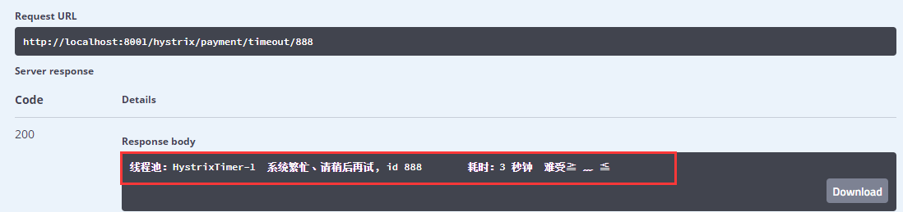


### 5、Hystrix 服务消费者订单侧降级 fallback


1、我们在 服务提供者 支付服务 8001 已经做了服务降级 fallback，其实我们的服务消费者 订单侧 80 也可以做服务降级 ，Hystrix 既可以放在服务端也可以放在消费端，**但是我们一般做服务降级是在客户端**


2、增加 服务消费端 80 的yml 配置

```yaml
# 服务消费者需要开启 hystrix，使用服务降级
feign:
  hystrix:
    enabled: true
```


3、在 消费端 80 的 Controller 增加同样的注解，并改造成如下方法

```java
@GetMapping("/hystrix/order/timeout/{id}")
@HystrixCommand(fallbackMethod = "getPaymentTimeoutFallbackMethod", commandProperties = {
        @HystrixProperty(name = "execution.isolation.thread.timeoutInMilliseconds", value = "1500")
})
public String getPaymentTimeout(@PathVariable("id") Integer id){
    return paymentHystrixService.getPaymentTimeout(id);
}
```


```java
public String getPaymentTimeoutFallbackMethod(@PathVariable("id") Integer id){
    return "服务消费者80：对方支付系统繁忙，请 10 秒钟后再试，或者自己运行出错请检查自己、难受(┬┬﹏┬┬)";
}
```


4、在启动类上增加注解 @EnableHystrix

```java
/**
 * 开启 OpenFeign
 */
@EnableFeignClients
/**
 * 开启 hystrix
 */
@EnableHystrix
@SpringBootApplication
public class SpringBootOrderHystrix80 {
    public static void main(String[] args) {
        SpringApplication.run(SpringBootOrderHystrix80.class, args);
    }
}
```


5、进行测试


### 6、Hystrix 全局服务降级 DefaultProperties


1、我们来思考个问题、如果我们每个方法都需要有个备用方法来告诉客户端，如果方法过多有什么问题？太多的备用方法会导致代码臃肿不堪，难以维护，此时我们就可以配置全局的服务降级策略：DefaultProperties


@DefaultProperties(defaultFallback = "")

-   每个方法配置一个服务降级方法，技术上可以，实际上很臃肿不堪
-   除了个别重要的核心业务有专属的兜底方法，其他的普通方法可以通过该注解统一跳转到统一的处理方法


**我们开始改造我们的服务消费者：订单服务 80**

>   cloud-consumer-feign-hystrix-order80


2、在 Controller 类头上增加注解 @DefaultProperties 指定调用的默认方法

```java
@Slf4j
@RestController
@DefaultProperties(defaultFallback = "payment_Global_FallbackMethod")
public class OrderHystrixController
```


3、我们编写服务降级全局通用方法

```java
/**
 * 全局服务降级处理方法
 * @return
 */
public String payment_Global_FallbackMethod(){
    return "Global(全局) 异常处理信息，请稍后再试、≧ ﹏ ≦";
}
```


4、我们编写一个新的 Controller  超时方法

>   需要走默认服务降级方法的还需要增加注解 @HystrixCommand，有明确指定降级的方法的就走指定的，没有指定加上@HystrixCommand 走默认的，什么都没加就是没有服务降级预备方案

```java
/**
 * @HystrixCommand：走默认的服务降级的方法
 */
@HystrixCommand
@GetMapping("/hystrix/order/timeoutDefault/{id}")
public String getPaymentTimeoutDefault(@PathVariable("id") Integer id){
    return paymentHystrixService.getPaymentTimeout(id);
}
```


5、我们运行服务开始测试，发现走了全局方法


### 7、Hystrix 通配服务降级 FeignFallBack


思考：如何避免代码和业务逻辑混在一块呢？我们发现其实服务消费者：订单服务 80 做的服务降级都是根据以下服务 CLOUD-PROVIDER-HYSTRIX-PAYMENT 做的备选方案，处理问题抓准源头

```java
@Component
/**
 * 指定到哪个微服务，下面定义那个微服务 Controller 里的接口
 */
@FeignClient("CLOUD-PROVIDER-HYSTRIX-PAYMENT")
public interface PaymentHystrixService {

    @GetMapping("/hystrix/payment/ok/{id}")
    String getPaymentThreadInfoOK(@PathVariable("id") Integer id);

    @GetMapping("/hystrix/payment/timeout/{id}")
    String getPaymentTimeout(@PathVariable("id") Integer id);
}
```


下面我们就要针对 PaymentHystrixService 的接口方法进行改造，使 Controller 层的代码解耦


**服务降级、客户端（消费端）去调用服务端，碰上服务端宕机或关闭**

本次案例服务降级处理是在 消费端 80 实现完成的，与服务端 8001 没有关系，只需要为 Feign 客户端定义的接口添加一个服务降级处理的实现类即可实现解耦


1、我们根据 cloud-consumer-feign-hystrix-order80 已有的 PaymentHystrixService 接口，重新建一个类 (PaymentFallbackService) 实现该接口，统一为接口里面的方法进行异常处理


2、PaymentFallbackService 实现 PaymentFeignClientService 接口

```java
package com.lee.springcloud.service;

import org.springframework.stereotype.Component;

/**
 * PaymentHystrixService 的解耦服务降级实现类
 */
@Component
public class PaymentFallbackService implements PaymentHystrixService{

    @Override
    public String getPaymentThreadInfoOK(Integer id) {
        return "------ 服务降级的实现类(PaymentFallbackService) fall back getPaymentThreadInfoOK, ≧ ﹏ ≦ ------";
    }

    @Override
    public String getPaymentTimeout(Integer id) {
        return "------ 服务降级的实现类(PaymentFallbackService) fall back getPaymentTimeout, ≧ ﹏ ≦ ------";
    }
}
```


3、在PaymentHystrixService 增加 fallback = PaymentFallbackService.class

```java
@Component
/**
 * @FeignClient
 * value：指定到哪个微服务，下面定义那个微服务 Controller 里的接口
 * fallback：指定该服务的所有兜底的方法的实现类是哪个（服务降级）
 */
@FeignClient(value = "CLOUD-PROVIDER-HYSTRIX-PAYMENT", fallback = PaymentFallbackService.class)
public interface PaymentHystrixService {

    @GetMapping("/hystrix/payment/ok/{id}")
    String getPaymentThreadInfoOK(@PathVariable("id") Integer id);

    @GetMapping("/hystrix/payment/timeout/{id}")
    String getPaymentTimeout(@PathVariable("id") Integer id);
}
```


4、增加 yml 配置

```yaml
feign: 
  hystrix: 
    # 在 Feign 中开启 Hystrix
    enabled: true
```


5、启动测试，**然后我们故意关闭 8001 服务提供者服务，模拟宕机**

然后我们调用 /hystrix/order/ok/{id} 方法，此方法没有在 controller 配置任何服务降级的指定方法

```java
@GetMapping("/hystrix/order/ok/{id}")
public String getPaymentThreadInfoOK(@PathVariable("id") Integer id)
```


然后我们调用发现确实进了实现类 PaymentFallbackService 的兜底方法


## 18、Hystrix 服务熔断处理


### 1、我们在原有的 8001 支付服务改造

>   cloud-provider-hystrix-payment8001


### 2、我们新增一个 Service 接口

```java
String paymentCircuitBreaker(Integer id);
```


### 3、我们在 PaymentServiceImpl 类增加以下代码

>   **关键参数**：
>
>   circuitBreaker.enabled：是否开启短路器
>
>   circuitBreaker.requestVolumeThreshold：请求次数
>
>   circuitBreaker.sleepWindowInMilliseconds：跳闸后休眠多久(毫秒) 期间慢慢的恢复调用链路
>
>   circuitBreaker.errorThresholdPercentage：失败率达到百分之多少后跳闸

```java
//-----------------------------服务熔断------------------------------------------------------------------------------------

@Override
@HystrixCommand(fallbackMethod = "paymentCircuitBreak_fallback", commandProperties = {
        @HystrixProperty(name = "circuitBreaker.enabled", value = "true"),  //是否开启短路器
        @HystrixProperty(name = "circuitBreaker.requestVolumeThreshold", value = "10"), //请求次数
        @HystrixProperty(name = "circuitBreaker.sleepWindowInMilliseconds", value = "5000"), // 跳闸后休眠多久(毫秒) 期间慢慢的恢复调用链路
        @HystrixProperty(name = "circuitBreaker.errorThresholdPercentage", value = "60")  //失败率达到百分之多少后跳闸
})
public String paymentCircuitBreaker(Integer id) {

    if(id < 0){
        throw new RuntimeException("**********id 不能为负数**********");
    }

    String serialNumber = IdUtil.simpleUUID();
    return Thread.currentThread().getName() + "\t" + "调用成功、流水号：" + serialNumber;
}

/**
 * 服务降级、熔断后调用的方法
 */
public String paymentCircuitBreak_fallback(Integer id){
    return "id 不能为负数、请稍后再试，/(ㄒoㄒ)/~~、您传入的id " + id ;
}
```


### 4、启动服务进行测试


1、我们先传入负数进行不断的刷新测试，触发服务的熔断机制


2、然后我们传入正确的参数、输入正数 1，发现熔断休眠期内依然访问不了正常逻辑


### 5、Hystrix 服务熔断总结


#### 1、涉及到断路器的三个重要参数：

>   ```
>   circuitBreaker.sleepWindowInMilliseconds
>   ```

-   快照时间窗：断路器确定是否打开，需要统计一些请求和错误数据，而统计的时间范围就是快照时间窗，默认为最近10秒

>   ```
>   circuitBreaker.requestVolumeThreshold
>   ```

-   请求总数阀值：在快照时间窗内，必须满足请求总数阈值才有资格熔断，默认为20，意味着在10秒内，如果该 hsytrix 命令的调用次数不足20次，即使所有的请求超时或者失败，断路器都不会打开

>   ```
>   circuitBreaker.errorThresholdPercentage
>   ```

-   错误百分比阈值：当请求总数在快照时间内超过了阈值，比如发生了30次调用，其中15次超时，也就是超过50%(默认阈值)的错误百分比，这时候就会将断路器打开


#### 2、断路器开启关闭的条件

-   当满足一定的阈值的时候（默认10秒超过20个请求次数）
-   当失败率达到一定的时候（默认10秒内超过50%的请求失败）
-   到达以上阈值，断路器将会开启
-   开启的时候，所有的请求都不会进行转发
-   一段时间后（默认5秒），这个时候断路器是半开状态，会让其中一个请求进行转发，如果成功，断路器将会关闭，若失败，继续开启，重复4、5步骤


#### 3、断路器打开之后

将不会调用主逻辑，而是直接调用 fallback 降级逻辑，通过断路器，实现了自动地发现错误并将降级逻辑切换为主逻辑，减少延迟的效果


#### 4、原来的主逻辑如何恢复？

hystrix 为我们实现了自动恢复功能

当断路器打开，对主逻辑进行熔断之后。hystrix会启用一个休眠时间窗，在这个窗口期内，降级逻辑是临时成为主逻辑。当休眠时间窗到期，断路器将进入半开状态，释放一次请求到原来的主逻辑上，如果请求成功，断路器则闭合，主逻辑恢复。当然，如果失败，断路器依然进入打开状态，休眠时间窗重新计时


## 19、Hystrix 工作流程总结


### 1、Hystrix 工作流程图


**流程说明**

1.  每次调用创建一个新的HystrixCommand,把依赖调用封装在run()方法中.
2.  执行execute()/queue做同步或异步调用.
3.  当前调用是否已被缓存，是则直接返回结果，否则进入步骤 4
4.  判断熔断器(circuit-breaker)是否打开,如果打开跳到步骤 8,进行降级策略,如果关闭进入步骤 5
5.  判断线程池/队列/信号量是否跑满，如果跑满进入降级步骤8,否则继续后续步骤 6
6.  调用HystrixCommand的run方法.运行依赖逻辑

-   6.1. 调用是否出现异常，否：继续，是进入步骤8，
-   6.2. 调用是否超时，否：返回调用结果，是进入步骤8

   7.搜集5、6步骤所有的运行状态(成功, 失败, 拒绝,超时)上报给熔断器，用于统计从而判断熔断器状态

   8.getFallback()降级逻辑.四种触发getFallback调用情况（图中步骤8的箭头来源）：返回执行成功结果


### 2、两种资源隔离模式


#### 线程池隔离模式

使用一个线程池来存储当前的请求，线程池对请求作处理，设置任务返回处理超时时间，堆积的请求堆积入线程池队列。这种方式需要为每个依赖的服务申请线程池，有一定的资源消耗，好处是可以应对突发流量（流量洪峰来临时，处理不完可将数据存储到线程池队里慢慢处理）。


#### 信号量隔离模式

使用一个原子计数器（或信号量）来记录当前有多少个线程在运行，请求来先判断计数器的数值，若超过设置的最大线程个数则丢弃改类型的新请求，若不超过则执行计数操作请求来计数器+1，请求返回计数器-1。这种方式是严格的控制线程且立即返回模式，无法应对突发流量（流量洪峰来临时，处理的线程超过数量，其他的请求会直接返回，不继续去请求依赖的服务）


## 20、Hystrix 图形化 Dashboard 搭建


### 1、Hystrix 图形化界面简介

除了隔离依赖服务的调用以外，Hystrix 还提供了 **准实时的调用监控（Hystrix Dashboard）**，Hystrix 会持续地记录所有通过 Hystrix 发起的请求的执行信息，并以统计报表和图形的形式展现给用户，包括每秒执行多少请求多少成功，多少失败等，Netflix 通过 hystrix-metrics-event-stream 项目实现了对以上指标的监控。Spring Cloud 也提供了 Hystrix Dashboard 的整合，对监控内容转化成可视化界面


### 2、搭建 Hystrix 的Module


1、新建 Module，名为：

>   cloud-consumer-hystrix-dashboard9001


2、导入 maven 依赖

```xml
<dependencies>
    <!-- hystrix dashboard 仪表盘监控 -->
    <dependency>
        <groupId>org.springframework.cloud</groupId>
        <artifactId>spring-cloud-starter-netflix-hystrix-dashboard</artifactId>
    </dependency>

    <!-- 引入自己定义的 api 通用包项目，可以使用 Payment 支付的 Entity -->
    <dependency>
        <groupId>org.lee.springcloud</groupId>
        <artifactId>cloud-api-commons</artifactId>
        <version>${project.version}</version>
    </dependency>

    <!--spring boot 2.2.2 web 启动器-->
    <dependency>
        <groupId>org.springframework.boot</groupId>
        <artifactId>spring-boot-starter-web</artifactId>
    </dependency>

    <!--图形化监控展现-几乎和starter-web绑定在一块使用 -->
    <dependency>
        <groupId>org.springframework.boot</groupId>
        <artifactId>spring-boot-starter-actuator</artifactId>
    </dependency>

    <!-- 热部署工具 -->
    <!--<dependency>
        <groupId>org.springframework.boot</groupId>
        <artifactId>spring-boot-devtools</artifactId>
        <scope>runtime</scope>
        <optional>true</optional>
    </dependency>-->

    <!-- lombok 插件-->
    <dependency>
        <groupId>org.projectlombok</groupId>
        <artifactId>lombok</artifactId>
        <optional>true</optional>
    </dependency>

    <dependency>
        <groupId>org.springframework.boot</groupId>
        <artifactId>spring-boot-starter-test</artifactId>
        <scope>test</scope>
    </dependency>
</dependencies>
```


3、编写yaml

```yaml
server:
  port: 9001
```


4、增加主启动类新增注解

>   @EnableHystrixDashboard

```java
package com.lee.springcloud;

import org.springframework.boot.SpringApplication;
import org.springframework.boot.autoconfigure.SpringBootApplication;
import org.springframework.cloud.netflix.hystrix.dashboard.EnableHystrixDashboard;

@SpringBootApplication
/**
 * 开启 hystrix dashboard 图形化监控
 */
@EnableHystrixDashboard
public class SpringBootHystrixDashboard9001 {
    public static void main(String[] args) {
        SpringApplication.run(SpringBootHystrixDashboard9001.class, args);
    }
}
```


5、所有的 Provider 微服务提供者 (8001/8002/8003) 都需要添加监控依赖配置

>   添加的maven依赖如下

```xml
<!--spring boot 2.2.2 web 启动器-->
<dependency>
    <groupId>org.springframework.boot</groupId>
    <artifactId>spring-boot-starter-web</artifactId>
</dependency>
<!--图形化监控展现-几乎和starter-web绑定在一块使用 -->
<dependency>
    <groupId>org.springframework.boot</groupId>
    <artifactId>spring-boot-starter-actuator</artifactId>
</dependency>
```


注：之前新建的项目大部分都导入了这个依赖


6、启动进行测试

>   访问地址：http://localhost:9001/hystrix
>
>   如果能看到如下界面，代表配置成功


### 3、Hystrix 图形化 Dashboard 监控实战


##### 1、我们将所有需要监控的服务提供者接口添加如下依赖

>   已经添加的无需添加

```xml
<!--spring boot 2.2.2 web 启动器-->
<dependency>
    <groupId>org.springframework.boot</groupId>
    <artifactId>spring-boot-starter-web</artifactId>
</dependency>
<!--图形化监控展现-几乎和starter-web绑定在一块使用 -->
<dependency>
    <groupId>org.springframework.boot</groupId>
    <artifactId>spring-boot-starter-actuator</artifactId>
</dependency>
```


##### 2、我们需要在主启动类上增加一个额外方法

>   ServletRegistrationBean()
>
>   并且要添加 @EnableCircuitBreaker 注解

```java
/**
 * 服务维度：后面会讲
 */
@EnableCircuitBreaker
@EnableEurekaClient
@EnableDiscoveryClient
@SpringBootApplication
public class SpringBootPaymentHystrix8001 {
    public static void main(String[] args) {
        SpringApplication.run(SpringBootPaymentHystrix8001.class, args);
    }

    /**
     * 此配置是为了服务器监控而配置，与服务器容错本身无关，SpringCloud 升级后的坑
     * ServletRegistrationBean 因为 SpringBoot 的默认路径不是 "/hystrix.stream"
     * 只要在自己的项目配置下面的 servlet就可以了
     * @return
     */
    @Bean
    public ServletRegistrationBean getServlet(){
        HystrixMetricsStreamServlet streamServlet = new HystrixMetricsStreamServlet();
        ServletRegistrationBean registrationBean = new ServletRegistrationBean(streamServlet);
        registrationBean.setLoadOnStartup(1);
        registrationBean.addUrlMappings("/hystrix.stream");
        registrationBean.setName("HystrixMetricsStreamServlet");
        return registrationBean;
    }
}
```


##### 3、我们启动 9001 监控端、7001和7002 Eureka 注册中心、和 8001 服务提供端


##### 4、我们向 9001 监控端添加以下信息

>   9001监控端：访问地址：http://localhost:9001/hystrix
>
>   http://localhost:8001/hystrix.stream
>
>   Delay：2000
>
>   Title：T3


##### 5、我们就可以看到监控界面了


实现园：共有两种含义，它通过颜色变化代表了实例的健康程度，绿色 < 黄色 < 橙色 < 红色 递减,

该实心圆除了颜色变化之外，它的大小也会根据实例请求流量发生变化，流量越大园越大。所以，通过该监控界面就可以在大量实例中快速发现**故障实例和高压力实例**


整图说明：


## 21、GateWay 简介


### 1、什么是 GateWay？

Spring Cloud Gateway 是在 Spring 生态系统之上构建的 API 网关服务，基于 Spring 5、SpringBoot2.x 和 Project Reactor 等技术，GateWay 旨在提供一种简单而有效的方式来对 API 进行路由，以及提供一些强大的过滤器功能，如：熔断、限流、重试等


>   Spring Cloud 全家桶中有个重要的组件就是网关，在 1.x 版本中都是采用了 Zuul 网关；但是在 2.x 版本中，zuul 的升级一直跳票，Spring Cloud 最后自己研发了一个网关代替 Zuul，Gateway 是 zuul 1.x 版的替代品


Spring Cloud Gateway 是基于 WebFlux 框架实现的，而 WebFlux框架底层则使用了高性能的 Reactor 模式的 Netty，Gateway的目标是提供统一的路由方式且基于 Filter 链的方式提供了网关基本的功能：安全、监控/指标，限流


### 2、为什么选择 GateWay ?


Zuul1.0 已经进入维护阶段、而且 Gateway 是 SpringCloud 团队研发的，而且很多功能 Zuul 都没有用起来也非常的简单便捷


Gateway 是基于 **异步非阻塞模型上** 进行开发的，性能方面不需要担心，虽然 Netflix 早就发布了最新的 Zuul 2.x，但是Spring Cloud 貌似没有整合计划，而且 Netflix 相关的组件都宣布进入维护期，前景未知


多方面综合考虑 Gateway 是理想的网关选择


### 3、GateWay 的特性

1.  **基于 Spring Framework 5，Project Reactor 和 Spring Boot 2.0 进行构建**
2.  **动态路由**，能够匹配任何请求属性
3.  可以对路由指定 Predicate（断言）和 Filter（过滤器）
4.  集成 Hystrix 的断路器功能
5.  集成 Spring Cloud 服务发现功能
6.  易于编写的 Predicate（断言）和 Filter（过滤器）
7.  请求限流功能
8.  支持路径重写


### 4、Gate Way 和 Zuul 的区别


在 Spring Cloud Finchley 正式版之前，Spring Cloud 推荐的网关是 Netflix 提供的 Zuul；


>   Zuul 1.x 是一个基于阻塞 I/O 的 API Gateway


>   Zuul 1.x **基于 Servlet 2.5 使用阻塞架构** 它不支持任何长连接（如 Web Socket ）的设计模式和 Nginx 较像。每次 I/O 操作都是从工作线程中选择一个执行，请求线程被阻塞到工作线程完成，但是差别是 Nginx 用 C++ 实现，Zuul 用 Java 实现，而 JVM本身会有第一次加载较慢的情况，使得 Zuul 的性能相对较差


>   Zuul 2.x 理念更先进，想基于 Netty 非阻塞和支持长连接，但是Spring Cloud 目前还没有整合，Zuul 2.x 的性能较 Zuul 1.x 有较大提升，在性能方面，根据官方提供的测试基准，Gate Way 的 RPS（每秒请求数）是 Zuul 的 1.6 倍


>   Gate way 建立在 Spring Framework 5，Project Reactor 和 Spring Boot 2 之上，使用非阻塞API


>   Gate way 还支持 Web Socket、并且与 Spring 紧密集成拥有更好的开发体验


### 5、Zuul 1.x 的模型


Spring Cloud 中所集成的 Zuul 1.x 版本，采用的是 tomcat 容器，使用的是传统的 Servlet IO处理器，而 servlet 的生命周期由 servlet container 进行管理

container 启动时构建 servlet 对象并调用 servlet.init() 方法进行初始化

container 运行时接收请求，并为每个请求分配一个线程（一般从线程池中获取空闲线程），然后调用 service()

container 关闭时调用 servlet destory() 销毁 servlet

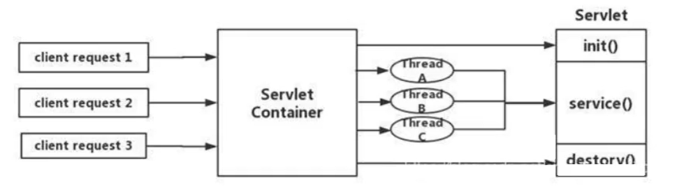

**上述模式的缺点：**

servlet 是一个简单的网络 IO 模型，当请求进入 servlet container 时， servlet container 就会为其绑定一个线程，**在并发量不高的场景下**这种模型是适用的，但是一旦高并发 ( 比如抽风用 jemeter压测 )，线程数量就会上涨，而线程资源代价是昂贵的（上下文切换，内存消耗大）严重影响请求的处理时间，在一些简单的业务场景下，不希望为每个 request 分配一个线程，只需要1 个或者几个线程就能应对极大的并发请求，这种业务场景下 servlet 模型没有优势


所以 zuul 1.x 是 基于servlet 之上的一个阻塞处理模型，即 spring 实现了处理所有请求的一个 servlet（DispatcherServlet）并由该 servlet 阻塞式处理，所以 zuul 无法摆脱 servlet 模型的弊端


### 6、什么是 web flux

传统的Web框架，比如说: Struts 2，Spring mvc 等都是基于Servlet API与 Servlet 容器基础之上运行的。

但是在 Servlet 3.1 之后有了异步非阻塞的支持。而 Web Flux 是一个典型非阻塞异步的框架，它的核心是基于 Reactor 的相关 API 实现的。相对于传统的 web 框架来说，它可以运行在诸如Netty, Undertow 及支持 Servlet3.1 的容器上。非阻塞式 + 函数式编程（Spring 5 必须让你使用 Java 8)

Spring Web Flux 是 Spring 5.0 引入的新的响应式框架，区别于Spring MVC，它不需要依赖Servlet API，它是完全异步非阻塞的，并且基于Reactor来实现响应式流规范。


### 7、GateWay的工作流程


要牢记 Gateway 的三大核心概念


**1、Route（路由）**

>   路由是构建网关的基本模块，它由 ID、目标 URI、一些列的断言和过滤器组成，如果断言为 true 则匹配该路由

就是根据某些规则,将请求发送到指定服务上


**2、Predicate（断言）**

>   参考 Java 8 的 java.util.function.Predicate
>
>   开发人员可以匹配 HTTP 请求中所有的内容 ( 例如请求头或请求参数 )，如果请求与断言相匹配则进行路由


**3、Filter（过滤）**

>   指的是 Spring 框架中 GatewayFilter 的实例，使用过滤器，可以在请求被路由前后对请求修改


**总结：**

web请求，通过一些匹配条件，定位到真正的服务节点。并在这个转发过程的前后，进行一些精细化控制。predicate 就是我们的匹配条件;

而filter，就可以理解为一个无所不能的拦截器。有了这两个元素，再加上目标uri，就可以实现一个具体的路由了


客户端向Spring Cloud Gateway 发出请求。然后在Gateway Handler Mapping 中找到与请求相匹配的路由，将其发送到GatewayWeb Handler

Handler再通过指定的过滤器链来将请求发送到我们实际的服务执行业务逻辑，然后返回。

过滤器之间用虚线分开是因为过滤器可能会在发送代理请求之前(“pre”）或之后（“post”)执行业务逻辑。

Filter在“pre”类型的过滤器可以做参数校验、权限校验、流量监控、日志输出、协议转换等，

在“post”类型的过滤器中可以做响应内容、响应头的修改，日志的输出，流量监控等有着非常重要的作用。


## 22、GateWay 实战配置


### 1、GateWay 9527 的搭建


##### 1、我们创建一个新的工程

>   名为：cloud-gateway-gateway9527


##### 2、导入 maven 依赖

>   添加 spring-cloud-starter-gateway 依赖
>
>   gateway 作为网关同样要注册进 Eureka
>
>   **注意：gateway 不需要引入 starter-web 和 starter-actuator 这两个Web依赖包**

```xml
<dependencies>
    <!-- 引入 gateway 网关 -->
    <dependency>
        <groupId>org.springframework.cloud</groupId>
        <artifactId>spring-cloud-starter-gateway</artifactId>
    </dependency>

    <!-- eureka client-->
    <dependency>
        <groupId>org.springframework.cloud</groupId>
        <artifactId>spring-cloud-starter-netflix-eureka-client</artifactId>
    </dependency>

    <!-- 引入自己定义的 api 通用包项目，可以使用 Payment 支付的 Entity -->
    <dependency>
        <groupId>org.lee.springcloud</groupId>
        <artifactId>cloud-api-commons</artifactId>
        <version>${project.version}</version>
    </dependency>

    <!-- lombok 插件-->
    <dependency>
        <groupId>org.projectlombok</groupId>
        <artifactId>lombok</artifactId>
        <optional>true</optional>
    </dependency>

    <dependency>
        <groupId>org.springframework.boot</groupId>
        <artifactId>spring-boot-starter-test</artifactId>
        <scope>test</scope>
    </dependency>
</dependencies>
```


##### 3、编写主启动类

>   @EnableEurekaClient
>
>   @SpringBootApplication

```java
package com.lee.springcloud;

import org.springframework.boot.SpringApplication;
import org.springframework.boot.autoconfigure.SpringBootApplication;
import org.springframework.cloud.netflix.eureka.EnableEurekaClient;

@EnableEurekaClient
@SpringBootApplication
public class SpringBootGateway9527 {
    public static void main(String[] args) {
        SpringApplication.run(SpringBootGateway9527.class, args);
    }
}
```


##### 4、9527网关配置路由映射

>   我们在 cloud-provider-payment8001 看看 controller 的访问地址：http://localhost:8001/
>
>   我们目前不想暴露 8001 端口，希望在 8001 外面套一层 9527


那么我们需要在 gateway9527 的 yml 配置如下：

```yaml
server:
  port: 9527

spring:
  application:
    name: cloud-gateway
    
  # 配置 gateway 相关
  cloud:
    gateway:
      routes:
        - id: payment_routh               # 路由的ID、没有固定规则但要求唯一，建议配合服务名
          uri: http://localhost:8001      # 匹配后提供服务的路由地址
          predicates:
            - Path=/payment/get/**        # 断言，路径相匹配的进行路由

        - id: payment_routh2              # 路由的ID、没有固定规则但要求唯一，建议配合服务名
          uri: http://localhost:8001      # 匹配后提供服务的路由地址
          predicates:
            - Path=/payment/discovery/**  # 断言，路径相匹配的进行路由

eureka:
  instance:
    hostname: cloud-gateway-service
  client:
    # 表示是否将自己注册到 EurekaServer服务、默认 true
    register-with-eureka: true
    # 是否从EurekaServer 抓取已有的注册信息、默认 true
    # 单节点无所谓，集群必须设置成 true 才能配合 ribbon 使用负载均衡
    fetch-registry: true
    service-url:
      # 单机版 defaultZone: http://localhsot:7001/eureka
      # 集群版
      defaultZone: http://eureka7001.com:7001/eureka,http://eureka7002.com:7002/eureka
```


具体映射路径：


##### 5、启动 Eureka、网关和服务提供者进行测试


我们发现服务网关也注册进了 Eureka 


查询一个流水号地址

以前的访问地址：http://localhost:8001/payment/get/10

配置网关后地址：http://localhost:9527/payment/get/10


### 2、Gateway配置路由的两种方式


**Gateway 的配置有两种方法：**

-   1、在配置文件 yml 中（见上面配置）
-   2、代码中注入 RouteLocator 的 Bean


#### 代码中注入 RouteLocator实现网关配置


1、我们在 9527 工程中新建 config 包

>   添加一个类 GatewayConfig.java


```java
package com.lee.springcloud.config;

import org.springframework.cloud.gateway.route.RouteLocator;
import org.springframework.cloud.gateway.route.builder.RouteLocatorBuilder;
import org.springframework.context.annotation.Bean;
import org.springframework.context.annotation.Configuration;

/**
 * 代码配置 GatewayConfig
 */
@Configuration
public class GatewayConfig {

    @Bean
    public RouteLocator customRouteLocator(RouteLocatorBuilder routeLocatorBuilder){
        RouteLocatorBuilder.Builder routes = routeLocatorBuilder.routes();

        /**
         * path("/guonei")：访问 http://localhost:9527/guonei 将会被转发到
         * uri里设置的地址
         */
        routes.route("path_route_baidu",
                r -> r.path("/guonei").uri("http://news.baidu.com/guonei")).build();

        //配置第二个
        routes.route("path_route_baidu2",
                r -> r.path("/guoji").uri("http://news.baidu.com/guoji")).build();

        return routes.build();
    }
}
```


2、两者对比


3、重启 9527 进行测试


### 3、Gateway配置动态路由


#### 1、写死的端口面临什么问题？

现在服务面临个问题，我们的配置文件里，网关的端口号是写死的，如下


>   这就暴露了一个问题，原来我们的多个服务提供者注册 Eureka，是由 Ribbon 实现负载均衡的，现在我们加了 Gateway 网关，隐藏了我们的8001端口，而我们的配置文件却写死了端口，假如有多个服务提供者 8002、8003，总不能不访问这些服务把。所以现在由 Gateway 来实现负载均衡，如下图


默认情况下：Gateway 会根据注册中心注册的服务列表，以注册中心上的微服务名为路径创建**动态路由进行转发、从而实现动态路由的功能**


#### 2、下面我们将进行配置

>   下列红色配置是相对之前的Gateway新增的动态配置项


1、我们修改 9527 的 yml 配置文件

```yaml
server:
  port: 9527

spring:
  application:
    name: cloud-gateway
  # 配置 gateway 相关
  cloud:
    gateway:
      discovery:
        locator:
          enabled: true                    # 开启从注册中心动态创建路由的功能
      routes:
        - id: payment_routh                # 路由的ID、没有固定规则但要求唯一，建议配合服务名
          #uri: http://localhost:8001      # 匹配后提供服务的路由地址
          uri: lb://cloud-payment-service  # (lb: load balance：负载均衡)
          predicates:
            - Path=/payment/get/**         # 断言，路径相匹配的进行路由

        - id: payment_routh2               # 路由的ID、没有固定规则但要求唯一，建议配合服务名
          #uri: http://localhost:8001      # 匹配后提供服务的路由地址
          uri: lb://cloud-payment-service
          predicates:
            - Path=/payment/discovery/**   # 断言，路径相匹配的进行路由

eureka:
  instance:
    hostname: cloud-gateway-service
  client:
    # 表示是否将自己注册到 EurekaServer服务、默认 true
    register-with-eureka: true
    # 是否从EurekaServer 抓取已有的注册信息、默认 true
    # 单节点无所谓，集群必须设置成 true 才能配合 ribbon 使用负载均衡
    fetch-registry: true
    service-url:
      # 单机版 defaultZone: http://localhsot:7001/eureka
      # 集群版
      defaultZone: http://eureka7001.com:7001/eureka,http://eureka7002.com:7002/eureka
```


2、我们启动 7001\7002\8001\8002\9527 服务进行测试

>   第一次测试访问端口 8001：


>   第二次测试访问端口 8002：


### 4、Gateway 常用的 Predicate


#### 1、Global Filters

Spring Cloud Gateway 将路由匹配作为 Spring WebFlux HandlerMapping 基础架构的

Spring Cloud Gateway 包括许多内置的 Route Predicate 工厂。所有这些 Predicate 都与 HTTP 请求的不同属性匹配。多个 Route Predicate 工厂可以进行组合

Spring Cloud Gateway 创建 Route 对象时，使用 RoutePredicateFactory 创建 Predicate 对象，Predicate 对象可以赋值给 Route。Spring Cloud Gateway 包含许多内置的 Route Predicate Factories

所有这些谓词都匹配HTTP请求的不同属性。多种谓词工厂可以组合，并通过逻辑and。


#### 2、常用的 Route Predicate

以下都是 网关 8527 的 yml 规则配置


##### 1、After Route Predicate

>   表示在这个时间之后这个才能正常访问


首先我们先要获取当前的地区的时区、如下代码

```java
@Test
void getDateTime(){
    //获取当前的默认时区
    //2021-05-20T21:26:25.503+08:00[Asia/Shanghai]
    ZonedDateTime zonedDateTime = ZonedDateTime.now();
    System.out.println(zonedDateTime);
}
```

然后配置yml

```yaml
spring:
  # 配置 gateway 相关
  cloud:
    gateway:
      routes:
        - id: payment_routh                # 路由的ID、没有固定规则但要求唯一，建议配合服务名
          #uri: http://localhost:8001      # 匹配后提供服务的路由地址
          uri: lb://cloud-payment-service  # (lb: load balance：负载均衡)
          predicates:
            - Path=/payment/get/**         # 断言，路径相匹配的进行路由
            # 表示在这个时间之后这个才能正常访问
            - After=2021-05-20T21:26:25.503+08:00[Asia/Shanghai]
```


##### 2、Before Route Predicate

>   表示在这个时间之前这个才能正常访问


##### 3、Between Route Predicate

>   表示在时间范围内这个才能正常访问

```yaml
  predicates:
    - Path=/payment/get/**         # 断言，路径相匹配的进行路由
    # 表示在这个时间之后这个才能正常访问
    - Between=2021-05-20T21:26:25.503+08:00[Asia/Shanghai],2021-06-20T21:26:25.503+08:00[Asia/Shanghai]
```


##### 4、Cookie Route Predicate

```yaml
  predicates:
    - Path=/payment/get/**         # 断言，路径相匹配的进行路由
    - Cookie=chocolate, ch.p
```

Cookie Route Predicate 需要两个参数，一个是 Cookie Name，一个是正则表达式，路由规则会通过获取对应的 Cookie name 值和正则表达式去匹配，如果匹配成功就会执行路由，如果没有匹配上则不执行


假如我们配置的是 

```yaml
  predicates:
    - Path=/payment/get/**         # 断言，路径相匹配的进行路由
    - After=2021-05-20T21:26:25.503+08:00[Asia/Shanghai]
    - Cookie=username,zzyy
    # 在 After 的时间之后并且访问带上 cookie，带上键值对 username=zzyy 才能正常访问
```


未带 Cookie 访问如下：


带 Cookie 访问如下：


##### 5、Header Route Predicate

```yaml
  predicates:
    - Path=/payment/get/**         # 断言，路径相匹配的进行路由
    # 请求头要有 X-Request-Id属性并且属性为整数的正则表达式
    - Header=X-Request-Id, \d+
```


测试如下：


##### 6、Host Route Predicate

```yml
  predicates:
    - Path=/payment/get/**         # 断言，路径相匹配的进行路由
    - Host=**.atguigu.com
```


测试如下：


##### 7、Method Route Predicate

```yaml
  predicates:
    - Path=/payment/get/**         # 断言，路径相匹配的进行路由
    # 限定请求方式
    - Method=GET
```


##### 8、Path Route Predicate

>   这个我们初次用的就是这个 Path，这里不再阐述

```yaml
  predicates:
    - Path=/payment/get/**         # 断言，路径相匹配的进行路由
```


##### 9、Query Route Predicate

```yaml
  predicates:
    - Query=username, \d+         # 要有参数名 username 并且还是整数才能路由
```


##### 10、总结：

说白了，Predicate 就是为了实现一组匹配规则，让请求过来招对应的 Route 进行处理


### 5、Gateway 的 Filter


简介：路由器过滤器可用于修改进入的 HTTP 请求和返回的 HTTP响应，路由过滤器只能指定路由进行使用， Spring Cloud Gateway 内置了多种路由过滤器，他们都由 GatewayFilter 的工厂类来产生


主要作用

-   全局日志记录
-   统一网关鉴权


官网配置 FIlter：https://docs.spring.io/spring-cloud-gateway/docs/current/reference/html/#the-addresponseheader-gatewayfilter-factory


>   这里不在详细描述，可以去看官网案例

#### 1、Gateway Filter Factories(单一)

1.  [6.1. The AddRequestHeader GatewayFilter Factory](https://docs.spring.io/spring-cloud-gateway/docs/current/reference/html/#the-addrequestheader-gatewayfilter-factory)
2.  [6.2. The AddRequestParameter GatewayFilter Factory](https://docs.spring.io/spring-cloud-gateway/docs/current/reference/html/#the-addrequestparameter-gatewayfilter-factory)
3.  [6.3. The AddResponseHeader GatewayFilter Factory](https://docs.spring.io/spring-cloud-gateway/docs/current/reference/html/#the-addresponseheader-gatewayfilter-factory)
4.  [6.4. The DedupeResponseHeader GatewayFilter Factory](https://docs.spring.io/spring-cloud-gateway/docs/current/reference/html/#the-deduperesponseheader-gatewayfilter-factory)


#### 2、(全局)Global Filters

##### 1、Combined Global Filter and GatewayFilter Ordering

##### 2、Forward Routing Filter

##### 3、The LoadBalancerClient Filter

##### 4、The ReactiveLoadBalancerClientFilter

##### 5、The Netty Routing Filter

##### 6、The Netty Write Response Filter

##### 7、The RouteToRequestUrlFilter

##### 8、The websocket Routing Filter

##### 9、The Gateway Metrics Filter

##### 10、Marking An Exchange As Routed


#### 3、全局自定义过滤器


1、我们改造 9527，增加一个 config 包，新增如下过滤类

```java
package com.lee.springcloud.filter;

import lombok.extern.slf4j.Slf4j;
import org.springframework.cloud.gateway.filter.GatewayFilterChain;
import org.springframework.cloud.gateway.filter.GlobalFilter;
import org.springframework.core.Ordered;
import org.springframework.http.HttpStatus;
import org.springframework.stereotype.Component;
import org.springframework.web.server.ServerWebExchange;
import reactor.core.publisher.Mono;

import java.util.Date;

/**
 * Gate way 自定义全局过滤器
 */
@Slf4j
@Component
public class MyLogGateWayFilter implements GlobalFilter, Ordered {

    @Override
    public Mono<Void> filter(ServerWebExchange exchange, GatewayFilterChain chain) {
        log.info("******************* come in MyLogGateWayFilter：" + new Date());
        String uName = exchange.getRequest().getQueryParams().getFirst("uname");

        if(uName == null){
            log.info("********用户名为 null, 非法用户、/(ㄒoㄒ)/~~");
            exchange.getResponse().setStatusCode(HttpStatus.NOT_ACCEPTABLE);
            return exchange.getResponse().setComplete();
        }
        return chain.filter(exchange);
    }

    @Override
    public int getOrder() {
        return 0;
    }
}
```


2、启动测试

>   我们正常访问失败


带上 uname 访问成功


## 23、Config 分布式配置中心介绍


### 1、微服务配置的痛点


微服务意味着要将单体应用中的业务拆分成一个个子服务，每个服务的粒度相对较小，因此系统中会出现大量的服务。由于每个服务都需要必要的配置信息才能运行，所以一套集中式的、动态的配置管理设施是必不可少的，做到一处配置，处处生效


### 2、Spring Cloud Config 是什么


Spring Cloud 提供了 Config Server 来解决这个问题，我们每一个微服务自己带着一个 application.yml，上百个配置文件的管理.

为微服务架构中的微服务提供集中化的外部配置支持，配置服务器为各个不同微服务应用的所有环境提供了一个中心化的外部配置。


### 3、Config 能做什么

1.  集中管理配置文件
2.  不同环境不同配置，动态化的配置更新，分环境部署比dev/test/prod/beta/release
3.  运行期间动态调整配置，不再需要在每个服务部署的机器上编写配置文件，服务会向配置中心统一拉取配置自己的信息
4.  当配置发生变动时，服务不需要重启即可感知到配置的变化并应用新的配置
5.  将配置信息以REST接口的形式暴露


### 4、如何使用？

Spring Cloud Config 分为服务端和客户端两部分。


服务端也称为分布式配置中心，它是一个独立的微服务应用，用来连接配置服务器并为客户端提供获取配置信息，加密/解密信息等访问接口


客户端则是通过指定的配置中心来管理应用资源，以及与业务相关的配置内容，并在启动的时候从配置中心获取和加载配置信息配置服务器默认采用 git 来存储配置信息，这样就有助于对环境配置进行版本管理，并且可以通过git客户端工具来方便的管理和访问配置内容


## 24、Config 实战配置


### 1、Config 配置总控制中心搭建


#### 1、搭建 GitHub 远程配置中心


##### 1、我们先在GitHub上新建一个 Repository

>   仓库名：springcloud-config


##### 2、获取刚刚新建的 Git 地址

>   复制 SSH 的链接


##### 3、本地硬盘目录上新建 Git 仓库并 Clone

>   git clone git@github.com:LeeRf/springcloud-config.git


##### 4、此时在本地盘符下 

D:\GitSource\springcloud-config

>   表示多个环境的配置文件
>
>   保存格式必须为 UTF-8
>
>   如果需要修改，此处模拟运维人员 git add、git commit、git push 操作


#### 2、新建一个 Maven 项目：


1、新建的项目名如下：

>   cloud-config-center-3344


2、导入 maven 依赖

```xml
<dependencies>
    <!--spring cloud 配置中心-->
    <dependency>
        <groupId>org.springframework.cloud</groupId>
        <artifactId>spring-cloud-config-server</artifactId>
    </dependency>

    <!-- eureka client-->
    <dependency>
        <groupId>org.springframework.cloud</groupId>
        <artifactId>spring-cloud-starter-netflix-eureka-client</artifactId>
    </dependency>

    <!-- 引入自己定义的 api 通用包项目，可以使用 Payment 支付的 Entity -->
    <dependency>
        <groupId>org.lee.springcloud</groupId>
        <artifactId>cloud-api-commons</artifactId>
        <version>${project.version}</version>
    </dependency>

    <!--spring boot 2.2.2 web 启动器-->
    <dependency>
        <groupId>org.springframework.boot</groupId>
        <artifactId>spring-boot-starter-web</artifactId>
    </dependency>

    <!--图形化监控展现-几乎和starter-web绑定在一块使用 -->
    <dependency>
        <groupId>org.springframework.boot</groupId>
        <artifactId>spring-boot-starter-actuator</artifactId>
    </dependency>

    <!-- 热部署工具 -->
    <!--<dependency>
        <groupId>org.springframework.boot</groupId>
        <artifactId>spring-boot-devtools</artifactId>
        <scope>runtime</scope>
        <optional>true</optional>
    </dependency>-->

    <!-- lombok 插件-->
    <dependency>
        <groupId>org.projectlombok</groupId>
        <artifactId>lombok</artifactId>
        <optional>true</optional>
    </dependency>

    <dependency>
        <groupId>org.springframework.boot</groupId>
        <artifactId>spring-boot-starter-test</artifactId>
        <scope>test</scope>
    </dependency>
</dependencies>
```


3、配置 yml

```yaml
server:
  port: 3344

spring:
  application:
    name: cloud-config-center
  cloud:
    config:
      server:
        git:
          # 配置 git 账户和密码
          username: javaleerf@163.com
          password: .git2019.
          # git https 地址
          uri: https://github.com/LeeRf/springcloud-config.git
          # 搜索目录 仓库名
          search-paths:
            - springcloud-config
      # 设置读取分支（新版 git master 分支变成了 main）
      label: main

# 服务注册进 Eureka
eureka:
  client:
    service-url:
      defaultZone: http://eureka7001.com:7001/eureka,http://eureka7002.com:7002/eureka
```


4、编写主启动类

>   新增注解：@EnableConfigServer

```java
package com.lee.springcloud;

import org.springframework.boot.SpringApplication;
import org.springframework.boot.autoconfigure.SpringBootApplication;
import org.springframework.cloud.config.server.EnableConfigServer;

/**
 * @EnableConfigServer
 *  开启 Spring Config 配置中心
 */
@EnableConfigServer
@SpringBootApplication
public class SpringBootConfigCenter3344 {
    public static void main(String[] args) {
        SpringApplication.run(SpringBootConfigCenter3344.class, args);
    }
}
```


5、windows 下修改 hosts 文件，增加映射

```yaml
C:\Windows\System32\drivers\etc  # 路径
```

>   127.0.0.1      config-3344.com


6、启动测试微服务 3344

>   http://config-3344.com:3344/main/config-dev.yml


我们访问看看文件内容是否和 GitHub 上的一致


#### 3、配置读取规则

>   如下列出常用的三种


##### 1、/{label}/{application}-{profile}.yml


>   **读取main分支 （master 旧名）：**

http://config-3344.com:3344/main/config-dev.yml

http://config-3344.com:3344/main/config-prod.yml

http://config-3344.com:3344/main/config-test.yml


读取到的信息如下


>   **读取 dev 分支**


http://config-3344.com:3344/main/config-dev.yml

http://config-3344.com:3344/main/config-prod.yml

http://config-3344.com:3344/main/config-test.yml


##### 2、/{application}-{profile}.yml

http://config-3344.com:3344/config-dev.yml

http://config-3344.com:3344/config-prod.yml

http://config-3344.com:3344/config-test.yml


读取到的信息如下：


##### 3、/{application}/{profile}/[{label}]

http://config-3344.com:3344/config/dev/main

http://config-3344.com:3344/config/test/main

http://config-3344.com:3344/config/pord/main


读取到的是 json 串


##### 4、总结

label：表示分支（branch）

name：服务名

profiles：环境（dev/test/prod）


配置文件的命名要严格按照官网的来

>   例如： config-dev.yml 三段分法


### 2、Config 客户端配置与测试


#### 1、搭建客户端环境


1、新建工程 名为 cloud-config-client3355

2、导入 maven 依赖

```xml
<dependencies>
    <!--spring config 客户端配置-->
    <dependency>
        <groupId>org.springframework.cloud</groupId>
        <artifactId>spring-cloud-config-client</artifactId>
    </dependency>

    <!-- eureka client-->
    <dependency>
        <groupId>org.springframework.cloud</groupId>
        <artifactId>spring-cloud-starter-netflix-eureka-client</artifactId>
    </dependency>

    <!-- 引入自己定义的 api 通用包项目，可以使用 Payment 支付的 Entity -->
    <dependency>
        <groupId>org.lee.springcloud</groupId>
        <artifactId>cloud-api-commons</artifactId>
        <version>${project.version}</version>
    </dependency>

    <!--  web 和 actuator 是标配、必须要写  -->
    <dependency>
        <groupId>org.springframework.boot</groupId>
        <artifactId>spring-boot-starter-web</artifactId>
    </dependency>

    <dependency>
        <groupId>org.springframework.boot</groupId>
        <artifactId>spring-boot-starter-actuator</artifactId>
    </dependency>

    <!--<dependency>
        <groupId>org.springframework.boot</groupId>
        <artifactId>spring-boot-devtools</artifactId>
        <scope>runtime</scope>
        <optional>true</optional>
    </dependency>-->

    <dependency>
        <groupId>org.projectlombok</groupId>
        <artifactId>lombok</artifactId>
        <optional>true</optional>
    </dependency>

    <dependency>
        <groupId>org.springframework.boot</groupId>
        <artifactId>spring-boot-starter-test</artifactId>
    </dependency>
</dependencies>
```


3、新的配置文件 bootstrap.yml

**两者有何区别**

>   applicaiton.yml 是用户级的资源配置项
>
>   bootstrap.yml 是系统级的，优先级更加高

Spring Cloud会创建一个“Bootstrap Context”，作为 Spring 应用的 Application Context 的父上下文。初始化的时候，Bootstrap Context 负责从外部源加载配置属性并解析配置。这两个上下文共享一个从外部获取的 Environment


Bootstrap 属性有高优先级，默认情况下，它们不会被本地配置覆盖。Bootstrap context 和 Application Context 有着不同的约定，所以新增了一个bootstrap.yml 文件，保证`Bootstrap Context`和 Application Context 配置的分离。

要将 Client 模块下的 application.yml 文件改为 bootstrap.yml 这是很关键的，

因为 bootstrap.yml 是比 application.yml 先加载的。bootstrap.yml 优先级高于application.yml


```yaml
server:
  port: 3355

spring:
  application:
    name: config-client

  cloud:
    # Config 客户端配置
    config:
      # 分支名
      label: main
      # 配置文件前缀名
      name: config
      # 读取后缀名 main 分支上的 config-dev.yml 配置文件读取：http://config-3344.com:3344/main/config-dev.yml
      profile: dev
      # 3344服务端 配置中心地址
      uri: http://localhost:3344

# 服务注册进 Eureka
eureka:
  client:
    service-url:
      defaultZone: http://eureka7001.com:7001/eureka,http://eureka7002.com:7002/eureka
```

说明：


4、编写主启动类

```java
package com.lee.springcloud;

import org.springframework.boot.SpringApplication;
import org.springframework.boot.autoconfigure.SpringBootApplication;
import org.springframework.cloud.netflix.eureka.EnableEurekaClient;

@EnableEurekaClient
@SpringBootApplication
public class SpringBootConfigClient3355 {
    public static void main(String[] args) {
        SpringApplication.run(SpringBootConfigClient3355.class, args);
    }
}
```


5、编写我们的 controller

```java
package com.lee.springcloud.controller;

import org.springframework.beans.factory.annotation.Value;
import org.springframework.web.bind.annotation.GetMapping;
import org.springframework.web.bind.annotation.RestController;

@RestController
public class ConfigClientController {

    @Value("${config.info}")
    private String configInfo;

    @GetMapping("/configInfo")
    public String getConfigInfo(){
        return configInfo;
    }
}
```


6、启动进行测试


**我们来思考一个问题：**

假如我们修改了 GitHub 的 config-dev.yml 将版本改为 2

并提交 commit


我们刷新配置中心服务端 3344

http://config-3344.com:3344/main/config-dev.yml

发现可以 config-dev.yml 的版本确实改变了


但是我们刷新 3355 客户端，发现怎么刷新都不会改变，除非自己重启或者重新加载，

那么难道每次修改远程配置客户端都要重启吗？

>   这个问题留在下个小节动态刷新来解决


### 3、Config 客户端动态刷新(手动)


>   我们要避免每次远程配置文件修改了，避免每次重启客户端微服务3355进行刷新


#### 1、动态刷新配置


1、导入 maven ，动态监控包

```xml
<!-- 这个一般我们都导入了 -->
<dependency>
    <groupId>org.springframework.boot</groupId>
    <artifactId>spring-boot-starter-actuator</artifactId>
</dependency>
```


2、修改 yml、暴漏监控端口

```yaml
# 动态刷新（暴漏监控端点）
management:
  endpoints:
    web:
      exposure:
        include: "*"
```


3、在 ConfigClientController 类上增加注解 @RefreshScope

```java
/**
 * 动态刷新注解
 */
@RefreshScope
@RestController
public class ConfigClientController {

    @Value("${config.info}")
    private String configInfo;

    @GetMapping("/configInfo")
    public String getConfigInfo(){
        return configInfo;
    }
}
```


4、重启 3355 客户端进行测试

-   运维将 Github 的 config-dev.yml 配置文件版本修改为 3
-   然后刷新 3355 进行测试


>   我们发现刷新了很久依旧没有改变，还是 2 ，卧槽


5、此时依然还需要运维人员发送 Post 请求刷新 3355

>   cmd命令：curl -X POST "http://localhost:3355/actuator/refresh"


>   这里有个坑，有时候 Github 反应慢，刷新的时候没有返回值，这种情况是刷新失败的


然后我们刷新 3355 进行查看、发现内容已经改变了


>   小结：
>
>   假如有多个服务客户端 3355/3366/3377
>
>   每个微服务都要执行一次 post 请求，手动刷新？
>
>   可否广播，一次通知？处处生效
>
>   我们想大范围的自动刷新？有什么方法吗？
>
>   可以让运维写个自动化请求脚本，把所有的微服务请求一遍


## 25、Bus 消息总线简介


### 1、Spring Cloud Bus 是什么？


Spring Cloud Bus 配置 Spring Cloud Config 使用可以实现配置的动态刷新


Spring Cloud Bus 使用来将分布式系统的节点与轻量级消息系统链接起来的框架

**它整合了 Java 的事件处理机制和消息中间件的功能**，Spring Cloud Bus 目前支持 RabbitMQ 和 Kafka


### 2、Bus 能做什么？


Spring Cloud Bus 能管理和传播分布式系统间的消息，就像一个分布式执行器，可用于广播状态更改，事件推送等，也可以当作微服务间的通信通道


### 3、什么是总线

在微服务架构的系统中，通常会使用**轻量级的消息代理**来构建一个**共用的消息主题**，并让系统中所有微服务实例都连接上来。由于**该主题中产生的消息会被所有实例监听和消费，所以称它为消息总线**。在总线上的各个实例,都可以方便地广播─些需要让其他连接在该主题上的实例都知道的消息。


### 4、基本原理

Config Client 实例都监听 MQ 中同一个 topic (默认是 Spring Cloud Bus)。当一个服务刷新数据的时候，它会把这个信息放入到 Topic 中，这样其它监听同— Topic 的服务就能得到通知，然后去更新自身的配置


## 26、Bus 之 RabbitMQ 集成


### 1、必须要先准备良好的 RabbitMQ 环境


>   Bus 之 RabbitMQ的环境配置 、Linux版
>
>   如果要安装 Linux 的 RabbitMQ 环境，详细见 RabbitMQ 的笔记手册


### 2、Bus动态刷新全局广播的设计思想和选型


#### 1、我们新建一个工程

>   起名为 cloud-config-client-3366


1、导入 maven 依赖

```xml
<dependencies>
    <!--spring config-->
    <dependency>
        <groupId>org.springframework.cloud</groupId>
        <artifactId>spring-cloud-starter-config</artifactId>
    </dependency>

    <!-- eureka client-->
    <dependency>
        <groupId>org.springframework.cloud</groupId>
        <artifactId>spring-cloud-starter-netflix-eureka-client</artifactId>
    </dependency>

    <!-- 引入自己定义的 api 通用包项目，可以使用 Payment 支付的 Entity -->
    <dependency>
        <groupId>org.lee.springcloud</groupId>
        <artifactId>cloud-api-commons</artifactId>
        <version>${project.version}</version>
    </dependency>

    <!--  web 和 actuator 是标配、必须要写  -->
    <dependency>
        <groupId>org.springframework.boot</groupId>
        <artifactId>spring-boot-starter-web</artifactId>
    </dependency>

    <dependency>
        <groupId>org.springframework.boot</groupId>
        <artifactId>spring-boot-starter-actuator</artifactId>
    </dependency>

    <!--<dependency>
        <groupId>org.springframework.boot</groupId>
        <artifactId>spring-boot-devtools</artifactId>
        <scope>runtime</scope>
        <optional>true</optional>
    </dependency>-->

    <dependency>
        <groupId>org.projectlombok</groupId>
        <artifactId>lombok</artifactId>
        <optional>true</optional>
    </dependency>

    <dependency>
        <groupId>org.springframework.boot</groupId>
        <artifactId>spring-boot-starter-test</artifactId>
    </dependency>
</dependencies>
```


2、编写 yml 配置

```yml
server:
  port: 3366

spring:
  application:
    name: config-client

  cloud:
    # Config 客户端配置
    config:
      # 分支名
      label: main
      # 配置文件前缀名
      name: config
      # 读取后缀名 main 分支上的 config-dev.yml 配置文件读取：http://config-3344.com:3344/main/config-dev.yml
      profile: dev
      # 3344服务端 配置中心地址
      uri: http://localhost:3344

eureka:
  client:
    service-url:
      defaultZone: http://eureka7001.com:7001/eureka,http://eureka7002.com:7002/eureka

# 暴漏监控端点
management:
  endpoints:
    web:
      exposure:
        include: "*"
```


3、编写主启动类

```java
package com.lee.springcloud;

import org.springframework.boot.SpringApplication;
import org.springframework.boot.autoconfigure.SpringBootApplication;
import org.springframework.cloud.netflix.eureka.EnableEurekaClient;

@EnableEurekaClient
@SpringBootApplication
public class SpringBootConfigClient3366 {
    public static void main(String[] args) {
        SpringApplication.run(SpringBootConfigClient3366.class, args);
    }
}
```


4、编写业务类

```java
package com.lee.springcloud.controller;

import org.springframework.beans.factory.annotation.Value;
import org.springframework.cloud.context.config.annotation.RefreshScope;
import org.springframework.web.bind.annotation.GetMapping;
import org.springframework.web.bind.annotation.RestController;

@RefreshScope
@RestController
public class ConfigClientController {

    @Value("${server.port}")
    private String serverPort;

    @Value("${config.info}")
    private String configInfo;

    @GetMapping("/configInfo")
    public String getConfigInfo(){
        return "ServerPort：" + serverPort + " \t\t " + " configInfo：" + configInfo;
    }
}
```


#### 2、动态刷新全局广播设计思想：


1、利用消息总线触发一个客户端 /bus/refresh，而刷新所有的客户端配置

>   通知了一个客户端 ( Microservice A ) 这个客户端在通知其它客户端


2、利用消息总线触发一个服务端 ConfigServer 的 /bus/refresh 端点，而刷新所有的客户端配置

>   通知配置中心服务  ( Config Server )  在通知到其它服务


目前我们选型方案二因为

>   1、图一打破了微服务的职责单一性，因为微服务本身是业务模块，它本不应该承担配置刷新的职责，而且它如果挂掉了，势必会影响到其它微服务的动态刷新
>
>   2、破坏了微服务个节点的对等性：假如 服务1 服务2 服务3 ，只有服务1 有通知功能，其它的就没有，有时候我们做更新不方便更新 2、3，那就会产生集群的分裂
>
>   3、有一定局限，微服务在迁移时，它的网络地址常常会发生该变，此时如果要做到自动刷新，那就会增加更多的修改


### 3、Bus动态刷新全局广播配置实现


我们需要让配置中心服务端 3344 去通知 3355 和 3366 两个客户端


#### 1、首先我们需要修改 config -center3344 端


>   加入 RabbitMQ 和 Bus 的整合包

```xml
<!-- 添加消息总线 RabbitMQ 的支持 -->
<dependency>
    <groupId>org.springframework.cloud</groupId>
    <artifactId>spring-cloud-starter-bus-amqp</artifactId>
</dependency>
```


>   然后我们在 yaml 配置文件中添加以下配置

```yaml
spring:
  # Rabbitmq 相关配置
  rabbitmq:
    host: 192.168.0.166
    port: 5672  #默认端口号
    virtual-host: /Lee
    username: RabbitMQ-Lee
    password: 193654300

# 暴漏 bus 刷新配置的端点
management:
  endpoints:
    web:
      exposure:
        include: 'bus-refresh'
```


#### 2、我们分别在 3355、3366 端添加以下配置


>   同样添加 rabbitmq 的依赖包

```xml
<!-- 添加消息总线 RabbitMQ 的支持 -->
<dependency>
    <groupId>org.springframework.cloud</groupId>
    <artifactId>spring-cloud-starter-bus-amqp</artifactId>
</dependency>
```


>   在两个客户端的 yaml 添加以下配置

```yaml
spring:
  # Rabbitmq 相关配置
  rabbitmq:
    host: 192.168.0.166
    port: 5672  #默认端口号
    virtual-host: /Lee
    username: RabbitMQ-Lee
    password: 193654300
```


#### 3、我们启动 Eureka 、3344、3355、3366 进行测试


>   我们访问 Eureka Web 界面可以看到配置中心和两个客户端


>   我们访问 RabbitMQ 的 Web 监控界面，可以看到 Spring Bus 相关的 交换机 和 队列已经被创建了


1、然后我们先访问 http://localhost:3366/configInfo 查看当前 dev 版本


2、然后我们在 Github 上修改一下版本为 11、之后提交


3、然后我们运行 cmd 执行以下命令：


>   注意：此时还得需要运维执行一条指令，注意，只需要一条指令即可，发送一条指令到 config-center 配置中心，就可以达到全局刷新

```apl
curl -X POST "http://localhost:3344/actuator/bus-refresh"
```


4、然后我们刷新 3344、和 3355 查看版本


>   我们看到版本已经刷新


### 4、Bus动态刷新定点通知


如果我们不想全部通知，只想定点通知其中几，怎么做？


1、指定其中一个实例生效而不是全部

2、公式：http://localhost:配置中心端口号/actuator/bus-refresh/{**destination**}

3、/bus/refresh 请求不再发送到具体的服务实例上，而是发给 config server 并通过 destination 参数类指定需要更新配置的服务或实例


案例：

我们这里以刷新运行在 3355 端口号上的 config-client 为例

>   只通知 3355
>
>   不通知 3366


我们执行命令：

```
curl -X POST "http://localhost:3344/actuator/bus-refresh/config-client:3355"
```


>   微服务名：config-client
>
>   端口号：3355


## 27、Stream 消息驱动简介


### 1、Spring Cloud Stream 是什么以及 Binder 介绍


官方定义 Spring Cloud Stream 是一个构建消息驱动微服务的框架

应用程序通过 inputs 或者 outputs 来与 Spring Cloud Stream 中 binder 对象交互

通过我们配置来 binding(绑定)，而 Spring Cloud Stream 的 binder 对象负责与消息中间件交互。所以，我们只需要搞清楚如何与 Spring Cloud Stream 交互就可以方便使用消息驱动的方式

通过使用 Spring Integration 来连接消息代理中间件以实现消息事件驱动

Spring Cloud Stream 为一些供应商的消息中间件产品提供了个性化的自动化配置实现

**目前仅支持RabbitMQ、Kafka**


### 2、为什么引入 Cloud Stream


解决了什么痛点？既然 Stream 消息驱动那主流的消息中间夹有哪些？

>   ActiveMQ
>
>   RabbitMQ
>
>   RocketMQ （阿里的）
>
>   Kafka（大数据）


有可能你学的是 RabbitMQ，企业用的确实 kafka，有可能你学的是 RocketMQ，企业用的是 RabbitMQ，那么这无疑增加了程序员的负担


还有种情况，如下图所示，Java端用的 RabbitMQ，大数据端用的 Kafka 


那么切换、维护、开发负担很大，那么有没有一种新的技术诞生，让我们不再关注具体 MQ 的细节，我们只需要用一种适配绑定的方式，自动的给我们在各种 MQ 内切换


Spring Cloud Stream 一句话总结：

**屏蔽底层消息中间件的差异，降低切换成本，统一消息的编程模型**

>   比如，我们常用的数据库有 mysql、oracle、sql server三种，然后我们不想关注具体底层细节的差异化，这时候诞生了一个 Hibernate 兼容了三种数据库并提供了 API 供你使用


### 3、为什么用 Cloud Stream


比方说我们用到了 RabbitMQ 和 Kafka，由于这两个消息中间件的架构上的不同, 像 RabbitMQ 有exchange，kafka 有 Topic 和 Partitiohs 分区


这些中间件的差异性导致我们实际项目开发给我们造成了一定的困扰，我们如果用了两个消息队列的其中一种，后面的业务需求，我想往另外一种消息队列进行迁移，这时候无疑就是一个灾难性的，一夫堆东西都要重新推倒重新做，因为它跟我们的系统耦合了，这时候 springcloud Stream 给我们提供了一种解耦合的方式。


### 4、Stream 如何统一底层差异


在没有绑定器这个概念的情况下，我们的 Spring Boot 应用要直接与消息中间件进行信息交互的时候，由于各消息中间件构建的初衷不同，它们的实现细节上会有较大的差异性


通过定义绑定器作为中间层，完美地实现了应用程序与消息中间件细节之间的隔离。

通过向应用程序暴露统一的 Channel 通道，使得应用程序不需要再考虑各种不同的消息中间件实现。


通过定义绑定器 Binder 作为中间层，实现了应用程序与消息中间件细节之间的隔离


#### Binder 介绍

>   INPUT：消费者
>
>   OUTPUT：生产者


在没有绑定器这个概念的情况下，我们的 Spring Boot 应用要直接与消息中间件进行信息交互的时候，由于各消息中间件构建的初衷不同，它们的实现细节上会有较大的差异性，通过定义绑定器作为中间层，完美地实现了应用程序与消息中间件细节之间的隔离。Stream 对消息中间件的进一步封装，可以做到代码层面对中间件的无感知，甚至于动态的切换中间件( rabbitmq 切换为 kafka )，使得微服务开发的高度解耦，服务可以关注更多自己的业务流程


**通过定义绑定器 Binder 作为中间层，实现了应用程序与消息中间件细节之间的隔离**


Stream 中的消息通信方式遵行了发布-订阅模式

>   Topic主题进行广播
>
>   1.  在 RabbitMQ 就是 Exchange
>   2.  在 Kafka 中就是 Topic


### 5、Spring Cloud Stream 标准流程


>   Stream 中的消息通信方式遵循了发布-订阅模式


Stream 官方的架构图


结合业务逻辑流程图


>   Binder：很方便的俩你今


## 28、Stream 的实战配置


### 1、Stream 编码常用注解


**Middleware**：中间件、目前只支持 RabbitMQ 和 kafka

**Binder**：Binder 是应用与消息中间件之间的封装，目前实现了 Kafka 和 RabbitMQ 的 Binder，通过 Binder 可以很方便的连接中间件，可以动态的改变消息类型（对应于 Kafka 的 topic， RabbitMQ 的 Exchange ），这些都可以通过配置文件来实现

**@Input：**注解标识输入通道，通过该输入通道接受的消息进入应用程序

**@Output：**注解标识输出通道，发布的消息将通过该通道离开应用程序

**@StreamListener：**监听队列，用于消费的队列的消息接收

**@EnableBinding：**指信道 channel 和 exchange 绑定在一起


### 2、我们需要创建三个子模块


>   `cloud-stream-rabbitmq-provider8801`：作为生产者进行发消息模块
>
>   `cloud-stream-rabbitmq-consumer8802`：作为消息接收模块
>
>   `cloud-stream-rabbitmq-consumer8803`：作为消息接收模块


#### 1、创建工程 cloud-stream-rabbitmq-provider8801


##### 1、导入以下 maven 依赖

```xml
<dependencies>
    <!--stream 和 rabbitMQ 的整合包-->
    <dependency>
        <groupId>org.springframework.cloud</groupId>
        <artifactId>spring-cloud-starter-stream-rabbit</artifactId>
    </dependency>

    <!-- eureka client-->
    <dependency>
        <groupId>org.springframework.cloud</groupId>
        <artifactId>spring-cloud-starter-netflix-eureka-client</artifactId>
    </dependency>

    <!-- 引入自己定义的 api 通用包项目，可以使用 Payment 支付的 Entity -->
    <dependency>
        <groupId>org.lee.springcloud</groupId>
        <artifactId>cloud-api-commons</artifactId>
        <version>${project.version}</version>
    </dependency>

    <!--  web 和 actuator 是标配、必须要写  -->
    <dependency>
        <groupId>org.springframework.boot</groupId>
        <artifactId>spring-boot-starter-web</artifactId>
    </dependency>

    <dependency>
        <groupId>org.springframework.boot</groupId>
        <artifactId>spring-boot-starter-actuator</artifactId>
    </dependency>

    <!--<dependency>
        <groupId>org.springframework.boot</groupId>
        <artifactId>spring-boot-devtools</artifactId>
        <scope>runtime</scope>
        <optional>true</optional>
    </dependency>-->

    <dependency>
        <groupId>org.projectlombok</groupId>
        <artifactId>lombok</artifactId>
        <optional>true</optional>
    </dependency>

    <dependency>
        <groupId>org.springframework.boot</groupId>
        <artifactId>spring-boot-starter-test</artifactId>
    </dependency>
</dependencies>
```


##### 2、编写 yaml


>   如下配置 
>
>   `spring.cloud.stream.binders.defaultRabbit.environment.spring.rabbitmq.xx` 配置方式

```yaml

server:
  port: 8801

spring:
  application:
    name: cloud-stream-provider
  cloud:
    # Spring Cloud Stream 相关配置
    stream:
      # 绑定 RabbitMQ 的服务相关信息
      binders:
        defaultRabbit:
          type: rabbit  # 消息组件的类型
          environment:  # 设置 rabbitmq 相关的环境配置
            spring:
              rabbitmq:
                host: 192.168.0.166
                port: 5672  #默认端口号
                virtual-host: /Lee
                username: RabbitMQ-Lee
                password: 193654300
      # 服务的整合处理
      bindings:
        # 这个名字是一个通道的名称
        output:
          destination: LeeExchange         # 表示要使用的 Exchange 名称定义
          content-type: application/json   # 设置消息类型，本次为 json，文本则设置 "text/plain"
          default-binder: defaultRabbit    # 设置绑定的消息服务的具体设置

eureka:
  client:
    service-url:
      defaultZone: http://eureka7001.com:7001/eureka,http://eureka7002.com:7002/eureka
  instance:
    # 设置心跳的时间间隔 (默认30秒)
    lease-renewal-interval-in-seconds: 2
    # 如果现在超过了 5 秒间隔 (默认90秒)
    lease-expiration-duration-in-seconds: 5
    # 在信息列表时显示主机名称
    instance-id: send-8801.com
    # 访问路径变为 IP 地址
    prefer-ip-address: true
```


如果你是用的其他服务器上的 rabbitmq

>   比如我使用的我自己的阿里云服务器然后创建 docker 容器来运行 rabbitmq


按照以上的配置方式的话，启动时会试图连接两次 rabbitmq 程序

第一次：试图连接访问的就是 `application.yml` 中配置的地址，此时已经订阅成功了

第二次：此时访问的地址就是localhost:5672，在我的本地环境中没有rabbitmq环境，所以直接报 IOException


**所以，如果是使用的自己的服务器来配置**

>   则需要修改配置文件，将 Rabbitmq 的配置信息移动到 application.yml 中的 spring 节点下

```yaml

server:
  port: 8801

spring:
  application:
    name: cloud-stream-provider
  # 如果使用外部的 rabbitmq 服务器，使用如下配置
  rabbitmq:
    host: 192.168.0.166
    port: 5672  #默认端口号
    virtual-host: /Lee
    username: RabbitMQ-Lee
    password: 193654300

  cloud:
    # Spring Cloud Stream 相关配置
    stream:
      # 绑定 RabbitMQ 的服务相关信息
      binders:
        defaultRabbit:
          type: rabbit  # 消息组件的类型
      # 服务的整合处理
      bindings:
        # 这个名字是一个通道的名称
        output:
          destination: LeeExchange         # 表示要使用的 Exchange 名称定义
          content-type: application/json   # 设置消息类型，本次为 json，文本则设置 "text/plain"
          default-binder: defaultRabbit    # 设置绑定的消息服务的具体设置

eureka:
  client:
    service-url:
      defaultZone: http://eureka7001.com:7001/eureka,http://eureka7002.com:7002/eureka
  instance:
    # 设置心跳的时间间隔 (默认30秒)
    lease-renewal-interval-in-seconds: 2
    # 如果现在超过了 5 秒间隔 (默认90秒)
    lease-expiration-duration-in-seconds: 5
    # 在信息列表时显示主机名称
    instance-id: send-8801.com
    # 访问路径变为 IP 地址
    prefer-ip-address: true
```


##### 3、编写 service 的 RabbitMQ 接口和实现类


>   接口

```java
package com.lee.springcloud.service;

/**
 * Stream - RabbitMQ
 *   消息发送者 (生产者)
 */
public interface IMessageProvider {
    boolean send(String message);
}
```


>   实现类

```java
package com.lee.springcloud.service.impl;

import com.lee.springcloud.service.IMessageProvider;
import lombok.extern.slf4j.Slf4j;
import org.springframework.cloud.stream.annotation.EnableBinding;
import org.springframework.cloud.stream.messaging.Source;
import org.springframework.integration.support.MessageBuilder;
import org.springframework.messaging.MessageChannel;

import javax.annotation.Resource;
import java.util.UUID;

/**
 * @EnableBinding：定义消息的推送管道
 * 这里不用 @Service 注解：因为我们是跟 RabbitMQ 做的交互，所以用 RabbitMQ 相关的注解
 */
@Slf4j
@EnableBinding(Source.class)
public class MessageProviderImpl implements IMessageProvider {

    /**
     * 定义消息发送管道
     */
    @Resource
    private MessageChannel output;

    @Override
    public boolean send(String message) {
        log.info("Send RabbitMQ Message => " + message);
        return output.send(MessageBuilder.withPayload(message).build());
    }
}
```


##### 4、编写 Controller 

```java
package com.lee.springcloud.controller;

import com.lee.springcloud.service.IMessageProvider;
import lombok.extern.slf4j.Slf4j;
import org.springframework.web.bind.annotation.GetMapping;
import org.springframework.web.bind.annotation.RestController;

import javax.annotation.Resource;
import java.util.UUID;

@Slf4j
@RestController
public class SendMessageController {

    @Resource
    private IMessageProvider messageProvider;

    @GetMapping("/sendMessage")
    public String sendMessage() {
        String message = UUID.randomUUID().toString();
        boolean result = messageProvider.send(message);
        return result ? "消息发送成功：" + message : "消息发送失败：";
    }
}
```


##### 5、启动测试

我们可以发现我们定义的交换机：


>   注意：此时还没有队列，当创建完消费者启动测试之后，消费者会自动创建队列并绑定这个交换机


#### 2、创建工程 cloud-stream-rabbitmq-consumer8802


##### 1、导入 maven 依赖

>   这里的依赖和 8801 的一毛一样


##### 2、编写 yaml配置

```yaml
server:
  port: 8802

spring:
  application:
    name: cloud-stream-consumer
  # 如果使用外部的 rabbitmq 服务器，使用如下配置
  rabbitmq:
    host: 192.168.0.166
    port: 5672  #默认端口号
    virtual-host: /Lee
    username: RabbitMQ-Lee
    password: 193654300

  cloud:
    # Spring Cloud Stream 相关配置
    stream:
      # 绑定 RabbitMQ 的服务相关信息
      binders:
        defaultRabbit:
          type: rabbit  # 消息组件的类型
      # 服务的整合处理
      bindings:
        # input : 消息接收者
        input:
          destination: LeeExchange         # 表示要使用的 Exchange 名称定义
          content-type: application/json   # 设置消息类型，本次为 json，文本则设置 "text/plain"
          default-binder: defaultRabbit    # 设置绑定的消息服务的具体设置

eureka:
  client:
    service-url:
      defaultZone: http://eureka7001.com:7001/eureka,http://eureka7002.com:7002/eureka
  instance:
    # 设置心跳的时间间隔 (默认30秒)
    lease-renewal-interval-in-seconds: 2
    # 如果现在超过了 5 秒间隔 (默认90秒)
    lease-expiration-duration-in-seconds: 5
    # 在信息列表时显示主机名称
    instance-id: receive-8802.com
    # 访问路径变为 IP 地址
    prefer-ip-address: true
```


##### 3、编写主启动类

>   一毛一样省略了


##### 4、编写 controller 监听接收端

```java
package com.lee.springcloud.controller;

import org.springframework.beans.factory.annotation.Value;
import org.springframework.cloud.stream.annotation.EnableBinding;
import org.springframework.cloud.stream.annotation.StreamListener;
import org.springframework.cloud.stream.messaging.Sink;
import org.springframework.messaging.Message;
import org.springframework.stereotype.Component;

@Component
@EnableBinding(Sink.class)
public class ReceiveMessageListenerController {

    @Value("${server.port}")
    private String serverPort;

    @StreamListener(Sink.INPUT)
    public void input(Message<String> message){
        System.out.println("消费者端口： " + serverPort + "  接收消息 => " + message.getPayload());
    }
}
```


##### 5、启动生产者和消费者进行测试


1、启动之后我们可以查看 RabbitMQ 的界面 Queue 栏，出现了一个队列


>   并且这个队列绑定的交换机就是 yml 配置的交换机


>   到此步骤，生产者的交换机已经绑定了队列，消费者则监听该队列


2、生产者8801发送一条消息到消息队列


3、消费者 8802 端口就会收到一条消息并打印


#### 3、创建工程 cloud-stream-rabbitmq-consumer8803


>   8802 和 8803 大部分一样，Copy 过来就行了、这里创建步骤就省略了
>
>   8803 注意端口号
>
>   注意名称 `instance-id: receive-8803.com`


启动测试之后发现，8801 发送的 message 能够同时被 8802 和 8803 监听到


### 3、后续问题分析


#### 1、有重复消费问题


>   我们发现 8801 发送的消息 8802 和 8803 同时都收到了，在某些场景下，这种方案并不适合，存在重复消费问题，我只需要其中一个客户端收到消息就行了


>   比如在如下场景中：


订单系统我们做集群部署，都会从 RabbitMQ 中获取订单信息，

那如果一个订单同时被两个服务获取到，那么就会造成数据错误，我们得避免这种情况。

**这时我们就可以使用Stream中的消息分组来解决**


注意在 Stream 中处于同一个 group 中的多个消费者是竞争关系，就能够保证消息只会被其中一个应用消费一次。**不同组是可以全面消费的(重复消费)**


因为两个服务的分组不一样，我们看到 RabbitMQ 种出现了两个不同的队列


故障现象：重复消费

导致原因：默认分组 group 是不同的


>   不同的组是可以消费的，同一个组内会发生竞争关系，只有其中一个可以消费

**其实就是队列名字不一样，要把两个消费者的队列名字弄成一样的就行了，就不会重复消费**


**解决方案**

我们修改 8802 和 8803 的 yaml 配置，都添加一个 group

```yaml
# input : 消息接收者
input:
  group: Consumer-Lee              # 添加分组(队列名)，同一个分组没有重复消费，不同分组其实就是发布者/订阅模式
```


**重启进行测试：**

我们发现 Rabbitmq 的界面出现了一个队列


>   然后 8801 发送消息，剩下的两个消费者竞争消费，只有一个可以消费成功


8801发送消息


8802 经过竞争拿到消息


8803则空空如也


#### 2、消息持久化问题


>   假如我们没有加入分组 group，就不支持持久化操作，那么如果我们的消费端发生故障，是有可能造成消息的丢失的
>
>   当我们加入了分组之后，队列就支持持久化了，支持持久化的队列有个 D 的标识，我们查看一下


我们模拟下持久化下的消息，会不会存在丢失问题

>   我们停掉 8802 和 8803（模拟宕机），然后用 8801 发送 4 条消息
>
>   之后启动 8802，我们可以看到消息已经被消费了四次


## 29、Sleuth 简介


### 1、微服务种存在哪些问题？


在微服务框架中，一个由客户端发起的请求在后端系统中会经过多个不同的的服务节点调用来协同产生最后的请求结果，**每一个前端请求都会形成一条复杂的分布式服务调用链路**，链路中的任何一环出现高延时或错误都会引起整个请求最后的失败


### 2、Spring Cloud Sleuth 分布式请求链路跟踪


>   Spring Cloud Sleuth为Spring Cloud实现了分布式追踪解决方案
>
>   在分布式系统中提供追踪解决方案并且兼容支持了 zipkin


微服务跟踪(sleuth)其实是一个工具,它在整个分布式系统中能跟踪一个用户请求的过程(包括数据采集，数据传输，数据存储，数据分析，数据可视化)，捕获这些跟踪数据，就能构建微服务的整个调用链的视图，这是调试和监控微服务的关键工具


Spring Cloud Sleuth有4个特点


| **特点**              | 说明                                                         |
| --------------------- | ------------------------------------------------------------ |
| 提供链路追踪          | 通过sleuth可以很清楚的看出一个请求经过了哪些服务、可以方便的理清服务局的调用关系 |
| 性能分析              | 通过sleuth可以很方便的看出每个采集请求的耗时，分析出哪些服务调用比较耗时，当服务调用的耗时随着请求量的增大而增大时，也可以对服务的扩容提供一定的提醒作用 |
| 数据分析<br/>优化链路 | 对于频繁地调用一个服务，或者并行地调用等，可以针对业务做一些优化措施 |
| 可视化                | 对于程序未捕获的异常，可以在zipkpin界面上看到                |


## 30、Sleuth 链路监控实战


### 1、Sleuth 之 zipkin 安装


1、Spring Cloud 从 F 版起，已经不再需要自己构建 Zipkin Server 服务了，只需要调用 jar包即可


2、下载地址：https://repo1.maven.org/maven2/io/zipkin/java/zipkin-server/2.12.9/


3、下载之后我们进入下载路径，然后执行以下命令

```java
java -jar zipkin-server-2.12.9-exec.jar
```


>   之后，如果我们看到如下的图标就代表 zipkin 已经启动成功


启动之后我们访问：http://localhost:9411/zipkin/


完整的调用链路：

表示一请求链路，一条链路通过 Trace ld 唯一标识，Span 标识发起的请求信息，各 span 通过 parent id 关联起来


一条链路通过Trace ld唯一标识，Span标识发起的请求信息，各span通过parent id 关联起来

>   Trace：类似于树结构的 Span 集合、表示一条调用链路，存在唯一标识
>
>   Span：标识调用链路来源，通俗的理解 Span 就是一次请求信息


整个链路的依赖关系如下：


### 2、Sleuth 链路监控实现


1、我们改造服务提供者 8001 初始创建的项目

>   `cloud-provider-payment8001`


2、增加以下 maven 依赖

```xml
<!-- Spring Cloud Sleuth 包含了 zipkin -->
<dependency>
    <groupId>org.springframework.cloud</groupId>
    <artifactId>spring-cloud-starter-zipkin</artifactId>
</dependency>
```


3、yaml 中增加以下配置

```yaml
spring:
  # 配置链路监控 zipkin
  zipkin:
    # 链路监控 zipkin 服务地址
    base-url: http://localhost:9411
  sleuth:
    sampler:
      # 采样率介于 0 ~ 1 之间，1则表示全部采集
      probability: 1
```


4、我们继续改造服务消费者 80 项目

>   增加同样的配置，这里流程就省略了


5、启动测试，我们访问80 端口的 swagger


>   调用成功后我们访问 zipkin 的主页


我们点进去就可以看到微服务的调用链路


## 31、Spring Cloud Alibaba 简介


### 1、为什么会出现 Spring Cloud Alibaba


Spring Cloud Netflix 项目进入维护模式


>   因为外部不及内斗，Spring Cloud 官网很多组件都已经进入了停更阶段


官方说明：https://spring.io/blog/2018/12/12/spring-cloud-greenwich-rc1-available-now


下面组件都已经进入停更维护模式.


**什么是停更维护?**


将模块置于维护模式，意味着 Spring Cloud 团队将不会再向模块添加新功能。我们将修复 block 级别的 bug 以及安全问题，我们也会考虑并审查社区的小型 pull request.

我们打算继续支持这些模块，直到 Greenwich 版本被普遍采用至少一年。


**进入维护模式意味着什么？**

>   Spring Cloud Netflix 将不再开发新的组件

我们都知道 Spring Cloud 版本迭代算是比较快的，因而出现了很多重大 ISSUE 都还来不及 Fiw 就又推另一个Release 了。 进入维护模式意思就是目前一直以后一段时间 Spring Cloud Netfix 提供的服务和功能就这么多了，不在开发新的组件和功能了。以后将以维护和 Merge 分支 Full Request 为主


### 2、Spring Cloud Alibaba 介绍


>   官网：https://github.com/alibaba/spring-cloud-alibaba/blob/master/README-zh.md


2018.10.31：Spring Cloud Alibaba 正式入驻了 Spring Cloud 官方孵化器，并在 Maven 中央库发布了第一个版本


>   Spring Cloud for Alibaba，它是由一些阿里巴巴的开源组件和云产品组成的。这个项目的目的是为了让大家所熟知的Spring 框架，其优秀的设计模式和抽象理念，以给使用阿里巴巴产品的Java开发者带来使用Spring Boot和Spring Cloud的更多便利。


**能做什么？**


-   **服务限流降级**：默认支持 WebServlet、WebFlux, OpenFeign、RestTemplate、Spring Cloud Gateway, Zuul, Dubbo 和 RocketMQ 限流降级功能的接入，可以在运行时通过控制台实时修改限流降级规则，还支持查看限流降级 Metrics 监控。
-   **服务注册与发现**：适配 Spring Cloud 服务注册与发现标准，默认集成了 Ribbon 的支持。
-   **分布式配置管理**：支持分布式系统中的外部化配置，配置更改时自动刷新。
-   **消息驱动能力**：基于 Spring Cloud Stream 为微服务应用构建消息驱动能力。
-   **分布式事务**：使用 @GlobalTransactional 注解， 高效并且对业务零侵入地解决分布式事务问题。
-   **阿里云对象存储**：阿里云提供的海量、安全、低成本、高可靠的云存储服务。支持在任何应用、任何时间、任何地点存储和访问任意类型的数据。
-   **分布式任务调度**：提供秒级、精准、高可靠、高可用的定时（基于 Cron 表达式）任务调度服务。同时提供分布式的任务执行模型，如网格任务。网格任务支持海量子任务均匀分配到所有 Worker（schedulerx-client）上执行。
-   **阿里云短信服务**：覆盖全球的短信服务，友好、高效、智能的互联化通讯能力，帮助企业迅速搭建客户触达通道

 

**组件：**

**[Sentinel](https://github.com/alibaba/Sentinel)**：把流量作为切入点，从流量控制、熔断降级、系统负载保护等多个维度保护服务的稳定性。

**[Nacos](https://github.com/alibaba/Nacos)**：一个更易于构建云原生应用的动态服务发现、配置管理和服务管理平台。

**[RocketMQ](https://rocketmq.apache.org/)**：一款开源的分布式消息系统，基于高可用分布式集群技术，提供低延时的、高可靠的消息发布与订阅服务。

**[Dubbo](https://github.com/apache/dubbo)**：Apache Dubbo™ 是一款高性能 Java RPC 框架。

**[Seata](https://github.com/seata/seata)**：阿里巴巴开源产品，一个易于使用的高性能微服务分布式事务解决方案。

**[Alibaba Cloud OSS](https://www.aliyun.com/product/oss)**: 阿里云对象存储服务（Object Storage Service，简称 OSS），是阿里云提供的海量、安全、低成本、高可靠的云存储服务。您可以在任何应用、任何时间、任何地点存储和访问任意类型的数据。

**[Alibaba Cloud SchedulerX](https://help.aliyun.com/document_detail/43136.html)**: 阿里中间件团队开发的一款分布式任务调度产品，提供秒级、精准、高可靠、高可用的定时（基于 Cron 表达式）任务调度服务。

**[Alibaba Cloud SMS](https://www.aliyun.com/product/sms)**: 覆盖全球的短信服务，友好、高效、智能的互联化通讯能力，帮助企业迅速搭建客户触达通道。

更多组件请参考 [Roadmap](https://github.com/alibaba/spring-cloud-alibaba/blob/master/Roadmap-zh.md)


官网

https://spring.io/projects/spring-cloud-alibaba

英文

https://github.com/alibaba/spring-cloud-alibaba/

https://spring-cloud-alibaba-group.github.io/github-pages/greenwich/spring-cloud-alibaba.html

Spring Cloud Alibaba Github 官网中文

https://github.com/alibaba/spring-cloud-alibaba/blob/master/README-zh.md


## 32、Nacos 简介和安装


### 1、Nacos 全称


前四个字母分别为 Naming 和 Configuration 的前两个字母，最后的 S 为 Server


>   一个更易于构建云原生应用的动态服务发现、配置管理和服务管理平台
>
>   `Nacos`：Dynamic Naming and Configuration Service
>
>   `Nacos`：就是注册中心 + 配置中心的组合
>
>   等价于：Nacos = Eureka + Config + Bus


回顾学习路线图

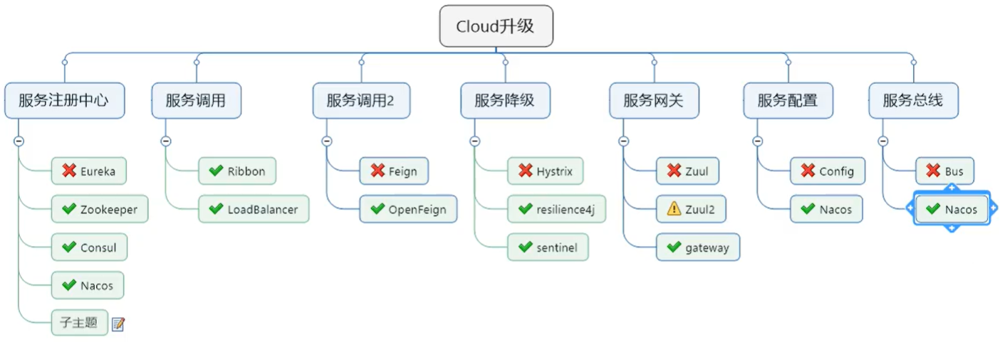


### 2、Nacos 能干嘛


1、替代 Euraka 做服务注册中心

2、替代 Config 做服务配置中心


### 3、Nacos 下载与安装


>   Github 网址：https://github.com/alibaba/Nacos
>
>   Nacos 官方网址：https://nacos.io/zh-cn/


Linux 下的安装参考博客地址：

https://blog.csdn.net/u010031939/article/details/102907869


将 nacos 的安装包用 xftp 传入到远程服务器，然后解压压缩包

```apl
tar -zxvf nacos-server-1.1.4.tar.gz 
```


**单机模式**

启动

```apl
cd /usr/local/nacos/bin
sh startup.sh -m standalone
```


关闭

```apl
cd /usr/local/nacos/bin
sh shutdown.sh -m standalone
```


启动后可以查看有无报错信息

```apl
nacos is starting with standalone
nacos is starting，you can check the /usr/local/nacos/logs/start.out
```


**启动后访问 Nacos 主页**

http://192.168.1.166:8848/nacos/index.html


## 33、Nacos 之服务注册中心


Nacos 官方中文说明文档：

https://nacos.io/zh-cn/docs/what-is-nacos.html


### 1、Nacos 之服务提供者注册


#### 1、我们新建服务提供者 `payment9001`


1、我们新建一个项目名为：

>   `cloudalibaba-provider-payment9001`


2、增加 maven 依赖

```xml
<dependencies>
    <!--SpringCloud Alibaba Nacos-->
    <dependency>
        <groupId>com.alibaba.cloud</groupId>
        <artifactId>spring-cloud-starter-alibaba-nacos-discovery</artifactId>
        <version>2.2.5.RELEASE</version>
    </dependency>

    <!-- 引入自己定义的 api 通用包项目，可以使用 Payment 支付的 Entity -->
    <dependency>
        <groupId>org.lee.springcloud</groupId>
        <artifactId>cloud-api-commons</artifactId>
        <version>${project.version}</version>
    </dependency>

    <!--  web 和 actuator 是标配、必须要写  -->
    <dependency>
        <groupId>org.springframework.boot</groupId>
        <artifactId>spring-boot-starter-web</artifactId>
    </dependency>

    <dependency>
        <groupId>org.springframework.boot</groupId>
        <artifactId>spring-boot-starter-actuator</artifactId>
    </dependency>

    <!--<dependency>
        <groupId>org.springframework.boot</groupId>
        <artifactId>spring-boot-devtools</artifactId>
        <scope>runtime</scope>
        <optional>true</optional>
    </dependency>-->

    <dependency>
        <groupId>org.projectlombok</groupId>
        <artifactId>lombok</artifactId>
        <optional>true</optional>
    </dependency>

    <dependency>
        <groupId>org.springframework.boot</groupId>
        <artifactId>spring-boot-starter-test</artifactId>
    </dependency>
</dependencies>
```


3、编写 yaml 配置文件

```yaml
server:
  port: 9001

spring:
  application:
    name: nacos-payment-provider
  cloud:
    nacos:
      discovery:
        # 配置 Nacos 服务的地址
        server-addr: http://192.168.1.166:8848

# 暴漏要监控的服务
management:
  endpoints:
    web:
      exposure:
        include: '*'
```


4、编写主启动类

```java
package com.lee.cloudalibaba;

import org.springframework.boot.SpringApplication;
import org.springframework.boot.autoconfigure.SpringBootApplication;
import org.springframework.cloud.client.discovery.EnableDiscoveryClient;

/**
 * @EnableDiscoveryClient
 *   开启 Web 图形监控注解
 */
@EnableDiscoveryClient
@SpringBootApplication
public class SpringBootAlibabaPayment9001 {
    public static void main(String[] args) {
        SpringApplication.run(SpringBootAlibabaPayment9001.class, args);
    }
}
```


5、编写 controller 配置

```java
package com.lee.cloudalibaba.controller;

import org.springframework.beans.factory.annotation.Value;
import org.springframework.web.bind.annotation.GetMapping;
import org.springframework.web.bind.annotation.PathVariable;
import org.springframework.web.bind.annotation.RestController;

import java.util.UUID;

@RestController
public class PaymentController {

    @Value("${server.port}")
    private String serverPort;

    @GetMapping("/payment/nacos/uuid")
    public String getPayment(){
        return "nacos registry, serverPort：" + serverPort + "  uuid：" + UUID.randomUUID().toString();
    }
}
```


#### 2、我们再建服务提供者 `payment9002`


此过程和 `payment9001` 完全一样， copy 一份即可，注意改端口号就行了


#### 3、启动访问 nacos 服务注册中心


1、我们先访问 9001 看是否正常


2、进入 nacos 服务注册中心的管理界面


>   我们能看到如下两个实例就可以了，证明 9001 和 9002 都已经注册进了 nacos 注册中心


点击详情可以看到两个服务的详细信息


### 2、Nacos 之服务消费者注册


#### 1、我们新建服务消费者 `consumer83`


1、新建一个服务消费者

>   `cloudalibaba-consumer-nacos-order83`


2、导入maven 依赖

>   这里和 9001 的是一样的这里省略


3、主启动类

```java
package com.lee.cloudalibaba;

import org.springframework.boot.SpringApplication;
import org.springframework.boot.autoconfigure.SpringBootApplication;
import org.springframework.cloud.client.discovery.EnableDiscoveryClient;

/**
 * @EnableDiscoveryClient
 *   开启 Web 图形监控注解
 */
@EnableDiscoveryClient
@SpringBootApplication
public class SpringBootAlibabaOrder83 {
    public static void main(String[] args) {
        SpringApplication.run(SpringBootAlibabaOrder83.class, args);
    }
}
```


4、我们编写 yml 配置文件

```yaml
server:
  port: 83

spring:
  application:
    name: nacos-order-consumer
  cloud:
    nacos:
      discovery:
        # 配置 Nacos 服务的地址
        server-addr: http://192.168.1.166:8848

# 消费者将要去访问的微服务名称(注册进 nacos 的微服务提供者名称)
service-url:
  nacos-user-service: http://nacos-payment-provider
```


5、我们编写 config 实现 Ribbon 的负载均衡

```java
package com.lee.cloudalibaba.config;

import org.springframework.cloud.client.loadbalancer.LoadBalanced;
import org.springframework.context.annotation.Bean;
import org.springframework.context.annotation.Configuration;
import org.springframework.web.client.RestTemplate;

/**
 * nacos 默认集成 ribbon 负载均衡
 */
@Configuration
public class ApplicationContextConfig {

    @Bean
    @LoadBalanced //开启 Ribbon 负载均衡
    public RestTemplate getRestTemplate(){
        return new RestTemplate();
    }
}
```


6、我们编写 controller 类

```java
package com.lee.cloudalibaba.controller;

import lombok.extern.slf4j.Slf4j;
import org.springframework.beans.factory.annotation.Value;
import org.springframework.web.bind.annotation.GetMapping;
import org.springframework.web.bind.annotation.RestController;
import org.springframework.web.client.RestTemplate;

import javax.annotation.Resource;

@Slf4j
@RestController
public class OrderNacosController {

    /**
     * yml 注入 restTemplate 要访问的远程微服务名称
     *   http://nacos-payment-provider
     */
    @Value("${service-url.nacos-user-service}")
    private String serverURL;

    @Resource
    private RestTemplate restTemplate;

    @GetMapping("/consumer/payment/nacos/uuid")
    public String getPayment(){
        return restTemplate.getForObject(serverURL + "/payment/nacos/uuid", String.class);
    }
}
```


#### 2、启动 9001、9002和 83 进行测试


1、我们先检查下 nacos 的注册中心


2、我们访问如下连接：


>   http://localhost:83/consumer/payment/nacos/uuid


我们点击了两次发现服务均可以正常访问，并且支持负载均衡


### 3、Nacos 服务注册中心对比


#### 1、Nacos 和 CAP


据说Nacos在阿里巴巴内部有超过10万的实例运行，已经过了类似双十一等各种大型流量的考验


Nacos 和其他注册中心特性对比


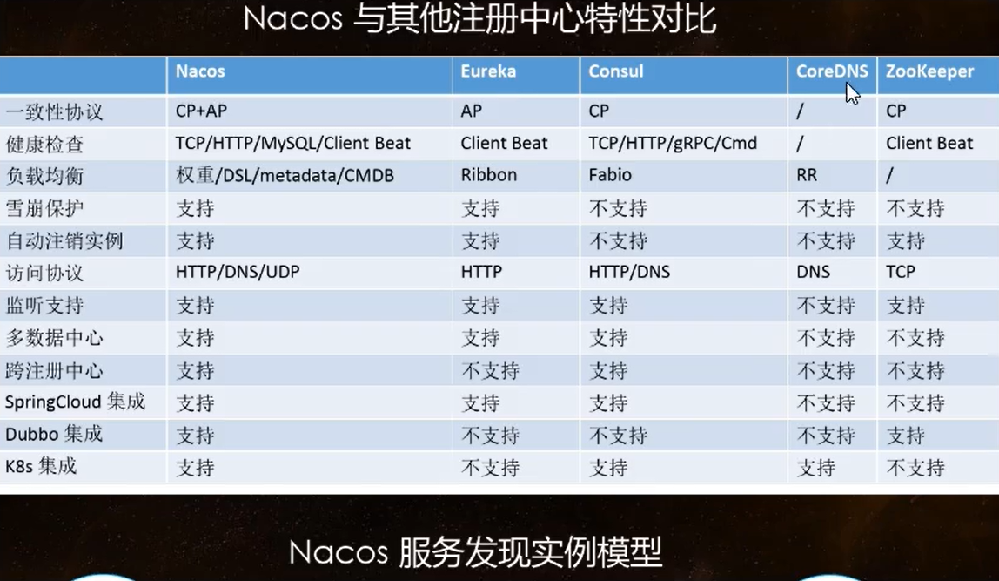


#### 2、Nacos 支持 AP 和 CP 模式的切换


**C是所有节点在同一时间看到的数据是一致的; 而A的定义是所有的请求都会收到响应。**


何时选择使用何种模式？

一般来说，如果不需要存储服务级别的信息且服务实例是通过 nacos-client 注册，并且能够保持心跳连接，那么就可以选择 AP 模式，当前主流的服务入Spring Cloud 和 Dubbo 服务，都是用于 AP 模式，AP 模式为了服务的可用性而减弱了数据的一致性，因此 AP 默斯和下只支持注册临时实例


如果需要再服务级别编辑或者存储配置信息，那么 CP 是必须， K8S 服务和 DNS 服务则是用于 CP 模式

CP 模式下则支持注册持久化实例，此时则是以 Raft 协议为集群运行模式，该模式下注册实例之前必须先注册服务，如果服务不存在，则会返回错误


**服务切换模式命令**

```apl
curl -X PUT '$NACOS_SERVER:8848/nacos/v1/ns/operator/switches?entry=serverMode&value=CP'
```


## 34、Nacos 之服务配置中心


### 1、Nacos 配置中心规则


在 Nacos Spring Cloud 中，`dataId` 的完整格式如下：

```apl
${prefix}-${spring.profiles.active}.${file-extension}
```

-   `prefix` 默认为 `spring.application.name` 的值，也可以通过配置项 `spring.cloud.nacos.config.prefix`来配置


-   `spring.profiles.active` 即为当前环境对应的 profile，详情可以参考 [Spring Boot文档](https://docs.spring.io/spring-boot/docs/current/reference/html/boot-features-profiles.html#boot-features-profiles)。 **注意：当 `spring.profiles.active` 为空时，对应的连接符 `-` 也将不存在，dataId 的拼接格式变成 `${prefix}.${file-extension}`**


-   `file-exetension` 为配置内容的数据格式，可以通过配置项 `spring.cloud.nacos.config.file-extension` 来配置。目前只支持 `properties` 和 `yaml` 类型。


### 2、新建服务 `config-client3377`


1、我们将项目命名为：

>   `cloudalibaba-config-nacos-client3377`


2、我们导入 maven 依赖

```xml
<dependencies>
    <!--SpringCloud Alibaba Nacos-->
    <dependency>
        <groupId>com.alibaba.cloud</groupId>
        <artifactId>spring-cloud-starter-alibaba-nacos-discovery</artifactId>
        <version>2.2.5.RELEASE</version>
    </dependency>

    <!--Nacos config 配置中心-->
    <dependency>
        <groupId>com.alibaba.cloud</groupId>
        <artifactId>spring-cloud-starter-alibaba-nacos-config</artifactId>
    </dependency>

    <!-- 引入自己定义的 api 通用包项目，可以使用 Payment 支付的 Entity -->
    <dependency>
        <groupId>org.lee.springcloud</groupId>
        <artifactId>cloud-api-commons</artifactId>
        <version>${project.version}</version>
    </dependency>

    <!--  web 和 actuator 是标配、必须要写  -->
    <dependency>
        <groupId>org.springframework.boot</groupId>
        <artifactId>spring-boot-starter-web</artifactId>
    </dependency>

    <dependency>
        <groupId>org.springframework.boot</groupId>
        <artifactId>spring-boot-starter-actuator</artifactId>
    </dependency>

    <!--<dependency>
        <groupId>org.springframework.boot</groupId>
        <artifactId>spring-boot-devtools</artifactId>
        <scope>runtime</scope>
        <optional>true</optional>
    </dependency>-->

    <dependency>
        <groupId>org.projectlombok</groupId>
        <artifactId>lombok</artifactId>
        <optional>true</optional>
    </dependency>

    <dependency>
        <groupId>org.springframework.boot</groupId>
        <artifactId>spring-boot-starter-test</artifactId>
    </dependency>
</dependencies>
```


3、我们编写 `application.yml` 和 `bootstrap.yml` 两个配置文件


为什么需要两个配置文件？

>   Nacos 同 `Spring Cloud - config` 一样，在项目初始化时，要保证先从配置中心进行配置拉取，拉去配置之后，才能保证项目的正常启动
>
>   Spring Boot 中配置文件的加载是存在优先级顺序的，**bootstrap 优先级高于 application**


`bootstrap.yml` 配置

```yaml
server:
  port: 3377

spring:
  application:
    name: nacos-config-client
  cloud:
    nacos:
      discovery:
        # Nacos 服务注册中心地址
        server-addr: http://192.168.1.166:8848
      config:
        # Nacos 服务配置中心地址
        server-addr: http://192.168.1.166:8848
        # 指定配置类型
        file-extension: yml

# ${prefix}-${spring.profiles.active}.${file-extension}  DataID 完整格式
#        微服务名称          -         开发环境         -              配置文件后缀名
#   nacos-config-client     -         dev             _                  yml
# ${spring.application.name}-${spring.profile.active}.${spring.cloud.nacos.config.file-extension}
```


`application.yml` 配置

```yaml
spring:
  profiles:
    active: dev # 开发环境
```


4、编写主启动类

```java
package com.lee.cloudalibaba;

import org.springframework.boot.SpringApplication;
import org.springframework.boot.autoconfigure.SpringBootApplication;
import org.springframework.cloud.client.discovery.EnableDiscoveryClient;

@EnableDiscoveryClient
@SpringBootApplication
public class SpringBootNacosConfig3377 {
    public static void main(String[] args) {
        SpringApplication.run(SpringBootNacosConfig3377.class, args);
    }
}
```


5、编写 Controller 


>   通过 Spring Cloud 原生注解 `@RefreshScope` 实现配置自动更新

```java
package com.lee.cloudalibaba.controller;

import org.springframework.beans.factory.annotation.Value;
import org.springframework.cloud.context.config.annotation.RefreshScope;
import org.springframework.web.bind.annotation.GetMapping;
import org.springframework.web.bind.annotation.RestController;

/**
 * @RefreshScope：支持 Nacos 的动态刷新
 */
@RefreshScope
@RestController
public class ConfigClientController {

    @Value("${config.info}")
    private String configInfo;

    @GetMapping("/config/info")
    public String getConfigInfo(){
        return configInfo;
    }
}
```


### 3、Nacos 配置管理新增文件并测试


1、我们应该严格遵循 Nacos 官网的 Data Id (配置文件名) 来配置我们的 yml


>   设置 Data Id 完整格式

```apl
${prefix}-${spring.profiles.active}.${file-extension} 
```

对应如下：

```
${spring.application.name}-${spring.profile.active}.${spring.cloud.nacos.config.file-extension}
```


>   其实就是 微服务名称-开发环境.配置文件后缀名
>
>   `nacos-config-client-dev.yml`


2、我们到 Nacos 的 Web 管理界面，新增一个 yml 类型的配置文件


之后我们点击发布，返回之后就可以看到有个配置文件


3、启动 3377 进行测试


我们先访问 http://localhost:3377/config/info


>   之后我们去配置中心修改版本为 2


然后我们再访问 3377 看看配置


我们刷新后发现版本立即就刷新了，Nacos 的动态刷新不像 Config 和 Bus 那样 还需要手动发一条指令去实现自动刷新，Nacos 则无需做什么就可以支持自动刷新


### 4、命令空间分组和 Data Id 三者关系


#### 1、多环境多项目管理


**问题1：**

实际开发中，通常一个系统会准备

-   dev开发环境
-   test测试环境
-   prod生产环境

如何保证指定环境启动时服务能正确读取到 Nacos 上相应环境的配置文件呢?


**问题2：**

一个大型分布式微服务系统会有很多微服务子项目，

每个微服务项目又都会有相应的开发环境、测试环境、预发环境、正式环境.….…

那怎么对这些微服务配置进行管理呢?


>   以上的问题就可以通过 命名空间、分组和 Data Id 来解决


#### 2、三者的详细介绍


类似 Java 里面的 package 名 和 类名

最外层的 name space 是可以用于区分部署环境的，Group 和 `DatalID` 逻辑上区分两个目标对象


**默认情况**

>   name space = public , Group = DEFAULT_GROUP, 默认 Cluster 是 DEFAULT


Nacos 默认的命名空间是 public，name space 主要用来实现隔离。

比方说我们现在有三个环境: 开发、测试、生产环境，我们就可以创建三个 name space


Group 默认是 DEFAULT_GROUP，Group 可以把不同的微服务划分到同一个分组里面去


Service 就是微服务;

一个 Service 可以包含多个 Cluster (集群)，Nacos 默认 Cluster 是 DEFAULT

Cluster 是对指定微服务的一个虚拟划分。比方说为了容灾，将Service微服务分别部署在了杭州机房和广州机房

这时就可以给杭州机房的Service微服务起一个集群名称(HZ) 

给广州机房的Service微服务起一个集群名称（GZ)，还可以尽量让同一个机房的微服务互相调用，以提升性能。


最后是lnstance，就是微服务的实例。


### 5、Nacos 之 DataId 方案配置


>   指定 `spring.profile.active` 和配置文件的 Data Id 来使不同环境下读取不同的配置
>
>   默认空间 + 默认分组 + 新建 dev 和 test 两个 Data Id


1、我们在默认的命名空间和默认分组下新建 测试环境的配置


>   `nacos-config-client-test.yml`

```yaml
config: 
  info: "config info for test, from nacos config center, version => 2"
```


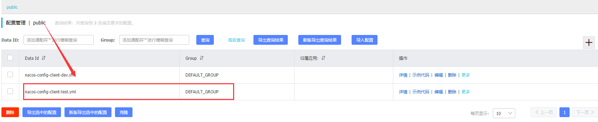


2、我们修改 application.yml 的切换环境

```yaml
spring:
  profiles:
    active: test # 测试环境
  # active: dev # 开发环境
```


3、重启 3377 进行测试


>   成功读取到 test 配置文件


### 6、Nacos 之 Group分组方案


1、我们分别新建两个配置文件，文件文件名都为如下


>    `nacos-config-client-info.yml`               DEV_GROUP

```yaml
config: 
  info: "nacos-config-client-info.yml DEV_GROUP version => 1"
```


>    `nacos-config-client-info.yml`               TEST_GROUP

```yaml
config: 
  info: "nacos-config-client-info.yml TEST_GROUP version => 1"
```


但是分组不一样


2、我们修改 bootstrop 和 application 配置文件


3、我们重启 3377 进行测试 


然后我们将 group 修改为 TEST_GROUP 在进行测试


**结论：我们可以指定不同的分组来读取不同环境的配置文件**


### 7、Nacos 之 name space命名空间方案


1、我们新建两个 name space


2、在 dev 的命名空间下新建如下三个文件，注意分组不同


3、我们修改配置文件修改为如下


>   新加 name space


>   以上就是先根据 命名空间找，然后找分组为 DEV_GROUP 的，最后是 active 为 dev，如下：
>
>   `nacos-config-client-dev.yml`


4、运行测试


## 35、Nacos 之集群配置


### 1、集群部署架构说明


Nacos 集群部署官网页：

https://nacos.io/zh-cn/docs/cluster-mode-quick-start.html


因此开源的时候推荐用户把所有服务列表放到一个vip下面，然后挂到一个域名下面

```apl
# 直连ip模式，机器挂则需要修改ip才可以使用。
http://ip1](http://ip1/):port/openAPI

# 挂载SLB模式(内网SLB，不可暴露到公网，以免带来安全风险)，直连SLB即可，下面挂server真实ip，可读性不好。
[http://SLB](http://slb/):port/openAPI

# 域名 + SLB模式(内网SLB，不可暴露到公网，以免带来安全风险)，可读性好，而且换ip方便，推荐模式
[http://nacos.com](http://nacos.com/):port/openAPI
```


#### 1、为什么要配置 MySQL 数据库来持久化？


>   默认 Nacos 使用嵌入式数据库 derby 实现数据的存储。所以，如果启动多个默认配置下的 Nacos 节点，数据存储是存在一致性问题的。为了解决这个问题，Nacos 采用了集中式存储的方式来支持集群化部署，目前只支持 MySQL 的存储


#### 2、Nacos 支持三种部署模式

-   单机模式–用于测试和单机试用。


-   集群模式–用于生产环境，确保高可用。
-   多集群模式–用于多数据中心场景。


#### 3、单机模式支持 MySQL


在 0.7 版本之前，在单机模式时 nacos 使用嵌入式数据库实现数据的存储，不方便观察数据存储的基本情况

0.7 版本地加了支持 mysql 数据源能力，具体的操作步骤:

-   安装数据库，版本要求:5.6.5+
-   初始化 mysql 数据库，数据库初始化文件: `nacos-mysql.sql`
-   修改 `conf/application.properties` 文件，增加支持 mysql 数据源配置（目前只支持 mysql )，添加 mysql 数据源的 url、用户名和密码


```apl
# mysql 数据源配置
spring.datasource.platform=mysql

db.num=1
db.url.0=jdbc:mysql://11.162.196.16:3306/nacos_devtest?characterEncoding=utf8&connectTimeout=1000&socketTimeout=3000&autoReconnect=true
db.user=nacos_devtest
db.password=youdontknow
```


>   再以单机模式启动n acos，nacos所有写嵌入式数据库的数据都写到了mysql


### 2、Nacos 持久化配置


#### 1、单机版的 Nacos 配置


##### 1、创建 nacos 的 mysql 数据库


>   Linux 进入目录 `nacos/conf/`，有个 `nacos-mysql.sql` 文件，这就是创建 mysql 的创建数据库表的脚本
>
>   拷贝出来拉到自己数据库执行以下，


我们手动创建一个数据库 `nacos_config`


执行创建表的脚本


##### 2、我们将如下内容拷贝到 `conf/application.properties` 文件


```apl
########################### MySQL Database Config ############################
spring.datasource.platform=mysql

db.num=1
db.url.0=jdbc:mysql://192.168.1.166:3306/nacos_config?characterEncoding=utf8&connectTimeout=1000&socketTimeout=3000&autoReconnect=true
db.user=root
db.password=Lee193654300_
```


##### 3、重启 nacos

>   重启 nacos之后，我们新建一个 Yaml 配置文件，保存之后我们就可以在 config_info 表看到该配置文件的信息


### 3、`Nacos` 之 Linux 集群配置  (高可用)


>   我们要通过如下架构，配置 2 台  Nginx 实现 三台 Nacos 集群的负载均衡最后搭配 MySql 的主从复制


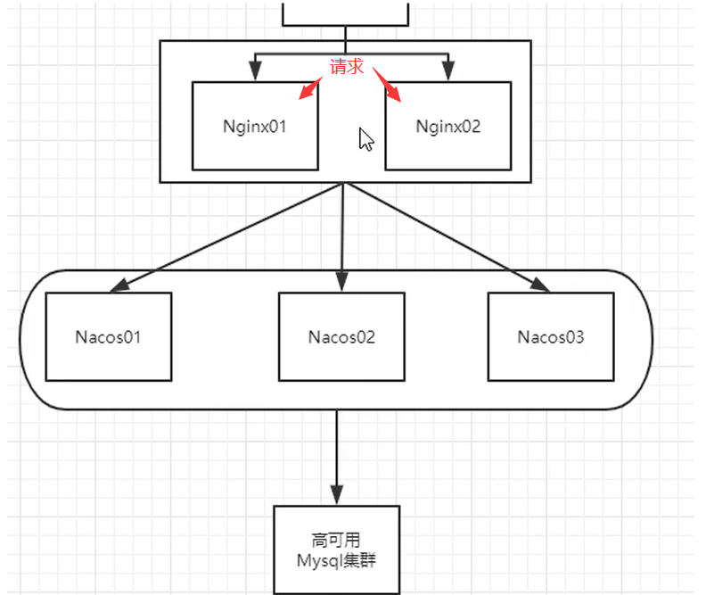


#### 1、思考个问题


**1、三个 nacos 都是在一台机器上配置、伪集群配置**


>   之前我们一个 nacos 配置，启动的时候 ：Startup 8848 是以 默认端口 8848 启动的
>
>   但是我们现在要在一个 Linux 启动三台 nacos，那我们启动的时候端口怎么指定？如果默认的话肯定会端口占用启动失败，所以这时我们就要改进下方案
>
>   我们启动的时候以：startup -p 端口号 来启动


#### 2、Nacos 配置 mysql 数据源


1、我们找到 nacos 的安装路径，在 conf 文件夹下有个 `application.properties` 配置文件


2、我们先对这个文件做个备份

```apl
# 复制一份配置文件、后缀名为 init 代表默认初始配置
cp application.properties application.properties.init
```


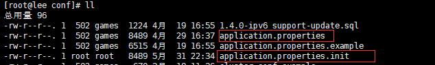


3、备份之后我们 vim 编辑该文件，增加 nacos 的持久化方式为 mysql

```properties
########################### MySQL Database Config ############################
spring.datasource.platform=mysql

db.num=1
db.url.0=jdbc:mysql://192.168.1.166:3306/nacos_config?characterEncoding=utf8&connectTimeout=1000&socketTimeout=3000&autoReconnect=true
db.user=root
db.password=Lee193654300_
```


#### 3、Linux 服务器上 `nacos` 集群配置 `cluster.conf`


>   我们梳理出来三台 nacos 集群的端口号
>
>   端口号：3333、4444、5555，并将这三个端口配置成一组


1、我们将 conf 下的配置文件 `cluster.conf.example` 复制出一份


```apl
# 复制一份配置文件
cp cluster.conf.example cluster.conf
```

如下：


2、我们编辑该文件增加如下内容


>   单机 IP 不能写成 127.0.0.1，必须是 `hostname -I` 能识别的 ip


>   将配置文件原有的内容注释掉删除掉都可以


#### 4、编辑 `Nacos` 的启动脚本 `startup.sh`


>   编辑的目的是使它能够增加参数扩展功能、启动时可以指定端口号


1、单机版和集群模式启动有何区别？


>   单机版启动如下命令即可启动
>
>   ```apl
>   ./startup.sh
>   ```


如果集群模式启动，我们希望可以类似其它软件的 shell 命令，传递不同的端口号启动不同的 nacos 实例

```apl
# 启动端口号为 3333 的 nacos
./startup.sh -p 3333
```


2、备份一个 `startup.sh` 脚本

```apl
cp startup.sh startup.sh.init
```


3、修改 `/nacos/bin` 下的 `startup.sh` 启动脚本


>   要修改的内容如下：


>   **新版 nacos - 2.0.1 脚本默认已经支持 p 端口，无需在改**


### 4、Nginx 的配置 (作为负载均衡器)


#### 1、修改 nginx 的配置文件


Nginx 配置文件路径：

```
/usr/local/nginx/conf
```


#### 2、配置完成启动进行测试


1、截至到此处，1 个 `Nginx` + 3个 `Nacos` 注册中心 + 1 个 `mysql` 配置完成


2、顺序启动 nginx 、启动 3 台 nacos、启动 mysql 服务


3、测试通过 nginx 访问 nacos

```apl
http://192.168.1.166:1111/nacos/#/login
```


出现以下界面代表成功

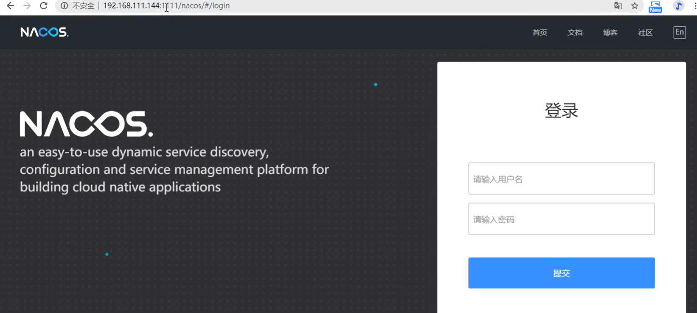


4、我们的微服务项目的 yml 配置改成 nginx 代理的 ip


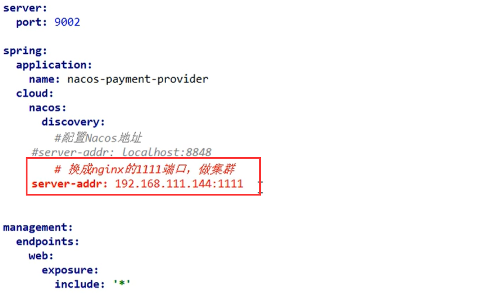


5、启动服务提供者，然后查看 nacos 的服务注册中心


>   看到如下内容证明OK


### 5、nacos 集群配置高可用总结


#### 1、一个图总结


## 36、Sentinel 简介和安装


### 1、Sentinel 是什么？


>   alibaba Sentinel Git Hub 官方中文文档：https://github.com/alibaba/Sentinel/wiki/%E4%BB%8B%E7%BB%8D
>
>   Spring Cloud Sentinel 官网：https://spring-cloud-alibaba-group.github.io/github-pages/greenwich/spring-cloud-alibaba.html#%20spring%20cloud_alibaba%20sentinel


随着微服务的流行，服务和服务之间的稳定性变得越来越重要。Sentinel 以流量为切入点，从流量控制、熔断降级、系统负载保护等多个维度保护服务的稳定性。

Sentinel 具有以下特征:

-   **丰富的应用场景**：Sentinel 承接了阿里巴巴近 10 年的双十一大促流量的核心场景，例如秒杀（即突发流量控制在系统容量可以承受的范围）、消息削峰填谷、集群流量控制、实时熔断下游不可用应用等。
-   **完备的实时监控**：Sentinel 同时提供实时的监控功能。您可以在控制台中看到接入应用的单台机器秒级数据，甚至 500 台以下规模的集群的汇总运行情况。
-   **广泛的开源生态**：Sentinel 提供开箱即用的与其它开源框架/库的整合模块，例如与 Spring Cloud、Dubbo、gRPC 的整合。您只需要引入相应的依赖并进行简单的配置即可快速地接入 Sentinel。
-   **完善的 SPI 扩展点**：Sentinel 提供简单易用、完善的 SPI 扩展接口。您可以通过实现扩展接口来快速地定制逻辑。例如定制规则管理、适配动态数据源等。


Sentinel 主要特性：


Sentinel 分为两个部分:

-   核心库（Java 客户端）不依赖任何框架/库，能够运行于所有 Java 运行时环境，同时对 Dubbo / Spring Cloud 等框架也有较好的支持。
-   控制台（Dashboard）基于 Spring Boot 开发，打包后可以直接运行，不需要额外的 Tomcat 等应用容器。


### 2、Sentinel 和 Hystrix 的对比


>   Sentinel：遵循 约定 > 配置 > 编码
>
>   都可以写在代码里面配置，但是我们本次还是大规模学习使用配置和注解的方式，尽量少写代码


### 3、Sentinel 的工作原理


#### 1、`Overview`

在 Sentinel 里面，所有的资源都对应一个资源名称（`resourceName`），每次资源调用都会创建一个 `Entry` 对象。Entry 可以通过对主流框架的适配自动创建，也可以通过注解的方式或调用 `SphU` API 显式创建。Entry 创建的时候，同时也会创建一系列功能插槽（slot chain），这些插槽有不同的职责，例如:

-   `NodeSelectorSlot` 负责收集资源的路径，并将这些资源的调用路径，以树状结构存储起来，用于根据调用路径来限流降级；
-   `ClusterBuilderSlot` 则用于存储资源的统计信息以及调用者信息，例如该资源的 RT, QPS, thread count 等等，这些信息将用作为多维度限流，降级的依据；
-   `StatisticSlot` 则用于记录、统计不同纬度的 runtime 指标监控信息；
-   `FlowSlot` 则用于根据预设的限流规则以及前面 slot 统计的状态，来进行流量控制；
-   `AuthoritySlot` 则根据配置的黑白名单和调用来源信息，来做黑白名单控制；
-   `DegradeSlot` 则通过统计信息以及预设的规则，来做熔断降级；
-   `SystemSlot` 则通过系统的状态，例如 load1 等，来控制总的入口流量；


总体的框架如下:


Sentinel 将 `ProcessorSlot` 作为 SPI 接口进行扩展（1.7.2 版本以前 `SlotChainBuilder` 作为 SPI），使得 Slot Chain 具备了扩展的能力。您可以自行加入自定义的 slot 并编排 slot 间的顺序，从而可以给 Sentinel 添加自定义的功能。


>   下面介绍一下各个 slot 的功能


#### 2、`NodeSelectorSlot`


这个 slot 主要负责收集资源的路径，并将这些资源的调用路径以树状结构存储起来，用于根据调用路径进行流量控制。

```java
ContextUtil.enter("entrance1", "appA");
 Entry nodeA = SphU.entry("nodeA");
 if (nodeA != null) {
    nodeA.exit();
 }
 ContextUtil.exit();
```


上述代码通过 `ContextUtil.enter()` 创建了一个名为 `entrance1` 的上下文，同时指定调用发起者为 `appA`；接着通过 `SphU.entry()`请求一个 token，如果该方法顺利执行没有抛 `BlockException`，表明 token 请求成功。

以上代码将在内存中生成以下结构：

```
 	     machine-root
                 /     
                /
         EntranceNode1
              /
             /   
      DefaultNode(nodeA)
```


注意：每个 `DefaultNode` 由资源 ID 和输入名称来标识。换句话说，一个资源 ID 可以有多个不同入口的 DefaultNode。

```java
  ContextUtil.enter("entrance1", "appA");
  Entry nodeA = SphU.entry("nodeA");
  if (nodeA != null) {
    nodeA.exit();
  }
  ContextUtil.exit();

  ContextUtil.enter("entrance2", "appA");
  nodeA = SphU.entry("nodeA");
  if (nodeA != null) {
    nodeA.exit();
  }
  ContextUtil.exit();
```


以上代码将在内存中生成以下结构：

```
                   machine-root
                   /         \
                  /           \
          EntranceNode1   EntranceNode2
                /               \
               /                 \
       DefaultNode(nodeA)   DefaultNode(nodeA)
```


上面的结构可以通过调用 `curl http://localhost:8719/tree?type=root` 来显示：

```apl
EntranceNode: machine-root(t:0 pq:1 bq:0 tq:1 rt:0 prq:1 1mp:0 1mb:0 1mt:0)
-EntranceNode1: Entrance1(t:0 pq:1 bq:0 tq:1 rt:0 prq:1 1mp:0 1mb:0 1mt:0)
--nodeA(t:0 pq:1 bq:0 tq:1 rt:0 prq:1 1mp:0 1mb:0 1mt:0)
-EntranceNode2: Entrance1(t:0 pq:1 bq:0 tq:1 rt:0 prq:1 1mp:0 1mb:0 1mt:0)
--nodeA(t:0 pq:1 bq:0 tq:1 rt:0 prq:1 1mp:0 1mb:0 1mt:0)

t:threadNum  pq:passQps  bq:blockedQps  tq:totalQps  rt:averageRt  prq: passRequestQps 1mp:1m-passed 1mb:1m-blocked 1mt:1m-total

```


#### 3、`ClusterBuilderSlot`


此插槽用于构建资源的 `ClusterNode` 以及调用来源节点。`ClusterNode` 保持某个资源运行统计信息（响应时间、QPS、block 数目、线程数、异常数等）以及调用来源统计信息列表。调用来源的名称由 `ContextUtil.enter(contextName，origin)` 中的 `origin` 标记。可通过如下命令查看某个资源不同调用者的访问情况：`curl http://localhost:8719/origin?id=caller`：

```
id: nodeA
idx origin  threadNum passedQps blockedQps totalQps aRt   1m-passed 1m-blocked 1m-total 
1   caller1 0         0         0          0        0     0         0          0        
2   caller2 0         0         0          0        0     0         0          0        
```


#### 4、`StatisticSlot`

`StatisticSlot` 是 Sentinel 的核心功能插槽之一，用于统计实时的调用数据。

-   `clusterNode`：资源唯一标识的 ClusterNode 的实时统计
-   `origin`：根据来自不同调用者的统计信息
-   `defaultnode`: 根据入口上下文区分的资源 ID 的 runtime 统计
-   入口流量的统计


Sentinel 底层采用高性能的滑动窗口数据结构 `LeapArray` 来统计实时的秒级指标数据，可以很好地支撑写多于读的高并发场景。


#### 5、`FlowSlot`


这个 slot 主要根据预设的资源的统计信息，按照固定的次序，依次生效。如果一个资源对应两条或者多条流控规则，则会根据如下次序依次检验，直到全部通过或者有一个规则生效为止:

-   指定应用生效的规则，即针对调用方限流的；
-   调用方为 other 的规则；
-   调用方为 default 的规则。


#### 6、`DegradeSlot`


这个 slot 主要针对资源的平均响应时间（RT）以及异常比率，来决定资源是否在接下来的时间被自动熔断掉。


#### 7、`SystemSlot`


这个 slot 会根据对于当前系统的整体情况，对入口资源的调用进行动态调配。其原理是让入口的流量和当前系统的预计容量达到一个动态平衡。

注意系统规则只对入口流量起作用（调用类型为 `EntryType.IN`），对出口流量无效。可通过 `SphU.entry(res, entryType)` 指定调用类型，如果不指定，默认是`EntryType.OUT`。


### 4、Sentinel 之 Linux 的安装


#### 1、安装前的注意事项


>   Sentinel  GitHub官网下载地址：https://github.com/alibaba/Sentinel/releases


注意：

-   Java 8 环境 OK
-   8080 端口不能被占用（注意 Tomcat ，因为两者端口默认端口相同）


#### 2、详细安装步骤


1、下载如下文件


>   之后将jar包上传至 /opt/sentinel-1.8.1/ 文件夹下
>
>   并在该文件夹下创建 logs 文件夹


2、编写配置文件（暂时不知道配在哪）

```properties
#spring settings
spring.http.encoding.force=true
spring.http.encoding.charset=UTF-8
spring.http.encoding.enabled=true

#cookie name setting
server.servlet.session.cookie.name=sentinel_dashboard_cookie

#logging settings
logging.level.org.springframework.web=INFO
logging.file=${user.home}/logs/csp/sentinel-dashboard.log
logging.pattern.file= %d{yyyy-MM-dd HH:mm:ss} [%thread] %-5level %logger{36} - %msg%n
#logging.pattern.console= %d{yyyy-MM-dd HH:mm:ss} [%thread] %-5level %logger{36} - %msg%n

#auth settings
auth.filter.exclude-urls=/,/auth/login,/auth/logout,/registry/machine,/version
auth.filter.exclude-url-suffixes=htm,html,js,css,map,ico,ttf,woff,png
# If auth.enabled=false, Sentinel console disable login
auth.username=sentinel
auth.password=sentinel

# Inject the dashboard version. It's required to enable
# filtering in pom.xml for this resource file.
sentinel.dashboard.version=1.8.1

```


3、在 `/etc/rc.d/init.d` 目录下编写脚本


```apl
#切换目录
cd /etc/rc.d/init.d

#创建脚本
vim sentinel
```

>   脚本内容如下

```shell
#!/bin/bash
#
# chkconfig: 2345 10 90
# 
# description:auto_run

#程序名
RUN_NAME="sentinel-dashboard-1.8.1.jar"

#资源位置
JAVA_OPTS=/opt/sentinel-1.8.1/sentinel-dashboard-1.8.1.jar

#日志位置
LOG_DIR=/opt/sentinel-1.8.1/logs/csp
LOG_FILE=$LOG_DIR/sentinel-dashboard.log
LOG_OPTS=$LOG_DIR/sentinel_temp.log

#开始方法
start() {
        source /etc/profile; nohup java -Xms256M -Xmx512M -XX:PermSize=128M -XX:MaxPermSize=256M -Dcsp.sentinel.log.dir=$LOG_DIR -Dlogging.file=$LOG_FILE -Dserver.port=9100  -Dcsp.sentinel.dashboard.server=127.0.0.1:9100 -Dproject.name=Sentinel基本控制台 -jar $JAVA_OPTS >$LOG_OPTS 2>&1 &
        echo "$RUN_NAME started success."
}

#结束方法
stop() {
        echo "stopping $RUN_NAME ..."
        kill -9 `ps -ef|grep $JAVA_OPTS|grep -v grep|grep -v stop|awk '{print $2}'`
}

case "$1" in
        start)
            start
            ;;
        stop)
            stop
            ;;
        restart)
            stop
            start
            ;;
        *)
                echo "Userage: $0 {start|stop|restart}"
                exit 1
esac
```


4、设置相关执行权限和配置

```apl
# 刷新配置
systemctl daemon-reload

# 授权为可执行文件
chmod +x sentinel 
chmod +x /opt/sentinel-1.8.1/sentinel-dashboard-1.8.1.jar
```

>   以下为可选步骤

```apl
# 添加至系统服务
chkconfig --add sentinel

# 开机自启
chkconfig sentinel on

# 查看服务列表
chkconfig --list
```


5、启动和关闭 Sentinel 相关命令

```apl
# 启停
systemctl start|stop|status|restart sentinel

# 查看进程
ps -ef|grep sentinel
```


6、测试访问

```apl
# 访问地址
http://Linux IP:9100/

# 默认账户密码
sentinel  sentinel
```

>   出现以下界面代表成功


## 37、Sentinel 监控和流量控制


### 1、Sentinel 初始化监控


>   启动服务注册中心 Nacos 8848 、启动 Sentinel 9100


##### 1、新建一个工程

>   `cloudalibaba-sentinel-service8401`


##### 2、增加 maven 依赖

```xml
<dependencies>
    <!--SpringCloud Alibaba Nacos-->
    <dependency>
        <groupId>com.alibaba.cloud</groupId>
        <artifactId>spring-cloud-starter-alibaba-nacos-discovery</artifactId>
        <version>2.2.5.RELEASE</version>
    </dependency>

    <!-- SpringCloud Alibaba Sentinel-datasource-nacos 后续持久化用到 -->
    <dependency>
        <groupId>com.alibaba.csp</groupId>
        <artifactId>sentinel-datasource-nacos</artifactId>
    </dependency>

    <!--SpringCloud alibaba Sentinel-->
    <dependency>
        <groupId>com.alibaba.cloud</groupId>
        <artifactId>spring-cloud-starter-alibaba-sentinel</artifactId>
        <version>2.2.5.RELEASE</version>
    </dependency>

    <!-- openfeign -->
    <dependency>
        <groupId>org.springframework.cloud</groupId>
        <artifactId>spring-cloud-starter-openfeign</artifactId>
    </dependency>

    <!-- 引入自己定义的 api 通用包项目，可以使用 Payment 支付的 Entity -->
    <dependency>
        <groupId>org.lee.springcloud</groupId>
        <artifactId>cloud-api-commons</artifactId>
        <version>${project.version}</version>
    </dependency>

    <!--  web 和 actuator 是标配、必须要写  -->
    <dependency>
        <groupId>org.springframework.boot</groupId>
        <artifactId>spring-boot-starter-web</artifactId>
    </dependency>

    <dependency>
        <groupId>org.springframework.boot</groupId>
        <artifactId>spring-boot-starter-actuator</artifactId>
    </dependency>

    <dependency>
        <groupId>org.projectlombok</groupId>
        <artifactId>lombok</artifactId>
        <optional>true</optional>
    </dependency>

    <dependency>
        <groupId>org.springframework.boot</groupId>
        <artifactId>spring-boot-starter-test</artifactId>
    </dependency>
</dependencies>
```


##### 3、编写 yml 配置文件

```yaml
server:
  port: 8401

spring:
  application:
    name: cloudalibaba-sentinel-service
  cloud:
    nacos:
      discovery:
        # 服务注册中心地址
        server-addr: 192.168.1.166:8848
    sentinel:
      transport:
        # 配置 Sentinel Dashboard 地址
        dashboard: 192.168.1.166:9100
        # 默认 8719端口：如果被占用从 8719 开始一次 +1 扫描. 直到找出未被占用的端口
        port: 8719
        # sentinel 部署在远程服务器上要加上本机的 ip 监听
        clientIp: 192.168.1.3

management:
  endpoints:
    web:
      exposure:
        include: '*'
```


##### 4、编写主启动类

```java
package com.lee.cloudalibaba;

import org.springframework.boot.SpringApplication;
import org.springframework.boot.autoconfigure.SpringBootApplication;
import org.springframework.cloud.client.discovery.EnableDiscoveryClient;

@EnableDiscoveryClient
@SpringBootApplication
public class SpringBootSentinelService8401 {
    public static void main(String[] args) {
        SpringApplication.run(SpringBootSentinelService8401.class, args);
    }
}
```


##### 5、编写 Controller

```java
package com.lee.cloudalibaba.controller;

import org.springframework.beans.factory.annotation.Value;
import org.springframework.web.bind.annotation.GetMapping;
import org.springframework.web.bind.annotation.RestController;

import java.util.UUID;

@RestController
public class FlowLimitController {

    @Value("${server.port}")
    private String serverPort;

    @GetMapping("/sentinel/uuid")
    public String getPayment(){
        return "Sentinel  => Port：" + serverPort + "  uuid：" + UUID.randomUUID().toString();
    }
}
```


##### 6、进行测试


>   查看微服务 8401 是否注册进 Nacos 服务注册中心


>   查看 Sentinel 控制台


>   我们发现 Sentinel 控制台空空如也，因为 Sentinel 采用懒加载机制，我们随便访问一个接口进行测试，Sentinel 才会被加载，之后我们刷新界面


##### 7、踩坑记录


>   如果 Sentinel 部署在了远程服务器上，要在 yml 中配置 
>
>   ```
>   clientIp: 本机ip
>   ```


**远程服务器上的时间需要和本地时间同步，不然监控界面空白**


可以设置 Linux 系统时间和网络时间同步、如下

```apl
# CentOS 安装 nptdate 工具
sudo yum -y install ntp ntpdate 
```

```apl
# Ubuntu 安装 nptdate 工具
sudo apt-get install ntp ntpdate 
```

```apl
# 系统时间与网络时间同步
ntpdate cn.pool.ntp.org

# 统时间写入硬件时间
hwclock --systohc
```


**监控界面有一定延迟，需要等待大概 3 ~ 5秒**


### 2、Sentinel 流控规则介绍


-   资源名:唯一名称，默认请求路径


-   针对来源: Sentinel可以针对调用者进行限流，填写微服务名，默认default(不区分来源)阈值类型/单机阈值:
    -   QPS(每秒钟的请求数量)︰当调用该 api 的 QPS 达到阈值的时候，进行限流。
    -   线程数：当调用该 api 的线程数达到阈值的时候，进行限流

-   是否集群:不需要集群
-   流控模式:
    -   直接: api 达到限流条件时，直接限流
    -   关联: 当关联的资源达到阈值时，就限流自己
    -   链路: 只记录指定链路上的流量（指定资源从入口资源进来的流量，如果达到阈值，就进行限流)【api级别的针对来源】

-   流控效果:

    -   快速失败: 直接失败，抛异常

    -   Warm Up: （`RuleConstant.CONTROL_BEHAVIOR_WARM_UP`）方式，即预热/冷启动方式。当系统长期处于低水位的情况下，当流量突然增加时，直接把系统拉升到高水位可能瞬间把系统压垮。通过"冷启动"，让通过的流量缓慢增加，在一定时间内逐渐增加到阈值上限，给冷系统一个预热的时间，避免冷系统被压垮，详细文档可以参考 [流量控制 - Warm Up 文档](https://github.com/alibaba/Sentinel/wiki/限流---冷启动)

    -   排队等待: 匀速排队，让请求以匀速的速度通过，对应的是漏桶算法，阈值类型必须设置为 QPS，否则无效，详细文档可以参考 [流量控制 - 匀速器模式](https://github.com/alibaba/Sentinel/wiki/流量控制-匀速排队模式)，具体的例子可以参见 [PaceFlowDemo](https://github.com/alibaba/Sentinel/blob/master/sentinel-demo/sentinel-demo-basic/src/main/java/com/alibaba/csp/sentinel/demo/flow/PaceFlowDemo.java)。

        >   注意：匀速排队模式暂时不支持 QPS > 1000 的场景


#### 1、流控规则 -> QPS&快速失败


快速失败 -》 直接失败，抛异常

>   两种方式添加规则（功能都一样）
>
>   -   簇点链路
>   -   流控规则


操作步骤很简单


1、如果我们要对 testA 进行流量控制，我们点击流控 + 按钮


2、我们进行如下设置

>   表示 1 秒钟内查询 1 次就是 OK，若超过次数1，就直接 => 快速失败，抛出默认错误


3、设置好后我们可以在流控规则界面看到这个


4、我们访问 testA 接口进行狂点测试

>   我们发现如下界面，Sentinel 直接拒绝掉了请求


**思考：超过流控规则后直接调用默认报错信息，是否应该有我们自己的后续处理，比如友好提示?**


#### 2、流控模式 -> 线程数


>   其实很好理解：当调用该 api 的线程数达到阈值的时候，进行限流
>
>   我们可以理解 1 个浏览器窗口代表一个线程，假如多个窗口同时访问接口，那么超过了如下我们设置的 阈值 1，就会报错 Blocked by Sentinel (flow limiting)


如下设置


#### 3、流控模式 -> 关联


当关联的资源达到阈值时，就限流自己

-   就是当 A 关联的资源 B 达到阈值后，就限流 A 自己
-   通俗点就是 A 做了 B 的担保人，B 惹事，A 负责
-   用在业务上就是比如 支付接口 到达了阈值，就从源头限流 下订单接口 的阈值，微服务业务调用就像一个出水口入水口一样


如下设置


我们可以通过 JMeter 开辟10个线程每秒10个请求进行访问 testB ，随后我们手动浏览器去访问 testA 接口，我们发现该接口处于报错状态


JMeter压测 testB


浏览器 访问 testA


我们发现在压测 testB 期间访问了很多次 testA 都是拒绝状态


#### 4、流控模式 -> 链路


只记录指定链路上的流量（指定  **微服务/资源/系统**  从入口资源进来的流量，如果达到阈值，就进行限流)


>   入口资源：就是树状列表中的根节点
>
>   我们将 testA 接口的入口资源设置成为 sentinel_spring_web_context，代表来自该微服务的访问 QPS 达到 3  之后就进行拒绝


狂点之后进行测试：


#### 5、流控效果 -> 预热 ( Warm Up )


阈值 / coldFactor(默认为3)，经过预热时长后才会达到阈值

-   默认 clodFactor 为 3，即请求 OPS 从 threshold / 3 开始，经预热时长逐渐升至设定的 OPS 阈值


>   通常冷启动的过程系统允许通过的 QPS 曲线如下图所示：


我们如下进行设置

>   案例如下：单机阈值 30、预热时长 5 秒
>
>   就是初始时阈值为 12 / 3 = 4 个请求，即阈值刚开始为 4，然后经过了 5 秒后阈值慢慢升高至 12


设置完成后我们可以狂点 http://localhost:8401/sentinel/testA，我们可以发现前期有部分请求失败，但是大概5秒后很难出现失败了，因为阈值达到了顶峰的 12，预热已经完成，我们手速没那么快


#### 6、流控效果 -> 排队等待


匀速排队（`RuleConstant.CONTROL_BEHAVIOR_RATE_LIMITER`）方式会严格控制请求通过的间隔时间，也即是让请求以均匀的速度通过，对应的是漏桶算法。详细文档可以参考 [流量控制 - 匀速器模式](https://github.com/alibaba/Sentinel/wiki/流量控制-匀速排队模式)，具体的例子可以参见 [PaceFlowDemo](https://github.com/alibaba/Sentinel/blob/master/sentinel-demo/sentinel-demo-basic/src/main/java/com/alibaba/csp/sentinel/demo/flow/PaceFlowDemo.java)。


该方式的作用如下图所示：


这种方式主要用于处理间隔性突发的流量，例如消息队列。想象一下这样的场景，在某一秒有大量的请求到来，而接下来的几秒则处于空闲状态，我们希望系统能够在接下来的空闲期间逐渐处理这些请求，而不是在第一秒直接拒绝多余的请求


>   注意：匀速排队模式暂时不支持 QPS > 1000 的场景。


如下设置：

-   单机阈值：1
-   超时时间：10000 毫秒
-   testB 接口每秒接收请求1次，超过阈值就排队等待，等待超时时间为 10000 毫秒


## 38、Sentinel 之服务降级


### 1、服务降级简介


现代微服务架构都是分布式的，由非常多的服务组成。不同服务之间相互调用，组成复杂的调用链路。以上的问题在链路调用中会产生放大的效果。复杂链路上的某一环不稳定，就可能会层层级联，最终导致整个链路都不可用。因此我们需要对不稳定的**弱依赖服务调用**进行熔断降级，暂时切断不稳定调用，避免局部不稳定因素导致整体的雪崩。熔断降级作为保护自身的手段，通常在客户端（调用端）进行配置


>   Sentinel 熔断降级会在调用链路中某个资源出现不稳定状态时(例如调用超时或异常比例升高)，对这个资源的调用进行限制,让请求快速失败，避免影响到其它的资源而导致级联错误。
>
>   当资源被降级后，在接下来的降级时间窗口之内，对该资源的调用都自动熔断（默认行为是抛DegradeException) 


### 2、1.8.0 以及以上版本改动


>   **注意**：**本文档针对 Sentinel 1.8.0 及以上版本**。
>
>   1.8.0 版本对熔断降级特性进行了全新的改进升级，请使用最新版本以更好地利用熔断降级的能力。该版本对熔断降级做了大的调整，**可以定义任意时长的熔断时间，引入了半开启恢复支持**
>
>   
>
>   1、熔断状态：
>
>   -   熔断有三种状态，分别为OPEN、HALF_OPEN、CLOSE
>
>   


### 3、降级规则界面参数详解


**熔断降级规则界面（DegradeRule）包含下面几个重要的属性**

|                                 |                                                              |            |
| ------------------------------- | ------------------------------------------------------------ | ---------- |
| Field                           | 说明                                                         | 默认值     |
| resource - 资源名               | 即规则的作用对象                                             |            |
| grade - 熔断策略                | 三种：慢调用比例/异常比例/异常数策略                         | 慢调用比例 |
| count - 最大 RT                 | 平均响应时间 ( 单位 ms )                                     |            |
| `timeWindow` - 熔断时长         | 熔断期间不响应请求，直接快速失败 ( 单位为 s )                |            |
| `minRequestAmount` - 最小请求数 | 熔断触发的最小请求数，请求数小于该值时即使异常比率超出阈值也不会熔断（1.7.0 引入） | 5          |
| `statIntervalMs` - 统计时长     | 如 60*1000 代表分钟级（单位为 ms）（1.8.0 引入）             | 1000 ms    |
| `slowRatioThreshold` - 比例阈值 | 慢调用比例阈值，仅慢调用比例模式有效（1.8.0 引入）           |            |


### 4、熔断策略的介绍和使用


>   Sentinel 提供以下几种熔断策略：


#### 1、慢调用比例 (`SLOW_REQUEST_RATIO`)：


##### 1、慢调用比例说明 (官话)


>   选择以慢调用比例作为阈值，需要设置允许的慢调用 RT（即最大的响应时间），请求的响应时间大于该值则统计为慢调用

当单位统计时长（`statIntervalMs`）内请求数目大于设置的最小请求数目，并且慢调用的比例大于阈值，则接下来的熔断时长内请求会自动被熔断。经过熔断时长后熔断器会进入探测恢复状态（HALF-OPEN 状态），若接下来的一个请求响应时间小于设置的慢调用 RT 则结束熔断，若大于设置的慢调用 RT 则会再次被熔断


简单来说就是指耗时大于阈值RT的请求称为慢调用，阈值RT由用户设置


##### 2、慢比例执行逻辑


**熔断（OPEN）：请求数大于最小请求数并且慢调用的比率大于比例阈值则发生熔断**，熔断时长为用户自定义设置。

**探测（HALFOPEN）**：当熔断过了定义的熔断时长，状态由熔断（OPEN）变为探测（HALFOPEN）。

-   如果接下来的一个请求小于最大RT，说明慢调用已经恢复，结束熔断，状态由探测（HALF_OPEN）变更为关闭（CLOSED）
-   如果接下来的一个请求大于最大RT，说明慢调用未恢复，继续熔断，熔断时长保持一致


>   注意 Sentinel 默认统计的RT上限是 4900ms，超出此阈值的都会算作 4900ms，若需要变更此上限可以通过启动配置项 `-Dcsp.sentinel.statistic.max.rt=xxx` 来配置


##### 3、慢比例模式实战配置


1、我们对 testFusing 接口做以下降级规则配置


>   最大RT(平均响应时间)：为 100 ms，单个请求响应时间超过 100 ms 条件成立
>
>   比例阈值：为 0.2，10 个请求慢调用 2 个时条件成立
>
>   最小请求数：每秒 >= 5 个时条件成立
>
>   **统计时长：大白话来讲 => 当 1 秒内，来了大于 5个请求时，而且请求中响应超时 (100ms) 的比例超过 20% , 就会触发服务熔断 时长 5 秒，相对官话好理解了点吧**


2、话不多说，接下来我们来新增一个 testFusing 接口如下


>   我们依旧对 `cloudalibaba-sentinel-service8401` 服务的 Controller 进行添加新接口
>
>   改完后记得重启服务

```java
@GetMapping("/sentinel/testFusing/{sleep}")
public String testFusing(@PathVariable("sleep") Integer sleepMs) throws InterruptedException {
    Thread.sleep(sleepMs);
    String result = "测试熔断 sleepTime(ms) => " + sleepMs +  " => port：" + serverPort + " => uuid：" + UUID.randomUUID().toString();
    log.info(result);
    return result;
}
```


3、开始测试，这时还用不上 JMeter，我们访问接口，在浏览器地址栏中一番狂点之后，就会触发服务熔断


>   注意 ：熔断之后 Sentinel 会进行探测
>
>   如果接下来的一个请求大于最大RT，说明慢调用未恢复，继续熔断，熔断时长保持一致


4、我们等待 5 秒后，再次访问以下接口，发现服务正常访问


#### 2、异常比例 (`ERROR_RATIO`)：


##### 1、异常比例说明


当单位统计时长（`statIntervalMs`）内请求数目大于设置的最小请求数目，并且异常的比例大于阈值，则接下来的熔断时长内请求会自动被熔断。经过熔断时长后熔断器会进入探测恢复状态（HALF-OPEN 状态），若接下来的一个请求成功完成（没有错误）则结束熔断，否则会再次被熔断。异常比率的阈值范围是 `[0.0, 1.0]`，代表 0% - 100%


##### 2、异常比例执行逻辑


**熔断（OPEN）：当请求数大于最小请求并且异常比例大于设置的阈值时触发熔断**，熔断时长由用户设置。

**探测（HALFOPEN）**：当超过熔断时长时，由熔断（OPEN）转为探测（HALFOPEN）

如果接下来的一个请求未发生错误，说明应用恢复，结束熔断，状态由探测（HALF_OPEN）变更为关闭（CLOSED）


##### 3、异常比例实战配置


1、我们对 test Exception 接口做如下的降级配置


>   **通俗点讲就是当 1 秒内来了超过5个请求，并且其中发生异常的比例为 20%，就会触发服务熔断 时长 5 秒**


2、我们新增一个接口

>   修改微服务 `cloudalibaba-sentinel-service8401`


```java
@GetMapping("/sentinel/testException")
public String testException(){
    int result = 10 / 0;
    return String.valueOf(result);
}
```


3、之后我们进行狂点测试，发现触发了服务熔断，此时后台正在疯狂报错


```ABAP
2021-06-02 18:21:47.293 ERROR 51484 --- [nio-8401-exec-5] o.a.c.c.C.[.[.[/].[dispatcherServlet]    : Servlet.service() for servlet [dispatcherServlet] in context with path [] threw exception [Request processing failed; nested exception is java.lang.ArithmeticException: / by zero] with root cause

java.lang.ArithmeticException: / by zero
	at com.lee.cloudalibaba.controller.FlowLimitController.testException(FlowLimitController.java:49) ~[classes/:na]
	at sun.reflect.GeneratedMethodAccessor93.invoke(Unknown Source) ~[na:na]
	at sun.reflect.DelegatingMethodAccessorImpl.invoke(DelegatingMethodAccessorImpl.java:43) ~[na:1.8.0_271]
	at java.lang.reflect.Method.invoke(Method.java:498) ~[na:1.8.0_271]
	at org.springframework.web.method.support.InvocableHandlerMethod.doInvoke(InvocableHandlerMethod.java:190) ~[spring-web-5.2.2.RELEASE.jar:5.2.2.RELEASE]
	at org.springframework.web.method.support.InvocableHandlerMethod.invokeForRequest(InvocableHandlerMethod.java:138) ~[spring-web-5.2.2.RELEASE.jar:5.2.2.RELEASE]
	at org.springframework.web.servlet.mvc.method.annotation.ServletInvocableHandlerMethod.invokeAndHandle(ServletInvocableHandlerMethod.java:106) ~[spring-webmvc-5.2.2.RELEASE.jar:5.2.2.RELEASE]
	at org.springframework.web.servlet.mvc.method.annotation.RequestMappingHandlerAdapter.invokeHandlerMethod(RequestMappingHandlerAdapter.java:888) ~[spring-webmvc-5.2.2.RELEASE.jar:5.2.2.RELEASE]
	at org.springframework.web.servlet.mvc.method.annotation.RequestMappingHandlerAdapter.handleInternal(RequestMappingHandlerAdapter.java:793) ~[spring-webmvc-5.2.2.RELEASE.jar:5.2.2.RELEASE]
	at org.springframework.web.servlet.mvc.method.AbstractHandlerMethodAdapter.handle(AbstractHandlerMethodAdapter.java:87) ~[spring-webmvc-5.2.2.RELEASE.jar:5.2.2.RELEASE]
```


4、耐心等待 5 秒之后，我们在进行测试，发现服务可以正常访问，虽然报错


#### 3、异常数 (`ERROR_COUNT`)：


##### 1、异常数说明


当单位统计时长内的异常数目超过阈值之后会自动进行熔断。经过熔断时长后熔断器会进入探测恢复状态（HALF-OPEN 状态），若接下来的一个请求成功完成（没有错误）则结束熔断，否则会再次被熔断


##### 2、异常数执行逻辑


**熔断（OPEN）：当请求数大于最小请求并且异常数量大于设置的阈值时触发熔断**，熔断时长由用户设置。

**探测（HALFOPEN）：**当超过熔断时长时，由熔断（OPEN）转为探测（HALFOPEN）

如果接下来的一个请求未发生错误，说明应用恢复，结束熔断，状态由探测（HALF_OPEN）变更为关闭（CLOSED）

如果接下来的一个请求继续发生错误，说明应用未恢复，继续熔断，熔断时长保持一致


##### 3、异常数实战配置


1、我们修改 test Exception 接口的降级配置，如下


>   **通俗点讲就是当 1 秒内来了超过5个请求，并且其中发生异常的数量为 3个，就会触发服务熔断 时长 5 秒**


2、这个其实和异常比例大差不差，只不过一个是 异常的比例，一个是异常的数量，这里不再阐述，有兴趣的可以自行测试


### 5、服务降级的兜底方法配置


#### 1、服务降级方法介绍


**兜底方法分为两种，系统默认的客户自定义的两种**，之前的 case 限流出问题后，都是用 Sentinel 系统默认的提示：Blocked by Sentinel ( flow limiting )，我们能不能自定义？类似 Hystrix，某个方法出问题了，就去找对应的兜底降级方法？


结论：从 `@HystrixCommand` 注解到 `@SentinelResource`


#### 2、我们改造我们接口


1、我们继续在 8401 服务的 Controller 改造 testA 方法

```java
/**
 * value : 值可以任意，但是要唯一
 * blockHandler：绑定服务降级后调用哪个方法
 */
@GetMapping("/sentinel/testA")
@SentinelResource(value = "sentinel/testA", blockHandler = "deal_testA")
public String testA(){
    String result = "Sentinel TestA  => Port：" + serverPort + "  uuid：" + UUID.randomUUID().toString();
    log.info(result);
    return result;
}

public String deal_testA(){
    return "系统发生异常：请稍后再试 ≧ ﹏ ≦";
}
```


2、之后我们可以参考热点 Key 限流部分


## 39、Sentinel 之热点 key 限流


### 1、什么是 Sentinel 热点 Key 限流？


何为热点？热点即经常访问的数据。很多时候我们希望统计某个热点数据中访问频次最高的 Top K 数据，并对其访问进行限制。比如：

-   商品 ID 为参数，统计一段时间内最常购买的商品 ID 并进行限制

-   用户 ID 为参数，针对一段时间内频繁访问的用户 ID 进行限制

    >   例子：
    >
    >   http://localhost:8401/payment/query/userId/123456
    >
    >   比如用户 Id 123456 访问频繁，我们可以对该用户 Id 进行限流

    

热点参数限流会统计传入参数中的热点参数，并根据配置的限流阈值与模式，对包含热点参数的资源调用进行限流。热点参数限流可以看做是一种特殊的流量控制，仅对包含热点参数的资源调用生效


>   热点限流的源代码位置：`com.alibaba.csp.sentinel.slots.block.BlockException`

Sentinel 利用 LRU 策略统计最近最常访问的热点参数，结合令牌桶算法来进行参数级别的流控。热点参数限流支持集群模式。


### 2、热点 Key 限流的实战配置（上）


1、我们依旧在 8401 项目的 Controller 中增加以下方法


>   @SentinelResource：服务降级兜底注解

```java
/**
 * @SentinelResource
 *   value : 值可以任意，但是要唯一
 *   blockHandler：绑定服务降级后调用哪个方法
 */
@GetMapping("/testHotkey")
@SentinelResource(value = "testHotkey", blockHandler = "deal_testHotkey")
public String testHotkey(@RequestParam(value = "p1", required = false) String p1,
                         @RequestParam(value = "p2", required = false) String p2){
    return "Sentinel testHotkey  => Port：" + serverPort + "  + p1 => " + p1 + " p2 => " + p2 + " uuid：" + UUID.randomUUID().toString();
}

public String deal_testHotkey(String p1, String p2, BlockException exception){
    //sentinel 系统默认提示：BLocked by Sentinel (flow limiting)
    return "访问过于频繁、请稍后再试：/(ㄒoㄒ)/~~";
}
```


2、之后我们在配置界面增加热点key 配置


>   限制参数索引：第 0 位，也就是限制参数 p1
>
>   单机阈值：3，统计时长：1，也就是在 1 秒内 p1 参数访问了3次以上就会走兜底方法

**注意：资源名必须和 @SentinelResource 注解里的 value 配置的一样，否则无效**


3、狂点浏览器测试 `testHotkey` 接口

>   http://localhost:8401/testHotkey?p1=a&p2=b


4、注解 `@SentinelResource` 一定要指定 `blockHandler` 方法，否则服务降级后报 Error Page 界面


### 3、热点 Key 限流的实战配置（下）


1、上面的例子配置的热点 Key 属于比较基础的，现在我们来看一个高级部分，参数例外项


>   以上的热点Key 针对 p1 的配置的限流，如果 1 秒内请求超过 3 次，就立马会被限流，但是如果我们期望例外情况时，我们不希望该参数被限流，比如当 p1 参数当它是某个特殊值的时候，它的限流和平时不一样，例如 p1 = 5 的时候，我们希望它的阈值可以达到 200，那我们该如何配置呢？


2、我们编辑该热点 Key 规则，如下配置：


>   我们设置了参数例外项
>
>   参数类型：对应的是该接口第0个参数的类型，**目前只支持八种基本类型**，我们设置当它为 5 时，限流阀值提升至 200。


3、我们再次测试，如下链接狂点，我们发现手速再怎么快也不可能让服务限流

>   http://localhost:8401/testHotkey?p1=5&p2=b


4、我们手动制造点异常看看,比如在 testHotkey 接口中添加以下代码


```java
//让程序抛出运行时异常
int age = 10 / 0;
```


5、之后我们重启服务进行访问 ，发现直接跳到了错误界面，异常消息：/by zero


>   **以上配置的@SentinelResource 注解是在控制台配置的热点Key规则的范围内起作用的，如果程序本身有异常，运行时异常的话，我们可以在注解里加一个 fallback = "MethodName" 指定下异常时调用的方法就行了**


### 4、Sentinel 系统自适应限流


#### 1、系统自适应限流是什么？


Sentinel 系统自适应限流从整体维度对应用入口流量进行控制，结合应用的 Load、CPU 使用率、总体平均 RT、入口 QPS 和并发线程数等几个维度的监控指标，通过自适应的流控策略，让系统的入口流量和系统的负载达到一个平衡，让系统尽可能跑在最大吞吐量的同时保证系统整体的稳定性。


#### 2、背景


在开始之前，我们先了解一下系统保护的目的：

-   保证系统不被拖垮
-   在系统稳定的前提下，保持系统的吞吐量

长期以来，系统保护的思路是根据硬指标，即系统的负载 (load1) 来做系统过载保护。当系统负载高于某个阈值，就禁止或者减少流量的进入；当 load 开始好转，则恢复流量的进入。这个思路给我们带来了不可避免的两个问题：

-   load 是一个“结果”，如果根据 load 的情况来调节流量的通过率，那么就始终有延迟性。也就意味着通过率的任何调整，都会过一段时间才能看到效果。当前通过率是使 load 恶化的一个动作，那么也至少要过 1 秒之后才能观测到；同理，如果当前通过率调整是让 load 好转的一个动作，也需要 1 秒之后才能继续调整，这样就浪费了系统的处理能力。所以我们看到的曲线，总是会有抖动。
-   恢复慢。想象一下这样的一个场景（真实），出现了这样一个问题，下游应用不可靠，导致应用 RT 很高，从而 load 到了一个很高的点。过了一段时间之后下游应用恢复了，应用 RT 也相应减少。这个时候，其实应该大幅度增大流量的通过率；但是由于这个时候 load 仍然很高，通过率的恢复仍然不高。

[TCP BBR](https://en.wikipedia.org/wiki/TCP_congestion_control#TCP_BBR) 的思想给了我们一个很大的启发。我们应该根据系统能够处理的请求，和允许进来的请求，来做平衡，而不是根据一个间接的指标（系统 load）来做限流。最终我们追求的目标是 **在系统不被拖垮的情况下，提高系统的吞吐率，而不是 load 一定要到低于某个阈值**。如果我们还是按照固有的思维，超过特定的 load 就禁止流量进入，系统 load 恢复就放开流量，这样做的结果是无论我们怎么调参数，调比例，都是按照果来调节因，都无法取得良好的效果。

Sentinel 在系统自适应保护的做法是，用 load1 作为启动自适应保护的因子，而允许通过的流量由处理请求的能力，即请求的响应时间以及当前系统正在处理的请求速率来决定。


**通俗点讲就是以上的所有限流规则，只能针对某个接口或者某个参数进行细致化的限流处理，但是我们可不可以从系统整体性进行限流，不指定具体的某个接口或参数呢？请往下看：**


#### 3、系统规则


>   Web 界面配置指引


系统保护规则是从应用级别的入口流量进行控制，从单台机器的 load、CPU 使用率、平均 RT、入口 QPS 和并发线程数等几个维度监控应用指标，让系统尽可能跑在最大吞吐量的同时保证系统整体的稳定性。

系统保护规则是应用整体维度的，而不是资源维度的，并且**仅对入口流量生效**。入口流量指的是进入应用的流量（`EntryType.IN`），比如 Web 服务或 Dubbo 服务端接收的请求，都属于入口流量。

系统规则支持以下的模式：

-   **Load 自适应**（仅对 Linux/Unix-like 机器生效）：系统的 load1 作为启发指标，进行自适应系统保护。当系统 load1 超过设定的启发值，且系统当前的并发线程数超过估算的系统容量时才会触发系统保护（BBR 阶段）。系统容量由系统的 `maxQps * minRt` 估算得出。设定参考值一般是 `CPU cores * 2.5`。
-   **CPU usage**（1.5.0+ 版本）：当系统 CPU 使用率超过阈值即触发系统保护（取值范围 0.0-1.0），比较灵敏。
-   **平均 RT**：当单台机器上所有入口流量的平均 RT 达到阈值即触发系统保护，单位是毫秒。
-   **并发线程数**：当单台机器上所有入口流量的并发线程数达到阈值即触发系统保护。
-   **入口 QPS**：当单台机器上所有入口流量的 QPS 达到阈值即触发系统保护。


#### 4、原理


先用经典图来镇楼:


我们把系统处理请求的过程想象为一个水管，到来的请求是往这个水管灌水，当系统处理顺畅的时候，请求不需要排队，直接从水管中穿过，这个请求的RT是最短的；反之，当请求堆积的时候，那么处理请求的时间则会变为：排队时间 + 最短处理时间。

-   推论一: 如果我们能够保证水管里的水量，能够让水顺畅的流动，则不会增加排队的请求；也就是说，这个时候的系统负载不会进一步恶化。

我们用 T 来表示(水管内部的水量)，用RT来表示请求的处理时间，用P来表示进来的请求数，那么一个请求从进入水管道到从水管出来，这个水管会存在 `P * RT`　个请求。换一句话来说，当 `T ≈ QPS * Avg(RT)` 的时候，我们可以认为系统的处理能力和允许进入的请求个数达到了平衡，系统的负载不会进一步恶化。

接下来的问题是，水管的水位是可以达到了一个平衡点，但是这个平衡点只能保证水管的水位不再继续增高，但是还面临一个问题，就是在达到平衡点之前，这个水管里已经堆积了多少水。如果之前水管的水已经在一个量级了，那么这个时候系统允许通过的水量可能只能缓慢通过，RT会大，之前堆积在水管里的水会滞留；反之，如果之前的水管水位偏低，那么又会浪费了系统的处理能力。

-   推论二:　当保持入口的流量是水管出来的流量的最大的值的时候，可以最大利用水管的处理能力。

然而，和 TCP BBR 的不一样的地方在于，还需要用一个系统负载的值（load1）来激发这套机制启动。

>   注：这种系统自适应算法对于低 load 的请求，它的效果是一个“兜底”的角色。**对于不是应用本身造成的 load 高的情况（如其它进程导致的不稳定的情况），效果不明显。**

#### 5、示例

>   我们提供了系统自适应限流的示例：[SystemGuardDemo](https://github.com/alibaba/Sentinel/blob/master/sentinel-demo/sentinel-demo-basic/src/main/java/com/alibaba/csp/sentinel/demo/system/SystemGuardDemo.java)。


## 40、Sentinel 注解 @SentinelResource 配置


### 1、Resource 之前小结回顾


>   以下是上面小结的介绍内容，本次我们将详细介绍一下 `@SentinelResource`注解的使用

**兜底方法分为两种，系统默认的客户自定义的两种**，之前的 case 限流出问题后，都是用 Sentinel 系统默认的提示：Blocked by Sentinel ( flow limiting )，我们能不能自定义？类似 Hystrix，某个方法出问题了，就去找对应的兜底降级方法？


结论：从 `@HystrixCommand` 注解到 `@SentinelResource`


### 2、Resource 改造我们的 8401 服务


1、改造项目依旧是 8401 微服务

>   完整项目名：`cloudalibaba-sentinel-service8401`


2、我们在 pom 文件引入新的依赖

>   项目之前引入过无需重复引入

```xml
<!-- 引入自己定义的 api 通用包项目，可以使用 Payment 支付的 Entity -->
<dependency>
    <groupId>org.lee.springcloud</groupId>
    <artifactId>cloud-api-commons</artifactId>
    <version>${project.version}</version>
</dependency>
```


3、新建一个新的 Controller 为 RateLimitController

```java
package com.lee.cloudalibaba.controller;

import com.alibaba.csp.sentinel.annotation.SentinelResource;
import com.alibaba.csp.sentinel.slots.block.BlockException;
import com.lee.springcloud.entities.CommonResult;
import com.lee.springcloud.entities.Payment;
import org.springframework.web.bind.annotation.GetMapping;
import org.springframework.web.bind.annotation.RestController;

import java.util.UUID;

@RestController
public class RateLimitController {

    @GetMapping("/byResource")
    @SentinelResource(value = "byResource", blockHandler = "handleException")
    public CommonResult byResource(){
        return new CommonResult(200, " uuid：" + UUID.randomUUID().toString(), new Payment(2020L, "serial001"));
    }

    public CommonResult handleException(BlockException exception){
        return new CommonResult(444, exception.getClass().getCanonicalName() + " 服务不可用");
    }
}
```


4、我们对 byResource 接口配置以下限流规则


>   **注意：这里配置的资源名 `SentinelResource(value = "byResource")` 里的 byResource 没有下斜线**


5、我们连续点击访问，触发服务降级，这时就是调用我们自己写的服务降级方法


>   **小插曲：如果我们关闭 8401 服务，在刷新 Sentinal 控制台，我们发现我们配置的降级规则消失了，所以我们可以发现默认情况下所有的规则都是临时的**


### 3、思考一个问题


-   我们有没有发现服务降级的方法和 Controller 里的方法耦合？如果有很多API，那么我们要写无数个兜底方法耦合在 Controller 里吗？
-   系统默认的降级提示消息，没有体现我们自己业务需求
-   每个业务方法都添加一个兜底的，代码急剧膨胀
-   全局统一的处理方法没有体现


想要解决这些问题，我们继续往下看


### 4、自定义限流降级处理方法


1、我们继续改造 8401 服务，创建 `CustomerBlockHandler` 类用于自定义限流处理逻辑


>   工程目录


>   具体实现

```java
package com.lee.cloudalibaba.myhandler;

import com.alibaba.csp.sentinel.slots.block.BlockException;
import com.lee.springcloud.entities.CommonResult;

/**
 * 自定义限流调用方法类
 */
public class CustomerBlockHandler {

    public static CommonResult handlerException(BlockException exception){
        return new CommonResult(444, "[全局] 自定义的限流逻辑处理 => handlerException -- 1");
    }

    public static CommonResult handlerException2(BlockException exception){
        return new CommonResult(444, "[全局] 自定义的限流逻辑处理 => handlerException -- 2");
    }
}
```


2、我们在 Controller 中新增一个接口


>   以下代码就指定了限流时调用 `CustomerBlockHandler` 类的 `handlerException2` 方法

```java
/**
 * @SentinelResource
 *
 *   blockHandlerClass
 *      = CustomerBlockHandler.class：指定使用哪个降级的类
 *
 *   blockHandler
 *      = "handlerException"        ：指定调用类里的哪个方法
 * @return
 */
@GetMapping("/rateLimit/customerBlockHandler")
@SentinelResource(value = "customerBlockHandler", blockHandlerClass = CustomerBlockHandler.class, blockHandler = "handlerException2")
public CommonResult customerBlockHandler(){
    return new CommonResult(200, "[自定义逻辑] uuid：" + UUID.randomUUID().toString(), new Payment(2021L, "serial002"));
}
```


3、重启微服务，对该接口进行限流处理


>   自定义服务降级进队资源名配置为 `@SentinelResource(value = "customerBlockHandler")` 时生效，
>
>   以下我们配置 1 秒内来了大于1个请求就快速失败走我们自定义的限流方法


4、我们进行测试


>   http://localhost:8401/rateLimit/customerBlockHandler
>
>   已经走了我们自定义的处理逻辑 `handlerException2`


### 5、Resource 更多注解属性说明


#### 1、纯代码配置限流规则说明


>   我们也可以通过如下，官网文档使用的纯代码方式配置的流控规则，服务降级限流什么的，但是不推荐这种写法，**把这样的代码写在我们的工程中只会增加我们代码的耦合度，增加不必要的更多的配置，实际工作中也很少很少这么用，毕竟放着控制台界面配置不用**

>   官网介绍就是使用的纯代码方式定义的规则


#### 2、`@SentinelResource` 注解详细介绍


>   注意：注解方式埋点不支持 private 方法


`@SentinelResource` 

>   用于定义资源，并提供可选的异常处理和 fallback 配置项。 `@SentinelResource` 注解包含以下属性：


-   `value`：资源名称，必需项（不能为空）
-   `entryType`：entry 类型，可选项（默认为 `EntryType.OUT`）
-   `blockHandler` / `blockHandlerClass`: `blockHandler` 对应处理 `BlockException` 的函数名称，可选项。blockHandler 函数访问范围需要是 `public`，返回类型需要与原方法相匹配，参数类型需要和原方法相匹配并且最后加一个额外的参数，类型为 `BlockException`。blockHandler 函数默认需要和原方法在同一个类中。若希望使用其他类的函数，则可以指定 `blockHandlerClass` 为对应的类的 `Class` 对象，注意对应的函数必需为 static 函数，否则无法解析

-   `fallback` / `fallbackClass` ：fallback 函数名称，可选项，用于在抛出异常的时候提供 fallback 处理逻辑。fallback 函数可以针对所有类型的异常（除了 `exceptionsToIgnore` 里面排除掉的异常类型）进行处理。fallback 函数签名和位置要求：
    -   返回值类型必须与原函数返回值类型一致；
    -   方法参数列表需要和原函数一致，或者可以额外多一个 `Throwable` 类型的参数用于接收对应的异常。
    -   fallback 函数默认需要和原方法在同一个类中。若希望使用其他类的函数，则可以指定 `fallbackClass` 为对应的类的 `Class` 对象，注意对应的函数必需为 static 函数，否则无法解析。

-   `defaultFallback`（since 1.6.0）：默认的 fallback 函数名称，可选项，通常用于通用的 fallback 逻辑（即可以用于很多服务或方法）。默认 fallback 函数可以针对所有类型的异常（除了 `exceptionsToIgnore` 里面排除掉的异常类型）进行处理。若同时配置了 fallback 和 defaultFallback，则只有 fallback 会生效。defaultFallback 函数签名要求：
    -   返回值类型必须与原函数返回值类型一致；
    -   方法参数列表需要为空，或者可以额外多一个 `Throwable` 类型的参数用于接收对应的异常。
    -   defaultFallback 函数默认需要和原方法在同一个类中。若希望使用其他类的函数，则可以指定 `fallbackClass` 为对应的类的 `Class` 对象，注意对应的函数必需为 static 函数，否则无法解析。
-   `exceptionsToIgnore`（since 1.6.0）：用于指定哪些异常被排除掉，不会计入异常统计中，也不会进入 fallback 逻辑中，而是会原样抛出。


1.8.0 版本开始，`defaultFallback` 支持在类级别进行配置

>   注：1.6.0 之前的版本 fallback 函数只针对降级异常（`DegradeException`）进行处理，**不能针对业务异常进行处理**。

特别地，若 blockHandler 和 fallback 都进行了配置，则被限流降级而抛出 `BlockException` 时只会进入 `blockHandler` 处理逻辑。若未配置 `blockHandler`、`fallback` 和 `defaultFallback`，则被限流降级时会将 `BlockException` **直接抛出**（若方法本身未定义 throws BlockException 则会被 JVM 包装一层 `UndeclaredThrowableException`）。


### 6、Sentinel 主要有三个核心 API


>   多说一句
>
>   代码方式：所有的代码都要用 try-catch-finally 方式进行处理

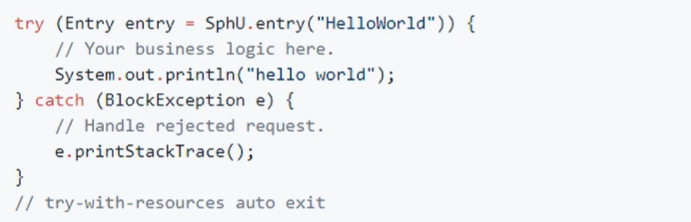


>   三个核心 API（了解即可）

-   SphU 定义资源
-   Tracer 定义统计
-   ContextUtil 定义了上下文


## 41、Sentinel 之服务熔断和整合


>   经过上面篇章的学习，我们已经认识了服务限流规则、降级、以及热点 Key 的知识，下面我们将继续学习，对服务熔断的配置，这里我们将对 sentinel 整合 ribbon + openFeign + fallback 等知识点，实际工作中可以用这个


### 1、服务熔断之 Ribbon 环境搭建


#### 1、Ribbon 系列 我们还将新建以下工程

-   启动 nacos 和 sentinel

-   服务提供者 9003/9004

    >   新建 `cloudalibaba-provider-payment9003/9004` 两个微服务
    >
    >   1.  建 Module
    >   2.  改 POM
    >   3.  写 YML
    >   4.  主启动
    >   5.  业务类 (稍有不同)

-   服务消费者 84

    >   新建 `cloudalibaba-consumer-nacos-order84`  
    >
    >   1.  建 Module
    >   2.  改 POM
    >   3.  写 YML
    >   4.  主启动
    >   5.  业务类 


#### 2、整体架构图说明


### 2、搭建服务提供者 9003/9004


#### 1、建 Module

>   `cloudalibaba-provider-payment9003`

#### 2、改 POM

>   引入以下依赖

```xml
<dependencies>
    <!--SpringCloud Alibaba Nacos-->
    <dependency>
        <groupId>com.alibaba.cloud</groupId>
        <artifactId>spring-cloud-starter-alibaba-nacos-discovery</artifactId>
        <version>2.2.5.RELEASE</version>
    </dependency>

    <!-- SpringCloud Alibaba Sentinel-datasource-nacos 后续持久化用到 -->
    <dependency>
        <groupId>com.alibaba.csp</groupId>
        <artifactId>sentinel-datasource-nacos</artifactId>
    </dependency>

    <!--SpringCloud alibaba Sentinel-->
    <dependency>
        <groupId>com.alibaba.cloud</groupId>
        <artifactId>spring-cloud-starter-alibaba-sentinel</artifactId>
        <version>2.2.5.RELEASE</version>
    </dependency>

    <!-- openfeign -->
    <dependency>
        <groupId>org.springframework.cloud</groupId>
        <artifactId>spring-cloud-starter-openfeign</artifactId>
    </dependency>

    <!-- 引入自己定义的 api 通用包项目，可以使用 Payment 支付的 Entity -->
    <dependency>
        <groupId>org.lee.springcloud</groupId>
        <artifactId>cloud-api-commons</artifactId>
        <version>${project.version}</version>
    </dependency>

    <!--  web 和 actuator 是标配、必须要写  -->
    <dependency>
        <groupId>org.springframework.boot</groupId>
        <artifactId>spring-boot-starter-web</artifactId>
    </dependency>

    <dependency>
        <groupId>org.springframework.boot</groupId>
        <artifactId>spring-boot-starter-actuator</artifactId>
    </dependency>

    <!-- 数据源和持久化框架配置 -->
    <!--mybatis 和 springboot 整合-->
    <dependency>
        <groupId>org.mybatis.spring.boot</groupId>
        <artifactId>mybatis-spring-boot-starter</artifactId>
    </dependency>

    <!-- druid数据源-->
    <dependency>
        <groupId>com.alibaba</groupId>
        <artifactId>druid-spring-boot-starter</artifactId>
        <version>1.1.10</version>
    </dependency>

    <!--mysql-connector-java-->
    <dependency>
        <groupId>mysql</groupId>
        <artifactId>mysql-connector-java</artifactId>
    </dependency>

    <!--jdbc-->
    <dependency>
        <groupId>org.springframework.boot</groupId>
        <artifactId>spring-boot-starter-jdbc</artifactId>
    </dependency>

    <!-- 导入 Swagger 配置 -->
    <dependency>
        <groupId>io.springfox</groupId>
        <artifactId>springfox-swagger2</artifactId>
    </dependency>

    <dependency>
        <groupId>io.springfox</groupId>
        <artifactId>springfox-swagger-ui</artifactId>
    </dependency>

    <dependency>
        <groupId>org.projectlombok</groupId>
        <artifactId>lombok</artifactId>
        <optional>true</optional>
    </dependency>

    <dependency>
        <groupId>org.springframework.boot</groupId>
        <artifactId>spring-boot-starter-test</artifactId>
    </dependency>
</dependencies>
```


#### 3、写 YML

>   我们引入了数据源，mybatis、支持了对 mysql 的持久化操作

```yaml
server:
  port: 9003

spring:
  application:
    name: nacos-payment-provider
  cloud:
    # 配置 nacos 服务注册地址
    nacos:
      discovery:
        server-addr: 192.168.1.166:8848
    sentinel:
      transport:
        # 配置 Sentinel Dashboard 地址
        dashboard: 192.168.1.166:9100
        # 如果 Sentinel 服务在远程，则需要添加对本地ip的监听
        clientIp: 192.168.1.3
        # 默认 8719端口：如果被占用从 8719 开始一次 +1 扫描. 直到找出未被占用的端口
        port: 8719

  # 配置数据源
  datasource:
    type: com.alibaba.druid.pool.DruidDataSource  # 当前数据源操作类型
    driver-class-name: org.gjt.mm.mysql.Driver    # mysql驱动包
    url: jdbc:mysql://192.168.1.166:3306/springcloud_db?useUnicode=true&characterEncoding=utf8&useSSL=false
    username: home
    password: Lee193654300_

# 配置 mybatis 映射文件路径 和 包别名路径
mybatis:
  mapper-locations: classpath:mapper/*.xml
  type-aliases-package: com.lee.springcloud.entities

# 暴漏要监控的服务
management:
  endpoints:
    web:
      exposure:
        include: '*'
```


#### 4、主启动


```java
package com.lee.cloudalibaba;

import org.springframework.boot.SpringApplication;
import org.springframework.boot.autoconfigure.SpringBootApplication;
import org.springframework.cloud.client.discovery.EnableDiscoveryClient;

@EnableDiscoveryClient
@SpringBootApplication
public class SpringBootNacosPayment9003 {
    public static void main(String[] args) {
        SpringApplication.run(SpringBootNacosPayment9003.class, args);
    }
}
```


#### 5、业务类 (稍有不同)


##### 1、编写 dao 接口

```java
package com.lee.cloudalibaba.dao;

import com.lee.springcloud.entities.Payment;
import org.apache.ibatis.annotations.Mapper;
import org.apache.ibatis.annotations.Param;

/**
 * @Repository
 *   这里推荐使用 Mapper、因为 Repository 插入的时候可能有问题
 */
@Mapper
public interface PaymentDao {

    /**
     * 创建(新增)一个支付对象
     * @param payment
     * @return
     */
    int createPayment(Payment payment);

    /**
     * 根据 id 获取一个 Payment 对象
     * @param id
     * @return
     */
    Payment getPaymentById(@Param("id") Long id);
}
```


##### 2、编写 `Mapper.xml`


>   在 resource 文件夹下建立一个 mapper 文件，`mySql` 的 `Mapper.xml` 配置文件都放在里面

```xml
<?xml version="1.0" encoding="UTF-8" ?>
<!DOCTYPE mapper
        PUBLIC "-//mybatis.org//DTD Mapper 3.0//EN"
        "http://mybatis.org/dtd/mybatis-3-mapper.dtd">

<mapper namespace="com.lee.cloudalibaba.dao.PaymentDao">

    <resultMap id="BaseResultMap" type="com.lee.springcloud.entities.Payment">
        <id column="id" property="id" jdbcType="BIGINT" />
        <id column="serial" property="serial" jdbcType="VARCHAR"/>
    </resultMap>
    
    <!--
        useGeneratedKeys 插入成功返回主键
        keyProperty 指定主键是谁，指定后插入主键就不用显示写了
        -->
    <insert id="createPayment" parameterType="Payment" useGeneratedKeys="true" keyProperty="id">
         insert into payment(serial) values(#{serial});
    </insert>

    <select id="getPaymentById" parameterType="Long" resultMap="BaseResultMap">
         select id, serial from payment where id = #{id}
    </select>
</mapper>
```


##### 3、编写 service 接口/实现


>   service 接口

```java
package com.lee.cloudalibaba.service;

import com.lee.springcloud.entities.Payment;
import org.apache.ibatis.annotations.Param;

public interface PaymentService {

    int createPayment(Payment payment);

    Payment getPaymentById(@Param("id") Long id);
}
```


>   service 实现类

```java
package com.lee.cloudalibaba.service.impl;

import com.lee.cloudalibaba.dao.PaymentDao;
import com.lee.cloudalibaba.service.PaymentService;
import com.lee.springcloud.entities.Payment;
import org.springframework.stereotype.Service;

import javax.annotation.Resource;

@Service
public class PaymentServiceImpl implements PaymentService {

    /**
     * 这里没用 Spring 的 @Autowrite
     * 而是用了 Java 自带的 @Resource 注解,也可以进行依赖注入
     */
    @Resource
    private PaymentDao paymentDao;

    @Override
    public int createPayment(Payment payment) {
        return paymentDao.createPayment(payment);
    }

    @Override
    public Payment getPaymentById(Long id) {
        return paymentDao.getPaymentById(id);
    }
}
```


##### 4、编写 controller


>   三个接口：
>
>   -   `CommonResult createPayment(@RequestBody Payment payment)`  创建订单
>   -   `CommonResult getPaymentById(@PathVariable("id") Long id)`  根据ID查询
>   -   `String TestOpenFeignTimeOut() throws InterruptedException` 测试超时

```java
package com.lee.cloudalibaba.controller;

import com.lee.cloudalibaba.service.PaymentService;
import com.lee.springcloud.entities.CommonResult;
import com.lee.springcloud.entities.Payment;
import io.swagger.annotations.Api;
import io.swagger.annotations.ApiOperation;
import lombok.extern.slf4j.Slf4j;
import org.springframework.beans.factory.annotation.Value;
import org.springframework.web.bind.annotation.*;
import javax.annotation.Resource;

@Slf4j
@RestController
@Api("服务提供者：支付模块-9003")
public class PaymentController {

    //获取本服务的端口号
    @Value("${server.port}")
    private String serverPort;

    @Resource
    private PaymentService paymentService;

    @ApiOperation("创建一个支付流水")
    @PostMapping(value = "/payment/createPayment")
    public CommonResult createPayment(@RequestBody Payment payment){

        int createResult = paymentService.createPayment(payment);
        log.info("*******插入数据：" + payment + " 结果：" + createResult);

        if(createResult > 0){
            return new CommonResult(200, "插入数据成功, 端口号：" + serverPort, createResult);
        }else{
            return new CommonResult(444, "插入数据失败", null);
        }
    }

    @ApiOperation("查询一个支付流水号")
    @GetMapping(value = "/payment/get/{id}")
    public CommonResult getPaymentById(@PathVariable("id") Long id){
        Payment payment = paymentService.getPaymentById(id);
        log.info("*******查询结果：" + payment);

        if(payment != null){
            return new CommonResult(200, "查询成功, 端口号：" + serverPort, payment);
        }else{
            return new CommonResult(444, "没有对应的记录、查询ID：" + id + " , 端口号：" + serverPort, null);
        }
    }

    @ApiOperation("OpenFeign超时测试")
    @GetMapping("/payment/timeout")
    public String TestOpenFeignTimeOut() throws InterruptedException {
        Thread.sleep(500);
        return serverPort;
    }
}
```


##### 5、编写 config


>   主要是增加了对 Swagger 界面的支持，方便调用接口测试

```java
package com.lee.cloudalibaba.config;

import org.springframework.context.annotation.Bean;
import org.springframework.context.annotation.Configuration;
import org.springframework.core.env.Environment;
import springfox.documentation.builders.RequestHandlerSelectors;
import springfox.documentation.service.ApiInfo;
import springfox.documentation.service.Contact;
import springfox.documentation.spi.DocumentationType;
import springfox.documentation.spring.web.plugins.Docket;
import springfox.documentation.swagger2.annotations.EnableSwagger2;

import java.util.ArrayList;

/**
 * 配置 Swagger
 */
@Configuration
@EnableSwagger2 //开启 Swagger2
public class SwaggerConfig {

    /**
     * 配置 Swagger Docket 的 bean 实例
     * @param environment
     * @return
     */
    @Bean
    public Docket docket(Environment environment){

        //apiInfo() 可以设置 Swagger 界面的描述
        return new Docket(DocumentationType.SWAGGER_2)
                /**
                 * 添加 Swagger 的描述信息
                 */
                .apiInfo(getApiInfo())
                /**
                 * 分组
                 */
                .groupName("cloudalibaba-provider-payment9003")
                .select()
                /**
                 * apis：添加要扫描的 api 接口规则
                 *   RequestHandlerSelectors
                 *      any()：扫描全部
                 *      none()：不扫描
                 *      withClassAnnotation()：扫描类上的注解
                 *      withMethodAnnotation()：扫描方法上的注解
                 *      basePackage()：扫描包下的所有 (最常用)
                 */
                .apis(RequestHandlerSelectors.basePackage("com.lee.cloudalibaba.controller"))
                /**
                 * paths()：设置过滤规则
                 */
                /*.paths(PathSelectors.ant("/swagger/**"))*/
                .build();
    }

    /**
     * 配置 Swagger 的接口描述信息
     * @return
     */
    private ApiInfo getApiInfo(){
        //配置作者信息
        Contact contact = new Contact("Lee Provider", "https://space.bilibili.com/486305074", "javaleerf@163.com");

        return new ApiInfo(
                "服务提供者：支付模块9003",
                "SpringCloudAlibaba 即将启航",
                "v1.0",
                "https://space.bilibili.com/486305074",
                contact,
                "Apache 2.0",
                "http://www.apache.org/licenses/LICENSE-2.0",
                new ArrayList()
        );
    }
}
```


#### 6、搭建环境 9004


>   这一步和9003步骤完全一样，代码也完全一样，因为我们要在本地模拟一个支付服务的集群。唯一不一样的就是记得改 yml 端口号


### 3、搭建环境-服务消费者 84


#### 1、建立 Module

>   `cloudalibaba-consumer-nacos-order84`  


#### 2、改 POM

```xml
<dependencies>
    <!--SpringCloud Alibaba Nacos-->
    <dependency>
        <groupId>com.alibaba.cloud</groupId>
        <artifactId>spring-cloud-starter-alibaba-nacos-discovery</artifactId>
        <version>2.2.5.RELEASE</version>
    </dependency>

    <!-- SpringCloud Alibaba Sentinel-datasource-nacos 后续持久化用到 -->
    <dependency>
        <groupId>com.alibaba.csp</groupId>
        <artifactId>sentinel-datasource-nacos</artifactId>
    </dependency>

    <!--SpringCloud alibaba Sentinel-->
    <dependency>
        <groupId>com.alibaba.cloud</groupId>
        <artifactId>spring-cloud-starter-alibaba-sentinel</artifactId>
        <version>2.2.5.RELEASE</version>
    </dependency>

    <!-- openfeign -->
    <dependency>
        <groupId>org.springframework.cloud</groupId>
        <artifactId>spring-cloud-starter-openfeign</artifactId>
    </dependency>

    <!-- 引入自己定义的 api 通用包项目，可以使用 Payment 支付的 Entity -->
    <dependency>
        <groupId>org.lee.springcloud</groupId>
        <artifactId>cloud-api-commons</artifactId>
        <version>${project.version}</version>
    </dependency>

    <!--  web 和 actuator 是标配、必须要写  -->
    <dependency>
        <groupId>org.springframework.boot</groupId>
        <artifactId>spring-boot-starter-web</artifactId>
    </dependency>

    <dependency>
        <groupId>org.springframework.boot</groupId>
        <artifactId>spring-boot-starter-actuator</artifactId>
    </dependency>

    <!-- 导入 Swagger 配置 -->
    <dependency>
        <groupId>io.springfox</groupId>
        <artifactId>springfox-swagger2</artifactId>
    </dependency>

    <dependency>
        <groupId>io.springfox</groupId>
        <artifactId>springfox-swagger-ui</artifactId>
    </dependency>

    <dependency>
        <groupId>org.projectlombok</groupId>
        <artifactId>lombok</artifactId>
        <optional>true</optional>
    </dependency>

    <dependency>
        <groupId>org.springframework.boot</groupId>
        <artifactId>spring-boot-starter-test</artifactId>
    </dependency>
</dependencies>
```


#### 3、写 YML

```yaml
server:
  port: 84

spring:
  application:
    name: nacos-order-consumer
  cloud:
    # 配置 nacos 服务注册地址
    nacos:
      discovery:
        server-addr: 192.168.1.166:8848
    sentinel:
      transport:
        # 配置 Sentinel Dashboard 地址
        dashboard: 192.168.1.166:9100
        # 如果 Sentinel 服务在远程，则需要添加对本地ip的监听
        clientIp: 192.168.1.3
        # 默认 8719端口：如果被占用从 8719 开始一次 +1 扫描. 直到找出未被占用的端口
        port: 8719

# 消费者要去访问的微服务名称(注册进服务注册中心中的名字)
service-url:
  nacos-user-service: http://nacos-payment-provider
```


#### 4、主启动

```java
package com.lee.cloudalibaba;

import org.springframework.boot.SpringApplication;
import org.springframework.boot.autoconfigure.SpringBootApplication;
import org.springframework.cloud.client.discovery.EnableDiscoveryClient;
import org.springframework.cloud.openfeign.EnableFeignClients;

/**
 * 开启 OpenFeign 的客户端功能
 */
@EnableFeignClients
@EnableDiscoveryClient
@SpringBootApplication
public class SpringCloudNacosOrder84 {
    public static void main(String[] args) {
        SpringApplication.run(SpringCloudNacosOrder84.class, args);
    }
}
```


#### 4、业务类


##### 1、编写 service

>   注意：这里我们直接引入对 `openFeign` 的支持，简化 Controller 层代码

```java
package com.lee.cloudalibaba.service;

import com.lee.springcloud.entities.CommonResult;
import com.lee.springcloud.entities.Payment;
import org.springframework.cloud.openfeign.FeignClient;
import org.springframework.stereotype.Component;
import org.springframework.web.bind.annotation.GetMapping;
import org.springframework.web.bind.annotation.PathVariable;
import org.springframework.web.bind.annotation.PostMapping;
import org.springframework.web.bind.annotation.RequestBody;

@Component
/**
 * @FeignClient
 *   代表我们要从注册中心中调用哪个服务的定义方法
 */
@FeignClient(value = "nacos-payment-provider")
public interface PaymentFeignService {

    /**
     * 这里的定义取自 payment9003 服务的 Controller 里的接口定义
     * @param payment
     * @return
     */
    @PostMapping(value = "/payment/createPayment")
    CommonResult createPayment(@RequestBody Payment payment);

    @GetMapping(value = "/payment/get/{id}")
    CommonResult getPaymentById(@PathVariable("id") Long id);

    @GetMapping("/payment/timeout")
    String testOpenFeignTimeOut();
}
```


##### 2、编写 controller

```java
package com.lee.cloudalibaba.controller;

import com.lee.cloudalibaba.service.PaymentFeignService;
import com.lee.springcloud.entities.CommonResult;
import com.lee.springcloud.entities.Payment;
import lombok.extern.slf4j.Slf4j;
import org.springframework.web.bind.annotation.GetMapping;
import org.springframework.web.bind.annotation.PathVariable;
import org.springframework.web.bind.annotation.PostMapping;
import org.springframework.web.bind.annotation.RestController;

import javax.annotation.Resource;

@Slf4j
@RestController
public class CircleBreakerController {

    /**
     * 使用了 OpenFeign Controller 层的调用轻松多了
     */
    @Resource
    private PaymentFeignService paymentFeignService;

    @PostMapping("/consumer/payment/createPayment")
    public CommonResult<Payment> createPayment(Payment payment){
        return paymentFeignService.createPayment(payment);
    }

    @GetMapping("/consumer/payment/get/{id}")
    public CommonResult<Payment> getPaymentById(@PathVariable("id") Long id){
        CommonResult<Payment> resultPayment = paymentFeignService.getPaymentById(id);
        if(id == 4){
            throw new IllegalArgumentException("IllegalArgumentException：非法参数异常....");
        }else if(resultPayment.getData() == null){
            throw new NullPointerException("NullPointerException：该 ID 没有对应的记录、空指针异常");
        }
        return resultPayment;
    }

    @GetMapping("/consumer/payment/timeout")
    public String testOpenFeignTimeOut(){
        return paymentFeignService.testOpenFeignTimeOut();
    }
}
```


##### 3、编写 `config`


###### 1、编写 Swagger 的配置


>   这里其实跟 9003 的 Swagger 配置大差不差，这里省略，需要就从 9003 处拷贝代码


###### 2、编写 Ribbon 负载均衡配置

```java
package com.lee.cloudalibaba.config;

import org.springframework.cloud.client.loadbalancer.LoadBalanced;
import org.springframework.context.annotation.Bean;
import org.springframework.context.annotation.Configuration;
import org.springframework.web.client.RestTemplate;

/**
 * Ribbon 负载均衡配置类
 */
@Configuration
public class ApplicationContextConfig {

    @Bean
    @LoadBalanced  //开启负载均衡
    public RestTemplate getRestTemplate(){
        return new RestTemplate();
    }
}
```


### 4、启动所有服务9003/9004/84进行测试


#### 1、需要确保以下服务正常启动


>   确保 `mysql` 服务处于运行状态
>
>   确保 `nacos` 服务处于运行状态
>
>   确保 Sentinel 服务处于运行状态


#### 2、我们启动之后进行访问


##### 1、检查 nacos 管理界面


##### 2、检查 Sentinel 管理界面


##### 3、测试所有微服务 Swagger 

>   确保服务提供者 9003/9004 自测 Swagger 通过
>
>   确保服务消费者 84 自测 Swagger 通过，并且访问注意查看调用端口是否 Ribbon 负载均衡
>
>   至此，环境配置方面告一段落，我们将进行 Sentinel 的进一步整合使用


### 5、Sentinel 服务熔断规则配置


#### 1、服务熔断无配置


1、服务无熔断配置

>   我们改造微服务 84 的 Controller 里面的 `getPaymentById` 方法，增加一个注解
>
>   我们只配置 @Sentinel 最基础的 value 项，不配置熔断限流的兜底方法，

```java
@GetMapping("/consumer/payment/get/{id}")
@SentinelResource(value = "fallback")
public CommonResult<Payment> getPaymentById(@PathVariable("id") Long id){
    CommonResult<Payment> resultPayment = paymentFeignService.getPaymentById(id);
    if(id == 4){
        throw new IllegalArgumentException("IllegalArgumentException：非法参数异常....");
    }else if(resultPayment.getData() == null){
        throw new NullPointerException("NullPointerException：该 ID 没有对应的记录、空指针异常");
    }
    return resultPayment;
}
```


2、重启进行测试我们发现，只配置了最基础的 value 项后，我们调用 接口查询 ID 为 4，或者查询一个不存在的 ID ，服务会抛出 Java 程序的原生异常，非常不友好

>   http://localhost:84/consumer/payment/get/4

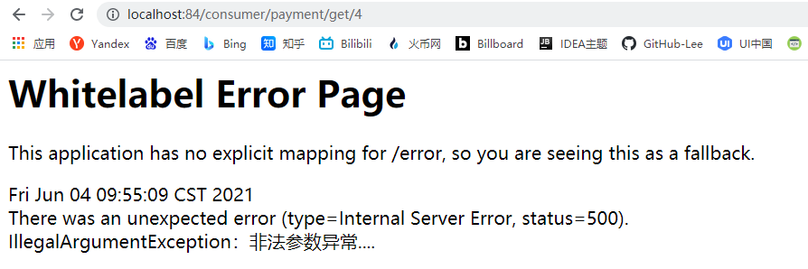


#### 2、服务熔断仅配置 `fallback`


1、我们改造 84 微服务，在 Controller 层改造以下方法，增加 `fallback` 属性

```java
@GetMapping("/consumer/payment/get/{id}")
@SentinelResource(value = "payment/get/{id}", fallback = "getPayment_fallBack")
public CommonResult<Payment> getPaymentById(@PathVariable("id") Long id){
    CommonResult<Payment> resultPayment = paymentFeignService.getPaymentById(id);
    if(id == 4){
        throw new IllegalArgumentException("IllegalArgumentException：非法参数异常....");
    }else if(resultPayment.getData() == null){
        throw new NullPointerException("NullPointerException：该 ID 没有对应的记录、空指针异常");
    }
    return resultPayment;
}

public static CommonResult<Payment> getPayment_fallBack(@PathVariable Long id, Throwable ex){
    Payment payment = new Payment(id, "null");
	return new CommonResult<>(444, "[fallBack] Message ：" + ex.getMessage(), payment);
}
```


2、重启 84 微服务，我们继续调用接口进行测试

>   http://localhost:84/consumer/payment/get/4

**我们发现配置了  `fallback` 之后，如果 Java 程序抛出运行时异常，就是调用 `fallback` 指定的方法**


#### 3、服务熔断仅配置 `blockHandler`


1、继续改造微服务 84

>   这里我们配置如下，注释掉了 `fallback`，增加了 `blockHandler`
>
>   `@SentinelResource(value = "payment/get/{id}", blockHandler = "getPayment_blockHandler")`

```java
@GetMapping("/consumer/payment/get/{id}")
//只配置 fallback：结论、可以拦截了 Java 运行时异常走指定方法
//@SentinelResource(value = "payment/get/{id}", fallback = "getPayment_fallBack")

//只配置 blockHandler：结论、只负责 sentinel 控制台违规配置
@SentinelResource(value = "payment/get/{id}", blockHandler = "getPayment_blockHandler")
public CommonResult<Payment> getPaymentById(@PathVariable("id") Long id){
    CommonResult<Payment> resultPayment = paymentFeignService.getPaymentById(id);
    if(id == 4){
        throw new IllegalArgumentException("IllegalArgumentException：非法参数异常....");
    }else if(resultPayment.getData() == null){
        throw new NullPointerException("NullPointerException：该 ID 没有对应的记录、空指针异常");
    }
    return resultPayment;
}
```


2、我们还需要在 Controller 中增加一个 `blockHandler` 指定的方法

>   注意： `blockHandler`  指定的方法参数跟的异常是 `BlockException` 类型，不是这个类型无效

```java
public static CommonResult<Payment> getPayment_blockHandler(@PathVariable Long id, BlockException blockException){
    Payment payment = new Payment(id, "null");
    return new CommonResult<>(445, "[blockHandler-sentinel限流] Message ：" + blockException.getMessage(), payment);
}
```


3、重启微服务84，我们先传入4进行非法测试

>   http://localhost:84/consumer/payment/get/4
>
>   果然，`BlockException` 的作用域仅限在 Sentinel 控制台配置的限流降级规则内生效


4、我们在 Sentinel 控制台对该接口进行限流处理

>   规则解读：1秒内来了大于2个请求时、就对该接口进行限流处理


5、之后我们进行正常的参数测试，查询ID 为 1的数据

>   http://localhost:84/consumer/payment/get/1
>
>   这是我们单次点击访问后的正常返回结果


>   但是，当我们狂点之后，发现服务就会被限流了，走了限流指定的方法


#### 4、服务熔断配置 `fallback` 和 `blockHandler`


1、我们改造微服务 84 的 Controller 里面的 `getPaymentById` 方法

>   @Sentinel 中配置了 `fallback` 和 `blockHandler`
>
>   若两者都进行了配置，则被限流降级而抛出 `BlockException` 时只会进入 `blockHandler` 处理
>
>   这个很好理解嘛，谁在外面包裹着、拦截着就会执行谁的方法，无疑  `fallback`  处理 Java 程序运行时异常，属于内层，而  `blockHandler` 在外按照限流规则进行拦截请求，属于外层

```java
@GetMapping("/consumer/payment/get/{id}")
//@SentinelResource(value = "payment/get/{id}", fallback = "getPayment_fallBack") 只配置 fallback：结论、可以拦截了 Java 运行时异常走指定方法
//@SentinelResource(value = "payment/get/{id}", blockHandler = "getPayment_blockHandler") 只配置 blockHandler：结论、只负责 sentinel 控制台违规配置
@SentinelResource(value = "payment/get/{id}", fallback = "getPayment_fallBack", blockHandler = "getPayment_blockHandler")
public CommonResult<Payment> getPaymentById(@PathVariable("id") Long id){
    CommonResult<Payment> resultPayment = paymentFeignService.getPaymentById(id);
    if(id == 4){
        throw new IllegalArgumentException("IllegalArgumentException：非法参数异常....");
    }else if(resultPayment.getData() == null){
        throw new NullPointerException("NullPointerException：该 ID 没有对应的记录、空指针异常");
    }
    return resultPayment;
}

public static CommonResult<Payment> getPayment_fallBack(@PathVariable Long id, Throwable ex){
    Payment payment = new Payment(id, "null");
    return new CommonResult<>(444, "[fallBack] Message ：" + ex.getMessage(), payment);
}

public static CommonResult<Payment> getPayment_blockHandler(@PathVariable Long id, BlockException blockException){
    Payment payment = new Payment(id, "null");
    return new CommonResult<>(445, "[blockHandler-sentinel限流] Message ：" + blockException.getMessage(), payment);
}
```


2、我们进行测试，我们先增加如下限流规则

>   配置解读：1 秒内来了超过 2 个请求，就会被快速失败


3、我们先访问正常存在的数据

>   http://localhost:84/consumer/payment/get/1
>
>   正常点 1 秒 1 个是没问题的，但是狂点就会如下限流


4、这是我们访问异常参数，让 Java 服务抛出异常

>   http://localhost:84/consumer/payment/get/4


>   以上因为点了一次，没有被 Sentinel 限流，服务正常访问，但是抛出的异常被 `fallback` 拦截了，如果我们狂点，服务还是会被限流，如下，走了 `blockHandler` 指定的方法
>
>   **这一点进一步验证了开头的规则**


#### 5、服务熔断之配置 `exceptionsTolgnore`


>   其实 @Sentinel 注解中还有一个属性，叫做 `exceptionsTolgnore`，具体如下配置如下
>
>   以下注明了该注解的作用及用法

```java
/**
 * 假如抛出了 exceptionsTolgnore 指定的异常
      fallback 兜底的方法不再生效了、没有降级的效果
 */
@SentinelResource(value = "payment/get/{id}", 
                  fallback = "getPayment_fallBack", 
                  blockHandler = "getPayment_blockHandler",
                  exceptionsTolgnore = {IllegalArgumentException.class})
```


以上排除了非法参数异常，我们再次访问链接，就会直接跳到 Error Page 界面

>   http://localhost:84/consumer/payment/get/4


#### 6、`@SentinelResource` 服务熔断属性小结


**小结：**

>   `@SentinelResource` 只配置 `fallback`：结论、可以拦截了 Java 运行时异常走指定方法
>
>   `@SentinelResource` 只配置 `blockHandler`：结论、只负责 sentinel 控制台违规配置
>
>   `@SentinelResource` 配置了`exceptionsTolgnore`：结论、如果抛出了 `exceptionsTolgnore` 指定的异常 `fallback` 兜底的方法不再生效了、没有降级的效果

**如果：**

>   `@SentinelResource`中同时配置了 `fallback` 和 `blockHandler`
>
>   若两者都进行了配置，如果被限流降级而抛出 `BlockException` 时只会进入 `blockHandler` 处理
>
>   这个很好理解嘛，谁在外面包裹着、拦截着就会执行谁的方法，无疑  `fallback`  处理 Java 程序运行时异常，属于内层，而  `blockHandler` 在外按照限流规则进行拦截请求，属于外层


### 6、Sentinel 服务熔断整合 Ribbon + OpenFeign


>   该步骤在搭建 9003/9004/84 三个微服务的时候，采用的就已经是整合方案，本小节整合省略


## 42、Sentinel 之持久化规则


### 1、Sentinel 限流规则问题回顾


>   默认情况下我们在 Web 界面配置的限流规则、降级规则、热点 Key 也好，在我们服务重启之后，这些规则也将消失，都是临时的，但是实际工作中这样肯定不行，我们不能因为重启服务而重新配置规则消耗了大量不必要的时间，那么 Sentinel 的持久化应该怎么配置呢？


**思路：**

将限流规则持久化进 `Nacos` 保存，只要刷新 84 某个 请求地址， Sentinel 控制台的限流规则就能看到 (懒加载)，只要 `Nacos` 里面的配置不删除，针对 8401 上的 Sentinel 上的流控规则持续有效


### 2、将 Sentinel 规则配置到 `Nacos`


1、我们需要导入以下依赖

>   我们改造 9003 这个微服务为例，增加以下依赖
>
>   注意：之前已经配置，无需重复导入

```xml
<!-- SpringCloud Alibaba Sentinel-datasource-nacos 后续持久化用到 -->
<dependency>
    <groupId>com.alibaba.csp</groupId>
    <artifactId>sentinel-datasource-nacos</artifactId>
</dependency>
```


2、在 yml 文件中增加以下配置

>   我们依旧改造 9003 微服务的 `yml`

```yaml
sentinel:
  datasource:
    ds1:
      nacos:
        # nacos 服务所在地址
        server-addr: 192.168.1.166:8848
        # 本微服务的名称
        dataId: nacos-payment-provider
        # 数据持久化的分组
        groupId: DEFAULT_GROUP
        data-type: json
        rule-type: flow
```


3、我们需要在 `nacos` 配置中心新建一个配置

>   我们新建一个配置文件，Data ID 为微服务的名称，其实就是 yaml 配置的如下：
>
>   spring:
>     application:
>       `name: nacos-payment-provider`


格式为 `JSON`，内容如下：

```json
[
    {
        "resource": "/payment/get/{id}",
        "limitApp": "default",
        "grade": 1,
        "count": 1,
        "strategy": 0,
        "controlBehavior": 0,
        "clusterMode": false
    }
]
```

-   resource：资源名
-   `limitApp`：来源应用
-   grade：阈值类型：0 表示线程数 | 1 表示 `QPS`
-   count：单机阈值
-   strategy：流控模式：0 表示直接  |  1 表示关联  |  2 表示排队等待
-   `controlBehavior`：流控效果：0 表示快速失败  |  1 表示 Warm Up  |  2 表示排队等待


4、我们重启微服务 9003，然后调用以下接口，因为 Sentinel 懒加载，配置可能过一会出现

>   http://localhost:9003/payment/get/1


5、之后我们查看 Sentinel 的流控规则，出现了我们的持久化配置


### 3、持久化规则最全 `JSON` 格式


#### 1、流控规则 JSON

```json
[
  {
    // 资源名
    "resource": "/test",
    // 针对来源，若为 default 则不区分调用来源
    "limitApp": "default",
    // 限流阈值类型(1:QPS;0:并发线程数）
    "grade": 1,
    // 阈值
    "count": 1,
    // 是否是集群模式
    "clusterMode": false,
    // 流控效果(0:快速失败;1:Warm Up(预热模式);2:排队等待)
    "controlBehavior": 0,
    // 流控模式(0:直接；1:关联;2:链路)
    "strategy": 0,
    // 预热时间（秒，预热模式需要此参数）
    "warmUpPeriodSec": 10,
    // 超时时间（排队等待模式需要此参数）
    "maxQueueingTimeMs": 500,
    // 关联资源、入口资源(关联、链路模式)
    "refResource": "rrr"
  }
]

```


#### 2、降级规则 JSON

```java
[
  {
  	// 资源名
    "resource": "/test1",
    "limitApp": "default",
    // 熔断策略（0:慢调用比例，1:异常比率，2:异常计数）
    "grade": 0,
    // 最大RT、比例阈值、异常数
    "count": 200,
    // 慢调用比例阈值，仅慢调用比例模式有效（1.8.0 引入）
    "slowRatioThreshold": 0.2,
    // 最小请求数
    "minRequestAmount": 5,
    // 当单位统计时长(类中默认1000)
    "statIntervalMs": 1000,
    // 熔断时长
    "timeWindow": 10
  }
]
```


#### 3、热点规则 JSON

```json
[
  {
  	// 资源名
    "resource": "/test1",
    // 限流模式（QPS 模式，不可更改）
    "grade": 1,
    // 参数索引
    "paramIdx": 0,
    // 单机阈值
    "count": 13,
    // 统计窗口时长
    "durationInSec": 6,
    // 是否集群 默认false
    "clusterMode": 默认false,
    // 
    "burstCount": 0,
    // 集群模式配置
    "clusterConfig": {
      // 
      "fallbackToLocalWhenFail": true,
   	  // 
      "flowId": 2,
      // 
      "sampleCount": 10,
      // 
      "thresholdType": 0,
      // 
      "windowIntervalMs": 1000
    },
    // 流控效果（支持快速失败和匀速排队模式）
    "controlBehavior": 0,
    // 
    "limitApp": "default",
    // 
    "maxQueueingTimeMs": 0,
    // 高级选项
    "paramFlowItemList": [
      {
      	// 参数类型
        "classType": "int",
      	// 限流阈值
        "count": 222,
      	// 参数值
        "object": "2"
      }
    ]
  }
]
```


#### 4、系统规则 JSON

```json
[
  {
  	// RT
    "avgRt": 1,
    // CPU 使用率
    "highestCpuUsage": -1,
    // LOAD
    "highestSystemLoad": -1,
    // 线程数
    "maxThread": -1,
    // 入口 QPS
    "qps": -1
  }
]
```


#### 5、授权规则 JSON

```java
[
  {
    // 资源名
    "resource": "sentinel_spring_web_context",
  	// 流控应用
    "limitApp": "/test",
    // 授权类型(0代表白名单；1代表黑名单。)
    "strategy": 0
  }
]
```


### 4、关于持久化的一些问题？


>   开源软件给个半成品，关键功能想用就得掏钱，跟一些免费游戏实际道具收费有啥区别？

>   持久化的功能非常鸡肋，本来就已经开发好了 Web 界面，为何不把界面的配置持久化到 `Nacos` 数据库？还需要自己手动添加配置去做持久化？这样接口一多，那么每个维护配置的成本将会增高，这不就是顺手做出来的功能怎么就嘎然而止了？


**前面的持久化远远不够的，在生产环境中使用  Sentinel，详细的参考官方文档吧** 

https://github.com/alibaba/Sentinel/wiki/%E5%9C%A8%E7%94%9F%E4%BA%A7%E7%8E%AF%E5%A2%83%E4%B8%AD%E4%BD%BF%E7%94%A8-Sentinel#%E5%8E%9F%E5%A7%8B%E6%A8%A1%E5%BC%8F


## 43、认识微服务分布式事务


>   分布式事务 `Seata` 框架学前夕必掌握的微服务分布式事务
>
>   **本小节你将收获以下知识**
>
>   -   了解分布式事务产生的原因
>   -   直到几种分布式事务解决方案：XA、TCC、消息事务、TA、SAGA
>   -   直到分布式事务各种解决方案的优缺点和使用场景
>   -   学会使用 `Seata` 来解决分布式事务


### 1、本地事务介绍


>   要了解分布式事务、必须先了解本地事务


本地事务，是指传统的单机数据库事务，是应用程序中一系列严密的操作，所有操作必须成功完成，否则在每个操作中所作的所有更改都会被撤消。也就是事务具有原子性，一个事务中的一系列的操作要么全部成功，要么一个都不做


#### 1、事务具备 ACID 原则


##### 1、原子性 (A)

>   所谓的原子性：在这个事务 (Transaction) 中的所有操作，要么全部完成，要么全部失败，没有中间状态。对于事务在执行中发生错误，所有的操作都会被回滚 (Rollback)，整个事务就像从来没有被执行过一样


##### 2、一致性 (C)

>   事务的执行必须保证系统的一致性，在事务开始之前和事务结束以后，数据库的完整性没有被破坏。
>
>   拿转帐为例：A 有 500 元，B 有 500 元，如果一个事务中 A 成功转给 B 50 元，那么不管发生什么，A 和 B 账户的数据之和必须是 1000 元。


##### 3、隔离性 ( I )

>   所谓的隔离性就是说，事务与事务之间不会互相影响，一个事务的中间状态不会被其他事务感知，数据库保证隔离性包括**四种不同的隔离级别**：
>
>   
>
>   | 事务隔离级别                        | 脏读 | 不可重复读 | 幻读 |
>   | ----------------------------------- | ---- | ---------- | ---- |
>   | 读未提交（`Read Uncommitted`）      | 是   | 是         | 是   |
>   | 不可重复读（`Read Committed`）      | 否   | 是         | 是   |
>   | 可重复读（`Repeatable Read`）(默认) | 否   | 否         | 是   |
>   | 串行化（`Serializable`）            | 否   | 否         | 否   |
>
>   
>
>   事务并发问题
>
>   **脏读**：事务 A 读取了事务 B 更新的数据，然后 B 回滚操作，那么A读取到的数据是脏数据
>
>   **不可重复读**：事务 A 多次读取同一数据，事务 B 在事务 A 多次读取的过程中，对数据作了更新并提交，导致事务A 多次读取同一数据时，结果不一致。
>
>   **幻读**：系统管理员 A 将数据库中所有学生的成绩从具体分数改为 A B C D E 等级，但是系统管理员 B 就在这个时候插入了一条具体分数的记录，当系统管理员 A 改结束后发现还有一条记录没有改过来，就好像发生了幻觉一样，这就叫幻读。
>
>   **小结**：不可重复读的和幻读很容易混淆，不可重复读侧重于修改，幻读侧重于新增或删除。解决不可重复读的问题只需锁住满足条件的行，解决幻读需要锁表


##### 4、持久性 (D)

>   一旦事务提交了，那么事务对数据所做的变更就完全保存在了数据库中，即使发生停机断电，系统宕机亦是如此


小结：

ACID 四个特性最终要达成的目的就是一致性。数据库设计的时候就给我们提供了AID： 原子性、隔离性、持久性三个 特性。一致性就是要靠我们的业务逻辑来严密处理，我们不能 A 给 B 转账 200，A 和 B 账户都多了 200，这显然是不合理的也不符合一致性，所以一致性要靠我们的代码进行严密约束。如果我们要深入研究的话也就是研究数据库的 AID 三个特性。

其中隔离性是靠  MVCC（ Multi - Version Concurrency Control ）机制来保证的、对一行数据的读和写两个操作默认是不会通过加锁互斥来保证隔离性、避免了频繁加锁，互斥、而在串行化隔离级别为了保证较高的隔离性是通过将所有操作加锁互斥来实现的


那么原子性和持久性是靠什么来实现的呢？我们继续往下看


>   在数据库中，即有存放数据的文件，也有存放日志的文件，日志在内存中也是有缓存 Log Buffer，也有磁盘文件 Log File。MySQL 中的日志文件，有这么两种与事务有关：undo 日志 与 redo 日志


#### 1、undo log (记录原始值)


数据库事务具备原子性（Atomicity）：如果事务执行失败，需要把数据回滚，原子性可以利用 undo 日志来实现

数据同时还具备持久性（Durability）：事务对数据所做的变更就完全保存在了数据库，不能因为故障而丢失，

Undo Log 的原理也很简单，为了满足事务的原子性，在操作任何数据之前，首先将数据备份到 Undo Log，然后进行数据的修改，MYSQL 会保留需改前的数据 undo 回滚日志、并且用两个隐藏字段 `trx_id` 和 `roll_pointer` 把这些 undo 日志串联起来形成一个历史记录版本链

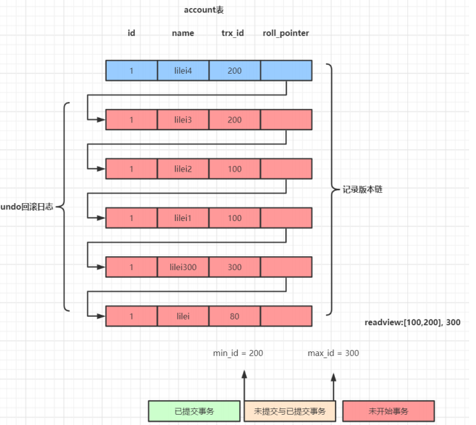

如果出现了错误或者用户执行了 `RollBack` 短句，系统可以利用 Undo Log 中的备份将数据恢复到事务开始之前的状态（类比 Git 版本管理），数据库写入到磁盘之前，**会把数据先缓存在内存中**，事务提交时才会写入磁盘中

假如有 A 、B 两个数据，值分别为 1 、2

>   -   事务开始
>   -   记录 A = 1 到 undo log 版本链
>   -   修改 A = 3
>   -   记录 B = 2 到 undo log 版本链
>   -   修改 B = 4
>   -   将 undo log  写入到磁盘
>   -   将数据写入磁盘
>   -   事务提交

-   如何保证持久性？
    -   事务提交前，数据不一定持久化，数据如果提交了，那就肯定持久化了
-   如何保证原子性？
    -   每次对数据修改，都会把修改前的数据记录在 undo log 版本链上，那么需要回滚时，可以读取 undo log，恢复数据
    -   若系统在 G 和 H 之间崩溃，此时事务未提交，需要回滚，而 undo log 已被持久化，可以根据 undo log 来恢复数据
    -   若系统在 G之前崩溃，此时数据并未持久化到磁盘，数据依然保持在事务之前的状态


**小结：undo log 解决了数据回滚的问题**

**缺陷：每个事务提交前将数据和 Undo Log 写入磁盘，这样会导致大量的磁盘 IO ，因此性能很低，如果能够将数据缓存一段时间，就能减少 IO 提高性能，但是这样就会丧失事务的持久性，因此引入了另外一种机制来实现持久化，即 redo log**


#### 2、redo log (记录修改值)


和 Undo Log 相反，Redo Log 记录的是新数据的备份，在事务提交前，只要将 Redo Log 持久化即可，不需要将数据持久化，减少了 IO 的次数


先看看基本原理

>   undo + redo 事务的简化过程

假设有 A 、B 两个数据，值分别为 1 、2

-   事务开始
-   记录 A = 1 到 undo log buffer
-   修改 A = 3 
-   记录 A = 3 到 redo log buffer
-   记录 B = 2 到 undo log buffer
-   修改 B = 4
-   记录 B = 4 到 redo log buffer
-   将 undo log 写入磁盘（其实是写入 redo log 的）
-   将 redo log 写入磁盘
-   事务提交

区别：这里和 undo log 的步骤对比少了一步，就是把数据写入磁盘. 


那把数据写入磁盘和把 undo 和 redo log 写入磁盘有啥区别呢？写 log 方式进磁盘采用的是高性能的写入，写磁盘分为

-   随机写：而写入数据到磁盘则是随机写，数据分布在磁盘上的不同位置，比如 A 和 B 是磁盘不同区域分开的存储的，那么写入 A 的时候先要做寻址，找到后再写入，之后在寻址 B ，再写入，而寻址比写入要耗费更多的时间。

-   顺序写：顺序写就是数据在磁盘上开辟了连续的空间，写入的时候就一直往下写就可以了。寻址消耗几乎忽略不计


>   安全性能问题

-   如何保证原子性？
    -   如果在事务提交前故障，通过undo log日志恢复数据。如果undo log都还没写入，那么数据就尚未持久化，无需回滚
-   如何保证持久化？
    -   大家会发现，这里并没有出现数据的持久化。因为数据已经写入redo log，而redo log持久化到了硬盘，因此只要到了步骤l以后，事务是可以提交的。
-   内存中的数据库数据合适持久化到磁盘？
    -   因为 redo log 已经持久化，因此数据库数据写入磁盘与否影响不大，不过为了避免出现脏数据（内存中与磁盘不一致)，事务提交后也会将内存数据刷入磁盘（也可以按照固设定的频率刷新内存数据到磁盘中)
-   redo log 何时写入磁盘？
    -   redo log 会在事务提交之前
    -   redo log buffer 满了的时候写入磁盘


>   这里还存在两个问题

1、之前是写 undo 和数据库到硬盘，现在是写 undo 和 redo 到磁盘，似乎没有减少 IO 次数？

-   数据库数据写入时随机 IO，性能较差
-   redo log 在初始化时会开辟一段连续的空间，写入顺序 IO，性能很好
-   实际上 undo log 并不是直接写入磁盘，而是先写入 redo log buffer 中，当 redo log 持久化时， undo log 就同时持久化到硬盘了

因此提交事务之前，只需要对 redo log 持久化即可

另外, redo log 并不是写入一次就持久化一次，redo log在内存中也有自己的缓冲池: redo log buffer。每次写 redo log 都是写入到 buffer，在提交时一次性持久化到磁盘，减少 IO 次数。


2、redo log 数据是写入内存 buffer  中，当 buffer 满或者事务提交时，将 buffer 数据写入磁盘、redo log 中记录的数据，有可能包含尚未提交事务（因为 redo log buffer 满了就写磁盘），如果此时数据库崩溃，那么如何完成数据恢复（回滚）?

数据恢复有两种策略:

-   恢复时，只重做已经提交了的事务
-   恢复时，重做所有事务包括未提交的事务和回滚了的事务。然后通过 Undo Log 回滚那些未提交的事务

`Inodb` 引擎采用的是第二种方案，因此 undo log 要在 redo log 前持久化


### 2、认识分布式事务


#### 1、分布式事务概述


>   分布式事务，就是指不是在单个服务或者单个数据库架构下，产生的事务：
>
>   -   跨数据源的分布式事务
>   -   跨服务的分布式事务
>   -   综合情况


#### 2、跨数据源分布式事务


随着业务数据规模的快速发展，数据量越来越大，单库单表逐渐成为瓶颈，所以我们对数据库进行了水平拆分，将原单库单表拆分分成数据库分片，于是就产生了跨数据库事务的问题


#### 3、跨越服务分布式事务


在业务发展初期，“一块大饼"的单业务系统架构，能满足基本的业务需求。但是随着业务的快速发展，系统的访问量和业务复杂程度都在快速增长，单系统架构逐渐成为业务发展瓶颈，解决业务系统的高耦合、可伸缩问题的需求越来越强烈。如下图所示，按照面向服务（`SOA`）的架构的设计原则，将单业务系统拆分成多个业务系统，降低了各系统之间的耦合度，使不同的业务系统专注于自身业务，更有利于业务的发展和系统容量的伸缩。


>   最糟糕的是 即跨数据源又跨微服务，每个微服务都有独立的 JVM 事务管理器 (TM)


#### 4、分布式系统数据一致性问题


在数据库水平拆分、服务垂直拆分之后，一个业务操作通常要跨多个数据库、服务才能完成。在分布式网络环境下，我们无法保障所有服务、数据库都百分百可用，一定会出现部分服务、数据库执行成功，另一部分执行失败的问题。当出现部分业务操作成功、部分业务操作失败时，业务数据就会出现不一致。

例如电商行业中比较常见的下单付款案例，包括下面几个行为:·

-   创建新订单
-   扣减商品库存
-   从用户账户余额扣除金额


>   完成上面的操作需要访问三个不同的微服务和三个不同的数据库


在分布式环境下，肯定会出现部分操作成功、部分操作失败的问题，比如:订单生成了，库存也扣减了，但是用户账户的余额不足，这就造成数据不一致。

订单的创建、库存的扣减、1账户扣款在每一个服务和数据库内是一个本地事务，可以保证ACID原则。

但是当我们把三件事情看做一个事情事，要满足保证“业务"的原子性，要么所有操作全部成功，要么全部失败，不允许出现部分成功部分失败的现象，这就是分布式系统下的事务了。此时ACID难以满足，这是分布式事务要解决的问题


### 3、解决分布式事务的思路


>   解决分布式系统的思路就是 CAP 定理和 BASE 理论


#### 1、再讲 CAP 定理


>   什么是 CAP 定理呢？
>
>   1998年，加州大学的计算机科学家 Eric Brewer 提出，分布式系统有三个指标
>
>   -   Consistency (一致性)
>   -   Availability (可用性)
>   -   Partition tolerance (分区容错性)


它的第一个字母分别是 C、A、P，Eric Brewer 说，这三个指标不可能同时做到，最多只能同时较好的满足两个条件，这个结论就叫做 CAP 定理

CAP理论的核心是：一个分布式系统不可能同时满足很好的一致性，可用性和分区容错性这三个需求，因此 CAP原理将 `NoSQL` 数据库分成了满足 CA 原则，满足 CP 原则和满足 AP 三大类

-   CA - 单点集群，满足一致性，可用性的系统，通常在扩展性上不太强大
-   CP - 满足一致性，分区容忍性的系统，通常性能不是特别高
-   AP - 满足可用性，分区容忍性的系统，通常可能对一致性要求低一点


##### 1、Consistency 一致性


>   Consistency 中文叫做 "一致性"
>
>   意思是：写操作之后的读操作，必须返回该值。举例来说，某条记录是 `vo`，用户向 `G1` 发起一个写操作，将其改为 `v1`


>   接下来，用户的读操作就会得到 `v1`，这就叫一致性，但问题是，负载均衡有可能把请求转发到 `G2` 中，由于 `G2` 的值没有变化，因此返回的还是 `v0`，那么此时 `G1` 和 `G2` 读操作的结果不一致了，这就不满足一致性了


>   为了让 `G2` 也能变为 `v1`，就要在 `G1`写操作的时候，让 `G1` 向 `G2` 发送一条消息，要求 `G2` 也改成 `v1`。


>   这样的话用户不管向哪一台服务器数据都是一样的


##### 2、Availability 可用性


Availability 中文叫做 "可用性"：意思是只要收到用户的请求，服务器就必须给出回应(对和错不论)。

用户可以选择向 G1 或 G2 发起读操作。不管是哪台服务器，只要收到请求，就必须告诉用户，到底是 vo 还是 v1。如果服务器卡住了无响应，就不满足可用性。


##### 3、Partition tolerance 分区容错


>   先看Partition tolerance，中文叫做"分区容错"
>
>   大多数分布式系统都分布在多个子网络。每个子网络就叫做一个区 (partition) 。分区容错的意思是，区间通信可能失败。比如，一台服务器放在上海，另一台服务器放在北京，这就是两个区，它们之间可能因网络问题无法通信。

如下图：


上图中，`G1` 和 `G2` 是两台跨区的服务器。`G1` 向 `G2` 发送一条消息，`G2` 可能无法收到。系统设计的时候，必须考虑到这种情况。一般来说，分布式系统，分区容错无法避免，因此可以认为 CAP 的 P 总是成立。根据 CAP 定理，剩下的 C 和 A 无法同时做到


##### 4、Consistency 和 Availability 的矛盾


>   问题：一致性和可用性，为什么不可能同时成立?

答案很简单，因为可能通信失败（即出现分区容错)。

如果保证 `G2` 的一致性，那么 `G1` 必须在写操作时，锁定 `G2` 的读操作和写操作。只有数据同步后，才能重新开放读写。锁定期间，`G2` 不能读写，没有可用性 (A)。

如果保证 `G2` 的可用性，那么势必不能锁定 `G2`，所以一致性 (C) 不成立。

综上所述，`G2` 无法同时做到一致性和可用性、系统设计时只能选择一个目标。

-   如果追求一致性，那么无法保证所有节点的可用性
-   如果追求所有节点的可用性，那就没法做到一致性


>   几点疑问

-   怎样才能同时满足 CA ?
    -   除非是单点架构
-   如何要满足 `CP` ？
    -   对一致性要求高的场景，例如我们的 `Zookeeper` 就是这样，在服务节点间数据同步时，服务对外不可用
-   何时满足 AP ？
    -   对可用性要求较高的场景，例如 Eureka，必须保证注册中心随之可用，不然拉去不到服务就可能出问题


#### 2、Base 理论


##### 1、Base 理论介绍


>   Base 理论单词的缩写：
>
>   -   Basically Available (基本可用)
>   -   Soft state (软状态)
>   -   Eventually consistent (最终一致性)


##### 2、举例说明


而我们解决分布式事务，就是根据上述理论来实现。还以上面的下单减库存和扣款为例

>   订单服务、库存服务、用户服务及他们对应的数据库就是分布式应用中的三个部分

-   `CP` 方式：现在如果要满足事务的强一致性，就必须在订单服务数据库锁定的同时，对库存服务、用户服务数据资源同时锁定。等待三个服务业务全部处理完成，才可以释放资源。此时如果有其他请求想要操作被锁定的资源就会被阻塞，这样就是满足了 `CP`。这就是强一致，弱可用
-   AP方式：三个服务的对应数据库各自独立执行自己的业务，执行本地事务，不要求互相锁定资源。但是这个中间状态下，我们去访问数据库, 可能遇到数据不一致的情况、不过我们需要做一些后补措施，保证在经过一段时间后，数据最终满足一致性，这就是高可用，但弱一致(最终一致)


##### 3、延伸思想


由于上面的两种思想、延伸出了很多的分布式事务解决方案：

-   XA
-   TCC
-   可靠消息最终一致
-   TA

要想了解这些延伸思想，我们继续往下看


#### 3、分阶段提交


##### 1、DTP 和 `XA`


分布式事务的解决手段之一，就是两阶段提交协议 (`2PC：Two-Phase Commit`)，那什么是两阶段提交协议呢？

>   1994年，X/Open 组织 ( 即现在的 Open Group )定义了分布式事务处理的 DTP 模型，该模型包含这样几个角色：

-   应用程序 ( AP )：我们的微服务
-   事务管理器 ( TM )：全局事务管理者
-   资源管理器 ( RM )：一般是数据库
-   通信资源管理器 ( `CRM` )：是 TM 和 RM 的通信中间件

在该模型中，一个分布式事务（全局事务）**可以被拆分成许多个本地事务**，运行在不同的 AP 和 RM 上。每个本地事务的 ACID 很好实现，但是全局事务必须保证其中包含的每一个本地事务都能同时成功，若有一个本地事务失败，则所有其它事务都必须回滚。但问题是，本地事务处理过程中，并不知道其它事务的运行状态。因此，就需要通过 `CRM` 来通知各个本地事务，同步事务执行的状态

因此，各个本地事务的通信必须有统一的标准，否则不同数据库间就无法通信。`XA` 就是 X/open DTP 中通信中间件与TM 间联系的接口规范，定义了用于通知事务开始、提交、终止、回滚等接口，各个数据库厂商都必须实现这些接口


##### 2、二阶段提交协议


>   参考漫画分布式系统共识协议：`2PC/3PC` 篇

二阶段提交协议就是根据这一思想衍生出来的，将全局事务拆分成为两个阶段来执行：

-   阶段一：准备阶段、各个本地事务完成事务的准备工作 (该下单就下，该减库存就减，该扣款就扣)
-   阶段二：执行阶段、各个本地事务根据上一阶段执行结果，进行提交或回滚


这一过程中需要一个协调者 (coordinator)、还有事务的参与者 (voter)

>   正常情况下：


**投票阶段**：协调者询问各个事务参与者，是否可以执行事务。每个事务参与者执行事务，写入 redo 和 undo 日志，然后反馈事务执行成功的信息（ agree )

**提交阶段**：协调组发现每个参与者都可以执行事务（ agree )，于是向各个事务参与者发出 commit 指令，各个事务参与者提交事务

>   异常情况下：


**投票阶段**：协调组询问各个事务参与者，是否可以执行事务。每个事务参与者执行事务，写入 redo 和 undo 日志，然后反馈事务执行结果，但只要有一个参与者返回的是 Disagree, 则说明执行失败

**提交阶段**：协调组发现有一个或多个参与者返回的是 Disagree，认为执行失败。于是向各个事务参与者发出 abort 指令，各个事务参与者回滚事务

>   分阶段提交有什么缺点？

-   容易出现单点故障
    -   `2PC` 的缺点在于不能处理 fail-stop 形式的节点 failure、比如下图这种情况


此种情况就是协调者 (coordinator) 和 `voter3` 都突然挂了，那么剩下两个微服务就不知道其它微服务的事务是否执行成功了. 这种情况就陷入了一种困境，因为他们并不能判断现在两个场景中的哪一种：

-   上轮全票通过然后 `voter3` 第一个收到了 commit 的消息并在 commit 之后挂了
-   上轮 `voter3` 反对所以干脆没有通过

阻塞问题：

-   在准备阶段、提交阶段、每个事务参与者都会锁定本地资源，并等待其它事务的执行结果，阻塞时间较长，资源锁定时间太久，因此执行的效率比较低了


>   面对二阶段提交的上述缺点，后来又演变出了三阶段提交，但是依然没有完全解决阻塞和资源锁定的问题，而且引入了一些新的问题，因此实际使用的场景较少


#### 4、`TCC` 的原理


>   `TCC` 模式可以解决 `2PC` 中的资源锁定和阻塞问题，减少资源锁定时间


##### 1、基本原理


它本质是一种补偿的思路、事务运行过程包括三个方法

-   Try：资源的检测和预留
-   Confirm：执行的业务操作提交、要求 Try 成功 confirm 一定要能成
-   Cancel：预留资源释放

执行分两个阶段：

-   准备阶段 (try)：资源的检测和预留;
-   执行阶段 (confirm/cancel)：根据上一步结果，判断下面的执行方法。如果上一步中所有事务参与者都成功，则这里执行confirm、反之，执行 cancel


粗看似乎与两阶段提交没什么区别，但其实差别很大：

>   **try、confirm、cancel 都是独立的三个事务，不受其它参与者的影响，不会阻塞等待它人**
>
>   -   而之前的二阶段提交的时候，每个事务都要等待其它事务的执行结果
>
>   try、confirm、cancel 由程序员在业务层编写，锁粒度有代码控制


##### 2、实例演示


我们以之前的下单业务中的扣减余额为例来看下三个不同的方法要怎么编写，假设账户 A 原来余额是100，需要余额扣减30元。如图:


>   一阶段 (Try 资源预留)：
>
>   -   在表中添加一个冻结字段用于资源预留，值为 30，余额不变
>   -   余额检查，并冻结用户部分金额，此阶段执行完毕、事务就已经提交
>   -   检查用户余额是否充足，如果充足，冻结部分余额
>
>   二阶段 
>
>   -   (Confirm 提交)：
>
>       -   真正的扣款，把冻结金额从余额中扣除，冻结金额清空
>
>       -   修改冻结金额为 0，修改余额为 100 - 30 = 70 元
>
>   -   (Cancel 补偿)：
>
>       -   释放之前冻结的金额、并非回滚
>
>       -   余额不变，修改账户冻结金额为0


##### 3、优势和缺点

>   优势：
>
>   `TCC` 执行的每一个阶段都会提交本地事务并释放锁，并不需要等待其它事务的执行结果。而如果其它事务执行失败，最后不是回滚，而是执行补偿操作。这样就避免了资源的长期锁定和阻塞等待，执行效率比较高，属于性能比较好的分布式事务方式

>   缺点：
>
>   -   代码侵入：需要人为编写代码实现 try、confirm、cancel，代码侵入较多
>   -   开发成本高：一个业务需要拆分成3个步骤，分别编写业务实现，业务编写比较复杂
>   -   安全性考虑:：cancel 动作如果执行失败，资源就无法释放，需要引入重试机制，而重试可能导致重复执行，还要考虑重试时的幂等问题


##### 4、使用场景

-   对事物有一定的一致性要求 (最终一致)
-   对性能要求较高
-   开发人员具备较高的编码能力和幂等处理经验


#### 5、可靠消息服务


>   消息可靠性分布式事务可以参考 `RabbitMQ` 笔记，里面有详细介绍过
>
>   这种实现方式的思路，其实是源于 `ebay`、其基本的设计思想是将远程分布式事务拆分成一些列的本地事务


##### 1、基本原理


一般分为事务的 发起者 A 和事务的其它 参与者 B

-   事务发起者 A 执行本地事务
-   事务发起者 A 通过 `MQ` 将需要执行的事务信息发送给事务
-   参与者 B 事务参与者B接收到消息后执行本地事务


这个过程有点像你去学校食堂吃饭:

-   拿着钱去收银处，点一份红烧牛肉面，付钱
-   收银处给你发一个小票，还有一个号牌，你别把票弄丢
-   你凭小票和号牌一定能领到一份红烧牛肉面，不管需要多久

几个注意事项：

-   事务发起者 A 必须确保本地事务成功后，消息一定发送成功
-   MQ 必须保证消息正确投递和持久化保存
-   事务参与者 B 必须确保消息最终一定能消费，如果失败需要多次重试
-   事务 B 执行失败，会重试，但不会导致事务 A 回滚

>   但是 MQ 的消息持久化时效性较差，因为你不知道你的消息什么时候被另一个服务接收到
>
>   那么我们如何确保 MQ 一定能够正确的投递消息呢？消息可靠性，我们继续往下看


##### 2、本地消息表


>   为了避免 MQ 消息发送失败或丢失、我们可以把消息持久化到数据库中，实现时 有简化版 和 耦合版两种方式

###### 1、简化版本


事务发起者：

-   开启本地事务
-   执行事务相关的业务
-   发送消息到 MQ
-   把消息持久化到数据库，标记已发送
-   提交本地事务

事务接收者：

-   接收消息
-   开启本地事务
-   处理事务相关业务
-   修改数据库消息状态为以消费
-   提交本地事务

额外的定时任务：

-   定时扫描表中超时未消费的消息，重新发送

>   优点：与 `TCC` 相比，实现方式较为简单，开发成本低
>
>   缺点：
>
>   -   数据一致性完全依赖于消息服务，因此消息服务必须是可靠的
>   -   需要处理被动业务方的幂等问题
>   -   被动业务失败不会导致主动业务的回滚，而是重试被动的业务
>   -   事务业务与消息发送业务耦合、业务数据与消息表要在一起


###### 2、耦合版本


>   独立消息服务

为了解决上述问题，我们会引入一个独立的消息服务，来完成对消息的持久化、发送、确认、失败重试等一系列行为，大概的模型如下:


>   一次消息发送的时序图


>   事务发起者 A 的基本执行步骤：

-   开启本地事务
-   通知消息服务，准时发送消息 ( 消息服务将消息持久化、标记为准备发送 )
-   执行本地业务
    -   执行失败终止，通知消息服务、取消发送（消息服务修改订单状态）
    -   执行成功则继续通知消息服务，确认发送  ( 消息服务发送消息、修改订单状态 )
-   提交本地事务

>   消息服务本身提供下面得接口

-   准备发送：把消息持久化到数据库，并标记状态为准备发送
-   取消发送：把数据库消息状态修改为取消
-   确认发送：把数据库消息状态修改为确认发送。尝试发送消息，成功后修改状态为已发送
-   确认消费：消费者已经接收并处理消息、把数据库消息状态改为已消费
-   定时任务：定时扫描数据库中状态为确认发送的消息，然后询问对应得事务发起者，事务业务执行是否成功，结果
    -   业务执行成功：尝试发送消息，成功后修改状态为已发送
    -   业务执行失败：把数据库消息状态修改为取消

>   事务参与者 B 得基本执行步骤：

-   接收消息
-   开启本地事务
-   执行业务
-   通知消息服务、消息已经接收和处理
-   提交事务

优点：解除了事务业务与消息相关业务得耦合

缺点：实现起来比较复杂


##### 3、`RocketMQ` 事务消息


`RocketMQ` 本身自带了事务消息可以保证消息的可靠性、原理其实就是自带了本地消息表，与我们上面讲的思路相似


##### 5、`RabbitMQ` 消息确认机制


`RabbitMQ` 确保消息不丢失的思路比较奇特，并没有使用传统的本地表，而是利用了消息的确认机制：这一点在 `RabbitMQ` 笔记的分布式栏目详细介绍过

>   **生产者确认机制**：确保消息从生产者到达 `MQ` 不会有问题

-   消息生产者发送消息到 `RabbitMQ` 时，可以设置一个异步的监听器，监听来自 `MQ` 的 `ACK`
-   `MQ`接收到消息后，会返回一个回执给生产者
    -   消息到达交换机后路由失败，会返回失败`ACK`
    -   消息路由成功，持久化失败，会返回失败`ACK`
    -   消息路由成功，持久化成功，会返回成功`ACK`
-   生产者提前编写好不同回执的处理方式
    -   失败回执：等待一定时间后重新发送
    -   成功回执：记录日志等行为

>   **消费者确认机制**：确保消息能够被消费者正确消费

-   消费者需要在监听队列的时候指定手动 `ACK` 模式
-   `RabbitMQ` 把消息投递给消费者后，会等待消费者`ACK`，接收到 `ACK` 后才删除消息，如果没有接收到 `ACK` 消息会一直保留在服务端，如果消费者断开连接或异常后，消息会投递给其它消费者
-   消费者处理完消息，提交事务后，手动 `ACK`。如果执行过程中抛出异常，则不会 `ACK` ，业务处理失败、等待下一条消息


经过上面的两种确认机制，可以确保从消息生产者到消费者的消息安全，再结合生产者和消费者两端的本地事务，即可保证一个分布式事务的最终一致性。


##### 6、消息事务的缺点


总结上面的几种模型，消息事务的优缺点如下

>   优点：

-   业务相对简单，不需要编写三个阶段业务
-   是多个本地事务的结合，因此资源锁定周期短，性能好

>   缺点：

-   代码侵入
-   依赖于 `MQ` 的可靠性 (需要搭建集群保证高可用)
-   消息发起者可以回滚，但是消息参与者无法引起事务回滚
-   事务时效性差，取决于 `MQ` 消息发送是否及时，还有消息参与者的执行情况


针对事务无法回滚的问题、有人提出了说可以在事务参与者执行失败后，再次利用 `MQ` 通知消息服务、然后由消息服务通知其他参与者回滚、那么恭喜你，你利用 `MQ` 和自定义的消息服务再次实现了 `2PC` 模型，又造了一个大轮子


#### 6、AT 模式


##### 1、AT模式与 `Seata` 的关系


2019年1月份，`Seata` 开源了AT模式。AT模式是一种无侵入的分布式事务解决方案。可以看做是对 `TCC` 或者二阶段提交模型的一种优化，解决了 `TCC` 模式中的代码侵入、编码复杂等问题。

在AT模式下，用户只需关注自己的 “业务`SQL`”，用户的 “业务`SQL`” 作为一阶段，`Seata` 框架会自动生成事务的二阶段提交和回滚操作。


##### 2、基本原理


有没有感觉跟 `TCC` 的执行很像，都是分两个阶段:

-   一阶段：执行本地事务，并返回执行结果
-   二阶段:根据一阶段的结果，判断二阶段做法:提交或回滚

但 AT 模式底层做的事情可完全不同，而且第二阶段根本不需要我们编写，全部有 `Seata` 自己实现了。也就是说:我们写的代码与本地事务时代码一样，无需手动处理分布式事务。

那么，AT模式如何实现无代码侵入，如何帮我们自动实现二阶段代码的呢?

>   一阶段：

在一阶段，`Seata` 会拦截 “业务SQL”，首先解析 SQL 语义，找到 “业务 SQL” 要更新的业务数据，在业务数据被更新前，将其保存成 `before image`，然后执行 “业务SQL” 更新业务数据，在业务数据更新之后，再将其保存成 `after image` ，最后获取全局行锁，提交事务。以上操作全部在一个数据库事务内完成，这样保证了一阶段操作的原子性。

这里的 before image 和 after image 类似于数据库的 undo 和 redo 日志，但其实是用数据库模拟的。


>   二阶段提交：

二阶段如果是提交的话，因为 “业务SQL” 在一阶段已经提交至数据库，所以 `Seata` 框架只需将一阶段保存的快照数据和行锁删掉，完成数据清理即可

>   二阶段回滚：

二阶段如果是回滚的话，`Seata` 就需要回滚一阶段已经执行的 “业务 SQL”，还原业务数据。回滚方式便是用 `before image` 还原业务数据;但在还原前要首先要校验脏写，对比“数据库当前业务数据"和`after image`，如果两份数据完全一致就说明没有脏写，可以还原业务数据，如果不—致就说明有脏写，出现脏写就熏要转人干外理


不过因为有全局锁机制，所以可以降低出现脏写的概率。

AT模式的一阶段、二阶段提交和回滚均由 `Seata` 框架自动生成，用户只需编写 “业务SQL” 便能轻松接入分布式事务，AT模式是一种对业务无任何侵入的分布式事务解决方案


#### 7、Sage 模式


>   这里不再阐述：见 `Seata` 篇章部分介绍


## 44、分布式事务 Seata 简介安装


### 1、分布式微服务的问题


单体应用被拆分成微服务应用，原来的三个模块被拆分成 三个独立的应用，分别使用三个独立的数据源，业务操作需要调用三个服务来完成。此时每个服务内部的数据一致性由本地事务来保证，但是全局的数据一致性问题没法保证。

>   用户购买商品的业务逻辑，整个业务逻辑由3个微服务提供支持

-   仓储服务：对给定的商品扣除仓储数量
-   订单服务：根据采购需求创建订单
-   账户服务：从用户账户中扣除余额


**总之，要么三个服务都操作成功，要么三个服务都操作失败、这样也就诞生了 `Seata` 分布式事务解决方案**


### 2、`Seata` 简介


Seata 是一款开源的分布式事务解决方案，致力于提供高性能和简单易用的分布式事务服务。Seata 将为用户提供了 AT、TCC、SAGA 和 XA 事务模式，为用户打造一站式的分布式解决方案。

>   `Seata` 官网：http://seata.io/zh-cn/


### 3、`Seata` 术语


#### TC (Transaction Coordinator) - 事务协调者

维护全局和分支事务的状态，驱动全局事务提交或回滚。

#### TM (Transaction Manager) - 事务管理器

定义全局事务的范围：开始全局事务、提交或回滚全局事务。

#### RM (Resource Manager) - 资源管理器

管理分支事务处理的资源，与TC交谈以注册分支事务和报告分支事务的状态，并驱动分支事务提交或回滚。


### 4、`Seata` 处理过程


>   -   TM开启分布式事务（TM向TC注册全局事务记录)
>   -   按业务场景，编排数据库、服务等事务内资源（RM向TC汇报资源准备状态）
>   -   TM结束分布式事务，事务一阶段结束（TM通知TC提交/回滚分布式事务）
>   -   TC汇总事务信息，决定分布式事务是提交还是回滚
>   -   TC通知所有RM提交/回滚资源，事务二阶段结束


>   一阶段

-   TM 开启全局事务，并向 TC 声明全局事务，包括全局事务 XID 信息
-   TM 所在服务调用其它微服务
-   微服务主要有 RM 来执行
    -   查询 before_image
    -   执行本地事务
    -   查询 after_image
    -   生成 undo_log 并写入数据库
    -   向 TC 注册分支事务，告知事务执行结果
    -   获取全局锁（阻止其它全局事务并发修改当前数据)
    -   释放本地锁（不影响其它业务对数据的操作)
-   待所有业务执行完毕，事务发起者（TM）会尝试向 TC 提交全局事务

>   二阶段

-   TC 统计分支事务执行情况，根据结果判断下一步行为
    -   分支都成功:通知分支事务，提交事务
    -   有分支执行失败、通知执行成功的分支事务，回滚数据分支事务的 RM
    -   提交事务:直接清空 before_image 和 after_image 信息，释放全局锁
    -   回滚事务
        -   校验 after_image，判断是否有脏写
        -   如果没有脏写，回滚数据到 before_image，清除 before_image 和 after_image
        -   如果有脏写、请求人工介入


### 5、`Seata` 中的模式


>   前提
>
>   -   基于支持本地 ACID 事务的关系型数据库
>   -   Java 应用，通过 `JDBC` 访问数据库


#### 1、AT 模式


##### 1、整体机制

两阶段提交协议的演变：

-   一阶段：业务数据和回滚日志记录在同一个本地事务中提交，释放本地锁和连接资源

>   在一阶段中：Seata 会拦截 业务 SQL
>
>   -   解析SQL语义：找到业务SQL要更新的业务数据. 在业务数据被更新前. 将其保存成 before image [前置镜像]
>   -   执行 “业务SQL” 更新业务数据，在业务数据更新之后
>   -   其保存成 after image，最后生成行锁
>
>   以上操作全部在一个数据库事务内完成，这样保证了一阶段操作的原子性
>
>   

-   二阶段：
    -   提交异步化，非常快速地完成
    -   回滚通过一阶段的回滚日志进行反向补偿

>   二阶段如果顺利的话、因为 业务 SQL 在一阶段已经提交至数据库了，所以 Seata 框架只需要将**一阶段保存的快照数据和行锁删除，完成数据清理即可**
>
>   

>   二阶段如果是回滚的话，Seata 就需要回滚一阶段已经执行的“业务SQL”，还原业务数据
>
>   回滚方式便是用 “before image” 还原业务数据;但在还原前要首先要校验脏写，对比 “数据库当前业务数据” 和 “after image”
>
>   如果两份数据完全一致就说明没有脏写，可以还原业务数据，如果不一致就说明有脏写，出现脏写就需要转人工处理
>
>   


##### 2、写隔离


>   -   一阶段本地事务提交前，需要确保先拿到 **全局锁**
>   -   拿不到 **全局锁** ，不能提交本地事务
>   -   拿 **全局锁** 的尝试被限制在一定范围内，超出范围将放弃，并回滚本地事务，释放本地锁

以一个示例来说明：

两个全局事务 tx1 和 tx2，分别对 a 表的 m 字段进行更新操作，m 的初始值 1000。

tx1 先开始，开启本地事务，拿到本地锁，更新操作 m = 1000 - 100 = 900。本地事务提交前，先拿到该记录的 **全局锁** ，本地提交释放本地锁。 tx2 后开始，开启本地事务，拿到本地锁，更新操作 m = 900 - 100 = 800。本地事务提交前，尝试拿该记录的 **全局锁** ，tx1 全局提交前，该记录的全局锁被 tx1 持有，tx2 需要重试等待 **全局锁** 。


>   tx1 二阶段全局提交，释放 **全局锁** 。tx2 拿到 **全局锁** 提交本地事务


如果 tx1 的二阶段全局回滚，则 tx1 需要重新获取该数据的本地锁，进行反向补偿的更新操作，实现分支的回滚

此时，如果 tx2 仍在等待该数据的 **全局锁**，同时持有本地锁，则 tx1 的分支回滚会失败。分支的回滚会一直重试，直到 tx2 的 **全局锁** 等锁超时，放弃 **全局锁** 并回滚本地事务释放本地锁，tx1 的分支回滚最终成功

因为整个过程 **全局锁** 在 tx1 结束前一直是被 tx1 持有的，所以不会发生 **脏写** 的问题


##### 3、读隔离


在数据库本地事务隔离级别 **读已提交（Read Committed）** 或以上的基础上，Seata（AT 模式）的默认全局隔离级别是 **读未提交（Read Uncommitted）**

如果应用在特定场景下，必需要求全局的 **读已提交** ，目前 Seata 的方式是通过 SELECT FOR UPDATE 语句的代理


SELECT FOR UPDATE 语句的执行会申请 **全局锁** ，如果 **全局锁** 被其他事务持有，则释放本地锁（回滚 SELECT FOR UPDATE 语句的本地执行）并重试。这个过程中，查询是被 block 住的，直到 **全局锁** 拿到，即读取的相关数据是 **已提交** 的，才返回。

出于总体性能上的考虑，Seata 目前的方案并没有对所有 SELECT 语句都进行代理，仅针对 FOR UPDATE 的 SELECT 语句


##### 4、工作机制


>   以一个示例来说明整个 AT 分支的工作过程
>
>   业务表：`product`  数据如下
>
>   | Field | Type         | Key  |
>   | ----- | ------------ | ---- |
>   | id    | bigint(20)   | PRI  |
>   | name  | varchar(100) |      |
>   | since | varchar(100) |      |
>
>   
>
>   AT 分支事务的业务逻辑：
>
>   ```sql
>   update product set name = 'GTS' where name = 'TXC';
>   ```


###### **1、一阶段**


过程：

-   解析 SQL：得到 SQL 的类型（UPDATE），表（product），条件（where name = 'TXC'）等相关的信息
-   查询前镜像：根据解析得到的条件信息，生成查询语句，定位数据

```sql
select id, name, since from product where name = 'TXC';
```


得到前镜像：

| id   | name | since |
| ---- | ---- | ----- |
| 1    | TXC  | 2014  |

>   -   执行业务 SQL：更新这条记录的 name 为 'GTS'
>   -   查询后镜像：根据前镜像的结果，通过 **主键** 定位数据

```sql
select id, name, since from product where id = 1;
```


得到后镜像：

| id   | name | since |
| ---- | ---- | ----- |
| 1    | GTS  | 2014  |

>   -   插入回滚日志：把前后镜像数据以及业务 SQL 相关的信息组成一条回滚日志记录，插入到 `UNDO_LOG` 表中

```json
{
	"branchId": 641789253,
	"undoItems": [{
		"afterImage": {
			"rows": [{
				"fields": [{
					"name": "id",
					"type": 4,
					"value": 1
				}, {
					"name": "name",
					"type": 12,
					"value": "GTS"
				}, {
					"name": "since",
					"type": 12,
					"value": "2014"
				}]
			}],
			"tableName": "product"
		},
		"beforeImage": {
			"rows": [{
				"fields": [{
					"name": "id",
					"type": 4,
					"value": 1
				}, {
					"name": "name",
					"type": 12,
					"value": "TXC"
				}, {
					"name": "since",
					"type": 12,
					"value": "2014"
				}]
			}],
			"tableName": "product"
		},
		"sqlType": "UPDATE"
	}],
	"xid": "xid:xxx"
}
```

>   -   提交前，向 TC 注册分支：申请 `product` 表中，主键值等于 1 的记录的 **全局锁** 
>   -   本地事务提交：业务数据的更新和前面步骤中生成的 UNDO LOG 一并提交
>   -   将本地事务提交的结果上报给 TC


###### **2、二阶段-回滚**


-   收到 TC 的分支回滚请求，开启一个本地事务，执行如下操作。
-   通过 XID 和 Branch ID 查找到相应的 UNDO LOG 记录。
-   数据校验：拿 UNDO LOG 中的后镜与当前数据进行比较，如果有不同，说明数据被当前全局事务之外的动作做了修改。这种情况，需要根据配置策略来做处理，详细的说明在另外的文档中介绍。
-   根据 UNDO LOG 中的前镜像和业务 SQL 的相关信息生成并执行回滚的语句：

```sql
update product set name = 'TXC' where id = 1;
```

-   提交本地事务。并把本地事务的执行结果（即分支事务回滚的结果）上报给 TC


###### **3、二阶段-提交**


>   -   收到 TC 的分支提交请求，把请求放入一个异步任务的队列中，马上返回提交成功的结果给 TC
>   -   异步任务阶段的分支提交请求将异步和批量地删除相应 UNDO LOG 记录


##### 5、AT模式附录


UNDO_LOG Table：不同数据库在类型上会略有差别、以 MySQL 为例：

| Field         | Type         |
| ------------- | ------------ |
| branch_id     | bigint PK    |
| xid           | varchar(100) |
| context       | varchar(128) |
| rollback_info | longblob     |
| log_status    | tinyint      |
| log_created   | datetime     |
| log_modified  | datetime     |

```sql
-- 注意此处0.7.0+ 增加字段 context
CREATE TABLE `undo_log` (
  `id` bigint(20) NOT NULL AUTO_INCREMENT,
  `branch_id` bigint(20) NOT NULL,
  `xid` varchar(100) NOT NULL,
  `context` varchar(128) NOT NULL,
  `rollback_info` longblob NOT NULL,
  `log_status` int(11) NOT NULL,
  `log_created` datetime NOT NULL,
  `log_modified` datetime NOT NULL,
  PRIMARY KEY (`id`),
  UNIQUE KEY `ux_undo_log` (`xid`,`branch_id`)
) ENGINE=InnoDB AUTO_INCREMENT=1 DEFAULT CHARSET=utf8;
```


#### 2、TCC 模式


回顾总览中的描述：一个分布式的全局事务，整体是 **两阶段提交** 的模型。全局事务是由若干分支事务组成的，分支事务要满足 **两阶段提交** 的模型要求，即需要每个分支事务都具备自己的：

-   一阶段 prepare 行为
-   二阶段 commit 或 rollback 行为


根据两阶段行为模式的不同，我们将分支事务划分为 **Automatic (Branch) Transaction Mode** 和 **Manual (Branch) Transaction Mode**.

AT 模式（[参考链接 TBD](http://seata.io/zh-cn/docs/overview/what-is-seata.html)）基于 **支持本地 ACID 事务** 的 **关系型数据库**：

-   一阶段 prepare 行为：在本地事务中，一并提交业务数据更新和相应回滚日志记录
-   二阶段 commit 行为：马上成功结束，**自动** 异步批量清理回滚日志
-   二阶段 rollback 行为：通过回滚日志，**自动** 生成补偿操作，完成数据回滚

相应的，TCC 模式，不依赖于底层数据资源的事务支持：

-   一阶段 prepare 行为：调用 **自定义** 的 prepare 逻辑
-   二阶段 commit 行为：调用 **自定义** 的 commit 逻辑
-   二阶段 rollback 行为：调用 **自定义** 的 rollback 逻辑

所谓 TCC 模式，是指支持把 **自定义** 的分支事务纳入到全局事务的管理中


#### 3、Saga 模式


Saga 模式是 Seata 提供的长事务解决方案，在 Saga 模式中，业务流程中每个参与者都提交本地事务，当出现某一个参与者失败则补偿前面已经成功的参与者，一阶段正向服务和二阶段补偿服务都由业务开发实现


理论基础：Hector & Kenneth 发表论⽂ Sagas （1987）

##### 1、适用场景：

-   业务流程长、业务流程多
-   参与者包含其它公司或遗留系统服务，无法提供 TCC 模式要求的三个接口

##### 2、优势：

-   一阶段提交本地事务，无锁，高性能
-   事件驱动架构，参与者可异步执行，高吞吐
-   补偿服务易于实现

##### 3、缺点：

-   不保证隔离性（应对方案见[用户文档](http://seata.io/zh-cn/docs/user/saga.html)）


### 6、`Seata_Server` 的安装


#### 1、`Seata` 官网下载地址


>   `Seata` 官网下载地址：http://seata.io/zh-cn/blog/download.html
>
>   官网版本选型推荐：https://github.com/alibaba/spring-cloud-alibaba/wiki/%E7%89%88%E6%9C%AC%E8%AF%B4%E6%98%8E


#### 2、`Seata` 之 CentOS-7 版本安装


>   注意：本案例采用环境版本
>
>   -    `Seata-1.3.0`
>   -   `jdk-1.8`
>   -   `mysql-5.7`
>   -   `nacos-1.4.1`


##### 1、下载 `Seata` 安装包


将安装包拷入 Linux 系统的安装目录


##### 2、执行以下解压指令：

```apl
tar -xvf seata-server-1.3.0.tar.gz
```


###### **`seata` 目录详解**


我们可以进入 `seata` 文件夹，解压完成后我们得到了几个文件夹

-   **bin**

    存放各个系统的`seata server`启动脚本

-   **conf**

    存在`seata server`启动时所需要的配置信息、数据库模式下所需要的建表语句

-   **lib**

    运行`seata server`所需要的依赖包列表


##### 3、修改配置 `file.conf`


###### 1、修改之前建议备份


>   **严重建议**：修改前先建议备份一份初始配置
>
>   ```apl
>   # 拷贝一份副本在进行修改
>   cp file.conf file.conf.init
>   ```


###### 2、主要修改配置介绍


>   主要修改配置：

-   该文件用于配置`存储方式`、`透传事务信息的NIO`等信息，默认对应`registry.conf`文件内的`file`方式配置


###### 3、修改前的 `mysql` 环境准备


>   在 `mysql` 端新建一个 db 名为 `seata`


旧版本 `v0.0.9` 然后将 `seata/conf` 配置文件中的 `db_store.sql` 文件放在新建的 db 上执行

新版本的 `SQL` 脚本需要在 `README.md` 文件上自行下载：如下图

>   脚本下载地址：https://github.com/seata/seata/tree/develop/script/server


创建好以后会有三张表


###### 4、然后修改 `file.conf` 配置文件


-   主要将 mode =  "file" 修改为 db 模式
-   然后将 db 块的信息改成自己的 mysql 配置信息
-   以下仅将修改块的配置贴出

```shell
## transaction log store, only used in seata-server
store {
  ## store mode: file、db、redis
  mode = "db"   # 修改 为 db 模式

  ## database store property
  db {
    # 修改项 --------------Start------------------
    ## mysql/oracle/postgresql/h2/oceanbase etc.
    dbType = "mysql"
    driverClassName = "com.mysql.jdbc.Driver"
    # 自己的 mysql 连接地址
    url = "jdbc:mysql://192.168.1.166:3306/seata"
    # mysql 用户名
    user = "root"
    # mysql 密码
    password = "Lee193654300_"
    # 修改项 ----------------End----------------
  }
}
```


##### 4、修改配置 `registry.conf`


###### 1、修改之前建议备份


>   **严重建议**：修改前先建议备份一份初始配置
>
>   ```apl
>   # 拷贝一份副本在进行修改
>   cp registry.conf registry.conf.init
>   ```


###### 2、主要修改配置介绍


可以通过该文件配置`服务注册方式`、`配置读取方式`

>   registry 块：其实就是配置 `Seata-Server` 注册到服务注册中心
>
>   `config` 块：其实就是配置  `Seata-Server` 的配置中心是哪个


###### 3、修改 registry 块配置为 `nacos`


-   将 type 修改为 `nacos` 服务注册中心
-   将 `nacos.serverAddr` 修改为 `nacos` 服务地址
-   将  `nacos.namespace` 修改为 `我们自己的命名空间 ID`

>   要修改 name space ：前提是先要去 `nacos` 中新建一个 `seata_namespace` 的命名空间，然后将命名空间的ID 拷贝过来

-   以下仅将需要修改的代码块贴出

```shell
registry {
  # file 、nacos 、eureka、redis、zk、consul、etcd3、sofa
  type = "nacos"  # 将 type 修改为 nacos 服务注册中心

  nacos {
    application = "seata-server"
    serverAddr = "192.168.1.166:8848" # 将 nacos.serverAddr 修改为 nacos 服务地址
    group = "SEATA_GROUP"
    namespace = "0a532cb5-f8d0-4fd4-93db-0dd8a0ed41b5"     # 切换命名空间为我们自己的
    cluster = "default"
    username = ""
    password = ""
  }
}
```


###### 4、修改 config 块配置为 `nacos`


-   修改 type
-   修改 `serverAddr`
-   修改 name space
-   以下仅将需要修改的代码块贴出

```shell
config {
  # file、nacos 、apollo、zk、consul、etcd3
  type = "nacos"
  
  nacos {
    serverAddr = "192.168.1.166:8848"
    namespace = "0a532cb5-f8d0-4fd4-93db-0dd8a0ed41b5"
    group = "SEATA_GROUP"
    username = ""
    password = ""
  } 
}
```


##### 5、将 Seata 参数配置到 Nacos 配置中心


###### **1、该步骤的好处**


>   我们可以需要把 Seata 的配置同步到 Nacos 的配置中心当中，这样我们就不需要再项目中写 file.conf 和 registry.conf 两个配置文件了，可以直接配置在 yml 中指定 nacos 配置中心就可以拉取到 seata 的配置了


###### **2、到 github 下载如下两个文件**


我们需要将 config.txt 文件 和 nacos/nacos-config.sh 脚本下载下来

Github 地址：https://github.com/seata/seata/tree/develop/script/config-center


###### **3、之后我们先修改文件配置**


>   修改 config.txt 配置
>
>   详细参数说明可以参考官网：https://seata.io/zh-cn/docs/user/configurations.html

主要修改 mode = db 模式，和下面的 mysql 数据源配置，其它参数保留不变，以下仅贴出需要修改的部分

```properties
store.mode=db
store.db.datasource=druid
store.db.dbType=mysql
store.db.driverClassName=com.mysql.jdbc.Driver
store.db.url=jdbc:mysql://192.168.1.166:3306/seata?useUnicode=true&rewriteBatchedStatements=true
store.db.user=root
store.db.password=Lee193654300_
```


>   额外需要注意参数的参数是： `service.vgroup_mapping`
>
>   service.vgroup_mapping.**${your-service-name}**-group=default：中间的 .${your-service-name} 为自己定义的微服务名称，SpringBlade 默认为 service-name-group 的格式

官方解释为事务群组，具体使用多少个事务群体没有明确指出。但通过查看文档和部分开源项目发现，大多都采用将**key 值设置为服务端的服务名**，有多少个微服务就添加多少行。在接下来的 demo 中要使用三个微服务作为示例，因此添加：以下将要采用为微服务的名称，并在 conf.txt 中添加以下三行配置

**注意：想要使用事务需要将这三条配置的值都设置成一样的，例如以下为 default**

```properties
service.vgroupMapping.seata-order-service-group=default
service.vgroupMapping.seata-storage-service-group=default
service.vgroupMapping.seata-account-service-group=default
```

>   以上配置的三行就是下面的三个微服务名成：
>
>   -   seata-order-service
>-   seata-storage-service
>   -   seata-account-service


###### **4、将文件传入 Linux 中的 seata 的目录**


注意：config.txt 文件需要在 nacos-config.sh 文件的上一级目录，不然找不到文件

比如：

-   config.txt 在 /opt/seata/ 目录
-   nacos-config.sh 在 /opt/seata/conf 目录


###### **5、将参数同步配置到 nacos 配置中心**


>   运行如下命令、完整参数参数说明：

-   **-h**：host，nacos 服务地址、默认值 localhost
-   **-p**：port，nacos 服务端口、默认值 8848
-   **-g**：配置分组，默认值为 'SEATA_GROUP'
-   **-t**：租户信息，对应 Nacos 的命名空间ID字段, 默认值为空

```apl
# 将配置同步到自己的 seata_namespace 命名空间下
sh nacos-config.sh -t 0a532cb5-f8d0-4fd4-93db-0dd8a0ed41b5
```


###### **6、查看 nacos 的配置是否成功**


查看 nacos 配置中心、醉了，seata 的参数竟然不是一个 yml 文件，有多少条配置就创建多少个文件，也是醉了


##### 6、更改 Seata 日志默认输出路径


###### **1、创建 seata/logs 文件夹**


我们需要在 seata 的安装路径下创建 logs 文件夹存放 seata 的 gc log，不然启动有警告

```apl
Java HotSpot(TM) 64-Bit Server VM warning: 
Cannot open file /opt/seata/logs/seata_gc.log due to No such file or directory
```


###### **2、更改日志默认输出路径**


另外我们还需要在 seata/conf 配置文件下，修改文件 logback.xml 配置文件，将 LOG_HOME 修改为我们创建的路径

```xml
<property name="LOG_HOME" value="/opt/seata/logs"/>
```


##### 7、启动 `seata` 命令


###### **1、`Linux/Mac`启动方式示例如下所示：**


**要确保启动 seata 之前要先启动 nacos 服务**

```apl
# 在前台运行
sh seata-server.sh
sh seata-server.sh -p 8091 -h 127.0.0.1
# 在后台运行
nohup sh seata-server.sh -m file &> seata.log &
nohup sh seata-server.sh -p 8091 -h 127.0.0.1 -m file &> seata.log &
```

通过`nohup`命令让`seata server`在系统后台运行


###### **2、启动参数详细说明**


脚本参数：

-   **-p**

    指定启动`seata server`的端口号

-   **-h**

    指定`seata server`所绑定的`主机`，这里配置要注意**指定的主机 IP 要与业务服务内的配置文件保持一致**，如：`-h 192.168.1.10`，业务服务配置文件内应该配置`192.168.1.10`，即使在同一台主机上也要保持一致

-   **-m**

    事务日志、事务执行信息存储的方式，目前支持`file`（文件方式）、`db`（数据库方式，建表语句请查看`config/db_store.sql`、`config/db_undo_log.sql`）

-   **-n**

    Server node，多个Server时，需区分各自节点，用于生成不同区间的transactionId，以免冲突    

-   **-e**

    多环境配置参考 http://seata.io/en-us/docs/ops/multi-configuration-isolation.html


>   启动成功，我们可以在 nacos 的服务注册中心看到 seata-server 的服务


##### 8、踩坑报错记录


###### 1、出现报错：UnknownHostException

```ABAP
Exception in thread "main" java.lang.IllegalStateException: Cannot get LocalHost InetAddress, please check your network!
	at io.seata.common.util.IdWorker.initWorkerId(IdWorker.java:159)
	at io.seata.server.ParameterParser.init(ParameterParser.java:81)
	at io.seata.server.ParameterParser.<init>(ParameterParser.java:60)
	at io.seata.server.Server.main(Server.java:72)
Caused by: java.net.UnknownHostException: lee: lee: 未知的名称或服务
	at java.net.InetAddress.getLocalHost(InetAddress.java:1506)
	at io.seata.common.util.IdWorker.initWorkerId(IdWorker.java:157)
	... 3 more
Caused by: java.net.UnknownHostException: lee: 未知的名称或服务
	at java.net.Inet6AddressImpl.lookupAllHostAddr(Native Method)
	at java.net.InetAddress$2.lookupAllHostAddr(InetAddress.java:929)
	at java.net.InetAddress.getAddressesFromNameService(InetAddress.java:1324)
	at java.net.InetAddress.getLocalHost(InetAddress.java:1501)
	... 4 more
```

我们在 Linux 中输入 hostname 查看主机名：

```scala
[root@lee etc]# hostname
lee
```

>   发现主机名为 lee ，我们要做的就是在 /etc/hosts 文件中添加这个地址的映射

```apl
# 在最后面添加上 lee
127.0.0.1   localhost localhost.localdomain localhost4 localhost4.localdomain4 lee
::1         localhost localhost.localdomain localhost6 localhost6.localdomain6
```

重启网络服务：

```apl
service network restart
```

然后重新启动 seata ，发现问题解决


## 44、分布式事务 Seata (AT) 实战配置


### 1、Seata 业务数据库准备


#### 1、业务流程说明


>   业务流程：这里我们会创建三个服务
>
>   -   订单服务
>   -   库存服务
>   -   账户服务
>
>   1.  当用户下单时，会在【订单服务】中创建一个订单
>   2.  然后通过远程调用【库存服务】来扣减下单商品的库存
>   3.  再通过远程调用【账户服务】来扣减用户账户里面的余额
>   4.  最后在【订单服务】中修改订单状态为已完成

下订单 --> 扣库存 --> 减账户(余额)

该操作跨越三个数据库，有两次远程调用，很明显会有分布式事务问题


#### 2、创建业务数据库


我们需要创建以下三张表

-   seata_order：存储订单的数据库
-   seata_storage：存储库存的数据库
-   seata_account：存储账户信息的数据库

>   我们用以下脚本建立三个独立的库和独立的表

```sql
-- 创建 DB seata_order
CREATE DATABASE seata_order;

-- 选中 DB seata_order
USE seata_order;

CREATE TABLE t_order(
    id BIGINT(11) NOT NULL AUTO_INCREMENT PRIMARY KEY ,
    user_id BIGINT(11) DEFAULT NULL COMMENT '用户id',
    product_id BIGINT(11) DEFAULT NULL COMMENT '产品id',
    count INT(11) DEFAULT NULL COMMENT '数量',
    money DECIMAL(11,0) DEFAULT NULL COMMENT '金额',
    status INT(1) DEFAULT NULL COMMENT '订单状态：0创建中，1已完结'
)ENGINE=InnoDB AUTO_INCREMENT=7 CHARSET=utf8;

-- 创建 DB seata_storage
CREATE DATABASE seata_storage;
-- 选中 DB seata_storage
USE seata_storage;

CREATE TABLE t_storage(
    id BIGINT(11) NOT NULL AUTO_INCREMENT PRIMARY KEY ,
    product_id BIGINT(11) DEFAULT NULL COMMENT '产品id',
    total INT(11) DEFAULT NULL COMMENT '总库存',
    used INT(11) DEFAULT NULL COMMENT '已用库存',
    residue INT(11) DEFAULT NULL COMMENT '剩余库存'
)ENGINE=InnoDB AUTO_INCREMENT=7 CHARSET=utf8;

INSERT INTO t_storage(id, product_id, total, used, residue) VALUES(1,1,100,0,100);

-- 创建 DB seata_account
CREATE DATABASE seata_account;
-- 选中 DB seata_account
USE seata_account;

CREATE TABLE t_account(
    id BIGINT(11) NOT NULL AUTO_INCREMENT PRIMARY KEY ,
    user_id BIGINT(11) DEFAULT NULL COMMENT '用户id',
    total DECIMAL(10,0) DEFAULT NULL COMMENT '总额度',
    used DECIMAL(10,0) DEFAULT NULL COMMENT '已用额度',
    residue DECIMAL(10,0) DEFAULT 0 COMMENT '剩余可用额度'
)ENGINE=InnoDB AUTO_INCREMENT=7 CHARSET=utf8;

INSERT INTO t_account(id, user_id, total, used, residue) VALUES(1,1,1000,0,1000);
```


#### 3、创建 3 个库的对应回滚日志表


>   订单 - 库存 - 账户 3 个库下都需要建立各自的回滚日志表

需要将以下的 SQL 放到各自的三个库中执行一下

```sql
CREATE TABLE `undo_log` (
  `id` bigint(20) NOT NULL AUTO_INCREMENT,
  `branch_id` bigint(20) NOT NULL,
  `xid` varchar(100) NOT NULL,
  `context` varchar(128) NOT NULL,
  `rollback_info` longblob NOT NULL,
  `log_status` int(11) NOT NULL,
  `log_created` datetime NOT NULL,
  `log_modified` datetime NOT NULL,
  `ext` varchar(100) DEFAULT NULL,
  PRIMARY KEY (`id`),
  UNIQUE KEY `ux_undo_log` (`xid`,`branch_id`)
) ENGINE=InnoDB AUTO_INCREMENT=1 DEFAULT CHARSET=utf8;
```


### 2、Seata 之应用分层模型规约


#### 1、规约来源


>   以下取自 阿里巴巴 Java 开发手册规定内容


#### 2、分层领域模型规约


-   **DO (Data Object)**：与数据库表结构一一对应，通过 DAO 层向上传输数据源对象
-   **DTO (Data Transfer Object)**：数据传输对象，Service 或 Manager 向外传输的对象
-   **BO (Business Object)**：业务对象，由 Service 层输出的封装业务逻辑的对象
-   
-   **VO (View Object)**：显示层对象，通常是 Web 向模板渲染引擎传输的对象
-   **Query**：数据源对象，各层接收上层的查询请求。【强制】：如果是超过2个参数的查询封装，则禁止使用 Map 类来传输


#### 3、领域模型命名规约


-   数据对象：xxxDO，xxx即为数据表名。
-   数据传输对象：xxxDTO，xxx为业务领域相关的名称。
-   展示对象：xxxVO，xxx一般为网页名称。
-   POJO是DO/DTO/BO/VO的统称，禁止命名成xxxPOJO


### 3、Seata 之 Module 配置搭建


#### 1、新建订单工程 Order-Module


>   新建订单微服务： seata-order-service2001


##### 1、改 POM


>   踩坑点：这里的 Seata 不能用官网推的依赖，由于 seata-spring-boot-starter 所包含的 seata-all 并不是对应最新的 1.3 版本，启动会导致 ClassNotFoundException，详细错误见踩坑记录 1，以下的依赖是踩坑过来的，引入即可

```xml
<dependencies>
    <!--SpringCloud Alibaba Nacos-->
    <dependency>
        <groupId>com.alibaba.cloud</groupId>
        <artifactId>spring-cloud-starter-alibaba-nacos-discovery</artifactId>
        <version>2.2.5.RELEASE</version>
    </dependency>

    <!--Nacos config 配置中心-->
    <!--<dependency>
        <groupId>com.alibaba.cloud</groupId>
        <artifactId>spring-cloud-starter-alibaba-nacos-config</artifactId>
    </dependency>-->

    <!-- SpringCloud Alibaba Seata-->
    <dependency>
        <groupId>com.alibaba.cloud</groupId>
        <artifactId>spring-cloud-starter-alibaba-seata</artifactId>
        <version>2.2.1.RELEASE</version>
        <exclusions>
            <exclusion>
                <groupId>io.seata</groupId>
                <artifactId>seata-spring-boot-starter</artifactId>
            </exclusion>
        </exclusions>
    </dependency>

    <dependency>
        <groupId>io.seata</groupId>
        <artifactId>seata-spring-boot-starter</artifactId>
        <version>1.3.0</version>
        <exclusions>
            <exclusion>
                <groupId>io.seata</groupId>
                <artifactId>seata-all</artifactId>
            </exclusion>
        </exclusions>
    </dependency>

    <dependency>
        <groupId>io.seata</groupId>
        <artifactId>seata-all</artifactId>
        <version>1.3.0</version>
    </dependency>

    <!--SpringCloud alibaba Sentinel-->
    <dependency>
        <groupId>com.alibaba.cloud</groupId>
        <artifactId>spring-cloud-starter-alibaba-sentinel</artifactId>
        <version>2.2.5.RELEASE</version>
    </dependency>

    <!-- openfeign -->
    <dependency>
        <groupId>org.springframework.cloud</groupId>
        <artifactId>spring-cloud-starter-openfeign</artifactId>
    </dependency>

    <!--  web 和 actuator 是标配、必须要写  -->
    <dependency>
        <groupId>org.springframework.boot</groupId>
        <artifactId>spring-boot-starter-web</artifactId>
    </dependency>

    <dependency>
        <groupId>org.springframework.boot</groupId>
        <artifactId>spring-boot-starter-actuator</artifactId>
    </dependency>

    <!-- 数据源和持久化框架配置 -->

    <!--mybatis 和 springboot 整合-->
    <dependency>
        <groupId>org.mybatis.spring.boot</groupId>
        <artifactId>mybatis-spring-boot-starter</artifactId>
    </dependency>

    <!--mysql-connector-java-->
    <dependency>
        <groupId>mysql</groupId>
        <artifactId>mysql-connector-java</artifactId>
    </dependency>

    <!--jdbc-->
    <dependency>
        <groupId>org.springframework.boot</groupId>
        <artifactId>spring-boot-starter-jdbc</artifactId>
    </dependency>

    <!-- 导入 Swagger 配置 -->
    <dependency>
        <groupId>io.springfox</groupId>
        <artifactId>springfox-swagger2</artifactId>
    </dependency>

    <dependency>
        <groupId>io.springfox</groupId>
        <artifactId>springfox-swagger-ui</artifactId>
    </dependency>

    <!-- lombok 工具-->
    <dependency>
        <groupId>org.projectlombok</groupId>
        <artifactId>lombok</artifactId>
        <optional>true</optional>
    </dependency>

    <dependency>
        <groupId>org.springframework.boot</groupId>
        <artifactId>spring-boot-starter-test</artifactId>
    </dependency>
</dependencies>
```


##### 2、编写 YML

```yaml
server:
  port: 2001

spring:
  application:
    name: seata-order-service
  cloud:
    nacos:
      discovery:
        server-addr: 192.168.1.166:8848
        namespace: 0a532cb5-f8d0-4fd4-93db-0dd8a0ed41b5
#      config:
#        # Nacos 服务配置中心地址
#        server-addr: http://192.168.1.166:8848
#        # 指定配置类型
#        file-extension: text
#        # 指定配置文件分组
#        group: SEATA_GROUP
#        namespace: 0a532cb5-f8d0-4fd4-93db-0dd8a0ed41b5

  # 配置数据源
  datasource:
    type: com.alibaba.druid.pool.DruidDataSource  # 当前数据源操作类型
    driver-class-name: org.gjt.mm.mysql.Driver    # mysql驱动包
    url: jdbc:mysql://192.168.1.166:3306/seata_order?useUnicode=true&characterEncoding=utf8&useSSL=false
    username: home
    password: Lee193654300_

# 配置 Seata 相关配置
seata:
  enabled: true
  application-id: ${spring.application.name}
  tx-service-group: ${spring.application.name}-group
  # 使用 Seata 对数据源进行代理
  enable-auto-data-source-proxy: true
  config:
    type: nacos
    nacos:
      server-addr: 192.168.1.166:8848
      namespace: 0a532cb5-f8d0-4fd4-93db-0dd8a0ed41b5
      group: SEATA_GROUP
      username: nacos
      password: nacos
  registry:
    type: nacos
    nacos:
      application: seata-server
      server-addr: 192.168.1.166:8848
      namespace: 0a532cb5-f8d0-4fd4-93db-0dd8a0ed41b5
      group: SEATA_GROUP
      username: nacos
      password: nacos

# 配置 mybatis 映射文件路径 和 包别名路径
mybatis:
  mapper-locations: classpath*:mapper/*.xml
  type-aliases-package: com.lee.springcloud.entities

feign:
  hystrix:
    enabled: false

logging:
  level:
    io:
      seata: info
```


##### 3、改配置 file.conf

-   该步骤已经在 安装 Seata 的时候，将配置 config.txt 同步到 nacos 配置中心了，所以这里可以直接采取 yml 方式配置，需要 seata 0.0.9 版本以上支持 yml 方式配置


##### 4、改配置 registry.conf

-   同上


##### 5、编写 entities

###### 1、编写 Order

```java
package com.lee.springcloud.entities;

import lombok.AllArgsConstructor;
import lombok.Data;
import lombok.NoArgsConstructor;

import java.io.Serializable;
import java.math.BigDecimal;

@Data
@NoArgsConstructor
@AllArgsConstructor
public class Order implements Serializable {
    // 主键
    private Long id;
    // 用户ID
    private Long userId;
    //产品 ID
    private Long productId;
    //数量
    private Integer count;
    //金额
    private BigDecimal money;
    /**
     * 订单状态
     *   0：创建中
     *   1：已完结
     */
    private Integer status;
}
```


###### 2、编写 CommonResult

```java
package com.lee.springcloud.entities;

import lombok.AllArgsConstructor;
import lombok.Data;
import lombok.NoArgsConstructor;

@Data
@AllArgsConstructor
@NoArgsConstructor
public class CommonResult<T> {

    private Integer code;
    private String message;
    private T data;

    public CommonResult(Integer code, String message){
        this(code, message, null);
    }
}
```


##### 6、Dao 接口和实现


###### 1、Dao 层接口

>   创建订单需要两个基础方法
>
>   -   创建订单
>   -   修改订单状态 是否已完成

```java
package com.lee.springcloud.dao;

import com.lee.springcloud.entities.Order;
import org.apache.ibatis.annotations.Mapper;
import org.apache.ibatis.annotations.Param;

@Mapper
public interface OrderDao {

    /**
     * 创建一个订单
     * @param order
     */
    void createOrder(Order order);

    /**
     * 根据用户 id 修改订单状态
     * @param userId
     * @param status
     */
    void updateOrderById(@Param("userId") Long userId, @Param("status") Integer status);
}
```

###### 2、Dao 层对应的 Mapper.xml

```xml
<?xml version="1.0" encoding="UTF-8" ?>
<!DOCTYPE mapper
        PUBLIC "-//mybatis.org//DTD Mapper 3.0//EN"
        "http://mybatis.org/dtd/mybatis-3-mapper.dtd">

<mapper namespace="com.lee.springcloud.dao.OrderDao">

    <resultMap id="BaseResultMap" type="com.lee.springcloud.entities.Order">
        <id column="id" property="id" jdbcType="BIGINT"/>
        <result column="user_id" property="userId" jdbcType="BIGINT"/>
        <result column="product_id" property="productId" jdbcType="BIGINT"/>
        <result column="count" property="count" jdbcType="INTEGER"/>
        <result column="money" property="money" jdbcType="DECIMAL"/>
        <result column="status" property="status" jdbcType="INTEGER"/>
    </resultMap>

    <!--
        useGeneratedKeys 插入成功返回主键
        keyProperty 指定主键是谁，指定后插入主键就不用显示写了
        -->
    <insert id="createOrder" parameterType="Order" useGeneratedKeys="true" keyProperty="id">
         insert into t_order (user_id, product_id, count, money, status)
           values (#{userId}, #{productId}, #{count}, #{money}, 0);
    </insert>

    <update id="updateOrderById">
         update t_order set status = 1 where user_id = #{userId} and status = #{status}
    </update>
</mapper>
```


##### 7、Service 接口及实现


###### 1、编写 OrderService

```java
package com.lee.springcloud.service;

import com.lee.springcloud.entities.Order;

/**
 * 订单接口
 */
public interface OrderService {
    /**
     * 创建一条订单
     * @param order
     */
    boolean createOrder(Order order);
}
```

###### 2、编写 AccountService 

>   这里采用 openFeign 远程调用，因为已经跨库存服务了

```java
package com.lee.springcloud.service;

import com.lee.springcloud.entities.CommonResult;
import org.springframework.cloud.openfeign.FeignClient;
import org.springframework.web.bind.annotation.PostMapping;
import org.springframework.web.bind.annotation.RequestParam;

import java.math.BigDecimal;

@FeignClient("seata-account-service")
public interface AccountService {
    /**
     * 对帐户余额做扣减操作
     * @param userId 用户 ID
     * @param money 金额
     * @return
     */
    @PostMapping("/account/decreaseMoney")
    CommonResult decreaseMoney(@RequestParam("userId") Long userId, @RequestParam("money") BigDecimal money);
}
```

###### 3、编写 StorageService

```java
package com.lee.springcloud.service;

import com.lee.springcloud.entities.CommonResult;
import org.springframework.cloud.openfeign.FeignClient;
import org.springframework.web.bind.annotation.PostMapping;
import org.springframework.web.bind.annotation.RequestParam;

/**
 * 库存微服务
 */
@FeignClient("seata-storage-service")
public interface StorageService {

    /**
     * 根据产品减库存操作
     * @param productId 产品 ID
     * @param count 数量
     * @return
     */
    @PostMapping(value = "/storage/decreaseStock")
    CommonResult decreaseStock(@RequestParam("productId") Long productId, @RequestParam("count") Integer count);
}
```

###### 4、编写 OrderServiceImpl 的实现类

>   创建订单的业务流程如下

1.  当用户下单时，会在【订单服务】中创建一个订单
2.  然后通过远程调用【库存服务】来扣减下单商品的库存
3.  再通过远程调用【账户服务】来扣减用户账户里面的余额
4.  最后在【订单服务】中修改订单状态为已完成

```java
package com.lee.springcloud.service.impl;

import com.lee.springcloud.dao.OrderDao;
import com.lee.springcloud.entities.Order;
import com.lee.springcloud.service.AccountService;
import com.lee.springcloud.service.OrderService;
import com.lee.springcloud.service.StorageService;
import lombok.extern.slf4j.Slf4j;
import org.springframework.stereotype.Service;

import javax.annotation.Resource;

@Slf4j
@Service
public class OrderServiceImpl implements OrderService {

    @Resource
    private OrderDao orderDao;
    @Resource
    private StorageService storageService;
    @Resource
    private AccountService accountService;

    @Override
    public boolean createOrder(Order order) {

        orderDao.createOrder(order);
        log.info(" ------------------> 订单微服务：创建订单完成");

        storageService.decreaseStock(order.getProductId(), order.getCount());
        log.info(" ------------------> 订单微服务 => 库存微服务 扣减库存已完成");

        accountService.decreaseMoney(order.getUserId(), order.getMoney());
        log.info(" ------------------> 订单微服务 => 账户微服务 扣减余额已完成");

        /**
         * 将订单状态修改为 1
         *   set status = 1 where status = #{status}
         */
        orderDao.updateOrderById(order.getUserId(), 0);
        log.info(" ------------------> 订单微服务 创建订单流程结束");

        return true;
    }
}
```


##### 8、编写 Controller

```java
package com.lee.springcloud.controller;

import com.lee.springcloud.entities.CommonResult;
import com.lee.springcloud.entities.Order;
import com.lee.springcloud.service.OrderService;
import io.swagger.annotations.Api;
import io.swagger.annotations.ApiOperation;
import lombok.extern.slf4j.Slf4j;
import org.springframework.web.bind.annotation.PostMapping;
import org.springframework.web.bind.annotation.RestController;

import javax.annotation.Resource;

@Slf4j
@RestController
@Api("服务提供者：订单模块-2001")
public class OrderController {

    @Resource
    private OrderService orderService;

    @ApiOperation("创建一个订单")
    @PostMapping("/order/createOrder")
    public CommonResult createOrder(Order order){

        boolean createResult = orderService.createOrder(order);

        if(createResult){
            return new CommonResult(200, "订单创建成功");
        }else{
            return new CommonResult(444, "发生异常 --> 订单创建失败");
        }
    }
}
```


##### 9、Config 配置


###### 1、SwaggerConfig 配置类

```java
package com.lee.springcloud.config;

import org.springframework.context.annotation.Bean;
import org.springframework.context.annotation.Configuration;
import org.springframework.core.env.Environment;
import springfox.documentation.builders.RequestHandlerSelectors;
import springfox.documentation.service.ApiInfo;
import springfox.documentation.service.Contact;
import springfox.documentation.spi.DocumentationType;
import springfox.documentation.spring.web.plugins.Docket;
import springfox.documentation.swagger2.annotations.EnableSwagger2;

import java.util.ArrayList;

/**
 * 配置 Swagger
 */
@Configuration
@EnableSwagger2 //开启 Swagger2
public class SwaggerConfig {

    /**
     * 配置 Swagger Docket 的 bean 实例
     * @param environment
     * @return
     */
    @Bean
    public Docket docket(Environment environment){

        //apiInfo() 可以设置 Swagger 界面的描述
        return new Docket(DocumentationType.SWAGGER_2)
                /**
                 * 添加 Swagger 的描述信息
                 */
                .apiInfo(getApiInfo())
                /**
                 * 分组
                 */
                .groupName("seata-order-service2001")
                .select()
                /**
                 * apis：添加要扫描的 api 接口规则
                 *   RequestHandlerSelectors
                 *      any()：扫描全部
                 *      none()：不扫描
                 *      withClassAnnotation()：扫描类上的注解
                 *      withMethodAnnotation()：扫描方法上的注解
                 *      basePackage()：扫描包下的所有 (最常用)
                 */
                .apis(RequestHandlerSelectors.basePackage("com.lee.springcloud.controller"))
                /**
                 * paths()：设置过滤规则
                 */
                /*.paths(PathSelectors.ant("/swagger/**"))*/
                .build();
    }

    /**
     * 配置 Swagger 的接口描述信息
     * @return
     */
    private ApiInfo getApiInfo(){
        //配置作者信息
        Contact contact = new Contact("Lee Provider", "https://space.bilibili.com/486305074", "javaleerf@163.com");

        return new ApiInfo(
                "微服务：订单模块2001",
                "SpringCloudAlibaba 即将启航",
                "v1.0",
                "https://space.bilibili.com/486305074",
                contact,
                "Apache 2.0",
                "http://www.apache.org/licenses/LICENSE-2.0",
                new ArrayList()
        );
    }
}
```

###### 2、配置 Seata 代理数据源的配置

>   这里踩了很多坑，可以看 4 小节的踩坑记录，以下是踩坑完善过的版本

```java
package com.lee.springcloud.config;

import com.alibaba.druid.pool.DruidDataSource;
import io.seata.rm.datasource.DataSourceProxy;
import org.apache.ibatis.session.SqlSessionFactory;
import org.mybatis.spring.SqlSessionFactoryBean;
import org.mybatis.spring.transaction.SpringManagedTransactionFactory;
import org.springframework.beans.factory.annotation.Value;
import org.springframework.boot.context.properties.ConfigurationProperties;
import org.springframework.context.annotation.Bean;
import org.springframework.context.annotation.Configuration;
import org.springframework.core.io.support.PathMatchingResourcePatternResolver;

import javax.sql.DataSource;

/**
 * 使用 Seata 对数据源进行代理
 */
@Configuration
public class DataSourceProxyConfig {

    @Value("classpath*:mapper/*.xml")
    private String mapperLocations;

    @Value("com.lee.springcloud.entities")
    private String typeAliasesPackage;

    @Bean
    @ConfigurationProperties(prefix = "spring.datasource")
    public DataSource druidDataSource(){
        return new DruidDataSource();
    }

    @Bean
    public DataSourceProxy dataSourceProxy(DataSource dataSource){
        return new DataSourceProxy(dataSource);
    }

    @Bean
    public SqlSessionFactory sqlSessionFactoryBean(DataSourceProxy dataSourceProxy) throws Exception {
        SqlSessionFactoryBean sqlSessionBean = new SqlSessionFactoryBean();
        sqlSessionBean.setDataSource(dataSourceProxy);
        //加载 MyBatis 的 mapper.xml 配置
        sqlSessionBean.setMapperLocations(new PathMatchingResourcePatternResolver().getResources(mapperLocations));
        sqlSessionBean.setTransactionFactory(new SpringManagedTransactionFactory());
        //设置别名
        sqlSessionBean.setTypeAliasesPackage(typeAliasesPackage);
        return sqlSessionBean.getObject();
    }
}
```


##### 10、编写主启动类

```java
package com.lee.springcloud;

import org.springframework.boot.SpringApplication;
import org.springframework.boot.autoconfigure.SpringBootApplication;
import org.springframework.boot.autoconfigure.jdbc.DataSourceAutoConfiguration;
import org.springframework.cloud.client.discovery.EnableDiscoveryClient;
import org.springframework.cloud.openfeign.EnableFeignClients;

@EnableFeignClients
@EnableDiscoveryClient
/* 取消数据源的自动创建，而是使用自己定义的 */
@SpringBootApplication(exclude = DataSourceAutoConfiguration.class)
public class SeataOrderApplication2001 {
    public static void main(String[] args) {
        SpringApplication.run(SeataOrderApplication2001.class, args);
    }
}
```


##### 11、启动订单服务2001看有无报错


唉，踩了很多坑，订单服务 2001 总算是起来了

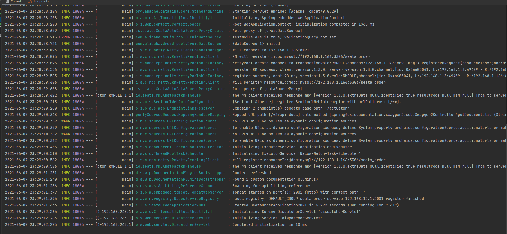


#### 2、新建库存工程 Storage-Module


>   新建库存微服务： seata-storage-service2002


##### 1、改 POM

-    POM 的引用参考 订单微服务 2001，两者 一样

##### 2、编写 YML

-   YML 大体也一样，注意以下几点
-   修改 微服务名称
-   修改 MySQL 链接、因为使用的 db 库不一样，记得修改

##### 3、编写 entities

-   CommonResult 的 编写和 2001 一样，这里省略，也可以提取成公用的工程，这里省略
-   以下是 Storage 实体类的代码

```java
package com.lee.springcloud.entities;

import lombok.AllArgsConstructor;
import lombok.Data;
import lombok.NoArgsConstructor;

import java.io.Serializable;

@Data
@NoArgsConstructor
@AllArgsConstructor
public class Storage implements Serializable {
    // ID
    private Long id;
    // 产品ID
    private Long productId;
    // 总库存
    private Integer total;
    // 已用库存
    private Integer used;
    // 剩余库存
    private Integer residue;
}
```


##### 4、Dao 接口和实现


###### 1、Dao 层接口

```java
package com.lee.springcloud.dao;

import org.apache.ibatis.annotations.Mapper;
import org.apache.ibatis.annotations.Param;

@Mapper
public interface StorageDao {

    /**
     * 扣减库存
     * @param productId
     * @param count
     */
    void decreaseStock(@Param("productId") Long productId, @Param("count") Integer count);
}
```

###### 2、Dao 层对应的 Mapper.xml

```xml
<?xml version="1.0" encoding="UTF-8" ?>
<!DOCTYPE mapper
        PUBLIC "-//mybatis.org//DTD Mapper 3.0//EN"
        "http://mybatis.org/dtd/mybatis-3-mapper.dtd">

<mapper namespace="com.lee.springcloud.dao.StorageDao">

    <resultMap id="BaseResultMap" type="com.lee.springcloud.entities.Storage">
        <id column="id" property="id" jdbcType="BIGINT"/>
        <result column="product_id" property="productId" jdbcType="BIGINT"/>
        <result column="total" property="total" jdbcType="INTEGER"/>
        <result column="used" property="used" jdbcType="INTEGER"/>
        <result column="residue" property="residue" jdbcType="INTEGER"/>
    </resultMap>

    <update id="decreaseStock">
         update t_storage set used = used + #{count}, residue = residue - #{count} where product_id = #{productId}
    </update>
</mapper>
```


##### 5、Service 接口和实现

###### 1、接口如下

```java
package com.lee.springcloud.service;

public interface StorageService {

    /**
     * 扣减库存
     * @param productId
     * @param count
     */
    void decreaseStock(Long productId, Integer count);
}
```

###### 2、实现类如下

```java
package com.lee.springcloud.service.impl;

import com.lee.springcloud.dao.StorageDao;
import com.lee.springcloud.service.StorageService;
import lombok.extern.slf4j.Slf4j;
import org.springframework.stereotype.Service;

import javax.annotation.Resource;

@Slf4j
@Service
public class StorageServiceImpl implements StorageService {

    @Resource
    private StorageDao storageDao;

    @Override
    public void decreaseStock(Long productId, Integer count) {
        storageDao.decreaseStock(productId, count);
        log.info(" ------------------> 库存微服务 => 扣减库存已经完成");
    }
}
```


##### 6、编写 Controller

```java
package com.lee.springcloud.controller;

import com.lee.springcloud.entities.CommonResult;
import com.lee.springcloud.service.StorageService;
import lombok.extern.slf4j.Slf4j;
import org.springframework.web.bind.annotation.PostMapping;
import org.springframework.web.bind.annotation.RequestParam;
import org.springframework.web.bind.annotation.RestController;

import javax.annotation.Resource;

@Slf4j
@RestController
public class StorageController {

    @Resource
    private StorageService storageService;

    /**
     * 根据产品减库存操作
     *
     * @param productId 产品 ID
     * @param count     数量
     * @return
     */
    @PostMapping(value = "/storage/decreaseStock")
    public CommonResult decreaseStock(@RequestParam("productId") Long productId, @RequestParam("count") Integer count) {
        storageService.decreaseStock(productId, count);
        return new CommonResult(200, "扣减库存数量：" + count + " 已经完成");
    }
}
```


##### 7、Config配置类

-   Swagger 配置类 SwaggerConfig.java
-   数据源代理类：DataSourceProxyConfig.java

##### 8、编写主启动类

-   参考订单服务 2001 ，一样，不多介绍


#### 3、新建账户工程 Account-Module


>   新建库存微服务： seata-account-service2003


##### 1、改 POM

-    POM 的引用参考 订单微服务 2001，两者 一样

##### 2、编写 YML

-   YML 大体也一样，注意以下几点
-   修改 微服务名称
-   修改 MySQL 链接、因为使用的 db 库不一样，记得修改

##### 3、编写 entities

-   CommonResult 的 编写和 2001 一样，这里省略，也可以提取成公用的工程，这里省略
-   以下是 Account 实体类的代码

```java
package com.lee.springcloud.entities;

import lombok.AllArgsConstructor;
import lombok.Data;
import lombok.NoArgsConstructor;

import java.io.Serializable;
import java.math.BigDecimal;

@Data
@NoArgsConstructor
@AllArgsConstructor
public class Account implements Serializable {

    // ID
    private Integer id;
    // 用户ID
    private Long userId;
    // 总额度
    private BigDecimal totalMoney;
    // 已用额度
    private BigDecimal usedMoney;
    // 剩余可用额度
    private BigDecimal residueMoney;
}
```


##### 4、Dao 接口和实现


###### 1、Dao 层接口

```java
package com.lee.springcloud.dao;

import org.apache.ibatis.annotations.Mapper;
import org.apache.ibatis.annotations.Param;
import java.math.BigDecimal;

@Mapper
public interface AccountDao {

    void decreaseMoney(@Param("userId") Long userId, @Param("money") BigDecimal money);
}
```

###### 2、Dao 层对应的Mapper.xml

```xml
<?xml version="1.0" encoding="UTF-8" ?>
<!DOCTYPE mapper
        PUBLIC "-//mybatis.org//DTD Mapper 3.0//EN"
        "http://mybatis.org/dtd/mybatis-3-mapper.dtd">

<mapper namespace="com.lee.springcloud.dao.AccountDao">

    <resultMap id="BaseResultMap" type="com.lee.springcloud.entities.Account">
        <id column="id" property="id" jdbcType="BIGINT"/>
        <result column="user_id" property="userId" jdbcType="BIGINT"/>
        <result column="total" property="totalMoney" jdbcType="DECIMAL"/>
        <result column="used" property="usedMoney" jdbcType="DECIMAL"/>
        <result column="residue" property="residueMoney" jdbcType="DECIMAL"/>
    </resultMap>

    <update id="decreaseMoney">
         update t_account set used = used + #{money}, residue = residue - #{money} where user_id = #{userId}
    </update>
</mapper>
```


##### 5、Service 接口和实现

###### 1、接口如下

```java
package com.lee.springcloud.service;

import java.math.BigDecimal;

public interface AccountService {

    void decreaseMoney(Long userId, BigDecimal money);
}
```

###### 2、实现如下

```java
package com.lee.springcloud.service.impl;

import com.lee.springcloud.dao.AccountDao;
import com.lee.springcloud.service.AccountService;
import lombok.extern.slf4j.Slf4j;
import org.springframework.stereotype.Service;

import javax.annotation.Resource;
import java.math.BigDecimal;

@Slf4j
@Service
public class AccountServiceImpl implements AccountService {

    @Resource
    private AccountDao accountDao;

    @Override
    public void decreaseMoney(Long userId, BigDecimal money) {
        accountDao.decreaseMoney(userId, money);
        log.info(" ------------------> 账户微服务 => 扣减余额已经完成");
    }
}
```


##### 6、编写 Controller

```java
package com.lee.springcloud.controller;

import com.lee.springcloud.entities.CommonResult;
import com.lee.springcloud.service.AccountService;
import lombok.extern.slf4j.Slf4j;
import org.springframework.web.bind.annotation.PostMapping;
import org.springframework.web.bind.annotation.RequestParam;
import org.springframework.web.bind.annotation.RestController;

import javax.annotation.Resource;
import java.math.BigDecimal;

@Slf4j
@RestController
public class AccountController {

    @Resource
    private AccountService accountService;

    @PostMapping("/account/decreaseMoney")
    public CommonResult decreaseMoney(@RequestParam("userId") Long userId, @RequestParam("money") BigDecimal money){
        accountService.decreaseMoney(userId, money);
        return new CommonResult(200, "扣减账户金额：" + money + " 已经完成");
    }
}
```


##### 7、Config配置类

-   Swagger 配置类 SwaggerConfig.java
-   数据源代理类：DataSourceProxyConfig.java

##### 8、编写主启动类

-   参考订单服务 2001 ，一样，不多介绍


#### 4、启动三个微服务模块进行测试

>   该步骤自测、这里省略


### 4、Seata-1.3.0 版本踩坑记录


#### 1、启动报错 ClassNotFoundException SeataAutoDataSourceProxyCreator


##### 1、问题错误原因分析：


详细错误信息如下：

```ABAP
Caused by: java.lang.NoClassDefFoundError: io/seata/spring/annotation/datasource/SeataAutoDataSourceProxyCreator
	at java.lang.Class.getDeclaredMethods0(Native Method) ~[na:1.8.0_271]
	at java.lang.Class.privateGetDeclaredMethods(Class.java:2701) ~[na:1.8.0_271]
	at java.lang.Class.getDeclaredMethods(Class.java:1975) ~[na:1.8.0_271]
	at org.springframework.util.ReflectionUtils.getDeclaredMethods(ReflectionUtils.java:463) ~[spring-core-5.2.2.RELEASE.jar:5.2.2.RELEASE]
	... 21 common frames omitted
Caused by: java.lang.ClassNotFoundException: io.seata.spring.annotation.datasource.SeataAutoDataSourceProxyCreator
	at java.net.URLClassLoader.findClass(URLClassLoader.java:382) ~[na:1.8.0_271]
	at java.lang.ClassLoader.loadClass(ClassLoader.java:418) ~[na:1.8.0_271]
	at sun.misc.Launcher$AppClassLoader.loadClass(Launcher.java:355) ~[na:1.8.0_271]
	at java.lang.ClassLoader.loadClass(ClassLoader.java:351) ~[na:1.8.0_271]
	... 25 common frames omitted
```


>   问题分析：因为 seata-all 版本不对

官网推荐 POM 文件

```xml
<dependency>
    <groupId>io.seata</groupId>
    <artifactId>seata-spring-boot-starter</artifactId>
    <version>1.3.0</version>
</dependency>
<dependency>
    <groupId>com.alibaba.cloud</groupId>
    <artifactId>spring-cloud-starter-alibaba-seata</artifactId>
    <version>2.2.1.RELEASE</version>
    <exclusions>
        <exclusion>
            <groupId>io.seata</groupId>
            <artifactId>seata-spring-boot-starter</artifactId>
        </exclusion>
    </exclusions>
</dependency>
```


但是由于 seata-spring-boot-starter 所包含的 seata-all 并不是对应最新的 1.3 版本，导致 ClassNotFoundException


##### 2、解决方案


>   排除掉 seata-spring-boot-starter 依赖的旧版本 seata-all，自己重新添加需要的 seata-all 版本

```xml
<dependency>
    <groupId>com.alibaba.cloud</groupId>
    <artifactId>spring-cloud-starter-alibaba-seata</artifactId>
    <version>2.2.1.RELEASE</version>
    <exclusions>
        <exclusion>
            <groupId>io.seata</groupId>
            <artifactId>seata-spring-boot-starter</artifactId>
        </exclusion>
    </exclusions>
</dependency>

<dependency>
    <groupId>io.seata</groupId>
    <artifactId>seata-spring-boot-starter</artifactId>
    <version>1.3.0</version>
    <exclusions>
        <exclusion>
            <groupId>io.seata</groupId>
            <artifactId>seata-all</artifactId>
        </exclusion>
    </exclusions>
</dependency>

<dependency>
    <groupId>io.seata</groupId>
    <artifactId>seata-all</artifactId>
    <version>1.3.0</version>
</dependency>
```


#### 2、启动报错 Could not resolve placeholder 'mybatis.mapperLocations'


##### 1、报错原因分析


详细报错信息如下：

>   Could not resolve placeholder 'mybatis.mapperLocations' in value "${mybatis.mapperLocations}"

```ABAP
Caused by: java.lang.IllegalArgumentException: Could not resolve placeholder 'mybatis.mapperLocations' in value "${mybatis.mapperLocations}"
	at org.springframework.util.PropertyPlaceholderHelper.parseStringValue(PropertyPlaceholderHelper.java:178) ~[spring-core-5.2.2.RELEASE.jar:5.2.2.RELEASE]
	at org.springframework.util.PropertyPlaceholderHelper.replacePlaceholders(PropertyPlaceholderHelper.java:124) ~[spring-core-5.2.2.RELEASE.jar:5.2.2.RELEASE]
	at org.springframework.core.env.AbstractPropertyResolver.doResolvePlaceholders(AbstractPropertyResolver.java:236) ~[spring-core-5.2.2.RELEASE.jar:5.2.2.RELEASE]
	at org.springframework.core.env.AbstractPropertyResolver.resolveRequiredPlaceholders(AbstractPropertyResolver.java:210) ~[spring-core-5.2.2.RELEASE.jar:5.2.2.RELEASE]
	at org.springframework.context.support.PropertySourcesPlaceholderConfigurer.lambda$processProperties$0(PropertySourcesPlaceholderConfigurer.java:175) ~[spring-context-5.2.2.RELEASE.jar:5.2.2.RELEASE]
	at org.springframework.beans.factory.support.AbstractBeanFactory.resolveEmbeddedValue(AbstractBeanFactory.java:908) ~[spring-beans-5.2.2.RELEASE.jar:5.2.2.RELEASE]
	at org.springframework.beans.factory.support.DefaultListableBeanFactory.doResolveDependency(DefaultListableBeanFactory.java:1228) ~[spring-beans-5.2.2.RELEASE.jar:5.2.2.RELEASE]
	at org.springframework.beans.factory.support.DefaultListableBeanFactory.resolveDependency(DefaultListableBeanFactory.java:1207) ~[spring-beans-5.2.2.RELEASE.jar:5.2.2.RELEASE]
	at org.springframework.beans.factory.annotation.AutowiredAnnotationBeanPostProcessor$AutowiredFieldElement.inject(AutowiredAnnotationBeanPostProcessor.java:640) ~[spring-beans-5.2.2.RELEASE.jar:5.2.2.RELEASE]
	at org.springframework.beans.factory.annotation.InjectionMetadata.inject(InjectionMetadata.java:116) ~[spring-beans-5.2.2.RELEASE.jar:5.2.2.RELEASE]
	at org.springframework.beans.factory.annotation.AutowiredAnnotationBeanPostProcessor.postProcessProperties(AutowiredAnnotationBeanPostProcessor.java:399) ~[spring-beans-5.2.2.RELEASE.jar:5.2.2.RELEASE]
	... 140 common frames omitted
```


查看 DataSourceProxyConfig 数据源代理配置类，原来的写法如下：

```java
@Value("${mybatis.mapperLocations}")
private String mapperLocations;
```


##### 2、解决方案


我们查看 yml 中的 mybatis 相关配置、将 mapper-locations 的值暂且先硬编码写入到 Value 中吧

```java
// 写死这个
@Value("classpath*:mapper/*.xml")
private String mapperLocations;
```


#### 3、代理 MyBatis 的数据源后实体类别名包解析失败


##### 1、报错原因分析


>   Could not resolve type alias 'Order'.  Cause: java.lang.ClassNotFoundException: Cannot find class: Order

```ABAP
Caused by: org.apache.ibatis.type.TypeException: Could not resolve type alias 'Order'.  Cause: java.lang.ClassNotFoundException: Cannot find class: Order
	at org.apache.ibatis.type.TypeAliasRegistry.resolveAlias(TypeAliasRegistry.java:120) ~[mybatis-3.4.4.jar:3.4.4]
	at org.apache.ibatis.builder.BaseBuilder.resolveAlias(BaseBuilder.java:149) ~[mybatis-3.4.4.jar:3.4.4]
	at org.apache.ibatis.builder.BaseBuilder.resolveClass(BaseBuilder.java:116) ~[mybatis-3.4.4.jar:3.4.4]
	... 80 common frames omitted
Caused by: java.lang.ClassNotFoundException: Cannot find class: Order
	at org.apache.ibatis.io.ClassLoaderWrapper.classForName(ClassLoaderWrapper.java:200) ~[mybatis-3.4.4.jar:3.4.4]
	at org.apache.ibatis.io.ClassLoaderWrapper.classForName(ClassLoaderWrapper.java:89) ~[mybatis-3.4.4.jar:3.4.4]
	at org.apache.ibatis.io.Resources.classForName(Resources.java:261) ~[mybatis-3.4.4.jar:3.4.4]
	at org.apache.ibatis.type.TypeAliasRegistry.resolveAlias(TypeAliasRegistry.java:116) ~[mybatis-3.4.4.jar:3.4.4]
	... 82 common frames omitted
```


##### 2、解决方案


检查 DataSourceProxyConfig 数据源代理类，我们发现代理对象需要重新设置 MyBatis 在 yml 中的配置规则

>   我们增加别名的字段解析，需要在 sqlSessionFactoryBean() 方法中添加设置别名代码
>
>   sqlSessionBean.setTypeAliasesPackage(typeAliasesPackage);

```java
@Value("com.lee.springcloud.entities")
private String typeAliasesPackage;

@Bean
public SqlSessionFactory sqlSessionFactoryBean(DataSourceProxy dataSourceProxy) throws Exception {
    SqlSessionFactoryBean sqlSessionBean = new SqlSessionFactoryBean();
    sqlSessionBean.setDataSource(dataSourceProxy);
    //加载 MyBatis 的 mapper.xml 配置
    sqlSessionBean.setMapperLocations(new PathMatchingResourcePatternResolver().getResources(mapperLocations));
    sqlSessionBean.setTransactionFactory(new SpringManagedTransactionFactory());
    //设置别名
    sqlSessionBean.setTypeAliasesPackage(typeAliasesPackage);
    return sqlSessionBean.getObject();
}
```


### 5、Seata 之 @GlobalTransactional 验证


#### 1、分布式事务问题再现


>   无疑：我们来分析订单微服务 2001 创建订单的业务代码
>
>   -   创建订单四个步骤，其中还调用了远程的另外两个服务，如果其中有一个接口调用失败抛出了异常，那么肯定先执行的代码已经对数据做了修改，那么数据肯定是不一致的，下面我们来重现分布式事务问题


##### 1、修改账户服务 2003 的接口


-   在该服务的 Service 层的 扣减金额接口中，添加线程休眠 5 秒中
-   我们采用的 OpenFeign 远程调用，默认超时时间是 1 秒钟，超过这个时间就会报超时异常

```java
@Slf4j
@Service
public class AccountServiceImpl implements AccountService {

    @Resource
    private AccountDao accountDao;

    @Override
    public void decreaseMoney(Long userId, BigDecimal money) {
        // 线程休眠 5 秒
        try {
            Thread.sleep(5000);
        } catch (InterruptedException e) {
            e.printStackTrace();
        }
        accountDao.decreaseMoney(userId, money);
        log.info(" ------------------> 账户微服务 => 扣减余额已经完成");
    }
}
```


##### 2、我们先检查一下数据状态

-   订单表为空
-   库存和账户表也都是初始数据


##### 3、重启账户服务 2003 进行测试


>   我们传入以下参数进行测试
>
>   http://localhost:2001/order/createOrder?count=5&money=10&productId=1&userId=1

-   count = 5
-   money = 10
-   productId = 1
-   userId = 1


##### 4、测试发现问题如下


1、Swagger 接口返回 500

```asciiarmor
{
  "timestamp": "2021-06-09T06:22:38.535+0000",
  "status": 500,
  "error": "Internal Server Error",
  "message": "Read timed out executing POST http://seata-account-service/account/decreaseMoney?userId=1&money=10",
  "path": "/order/createOrder"
}
```


2、我们查看 订单服务后台 发现报错 Read timed out

>   这是 OpenFeign 的超时机制引发的异常，默认 1 秒，但是账户服务却休眠了 5 秒

```ABAP
java.net.SocketTimeoutException: Read timed out
	at java.net.SocketInputStream.socketRead0(Native Method) ~[na:1.8.0_271]
	at java.net.SocketInputStream.socketRead(SocketInputStream.java:116) ~[na:1.8.0_271]
	at java.net.SocketInputStream.read(SocketInputStream.java:171) ~[na:1.8.0_271]
	at java.net.SocketInputStream.read(SocketInputStream.java:141) ~[na:1.8.0_271]
	at com.alibaba.cloud.seata.feign.SeataFeignClient.execute(SeataFeignClient.java:59) ~[spring-cloud-starter-alibaba-seata-2.2.1.RELEASE.jar:2.2.1.RELEASE]
	at org.springframework.cloud.openfeign.ribbon.FeignLoadBalancer.execute(FeignLoadBalancer.java:93) ~[spring-cloud-openfeign-core-2.2.1.RELEASE.jar:2.2.1.RELEASE]
	at org.springframework.cloud.openfeign.ribbon.FeignLoadBalancer.execute(FeignLoadBalancer.java:56) ~[spring-cloud-openfeign-core-2.2.1.RELEASE.jar:2.2.1.RELEASE]
```


3、查看了 三个微服务后台日志，只有订单服务报错了，其它微服务正常执行

-   订单服务 2001 后台日志

```ABAP
------------------> 订单微服务：创建订单完成
------------------> 订单微服务 => 调用库存微服务 扣减库存已完成
2021-06-09 14:22:38.531 ERROR 17292 --- [io-2001-exec-10] o.a.c.c.C.[.[.[/].[dispatcherServlet]    : Servlet.service() for servlet [dispatcherServlet] in context with path [] threw exception [Request processing failed; nested exception is feign.RetryableException: Read timed out executing POST http://seata-account-service/account/decreaseMoney?userId=1&money=10] with root cause

java.net.SocketTimeoutException: Read timed out
	at java.net.SocketInputStream.socketRead0(Native Method) ~[na:1.8.0_271]
	at java.net.SocketInputStream.socketRead(SocketInputStream.java:116) ~[na:1.8.0_271]
	at java.net.SocketInputStream.read(SocketInputStream.java:171) ~[na:1.8.0_271]
	at java.net.SocketInputStream.read(SocketInputStream.java:141) ~[na:1.8.0_271]
	at java.io.BufferedInputStream.fill(BufferedInputStream.java:246) ~[na:1.8.0_271]
	..........
```

-   库存服务 2002 后台日志

```apl
INFO: log base dir is: C:\Users\19365\logs\csp\
INFO: log name use pid is: false
------------------> 库存微服务 => 扣减库存已经完成
```

-   账户服务 2003 后台日志

```apl
INFO: log base dir is: C:\Users\19365\logs\csp\
INFO: log name use pid is: false
------------------> 账户微服务 => 扣减余额已经完成
```

-   检查数据库数据状态

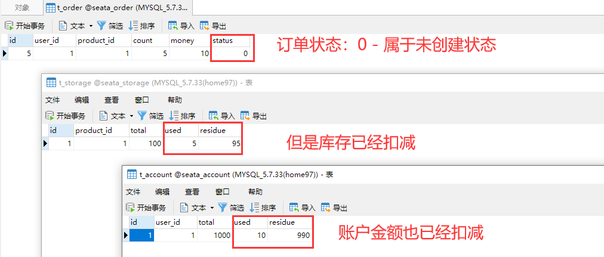


##### 5、数据不一致问题总结分析


先湖回顾一下创建订单流程：

1.  订单服务 向订单表插入一条订单
2.  订单服务 调用 库存服务 修改商品库存信息
3.  订单服务 调用 账户服务 修改账户余额信息
4.  订单服务 修改自己的订单状态为 1 - 已创建 

>   为什么订单状态为未创建模式？

-   答：因为订单服务的 Service 中做了四部操作，其中第三步修改余额信息时候在订单服务中抛出了超时异常，阻断了后续的代码执行，修改订单状态的代码没执行、所以订单属于未创建模式

>   为什么第3步：订单服务 调用 账户服务修改账户余额的时候发生异常了，账户余额还是能修改成功？

-   答：虽然订单服务因为 OpenFeign 抛出了超时异常阻断了订单服务的后续代码执行，但是本身账户服务的业务是没有发生异常的，只是休眠了5 秒，后续的执行账户余额代码还是 5 秒后能够执行

>   **还有个问题：因为 feign 的超时重试机制，账户余额还有可能被多次扣减**

-   所以为了解决以上的问题，我们继续往下看


#### 2、使用 Seata 进行分布式事务控制


>   我们可以利用 @GlobalTransactional 来控制分布式事务的提交和回滚
>
>   我们可以利用以下步骤进行修改


-   只需要在订单服务 2001 的业务类中加入 @GlobalTransactional

```java
    @Override
    /**
     * name：全局唯一就行了
     * rollbackFor = Exception.class ：只要发生了异常，统统进行回滚操作
     */
    @GlobalTransactional(name = "seata-create-order", rollbackFor = Exception.class)
    public boolean createOrder(Order order) {

        orderDao.createOrder(order);
        log.info(" ------------------> 订单微服务：创建订单完成");

        storageService.decreaseStock(order.getProductId(), order.getCount());
        log.info(" ------------------> 订单微服务 => 调用库存微服务 扣减库存已完成");

        accountService.decreaseMoney(order.getUserId(), order.getMoney());
        log.info(" ------------------> 订单微服务 => 调用账户微服务 扣减余额已完成");

        /**
         * 将订单状态修改为 1
         *   set status = 1 where status = #{status}
         */
        orderDao.updateOrderById(order.getUserId(), 0);
        log.info(" ------------------> 订单微服务 创建订单流程结束");

        return true;
    }
```


>   之后我们再次调用订单服务接口
>
>   http://localhost:2001/order/createOrder?count=5&money=10&productId=1&userId=1


虽然 Swagger 依旧返回 500，使用 URL 测试返回 Error Page 500，后台订单接口依旧抛出超时异常

```ABAP
{
  "timestamp": "2021-06-09T06:56:29.837+0000",
  "status": 500,
  "error": "Internal Server Error",
  "message": "Read timed out executing POST http://seata-storage-service/storage/decreaseStock?productId=1&count=5",
  "path": "/order/createOrder"
}
```

但是我们查看数据，发现已经回滚，数据并未产生实质性修改，而且 undo_log 已经产生对应回滚记录


>   此时：Seata 的回滚操作已经完成，我们已经掌握了 Seata 最基本的配置和使用，后续的进阶内容可以参考官网


## 45、完结篇 大厂面试之雪花算法（上）


### 1、为什么需要分布式全局唯一ID ?


在复杂分布式系统中，往往需要对大量的数据和消息进行唯一标识、如在美团点评的金融、支付、餐饮、酒店，猫眼电影等产品的系统中数据日渐增长，对数据分库分表后需要有一个雅一ID来标识一条数据或消息;特别一点的如订单、骑手、优惠券也都需要有唯一ID做标识。此时**一个能够生成全局唯一ID的系统是非常必要的**


### 2、ID 生成规则部分硬性要求


#### 1、程序算法方面


##### 1、全局唯一

-   不能出现重读的 ID 号、既然是唯一的标识、这是最基本的要求

##### 2、趋势递增

-   在MySQL的InnoDB引擎中使用的是聚集索引，由于多数RDBMS使用Btree的数据结构来存储索引数据，在主键的选择上面我们应该尽量使用有序的主键保证写入性能

##### 3、单调递增

-   保证下一个ID一定大于上一个ID，例如事务版本号、IM增量消息、排序等特殊需求

##### 4、信息安全

>   浑水公司在做空 瑞幸咖啡前、就是通过瑞星咖啡每日的订单号流水、来推测到瑞幸每日的销售情况的

-   如果ID是连续的，恶意用户的扒取工作就非常容易做了，直接按照顺序下载指定URL即可如果是订单号就更危险了书竞对可以直接知道我们一天的单量。所以在一些应用场景下，需要ID无规则不规则，让竞争对手不好猜

##### 5、含时间戳

-   这样就能够在开发中快速了解这个分布式id的生成时间


#### 2、服务硬件方面


##### 1、高可用

-   发一个获取分布式Ib的请求，服务器就要保证 99.999% 的情况下给我创建一个唯一分布式ID

##### 2、低延迟

-   发一个获取分布式ID的请求，服务器就要快，极速

##### 3、高OPS

-   假如并发一口气10万个创建分布式ID请求同时杀过来，服务器要顶的住且一下子成功创建10万


### 3、分布式唯一ID 一般通用方案


#### 1、UUID


##### 1、UUID 简单介绍

>   UUID (Universally Unique ldentifier) 的标准型式包含 32 个 16 进制数字，以连字号分为五段
>
>   形式为8-4-4-4-12的36个字符，示例：550e8400-e29b-41d4-a716-446655440000 

##### 2、UUID 优点

-   性能非常高:本地生成，没有网络消耗
-   如果只考虑唯一性，那是 OK 的


##### 3、UUID 缺点

-   UUID 是无序的，如数据库性能比较差，而且不能索引、索引要求有序


>   无序，无法预测他的生成顺序、不能生成递增有序的数字

-   首先分布式 id 一般都会作为主键，但是安装 mysql 官方推荐主键要尽量越短越好，UUID 每一个都很长，所以不是很推荐

>   UUID 作为主键时在特定的环境会存在一些问题

-   比如做 DB 主键的场景下，UUID 就非常不适用 MySQL 官方有明确的建议主键要尽量越短越好 36 个字符长度的UUID 不符合要求、除了聚集索引之外的所有索引都称为二级索引。在 InnoDB 中，次级索引中的每条记录都包含该行的主键列，以及为次要索引指定的列。InnoDB 使用这个主键值在聚集索引中搜索一行，如果主键很长，次级索引会占用更多的空间，所以有一个短的主键是有利的

>   索引、B+Tree 索引的分裂

-   既然分布式 id 是主键，然后主键是包含索引的，然后 mysql 的索引是通过b+树来实现的，每一次新的 UUID 数据的插入，为了查询的优化，都会对索引底层的 b+ 树进行修改，因为 UUID 数据是无序的，所以每一次 UUID 数据的插入都会对主键地城的 b+ 树进行很大的修改，这一点很不好。插入完全无序，不但会导致一些中间节点产生分裂，也会白白创造出很多不饱和的节点，这样大大降低了数据库插入的性能

>   UUID 对于 5 个分布式 ID 的硬性要求只满足一个，那就是 唯一性，其它均不满足


#### 2、数组库自增主键


##### 1、MySQL 自增主键介绍


>   在分布式里面，数据库的自增 ID 机制的主要原因是：数据库自增 ID 和 MySQL 数据库的 Replace into 实现的
>
>   这里的 replace into 跟 insert 功能类似、不同点在于 replace into 首先尝试插入数据列表中，如果发现表中已经有此行数据（根据主键或唯一索引判断）则先删除，再插入否则直接插入新数据
>
>   **Replace Info 的含义：插入一套记录、如果表中唯一索引的值遇到冲突、则替换老数据**


##### 2、那适合做分布式 ID 吗？


不太合适、系统水平扩展比较困难，比如定义好了步长和机器台数之后，如果要添加机器该怎么做?假设现在只有一台机器发号是1.2.3.4.5 (步长是1)，这个时候需要扩容机器一台。可以这样做:把第二台机器的初始值设置待比第一台超过很多，貌似还好，现在想象一下如果我们线上有 10 台机器，这个时候要扩容该怎么做?简直是噩梦。所以系统水平扩展方案复杂难以实现

而且数据库压力还是很大，每次获取ID都得读写一次数据库，非常影响性能，不符合分布式ID里面的延迟低和要高QPS的规则 (在高并发下、如果都去数据库里面获取id，那是非常影响性能的)


#### 3、基于 Redis 生成全局 ID 策略


##### 1、Redis 生成全局 ID 介绍


>   因为 Redis (最新版支持多线程了) 是单线程的、天生保证原子性，可以使用原子操作 INCR 和 INCRBY 来实现


##### 2、Redis 集群分布式


>   注意：在 Redis 集群情况下，同样和 MySQL 一样需要设置不同的增长步长，同时 key 一定要设置有效期

可以使用 Redis 集群来获取更高的吞吐量、假如一个集群中有 5 台 Redis、可以初始化每台 Redis 的值分别是 1, 2, 3, 4, 5,  然后步长都是 5，那么各个 Redis 生成的 ID 如下：

-   A：1, 6, 11, 16, 21
-   B：2, 7, 12, 17, 22
-   C：3, 8, 13, 18 ,23
-   D：4, 9, 14, 19, 24
-   E：5, 10, 15, 20, 25

>   缺点：配置啰嗦、维护麻烦、5 台 Redis 都需要维护


**上面说了那么多，各有各的优缺点和痛点、引入我们今天的主角了 Snowflake、我们继续往下看**


## 46、完结篇 大厂面试之雪花算法（下）


### 1、Snowflake 雪花算法介绍


>   源自 Twitter 的分布式自增 ID 算法 Snowflake、一般工作中推荐使用雪花算法，以上分析的分布式全局唯一ID要么实现起来过于麻烦、维护繁琐，要么生成过于简单，只适用于单机环境
>
>   Github：https://github.com/twitter-archive/snowflake

而 Twitter 的 snowflake 解决了这种需求，最初 Twitter 把存储系统从 MySQL 迁移到 Cassandra (由 Facebook 开发一套开源分布式 NoSQL 数据库系统) 因为 Cassandra 没有顺序 ID 生成机制，所以开发了这样一套全局唯一 ID 生成服务


Twitter 的分布式雪花算法 snowflake ，经测试 snowflake 每秒能够产生 26 万个自增可排序的 ID

-   twitter 的 snowflake 生成 ID 能够按照时间有序生成
-   snowflake 算法生成id的结果是一个 64bit 大小的整数，为一个 Long 型(转换成字符串后长度最多19)
-   分布式系统内不会产生ID碰撞（由 datacenter 和 workerld 作区分）并且效率较高


分布式系统中，有一些需要使用全局唯一 ID 的场景，生成 ID 的基本要求

-   在分布式的环境下必须全局且唯一
-   一般都需要单调递增,因为一般唯一 ID 都会存到数据库、而 Innodb 的特性就是将内容存储在主键索引树上的叶子节点,而且是从左往右, 递增的、所以考虑到数据库性能, 一般生成的 id 也最好是单调递增。为了防止 ID 冲突可以使用 36 位的 UUID.
-   可能还会需要无规则 , 因为如果使用唯一 ID 作为订单号这种,为了不然别人知道一天的订单量是多少,  就需要这个规则


### 2、Snowflake  雪花算法核心组成


号码段解析

**1bit 符号位**：

>   符号位永远不用，因为二进制中最高位是符号位，1 表示负数，O 表示正数。生成的 id 一般都是用整数，所以最高位固定为0

**41bit 时间戳位**：

>   用来记录时间戳，毫秒级、时间范围、从 1970 年开始，用到 2039-09-07 年、这个怎么计算？
>
>   将 11 位的二进制 转换为 10 进制就得到了最大能表示的时间戳，将时间戳转为 Date 类型就是 2039 - 09 - 07
>
>   -   41 位可以表示 2 ^ {41} - 1 个数字
>   -   如果只用来表示正整数（计算机中正数包含0），可以表示的数值范围是: 0 至 2 ^ {41} - 1，减 1 是因为可表示的数值范围是从 0 开始算的，而不是 1
>   -   也就是说 41 位可以表示 2 ^ {41} - 1 个毫秒的值，转化成单位年则是(2^{41}-1)/(1000×60×60×24×365) = 69年

**10bit 工作机器id**：

>   用来记录工作机器 id、1024  个节点的计算方式其实和 时间的一样
>
>   -   可以部署在 2^{10} = 1024 个节点，包括 5 位 datacenterld 和 5 位 workerld
>   -   5 位 (bit) 可以表示的最大正整数是 2 ^ {5} - 1 = 31、即可以用 0、1、2、3、.….1 这 32 个数字，来表示不同的 datecenterld 或 workerld

**12bit 序列号位**：

>   序列号，用来记录同毫秒内产生的不同 id
>
>   12 位 (bit）可以表示的最大正整数是 2 ^ {12} - 1 = 4095，即可以用0、1、2、3、..4094 这 4095 个数字，来表示同一机器同一时间截(毫秒)内产生的 4095 个 ID 序号


**Snowflake 可以保证**

-   所有生成的 ID 按时间趋势递增
-   整个分布式系统内不会产生重复ID（因为由 datacenterId 和 workerId 来做区分）


### 3、Snowflake Java 版代码实现


```java
public class SnowflakeIdWorker {
    /**
     * 工作机器ID(0~31)
     */
    private long workerId;
    /**
     * 数据中心ID(0~31)
     */
    private long datacenterId;
    /**
     * 毫秒内序列(0~4095)
     */
    private long sequence = 0L;
    /**
     * 上次生成ID的时间截
     */
    private long lastTimestamp = -1L;
    /**
     * 开始时间截 (2015-01-01)
     */
    private final long twepoch = 1420041600000L;
    /**
     * 机器id所占的位数
     */
    private final long workerIdBits = 5L;
    /**
     * 数据标识id所占的位数
     */
    private final long datacenterIdBits = 5L;
    /**
     * 支持的最大机器id，结果是31 (这个移位算法可以很快的计算出几位二进制数所能表示的最大十进制数)
     */
    private final long maxWorkerId = -1L ^ (-1L << workerIdBits);
    /**
     * 支持的最大数据标识id，结果是31
     */
    private final long maxDatacenterId = -1L ^ (-1L << datacenterIdBits);
    /**
     * 序列在id中占的位数
     */
    private final long sequenceBits = 12L;
    /**
     * 机器ID向左移12位
     */
    private final long workerIdShift = sequenceBits;
    /**
     * 数据标识id向左移17位(12+5)
     */
    private final long datacenterIdShift = sequenceBits + workerIdBits;
    /**
     * 时间截向左移22位(5+5+12)
     */
    private final long timestampLeftShift = sequenceBits + workerIdBits + datacenterIdBits;
    /**
     * 生成序列的掩码，这里为4095 (0b111111111111=0xfff=4095)
     */
    private final long sequenceMask = -1L ^ (-1L << sequenceBits);
    /**
     * 构造函数
     * @param workerId     工作ID (0~31)
     * @param datacenterId 数据中心ID (0~31)
     */
    public SnowflakeIdWorker(long workerId, long datacenterId) {
        if (workerId > maxWorkerId || workerId < 0) {
            throw new IllegalArgumentException(String.format("worker Id can't be greater than %d or less than 0", maxWorkerId));
        }
        if (datacenterId > maxDatacenterId || datacenterId < 0) {
            throw new IllegalArgumentException(String.format("datacenter Id can't be greater than %d or less than 0", maxDatacenterId));
        }
        this.workerId = workerId;
        this.datacenterId = datacenterId;
    }
    /**
     * 获得下一个ID (该方法是线程安全的)
     * @return SnowflakeId
     */
    public synchronized long nextId() {
        long timestamp = timeGen();
        // 如果当前时间小于上一次ID生成的时间戳，说明系统时钟回退过这个时候应当抛出异常
        if (timestamp < lastTimestamp) {
            throw new RuntimeException(
                    String.format("Clock moved backwards.  Refusing to generate id for %d milliseconds", lastTimestamp - timestamp));
        }
        // 如果是同一时间生成的，则进行毫秒内序列
        if (lastTimestamp == timestamp) {
            sequence = (sequence + 1) & sequenceMask;
            // 毫秒内序列溢出
            if (sequence == 0) {
                //阻塞到下一个毫秒,获得新的时间戳
                timestamp = tilNextMillis(lastTimestamp);
            }
        }
        // 时间戳改变，毫秒内序列重置
        else {
            sequence = 0L;
        }
        // 上次生成ID的时间截
        lastTimestamp = timestamp;
        // 移位并通过或运算拼到一起组成64位的ID
        return ((timestamp - twepoch) << timestampLeftShift) //
                | (datacenterId << datacenterIdShift) //
                | (workerId << workerIdShift) //
                | sequence;
    }
    /**
     * 阻塞到下一个毫秒，直到获得新的时间戳
     * @param lastTimestamp 上次生成ID的时间截
     * @return 当前时间戳
     */
    protected long tilNextMillis(long lastTimestamp) {
        long timestamp = timeGen();
        while (timestamp <= lastTimestamp) {
            timestamp = timeGen();
        }
        return timestamp;
    }
    /**
     * 返回以毫秒为单位的当前时间
     * @return 当前时间(毫秒)
     */
    protected long timeGen() {
        return System.currentTimeMillis();
    }

    public static void main(String[] args) throws InterruptedException {
        SnowflakeIdWorker idWorker = new SnowflakeIdWorker(0, 0);
        for (int i = 0; i < 10; i++) {
            long id = idWorker.nextId();
            Thread.sleep(1);
            System.out.println(id);
        }
    }
}
```


### 4、Snowflake 整合工程用法


#### 1、糊涂工具包


>   Github官网：https://github.com/dromara/hutool
>
>   hutool 官方中文文档：https://www.hutool.cn/docs/#/


引入 Maven 依赖-以下是导入了 hutool 所有的工具

```xml
<dependency>
    <groupId>cn.hutool</groupId>
    <artifactId>hutool-all</artifactId>
    <version>5.6.7</version>
</dependency>
```


#### 2、SpringBoot 整合 Snowflake


1、我们引入以下 依赖

>   其实以下依赖还是 hutool 工具包里的只不过  hutool-captcha 里面包含了雪花算法

```xml
<dependency>
    <groupId>cn.hutool</groupId>
    <artifactId>hutool-captcha</artifactId>
    <version>4.6.8</version>
</dependency>
```


2、代码中调用 API 即可

-   Controller 模块

```java
@Slf4j
@RestController
public class OrderController {

    @Resource
    private OrderService orderService;

    @PostMapping("/snowflak")
    public String index(){
        return orderService.getIDBySnowFlake();
    }
}
```

-   Service 模块

```java
@Service
public class OrderServiceImpl implements OrderService {

    @Resource
    private TwittorSnowflake idGenerator;

    @Override
    public String getIDBySnowFlake() {
        return idGenerator.snowflakeId();
    }
}
```

-   IdTwittorSnowflake 类的实现

```java
@Slf4j
@Component
public class TwittorSnowflake {
    //工作 ID
    private long workerId = 0;
    // 数据中心 ID
    private long datacenterId = 1;
    
    private Snowflake snowflake = IdUtil.createSnowflake(workerId, datacenterId);
    
    /**
     * import javax.annotation.PostConstruct
     */
    @PostConstruct
    public void init(){
        try{
            
            workerId = NetUtil.ipv4ToLong(NetUtil.getLocalhostStr());
            log.info("Current workerID：", workerId);
            
        }catch(Exception ex){
            ex.printStackTrace();
            log.error("Get Current Error：", ex);
            workerId = NetUtil.getLocalhostStr().hashCode();
        }
    }
    
    public synchronized long snowflakeId(){
        return snowflake.nextId();
    }
    
    public synchronized long snowflakeId(long workerId, long datacenterId){
        Snowflake snowflake = IdUtil.createSnowflake(workerId, datacenterId);
        return snowflake.nextId();
    }
}
```


### 5、Snowflake 雪花算法优缺点


#### 1、Snowflake 优点


>   毫秒数在高位，自增序列在低位，整个 ID 都是趋势递增的
>
>   不依赖数据库等第三方系统，以服务的方式部署，稳定性更高，生成 ID 的性能也是非常高的。可以根据自身业务特性分配 bit 位，非常灵活


#### 2、Snowflake 缺点


>   依赖机器时钟，如果机器时钟回拨，会导致重复ID生成
>
>   在单机上是递增的，但是由于设计到分布式环境，每台机器上的时钟不可能完全同步，有时候会出现不是全局递增的情况(此缺点可以认为无所谓，一般分布式 ID 只要求趋势递增，并不会严格要求递增，90% 的需求都只要求趋势递增)

**如果要求绝对严格，不允许时钟回拨问题，可以继续往下看**


### 6、Snowflake 改进版或替代品


#### 1、UidGenerator 


UidGenerator 是 百度公司 基于 Java实现的, 基于 [Snowflake ](https://github.com/twitter/snowflake)算法的唯一ID生成器。UidGenerator以组件形式工作在应用项目中, 支持自定义workerId位数和初始化策略, 从而适用于[docker](https://www.docker.com/)等虚拟化环境下实例自动重启、漂移等场景。 在实现上, UidGenerator通过借用未来时间来解决sequence天然存在的并发限制; 采用RingBuffer来缓存已生成的UID, 并行化UID的生产和消费, 同时对CacheLine补齐，避免了由RingBuffer带来的硬件级「伪共享」问题. 最终单机QPS可达600万

>   详细参考：[https://github.com/baidu/uid-generator/blob/master/README.zh_cn.md](https://link.zhihu.com/?target=https%3A//github.com/baidu/uid-generator/blob/master/README.zh_cn.md)


#### 2、Leaf 


##### 1、Leaf 介绍

>   详细参考：[https://tech.meituan.com/MT_Leaf.html](https://link.zhihu.com/?target=https%3A//tech.meituan.com/MT_Leaf.html)

Leaf由美团开发，Leaf同时支持号段模式和 Snowflake 算法模式，可以切换使用。

Leaf-segment方案：

-   通过 proxy server 批量获取分布式ID，每次获取一个 segment 号段，用完之后再去数据库获取新的号段，大大的减轻数据库的压力
-   各个业务不同的发号需求用 biz_tag 字段来区分，每个 biz-tag 的 ID 获取相互隔离，互不影响。如果以后有性能需求需要对数据库扩容，只需要对 biz_tag 分库分表就行

建表语句如下：

```sql
DROP TABLE IF EXISTS `leaf_alloc`; 

CREATE TABLE `leaf_alloc` (  
    `biz_tag` varchar(128)  NOT NULL DEFAULT '' COMMENT '业务key,用来区分业务',  
    `max_id` bigint(20) NOT NULL DEFAULT '1' COMMENT '当前已经分配了的最大id',  
    `step` int(11) NOT NULL COMMENT '初始步长，也是动态调整的最小步长',  
    `description` varchar(256)  DEFAULT NULL COMMENT '业务key的描述',  
    `update_time` timestamp NOT NULL DEFAULT CURRENT_TIMESTAMP ON UPDATE CURRENT_TIMESTAMP COMMENT '数据库维护的更新时间',  
    PRIMARY KEY (`biz_tag`)
) ENGINE=InnoDB;
```


##### 2、Leaf 架构图


test_tag 在第一台 Leaf 机器上是 1~1000 的号段，当这个号段用完时，会去加载另一个长度为step=1000的号段，假设另外两台号段都没有更新，这个时候第一台机器新加载的号段就应该是3001~4000。同时数据库对应的biz_tag这条数据的max_id会从3000被更新成4000

>   更新号段的SQL语句如下：

```sql
Begin   
UPDATE table SET max_id = max_id + step WHERE biz_tag = xxx;
SELECT tag, max_id, step FROM table WHERE biz_tag = xxxCommit;
```


##### 3、Leaf 优缺点介绍


优点：

-   ​    支持线性扩展，性能能够支撑大多数业务场景。
-   ​    ID是趋势递增的8byte的64位数字。
-   ​    容灾性高：即使DB宕机，短时间内Leaf仍能正常对外提供服务。
-   ​    自定义max_id大小，方便业务以原有ID迁移过来。

缺点：

-   ​    ID不够随机，能够泄露发号数量的信息，不太安全。
-   ​    TP999更新号段，数据库IO可能导致用户线程阻塞。
-   ​    DB宕机会造成整个系统不可用。


#### 6、TinyID


>   Tinyid 是滴滴公司用 Java 开发的一款分布式 ID 生成系统，基于数据库号段模式实现，关于这个算法与美团 Leaf-segment 如出一辙。Tinyid 提供了 java-client(sdk) 使 id 生成本地化，获得了更好的性能与可用性

TinyID的特性：

​    http方式访问，性能取决于http server的能力，网络传输速度。

​    java-client方式，本地生成，号段长度(step)越长，QPS越大
